# Agent 开发框架选型决策指南

> **文档定位**:本文档是 `6Agent Framework` 系列的**选型决策总结文档**。在已有 [85LangChain框架核心组件详解.md](85LangChain框架核心组件详解.md)、[87LangGraph框架诞生背景与核心定位深度解析.md](87LangGraph框架诞生背景与核心定位深度解析.md)、[89AutoGen框架架构深度解析.md](89AutoGen框架架构深度解析.md)、[90CrewAI框架核心设计理念深度解析.md](90CrewAI框架核心设计理念深度解析.md) 等单框架深度解析的基础上,本文从**选型决策视角**出发,综合功能完整性、技术栈兼容性、社区活跃度、文档质量、性能表现、可扩展性、学习曲线七大维度,对主流 Agent 框架进行横向对比,并结合核心功能实现差异与团队/项目约束,给出不同场景下的选型推荐。

---

## 目录

- [一、引言:为什么需要框架选型指南](#一引言为什么需要框架选型指南)
- [二、主流 Agent 框架全景概览](#二主流-agent-框架全景概览)
- [三、七大维度横向对比](#三七大维度横向对比)
- [四、核心功能实现方式对比](#四核心功能实现方式对比)
- [五、团队技术背景与项目约束分析](#五团队技术背景与项目约束分析)
- [六、选型决策流程](#六选型决策流程)
- [七、典型场景选型推荐](#七典型场景选型推荐)
- [八、混合框架组合策略](#八混合框架组合策略)
- [九、选型常见误区](#九选型常见误区)
- [十、总结与最佳实践](#十总结与最佳实践)

---

## 一、引言:为什么需要框架选型指南

### 1.1 框架选型的核心挑战

当前 Agent 开发框架百花齐放,LangChain、LangGraph、AutoGen、CrewAI、MetaGPT、LlamaIndex 等各具特色。**选错框架**会导致:

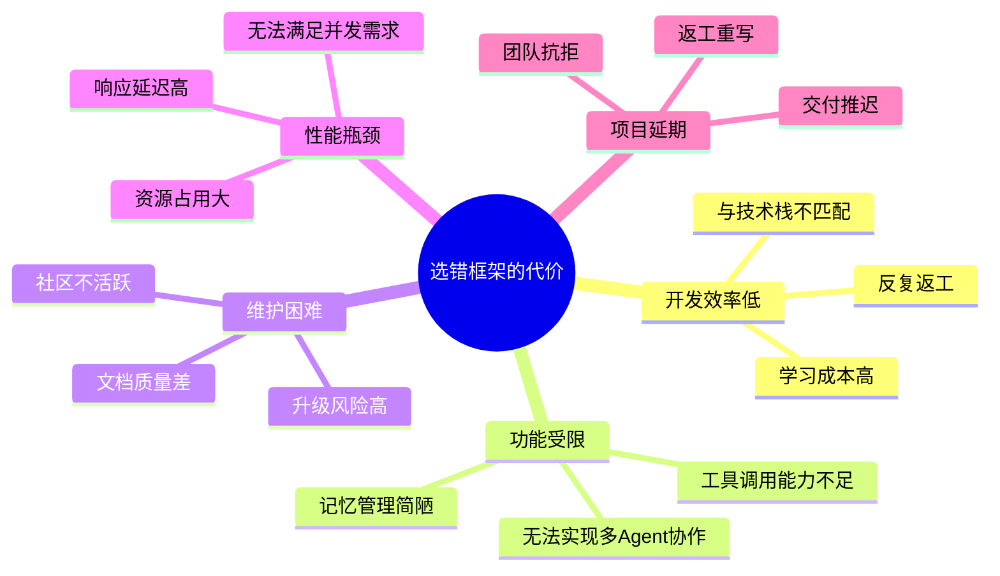

### 1.2 选型决策的本质

Agent 框架选型不是选"最好的",而是选"**最适合**"的——需要综合权衡:

| 决策要素 | 说明 |
|---------|------|
| **项目需求** | 多 Agent?工具调用?长记忆?任务规划? |
| **技术栈约束** | 语言?现有基础设施?集成成本? |
| **团队背景** | Python 熟练度?AI 经验?工程能力? |
| **时间约束** | 交付时间?是否允许探索期? |
| **长期演进** | 是否需要持续扩展?社区是否活跃? |

### 1.3 本文分析框架

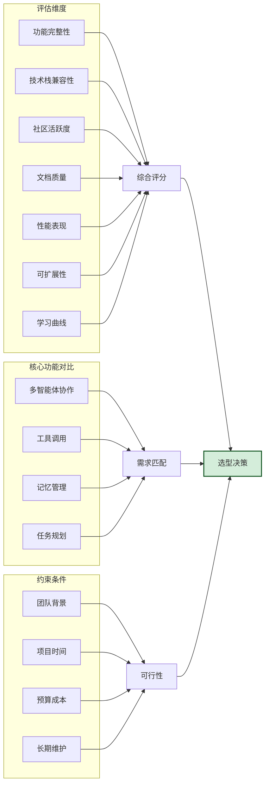

---

## 二、主流 Agent 框架全景概览

### 2.1 主流框架定位图

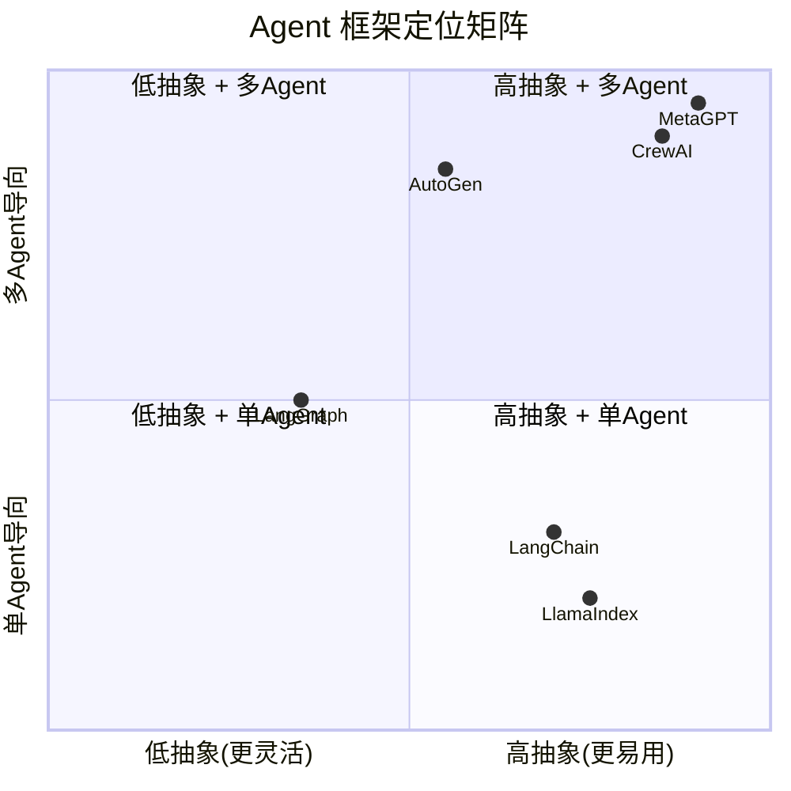

### 2.2 主流框架速览

| 框架 | 主语言 | GitHub Stars | 一句话定位 | 适合规模 |
|------|--------|-------------|-----------|---------|
| **LangChain** | Python | 90K+ | LLM 应用通用框架,生态最丰富 | 小型到中型 |
| **LangGraph** | Python | 15K+ | 基于状态图的 Agent,精确控制流程 | 中型到大型 |
| **AutoGen** | Python | 35K+ | 微软出品,多 Agent 对话协作 | 中型到大型 |
| **CrewAI** | Python | 25K+ | 角色驱动的多 Agent 团队协作 | 中型 |
| **MetaGPT** | Python | 50K+ | 模拟软件公司,多 Agent 软件开发 | 中型到大型 |
| **LlamaIndex** | Python | 40K+ | 数据连接与 RAG 增强框架 | 小型到中型 |

### 2.3 框架核心特性矩阵

| 框架 | 多 Agent 协作 | 工具调用 | 记忆管理 | 任务规划 | 状态管理 | RAG 集成 |
|------|:-----------:|:-------:|:-------:|:-------:|:-------:|:-------:|
| **LangChain** | ⚠️ 基础 | ✅ 强 | ✅ 强 | ⚠️ 基础 | ⚠️ 弱 | ✅ 强 |
| **LangGraph** | ✅ 强 | ✅ 强 | ✅ 强 | ✅ 强 | ✅ 极强 | ✅ 强 |
| **AutoGen** | ✅ 极强 | ✅ 强 | ✅ 中 | ⚠️ 中 | ⚠️ 中 | ⚠️ 中 |
| **CrewAI** | ✅ 极强 | ✅ 中 | ⚠️ 中 | ✅ 强 | ⚠️ 弱 | ⚠️ 中 |
| **MetaGPT** | ✅ 极强 | ✅ 中 | ✅ 中 | ✅ 极强 | ⚠️ 中 | ⚠️ 弱 |
| **LlamaIndex** | ❌ 无 | ✅ 强 | ✅ 中 | ❌ 无 | ⚠️ 弱 | ✅ 极强 |

> 图例:✅ 强 / ⚠️ 中等或部分支持 / ❌ 不支持

---

## 三、七大维度横向对比

### 3.1 维度一:功能完整性

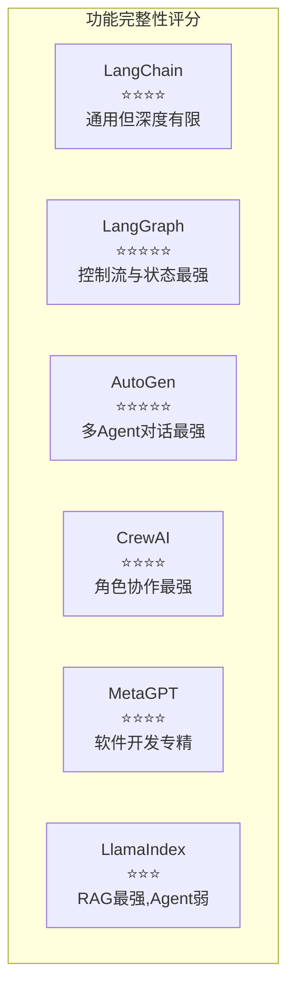

| 框架 | 功能完整度 | 核心强项 | 明显短板 |
|------|:---------:|---------|---------|
| **LangChain** | ⭐⭐⭐⭐ | 工具集成丰富、生态完善 | 多 Agent 协作弱、状态管理弱 |
| **LangGraph** | ⭐⭐⭐⭐⭐ | 状态图精确控制、可持久化 | 学习曲线陡、代码量大 |
| **AutoGen** | ⭐⭐⭐⭐⭐ | 多 Agent 对话、代码执行能力强 | RAG 集成弱、状态管理一般 |
| **CrewAI** | ⭐⭐⭐⭐ | 角色定义直观、任务委派 | 工具生态小、状态管理弱 |
| **MetaGPT** | ⭐⭐⭐⭐ | 软件开发流程完整 | 通用性差、定制化难 |
| **LlamaIndex** | ⭐⭐⭐ | RAG 能力极强 | Agent 能力薄弱 |

### 3.2 维度二:与现有技术栈的兼容性

| 技术栈 | LangChain | LangGraph | AutoGen | CrewAI | MetaGPT | LlamaIndex |
|--------|:---------:|:---------:|:-------:|:------:|:-------:|:----------:|
| **OpenAI API** | ✅ 原生 | ✅ 原生 | ✅ 原生 | ✅ 原生 | ✅ 原生 | ✅ 原生 |
| **Anthropic Claude** | ✅ 原生 | ✅ 原生 | ⚠️ 适配 | ✅ 原生 | ⚠️ 适配 | ✅ 原生 |
| **开源模型(HF)** | ✅ 原生 | ✅ 原生 | ✅ 原生 | ⚠️ 适配 | ✅ 原生 | ✅ 原生 |
| **本地模型(vLLM)** | ✅ 原生 | ✅ 原生 | ✅ 适配 | ⚠️ 适配 | ✅ 原生 | ✅ 原生 |
| **向量库(Chroma)** | ✅ 原生 | ✅ 原生 | ⚠️ 手动 | ⚠️ 手动 | ❌ 弱 | ✅ 原生 |
| **向量库(Milvus)** | ✅ 原生 | ✅ 原生 | ⚠️ 手动 | ⚠️ 手动 | ❌ 弱 | ✅ 原生 |
| **FastAPI** | ✅ 集成 | ✅ 集成 | ✅ 集成 | ✅ 集成 | ⚠️ 一般 | ✅ 集成 |
| **Redis** | ✅ 原生 | ✅ 原生 | ⚠️ 手动 | ⚠️ 手动 | ❌ 弱 | ✅ 原生 |
| **Kubernetes** | ⚠️ 手动 | ⚠️ 手动 | ⚠️ 手动 | ⚠️ 手动 | ⚠️ 手动 | ⚠️ 手动 |

**关键洞察**:
- **LangChain/LangGraph/LlamaIndex** 的生态兼容性最强,几乎所有主流 LLM 和向量库都原生支持
- **AutoGen/CrewAI** 偏向对话和角色协作,与向量库/缓存等基础设施的集成需要手动配置
- **MetaGPT** 聚焦软件开发,通用基础设施集成能力较弱

### 3.3 维度三:社区活跃度

| 指标 | LangChain | LangGraph | AutoGen | CrewAI | MetaGPT | LlamaIndex |
|------|:---------:|:---------:|:-------:|:------:|:-------:|:----------:|
| **GitHub Stars** | 90K+ | 15K+ | 35K+ | 25K+ | 50K+ | 40K+ |
| **贡献者数量** | 800+ | 200+ | 500+ | 300+ | 400+ | 600+ |
| **月度 PR 数** | 200+ | 80+ | 100+ | 120+ | 60+ | 150+ |
| **Discord 活跃** | 极高 | 高 | 高 | 高 | 中 | 高 |
| **Stack Overflow** | 20K+ | 2K+ | 5K+ | 3K+ | 2K+ | 8K+ |
| **国内资料丰富度** | ⭐⭐⭐⭐⭐ | ⭐⭐⭐ | ⭐⭐⭐⭐ | ⭐⭐⭐ | ⭐⭐⭐⭐ | ⭐⭐⭐⭐ |

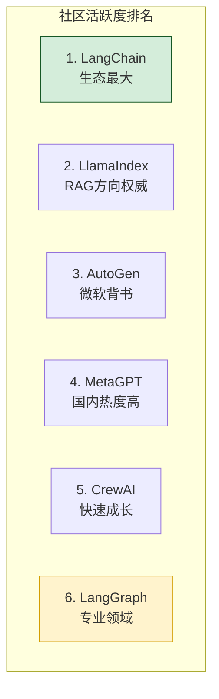

### 3.4 维度四:文档质量

| 框架 | 官方文档 | 教程示例 | API 参考 | 中文资料 | 实战案例 |
|------|:-------:|:-------:|:--------:|:-------:|:-------:|
| **LangChain** | ⭐⭐⭐⭐⭐ | ⭐⭐⭐⭐⭐ | ⭐⭐⭐⭐ | ⭐⭐⭐⭐⭐ | ⭐⭐⭐⭐⭐ |
| **LangGraph** | ⭐⭐⭐⭐ | ⭐⭐⭐⭐ | ⭐⭐⭐⭐ | ⭐⭐⭐ | ⭐⭐⭐ |
| **AutoGen** | ⭐⭐⭐⭐ | ⭐⭐⭐ | ⭐⭐⭐⭐ | ⭐⭐⭐⭐ | ⭐⭐⭐ |
| **CrewAI** | ⭐⭐⭐⭐ | ⭐⭐⭐⭐ | ⭐⭐⭐ | ⭐⭐⭐ | ⭐⭐⭐⭐ |
| **MetaGPT** | ⭐⭐⭐ | ⭐⭐⭐ | ⭐⭐⭐ | ⭐⭐⭐⭐ | ⭐⭐⭐ |
| **LlamaIndex** | ⭐⭐⭐⭐⭐ | ⭐⭐⭐⭐⭐ | ⭐⭐⭐⭐⭐ | ⭐⭐⭐⭐ | ⭐⭐⭐⭐⭐ |

**关键洞察**:
- **LangChain 和 LlamaIndex** 文档质量最高,新手友好
- **LangGraph** 文档专业但学习曲线陡峭
- **MetaGPT** 文档相对薄弱,更多依赖源码阅读

### 3.5 维度五:性能表现

| 性能指标 | LangChain | LangGraph | AutoGen | CrewAI | MetaGPT | LlamaIndex |
|---------|:---------:|:---------:|:-------:|:------:|:-------:|:----------:|
| **启动开销** | 中 | 中 | 高 | 中 | 高 | 低 |
| **单次推理延迟** | 低 | 低 | 中 | 中 | 中 | 低 |
| **多 Agent 协作延迟** | 高 | 中 | 中 | 低 | 低 | N/A |
| **并发支持** | ⚠️ 异步支持 | ✅ 原生异步 | ✅ 原生异步 | ⚠️ 部分异步 | ⚠️ 弱 | ✅ 原生异步 |
| **内存占用** | 中 | 中 | 高 | 中 | 高 | 低 |
| **大规模任务** | ⚠️ 一般 | ✅ 优秀 | ✅ 优秀 | ⚠️ 一般 | ⚠️ 一般 | ✅ 优秀 |

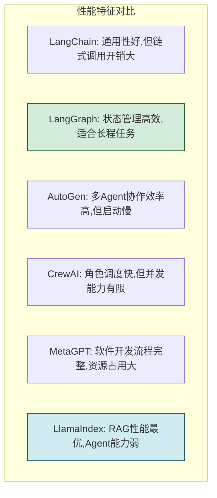

### 3.6 维度六:可扩展性

| 扩展维度 | LangChain | LangGraph | AutoGen | CrewAI | MetaGPT | LlamaIndex |
|---------|:---------:|:---------:|:-------:|:------:|:-------:|:----------:|
| **自定义工具** | ✅ 简单 | ✅ 简单 | ✅ 简单 | ✅ 简单 | ⚠️ 一般 | ✅ 简单 |
| **自定义 Agent** | ✅ 简单 | ✅ 简单 | ✅ 简单 | ✅ 简单 | ⚠️ 复杂 | ✅ 简单 |
| **自定义 LLM** | ✅ 简单 | ✅ 简单 | ✅ 简单 | ✅ 简单 | ⚠️ 一般 | ✅ 简单 |
| **自定义记忆** | ✅ 简单 | ✅ 简单 | ⚠️ 一般 | ⚠️ 一般 | ⚠️ 复杂 | ✅ 简单 |
| **自定义检索** | ✅ 简单 | ✅ 简单 | ⚠️ 一般 | ⚠️ 一般 | ❌ 难 | ✅ 简单 |
| **水平扩展** | ⚠️ 需自建 | ✅ 内置 | ✅ 内置 | ⚠️ 需自建 | ⚠️ 需自建 | ⚠️ 需自建 |
| **插件生态** | ✅ 丰富 | ✅ 复用LC | ⚠️ 一般 | ⚠️ 一般 | ⚠️ 一般 | ✅ 丰富 |

### 3.7 维度七:学习曲线

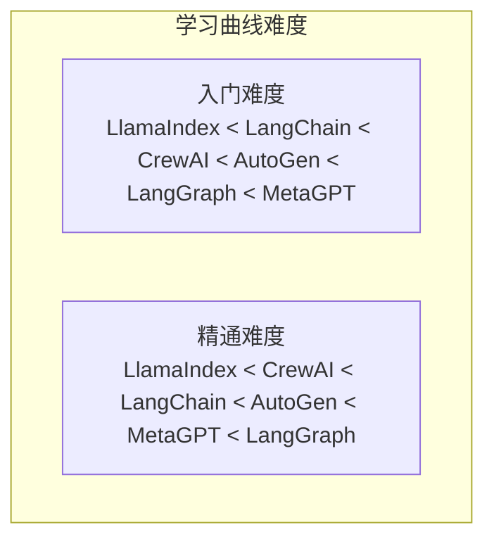

| 框架 | 入门难度 | 精通难度 | 所需基础 | 典型学习周期 |
|------|:-------:|:-------:|---------|:-----------:|
| **LlamaIndex** | ⭐ 易 | ⭐⭐ 中 | Python 基础 | 1-2 周 |
| **LangChain** | ⭐⭐ 中 | ⭐⭐⭐⭐ 难 | Python + LLM 概念 | 2-4 周 |
| **CrewAI** | ⭐⭐ 中 | ⭐⭐⭐ 中难 | Python + Agent 概念 | 2-3 周 |
| **AutoGen** | ⭐⭐⭐ 中难 | ⭐⭐⭐⭐ 难 | Python + 多线程 | 3-5 周 |
| **LangGraph** | ⭐⭐⭐⭐ 难 | ⭐⭐⭐⭐⭐ 极难 | Python + 图论 + 状态机 | 4-8 周 |
| **MetaGPT** | ⭐⭐⭐⭐ 难 | ⭐⭐⭐⭐⭐ 极难 | Python + 软工 | 4-6 周 |

### 3.8 七维度综合评分

| 维度 | LangChain | LangGraph | AutoGen | CrewAI | MetaGPT | LlamaIndex |
|------|:---------:|:---------:|:-------:|:------:|:-------:|:----------:|
| 功能完整性 | 4 | 5 | 5 | 4 | 4 | 3 |
| 技术栈兼容 | 5 | 5 | 3 | 3 | 2 | 5 |
| 社区活跃度 | 5 | 4 | 4 | 4 | 4 | 4 |
| 文档质量 | 5 | 4 | 4 | 4 | 3 | 5 |
| 性能表现 | 3 | 4 | 4 | 3 | 3 | 4 |
| 可扩展性 | 4 | 5 | 4 | 3 | 2 | 4 |
| 学习曲线(易) | 4 | 2 | 3 | 4 | 2 | 5 |
| **综合(满分35)** | **30** | **29** | **27** | **25** | **21** | **30** |

> 注:学习曲线"易"得分高,即越容易上手得分越高。

---

## 四、核心功能实现方式对比

### 4.1 多智能体协作实现对比

```mermaid
graph TB
    subgraph LangChain 多 Agent
        LC1[AgentExecutor] --> LC2[通过Chain组合]
        LC2 --> LC3[简单的工具式协作]
    end

    subgraph LangGraph 多 Agent
        LG1[StateGraph] --> LG2[节点=Agent]
        LG2 --> LG3[边=消息传递]
        LG3 --> LG4[精确控制流向]
    end

    subgraph AutoGen 多 Agent
        AG1[GroupChat] --> AG2[自动路由]
        AG2 --> AG3[对话式协作]
        AG3 --> AG4[支持人工介入]
    end

    subgraph CrewAI 多 Agent
        CR1[Crew] --> CR2[角色Role定义]
        CR2 --> CR3[任务Task委派]
        CR3 --> CR4[层级式协作]
    end

    style LG4 fill:#d4edda,stroke:#155724
    style AG4 fill:#d1ecf1,stroke:#0c5460
    style CR4 fill:#fff3cd,stroke:#d39e00
```

| 框架 | 协作模式 | 控制粒度 | 典型代码模式 |
|------|---------|---------|------------|
| **LangChain** | 链式调用,Agent 作为工具 | 粗粒度 | `AgentExecutor` 组合 |
| **LangGraph** | 状态图,Agent 作为节点 | 极细粒度 | `StateGraph` + 条件边 |
| **AutoGen** | 群组对话,自动路由 | 中粒度 | `GroupChat` + `Manager` |
| **CrewAI** | 角色委派,层级协作 | 中粒度 | `Crew` + `Agent` + `Task` |
| **MetaGPT** | 软件公司模拟,角色固定 | 粗粒度 | `Company` + 标准角色 |

### 4.2 工具调用实现对比

| 框架 | 工具定义方式 | 调用机制 | 错误处理 | 异步支持 |
|------|------------|---------|---------|---------|
| **LangChain** | `@tool` 装饰器 / BaseTool 继承 | Function Calling / ReAct | 内置重试 | ✅ |
| **LangGraph** | 复用 LangChain 工具 + 自定义节点 | 状态图节点调用 | 状态机管理 | ✅ |
| **AutoGen** | `register_function` 注册 | 对话中自动调用 | 对话式纠错 | ✅ |
| **CrewAI** | `BaseTool` 继承 | 角色自主调用 | 有限支持 | ⚠️ |
| **MetaGPT** | 内置动作 Action | 角色绑定调用 | 流程式处理 | ⚠️ |

**代码对比:工具定义**

```python
# LangChain 工具定义
from langchain.tools import tool

@tool
def search(query: str) -> str:
    """搜索信息"""
    return f"搜索结果: {query}"

# LangGraph 工具调用(作为节点)
def search_node(state):
    result = search(state["query"])
    return {"results": result}

# AutoGen 工具注册
@autogen.register_function
def search(query: str) -> str:
    return f"搜索结果: {query}"

# CrewAI 工具定义
from crewai import BaseTool

class SearchTool(BaseTool):
    name = "search"
    description = "搜索信息"
    def _run(self, query: str) -> str:
        return f"搜索结果: {query}"
```

### 4.3 记忆管理实现对比

| 框架 | 记忆类型 | 持久化 | 检索方式 | 跨会话 |
|------|---------|--------|---------|:------:|
| **LangChain** | Buffer/Summary/KG/Vector | ✅ 多种后端 | 时间/语义 | ✅ |
| **LangGraph** | Checkpointer 状态持久化 | ✅ 强 | 状态图节点 | ✅ |
| **AutoGen** | 对话历史 + 向量记忆 | ⚠️ 部分 | 对话/语义 | ⚠️ |
| **CrewAI** | Short-term/Long-term | ⚠️ 部分 | 简单检索 | ⚠️ |
| **MetaGPT** | 内置记忆 | ✅ 文件 | 角色记忆 | ✅ |
| **LlamaIndex** | ChatMemory + 向量索引 | ✅ 强 | 语义/时间 | ✅ |

### 4.4 任务规划实现对比

| 框架 | 规划方式 | 规划粒度 | 动态调整 | 复杂任务 |
|------|---------|---------|:-------:|:--------:|
| **LangChain** | Plan-and-Execute Agent | 中 | ⚠️ 弱 | ⚠️ 一般 |
| **LangGraph** | 状态图显式规划 | 细 | ✅ 强 | ✅ 优秀 |
| **AutoGen** | 对话涌现式 | 粗 | ⚠️ 中 | ⚠️ 一般 |
| **CrewAI** | Task 列表 + 流程 | 中 | ⚠️ 中 | ✅ 良好 |
| **MetaGPT** | SOP 标准流程 | 细 | ❌ 固定 | ✅ 优秀(软件) |

---

## 五、团队技术背景与项目约束分析

### 5.1 团队背景匹配度

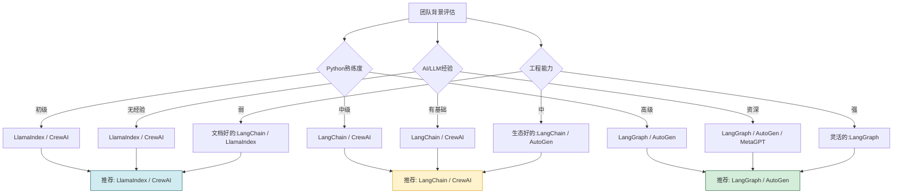

### 5.2 项目时间约束匹配

| 时间约束 | 推荐框架 | 原因 |
|---------|---------|------|
| **1-2 周 MVP** | LlamaIndex / CrewAI | 上手快,快速验证 |
| **1-2 月迭代** | LangChain / CrewAI | 生态丰富,迭代灵活 |
| **3-6 月产品** | LangGraph / AutoGen | 可控性强,适合长期演进 |
| **长期基础设施** | LangGraph | 状态管理强,可维护性高 |

### 5.3 项目需求匹配度

| 项目需求特征 | 首选框架 | 备选 |
|------------|---------|------|
| **强 RAG,弱 Agent** | LlamaIndex | LangChain |
| **单 Agent + 工具丰富** | LangChain | LangGraph |
| **多 Agent 对话协作** | AutoGen | CrewAI |
| **角色分工明确** | CrewAI | AutoGen |
| **复杂流程精确控制** | LangGraph | LangChain |
| **软件开发场景** | MetaGPT | CrewAI |
| **长程任务 + 状态持久化** | LangGraph | AutoGen |
| **快速原型 + 简单协作** | CrewAI | LangChain |

---

## 六、选型决策流程

### 6.1 决策流程图

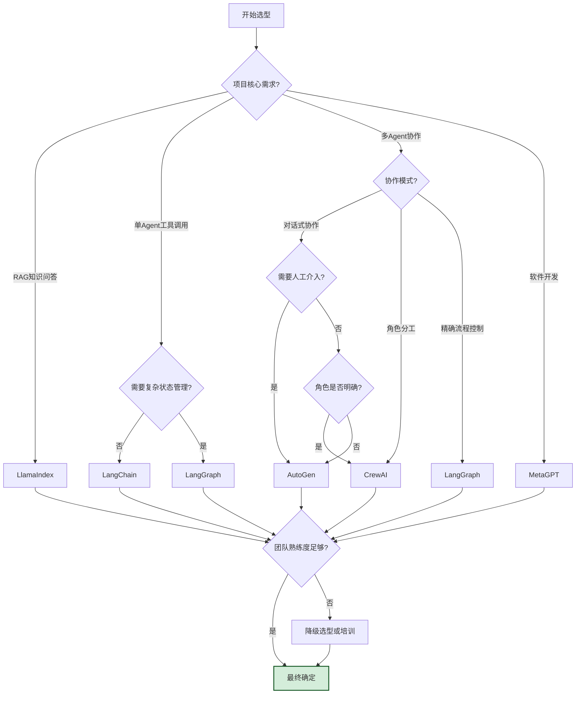

### 6.2 评估打分模板

```python
# 选型评估打分模板(伪代码)
selection_score = {
    "LangChain": {
        "功能匹配": 4,    # 与项目需求匹配度(1-5)
        "技术栈兼容": 5,  # 与现有技术栈兼容性
        "团队熟悉": 3,    # 团队对该框架的熟悉程度
        "学习成本": 4,    # 学习曲线(易=高分)
        "社区支持": 5,    # 社区活跃度和资料丰富度
        "长期演进": 4,    # 框架的长期可维护性
        "性能满足": 3,    # 是否满足性能需求
        "总分": 28
    },
    # ... 其他框架
}

# 加权计算(可根据项目优先级调整权重)
weights = {
    "功能匹配": 0.25,
    "技术栈兼容": 0.15,
    "团队熟悉": 0.15,
    "学习成本": 0.10,
    "社区支持": 0.10,
    "长期演进": 0.15,
    "性能满足": 0.10
}
```

---

## 七、典型场景选型推荐

### 7.1 场景一:企业知识库问答系统

| 需求特征 | 说明 |
|---------|------|
| **核心功能** | 基于企业文档的 RAG 问答 |
| **Agent 需求** | 单 Agent 即可,工具调用简单 |
| **协作需求** | 无 |
| **性能要求** | 检索精度 > 协作能力 |

**推荐**: **LlamaIndex**(首选) / **LangChain**(备选)

**理由**:
- LlamaIndex 在 RAG 方面功能最强,文档连接器丰富
- 检索精度高,支持高级检索策略
- 学习曲线平缓,快速上线

### 7.2 场景二:智能客服系统

| 需求特征 | 说明 |
|---------|------|
| **核心功能** | 多轮对话 + 工具调用 + 用户记忆 |
| **Agent 需求** | 单 Agent,需要对话状态管理 |
| **协作需求** | 可选(复杂问题转人工) |
| **性能要求** | 响应快,并发高 |

**推荐**: **LangChain**(首选) / **LangGraph**(备选)

**理由**:
- LangChain 对话记忆和工具集成完善
- 生态丰富,易于集成现有客服系统
- 如需复杂流程控制,升级到 LangGraph

### 7.3 场景三:多 Agent 协作开发平台

| 需求特征 | 说明 |
|---------|------|
| **核心功能** | 多 Agent 分工协作完成开发任务 |
| **Agent 需求** | 多 Agent,角色明确 |
| **协作需求** | 层级式协作 |
| **性能要求** | 完成质量 > 速度 |

**推荐**: **CrewAI**(首选) / **AutoGen**(备选)

**理由**:
- CrewAI 角色定义直观,任务委派清晰
- 适合明确的分工协作场景
- AutoGen 适合需要人工介入的协作

### 7.4 场景四:复杂决策支持系统

| 需求特征 | 说明 |
|---------|------|
| **核心功能** | 多 Agent 讨论 + 投票决策 |
| **Agent 需求** | 多 Agent 对话 |
| **协作需求** | 对话式协作 |
| **性能要求** | 决策准确性 > 速度 |

**推荐**: **AutoGen**(首选)

**理由**:
- AutoGen 的 GroupChat 模式天然适合多 Agent 讨论
- 支持人工介入,适合人机协作决策
- 对话式协作涌现群体智能

### 7.5 场景五:长程任务执行系统

| 需求特征 | 说明 |
|---------|------|
| **核心功能** | 跨会话长程任务,需中断恢复 |
| **Agent 需求** | 复杂状态管理 |
| **协作需求** | 可能涉及子任务委派 |
| **性能要求** | 可靠性 > 速度 |

**推荐**: **LangGraph**(首选)

**理由**:
- LangGraph 的状态图支持精确的状态管理
- Checkpointer 机制支持任务中断恢复
- 适合需要高可靠性的长程任务

### 7.6 场景六:软件自动化开发

| 需求特征 | 说明 |
|---------|------|
| **核心功能** | 从需求到代码的自动化开发 |
| **Agent 需求** | 多角色协作(PM/架构/开发/测试) |
| **协作需求** | 标准软件工程流程 |
| **性能要求** | 代码质量 > 速度 |

**推荐**: **MetaGPT**(首选) / **CrewAI**(备选)

**理由**:
- MetaGPT 内置完整的软件公司角色和流程
- 适合标准化的软件开发场景
- 如需自定义流程,用 CrewAI 组合

### 7.7 场景推荐汇总表

| 应用场景 | 首选 | 备选 | 核心原因 |
|---------|------|------|---------|
| 企业知识库问答 | LlamaIndex | LangChain | RAG 能力最强 |
| 智能客服 | LangChain | LangGraph | 对话+工具+记忆均衡 |
| 多 Agent 协作开发 | CrewAI | AutoGen | 角色分工直观 |
| 复杂决策支持 | AutoGen | CrewAI | 群组讨论强 |
| 长程任务执行 | LangGraph | AutoGen | 状态管理最强 |
| 软件自动化开发 | MetaGPT | CrewAI | 软件流程完整 |
| 快速原型验证 | CrewAI | LangChain | 上手快 |
| 生产级高可靠系统 | LangGraph | AutoGen | 可控性最强 |

---

## 八、混合框架组合策略

### 8.1 为什么需要混合使用

单一框架很难覆盖所有需求,**生产级系统常采用混合策略**:

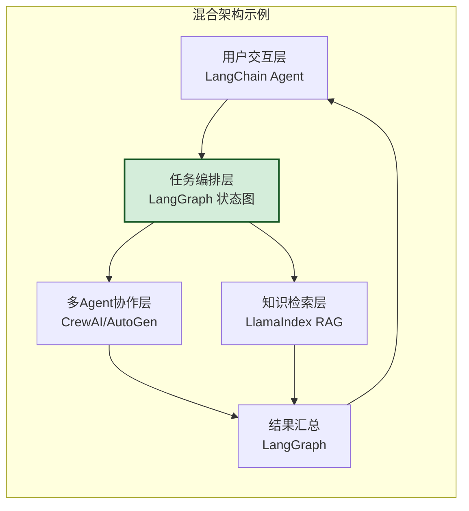

### 8.2 典型组合方案

| 组合方案 | 组成 | 适用场景 |
|---------|------|---------|
| **LC + LI** | LangChain + LlamaIndex | 对话 + 强 RAG |
| **LG + LC** | LangGraph + LangChain | 复杂流程 + 丰富工具 |
| **LG + CA** | LangGraph + CrewAI | 状态管理 + 角色协作 |
| **AG + LC** | AutoGen + LangChain | 多Agent + 工具丰富 |
| **LG + LI + CA** | LangGraph + LlamaIndex + CrewAI | 全栈:流程+RAG+协作 |

### 8.3 组合实现示例

```python
# LangGraph + LlamaIndex + CrewAI 组合示例
from langgraph.graph import StateGraph
from llama_index import VectorStoreIndex
from crewai import Crew, Agent, Task

class HybridAgentSystem:
    """混合框架系统"""

    def __init__(self):
        # LlamaIndex 负责 RAG 检索
        self.rag_index = VectorStoreIndex.from_documents(docs)

        # CrewAI 负责多 Agent 协作
        self.research_crew = Crew(agents=[...], tasks=[...])

        # LangGraph 负责整体流程编排
        self.workflow = self._build_workflow()

    def _build_workflow(self):
        workflow = StateGraph(State)

        # RAG 检索节点(用 LlamaIndex)
        workflow.add_node("retrieve", self._retrieve_with_llama)

        # 多 Agent 协作节点(用 CrewAI)
        workflow.add_node("collaborate", self._collaborate_with_crew)

        # 结果汇总节点
        workflow.add_node("summarize", self._summarize)

        workflow.set_entry_point("retrieve")
        workflow.add_edge("retrieve", "collaborate")
        workflow.add_edge("collaborate", "summarize")

        return workflow.compile()
```

---

## 九、选型常见误区

### 9.1 常见误区与纠正

| 误区 | 纠正建议 |
|------|---------|
| ❌ 选 Stars 最多的 | ✅ Stars 多≠最适合,要看功能匹配度 |
| ❌ 选最新的 | ✅ 新框架可能不稳定,优先选成熟方案 |
| ❌ 选功能最全的 | ✅ 功能全≠用得上,避免过度设计 |
| ❌ 一个框架解决所有问题 | ✅ 生产级系统常需混合框架 |
| ❌ 只看 demo 效果 | ✅ Demo 简化场景,要看生产环境表现 |
| ❌ 忽略团队学习成本 | ✅ 学习曲线影响交付时间 |
| ❌ 不考虑长期维护 | ✅ 社区活跃度决定框架生命力 |
| ❌ 盲目跟风大厂选型 | ✅ 大厂场景不同,要结合自身需求 |

### 9.2 选型验证建议

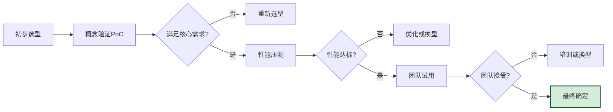

---

## 十、总结与最佳实践

### 10.1 选型核心原则

1. **需求驱动**:以项目核心需求为出发点,而非框架功能
2. **团队匹配**:考虑团队技术背景和学习能力
3. **生态优先**:优先选社区活跃、文档完善的框架
4. **渐进选型**:先 PoC 验证,再大规模采用
5. **组合思维**:允许混合使用多个框架
6. **长期视角**:考虑框架的可维护性和演进性

### 10.2 快速决策建议

| 如果你... | 推荐 |
|----------|------|
| **刚入门,想做 RAG 问答** | LlamaIndex |
| **想要快速原型** | CrewAI 或 LangChain |
| **需要精确控制流程** | LangGraph |
| **做多 Agent 讨论** | AutoGen |
| **做角色分工协作** | CrewAI |
| **做软件开发自动化** | MetaGPT |
| **不确定,想要通用方案** | LangChain |
| **生产级高可靠系统** | LangGraph |

### 10.3 与系列文档的关系

| 文档 | 主题 | 与本文关系 |
|------|------|---------|
| [85LangChain框架核心组件详解.md](85LangChain框架核心组件详解.md) | LangChain 组件 | LangChain 选型的深度参考 |
| [86LangChain Agent运行机制深度解析.md](86LangChain%20Agent运行机制深度解析.md) | LangChain 运行机制 | 理解 LangChain 内部机制 |
| [87LangGraph框架诞生背景与核心定位深度解析.md](87LangGraph框架诞生背景与核心定位深度解析.md) | LangGraph 定位 | LangGraph 选型的深度参考 |
| [88LangChain与LangGraph核心区别系统性对比深度解析.md](88LangChain与LangGraph核心区别系统性对比深度解析.md) | LC vs LG 对比 | 本文 LangChain/LangGraph 对比的依据 |
| [89AutoGen框架架构深度解析.md](89AutoGen框架架构深度解析.md) | AutoGen 架构 | AutoGen 选型的深度参考 |
| [90CrewAI框架核心设计理念深度解析.md](90CrewAI框架核心设计理念深度解析.md) | CrewAI 理念 | CrewAI 选型的深度参考 |

---

> **最终结论**:Agent 框架选型没有"银弹",关键是**匹配需求、匹配团队、匹配场景**。LangChain 适合通用场景,LlamaIndex 适合 RAG 重度场景,LangGraph 适合需要精确控制的复杂场景,AutoGen 适合多 Agent 对话协作,CrewAI 适合角色分工协作,MetaGPT 适合软件开发专精场景。生产级系统建议采用**混合框架组合策略**,让每个框架发挥其最强优势。
