# Agent 核心架构逻辑面试专项

> 本文档系统阐述 Agent 架构的三大核心层次：感知层、思考层、行动层，专为面试准备设计。

---

## 目录

- [1. Agent 架构总览](#1-agent-架构总览)
- [2. 感知层（Perception Layer）](#2-感知层perception-layer)
- [3. 思考层（Reasoning Layer）](#3-思考层reasoning-layer)
- [4. 行动层（Action Layer）](#4-行动层action-layer)
- [5. 三层协同工作流](#5-三层协同工作流)
- [6. 高频面试题与参考答案](#6-高频面试题与参考答案)
- [7. 架构设计实战题](#7-架构设计实战题)
- [8. 总结与记忆口诀](#8-总结与记忆口诀)

---

## 1. Agent 架构总览

### 1.1 什么是 Agent

Agent 是一个能够**感知环境、自主决策、执行行动**的智能体系统。与传统的"输入→输出"模型不同，Agent 具备**目标导向、多轮交互、工具使用、自我反思**的能力。

### 1.2 三层核心架构

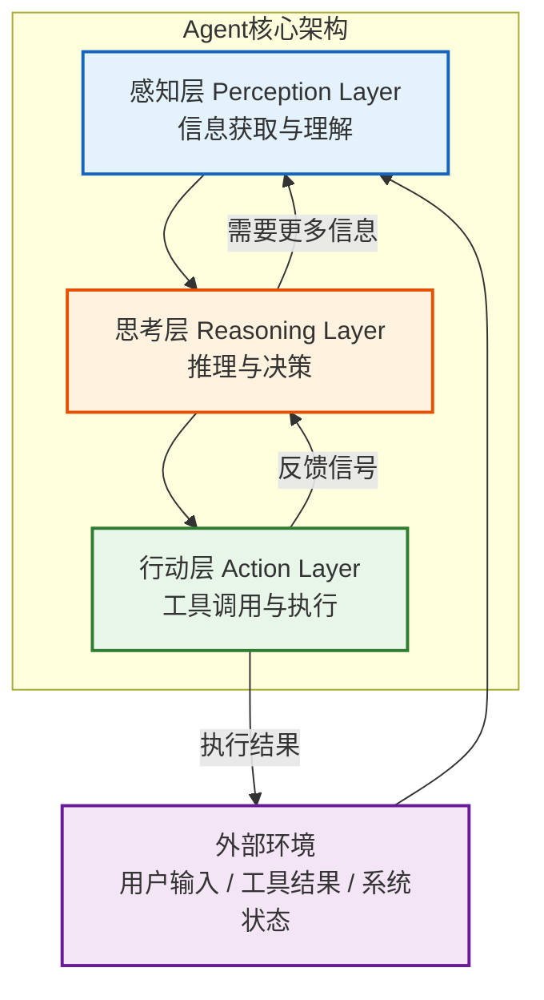

### 1.3 三层对比速查表

| 维度 | 感知层 | 思考层 | 行动层 |
|------|--------|--------|--------|
| **核心职责** | 获取与理解信息 | 推理与决策制定 | 执行与反馈 |
| **类比人类** | 眼睛/耳朵/皮肤 | 大脑 | 手/脚/嘴 |
| **输入** | 用户输入、环境状态、工具返回 | 结构化意图、上下文、记忆 | 执行计划、工具调用指令 |
| **输出** | 结构化意图、上下文表示 | 行动计划、工具选择 | 执行结果、状态更新 |
| **关键技术** | 多模态解析、意图识别、NER | LLM 推理、CoT、ReAct、规划算法 | Function Calling、工具执行、API 调用 |
| **记忆交互** | 写入短期记忆 | 读写工作记忆 + 长期记忆 | 写入执行结果记忆 |

---

## 2. 感知层（Perception Layer）

### 2.1 功能定义

感知层是 Agent 与外部世界的**接口层**，负责：
1. **信息采集**：接收用户输入、环境状态、工具返回结果
2. **信息解析**：将非结构化输入转换为结构化表示
3. **意图识别**：理解用户的真实意图和目标
4. **上下文构建**：组装当前任务的完整上下文

### 2.2 技术实现要点

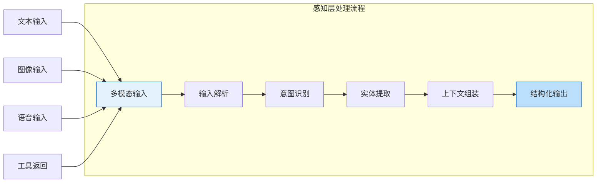

#### 关键技术点

| 技术点 | 说明 | 实现方式 |
|--------|------|---------|
| **多模态解析** | 处理文本、图像、语音等不同模态输入 | Vision Model、ASR、OCR |
| **意图识别** | 判断用户想做什么（查询/操作/咨询） | LLM 分类、Fine-tuned 模型 |
| **实体提取（NER）** | 提取关键信息（时间、地点、人名等） | LLM Function Calling、专用 NER 模型 |
| **槽位填充** | 补全任务所需参数 | 对话追问、默认值推断 |
| **上下文窗口管理** | 控制输入 token 数量 | 滑动窗口、摘要压缩 |

### 2.3 代码示例：感知层实现

```java
// LangChain4j 感知层示例
public class PerceptionLayer {

    private final ChatLanguageModel model;
    private final MemoryStore memoryStore;

    /**
     * 处理用户输入，输出结构化意图
     */
    public PerceivedInput perceive(String userInput, String sessionId) {
        // 1. 获取历史上下文
        String context = memoryStore.getContext(sessionId);

        // 2. 意图识别 + 实体提取（通过 Prompt 引导 LLM）
        String prompt = """
            你是一个意图识别助手。请分析用户输入并返回 JSON：
            {
              "intent": "意图分类",
              "entities": {"key": "value"},
              "missing_slots": ["缺失的必要参数"],
              "confidence": 0.95
            }

            上下文：%s
            用户输入：%s
            """.formatted(context, userInput);

        Response<AiMessage> response = model.generate(prompt);
        PerceivedInput result = parseStructuredOutput(response.content().text());

        // 3. 槽位检查：缺失参数则追问
        if (!result.getMissingSlots().isEmpty()) {
            result.setNeedClarification(true);
        }

        // 4. 写入短期记忆
        memoryStore.addMessage(sessionId, userInput, result);

        return result;
    }
}
```

### 2.4 典型应用场景

| 场景 | 感知层职责 | 关键挑战 |
|------|-----------|---------|
| **智能客服** | 识别用户问题类型、提取订单号 | 多轮对话意图漂移 |
| **代码助手** | 解析代码上下文、识别编程语言 | 代码语义理解 |
| **数据分析** | 理解分析需求、识别数据源 | 自然语言→SQL 转换 |
| **多模态助手** | 图像识别、语音转文字 | 跨模态信息融合 |

---

## 3. 思考层（Reasoning Layer）

### 3.1 功能定义

思考层是 Agent 的**大脑**，负责：
1. **任务分解**：将复杂目标拆解为可执行的子任务
2. **推理决策**：基于当前状态选择最优行动方案
3. **工具选择**：决定调用哪个工具、传入什么参数
4. **自我反思**：评估执行结果，决定是否调整策略

### 3.2 核心推理范式

#### 3.2.1 ReAct（Reasoning + Acting）

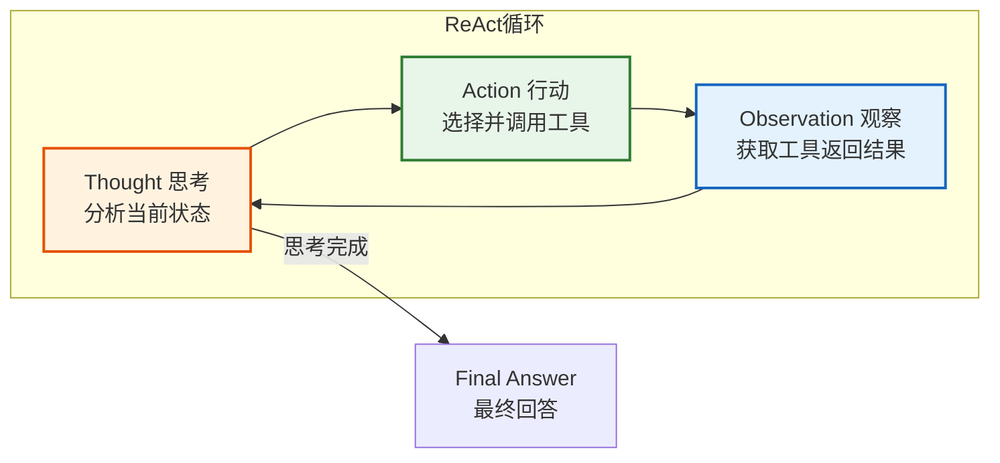

```
// ReAct 推理过程示例
Thought: 用户想查询北京明天的天气，我需要调用天气API
Action: weather_api
Action Input: {"city": "北京", "date": "明天"}
Observation: 北京明天晴，气温25-32℃，南风3级
Thought: 已经获得天气信息，可以回答用户了
Final Answer: 北京明天天气晴朗，气温25-32℃，有南风3级，适合出行。
```

#### 3.2.2 Plan-and-Execute（规划-执行）

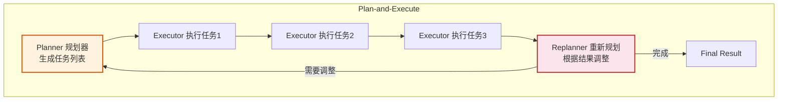

#### 3.2.3 Reflection（反思机制）

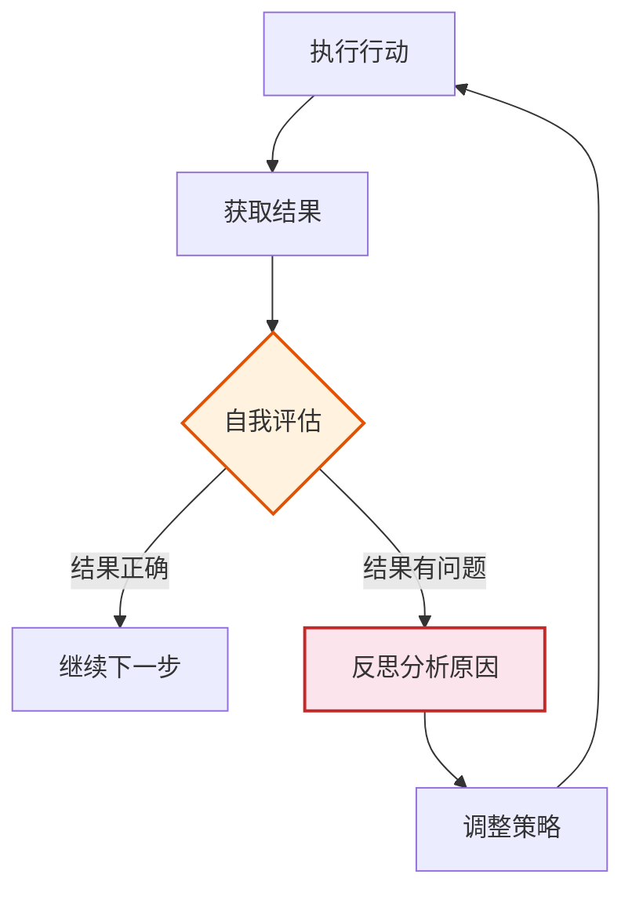

#### 三种范式对比

| 范式 | 核心思想 | 优点 | 缺点 | 适用场景 |
|------|---------|------|------|---------|
| **ReAct** | 边思考边行动，交替进行 | 灵活、实时调整 | 容易陷入循环、token 消耗大 | 工具调用、信息检索 |
| **Plan-and-Execute** | 先规划全局，再逐步执行 | 全局视野、效率高 | 规划可能不准确，需要 Replan | 复杂多步任务 |
| **Reflection** | 执行后自我评估和修正 | 提高准确率、自我纠错 | 增加延迟、token 消耗 | 代码生成、写作等高质量任务 |

### 3.3 记忆管理机制

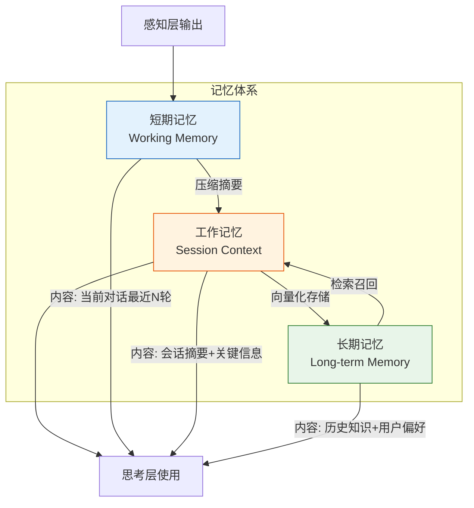

| 记忆类型 | 存储内容 | 实现方式 | 生命周期 |
|---------|---------|---------|---------|
| **短期记忆** | 最近 N 轮对话原文 | 内存/Redis | 会话级别 |
| **工作记忆** | 当前任务上下文摘要 | 内存对象 | 任务级别 |
| **长期记忆** | 历史知识、用户偏好 | 向量数据库 | 永久存储 |

### 3.4 代码示例：思考层实现

```java
// LangChain4j ReAct Agent 思考层示例
public class ReasoningLayer {

    private final ChatLanguageModel model;
    private final List<ToolSpecification> tools;
    private final MemoryStore memoryStore;

    /**
     * ReAct 推理循环
     */
    public String reason(PerceivedInput input, String sessionId) {
        int maxIterations = 10;
        String currentContext = buildContext(input, sessionId);

        for (int i = 0; i < maxIterations; i++) {
            // 1. Thought: LLM 思考下一步行动
            Response<AiMessage> response = model.generate(
                currentContext,
                tools  // 可用工具列表
            );

            AiMessage message = response.content();

            // 2. 判断是否输出最终答案
            if (message.hasFinalAnswer()) {
                return message.text();
            }

            // 3. Action: 执行工具调用
            if (message.hasToolExecutionRequest()) {
                ToolExecutionRequest req = message.toolExecutionRequest();
                String result = executeTool(req);

                // 4. Observation: 将工具结果加入上下文
                currentContext += formatToolResult(req, result);

                // 5. 反思：检查是否需要调整
                if (shouldReplan(result, currentContext)) {
                    currentContext = replan(currentContext, sessionId);
                }
            }
        }

        return "已达最大推理次数，返回当前最优结果";
    }

    /**
     * 任务分解：将复杂任务拆分为子任务
     */
    private List<SubTask> decomposeTask(String goal) {
        String prompt = """
            将以下目标分解为具体的子任务列表，返回 JSON 数组：
            目标：%s
            格式：[{"step": 1, "task": "描述", "tool": "需要使用的工具"}]
            """.formatted(goal);

        Response<AiMessage> response = model.generate(prompt);
        return parseSubTasks(response.content().text());
    }
}
```

---

## 4. 行动层（Action Layer）

### 4.1 功能定义

行动层是 Agent 的**执行器**，负责：
1. **工具调用**：根据思考层决策，调用外部工具/API
2. **参数组装**：将决策转化为具体的 API 调用参数
3. **结果处理**：处理工具返回结果，格式化为可用信息
4. **状态更新**：更新 Agent 内部状态和环境状态

### 4.2 技术实现要点

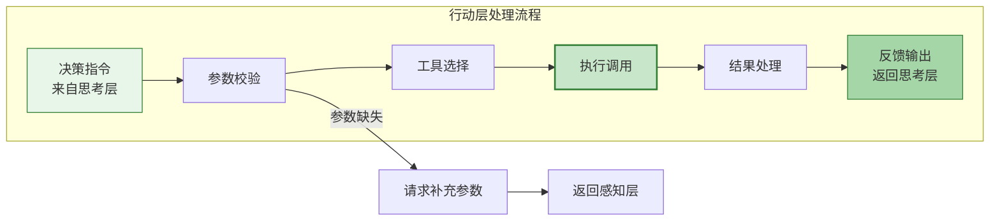

#### 关键技术点

| 技术点 | 说明 | 实现方式 |
|--------|------|---------|
| **Function Calling** | LLM 输出结构化函数调用 | OpenAI Function Calling / JSON Mode |
| **工具注册与发现** | 管理可用工具的元信息 | 工具注册表、Schema 定义 |
| **参数校验** | 校验工具参数完整性和类型 | JSON Schema 验证 |
| **错误处理** | 工具调用失败的重试与降级 | 重试机制、Fallback 策略 |
| **并行执行** | 多个独立工具并行调用 | CompletableFuture / 异步编排 |
| **结果格式化** | 将工具返回转化为 LLM 可理解文本 | 模板化输出、结构化解析 |

### 4.3 工具体系设计

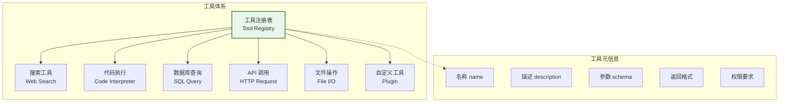

### 4.4 代码示例：行动层实现

```java
// LangChain4j 行动层示例
public class ActionLayer {

    private final ToolRegistry toolRegistry;
    private final ExecutorService executor;

    /**
     * 执行工具调用
     */
    public ActionResult execute(ToolExecutionRequest request) {
        // 1. 查找工具
        Tool tool = toolRegistry.find(request.name());
        if (tool == null) {
            return ActionResult.error("工具不存在: " + request.name());
        }

        // 2. 参数校验
        Map<String, Object> params = parseArguments(request.arguments());
        ValidationResult validation = tool.validate(params);
        if (!validation.isValid()) {
            return ActionResult.error("参数校验失败: " + validation.getErrors());
        }

        // 3. 执行工具（支持超时控制）
        try {
            ActionResult result = CompletableFuture
                .supplyAsync(() -> tool.execute(params), executor)
                .get(tool.getTimeoutSeconds(), TimeUnit.SECONDS);

            // 4. 结果格式化
            return formatResult(result, tool.getReturnFormat());

        } catch (TimeoutException e) {
            return ActionResult.error("工具执行超时");
        } catch (Exception e) {
            // 5. 错误处理与重试
            return handleFailure(request, e);
        }
    }

    /**
     * 并行执行多个工具
     */
    public List<ActionResult> executeParallel(List<ToolExecutionRequest> requests) {
        List<CompletableFuture<ActionResult>> futures = requests.stream()
            .map(req -> CompletableFuture.supplyAsync(() -> execute(req), executor))
            .toList();

        return futures.stream()
            .map(CompletableFuture::join)
            .toList();
    }
}

// 工具注册示例
@Tool("根据城市名称查询天气信息")
public record WeatherTool(WeatherApi api) {

    @ToolMethod("查询指定城市的天气")
    public String getWeather(
        @ToolParam("城市名称") String city,
        @ToolParam(value = "日期", required = false) String date
    ) {
        WeatherData data = api.query(city, date);
        return formatWeatherOutput(data);
    }
}
```

### 4.5 典型应用场景

| 场景 | 行动层工具 | 关键挑战 |
|------|-----------|---------|
| **信息检索** | Web Search、Knowledge Base | 结果相关性排序 |
| **代码生成** | Code Interpreter、Sandbox | 安全沙箱执行 |
| **数据处理** | SQL Query、Python 执行 | 数据安全、权限控制 |
| **任务自动化** | Email API、Calendar API | 错误恢复、事务性 |
| **多模态生成** | Image Gen、TTS | 生成质量控制 |

---

## 5. 三层协同工作流

### 5.1 完整工作流程

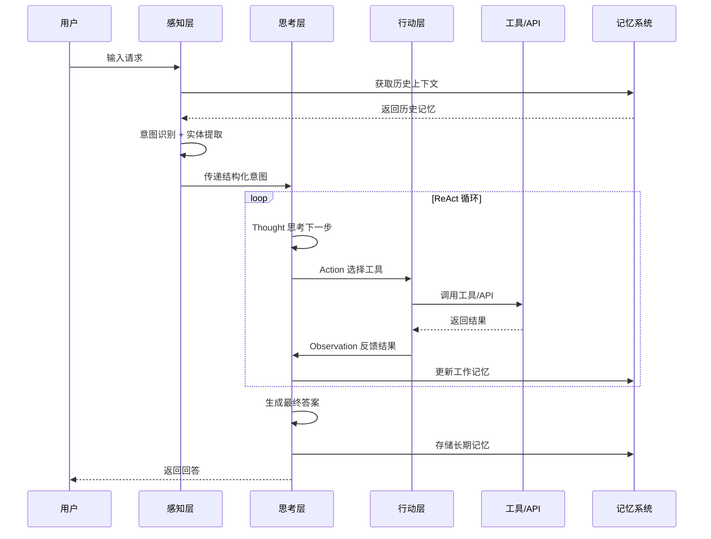

### 5.2 数据流详解

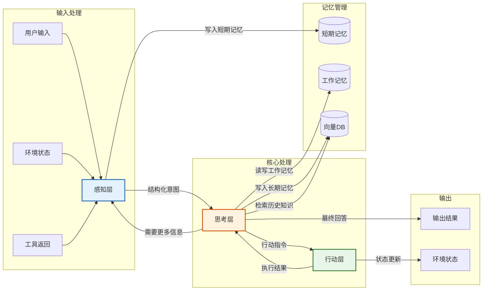

---

## 6. 高频面试题与参考答案

### Q1：请解释 Agent 的三层架构及各层职责

**参考答案：**

Agent 架构分为感知层、思考层、行动层三个核心层次：

- **感知层**：负责信息采集和理解，将用户输入、环境状态等非结构化信息转换为结构化意图表示。关键技术包括多模态解析、意图识别、实体提取和上下文管理。

- **思考层**：是 Agent 的大脑，负责任务分解、推理决策和自我反思。核心范式包括 ReAct（边思考边行动）、Plan-and-Execute（先规划后执行）和 Reflection（执行后反思）。同时管理短期、工作和长期三级记忆。

- **行动层**：负责执行具体操作，包括工具调用、参数组装、结果处理和状态更新。通过 Function Calling 机制将 LLM 的决策转化为实际 API 调用。

三层形成 **感知→思考→行动→反馈→再思考** 的闭环，使 Agent 能够自主完成复杂任务。

---

### Q2：ReAct 和 Plan-and-Execute 的区别？分别适用什么场景？

**参考答案：**

| 维度 | ReAct | Plan-and-Execute |
|------|-------|-----------------|
| **策略** | 一步一步交替推理和行动 | 先全局规划，再逐步执行 |
| **优势** | 灵活、能实时根据观察调整 | 有全局视野、减少重复推理 |
| **劣势** | 可能陷入局部最优、token 消耗大 | 规划可能不准确，需要 Replan |
| **适用场景** | 信息检索、简单工具调用 | 复杂多步任务、项目级工作 |

**选择建议**：
- 任务步骤不确定、需要根据中间结果调整 → **ReAct**
- 任务可提前分解、步骤相对固定 → **Plan-and-Execute**
- 实际生产中常将两者结合：先 Plan 生成大纲，每步用 ReAct 执行

---

### Q3：Agent 的记忆系统如何设计？三级记忆的区别？

**参考答案：**

Agent 需要三级记忆系统来管理不同时间尺度的信息：

```
短期记忆（Working Memory）
  ├── 内容：最近 N 轮对话原文
  ├── 存储：内存 / Redis
  ├── 生命周期：会话级别
  └── 作用：保持对话连贯性

工作记忆（Session Context）
  ├── 内容：当前任务上下文摘要
  ├── 存储：内存对象 / Session Store
  ├── 生命周期：任务级别
  └── 作用：任务执行期间的上下文

长期记忆（Long-term Memory）
  ├── 内容：历史知识、用户偏好、事实记忆
  ├── 存储：向量数据库（Milvus/PGVector）
  ├── 生命周期：永久
  └── 作用：跨会话知识积累和个性化
```

**关键设计点**：
1. **记忆压缩**：当短期记忆超过 token 限制时，自动摘要压缩
2. **检索增强**：通过向量相似度从长期记忆中召回相关信息
3. **遗忘机制**：定期清理过时信息，保持记忆质量

---

### Q4：如何设计一个可扩展的工具系统？

**参考答案：**

可扩展的工具系统需要包含以下设计：

1. **工具注册表（Tool Registry）**：统一管理所有工具的元信息（名称、描述、参数 Schema、权限）
2. **标准化接口**：所有工具实现统一接口，入参/出参格式标准化
3. **动态发现**：支持运行时动态注册新工具，无需重启
4. **权限控制**：不同 Agent 角色可使用不同工具集
5. **错误处理**：统一的超时、重试、降级策略

```java
// 标准工具接口
public interface Tool {
    String getName();           // 工具名称
    String getDescription();    // 工具描述（给 LLM 看）
    JsonSchema getParamSchema();// 参数 Schema
    ActionResult execute(Map<String, Object> params);
}
```

---

### Q5：Agent 执行中陷入循环怎么办？

**参考答案：**

Agent 陷入循环是常见问题，解决策略包括：

1. **迭代次数限制**：设置 `max_iterations`（如 10 次），超过则强制停止
2. **重复检测**：检测连续 N 步是否调用相同工具+相同参数，若是则打断
3. **反思机制**：每 3-5 步触发 Reflection，评估是否需要调整策略
4. **温度调整**：提高 LLM temperature 增加多样性，打破循环
5. **Replan 机制**：检测到停滞时，重新规划任务
6. **人工介入**：关键场景设置人工审核节点

```python
# 循环检测伪代码
if detect_repetition(history, window=3):
    trigger_reflection()
    if reflection_suggests_replan:
        replan_tasks()
```

---

### Q6：如何评估 Agent 系统的性能？

**参考答案：**

Agent 评估需要多维度指标：

| 评估维度 | 指标 | 说明 |
|---------|------|------|
| **任务完成率** | Success Rate | 成功完成任务的比例 |
| **效率** | Steps / Tokens / Time | 完成任务所需的步骤数、token 数、时间 |
| **准确性** | Tool Selection Accuracy | 选择正确工具的比例 |
| **参数正确性** | Param Accuracy | 工具参数填写正确的比例 |
| **鲁棒性** | Error Recovery Rate | 遇到错误后恢复成功的比例 |
| **用户体验** | Latency / Cost | 响应延迟和 API 成本 |

**评估方法**：
- **基准测试**：构建标准测试集，自动化评估
- **人工评估**：专家评分（1-5分）回答质量
- **A/B 测试**：对比不同策略的效果

---

### Q7：多 Agent 系统中，Agent 之间如何通信？

**参考答案：**

多 Agent 通信主要有三种模式：

```
1. 消息传递（Message Passing）
   Agent A --消息--> Agent B
   特点：直接通信、低延迟、适合点对点

2. 黑板模式（Blackboard）
   Agent A --> [共享黑板] <-- Agent B
   特点：通过共享状态通信、适合协作型

3. 发布-订阅（Pub-Sub）
   Agent A --发布--> [事件总线] --订阅--> Agent B/C/D
   特点：解耦、可扩展、适合事件驱动
```

**通信内容标准化**：
```json
{
  "from": "planner_agent",
  "to": "coder_agent",
  "type": "task_assignment",
  "content": {"task": "实现用户登录API", "priority": "high"},
  "context": {"project_id": "xxx", "deadline": "2026-07-01"}
}
```

---

### Q8：感知层如何处理多模态输入？

**参考答案：**

多模态感知需要根据输入类型选择不同处理策略：

| 模态 | 处理方式 | 输出 |
|------|---------|------|
| **文本** | 直接传入 LLM / 意图分类 | 结构化意图 |
| **图像** | Vision Model（GPT-4V / Claude Vision） | 图像描述 + 关键信息 |
| **语音** | ASR（Whisper / 语音转文字） | 文本 + 情感特征 |
| **视频** | 关键帧提取 → 逐帧分析 | 场景描述 + 时间轴信息 |
| **结构化数据** | JSON/CSV 直接解析 | 字段映射 + 统计摘要 |

**融合策略**：将各模态输出拼接为统一 Prompt，交由思考层处理。需要注意 token 预算分配，图像和长文本需要压缩。

---

## 7. 架构设计实战题

### 实战题1：设计一个智能客服 Agent

**题目**：请设计一个电商平台的智能客服 Agent，能处理售前咨询、售后问题、订单查询等任务。

**参考架构**：

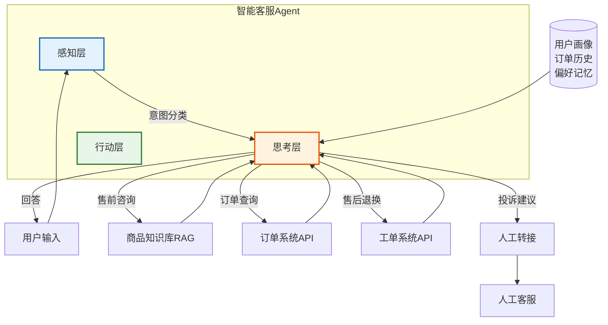

**关键设计点**：
1. 感知层：意图分类（售前/售后/订单/投诉）+ 提取订单号/商品名
2. 思考层：根据意图选择对应工具，RAG 检索商品知识
3. 行动层：调用订单API/工单系统/知识库检索
4. 记忆：用户画像、历史订单、沟通偏好
5. 兜底：无法处理时转人工

---

### 实战题2：设计一个多 Agent 代码开发系统

**参考架构**：

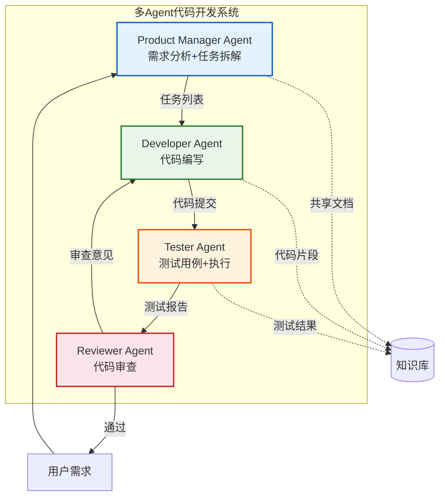

**关键设计点**：
1. 角色分工：PM拆解需求 → Dev写代码 → Test测试 → Review审查
2. 通信方式：通过共享代码仓库（黑板模式）传递
3. 质量控制：Review不通过则打回Dev修改
4. 工具：代码编辑器、测试框架、Git操作

---

## 8. 总结与记忆口诀

### 8.1 三层架构速记

```
感知层 —— "看听闻" —— 理解世界
  ├── 多模态解析：处理文本/图像/语音
  ├── 意图识别：判断用户想做什么
  └── 上下文管理：控制 token 预算

思考层 —— "想计划" —— 决策大脑
  ├── ReAct：边想边做，灵活调整
  ├── Plan-Execute：先规划，后执行
  ├── Reflection：做完反思，自我纠错
  └── 三级记忆：短期/工作/长期

行动层 —— "手脚嘴" —— 执行落地
  ├── Function Calling：结构化工具调用
  ├── 工具注册表：统一管理可用工具
  ├── 并行执行：独立任务并行处理
  └── 错误恢复：重试/降级/Fallback
```

### 8.2 面试回答框架

当被问到 Agent 架构设计时，按以下框架回答：

1. **总述**：Agent = 感知 + 思考 + 行动的闭环系统
2. **分层阐述**：每层说清职责、技术、挑战
3. **协同机制**：三层如何协作（ReAct 循环）
4. **记忆系统**：三级记忆的设计
5. **工程考量**：错误处理、循环检测、性能优化
6. **实际案例**：结合自己做过的项目举例

### 8.3 核心概念关键词

| 概念 | 关键词 |
|------|--------|
| 感知层 | 多模态、意图识别、NER、槽位填充、上下文窗口 |
| 思考层 | ReAct、Plan-and-Execute、Reflection、CoT、任务分解 |
| 行动层 | Function Calling、工具注册、参数校验、并行执行 |
| 记忆系统 | 短期记忆、工作记忆、长期记忆、向量检索、记忆压缩 |
| 多 Agent | 角色分工、消息传递、黑板模式、发布-订阅 |

---

> **最后提醒**：面试中不要只背概念，一定要结合项目经验说明"你在实践中遇到过什么问题、如何解决的"。架构理解的深度体现在对**边界情况和失败场景**的处理上。
