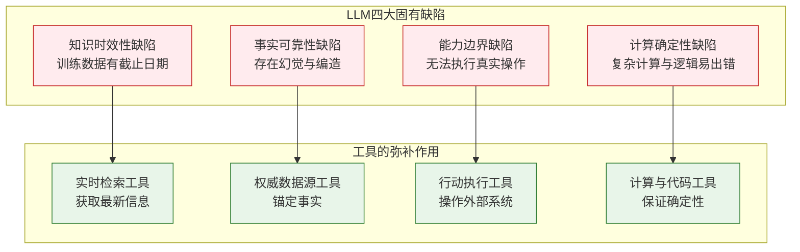
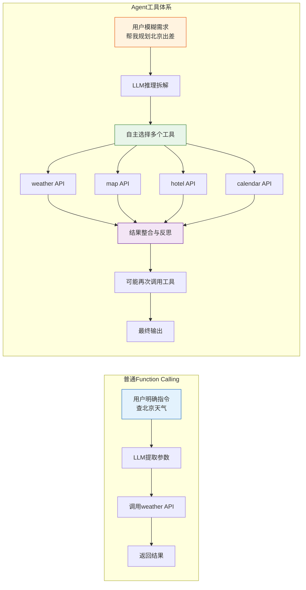
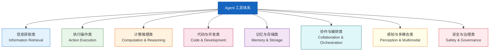
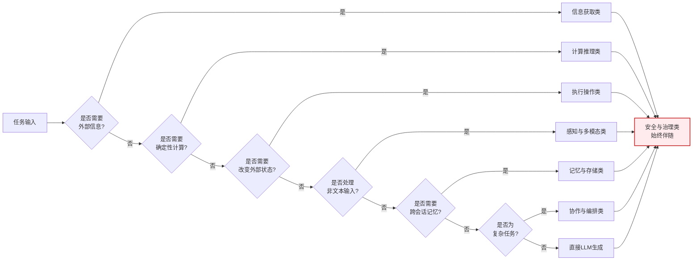
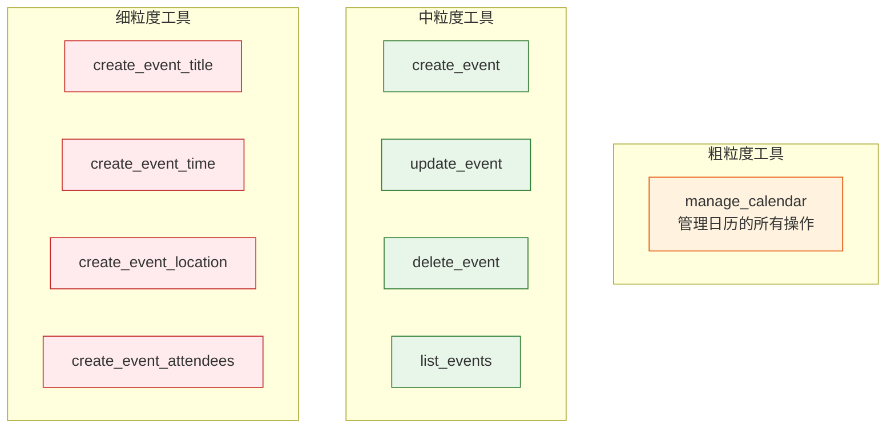

# Agent 工具体系：核心价值与分类详解

> 本文档系统阐述 Agent 工具（Tools）的核心价值、设计哲学与分类体系，为开发者在构建 Agent 系统时提供选型依据、设计准则与落地参考。

---

## 目录

- [1. 文档定位](#1-文档定位)
- [2. 工具的核心价值](#2-工具的核心价值)
  - [2.1 关键问题：为什么 Agent 必须有工具](#21-关键问题为什么-agent-必须有工具)
  - [2.2 具体优势](#22-具体优势)
  - [2.3 与同类工具的差异化特点](#23-与同类工具的差异化特点)
- [3. Agent 工具分类体系](#3-agent-工具分类体系)
  - [3.1 分类总览](#31-分类总览)
  - [3.2 分类一：信息获取类（Information Retrieval）](#32-分类一信息获取类information-retrieval)
  - [3.3 分类二：执行操作类（Action Execution）](#33-分类二执行操作类action-execution)
  - [3.4 分类三：计算推理类（Computation & Reasoning）](#34-分类三计算推理类computation--reasoning)
  - [3.5 分类四：代码与开发类（Code & Development）](#35-分类四代码与开发类code--development)
  - [3.6 分类五：记忆与存储类（Memory & Storage）](#36-分类五记忆与存储类memory--storage)
  - [3.7 分类六：协作与编排类（Collaboration & Orchestration）](#37-分类六协作与编排类collaboration--orchestration)
  - [3.8 分类七：感知与多模态类（Perception & Multimodal）](#38-分类七感知与多模态类perception--multimodal)
  - [3.9 分类八：安全与治理类（Safety & Governance）](#39-分类八安全与治理类safety--governance)
- [4. 工具选型决策矩阵](#4-工具选型决策矩阵)
- [5. 工具设计最佳实践](#5-工具设计最佳实践)
- [6. 常见反模式与避坑指南](#6-常见反模式与避坑指南)
- [7. 总结与记忆口诀](#7-总结与记忆口诀)

---

## 1. 文档定位

| 维度 | 说明 |
|------|------|
| **目标读者** | AI Agent 开发者、架构师、工具设计者 |
| **核心目标** | 阐明 Agent 工具的价值主张，建立系统化分类体系，指导工具选型与设计 |
| **适用场景** | Agent 系统设计、工具选型评估、自研工具规划、面试与培训 |
| **前置知识** | 了解 LLM 基本原理、Function Calling 机制、Agent 三层架构（感知-思考-行动） |

---

## 2. 工具的核心价值

### 2.1 关键问题：为什么 Agent 必须有工具

LLM 作为 Agent 的"大脑"，本身存在四大**固有缺陷**，工具正是弥补这些缺陷的关键手段：



#### 关键问题清单

| # | 关键问题 | 缺陷表现 | 工具解决方案 |
|---|---------|---------|-------------|
| 1 | **知识时效性** | 无法回答训练截止日期之后的最新事件 | 联网搜索、新闻 API、实时数据接口 |
| 2 | **事实可靠性** | 生成看似合理但虚假的内容（幻觉） | 知识库检索（RAG）、数据库查询、引用溯源 |
| 3 | **能力边界** | 只能"说"不能"做"，无法影响真实世界 | 邮件发送、文件操作、API 调用、设备控制 |
| 4 | **计算确定性** | 大数运算、复杂逻辑推理易出错 | 代码解释器、计算器、规则引擎 |
| 5 | **领域专业性** | 通用知识丰富但垂直领域深度不足 | 专业 API（金融、医疗、法律、地理） |
| 6 | **上下文容量** | 上下文窗口有限，长文本处理受限 | 向量数据库、外部存储、分块检索 |

### 2.2 具体优势

#### 优势一：能力扩展（Capability Extension）

工具让 LLM 从**"语言模型"** 升级为**"行动模型"**。

```
LLM 本身能力：理解 → 推理 → 表达
+ 工具后能力：理解 → 推理 → 表达 → 执行 → 验证 → 反思 → 再执行
```

#### 优势二：可靠性提升（Reliability Enhancement）

| 评估维度 | 无工具 | 有工具 |
|---------|--------|--------|
| 事实准确率 | 70%~85%（易幻觉） | 95%+（可溯源） |
| 实时性 | 训练截止日为止 | 实时 |
| 复杂计算 | 经常出错 | 接近 100% 正确 |
| 任务完成度 | 仅能给建议 | 可端到端完成 |

#### 优势三：成本与效率优化

- **减少 Token 消耗**：将"长文本生成"替换为"工具调用 + 简短结果"
- **降低重试次数**：工具结果确定性强，减少 LLM 反复推理
- **提升响应速度**：外部 API 通常比 LLM 生成长文本更快

#### 优势四：可审计与可治理

工具调用是**结构化、可记录、可回放**的，使得 Agent 行为可追溯、可审计、可治理，满足企业级合规需求。

### 2.3 与同类工具的差异化特点

#### 与传统软件工具的对比

| 维度 | 传统软件工具（如 REST API） | Agent 工具 |
|------|---------------------------|-----------|
| **调用方式** | 硬编码、显式调用 | LLM 自主决策调用 |
| **参数来源** | 开发者预先设定 | LLM 从自然语言中动态提取 |
| **调用时机** | 程序流程固定 | 根据上下文动态决定 |
| **错误处理** | 抛异常由上层捕获 | 反馈给 LLM 进行反思重试 |
| **组合方式** | 代码编排 | LLM 自主编排（链式/并行/循环） |
| **使用者** | 开发者 | LLM（代理最终用户） |

#### 与普通 Function Calling 的对比



#### 三大差异化特点

1. **自主性（Autonomy）**：Agent 工具由 LLM 根据目标自主选择与编排，无需人工预设流程
2. **可组合性（Composability）**：工具间可被 LLM 灵活组合，形成"工具链"或"工具图"
3. **反思性（Reflectivity）**：工具执行结果反馈给 LLM，触发反思与重新规划，形成闭环

---

## 3. Agent 工具分类体系

### 3.1 分类总览

按**功能模块**为主维度，结合**应用场景**与**技术特性**，将 Agent 工具划分为八大类：



#### 八大类速查表

| 分类 | 核心职责 | 典型工具 | 使用频次 |
|------|---------|---------|---------|
| 信息获取类 | 获取外部信息 | 搜索引擎、知识库、数据库 | ★★★★★ |
| 执行操作类 | 改变外部世界 | 邮件、文件、API、设备控制 | ★★★★ |
| 计算推理类 | 确定性计算 | 计算器、代码解释器、规则引擎 | ★★★★ |
| 代码与开发类 | 代码生成与执行 | 代码执行、Git、终端 | ★★★★ |
| 记忆与存储类 | 状态持久化 | 向量库、KV 存储、长期记忆 | ★★★ |
| 协作与编排类 | 多 Agent 协同 | 子 Agent 调用、任务分发 | ★★★ |
| 感知与多模态类 | 理解非文本输入 | 图像识别、语音、OCR | ★★★ |
| 安全与治理类 | 保障安全合规 | 权限校验、审计、脱敏 | ★★ |

---

### 3.2 分类一：信息获取类（Information Retrieval）

#### 定义

通过检索、查询、订阅等方式，从外部数据源**获取信息**但不修改数据源的工具集合。

#### 子分类

| 子类 | 说明 | 典型工具 |
|------|------|---------|
| **网络搜索** | 从公开互联网获取信息 | Google Search API、Bing Search、Tavily、SerpAPI |
| **知识库检索** | 从私有知识库获取结构化/非结构化信息 | RAG 检索器、Elasticsearch、Pinecone 查询 |
| **数据库查询** | 从结构化数据库获取数据 | SQL 查询工具、MongoDB 查询、GraphQL 查询 |
| **实时数据接口** | 获取实时变化的数据 | 天气 API、股票 API、新闻 API、汇率 API |
| **专业数据源** | 垂直领域权威数据 | 法律法规库、医学知识库、专利库 |

#### 典型应用示例

**场景 1：智能客服**
> 用户："你们公司去年营收多少？"
> Agent 工具链：意图识别 → 内部财务数据库查询 → 结果校验 → 自然语言回复

**场景 2：研究助手**
> 用户："帮我调研一下 2025 年大模型推理优化的最新进展"
> Agent 工具链：搜索引擎（多轮）→ 论文库检索 → 摘要生成 → 引用整理

#### 使用条件

- ✅ LLM 训练数据可能过时
- ✅ 需要权威、可溯源的事实
- ✅ 需要实时变化的数据
- ❌ 数据源不可访问或质量差
- ❌ 查询成本过高且非必要

---

### 3.3 分类二：执行操作类（Action Execution）

#### 定义

能够**改变外部世界状态**的工具，包括发送消息、创建文件、调用 API、控制设备等。

#### 子分类

| 子类 | 说明 | 典型工具 |
|------|------|---------|
| **通信类** | 发送信息到外部 | 邮件发送、短信、IM 消息、Slack 通知 |
| **文件操作类** | 创建/修改/删除文件 | 文件系统操作、文档生成、PDF 处理 |
| **API 调用类** | 调用第三方服务 API | OAuth 授权 API、SaaS 服务 API、内部微服务 |
| **设备控制类** | 控制物理或虚拟设备 | 智能家居控制、IoT 设备、机器人控制 |
| **流程触发类** | 触发业务流程 | 工作流引擎、CI/CD 触发、定时任务创建 |

#### 典型应用示例

**场景 1：办公自动化 Agent**
> 用户："把昨天会议纪要发给项目组所有人，并创建一个跟进任务"
> Agent 工具链：读取文件（文件操作）→ 提取邮件地址（数据库查询）→ 发送邮件（通信类）→ 创建任务（流程触发类）

**场景 2：DevOps Agent**
> 用户："给生产环境回滚到上一个版本"
> Agent 工具链：版本查询 → 回滚执行（CI/CD 触发）→ 健康检查 → 结果通知

#### 使用条件

- ✅ 用户明确授权（执行类工具必须有人工确认机制）
- ✅ 操作可回滚或影响可控
- ✅ 具备权限校验与审计日志
- ❌ 高危操作未设置人工 in-the-loop
- ❌ 缺乏操作回滚机制

#### 安全提示

> ⚠️ 执行操作类工具必须配合**安全与治理类**工具使用，建议采用"双签确认"机制：LLM 提议 → 人工确认 → 执行。

---

### 3.4 分类三：计算推理类（Computation & Reasoning）

#### 定义

执行**确定性计算与逻辑推理**的工具，弥补 LLM 在数值计算、复杂逻辑、规则匹配上的不足。

#### 子分类

| 子类 | 说明 | 典型工具 |
|------|------|---------|
| **数值计算** | 精确数学运算 | 计算器、统计分析、金融计算 |
| **代码解释器** | 通过执行代码完成计算 | Python REPL、Jupyter 内核、Node.js 执行 |
| **规则引擎** | 基于规则集的推理 | Drools、业务规则匹配、合规校验 |
| **数学求解器** | 符号计算与方程求解 | SymPy、Wolfram Alpha、优化求解器 |
| **数据统计分析** | 数据处理与分析 | Pandas 操作、SQL 聚合、可视化生成 |

#### 典型应用示例

**场景 1：数据分析 Agent**
> 用户："分析这份销售数据，找出环比增长超过 20% 的品类"
> Agent 工具链：读取 CSV（文件操作）→ Pandas 计算（代码解释器）→ 生成图表（可视化）→ 解读结果

**场景 2：金融计算 Agent**
> 用户："计算这笔等额本息贷款的月供和总利息"
> Agent 工具链：参数提取 → 金融公式计算（计算器）→ 多方案对比（代码解释器）→ 推荐方案

#### 使用条件

- ✅ 涉及大数运算、浮点精度要求高
- ✅ 需要确定性、可重复的结果
- ✅ 复杂多步逻辑推理
- ❌ 简单口算即可完成的计算（避免工具调用开销）

---

### 3.5 分类四：代码与开发类（Code & Development）

#### 定义

围绕**代码生成、执行、调试、版本管理**的工具，专门服务于开发场景。

#### 子分类

| 子类 | 说明 | 典型工具 |
|------|------|---------|
| **代码执行沙箱** | 安全执行用户/生成代码 | Docker 沙箱、E2B、WebAssembly 运行时 |
| **代码搜索** | 在代码库中检索 | 语义搜索、符号查找、引用追踪 |
| **代码生成与编辑** | 生成或修改代码文件 | 文件编辑工具、AST 操作、模板渲染 |
| **版本控制** | Git 操作 | 仓库克隆、提交、分支、PR 创建 |
| **终端执行** | 执行 Shell 命令 | Bash 执行、命令管道、进程管理 |
| **构建与测试** | 编译、测试、部署 | 构建工具、测试运行器、部署脚本 |

#### 典型应用示例

**场景 1：编程助手 Agent（如 Trae、Cursor）**
> 用户："给这个 React 组件加上错误边界"
> Agent 工具链：读取文件 → 代码搜索（查找组件）→ 代码编辑 → 运行测试 → 反馈结果

**场景 2：自动化运维 Agent**
> 用户："排查一下线上服务的内存泄漏"
> Agent 工具链：终端执行（top/ps）→ 日志查询 → 代码搜索 → 提交修复 PR

#### 使用条件

- ✅ 需要实际执行代码验证结果
- ✅ 操作真实代码库
- ⚠️ 必须使用沙箱隔离执行环境
- ⚠️ 终端命令需限制权限白名单

---

### 3.6 分类五：记忆与存储类（Memory & Storage）

#### 定义

负责 Agent **状态的持久化与检索**，包括短期工作记忆、长期记忆、外部存储。

#### 子分类

| 子类 | 说明 | 典型工具 |
|------|------|---------|
| **向量存储** | 语义相似度检索 | Pinecone、Milvus、Chroma、Weaviate |
| **KV 存储** | 结构化键值存取 | Redis、DynamoDB、内部状态存储 |
| **关系型存储** | 复杂关系数据 | PostgreSQL、MySQL |
| **图存储** | 实体关系图谱 | Neo4j、知识图谱 |
| **长期记忆** | Agent 跨会话记忆 | 用户偏好、历史对话、经验沉淀 |
| **工作记忆** | 当前任务上下文 | 短期上下文窗口管理、关键信息暂存 |

#### 典型应用示例

**场景 1：个性化助手**
> 用户（一个月前）："我对花生过敏"
> 用户（今天）："推荐一道菜"
> Agent 工具链：长期记忆检索（用户偏好）→ 菜谱搜索 → 过滤含花生菜品 → 推荐

**场景 2：多轮研究 Agent**
> Agent 在多轮调研中，使用工作记忆暂存中间结论，使用向量库存储已读论文摘要，避免重复检索

#### 使用条件

- ✅ 需要跨会话保留信息
- ✅ 上下文超出 LLM 窗口
- ✅ 需要语义检索（而非常精确匹配）
- ❌ 单轮、短上下文任务（无需引入记忆开销）

---

### 3.7 分类六：协作与编排类（Collaboration & Orchestration）

#### 定义

支持**多 Agent 协同**、任务分发、子 Agent 调用、人机协作的工具。

#### 子分类

| 子类 | 说明 | 典型工具 |
|------|------|---------|
| **子 Agent 调用** | 启动子 Agent 执行子任务 | 子 Agent 启动器、Agent 路由器 |
| **任务分发** | 将复杂任务分解并分发 | 任务队列、工作流编排、Map-Reduce 模式 |
| **消息传递** | Agent 间通信 | 消息总线、共享黑板、事件总线 |
| **人机协作** | 调用人类专家 | 人工确认、人工标注、人在环路 |
| **外部 Agent 调用** | 调用其他 Agent 系统 | MCP 协议、A2A 协议、跨平台 Agent 互联 |

#### 典型应用示例

**场景 1：多 Agent 协同（如 MetaGPT）**
> 用户："开发一个待办应用"
> Agent 工具链：Product Manager Agent → Architect Agent → Developer Agent → QA Agent
> 编排工具负责任务分发与结果汇聚

**场景 2：人机协作**
> Agent 在执行高危操作前，通过"人工确认"工具暂停流程，等待人类审批后继续

#### 使用条件

- ✅ 单个 Agent 能力不足以完成复杂任务
- ✅ 不同子任务需要不同专业能力
- ✅ 高危决策需要人工介入
- ❌ 简单任务无需引入多 Agent 复杂度

---

### 3.8 分类七：感知与多模态类（Perception & Multimodal）

#### 定义

处理**非文本输入**（图像、语音、视频）或生成**非文本输出**的工具，扩展 Agent 的感知与表达能力。

#### 子分类

| 子类 | 说明 | 典型工具 |
|------|------|---------|
| **图像理解** | 识别图像内容 | OCR、目标检测、图像描述、VLM |
| **语音处理** | 语音转文本/文本转语音 | ASR、TTS、语音克隆 |
| **视频处理** | 视频分析与生成 | 视频摘要、关键帧提取、视频生成 |
| **文档解析** | 解析复杂文档 | PDF 解析、表格提取、公式识别 |
| **多模态生成** | 生成图像/音频/视频 | 文生图、文生视频、音乐生成 |

#### 典型应用示例

**场景 1：文档智能 Agent**
> 用户上传一份扫描版合同 → Agent 调用 OCR 工具提取文本 → 关键条款识别 → 风险点提示

**场景 2：视觉助手**
> 用户："看看这张图里的菜怎么做"
> Agent 工具链：图像识别（菜品）→ 菜谱检索 → 步骤生成

#### 使用条件

- ✅ 输入包含非文本模态
- ✅ 需要生成富媒体内容
- ⚠️ 多模态工具调用成本较高，需合理缓存

---

### 3.9 分类八：安全与治理类（Safety & Governance）

#### 定义

保障 Agent 行为**安全、合规、可控**的工具，是 Agent 落地生产的"护栏"。

#### 子分类

| 子类 | 说明 | 典型工具 |
|------|------|---------|
| **权限校验** | 校验调用者权限 | RBAC 校验、ACL 检查、OAuth 鉴权 |
| **内容审核** | 过滤敏感/有害内容 | 文本审核、图像审核、prompt 注入检测 |
| **审计日志** | 记录所有工具调用 | 调用日志、参数记录、结果留痕 |
| **脱敏与匿名化** | 保护敏感信息 | PII 脱敏、数据匿名、差分隐私 |
| **限流与配额** | 防止滥用 | 调用频率限制、配额管理、熔断 |
| **沙箱隔离** | 隔离执行环境 | 容器隔离、权限沙箱、网络隔离 |

#### 典型应用示例

**场景：企业级 Agent 部署**
> 在所有工具调用前，统一接入"安全与治理"中间件：
> 1. **权限校验**：用户是否有权调用该工具
> 2. **内容审核**：输入参数是否含敏感信息
> 3. **脱敏处理**：返回结果中的 PII 自动脱敏
> 4. **审计日志**：全链路记录调用上下文
> 5. **限流熔断**：防止异常调用拖垮系统

#### 使用条件

- ✅ 生产环境部署的 Agent
- ✅ 处理敏感数据（用户隐私、商业机密）
- ✅ 执行有真实世界影响的操作
- ❌ 仅本地实验性 Agent（可适当简化）

---

## 4. 工具选型决策矩阵

根据任务特征选择合适的工具组合：



#### 选型优先级建议

| 优先级 | 原则 | 说明 |
|-------|------|------|
| P0 | **最小工具集** | 能用 LLM 直接完成的，不引入工具 |
| P1 | **官方/标准工具优先** | 优先使用 MCP 等标准协议工具 |
| P2 | **可组合性优先** | 选择可被灵活组合的原子工具 |
| P3 | **安全优先** | 高危操作必须有治理工具配套 |
| P4 | **成本可控** | 评估工具调用成本，避免过度调用 |

---

## 5. 工具设计最佳实践

### 5.1 工具描述（Description）撰写准则

工具描述是 LLM 选择工具的**唯一依据**，质量直接决定调用准确率。

```markdown
✅ 好的工具描述：
"查询指定城市的实时天气。输入城市名称（中文或拼音），返回温度、湿度、
天气状况、风力等级。适用于需要根据天气做决策的场景，如出行规划、
户外活动安排。不适用于查询历史天气（请使用 get_historical_weather）。"

❌ 差的工具描述：
"获取天气"  // 太简单，LLM 不知道何时该用
```

**准则**：
1. **说明功能**：做什么
2. **说明参数**：每个参数的含义、类型、约束
3. **说明返回**：返回数据结构
4. **说明适用场景**：什么时候用
5. **说明不适用场景**：什么时候不用（避免误用）
6. **说明与其他工具的区别**：避免冲突

### 5.2 工具粒度设计



**建议**：采用**中粒度**工具，每个工具完成一个完整的语义动作。

### 5.3 错误反馈设计

工具的错误信息会反馈给 LLM 进行反思，必须**结构化、可操作**：

```json
// ✅ 好的错误返回
{
  "success": false,
  "error_type": "invalid_parameter",
  "error_message": "城市名 'xyz' 未找到，请使用中文或拼音，如 'beijing' 或 '北京'",
  "suggestion": "可调用 list_supported_cities 工具获取支持的城市列表"
}

// ❌ 差的错误返回
"error"  // LLM 无法理解如何修复
```

### 5.4 幂等性与重试

- 执行操作类工具应设计为**幂等**（如带 idempotency_key）
- 信息获取类工具应支持**安全重试**
- 提供 `retry_count` 与 `timeout` 配置

---

## 6. 常见反模式与避坑指南

| 反模式 | 表现 | 后果 | 正确做法 |
|-------|------|------|---------|
| **工具过载** | 给 Agent 注册 100+ 工具 | LLM 选择困难，准确率下降 | 按场景动态加载工具子集 |
| **描述模糊** | 工具描述只有一句话 | LLM 误调或漏调 | 详细描述功能/参数/场景 |
| **粒度不当** | 工具太粗或太细 | 调用失败或调用次数爆炸 | 中粒度，单一语义动作 |
| **缺安全护栏** | 执行类工具无确认 | 误操作造成损失 | 高危操作人工确认 |
| **错误不可恢复** | 工具失败后无重试机制 | 任务直接中断 | 结构化错误 + LLM 反思重试 |
| **忽视成本** | 每轮都调用昂贵工具 | 成本失控 | 缓存 + 调用频率控制 |
| **耦合过紧** | 工具间硬编码依赖 | 无法灵活组合 | 工具解耦，LLM 自主编排 |

---

## 7. 总结与记忆口诀

### 7.1 核心价值三句话

1. **工具是 LLM 的"手和眼"**：让模型从"会说话"变成"会做事"
2. **工具是事实的锚点**：用确定性接口对抗 LLM 的概率性幻觉
3. **工具是能力的放大器**：通过组合，让有限工具产生无限可能

### 7.2 八大分类记忆口诀

> **信执算码，记协感安**

| 字 | 分类 | 一句话记忆 |
|----|------|-----------|
| 信 | 信息获取 | 看：搜索、检索、查询 |
| 执 | 执行操作 | 做：发邮件、调 API、控设备 |
| 算 | 计算推理 | 算：计算器、代码、规则 |
| 码 | 代码与开发 | 写：代码执行、Git、终端 |
| 记 | 记忆与存储 | 记：向量库、KV、长期记忆 |
| 协 | 协作与编排 | 联：多 Agent、任务分发 |
| 感 | 感知多模态 | 感：图像、语音、视频 |
| 安 | 安全与治理 | 护：权限、审计、脱敏 |

### 7.3 设计原则三字诀

> **准、稳、安**

- **准**：工具描述准确，LLM 能选对
- **稳**：错误可恢复，结果可重试
- **安**：操作有护栏，行为可审计

---

> **延伸阅读**：本文档聚焦工具体系，与同目录下 [6Agent核心架构逻辑面试专项.md](./6Agent核心架构逻辑面试专项.md) 的"感知-思考-行动"三层架构配合阅读，可形成完整的 Agent 工程知识体系。
