# Function Calling 与普通 API 调用核心区别系统性对比深度解析

> **文档定位**:本文档是 Tool Calling / Function Calling 系列的第一篇核心文档,从八个核心维度系统性地对比 **Function Calling(函数调用)** 与 **普通 API 调用** 两种技术的本质差异。本文不仅阐述技术概念,更从 Agent 系统架构的视角,分析两种调用方式在智能体中扮演的角色,为工程选型提供清晰的决策依据。
>
> **前置知识建议**:建议先阅读 [42Agent工具选择决策机制深度解析.md](../3Agent%20架构设计/42Agent工具选择决策机制深度解析.md) 理解工具选择的通用方法论,以及 [88LangChain与LangGraph核心区别系统性对比深度解析.md](../6Agent%20Framework/88LangChain与LangGraph核心区别系统性对比深度解析.md) 理解上层框架的工具调用集成方式。

---

## 目录

- [一、核心概念定义与本质区别](#一核心概念定义与本质区别)
- [二、调用机制对比](#二调用机制对比)
- [三、参数传递对比](#三参数传递对比)
- [四、返回处理对比](#四返回处理对比)
- [五、使用场景对比](#五使用场景对比)
- [六、交互方式对比](#六交互方式对比)
- [七、错误处理对比](#七错误处理对比)
- [八、集成方式对比](#八集成方式对比)
- [九、在 AI Agent 系统中的作用对比](#九在-ai-agent-系统中的作用对比)
- [十、全维度对比总表](#十全维度对比总表)
- [十一、选型决策指南](#十一选型决策指南)
- [十二、进阶组合架构](#十二进阶组合架构)
- [十三、总结](#十三总结)

---

## 一、核心概念定义与本质区别

### 1.1 什么是普通 API 调用

**普通 API 调用**是指客户端代码通过显式代码直接调用外部服务接口,开发者完全控制调用时机、参数和执行逻辑。

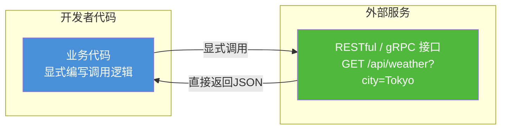

**核心特征**:
- **控制权在开发者**:何时调用、传什么参数、如何处理结果,全部在代码中写死
- **确定性**:相同输入 → 相同调用 → 相同结果(理想情况下)
- **单轮请求-响应**:一次请求,一次响应,流程结束

### 1.2 什么是 Function Calling

**Function Calling(函数调用)** 是大语言模型(LLM)的一种能力:模型根据用户输入,**自主决策**是否调用某个预注册的工具函数,并结构化输出调用请求,由应用代码执行后将结果回传给模型继续推理。

```mermaid
flowchart LR
    subgraph 用户
        USER[用户输入<br/>"东京现在天气怎么样?"]
    end
    
    subgraph LLM 推理
        LLM1[LLM 分析意图]
        LLM2[LLM 决策: 需要调用天气工具]
        LLM3[LLM 结构化输出调用请求<br/>{name: get_weather, args: {city: Tokyo}}]
    end
    
    subgraph 应用代码
        APP1[捕获 tool_calls 字段]
        APP2[执行 get_weather 函数]
    end
    
    subgraph 外部服务
        API[天气 API]
    end
    
    subgraph LLM 继续推理
        LLM4[LLM 基于工具结果生成回答]
    end
    
    USER --> LLM1 --> LLM2 --> LLM3 --> APP1 --> APP2 --> API
    API -->|结果JSON| APP2
    APP2 -->|tool_response 回传| LLM4
    LLM4 -->|自然语言回答| USER
    
    style LLM1 fill:#fa8c16,color:#fff
    style LLM3 fill:#fa8c16,color:#fff
    style LLM4 fill:#fa8c16,color:#fff
    style APP1 fill:#4a90d9,color:#fff
```

**核心特征**:
- **控制权在 LLM**:由模型自主决策"是否调用、调用哪个、传什么参数"
- **非确定性**:相同输入可能触发不同调用(取决于模型推理)
- **多轮上下文**:工具执行完成后,结果回传给 LLM,LLM 基于结果继续推理(可能再调用其他工具)

### 1.3 本质区别一句话总结

> **普通 API 调用是"代码命令机器做",Function Calling 是"LLM 让代码去做"。前者是显式控制流,后者是 LLM 驱动的隐式控制流。**

### 1.4 技术栈分层关系

Function Calling 并不是 API 调用的替代品,而是在普通 API 调用之上增加了一层 **LLM 决策层**:

```mermaid
flowchart TB
    subgraph 第4层: Agent 编排层
        AGENT[Agent Orchestration<br/>LangGraph / CrewAI / AutoGen]
    end
    
    subgraph 第3层: LLM 决策层 (Function Calling)
        FC[LLM Function Calling<br/>模型自主决定调用]
    end
    
    subgraph 第2层: SDK 适配层
        SDK[OpenAI SDK / Anthropic SDK / MCP]
    end
    
    subgraph 第1层: 实际调用层 (普通API)
        API[普通 API 调用<br/>REST / gRPC / SDK / 本地函数]
    end
    
    AGENT --> FC
    FC --> SDK
    SDK --> API
    
    style AGENT fill:#722ed1,color:#fff
    style FC fill:#fa8c16,color:#fff
    style SDK fill:#4a90d9,color:#fff
    style API fill:#50b83c,color:#fff
```

| 层级 | 技术 | 控制权 | 确定性 |
|------|------|-------|--------|
| 第1层 | 普通 API 调用 | 开发者 | 确定性 |
| 第2层 | SDK 适配 | 开发者 | 确定性 |
| 第3层 | Function Calling | LLM | 非确定性 |
| 第4层 | Agent 编排 | LLM + 规则 | 半确定性 |

---

## 二、调用机制对比

### 2.1 普通 API 调用机制

普通 API 调用的机制简单直接:代码直接发起 HTTP/gRPC 请求。

```python
# 普通 API 调用:开发者显式控制调用时机和参数
import requests

def get_user_order_status(user_id: str) -> dict:
    """
    普通 API 调用示例:获取用户订单状态
    完全由开发者控制:何时调用、传什么参数、如何处理响应
    """
    # 1. 开发者显式构造请求
    url = f"https://api.example.com/orders"
    params = {"user_id": user_id, "limit": 10}
    headers = {"Authorization": f"Bearer {API_KEY}"}
    
    # 2. 开发者显式发起调用
    response = requests.get(url, params=params, headers=headers, timeout=10)
    
    # 3. 开发者显式处理响应
    if response.status_code == 200:
        data = response.json()
        return {"status": "success", "orders": data.get("orders", [])}
    else:
        return {"status": "error", "code": response.status_code, "message": response.text}


# 调用:开发者显式决定"在这里调用"
order_result = get_user_order_status("user-123")
print(f"订单状态: {order_result}")
```

**调用时序**:

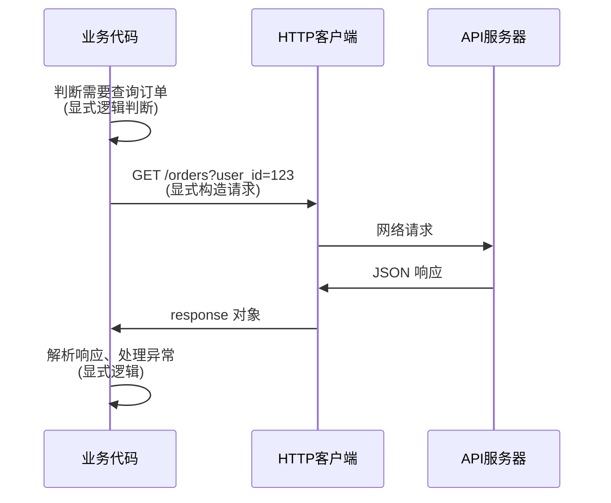

### 2.2 Function Calling 机制

Function Calling 的机制复杂得多,是一个**多轮上下文循环**:

```python
# Function Calling: 由 LLM 自主决定调用时机和参数
from openai import OpenAI
import json

client = OpenAI()

# Step 1: 开发者预先定义工具 Schema (告诉 LLM 有哪些工具可用)
tools = [{
    "type": "function",
    "function": {
        "name": "get_order_status",
        "description": "获取指定用户的订单状态列表",
        "parameters": {
            "type": "object",
            "properties": {
                "user_id": {
                    "type": "string",
                    "description": "用户唯一标识ID"
                },
                "limit": {
                    "type": "integer",
                    "description": "最多返回多少条订单,默认10"
                }
            },
            "required": ["user_id"]
        }
    }
}]

# Step 2: 实际函数实现(普通 API 调用)
def get_order_status(user_id: str, limit: int = 10) -> str:
    """实际执行的函数,内部仍然是普通 API 调用"""
    import requests
    response = requests.get(
        "https://api.example.com/orders",
        params={"user_id": user_id, "limit": limit},
        headers={"Authorization": f"Bearer {API_KEY}"}
    )
    return json.dumps(response.json())  # 返回字符串,供 LLM 理解


# Step 3: 主循环 - 多轮交互(LLM 决策 → 代码执行 → 结果回传 → LLM 继续推理)
def chat_with_tools(user_input: str, messages: list = None):
    messages = messages or [{"role": "user", "content": user_input}]
    
    # 第一轮:LLM 收到用户输入,自主决策是否需要调用工具
    response = client.chat.completions.create(
        model="gpt-4o",
        messages=messages,
        tools=tools,
        tool_choice="auto"  # 让 LLM 自主决定
    )
    
    response_message = response.choices[0].message
    
    # 判断:LLM 是否决定要调用工具?
    if response_message.tool_calls:
        # LLM 说:"我要调用工具",但 LLM 自己不会真的执行!
        messages.append(response_message)
        
        # 应用代码遍历 LLM 请求的工具调用,逐一执行
        for tool_call in response_message.tool_calls:
            function_name = tool_call.function.name
            function_args = json.loads(tool_call.function.arguments)
            
            # 执行对应函数(内部是普通 API 调用)
            if function_name == "get_order_status":
                function_response = get_order_status(**function_args)
            
            # 将执行结果回传给 LLM
            messages.append({
                "tool_call_id": tool_call.id,
                "role": "tool",
                "name": function_name,
                "content": function_response
            })
        
        # 第二轮:LLM 基于工具执行结果,生成最终回答
        second_response = client.chat.completions.create(
            model="gpt-4o",
            messages=messages
        )
        return second_response.choices[0].message.content
    else:
        # LLM 认为不需要工具,直接回答
        return response_message.content


# 调用:开发者只需传入用户输入,LLM 自主决定整个流程
result = chat_with_tools("帮我查一下我最近的订单状态")
print(result)
```

**调用时序(关键差异)**:

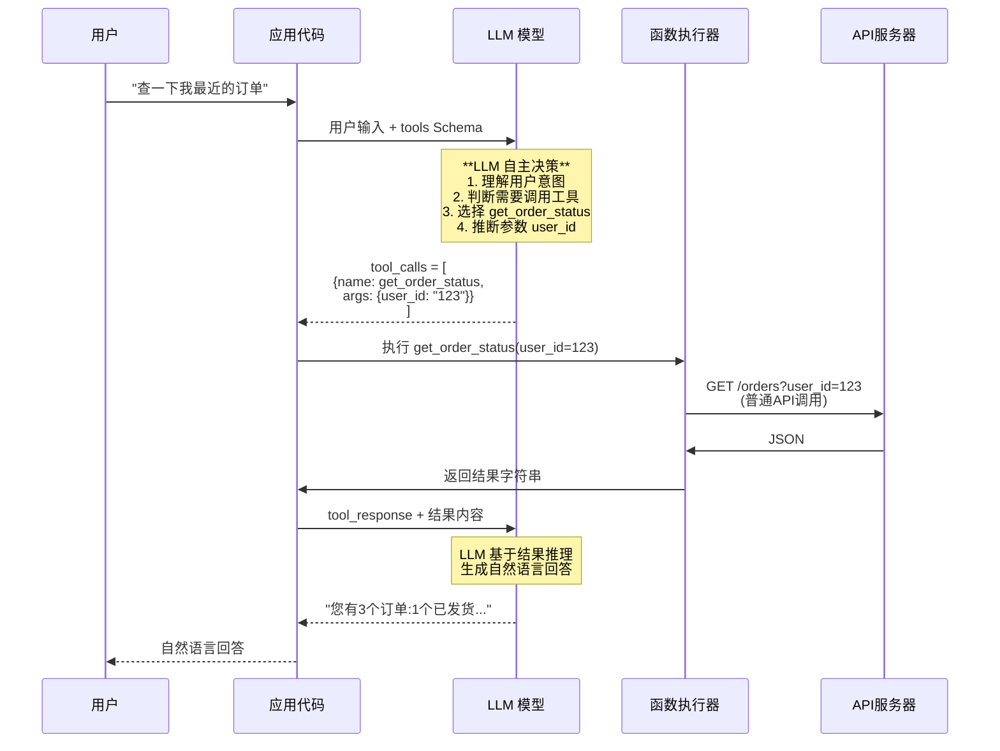

### 2.3 调用机制维度对比总结

| 机制维度 | 普通 API 调用 | Function Calling |
|---------|--------------|-----------------|
| **调用决策者** | 开发者代码(显式 if/else) | LLM 模型(自主推理) |
| **调用时机** | 代码固定位置 | 动态决定(运行时) |
| **调用目标** | 写死在代码中 | LLM 从 tools 列表中选择 |
| **调用轮数** | 单轮(请求-响应) | 多轮循环(可调用多个工具) |
| **参数来源** | 代码计算/用户输入映射 | LLM 从自然语言中提取 |
| **执行主体** | 代码直接执行 | LLM 请求 → 代码代为执行 → 结果回传 |
| **流程结束条件** | 收到响应即结束 | 直到 LLM 不再请求工具为止 |

---

## 三、参数传递对比

### 3.1 普通 API 调用的参数传递

普通 API 的参数由**开发者显式构造**,完全可控,有严格的代码约束。

```python
# 普通 API 调用参数传递:显式、强约束、编译期可检查
from pydantic import BaseModel, Field, ValidationError

class OrderQueryParams(BaseModel):
    """Pydantic 强类型参数模型"""
    user_id: str = Field(..., min_length=1, max_length=64)
    limit: int = Field(default=10, ge=1, le=100)
    status: str | None = Field(None, pattern="^(pending|shipped|delivered|cancelled)$")


def get_orders(params: OrderQueryParams) -> dict:
    """参数在函数签名中显式声明,IDE 可提示,类型检查可捕获"""
    # 参数验证:编译期/运行期均可检查
    try:
        validated = params
    except ValidationError as e:
        return {"error": f"参数错误: {e}"}
    
    # 参数映射:开发者手动映射到 API 所需格式
    query_string = {
        "user_id": validated.user_id,
        "limit": validated.limit
    }
    if validated.status:
        query_string["status"] = validated.status
    
    response = requests.get("https://api.example.com/orders", params=query_string)
    return response.json()


# 调用:参数显式传入,可追踪来源
params = OrderQueryParams(
    user_id=current_user.id,   # 来源:认证上下文
    limit=int(request.args.get("limit", 10)),  # 来源:HTTP 请求
    status=request.args.get("status")
)
result = get_orders(params)
```

**参数构造过程**:

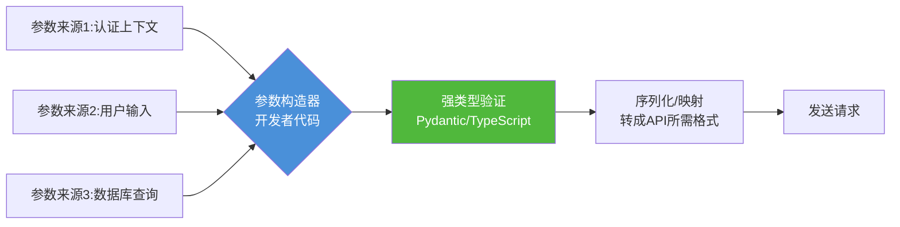

### 3.2 Function Calling 的参数传递

Function Calling 的参数由 **LLM 从自然语言中推断**,经 JSON Schema 约束后输出,应用代码反序列化执行。

```python
# Function Calling 参数传递:LLM 推断、Schema 约束、反序列化执行
from openai import OpenAI
import json

client = OpenAI()

# 1. 定义 JSON Schema:告诉 LLM 参数应该长什么样
tools = [{
    "type": "function",
    "function": {
        "name": "get_orders",
        "description": "查询用户订单列表,支持按状态筛选",
        "parameters": {
            "type": "object",
            "properties": {
                "user_id": {
                    "type": "string",
                    "description": "用户唯一ID(系统自动获取,无需用户提供)"
                },
                "limit": {
                    "type": "integer",
                    "description": "返回数量上限,范围 1-100,默认 10",
                    "minimum": 1,
                    "maximum": 100
                },
                "status": {
                    "type": "string",
                    "enum": ["pending", "shipped", "delivered", "cancelled"],
                    "description": "订单状态筛选"
                }
            },
            "required": ["user_id"]  # 告诉 LLM 必须有这个字段
        }
    }
}]

# 2. 实际函数定义:参数与 Schema 对应
def get_orders(user_id: str, limit: int = 10, status: str = None) -> str:
    params = {"user_id": user_id, "limit": limit}
    if status:
        params["status"] = status
    response = requests.get("https://api.example.com/orders", params=params)
    return json.dumps(response.json())


# 3. 参数解析与安全处理
def handle_tool_call(tool_call, user_context):
    """关键:LLM 生成的参数不能直接用,必须安全处理"""
    function_name = tool_call.function.name
    
    # Step 1: 反序列化 LLM 输出的参数字符串
    try:
        raw_args = json.loads(tool_call.function.arguments)
    except json.JSONDecodeError as e:
        return f"参数解析失败: LLM 输出了无效的 JSON。错误: {e}"
    
    # Step 2: 安全注入敏感参数(LLM 可能无法获取)
    # 例如:user_id 来自认证上下文,不能信任 LLM 传的!
    raw_args["user_id"] = user_context["authenticated_user_id"]  # 安全覆盖
    
    # Step 3: Pydantic 强类型校验
    try:
        validated_args = OrderQueryParams(**raw_args)
    except ValidationError as e:
        return f"参数校验失败: LLM 输出的参数不合法。错误: {e.errors()}"
    
    # Step 4: 执行函数
    if function_name == "get_orders":
        return get_orders(
            user_id=validated_args.user_id,
            limit=validated_args.limit,
            status=validated_args.status
        )


# 4. 用户输入(自然语言)→ LLM 提取参数
messages = [
    {"role": "system", "content": "你是订单助手。用户ID自动从系统获取。"},
    {"role": "user", "content": "帮我看看最近已发货的订单,最多20个。"}
    # 用户没有显式传任何结构化参数!
]

response = client.chat.completions.create(
    model="gpt-4o", messages=messages, tools=tools
)

# LLM 从这句话中提取出: status="shipped", limit=20
# 推断过程:
# "已发货" → status = "shipped"
# "最多20个" → limit = 20
# user_id → 由系统注入(LLM 可能不知道)
```

**参数构造过程(关键差异)**:

```mermaid
flowchart LR
    A[用户自然语言输入<br/>"查一下最近已发货的订单,最多20个"] --> LLM{LLM 参数推断<br/>1. 理解语义<br/>2. 映射到 Schema}
    LLM -->|推断| B[status: shipped]
    LLM -->|推断| C[limit: 20]
    LLM -->|缺省| D[user_id: 待注入]
    
    S[系统安全注入层<br/>认证上下文] --> D
    
    B & C & D --> P[JSON 反序列化]
    P --> V[Pydantic 强类型校验]
    V --> E[函数执行]
    
    style LLM fill:#fa8c16,color:#fff
    style S fill:#eb2f96,color:#fff
    style V fill:#50b83c,color:#fff
```

### 3.3 参数传递维度对比总结

| 参数维度 | 普通 API 调用 | Function Calling |
|---------|--------------|-----------------|
| **参数来源** | 开发者显式构造(代码计算/上下文映射) | LLM 从自然语言中推断 + 系统安全注入 |
| **参数格式声明** | 函数签名 / TypeScript Interface / Pydantic | JSON Schema(描述字段含义) |
| **参数推断** | 无(显式传入) | LLM 语义推断("已发货" → shipped) |
| **缺失参数处理** | 编译/运行时报错 | LLM 追问用户或使用默认值 |
| **参数校验时机** | 调用前(编译/运行期强校验) | 调用前(LLM 输出后再次校验,不能省!) |
| **安全性** | 参数来源可控 | 必须**不信任 LLM 参数**,需二次校验和安全注入 |
| **典型错误** | 类型错误、拼写错误(IDE可捕获) | LLM 幻觉:虚构参数、格式错误、枚举值偏差 |
| **自然语言支持** | 不支持(必须结构化) | 原生支持(从自然语言提取) |

---

## 四、返回处理对比

### 4.1 普通 API 调用的返回处理

普通 API 的响应是**结构化 JSON**,开发者编写确定性逻辑处理。

```python
# 普通 API 调用:返回处理逻辑完全写死
import requests
from typing import Optional

def process_orders_api(user_id: str) -> Optional[str]:
    """
    返回处理: 开发者显式判断 status_code、解析 JSON、处理异常
    """
    try:
        response = requests.get(
            "https://api.example.com/orders",
            params={"user_id": user_id},
            timeout=10
        )
    except requests.Timeout:
        # 情况1: 超时 - 写死处理逻辑
        return "⚠️ 请求超时,请稍后重试"
    except requests.ConnectionError:
        # 情况2: 连接错误 - 写死处理逻辑
        return "⚠️ 网络连接失败,请检查网络"
    
    # 情况3: HTTP 状态码判断 - 写死
    if response.status_code == 401:
        return "🔐 登录已过期,请重新登录"
    elif response.status_code == 403:
        return "🚫 您没有权限查看订单"
    elif response.status_code != 200:
        return f"❌ 服务器错误 ({response.status_code})"
    
    # 情况4: 成功 - 解析 JSON,写死处理逻辑
    try:
        data = response.json()
    except ValueError:
        return "❌ 响应格式错误"
    
    orders = data.get("orders", [])
    
    if not orders:
        return "📭 您还没有任何订单"
    
    # 情况5: 格式化输出 - 写死逻辑
    lines = [f"📦 您有 {len(orders)} 个订单:"]
    for order in orders:
        status_map = {
            "pending": "⏳ 待发货",
            "shipped": "🚚 已发货",
            "delivered": "✅ 已送达",
            "cancelled": "❌ 已取消"
        }
        lines.append(
            f"  • #{order['order_no']} - {order['product']} "
            f"({status_map.get(order['status'], order['status'])})"
        )
    
    return "\n".join(lines)


# 调用:返回是确定性的、可预期的
result = process_orders_api("user-123")
# 结果:
# 📦 您有 3 个订单:
#   • #20250801 - MacBook Pro (🚚 已发货)
#   • #20250802 - iPhone 16 (⏳ 待发货)
```

**返回处理流程**:

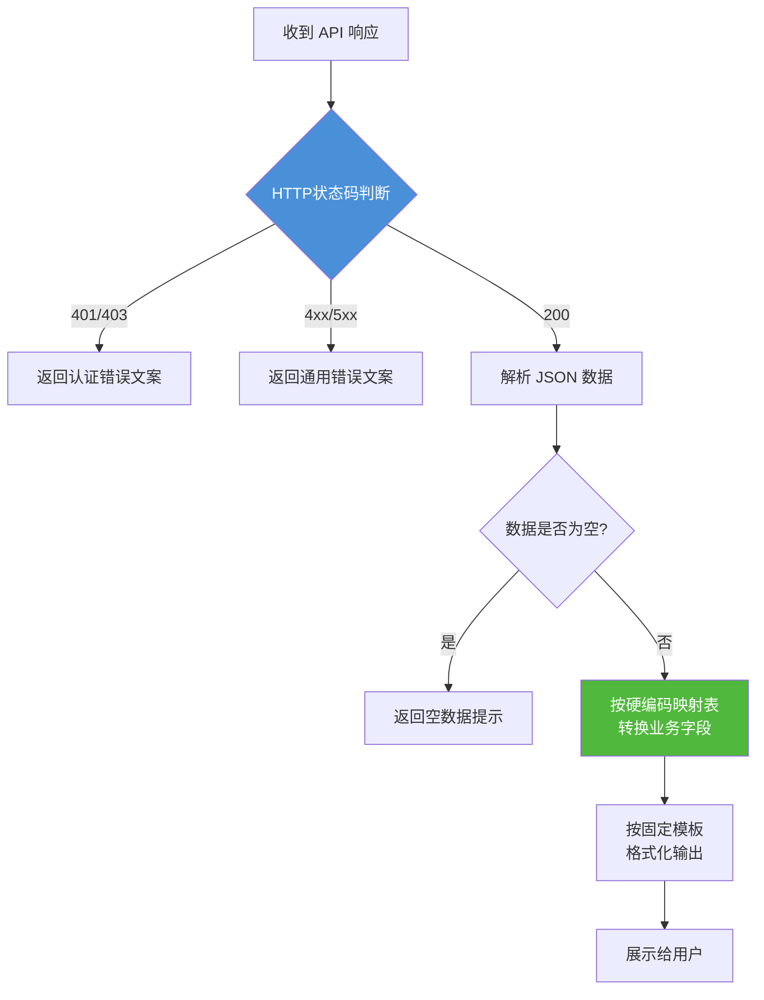

### 4.2 Function Calling 的返回处理

Function Calling 的返回分为**两层**:工具执行的原始返回(由 LLM 理解)和 LLM 基于结果生成的最终回答(自然语言)。

```python
# Function Calling: 两层返回处理
from openai import OpenAI
import json
import requests

client = OpenAI()

# 工具定义(同前)
tools = [{...}]

# ============== 第一层返回:工具函数的原始返回 ==============
def get_orders(user_id: str) -> str:
    """
    工具返回:不做格式美化,只返回 JSON 字符串供 LLM 理解
    注意:不要在这里做人类可读的格式化!让 LLM 处理。
    """
    response = requests.get("https://api.example.com/orders", params={"user_id": user_id})
    # 返回原始 JSON 字符串,LLM 能理解结构和含义
    return json.dumps(response.json(), ensure_ascii=False)


# ============== 第二层返回:LLM 基于工具结果推理 ==============
def chat_with_orders(user_input: str, user_context: dict):
    messages = [
        {
            "role": "system",
            "content": """你是一个友好的订单助手。当获得订单数据后,请:
1. 用自然语言总结订单概况
2. 对每个订单展示:订单号、商品名、中文状态、金额
3. 如果没有订单,温柔地告知并推荐热门商品
4. 如果有异常状态(如已取消),询问用户是否需要帮助
5. 使用 emoji 让回复更生动,但不要过度"""
            # ↑ 注意: 返回处理逻辑写在 System Prompt 中,不是硬编码!
        },
        {"role": "user", "content": user_input}
    ]
    
    # 第一轮:LLM 决定调用工具
    response = client.chat.completions.create(
        model="gpt-4o",
        messages=messages,
        tools=tools
    )
    
    response_message = response.choices[0].message
    
    if response_message.tool_calls:
        # 执行工具(第一层返回:原始JSON)
        messages.append(response_message)
        for tool_call in response_message.tool_calls:
            args = json.loads(tool_call.function.arguments)
            args["user_id"] = user_context["user_id"]  # 安全注入
            
            # 工具返回(第一层):原始 JSON
            tool_result = get_orders(**args)
            
            messages.append({
                "tool_call_id": tool_call.id,
                "role": "tool",
                "name": tool_call.function.name,
                "content": tool_result  # 原始 JSON 直接传给 LLM
            })
        
        # 第二轮:LLM 理解结果,生成自然语言回答(第二层返回)
        second_response = client.chat.completions.create(
            model="gpt-4o",
            messages=messages
        )
        return second_response.choices[0].message.content
    else:
        return response_message.content


# 调用
user_context = {"user_id": "user-123"}

# 用户输入1
result1 = chat_with_orders("看看我的订单", user_context)
# 返回(LLM 生成,每次略有不同):
# "📦 您目前有 3 个订单哦:
#  🚚 #20250801 MacBook Pro ¥14999 - 已发货,预计明天到达
#  ⏳ #20250802 iPhone 16 ¥7999 - 正在打包中
#  ❌ #20250730 AirPods ¥1899 - 已取消,需要帮您看看原因吗?"

# 用户输入2
result2 = chat_with_orders("我没有订单吗?", user_context)
# 返回(LLM 自动处理空数据):
# "哎呀,您的订单箱还是空的呢 😊 要不要看看我们本周热卖?
#  有新款 iPhone 16 和 MacBook Pro 哦~"
```

**返回处理流程(关键差异)**:

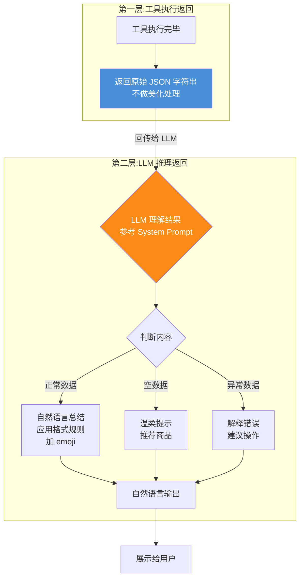

### 4.3 返回处理维度对比总结

| 返回维度 | 普通 API 调用 | Function Calling |
|---------|--------------|-----------------|
| **返回层数** | 1 层: API 响应 → 格式化输出 | 2 层: 工具原始返回 → LLM 理解 → 自然语言回答 |
| **处理位置** | 开发者代码硬编码 | System Prompt 自然语言描述规则 |
| **处理逻辑** | 确定性: if/else, 映射表 | 非确定性: LLM 推理(参考规则但灵活调整) |
| **格式美化** | 代码模板、字符串拼接 | LLM 自然语言生成 |
| **异常理解** | 固定错误码 → 固定文案 | LLM 理解异常上下文,给出个性化建议 |
| **空数据处理** | 固定提示语 | LLM 灵活建议(如推荐商品) |
| **返回一致性** | 100% 一致 | 语义一致,措辞可能略有差异 |
| **调试成本** | 低(打日志、断点) | 高(需观察 LLM 推理过程、LangSmith 追踪) |

---

## 五、使用场景对比

### 5.1 普通 API 调用最佳场景

#### 场景一:后端服务间通信

```python
# 订单服务 → 库存服务 扣减库存
# 场景特点:结构化输入、确定性逻辑、无歧义、高频次
def deduct_inventory(product_id: str, quantity: int) -> bool:
    """
    典型普通 API 调用:
    - 调用方:后端代码(不是用户)
    - 参数:结构化(product_id、quantity)
    - 逻辑:确定性,不需要自然语言理解
    - 频率:高频次(每次下单都调用)
    """
    response = requests.post(
        "https://inventory.internal/api/deduct",
        json={"product_id": product_id, "quantity": quantity},
        headers={"X-Service-Secret": INTERNAL_SECRET}
    )
    return response.status_code == 200
```

#### 场景二:定时任务批量处理

```python
# 每天凌晨批量同步数据
# 场景特点:无人参与、固定流程、确定参数
def sync_data_nightly():
    """
    典型普通 API 调用:
    - 触发:定时调度(凌晨 2:00)
    - 参数:计算得出(如 yesterday = today - 1 day)
    - 不需要自然语言理解
    - 错误重试逻辑写死
    """
    yesterday = (datetime.now() - timedelta(days=1)).strftime("%Y-%m-%d")
    
    for batch in range(100):
        data = requests.get(
            "https://source.api/records",
            params={"date": yesterday, "page": batch, "size": 100}
        ).json()
        if not data["records"]:
            break
        requests.post("https://target.api/bulk-insert", json=data["records"])
```

#### 场景三:表单提交触发的操作

```python
# 用户提交注册表单 → 调用注册 API
# 场景特点:输入已经是结构化表单
@app.post("/register")
def register(form: RegistrationForm):
    """
    典型普通 API 调用:
    - 输入已结构化(表单字段)
    - 调用时机确定(用户点击"提交")
    - 响应模板固定(成功/失败提示)
    """
    response = auth_api.create_user(
        email=form.email,
        password=hash_password(form.password),
        nickname=form.nickname
    )
    if response.ok:
        return {"success": True, "message": "注册成功,请查收验证邮件"}
    else:
        return {"success": False, "message": f"注册失败: {response.error}"}
```

### 5.2 Function Calling 最佳场景

#### 场景一:自然语言驱动的智能助手

```python
# 用户可以用任意方式表达需求,LLM 自动解析并调用工具
class TravelAssistant:
    """
    典型 Function Calling 场景:
    - 输入:自然语言("帮我订下周去北京的机票,预算3000以内")
    - 参数提取:LLM 从句子中推断
      • 出发时间:下周 → 2026-08-10 ~ 2026-08-17
      • 目的地:北京 → PEK
      • 预算:3000以内 → max_price=3000
    - 可能需要多工具:查机票 → 查酒店 → 查景点
    - 响应:自然语言总结+个性化推荐
    """
    
    tools = [
        search_flights_schema,
        search_hotels_schema,
        search_attractions_schema,
        book_flight_schema,
    ]
    
    def chat(self, user_input: str):
        # LLM 自主决定:要不要查?查什么?传什么参数?
        # 可能先查机票,再查酒店,最后综合推荐
        # 整个流程用户无需知道背后调了多少个工具
        return run_agent_loop(user_input, self.tools)
```

#### 场景二:数据探索与分析

```python
class DataAnalystAgent:
    """
    典型 Function Calling 场景:
    用户说:"看看上个月华东区销售额前10的产品,按类别对比一下"
    LLM 自动拆解为多步工具调用:
    1. query_database("华东区上月销售数据")
    2. aggregate_sales(product, region, month)
    3. rank_top(10, by="sales")
    4. group_by("category")
    5. generate_chart(...)
    """
    
    tools = [query_db, aggregate_data, filter_region, 
             rank_items, generate_chart, export_report]
    
    def analyze(self, question: str):
        # LLM 选择工具组合,不需要用户懂 SQL 或数据分析
        return run_agent_loop(question, self.tools)
```

#### 场景三:多轮任务执行

```python
class ResearchAgent:
    """
    典型 Function Calling 场景:
    任务:"写一篇关于AI芯片市场的研究报告"
    LLM 需要循环调用工具,直到信息充分:
    Loop 1:
      search_web("AI芯片市场概况 2026")
      read_webpage("https://report.example.com/ai-chip")
    Loop 2:
      search_web("NVIDIA H200 销量")
      search_web("AMD MI300 市场份额")
    Loop 3:
      search_web("国产AI芯片发展")
    ...(多轮循环,动态判断信息是否充分)
    End → write_report()
    
    → 这种循环判断、动态调用是普通 API 无法优雅实现的!
    """
```

### 5.3 使用场景维度对比总结

| 场景特征 | 推荐 | 理由 |
|---------|------|------|
| **输入是自然语言** | Function Calling | 原生支持语义解析和参数提取 |
| **输入是结构化(表单/JSON)** | 普通 API | 确定性高,无需 LLM 开销 |
| **需要多轮判断/循环调用** | Function Calling | LLM 可动态决策下一步调用什么 |
| **流程固定、步骤确定** | 普通 API | 写死逻辑性能更高、成本更低 |
| **后端服务间通信** | 普通 API | 无需自然语言,直接 gRPC/REST |
| **用户面向的智能助手** | Function Calling | 体验自然、可理解任意表达 |
| **定时批量任务** | 普通 API | 无人参与,参数确定,确定性执行 |
| **数据探索/开放式提问** | Function Calling | 动态组合工具,灵活应对 |
| **高频次低延迟(<100ms)** | 普通 API | LLM 调用有秒级延迟,不合适 |
| **多步骤复杂任务** | Function Calling | LLM 编排流程,无需硬编码分支 |

---

## 六、交互方式对比

### 6.1 普通 API 调用的交互方式

普通 API 是**同步单轮**的交互范式,一次请求对应一次响应,流程确定。

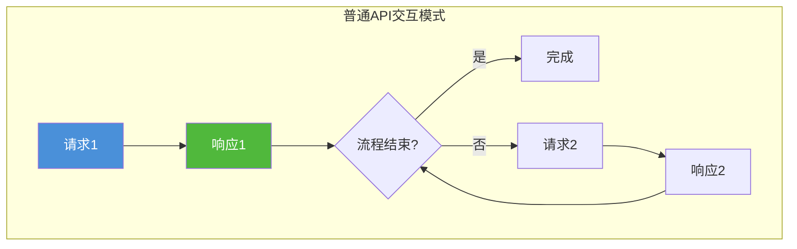

**交互特点**:
- **同步/异步可选择**:支持异步调用,但每次调用独立
- **流程线性**:下一步由代码固定逻辑决定(非条件判断即循环)
- **无上下文记忆**:每次调用独立,上下文需手动传递
- **状态管理**:由调用方代码维护

```python
# 普通 API 交互:多步任务的每一步都要写死
def process_order_workflow(order_id: str):
    """
    线性交互:每一步都显式编码
    要加新步骤?修改代码、重新部署
    """
    # Step 1: 获取订单详情
    order = orders_api.get(order_id)
    if not order:
        return {"error": "订单不存在"}
    
    # Step 2: 验证库存
    for item in order["items"]:
        stock = inventory_api.check(item["sku"])
        if stock < item["quantity"]:
            return {"error": f"库存不足: {item['sku']}"}
    
    # Step 3: 扣减库存
    inventory_api.deduct_batch(order["items"])
    
    # Step 4: 创建支付单
    payment = payment_api.create(order_id=order_id, amount=order["total"])
    
    # Step 5: 发送通知
    notify_api.send(order["user_id"], f"订单已创建,请支付: {payment['url']}")
    
    return {"success": True, "payment_url": payment["url"]}
```

### 6.2 Function Calling 的交互方式

Function Calling 是**多轮上下文循环**的交互范式,LLM 动态决定循环次数和调用组合。

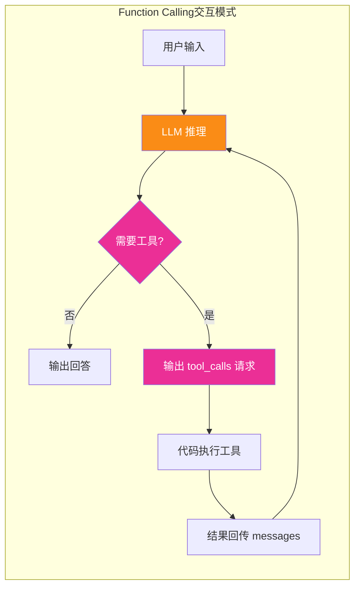

**交互特点**:
- **多轮循环**:可能循环 N 次,直到 LLM 认为任务完成
- **上下文共享**:所有历史消息、工具调用、结果都在 messages 中共享
- **动态分支**:LLM 基于当前上下文决定下一步(不同用户输入走不同路径)
- **中间状态可检查**:支持 HITL(Human-in-the-Loop)在某步暂停审查

```python
# Function Calling 交互:同一个入口函数处理各种不同复杂度任务
def agent_chat(user_input: str, thread_id: str):
    """
    同一个函数,可以处理:
    1. 简单问题 → 0次工具调用,直接回答
    2. 中等问题 → 1-2次工具调用
    3. 复杂任务 → 多次循环、多种工具
    不需要为每种任务写独立代码!
    """
    messages = load_history(thread_id)
    messages.append({"role": "user", "content": user_input})
    
    # 循环:直到 LLM 不再请求工具
    while True:
        response = openai_client.chat.completions.create(
            model="gpt-4o",
            messages=messages,
            tools=ALL_AVAILABLE_TOOLS,  # 20+ 工具全量暴露
            tool_choice="auto"
        )
        
        msg = response.choices[0].message
        messages.append(msg)
        
        if not msg.tool_calls:
            # LLM 认为任务已完成
            save_history(thread_id, messages)
            return msg.content
        
        # LLM 要求调用工具 → 执行 → 回传 → 下一轮
        for tc in msg.tool_calls:
            result = execute_tool(tc)  # 代码执行工具
            messages.append({
                "tool_call_id": tc.id,
                "role": "tool",
                "name": tc.function.name,
                "content": result
            })
```

### 6.3 交互方式维度对比总结

| 交互维度 | 普通 API 调用 | Function Calling |
|---------|--------------|-----------------|
| **交互模式** | 单轮请求-响应 | 多轮上下文循环 |
| **循环次数** | 代码固定(或显式循环) | LLM 动态决定(0~N 次) |
| **流程控制** | 代码逻辑(if/for/while) | LLM 推理(基于自然语言规则) |
| **上下文共享** | 手动传递(函数参数) | 自动共享(messages 历史) |
| **分支决策** | 显式 if/else | LLM 隐式判断 |
| **新增步骤成本** | 改代码、重新部署 | 修改 Prompt/加工具 Schema(可能无需改代码) |
| **状态可暂停性** | 需手动实现(复杂) | 支持 interrupt() 原生暂停 |
| **用户参与度** | 仅输入输出 | 可在中间步骤介入(审核/确认) |

---

## 七、错误处理对比

### 7.1 普通 API 调用的错误处理

普通 API 的错误处理是**确定性的异常捕获机制**,错误类型和处理逻辑在代码中写死。

```python
# 普通 API 错误处理:确定性的 try/except 分层处理
from tenacity import retry, stop_after_attempt, wait_exponential, retry_if_exception_type

# 错误分类(写死)
class APIError(Exception): pass
class TimeoutError(APIError): pass
class AuthError(APIError): pass
class RateLimitError(APIError): pass
class ServerError(APIError): pass


def classify_error(status_code: int, body: str) -> APIError:
    """错误分类逻辑:写死在代码中,100% 确定"""
    if status_code == 401: return AuthError("认证失败")
    if status_code == 403: return AuthError("权限不足")
    if status_code == 429: return RateLimitError("限流")
    if 500 <= status_code < 600: return ServerError(f"服务端错误 {status_code}")
    return APIError(f"未知错误 {status_code}")


@retry(
    # 重试策略:写死
    stop=stop_after_attempt(5),                    # 最多5次
    wait=wait_exponential(multiplier=1, max=30),   # 指数退避 1s,2s,4s,8s,16s
    retry=retry_if_exception_type((TimeoutError, RateLimitError, ServerError)),
    # 只有特定错误才重试;AuthError不重试(重试也没用)
)
def call_api_safely(url: str, **kwargs) -> dict:
    """
    错误处理: 每一层都有明确逻辑
    1. 网络异常 → try/except → 重试
    2. HTTP 状态码 → 分类 → 对应处理
    3. 业务错误码 → 对应文案
    4. 重试耗尽 → 抛出/降级
    """
    try:
        response = requests.get(url, **kwargs, timeout=10)
    except requests.Timeout:
        raise TimeoutError("请求超时")
    except requests.ConnectionError:
        raise APIError("连接失败")
    
    if response.status_code != 200:
        error = classify_error(response.status_code, response.text)
        # 记录可观测指标
        metrics.increment(f"api_error_{error.__class__.__name__}")
        logger.error(f"API 错误: {error}")
        raise error
    
    data = response.json()
    
    # 业务层错误判断(写死)
    if data.get("code") != 0:
        business_msg = data.get("message", "业务错误")
        if data.get("code") == 1001:
            return {"fallback": True, "message": "数据暂时不可用,使用缓存数据"}
        raise APIError(f"业务错误: {business_msg}")
    
    return data
```

**错误处理模型**:

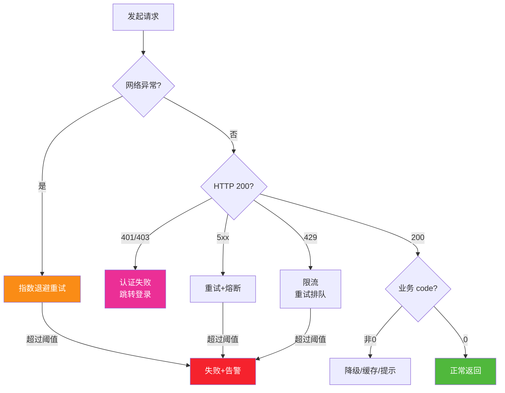

### 7.2 Function Calling 的错误处理

Function Calling 的错误分为**三层**:LLM 输出解析错误、工具执行错误、LLM 自恢复重试。

```python
# Function Calling 错误处理:三层处理,LLM 可参与自恢复
from openai import OpenAI
import json
from tenacity import retry, stop_after_attempt

client = OpenAI()

tools = [{...}]

# ================= 第一层: LLM 输出解析错误 =================
def parse_tool_call_safely(tool_call) -> tuple[bool, str]:
    """
    第一层错误: LLM 输出的 tool_calls 格式异常
    常见:JSON 解析失败、缺字段、参数类型错误
    """
    try:
        args = json.loads(tool_call.function.arguments)
    except json.JSONDecodeError as e:
        return False, f"JSON 解析错误:LLM 输出的参数不是合法JSON。错误: {e}. 请重新输出正确的JSON格式。"
    
    # 检查必填字段
    schema = get_tool_schema(tool_call.function.name)
    required = schema.get("parameters", {}).get("required", [])
    missing = [f for f in required if f not in args]
    if missing:
        return False, f"缺少必填参数: {missing}. 请重新输出完整的参数。"
    
    return True, args


# ================= 第二层: 工具执行错误 =================
def execute_tool_safely(function_name: str, args: dict) -> str:
    """
    第二层错误: 工具执行出错(和普通 API 错误一样)
    关键: 将错误信息以自然语言返回给 LLM,让 LLM 判断下一步
    """
    try:
        if function_name == "get_weather":
            return get_weather(**args)
        # ... 其他工具
        else:
            return f"错误: 未知工具 {function_name}。请检查工具名称是否正确。"
    except TimeoutError as e:
        # 返回给 LLM: 描述错误 + 建议操作
        return f"工具调用超时: {e}. 建议:1.可以稍后重试 2.或使用其他可用工具获取替代信息"
    except AuthError as e:
        return f"认证失败: {e}. 建议:提示用户登录或重新授权"
    except RateLimitError as e:
        return f"限流中: {e}. 建议:等待几秒后重试,或减少调用频率"
    except ValueError as e:
        return f"参数错误: {e}. 建议:检查参数是否正确,调整后重试"


# ================= 第三层: LLM 自恢复重试 =================
def chat_with_tools(user_input: str, max_rounds: int = 10) -> str:
    """
    第三层: 基于错误消息,LLM 自主纠正错误并重试
    这是 Function Calling 最强大的错误处理能力!
    """
    messages = [{"role": "user", "content": user_input}]
    
    for round in range(max_rounds):
        response = client.chat.completions.create(
            model="gpt-4o", messages=messages, tools=tools
        )
        msg = response.choices[0].message
        messages.append(msg)
        
        if not msg.tool_calls:
            return msg.content
        
        for tc in msg.tool_calls:
            # 第一层:解析错误 → 描述错误给 LLM,让 LLM 重新输出
            ok, parsed = parse_tool_call_safely(tc)
            if not ok:
                messages.append({
                    "tool_call_id": tc.id,
                    "role": "tool",
                    "name": tc.function.name,
                    "content": parsed  # 错误描述
                })
                # 下一轮 LLM 看到错误信息,会自动纠正参数重试
                continue
            
            # 第二层:执行错误 → 描述错误给 LLM,让 LLM 决策
            result = execute_tool_safely(tc.function.name, parsed)
            messages.append({
                "tool_call_id": tc.id,
                "role": "tool",
                "name": tc.function.name,
                "content": result
            })
            # 下一轮 LLM 可能:重试 / 换工具 / 换参数 / 向用户说明问题
            continue
    
    return f"抱歉,经过 {max_rounds} 轮尝试仍未完成任务,请换个方式描述您的需求。"
```

**错误处理模型(关键差异)**:

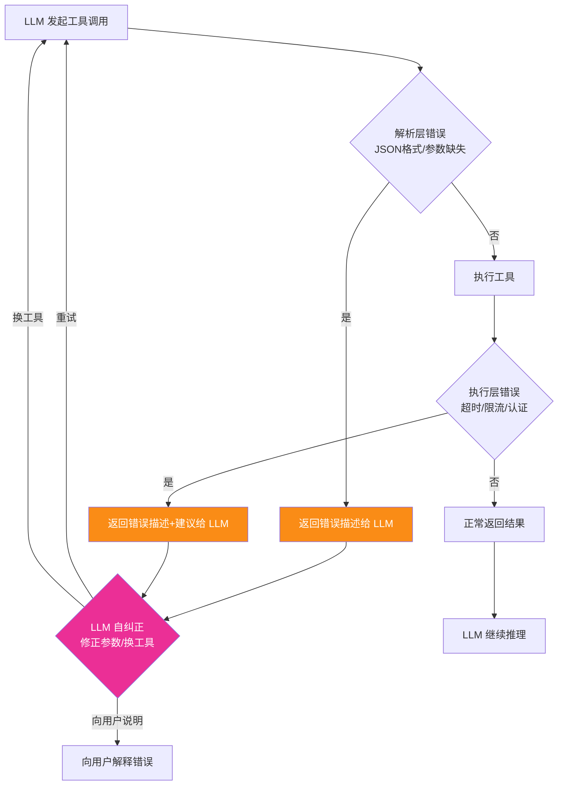

### 7.3 错误处理维度对比总结

| 错误维度 | 普通 API 调用 | Function Calling |
|---------|--------------|-----------------|
| **错误层级** | 2 层(网络/HTTP + 业务) | 3 层(解析/执行/LLM 自恢复) |
| **错误分类** | 代码写死(确定类型) | 运行时描述(LLM 理解语义) |
| **重试策略** | 固定规则(指数退避+阈值) | LLM 动态决策(重试/换工具/放弃) |
| **重试触发** | 代码捕获特定异常 | 错误描述回传,LLM 自主判断 |
| **错误响应** | 固定文案 + 状态码 | LLM 生成自然语言解释 + 建议 |
| **可恢复性** | 只能重试相同调用 | 可改变参数/切换替代工具 |
| **用户感知** | 固定错误页/提示 | 个性化解释 + 替代方案 |
| **熔断/降级** | 代码实现(如 hystrix) | LLM 可选替代路径实现降级 |

---

## 八、集成方式对比

### 8.1 普通 API 调用的集成方式

普通 API 的集成模式多样,从最简单的 HTTP 客户端到复杂的服务网格。

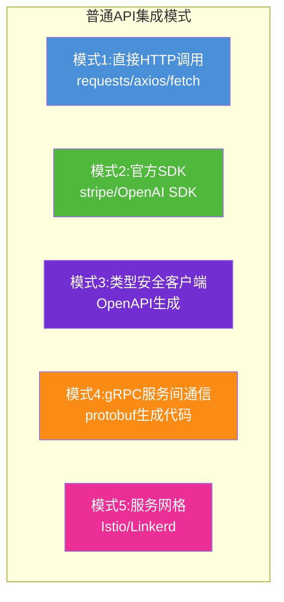

**各模式代码示例**:

```python
# ================= 模式1:直接 HTTP 调用 =================
import requests

# 最简单:直接调 URL
response = requests.get("https://api.example.com/users/123")
# 优点:无依赖、灵活
# 缺点:每次都写 URL、Headers、解析 JSON


# ================= 模式2:官方 SDK =================
import stripe
stripe.api_key = "sk_test_xxx"

# SDK 封装了 URL、认证、错误处理
charge = stripe.Charge.create(
    amount=2000, currency="usd", source="tok_visa",
    description="My First Test Charge"
)
# 优点:封装完善、IDE 可提示
# 缺点:依赖第三方 SDK、有版本依赖


# ================= 模式3:OpenAPI 生成客户端 =================
# 使用 openapi-generator 根据 OpenAPI/Swagger YAML 生成类型安全的客户端
# 命令: openapi-generator-cli generate -i api.yaml -g python -o ./client
from generated_client import UsersApi, Configuration

config = Configuration(host="https://api.example.com")
with generated_client.ApiClient(config) as api_client:
    user_api = UsersApi(api_client)
    user = user_api.get_user(user_id=123)  # 完全类型安全,IDE 可提示
# 优点:类型安全、自动更新
# 缺点:需要构建步骤、版本需同步


# ================= 模式4:gRPC =================
# .proto 定义 service 和 message → protoc 生成代码
import grpc
from generated import user_pb2, user_pb2_grpc

channel = grpc.insecure_channel("api.internal:50051")
stub = user_pb2_grpc.UserServiceStub(channel)
response = stub.GetUser(user_pb2.GetUserRequest(user_id=123))
# 优点:高性能、类型安全、流式通信
# 缺点:学习成本高、需要 proto 管理


# ================= 模式5:服务网格(集群内) =================
# 代码完全不感知:透明注入 mTLS、限流、熔断、追踪
# Istio / Linkerd 部署在 K8s sidecar,对应用无侵入
# 代码还是普通 requests.get(),sidecar 自动做流量控制
```

### 8.2 Function Calling 的集成方式

Function Calling 的集成模式跨越四层:模型能力、SDK封装、Agent框架、传输协议。

```mermaid
flowchart TB
    subgraph Function Calling集成模式
        F1[模式1:原生API调用<br/>OpenAI Chat/Responses API]
        F2[模式2:LangChain工具<br/>@tool + create_agent]
        F3[模式3:LangGraph图编排<br/>节点+状态+检查点]
        F4[模式4:MCP传输协议<br/>跨进程/跨模型通用工具]
    end
    
    style F1 fill:#fa8c16,color:#fff
    style F2 fill:#4a90d9,color:#fff
    style F3 fill:#722ed1,color:#fff
    style F4 fill:#eb2f96,color:#fff
```

**各模式代码示例**:

```python
# ================= 模式1:原生 API 调用(最底层) =================
# 直接调用 OpenAI / Anthropic / 开源模型 API,手写循环逻辑
from openai import OpenAI
import json

client = OpenAI()

tools = [{"type": "function", "function": {...}}]

messages = [{"role": "user", "content": "巴黎天气?"}]
response = client.chat.completions.create(
    model="gpt-4o", messages=messages, tools=tools
)

if response.choices[0].message.tool_calls:
    # 手写执行、回传逻辑
    pass
# 优点:完全可控、无额外依赖
# 缺点:循环逻辑、错误处理、多轮管理全部手写


# ================= 模式2:LangChain 工具(最流行) =================
from langchain_core.tools import tool
from langchain.agents import create_agent
from langchain_openai import ChatOpenAI

@tool
def get_weather(city: str) -> str:
    """获取指定城市天气"""
    return call_weather_api(city)

@tool
def get_stock_price(symbol: str) -> str:
    """获取股票价格"""
    return call_stock_api(symbol)

# LangChain 封装了循环执行、错误回传、结果汇总
agent = create_agent(
    model=ChatOpenAI(model="gpt-4o"),
    tools=[get_weather, get_stock_price],  # 注册工具
    system_prompt="你是一个有用的助手..."
)
result = agent.invoke({"messages": [{"role": "user", "content": "苹果股价+旧金山天气?"}]})
# 优点:代码量极少、内置循环/错误处理
# 缺点:抽象层较厚,定制复杂流程困难


# ================= 模式3:LangGraph 图编排(生产级) =================
from langgraph.graph import StateGraph, END
from langgraph.checkpoint.postgres import PostgresSaver

graph = StateGraph(AgentState)
graph.add_node("agent", call_model_with_tools)
graph.add_node("tools", execute_tool_calls)
graph.add_conditional_edges("agent", should_continue,
    {"tools": "tools", END: END})
graph.add_edge("tools", "agent")

app = graph.compile(
    checkpointer=PostgresSaver(...),  # 持久化,崩溃自动恢复
    interrupt_before=["tools"]         # 人工审核断点
)
# 优点:显式控制、持久化、人机协作、多Agent
# 缺点:代码量大,需理解图/状态概念(详见 87、88 号文档)


# ================= 模式4:MCP(跨进程通用工具) =================
# MCP(Model Context Protocol):工具放在独立服务,通过 stdio/HTTP 暴露
# 客户端只需接 MCP,工具定义自动发现,无需手写 Schema
# 详见: https://modelcontextprotocol.io/

# MCP Server 端:工具提供者
from mcp.server.fastmcp import FastMCP
mcp = FastMCP("FinanceTools")

@mcp.tool()
def get_stock_price(symbol: str) -> str:
    return call_stock_api(symbol)

@mcp.tool()
def transfer_funds(from_acc: str, to_acc: str, amount: float) -> bool:
    return call_bank_api(from_acc, to_acc, amount)

# MCP Client 端:Agent 消费(无需手写 tools Schema!)
from mcp.client.stdio import stdio_client

async with stdio_client(["python", "-m", "finance_mcp_server"]) as (read, write):
    client = Client(read, write)
    await client.initialize()
    
    # 自动列出所有工具,动态获取 Schema
    tools = await client.list_tools()
    # 调用工具
    result = await client.call_tool("get_stock_price", {"symbol": "AAPL"})
# 优点:工具和Agent解耦,多客户端共享,跨语言
# 缺点:增加传输层,架构复杂度提升
```

### 8.3 集成方式维度对比总结

| 集成维度 | 普通 API 调用 | Function Calling |
|---------|--------------|-----------------|
| **模式复杂度** | 5 种主流模式,从简单到复杂 | 4 层模式,从裸调→框架→传输协议 |
| **最低集成成本** | 极低(几行 requests 代码) | 低(几行 LangChain @tool 代码) |
| **最高集成复杂度** | 高(服务网格/微服务治理) | 极高(LangGraph+MCP+多Agent编排) |
| **跨语言支持** | 原生(HTTP/gRPC 跨语言) | MCP 层支持跨语言 |
| **服务发现/注册** | Consul/Eureka/服务网格 | MCP 的工具列表自动发现 |
| **版本管理** | URL 版本化 / API 版本号 | Schema 版本 + MCP 工具版本 |
| **依赖耦合度** | SDK/生成客户端 → 高 | 模式1:中 / 模式4(MCP):低 |
| **本地函数支持** | 支持(普通函数即 API) | 支持(本地函数可作为 tool) |
| **网络通信要求** | HTTP/gRPC 必须有 | 模式1/2/3:可有可无(本地函数) / 模式4:MCP管道/网络 |

---

## 九、在 AI Agent 系统中的作用对比

### 9.1 普通 API 在 Agent 系统中的角色

普通 API 是 Agent 系统中**工具实现层**的基石——每个 Function Calling 工具,内部最终都是普通 API 或本地函数调用。

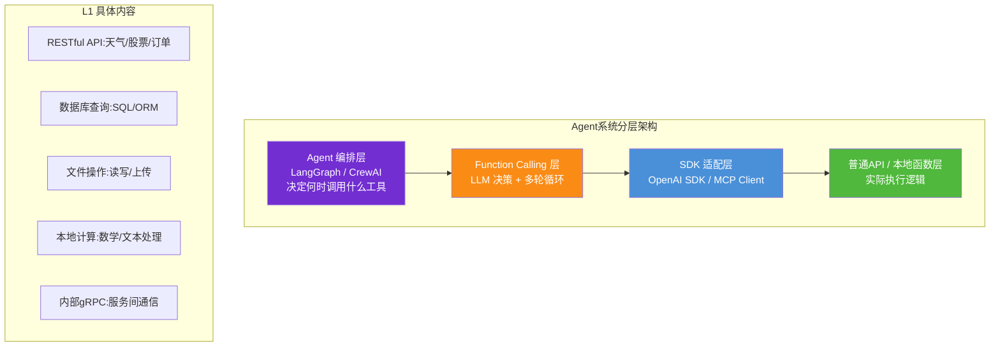

**角色总结**:
- **执行者**:Function Calling 发出请求的最终落地执行者
- **能力来源**:Agent 能"做事"的根本依赖(LLM 本身只能"想",不能"做")
- **确定性保证**:工具层返回可靠、可验证、可审计的执行结果
- **安全边界**:API 层的鉴权、限流、审计直接决定 Agent 操作的安全性

```python
# Agent 中的普通 API:是工具内部的实现细节
class ToolImplementations:
    """
    所有 Function Calling 工具内部,90% 以上是普通 API 调用
    """
    
    # 普通 API 作为工具:外部服务
    def search_arxiv(self, query: str) -> list:
        return requests.get(
            "https://export.arxiv.org/api/query",
            params={"search_query": query, "start": 0, "max_results": 5}
        ).json()
    
    # 普通 API 作为工具:数据库
    def query_internal_db(self, sql: str) -> list:
        with psycopg2.connect(DB_URI) as conn:
            with conn.cursor() as cur:
                cur.execute(sql)
                return cur.fetchall()
    
    # 本地函数作为工具:纯计算
    def calculate_discount(self, price: float, percent: int) -> float:
        return price * (1 - percent / 100)
    
    # 普通 API 作为工具:鉴权操作
    def transfer_money(self, user: str, target: str, amount: float) -> bool:
        # 内部仍是普通 API,但带鉴权 header
        return requests.post(
            "https://bank.internal/transfer",
            headers={"X-User-Id": user, "X-Internal-Token": SERVICE_SECRET},
            json={"target": target, "amount": amount}
        ).status_code == 200
```

### 9.2 Function Calling 在 Agent 系统中的角色

Function Calling 是 Agent 系统的**决策调度层**——连接 LLM 思考能力和工具执行能力的桥梁。

```mermaid
flowchart TB
    subgraph "Agent 大脑 (LLM)"
        T1[理解用户意图<br/>"我要从上海到北京"]
        T2[决策工具调用组合]
        T3[调用1: 查高铁<br/>schedule_high_speed_rail(SH→BJ)]
        T4[调用2: 查机票<br/>search_flights(SH→BJ)]
        T5[调用3: 查天气<br/>get_weather(北京, 下周)]
        T6[综合结果生成推荐<br/>"高铁4.5h/$90 推荐,机票2h/$420 时间紧选"]
    end
    
    T2 --> T3
    T2 --> T4
    T2 --> T5
    T3 & T4 & T5 --> T6
    
    style T1 fill:#fa8c16,color:#fff
    style T2 fill:#eb2f96,color:#fff
    style T6 fill:#722ed1,color:#fff
```

**角色总结**:
- **翻译官**:将自然语言需求翻译成结构化工具调用
- **调度员**:自主选择工具组合,编排多步流程
- **协调者**:多轮循环,收集工具结果,判断是否继续
- **解读者**:将工具返回的结构化数据,翻译为自然语言回答

```python
# Function Calling 在 Agent 中的核心作用
class AgentCore:
    def run_task(self, user_input: str) -> str:
        """
        Agent 核心循环,Function Calling 承担 4 种角色:
        """
        messages = [{"role": "user", "content": user_input}]
        
        while True:
            response = llm_client.chat(messages, tools=ALL_TOOLS)
            
            # 1. LLM 通过 Function Calling 决策: 接下来做什么?
            if not response.tool_calls:
                # 决策结果: 不需要更多工具,直接回答
                return response.content
            
            for tool_call in response.tool_calls:
                # 2. LLM 通过 Function Calling: 选择具体工具 + 参数
                tool_name = tool_call.function.name
                args = parse_args(tool_call.function.arguments)
                
                # 安全校验(不能完全信任 LLM!)
                if not self._authorize(tool_name, args, current_user):
                    tool_result = "权限不足: 您没有权限执行此操作"
                else:
                    # 3. 代码执行工具(内部是普通 API/函数)
                    tool_result = self._execute_tool(tool_name, args)
                
                # 4. 结果回传 LLM: Function Calling 的上下文桥梁
                messages.append({
                    "tool_call_id": tool_call.id,
                    "role": "tool",
                    "name": tool_name,
                    "content": tool_result
                })
                # 下一轮 LLM 根据新结果,继续决策...
```

### 9.3 Agent 系统中的对比总结

| Agent 架构维度 | 普通 API 调用 | Function Calling |
|---------------|--------------|-----------------|
| **所在层级** | 工具实现层(L1) | 决策调度层(L3) |
| **核心作用** | 实际执行,产生真实效果 | 连接 LLM 与工具,调度流程 |
| **决定因素** | 开发者设计(暴露哪些 API) | LLM 推理(调用哪个、传什么) |
| **与 LLM 关系** | 被 LLM 间接使用(通过 Function Calling) | 直接由 LLM 驱动 |
| **安全责任** | 鉴权/限流/审计(守门员) | 决策安全(选择什么) + 参数安全注入 |
| **可替换性** | 高:换一个 API 供应商即可 | 低:涉及模型能力/Schema/Prompt 多方面 |
| **可观测性** | APM 指标(P99/成功率/流量) | LangSmith 追踪(LLM输入输出/工具链全链路) |
| **测试方法** | 单元测试/集成测试 | 评估集(Eval Set)+ 多场景回放 |
| **成本构成** | API 调用费用 / 服务器成本 | LLM Token 费用(通常远高于 API 费用) |

---

## 十、全维度对比总表

| 对比维度 | 普通 API 调用 | Function Calling |
|---------|--------------|-----------------|
| **核心定义** | 代码显式调用外部服务接口 | LLM 自主决策并请求调用工具,代码代为执行后回传结果 |
| **控制权归属** | 开发者(代码 if/else) | LLM 模型(推理决策) |
| **调用决策者** | 代码逻辑 | LLM |
| **确定性** | 高(相同输入→相同调用) | 低(相同输入可能不同调用路径) |
| **调用轮数** | 单轮请求-响应 | 多轮上下文循环(LLM 判断停止条件) |
| **参数来源** | 开发者显式构造/计算 | LLM 从自然语言推断 + 系统安全注入 |
| **参数格式声明** | 函数签名 / Pydantic / TS Interface | JSON Schema(含自然语言描述字段含义) |
| **参数校验** | 编译期/运行期强校验 | LLM 输出后再次安全校验(不可省略) |
| **返回层数** | 1 层(直接使用) | 2 层(工具原始结果 + LLM 自然语言回答) |
| **返回处理逻辑** | 硬编码模板/映射表 | System Prompt 自然语言规则描述 |
| **返回一致性** | 100% 一致 | 语义一致,措辞可调整 |
| **最佳输入形式** | 结构化(表单/JSON/函数参数) | 自然语言(任意表达) |
| **典型场景** | 后端服务间通信 / 定时任务 / 表单提交 | 智能助手 / 数据探索 / 多步研究 Agent |
| **循环支持** | 显式 for/while(固定次数) | LLM 动态循环(直到任务完成) |
| **流程灵活性** | 低(硬编码,改流程=改代码) | 高(改 Prompt/加 Schema) |
| **错误层级** | 2 层(网络/业务) | 3 层(解析/执行/LLM 自恢复) |
| **重试策略** | 固定规则(指数退避+阈值) | LLM 动态决策(重试/换工具/放弃) |
| **集成复杂度** | 低→高(HTTP→gRPC→服务网格) | 低→极高(原生→LangChain→LangGraph→MCP) |
| **跨语言支持** | HTTP/gRPC 原生 | MCP 层跨语言 |
| **最低成本** | 极低(几行 HTTP 请求) | 低(@tool 装饰器几行) |
| **延迟级别** | 毫秒~几百毫秒 | 秒级~分钟级(多轮 LLM 调用) |
| **成本构成** | API 调用费 / 服务器 | LLM Token 费(通常远高) |
| **测试方法** | 单元测试 / 集成测试 | 评估集(Eval) / 多场景回放 |
| **可观测工具** | Prometheus / Grafana / APM | LangSmith / Langfuse / Phoenix |
| **学习曲线** | 低(后端基础) | 中(需理解 LLM 行为/安全注入) |
| **可审计性** | 高(每条请求日志明确) | 中(需追踪 LLM 决策链) |
| **安全边界** | API 鉴权/限流/审计 | Schema 约束 + 参数安全注入 + 权限校验 + 敏感操作 HITL |

---

## 十一、选型决策指南

### 11.1 决策流程图

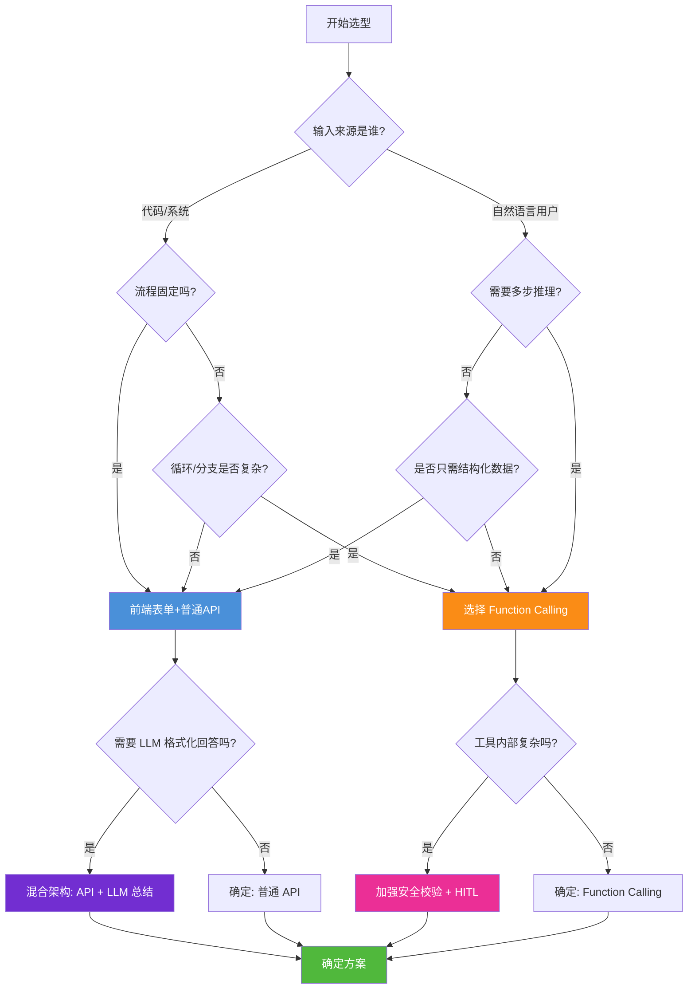

### 11.2 选型检查清单

#### 选择 Function Calling 的信号(满足任意 2 条)

- [ ] 输入是自然语言,用户可能用多种方式表达同一需求
- [ ] 需要根据中间结果动态选择下一步操作(多步推理)
- [ ] 工具组合不确定,可能需要多种工具灵活组合
- [ ] 返回结果需要自然语言总结而非固定模板
- [ ] 错误场景需要智能解释和替代方案建议
- [ ] 流程会频繁调整,希望通过 Prompt/Schema 修改而非改代码部署

#### 选择普通 API 的信号(满足任意 2 条)

- [ ] 输入已结构化(表单提交、服务间 RPC、定时参数)
- [ ] 流程固定,每个步骤和分支都可预先确定
- [ ] 低延迟要求(毫秒级),不能承受 LLM 秒级开销
- [ ] 高并发、大批量场景(Token 成本会快速累积)
- [ ] 高确定性要求,不能接受输出波动
- [ ] 审计合规要求,100% 可追溯且确定的执行路径

### 11.3 常见选型误区

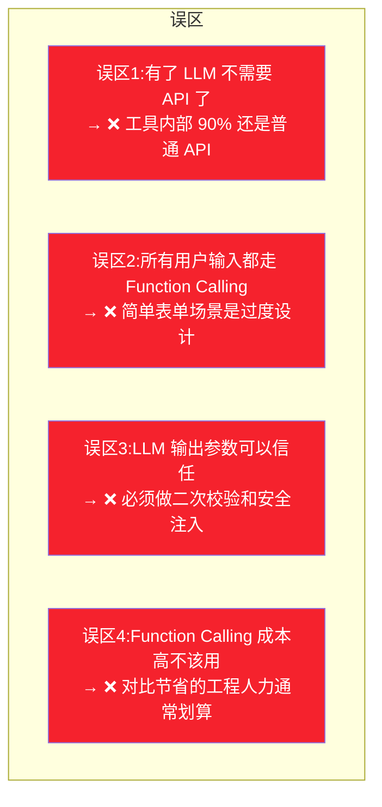

---

## 十二、进阶组合架构

### 12.1 最佳实践:Function Calling + 普通 API 分层架构

生产级 Agent 系统几乎都是**组合架构**:Function Calling 做调度,普通 API 做执行。

```mermaid
flowchart TB
    subgraph 用户端
        UI[前端界面<br/>聊天框+表单]
    end
    
    subgraph 编排层
        AG[Agent Orchestrator<br/>LangGraph + 状态持久化]
    end
    
    subgraph 决策层
        FC[Function Calling<br/>LLM 决策工具调用]
    end
    
    subgraph 工具适配层
        SCHEMA[工具 Schema 注册表]
        SEC[安全注入/权限校验]
        WRAP[结果封装]
    end
    
    subgraph 执行层(普通 API)
        REST[RESTful APIs<br/>用户/订单/支付]
        GRPC[gRPC 内部服务<br/>库存/物流]
        DB[(数据库<br/>PostgreSQL)]
        CACHE[(缓存<br/>Redis)]
        LOCAL[本地函数<br/>计算/格式化]
    end
    
    UI --> AG
    AG --> FC
    FC --> SCHEMA
    SCHEMA --> SEC
    SEC --> WRAP
    WRAP --> REST
    WRAP --> GRPC
    WRAP --> DB
    WRAP --> CACHE
    WRAP --> LOCAL
    
    REST & GRPC & DB & CACHE & LOCAL -->|结果| WRAP
    WRAP -->|回传| FC
    FC -->|继续/完成| AG
    AG -->|响应| UI
    
    style FC fill:#fa8c16,color:#fff
    style AG fill:#722ed1,color:#fff
    style SEC fill:#eb2f96,color:#fff
    style REST fill:#50b83c,color:#fff
```

### 12.2 组合架构核心组件说明

| 组件 | 技术 | 职责 |
|------|------|------|
| **前端** | ChatUI + 表单组件 | 自然语言用聊天框,确定操作用表单 |
| **编排层** | LangGraph | 状态持久化、断点恢复、多Agent协作 |
| **决策层** | GPT-4o + Function Calling | 语义理解、工具选择、参数推断、结果综合 |
| **工具适配层** | Pydantic + 自定义装饰器 | Schema 注册、安全注入、权限校验、结果格式统一 |
| **执行层** | FastAPI / gRPC / SQLAlchemy | 业务逻辑实现,和普通后端系统完全一致 |

### 12.3 组合架构伪代码

```python
# 生产级组合架构实现示例
class ProductionAgent:
    
    def __init__(self):
        # 执行层(普通 API 客户端)
        self.orders = OrderAPIClient()
        self.payments = PaymentGRPCClient()
        self.db = DatabaseConnection()
        self.cache = RedisCache()
        
        # 工具适配层:装饰器自动注册 Schema
        self.tools_registry = ToolRegistry()
        self._register_tools()
        
        # 决策层:LLM + Function Calling
        self.llm = OpenAIClient(model="gpt-4o")
        
        # 编排层:LangGraph 状态持久化
        self.graph = self._build_graph()
    
    def _register_tools(self):
        """装饰器注册工具 Schema"""
        
        @self.tools_registry.register(
            description="获取用户订单列表,支持按状态筛选",
            params={
                "status": {"type": "string", "enum": ["pending", "shipped", "delivered"], "description": "订单状态"}
            },
            require_auth=True  # 标记需要鉴权
        )
        def get_orders(status: str = None, user_context=None) -> str:
            """工具内部:普通 API 调用"""
            user_id = user_context["authenticated_user_id"]  # 安全注入
            return json.dumps(self.orders.list(user_id=user_id, status=status))
    
    async def run(self, user_input: str, user_ctx: dict):
        """主入口:端到端执行"""
        # 编排层 LangGraph 驱动
        return await self.graph.ainvoke(
            {"messages": [HumanMessage(content=user_input)]},
            config={
                "configurable": {
                    "thread_id": user_ctx["thread_id"],  # 持久化
                    "user_context": user_ctx              # 安全注入上下文
                }
            }
        )
```

---

## 十三、总结

### 13.1 本质区别总结

```mermaid
flowchart TB
    subgraph "普通 API 调用"
        A1["核心:代码控制"]
        A2["特点:确定、显式、高效"]
        A3["定位:执行者(做)"]
        A4["类比:厨师按菜谱做菜"]
    end
    
    subgraph "Function Calling"
        B1["核心:LLM 驱动"]
        B2["特点:灵活、自适应、多轮"]
        B3["定位:决策者(想)+ 翻译官"]
        B4["类比:食客说想吃清淡的,厨师决定用什么食材怎么做"]
    end
    
    subgraph "统一关系"
        C1["Function Calling 是在普通 API 之上增加的一层 LLM 决策调度能力"]
        C2["工具内部 90% 以上仍然是普通 API 调用"]
        C3["组合使用才是生产级 Agent 的正确方式"]
    end
    
    style A1 fill:#4a90d9,color:#fff
    style B1 fill:#fa8c16,color:#fff
    style C3 fill:#50b83c,color:#fff
```

### 13.2 一句话选型

> **能硬编码的流程用普通 API,需要自然语言理解、动态决策、多步推理的流程用 Function Calling,生产 Agent 系统二者缺一不可。**

### 13.3 与系列文档的关系

| 文档 | 回答的问题 | 核心主题 |
|------|----------|---------|
| [42号:工具选择决策机制](../3Agent%20架构设计/42Agent工具选择决策机制深度解析.md) | Agent 如何选择调用哪个工具? | 工具选择算法与决策流程 |
| [85号:LangChain核心组件](../6Agent%20Framework/85LangChain框架核心组件详解.md) | LangChain 中工具如何定义和注册? | 组件化抽象 |
| [86号:Agent运行机制](../6Agent%20Framework/86LangChain Agent运行机制深度解析.md) | Agent 内部如何循环执行工具? | 思考-行动-观察循环 |
| [87号:LangGraph诞生背景](../6Agent%20Framework/87LangGraph框架诞生背景与核心定位深度解析.md) | 为什么需要状态化图运行时? | 从原型到生产的演进 |
| [88号:LC vs LG对比](../6Agent%20Framework/88LangChain与LangGraph核心区别系统性对比深度解析.md) | 上层框架如何选型? | 框架选型决策 |
| **本文:Function Calling vs API** | **两种调用方式的本质区别?** | **技术选型的底层认知** |

---

> **参考来源:**
> - [OpenAI Function Calling 官方文档](https://platform.openai.com/docs/guides/function-calling) — 权威机制说明
> - [MCP vs Function Calling vs OpenAI Tools](https://growthengineer.ai/blog/mcp-vs-function-calling-vs-openai-tools) — 四层技术栈分层架构
> - [The Tool Invocation Gap: From ChatML to Responses API](https://www.salmanq.com/blog/llm-tool-invocation-gap/) — Token 级调用机制解析
> - [Agent基础:OpenAI Function Calling、Anthropic Tool Use、MCP](https://blog.csdn.net/sweet_ran/article/details/156240780) — 三大协议对比分析
> - [Function Calling: Responses API vs Assistant API](https://apimagic.ai/blog/responses-api-vs-assistant-api) — 两代 API 集成方式对比
> - [RAG Frameworks Benchmark 2026](https://aimultiple.com/fr/rag-frameworks) — 框架性能基准测试
