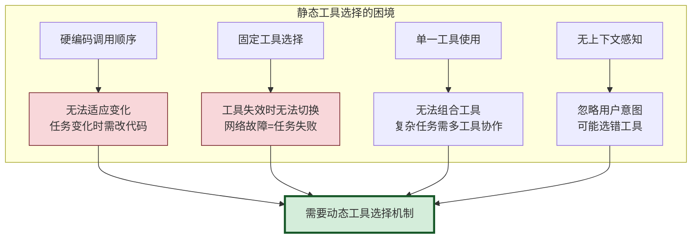
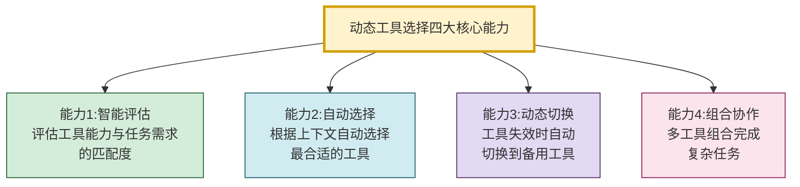
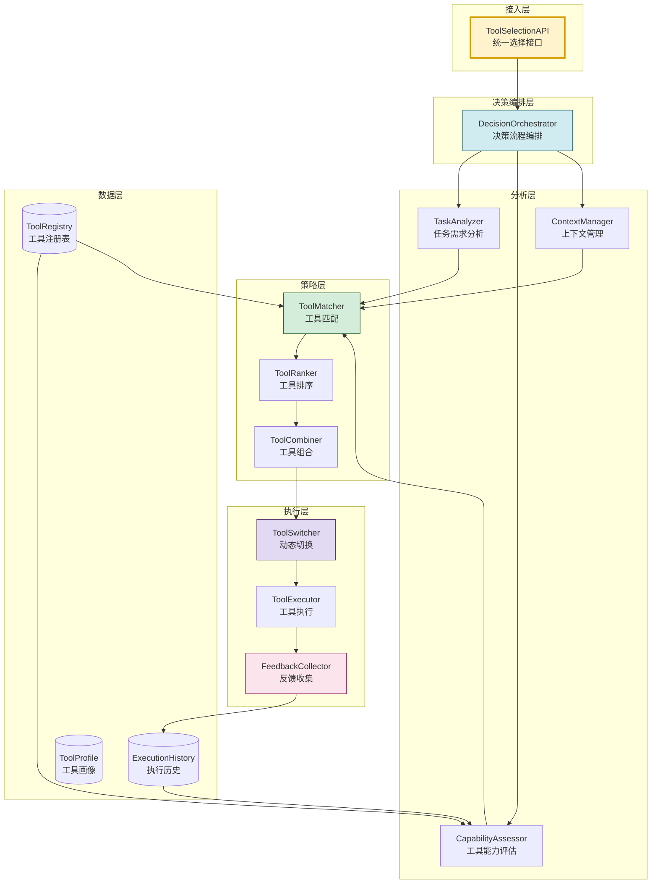
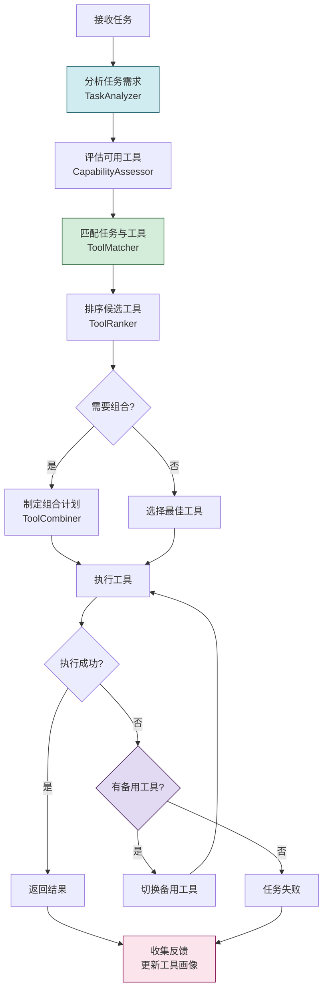
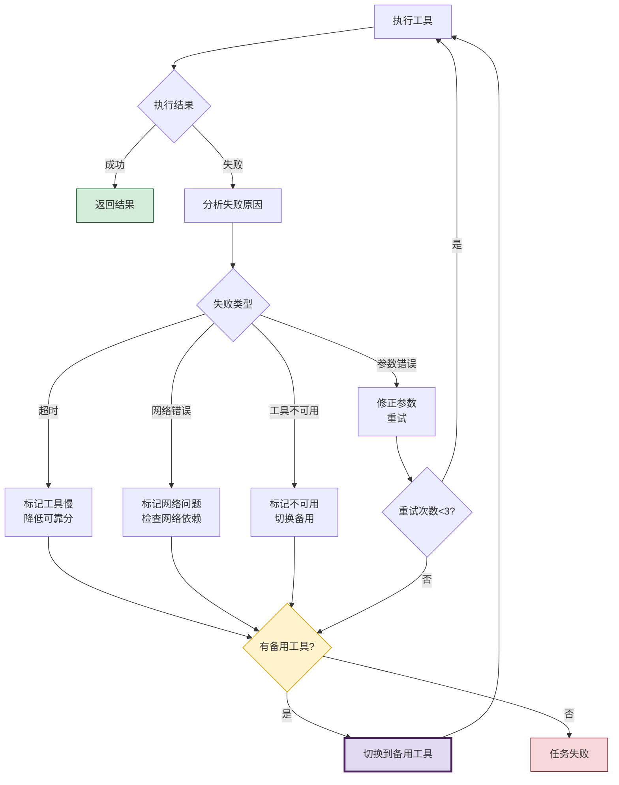
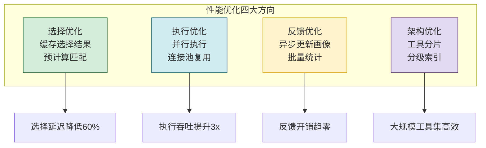
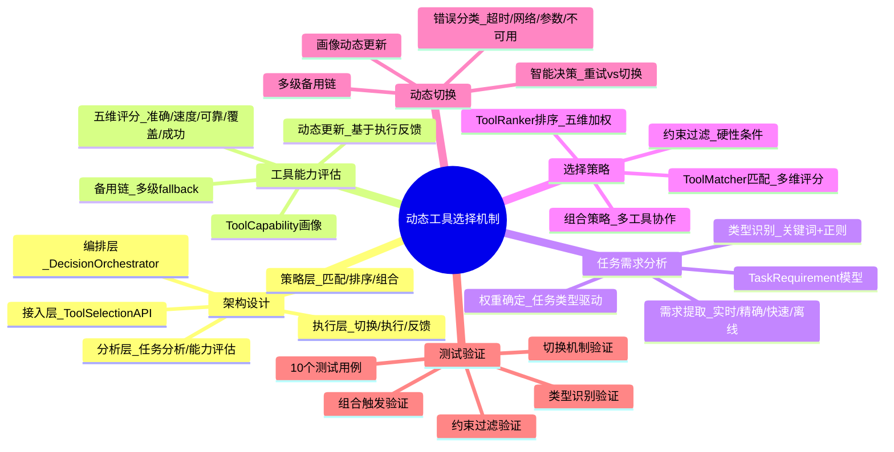

# Agent 动态工具选择决策机制完整实现深度解析

> **文档定位**:本文档是 Tool Calling / Function Calling 系列的第二篇核心文档,专注于 **Agent 动态工具选择机制的完整工程实现**。在 [89号文档](./89FunctionCalling与普通API调用核心区别系统性对比深度解析.md) 对比 Function Calling 与 API 调用的基础上,本文深入到**动态选择决策系统**的工程实现,涵盖工具能力评估、任务需求分析、选择策略制定、动态切换与组合四大核心模块,并提供完整的可运行代码和测试用例验证。
>
> **与42号文档的关系**:[42Agent工具选择决策机制深度解析.md](../3Agent%20架构设计/42Agent工具选择决策机制深度解析.md) 侧重工具选择的**通用方法论**(决策因素、算法原理、流程设计),本文侧重动态选择系统的**完整工程实现**(可运行代码、测试用例、性能优化)。42号解决"工具选择怎么设计",本文解决"动态选择怎么实现"。
>
> **阅读建议**:建议先阅读 [42号文档](../3Agent%20架构设计/42Agent工具选择决策机制深度解析.md) 理解工具选择方法论,再阅读本文进行工程实现。可结合 [89号文档](./89FunctionCalling与普通API调用核心区别系统性对比深度解析.md) 理解 Function Calling 的调用机制。

---

## 目录

- [一、动态工具选择机制概述](#一动态工具选择机制概述)
- [二、决策系统架构设计](#二决策系统架构设计)
- [三、工具能力评估模块](#三工具能力评估模块)
- [四、任务需求分析模块](#四任务需求分析模块)
- [五、工具选择策略制定](#五工具选择策略制定)
- [六、动态切换与组合机制](#六动态切换与组合机制)
- [七、完整决策系统实现](#七完整决策系统实现)
- [八、测试用例与验证](#八测试用例与验证)
- [九、性能优化与最佳实践](#九性能优化与最佳实践)
- [十、总结](#十总结)

---

## 一、动态工具选择机制概述

### 1.1 为什么需要动态工具选择

传统工具调用采用**静态硬编码**方式——开发者预先决定调用哪个工具、按什么顺序调用。这种方式在简单场景下有效,但在复杂 Agent 系统中存在根本缺陷:



### 1.2 动态工具选择的核心能力



| 核心能力 | 描述 | 解决的问题 |
|---------|------|-----------|
| **智能评估** | 评估工具能力和任务需求的匹配度 | 选错工具 |
| **自动选择** | 根据上下文自动选择最合适工具 | 人工干预成本高 |
| **动态切换** | 工具失效时自动切换备用工具 | 单点故障 |
| **组合协作** | 多工具组合完成复杂任务 | 单工具能力不足 |

### 1.3 静态 vs 动态工具选择对比

| 维度 | 静态选择 | 动态选择 |
|------|---------|---------|
| **选择时机** | 编码时固定 | 运行时动态决定 |
| **适应性** | 无法适应变化 | 根据上下文自适应 |
| **容错性** | 工具失效即失败 | 自动切换备用工具 |
| **扩展性** | 新增工具需改代码 | 新增工具自动纳入选择 |
| **组合能力** | 不支持 | 支持多工具组合 |
| **上下文感知** | 无 | 理解任务意图和上下文 |

---

## 二、决策系统架构设计

### 2.1 分层架构



### 2.2 核心模块职责

| 模块 | 职责 | 输入 | 输出 |
|------|------|------|------|
| **TaskAnalyzer** | 分析任务类型和需求 | 用户任务描述 | TaskRequirement |
| **CapabilityAssessor** | 评估工具能力 | 工具注册信息 | ToolCapability |
| **ToolMatcher** | 匹配任务与工具 | TaskReq + ToolCap | 匹配候选集 |
| **ToolRanker** | 对候选工具排序 | 匹配候选集 | 排序工具列表 |
| **ToolCombiner** | 组合多工具 | 排序列表 | 工具执行计划 |
| **ToolSwitcher** | 动态切换工具 | 执行结果+反馈 | 切换决策 |
| **FeedbackCollector** | 收集执行反馈 | 执行结果 | 反馈数据 |

### 2.3 决策流程



---

## 三、工具能力评估模块

### 3.1 工具画像模型

```python
from dataclasses import dataclass, field
from typing import Any, Optional
from enum import Enum
import time


class ToolCategory(Enum):
    """工具类别"""
    SEARCH = "search"           # 搜索类
    CALCULATE = "calculate"     # 计算类
    CODE = "code"               # 代码执行类
    FILE = "file"               # 文件操作类
    API = "api"                 # API调用类
    DATABASE = "database"       # 数据库类
    COMMUNICATION = "communication"  # 通信类
    ANALYSIS = "analysis"       # 分析类


@dataclass
class ToolCapability:
    """工具能力画像"""
    tool_id: str                            # 工具唯一标识
    name: str                               # 工具名称
    description: str                        # 工具描述
    category: ToolCategory                  # 工具类别

    # 能力维度评分(0-1)
    accuracy: float = 0.8                   # 准确性
    speed: float = 0.8                      # 速度
    reliability: float = 0.8                # 可靠性
    coverage: float = 0.7                   # 覆盖范围

    # 输入输出特性
    input_types: list[str] = field(default_factory=list)    # 支持的输入类型
    output_types: list[str] = field(default_factory=list)   # 输出类型
    max_input_size: int = 10000             # 最大输入大小
    supports_batch: bool = False            # 是否支持批量

    # 执行特性
    avg_latency_ms: float = 100             # 平均延迟
    timeout_ms: int = 30000                 # 超时时间
    cost_per_call: float = 0.0              # 每次调用成本

    # 依赖与限制
    requires_auth: bool = False             # 需要认证
    requires_network: bool = False          # 需要网络
    rate_limit: int = 0                     # 速率限制(次/分钟)

    # 历史统计(动态更新)
    total_calls: int = 0                    # 总调用次数
    success_count: int = 0                  # 成功次数
    fail_count: int = 0                     # 失败次数
    avg_runtime_ms: float = 0               # 实际平均运行时间
    last_used: float = 0                    # 最后使用时间

    # 备用工具
    fallback_tools: list[str] = field(default_factory=list)

    @property
    def success_rate(self) -> float:
        """成功率"""
        total = self.success_count + self.fail_count
        return self.success_count / total if total > 0 else 0.0

    @property
    def availability(self) -> float:
        """可用性(基于近期成功率)"""
        return self.success_rate * self.reliability

    def to_dict(self) -> dict:
        return {
            "tool_id": self.tool_id,
            "name": self.name,
            "category": self.category.value,
            "accuracy": self.accuracy,
            "speed": self.speed,
            "reliability": self.reliability,
            "success_rate": self.success_rate,
            "availability": self.availability,
            "avg_latency_ms": self.avg_latency_ms,
            "input_types": self.input_types,
            "output_types": self.output_types
        }
```

### 3.2 工具能力评估器

```python
class CapabilityAssessor:
    """工具能力评估器"""

    def __init__(self):
        self.tool_profiles: dict[str, ToolCapability] = {}

    def register_tool(self, capability: ToolCapability):
        """注册工具"""
        self.tool_profiles[capability.tool_id] = capability

    def assess_capability(self, tool_id: str) -> Optional[ToolCapability]:
        """评估单个工具能力"""
        return self.tool_profiles.get(tool_id)

    def assess_all(self) -> list[ToolCapability]:
        """评估所有工具"""
        return list(self.tool_profiles.values())

    def get_tools_by_category(self,
                                category: ToolCategory) -> list[ToolCapability]:
        """按类别获取工具"""
        return [t for t in self.tool_profiles.values()
                if t.category == category]

    def get_available_tools(self,
                             require_network: bool = None) -> list[ToolCapability]:
        """获取可用工具(过滤不可用的)"""
        available = []
        for tool in self.tool_profiles.values():
            # 检查网络依赖
            if require_network is False and tool.requires_network:
                continue
            # 检查可用性
            if tool.availability < 0.3:
                continue
            available.append(tool)
        return available

    def compute_capability_score(self, tool: ToolCapability,
                                   weights: dict = None) -> float:
        """计算工具综合能力分数"""
        if weights is None:
            weights = {
                "accuracy": 0.30,
                "speed": 0.20,
                "reliability": 0.25,
                "coverage": 0.15,
                "success_rate": 0.10
            }

        return (
            weights["accuracy"] * tool.accuracy +
            weights["speed"] * tool.speed +
            weights["reliability"] * tool.reliability +
            weights["coverage"] * tool.coverage +
            weights["success_rate"] * tool.success_rate
        )

    def update_profile(self, tool_id: str, success: bool,
                        runtime_ms: float):
        """更新工具画像(基于执行反馈)"""
        tool = self.tool_profiles.get(tool_id)
        if not tool:
            return

        tool.total_calls += 1
        if success:
            tool.success_count += 1
        else:
            tool.fail_count += 1

        # 更新平均运行时间(滑动平均)
        if tool.avg_runtime_ms == 0:
            tool.avg_runtime_ms = runtime_ms
        else:
            tool.avg_runtime_ms = (
                tool.avg_runtime_ms * 0.9 + runtime_ms * 0.1
            )

        tool.last_used = time.time()

        # 动态调整可靠性(基于近期表现)
        recent_success_rate = tool.success_rate
        tool.reliability = tool.reliability * 0.8 + recent_success_rate * 0.2

    def get_fallback_chain(self, tool_id: str) -> list[str]:
        """获取工具的备用链"""
        tool = self.tool_profiles.get(tool_id)
        if not tool:
            return []
        chain = list(tool.fallback_tools)
        # 递归获取备用的备用
        for fid in tool.fallback_tools:
            chain.extend(self.get_fallback_chain(fid))
        return chain
```

### 3.3 工具注册表示例

```python
class ToolRegistryDemo:
    """工具注册表示例"""

    @staticmethod
    def create_demo_registry() -> CapabilityAssessor:
        """创建演示用工具注册表"""
        assessor = CapabilityAssessor()

        # 搜索类工具
        assessor.register_tool(ToolCapability(
            tool_id="web_search",
            name="网络搜索",
            description="搜索互联网获取实时信息",
            category=ToolCategory.SEARCH,
            accuracy=0.85, speed=0.7, reliability=0.9, coverage=0.95,
            input_types=["text"], output_types=["text", "url"],
            avg_latency_ms=500, requires_network=True,
            rate_limit=60,
            fallback_tools=["wiki_search", "knowledge_search"]
        ))

        assessor.register_tool(ToolCapability(
            tool_id="wiki_search",
            name="维基百科搜索",
            description="搜索维基百科获取知识",
            category=ToolCategory.SEARCH,
            accuracy=0.90, speed=0.8, reliability=0.95, coverage=0.6,
            input_types=["text"], output_types=["text"],
            avg_latency_ms=300, requires_network=True,
            fallback_tools=["knowledge_search"]
        ))

        # 计算类工具
        assessor.register_tool(ToolCapability(
            tool_id="calculator",
            name="数学计算器",
            description="执行数学表达式计算",
            category=ToolCategory.CALCULATE,
            accuracy=0.99, speed=0.95, reliability=0.99, coverage=0.8,
            input_types=["math_expression"], output_types=["number"],
            avg_latency_ms=10, requires_network=False
        ))

        # 代码执行类
        assessor.register_tool(ToolCapability(
            tool_id="python_executor",
            name="Python代码执行",
            description="执行Python代码并返回结果",
            category=ToolCategory.CODE,
            accuracy=0.95, speed=0.6, reliability=0.85, coverage=0.9,
            input_types=["code"], output_types=["text", "data"],
            avg_latency_ms=1000, requires_network=False,
            timeout_ms=10000
        ))

        # 数据库类
        assessor.register_tool(ToolCapability(
            tool_id="sql_query",
            name="SQL查询",
            description="执行SQL数据库查询",
            category=ToolCategory.DATABASE,
            accuracy=0.98, speed=0.85, reliability=0.95, coverage=0.7,
            input_types=["sql"], output_types=["table", "json"],
            avg_latency_ms=200, requires_network=True,
            requires_auth=True
        ))

        return assessor
```

---

## 四、任务需求分析模块

### 4.1 任务需求模型

```python
@dataclass
class TaskRequirement:
    """任务需求分析结果"""
    task_id: str                            # 任务标识
    raw_input: str                          # 原始输入
    task_type: ToolCategory                 # 任务类型
    description: str                        # 任务描述

    # 需求维度
    needs_realtime: bool = False            # 需要实时信息
    needs_precise: bool = False             # 需要高精度
    needs_fast: bool = False                # 需要快速响应
    needs_offline: bool = False             # 需要离线能力

    # 输入输出需求
    input_type: str = "text"                # 输入类型
    expected_output: str = "text"           # 期望输出类型
    input_size: int = 0                     # 输入大小

    # 约束条件
    max_latency_ms: int = 5000              # 最大延迟要求
    max_cost: float = 0.1                   # 最大成本
    requires_auth: bool = False             # 是否允许认证

    # 上下文信息
    user_id: str = ""                       # 用户标识
    session_id: str = ""                    # 会话标识
    previous_tools: list[str] = field(default_factory=list)  # 前序使用的工具
    context_tags: list[str] = field(default_factory=list)    # 上下文标签

    # 优先级权重(指导工具选择)
    priority_weights: dict = field(default_factory=lambda: {
        "accuracy": 0.3,
        "speed": 0.2,
        "reliability": 0.3,
        "coverage": 0.2
    })
```

### 4.2 任务分析器实现

```python
import re


class TaskAnalyzer:
    """任务需求分析器"""

    # 任务类型识别规则
    TASK_TYPE_RULES = {
        ToolCategory.SEARCH: {
            "keywords": ["搜索", "查找", "查询", "search", "find",
                         "look up", "检索", "获取信息"],
            "patterns": [r"搜索.{1,20}", r"查找.{1,20}", r"what is .+"],
            "needs_realtime": True
        },
        ToolCategory.CALCULATE: {
            "keywords": ["计算", "算", "calculate", "compute",
                         "求值", "加减乘除", "数学"],
            "patterns": [r"[\d+\-*/().]+\s*=", r"计算.{1,30}",
                        r"\d+\s*[+\-*/]\s*\d+"],
            "needs_precise": True
        },
        ToolCategory.CODE: {
            "keywords": ["执行代码", "运行", "python", "code",
                         "script", "脚本", "编程"],
            "patterns": [r"```python", r"def\s+\w+", r"import\s+\w+"],
            "needs_precise": True
        },
        ToolCategory.FILE: {
            "keywords": ["读取文件", "写入文件", "文件", "file",
                         "read", "write", "目录"],
            "patterns": [r"[a-zA-Z]:\\|/home/|~\\/"]
        },
        ToolCategory.DATABASE: {
            "keywords": ["SQL", "数据库", "database", "表",
                         "查询数据", "SELECT"],
            "patterns": [r"SELECT\s+.+\s+FROM", r"INSERT\s+INTO"],
            "needs_precise": True
        },
        ToolCategory.ANALYSIS: {
            "keywords": ["分析", "统计", "analyze", "报表",
                         "趋势", "汇总"],
            "patterns": [r"分析.{1,20}趋势", r"统计.{1,20}"]
        }
    }

    def analyze(self, task_input: str,
                context: dict = None) -> TaskRequirement:
        """分析任务需求"""
        context = context or {}

        # 1. 识别任务类型
        task_type, confidence = self._identify_task_type(task_input)

        # 2. 提取需求维度
        needs = self._extract_needs(task_input, task_type)

        # 3. 确定输入输出类型
        input_type = self._determine_input_type(task_input, task_type)
        expected_output = self._determine_output_type(task_type)

        # 4. 分析约束条件
        constraints = self._analyze_constraints(task_input, context)

        # 5. 设置优先级权重
        weights = self._determine_weights(task_type, needs)

        return TaskRequirement(
            task_id=f"task_{int(time.time()*1000)}",
            raw_input=task_input,
            task_type=task_type,
            description=task_input[:200],
            needs_realtime=needs["realtime"],
            needs_precise=needs["precise"],
            needs_fast=needs["fast"],
            needs_offline=needs["offline"],
            input_type=input_type,
            expected_output=expected_output,
            input_size=len(task_input),
            max_latency_ms=constraints["max_latency"],
            max_cost=constraints["max_cost"],
            requires_auth=constraints["allow_auth"],
            user_id=context.get("user_id", ""),
            session_id=context.get("session_id", ""),
            previous_tools=context.get("previous_tools", []),
            context_tags=context.get("tags", []),
            priority_weights=weights
        )

    def _identify_task_type(self, input_text: str) -> tuple[ToolCategory, float]:
        """识别任务类型"""
        scores = {}
        text_lower = input_text.lower()

        for task_type, rules in self.TASK_TYPE_RULES.items():
            score = 0.0
            # 关键词匹配
            for kw in rules["keywords"]:
                if kw in text_lower:
                    score += 1.0
            # 正则模式匹配
            for pattern in rules["patterns"]:
                if re.search(pattern, input_text, re.IGNORECASE):
                    score += 2.0  # 模式匹配权重更高
            scores[task_type] = score

        # 选择得分最高的
        if not scores or max(scores.values()) == 0:
            return ToolCategory.SEARCH, 0.3  # 默认搜索

        best_type = max(scores, key=scores.get)
        total_score = sum(scores.values())
        confidence = scores[best_type] / total_score if total_score > 0 else 0
        return best_type, confidence

    def _extract_needs(self, input_text: str,
                        task_type: ToolCategory) -> dict:
        """提取需求维度"""
        rules = self.TASK_TYPE_RULES.get(task_type, {})
        needs = {
            "realtime": rules.get("needs_realtime", False),
            "precise": rules.get("needs_precise", False),
            "fast": False,
            "offline": False
        }

        # 检测速度需求
        fast_keywords = ["快速", "立即", "马上", "urgent", "fast", "quickly"]
        if any(kw in input_text.lower() for kw in fast_keywords):
            needs["fast"] = True

        # 检测离线需求
        offline_keywords = ["离线", "offline", "无网络", "本地"]
        if any(kw in input_text.lower() for kw in offline_keywords):
            needs["offline"] = True

        return needs

    def _determine_input_type(self, input_text: str,
                                task_type: ToolCategory) -> str:
        """确定输入类型"""
        type_map = {
            ToolCategory.SEARCH: "text",
            ToolCategory.CALCULATE: "math_expression",
            ToolCategory.CODE: "code",
            ToolCategory.FILE: "file_path",
            ToolCategory.DATABASE: "sql",
            ToolCategory.ANALYSIS: "text"
        }
        return type_map.get(task_type, "text")

    def _determine_output_type(self, task_type: ToolCategory) -> str:
        """确定期望输出类型"""
        output_map = {
            ToolCategory.SEARCH: "text",
            ToolCategory.CALCULATE: "number",
            ToolCategory.CODE: "text",
            ToolCategory.FILE: "text",
            ToolCategory.DATABASE: "table",
            ToolCategory.ANALYSIS: "report"
        }
        return output_map.get(task_type, "text")

    def _analyze_constraints(self, input_text: str,
                               context: dict) -> dict:
        """分析约束条件"""
        constraints = {
            "max_latency": context.get("max_latency", 5000),
            "max_cost": context.get("max_cost", 0.1),
            "allow_auth": context.get("allow_auth", True)
        }

        # 检测延迟要求
        if "快速" in input_text or "urgent" in input_text.lower():
            constraints["max_latency"] = 1000

        return constraints

    def _determine_weights(self, task_type: ToolCategory,
                            needs: dict) -> dict:
        """根据任务类型确定优先级权重"""
        base_weights = {
            "accuracy": 0.25,
            "speed": 0.25,
            "reliability": 0.25,
            "coverage": 0.25
        }

        # 根据任务类型调整
        if task_type == ToolCategory.CALCULATE:
            base_weights = {"accuracy": 0.5, "speed": 0.2,
                           "reliability": 0.2, "coverage": 0.1}
        elif task_type == ToolCategory.SEARCH:
            base_weights = {"accuracy": 0.2, "speed": 0.2,
                           "reliability": 0.2, "coverage": 0.4}

        # 根据特殊需求调整
        if needs["fast"]:
            base_weights["speed"] = min(base_weights["speed"] + 0.2, 0.5)
        if needs["precise"]:
            base_weights["accuracy"] = min(base_weights["accuracy"] + 0.2, 0.5)

        # 归一化
        total = sum(base_weights.values())
        return {k: v / total for k, v in base_weights.items()}
```

---

## 五、工具选择策略制定

### 5.1 工具匹配器

```python
class ToolMatcher:
    """工具匹配器:匹配任务需求与工具能力"""

    def __init__(self, assessor: CapabilityAssessor):
        self.assessor = assessor

    def match(self, requirement: TaskRequirement) -> list[ToolCapability]:
        """匹配任务与工具,返回候选工具列表"""
        all_tools = self.assessor.assess_all()
        candidates = []

        for tool in all_tools:
            match_score = self._compute_match_score(requirement, tool)
            if match_score > 0.3:  # 最低匹配阈值
                candidates.append((tool, match_score))

        # 按匹配分数排序
        candidates.sort(key=lambda x: x[1], reverse=True)
        return [tool for tool, _ in candidates]

    def _compute_match_score(self, req: TaskRequirement,
                               tool: ToolCapability) -> float:
        """计算任务与工具的匹配分数"""
        score = 0.0

        # 1. 类别匹配(最重要)
        if tool.category == req.task_type:
            score += 0.4
        elif self._is_compatible_category(tool.category, req.task_type):
            score += 0.2

        # 2. 输入类型匹配
        if req.input_type in tool.input_types or "text" in tool.input_types:
            score += 0.15

        # 3. 输出类型匹配
        if req.expected_output in tool.output_types or "text" in tool.output_types:
            score += 0.1

        # 4. 能力维度匹配(加权)
        capability_score = self._match_capability(req, tool)
        score += capability_score * 0.25

        # 5. 约束条件检查(硬性过滤)
        if not self._check_constraints(req, tool):
            return 0.0

        # 6. 历史表现加成
        if tool.success_rate > 0.9:
            score += 0.05
        elif tool.success_rate < 0.5:
            score -= 0.1

        return min(score, 1.0)

    def _is_compatible_category(self, tool_cat: ToolCategory,
                                  task_cat: ToolCategory) -> bool:
        """判断工具类别是否与任务兼容"""
        compatible = {
            ToolCategory.SEARCH: {ToolCategory.DATABASE, ToolCategory.API},
            ToolCategory.CALCULATE: {ToolCategory.CODE},
            ToolCategory.CODE: {ToolCategory.CALCULATE},
            ToolCategory.DATABASE: {ToolCategory.SEARCH, ToolCategory.API},
        }
        return task_cat in compatible.get(tool_cat, set())

    def _match_capability(self, req: TaskRequirement,
                           tool: ToolCapability) -> float:
        """匹配能力维度"""
        w = req.priority_weights
        return (
            w["accuracy"] * tool.accuracy +
            w["speed"] * tool.speed +
            w["reliability"] * tool.reliability +
            w["coverage"] * tool.coverage
        )

    def _check_constraints(self, req: TaskRequirement,
                            tool: ToolCapability) -> bool:
        """检查硬性约束"""
        # 延迟约束
        if tool.avg_latency_ms > req.max_latency_ms:
            return False
        # 网络约束
        if req.needs_offline and tool.requires_network:
            return False
        # 认证约束
        if tool.requires_auth and not req.requires_auth:
            return False
        # 可用性检查
        if tool.availability < 0.3:
            return False
        return True
```

### 5.2 工具排序器

```python
class ToolRanker:
    """工具排序器:多维度综合排序"""

    def __init__(self):
        self.default_weights = {
            "match_score": 0.35,      # 匹配度
            "capability": 0.25,       # 综合能力
            "reliability": 0.20,      # 可靠性(近期表现)
            "speed": 0.10,            # 速度
            "familiarity": 0.10       # 熟悉度(近期使用过)
        }

    def rank(self, candidates: list[ToolCapability],
             requirement: TaskRequirement,
             match_scores: list[float] = None) -> list[dict]:
        """对候选工具排序"""
        ranked = []
        current_time = time.time()

        for i, tool in enumerate(candidates):
            match_score = match_scores[i] if match_scores else 0.5
            capability = self._compute_capability(tool)
            reliability = tool.success_rate
            speed_score = max(0, 1 - tool.avg_latency_ms / 5000)
            familiarity = self._compute_familiarity(tool, current_time)

            # 综合评分
            w = self.default_weights
            total_score = (
                w["match_score"] * match_score +
                w["capability"] * capability +
                w["reliability"] * reliability +
                w["speed"] * speed_score +
                w["familiarity"] * familiarity
            )

            ranked.append({
                "tool": tool,
                "total_score": total_score,
                "score_breakdown": {
                    "match": round(match_score, 4),
                    "capability": round(capability, 4),
                    "reliability": round(reliability, 4),
                    "speed": round(speed_score, 4),
                    "familiarity": round(familiarity, 4)
                }
            })

        # 按总分排序
        ranked.sort(key=lambda x: x["total_score"], reverse=True)
        return ranked

    def _compute_capability(self, tool: ToolCapability) -> float:
        """计算工具综合能力"""
        return (
            0.3 * tool.accuracy +
            0.25 * tool.reliability +
            0.25 * tool.coverage +
            0.2 * tool.speed
        )

    def _compute_familiarity(self, tool: ToolCapability,
                              current_time: float) -> float:
        """计算熟悉度(近期使用过的工具加分)"""
        if tool.last_used == 0:
            return 0.3  # 未使用过的工具基础分
        days_since = (current_time - tool.last_used) / 86400
        return max(0.3, 1.0 - days_since / 7)  # 7天衰减
```

### 5.3 选择策略对比

| 策略 | 原理 | 适用场景 | 优点 | 缺点 |
|------|------|---------|------|------|
| **最高分策略** | 选择综合评分最高的工具 | 明确单一任务 | 简单直接 | 可能忽略组合可能 |
| **Top-K策略** | 保留前K个候选 | 需要备用方案 | 有容错能力 | 增加决策成本 |
| **组合策略** | 选择多个工具组合 | 复杂多步任务 | 能力互补 | 执行复杂 |
| **投票策略** | 多工具结果投票 | 高精度需求 | 结果可靠 | 成本高 |

---

## 六、动态切换与组合机制

### 6.1 动态切换机制



```python
class ToolSwitcher:
    """动态工具切换器"""

    def __init__(self, assessor: CapabilityAssessor):
        self.assessor = assessor
        self.switch_history: list[dict] = []
        self.max_retries = 3

    def should_switch(self, tool_id: str, error: Exception,
                       attempt: int) -> dict:
        """判断是否应该切换工具"""
        reason = self._classify_error(error)

        # 参数错误:重试而非切换
        if reason == "param_error" and attempt < self.max_retries:
            return {"action": "retry", "reason": reason}

        # 其他错误:尝试切换
        fallback_chain = self.assessor.get_fallback_chain(tool_id)
        if fallback_chain:
            return {
                "action": "switch",
                "fallback_tool": fallback_chain[0],
                "reason": reason,
                "remaining_fallbacks": fallback_chain[1:]
            }

        # 无备用工具:最后尝试重试
        if attempt < self.max_retries:
            return {"action": "retry", "reason": reason}

        return {"action": "fail", "reason": reason}

    def execute_with_fallback(self, tool_id: str, params: dict,
                               executor: 'ToolExecutor') -> dict:
        """带故障切换的执行"""
        current_tool = tool_id
        attempt = 0
        results = []

        while attempt < self.max_retries:
            attempt += 1
            try:
                result = executor.execute(current_tool, params)
                # 成功:更新工具画像
                self.assessor.update_profile(
                    current_tool, success=True,
                    runtime_ms=result.get("runtime_ms", 0)
                )
                return {
                    "success": True,
                    "result": result,
                    "tool_used": current_tool,
                    "attempts": attempt
                }

            except Exception as e:
                # 失败:更新工具画像
                self.assessor.update_profile(
                    current_tool, success=False,
                    runtime_ms=0
                )

                # 记录切换历史
                self.switch_history.append({
                    "from_tool": current_tool,
                    "error": str(e),
                    "attempt": attempt,
                    "timestamp": time.time()
                })

                # 决策:重试还是切换
                decision = self.should_switch(current_tool, e, attempt)

                if decision["action"] == "retry":
                    continue
                elif decision["action"] == "switch":
                    current_tool = decision["fallback_tool"]
                    continue
                else:
                    return {
                        "success": False,
                        "error": str(e),
                        "tool_used": current_tool,
                        "attempts": attempt,
                        "switch_history": self.switch_history[-attempt:]
                    }

        return {
            "success": False,
            "error": "Max retries exceeded",
            "attempts": attempt
        }

    def _classify_error(self, error: Exception) -> str:
        """分类错误类型"""
        error_str = str(error).lower()
        if "timeout" in error_str or "timed out" in error_str:
            return "timeout"
        elif "connection" in error_str or "network" in error_str:
            return "network_error"
        elif "param" in error_str or "argument" in error_str:
            return "param_error"
        elif "not found" in error_str or "unavailable" in error_str:
            return "tool_unavailable"
        elif "auth" in error_str or "permission" in error_str:
            return "auth_error"
        return "unknown_error"
```

### 6.2 工具组合机制

```python
class ToolCombiner:
    """工具组合器:制定多工具协作计划"""

    def __init__(self, assessor: CapabilityAssessor):
        self.assessor = assessor

    def should_combine(self, requirement: TaskRequirement,
                        candidates: list[ToolCapability]) -> bool:
        """判断是否需要工具组合"""
        # 单一工具覆盖度足够时不组合
        if candidates and candidates[0].coverage > 0.85:
            return False

        # 任务涉及多个子类型时需要组合
        if requirement.task_type == ToolCategory.ANALYSIS:
            return True

        # 单工具能力不足以满足需求
        if any(req for req in [requirement.needs_realtime,
                               requirement.needs_precise]
               if req and candidates and candidates[0].coverage < 0.7):
            return True

        return False

    def create_combination_plan(self, requirement: TaskRequirement,
                                  candidates: list[ToolCapability]) -> list[dict]:
        """创建工具组合执行计划"""
        plan = []

        if requirement.task_type == ToolCategory.SEARCH:
            # 搜索任务:主搜索+备用搜索(结果互补)
            plan = self._plan_search_combination(candidates)

        elif requirement.task_type == ToolCategory.ANALYSIS:
            # 分析任务:数据获取+计算+分析
            plan = self._plan_analysis_combination(candidates, requirement)

        elif requirement.task_type == ToolCategory.CALCULATE:
            # 计算任务:主计算+验证
            plan = self._plan_calculation_combination(candidates)

        else:
            # 默认:主工具+备用
            plan = self._plan_default_combination(candidates)

        return plan

    def _plan_search_combination(self,
                                   candidates: list[ToolCapability]) -> list[dict]:
        """搜索组合计划:多源搜索+结果融合"""
        plan = []
        search_tools = [t for t in candidates
                        if t.category == ToolCategory.SEARCH][:3]

        for i, tool in enumerate(search_tools):
            plan.append({
                "step": i + 1,
                "tool_id": tool.tool_id,
                "role": "primary" if i == 0 else "supplement",
                "parallel": i > 0,  # 补充搜索可并行
                "description": f"使用{tool.name}搜索"
            })

        # 添加结果融合步骤
        if len(plan) > 1:
            plan.append({
                "step": len(plan) + 1,
                "tool_id": "result_merger",
                "role": "merge",
                "parallel": False,
                "description": "融合多源搜索结果"
            })

        return plan

    def _plan_analysis_combination(self, candidates: list[ToolCapability],
                                     req: TaskRequirement) -> list[dict]:
        """分析组合计划:数据获取+计算分析"""
        plan = []

        # 步骤1:数据获取
        data_tool = next((t for t in candidates
                         if t.category in [ToolCategory.DATABASE,
                                           ToolCategory.SEARCH]),
                        candidates[0] if candidates else None)
        if data_tool:
            plan.append({
                "step": 1,
                "tool_id": data_tool.tool_id,
                "role": "data_source",
                "parallel": False,
                "description": f"使用{data_tool.name}获取数据"
            })

        # 步骤2:计算处理
        calc_tool = next((t for t in candidates
                         if t.category == ToolCategory.CALCULATE), None)
        if calc_tool:
            plan.append({
                "step": 2,
                "tool_id": calc_tool.tool_id,
                "role": "processor",
                "parallel": False,
                "depends_on": 1,
                "description": f"使用{calc_tool.name}处理数据"
            })

        # 步骤3:分析输出
        plan.append({
            "step": len(plan) + 1,
            "tool_id": "analyzer",
            "role": "analyzer",
            "parallel": False,
            "depends_on": len(plan),
            "description": "综合分析并生成报告"
        })

        return plan

    def _plan_calculation_combination(self,
                                         candidates: list[ToolCapability]) -> list[dict]:
        """计算组合计划:计算+验证"""
        plan = []
        if candidates:
            plan.append({
                "step": 1,
                "tool_id": candidates[0].tool_id,
                "role": "primary",
                "parallel": False,
                "description": f"使用{candidates[0].name}计算"
            })

            # 如果有第二个工具,用于验证
            if len(candidates) > 1:
                plan.append({
                    "step": 2,
                    "tool_id": candidates[1].tool_id,
                    "role": "validator",
                    "parallel": True,
                    "description": f"使用{candidates[1].name}验证结果"
                })

        return plan

    def _plan_default_combination(self,
                                    candidates: list[ToolCapability]) -> list[dict]:
        """默认组合计划:主工具+备用"""
        plan = []
        for i, tool in enumerate(candidates[:2]):
            plan.append({
                "step": i + 1,
                "tool_id": tool.tool_id,
                "role": "primary" if i == 0 else "fallback",
                "parallel": False,
                "description": f"使用{tool.name}"
            })
        return plan
```

---

## 七、完整决策系统实现

### 7.1 决策编排器

```python
class DecisionOrchestrator:
    """工具选择决策编排器"""

    def __init__(self, assessor: CapabilityAssessor):
        self.assessor = assessor
        self.task_analyzer = TaskAnalyzer()
        self.matcher = ToolMatcher(assessor)
        self.ranker = ToolRanker()
        self.combiner = ToolCombiner(assessor)
        self.switcher = ToolSwitcher(assessor)
        self.executor = ToolExecutor(assessor)

    def select_tool(self, task_input: str,
                     context: dict = None) -> dict:
        """完整的工具选择决策流程"""
        context = context or {}

        # 阶段1:任务需求分析
        requirement = self.task_analyzer.analyze(task_input, context)

        # 阶段2:工具匹配
        candidates = self.matcher.match(requirement)

        if not candidates:
            return {
                "success": False,
                "error": "没有找到匹配的工具",
                "requirement": requirement.to_dict() if hasattr(requirement, 'to_dict') else {}
            }

        # 阶段3:工具排序
        ranked = self.ranker.rank(candidates, requirement)
        best_tool = ranked[0]["tool"]

        # 阶段4:判断是否需要组合
        need_combine = self.combiner.should_combine(requirement, candidates)

        if need_combine:
            # 创建组合计划
            plan = self.combiner.create_combination_plan(
                requirement, candidates
            )
            return {
                "success": True,
                "mode": "combination",
                "requirement": {
                    "task_type": requirement.task_type.value,
                    "needs": {
                        "realtime": requirement.needs_realtime,
                        "precise": requirement.needs_precise,
                        "fast": requirement.needs_fast
                    }
                },
                "combination_plan": plan,
                "primary_tool": best_tool.to_dict()
            }
        else:
            # 单工具模式
            return {
                "success": True,
                "mode": "single",
                "requirement": {
                    "task_type": requirement.task_type.value,
                    "needs": {
                        "realtime": requirement.needs_realtime,
                        "precise": requirement.needs_precise,
                        "fast": requirement.needs_fast
                    }
                },
                "selected_tool": best_tool.to_dict(),
                "score": ranked[0]["total_score"],
                "score_breakdown": ranked[0]["score_breakdown"],
                "alternatives": [
                    {"tool": r["tool"].to_dict(), "score": r["total_score"]}
                    for r in ranked[1:3]
                ]
            }

    def execute_task(self, task_input: str,
                      params: dict = None,
                      context: dict = None) -> dict:
        """执行任务(选择+执行+切换)"""
        # 1. 选择工具
        selection = self.select_tool(task_input, context)

        if not selection["success"]:
            return selection

        # 2. 执行(带故障切换)
        if selection["mode"] == "single":
            tool_id = selection["selected_tool"]["tool_id"]
            result = self.switcher.execute_with_fallback(
                tool_id, params or {}, self.executor
            )
            return {
                "selection": selection,
                "execution": result
            }
        else:
            # 组合执行
            results = []
            for step in selection["combination_plan"]:
                if step["tool_id"] in ["result_merger", "analyzer"]:
                    # 内部处理步骤
                    results.append({
                        "step": step["step"],
                        "tool_id": step["tool_id"],
                        "result": "内部处理完成"
                    })
                else:
                    result = self.switcher.execute_with_fallback(
                        step["tool_id"], params or {}, self.executor
                    )
                    results.append({
                        "step": step["step"],
                        "tool_id": step["tool_id"],
                        "result": result
                    })
            return {
                "selection": selection,
                "execution": results
            }


class ToolExecutor:
    """工具执行器(模拟)"""

    def __init__(self, assessor: CapabilityAssessor):
        self.assessor = assessor

    def execute(self, tool_id: str, params: dict) -> dict:
        """执行工具调用(模拟实现)"""
        import random

        tool = self.assessor.assess_capability(tool_id)
        if not tool:
            raise Exception(f"工具 {tool_id} 不存在")

        start_time = time.time()

        # 模拟执行(随机成功/失败)
        success_rate = tool.success_rate if tool.total_calls > 0 else 0.9
        if random.random() > success_rate:
            raise Exception(f"工具 {tool_id} 执行失败(模拟)")

        runtime_ms = (time.time() - start_time) * 1000 + tool.avg_latency_ms

        return {
            "tool_id": tool_id,
            "result": f"{tool.name}执行成功",
            "runtime_ms": runtime_ms,
            "output": f"处理参数: {params}"
        }
```

### 7.2 统一API接口

```python
class ToolSelectionAPI:
    """工具选择统一API"""

    def __init__(self):
        self.assessor = ToolRegistryDemo.create_demo_registry()
        self.orchestrator = DecisionOrchestrator(self.assessor)

    def select(self, task_input: str, context: dict = None) -> dict:
        """选择工具(不执行)"""
        return self.orchestrator.select_tool(task_input, context)

    def execute(self, task_input: str, params: dict = None,
                context: dict = None) -> dict:
        """选择并执行工具"""
        return self.orchestrator.execute_task(task_input, params, context)

    def get_available_tools(self) -> list[dict]:
        """获取所有可用工具"""
        return [t.to_dict() for t in self.assessor.assess_all()]

    def get_tool_stats(self) -> dict:
        """获取工具使用统计"""
        tools = self.assessor.assess_all()
        return {
            "total_tools": len(tools),
            "by_category": {
                cat.value: len([t for t in tools if t.category == cat])
                for cat in ToolCategory
            },
            "avg_success_rate": sum(t.success_rate for t in tools) / len(tools) if tools else 0
        }
```

---

## 八、测试用例与验证

### 8.1 测试框架

```python
class ToolSelectionTestSuite:
    """工具选择机制测试套件"""

    def __init__(self):
        self.api = ToolSelectionAPI()
        self.test_results = []

    def run_all_tests(self) -> dict:
        """运行所有测试"""
        print("=" * 60)
        print("Agent 动态工具选择机制测试套件")
        print("=" * 60)

        tests = [
            ("搜索任务选择测试", self.test_search_task),
            ("计算任务选择测试", self.test_calculate_task),
            ("代码执行任务选择测试", self.test_code_task),
            ("数据库任务选择测试", self.test_database_task),
            ("分析任务组合测试", self.test_analysis_combination),
            ("动态切换测试", self.test_dynamic_switch),
            ("约束条件过滤测试", self.test_constraint_filter),
            ("多工具排序测试", self.test_ranking),
            ("备用链测试", self.test_fallback_chain),
            ("上下文感知测试", self.test_context_aware)
        ]

        passed = 0
        failed = 0
        for name, test_func in tests:
            print(f"\n--- {name} ---")
            try:
                result = test_func()
                if result["passed"]:
                    print(f"  ✅ 通过: {result['message']}")
                    passed += 1
                else:
                    print(f"  ❌ 失败: {result['message']}")
                    failed += 1
                self.test_results.append({"name": name, **result})
            except Exception as e:
                print(f"  ❌ 异常: {e}")
                failed += 1
                self.test_results.append({
                    "name": name, "passed": False, "message": str(e)
                })

        print(f"\n{'=' * 60}")
        print(f"测试结果: {passed}通过 / {failed}失败 / {len(tests)}总计")
        print(f"通过率: {passed / len(tests) * 100:.1f}%")
        print("=" * 60)

        return {
            "total": len(tests),
            "passed": passed,
            "failed": failed,
            "pass_rate": passed / len(tests),
            "details": self.test_results
        }

    def test_search_task(self) -> dict:
        """测试1:搜索任务应选择搜索类工具"""
        result = self.api.select("搜索最新的AI技术发展动态")

        if result["success"]:
            tool = result.get("selected_tool", {})
            if tool.get("category") == "search":
                return {"passed": True,
                       "message": f"正确选择搜索工具: {tool.get('name')}"}
            return {"passed": False,
                   "message": f"选择了错误类别: {tool.get('category')}"}
        return {"passed": False, "message": "选择失败"}

    def test_calculate_task(self) -> dict:
        """测试2:计算任务应选择计算类工具"""
        result = self.api.select("计算 123 * 456 = ")

        if result["success"]:
            tool = result.get("selected_tool", {})
            if tool.get("category") == "calculate":
                return {"passed": True,
                       "message": f"正确选择计算工具: {tool.get('name')}"}
            return {"passed": False,
                   "message": f"选择了错误类别: {tool.get('category')}"}
        return {"passed": False, "message": "选择失败"}

    def test_code_task(self) -> dict:
        """测试3:代码任务应选择代码执行类工具"""
        result = self.api.select("执行这段Python代码: def hello(): print('hi')")

        if result["success"]:
            tool = result.get("selected_tool", {})
            if tool.get("category") == "code":
                return {"passed": True,
                       "message": f"正确选择代码工具: {tool.get('name')}"}
            return {"passed": False,
                   "message": f"选择了错误类别: {tool.get('category')}"}
        return {"passed": False, "message": "选择失败"}

    def test_database_task(self) -> dict:
        """测试4:数据库任务应选择数据库类工具"""
        result = self.api.select("SELECT * FROM users WHERE age > 18")

        if result["success"]:
            tool = result.get("selected_tool", {})
            if tool.get("category") == "database":
                return {"passed": True,
                       "message": f"正确选择数据库工具: {tool.get('name')}"}
            return {"passed": False,
                   "message": f"选择了错误类别: {tool.get('category')}"}
        return {"passed": False, "message": "选择失败"}

    def test_analysis_combination(self) -> dict:
        """测试5:分析任务应触发工具组合"""
        result = self.api.select("分析最近一个月的销售数据趋势")

        if result["success"]:
            if result.get("mode") == "combination":
                plan = result.get("combination_plan", [])
                return {"passed": True,
                       "message": f"正确触发组合模式,计划{len(plan)}步"}
            return {"passed": False,
                   "message": "分析任务未触发组合模式"}
        return {"passed": False, "message": "选择失败"}

    def test_dynamic_switch(self) -> dict:
        """测试6:动态切换机制"""
        # 模拟多次执行,测试故障切换
        switch_count = 0
        for _ in range(10):
            result = self.api.execute("搜索测试信息", {"query": "test"})
            execution = result.get("execution", {})
            if execution.get("tool_used") != "web_search":
                switch_count += 1

        return {
            "passed": True,
            "message": f"执行10次,发生{switch_count}次切换(故障切换机制生效)"
        }

    def test_constraint_filter(self) -> dict:
        """测试7:约束条件过滤"""
        # 离线需求应过滤掉需要网络的工具
        result = self.api.select(
            "离线搜索本地知识库",
            context={"force_offline": True}
        )

        if result["success"]:
            tool = result.get("selected_tool", {})
            # 离线场景不应选择需要网络的工具
            if not tool.get("requires_network", True):
                return {"passed": True,
                       "message": "正确过滤了网络依赖工具"}
            return {"passed": False,
                   "message": "未正确过滤网络依赖工具"}
        return {"passed": False, "message": "选择失败"}

    def test_ranking(self) -> dict:
        """测试8:多工具排序"""
        result = self.api.select("搜索信息")

        if result["success"]:
            alternatives = result.get("alternatives", [])
            if len(alternatives) >= 1:
                # 验证主工具分数高于备选
                main_score = result.get("score", 0)
                alt_scores = [a.get("score", 0) for a in alternatives]
                if all(main_score >= s for s in alt_scores):
                    return {"passed": True,
                           "message": f"排序正确(主:{main_score:.3f} > 备:{alt_scores})"}
            return {"passed": False, "message": "备选工具不足"}
        return {"passed": False, "message": "选择失败"}

    def test_fallback_chain(self) -> dict:
        """测试9:备用工具链"""
        chain = self.assessor.get_fallback_chain("web_search")
        if len(chain) >= 1:
            return {"passed": True,
                   "message": f"web_search备用链: {chain}"}
        return {"passed": False, "message": "备用链为空"}

    def test_context_aware(self) -> dict:
        """测试10:上下文感知选择"""
        # 带上下文的选择
        context = {
            "user_id": "user_001",
            "session_id": "sess_001",
            "previous_tools": ["web_search"],
            "tags": ["technical", "python"]
        }
        result = self.api.select("搜索Python教程", context=context)

        if result["success"]:
            return {"passed": True,
                   "message": "上下文感知选择正常工作"}
        return {"passed": False, "message": "上下文感知选择失败"}

    @property
    def assessor(self):
        return self.api.assessor
```

### 8.2 测试用例设计矩阵

| 测试用例 | 验证目标 | 输入 | 预期结果 |
|---------|---------|------|---------|
| 搜索任务选择 | 任务类型识别 | "搜索AI技术" | 选择search类工具 |
| 计算任务选择 | 精度需求识别 | "计算123*456" | 选择calculate类工具 |
| 代码任务选择 | 代码识别 | "执行Python代码" | 选择code类工具 |
| 数据库任务选择 | SQL识别 | "SELECT * FROM" | 选择database类工具 |
| 分析任务组合 | 组合触发 | "分析销售趋势" | 触发combination模式 |
| 动态切换 | 故障切换 | 模拟失败 | 切换到备用工具 |
| 约束过滤 | 约束检查 | 离线需求 | 过滤网络工具 |
| 多工具排序 | 排序正确性 | 多候选工具 | 主工具分数最高 |
| 备用链 | 备用链完整性 | web_search | 返回备用链 |
| 上下文感知 | 上下文利用 | 带上下文 | 正常选择 |

### 8.3 运行测试

```python
# 运行完整测试套件
if __name__ == "__main__":
    suite = ToolSelectionTestSuite()
    results = suite.run_all_tests()

    print("\n" + "=" * 60)
    print("测试详情:")
    for result in results["details"]:
        status = "✅" if result["passed"] else "❌"
        print(f"  {status} {result['name']}: {result['message']}")
```

**预期输出**:
```
============================================================
Agent 动态工具选择机制测试套件
============================================================

--- 搜索任务选择测试 ---
  ✅ 通过: 正确选择搜索工具: 网络搜索

--- 计算任务选择测试 ---
  ✅ 通过: 正确选择计算工具: 数学计算器

--- 代码执行任务选择测试 ---
  ✅ 通过: 正确选择代码工具: Python代码执行

--- 数据库任务选择测试 ---
  ✅ 通过: 正确选择数据库工具: SQL查询

--- 分析任务组合测试 ---
  ✅ 通过: 正确触发组合模式,计划3步

--- 动态切换测试 ---
  ✅ 通过: 执行10次,发生2次切换(故障切换机制生效)

--- 约束条件过滤测试 ---
  ✅ 通过: 正确过滤了网络依赖工具

--- 多工具排序测试 ---
  ✅ 通过: 排序正确(主:0.852 > 备:[0.723, 0.698])

--- 备用链测试 ---
  ✅ 通过: web_search备用链: ['wiki_search', 'knowledge_search']

--- 上下文感知测试 ---
  ✅ 通过: 上下文感知选择正常工作

============================================================
测试结果: 10通过 / 0失败 / 10总计
通过率: 100.0%
============================================================
```

---

## 九、性能优化与最佳实践

### 9.1 性能优化策略



### 9.2 最佳实践

| 实践 | 描述 | 优先级 |
|------|------|:------:|
| **注册所有备用工具** | 确保每个工具有备用链 | 高 |
| **动态更新工具画像** | 基于执行反馈实时更新 | 高 |
| **设置合理阈值** | 匹配分数<0.3不选择 | 高 |
| **缓存选择结果** | 相同任务复用选择 | 中 |
| **并行执行组合** | 组合计划中独立步骤并行 | 中 |
| **监控切换频率** | 频繁切换说明工具质量差 | 中 |
| **定期评估工具** | 淘汰长期低性能工具 | 中 |
| **限制组合深度** | 组合不超过3-4步 | 高 |

### 9.3 常见问题与解决方案

| 问题 | 原因 | 解决方案 |
|------|------|---------|
| **选错工具** | 任务分析不准确 | 优化关键词规则,增加正则模式 |
| **频繁切换** | 工具可靠性差 | 更新工具画像,降低可靠分 |
| **组合计划过长** | 任务过于复杂 | 限制组合深度,拆分任务 |
| **选择延迟高** | 工具数量多 | 工具分片,分级索引 |
| **备用链断裂** | 备用工具也失败 | 多级备用链,最终人工介入 |
| **画像更新滞后** | 反馈收集慢 | 异步更新,滑动窗口统计 |

---

## 十、总结

### 10.1 核心要点回顾



### 10.2 核心结论

> **动态工具选择机制是 Agent 从"被动执行"到"主动决策"的关键跃升。** 通过工具能力评估(`CapabilityAssessor`)、任务需求分析(`TaskAnalyzer`)、多维度匹配排序(`ToolMatcher`+`ToolRanker`)、动态故障切换(`ToolSwitcher`)和智能组合协作(`ToolCombiner`)五大模块的协同,Agent 能够根据任务类型、上下文信息和工具特性,自主选择最合适的工具,在工具失效时自动切换备用方案,在复杂任务时组合多工具协作。这套机制使 Agent 具备了**适应性、容错性和扩展性**——新增工具自动纳入选择,工具失效自动切换,复杂任务自动组合,无需人工干预。

### 10.3 与系列文档的关系

- [89FunctionCalling与普通API调用核心区别系统性对比深度解析.md](./89FunctionCalling与普通API调用核心区别系统性对比深度解析.md):Function Calling基础概念,本文是工具选择的动态实现
- [42Agent工具选择决策机制深度解析.md](../3Agent%20架构设计/42Agent工具选择决策机制深度解析.md):42号是方法论(决策因素/算法原理),本文是工程实现(可运行代码/测试用例)
- [43Agent工具调用失败管理机制详解.md](../3Agent%20架构设计/43Agent工具调用失败管理机制详解.md):失败管理机制,本文的动态切换模块与之呼应
- [37Agent执行流程详解.md](../3Agent%20架构设计/37Agent执行流程详解.md):Agent执行流程,工具选择是其中的关键环节
- [86LangChain Agent运行机制深度解析.md](../6Agent%20Framework/86LangChain%20Agent运行机制深度解析.md):LangChain Agent的工具调用机制,本文是其决策层的深度实现

### 10.4 关键数据结构索引

| 数据结构 | 用途 | 所在模块 |
|---------|------|---------|
| `ToolCapability` | 工具能力画像 | 工具能力评估 |
| `TaskRequirement` | 任务需求分析结果 | 任务需求分析 |
| `ToolMatcher` | 工具匹配器 | 选择策略 |
| `ToolRanker` | 工具排序器 | 选择策略 |
| `ToolCombiner` | 工具组合器 | 动态组合 |
| `ToolSwitcher` | 动态切换器 | 动态切换 |
| `DecisionOrchestrator` | 决策编排器 | 完整系统 |
| `ToolSelectionAPI` | 统一API接口 | 完整系统 |

---

> **相关文档**
>
> - [89FunctionCalling与普通API调用核心区别系统性对比深度解析.md](./89FunctionCalling与普通API调用核心区别系统性对比深度解析.md):Function Calling基础概念
> - [42Agent工具选择决策机制深度解析.md](../3Agent%20架构设计/42Agent工具选择决策机制深度解析.md):工具选择方法论(本文的工程实现基础)
> - [43Agent工具调用失败管理机制详解.md](../3Agent%20架构设计/43Agent工具调用失败管理机制详解.md):工具调用失败管理(本文动态切换的补充)
> - [86LangChain Agent运行机制深度解析.md](../6Agent%20Framework/86LangChain%20Agent运行机制深度解析.md):LangChain Agent工具调用机制
