# Tool Schema 完整设计规范深度解析

> **文档定位**:本文档是 Tool Calling / Function Calling 系列的第三篇核心文档,专注于 **Tool Schema(工具模式)的完整设计规范**。在 [89号文档](./89FunctionCalling与普通API调用核心区别系统性对比深度解析.md) 对比 Function Calling 与 API 调用、[90号文档](./90Agent动态工具选择决策机制完整实现深度解析.md) 实现动态工具选择的基础上,本文回答一个工程落地核心问题:**"一个生产级可用的 Tool Schema 应该怎么设计?"** 文档融合 [MCP 官方规格(2025-11-25)](https://modelcontextprotocol.io/specification/2025-11-25/server/tools)、OpenAI Function Calling 标准、JSON Schema 2020-12 规范,提供从元数据、参数、输出、请求/响应、错误处理到版本控制的完整 Schema 定义,可直接用于生产环境。
>
> **核心交付物**:本文提供一份**完整的 JSON Schema 定义文件**、**TypeScript/Python 类型定义**、**端到端调用示例**,以及**主流框架适配方案**(OpenAI / Anthropic / MCP / LangChain),确保开发者能"照着写就能用"。

---

## 目录

- [一、Tool Schema 设计概述](#一tool-schema-设计概述)
- [二、整体结构设计](#二整体结构设计)
- [三、工具元数据定义](#三工具元数据定义)
- [四、函数参数规范(inputSchema)](#四函数参数规范inputschema)
- [五、输出规范(outputSchema)](#五输出规范outputschema)
- [六、请求/响应消息格式](#六请求响应消息格式)
- [七、错误处理机制](#七错误处理机制)
- [八、版本控制策略](#八版本控制策略)
- [九、安全与权限扩展字段](#九安全与权限扩展字段)
- [十、完整 Schema 定义与端到端示例](#十完整-schema-定义与端到端示例)
- [十一、主流框架适配方案](#十一主流框架适配方案)
- [十二、最佳实践与总结](#十二最佳实践与总结)

---

## 一、Tool Schema 设计概述

### 1.1 什么是 Tool Schema

**Tool Schema** 是描述一个工具(函数)如何被 LLM 调用的**结构化规范**,它告诉模型:这个工具叫什么、做什么、需要什么参数、返回什么结果、出错时怎么处理。

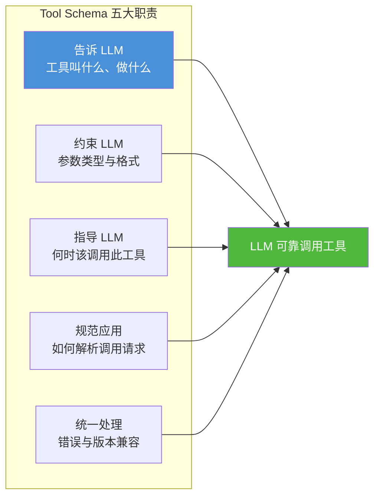

### 1.2 为什么 Schema 设计至关重要

| 场景 | 差 Schema 的后果 | 好 Schema 的价值 |
|------|----------------|-----------------|
| **参数描述模糊** | LLM 传错参数类型、格式 | LLM 准确推断参数,调用成功率 >95% |
| **缺少枚举约束** | LLM 传非法值(如错误的 status) | 枚举值限制,杜绝非法输入 |
| **无必填字段标注** | LLM 漏传关键参数,运行时报错 | `required` 明确标注,LLM 主动追问 |
| **无错误码定义** | 出错后 LLM 无法理解错误、无法自恢复 | 标准错误码,LLM 据此重试或换工具 |
| **无版本字段** | 升级后老客户端崩溃 | 版本协商,平滑迁移 |
| **无安全标注** | 敏感操作(转账/删除)被误触发 | `requires_confirmation` 强制人工确认 |

### 1.3 设计原则

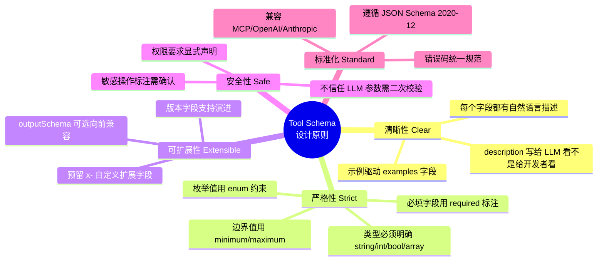

### 1.4 遵循的官方标准

本 Schema 设计融合三大主流标准:

| 标准 | 来源 | 借鉴内容 |
|------|------|---------|
| **JSON Schema 2020-12** | [json-schema.org](https://json-schema.org/draft/2020-12/schema) | 参数类型、校验规则的基础 |
| **MCP 规格 2025-11-25** | [modelcontextprotocol.io](https://modelcontextprotocol.io/specification/2025-11-25/server/tools) | `inputSchema`/`outputSchema`/`annotations`/错误处理 |
| **OpenAI Function Calling** | [platform.openai.com](https://platform.openai.com/docs/guides/function-calling) | `tools` 数组格式、`tool_calls`/`tool_call_id` 消息结构 |

---

## 二、整体结构设计

### 2.1 Tool Schema 的五大组成部分

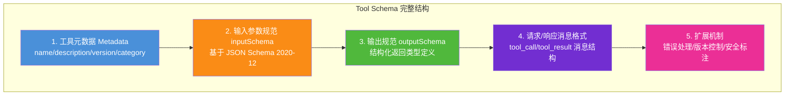

### 2.2 完整 Schema 顶层结构预览

```json
{
  "$schema": "https://json-schema.org/draft/2020-12/schema",
  "tool": {
    "name": "search_orders",
    "title": "订单搜索工具",
    "description": "根据用户ID、状态、时间范围搜索订单列表",
    "version": "1.2.0",
    "category": "e-commerce",
    "inputSchema": { "...": "参数定义(见第四章)" },
    "outputSchema": { "...": "输出定义(见第五章)" },
    "annotations": { "...": "安全标注(见第九章)" },
    "examples": [ { "...": "调用示例" } ]
  }
}
```

### 2.3 字段职责矩阵

| 字段 | 职责 | 谁消费 | 必填 |
|------|------|--------|------|
| `name` | 工具唯一标识 | LLM(选择工具)+ 应用(路由执行) | ✅ |
| `description` | 工具功能说明 | LLM(决定是否调用) | ✅ |
| `inputSchema` | 参数类型约束 | LLM(生成参数)+ 应用(校验) | ✅ |
| `outputSchema` | 返回结构约束 | 应用(解析结果)+ LLM(理解结果) | ⚠️ 可选 |
| `annotations` | 安全/权限标注 | 应用(执行控制) | ⚠️ 可选 |
| `version` | 版本标识 | 应用(兼容性处理) | ✅ |
| `examples` | 调用示例 | LLM(少样本学习) | ⚠️ 可选 |

---

## 三、工具元数据定义

### 3.1 元数据字段详解

```json
{
  "name": "search_orders",
  "title": "订单搜索工具",
  "description": "根据用户ID、订单状态、时间范围搜索订单列表。支持分页。当用户询问'我的订单''订单状态''历史订单'时调用此工具。",
  "version": "1.2.0",
  "category": "e-commerce",
  "tags": ["order", "search", "read-only"],
  "author": "order-team",
  "deprecated": false,
  "deprecated_message": null
}
```

| 字段 | 类型 | 说明 | 设计要点 |
|------|------|------|---------|
| `name` | string | 工具唯一标识 | 小写蛇形命名 `search_orders`,全局唯一,不含空格 |
| `title` | string | 人类可读标题 | 用于 UI 展示,中文/英文均可 |
| `description` | string | **写给 LLM 的功能说明** | 最关键字段!必须说清"做什么"+"何时调用" |
| `version` | string | 语义化版本号 | 遵循 SemVer: `主.次.补丁` |
| `category` | string | 工具分类 | 如 `e-commerce`/`finance`/`search`,用于分组管理 |
| `tags` | array | 标签数组 | 用于检索/过滤,如 `read-only`/`sensitive` |
| `deprecated` | boolean | 是否已废弃 | 废弃工具仍可调用,但应提示迁移 |
| `deprecated_message` | string\|null | 废弃提示 | 指引替代工具:`"请使用 search_orders_v2"` |

### 3.2 description 的写作黄金法则

`description` 是 LLM 决定"是否调用此工具"和"如何传参"的最重要依据。写作遵循 **3W 法则**:

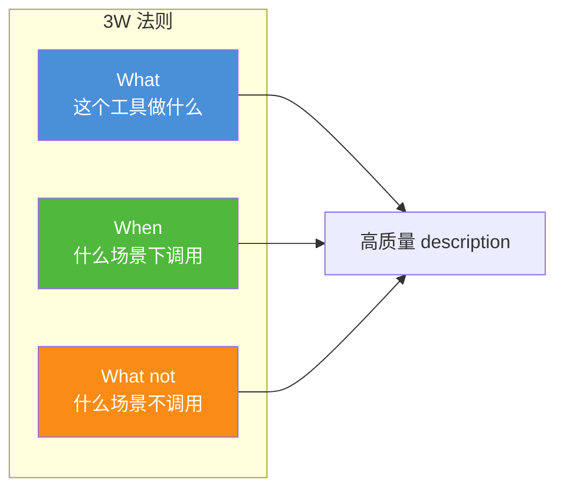

**❌ 差的 description**:
```json
"description": "搜索订单"
```
问题:太简略,LLM 不知道支持什么筛选条件、何时该用。

**✅ 好的 description**:
```json
"description": "根据用户ID、订单状态、时间范围搜索订单列表,支持分页返回。当用户询问'我的订单''订单状态''历史订单''最近购买记录'时调用此工具。不支持搜索商品库存(请用 search_inventory)。返回结果按创建时间倒序。"
```

### 3.3 命名规范

| 规则 | 正确示例 | 错误示例 |
|------|---------|---------|
| 小写蛇形命名 | `search_orders` | `searchOrders` / `SearchOrders` |
| 动词开头 | `get_weather` / `send_email` | `weather` / `email` |
| 避免缩写 | `calculate_discount` | `calc_disc` |
| 全局唯一 | `search_orders`(只有一个) | 多个工具都叫 `search` |
| 版本后缀(可选) | `search_orders_v2` | `search_orders_new` |

---

## 四、函数参数规范(inputSchema)

### 4.1 inputSchema 的本质

`inputSchema` 基于 **JSON Schema 2020-12** 规范,定义工具接受的所有参数的类型、格式、约束。

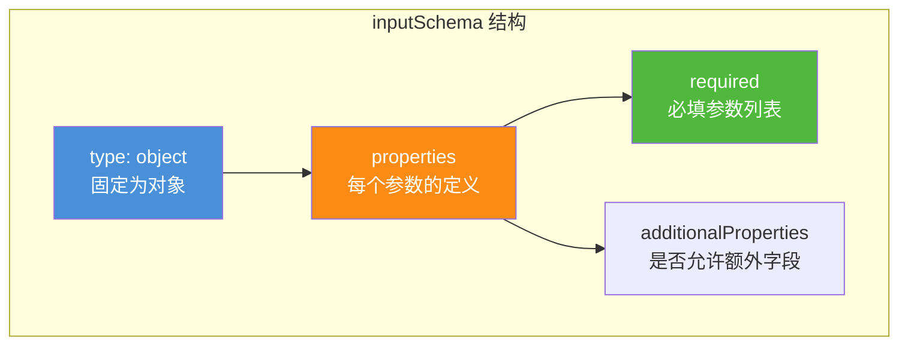

### 4.2 完整 inputSchema 示例

```json
{
  "inputSchema": {
    "type": "object",
    "properties": {
      "user_id": {
        "type": "string",
        "description": "用户唯一标识ID。注意:此字段通常由系统从认证上下文注入,LLM 无需向用户询问。",
        "pattern": "^user_[a-zA-Z0-9]{12}$",
        "examples": ["user_abc123def456"]
      },
      "status": {
        "type": "string",
        "description": "订单状态筛选。不传则返回所有状态。",
        "enum": ["pending", "shipped", "delivered", "cancelled"],
        "default": null
      },
      "date_from": {
        "type": "string",
        "format": "date",
        "description": "查询起始日期(含),格式 YYYY-MM-DD。如 '2026-01-01'。",
        "examples": ["2026-01-01"]
      },
      "date_to": {
        "type": "string",
        "format": "date",
        "description": "查询截止日期(含),格式 YYYY-MM-DD。",
        "examples": ["2026-12-31"]
      },
      "limit": {
        "type": "integer",
        "description": "返回订单数量上限,范围 1-100,默认 10。",
        "minimum": 1,
        "maximum": 100,
        "default": 10
      },
      "include_items": {
        "type": "boolean",
        "description": "是否在结果中包含订单商品明细,默认 false。",
        "default": false
      }
    },
    "required": ["user_id"],
    "additionalProperties": false
  }
}
```

### 4.3 参数类型支持矩阵

| JSON Schema 类型 | 适用场景 | 约束关键字 | 示例 |
|-----------------|---------|-----------|------|
| `string` | 文本、ID、日期 | `pattern`/`format`/`enum`/`minLength`/`maxLength` | `"user_123"` |
| `integer` | 整数数量 | `minimum`/`maximum`/`exclusiveMinimum` | `10` |
| `number` | 浮点数、金额 | `minimum`/`maximum`/`multipleOf` | `99.95` |
| `boolean` | 开关选项 | — | `true` |
| `array` | 列表参数 | `items`/`minItems`/`maxItems`/`uniqueItems` | `["a","b"]` |
| `object` | 嵌套结构 | `properties`/`required`/`additionalProperties` | `{"key":"val"}` |
| `null` | 可空字段 | 与 `type` 数组配合 `["string","null"]` | `null` |

### 4.4 关键约束字段详解

#### enum(枚举约束)— 防止非法值

```json
{
  "status": {
    "type": "string",
    "enum": ["pending", "shipped", "delivered", "cancelled"],
    "description": "订单状态。pending=待发货,shipped=已发货,delivered=已送达,cancelled=已取消。"
  }
}
```
**价值**:LLM 不会传 `"processing"` 这种非法值,杜绝运行时错误。

#### pattern(正则约束)— 格式校验

```json
{
  "email": {
    "type": "string",
    "pattern": "^[\\w.-]+@[\\w.-]+\\.[a-zA-Z]{2,}$",
    "description": "电子邮箱地址。"
  }
}
```

#### format(格式约束)— 标准格式

```json
{
  "created_after": {
    "type": "string",
    "format": "date-time",
    "description": "ISO 8601 时间戳,如 '2026-08-07T00:00:00Z'。"
  }
}
```
**支持的 format**:`date`/`date-time`/`email`/`uri`/`uuid`/`ipv4`/`phone`。

#### required(必填字段)— 防止漏参

```json
{
  "required": ["user_id", "action"],
  "properties": {
    "user_id": { "type": "string" },
    "action": { "type": "string" },
    "reason": { "type": "string" }
  }
}
```
**价值**:LLM 看到 `required` 后,如果用户没提供 `user_id`,会主动追问而非盲目调用。

### 4.5 description 写法(参数级)

参数的 `description` 同样至关重要,直接影响 LLM 推断参数的准确率。

**❌ 差的参数 description**:
```json
{
  "limit": { "type": "integer", "description": "限制" }
}
```

**✅ 好的参数 description**:
```json
{
  "limit": {
    "type": "integer",
    "description": "返回订单数量上限,范围 1-100。当用户说'最近几个订单'时可设为 5-10;当用户说'所有订单'时设为 100。",
    "minimum": 1,
    "maximum": 100,
    "default": 10
  }
}
```

---

## 五、输出规范(outputSchema)

### 5.1 为什么需要 outputSchema

`outputSchema` 是 MCP 2025-11-25 规格新增的字段,用于定义工具返回数据的结构。虽然 OpenAI Function Calling 不强制要求,但它带来三大价值:

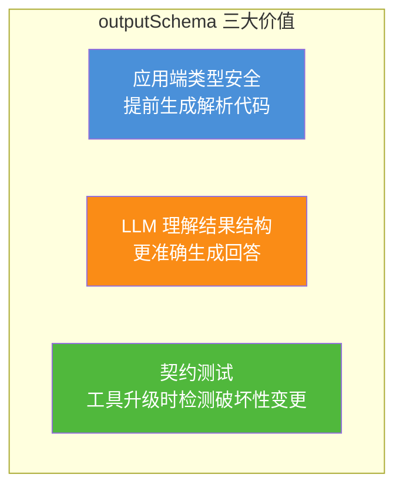

### 5.2 outputSchema 示例

```json
{
  "outputSchema": {
    "type": "object",
    "properties": {
      "success": {
        "type": "boolean",
        "description": "查询是否成功"
      },
      "orders": {
        "type": "array",
        "description": "订单列表,按创建时间倒序",
        "items": {
          "type": "object",
          "properties": {
            "order_id": { "type": "string", "description": "订单ID" },
            "status": { 
              "type": "string", 
              "enum": ["pending", "shipped", "delivered", "cancelled"] 
            },
            "total_amount": { "type": "number", "description": "订单总金额(元)" },
            "created_at": { "type": "string", "format": "date-time" },
            "items": {
              "type": "array",
              "description": "订单商品明细(include_items=true 时返回)",
              "items": {
                "type": "object",
                "properties": {
                  "product_name": { "type": "string" },
                  "quantity": { "type": "integer" },
                  "price": { "type": "number" }
                }
              }
            }
          },
          "required": ["order_id", "status", "total_amount", "created_at"]
        }
      },
      "total_count": {
        "type": "integer",
        "description": "符合条件的订单总数(用于分页)"
      },
      "error": {
        "type": ["string", "null"],
        "description": "错误信息,成功时为 null"
      }
    },
    "required": ["success", "orders", "total_count"]
  }
}
```

### 5.3 输出设计原则

| 原则 | 说明 | 示例 |
|------|------|------|
| **显式 success 字段** | 不要靠 HTTP 状态码,JSON 内必须有成功标识 | `"success": true` |
| **错误字段统一** | 即使成功也带 `error: null`,保持结构一致 | `"error": null` |
| **数组配 total_count** | 列表数据必须有总数,支持分页 | `"total_count": 42` |
| **时间用 ISO 8601** | 统一 `date-time` 格式,避免时区歧义 | `"2026-08-07T10:00:00Z"` |
| **金额带单位说明** | description 注明单位 | `"total_amount": 99.95 (元)` |

---

## 六、请求/响应消息格式

### 6.1 消息流总览

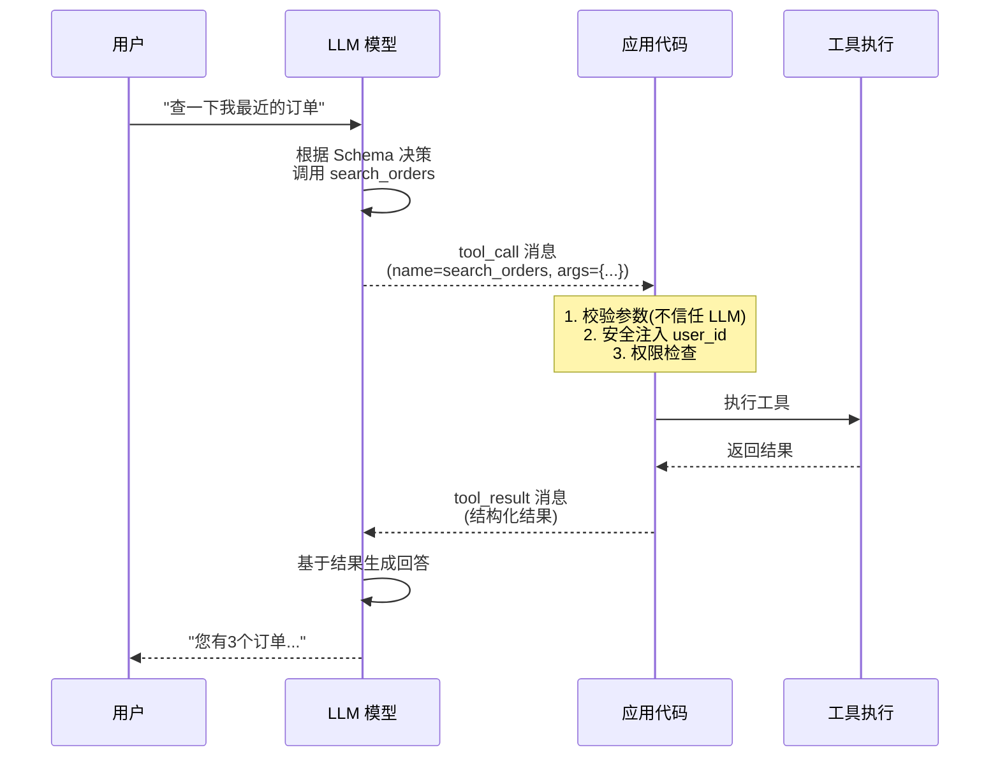

### 6.2 tool_call 请求消息格式

LLM 决定调用工具时,返回的 `tool_call` 消息结构:

```json
{
  "role": "assistant",
  "content": null,
  "tool_calls": [
    {
      "id": "call_abc123",
      "type": "function",
      "function": {
        "name": "search_orders",
        "arguments": "{\"user_id\": \"user_abc123def456\", \"status\": \"shipped\", \"limit\": 5}"
      }
    }
  ]
}
```

| 字段 | 说明 | 设计要点 |
|------|------|---------|
| `id` | 调用唯一标识 | 必须唯一,用于关联后续的 `tool_result` |
| `type` | 固定 `"function"` | OpenAI 标准格式 |
| `function.name` | 工具名称 | 必须与 Schema 的 `name` 完全一致 |
| `function.arguments` | 参数 JSON 字符串 | **注意是字符串不是对象**,需 `json.loads()` |

### 6.3 tool_result 响应消息格式

应用执行工具后,回传给 LLM 的结果消息:

```json
{
  "role": "tool",
  "tool_call_id": "call_abc123",
  "name": "search_orders",
  "content": "{\"success\": true, \"orders\": [...], \"total_count\": 3, \"error\": null}"
}
```

| 字段 | 说明 | 设计要点 |
|------|------|---------|
| `role` | 固定 `"tool"` | 标识这是工具结果消息 |
| `tool_call_id` | 关联的请求 ID | **必须与 `tool_call.id` 一致**,否则 LLM 上下文断裂 |
| `name` | 工具名称 | 用于 LLM 识别结果来源 |
| `content` | 结果 JSON 字符串 | 符合 `outputSchema` 的结构化数据 |

### 6.4 多工具并行调用格式

OpenAI / Anthropic 支持一次返回多个 `tool_calls`,应用需并行执行:

```json
{
  "role": "assistant",
  "content": null,
  "tool_calls": [
    {
      "id": "call_001",
      "type": "function",
      "function": { "name": "search_orders", "arguments": "{\"user_id\": \"user_123\"}" }
    },
    {
      "id": "call_002",
      "type": "function",
      "function": { "name": "get_weather", "arguments": "{\"city\": \"北京\"}" }
    }
  ]
}
```

**响应必须一一对应**:
```json
[
  { "role": "tool", "tool_call_id": "call_001", "name": "search_orders", "content": "..." },
  { "role": "tool", "tool_call_id": "call_002", "name": "get_weather", "content": "..." }
]
```

---

## 七、错误处理机制

### 7.1 三层错误模型

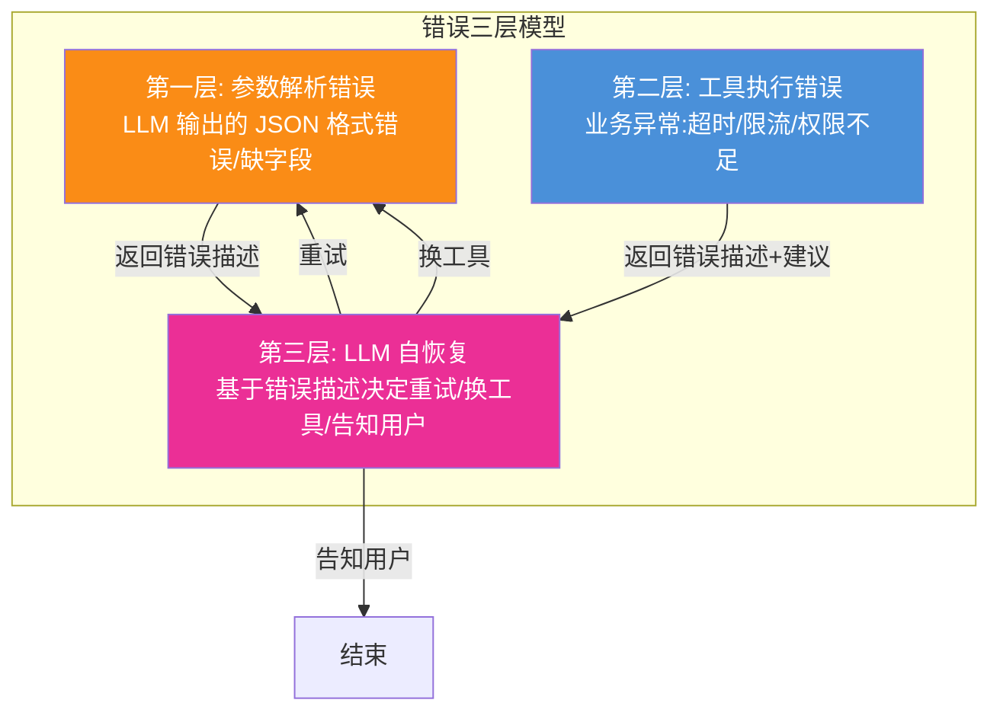

### 7.2 标准错误码定义

借鉴 MCP 错误码规范 + HTTP 语义,定义工具调用标准错误码:

| 错误码 | 名称 | 含义 | LLM 建议动作 |
|--------|------|------|-------------|
| `400` | `INVALID_PARAMS` | 参数格式错误/缺失必填项 | 修正参数后重试 |
| `401` | `UNAUTHORIZED` | 未认证/Token 过期 | 提示用户登录 |
| `403` | `FORBIDDEN` | 无权限调用此工具 | 告知用户无权限,不重试 |
| `404` | `TOOL_NOT_FOUND` | 工具不存在 | 换替代工具 |
| `409` | `CONFLICT` | 资源冲突(如重复创建) | 告知用户已存在 |
| `422` | `BUSINESS_ERROR` | 业务逻辑校验失败 | 根据错误信息调整 |
| `429` | `RATE_LIMITED` | 调用频率超限 | 等待后重试 |
| `500` | `INTERNAL_ERROR` | 工具内部异常 | 重试一次,仍失败则告知用户 |
| `503` | `SERVICE_UNAVAILABLE` | 依赖服务不可用 | 换替代工具或告知用户 |
| `504` | `TIMEOUT` | 执行超时 | 重试或简化请求 |

### 7.3 错误响应消息格式

工具执行出错时,`tool_result` 的 `content` 应返回结构化错误信息(而非裸异常):

```json
{
  "role": "tool",
  "tool_call_id": "call_abc123",
  "name": "search_orders",
  "content": "{\"success\": false, \"error\": {\"code\": \"RATE_LIMITED\", \"message\": \"查询频率过高,每秒限5次。请等待2秒后重试。\", \"retry_after_seconds\": 2, \"suggestion\": \"可以减少 limit 参数或缩小时间范围\"}, \"orders\": []}"
}
```

**关键设计**:
- `success: false` 明确标识失败
- `error.code` 标准错误码,LLM 可据此决策
- `error.message` 自然语言描述,**写给 LLM 看的**
- `error.suggestion` 建议动作,指导 LLM 下一步
- `error.retry_after_seconds` 重试等待时间(限流场景)

### 7.4 应用端错误处理代码

```python
def execute_tool_safely(tool_name: str, args: dict) -> str:
    """应用端三层错误处理"""
    import json, time
    
    # 第一层:参数校验(不信任 LLM 输出)
    try:
        validate_against_schema(args, get_input_schema(tool_name))
    except ValidationError as e:
        return json.dumps({
            "success": False,
            "error": {
                "code": "INVALID_PARAMS",
                "message": f"参数校验失败: {e.message}",
                "suggestion": "请检查参数类型和必填字段"
            }
        })
    
    # 第二层:工具执行
    try:
        result = TOOL_REGISTRY[tool_name](**args)
        return json.dumps({"success": True, **result})
    
    except RateLimitError as e:
        return json.dumps({
            "success": False,
            "error": {
                "code": "RATE_LIMITED",
                "message": f"限流: {e}",
                "retry_after_seconds": 2
            }
        })
    except TimeoutError as e:
        return json.dumps({
            "success": False,
            "error": {
                "code": "TIMEOUT",
                "message": f"执行超时: {e}",
                "suggestion": "可缩小查询范围后重试"
            }
        })
    except Exception as e:
        return json.dumps({
            "success": False,
            "error": {
                "code": "INTERNAL_ERROR",
                "message": f"内部错误: {e}"
            }
        })
```

---

## 八、版本控制策略

### 8.1 语义化版本号(SemVer)

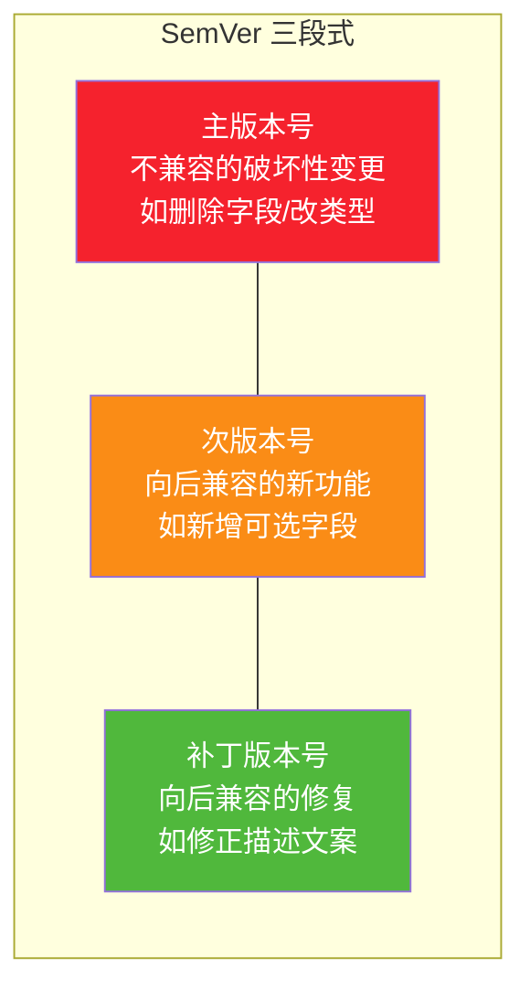

### 8.2 版本字段定义

```json
{
  "version": "1.2.3",
  "version_policy": "semver",
  "min_compatible_client": "1.0.0",
  "changelog": [
    {
      "version": "1.2.3",
      "date": "2026-08-01",
      "type": "patch",
      "changes": ["修正 description 中 status 枚举值说明"]
    },
    {
      "version": "1.2.0",
      "date": "2026-07-15",
      "type": "minor",
      "changes": ["新增 include_items 可选参数", "outputSchema 新增 items 字段"]
    },
    {
      "version": "1.0.0",
      "date": "2026-06-01",
      "type": "major",
      "changes": ["初始发布版本"]
    }
  ]
}
```

### 8.3 版本兼容性策略

| 变更类型 | 示例 | 版本号 | 兼容性 |
|---------|------|--------|--------|
| **新增可选参数** | 加 `include_items` 字段,有 default | MINOR+1 | ✅ 老客户端无影响 |
| **新增返回字段** | outputSchema 加 `items` 字段 | MINOR+1 | ✅ 老客户端忽略新字段 |
| **修正 description** | 改参数说明文案 | PATCH+1 | ✅ 完全兼容 |
| **新增枚举值** | status 加 `returned` | MINOR+1 | ⚠️ 老客户端可能不识别 |
| **删除参数** | 移除 `date_from` | MAJOR+1 | ❌ 破坏性 |
| **修改参数类型** | `limit` 从 int 改 string | MAJOR+1 | ❌ 破坏性 |
| **修改必填字段** | `status` 从可选改必填 | MAJOR+1 | ❌ 破坏性 |

### 8.4 多版本共存策略

生产环境支持多版本工具并行,平滑迁移:

```json
{
  "tools": [
    {
      "name": "search_orders",
      "version": "1.2.0",
      "deprecated": false
    },
    {
      "name": "search_orders_v2",
      "version": "2.0.0",
      "deprecated": false,
      "description": "搜索订单(新版,支持多租户)。建议新客户端使用。"
    },
    {
      "name": "search_orders_legacy",
      "version": "0.9.0",
      "deprecated": true,
      "deprecated_message": "请迁移至 search_orders 或 search_orders_v2"
    }
  ]
}
```

---

## 九、安全与权限扩展字段

### 9.1 annotations 字段(MCP 标准)

MCP 2025-11-25 规格定义了 `annotations` 字段,用于标注工具的行为特征,指导应用层的安全控制:

```json
{
  "annotations": {
    "title": "订单搜索(只读)",
    "readOnlyHint": true,
    "destructiveHint": false,
    "idempotentHint": true,
    "openWorldHint": false,
    "requires_confirmation": false,
    "required_permissions": ["order:read"],
    "rate_limit": {
      "calls_per_minute": 60,
      "calls_per_day": 1000
    },
    "cost": {
      "estimated_latency_ms": 200,
      "estimated_cost_usd": 0.001
    }
  }
}
```

### 9.2 安全标注字段详解

| 字段 | 类型 | 说明 | 应用层动作 |
|------|------|------|-----------|
| `readOnlyHint` | boolean | 只读操作,不修改数据 | 可直接执行 |
| `destructiveHint` | boolean | 破坏性操作(删除/覆盖) | **必须人工确认** |
| `idempotentHint` | boolean | 幂等操作,重复调用无害 | 失败可自动重试 |
| `openWorldHint` | boolean | 与外部世界交互(发邮件/调用外部API) | 需审计日志 |
| `requires_confirmation` | boolean | 需用户显式确认 | **HITL 断点,暂停等待确认** |
| `required_permissions` | array | 所需权限码列表 | 调用前校验用户权限 |
| `rate_limit` | object | 限流配置 | 应用层限流 |
| `cost` | object | 延迟和成本预估 | 用于工具选择决策 |

### 9.3 敏感工具标注示例

```json
{
  "name": "transfer_money",
  "description": "从用户账户转账到指定账户。调用前必须向用户确认转账金额和目标账户。",
  "annotations": {
    "readOnlyHint": false,
    "destructiveHint": true,
    "idempotentHint": false,
    "requires_confirmation": true,
    "required_permissions": ["finance:transfer"],
    "rate_limit": {
      "calls_per_day": 5
    }
  },
  "inputSchema": {
    "type": "object",
    "properties": {
      "from_account": { "type": "string", "description": "转出账户" },
      "to_account": { "type": "string", "description": "转入账户" },
      "amount": { "type": "number", "minimum": 0.01, "maximum": 50000, "description": "转账金额(元)" }
    },
    "required": ["from_account", "to_account", "amount"]
  }
}
```

**应用层处理**:
```python
def execute_with_safety(tool_name, args, user):
    tool = TOOL_REGISTRY[tool_name]
    annotations = tool.get("annotations", {})
    
    # 1. 权限校验
    required_perms = annotations.get("required_permissions", [])
    if not user.has_permissions(required_perms):
        return error_response("FORBIDDEN", "无权限调用此工具")
    
    # 2. 限流校验
    rate_limit = annotations.get("rate_limit")
    if rate_limit and not check_rate_limit(user.id, tool_name, rate_limit):
        return error_response("RATE_LIMITED", "调用频率超限")
    
    # 3. 敏感操作需人工确认
    if annotations.get("requires_confirmation"):
        return {
            "success": False,
            "error": {
                "code": "CONFIRMATION_REQUIRED",
                "message": f"即将执行 {tool_name},参数: {args}。请用户确认后再次调用。"
            }
        }
    
    # 4. 执行
    return tool["handler"](**args)
```

---

## 十、完整 Schema 定义与端到端示例

### 10.1 完整 Schema 定义文件

将前面所有章节整合,一份生产级可用的完整 Tool Schema:

```json
{
  "$schema": "https://json-schema.org/draft/2020-12/schema",
  "tool": {
    "name": "search_orders",
    "title": "订单搜索工具",
    "description": "根据用户ID、订单状态、时间范围搜索订单列表,支持分页。当用户询问'我的订单''订单状态''历史订单''最近购买记录'时调用。不支持搜索商品库存(请用 search_inventory)。",
    "version": "1.2.0",
    "version_policy": "semver",
    "category": "e-commerce",
    "tags": ["order", "search", "read-only"],
    "author": "order-team",
    "deprecated": false,

    "inputSchema": {
      "type": "object",
      "properties": {
        "user_id": {
          "type": "string",
          "description": "用户唯一标识ID。通常由系统从认证上下文注入,LLM 无需询问用户。",
          "pattern": "^user_[a-zA-Z0-9]{12}$"
        },
        "status": {
          "type": "string",
          "description": "订单状态筛选。pending=待发货,shipped=已发货,delivered=已送达,cancelled=已取消。不传则返回所有状态。",
          "enum": ["pending", "shipped", "delivered", "cancelled"]
        },
        "date_from": {
          "type": "string",
          "format": "date",
          "description": "查询起始日期(含),格式 YYYY-MM-DD。"
        },
        "date_to": {
          "type": "string",
          "format": "date",
          "description": "查询截止日期(含),格式 YYYY-MM-DD。"
        },
        "limit": {
          "type": "integer",
          "description": "返回数量上限,范围 1-100,默认 10。用户说'最近几个'可设 5;说'所有'设 100。",
          "minimum": 1,
          "maximum": 100,
          "default": 10
        },
        "include_items": {
          "type": "boolean",
          "description": "是否包含商品明细,默认 false。",
          "default": false
        }
      },
      "required": ["user_id"],
      "additionalProperties": false
    },

    "outputSchema": {
      "type": "object",
      "properties": {
        "success": { "type": "boolean" },
        "orders": {
          "type": "array",
          "items": {
            "type": "object",
            "properties": {
              "order_id": { "type": "string" },
              "status": { "type": "string", "enum": ["pending", "shipped", "delivered", "cancelled"] },
              "total_amount": { "type": "number" },
              "created_at": { "type": "string", "format": "date-time" }
            },
            "required": ["order_id", "status", "total_amount", "created_at"]
          }
        },
        "total_count": { "type": "integer" },
        "error": { "type": ["string", "null"] }
      },
      "required": ["success", "orders", "total_count"]
    },

    "annotations": {
      "title": "订单搜索(只读)",
      "readOnlyHint": true,
      "destructiveHint": false,
      "idempotentHint": true,
      "requires_confirmation": false,
      "required_permissions": ["order:read"],
      "rate_limit": { "calls_per_minute": 60 },
      "cost": { "estimated_latency_ms": 200 }
    },

    "examples": [
      {
        "description": "查询用户最近的5个已发货订单",
        "arguments": { "user_id": "user_abc123def456", "status": "shipped", "limit": 5 },
        "output": {
          "success": true,
          "orders": [
            { "order_id": "ORD-2026-001", "status": "shipped", "total_amount": 299.00, "created_at": "2026-08-01T10:00:00Z" }
          ],
          "total_count": 1,
          "error": null
        }
      }
    ],

    "changelog": [
      { "version": "1.2.0", "type": "minor", "date": "2026-07-15", "changes": ["新增 include_items 参数"] },
      { "version": "1.0.0", "type": "major", "date": "2026-06-01", "changes": ["初始发布"] }
    ]
  }
}
```

### 10.2 端到端调用示例

```python
import json
from openai import OpenAI

client = OpenAI()

# 1. 工具实现(符合 Schema)
def search_orders(user_id, status=None, date_from=None, date_to=None, 
                  limit=10, include_items=False, user_context=None):
    """实际工具实现"""
    # 安全注入:不信任 LLM 传的 user_id,用认证上下文覆盖
    if user_context:
        user_id = user_context["authenticated_user_id"]
    
    # 业务查询
    orders = db.query(
        "SELECT * FROM orders WHERE user_id = %s AND (%s IS NULL OR status = %s) LIMIT %s",
        [user_id, status, status, limit]
    )
    
    return {
        "success": True,
        "orders": orders,
        "total_count": len(orders),
        "error": None
    }


# 2. 工具 Schema(从 10.1 加载)
TOOL_SCHEMA = load_tool_schema("search_orders")

# 3. 完整调用循环
def chat_with_tool(user_input: str, user_context: dict) -> str:
    messages = [
        {"role": "system", "content": "你是订单助手。"},
        {"role": "user", "content": user_input}
    ]
    
    # 第一轮:LLM 决策是否调用工具
    response = client.chat.completions.create(
        model="gpt-4o",
        messages=messages,
        tools=[{"type": "function", "function": {
            "name": TOOL_SCHEMA["name"],
            "description": TOOL_SCHEMA["description"],
            "parameters": TOOL_SCHEMA["inputSchema"]
        }}]
    )
    
    msg = response.choices[0].message
    messages.append(msg)
    
    if not msg.tool_calls:
        return msg.content  # 无需工具,直接回答
    
    # 第二轮:执行工具 + 回传结果
    for tc in msg.tool_calls:
        # 解析参数(第一层错误处理)
        try:
            args = json.loads(tc.function.arguments)
        except json.JSONDecodeError:
            args = {}
        
        # 执行工具(已实现安全注入和错误处理)
        result = search_orders(**args, user_context=user_context)
        
        # 回传结果
        messages.append({
            "tool_call_id": tc.id,
            "role": "tool",
            "name": tc.function.name,
            "content": json.dumps(result, ensure_ascii=False)
        })
    
    # 第三轮:LLM 基于结果生成回答
    final = client.chat.completions.create(model="gpt-4o", messages=messages)
    return final.choices[0].message.content


# 调用
answer = chat_with_tool("查一下我最近5个已发货的订单", 
                         user_context={"authenticated_user_id": "user_abc123def456"})
print(answer)
# 输出: "您最近有3个已发货订单:1) ORD-2026-001 ¥299..."
```

---

## 十一、主流框架适配方案

### 11.1 OpenAI Function Calling 适配

OpenAI 的 `tools` 参数只需 `name`/`description`/`parameters` 三个字段:

```python
# OpenAI 适配:精简 Schema
def to_openai_format(tool_schema):
    return {
        "type": "function",
        "function": {
            "name": tool_schema["name"],
            "description": tool_schema["description"],
            "parameters": tool_schema["inputSchema"],
            "strict": True  # OpenAI 严格模式:禁止额外字段
        }
    }

# 使用
tools = [to_openai_format(TOOL_SCHEMA)]
response = client.chat.completions.create(
    model="gpt-4o",
    messages=messages,
    tools=tools
)
```

### 11.2 Anthropic Tool Use 适配

Anthropic 的格式略有不同,`input_schema` 用下划线:

```python
# Anthropic 适配
def to_anthropic_format(tool_schema):
    return {
        "name": tool_schema["name"],
        "description": tool_schema["description"],
        "input_schema": tool_schema["inputSchema"]
    }

# 使用
response = anthropic_client.messages.create(
    model="claude-sonnet-4-5-20250929",
    messages=messages,
    tools=[to_anthropic_format(TOOL_SCHEMA)]
)
```

### 11.3 MCP 适配

MCP 原生支持完整 Schema(含 outputSchema 和 annotations):

```python
# MCP Server 端注册工具
from mcp.server.fastmcp import FastMCP

mcp = FastMCP("OrderTools")

@mcp.tool()
def search_orders(user_id: str, status: str = None, limit: int = 10):
    """根据用户ID、订单状态搜索订单列表。"""
    # MCP 自动从类型注解生成 inputSchema
    return search_orders_impl(user_id, status, limit)

# MCP 的 tools/list 响应自动包含完整 Schema
```

### 11.4 LangChain 适配

LangChain `@tool` 装饰器自动从函数签名和 docstring 生成 Schema:

```python
from langchain_core.tools import tool
from pydantic import BaseModel, Field

class SearchOrdersInput(BaseModel):
    """订单搜索参数"""
    user_id: str = Field(description="用户唯一标识ID")
    status: str = Field(
        default=None,
        description="订单状态:pending/shipped/delivered/cancelled",
        pattern="^(pending|shipped|delivered|cancelled)$"
    )
    limit: int = Field(default=10, ge=1, le=100, description="返回数量上限")

@tool(args_schema=SearchOrdersInput)
def search_orders(user_id: str, status: str = None, limit: int = 10) -> dict:
    """根据用户ID、订单状态搜索订单列表。当用户询问'我的订单''订单状态'时调用。"""
    return search_orders_impl(user_id, status, limit)
```

### 11.5 框架适配对照表

| 框架 | Schema 来源 | outputSchema | annotations | 严格模式 |
|------|------------|-------------|-------------|---------|
| **OpenAI** | `tools[].function` | ❌ 不支持 | ❌ 不支持 | ✅ `strict: true` |
| **Anthropic** | `tools[]` | ❌ 不支持 | ❌ 不支持 | ⚠️ 通过 `disable_parallel_tool_use` |
| **MCP** | `tools/list` 响应 | ✅ 原生支持 | ✅ 原生支持 | ✅ JSON Schema 2020-12 |
| **LangChain** | `@tool` + Pydantic | ⚠️ 通过 return 类型 | ❌ 不支持 | ✅ Pydantic 强校验 |

---

## 十二、最佳实践与总结

### 12.1 Schema 设计检查清单

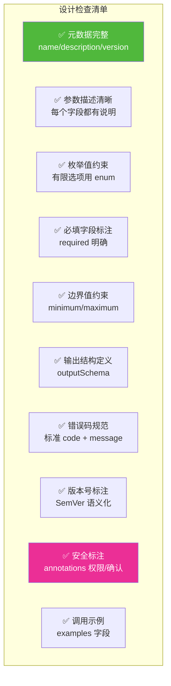

### 12.2 常见反模式

| 反模式 | 问题 | 正确做法 |
|--------|------|---------|
| `description` 只写工具名 | LLM 不知道何时调用 | 写清"做什么+何时调用+何时不调用" |
| 参数无 `description` | LLM 猜测参数含义 | 每个参数都写说明 |
| 用 `string` 不用 `enum` | LLM 传非法值 | 有限选项必须 `enum` |
| 必填字段不标 `required` | LLM 漏传关键参数 | 显式标注 `required` |
| 无 `outputSchema` | 应用端无法类型安全 | 定义返回结构 |
| 错误返回裸异常字符串 | LLM 无法理解错误 | 返回结构化 `{code, message, suggestion}` |
| 无版本号 | 升级导致崩溃 | SemVer + changelog |
| 敏感操作无标注 | 误执行转账/删除 | `requires_confirmation: true` |

### 12.3 设计原则总结

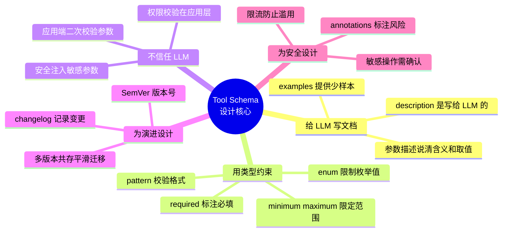

### 12.4 一句话总结

> **好的 Tool Schema = 清晰的 description(给 LLM) + 严格的 JSON Schema 约束(给参数) + 结构化的 outputSchema(给结果) + 标准化的错误码(给恢复) + 语义化的版本号(给演进) + 完备的安全标注(给应用层)。**

### 12.5 与系列文档的关系

| 文档 | 主题 | 与本文关系 |
|------|------|-----------|
| [89号:FC vs API](./89FunctionCalling与普通API调用核心区别系统性对比深度解析.md) | 调用方式对比 | 本文是其中的"参数传递"章节的深入 |
| [90号:动态工具选择](./90Agent动态工具选择决策机制完整实现深度解析.md) | 工具选择实现 | 本文的 Schema 是选择决策的输入 |
| [42号:工具选择决策](../3Agent%20架构设计/42Agent工具选择决策机制深度解析.md) | 选择方法论 | 本文 Schema 的 `description` 影响选择准确率 |
| **本文** | **Schema 设计规范** | **工具调用的"契约定义"** |

---

> **参考来源:**
> - [MCP Specification 2025-11-25 - Tools](https://modelcontextprotocol.io/specification/2025-11-25/server/tools) — 官方工具 Schema 规格(含 outputSchema/annotations)
> - [MCP Base Protocol](https://modelcontextprotocol.io/specification/2025-11-25/basic/index.md) — JSON-RPC 2.0 消息格式与错误处理
> - [JSON Schema 2020-12](https://json-schema.org/draft/2020-12/schema) — 参数校验规范基础
> - [OpenAI Function Calling Guide](https://platform.openai.com/docs/guides/function-calling) — OpenAI tools 参数格式
> - [Agent基础:OpenAI/Anthropic/MCP 三大协议对比](https://blog.csdn.net/sweet_ran/article/details/156240780) — 三大协议差异分析
> - [MCP vs OpenAPI vs JSON Schema](https://github.com/thorwhalen/aix/discussions/13) — Schema 标准关系解析
