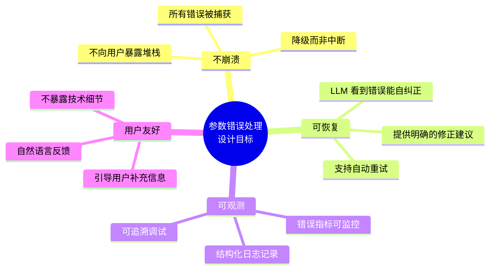
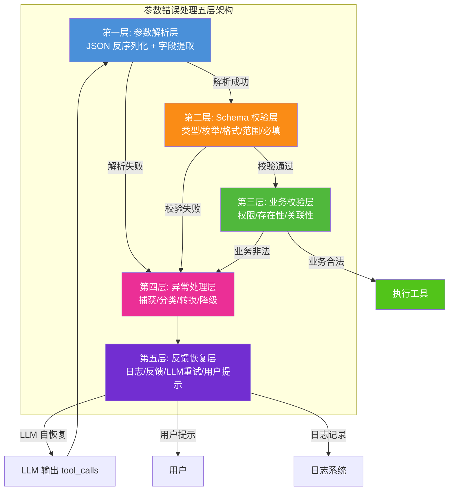
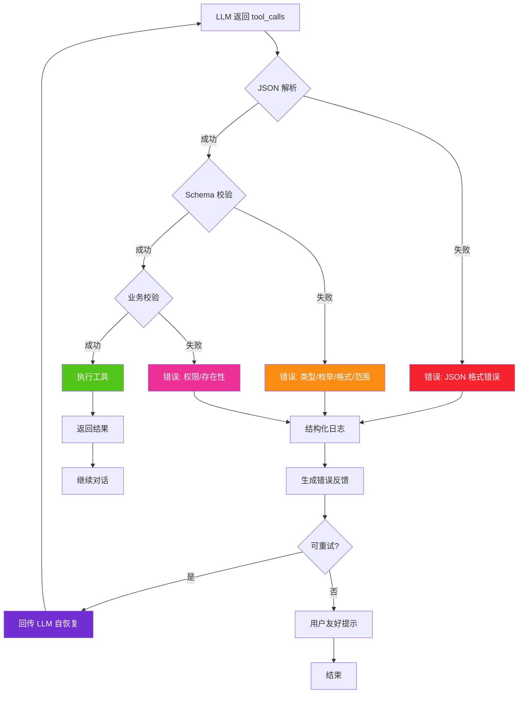
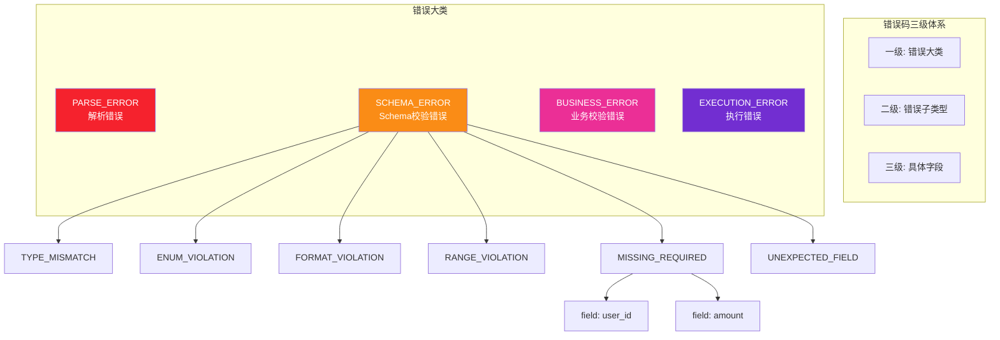
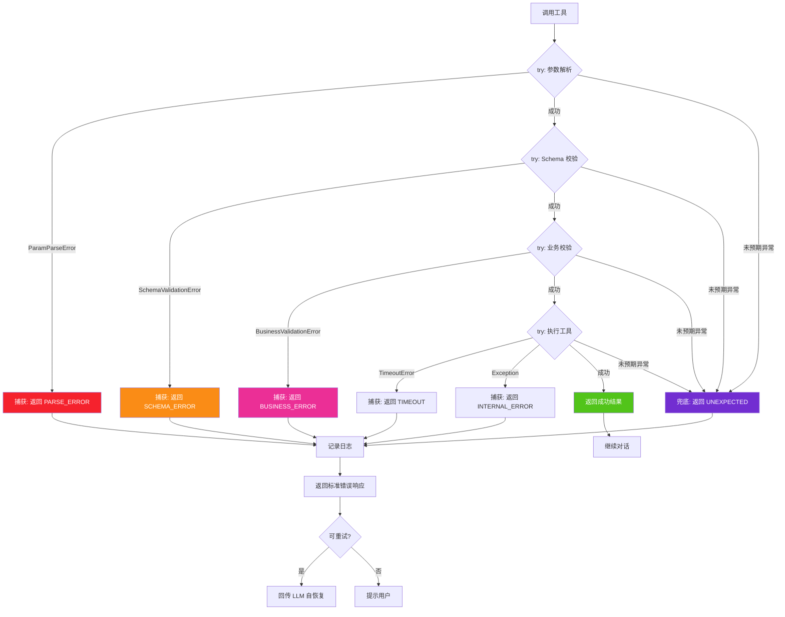
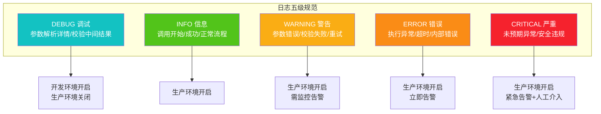
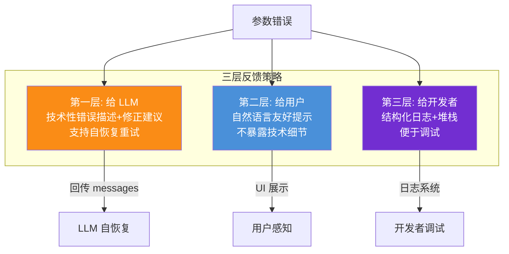
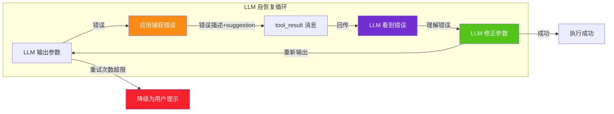
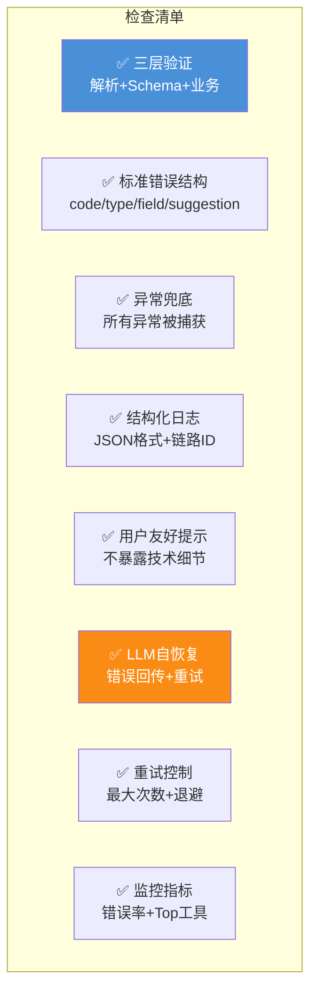

# 工具调用参数错误系统性处理方案深度解析

> **文档定位**:本文档是 Tool Calling / Function Calling 系列的第四篇核心文档,专注于 **工具调用过程中参数错误的系统性处理方案**。在 [89号文档](./89FunctionCalling与普通API调用核心区别系统性对比深度解析.md) 对比调用方式、[90号文档](./90Agent动态工具选择决策机制完整实现深度解析.md) 实现动态选择、[91号文档](./91ToolSchema完整设计规范深度解析.md) 定义 Schema 规范的基础上,本文回答工程落地的下一个关键问题:**"当 LLM 输出的工具调用参数出错时,如何系统性、标准化地处理?"**
>
> **核心问题**:LLM 生成的参数存在固有不确定性(幻觉、格式错误、枚举偏差、缺失必填项)。本文提供从**三层参数验证**、**标准化错误提示**、**异常捕获流程**、**结构化日志规范**、**用户友好反馈**到 **LLM 自恢复重试**的完整方案,确保参数错误不会导致系统崩溃,而是被优雅地捕获、修复或反馈。

---

## 目录

- [一、参数错误处理的核心挑战](#一参数错误处理的核心挑战)
- [二、整体处理架构设计](#二整体处理架构设计)
- [三、三层参数验证机制](#三三层参数验证机制)
- [四、标准化错误提示信息](#四标准化错误提示信息)
- [五、异常捕获与处理流程](#五异常捕获与处理流程)
- [六、结构化日志记录规范](#六结构化日志记录规范)
- [七、用户友好反馈机制](#七用户友好反馈机制)
- [八、LLM 自恢复与重试机制](#八llm-自恢复与重试机制)
- [九、完整实现与测试验证](#九完整实现与测试验证)
- [十、最佳实践与总结](#十最佳实践与总结)

---

## 一、参数错误处理的核心挑战

### 1.1 LLM 参数输出的固有不确定性

LLM 生成工具调用参数时,存在六类典型错误:

```mermaid
flowchart TB
    subgraph LLM 参数错误六大类型
        E1[类型一:JSON 格式错误<br/>arguments 字段不是合法 JSON]
        E2[类型二:类型不匹配<br/>期望 int 传了 string]
        E3[类型三:枚举值偏差<br/>传 "processing" 而非 "pending"]
        E4[类型四:必填字段缺失<br/>漏传 user_id]
        E5[类型五:范围越界<br/>limit=200 超过 maximum=100]
        E6[类型六:格式不符<br/>日期传 "2026/8/7" 而非 "2026-08-07"]
    end
    
    E1 & E2 & E3 & E4 & E5 & E6 --> R[参数错误导致工具执行失败]
    
    style E1 fill:#f5222d,color:#fff
    style E2 fill:#fa8c16,color:#fff
    style E3 fill:#faad14,color:#fff
    style E4 fill:#eb2f96,color:#fff
    style E5 fill:#722ed1,color:#fff
    style E6 fill:#13c2c2,color:#fff
    style R fill:#f5222d,color:#fff
```

### 1.2 不做处理的严重后果

| 错误类型 | 不处理的后果 | 影响程度 |
|---------|------------|---------|
| JSON 格式错误 | `json.loads()` 抛异常,Agent 崩溃 | 🔴 致命 |
| 类型不匹配 | 函数签名报错 `TypeError` | 🔴 致命 |
| 枚举值偏差 | 业务逻辑分支异常或静默错误 | 🟡 严重 |
| 必填字段缺失 | `KeyError` 或 SQL 注入风险 | 🔴 致命 |
| 范围越界 | 一次性查询万条数据,拖垮数据库 | 🟡 严重 |
| 格式不符 | 日期解析失败或时区错误 | 🟡 严重 |

### 1.3 设计目标



---

## 二、整体处理架构设计

### 2.1 五层处理架构



### 2.2 处理流程总览



---

## 三、三层参数验证机制

### 3.1 第一层:参数解析验证

```python
import json
from typing import Any, Optional

class ParamParseError(Exception):
    """参数解析错误"""
    pass


def parse_tool_arguments(raw_arguments: str) -> dict:
    """
    第一层验证: JSON 解析
    
    LLM 输出的 arguments 是字符串,需要反序列化为 dict
    常见错误: 不是合法 JSON、是空字符串、是 null
    """
    # 错误1: 空字符串或 None
    if not raw_arguments or raw_arguments.strip() == "":
        # 空参数是合法的(工具无参数时),返回空 dict
        return {}
    
    # 错误2: JSON 解析失败
    try:
        parsed = json.loads(raw_arguments)
    except json.JSONDecodeError as e:
        raise ParamParseError(
            f"LLM 输出的 arguments 不是合法 JSON。"
            f"错误位置: 行{e.lineno} 列{e.colno}。"
            f"错误内容: {e.msg}。"
            f"原始值: {raw_arguments[:200]}"
        )
    
    # 错误3: 解析结果不是对象
    if not isinstance(parsed, dict):
        raise ParamParseError(
            f"arguments 解析后应为 JSON 对象,实际为 {type(parsed).__name__}。"
            f"原始值: {raw_arguments[:200]}"
        )
    
    return parsed
```

### 3.2 第二层:Schema 校验

```python
from jsonschema import validate, ValidationError
from typing import List

class SchemaValidationError(Exception):
    """Schema 校验错误"""
    def __init__(self, errors: List[dict]):
        self.errors = errors
        super().__init__(f"Schema 校验失败: {errors}")


def validate_against_schema(args: dict, input_schema: dict) -> None:
    """
    第二层验证: JSON Schema 校验
    
    基于 91 号文档定义的 inputSchema,校验:
    - 类型 (type)
    - 枚举 (enum)
    - 格式 (format: date/date-time/email/uri)
    - 范围 (minimum/maximum/minLength/maxLength)
    - 必填 (required)
    - 额外字段 (additionalProperties)
    """
    errors = []
    
    try:
        # 使用 jsonschema 库进行严格校验
        validate(instance=args, schema=input_schema)
    except ValidationError as e:
        # 提取错误详情,转换为标准化错误信息
        error_detail = {
            "field": ".".join(str(p) for p in e.absolute_path) or "(root)",
            "value": e.instance,
            "expected": e.schema.get("description", str(e.schema)),
            "error_type": _classify_validation_error(e),
            "message": e.message,
            "suggestion": _generate_fix_suggestion(e)
        }
        errors.append(error_detail)
    
    if errors:
        raise SchemaValidationError(errors)


def _classify_validation_error(error: ValidationError) -> str:
    """分类校验错误类型"""
    if "is not of type" in error.message:
        return "TYPE_MISMATCH"
    if "is not one of" in error.message:
        return "ENUM_VIOLATION"
    if "does not match" in error.message:
        return "FORMAT_VIOLATION"
    if "is greater than" in error.message or "is less than" in error.message:
        return "RANGE_VIOLATION"
    if "is a required property" in error.message:
        return "MISSING_REQUIRED"
    if "Additional properties are not allowed" in error.message:
        return "UNEXPECTED_FIELD"
    return "VALIDATION_ERROR"


def _generate_fix_suggestion(error: ValidationError) -> str:
    """根据错误类型生成修正建议(给 LLM 看)"""
    error_type = _classify_validation_error(error)
    field = ".".join(str(p) for p in error.absolute_path) or "(root)"
    
    suggestions = {
        "TYPE_MISMATCH": f"字段 '{field}' 的类型错误,期望 {error.validator_value},请检查并修正类型。",
        "ENUM_VIOLATION": f"字段 '{field}' 的值不在允许范围内,可选值: {error.validator_value}。",
        "FORMAT_VIOLATION": f"字段 '{field}' 的格式不正确,期望格式: {error.validator}。",
        "RANGE_VIOLATION": f"字段 '{field}' 的值超出范围,约束: {error.validator}={error.validator_value}。",
        "MISSING_REQUIRED": f"缺少必填字段: {error.validator_value}。请补充此字段后重新调用。",
        "UNEXPECTED_FIELD": f"存在未定义的字段。请移除多余字段,只使用 Schema 中定义的参数。"
    }
    return suggestions.get(error_type, f"字段 '{field}' 校验失败: {error.message}")
```

### 3.3 第三层:业务校验

```python
class BusinessValidationError(Exception):
    """业务校验错误"""
    pass


def validate_business_rules(tool_name: str, args: dict, user_context: dict) -> None:
    """
    第三层验证: 业务规则校验
    
    Schema 无法表达的业务约束:
    - 权限校验: 用户是否有权调用此工具/操作此资源
    - 存在性校验: 引用的资源是否存在
    - 关联性校验: 字段间的业务逻辑关系
    - 安全校验: 敏感参数是否被篡改
    """
    
    # 1. 权限校验
    if tool_name == "transfer_money":
        if not user_context.get("has_transfer_permission"):
            raise BusinessValidationError(
                code="FORBIDDEN",
                message="您没有转账权限,请联系管理员开通。",
                user_message="抱歉,您的账户暂未开通转账功能。"
            )
    
    # 2. 存在性校验
    if tool_name == "search_orders":
        user_id = args.get("user_id")
        if user_id and not user_exists(user_id):
            raise BusinessValidationError(
                code="NOT_FOUND",
                message=f"用户 {user_id} 不存在。",
                user_message="未找到您的账户信息,请确认登录状态。"
            )
    
    # 3. 关联性校验
    if tool_name == "search_orders":
        date_from = args.get("date_from")
        date_to = args.get("date_to")
        if date_from and date_to and date_from > date_to:
            raise BusinessValidationError(
                code="INVALID_RANGE",
                message=f"date_from({date_from}) 不能晚于 date_to({date_to})。",
                user_message="起始日期不能晚于截止日期,请调整时间范围。"
            )
    
    # 4. 安全校验: 防止 LLM 篡改 user_id
    if "user_id" in args:
        authenticated_id = user_context.get("authenticated_user_id")
        if authenticated_id and args["user_id"] != authenticated_id:
            raise BusinessValidationError(
                code="SECURITY_VIOLATION",
                message=f"user_id 不匹配: 传入 {args['user_id']}, 认证 {authenticated_id}。",
                user_message="身份验证失败,已使用您的认证身份。"
            )
            # 或直接安全注入(覆盖):
            # args["user_id"] = authenticated_id
```

### 3.4 三层验证对比

| 验证层 | 校验内容 | 错误类型 | 处理方式 | 示例 |
|--------|---------|---------|---------|------|
| **第一层 解析** | JSON 格式合法性 | `PARSE_ERROR` | 回传 LLM 重试 | arguments 不是合法 JSON |
| **第二层 Schema** | 类型/枚举/格式/范围/必填 | `SCHEMA_ERROR` | 回传 LLM 修正 | status 传了 "processing" |
| **第三层 业务** | 权限/存在性/关联性/安全 | `BUSINESS_ERROR` | 提示用户或回传 LLM | user_id 被篡改 |

---

## 四、标准化错误提示信息

### 4.1 标准错误响应结构

所有参数错误统一返回标准结构,确保 LLM 和应用端都能解析:

```json
{
  "success": false,
  "error": {
    "code": "SCHEMA_ERROR",
    "type": "ENUM_VIOLATION",
    "field": "status",
    "received_value": "processing",
    "expected": ["pending", "shipped", "delivered", "cancelled"],
    "message": "字段 'status' 的值 'processing' 不在允许范围内。",
    "suggestion": "可选值为: pending(待发货)、shipped(已发货)、delivered(已送达)、cancelled(已取消)。请选择正确的状态值后重新调用。",
    "retryable": true,
    "user_message": "订单状态查询失败,请确认您要查询的订单状态。"
  }
}
```

### 4.2 错误字段说明

| 字段 | 类型 | 说明 | 消费者 |
|------|------|------|--------|
| `success` | boolean | 固定 `false` | 应用端 |
| `error.code` | string | 错误大类码 | LLM + 应用端 |
| `error.type` | string | 错误子类型 | LLM(决定修正策略) |
| `error.field` | string | 出错字段路径 | LLM(定位修正) |
| `error.received_value` | any | LLM 传入的错误值 | 调试 |
| `error.expected` | any | 期望的值或格式 | LLM(修正依据) |
| `error.message` | string | 技术错误描述 | 日志/调试 |
| `error.suggestion` | string | **修正建议(给 LLM)** | LLM(自恢复关键) |
| `error.retryable` | boolean | 是否可重试 | 应用端(重试控制) |
| `error.user_message` | string | **用户友好提示** | 用户 |

### 4.3 错误码标准体系



### 4.4 标准错误码完整表

| 大类码 | 子类型 | 含义 | 可重试 | LLM 动作 |
|--------|--------|------|--------|---------|
| `PARSE_ERROR` | `INVALID_JSON` | JSON 解析失败 | ✅ | 重新输出合法 JSON |
| `PARSE_ERROR` | `NOT_OBJECT` | 不是 JSON 对象 | ✅ | 输出 `{}` 格式 |
| `SCHEMA_ERROR` | `TYPE_MISMATCH` | 类型不匹配 | ✅ | 修正类型(int/string/bool) |
| `SCHEMA_ERROR` | `ENUM_VIOLATION` | 枚举值非法 | ✅ | 选择 enum 内的值 |
| `SCHEMA_ERROR` | `FORMAT_VIOLATION` | 格式不符 | ✅ | 按 format 调整 |
| `SCHEMA_ERROR` | `RANGE_VIOLATION` | 范围越界 | ✅ | 调整到 min/max 内 |
| `SCHEMA_ERROR` | `MISSING_REQUIRED` | 缺必填字段 | ✅ | 补充字段 |
| `SCHEMA_ERROR` | `UNEXPECTED_FIELD` | 多余字段 | ✅ | 移除多余字段 |
| `BUSINESS_ERROR` | `FORBIDDEN` | 无权限 | ❌ | 告知用户无权限 |
| `BUSINESS_ERROR` | `NOT_FOUND` | 资源不存在 | ❌ | 告知用户不存在 |
| `BUSINESS_ERROR` | `INVALID_RANGE` | 业务范围错误 | ✅ | 调整参数关系 |
| `BUSINESS_ERROR` | `SECURITY_VIOLATION` | 安全违规 | ❌ | 使用系统注入值 |
| `EXECUTION_ERROR` | `TIMEOUT` | 执行超时 | ✅ | 简化请求重试 |
| `EXECUTION_ERROR` | `RATE_LIMITED` | 限流 | ✅ | 等待后重试 |

### 4.5 错误提示生成器

```python
def build_error_response(code: str, error_type: str, field: str,
                          received_value: Any, expected: Any,
                          message: str, suggestion: str,
                          retryable: bool, user_message: str) -> dict:
    """生成标准化错误响应"""
    return {
        "success": False,
        "error": {
            "code": code,
            "type": error_type,
            "field": field,
            "received_value": received_value,
            "expected": expected,
            "message": message,
            "suggestion": suggestion,
            "retryable": retryable,
            "user_message": user_message,
            "timestamp": datetime.now().isoformat()
        }
    }
```

---

## 五、异常捕获与处理流程

### 5.1 统一异常处理框架

```python
import functools
import logging
from typing import Callable, Any

logger = logging.getLogger("tool_calling")

# 自定义异常层级
class ToolCallError(Exception):
    """工具调用错误基类"""
    def __init__(self, code: str, message: str, retryable: bool = True,
                 user_message: str = None, suggestion: str = None):
        self.code = code
        self.message = message
        self.retryable = retryable
        self.user_message = user_message or message
        self.suggestion = suggestion
        super().__init__(message)


class ParamParseError(ToolCallError):
    """参数解析错误"""
    pass


class SchemaValidationError(ToolCallError):
    """Schema 校验错误"""
    pass


class BusinessValidationError(ToolCallError):
    """业务校验错误"""
    pass


class ToolExecutionError(ToolCallError):
    """工具执行错误"""
    pass


def handle_tool_errors(func: Callable) -> Callable:
    """
    统一异常处理装饰器
    
    捕获所有可能的异常,转换为标准化错误响应
    确保任何错误都不会导致 Agent 崩溃
    """
    @functools.wraps(func)
    def wrapper(tool_name: str, raw_arguments: str, 
                user_context: dict, *args, **kwargs) -> dict:
        correlation_id = user_context.get("correlation_id", "unknown")
        
        try:
            # === 第一层:参数解析 ===
            try:
                parsed_args = parse_tool_arguments(raw_arguments)
                logger.info(f"[{correlation_id}] 参数解析成功", 
                           extra={"tool": tool_name, "args": parsed_args})
            except ParamParseError as e:
                logger.warning(f"[{correlation_id}] 参数解析失败: {e.message}",
                              extra={"tool": tool_name, "raw": raw_arguments})
                return build_error_response(
                    code="PARSE_ERROR",
                    error_type="INVALID_JSON",
                    field="(root)",
                    received_value=raw_arguments,
                    expected="合法 JSON 对象",
                    message=e.message,
                    suggestion="请输出合法的 JSON 格式参数,如 {\"user_id\": \"user_123\"}。",
                    retryable=True,
                    user_message="参数格式错误,正在自动修正,请稍候。"
                )
            
            # === 第二层:Schema 校验 ===
            try:
                input_schema = get_tool_schema(tool_name)["inputSchema"]
                validate_against_schema(parsed_args, input_schema)
                logger.info(f"[{correlation_id}] Schema 校验通过")
            except SchemaValidationError as e:
                logger.warning(f"[{correlation_id}] Schema 校验失败: {e.errors}",
                              extra={"tool": tool_name, "args": parsed_args})
                err = e.errors[0]  # 第一个错误
                return build_error_response(
                    code="SCHEMA_ERROR",
                    error_type=err["error_type"],
                    field=err["field"],
                    received_value=err["value"],
                    expected=err["expected"],
                    message=err["message"],
                    suggestion=err["suggestion"],
                    retryable=True,
                    user_message="参数校验失败,正在自动修正,请稍候。"
                )
            
            # === 第三层:业务校验 ===
            try:
                validate_business_rules(tool_name, parsed_args, user_context)
                logger.info(f"[{correlation_id}] 业务校验通过")
            except BusinessValidationError as e:
                logger.warning(f"[{correlation_id}] 业务校验失败: {e.message}",
                              extra={"tool": tool_name, "args": parsed_args})
                return build_error_response(
                    code="BUSINESS_ERROR",
                    error_type=e.code,
                    field="*",
                    received_value=parsed_args,
                    expected=None,
                    message=e.message,
                    suggestion=e.suggestion or "请检查参数的业务逻辑关系。",
                    retryable=e.retryable,
                    user_message=e.user_message
                )
            
            # === 执行工具 ===
            try:
                result = func(tool_name, parsed_args, user_context, *args, **kwargs)
                logger.info(f"[{correlation_id}] 工具执行成功")
                return result
            except TimeoutError as e:
                logger.error(f"[{correlation_id}] 工具执行超时: {e}",
                            extra={"tool": tool_name}, exc_info=True)
                return build_error_response(
                    code="EXECUTION_ERROR",
                    error_type="TIMEOUT",
                    field="*",
                    received_value=None,
                    expected=None,
                    message=f"工具执行超时: {e}",
                    suggestion="可缩小查询范围或减少 limit 后重试。",
                    retryable=True,
                    user_message="查询超时,正在为您重试,请稍候。"
                )
            except Exception as e:
                logger.error(f"[{correlation_id}] 工具执行异常: {e}",
                            extra={"tool": tool_name}, exc_info=True)
                return build_error_response(
                    code="EXECUTION_ERROR",
                    error_type="INTERNAL_ERROR",
                    field="*",
                    received_value=None,
                    expected=None,
                    message=f"内部错误: {e}",
                    suggestion="请稍后重试,或换一种方式提问。",
                    retryable=True,
                    user_message="服务暂时不可用,请稍后重试。"
                )
                
        except Exception as e:
            # 兜底:捕获所有未预期异常,确保不崩溃
            logger.critical(f"[{correlation_id}] 未预期异常: {e}",
                           extra={"tool": tool_name}, exc_info=True)
            return build_error_response(
                code="EXECUTION_ERROR",
                error_type="UNEXPECTED",
                field="*",
                received_value=None,
                expected=None,
                message=f"未预期异常: {e}",
                suggestion="请联系管理员。",
                retryable=False,
                user_message="系统遇到未知问题,请联系客服。"
            )
    
    return wrapper
```

### 5.2 异常处理流程图



---

## 六、结构化日志记录规范

### 6.1 日志分级规范



### 6.2 结构化日志格式

采用 JSON 结构化日志,便于 ELK/Loki 等日志系统检索分析:

```python
import json
import logging
from datetime import datetime

class StructuredLogger:
    """结构化日志记录器"""
    
    def __init__(self, logger_name: str):
        self.logger = logging.getLogger(logger_name)
    
    def _log(self, level: str, message: str, **kwargs):
        """输出结构化 JSON 日志"""
        log_entry = {
            "timestamp": datetime.now().isoformat(),
            "level": level,
            "message": message,
            **kwargs  # 合并业务字段
        }
        getattr(self.logger, level.lower())(json.dumps(log_entry, ensure_ascii=False))
    
    def log_tool_call_start(self, correlation_id: str, tool_name: str, 
                             raw_arguments: str, user_id: str):
        """记录工具调用开始"""
        self._log("INFO", "工具调用开始",
            correlation_id=correlation_id,
            event="tool_call_start",
            tool_name=tool_name,
            raw_arguments=raw_arguments,
            user_id=user_id
        )
    
    def log_param_error(self, correlation_id: str, tool_name: str,
                         error_code: str, error_type: str, field: str,
                         received_value: Any, raw_arguments: str):
        """记录参数错误"""
        self._log("WARNING", "参数错误",
            correlation_id=correlation_id,
            event="param_error",
            tool_name=tool_name,
            error_code=error_code,
            error_type=error_type,
            field=field,
            received_value=str(received_value),
            raw_arguments=raw_arguments
        )
    
    def log_tool_success(self, correlation_id: str, tool_name: str,
                          duration_ms: int, result_size: int):
        """记录工具执行成功"""
        self._log("INFO", "工具执行成功",
            correlation_id=correlation_id,
            event="tool_success",
            tool_name=tool_name,
            duration_ms=duration_ms,
            result_size=result_size
        )
    
    def log_llm_retry(self, correlation_id: str, tool_name: str,
                       retry_count: int, error_type: str):
        """记录 LLM 自恢复重试"""
        self._log("WARNING", "LLM 自恢复重试",
            correlation_id=correlation_id,
            event="llm_retry",
            tool_name=tool_name,
            retry_count=retry_count,
            error_type=error_type
        )
```

### 6.3 日志字段标准

| 字段 | 类型 | 说明 | 示例 |
|------|------|------|------|
| `timestamp` | string | ISO 8601 时间戳 | `2026-08-07T10:00:00Z` |
| `level` | string | 日志级别 | `WARNING` |
| `message` | string | 人类可读消息 | `参数错误` |
| `correlation_id` | string | 链路追踪 ID | `req-abc-123` |
| `event` | string | 事件类型 | `param_error` |
| `tool_name` | string | 工具名称 | `search_orders` |
| `error_code` | string | 错误码 | `SCHEMA_ERROR` |
| `error_type` | string | 错误子类型 | `ENUM_VIOLATION` |
| `field` | string | 出错字段 | `status` |
| `received_value` | string | 接收到的值 | `processing` |
| `raw_arguments` | string | 原始参数 | `{...}` |
| `duration_ms` | int | 耗时(毫秒) | `150` |
| `user_id` | string | 用户 ID | `user_123` |

### 6.4 监控指标定义

基于日志提取的关键监控指标:

```python
from collections import defaultdict
import time

class ToolCallMetrics:
    """工具调用监控指标"""
    
    def __init__(self):
        self.metrics = {
            "total_calls": 0,
            "success_calls": 0,
            "error_calls": 0,
            "error_by_code": defaultdict(int),
            "error_by_tool": defaultdict(int),
            "retry_count": 0,
            "avg_duration_ms": 0,
            "error_rate": 0.0
        }
    
    def record_error(self, tool_name: str, error_code: str, error_type: str):
        """记录错误指标"""
        self.metrics["total_calls"] += 1
        self.metrics["error_calls"] += 1
        self.metrics["error_by_code"][f"{error_code}/{error_type}"] += 1
        self.metrics["error_by_tool"][tool_name] += 1
        self.metrics["error_rate"] = (
            self.metrics["error_calls"] / self.metrics["total_calls"]
        )
    
    def record_retry(self):
        """记录重试"""
        self.metrics["retry_count"] += 1
    
    def get_dashboard(self) -> dict:
        """获取监控看板数据"""
        return {
            "error_rate": f"{self.metrics['error_rate']:.2%}",
            "top_error_tools": dict(sorted(
                self.metrics["error_by_tool"].items(), 
                key=lambda x: x[1], reverse=True
            )[:5]),
            "top_error_types": dict(sorted(
                self.metrics["error_by_code"].items(),
                key=lambda x: x[1], reverse=True
            )[:5])
        }
```

---

## 七、用户友好反馈机制

### 7.1 三层反馈策略



### 7.2 用户友好提示设计原则

| 原则 | 说明 | 示例 |
|------|------|------|
| **不暴露技术细节** | 不显示 JSON Schema、错误码、堆栈 | ❌ `ENUM_VIOLATION on field status` → ✅ `订单状态选项有误` |
| **使用自然语言** | 用用户能理解的语言 | ❌ `date_from format violation` → ✅ `日期格式应为 YYYY-MM-DD` |
| **提供可行建议** | 告诉用户怎么做 | `请选择:待发货/已发货/已送达/已取消` |
| **安抚而非指责** | 语气友好,不归咎用户 | `查询遇到一点小问题,请稍候重试` |
| **区分可恢复** | 可重试的不打扰用户,不可恢复的明确告知 | 可重试:静默重试;不可恢复:弹窗告知 |

### 7.3 用户提示模板库

```python
USER_MESSAGE_TEMPLATES = {
    # 参数解析错误
    "PARSE_ERROR": {
        "default": "查询参数格式有误,正在自动修正,请稍候。",
        "retry_exhausted": "抱歉,参数格式持续出错,请换一种方式描述您的需求。"
    },
    # Schema 校验错误
    "SCHEMA_ERROR/TYPE_MISMATCH": {
        "default": "参数类型有误,正在自动修正,请稍候。",
        "retry_exhausted": "抱歉,无法识别您的请求参数,请明确提供所需信息。"
    },
    "SCHEMA_ERROR/ENUM_VIOLATION": {
        "default": "选项值有误,正在自动修正,请稍候。",
        "retry_exhausted": "抱歉,请从以下选项中选择: {expected_values}"
    },
    "SCHEMA_ERROR/MISSING_REQUIRED": {
        "default": "需要更多信息才能查询,正在为您补充,请稍候。",
        "retry_exhausted": "请提供以下信息: {required_fields}"
    },
    "SCHEMA_ERROR/RANGE_VIOLATION": {
        "default": "参数范围有误,正在自动调整,请稍候。",
        "retry_exhausted": "请求数量超出限制,请调整后重试。"
    },
    # 业务错误
    "BUSINESS_ERROR/FORBIDDEN": {
        "default": "您没有权限执行此操作。",
        "retry_exhausted": "抱歉,您的账户暂无此功能权限,请联系管理员。"
    },
    "BUSINESS_ERROR/NOT_FOUND": {
        "default": "未找到相关信息。",
        "retry_exhausted": "抱歉,未找到您查询的内容,请确认后重试。"
    },
    # 执行错误
    "EXECUTION_ERROR/TIMEOUT": {
        "default": "查询超时,正在为您重试,请稍候。",
        "retry_exhausted": "抱歉,查询超时,请缩小范围后重试。"
    },
    "EXECUTION_ERROR/INTERNAL_ERROR": {
        "default": "服务暂时不可用,正在恢复,请稍候。",
        "retry_exhausted": "抱歉,服务暂时不可用,请稍后重试。"
    }
}


def get_user_message(error_code: str, error_type: str, 
                     retry_count: int, max_retries: int,
                     **context) -> str:
    """获取用户友好提示"""
    key = f"{error_code}/{error_type}"
    templates = USER_MESSAGE_TEMPLATES.get(key, USER_MESSAGE_TEMPLATES.get(error_code, {
        "default": "遇到一点问题,正在处理,请稍候。",
        "retry_exhausted": "抱歉,操作失败,请稍后重试。"
    }))
    
    if retry_count >= max_retries:
        template = templates["retry_exhausted"]
    else:
        template = templates["default"]
    
    # 填充上下文变量
    return template.format(**context)
```

### 7.4 反馈展示策略

```mermaid
flowchart TB
    ERROR[参数错误发生] --> CHECK{用户是否感知?}
    
    CHECK -- 可重试且重试次数<3 --> SILENT[静默重试<br/>不打扰用户<br/>显示"查询中..."]
    CHECK -- 重试次数>=3 --> TOAST[轻提示<br/>Toast 通知<br/>"正在修复,请稍候"]
    CHECK -- 不可重试 --> MODAL[弹窗提示<br/>明确告知问题<br/>提供操作建议]
    
    SILENT --> RETRY[回传 LLM 重试]
    TOAST --> RETRY
    MODAL --> USER_ACTION[等待用户操作]
    
    style SILENT fill:#52c41a,color:#fff
    style TOAST fill:#faad14,color:#fff
    style MODAL fill:#f5222d,color:#fff
```

---

## 八、LLM 自恢复与重试机制

### 8.1 LLM 自恢复原理



### 8.2 重试控制实现

```python
import json
from openai import OpenAI

client = OpenAI()

class ToolCallExecutor:
    """带 LLM 自恢复的工具调用执行器"""
    
    def __init__(self, max_retries: int = 3):
        self.max_retries = max_retries
        self.logger = StructuredLogger("tool_executor")
        self.metrics = ToolCallMetrics()
    
    def execute_with_recovery(self, user_input: str, tools: list,
                               user_context: dict) -> str:
        """带自恢复的完整执行流程"""
        messages = [
            {"role": "system", "content": "你是智能助手,可以调用工具帮助用户。"},
            {"role": "user", "content": user_input}
        ]
        
        retry_count = 0
        
        while retry_count <= self.max_retries:
            # LLM 决策
            response = client.chat.completions.create(
                model="gpt-4o",
                messages=messages,
                tools=tools
            )
            
            msg = response.choices[0].message
            messages.append(msg)
            
            # 无需工具,直接返回
            if not msg.tool_calls:
                return msg.content
            
            # 处理每个工具调用
            for tc in msg.tool_calls:
                result = self._execute_single_tool(tc, user_context, retry_count)
                messages.append({
                    "tool_call_id": tc.id,
                    "role": "tool",
                    "name": tc.function.name,
                    "content": json.dumps(result, ensure_ascii=False)
                })
                
                # 如果参数错误且可重试,LLM 会在下一轮自动修正
                if not result.get("success") and result.get("error", {}).get("retryable"):
                    retry_count += 1
                    self.logger.log_llm_retry(
                        user_context["correlation_id"],
                        tc.function.name,
                        retry_count,
                        result["error"]["type"]
                    )
                    self.metrics.record_retry()
                    break  # 跳出 for,回到 while 让 LLM 修正
            
            # 检查是否所有工具都成功
            all_success = all(
                self._check_last_tool_success(messages, tc.id)
                for tc in msg.tool_calls
            )
            if all_success:
                # 让 LLM 基于结果生成最终回答
                final = client.chat.completions.create(
                    model="gpt-4o",
                    messages=messages
                )
                return final.choices[0].message.content
        
        # 重试耗尽,返回用户友好提示
        return "抱歉,经过多次尝试仍未成功完成您的请求,请换一种方式描述您的需求。"
    
    @handle_tool_errors
    def _execute_single_tool(self, tool_call, user_context: dict, 
                              retry_count: int) -> dict:
        """执行单个工具调用(带异常处理装饰器)"""
        tool_name = tool_call.function.name
        raw_args = tool_call.function.arguments
        
        self.logger.log_tool_call_start(
            user_context["correlation_id"],
            tool_name, raw_args,
            user_context.get("user_id", "unknown")
        )
        
        # 解析 + 校验 + 执行(由装饰器统一处理错误)
        parsed = parse_tool_arguments(raw_args)
        validate_against_schema(parsed, get_tool_schema(tool_name)["inputSchema"])
        validate_business_rules(tool_name, parsed, user_context)
        
        # 执行工具
        result = TOOL_REGISTRY[tool_name](**parsed, user_context=user_context)
        return result
```

### 8.3 重试策略矩阵

| 错误类型 | 可重试 | 最大重试次数 | 重试策略 | 退避方式 |
|---------|--------|------------|---------|---------|
| `INVALID_JSON` | ✅ | 3 | 立即回传 LLM | 无需等待 |
| `TYPE_MISMATCH` | ✅ | 3 | 立即回传 LLM | 无需等待 |
| `ENUM_VIOLATION` | ✅ | 3 | 立即回传 LLM | 无需等待 |
| `MISSING_REQUIRED` | ✅ | 3 | 立即回传 LLM | 无需等待 |
| `RANGE_VIOLATION` | ✅ | 3 | 立即回传 LLM | 无需等待 |
| `FORBIDDEN` | ❌ | 0 | 直接告知用户 | — |
| `NOT_FOUND` | ❌ | 0 | 直接告知用户 | — |
| `SECURITY_VIOLATION` | ❌ | 0 | 安全注入后执行 | — |
| `TIMEOUT` | ✅ | 2 | 指数退避 | 1s, 2s, 4s |
| `RATE_LIMITED` | ✅ | 3 | 固定等待 | retry_after_seconds |
| `INTERNAL_ERROR` | ✅ | 1 | 指数退避 | 2s |

---

## 九、完整实现与测试验证

### 9.1 完整工具调用执行器

```python
"""
完整的工具调用参数错误处理实现
整合三层验证 + 标准错误 + 异常捕获 + 日志 + 反馈 + 自恢复
"""
import json
import logging
import time
from datetime import datetime
from typing import Any, Optional
from functools import wraps
from jsonschema import validate as jsonschema_validate, ValidationError

# ========== 配置 ==========
logging.basicConfig(level=logging.INFO, format='%(message)s')
logger = logging.getLogger("tool_calling")

TOOL_REGISTRY = {}
TOOL_SCHEMAS = {}


# ========== 异常定义 ==========
class ToolCallError(Exception):
    def __init__(self, code, message, retryable=True, user_message=None, suggestion=None):
        self.code = code
        self.message = message
        self.retryable = retryable
        self.user_message = user_message or message
        self.suggestion = suggestion
        super().__init__(message)


class ParamParseError(ToolCallError):
    pass


class SchemaValidationError(ToolCallError):
    def __init__(self, errors):
        self.errors = errors
        err = errors[0]
        super().__init__("SCHEMA_ERROR", err["message"], True,
                         "参数校验失败,正在修正。", err["suggestion"])


class BusinessValidationError(ToolCallError):
    pass


# ========== 第一层:参数解析 ==========
def parse_tool_arguments(raw_arguments: str) -> dict:
    if not raw_arguments or raw_arguments.strip() == "":
        return {}
    try:
        parsed = json.loads(raw_arguments)
    except json.JSONDecodeError as e:
        raise ParamParseError(
            code="PARSE_ERROR",
            message=f"JSON 解析失败: {e.msg}",
            retryable=True,
            user_message="参数格式有误,正在修正。",
            suggestion=f"请输出合法 JSON,如 {{\"key\": \"value\"}}。错误位置: 行{e.lineno}列{e.colno}。"
        )
    if not isinstance(parsed, dict):
        raise ParamParseError(
            code="PARSE_ERROR",
            message=f"应为 JSON 对象,实际为 {type(parsed).__name__}",
            retryable=True,
            suggestion="请输出 JSON 对象格式 {}。"
        )
    return parsed


# ========== 第二层:Schema 校验 ==========
def validate_against_schema(args: dict, input_schema: dict):
    try:
        jsonschema_validate(instance=args, schema=input_schema)
    except ValidationError as e:
        field = ".".join(str(p) for p in e.absolute_path) or "(root)"
        error_type = _classify_error(e)
        raise SchemaValidationError([{
            "field": field,
            "value": e.instance,
            "expected": e.schema,
            "error_type": error_type,
            "message": e.message,
            "suggestion": _fix_suggestion(error_type, field, e)
        }])


def _classify_error(e: ValidationError) -> str:
    msg = e.message
    if "is not of type" in msg: return "TYPE_MISMATCH"
    if "is not one of" in msg: return "ENUM_VIOLATION"
    if "does not match" in msg: return "FORMAT_VIOLATION"
    if "greater than" in msg or "less than" in msg: return "RANGE_VIOLATION"
    if "required property" in msg: return "MISSING_REQUIRED"
    if "Additional properties" in msg: return "UNEXPECTED_FIELD"
    return "VALIDATION_ERROR"


def _fix_suggestion(error_type, field, e):
    suggestions = {
        "TYPE_MISMATCH": f"字段 '{field}' 类型错误,期望 {e.validator_value}。",
        "ENUM_VIOLATION": f"字段 '{field}' 值非法,可选: {e.validator_value}。",
        "FORMAT_VIOLATION": f"字段 '{field}' 格式不符,期望 {e.validator}。",
        "RANGE_VIOLATION": f"字段 '{field}' 越界,约束: {e.validator}={e.validator_value}。",
        "MISSING_REQUIRED": f"缺少必填字段: {e.validator_value}。",
        "UNEXPECTED_FIELD": "存在多余字段,请移除。"
    }
    return suggestions.get(error_type, f"字段 '{field}' 校验失败。")


# ========== 第三层:业务校验 ==========
def validate_business_rules(tool_name, args, user_ctx):
    if "user_id" in args:
        auth_id = user_ctx.get("authenticated_user_id")
        if auth_id and args["user_id"] != auth_id:
            raise BusinessValidationError(
                code="BUSINESS_ERROR",
                message=f"user_id 不匹配",
                retryable=False,
                user_message="身份验证失败。",
                suggestion="user_id 由系统注入,请勿自行填写。"
            )
    date_from = args.get("date_from")
    date_to = args.get("date_to")
    if date_from and date_to and date_from > date_to:
        raise BusinessValidationError(
            code="BUSINESS_ERROR",
            message=f"date_from({date_from}) 晚于 date_to({date_to})",
            retryable=True,
            user_message="日期范围有误。",
            suggestion="date_from 应早于或等于 date_to。"
        )


# ========== 统一执行器 ==========
def execute_tool_call(tool_name, raw_arguments, user_context):
    """统一工具调用执行:三层验证 + 异常处理 + 日志"""
    corr = user_context.get("correlation_id", "unknown")
    
    try:
        # 三层验证
        args = parse_tool_arguments(raw_arguments)
        logger.info(json.dumps({"event": "parse_success", "corr": corr, "tool": tool_name}))
        
        validate_against_schema(args, TOOL_SCHEMAS[tool_name]["inputSchema"])
        logger.info(json.dumps({"event": "schema_pass", "corr": corr}))
        
        validate_business_rules(tool_name, args, user_context)
        logger.info(json.dumps({"event": "biz_pass", "corr": corr}))
        
        # 执行
        result = TOOL_REGISTRY[tool_name](**args, user_context=user_context)
        logger.info(json.dumps({"event": "success", "corr": corr, "tool": tool_name}))
        return result
        
    except (ParamParseError, SchemaValidationError, BusinessValidationError) as e:
        logger.warning(json.dumps({
            "event": "param_error", "corr": corr, "tool": tool_name,
            "code": e.code, "message": e.message, "retryable": e.retryable
        }))
        return {
            "success": False,
            "error": {
                "code": e.code,
                "message": e.message,
                "suggestion": e.suggestion,
                "retryable": e.retryable,
                "user_message": e.user_message
            }
        }
    except Exception as e:
        logger.error(json.dumps({
            "event": "execution_error", "corr": corr, "tool": tool_name,
            "error": str(e)
        }), exc_info=True)
        return {
            "success": False,
            "error": {
                "code": "EXECUTION_ERROR",
                "message": str(e),
                "suggestion": "请稍后重试。",
                "retryable": True,
                "user_message": "服务暂时不可用,请稍候。"
            }
        }
```

### 9.2 测试用例

```python
# ========== 测试用例 ==========

TOOL_SCHEMAS["search_orders"] = {
    "inputSchema": {
        "type": "object",
        "properties": {
            "user_id": {"type": "string", "pattern": "^user_\\w+$"},
            "status": {"type": "string", "enum": ["pending", "shipped", "delivered"]},
            "limit": {"type": "integer", "minimum": 1, "maximum": 100}
        },
        "required": ["user_id"],
        "additionalProperties": False
    }
}

TOOL_REGISTRY["search_orders"] = lambda **kw: {"success": True, "orders": []}

USER_CTX = {"correlation_id": "test-001", "authenticated_user_id": "user_123"}


def test_case(name, raw_args, expect_code=None):
    """运行测试用例"""
    print(f"\n{'='*60}")
    print(f"测试: {name}")
    print(f"输入: {raw_args}")
    result = execute_tool_call("search_orders", raw_args, USER_CTX)
    print(f"结果: {json.dumps(result, ensure_ascii=False, indent=2)}")
    if expect_code:
        actual = result.get("error", {}).get("code")
        status = "✅ 通过" if actual == expect_code else f"❌ 失败(期望{expect_code},实际{actual})"
        print(f"验证: {status}")
    return result


# 测试1: 正常调用
test_case("正常调用", '{"user_id": "user_123", "status": "shipped", "limit": 5}')

# 测试2: JSON 格式错误
test_case("JSON格式错误(缺少引号)", '{"user_id": user_123}', "PARSE_ERROR")

# 测试3: 类型不匹配
test_case("类型不匹配(limit传字符串)", '{"user_id": "user_123", "limit": "10"}', "SCHEMA_ERROR")

# 测试4: 枚举值偏差
test_case("枚举值偏差", '{"user_id": "user_123", "status": "processing"}', "SCHEMA_ERROR")

# 测试5: 必填字段缺失
test_case("缺少必填字段", '{"status": "shipped"}', "SCHEMA_ERROR")

# 测试6: 范围越界
test_case("范围越界(limit=200)", '{"user_id": "user_123", "limit": 200}', "SCHEMA_ERROR")

# 测试7: 多余字段
test_case("多余字段", '{"user_id": "user_123", "foo": "bar"}', "SCHEMA_ERROR")

# 测试8: 安全违规(user_id不匹配)
test_case("user_id篡改", '{"user_id": "user_hacked"}', "BUSINESS_ERROR")
```

### 9.3 预期测试输出

```
============================================================
测试: 正常调用
输入: {"user_id": "user_123", "status": "shipped", "limit": 5}
结果: {"success": true, "orders": []}
验证: ✅ 通过(无错误)

============================================================
测试: JSON格式错误(缺少引号)
输入: {"user_id": user_123}
结果: {"success": false, "error": {"code": "PARSE_ERROR", "message": "JSON 解析失败: ...", 
       "suggestion": "请输出合法 JSON...", "retryable": true, "user_message": "参数格式有误,正在修正。"}}
验证: ✅ 通过(PARSE_ERROR)

============================================================
测试: 枚举值偏差
输入: {"user_id": "user_123", "status": "processing"}
结果: {"success": false, "error": {"code": "SCHEMA_ERROR", "message": "'processing' is not one of [...]",
       "suggestion": "字段 'status' 值非法,可选: ['pending', 'shipped', 'delivered']。", "retryable": true}}
验证: ✅ 通过(SCHEMA_ERROR)
```

---

## 十、最佳实践与总结

### 10.1 参数错误处理检查清单



### 10.2 核心原则总结

| 原则 | 说明 |
|------|------|
| **不信任 LLM** | LLM 输出的参数必须经过三层验证,绝不直接使用 |
| **不崩溃** | 所有异常被捕获,返回标准错误响应,Agent 永不崩溃 |
| **可恢复** | 错误描述+suggestion 回传 LLM,支持自纠正重试 |
| **可观测** | 结构化日志记录全链路,监控指标实时告警 |
| **用户友好** | 技术细节给 LLM/开发者,自然语言给用户 |
| **安全第一** | 敏感参数安全注入,权限校验在应用层 |

### 10.3 处理流程速查

```
LLM 输出参数
    ↓
第一层: JSON 解析 → 失败? 返回 PARSE_ERROR + suggestion
    ↓ 成功
第二层: Schema 校验 → 失败? 返回 SCHEMA_ERROR + 修正建议
    ↓ 成功
第三层: 业务校验 → 失败? 返回 BUSINESS_ERROR + 用户提示
    ↓ 成功
执行工具 → 失败? 返回 EXECUTION_ERROR + 重试建议
    ↓ 成功
返回结果
    ↓
全程: 结构化日志记录 + 监控指标更新
    ↓
错误可重试? → 回传 LLM 自恢复(最多3次)
    ↓ 重试耗尽
用户友好提示
```

### 10.4 与系列文档的关系

| 文档 | 主题 | 与本文关系 |
|------|------|-----------|
| [89号:FC vs API](./89FunctionCalling与普通API调用核心区别系统性对比深度解析.md) | 调用方式对比 | 本文是其"错误处理"章节的深入 |
| [90号:动态工具选择](./90Agent动态工具选择决策机制完整实现深度解析.md) | 工具选择实现 | 选择错误时由本文处理 |
| [91号:Schema设计](./91ToolSchema完整设计规范深度解析.md) | Schema 规范 | 本文基于其 inputSchema 做校验 |
| [42号:工具选择决策](../3Agent%20架构设计/42Agent工具选择决策机制深度解析.md) | 选择方法论 | — |
| [43号:工具调用失败管理](../3Agent%20架构设计/43Agent工具调用失败管理机制详解.md) | 失败管理 | 本文是其参数错误子主题的深入 |
| [44号:任务重试机制](../3Agent%20架构设计/44Agent任务重试机制完整设计与实现.md) | 重试机制 | 本文的重试策略与之呼应 |
| **本文** | **参数错误处理** | **工具调用的"质量保障层"** |

### 10.5 一句话总结

> **参数错误不是异常,而是工具调用的常态。好的系统不是避免错误,而是优雅地捕获、标准地反馈、智能地恢复——让 LLM 自己改对,让用户感知不到,让开发者看得见。**

---

> **参考来源:**
> - [MCP Specification 2025-11-25 - Error Handling](https://modelcontextprotocol.io/specification/2025-11-25/server/tools#error-handling) — MCP 官方错误处理规范
> - [MCP Base Protocol - Error Responses](https://modelcontextprotocol.io/specification/2025-11-25/basic/index.md) — JSON-RPC 2.0 错误响应格式
> - [OpenAI Function Calling Guide](https://platform.openai.com/docs/guides/function-calling) — OpenAI 工具调用错误处理
> - [JSON Schema 2020-12 Validation](https://json-schema.org/draft/2020-12/schema) — Schema 校验规范
> - [91号文档: Tool Schema 设计规范](./91ToolSchema完整设计规范深度解析.md) — 本文校验依据的 Schema 定义
