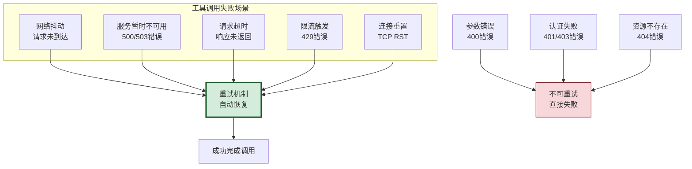
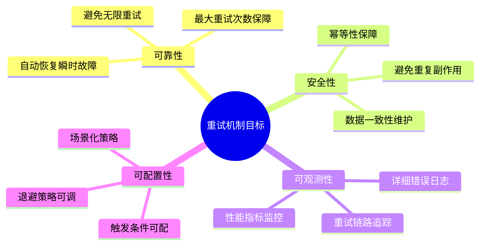
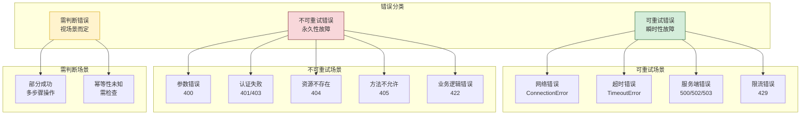
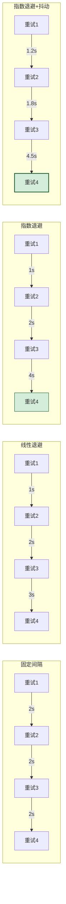
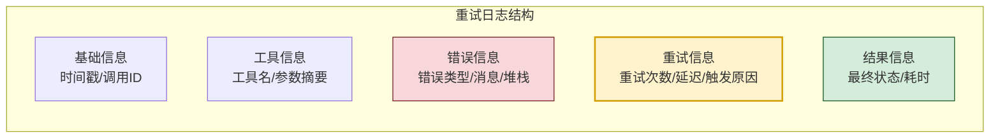
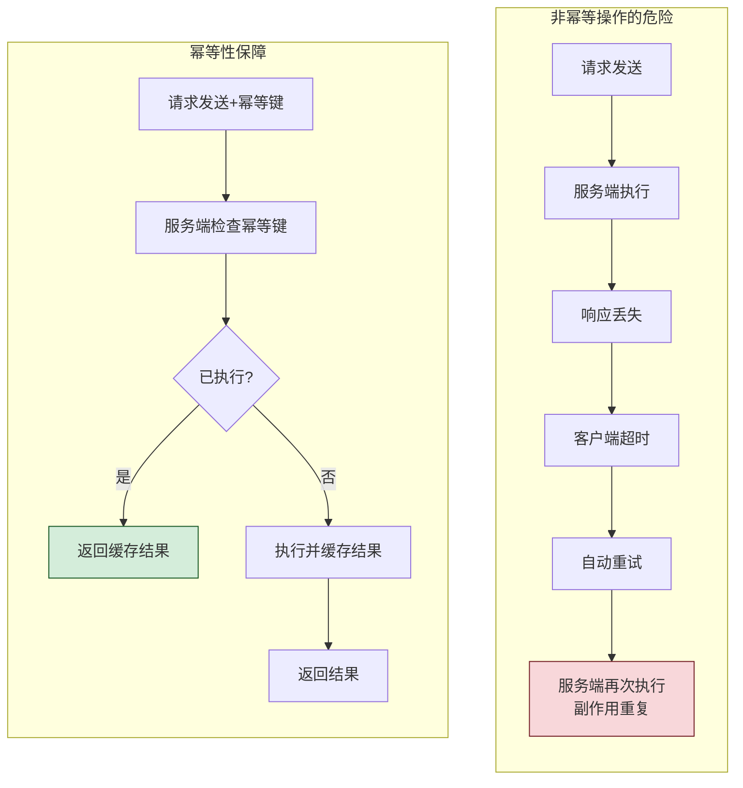
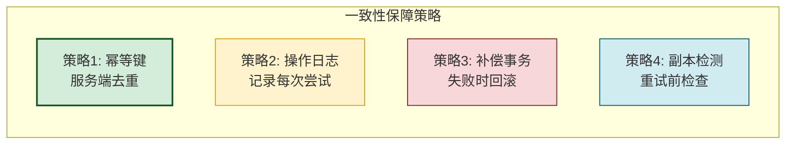
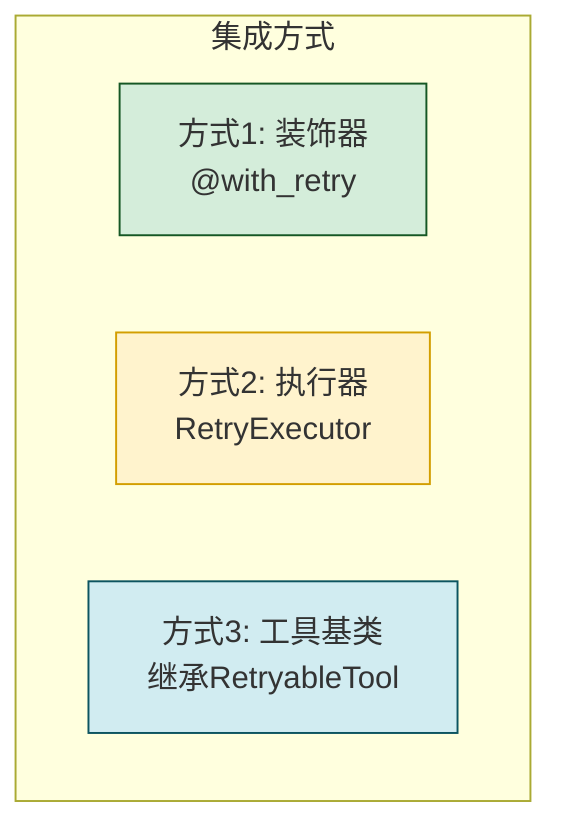
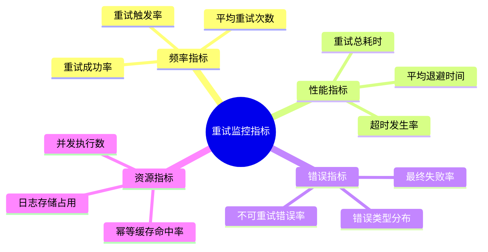
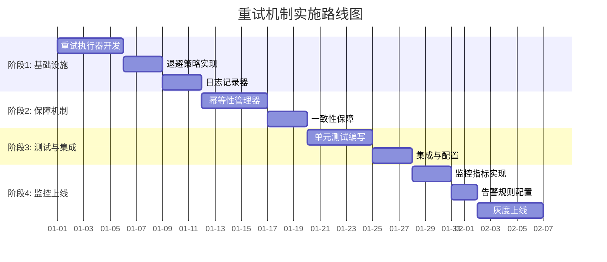

# 工具调用失败重试机制完整设计与实现深度解析

> 文档定位:系统阐述 Agent 工具调用失败时的可靠重试机制,涵盖重试触发条件、指数退避策略、错误日志记录、幂等性保障、数据一致性维护、单元测试验证与集成配置说明,为构建健壮的工具调用层提供工程级指导。
>
> 阅读建议:本文是 Tool Calling 系列的容错保障篇,建议结合 [89FunctionCalling与普通API调用核心区别系统性对比深度解析.md](./89FunctionCalling与普通API调用核心区别系统性对比深度解析.md)、[90Agent动态工具选择决策机制完整实现深度解析.md](./90Agent动态工具选择决策机制完整实现深度解析.md)、[92工具调用参数错误系统性处理方案深度解析.md](./92工具调用参数错误系统性处理方案深度解析.md) 一并阅读。

---

## 目录

- [一、重试机制概述](#一重试机制概述)
- [二、重试触发条件设计](#二重试触发条件设计)
- [三、重试间隔策略与指数退避](#三重试间隔策略与指数退避)
- [四、错误日志记录机制](#四错误日志记录机制)
- [五、幂等性保障与数据一致性](#五幂等性保障与数据一致性)
- [六、完整代码实现](#六完整代码实现)
- [七、单元测试设计](#七单元测试设计)
- [八、集成与配置说明](#八集成与配置说明)
- [九、监控与告警](#九监控与告警)
- [十、最佳实践与总结](#十最佳实践与总结)

---

## 一、重试机制概述

### 1.1 为什么需要重试机制



### 1.2 重试机制的核心目标



### 1.3 设计原则

| 原则 | 含义 | 重要性 |
|-----|------|:------:|
| **精准触发** | 只重试可恢复的错误 | ⭐⭐⭐⭐⭐ |
| **退避递增** | 重试间隔指数递增 | ⭐⭐⭐⭐⭐ |
| **上限保障** | 最大重试次数限制 | ⭐⭐⭐⭐⭐ |
| **幂等安全** | 重试不产生副作用 | ⭐⭐⭐⭐⭐ |
| **可观测性** | 完整日志与监控 | ⭐⭐⭐⭐ |
| **可配置性** | 策略灵活可调 | ⭐⭐⭐⭐ |

---

## 二、重试触发条件设计

### 2.1 错误分类体系



### 2.2 触发条件配置

```python
from dataclasses import dataclass, field
from typing import Optional, Callable
from enum import Enum


class ErrorCategory(Enum):
    """错误类别"""
    RETRYABLE = "retryable"        # 可重试
    NON_RETRYABLE = "non_retryable"  # 不可重试
    CONDITIONAL = "conditional"    # 条件性可重试


class RetryTriggerType(Enum):
    """重试触发类型"""
    NETWORK_ERROR = "network_error"
    TIMEOUT_ERROR = "timeout_error"
    HTTP_STATUS_5XX = "http_5xx"
    HTTP_STATUS_429 = "http_429"
    CONNECTION_RESET = "connection_reset"
    DNS_ERROR = "dns_error"
    SSL_ERROR = "ssl_error"


@dataclass
class RetryTriggerCondition:
    """重试触发条件"""
    # HTTP 状态码触发
    retryable_status_codes: set[int] = field(
        default_factory=lambda: {429, 500, 502, 503, 504}
    )
    
    # 异常类型触发
    retryable_exceptions: set[str] = field(
        default_factory=lambda: {
            "ConnectionError", "ConnectionResetError",
            "TimeoutError", "asyncio.TimeoutError",
            "socket.timeout", "ssl.SSLError",
            "ConnectionAbortedError", "OSError"
        }
    )
    
    # 不可重试状态码
    non_retryable_status_codes: set[int] = field(
        default_factory=lambda: {400, 401, 403, 404, 405, 422}
    )
    
    # 429 特殊处理: 从 Retry-After 头读取等待时间
    respect_retry_after_header: bool = True
    
    # 自定义判断函数
    custom_judge: Optional[Callable] = None
    
    def should_retry(self, error: Exception, 
                     status_code: Optional[int] = None,
                     response_headers: Optional[dict] = None) -> tuple[bool, str]:
        """
        判断是否应该重试
        
        Returns:
            (是否重试, 原因)
        """
        # 1. 自定义判断优先
        if self.custom_judge:
            result, reason = self.custom_judge(error, status_code, response_headers)
            if result is not None:
                return result, reason
        
        # 2. 检查状态码
        if status_code is not None:
            if status_code in self.non_retryable_status_codes:
                return False, f"不可重试状态码 {status_code}"
            
            if status_code in self.retryable_status_codes:
                return True, f"可重试状态码 {status_code}"
        
        # 3. 检查异常类型
        error_type_name = type(error).__name__
        if error_type_name in self.retryable_exceptions:
            return True, f"可重试异常 {error_type_name}"
        
        # 4. 检查异常基类
        retryable_base_exceptions = (
            ConnectionError, TimeoutError, OSError
        )
        if isinstance(error, retryable_base_exceptions):
            return True, f"可重试异常基类 {error_type_name}"
        
        # 5. 默认不重试
        return False, f"未知错误类型 {error_type_name}"


@dataclass
class RetryAfterInfo:
    """429 重试信息"""
    should_wait: bool = False
    wait_seconds: float = 0.0
    retry_after_header: Optional[str] = None
    
    @classmethod
    def from_headers(cls, headers: dict) -> "RetryAfterInfo":
        """从响应头解析 Retry-After"""
        retry_after = headers.get("Retry-After") or headers.get("retry-after")
        
        if not retry_after:
            return cls()
        
        try:
            # 尝试解析为秒数
            wait_seconds = float(retry_after)
            return cls(should_wait=True, wait_seconds=wait_seconds,
                       retry_after_header=retry_after)
        except ValueError:
            pass
        
        try:
            # 尝试解析为 HTTP 日期
            from email.utils import parsedate_to_datetime
            from datetime import datetime, timezone
            
            retry_time = parsedate_to_datetime(retry_after)
            if retry_time:
                now = datetime.now(timezone.utc)
                wait_seconds = (retry_time - now).total_seconds()
                if wait_seconds > 0:
                    return cls(should_wait=True, wait_seconds=wait_seconds,
                               retry_after_header=retry_after)
        except Exception:
            pass
        
        return cls()
```

### 2.3 场景化触发条件

```python
class ScenarioRetryConditions:
    """场景化重试条件"""
    
    # 读操作: 可以更激进地重试
    READ_OPERATION = RetryTriggerCondition(
        retryable_status_codes={429, 500, 502, 503, 504},
        retryable_exceptions={
            "ConnectionError", "TimeoutError", "ConnectionResetError",
            "socket.timeout", "ssl.SSLError", "OSError"
        }
    )
    
    # 写操作(幂等): 谨慎重试
    IDEMPOTENT_WRITE = RetryTriggerCondition(
        retryable_status_codes={429, 500, 502, 503},
        retryable_exceptions={
            "ConnectionError", "TimeoutError", "ConnectionResetError"
        }
    )
    
    # 写操作(非幂等): 默认不重试,需显式启用
    NON_IDEMPOTENT_WRITE = RetryTriggerCondition(
        retryable_status_codes={429, 503},  # 只重试限流与不可用
        retryable_exceptions={"ConnectionError"}  # 只重试连接错误
    )
    
    # 支付类操作: 极度谨慎
    PAYMENT_OPERATION = RetryTriggerCondition(
        retryable_status_codes={503},  # 仅服务不可用时
        retryable_exceptions=set(),  # 不重试任何异常
        custom_judge=lambda e, sc, h: (False, "支付操作默认不重试")
    )
```

---

## 三、重试间隔策略与指数退避

### 3.1 退避策略对比



### 3.2 指数退避算法实现

```python
import random
import asyncio
from dataclasses import dataclass
from typing import Optional


@dataclass
class BackoffConfig:
    """退避策略配置"""
    # 基础延迟(秒)
    base_delay: float = 1.0
    
    # 最大延迟(秒)
    max_delay: float = 60.0
    
    # 退避乘数
    multiplier: float = 2.0
    
    # 是否添加抖动
    jitter: bool = True
    
    # 抖动比例(0-1)
    jitter_ratio: float = 0.3
    
    # 抖动类型: "full" 完全随机, "equal" 等距抖动
    jitter_type: str = "full"


class ExponentialBackoff:
    """指数退避策略"""
    
    def __init__(self, config: BackoffConfig = None):
        self.config = config or BackoffConfig()
    
    def get_delay(self, attempt: int) -> float:
        """
        计算第 N 次重试的延迟时间
        
        Args:
            attempt: 重试次数(从1开始)
        
        Returns:
            延迟秒数
        """
        # 1. 计算指数延迟: base * multiplier^(attempt-1)
        delay = self.config.base_delay * (
            self.config.multiplier ** (attempt - 1)
        )
        
        # 2. 限制最大延迟
        delay = min(delay, self.config.max_delay)
        
        # 3. 添加抖动
        if self.config.jitter:
            delay = self._add_jitter(delay)
        
        return delay
    
    def _add_jitter(self, delay: float) -> float:
        """添加抖动"""
        if self.config.jitter_type == "full":
            # 完全抖动: 在 [0, delay] 范围内随机
            return random.uniform(0, delay)
        elif self.config.jitter_type == "equal":
            # 等距抖动: 在 [delay * (1-ratio), delay * (1+ratio)] 范围内
            ratio = self.config.jitter_ratio
            return delay * (1 + random.uniform(-ratio, ratio))
        else:
            return delay
    
    async def async_sleep(self, attempt: int):
        """异步等待"""
        delay = self.get_delay(attempt)
        await asyncio.sleep(delay)
    
    def sync_sleep(self, attempt: int):
        """同步等待"""
        import time
        delay = self.get_delay(attempt)
        time.sleep(delay)


# 退避策略示例对比
class BackoffStrategiesComparison:
    """退避策略对比"""
    
    @staticmethod
    def fixed_delay(attempt: int, delay: float = 2.0) -> float:
        """固定延迟"""
        return delay
    
    @staticmethod
    def linear_backoff(attempt: int, base: float = 1.0) -> float:
        """线性退避"""
        return base * attempt
    
    @staticmethod
    def exponential_backoff(attempt: int, base: float = 1.0,
                              multiplier: float = 2.0,
                              max_delay: float = 60.0) -> float:
        """指数退避"""
        delay = base * (multiplier ** (attempt - 1))
        return min(delay, max_delay)
    
    @staticmethod
    def exponential_backoff_with_jitter(attempt: int, base: float = 1.0,
                                         multiplier: float = 2.0,
                                         max_delay: float = 60.0) -> float:
        """指数退避+抖动"""
        delay = base * (multiplier ** (attempt - 1))
        delay = min(delay, max_delay)
        return random.uniform(0, delay)  # 完全抖动
```

### 3.3 退避策略选择建议

| 策略 | 适用场景 | 优点 | 缺点 |
|-----|---------|------|------|
| **固定间隔** | 简单场景 | 实现简单 | 可能加剧拥塞 |
| **线性退避** | 轻度故障 | 增长平缓 | 恢复较慢 |
| **指数退避** | 通用场景 | 快速退避 | 可能过度等待 |
| **指数+抖动** | **推荐** | 避免惊群 | 实现稍复杂 |

### 3.4 退避时间表

```python
def print_backoff_schedule():
    """打印退避时间表"""
    backoff = ExponentialBackoff(BackoffConfig(
        base_delay=1.0, max_delay=60.0, multiplier=2.0, jitter=False
    ))
    
    print(f"{'重试次数':<10} {'延迟(秒)':<15} {'累计等待':<15}")
    print("-" * 40)
    
    total = 0
    for attempt in range(1, 8):
        delay = backoff.get_delay(attempt)
        total += delay
        print(f"{attempt:<10} {delay:<15.1f} {total:<15.1f}")

# 输出:
# 重试次数    延迟(秒)        累计等待
# ----------------------------------------
# 1           1.0             1.0
# 2           2.0             3.0
# 3           4.0             7.0
# 4           8.0             15.0
# 5           16.0            31.0
# 6           32.0            63.0
# 7           60.0            123.0  (达到上限)
```

---

## 四、错误日志记录机制

### 4.1 日志结构设计



### 4.2 日志记录实现

```python
import json
import logging
import traceback
from dataclasses import dataclass, field, asdict
from datetime import datetime
from typing import Any, Optional
from enum import Enum
import uuid


class LogLevel(Enum):
    """日志级别"""
    DEBUG = "DEBUG"
    INFO = "INFO"
    WARNING = "WARNING"
    ERROR = "ERROR"
    CRITICAL = "CRITICAL"


class RetryOutcome(Enum):
    """重试结果"""
    SUCCESS = "success"               # 最终成功
    RETRIED_SUCCESS = "retried_success"  # 重试后成功
    MAX_RETRIES_EXCEEDED = "max_retries_exceeded"  # 超过最大重试次数
    NON_RETRYABLE = "non_retryable"    # 不可重试错误
    CIRCUIT_OPEN = "circuit_open"      # 熔断器打开
    TIMEOUT = "timeout"                # 总超时


@dataclass
class RetryLogEntry:
    """重试日志条目"""
    # 唯一标识
    log_id: str = field(default_factory=lambda: str(uuid.uuid4())[:8])
    call_id: str = ""                 # 调用链ID
    attempt_id: str = ""             # 单次尝试ID
    
    # 时间信息
    timestamp: str = field(default_factory=lambda: datetime.now().isoformat())
    
    # 工具信息
    tool_name: str = ""
    tool_args: dict = field(default_factory=dict)
    tool_kwargs: dict = field(default_factory=dict)
    
    # 错误信息
    error_type: str = ""
    error_message: str = ""
    error_traceback: str = ""
    status_code: Optional[int] = None
    response_headers: dict = field(default_factory=dict)
    
    # 重试信息
    attempt_number: int = 0          # 第几次重试(0=首次)
    max_retries: int = 0
    trigger_reason: str = ""         # 触发重试的原因
    delay_before_retry: float = 0.0   # 重试前等待时间
    backoff_strategy: str = ""        # 退避策略
    
    # 结果信息
    outcome: str = ""                 # RetryOutcome
    total_duration: float = 0.0       # 总耗时(秒)
    total_attempts: int = 0          # 总尝试次数
    
    # 上下文
    agent_id: str = ""
    session_id: str = ""
    metadata: dict = field(default_factory=dict)
    
    def to_dict(self) -> dict:
        return asdict(self)
    
    def to_json(self) -> str:
        return json.dumps(self.to_dict(), ensure_ascii=False, indent=2)


class RetryLogger:
    """重试日志记录器"""
    
    def __init__(self, logger: Optional[logging.Logger] = None):
        self.logger = logger or self._create_default_logger()
        self.log_entries: list[RetryLogEntry] = []
        self._max_entries = 10000
    
    def _create_default_logger(self) -> logging.Logger:
        """创建默认Logger"""
        logger = logging.getLogger("retry_mechanism")
        logger.setLevel(logging.DEBUG)
        
        if not logger.handlers:
            handler = logging.StreamHandler()
            formatter = logging.Formatter(
                '%(asctime)s [%(levelname)s] %(name)s: %(message)s'
            )
            handler.setFormatter(formatter)
            logger.addHandler(handler)
        
        return logger
    
    def log_attempt(self, entry: RetryLogEntry):
        """记录单次尝试"""
        self.log_entries.append(entry)
        
        # 控制日志大小
        if len(self.log_entries) > self._max_entries:
            self.log_entries = self.log_entries[-self._max_entries // 2:]
        
        # 根据结果输出不同级别日志
        if entry.outcome == RetryOutcome.SUCCESS.value:
            self.logger.info(self._format_log(entry))
        elif entry.outcome == RetryOutcome.RETRIED_SUCCESS.value:
            self.logger.warning(self._format_log(entry))
        elif entry.outcome == RetryOutcome.MAX_RETRIES_EXCEEDED.value:
            self.logger.error(self._format_log(entry))
        elif entry.outcome == RetryOutcome.NON_RETRYABLE.value:
            self.logger.error(self._format_log(entry))
        else:
            self.logger.warning(self._format_log(entry))
    
    def _format_log(self, entry: RetryLogEntry) -> str:
        """格式化日志"""
        return (
            f"[{entry.call_id}] 工具={entry.tool_name} "
            f"尝试={entry.attempt_number}/{entry.max_retries} "
            f"结果={entry.outcome} "
            f"耗时={entry.total_duration:.2f}s "
            f"错误={entry.error_type}: {entry.error_message[:100]}"
        )
    
    def log_retry_decision(self, call_id: str, tool_name: str,
                            attempt: int, error: Exception,
                            will_retry: bool, delay: float,
                            reason: str):
        """记录重试决策"""
        if will_retry:
            self.logger.info(
                f"[{call_id}] {tool_name} 第{attempt}次失败, "
                f"将在{delay:.1f}s后重试, 原因: {reason}"
            )
        else:
            self.logger.warning(
                f"[{call_id}] {tool_name} 第{attempt}次失败, "
                f"不重试, 原因: {reason}"
            )
    
    def get_summary(self, call_id: str) -> dict:
        """获取调用摘要"""
        entries = [e for e in self.log_entries if e.call_id == call_id]
        if not entries:
            return {}
        
        return {
            "call_id": call_id,
            "tool_name": entries[0].tool_name,
            "total_attempts": len(entries),
            "total_duration": sum(e.total_duration for e in entries),
            "final_outcome": entries[-1].outcome,
            "errors": [
                {
                    "attempt": e.attempt_number,
                    "error_type": e.error_type,
                    "error_message": e.error_message[:200],
                    "delay_before_retry": e.delay_before_retry
                }
                for e in entries if e.error_type
            ]
        }
    
    def export_logs(self, file_path: str):
        """导出日志到文件"""
        with open(file_path, "w", encoding="utf-8") as f:
            for entry in self.log_entries:
                f.write(entry.to_json() + "\n")
```

### 4.3 日志示例

```json
{
  "log_id": "a1b2c3d4",
  "call_id": "call_20260807_001",
  "attempt_id": "attempt_3",
  "timestamp": "2026-08-07T10:30:45.123456",
  "tool_name": "web_search",
  "tool_args": {"query": "AI Agent 框架对比"},
  "error_type": "ConnectionError",
  "error_message": "HTTPSConnectionPool: Connection timed out",
  "error_traceback": "Traceback (most recent call last):\n  ...",
  "status_code": null,
  "attempt_number": 2,
  "max_retries": 3,
  "trigger_reason": "可重试异常 ConnectionError",
  "delay_before_retry": 4.0,
  "backoff_strategy": "exponential_with_jitter",
  "outcome": "retried_success",
  "total_duration": 12.5,
  "total_attempts": 3,
  "agent_id": "agent_001",
  "session_id": "session_abc"
}
```

---

## 五、幂等性保障与数据一致性

### 5.1 幂等性问题分析



### 5.2 幂等性级别

```python
from enum import Enum


class IdempotencyLevel(Enum):
    """幂等性级别"""
    IDEMPOTENT = "idempotent"          # 天然幂等(GET/PUT)
    CONDITIONAL = "conditional"        # 条件幂等(需幂等键)
    NON_IDEMPOTENT = "non_idempotent"  # 非幂等(POST创建)
    DESTRUCTIVE = "destructive"        # 破坏性(DELETE)
```

### 5.3 幂等性保障实现

```python
import hashlib
from typing import Any, Optional


class IdempotencyManager:
    """幂等性管理器"""
    
    def __init__(self):
        self._executed: dict[str, Any] = {}  # 幂等键 -> 结果
        self._executing: set[str] = set()    # 正在执行的幂等键
    
    def generate_idempotency_key(self, tool_name: str, 
                                  args: tuple, kwargs: dict) -> str:
        """生成幂等键"""
        # 基于工具名+参数生成唯一键
        key_data = f"{tool_name}:{args}:{sorted(kwargs.items())}"
        return hashlib.sha256(key_data.encode()).hexdigest()[:16]
    
    def is_executed(self, key: str) -> bool:
        """检查是否已执行"""
        return key in self._executed
    
    def get_cached_result(self, key: str) -> Any:
        """获取缓存结果"""
        return self._executed.get(key)
    
    def mark_executing(self, key: str):
        """标记正在执行"""
        self._executing.add(key)
    
    def mark_executed(self, key: str, result: Any):
        """标记已执行"""
        self._executing.discard(key)
        self._executed[key] = result
    
    def clear(self, key: str):
        """清除特定键"""
        self._executed.pop(key, None)
        self._executing.discard(key)
    
    def clear_all(self):
        """清除所有"""
        self._executed.clear()
        self._executing.clear()
```

### 5.4 数据一致性保障策略



```python
class ConsistencyGuard:
    """数据一致性保障器"""
    
    def __init__(self, idempotency_manager: IdempotencyManager):
        self.idempotency = idempotency_manager
        self.operation_log: list[dict] = []
    
    def before_retry(self, tool_name: str, args: tuple, 
                      kwargs: dict, attempt: int) -> dict:
        """重试前检查"""
        key = self.idempotency.generate_idempotency_key(
            tool_name, args, kwargs
        )
        
        check_result = {
            "idempotency_key": key,
            "already_executed": False,
            "cached_result": None,
            "should_proceed": True,
            "reason": ""
        }
        
        # 1. 检查是否已成功执行
        if self.idempotency.is_executed(key):
            check_result["already_executed"] = True
            check_result["cached_result"] = self.idempotency.get_cached_result(key)
            check_result["should_proceed"] = False
            check_result["reason"] = "操作已执行,返回缓存结果"
            return check_result
        
        # 2. 检查是否正在执行(防并发)
        if key in self.idempotency._executing:
            check_result["should_proceed"] = False
            check_result["reason"] = "操作正在执行中,跳过重试"
            return check_result
        
        # 3. 标记正在执行
        self.idempotency.mark_executing(key)
        
        # 4. 记录操作日志
        self.operation_log.append({
            "timestamp": datetime.now().isoformat(),
            "tool_name": tool_name,
            "idempotency_key": key,
            "attempt": attempt,
            "action": "retry_started"
        })
        
        return check_result
    
    def after_success(self, key: str, result: Any):
        """成功后处理"""
        self.idempotency.mark_executed(key, result)
        
        self.operation_log.append({
            "timestamp": datetime.now().isoformat(),
            "idempotency_key": key,
            "action": "success",
            "result_summary": str(result)[:100]
        })
    
    def after_failure(self, key: str, error: Exception):
        """失败后处理"""
        self.idempotency.clear(key)
        
        self.operation_log.append({
            "timestamp": datetime.now().isoformat(),
            "idempotency_key": key,
            "action": "failure",
            "error": str(error)[:100]
        })
```

### 5.5 副作用操作处理策略

```python
class SideEffectHandler:
    """副作用操作处理器"""
    
    # 操作类型与重试策略映射
    OPERATION_STRATEGIES = {
        "read": {"retryable": True, "idempotent": True},
        "search": {"retryable": True, "idempotent": True},
        "create": {"retryable": False, "idempotent": False, "needs_key": True},
        "update": {"retryable": True, "idempotent": True},
        "delete": {"retryable": "conditional", "idempotent": True},
        "payment": {"retryable": False, "idempotent": False, "needs_key": True},
        "send_email": {"retryable": "conditional", "idempotent": False, "needs_key": True},
    }
    
    @classmethod
    def get_strategy(cls, operation_type: str) -> dict:
        """获取操作策略"""
        return cls.OPERATION_STRATEGIES.get(
            operation_type,
            {"retryable": False, "idempotent": False}
        )
    
    @classmethod
    def should_retry_with_side_effect(cls, operation_type: str,
                                       attempt: int) -> tuple[bool, str]:
        """判断副作用操作是否应重试"""
        strategy = cls.get_strategy(operation_type)
        
        if strategy["retryable"] is True:
            return True, "操作幂等,可安全重试"
        
        if strategy["retryable"] == "conditional":
            if attempt <= 2:
                return True, "条件性重试,前2次允许"
            return False, "条件性重试已达上限"
        
        if strategy.get("needs_key"):
            return True, "需幂等键,有键可重试"
        
        return False, f"非幂等操作({operation_type}),默认不重试"
```

---

## 六、完整代码实现

### 6.1 重试执行器

```python
import time
import asyncio
import functools
from typing import Callable, Any, Optional, Union
from dataclasses import dataclass


@dataclass
class RetryConfig:
    """重试配置"""
    max_retries: int = 3                    # 最大重试次数
    backoff: BackoffConfig = None           # 退避配置
    trigger_condition: RetryTriggerCondition = None  # 触发条件
    timeout: float = 300.0                  # 总超时(秒)
    idempotency_enabled: bool = True        # 启用幂等性
    operation_type: str = "read"           # 操作类型
    
    def __post_init__(self):
        if self.backoff is None:
            self.backoff = BackoffConfig()
        if self.trigger_condition is None:
            self.trigger_condition = RetryTriggerCondition()


class RetryExecutor:
    """重试执行器"""
    
    def __init__(self, config: RetryConfig = None,
                 logger: Optional[RetryLogger] = None):
        self.config = config or RetryConfig()
        self.logger = logger or RetryLogger()
        self.backoff = ExponentialBackoff(self.config.backoff)
        self.idempotency = IdempotencyManager()
        self.consistency = ConsistencyGuard(self.idempotency)
    
    def execute(self, func: Callable, *args, 
                tool_name: str = None,
                **kwargs) -> Any:
        """同步执行带重试"""
        call_id = f"call_{int(time.time())}_{id(func) % 10000}"
        tool_name = tool_name or func.__name__
        
        # 总超时控制
        start_time = time.time()
        
        for attempt in range(self.config.max_retries + 1):
            # 检查总超时
            elapsed = time.time() - start_time
            if elapsed > self.config.timeout:
                self._log_timeout(call_id, tool_name, attempt, elapsed)
                raise TimeoutError(f"总超时 {elapsed:.1f}s")
            
            # 幂等性检查
            if self.config.idempotency_enabled:
                check = self.consistency.before_retry(
                    tool_name, args, kwargs, attempt
                )
                if not check["should_proceed"]:
                    if check["already_executed"]:
                        return check["cached_result"]
                    continue
            
            # 执行函数
            attempt_start = time.time()
            try:
                result = func(*args, **kwargs)
                attempt_duration = time.time() - attempt_start
                
                # 成功
                if self.config.idempotency_enabled:
                    key = self.idempotency.generate_idempotency_key(
                        tool_name, args, kwargs
                    )
                    self.consistency.after_success(key, result)
                
                self._log_success(
                    call_id, tool_name, attempt, attempt_duration,
                    was_retry=attempt > 0
                )
                return result
            
            except Exception as error:
                attempt_duration = time.time() - attempt_start
                
                # 判断是否可重试
                should_retry, reason = self.config.trigger_condition.should_retry(
                    error=error
                )
                
                # 副作用检查
                if should_retry:
                    side_effect_ok, se_reason = SideEffectHandler.should_retry_with_side_effect(
                        self.config.operation_type, attempt + 1
                    )
                    if not side_effect_ok:
                        should_retry = False
                        reason = se_reason
                
                # 记录错误
                self._log_failure(
                    call_id, tool_name, attempt, error, 
                    attempt_duration, should_retry, reason
                )
                
                # 清除幂等标记
                if self.config.idempotency_enabled:
                    key = self.idempotency.generate_idempotency_key(
                        tool_name, args, kwargs
                    )
                    self.consistency.after_failure(key, error)
                
                # 判断是否继续重试
                if not should_retry or attempt >= self.config.max_retries:
                    if not should_retry:
                        raise  # 不可重试错误直接抛出
                    else:
                        raise MaxRetriesExceededError(
                            f"超过最大重试次数 {self.config.max_retries}, "
                            f"最后错误: {error}"
                        )
                
                # 计算退避时间
                delay = self.backoff.get_delay(attempt + 1)
                
                self.logger.log_retry_decision(
                    call_id, tool_name, attempt + 1, error,
                    True, delay, reason
                )
                
                # 等待重试
                time.sleep(delay)
    
    async def execute_async(self, func: Callable, *args,
                             tool_name: str = None,
                             **kwargs) -> Any:
        """异步执行带重试"""
        call_id = f"call_{int(time.time())}_{id(func) % 10000}"
        tool_name = tool_name or func.__name__
        
        start_time = time.time()
        
        for attempt in range(self.config.max_retries + 1):
            elapsed = time.time() - start_time
            if elapsed > self.config.timeout:
                raise TimeoutError(f"总超时 {elapsed:.1f}s")
            
            # 幂等性检查
            if self.config.idempotency_enabled:
                check = self.consistency.before_retry(
                    tool_name, args, kwargs, attempt
                )
                if not check["should_proceed"]:
                    if check["already_executed"]:
                        return check["cached_result"]
                    continue
            
            attempt_start = time.time()
            try:
                if asyncio.iscoroutinefunction(func):
                    result = await func(*args, **kwargs)
                else:
                    result = func(*args, **kwargs)
                
                attempt_duration = time.time() - attempt_start
                
                if self.config.idempotency_enabled:
                    key = self.idempotency.generate_idempotency_key(
                        tool_name, args, kwargs
                    )
                    self.consistency.after_success(key, result)
                
                self._log_success(
                    call_id, tool_name, attempt, attempt_duration,
                    was_retry=attempt > 0
                )
                return result
            
            except Exception as error:
                attempt_duration = time.time() - attempt_start
                
                should_retry, reason = self.config.trigger_condition.should_retry(
                    error=error
                )
                
                if should_retry:
                    side_effect_ok, se_reason = SideEffectHandler.should_retry_with_side_effect(
                        self.config.operation_type, attempt + 1
                    )
                    if not side_effect_ok:
                        should_retry = False
                        reason = se_reason
                
                self._log_failure(
                    call_id, tool_name, attempt, error,
                    attempt_duration, should_retry, reason
                )
                
                if self.config.idempotency_enabled:
                    key = self.idempotency.generate_idempotency_key(
                        tool_name, args, kwargs
                    )
                    self.consistency.after_failure(key, error)
                
                if not should_retry or attempt >= self.config.max_retries:
                    if not should_retry:
                        raise
                    else:
                        raise MaxRetriesExceededError(
                            f"超过最大重试次数 {self.config.max_retries}"
                        )
                
                delay = self.backoff.get_delay(attempt + 1)
                
                self.logger.log_retry_decision(
                    call_id, tool_name, attempt + 1, error,
                    True, delay, reason
                )
                
                await asyncio.sleep(delay)
    
    def _log_success(self, call_id: str, tool_name: str,
                      attempt: int, duration: float, was_retry: bool):
        """记录成功"""
        entry = RetryLogEntry(
            call_id=call_id,
            tool_name=tool_name,
            attempt_number=attempt,
            max_retries=self.config.max_retries,
            outcome=RetryOutcome.RETRIED_SUCCESS.value if was_retry 
                     else RetryOutcome.SUCCESS.value,
            total_duration=duration,
            total_attempts=attempt + 1
        )
        self.logger.log_attempt(entry)
    
    def _log_failure(self, call_id: str, tool_name: str,
                      attempt: int, error: Exception, duration: float,
                      will_retry: bool, reason: str):
        """记录失败"""
        outcome = RetryOutcome.NON_RETRYABLE.value if not will_retry \
                  else RetryOutcome.MAX_RETRIES_EXCEEDED.value \
                  if attempt >= self.config.max_retries else "will_retry"
        
        entry = RetryLogEntry(
            call_id=call_id,
            tool_name=tool_name,
            attempt_number=attempt,
            max_retries=self.config.max_retries,
            error_type=type(error).__name__,
            error_message=str(error),
            error_traceback=traceback.format_exc(),
            outcome=outcome,
            total_duration=duration,
            trigger_reason=reason,
            delay_before_retry=self.backoff.get_delay(attempt + 1) if will_retry else 0
        )
        self.logger.log_attempt(entry)
    
    def _log_timeout(self, call_id: str, tool_name: str,
                      attempt: int, elapsed: float):
        """记录超时"""
        entry = RetryLogEntry(
            call_id=call_id,
            tool_name=tool_name,
            attempt_number=attempt,
            outcome=RetryOutcome.TIMEOUT.value,
            total_duration=elapsed,
            trigger_reason="总超时"
        )
        self.logger.log_attempt(entry)


class MaxRetriesExceededError(Exception):
    """超过最大重试次数异常"""
    pass


import traceback
```

### 6.2 装饰器方式使用

```python
def with_retry(config: RetryConfig = None):
    """重试装饰器"""
    executor = RetryExecutor(config or RetryConfig())
    
    def decorator(func):
        @functools.wraps(func)
        def sync_wrapper(*args, **kwargs):
            return executor.execute(func, *args, 
                                      tool_name=func.__name__, **kwargs)
        
        @functools.wraps(func)
        async def async_wrapper(*args, **kwargs):
            return await executor.execute_async(func, *args,
                                                  tool_name=func.__name__, **kwargs)
        
        if asyncio.iscoroutinefunction(func):
            return async_wrapper
        return sync_wrapper
    
    return decorator


# 使用示例
@with_retry(RetryConfig(
    max_retries=3,
    backoff=BackoffConfig(base_delay=1.0, max_delay=30.0),
    trigger_condition=RetryTriggerCondition(),
    operation_type="read"
))
def search_web(query: str) -> dict:
    """搜索工具(自动重试)"""
    import requests
    response = requests.get("https://api.search.com/search", 
                             params={"q": query}, timeout=10)
    response.raise_for_status()
    return response.json()


@with_retry(RetryConfig(
    max_retries=5,
    backoff=BackoffConfig(base_delay=2.0, max_delay=60.0),
    operation_type="create"
))
async def create_resource(data: dict) -> dict:
    """创建资源(幂等键保障)"""
    import aiohttp
    async with aiohttp.ClientSession() as session:
        async with session.post("https://api.example.com/resources",
                                  json=data) as resp:
            resp.raise_for_status()
            return await resp.json()
```

---

## 七、单元测试设计

### 7.1 测试框架与用例

```python
import unittest
from unittest.mock import Mock, patch, MagicMock
import asyncio
import time


class TestRetryExecutor(unittest.TestCase):
    """重试执行器单元测试"""
    
    def setUp(self):
        self.config = RetryConfig(
            max_retries=3,
            backoff=BackoffConfig(base_delay=0.01, max_delay=0.1),  # 测试用短延迟
            trigger_condition=RetryTriggerCondition()
        )
        self.executor = RetryExecutor(self.config)
    
    # ========== 触发条件测试 ==========
    
    def test_retry_on_connection_error(self):
        """测试: 网络错误触发重试"""
        call_count = 0
        
        def flaky_function():
            nonlocal call_count
            call_count += 1
            if call_count < 3:
                raise ConnectionError("网络连接失败")
            return "success"
        
        result = self.executor.execute(flaky_function)
        
        self.assertEqual(result, "success")
        self.assertEqual(call_count, 3)
    
    def test_retry_on_timeout_error(self):
        """测试: 超时错误触发重试"""
        call_count = 0
        
        def slow_function():
            nonlocal call_count
            call_count += 1
            if call_count < 2:
                raise TimeoutError("请求超时")
            return "success"
        
        result = self.executor.execute(slow_function)
        
        self.assertEqual(result, "success")
        self.assertEqual(call_count, 2)
    
    def test_no_retry_on_value_error(self):
        """测试: 参数错误不触发重试"""
        call_count = 0
        
        def bad_function():
            nonlocal call_count
            call_count += 1
            raise ValueError("参数错误")
        
        with self.assertRaises(ValueError):
            self.executor.execute(bad_function)
        
        self.assertEqual(call_count, 1)
    
    def test_retry_on_503_status(self):
        """测试: 503 状态码触发重试"""
        call_count = 0
        
        def service_unavailable():
            nonlocal call_count
            call_count += 1
            if call_count < 2:
                error = Exception("Service Unavailable")
                error.status_code = 503
                raise error
            return "success"
        
        # 自定义判断函数
        self.config.trigger_condition.custom_judge = (
            lambda e, sc, h: (True, "503可重试") 
            if getattr(e, "status_code", None) == 503 
            else (None, "")
        )
        
        result = self.executor.execute(service_unavailable)
        self.assertEqual(result, "success")
    
    # ========== 退避策略测试 ==========
    
    def test_exponential_backoff_delay(self):
        """测试: 指数退避延迟计算"""
        backoff = ExponentialBackoff(BackoffConfig(
            base_delay=1.0, max_delay=60.0, multiplier=2.0, jitter=False
        ))
        
        self.assertAlmostEqual(backoff.get_delay(1), 1.0)
        self.assertAlmostEqual(backoff.get_delay(2), 2.0)
        self.assertAlmostEqual(backoff.get_delay(3), 4.0)
        self.assertAlmostEqual(backoff.get_delay(4), 8.0)
        self.assertAlmostEqual(backoff.get_delay(7), 64.0)  # 超过上限
        self.assertAlmostEqual(backoff.get_delay(7), 60.0)  # 限制为60
    
    def test_jitter_in_range(self):
        """测试: 抖动在合理范围内"""
        backoff = ExponentialBackoff(BackoffConfig(
            base_delay=1.0, max_delay=60.0, jitter=True,
            jitter_type="full"
        ))
        
        for _ in range(100):
            delay = backoff.get_delay(3)  # 基准4.0
            self.assertGreaterEqual(delay, 0)
            self.assertLessEqual(delay, 4.0)
    
    # ========== 最大重试次数测试 ==========
    
    def test_max_retries_exceeded(self):
        """测试: 超过最大重试次数"""
        call_count = 0
        
        def always_fail():
            nonlocal call_count
            call_count += 1
            raise ConnectionError("持续失败")
        
        with self.assertRaises(MaxRetriesExceededError):
            self.executor.execute(always_fail)
        
        self.assertEqual(call_count, 4)  # 1次初始 + 3次重试
    
    # ========== 幂等性测试 ==========
    
    def test_idempotency_caches_result(self):
        """测试: 幂等性缓存结果"""
        call_count = 0
        
        def idempotent_function():
            nonlocal call_count
            call_count += 1
            return f"result_{call_count}"
        
        # 第一次调用
        result1 = self.executor.execute(idempotent_function)
        self.assertEqual(result1, "result_1")
        
        # 第二次调用(相同参数)应返回缓存
        result2 = self.executor.execute(idempotent_function)
        self.assertEqual(result2, "result_1")  # 缓存结果
        self.assertEqual(call_count, 1)  # 只执行一次
    
    def test_idempotency_clears_on_failure(self):
        """测试: 失败时清除幂等标记"""
        call_count = 0
        
        def fail_then_succeed():
            nonlocal call_count
            call_count += 1
            if call_count == 1:
                raise ConnectionError("首次失败")
            return "success"
        
        result = self.executor.execute(fail_then_succeed)
        self.assertEqual(result, "success")
        self.assertEqual(call_count, 2)
    
    # ========== 异步测试 ==========
    
    def test_async_retry(self):
        """测试: 异步重试"""
        call_count = 0
        
        async def async_flaky():
            nonlocal call_count
            call_count += 1
            if call_count < 2:
                raise ConnectionError("异步失败")
            return "async_success"
        
        result = asyncio.get_event_loop().run_until_complete(
            self.executor.execute_async(async_flaky)
        )
        
        self.assertEqual(result, "async_success")
        self.assertEqual(call_count, 2)
    
    # ========== 日志测试 ==========
    
    def test_log_records_all_attempts(self):
        """测试: 日志记录所有尝试"""
        call_count = 0
        
        def fail_twice():
            nonlocal call_count
            call_count += 1
            if call_count < 3:
                raise ConnectionError("失败")
            return "success"
        
        self.executor.execute(fail_twice)
        
        # 检查日志
        entries = self.executor.logger.log_entries
        self.assertGreaterEqual(len(entries), 3)
    
    # ========== 总超时测试 ==========
    
    def test_total_timeout(self):
        """测试: 总超时"""
        config = RetryConfig(
            max_retries=100,
            backoff=BackoffConfig(base_delay=0.5),
            timeout=0.1  # 100ms超时
        )
        executor = RetryExecutor(config)
        
        def slow_function():
            time.sleep(0.2)
            return "success"
        
        with self.assertRaises(TimeoutError):
            executor.execute(slow_function)
    
    # ========== 副作用操作测试 ==========
    
    def test_non_idempotent_write_no_retry(self):
        """测试: 非幂等写操作不重试"""
        config = RetryConfig(
            max_retries=3,
            operation_type="create",
            idempotency_enabled=False
        )
        executor = RetryExecutor(config)
        
        call_count = 0
        
        def create_with_network_error():
            nonlocal call_count
            call_count += 1
            raise ConnectionError("网络错误")
        
        with self.assertRaises(ConnectionError):
            executor.execute(create_with_network_error)
        
        # create操作默认不重试网络错误
        self.assertEqual(call_count, 1)


class TestBackoffStrategies(unittest.TestCase):
    """退避策略测试"""
    
    def test_fixed_delay(self):
        self.assertEqual(BackoffStrategiesComparison.fixed_delay(1), 2.0)
        self.assertEqual(BackoffStrategiesComparison.fixed_delay(5), 2.0)
    
    def test_linear_backoff(self):
        self.assertEqual(BackoffStrategiesComparison.linear_backoff(1), 1.0)
        self.assertEqual(BackoffStrategiesComparison.linear_backoff(3), 3.0)
    
    def test_exponential_backoff(self):
        self.assertEqual(
            BackoffStrategiesComparison.exponential_backoff(1), 1.0
        )
        self.assertEqual(
            BackoffStrategiesComparison.exponential_backoff(3), 4.0
        )
        self.assertEqual(
            BackoffStrategiesComparison.exponential_backoff(10), 60.0  # 上限
        )


class TestIdempotencyManager(unittest.TestCase):
    """幂等性管理器测试"""
    
    def setUp(self):
        self.manager = IdempotencyManager()
    
    def test_generate_consistent_key(self):
        """测试: 相同参数生成相同键"""
        key1 = self.manager.generate_idempotency_key(
            "search", ("query",), {"limit": 10}
        )
        key2 = self.manager.generate_idempotency_key(
            "search", ("query",), {"limit": 10}
        )
        self.assertEqual(key1, key2)
    
    def test_different_args_different_key(self):
        """测试: 不同参数生成不同键"""
        key1 = self.manager.generate_idempotency_key(
            "search", ("query1",), {}
        )
        key2 = self.manager.generate_idempotency_key(
            "search", ("query2",), {}
        )
        self.assertNotEqual(key1, key2)
    
    def test_mark_and_check_executed(self):
        """测试: 标记与检查"""
        key = "test_key"
        self.assertFalse(self.manager.is_executed(key))
        
        self.manager.mark_executing(key)
        self.assertIn(key, self.manager._executing)
        
        self.manager.mark_executed(key, "result")
        self.assertTrue(self.manager.is_executed(key))
        self.assertEqual(self.manager.get_cached_result(key), "result")
        self.assertNotIn(key, self.manager._executing)


class TestRetryLogger(unittest.TestCase):
    """重试日志测试"""
    
    def test_log_entry_creation(self):
        """测试: 日志条目创建"""
        entry = RetryLogEntry(
            call_id="test_call",
            tool_name="search",
            attempt_number=1,
            max_retries=3,
            error_type="ConnectionError",
            error_message="连接失败",
            outcome="will_retry",
            total_duration=1.5
        )
        
        d = entry.to_dict()
        self.assertEqual(d["call_id"], "test_call")
        self.assertEqual(d["tool_name"], "search")
        self.assertEqual(d["error_type"], "ConnectionError")
    
    def test_logger_records_entries(self):
        """测试: 日志记录器记录条目"""
        logger = RetryLogger()
        
        entry = RetryLogEntry(
            call_id="test_call",
            tool_name="search",
            attempt_number=1,
            outcome="success"
        )
        logger.log_attempt(entry)
        
        self.assertEqual(len(logger.log_entries), 1)
    
    def test_logger_summary(self):
        """测试: 日志摘要"""
        logger = RetryLogger()
        
        for i in range(3):
            entry = RetryLogEntry(
                call_id="test_call",
                tool_name="search",
                attempt_number=i,
                error_type="ConnectionError" if i < 2 else "",
                outcome="retried_success" if i == 2 else "will_retry",
                delay_before_retry=2.0 * i if i > 0 else 0
            )
            logger.log_attempt(entry)
        
        summary = logger.get_summary("test_call")
        self.assertEqual(summary["total_attempts"], 3)
        self.assertEqual(summary["final_outcome"], "retried_success")


# 运行测试
if __name__ == "__main__":
    unittest.main(verbosity=2)
```

### 7.2 测试覆盖矩阵

| 测试维度 | 测试用例 | 覆盖场景 |
|---------|---------|---------|
| **触发条件** | 网络错误重试、超时重试、503重试、参数错误不重试 | 4类触发条件 |
| **退避策略** | 指数退避计算、抖动范围、上限验证 | 3个策略点 |
| **重试上限** | 超过最大次数抛异常 | 边界条件 |
| **幂等性** | 缓存结果、失败清除、不同参数 | 3个幂等场景 |
| **异步支持** | 异步函数重试 | 异步场景 |
| **日志记录** | 完整记录、摘要生成 | 2个日志场景 |
| **总超时** | 总时间限制 | 超时边界 |
| **副作用** | 非幂等操作不重试 | 安全保障 |

---

## 八、集成与配置说明

### 8.1 集成方式



### 8.2 装饰器集成

```python
# 方式1: 装饰器集成(最简单)
from retry_module import with_retry, RetryConfig, BackoffConfig

@with_retry(RetryConfig(
    max_retries=3,
    backoff=BackoffConfig(base_delay=1.0, max_delay=30.0),
    operation_type="read"
))
def search_web(query: str) -> dict:
    """搜索工具"""
    response = requests.get(f"https://api.search.com?q={query}")
    response.raise_for_status()
    return response.json()
```

### 8.3 执行器集成

```python
# 方式2: 执行器集成(更灵活)
from retry_module import RetryExecutor, RetryConfig

# 创建执行器
executor = RetryExecutor(RetryConfig(
    max_retries=5,
    backoff=BackoffConfig(base_delay=2.0, max_delay=60.0, jitter=True),
    operation_type="update"
))

# 执行工具
try:
    result = executor.execute(
        my_tool_function,
        arg1, arg2,
        tool_name="my_tool",
        kwarg1="value"
    )
except MaxRetriesExceededError:
    print("工具调用失败,已用尽重试次数")
```

### 8.4 工具基类集成

```python
# 方式3: 工具基类集成(最规范)
from retry_module import RetryExecutor, RetryConfig

class RetryableTool:
    """可重试工具基类"""
    
    # 子类可覆盖
    retry_config = RetryConfig(
        max_retries=3,
        backoff=BackoffConfig(base_delay=1.0),
        operation_type="read"
    )
    
    def __init__(self):
        self._executor = RetryExecutor(self.retry_config)
    
    def execute(self, *args, **kwargs):
        """执行工具(自动重试)"""
        return self._executor.execute(
            self._run, *args,
            tool_name=self.__class__.__name__,
            **kwargs
        )
    
    async def execute_async(self, *args, **kwargs):
        """异步执行(自动重试)"""
        return await self._executor.execute_async(
            self._run, *args,
            tool_name=self.__class__.__name__,
            **kwargs
        )
    
    def _run(self, *args, **kwargs):
        """子类实现: 实际工具逻辑"""
        raise NotImplementedError


# 使用示例
class SearchTool(RetryableTool):
    retry_config = RetryConfig(
        max_retries=3,
        operation_type="read"
    )
    
    def _run(self, query: str, limit: int = 10) -> dict:
        import requests
        response = requests.get(
            "https://api.search.com/search",
            params={"q": query, "limit": limit},
            timeout=10
        )
        response.raise_for_status()
        return response.json()

# 使用
tool = SearchTool()
result = tool.execute("AI Agent", limit=5)
```

### 8.5 配置文件

```yaml
# retry_config.yaml
retry:
  # 默认配置
  default:
    max_retries: 3
    timeout: 300
    idempotency_enabled: true
    
    backoff:
      base_delay: 1.0
      max_delay: 60.0
      multiplier: 2.0
      jitter: true
      jitter_type: "full"
    
    trigger:
      retryable_status_codes: [429, 500, 502, 503, 504]
      retryable_exceptions:
        - ConnectionError
        - TimeoutError
        - ConnectionResetError
        - OSError
      non_retryable_status_codes: [400, 401, 403, 404, 405, 422]
      respect_retry_after_header: true
  
  # 场景化配置
  scenarios:
    # 读操作: 激进重试
    read:
      max_retries: 5
      operation_type: "read"
      backoff:
        base_delay: 0.5
        max_delay: 30.0
    
    # 幂等写操作: 适度重试
    idempotent_write:
      max_retries: 3
      operation_type: "update"
      backoff:
        base_delay: 1.0
        max_delay: 60.0
    
    # 非幂等写操作: 谨慎重试
    non_idempotent_write:
      max_retries: 2
      operation_type: "create"
      idempotency_enabled: true
    
    # 支付操作: 不重试
    payment:
      max_retries: 0
      operation_type: "payment"
      idempotency_enabled: true
```

### 8.6 配置加载

```python
import yaml
from pathlib import Path


class RetryConfigLoader:
    """配置加载器"""
    
    @staticmethod
    def load_from_yaml(file_path: str, scenario: str = "default") -> RetryConfig:
        """从YAML加载配置"""
        with open(file_path, "r", encoding="utf-8") as f:
            config_data = yaml.safe_load(f)
        
        retry_config = config_data.get("retry", {})
        
        # 合并默认配置与场景配置
        default = retry_config.get("default", {})
        scenario_config = retry_config.get("scenarios", {}).get(scenario, {})
        
        merged = {**default, **scenario_config}
        
        # 构建配置对象
        backoff_data = merged.get("backoff", {})
        trigger_data = merged.get("trigger", {})
        
        return RetryConfig(
            max_retries=merged.get("max_retries", 3),
            timeout=merged.get("timeout", 300),
            idempotency_enabled=merged.get("idempotency_enabled", True),
            operation_type=merged.get("operation_type", "read"),
            backoff=BackoffConfig(
                base_delay=backoff_data.get("base_delay", 1.0),
                max_delay=backoff_data.get("max_delay", 60.0),
                multiplier=backoff_data.get("multiplier", 2.0),
                jitter=backoff_data.get("jitter", True),
                jitter_type=backoff_data.get("jitter_type", "full")
            ),
            trigger_condition=RetryTriggerCondition(
                retryable_status_codes=set(trigger_data.get(
                    "retryable_status_codes", {429, 500, 502, 503, 504}
                )),
                non_retryable_status_codes=set(trigger_data.get(
                    "non_retryable_status_codes", {400, 401, 403, 404, 405, 422}
                )),
                respect_retry_after_header=trigger_data.get(
                    "respect_retry_after_header", True
                )
            )
        )
```

---

## 九、监控与告警

### 9.1 监控指标



### 9.2 监控实现

```python
from collections import defaultdict
from dataclasses import dataclass


@dataclass
class RetryMetrics:
    """重试监控指标"""
    # 频率指标
    total_calls: int = 0
    total_retries: int = 0
    successful_retries: int = 0
    failed_after_retries: int = 0
    
    # 性能指标
    total_retry_duration: float = 0.0
    total_backoff_time: float = 0.0
    
    # 错误分布
    error_distribution: dict = None
    
    # 工具级指标
    tool_metrics: dict = None
    
    def __post_init__(self):
        self.error_distribution = defaultdict(int)
        self.tool_metrics = defaultdict(lambda: {
            "calls": 0, "retries": 0, "successes": 0, "failures": 0
        })
    
    def record_call(self, tool_name: str, success: bool, 
                    retries: int, duration: float, error_type: str = ""):
        """记录调用"""
        self.total_calls += 1
        self.total_retries += retries
        self.total_retry_duration += duration
        
        if success:
            if retries > 0:
                self.successful_retries += 1
        else:
            self.failed_after_retries += 1
            if error_type:
                self.error_distribution[error_type] += 1
        
        # 工具级
        tm = self.tool_metrics[tool_name]
        tm["calls"] += 1
        tm["retries"] += retries
        if success:
            tm["successes"] += 1
        else:
            tm["failures"] += 1
    
    def get_summary(self) -> dict:
        """获取摘要"""
        return {
            "total_calls": self.total_calls,
            "total_retries": self.total_retries,
            "retry_rate": self.total_retries / max(self.total_calls, 1),
            "retry_success_rate": self.successful_retries / max(self.total_retries, 1),
            "failure_rate": self.failed_after_retries / max(self.total_calls, 1),
            "avg_retry_duration": self.total_retry_duration / max(self.total_retries, 1),
            "error_distribution": dict(self.error_distribution),
            "tool_metrics": dict(self.tool_metrics)
        }
```

### 9.3 告警规则

```python
class RetryAlerter:
    """重试告警器"""
    
    ALERT_RULES = {
        "high_retry_rate": {
            "condition": lambda m: m["retry_rate"] > 0.3,
            "message": "重试率超过30%,可能存在系统性问题",
            "severity": "WARNING"
        },
        "low_retry_success": {
            "condition": lambda m: m["retry_success_rate"] < 0.5,
            "message": "重试成功率低于50%,服务可能不可用",
            "severity": "CRITICAL"
        },
        "high_failure_rate": {
            "condition": lambda m: m["failure_rate"] > 0.1,
            "message": "最终失败率超过10%",
            "severity": "CRITICAL"
        },
    }
    
    def check_alerts(self, metrics: dict) -> list[dict]:
        """检查告警"""
        alerts = []
        for rule_name, rule in self.ALERT_RULES.items():
            if rule["condition"](metrics):
                alerts.append({
                    "rule": rule_name,
                    "message": rule["message"],
                    "severity": rule["severity"],
                    "metrics": metrics
                })
        return alerts
```

---

## 十、最佳实践与总结

### 10.1 最佳实践清单

| 领域 | 最佳实践 | 说明 |
|-----|---------|------|
| **触发条件** | 精准识别可重试错误 | 避免无效重试 |
| **退避策略** | 指数退避+抖动 | 避免惊群效应 |
| **最大次数** | 3-5 次为宜 | 平衡恢复与成本 |
| **幂等性** | 写操作必须幂等 | 防止重复副作用 |
| **日志记录** | 记录每次尝试 | 可追溯可诊断 |
| **总超时** | 设置全局超时 | 避免无限等待 |
| **场景化** | 按操作类型配置 | 精细化控制 |
| **监控告警** | 监控重试率 | 及时发现问题 |

### 10.2 常见陷阱与避坑

| 陷阱 | 表现 | 规避方法 |
|-----|------|---------|
| **重试风暴** | 大量请求同时重试 | 使用抖动 |
| **无限重试** | 永不放弃 | 设置最大次数 |
| **重复执行** | 副作用操作重复 | 幂等键保障 |
| **重试非幂等** | 创建操作重复 | 区分操作类型 |
| **忽略超时** | 重试太久 | 设置总超时 |
| **日志不足** | 无法诊断 | 详细日志记录 |
| **配置僵化** | 所有场景相同 | 场景化配置 |

### 10.3 实施路线图



### 10.4 核心要点回顾

1. **精准触发**:只重试网络错误、超时、5xx、429 等可恢复错误。
2. **指数退避**:base × multiplier^(n-1),加抖动避免惊群。
3. **最大次数**:3-5 次为宜,超过则抛 `MaxRetriesExceededError`。
4. **幂等保障**:通过幂等键去重,防止重复副作用。
5. **详细日志**:记录每次尝试的错误、延迟、结果,支持诊断。
6. **总超时**:设置全局超时,避免无限等待。
7. **场景化配置**:读操作激进,写操作谨慎,支付不重试。
8. **监控告警**:监控重试率、成功率、失败率,及时告警。

### 10.5 与系列文档的关联

本文档作为 Tool Calling 系列的容错保障篇,与其他文档形成完整闭环:

- **基础概念**:[89FunctionCalling与普通API调用核心区别系统性对比深度解析.md](./89FunctionCalling与普通API调用核心区别系统性对比深度解析.md)
- **工具选择**:[90Agent动态工具选择决策机制完整实现深度解析.md](./90Agent动态工具选择决策机制完整实现深度解析.md)
- **Schema 设计**:[91ToolSchema完整设计规范深度解析.md](./91ToolSchema完整设计规范深度解析.md)
- **参数错误处理**:[92工具调用参数错误系统性处理方案深度解析.md](./92工具调用参数错误系统性处理方案深度解析.md)
- **本文档**:**重试机制**,作为工具调用的容错保障层

---

> **相关文档**
>
> - [89FunctionCalling与普通API调用核心区别系统性对比深度解析.md](./89FunctionCalling与普通API调用核心区别系统性对比深度解析.md)
> - [90Agent动态工具选择决策机制完整实现深度解析.md](./90Agent动态工具选择决策机制完整实现深度解析.md)
> - [91ToolSchema完整设计规范深度解析.md](./91ToolSchema完整设计规范深度解析.md)
> - [92工具调用参数错误系统性处理方案深度解析.md](./92工具调用参数错误系统性处理方案深度解析.md)
