# 企业级 Tool Registry 系统架构设计完整方案深度解析

> 文档定位:系统阐述企业级 Tool Registry 系统的架构设计,涵盖工具注册与管理、版本控制、权限管理、元数据存储、工具发现与搜索、调用接口标准化、性能监控、错误处理及企业系统集成,为企业构建统一工具治理平台提供完整工程方案。
>
> 阅读建议:本文是 Tool Calling 系列的企业治理篇,建议结合 [89FunctionCalling与普通API调用核心区别系统性对比深度解析.md](./89FunctionCalling与普通API调用核心区别系统性对比深度解析.md)、[90Agent动态工具选择决策机制完整实现深度解析.md](./90Agent动态工具选择决策机制完整实现深度解析.md)、[91ToolSchema完整设计规范深度解析.md](./91ToolSchema完整设计规范深度解析.md)、[94Agent危险工具调用安全管控机制完整设计方案深度解析.md](./94Agent危险工具调用安全管控机制完整设计方案深度解析.md) 一并阅读,形成工具调用的完整治理体系。

---

## 目录

- [一、系统概述](#一系统概述)
- [二、架构设计](#二架构设计)
- [三、核心功能模块划分](#三核心功能模块划分)
- [四、数据模型设计](#四数据模型设计)
- [五、API 接口规范](#五api-接口规范)
- [六、版本控制机制](#六版本控制机制)
- [七、权限管理体系](#七权限管理体系)
- [八、工具发现与搜索](#八工具发现与搜索)
- [九、性能监控与错误处理](#九性能监控与错误处理)
- [十、企业系统集成与关键技术选型](#十企业系统集成与关键技术选型)

---

## 一、系统概述

### 1.1 什么是 Tool Registry

**Tool Registry(工具注册中心)**是企业级 Agent 系统中用于统一管理、治理、调度工具的中央服务,它将散落在各处的工具能力集中注册、版本化、权限化,并提供标准化的发现与调用接口。

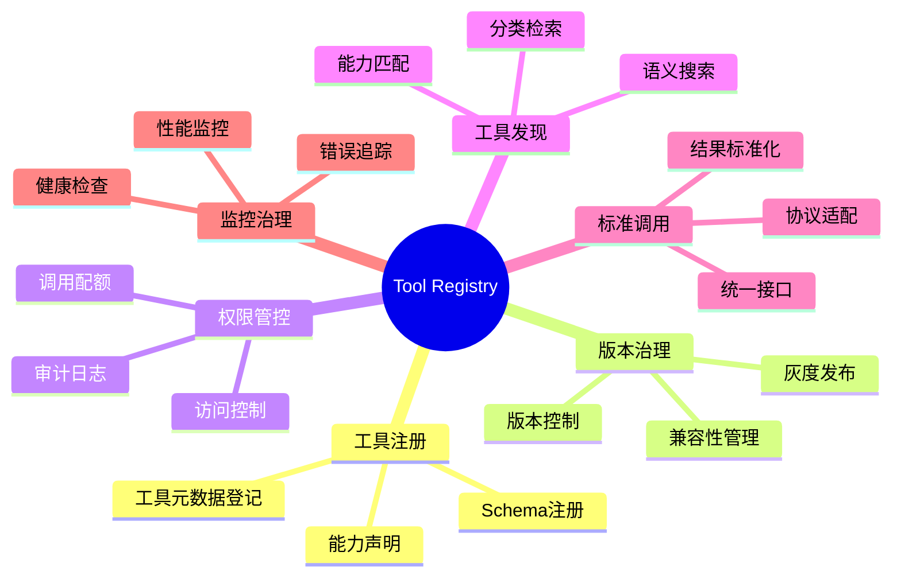

### 1.2 为什么需要 Tool Registry

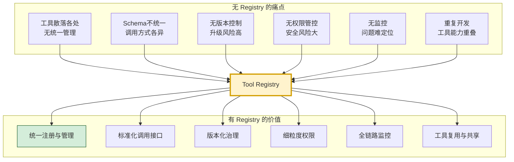

### 1.3 设计目标

| 目标 | 含义 | 量化指标 |
|-----|------|---------|
| **统一性** | 所有工具统一注册、统一管理 | 100%工具纳入Registry |
| **可用性** | 高可用,故障不影响工具调用 | SLA ≥ 99.9% |
| **可扩展** | 支持横向扩展 | 支持万级工具 |
| **低延迟** | 注册发现响应快 | P99 ≤ 100ms |
| **安全可控** | 完善权限与审计 | 全调用可追溯 |
| **可观测** | 全链路监控 | 100%调用可追踪 |

---

## 二、架构设计

### 2.1 整体架构

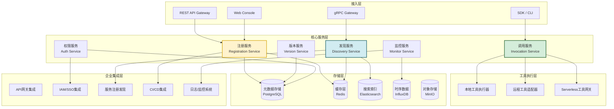

### 2.2 分层架构说明

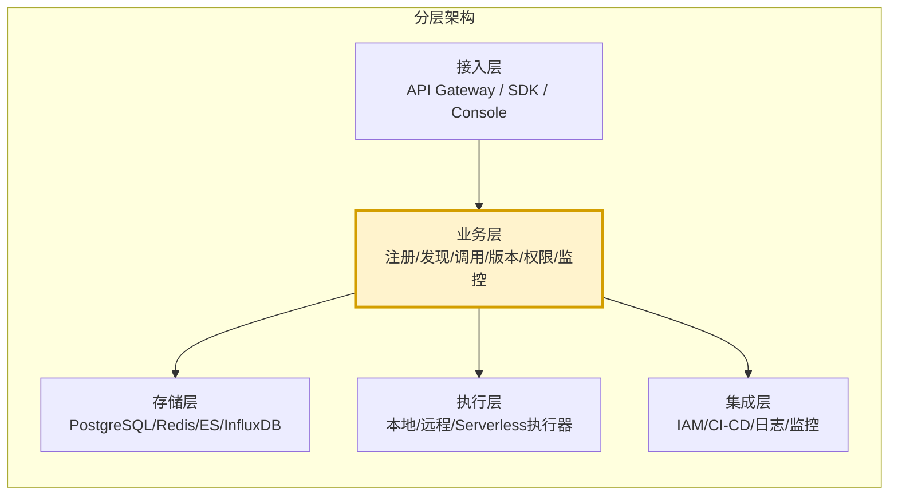

### 2.3 部署架构

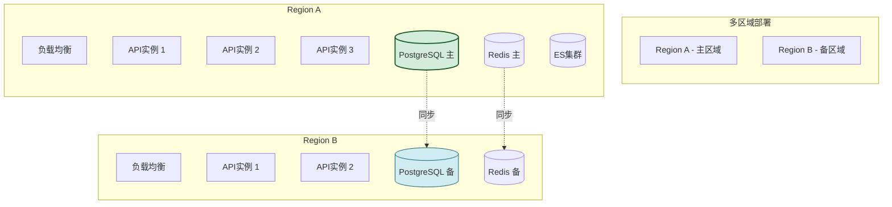

---

## 三、核心功能模块划分

### 3.1 模块全景

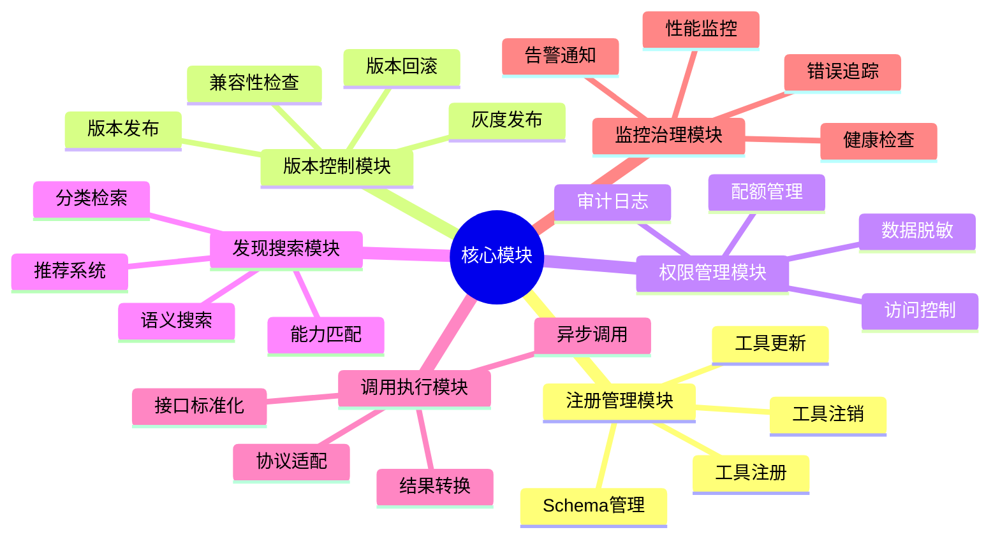

### 3.2 模块详细划分

```python
from dataclasses import dataclass, field
from typing import Optional
from enum import Enum


class ModuleType(Enum):
    """模块类型"""
    REGISTRATION = "registration"
    VERSION = "version"
    AUTH = "auth"
    DISCOVERY = "discovery"
    INVOCATION = "invocation"
    MONITOR = "monitor"


@dataclass
class Module:
    """功能模块定义"""
    name: str
    type: ModuleType
    description: str
    api_endpoints: list[str] = field(default_factory=list)
    dependencies: list[str] = field(default_factory=list)
    
    # 非功能需求
    sla: float = 99.9
    p99_latency_ms: float = 100
    max_qps: int = 1000


class ModuleRegistry:
    """模块注册表"""
    
    MODULES = [
        Module(
            name="tool-registration",
            type=ModuleType.REGISTRATION,
            description="工具注册、更新、注销与Schema管理",
            api_endpoints=[
                "POST /api/v1/tools",
                "PUT /api/v1/tools/{id}",
                "DELETE /api/v1/tools/{id}",
                "PUT /api/v1/tools/{id}/schema"
            ],
            dependencies=["version-control", "auth-service"]
        ),
        Module(
            name="version-control",
            type=ModuleType.VERSION,
            description="版本发布、回滚、兼容性检查、灰度发布",
            api_endpoints=[
                "POST /api/v1/tools/{id}/versions",
                "GET /api/v1/tools/{id}/versions",
                "POST /api/v1/tools/{id}/versions/{ver}/rollback"
            ],
            dependencies=["tool-registration"]
        ),
        Module(
            name="auth-service",
            type=ModuleType.AUTH,
            description="访问控制、配额管理、审计日志",
            api_endpoints=[
                "POST /api/v1/auth/policies",
                "GET /api/v1/auth/check",
                "GET /api/v1/auth/audit"
            ],
            dependencies=[]
        ),
        Module(
            name="tool-discovery",
            type=ModuleType.DISCOVERY,
            description="分类检索、语义搜索、能力匹配",
            api_endpoints=[
                "GET /api/v1/tools/search",
                "GET /api/v1/tools/categories",
                "POST /api/v1/tools/match"
            ],
            dependencies=["tool-registration"]
        ),
        Module(
            name="tool-invocation",
            type=ModuleType.INVOCATION,
            description="标准化调用、协议适配、结果转换",
            api_endpoints=[
                "POST /api/v1/tools/{id}/invoke",
                "POST /api/v1/tools/{id}/invoke-async"
            ],
            dependencies=["auth-service", "tool-registration"]
        ),
        Module(
            name="monitor-service",
            type=ModuleType.MONITOR,
            description="性能监控、错误追踪、健康检查",
            api_endpoints=[
                "GET /api/v1/monitor/metrics",
                "GET /api/v1/monitor/health",
                "GET /api/v1/monitor/alerts"
            ],
            dependencies=[]
        ),
    ]
```

---

## 四、数据模型设计

### 4.1 ER 图

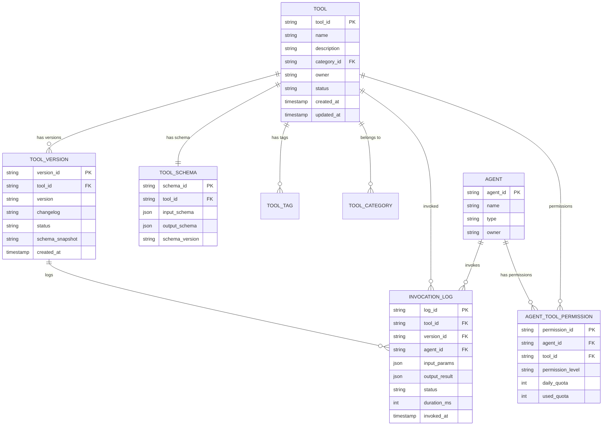

### 4.2 核心数据结构

```python
from dataclasses import dataclass, field
from typing import Any, Optional
from datetime import datetime
from enum import Enum


class ToolStatus(Enum):
    """工具状态"""
    DRAFT = "draft"           # 草稿
    ACTIVE = "active"         # 活跃
    DEPRECATED = "deprecated" # 已废弃
    DISABLED = "disabled"     # 已禁用


class VersionStatus(Enum):
    """版本状态"""
    PENDING = "pending"       # 待发布
    PUBLISHED = "published"   # 已发布
    ROLLED_BACK = "rolled_back"  # 已回滚
    DEPRECATED = "deprecated"   # 已废弃


class PermissionLevel(Enum):
    """权限级别"""
    DENY = "deny"             # 拒绝
    READ = "read"             # 只读(可查看Schema)
    INVOKE = "invoke"         # 可调用
    ADMIN = "admin"           # 管理(可修改配置)


@dataclass
class Tool:
    """工具定义"""
    tool_id: str                          # 工具唯一ID
    name: str                             # 工具名称
    description: str                      # 工具描述
    category_id: str                      # 分类ID
    
    # 基础信息
    owner: str                            # 负责人
    team: str = ""                        # 所属团队
    status: ToolStatus = ToolStatus.DRAFT
    
    # 技术信息
    endpoint: str = ""                    # 调用端点
    protocol: str = "http"               # http/grpc/lambda/local
    timeout_ms: int = 30000              # 超时时间
    
    # 安全信息
    security_level: str = "normal"      # normal/sensitive/critical
    required_permissions: list[str] = field(default_factory=list)
    
    # 监控信息
    health_check_url: str = ""
    health_check_interval: int = 60
    
    # 元数据
    tags: list[str] = field(default_factory=list)
    metadata: dict[str, Any] = field(default_factory=dict)
    
    # 时间戳
    created_at: datetime = field(default_factory=datetime.now)
    updated_at: datetime = field(default_factory=datetime.now)
    
    # 统计
    total_invocations: int = 0
    success_rate: float = 100.0
    avg_latency_ms: float = 0.0


@dataclass
class ToolVersion:
    """工具版本"""
    version_id: str                       # 版本ID
    tool_id: str                         # 工具ID
    version: str                         # 版本号 (语义化版本)
    changelog: str = ""                  # 变更日志
    
    status: VersionStatus = VersionStatus.PENDING
    
    # Schema快照(版本化)
    input_schema: dict = field(default_factory=dict)
    output_schema: dict = field(default_factory=dict)
    
    # 兼容性
    compatible_with: list[str] = field(default_factory=list)  # 兼容的旧版本
    
    # 灰度发布
    rollout_percentage: int = 100       # 灰度比例
    
    # 时间戳
    created_at: datetime = field(default_factory=datetime.now)
    published_at: Optional[datetime] = None


@dataclass
class ToolSchema:
    """工具Schema(基于JSON Schema)"""
    schema_id: str
    tool_id: str
    schema_version: str
    
    # 输入Schema
    input_schema: dict = field(default_factory=dict)
    # 输出Schema
    output_schema: dict = field(default_factory=dict)
    
    # 错误码定义
    error_codes: list[dict] = field(default_factory=list)
    
    # 示例
    examples: list[dict] = field(default_factory=list)


@dataclass
class InvocationLog:
    """调用日志"""
    log_id: str
    tool_id: str
    version_id: str
    agent_id: str
    
    input_params: dict
    output_result: Optional[dict] = None
    
    status: str = "success"              # success/failed/timeout
    error_message: str = ""
    error_code: str = ""
    
    duration_ms: int = 0
    token_consumed: int = 0
    
    invoked_at: datetime = field(default_factory=datetime.now)
    
    # 追踪信息
    trace_id: str = ""
    request_id: str = ""


@dataclass
class AgentToolPermission:
    """Agent工具权限"""
    permission_id: str
    agent_id: str
    tool_id: str
    
    permission_level: PermissionLevel = PermissionLevel.DENY
    
    # 配额管理
    daily_quota: int = -1                # -1表示无限制
    hourly_quota: int = -1
    used_today: int = 0
    used_this_hour: int = 0
    
    # 时间限制
    allowed_time_window: Optional[tuple[str, str]] = None  # ("09:00", "18:00")
    
    # 审批
    requires_approval: bool = False
    approver: str = ""
    
    created_at: datetime = field(default_factory=datetime.now)
    updated_at: datetime = field(default_factory=datetime.now)


@dataclass
class ToolCategory:
    """工具分类"""
    category_id: str
    name: str
    description: str = ""
    parent_id: Optional[str] = None      # 父分类(支持多级)
    
    icon: str = ""
    sort_order: int = 0
```

### 4.3 数据库 Schema (PostgreSQL)

```sql
-- 工具表
CREATE TABLE tools (
    tool_id          VARCHAR(64) PRIMARY KEY,
    name             VARCHAR(256) NOT NULL UNIQUE,
    description      TEXT NOT NULL,
    category_id      VARCHAR(64) REFERENCES tool_categories(category_id),
    owner            VARCHAR(128) NOT NULL,
    team             VARCHAR(128),
    status           VARCHAR(32) NOT NULL DEFAULT 'draft',
    endpoint         TEXT,
    protocol         VARCHAR(32) DEFAULT 'http',
    timeout_ms       INTEGER DEFAULT 30000,
    security_level   VARCHAR(32) DEFAULT 'normal',
    required_permissions TEXT[],
    health_check_url TEXT,
    health_check_interval INTEGER DEFAULT 60,
    tags             TEXT[],
    metadata         JSONB DEFAULT '{}',
    total_invocations BIGINT DEFAULT 0,
    success_rate     FLOAT DEFAULT 100.0,
    avg_latency_ms   FLOAT DEFAULT 0.0,
    created_at       TIMESTAMP DEFAULT CURRENT_TIMESTAMP,
    updated_at       TIMESTAMP DEFAULT CURRENT_TIMESTAMP
);

-- 工具版本表
CREATE TABLE tool_versions (
    version_id        VARCHAR(64) PRIMARY KEY,
    tool_id           VARCHAR(64) REFERENCES tools(tool_id),
    version           VARCHAR(32) NOT NULL,
    changelog         TEXT,
    status            VARCHAR(32) DEFAULT 'pending',
    input_schema      JSONB,
    output_schema     JSONB,
    compatible_with   TEXT[],
    rollout_percentage INTEGER DEFAULT 100,
    created_at        TIMESTAMP DEFAULT CURRENT_TIMESTAMP,
    published_at      TIMESTAMP,
    UNIQUE(tool_id, version)
);

-- 调用日志表(分区表按时间)
CREATE TABLE invocation_logs (
    log_id          VARCHAR(64) PRIMARY KEY,
    tool_id         VARCHAR(64) REFERENCES tools(tool_id),
    version_id      VARCHAR(64) REFERENCES tool_versions(version_id),
    agent_id        VARCHAR(64),
    input_params    JSONB,
    output_result   JSONB,
    status          VARCHAR(32),
    error_message   TEXT,
    error_code      VARCHAR(64),
    duration_ms     INTEGER,
    token_consumed  INTEGER,
    trace_id        VARCHAR(128),
    request_id      VARCHAR(128),
    invoked_at      TIMESTAMP DEFAULT CURRENT_TIMESTAMP
) PARTITION BY RANGE (invoked_at);

-- 创建月度分区
CREATE TABLE invocation_logs_2026_01 PARTITION OF invocation_logs
    FOR VALUES FROM ('2026-01-01') TO ('2026-02-01');

-- 权限表
CREATE TABLE agent_tool_permissions (
    permission_id      VARCHAR(64) PRIMARY KEY,
    agent_id           VARCHAR(64) NOT NULL,
    tool_id            VARCHAR(64) REFERENCES tools(tool_id),
    permission_level   VARCHAR(32) DEFAULT 'deny',
    daily_quota        INTEGER DEFAULT -1,
    hourly_quota       INTEGER DEFAULT -1,
    used_today         INTEGER DEFAULT 0,
    used_this_hour     INTEGER DEFAULT 0,
    allowed_time_window JSONB,
    requires_approval  BOOLEAN DEFAULT FALSE,
    approver           VARCHAR(128),
    created_at         TIMESTAMP DEFAULT CURRENT_TIMESTAMP,
    updated_at         TIMESTAMP DEFAULT CURRENT_TIMESTAMP,
    UNIQUE(agent_id, tool_id)
);

-- 分类表
CREATE TABLE tool_categories (
    category_id    VARCHAR(64) PRIMARY KEY,
    name           VARCHAR(128) NOT NULL,
    description    TEXT,
    parent_id      VARCHAR(64) REFERENCES tool_categories(category_id),
    icon           VARCHAR(256),
    sort_order     INTEGER DEFAULT 0,
    created_at     TIMESTAMP DEFAULT CURRENT_TIMESTAMP
);

-- 索引
CREATE INDEX idx_tools_category ON tools(category_id);
CREATE INDEX idx_tools_status ON tools(status);
CREATE INDEX idx_tools_tags ON tools USING GIN(tags);
CREATE INDEX idx_tools_name_trgm ON tools USING GIN(name gin_trgm_ops);
CREATE INDEX idx_versions_tool ON tool_versions(tool_id);
CREATE INDEX idx_versions_status ON tool_versions(status);
CREATE INDEX idx_logs_tool_time ON invocation_logs(tool_id, invoked_at);
CREATE INDEX idx_logs_agent_time ON invocation_logs(agent_id, invoked_at);
CREATE INDEX idx_perms_agent ON agent_tool_permissions(agent_id);
CREATE INDEX idx_perms_tool ON agent_tool_permissions(tool_id);
```

---

## 五、API 接口规范

### 5.1 RESTful API 设计

```mermaid
flowchart LR
    subgraph API资源
        direction TB
        R1[/api/v1/tools<br/>工具CRUD/]
        R2[/api/v1/tools/{id}/versions<br/>版本管理/]
        R3[/api/v1/tools/{id}/invoke<br/>工具调用/]
        R4[/api/v1/tools/search<br/>工具搜索/]
        R5[/api/v1/auth/permissions<br/>权限管理/]
        R6[/api/v1/monitor/metrics<br/>监控指标/]
    end

    style R3 fill:#d4edda,stroke:#155724,stroke-width:2px
    style R4 fill:#d1ecf1,stroke:#0c5460,stroke-width:2px
```

### 5.2 核心 API 规范

#### 5.2.1 工具注册 API

```python
# POST /api/v1/tools
# 注册新工具

"""
请求示例:
"""
REGISTER_TOOL_REQUEST = {
    "name": "web_search",
    "description": "在互联网上搜索信息,返回相关网页列表",
    "category_id": "cat_search",
    "owner": "team_search",
    "team": "搜索团队",
    "endpoint": "http://search-service:8080/api/search",
    "protocol": "http",
    "timeout_ms": 10000,
    "security_level": "normal",
    "required_permissions": ["read_web"],
    "tags": ["search", "web", "information"],
    "schema": {
        "input": {
            "type": "object",
            "properties": {
                "query": {"type": "string", "description": "搜索关键词"},
                "limit": {"type": "integer", "default": 10, "maximum": 50}
            },
            "required": ["query"]
        },
        "output": {
            "type": "object",
            "properties": {
                "results": {
                    "type": "array",
                    "items": {
                        "type": "object",
                        "properties": {
                            "title": {"type": "string"},
                            "url": {"type": "string"},
                            "snippet": {"type": "string"}
                        }
                    }
                },
                "total": {"type": "integer"}
            }
        }
    },
    "error_codes": [
        {"code": "RATE_LIMIT", "message": "请求过于频繁"},
        {"code": "QUERY_TOO_LONG", "message": "查询过长"}
    ],
    "examples": [
        {
            "input": {"query": "AI Agent", "limit": 5},
            "output": {"results": [{"title": "...", "url": "..."}], "total": 5}
        }
    ]
}

"""
响应示例 (201 Created):
"""
REGISTER_TOOL_RESPONSE = {
    "tool_id": "tool_abc123",
    "name": "web_search",
    "status": "draft",
    "version": "0.1.0",
    "created_at": "2026-08-07T10:00:00Z"
}
```

#### 5.2.2 工具调用 API

```python
# POST /api/v1/tools/{tool_id}/invoke
# 调用工具

"""
请求示例:
"""
INVOKE_TOOL_REQUEST = {
    "agent_id": "agent_001",
    "version": "1.0.0",          # 可选,默认最新版
    "params": {
        "query": "AI Agent 框架对比",
        "limit": 10
    },
    "context": {
        "session_id": "session_abc",
        "trace_id": "trace_xyz"
    }
}

"""
响应示例 (200 OK):
"""
INVOKE_TOOL_RESPONSE = {
    "log_id": "log_def456",
    "tool_id": "tool_abc123",
    "version": "1.0.0",
    "status": "success",
    "result": {
        "results": [
            {"title": "LangChain vs LangGraph", "url": "https://...", "snippet": "..."},
            # ...
        ],
        "total": 10
    },
    "metadata": {
        "duration_ms": 850,
        "token_consumed": 0,
        "server_name": "search-node-1"
    }
}

"""
错误响应 (400 Bad Request):
"""
ERROR_RESPONSE = {
    "error": {
        "code": "VALIDATION_ERROR",
        "message": "参数验证失败",
        "details": [
            {"field": "query", "message": "该字段为必填"}
        ]
    },
    "log_id": "log_def456"
}
```

#### 5.2.3 工具搜索 API

```python
# GET /api/v1/tools/search?query=search&category=cat_search&page=1&size=20
# 搜索工具

"""
响应示例:
"""
SEARCH_RESPONSE = {
    "total": 25,
    "page": 1,
    "size": 20,
    "tools": [
        {
            "tool_id": "tool_abc123",
            "name": "web_search",
            "description": "在互联网上搜索信息...",
            "category": "搜索",
            "tags": ["search", "web"],
            "status": "active",
            "version": "1.0.0",
            "owner": "team_search",
            "avg_latency_ms": 850,
            "success_rate": 99.5,
            "score": 0.95  # 搜索相关性评分
        }
    ]
}
```

### 5.3 API 完整列表

| 方法 | 路径 | 描述 |
|-----|------|------|
| **工具管理** | | |
| POST | `/api/v1/tools` | 注册新工具 |
| GET | `/api/v1/tools` | 获取工具列表 |
| GET | `/api/v1/tools/{id}` | 获取工具详情 |
| PUT | `/api/v1/tools/{id}` | 更新工具 |
| DELETE | `/api/v1/tools/{id}` | 删除工具 |
| **版本管理** | | |
| POST | `/api/v1/tools/{id}/versions` | 发布新版本 |
| GET | `/api/v1/tools/{id}/versions` | 获取版本列表 |
| POST | `/api/v1/tools/{id}/versions/{ver}/rollback` | 回滚版本 |
| **工具调用** | | |
| POST | `/api/v1/tools/{id}/invoke` | 同步调用 |
| POST | `/api/v1/tools/{id}/invoke-async` | 异步调用 |
| GET | `/api/v1/invoke/{log_id}/result` | 查询异步结果 |
| **工具搜索** | | |
| GET | `/api/v1/tools/search` | 关键词搜索 |
| POST | `/api/v1/tools/match` | 能力匹配 |
| GET | `/api/v1/tools/categories` | 获取分类树 |
| **权限管理** | | |
| POST | `/api/v1/auth/permissions` | 创建权限 |
| GET | `/api/v1/auth/check` | 检查权限 |
| GET | `/api/v1/auth/audit` | 审计日志 |
| **监控** | | |
| GET | `/api/v1/monitor/health` | 健康检查 |
| GET | `/api/v1/monitor/metrics` | 性能指标 |
| GET | `/api/v1/monitor/alerts` | 告警信息 |

### 5.4 错误码规范

```python
class ErrorCode:
    """错误码定义"""
    
    # 通用错误 (4xxx)
    INTERNAL_ERROR = ("5000", "内部错误")
    SERVICE_UNAVAILABLE = ("5003", "服务不可用")
    
    # 工具相关 (1xxx)
    TOOL_NOT_FOUND = ("1001", "工具不存在")
    TOOL_DISABLED = ("1002", "工具已禁用")
    TOOL_DEPRECATED = ("1003", "工具已废弃")
    
    # 版本相关 (2xxx)
    VERSION_NOT_FOUND = ("2001", "版本不存在")
    VERSION_INCOMPATIBLE = ("2002", "版本不兼容")
    VERSION_ROLLBACK_FAILED = ("2003", "版本回滚失败")
    
    # 权限相关 (3xxx)
    PERMISSION_DENIED = ("3001", "无访问权限")
    QUOTA_EXCEEDED = ("3002", "调用配额已用尽")
    APPROVAL_REQUIRED = ("3003", "需要审批")
    
    # 调用相关 (4xxx)
    VALIDATION_ERROR = ("4001", "参数验证失败")
    INVOCATION_TIMEOUT = ("4002", "调用超时")
    INVOCATION_FAILED = ("4003", "调用失败")
    RATE_LIMITED = ("4004", "请求频率超限")
```

---

## 六、版本控制机制

### 6.1 语义化版本

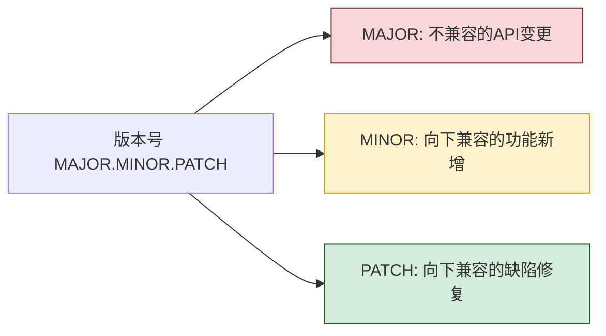

### 6.2 版本管理实现

```python
from dataclasses import dataclass
from typing import Optional
import re


class SemanticVersion:
    """语义化版本"""
    
    PATTERN = re.compile(r"^(\d+)\.(\d+)\.(\d+)(?:-([\w.]+))?(?:\+([\w.]+))?$")
    
    def __init__(self, version: str):
        match = self.PATTERN.match(version)
        if not match:
            raise ValueError(f"无效的版本号: {version}")
        
        self.major = int(match.group(1))
        self.minor = int(match.group(2))
        self.patch = int(match.group(3))
        self.prerelease = match.group(4)
        self.build = match.group(5)
    
    def __str__(self) -> str:
        version = f"{self.major}.{self.minor}.{self.patch}"
        if self.prerelease:
            version += f"-{self.prerelease}"
        if self.build:
            version += f"+{self.build}"
        return version
    
    def is_compatible_with(self, other: "SemanticVersion") -> bool:
        """检查兼容性"""
        # 主版本号相同即兼容
        return self.major == other.major
    
    def is_newer_than(self, other: "SemanticVersion") -> bool:
        """是否比另一个版本新"""
        if self.major != other.major:
            return self.major > other.major
        if self.minor != other.minor:
            return self.minor > other.minor
        return self.patch > other.patch


class VersionManager:
    """版本管理器"""
    
    def __init__(self):
        self._versions: dict[str, list[ToolVersion]] = {}  # tool_id -> versions
    
    def publish_version(self, tool_id: str, version: str,
                          changelog: str, input_schema: dict,
                          output_schema: dict,
                          compatible_with: Optional[list[str]] = None) -> ToolVersion:
        """发布新版本"""
        semver = SemanticVersion(version)
        
        # 检查版本是否已存在
        existing = self._versions.get(tool_id, [])
        for v in existing:
            if v.version == version:
                raise ValueError(f"版本 {version} 已存在")
        
        # 检查兼容性声明
        if compatible_with:
            for compat_ver in compatible_with:
                compat_semver = SemanticVersion(compat_ver)
                if not semver.is_compatible_with(compat_semver):
                    raise ValueError(
                        f"版本 {version} 与声明的兼容版本 {compat_ver} 不兼容"
                    )
        
        # 创建版本
        tool_version = ToolVersion(
            version_id=f"ver_{tool_id}_{version.replace('.', '_')}",
            tool_id=tool_id,
            version=version,
            changelog=changelog,
            input_schema=input_schema,
            output_schema=output_schema,
            compatible_with=compatible_with or [],
            status=VersionStatus.PUBLISHED,
            published_at=datetime.now()
        )
        
        if tool_id not in self._versions:
            self._versions[tool_id] = []
        self._versions[tool_id].append(tool_version)
        
        return tool_version
    
    def get_latest_version(self, tool_id: str) -> Optional[ToolVersion]:
        """获取最新版本"""
        versions = self._versions.get(tool_id, [])
        if not versions:
            return None
        
        published = [v for v in versions if v.status == VersionStatus.PUBLISHED]
        if not published:
            return None
        
        # 按版本号排序取最新
        published.sort(
            key=lambda v: SemanticVersion(v.version),
            reverse=True
        )
        return published[0]
    
    def get_version(self, tool_id: str, 
                     version: str) -> Optional[ToolVersion]:
        """获取指定版本"""
        versions = self._versions.get(tool_id, [])
        for v in versions:
            if v.version == version:
                return v
        return None
    
    def rollback(self, tool_id: str, 
                  target_version: str) -> ToolVersion:
        """回滚到指定版本"""
        target = self.get_version(tool_id, target_version)
        if not target:
            raise ValueError(f"版本 {target_version} 不存在")
        
        if target.status == VersionStatus.ROLLED_BACK:
            raise ValueError(f"版本 {target_version} 已被回滚")
        
        # 将比目标版本新的版本标记为已回滚
        target_semver = SemanticVersion(target_version)
        for v in self._versions.get(tool_id, []):
            if SemanticVersion(v.version).is_newer_than(target_semver):
                v.status = VersionStatus.ROLLED_BACK
        
        target.status = VersionStatus.PUBLISHED
        return target
    
    def set_rollout_percentage(self, tool_id: str, version: str,
                                 percentage: int):
        """设置灰度比例"""
        version_obj = self.get_version(tool_id, version)
        if not version_obj:
            raise ValueError(f"版本 {version} 不存在")
        
        if not 0 <= percentage <= 100:
            raise ValueError("灰度比例必须在 0-100 之间")
        
        version_obj.rollout_percentage = percentage
```

### 6.3 灰度发布

```python
class RolloutManager:
    """灰度发布管理器"""
    
    def __init__(self, version_manager: VersionManager):
        self.version_manager = version_manager
    
    def select_version(self, tool_id: str, 
                        agent_id: str) -> Optional[ToolVersion]:
        """为Agent选择版本(基于灰度比例)"""
        versions = self.version_manager._versions.get(tool_id, [])
        published = [
            v for v in versions 
            if v.status == VersionStatus.PUBLISHED and v.rollout_percentage > 0
        ]
        
        if not published:
            return None
        
        if len(published) == 1:
            return published[0]
        
        # 多版本灰度: 基于agent_id哈希选择
        import hashlib
        hash_value = int(
            hashlib.md5(agent_id.encode()).hexdigest(), 16
        ) % 100
        
        cumulative = 0
        for v in sorted(published, key=lambda x: SemanticVersion(x.version), reverse=True):
            cumulative += v.rollout_percentage
            if hash_value < cumulative:
                return v
        
        return published[0]
```

---

## 七、权限管理体系

### 7.1 权限模型

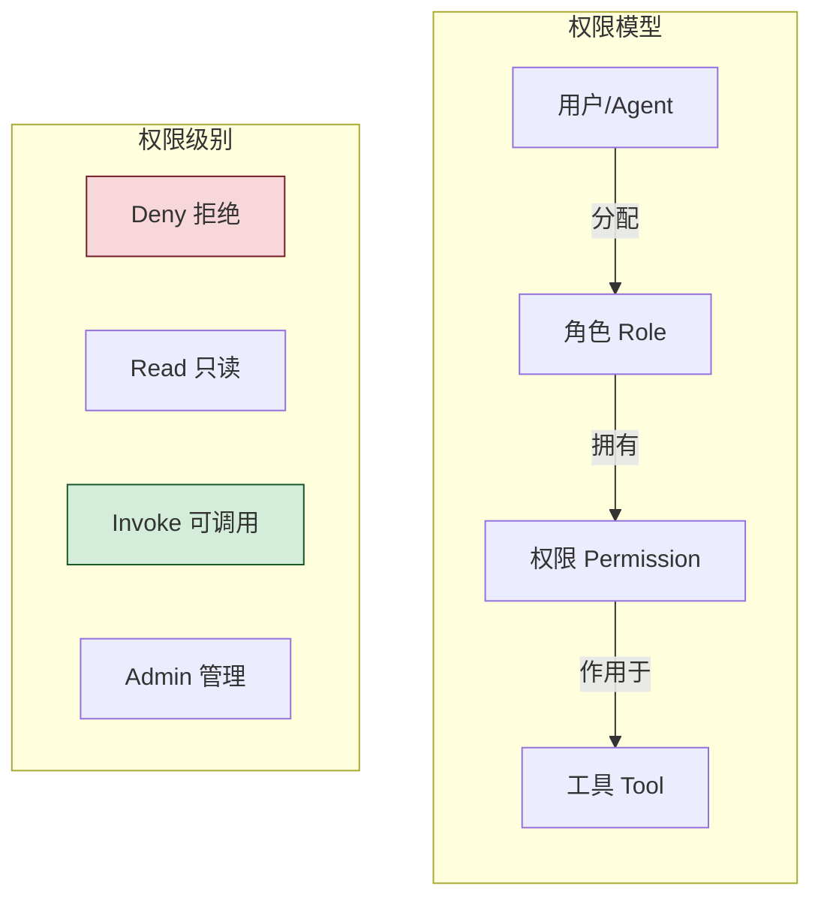

### 7.2 权限检查实现

```python
class PermissionChecker:
    """权限检查器"""
    
    def __init__(self):
        self._permissions: dict[tuple[str, str], AgentToolPermission] = {}
        self._default_policy: PermissionLevel = PermissionLevel.DENY
        self._lock = threading.RLock()
    
    def check_permission(self, agent_id: str, 
                          tool_id: str) -> tuple[bool, str]:
        """检查调用权限"""
        with self._lock:
            key = (agent_id, tool_id)
            perm = self._permissions.get(key)
            
            if not perm:
                if self._default_policy == PermissionLevel.DENY:
                    return False, "无权限且默认策略为拒绝"
                else:
                    return True, "默认策略允许"
            
            if perm.permission_level == PermissionLevel.DENY:
                return False, "权限被拒绝"
            
            if perm.permission_level not in (PermissionLevel.INVOKE, PermissionLevel.ADMIN):
                return False, f"权限级别不足: {perm.permission_level.value}"
            
            # 检查配额
            if perm.daily_quota > 0 and perm.used_today >= perm.daily_quota:
                return False, f"日配额已用尽 ({perm.daily_quota})"
            
            if perm.hourly_quota > 0 and perm.used_this_hour >= perm.hourly_quota:
                return False, f"小时配额已用尽 ({perm.hourly_quota})"
            
            # 检查时间窗口
            if perm.allowed_time_window:
                now = datetime.now().time()
                start = datetime.strptime(perm.allowed_time_window[0], "%H:%M").time()
                end = datetime.strptime(perm.allowed_time_window[1], "%H:%M").time()
                if not (start <= now <= end):
                    return False, f"当前时间不在允许窗口内"
            
            # 检查审批
            if perm.requires_approval:
                # 简化:实际需查询审批状态
                pass
            
            return True, "权限检查通过"
    
    def record_usage(self, agent_id: str, tool_id: str):
        """记录使用"""
        with self._lock:
            key = (agent_id, tool_id)
            perm = self._permissions.get(key)
            if perm:
                perm.used_today += 1
                perm.used_this_hour += 1
    
    def reset_daily_quota(self):
        """重置日配额"""
        with self._lock:
            for perm in self._permissions.values():
                perm.used_today = 0
    
    def reset_hourly_quota(self):
        """重置小时配额"""
        with self._lock:
            for perm in self._permissions.values():
                perm.used_this_hour = 0
    
    def grant_permission(self, agent_id: str, tool_id: str,
                          level: PermissionLevel,
                          daily_quota: int = -1,
                          hourly_quota: int = -1):
        """授予权限"""
        with self._lock:
            key = (agent_id, tool_id)
            self._permissions[key] = AgentToolPermission(
                permission_id=f"perm_{agent_id}_{tool_id}",
                agent_id=agent_id,
                tool_id=tool_id,
                permission_level=level,
                daily_quota=daily_quota,
                hourly_quota=hourly_quota
            )
```

### 7.3 审计日志

```python
class AuditLogger:
    """审计日志记录器"""
    
    def __init__(self):
        self._logs: list[dict] = []
        self._lock = threading.RLock()
    
    def log_invocation(self, agent_id: str, tool_id: str,
                        params: dict, result: dict,
                        status: str, duration_ms: int):
        """记录调用审计"""
        with self._lock:
            self._logs.append({
                "timestamp": datetime.now().isoformat(),
                "agent_id": agent_id,
                "tool_id": tool_id,
                "action": "invoke",
                "params_summary": str(params)[:200],
                "result_summary": str(result)[:200] if result else "",
                "status": status,
                "duration_ms": duration_ms
            })
            
            # 控制日志大小
            if len(self._logs) > 100000:
                self._logs = self._logs[-50000:]
    
    def log_permission_change(self, agent_id: str, tool_id: str,
                                action: str, operator: str):
        """记录权限变更"""
        with self._lock:
            self._logs.append({
                "timestamp": datetime.now().isoformat(),
                "agent_id": agent_id,
                "tool_id": tool_id,
                "action": f"permission_{action}",
                "operator": operator
            })
    
    def query(self, agent_id: Optional[str] = None,
              tool_id: Optional[str] = None,
              start_time: Optional[datetime] = None,
              end_time: Optional[datetime] = None,
              action: Optional[str] = None,
              limit: int = 100) -> list[dict]:
        """查询审计日志"""
        with self._lock:
            results = []
            for log in reversed(self._logs):
                if agent_id and log.get("agent_id") != agent_id:
                    continue
                if tool_id and log.get("tool_id") != tool_id:
                    continue
                if action and log.get("action") != action:
                    continue
                # 时间过滤简化
                results.append(log)
                if len(results) >= limit:
                    break
            return results
```

---

## 八、工具发现与搜索

### 8.1 搜索架构

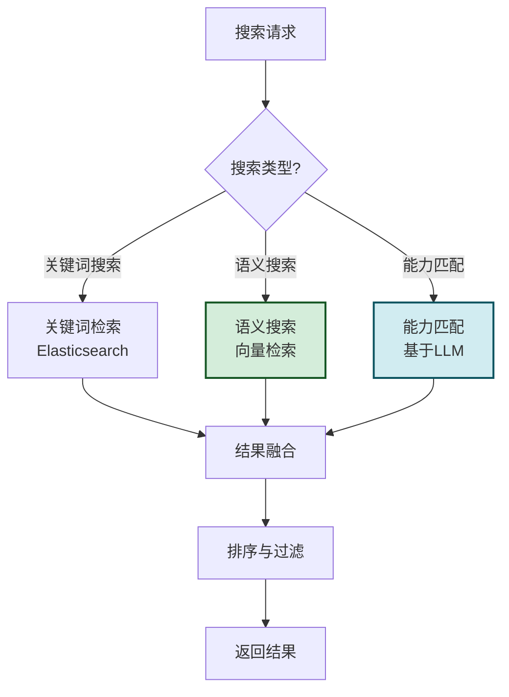

### 8.2 搜索实现

```python
class ToolDiscoveryService:
    """工具发现服务"""
    
    def __init__(self):
        self._tools: dict[str, Tool] = {}
        self._tool_embeddings: dict[str, list[float]] = {}
        self._lock = threading.RLock()
    
    def search_by_keyword(self, query: str, 
                           category: Optional[str] = None,
                           tags: Optional[list[str]] = None,
                           page: int = 1, 
                           size: int = 20) -> dict:
        """关键词搜索"""
        with self._lock:
            results = []
            query_lower = query.lower()
            
            for tool in self._tools.values():
                if tool.status != ToolStatus.ACTIVE:
                    continue
                
                # 分类过滤
                if category and tool.category_id != category:
                    continue
                
                # 标签过滤
                if tags and not any(t in tool.tags for t in tags):
                    continue
                
                # 关键词匹配
                score = self._calculate_keyword_score(tool, query_lower)
                if score > 0:
                    results.append((tool, score))
            
            # 排序
            results.sort(key=lambda x: x[1], reverse=True)
            
            # 分页
            total = len(results)
            start = (page - 1) * size
            end = start + size
            page_results = results[start:end]
            
            return {
                "total": total,
                "page": page,
                "size": size,
                "tools": [self._tool_to_dict(t) | {"score": s} 
                          for t, s in page_results]
            }
    
    def _calculate_keyword_score(self, tool: Tool, query: str) -> float:
        """计算关键词匹配分数"""
        score = 0.0
        
        # 名称匹配(权重最高)
        if query in tool.name.lower():
            score += 1.0
        
        # 描述匹配
        if query in tool.description.lower():
            score += 0.5
        
        # 标签匹配
        for tag in tool.tags:
            if query in tag.lower():
                score += 0.3
        
        return score
    
    def search_by_semantic(self, query: str, 
                             top_k: int = 10) -> list[dict]:
        """语义搜索(基于向量)"""
        # 1. 将查询转为向量
        query_embedding = self._embed_text(query)
        
        # 2. 计算与所有工具的相似度
        with self._lock:
            scored = []
            for tool_id, tool in self._tools.items():
                if tool.status != ToolStatus.ACTIVE:
                    continue
                
                tool_embedding = self._tool_embeddings.get(tool_id)
                if not tool_embedding:
                    continue
                
                similarity = self._cosine_similarity(
                    query_embedding, tool_embedding
                )
                scored.append((tool, similarity))
        
        # 3. 排序取TopK
        scored.sort(key=lambda x: x[1], reverse=True)
        
        return [
            self._tool_to_dict(t) | {"score": s}
            for t, s in scored[:top_k]
        ]
    
    def match_by_capability(self, task_description: str,
                              top_k: int = 5) -> list[dict]:
        """基于任务描述匹配工具(使用LLM)"""
        # 简化:实际应调用LLM进行能力匹配
        return self.search_by_semantic(task_description, top_k)
    
    def _embed_text(self, text: str) -> list[float]:
        """文本向量化(简化)"""
        # 实际应调用Embedding模型
        return [0.1] * 128
    
    def _cosine_similarity(self, a: list[float], 
                             b: list[float]) -> float:
        """余弦相似度"""
        import math
        dot = sum(x * y for x, y in zip(a, b))
        norm_a = math.sqrt(sum(x * x for x in a))
        norm_b = math.sqrt(sum(x * x for x in b))
        if norm_a == 0 or norm_b == 0:
            return 0.0
        return dot / (norm_a * norm_b)
    
    def _tool_to_dict(self, tool: Tool) -> dict:
        """工具转字典"""
        return {
            "tool_id": tool.tool_id,
            "name": tool.name,
            "description": tool.description,
            "category": tool.category_id,
            "tags": tool.tags,
            "status": tool.status.value,
            "owner": tool.owner,
            "avg_latency_ms": tool.avg_latency_ms,
            "success_rate": tool.success_rate
        }
```

### 8.3 分类树管理

```python
class CategoryManager:
    """分类管理器"""
    
    def __init__(self):
        self._categories: dict[str, ToolCategory] = {}
        self._lock = threading.RLock()
    
    def add_category(self, category: ToolCategory):
        """添加分类"""
        with self._lock:
            self._categories[category.category_id] = category
    
    def get_category_tree(self) -> dict:
        """获取分类树"""
        with self._lock:
            tree = {}
            for cat in self._categories.values():
                if cat.parent_id is None:
                    tree[cat.category_id] = {
                        "name": cat.name,
                        "description": cat.description,
                        "children": self._get_children(cat.category_id)
                    }
            return tree
    
    def _get_children(self, parent_id: str) -> list[dict]:
        """获取子分类"""
        children = []
        for cat in self._categories.values():
            if cat.parent_id == parent_id:
                children.append({
                    "name": cat.name,
                    "description": cat.description,
                    "children": self._get_children(cat.category_id)
                })
        return children
```

---

## 九、性能监控与错误处理

### 9.1 监控架构

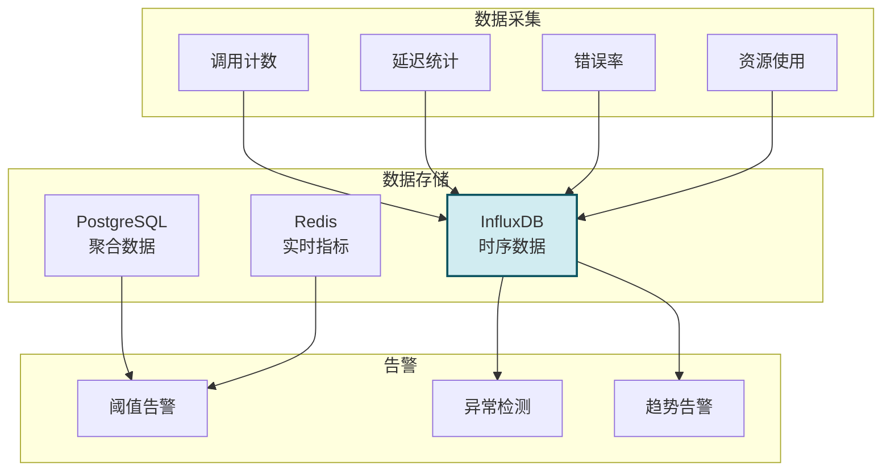

### 9.2 监控实现

```python
from collections import defaultdict
from dataclasses import dataclass, field
import time


@dataclass
class ToolMetrics:
    """工具监控指标"""
    tool_id: str
    timestamp: float
    
    # 调用指标
    invocation_count: int = 0
    success_count: int = 0
    error_count: int = 0
    timeout_count: int = 0
    
    # 延迟指标
    avg_latency_ms: float = 0.0
    p50_latency_ms: float = 0.0
    p99_latency_ms: float = 0.0
    max_latency_ms: float = 0.0
    
    # 资源指标
    cpu_usage: float = 0.0
    memory_usage_mb: float = 0.0
    
    # 错误分布
    error_distribution: dict = field(default_factory=dict)


class MetricsCollector:
    """指标采集器"""
    
    def __init__(self):
        self._latencies: dict[str, list[float]] = defaultdict(list)
        self._counts: dict[str, dict] = defaultdict(lambda: {
            "total": 0, "success": 0, "error": 0, "timeout": 0
        })
        self._errors: dict[str, dict[str, int]] = defaultdict(lambda: defaultdict(int))
        self._lock = threading.RLock()
    
    def record_invocation(self, tool_id: str, duration_ms: float,
                           status: str, error_code: str = ""):
        """记录调用"""
        with self._lock:
            self._counts[tool_id]["total"] += 1
            
            if status == "success":
                self._counts[tool_id]["success"] += 1
            elif status == "timeout":
                self._counts[tool_id]["timeout"] += 1
                self._counts[tool_id]["error"] += 1
            else:
                self._counts[tool_id]["error"] += 1
            
            if error_code:
                self._errors[tool_id][error_code] += 1
            
            self._latencies[tool_id].append(duration_ms)
            # 保留最近1000个
            if len(self._latencies[tool_id]) > 1000:
                self._latencies[tool_id] = self._latencies[tool_id][-1000:]
    
    def get_metrics(self, tool_id: str) -> ToolMetrics:
        """获取指标"""
        with self._lock:
            counts = self._counts.get(tool_id, {})
            latencies = self._latencies.get(tool_id, [])
            
            metrics = ToolMetrics(
                tool_id=tool_id,
                timestamp=time.time(),
                invocation_count=counts.get("total", 0),
                success_count=counts.get("success", 0),
                error_count=counts.get("error", 0),
                timeout_count=counts.get("timeout", 0),
                error_distribution=dict(self._errors.get(tool_id, {}))
            )
            
            if latencies:
                metrics.avg_latency_ms = sum(latencies) / len(latencies)
                sorted_lat = sorted(latencies)
                metrics.p50_latency_ms = sorted_lat[len(sorted_lat) // 2]
                metrics.p99_latency_ms = sorted_lat[int(len(sorted_lat) * 0.99)]
                metrics.max_latency_ms = max(latencies)
            
            return metrics
    
    def check_health(self, tool_id: str) -> dict:
        """健康检查"""
        metrics = self.get_metrics(tool_id)
        
        issues = []
        
        if metrics.invocation_count > 0:
            error_rate = metrics.error_count / metrics.invocation_count
            if error_rate > 0.1:
                issues.append(f"错误率过高: {error_rate:.1%}")
            
            if metrics.p99_latency_ms > 5000:
                issues.append(f"P99延迟过高: {metrics.p99_latency_ms:.0f}ms")
        
        return {
            "tool_id": tool_id,
            "healthy": len(issues) == 0,
            "issues": issues,
            "metrics": {
                "invocation_count": metrics.invocation_count,
                "error_rate": (
                    metrics.error_count / metrics.invocation_count
                    if metrics.invocation_count > 0 else 0
                ),
                "p99_latency_ms": metrics.p99_latency_ms
            }
        }
```

### 9.3 告警规则

```python
class AlertManager:
    """告警管理器"""
    
    ALERT_RULES = {
        "high_error_rate": {
            "condition": lambda m: m.get("error_rate", 0) > 0.1,
            "message": "工具错误率超过10%",
            "severity": "critical"
        },
        "high_latency": {
            "condition": lambda m: m.get("p99_latency_ms", 0) > 5000,
            "message": "P99延迟超过5秒",
            "severity": "warning"
        },
        "no_invocations": {
            "condition": lambda m: m.get("invocation_count", 0) == 0,
            "message": "工具无调用记录",
            "severity": "info"
        }
    }
    
    def check_alerts(self, metrics: dict) -> list[dict]:
        """检查告警"""
        alerts = []
        for rule_name, rule in self.ALERT_RULES.items():
            if rule["condition"](metrics):
                alerts.append({
                    "rule": rule_name,
                    "message": rule["message"],
                    "severity": rule["severity"],
                    "metrics": metrics,
                    "timestamp": datetime.now().isoformat()
                })
        return alerts
```

---

## 十、企业系统集成与关键技术选型

### 10.1 企业集成架构

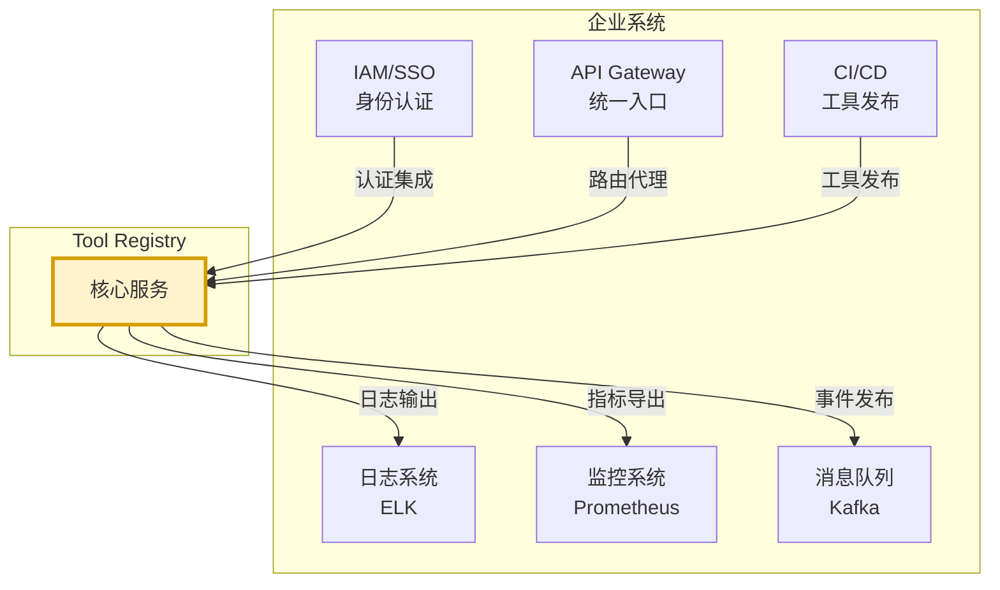

### 10.2 集成方案

```python
class EnterpriseIntegration:
    """企业系统集成"""
    
    # 1. IAM/SSO 集成
    @staticmethod
    def integrate_iam(iam_config: dict):
        """
        集成企业身份认证系统
        
        - 支持 OIDC / SAML / LDAP
        - 基于 JWT 的 Token 验证
        - 与企业角色体系对接
        """
        return {
            "protocol": iam_config.get("protocol", "oidc"),
            "issuer": iam_config.get("issuer"),
            "jwks_url": iam_config.get("jwks_url"),
            "role_mapping": iam_config.get("role_mapping", {})
        }
    
    # 2. API Gateway 集成
    @staticmethod
    def integrate_api_gateway(gateway_config: dict):
        """
        集成企业 API 网关
        
        - 统一路由: /api/v1/tools/* -> Tool Registry
        - 限流: 基于网关的 QPS 限制
        - 熔断: 网关层熔断保护
        """
        return {
            "route_prefix": "/api/v1/tools",
            "rate_limit": gateway_config.get("rate_limit", 1000),
            "circuit_breaker": gateway_config.get("circuit_breaker", True)
        }
    
    # 3. CI/CD 集成
    @staticmethod
    def integrate_cicd(cicd_config: dict):
        """
        集成 CI/CD 流水线
        
        - 工具自动注册: 部署时自动注册到 Registry
        - 版本管理: 与 Git Tag 关联
        - 健康检查: 部署后自动健康检查
        """
        return {
            "auto_register": True,
            "version_from_git_tag": True,
            "health_check_on_deploy": True,
            "rollback_on_failure": True
        }
    
    # 4. 日志系统集成
    @staticmethod
    def integrate_logging(logging_config: dict):
        """
        集成企业日志系统
        
        - 结构化日志(JSON)
        - 统一 Trace ID
        - 日志聚合到 ELK
        """
        return {
            "format": "json",
            "output": ["stdout", "file", "kafka"],
            "kafka_topic": "tool-registry-logs",
            "trace_id_header": "X-Trace-Id"
        }
    
    # 5. 监控系统集成
    @staticmethod
    def integrate_monitoring(monitoring_config: dict):
        """
        集成企业监控系统
        
        - Prometheus 指标导出
        - Grafana 仪表盘
        - 告警规则配置
        """
        return {
            "metrics_endpoint": "/metrics",
            "export_format": "prometheus",
            "grafana_dashboard": True,
            "alert_rules": monitoring_config.get("alert_rules", [])
        }
```

### 10.3 关键技术选型

| 技术领域 | 推荐选型 | 备选 | 选型理由 |
|---------|---------|------|---------|
| **开发语言** | Python (FastAPI) | Go (Gin) / Java (Spring Boot) | 生态丰富、开发效率高 |
| **API框架** | FastAPI | Flask / Django | 异步支持、自动文档 |
| **元数据存储** | PostgreSQL | MySQL | JSONB支持、扩展性强 |
| **缓存** | Redis Cluster | Memcached | 丰富的数据结构 |
| **搜索引擎** | Elasticsearch | OpenSearch / Solr | 全文搜索+向量检索 |
| **时序数据库** | InfluxDB | TimescaleDB / Prometheus | 时序数据专用 |
| **消息队列** | Kafka | RabbitMQ / Pulsar | 高吞吐、持久化 |
| **对象存储** | MinIO | AWS S3 / 阿里OSS | 兼容S3、私有部署 |
| **服务发现** | Consul | Nacos / Eureka | 多数据中心 |
| **容器编排** | Kubernetes | Docker Swarm | 业界标准 |
| **配置中心** | Nacos | Apollo / Consul Config | 配置+注册一体 |
| **API网关** | Kong | APISIX / Spring Gateway | 插件丰富 |

### 10.4 部署拓扑

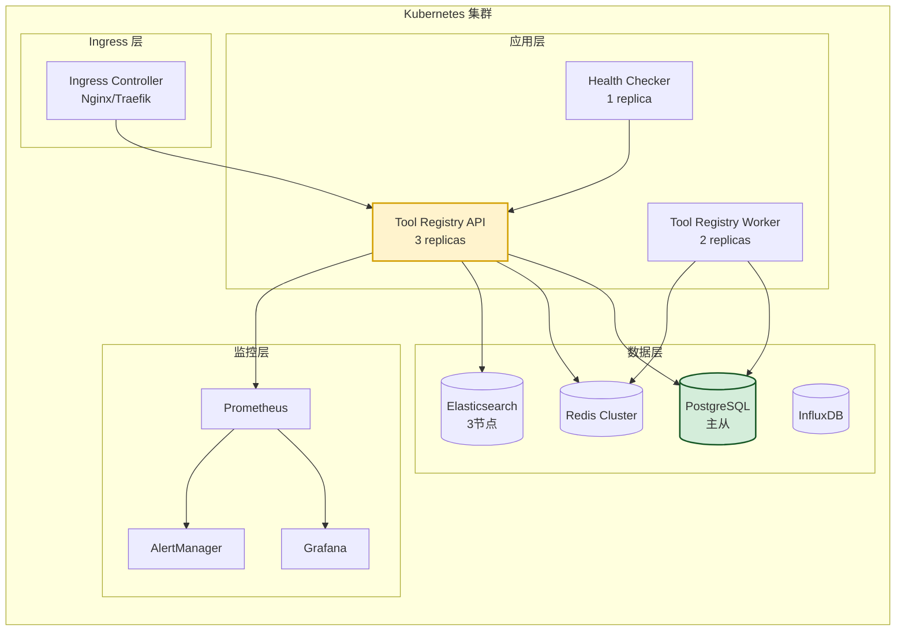

### 10.5 最佳实践与总结

| 领域 | 最佳实践 |
|-----|---------|
| **工具注册** | Schema 优先,先定义后注册 |
| **版本管理** | 语义化版本,灰度发布 |
| **权限管理** | 最小权限原则,默认拒绝 |
| **工具发现** | 语义搜索为主,关键词为辅 |
| **调用接口** | RESTful 标准化,统一错误码 |
| **性能监控** | 全链路追踪,P99 延迟监控 |
| **错误处理** | 分级处理,熔断降级 |
| **企业集成** | IAM/CI-CD/日志/监控全面集成 |
| **高可用** | 多副本部署,主从复制 |
| **可扩展** | 微服务架构,水平扩展 |

### 10.6 核心要点回顾

1. **统一治理**:所有工具统一注册、版本化、权限化。
2. **六层架构**:接入层、业务层、存储层、执行层、集成层、监控层。
3. **数据模型**:工具、版本、Schema、日志、权限、分类六大实体。
4. **API 规范**:RESTful 设计,20+ 接口覆盖全生命周期。
5. **版本控制**:语义化版本 + 灰度发布 + 回滚机制。
6. **权限体系**:四级权限 + 配额管理 + 时间窗口 + 审计日志。
7. **工具发现**:关键词 + 语义 + 能力匹配三种搜索模式。
8. **性能监控**:调用计数、延迟、错误率、健康检查。
9. **企业集成**:IAM/网关/CI-CD/日志/监控五大集成点。
10. **技术选型**:Python+FastAPI+PostgreSQL+Redis+ES+K8s。

### 10.7 与系列文档的关联

本文档作为 Tool Calling 系列的企业治理篇,与其他文档形成完整闭环:

- **基础概念**:[89FunctionCalling与普通API调用核心区别系统性对比深度解析.md](./89FunctionCalling与普通API调用核心区别系统性对比深度解析.md)
- **工具选择**:[90Agent动态工具选择决策机制完整实现深度解析.md](./90Agent动态工具选择决策机制完整实现深度解析.md)
- **Schema 设计**:[91ToolSchema完整设计规范深度解析.md](./91ToolSchema完整设计规范深度解析.md)
- **参数错误处理**:[92工具调用参数错误系统性处理方案深度解析.md](./92工具调用参数错误系统性处理方案深度解析.md)
- **失败重试**:[93工具调用失败重试机制完整设计与实现深度解析.md](./93工具调用失败重试机制完整设计与实现深度解析.md)
- **安全管控**:[94Agent危险工具调用安全管控机制完整设计方案深度解析.md](./94Agent危险工具调用安全管控机制完整设计方案深度解析.md)
- **本文档**:**Tool Registry**,作为工具治理的企业级平台

---

> **相关文档**
>
> - [89FunctionCalling与普通API调用核心区别系统性对比深度解析.md](./89FunctionCalling与普通API调用核心区别系统性对比深度解析.md)
> - [90Agent动态工具选择决策机制完整实现深度解析.md](./90Agent动态工具选择决策机制完整实现深度解析.md)
> - [91ToolSchema完整设计规范深度解析.md](./91ToolSchema完整设计规范深度解析.md)
> - [92工具调用参数错误系统性处理方案深度解析.md](./92工具调用参数错误系统性处理方案深度解析.md)
> - [93工具调用失败重试机制完整设计与实现深度解析.md](./93工具调用失败重试机制完整设计与实现深度解析.md)
> - [94Agent危险工具调用安全管控机制完整设计方案深度解析.md](./94Agent危险工具调用安全管控机制完整设计方案深度解析.md)
