# MCP协议完整深度解析

> **文档定位**:本文档是 Tool Calling / Function Calling 系列的 MCP 专题篇,系统解析 **Model Context Protocol(模型上下文协议)** 的定义、核心功能、工作原理、应用场景与技术规范。在 [89号文档](./89FunctionCalling与普通API调用核心区别系统性对比深度解析.md) 对比 Function Calling、[91号文档](./91ToolSchema完整设计规范深度解析.md) 定义 Schema 规范的基础上,本文回答一个更高层的问题:**"如何用统一协议让任意 AI 应用连接任意工具,实现 N+M 而非 N×M 的集成?"**
>
> **核心标准**:本文基于 MCP 2025-11-25 最新规范([官方规格](https://modelcontextprotocol.io/specification/2025-11-25)),涵盖三大原语(Tools/Resources/Prompts)、Client-Host-Server 架构、JSON-RPC 2.0 消息格式、能力协商、传输层(stdio/Streamable HTTP)与 2025 年新增的 Tasks 特性。

---

## 目录

- [一、MCP 协议概述与诞生背景](#一mcp-协议概述与诞生背景)
- [二、核心概念与架构](#二核心概念与架构)
- [三、三大核心原语](#三三大核心原语)
- [四、通信协议与消息格式](#四通信协议与消息格式)
- [五、传输层机制](#五传输层机制)
- [六、生命周期与能力协商](#六生命周期与能力协商)
- [七、应用场景](#七应用场景)
- [八、MCP 与其他协议对比](#八mcp-与其他协议对比)
- [九、完整实现示例](#九完整实现示例)
- [十、最佳实践与总结](#十最佳实践与总结)

---

## 一、MCP 协议概述与诞生背景

### 1.1 什么是 MCP

**MCP(Model Context Protocol,模型上下文协议)** 是由 Anthropic 于 2024 年 11 月开源发布的**开放标准协议**,旨在为 LLM 应用与外部数据源、工具之间提供**标准化的连接方式**。其地位常被类比为"AI 应用层的 USB-C 接口"——不管什么模型、什么工具,都通过统一协议连接。

```mermaid
flowchart LR
    subgraph MCP 前: N×M 集成问题
        M1[模型 A] --> T1[工具1]
        M1 --> T2[工具2]
        M2[模型 B] --> T1
        M2 --> T2
        M3[模型 C] --> T1
        M3 --> T2
    end
    
    subgraph MCP 后: N+M 标准化
        MM1[模型 A]
        MM2[模型 B]
        MM3[模型 C]
        MCP[MCP 协议<br/>统一标准]
        TT1[工具1<br/>MCP Server]
        TT2[工具2<br/>MCP Server]
        
        MM1 & MM2 & MM3 --> MCP
        MCP --> TT1 & TT2
    end
    
    style MCP fill:#fa8c16,color:#fff
```

### 1.2 诞生背景:解决 N×M 集成难题

MCP 的诞生源于一个工程痛点。在 MCP 出现前,连接 N 个 AI 模型与 M 个工具需要 **N×M 个独立集成**——每个 AI 应用都要为每个数据源写定制连接器,导致生态碎片化、重复开发、实现不一致。

这一困境与编程语言领域曾经的难题如出一辙:在 **Language Server Protocol(LSP)** 出现前,每个编辑器都要为每种语言写单独的语言服务器。MCP 的创始人 David Soria Parra 和 Justin Spahr-Summers(Anthropic 工程师)正是借鉴了 LSP 的成功经验,为 AI 与工具的连接设计了类似的标准化协议。

### 1.3 发展历程与里程碑

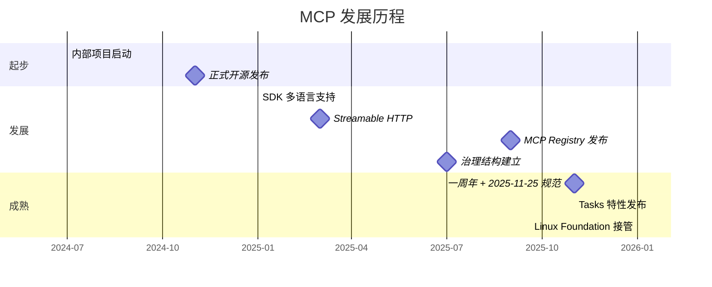

**关键里程碑**:
- **2024-11**:Anthropic 正式开源 MCP,初始规范发布
- **2025-03**:引入 Streamable HTTP 传输(替代旧版 SSE)
- **2025-09**:MCP Registry 发布,集中索引所有可用 Server
- **2025-11**:一周年,发布 2025-11-25 规范,新增 Tasks 特性
- **2026**:由 Linux Foundation 旗下 Agentic AI Foundation 接管治理

### 1.4 核心价值

| 价值 | 说明 |
|------|------|
| **标准化** | 统一协议,任何 AI 应用都能用相同方式连接工具 |
| **解耦** | 模型与工具解耦,各自独立演进 |
| **可组合** | 多个 MCP Server 可组合使用,像 USB Hub 一样扩展 |
| **安全隔离** | Server 只接收必要上下文,看不到完整对话历史 |
| **渐进增强** | 核心协议最小化,能力可按需协商 |

---

## 二、核心概念与架构

### 2.1 Client-Host-Server 三层架构

MCP 遵循 **Client-Host-Server** 架构,其中 Host 可管理多个 Client 实例,每个 Client 与一个 Server 保持 1:1 连接:

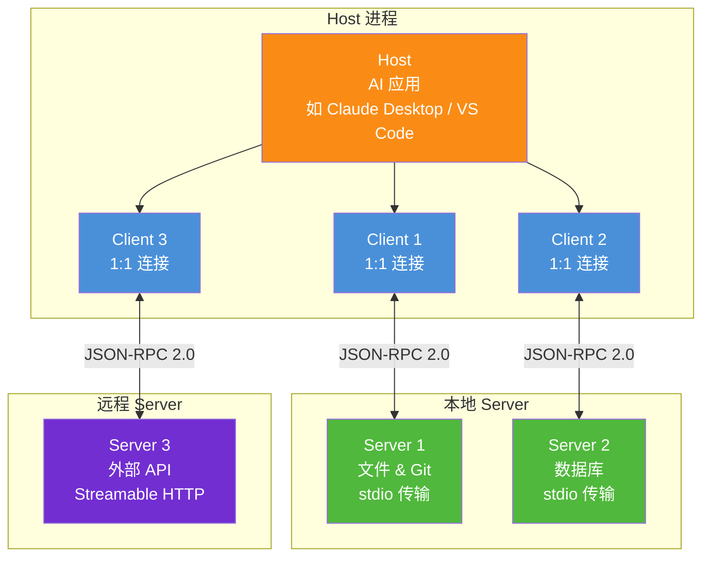

### 2.2 三大参与者职责

| 参与者 | 职责 | 示例 |
|--------|------|------|
| **Host(宿主)** | AI 应用本体,创建并管理多个 Client,控制权限和安全策略,聚合上下文 | Claude Desktop、VS Code、Cursor |
| **Client(客户端)** | 与单个 Server 保持 1:1 连接,处理协议协商,路由消息,维护安全边界 | Host 内部的连接管理器 |
| **Server(服务端)** | 暴露 Tools/Resources/Prompts 三类原语,提供具体能力 | GitHub MCP Server、数据库 MCP Server |

### 2.3 四大设计原则

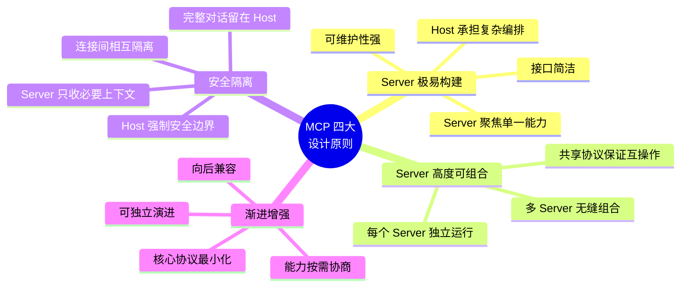

### 2.4 核心特性概览

| 特性 | 说明 |
|------|------|
| **有状态会话** | Client 与 Server 维持持久连接,支持上下文续接 |
| **双向通信** | 不仅 Client 调 Server,Server 也能主动通知 Client |
| **动态发现** | 运行时通过 `tools/list` 动态发现可用工具 |
| **能力协商** | 初始化时双方声明支持的能力,按需启用 |
| **模型无关** | 不绑定任何 LLM 厂商,GPT/Claude/开源模型均可用 |

---

## 三、三大核心原语

MCP Server 可暴露三类核心原语(Primitives),每类有不同的发现方式和控制方向:

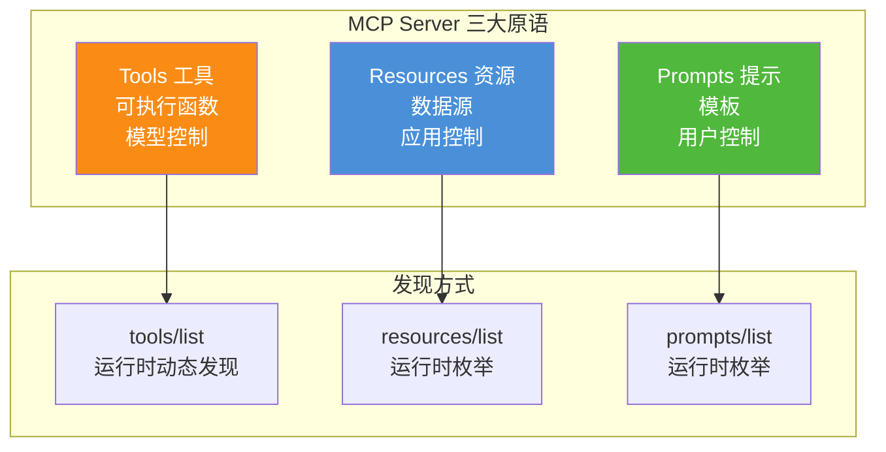

### 3.1 Tools(工具)— 模型控制

**Tools** 是可被 LLM 调用执行的函数,由**模型自主决定**何时调用。这是 MCP 最常用的原语,与 Function Calling 概念一致。

| 维度 | 说明 |
|------|------|
| **控制方** | 模型(LLM 决定调用哪个工具) |
| **发现方式** | `tools/list` 运行时动态发现 |
| **调用方式** | `tools/call` 执行 |
| **典型用途** | 文件操作、API 调用、数据库查询、发邮件 |
| **风险** | 可能有副作用(写操作),需安全控制 |

**工具定义示例**(Server 通过 `tools/list` 返回):

```json
{
  "name": "search_issues",
  "description": "Search GitHub issues by keyword, label, or state. Use this when the user wants to find existing issues. Returns issue number, title, state, and assignee.",
  "inputSchema": {
    "type": "object",
    "properties": {
      "query": {
        "type": "string",
        "description": "Search keywords to match against issue titles and bodies"
      },
      "state": {
        "type": "string",
        "enum": ["open", "closed", "all"],
        "description": "Filter by issue state"
      }
    },
    "required": ["query"]
  }
}
```

### 3.2 Resources(资源)— 应用控制

**Resources** 是提供上下文信息的数据源,由**应用(而非模型)**决定何时读取。类似于 RAG 中的文档检索。

| 维度 | 说明 |
|------|------|
| **控制方** | 应用(应用决定何时读取资源给模型) |
| **发现方式** | `resources/list` 枚举可用资源 |
| **读取方式** | `resources/read` 读取内容 |
| **典型用途** | 文件内容、数据库记录、API 响应、日志 |
| **特性** | 只读,无副作用,适合提供上下文 |

**资源定义示例**:

```json
{
  "uri": "file:///project/src/main.py",
  "name": "main.py",
  "description": "Application entry point",
  "mimeType": "text/x-python"
}
```

### 3.3 Prompts(提示模板)— 用户控制

**Prompts** 是可复用的提示模板,由**用户主动选择**触发。类似于"快捷指令"或"斜杠命令"。

| 维度 | 说明 |
|------|------|
| **控制方** | 用户(用户选择使用哪个模板) |
| **发现方式** | `prompts/list` 枚举可用模板 |
| **使用方式** | `prompts/get` 获取填充后的提示 |
| **典型用途** | 系统提示、Few-shot 示例、代码审查模板 |
| **特性** | 可带参数,结构化引导对话 |

**提示模板示例**:

```json
{
  "name": "code_review",
  "description": "Review code for bugs and improvements",
  "arguments": [
    {
      "name": "language",
      "description": "Programming language",
      "required": true
    },
    {
      "name": "focus",
      "description": "Review focus: security|performance|style",
      "required": false
    }
  ]
}
```

### 3.4 三大原语对比

| 维度 | Tools | Resources | Prompts |
|------|-------|-----------|---------|
| **控制方** | 模型 | 应用 | 用户 |
| **副作用** | 可能有 | 无(只读) | 无 |
| **发现** | `tools/list` | `resources/list` | `prompts/list` |
| **类比** | Function Calling | RAG 检索 | 斜杠命令 |
| **Token 消耗** | 高(定义入上下文) | 按需(按需读取) | 低(按需获取) |

---

## 四、通信协议与消息格式

### 4.1 基于 JSON-RPC 2.0

MCP 的所有通信都基于 **JSON-RPC 2.0** 规范,定义了三种消息类型:

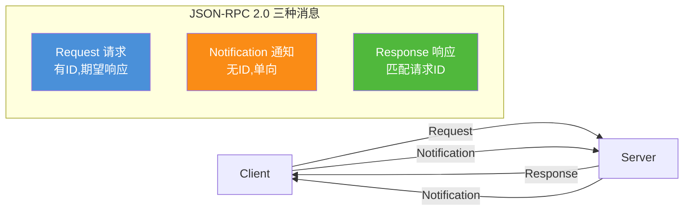

### 4.2 Request(请求)

请求是有 ID 的双向消息,期望对方返回响应:

```json
{
  "jsonrpc": "2.0",
  "id": 1,
  "method": "tools/call",
  "params": {
    "name": "search_issues",
    "arguments": { "query": "login bug", "state": "open" }
  }
}
```

**规范要求**:
- `id` 必须是 string 或 integer,**不能为 null**
- 同一会话内 `id` 不可重复使用
- `method` 标识请求的方法名
- `params` 可选,携带请求参数

### 4.3 Response(响应)

响应匹配请求的 ID,分为成功结果和错误两种:

**成功响应**:
```json
{
  "jsonrpc": "2.0",
  "id": 1,
  "result": {
    "content": [
      {
        "type": "text",
        "text": "Found 3 issues matching 'login bug'..."
      }
    ]
  }
}
```

**错误响应**:
```json
{
  "jsonrpc": "2.0",
  "id": 1,
  "error": {
    "code": -32602,
    "message": "Invalid parameters: 'query' is required",
    "data": { "field": "query", "received": null }
  }
}
```

### 4.4 Notification(通知)

通知是无 ID 的单向消息,不需要响应:

```json
{
  "jsonrpc": "2.0",
  "method": "notifications/tools/list_changed",
  "params": {}
}
```

**典型用途**:
- Server 通知 Client 工具列表已变更
- Client 通知 Server 取消正在执行的任务
- 心跳/进度更新

### 4.5 标准 RPC 方法

| 方法 | 方向 | 说明 |
|------|------|------|
| `initialize` | Client→Server | 初始化连接,协商能力 |
| `ping` | 双向 | 心跳检测 |
| `tools/list` | Client→Server | 列出可用工具 |
| `tools/call` | Client→Server | 调用工具 |
| `resources/list` | Client→Server | 列出可用资源 |
| `resources/read` | Client→Server | 读取资源内容 |
| `prompts/list` | Client→Server | 列出可用提示模板 |
| `prompts/get` | Client→Server | 获取提示内容 |
| `notifications/initialized` | Client→Server | 通知初始化完成 |
| `notifications/tools/list_changed` | Server→Client | 工具列表变更通知 |
| `notifications/cancelled` | Client→Server | 取消正在执行的请求 |

### 4.6 错误码规范

| 错误码 | 含义 | 说明 |
|--------|------|------|
| `-32700` | Parse error | JSON 解析失败 |
| `-32600` | Invalid Request | 请求格式无效 |
| `-32601` | Method not found | 方法不存在 |
| `-32602` | Invalid params | 参数无效 |
| `-32603` | Internal error | 内部错误 |
| `-32000` | Server error | Server 自定义错误 |

---

## 五、传输层机制

### 5.1 两种标准传输方式

MCP 2025-11-25 规范定义了两种标准传输方式:

```mermaid
flowchart TB
    subgraph MCP 传输层
        T1[stdio 传输<br/>本地进程通信<br/>适合本地 Server]
        T2[Streamable HTTP 传输<br/>HTTP POST + SSE<br/>适合远程 Server]
    end
    
    subgraph stdio 特点
        S1[通过 stdin/stdout 通信]
        S2[每个 Client 独占一个 Server 进程]
        S3[低延迟,无网络开销]
        S4[无认证(信任本地环境)]
    end
    
    subgraph HTTP 特点
        H1[HTTP POST 发送请求]
        H2[可选 SSE 流式响应]
        H3[多 Client 共享一个 Server]
        H4[OAuth 2.1 认证]
    end
    
    T1 --> S1 & S2 & S3 & S4
    T2 --> H1 & H2 & H3 & H4
    
    style T1 fill:#4a90d9,color:#fff
    style T2 fill:#fa8c16,color:#fff
```

### 5.2 stdio 传输(本地)

**stdio 传输**通过子进程的 stdin/stdout 通信,适用于本地 Server:

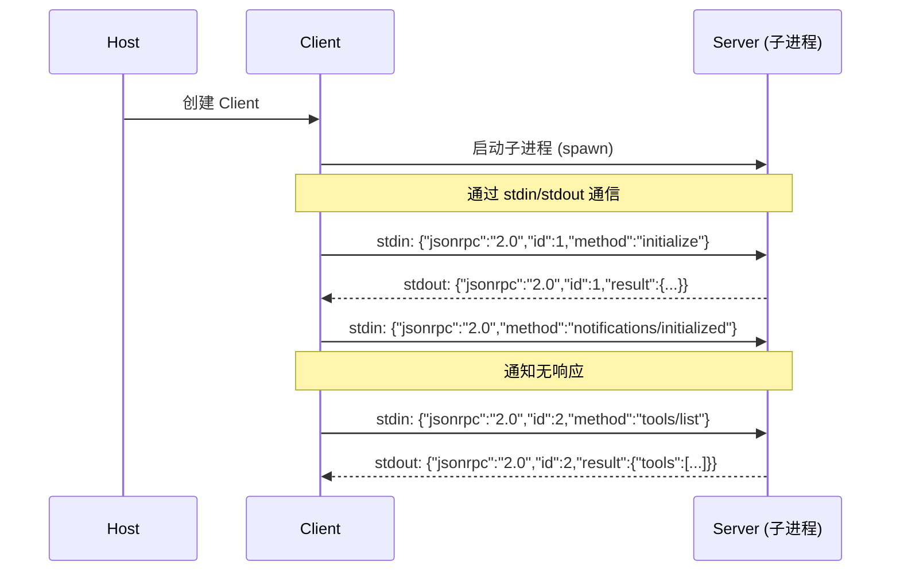

**特点**:
- 每个 Client 启动并独占一个 Server 子进程
- 无网络开销,延迟极低
- 无需认证(本地环境天然隔离)
- Server 从环境变量获取凭证

### 5.3 Streamable HTTP 传输(远程)

**Streamable HTTP 传输**是 2025-03 规范引入的,替代了旧版 HTTP+SSE 双连接方案:

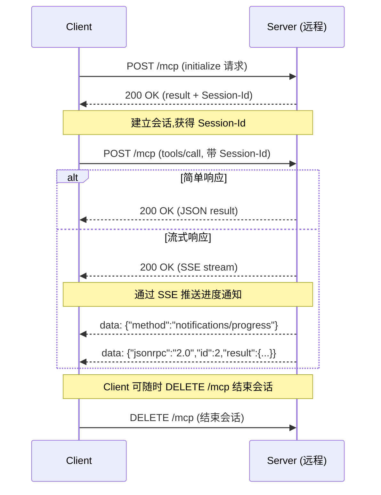

**特点**:
- 单一 HTTP 端点(POST `/mcp`),简化部署
- 可选 SSE(Server-Sent Events)流式响应,支持进度推送
- 通过 `Mcp-Session-Id` 维持有状态会话
- 支持 OAuth 2.1 认证
- 多 Client 可共享一个远程 Server

### 5.4 传输方式选择

| 维度 | stdio | Streamable HTTP |
|------|-------|-----------------|
| **部署位置** | 本地 | 远程 |
| **连接方式** | 子进程 stdin/stdout | HTTP POST + SSE |
| **Client 数量** | 1:1(独占) | N:1(共享) |
| **延迟** | 极低(无网络) | 中(网络往返) |
| **认证** | 环境变量 | OAuth 2.1 |
| **适用场景** | 本地开发工具、IDE 集成 | 云端服务、SaaS 集成 |

---

## 六、生命周期与能力协商

### 6.1 连接生命周期

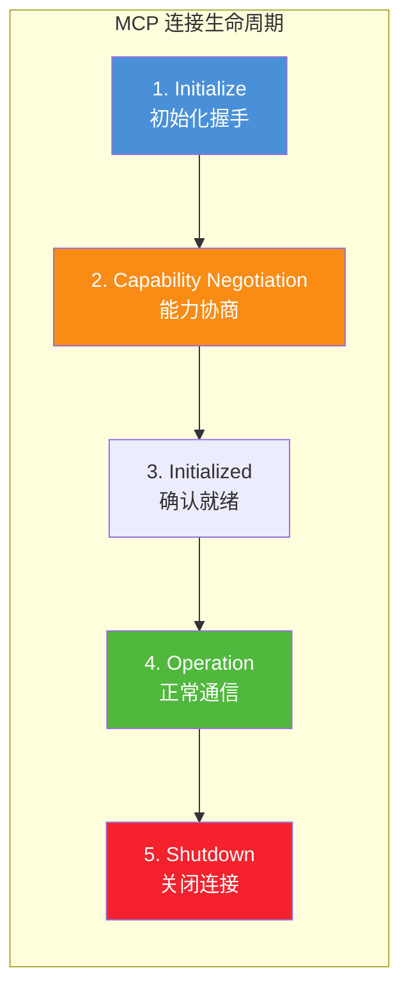

### 6.2 初始化握手流程

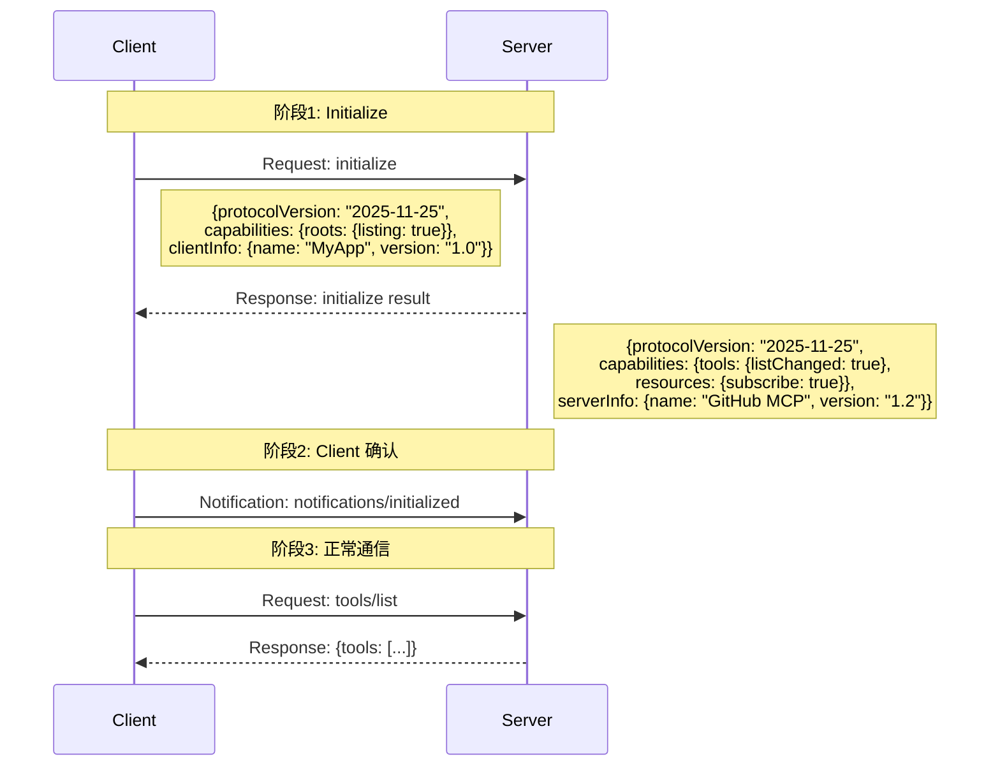

### 6.3 能力协商(Capability Negotiation)

MCP 采用**能力协商机制**:Client 和 Server 在初始化时声明各自支持的能力,会话期间必须遵守声明的约束。

**Client 可声明的能力**:

```json
{
  "capabilities": {
    "roots": {
      "listChanged": true
    },
    "sampling": {}
  }
}
```
- `roots`:Client 可提供根目录列表(如工作区路径)
- `sampling`:Client 支持让 Server 请求 LLM 采样(反向调用)

**Server 可声明的能力**:

```json
{
  "capabilities": {
    "tools": {
      "listChanged": true
    },
    "resources": {
      "subscribe": true,
      "listChanged": true
    },
    "prompts": {
      "listChanged": true
    },
    "logging": {}
  }
}
```
- `tools.listChanged`:工具列表可变更(会通知 Client)
- `resources.subscribe`:支持资源订阅(资源变更时推送)
- `prompts.listChanged`:提示模板可变更
- `logging`:支持日志推送

### 6.4 协议版本协商

Client 在 `initialize` 请求中声明期望的协议版本,Server 可接受或建议其他版本:

```json
// Client 请求
{
  "protocolVersion": "2025-11-25",
  "capabilities": {...},
  "clientInfo": {"name": "MyApp", "version": "1.0.0"}
}

// Server 响应(可返回不同版本)
{
  "protocolVersion": "2025-11-25",
  "capabilities": {...},
  "serverInfo": {"name": "MyServer", "version": "1.2.0"}
}
```

---

## 七、应用场景

### 7.1 典型应用场景

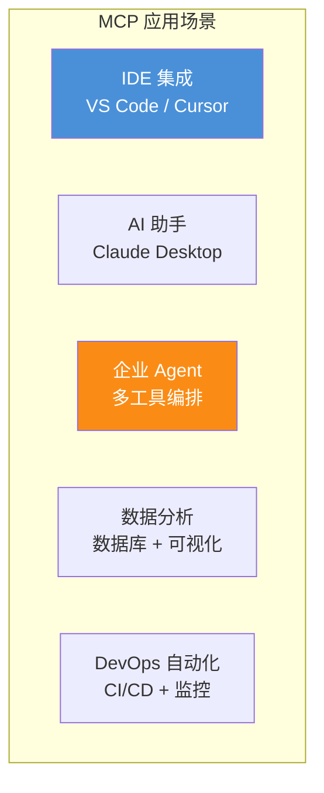

### 7.2 场景一:IDE 集成(VS Code)

VS Code 作为 MCP Host,连接多个本地 MCP Server:

```
VS Code (Host)
  ├── Client 1 → GitHub MCP Server (代码管理)
  ├── Client 2 → File System MCP Server (文件操作)
  └── Client 3 → Database MCP Server (数据查询)
```

**价值**:AI 助手可直接读取代码库、提交 PR、查询数据库,无需手动复制粘贴。

### 7.3 场景二:企业级 Agent

企业 Agent 通过 MCP Gateway 连接多个内部系统:

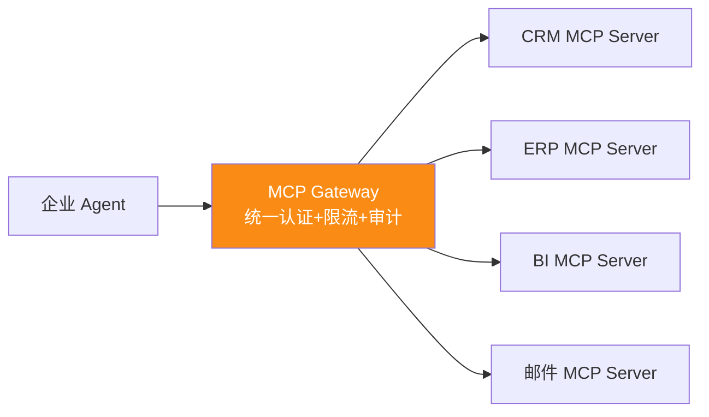

**价值**:统一入口、集中治理、细粒度权限控制。

### 7.4 场景三:多模型兼容

同一套 MCP Server 可服务不同厂商的 LLM:

```
┌─────────────┐
│ GPT-4o Agent│──┐
└─────────────┘  │
┌─────────────┐  │     ┌──────────────────┐
│Claude Agent │──┼────→│  MCP Protocol     │──→ Tools/Resources/Prompts
└─────────────┘  │     └──────────────────┘
┌─────────────┐  │
│本地模型Agent│──┘
└─────────────┘
```

**价值**:一次开发,多模型通用,避免厂商锁定。

### 7.5 已有的知名 MCP Server

截至 2026 年,MCP Registry 已收录近 2000 个 Server,典型代表:

| Server | 提供方 | 功能 |
|--------|--------|------|
| GitHub MCP Server | GitHub | 代码管理、Issue、PR 自动化 |
| Stripe MCP Server | Stripe | 支付工作流管理 |
| Notion MCP Server | Notion | 笔记管理 |
| Hugging Face MCP Server | Hugging Face | 模型管理、数据集搜索 |
| Postman MCP Server | Postman | API 测试自动化 |
| Blender MCP Server | 社区 | 3D 建模自动化 |

---

## 八、MCP 与其他协议对比

### 8.1 MCP vs OpenAI Function Calling vs LangChain Tools

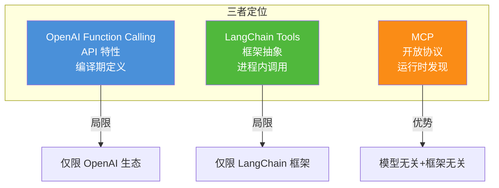

### 8.2 详细对比表

| 维度 | MCP | OpenAI Function Calling | LangChain Tools |
|------|-----|------------------------|-----------------|
| **类型** | 开放协议(JSON-RPC 2.0) | 专有 API 特性 | 框架抽象 |
| **维护方** | Anthropic + 社区 | OpenAI | LangChain Inc. |
| **发现方式** | 运行时(`tools/list`) | 编译期(API 参数) | 编译期(代码定义) |
| **传输** | stdio / Streamable HTTP | OpenAI API(HTTPS) | 进程内函数调用 |
| **厂商锁定** | 无 | OpenAI 模型专用 | 通过适配器支持多模型 |
| **有状态会话** | 是(持久连接) | 否(每次请求独立) | 否(链式调用) |
| **双向通信** | 是(Server 可推送) | 否 | 否 |
| **多租户** | 协议内置 | 应用层实现 | 应用层实现 |
| **安全模型** | OAuth 2.1 + 网关 | API Key | 应用层 |
| **企业治理** | 原生支持(OPA/审计/计量) | 自行实现 | 自行实现或插件 |
| **最适合** | 企业级、多模型、需治理 | OpenAI 专属应用 | 原型开发、编排流水线 |

### 8.3 MCP vs REST API

| 维度 | REST API | MCP |
|------|----------|-----|
| **主要受众** | 人类开发者 | AI 应用 |
| **发现机制** | 读文档(无程序化发现) | `tools/list` 动态发现 |
| **描述语言** | OpenAPI(面向开发者) | JSON Schema(面向 AI) |
| **状态** | 无状态 | 有状态会话 |
| **通信方向** | 单向(请求-响应) | 双向(可推送通知) |
| **错误处理** | HTTP 状态码(不一致) | JSON-RPC 标准错误码 |
| **是否替代** | 否(后端服务仍用 REST) | MCP 可包装 REST API 暴露给 AI |

**关键洞察**:MCP **不替代** REST API,而是在 REST API 之上增加一层 AI 优化的协议层。MCP Server 内部仍可调用 REST API,只是对外暴露统一 MCP 接口。

### 8.4 四种工具调用范式对比

| 范式 | 集成层级 | Token 消耗 | 安全治理 | 可组合性 |
|------|---------|-----------|---------|---------|
| Function Calling | 代码级 | 高(反复传) | 代码层 | 低 |
| MCP | 协议级 | 高(定义入上下文) | OAuth 精细化 | 中 |
| CLI | 命令行 | 极低(零定义) | 本地 Token(粗放) | 高(管道组合) |
| Skills | 知识编排 | 低(按需加载) | 底层工具决定 | 中 |

**生产级最佳实践**:**分层混合架构**——MCP 做协议层统一,内部按场景选择 Function Calling/CLI/Skills。

---

## 九、完整实现示例

### 9.1 MCP Server 实现(Python)

```python
"""
MCP Server 完整实现示例
基于 mcp Python SDK
功能:提供一个"待办事项管理"的 MCP Server
"""
from mcp.server.fastmcp import FastMCP
from typing import Optional

# 1. 创建 MCP Server
mcp = FastMCP(
    name="TodoServer",
    version="1.0.0"
)

# 内存存储(实际应用应使用数据库)
_todos: dict[int, dict] = {}
_next_id = 1


# ========== Tools: 模型可调用的函数 ==========

@mcp.tool()
def add_todo(title: str, priority: str = "normal") -> dict:
    """
    添加待办事项。
    
    Args:
        title: 待办事项标题
        priority: 优先级 (low/normal/high/urgent)
    
    Returns:
        创建的待办事项信息
    """
    global _next_id
    todo_id = _next_id
    _next_id += 1
    
    todo = {
        "id": todo_id,
        "title": title,
        "priority": priority,
        "completed": False
    }
    _todos[todo_id] = todo
    return {"success": True, "todo": todo}


@mcp.tool()
def list_todos(status: Optional[str] = None) -> dict:
    """
    列出待办事项。
    
    Args:
        status: 筛选状态 (pending/completed/all),默认 all
    
    Returns:
        待办事项列表
    """
    todos = list(_todos.values())
    if status == "pending":
        todos = [t for t in todos if not t["completed"]]
    elif status == "completed":
        todos = [t for t in todos if t["completed"]]
    return {"success": True, "todos": todos, "count": len(todos)}


@mcp.tool()
def complete_todo(todo_id: int) -> dict:
    """
    标记待办事项为已完成。
    
    Args:
        todo_id: 待办事项ID
    """
    if todo_id not in _todos:
        return {"success": False, "error": f"Todo {todo_id} not found"}
    _todos[todo_id]["completed"] = True
    return {"success": True, "todo": _todos[todo_id]}


# ========== Resources: 应用可读取的数据 ==========

@mcp.resource("todo://stats")
def get_todo_stats() -> str:
    """获取待办事项统计信息"""
    total = len(_todos)
    completed = sum(1 for t in _todos.values() if t["completed"])
    pending = total - completed
    return f"Total: {total}, Completed: {completed}, Pending: {pending}"


# ========== Prompts: 用户可选择的模板 ==========

@mcp.prompt()
def daily_review() -> str:
    """生成每日待办事项回顾提示"""
    todos = list(_todos.values())
    pending = [t for t in todos if not t["completed"]]
    completed = [t for t in todos if t["completed"]]
    
    return f"""请帮我回顾今天的待办事项完成情况:

## 已完成 ({len(completed)} 项)
{chr(10).join(f'- ✅ {t["title"]}' for t in completed)}

## 待处理 ({len(pending)} 项)
{chr(10).join(f'- ⏳ {t["title"]} [{t["priority"]}]' for t in pending)}

请分析:
1. 今日完成率
2. 高优先级待办是否都完成了
3. 明天的优先事项建议
"""


# ========== 启动 Server ==========

if __name__ == "__main__":
    # stdio 传输(本地)
    mcp.run(transport="stdio")
    
    # 或 Streamable HTTP 传输(远程)
    # mcp.run(transport="streamable-http", host="0.0.0.0", port=8000)
```

### 9.2 MCP Client 实现

```python
"""
MCP Client 完整实现示例
连接 MCP Server 并调用其工具
"""
import asyncio
from mcp import ClientSession, StdioServerParameters
from mcp.client.stdio import stdio_client


async def main():
    # 1. 配置 Server 连接参数(stdio 传输)
    server_params = StdioServerParameters(
        command="python",
        args=["todo_server.py"],
        env=None
    )
    
    # 2. 建立连接
    async with stdio_client(server_params) as (read, write):
        async with ClientSession(read, write) as session:
            # 3. 初始化(能力协商)
            result = await session.initialize()
            print(f"Server: {result.serverInfo.name} v{result.serverInfo.version}")
            print(f"Capabilities: {result.capabilities}")
            
            # 4. 发现工具
            tools = await session.list_tools()
            print(f"\n可用工具 ({len(tools.tools)} 个):")
            for tool in tools.tools:
                print(f"  - {tool.name}: {tool.description}")
            
            # 5. 调用工具:添加待办
            result = await session.call_tool(
                "add_todo",
                arguments={"title": "完成MCP文档", "priority": "high"}
            )
            print(f"\n添加结果: {result.content[0].text}")
            
            # 6. 调用工具:列出待办
            result = await session.call_tool(
                "list_todos",
                arguments={"status": "all"}
            )
            print(f"待办列表: {result.content[0].text}")
            
            # 7. 读取资源
            resources = await session.list_resources()
            print(f"\n可用资源: {len(resources.resources)} 个")
            for res in resources.resources:
                print(f"  - {res.uri}: {res.name}")
            
            content = await session.read_resource("todo://stats")
            print(f"统计: {content.contents[0].text}")
            
            # 8. 获取提示模板
            prompts = await session.list_prompts()
            print(f"\n可用提示: {len(prompts.prompts)} 个")
            for p in prompts.prompts:
                print(f"  - {p.name}: {p.description}")
            
            prompt = await session.get_prompt("daily_review")
            print(f"\n提示内容:\n{prompt.messages[0].content.text}")


asyncio.run(main())
```

### 9.3 运行输出

```
Server: TodoServer v1.0.0
Capabilities: tools={listChanged: True} resources={} prompts={}

可用工具 (3 个):
  - add_todo: 添加待办事项。
  - list_todos: 列出待办事项。
  - complete_todo: 标记待办事项为已完成。

添加结果: {"success": true, "todo": {"id": 1, "title": "完成MCP文档", ...}}
待办列表: {"success": true, "todos": [...], "count": 1}

可用资源: 1 个
  - todo://stats: Todo Statistics
统计: Total: 1, Completed: 0, Pending: 1

可用提示: 1 个
  - daily_review: 生成每日待办事项回顾提示

提示内容:
请帮我回顾今天的待办事项完成情况:
...
```

---

## 十、最佳实践与总结

### 10.1 MCP 设计检查清单

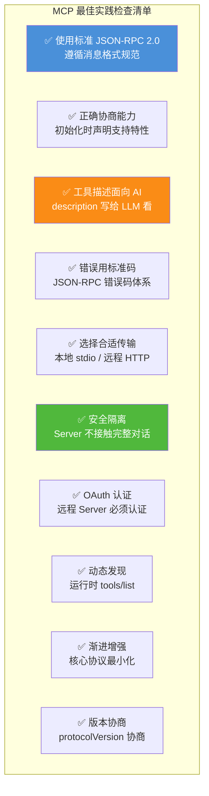

### 10.2 何时使用 MCP

| 场景 | 推荐使用 MCP? | 理由 |
|------|-------------|------|
| 多模型兼容的 Agent 系统 | ✅ 强烈推荐 | 一次开发,多模型通用 |
| 企业级工具治理(审计/限流) | ✅ 强烈推荐 | 协议原生支持治理 |
| IDE 集成(VS Code/Cursor) | ✅ 推荐 | 本地工具标准化连接 |
| 仅用 OpenAI 的简单应用 | ❌ 可用 Function Calling | 无需额外协议层 |
| 原型开发/快速验证 | ❌ 可用 LangChain Tools | 更轻量 |
| 内部微服务通信 | ❌ 用 REST/gRPC | MCP 面向 AI 非后端 |

### 10.3 核心架构总结

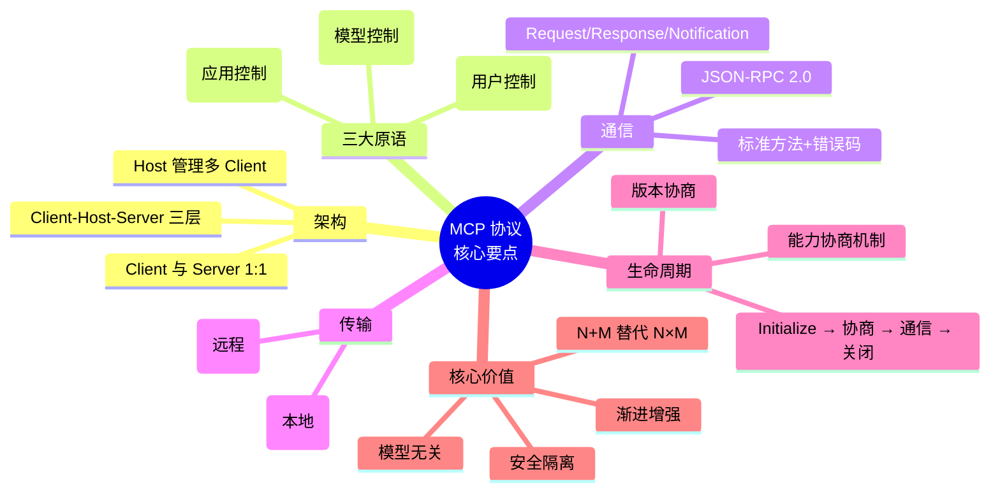

### 10.4 与系列文档的关系

| 文档 | 主题 | 与本文关系 |
|------|------|-----------|
| [89号:FC vs API](./89FunctionCalling与普通API调用核心区别系统性对比深度解析.md) | 调用方式对比 | 本文是其"MCP 协议"部分的深入 |
| [90号:动态工具选择](./90Agent动态工具选择决策机制完整实现深度解析.md) | 工具选择 | MCP 的 `tools/list` 支持动态发现 |
| [91号:Schema 设计](./91ToolSchema完整设计规范深度解析.md) | Schema 规范 | MCP 的 inputSchema 基于 JSON Schema |
| [92号:参数错误处理](./92工具调用参数错误系统性处理方案深度解析.md) | 错误处理 | MCP 的 JSON-RPC 错误码体系 |
| [95号:Tool Registry](./95企业级ToolRegistry系统架构设计完整方案深度解析.md) | 工具注册表 | MCP Registry 是云端工具发现 |
| **本文** | **MCP 协议详解** | **工具调用的"标准化协议层"** |

### 10.5 一句话总结

> **MCP 是 AI 应用层的"USB-C 接口"——它用 Client-Host-Server 架构、JSON-RPC 2.0 消息、三大原语(Tools/Resources/Prompts)和双传输层(stdio/HTTP),将 N×M 的集成难题降维为 N+M。一次开发,多模型通用,这就是标准化的力量。**

---

> **参考来源:**
> - [MCP Architecture Overview](https://modelcontextprotocol.io/docs/learn/architecture) — MCP 官方架构文档(三大原语、Client-Host-Server 架构)
> - [MCP Specification 2025-11-25](https://modelcontextprotocol.io/specification/2025-11-25/basic/index.md) — MCP 最新规范(JSON-RPC 消息格式、生命周期、能力协商)
> - [MCP Architecture Specification 2024-11-05](https://modelcontextprotocol.info/specification/2024-11-05/architecture/) — MCP 架构规范(设计原则、消息类型、能力协商)
> - [One Year of MCP: November 2025 Spec Release](https://modelcontextprotocol.info/blog/first-mcp-anniversary/) — MCP 一周年报告(Tasks 特性、生态发展)
> - [MCP vs APIs, Agents SDK, A2A & More](https://www.mcpserverspot.com/learn/fundamentals/mcp-vs-traditional-apis) — MCP 与传统 API/Function Calling 对比(2026-02 更新)
> - [MCP vs OpenAI Function Calling vs LangChain Tools](https://github.com/stoa-platform/stoa-docs/blob/b7badc12b9537e604a2c44dfba1f0d66c0e25cd1/blog/2026-02-12-mcp-vs-openai-function-calling-vs-langchain.md) — 三大方案架构对比(2026)
> - [Agent基础:OpenAI/Anthropic/MCP 三大协议对比](https://blog.csdn.net/sweet_ran/article/details/156240780) — 中文协议对比解析(2026-08)
> - [AI Agent 工具调用四范式对比](https://blog.csdn.net/qq_36411553/article/details/162838690) — Function Calling/MCP/CLI/Skills 四范式(2026-07)
> - [Model Context Protocol: A Technical and Historical Analysis](https://uploaded-pdfs-delete-180-days.s3.amazonaws.com/xt1z-2026-03-22_03_22_23-mcp-technical-histirical-analysis-report.pdf) — MCP 技术与历史分析报告(2026-03)
