# MCP Server 完整实现方法深度解析

> **文档定位**:本文是 Tool Calling / Function Calling 系列的 **MCP Server 实战落地篇**。在 [96号文档](./96MCP协议完整深度解析.md) 解析 MCP 协议规范、[95号文档](./95企业级ToolRegistry系统架构设计完整方案深度解析.md) 设计工具治理平台的基础上,本文回答一个工程导向的核心问题:**"如何从零到一开发一个生产可用的 MCP Server?"** —— 系统覆盖开发流程、技术架构选择、核心功能模块设计、依赖库、接口规范、关键实现步骤、完整代码示例与最佳实践建议。
>
> **配套规范**:本文基于 MCP 2025-11-25 规范,使用官方 Python SDK(`mcp` 包)与 TypeScript SDK(`@modelcontextprotocol/sdk`),并通过 stdio 与 Streamable HTTP 双传输层演示完整可运行实现。
>
> **阅读建议**:建议先读 [96号文档](./96MCP协议完整深度解析.md) 建立协议认知,再读本文动手实现。

---

## 目录

- [一、文档概述与定位](#一文档概述与定位)
- [二、MCP Server 开发流程总览](#二mcp-server-开发流程总览)
- [三、技术架构选择](#三技术架构选择)
- [四、核心功能模块设计](#四核心功能模块设计)
- [五、依赖库与开发环境](#五依赖库与开发环境)
- [六、接口规范实现](#六接口规范实现)
- [七、关键实现步骤详解](#七关键实现步骤详解)
- [八、完整代码示例](#八完整代码示例)
- [九、测试与调试](#九测试与调试)
- [十、最佳实践建议](#十最佳实践建议)
- [十一、生产部署与运维](#十一生产部署与运维)
- [十二、与系列文档关系](#十二与系列文档关系)

---

## 一、文档概述与定位

### 1.1 为什么需要本文

96号文档解决了"**MCP 是什么、为什么**"的问题,但要让 MCP 真正落地,工程师还需要回答一系列"**怎么做**"的工程问题:

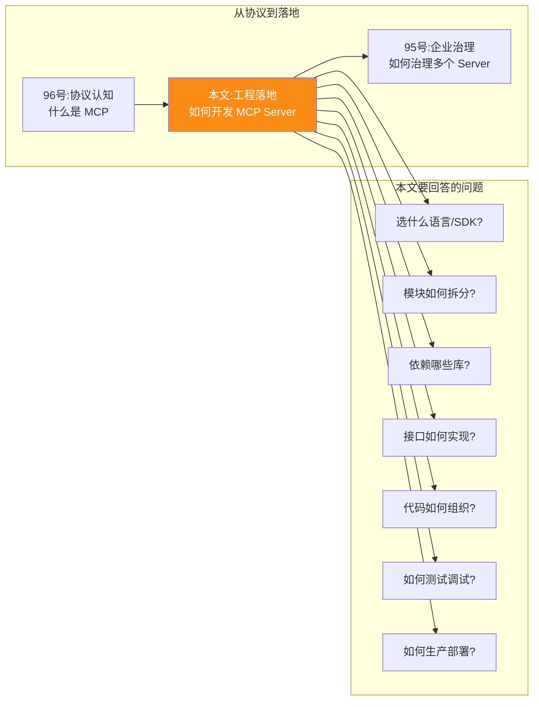

### 1.2 本文覆盖的核心内容

| 维度 | 内容 | 章节 |
|------|------|------|
| **开发流程** | 从需求分析到上线运维的完整流程 | 第二章 |
| **技术架构** | 语言选型、SDK 选型、传输层选型、分层架构 | 第三章 |
| **模块设计** | 工具管理、资源管理、提示管理、会话管理、错误处理、安全管控 | 第四章 |
| **依赖库** | Python/TS SDK 及配套库清单 | 第五章 |
| **接口规范** | `initialize` / `tools/*` / `resources/*` / `prompts/*` 的实现 | 第六章 |
| **实现步骤** | 7 个关键步骤的逐步实现 | 第七章 |
| **代码示例** | Python + TS 双语言完整示例 | 第八章 |
| **测试调试** | MCP Inspector、单元测试、集成测试 | 第九章 |
| **最佳实践** | Schema 设计、错误处理、性能、安全等 10 条建议 | 第十章 |
| **生产部署** | 容器化、网关、监控、灰度 | 第十一章 |

### 1.3 适用读者

- **AI 应用工程师**:正在为企业 Agent 开发工具连接层
- **平台工程师**:需要构建企业级 MCP Server 网关
- **工具开发者**:希望将自己的工具/服务暴露给 AI 应用
- **架构师**:评估 MCP 在企业内的落地方案

### 1.4 阅读路径建议

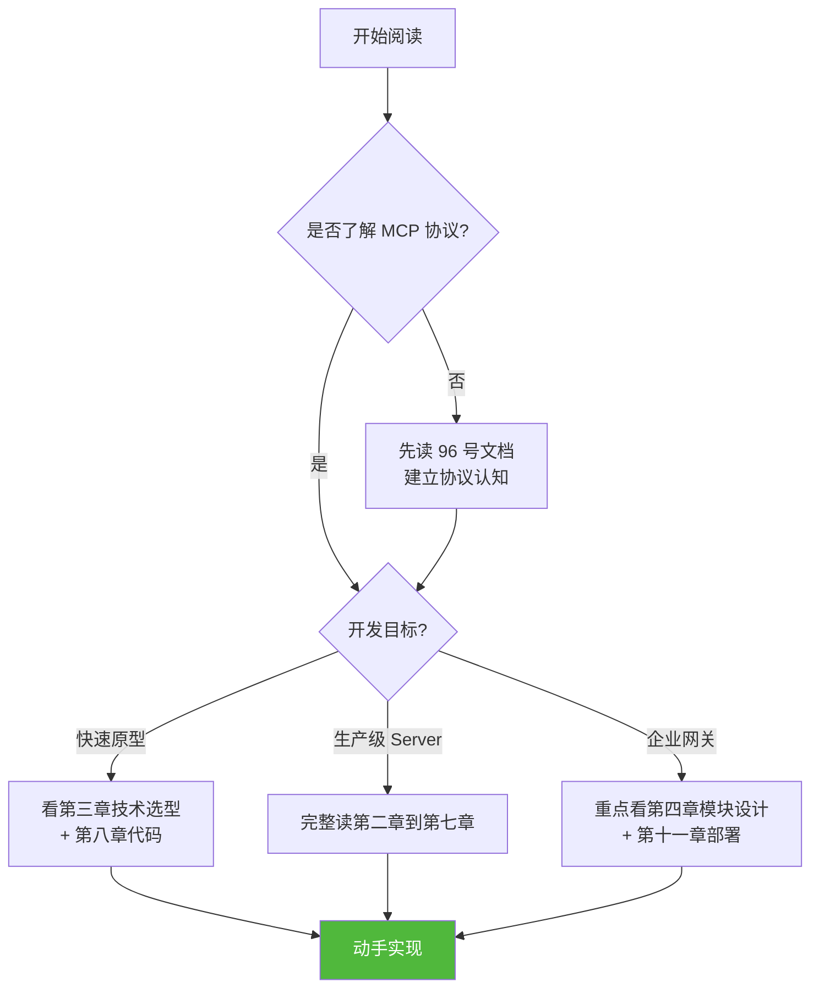

---

## 二、MCP Server 开发流程总览

### 2.1 完整开发生命周期

一个生产级 MCP Server 的开发生命周期涵盖 7 个阶段:

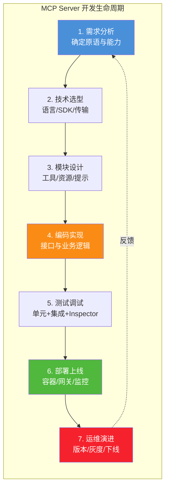

### 2.2 阶段一:需求分析

**目标**:明确 Server 要暴露哪些原语(Tools/Resources/Prompts)、需要哪些能力(动态变更、订阅、日志)。

**需求分析清单**:

| 问题 | 输出 | 示例 |
|------|------|------|
| 暴露哪些工具? | 工具列表 + 输入输出 Schema | `search_issues` / `create_issue` |
| 暴露哪些资源? | 资源 URI 模板 + 内容类型 | `repo://issues/{id}` |
| 暴露哪些提示? | 提示模板名 + 参数 | `code_review(language, focus)` |
| 工具是否动态变更? | 是否启用 `tools.listChanged` | 是(热插拔工具) |
| 资源是否需要订阅? | 是否启用 `resources.subscribe` | 是(实时推送变更) |
| 传输方式? | stdio / HTTP / 两者 | 本地 stdio + 远程 HTTP |
| 是否需要认证? | OAuth 2.1 / 无 | 远程 Server 必须认证 |
| 是否多租户? | 租户隔离方案 | 按组织 ID 隔离 |

### 2.3 阶段二:技术选型

详见 [第三章](#三技术架构选择)。

### 2.4 阶段三:模块设计

详见 [第四章](#四核心功能模块设计)。

### 2.5 阶段四:编码实现

详见 [第七章关键实现步骤](#七关键实现步骤详解) 与 [第八章代码示例](#八完整代码示例)。

### 2.6 阶段五:测试调试


### 2.7 阶段六:部署上线

详见 [第十一章生产部署](#十一生产部署与运维)。

### 2.8 阶段七:运维演进

- **版本管理**:用 `serverInfo.version` 标识,语义化版本控制
- **灰度发布**:通过 Gateway 路由权重实现
- **能力下线**:提前通知 Client,先返回 `deprecated` 标记再移除
- **协议升级**:遵循 `protocolVersion` 协商机制,新旧版本并行

---

## 三、技术架构选择

### 3.1 编程语言选型

MCP 官方提供多语言 SDK,主流选择如下:

| 语言 | 官方 SDK | 适用场景 | 优势 | 劣势 |
|------|---------|---------|------|------|
| **Python** | `mcp`(FastMCP) | AI/数据/AI 工具 | 生态最全、AI 库丰富、开发快 | 性能一般、GIL 限制 |
| **TypeScript** | `@modelcontextprotocol/sdk` | Web/IDE/前端工具 | 类型安全、Node.js 异步、生态强 | CPU 密集型弱 |
| **Java** | `mcp-java-sdk`(社区) | 企业后端 | 性能稳定、企业生态成熟 | 启动慢、SDK 成熟度一般 |
| **Go** | `mcp-go`(社区) | 高并发/云原生 | 性能强、部署简单、并发原生 | AI 生态弱 |
| **Rust** | `rmcp`(社区) | 极致性能/边缘 | 零成本抽象、内存安全 | 开发慢、生态弱 |

**选型决策树**:

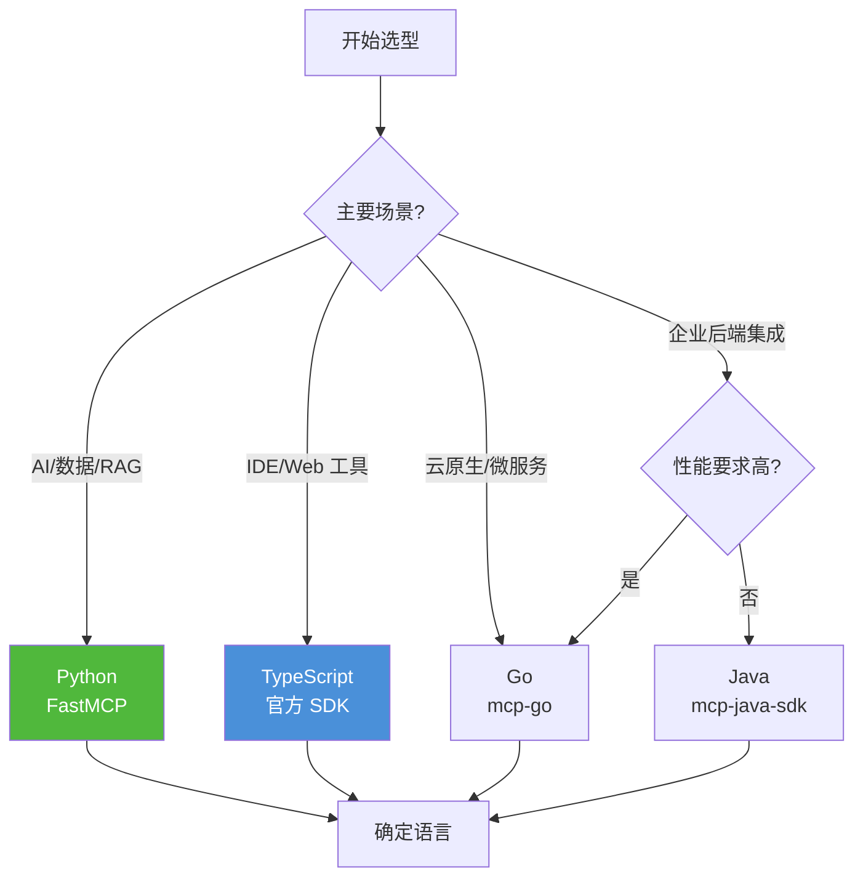

**本文重点演示 Python(FastMCP) 与 TypeScript**,因为它们是 MCP 官方主力维护的两个 SDK。

### 3.2 SDK 选型对比

#### 3.2.1 Python SDK 两种风格

Python SDK 提供两种开发风格,**高阶 FastMCP** 与 **低阶 Server**:

| 维度 | FastMCP(高阶) | Server(低阶) |
|------|---------------|--------------|
| **API 风格** | 装饰器(`@mcp.tool()`) | 手动注册(`set_request_handler`) |
| **学习成本** | 极低,类似 FastAPI | 中,需理解协议细节 |
| **灵活性** | 中(受框架约束) | 高(完全可控) |
| **Schema 生成** | 自动从类型注解生成 | 手动构造 JSON Schema |
| **适用场景** | 90% 场景,快速开发 | 特殊协议定制、教学示范 |

```python
# ============ FastMCP 风格(推荐)============
from mcp.server.fastmcp import FastMCP

mcp = FastMCP("MyServer")

@mcp.tool()
def add(a: int, b: int) -> int:
    """两数相加"""
    return a + b

# ============ 低阶 Server 风格 ============
from mcp.server import Server
from mcp.types import Tool, TextContent

server = Server("MyServer")

@server.list_tools()
async def list_tools() -> list[Tool]:
    return [Tool(
        name="add",
        description="两数相加",
        inputSchema={
            "type": "object",
            "properties": {"a": {"type": "integer"}, "b": {"type": "integer"}},
            "required": ["a", "b"]
        }
    )]

@server.call_tool()
async def call_tool(name: str, arguments: dict) -> list[TextContent]:
    if name == "add":
        return [TextContent(type="text", text=str(arguments["a"] + arguments["b"]))]
```

#### 3.2.2 TypeScript SDK 两种风格

| 风格 | 包 | 适用 |
|------|----|------|
| **高阶 McpServer** | `@modelcontextprotocol/sdk/server/mcp.js` | 推荐,类型安全 |
| **低阶 Server** | `@modelcontextprotocol/sdk/server/index.js` | 完全控制 |

```typescript
// ============ 高阶 McpServer 风格(推荐)============
import { McpServer } from "@modelcontextprotocol/sdk/server/mcp.js";
import { z } from "zod";

const server = new McpServer({ name: "MyServer", version: "1.0.0" });

server.tool("add", { a: z.number(), b: z.number() }, async ({ a, b }) => ({
  content: [{ type: "text", text: String(a + b) }]
}));
```

### 3.3 传输层选型

| 传输方式 | 部署位置 | 连接 | 延迟 | 认证 | 适用 |
|---------|---------|------|------|------|------|
| **stdio** | 本地 | 1:1 子进程 | 极低 | 环境变量 | IDE/桌面应用 |
| **Streamable HTTP** | 远程 | N:1 共享 | 中 | OAuth 2.1 | 云端 SaaS |
| **InMemory**(测试) | 进程内 | 直接调用 | 零 | 无 | 单元测试 |

**生产建议**:**同一份业务代码同时支持 stdio + HTTP**,通过启动参数切换,既能在本地 IDE 使用,又能在云端服务部署。

### 3.4 整体分层架构

一个生产级 MCP Server 的推荐分层架构:

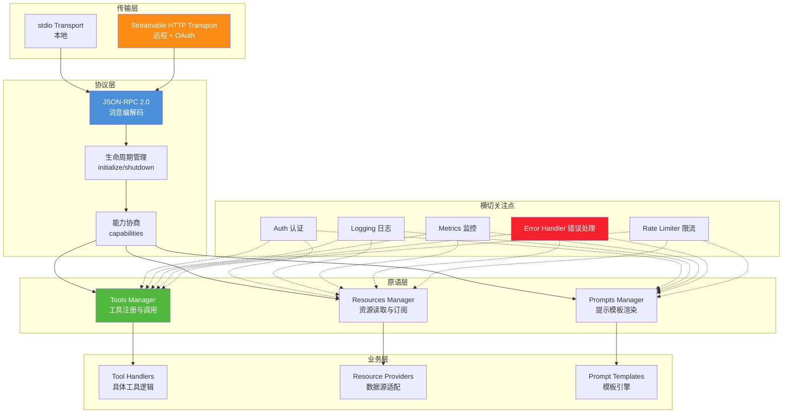

### 3.5 与传统 Web 服务的架构差异

| 维度 | 传统 REST 服务 | MCP Server |
|------|--------------|-----------|
| **通信协议** | HTTP + 自定义 JSON | JSON-RPC 2.0 |
| **接口发现** | 静态 OpenAPI 文档 | 运行时 `tools/list` |
| **状态管理** | 通常无状态 | 有状态会话(Session) |
| **通信方向** | 单向请求-响应 | 双向(可主动推送) |
| **Schema 受众** | 人类开发者 | LLM(AI) |
| **错误模型** | HTTP 状态码 | JSON-RPC 错误码 |

**关键洞察**:MCP Server 不是"另一个 REST 服务",而是**面向 AI 的协议层**。Schema 描述要写给 LLM 看,错误码要让 LLM 能理解并恢复。

---

## 四、核心功能模块设计

### 4.1 模块划分总览

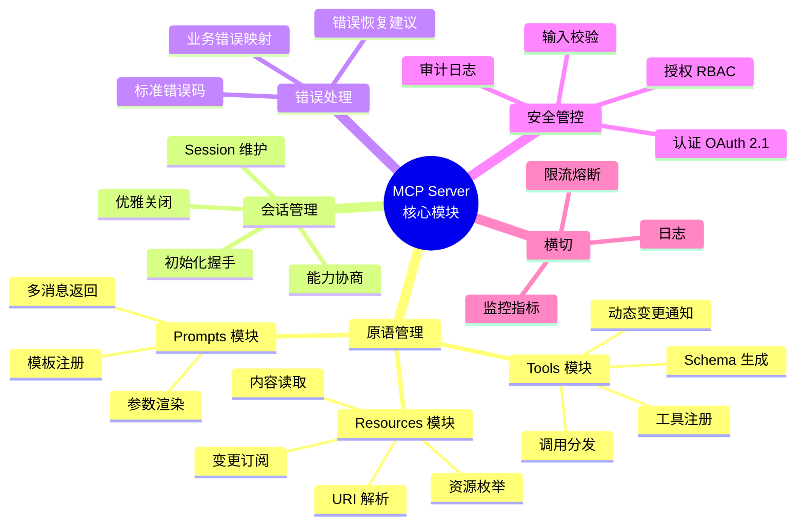

### 4.2 Tools 模块设计

Tools 是 MCP Server 最常用的原语,其模块设计要点:

#### 4.2.1 工具注册中心

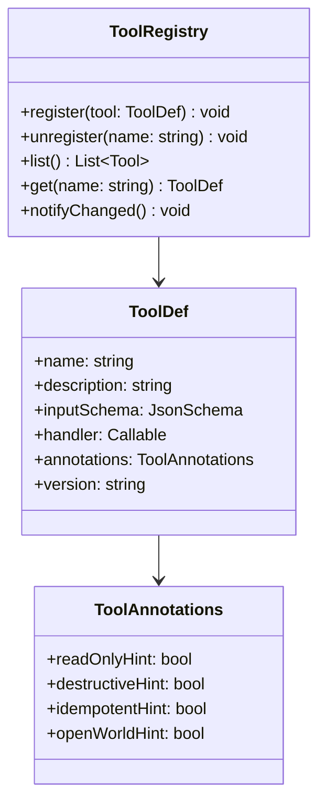

**ToolAnnotations** 是 2025-06-18 规范引入的元数据,用于声明工具的副作用特性,帮助 Host 做 UI 提示和权限决策:

| 注解 | 含义 | UI 影响 |
|------|------|---------|
| `readOnlyHint` | 只读,无副作用 | 可自动批准 |
| `destructiveHint` | 破坏性操作 | 需用户二次确认 |
| `idempotentHint` | 幂等可重试 | 失败可自动重试 |
| `openWorldHint` | 与外部世界交互 | 需明确授权 |

#### 4.2.2 工具调用分发流程

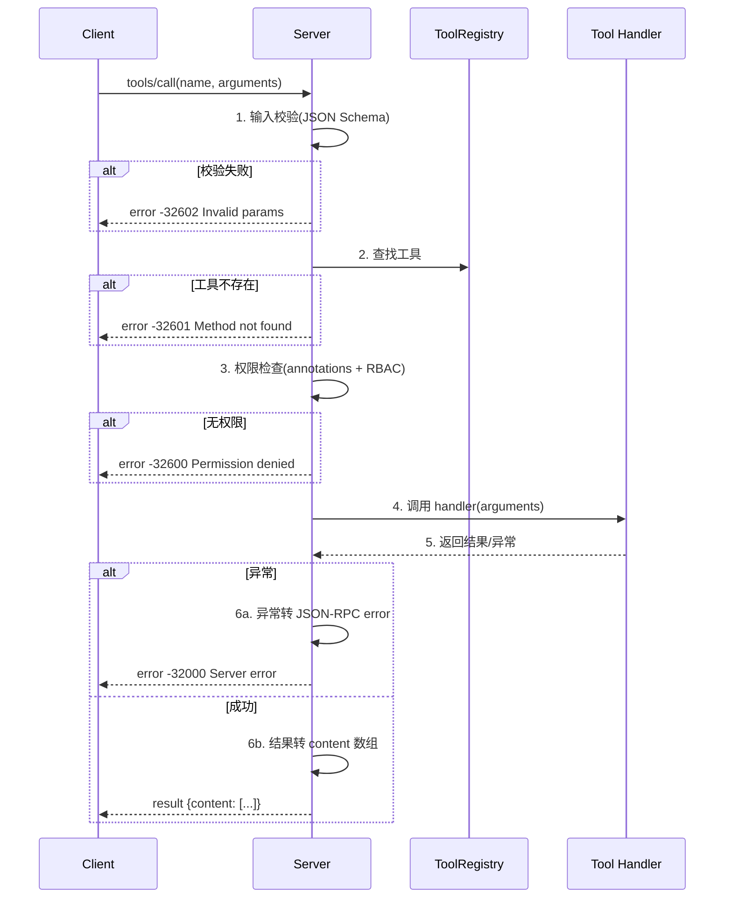

#### 4.2.3 工具返回内容类型

工具返回的 `content` 数组支持多种类型,适配不同模态:

```python
from mcp.types import TextContent, ImageContent, EmbeddedResource

# 文本内容(最常用)
TextContent(type="text", text="Found 3 issues...")

# 图片内容(截图/图表)
ImageContent(type="image", data="<base64>", mimeType="image/png")

# 嵌入资源(引用上下文)
EmbeddedResource(type="resource", resource={
    "uri": "issue://123",
    "mimeType": "application/json",
    "text": '{"id": 123, "title": "..."}'
})
```

### 4.3 Resources 模块设计

Resources 是只读数据源,模块设计要点:

#### 4.3.1 资源 URI 设计

```mermaid
flowchart LR
    subgraph URI 模板设计
        T1[静态 URI<br/>file:///project/README.md]
        T2[模板 URI<br/>repo://issues/{id}]
        T3[列表 URI<br/>db://tables/users/rows]
    end
    
    subgraph 协议前缀
        P1[file:// 文件系统]
        P2[repo:// 代码仓库]
        P3[db:// 数据库]
        P4[http:// 网络资源]
        P5[memory:// 内存数据]
    end
    
    T1 --> P1
    T2 --> P2
    T3 --> P3
```

#### 4.3.2 资源订阅机制

启用 `resources.subscribe` 后,Server 可在资源变更时主动推送:

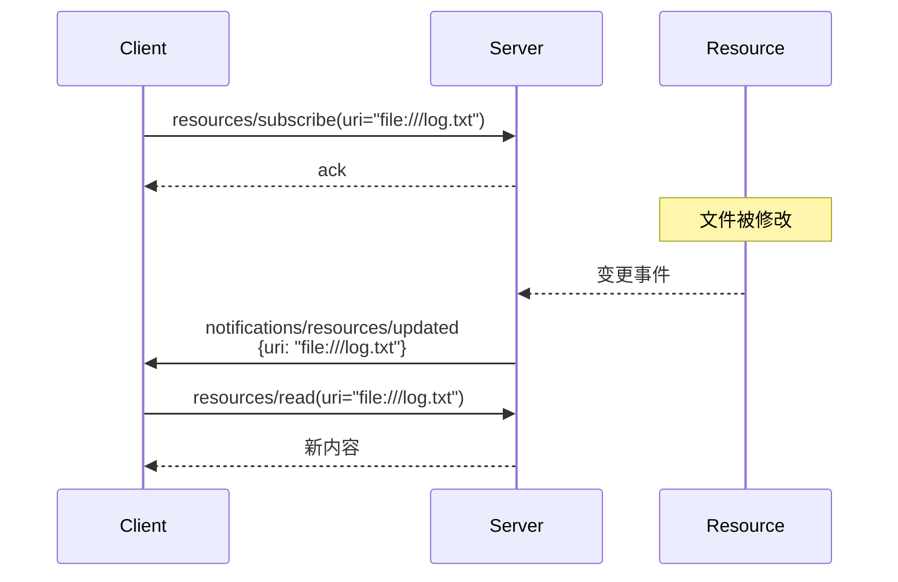

### 4.4 Prompts 模块设计

Prompts 是用户控制的提示模板,模块设计要点:

- **参数化模板**:支持参数填充
- **多消息返回**:一次返回多轮对话消息
- **上下文嵌入**:可在模板中引用资源

```python
@mcp.prompt()
def code_review(file_path: str, focus: str = "general") -> list:
    """代码审查提示模板"""
    return [
        {"role": "user", "content": f"请审查文件 {file_path},重点关注:{focus}"},
        {"role": "user", "content": f"文件内容:\n{read_file(file_path)}"}
    ]
```

### 4.5 会话管理模块

#### 4.5.1 会话状态机

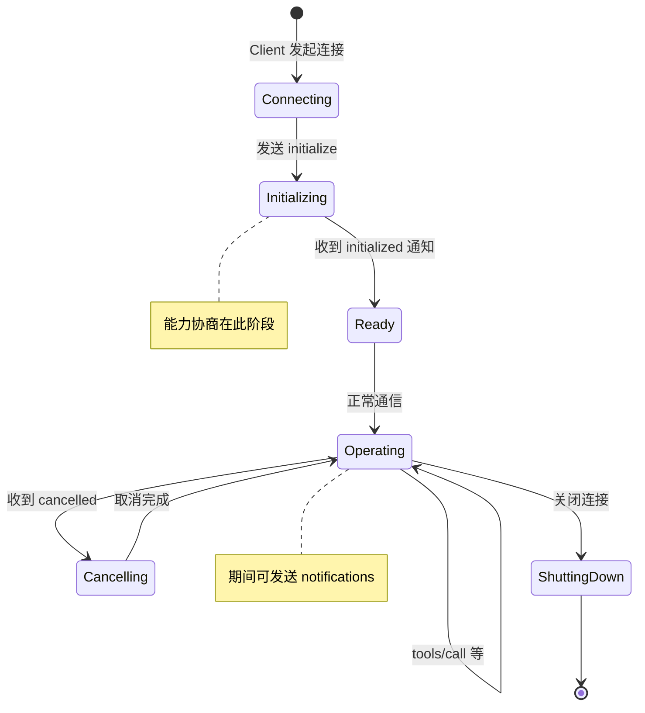

#### 4.5.2 会话存储设计

| 传输方式 | 会话标识 | 存储位置 | 生命周期 |
|---------|---------|---------|---------|
| stdio | 进程本身 | 内存 | 进程生命周期 |
| Streamable HTTP | `Mcp-Session-Id` | Server 端 Session Store | 可配置(默认 1h) |

**生产级 HTTP Session 存储方案**:

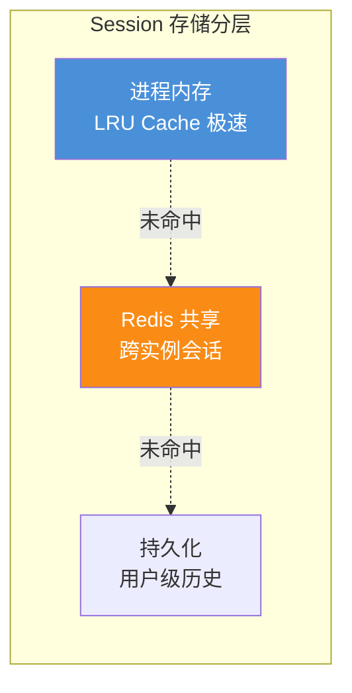

### 4.6 错误处理模块

#### 4.6.1 错误分层模型

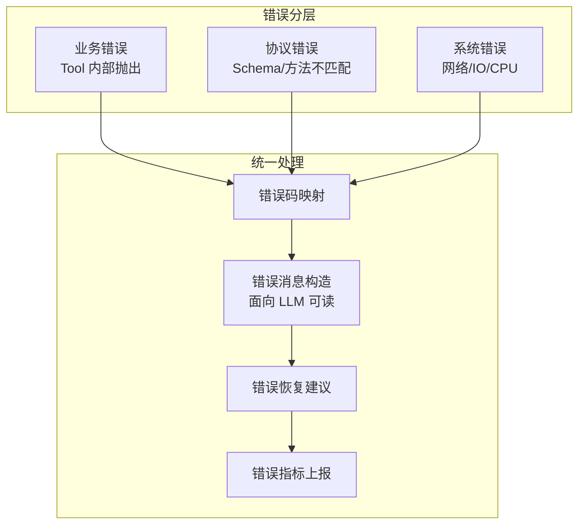

#### 4.6.2 错误码映射表

| 业务错误 | JSON-RPC 错误码 | 说明 |
|---------|----------------|------|
| 参数缺失/类型错 | `-32602` | Invalid params |
| 工具不存在 | `-32601` | Method not found |
| 权限不足 | `-32600` | Invalid Request |
| 上游 API 超时 | `-32000` | Server error + retryable:true |
| 上游 API 4xx | `-32000` | Server error + 原始状态码 |
| 内部异常 | `-32603` | Internal error |
| 限流 | `-32000` | Server error + retryAfter 字段 |

**关键实践**:错误消息要**面向 LLM 可读**,告诉 LLM 错误原因和下一步建议,而不是堆栈跟踪。

```python
# 错误示例:对 LLM 友好 vs 不友好
# ❌ 不友好
{"error": {"code": -32603, "message": "NullPointerException at line 42"}}

# ✅ 友好
{"error": {
    "code": -32000,
    "message": "GitHub API rate limit exceeded. Please retry after 60 seconds.",
    "data": {
        "retryable": True,
        "retryAfter": 60,
        "suggestion": "等待 60 秒后重试,或减少调用频率"
    }
}}
```

### 4.7 安全管控模块

详见 [94号文档](./94Agent危险工具调用安全管控机制完整设计方案深度解析.md),本文聚焦 MCP Server 特定的安全要点:

| 安全层 | 实现要点 |
|--------|---------|
| **传输安全** | HTTPS/TLS、stdio 进程隔离 |
| **认证** | OAuth 2.1(HTTP)、环境变量凭证(stdio) |
| **授权** | 基于 ToolAnnotations + RBAC |
| **输入校验** | JSON Schema 严格校验 |
| **输出过滤** | 敏感数据脱敏(密钥/token) |
| **审计** | 每次工具调用记录日志 |
| **限流** | 按 Client / Tool 维度限流 |

---

## 五、依赖库与开发环境

### 5.1 Python 依赖库清单

#### 5.1.1 核心依赖

```txt
# === MCP 核心 SDK(2025-11-25 规范)===
mcp>=1.0.0                    # 官方 Python SDK,含 FastMCP

# === Web 框架(Streamable HTTP 传输)===
uvicorn>=0.30.0               # ASGI 服务器
starlette>=0.37.0             # ASGI 框架(SDK 内部依赖)
fastapi>=0.110.0              # 可选,自定义 HTTP 路由时使用

# === Schema 校验 ===
pydantic>=2.5.0               # 数据模型校验
jsonschema>=4.20.0            # JSON Schema 校验(FastMCP 内部用)

# === 异步与并发 ===
anyio>=4.0.0                  # 异步抽象层
asyncio-atexit>=1.0.0         # 异步退出处理

# === 日志与监控 ===
structlog>=24.0.0             # 结构化日志
prometheus-client>=0.19.0     # Prometheus 指标

# === 工具库 ===
httpx>=0.27.0                 # 异步 HTTP 客户端(调用上游 API)
python-dotenv>=1.0.0          # 环境变量加载
```

#### 5.1.2 完整 requirements.txt

```txt
# MCP Server Python 依赖 - 生产环境
mcp>=1.0.0
uvicorn[standard]>=0.30.0
starlette>=0.37.0
pydantic>=2.5.0
jsonschema>=4.20.0
anyio>=4.0.0
structlog>=24.0.0
prometheus-client>=0.19.0
httpx>=0.27.0
python-dotenv>=1.0.0

# 测试依赖
pytest>=8.0.0
pytest-asyncio>=0.23.0
pytest-cov>=4.1.0
respx>=0.20.0                 # httpx mock
```

#### 5.1.3 开发工具

```txt
# dev-requirements.txt
ruff>=0.3.0                   # 代码检查与格式化
mypy>=1.8.0                   # 类型检查
pre-commit>=3.6.0             # Git 钩子
```

### 5.2 TypeScript 依赖库清单

#### 5.2.1 package.json

```json
{
  "name": "my-mcp-server",
  "version": "1.0.0",
  "type": "module",
  "scripts": {
    "dev": "tsx watch src/index.ts",
    "build": "tsc",
    "start": "node dist/index.js",
    "test": "vitest",
    "inspect": "mcp-inspector node dist/index.js"
  },
  "dependencies": {
    "@modelcontextprotocol/sdk": "^1.0.0",
    "zod": "^3.22.0",
    "express": "^4.18.0",
    "pino": "^8.17.0",
    "prom-client": "^15.1.0",
    "undici": "^6.6.0",
    "dotenv": "^16.4.0"
  },
  "devDependencies": {
    "typescript": "^5.3.0",
    "tsx": "^4.6.0",
    "vitest": "^1.2.0",
    "@types/node": "^20.10.0",
    "@types/express": "^4.17.0"
  }
}
```

### 5.3 开发环境搭建

#### 5.3.1 Python 环境

```bash
# 1. 创建虚拟环境
python -m venv .venv
source .venv/bin/activate  # Linux/Mac
# .venv\Scripts\activate   # Windows

# 2. 安装依赖
pip install -r requirements.txt
pip install -r dev-requirements.txt

# 3. 安装 MCP Inspector(调试工具)
npm install -g @modelcontextprotocol/inspector

# 4. 验证安装
python -c "import mcp; print(mcp.__version__)"
```

#### 5.3.2 TypeScript 环境

```bash
# 1. 初始化项目
mkdir my-mcp-server && cd my-mcp-server
npm init -y

# 2. 安装依赖
npm install @modelcontextprotocol/sdk zod
npm install -D typescript tsx vitest @types/node

# 3. 配置 tsconfig.json
cat > tsconfig.json <<'EOF'
{
  "compilerOptions": {
    "target": "ES2022",
    "module": "ES2022",
    "moduleResolution": "bundler",
    "esModuleInterop": true,
    "strict": true,
    "outDir": "dist",
    "rootDir": "src"
  },
  "include": ["src/**/*"]
}
EOF

# 4. 安装 Inspector
npm install -g @modelcontextprotocol/inspector
```

### 5.4 项目结构推荐

#### 5.4.1 Python 项目结构

```
my-mcp-server/
├── pyproject.toml             # 项目元数据
├── requirements.txt           # 依赖清单
├── README.md
├── src/
│   └── my_mcp_server/
│       ├── __init__.py
│       ├── __main__.py        # 入口:python -m my_mcp_server
│       ├── server.py          # FastMCP 实例与启动
│       ├── tools/             # 工具模块
│       │   ├── __init__.py
│       │   ├── issue_tool.py  # Issue 管理
│       │   └── repo_tool.py   # 仓库操作
│       ├── resources/         # 资源模块
│       │   ├── __init__.py
│       │   └── file_resource.py
│       ├── prompts/           # 提示模板
│       │   ├── __init__.py
│       │   └── review_prompt.py
│       ├── core/              # 核心组件
│       │   ├── __init__.py
│       │   ├── auth.py        # 认证
│       │   ├── errors.py      # 错误处理
│       │   ├── logging.py     # 日志
│       │   └── metrics.py     # 监控
│       └── clients/           # 上游客户端
│           ├── __init__.py
│           └── github_client.py
├── tests/
│   ├── __init__.py
│   ├── test_tools.py
│   ├── test_resources.py
│   └── test_integration.py
└── Dockerfile
```

#### 5.4.2 TypeScript 项目结构

```
my-mcp-server/
├── package.json
├── tsconfig.json
├── README.md
├── src/
│   ├── index.ts               # 入口
│   ├── server.ts              // McpServer 实例
│   ├── tools/
│   │   ├── index.ts
│   │   ├── issue-tool.ts
│   │   └── repo-tool.ts
│   ├── resources/
│   │   └── file-resource.ts
│   ├── prompts/
│   │   └── review-prompt.ts
│   ├── core/
│   │   ├── auth.ts
│   │   ├── errors.ts
│   │   ├── logger.ts
│   │   └── metrics.ts
│   └── clients/
│       └── github-client.ts
├── tests/
│   ├── tools.test.ts
│   └── integration.test.ts
└── Dockerfile
```

---

## 六、接口规范实现

MCP Server 必须实现的标准 RPC 方法,按生命周期阶段分组:

### 6.1 接口规范总览

```mermaid
flowchart TB
    subgraph 生命周期接口
        L1[initialize<br/>初始化握手]
        L2[notifications/initialized<br/>确认就绪]
        L3[ping<br/>心跳检测]
        L4[shutdown<br/>关闭(可选)]
    end
    
    subgraph Tools 接口
        T1[tools/list<br/>列出工具]
        T2[tools/call<br/>调用工具]
        T3[notifications/tools/list_changed<br/>工具变更]
    end
    
    subgraph Resources 接口
        R1[resources/list<br/>列出资源]
        R2[resources/read<br/>读取资源]
        R3[resources/subscribe<br/>订阅资源]
        R4[notifications/resources/updated<br/>资源变更]
    end
    
    subgraph Prompts 接口
        P1[prompts/list<br/>列出模板]
        P2[prompts/get<br/>获取模板]
    end
    
    subgraph 横切接口
        C1[notifications/progress<br/>进度通知]
        C2[notifications/cancelled<br/>取消通知]
        C3[logging/setLevel<br/>日志级别]
    end
    
    style L1 fill:#4a90d9,color:#fff
    style T2 fill:#fa8c16,color:#fff
    style R2 fill:#50b83c,color:#fff
```

### 6.2 `initialize` 接口规范

**作用**:Client 与 Server 的握手,协商协议版本与能力。

**请求参数**:

```json
{
  "jsonrpc": "2.0",
  "id": 1,
  "method": "initialize",
  "params": {
    "protocolVersion": "2025-11-25",
    "capabilities": {
      "roots": { "listChanged": true },
      "sampling": {}
    },
    "clientInfo": { "name": "MyClient", "version": "1.0.0" }
  }
}
```

**响应结果**:

```json
{
  "jsonrpc": "2.0",
  "id": 1,
  "result": {
    "protocolVersion": "2025-11-25",
    "capabilities": {
      "tools": { "listChanged": true },
      "resources": { "subscribe": true, "listChanged": true },
      "prompts": { "listChanged": true },
      "logging": {}
    },
    "serverInfo": { "name": "MyMcpServer", "version": "1.0.0" }
  }
}
```

**FastMCP 自动处理**:FastMCP 自动实现 `initialize`,只需在创建实例时声明能力:

```python
from mcp.server.fastmcp import FastMCP

mcp = FastMCP(
    name="MyMcpServer",
    version="1.0.0",
    # 能力声明(部分能力由注册的原语自动推断)
)
```

### 6.3 `tools/list` 接口规范

**响应结构**:

```json
{
  "jsonrpc": "2.0",
  "id": 2,
  "result": {
    "tools": [
      {
        "name": "search_issues",
        "description": "Search GitHub issues...",
        "inputSchema": {
          "type": "object",
          "properties": { "query": { "type": "string" } },
          "required": ["query"]
        },
        "annotations": {
          "readOnlyHint": true,
          "openWorldHint": true
        }
      }
    ],
    "nextCursor": "base64-cursor-token"
  }
}
```

**分页**:`nextCursor` 用于分页,Client 传入 `cursor` 参数获取下一页。

### 6.4 `tools/call` 接口规范

**请求**:

```json
{
  "jsonrpc": "2.0",
  "id": 3,
  "method": "tools/call",
  "params": {
    "name": "search_issues",
    "arguments": { "query": "login bug", "state": "open" }
  }
}
```

**成功响应**:

```json
{
  "jsonrpc": "2.0",
  "id": 3,
  "result": {
    "content": [
      { "type": "text", "text": "Found 3 issues:\n1. Login bug #123\n..." }
    ],
    "isError": false
  }
}
```

**工具内业务错误响应**(`isError: true`,**不是** JSON-RPC error):

```json
{
  "jsonrpc": "2.0",
  "id": 3,
  "result": {
    "content": [
      { "type": "text", "text": "Error: GitHub API returned 404. Repository not found." }
    ],
    "isError": true
  }
}
```

**关键区别**:
- **工具业务错误**(如 API 404):用 `isError: true`,内容描述错误,LLM 可读取并恢复
- **协议错误**(如参数缺失):用 JSON-RPC `error`,表示协议层失败

### 6.5 `resources/list` 与 `resources/read`

**list 响应**:

```json
{
  "result": {
    "resources": [
      {
        "uri": "file:///project/README.md",
        "name": "README.md",
        "description": "Project readme",
        "mimeType": "text/markdown"
      }
    ]
  }
}
```

**read 响应**:

```json
{
  "result": {
    "contents": [
      {
        "uri": "file:///project/README.md",
        "mimeType": "text/markdown",
        "text": "# Project\n..."
      }
    ]
  }
}
```

### 6.6 `prompts/list` 与 `prompts/get`

**list 响应**:

```json
{
  "result": {
    "prompts": [
      {
        "name": "code_review",
        "description": "Review code for bugs",
        "arguments": [
          { "name": "language", "required": true },
          { "name": "focus", "required": false }
        ]
      }
    ]
  }
}
```

**get 响应**(返回多消息):

```json
{
  "result": {
    "messages": [
      {
        "role": "user",
        "content": { "type": "text", "text": "Please review this code..." }
      }
    ]
  }
}
```

---

## 七、关键实现步骤详解

### 7.1 步骤一:创建 Server 实例与能力声明

```python
# server.py
from mcp.server.fastmcp import FastMCP
import structlog

logger = structlog.get_logger()

# 创建 Server 实例
mcp = FastMCP(
    name="GitHubMcpServer",
    version="1.0.0",
    # 可选:自定义指令,告诉 Client 关于本 Server 的额外信息
    instructions=(
        "This server provides GitHub repository management tools. "
        "All operations require authentication via GITHUB_TOKEN env var."
    ),
)

logger.info("mcp_server_created", name="GitHubMcpServer", version="1.0.0")
```

### 7.2 步骤二:定义工具与 Schema

```python
# tools/issue_tool.py
from mcp.server.fastmcp import FastMCP
from mcp.types import ToolAnnotations
from typing import Optional
from pydantic import BaseModel, Field
from ..clients.github_client import GitHubClient

# FastMCP 自动从类型注解生成 inputSchema
def register_issue_tools(mcp: FastMCP, client: GitHubClient):
    
    @mcp.tool(
        name="search_issues",
        description=(
            "Search GitHub issues by keyword. "
            "Use this when the user wants to find existing issues. "
            "Returns issue number, title, state, and assignee."
        ),
        annotations=ToolAnnotations(
            readOnlyHint=True,       # 只读,无副作用
            openWorldHint=True,      # 与外部 GitHub API 交互
        )
    )
    async def search_issues(
        query: str = Field(..., description="Search keywords"),
        state: str = Field("open", description="Issue state: open|closed|all"),
        limit: int = Field(10, ge=1, le=100, description="Max results")
    ) -> dict:
        """搜索 GitHub Issues"""
        try:
            issues = await client.search_issues(query, state, limit)
            return {
                "total": len(issues),
                "issues": [
                    {
                        "number": i.number,
                        "title": i.title,
                        "state": i.state,
                        "assignee": i.assignee
                    }
                    for i in issues
                ]
            }
        except Exception as e:
            # 返回结构化错误(isError 由 FastMCP 自动处理)
            raise RuntimeError(f"GitHub API error: {str(e)}")
    
    @mcp.tool(
        name="create_issue",
        description="Create a new GitHub issue. Requires write permission.",
        annotations=ToolAnnotations(
            destructiveHint=False,    # 非破坏性但需确认
            idempotentHint=False,     # 非幂等
            openWorldHint=True,
        )
    )
    async def create_issue(
        repo: str = Field(..., description="Repository in owner/name format"),
        title: str = Field(..., description="Issue title"),
        body: Optional[str] = Field(None, description="Issue body in markdown"),
        labels: list[str] = Field(default_factory=list, description="Labels")
    ) -> dict:
        """创建 GitHub Issue"""
        issue = await client.create_issue(repo, title, body, labels)
        return {
            "number": issue.number,
            "url": issue.html_url,
            "created": True
        }
```

**Schema 自动生成**:FastMCP 会将上述类型注解自动转为 JSON Schema:

```json
{
  "name": "search_issues",
  "description": "Search GitHub issues by keyword...",
  "inputSchema": {
    "type": "object",
    "properties": {
      "query": { "type": "string", "description": "Search keywords" },
      "state": { "type": "string", "default": "open", "description": "..." },
      "limit": { "type": "integer", "minimum": 1, "maximum": 100, "default": 10 }
    },
    "required": ["query"]
  },
  "annotations": { "readOnlyHint": true, "openWorldHint": true }
}
```

### 7.3 步骤三:定义资源

```python
# resources/repo_resource.py
from mcp.server.fastmcp import FastMCP
from ..clients.github_client import GitHubClient

def register_repo_resources(mcp: FastMCP, client: GitHubClient):
    
    @mcp.resource("repo://{owner}/{name}/readme")
    async def get_readme(owner: str, name: str) -> str:
        """获取仓库 README 内容"""
        readme = await client.get_readme(owner, name)
        return readme  # 返回字符串,自动包装为 TextContent
    
    @mcp.resource("repo://{owner}/{name}/info")
    async def get_repo_info(owner: str, name: str) -> str:
        """获取仓库元信息"""
        info = await client.get_repo_info(owner, name)
        # 返回 JSON 字符串
        import json
        return json.dumps(info, ensure_ascii=False, indent=2)
```

### 7.4 步骤四:定义提示模板

```python
# prompts/review_prompt.py
from mcp.server.fastmcp import FastMCP

def register_prompts(mcp: FastMCP):
    
    @mcp.prompt()
    def code_review(
        language: str,
        file_path: str,
        focus: str = "general"
    ) -> str:
        """
        代码审查提示模板
        
        Args:
            language: 编程语言
            file_path: 文件路径
            focus: 审查重点 security|performance|style
        """
        return f"""You are an expert code reviewer specializing in {language}.

Please review the file at {file_path} with focus on: {focus}.

Provide:
1. Summary of the code's purpose
2. List of issues found (severity: high/medium/low)
3. Suggested improvements
4. Overall code quality score (1-10)

Be specific and cite line numbers where possible."""
    
    @mcp.prompt()
    def bug_report(issue_title: str, error_message: str) -> list:
        """Bug 报告生成(返回多消息)"""
        return [
            {
                "role": "user",
                "content": f"Please help me write a bug report for: {issue_title}"
            },
            {
                "role": "user",
                "content": f"Error message:\n```\n{error_message}\n```"
            }
        ]
```

### 7.5 步骤五:实现错误处理中间件

```python
# core/errors.py
import functools
import structlog
from mcp.shared.exceptions import McpError
from mcp.types import ErrorData

logger = structlog.get_logger()

# 业务错误码
class ServerErrorCode:
    UPSTREAM_TIMEOUT = -32001
    UPSTREAM_RATE_LIMIT = -32002
    PERMISSION_DENIED = -32003
    RESOURCE_NOT_FOUND = -32004

def tool_error_handler(func):
    """工具调用错误处理装饰器"""
    @functools.wraps(func)
    async def wrapper(*args, **kwargs):
        try:
            return await func(*args, **kwargs)
        except McpError:
            raise  # 协议错误直接抛出
        except TimeoutError as e:
            logger.error("tool_timeout", tool=func.__name__, error=str(e))
            raise McpError(ErrorData(
                code=ServerErrorCode.UPSTREAM_TIMEOUT,
                message=f"Upstream service timed out: {str(e)}. Please retry later.",
                data={"retryable": True, "retryAfter": 5}
            ))
        except PermissionError as e:
            logger.warning("tool_permission_denied", tool=func.__name__)
            raise McpError(ErrorData(
                code=ServerErrorCode.PERMISSION_DENIED,
                message=f"Permission denied: {str(e)}",
                data={"retryable": False}
            ))
        except Exception as e:
            logger.exception("tool_unexpected_error", tool=func.__name__)
            raise McpError(ErrorData(
                code=-32603,
                message=f"Internal error: {str(e)}",
                data={"retryable": False}
            ))
    return wrapper
```

### 7.6 步骤六:配置传输层与启动

```python
# __main__.py
import argparse
import os
from .server import mcp
from .tools.issue_tool import register_issue_tools
from .resources.repo_resource import register_repo_resources
from .prompts.review_prompt import register_prompts
from .clients.github_client import GitHubClient
from .core.logging import setup_logging

def main():
    parser = argparse.ArgumentParser(description="GitHub MCP Server")
    parser.add_argument(
        "--transport",
        choices=["stdio", "http"],
        default="stdio",
        help="Transport type"
    )
    parser.add_argument("--host", default="0.0.0.0")
    parser.add_argument("--port", type=int, default=8000)
    parser.add_argument("--log-level", default="INFO")
    args = parser.parse_args()
    
    # 初始化日志
    setup_logging(args.log_level)
    
    # 初始化上游客户端
    github_token = os.getenv("GITHUB_TOKEN")
    if not github_token:
        raise SystemExit("GITHUB_TOKEN environment variable is required")
    client = GitHubClient(token=github_token)
    
    # 注册原语
    register_issue_tools(mcp, client)
    register_repo_resources(mcp, client)
    register_prompts(mcp)
    
    # 启动 Server
    if args.transport == "stdio":
        mcp.run(transport="stdio")
    else:
        mcp.run(
            transport="streamable-http",
            host=args.host,
            port=args.port
        )

if __name__ == "__main__":
    main()
```

### 7.7 步骤七:健康检查与优雅关闭

```python
# core/lifecycle.py
import signal
import asyncio
import structlog
from contextlib import asynccontextmanager

logger = structlog.get_logger()

@asynccontextmanager
async def lifespan(app):
    """FastAPI lifespan(用于 Streamable HTTP 模式)"""
    # 启动
    logger.info("server_starting")
    yield
    # 关闭
    logger.info("server_shutting_down")
    await cleanup_resources()

async def cleanup_resources():
    """清理资源:关闭连接池、刷新日志"""
    # 关闭 httpx 连接池
    # 刷新日志缓冲
    # 释放文件句柄
    pass

def setup_signal_handlers():
    """注册信号处理(stdio 模式)"""
    loop = asyncio.get_event_loop()
    
    def handle_shutdown(signum, frame):
        logger.info("signal_received", signum=signum)
        asyncio.create_task(cleanup_resources())
    
    for sig in (signal.SIGINT, signal.SIGTERM):
        loop.add_signal_handler(sig, handle_shutdown, sig, None)
```

---

## 八、完整代码示例

### 8.1 Python 完整示例:文件系统 MCP Server

以下是一个**可直接运行**的完整 MCP Server,演示文件系统操作(读/写/搜索):

```python
"""
文件系统 MCP Server - 完整可运行示例
功能:提供文件读写、目录搜索工具,以及文件资源
运行:python file_mcp_server.py --transport stdio
     python file_mcp_server.py --transport http --port 8000
"""
import os
import asyncio
import argparse
import fnmatch
from pathlib import Path
from typing import Optional
from datetime import datetime

from mcp.server.fastmcp import FastMCP
from mcp.types import ToolAnnotations, TextContent
import structlog

# ============ 日志配置 ============
structlog.configure(
    processors=[
        structlog.processors.TimeStamper(fmt="iso"),
        structlog.processors.add_log_level,
        structlog.processors.JSONRenderer()
    ]
)
logger = structlog.get_logger()

# ============ 创建 Server ============
mcp = FastMCP(
    name="FileSystemServer",
    version="1.0.0",
    instructions=(
        "File system MCP server. Provides file read/write/search tools. "
        "All operations are restricted to the configured root directory."
    )
)

# ============ 全局配置 ============
ROOT_DIR: Optional[Path] = None  # 启动时初始化

def _safe_resolve(path: str) -> Path:
    """安全解析路径,防止目录穿越"""
    resolved = (ROOT_DIR / path).resolve()
    if not str(resolved).startswith(str(ROOT_DIR.resolve())):
        raise PermissionError(f"Path '{path}' is outside root directory")
    return resolved


# ============ Tools ============

@mcp.tool(
    name="read_file",
    description=(
        "Read the content of a text file. "
        "Use this when the user wants to view a file's content. "
        "Returns the file content as text."
    ),
    annotations=ToolAnnotations(readOnlyHint=True)
)
async def read_file(path: str) -> str:
    """读取文件内容"""
    file_path = _safe_resolve(path)
    if not file_path.exists():
        raise FileNotFoundError(f"File not found: {path}")
    if not file_path.is_file():
        raise ValueError(f"Not a file: {path}")
    
    logger.info("read_file", path=path)
    content = file_path.read_text(encoding="utf-8")
    return content


@mcp.tool(
    name="write_file",
    description=(
        "Write content to a file. Creates the file if it doesn't exist, "
        "overwrites if it does. Use with caution as this is destructive."
    ),
    annotations=ToolAnnotations(
        destructiveHint=True,
        idempotentHint=True,  # 同样内容多次写入结果相同
    )
)
async def write_file(path: str, content: str) -> dict:
    """写入文件"""
    file_path = _safe_resolve(path)
    file_path.parent.mkdir(parents=True, exist_ok=True)
    file_path.write_text(content, encoding="utf-8")
    
    logger.info("write_file", path=path, size=len(content))
    return {
        "path": path,
        "bytes_written": len(content.encode("utf-8")),
        "timestamp": datetime.now().isoformat()
    }


@mcp.tool(
    name="list_directory",
    description="List files and directories at the given path.",
    annotations=ToolAnnotations(readOnlyHint=True)
)
async def list_directory(path: str = ".") -> dict:
    """列出目录内容"""
    dir_path = _safe_resolve(path)
    if not dir_path.exists():
        raise FileNotFoundError(f"Directory not found: {path}")
    if not dir_path.is_dir():
        raise ValueError(f"Not a directory: {path}")
    
    entries = []
    for entry in sorted(dir_path.iterdir()):
        stat = entry.stat()
        entries.append({
            "name": entry.name,
            "type": "directory" if entry.is_dir() else "file",
            "size": stat.st_size if entry.is_file() else None,
            "modified": datetime.fromtimestamp(stat.st_mtime).isoformat()
        })
    
    logger.info("list_directory", path=path, count=len(entries))
    return {"path": path, "entries": entries, "count": len(entries)}


@mcp.tool(
    name="search_files",
    description=(
        "Search for files matching a glob pattern recursively. "
        "Returns matching file paths relative to root."
    ),
    annotations=ToolAnnotations(readOnlyHint=True)
)
async def search_files(
    pattern: str,
    path: str = ".",
    max_results: int = 100
) -> dict:
    """按 glob 模式搜索文件"""
    search_root = _safe_resolve(path)
    matches = []
    
    for root, dirs, files in os.walk(search_root):
        # 跳过隐藏目录和常见忽略目录
        dirs[:] = [d for d in dirs if not d.startswith(".") and d != "node_modules"]
        
        for filename in files:
            if fnmatch.fnmatch(filename, pattern):
                rel_path = Path(root, filename).relative_to(ROOT_DIR)
                matches.append(str(rel_path))
                if len(matches) >= max_results:
                    break
        if len(matches) >= max_results:
            break
    
    logger.info("search_files", pattern=pattern, found=len(matches))
    return {"pattern": pattern, "matches": matches, "count": len(matches)}


# ============ Resources ============

@mcp.resource("file://{path}")
async def get_file_resource(path: str) -> str:
    """文件资源(通过 URI 直接读取)"""
    return await read_file(path)


@mcp.resource("dir://{path}")
async def get_dir_listing(path: str) -> str:
    """目录列表资源"""
    result = await list_directory(path)
    import json
    return json.dumps(result, ensure_ascii=False, indent=2)


# ============ Prompts ============

@mcp.prompt()
def summarize_file(file_path: str) -> str:
    """生成文件摘要的提示"""
    return f"""Please read and summarize the following file: {file_path}

Provide:
1. A one-paragraph summary of what the file does
2. Key functions/classes defined
3. Dependencies (imports)
4. Any potential issues you notice

Use the read_file tool to get the file content first."""


@mcp.prompt()
def refactor_code(file_path: str, goal: str = "readability") -> list:
    """代码重构提示(返回多消息)"""
    return [
        {
            "role": "user",
            "content": (
                f"I want to refactor {file_path} for better {goal}. "
                f"Please first read the file, then suggest improvements."
            )
        },
        {
            "role": "user",
            "content": (
                "Output format:\n"
                "1. Current issues\n"
                "2. Suggested changes (with code blocks)\n"
                "3. Risk assessment"
            )
        }
    ]


# ============ 启动入口 ============

def main():
    global ROOT_DIR
    
    parser = argparse.ArgumentParser(description="File System MCP Server")
    parser.add_argument(
        "--root",
        default=".",
        help="Root directory to serve (default: current directory)"
    )
    parser.add_argument(
        "--transport",
        choices=["stdio", "http"],
        default="stdio"
    )
    parser.add_argument("--host", default="0.0.0.0")
    parser.add_argument("--port", type=int, default=8000)
    args = parser.parse_args()
    
    ROOT_DIR = Path(args.root).resolve()
    if not ROOT_DIR.exists():
        raise SystemExit(f"Root directory does not exist: {ROOT_DIR}")
    
    logger.info(
        "server_starting",
        root=str(ROOT_DIR),
        transport=args.transport
    )
    
    if args.transport == "stdio":
        mcp.run(transport="stdio")
    else:
        mcp.run(
            transport="streamable-http",
            host=args.host,
            port=args.port
        )

if __name__ == "__main__":
    main()
```

### 8.2 TypeScript 完整示例:同等功能

```typescript
/**
 * 文件系统 MCP Server - TypeScript 版本
 * 运行:tsx file-mcp-server.ts --transport stdio
 */
import { McpServer } from "@modelcontextprotocol/sdk/server/mcp.js";
import { StdioServerTransport } from "@modelcontextprotocol/sdk/server/stdio.js";
import { StreamableHTTPServerTransport } from "@modelcontextprotocol/sdk/server/streamableHttp.js";
import { z } from "zod";
import * as fs from "fs/promises";
import * as path from "path";
import { createRequire } from "module";

const server = new McpServer({
  name: "FileSystemServer",
  version: "1.0.0",
});

let ROOT_DIR: string = process.cwd();

function safeResolve(relativePath: string): string {
  const resolved = path.resolve(ROOT_DIR, relativePath);
  if (!resolved.startsWith(path.resolve(ROOT_DIR))) {
    throw new Error(`Path '${relativePath}' is outside root directory`);
  }
  return resolved;
}

// ============ Tools ============

server.tool(
  "read_file",
  {
    path: z.string().describe("File path relative to root"),
  },
  async ({ path: filePath }) => {
    const fullPath = safeResolve(filePath);
    try {
      const content = await fs.readFile(fullPath, "utf-8");
      return {
        content: [{ type: "text" as const, text: content }],
      };
    } catch (err) {
      return {
        content: [{ type: "text" as const, text: `Error: ${(err as Error).message}` }],
        isError: true,
      };
    }
  },
  {
    description: "Read the content of a text file.",
    readOnlyHint: true,
  }
);

server.tool(
  "write_file",
  {
    path: z.string().describe("File path relative to root"),
    content: z.string().describe("File content to write"),
  },
  async ({ path: filePath, content }) => {
    const fullPath = safeResolve(filePath);
    await fs.mkdir(path.dirname(fullPath), { recursive: true });
    await fs.writeFile(fullPath, content, "utf-8");
    return {
      content: [{
        type: "text" as const,
        text: `Written ${Buffer.byteLength(content)} bytes to ${filePath}`,
      }],
    };
  },
  {
    description: "Write content to a file (destructive).",
    destructiveHint: true,
    idempotentHint: true,
  }
);

server.tool(
  "list_directory",
  { path: z.string().default(".").describe("Directory path") },
  async ({ path: dirPath }) => {
    const fullPath = safeResolve(dirPath);
    const entries = await fs.readdir(fullPath, { withFileTypes: true });
    const result = entries.map(e => ({
      name: e.name,
      type: e.isDirectory() ? "directory" : "file",
    }));
    return {
      content: [{
        type: "text" as const,
        text: JSON.stringify({ path: dirPath, entries: result }, null, 2),
      }],
    };
  },
  { description: "List directory contents.", readOnlyHint: true }
);

// ============ Resources ============

server.resource(
  "file",
  "file://{path}",
  async (uri) => {
    const filePath = uri.pathname.replace(/^\//, "");
    const fullPath = safeResolve(filePath);
    const content = await fs.readFile(fullPath, "utf-8");
    return {
      contents: [{
        uri: uri.href,
        mimeType: "text/plain",
        text: content,
      }],
    };
  }
);

// ============ Prompts ============

server.prompt(
  "summarize_file",
  { file_path: z.string().describe("File to summarize") },
  async ({ file_path }) => ({
    messages: [{
      role: "user",
      content: {
        type: "text",
        text: `Please read and summarize the file: ${file_path}`,
      },
    }],
  })
);

// ============ 启动 ============

async function main() {
  const args = process.argv.slice(2);
  const transportIdx = args.indexOf("--transport");
  const transport = transportIdx >= 0 ? args[transportIdx + 1] : "stdio";
  
  const rootIdx = args.indexOf("--root");
  if (rootIdx >= 0) {
    ROOT_DIR = path.resolve(args[rootIdx + 1]);
  }
  
  if (transport === "stdio") {
    const transportInstance = new StdioServerTransport();
    await server.connect(transportInstance);
    console.error(`File MCP Server running on stdio (root: ${ROOT_DIR})`);
  } else if (transport === "http") {
    const portIdx = args.indexOf("--port");
    const port = portIdx >= 0 ? parseInt(args[portIdx + 1]) : 8000;
    const httpTransport = new StreamableHTTPServerTransport({
      sessionIdGenerator: () => crypto.randomUUID(),
    });
    await server.connect(httpTransport);
    console.error(`File MCP Server running on http://localhost:${port}`);
  }
}

main().catch(console.error);
```

### 8.3 客户端调用示例

```python
"""
MCP Client 调用示例 - 连接上面的文件系统 Server
"""
import asyncio
from mcp import ClientSession, StdioServerParameters
from mcp.client.stdio import stdio_client

async def main():
    # 配置 Server 连接
    server_params = StdioServerParameters(
        command="python",
        args=["file_mcp_server.py", "--root", "/tmp/test"],
        env={"PYTHONUNBUFFERED": "1"}
    )
    
    async with stdio_client(server_params) as (read, write):
        async with ClientSession(read, write) as session:
            # 1. 初始化
            result = await session.initialize()
            print(f"Connected to: {result.serverInfo.name} v{result.serverInfo.version}")
            
            # 2. 列出工具
            tools = await session.list_tools()
            print(f"\n可用工具: {[t.name for t in tools.tools]}")
            
            # 3. 写入文件
            write_result = await session.call_tool(
                "write_file",
                arguments={"path": "test.txt", "content": "Hello MCP!"}
            )
            print(f"\n写入结果: {write_result.content[0].text}")
            
            # 4. 读取文件
            read_result = await session.call_tool(
                "read_file",
                arguments={"path": "test.txt"}
            )
            print(f"读取内容: {read_result.content[0].text}")
            
            # 5. 列出目录
            list_result = await session.call_tool(
                "list_directory",
                arguments={"path": "."}
            )
            print(f"\n目录内容: {list_result.content[0].text}")
            
            # 6. 获取提示模板
            prompts = await session.list_prompts()
            print(f"\n可用提示: {[p.name for p in prompts.prompts]}")
            
            prompt = await session.get_prompt(
                "summarize_file",
                arguments={"file_path": "test.txt"}
            )
            print(f"提示内容: {prompt.messages[0].content.text}")

asyncio.run(main())
```

### 8.4 在 Claude Desktop 中配置使用

将 Server 配置到 Claude Desktop 的 `claude_desktop_config.json`:

```json
{
  "mcpServers": {
    "filesystem": {
      "command": "python",
      "args": [
        "/path/to/file_mcp_server.py",
        "--root", "/Users/me/Documents",
        "--transport", "stdio"
      ],
      "env": {
        "PYTHONUNBUFFERED": "1"
      }
    }
  }
}
```

---

## 九、测试与调试

### 9.1 使用 MCP Inspector(官方调试工具)

MCP Inspector 是官方提供的交互式调试工具,GUI 界面方便手动测试:

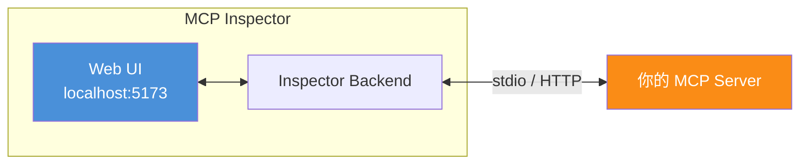

**启动 Inspector**:

```bash
# 方式1:直接启动(自动拉起 Server)
npx @modelcontextprotocol/inspector python file_mcp_server.py --root /tmp/test

# 方式2:连接已运行的 HTTP Server
npx @modelcontextprotocol/inspector
# 然后在 UI 中填写 http://localhost:8000/mcp
```

**Inspector 功能**:
- ✅ 可视化查看工具列表与 Schema
- ✅ 手动调用工具并查看响应
- ✅ 查看/读取资源
- ✅ 渲染提示模板
- ✅ 查看 JSON-RPC 原始消息
- ✅ 测试能力协商

### 9.2 单元测试

```python
# tests/test_tools.py
import pytest
import asyncio
from unittest.mock import AsyncMock, patch
from mcp import ClientSession, StdioServerParameters
from mcp.client.stdio import stdio_client

@pytest.fixture
async def mcp_session(tmp_path):
    """启动 Server 并返回会话"""
    server_params = StdioServerParameters(
        command="python",
        args=["src/my_mcp_server/__main__.py", "--root", str(tmp_path)],
    )
    async with stdio_client(server_params) as (read, write):
        async with ClientSession(read, write) as session:
            await session.initialize()
            yield session

@pytest.mark.asyncio
async def test_write_and_read_file(mcp_session, tmp_path):
    """测试写入并读取文件"""
    # 写入
    write_result = await mcp_session.call_tool(
        "write_file",
        arguments={"path": "test.txt", "content": "Hello test"}
    )
    assert write_result.isError is False
    
    # 读取
    read_result = await mcp_session.call_tool(
        "read_file",
        arguments={"path": "test.txt"}
    )
    assert read_result.content[0].text == "Hello test"
    
    # 文件确实存在
    assert (tmp_path / "test.txt").read_text() == "Hello test"

@pytest.mark.asyncio
async def test_path_traversal_blocked(mcp_session):
    """测试目录穿越防护"""
    result = await mcp_session.call_tool(
        "read_file",
        arguments={"path": "../../../etc/passwd"}
    )
    assert result.isError is True
    assert "outside root" in result.content[0].text.lower()

@pytest.mark.asyncio
async def test_list_tools(mcp_session):
    """测试工具列表"""
    tools = await mcp_session.list_tools()
    tool_names = [t.name for t in tools.tools]
    assert "read_file" in tool_names
    assert "write_file" in tool_names
    assert "list_directory" in tool_names
```

### 9.3 集成测试

```python
# tests/test_integration.py
import pytest
import subprocess
import json

@pytest.mark.asyncio
async def test_full_workflow(mcp_session, tmp_path):
    """完整工作流集成测试:创建→列出→搜索→读取"""
    # 1. 创建多个文件
    for name in ["a.txt", "b.txt", "c.md"]:
        await mcp_session.call_tool(
            "write_file",
            arguments={"path": name, "content": f"Content of {name}"}
        )
    
    # 2. 列出目录
    result = await mcp_session.call_tool("list_directory", arguments={"path": "."})
    listing = json.loads(result.content[0].text)
    assert listing["count"] >= 3
    
    # 3. 搜索 .txt 文件
    result = await mcp_session.call_tool(
        "search_files",
        arguments={"pattern": "*.txt"}
    )
    search_result = json.loads(result.content[0].text)
    assert "a.txt" in search_result["matches"]
    assert "b.txt" in search_result["matches"]
    assert "c.md" not in search_result["matches"]
    
    # 4. 读取资源
    content = await mcp_session.read_resource("file://a.txt")
    assert "Content of a.txt" in content.contents[0].text
```

### 9.4 调试技巧

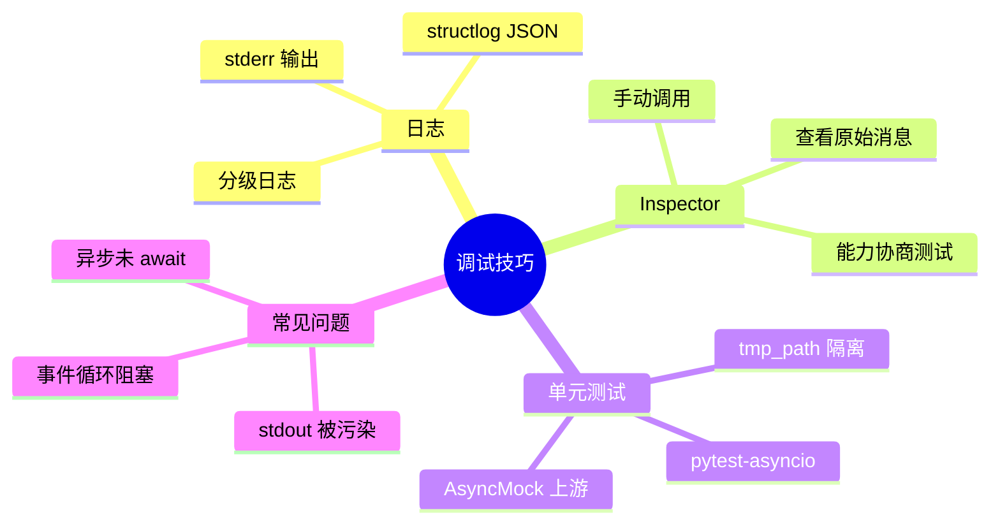

**常见调试坑**:

| 问题 | 现象 | 解决 |
|------|------|------|
| stdout 被污染 | Client 解析失败 | **所有日志输出到 stderr**,stdout 只发 JSON-RPC |
| 同步阻塞事件循环 | 工具调用超时 | 用 `asyncio.to_thread` 包装同步代码 |
| 未 await 协程 | 工具返回警告 | 严格 `await` 所有异步调用 |
| Schema 不生成 | 工具不显示 | 确保类型注解完整、pydantic 模型正确 |

---

## 十、最佳实践建议

### 10.1 Schema 设计最佳实践

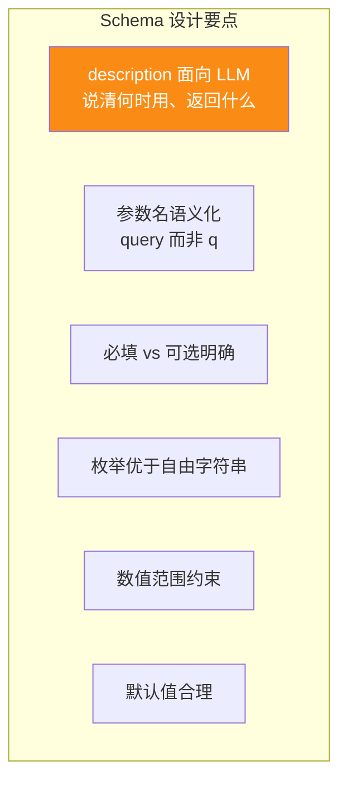

**好的 Schema 示例**:

```python
@mcp.tool(description=(
    "Search GitHub issues by keyword. "
    "Use this when the user wants to find existing issues. "  # 何时用
    "Returns issue number, title, state, and assignee."        # 返回什么
))
async def search_issues(
    query: str = Field(
        ...,                           # 必填
        description="Search keywords to match against issue titles and bodies",
        min_length=1,                  # 长度约束
        max_length=256,
    ),
    state: str = Field(
        "open",                        # 合理默认值
        description="Filter by issue state",
        pattern="^(open|closed|all)$"  # 枚举优于自由字符串
    ),
    limit: int = Field(
        10,
        ge=1, le=100,                  # 范围约束
        description="Maximum number of results to return"
    )
) -> dict:
    ...
```

### 10.2 错误处理最佳实践

| 原则 | 说明 | 示例 |
|------|------|------|
| **业务错误用 isError** | 工具内部错误用 `isError: true`,让 LLM 可读 | API 404、数据不存在 |
| **协议错误用 error** | Schema 错误、方法不存在用 JSON-RPC error | 参数缺失、工具不存在 |
| **错误消息面向 LLM** | 描述原因 + 恢复建议 | "Rate limit exceeded, retry after 60s" |
| **可重试错误标记** | data 中加 `retryable` 字段 | 网络超时 retryable=true |
| **不暴露堆栈** | 生产环境隐藏内部细节 | 不要返回 `NullPointerException at line 42` |

### 10.3 性能最佳实践

```python
# 1. 异步优先:所有 I/O 用 async
@mcp.tool()
async def search_issues(query: str) -> dict:
    # ✅ 异步 HTTP
    async with httpx.AsyncClient() as client:
        response = await client.get(...)
    return response.json()

# 2. 并发独立调用
async def get_repo_summary(owner: str, name: str) -> dict:
    # ✅ 并发获取多个独立资源
    readme, info, stats = await asyncio.gather(
        client.get_readme(owner, name),
        client.get_info(owner, name),
        client.get_stats(owner, name),
    )
    return {"readme": readme, "info": info, "stats": stats}

# 3. 缓存热点数据
from functools import lru_cache

@lru_cache(maxsize=128)
def get_repo_info_cached(repo: str) -> dict:
    return client.get_repo_info(repo)

# 4. 流式返回长结果(通过 progress 通知)
@mcp.tool()
async def long_running_task(task_id: str) -> dict:
    for i in range(100):
        await asyncio.sleep(0.1)
        # 通过 ctx 报告进度
        await ctx.report_progress(i, 100, f"Processing {i}/100")
    return {"completed": True}
```

### 10.4 安全最佳实践

| 实践 | 实现 |
|------|------|
| **路径穿越防护** | `_safe_resolve` 检查路径在 root 内 |
| **输入大小限制** | Field(max_length=...) 限制输入 |
| **输出脱敏** | 过滤 token/密钥字段 |
| **OAuth 2.1 认证** | HTTP 传输必须启用 |
| **环境变量凭证** | stdio 通过 env 传入,不硬编码 |
| **审计日志** | 记录每次工具调用 |
| **速率限制** | 按 Client/Tool 维度限流 |
| **危险操作确认** | destructiveHint 标记,Host 二次确认 |

### 10.5 可维护性最佳实践

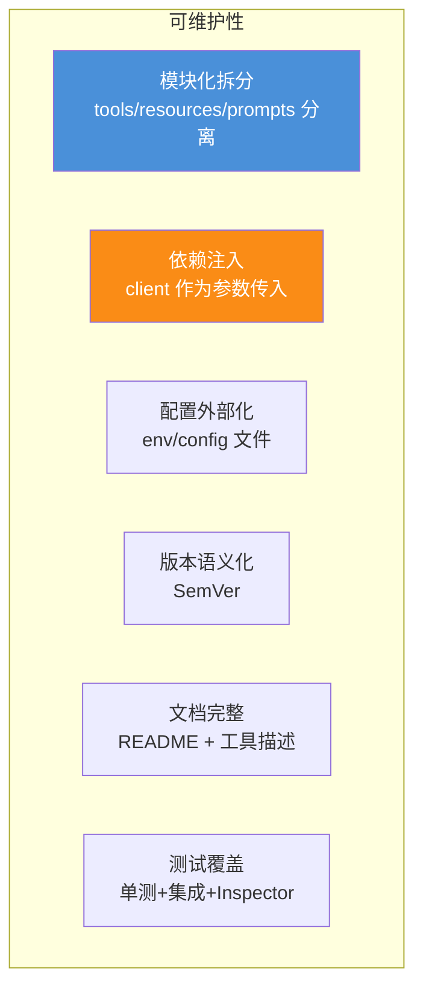

### 10.6 工具粒度设计

```mermaid
flowchart LR
    subgraph 工具粒度光谱
        G1[过细<br/>create_issue_title<br/>create_issue_body<br/>create_issue_labels]
        G2[合适<br/>create_issue<br/>(repo, title, body, labels)]
        G3[过粗<br/>github_action<br/>(action, params)]
    end
    
    G1 -.增加 LLM 调用次数.-> BAD1[❌ Token 浪费]
    G2 -.平衡.-> GOOD[✅ 推荐]
    G3 -.Schema 复杂.-> BAD2[❌ LLM 难以调用]
    
    style G2 fill:#50b83c,color:#fff
```

**粒度原则**:**一个工具 = 一个用户意图**。不要按字段拆,也不要按服务拆。

### 10.7 工具命名规范

| 原则 | 好的命名 | 坏的命名 |
|------|---------|---------|
| 动词开头 | `search_issues` | `issues` |
| 蛇形命名 | `create_issue` | `createIssue` / `create-issue` |
| 包含对象 | `get_repo_info` | `get_info` |
| 避免缩写 | `list_directories` | `ls` / `lst_dir` |

### 10.8 描述写作规范

```python
# ❌ 坏的描述:面向开发者,LLM 不知何时用
@mcp.tool(description="Search issues")

# ✅ 好的描述:面向 LLM,说清何时用、返回什么
@mcp.tool(description=(
    "Search GitHub issues by keyword, label, or state. "
    "Use this when the user wants to find existing issues. "  # 何时用
    "Returns issue number, title, state, and assignee."        # 返回什么
))
```

### 10.9 完整最佳实践清单

```mermaid
flowchart TB
    subgraph MCP Server 最佳实践 10 条
        B1[1. Schema 面向 LLM<br/>description 说清何时用]
        B2[2. 错误分层<br/>业务用 isError 协议用 error]
        B3[3. 异步优先<br/>所有 I/O 用 async]
        B4[4. 安全隔离<br/>路径/输入/输出三重防护]
        B5[5. 工具粒度<br/>一个工具一个意图]
        B6[6. 双传输支持<br/>stdio + HTTP 一份代码]
        B7[7. 完整测试<br/>单测+集成+Inspector]
        B8[8. 模块化<br/>tools/resources/prompts 分离]
        B9[9. 监控可观测<br/>日志+指标+追踪]
        B10[10. 优雅关闭<br/>资源清理+信号处理]
    end
    
    style B1 fill:#fa8c16,color:#fff
    style B4 fill:#f5222d,color:#fff
    style B7 fill:#50b83c,color:#fff
```

---

## 十一、生产部署与运维

### 11.1 容器化部署

#### 11.1.1 Dockerfile(Python)

```dockerfile
# Dockerfile
FROM python:3.11-slim AS builder

WORKDIR /app
COPY pyproject.toml requirements.txt ./
RUN pip install --no-cache-dir -r requirements.txt

FROM python:3.11-slim
WORKDIR /app

# 复制依赖
COPY --from=builder /usr/local/lib/python3.11/site-packages /usr/local/lib/python3.11/site-packages
COPY --from=builder /usr/local/bin /usr/local/bin

# 复制源码
COPY src/ ./src/
COPY README.md ./

# 非 root 用户
RUN useradd -m mcp
USER mcp

# 健康检查(HTTP 模式)
HEALTHCHECK --interval=30s --timeout=3s \
    CMD curl -f http://localhost:8000/health || exit 1

EXPOSE 8000
ENTRYPOINT ["python", "-m", "my_mcp_server"]
CMD ["--transport", "http", "--host", "0.0.0.0", "--port", "8000"]
```

#### 11.1.2 docker-compose.yml

```yaml
version: "3.9"
services:
  mcp-server:
    build: .
    ports:
      - "8000:8000"
    environment:
      - GITHUB_TOKEN=${GITHUB_TOKEN}
      - LOG_LEVEL=INFO
      - REDIS_URL=redis://redis:6379
    restart: unless-stopped
    depends_on:
      - redis
  
  redis:
    image: redis:7-alpine
    ports:
      - "6379:6379"
    volumes:
      - redis-data:/data

volumes:
  redis-data:
```

### 11.2 Kubernetes 部署

```yaml
# k8s-deployment.yaml
apiVersion: apps/v1
kind: Deployment
metadata:
  name: mcp-server
spec:
  replicas: 3
  selector:
    matchLabels:
      app: mcp-server
  template:
    metadata:
      labels:
        app: mcp-server
    spec:
      containers:
      - name: mcp-server
        image: my-mcp-server:1.0.0
        ports:
        - containerPort: 8000
        env:
        - name: GITHUB_TOKEN
          valueFrom:
            secretKeyRef:
              name: mcp-secrets
              key: github-token
        resources:
          requests:
            cpu: 100m
            memory: 128Mi
          limits:
            cpu: 500m
            memory: 512Mi
        livenessProbe:
          httpGet:
            path: /health
            port: 8000
          initialDelaySeconds: 10
          periodSeconds: 30
        readinessProbe:
          httpGet:
            path: /ready
            port: 8000
          initialDelaySeconds: 5
          periodSeconds: 10
---
apiVersion: v1
kind: Service
metadata:
  name: mcp-server
spec:
  selector:
    app: mcp-server
  ports:
  - port: 8000
    targetPort: 8000
  type: ClusterIP
```

### 11.3 MCP Gateway 架构

企业级部署推荐通过 **MCP Gateway** 统一管理多个 Server:

```mermaid
flowchart TB
    subgraph 客户端
        C1[Claude Desktop]
        C2[VS Code]
        C3[企业 Agent]
    end
    
    subgraph MCP Gateway
        GW[统一入口<br/>认证+限流+路由+审计]
    end
    
    subgraph Server 集群
        S1[文件 Server<br/>3 副本]
        S2[GitHub Server<br/>3 副本]
        S3[数据库 Server<br/>3 副本]
    end
    
    subgraph 基础设施
        AUTH[OAuth 2.1<br/>认证中心]
        MON[Prometheus<br/>监控]
        LOG[ELK<br/>日志]
        REG[MCP Registry<br/>服务发现]
    end
    
    C1 & C2 & C3 --> GW
    GW --> S1 & S2 & S3
    GW -.-> AUTH
    GW -.-> MON
    GW -.-> LOG
    GW -.-> REG
    
    style GW fill:#fa8c16,color:#fff
```

**Gateway 核心职责**:

| 职责 | 实现 |
|------|------|
| **认证** | OAuth 2.1 token 校验 |
| **授权** | RBAC 权限控制 |
| **路由** | 按 Server 名路由到对应实例 |
| **限流** | 按 Client/Server 维度限流 |
| **审计** | 全量调用日志 |
| **服务发现** | 集成 MCP Registry |
| **协议转换** | HTTP ↔ stdio 适配 |
| **灰度** | 按权重路由到不同版本 |

### 11.4 监控指标

```python
# core/metrics.py
from prometheus_client import Counter, Histogram, Gauge

# 工具调用次数
tool_calls_total = Counter(
    "mcp_tool_calls_total",
    "Total tool calls",
    ["tool_name", "status"]
)

# 工具调用延迟
tool_call_duration = Histogram(
    "mcp_tool_call_duration_seconds",
    "Tool call duration",
    ["tool_name"],
    buckets=[0.01, 0.05, 0.1, 0.5, 1, 5, 10]
)

# 活跃会话数
active_sessions = Gauge(
    "mcp_active_sessions",
    "Active MCP sessions"
)

# 错误次数
errors_total = Counter(
    "mcp_errors_total",
    "Total errors",
    ["error_code", "tool_name"]
)
```

**关键监控指标**:

| 指标 | 类型 | 告警阈值 |
|------|------|---------|
| `tool_calls_total` | Counter | QPS 突增/突降 |
| `tool_call_duration_seconds` | Histogram | P99 > 5s |
| `mcp_active_sessions` | Gauge | > 上限 80% |
| `mcp_errors_total` | Counter | 错误率 > 5% |
| `tool_calls_total{status="error"}` | Counter | 持续上升 |

### 11.5 版本管理与灰度

```mermaid
flowchart LR
    subgraph 版本管理
        V1[v1.0.0<br/>初版]
        V2[v1.1.0<br/>新增工具]
        V3[v2.0.0<br/>破坏性变更]
    end
    
    subgraph 灰度策略
        G1[10% 流量<br/>v2.0.0]
        G2[50% 流量<br/>v2.0.0]
        G3[100% 流量<br/>v2.0.0]
    end
    
    V1 --> V2 --> V3
    V3 --> G1 --> G2 --> G3
    
    style V3 fill:#f5222d,color:#fff
```

**破坏性变更处理**:
1. **提前通知**:在工具描述中加 `[DEPRECATED]` 标记
2. **双版本并行**:新旧工具同时存在一段时间
3. **逐步迁移**:观察 Client 调用情况,迁移完成后下线旧版
4. **协议版本升级**:`protocolVersion` 不兼容时必须升级

### 11.6 故障演练与降级

| 故障场景 | 降级策略 |
|---------|---------|
| 上游 API 超时 | 返回 retryable error,Client 自动重试 |
| 上游 API 限流 | 返回 retryAfter,Client 延迟重试 |
| Server 内存溢出 | K8s 自动重启,Client 重连 |
| 数据库不可用 | 降级到缓存,标记数据可能过期 |
| 网络分区 | 多副本 + 跨可用区部署 |

---

## 十二、与系列文档关系

### 12.1 系列文档定位图

```mermaid
flowchart TB
    subgraph Tool Calling 系列
        D89[89号<br/>FC vs API 对比]
        D90[90号<br/>动态工具选择]
        D91[91号<br/>Schema 设计规范]
        D92[92号<br/>参数错误处理]
        D93[93号<br/>失败重试机制]
        D94[94号<br/>危险工具安全管控]
        D95[95号<br/>Tool Registry 治理]
        D96[96号<br/>MCP 协议解析]
        D97[97号<br/>MCP Server 实现<br/>本文]
    end
    
    D89 --> D90 --> D91
    D91 --> D92 & D93 & D94
    D94 --> D95
    D95 --> D96 --> D97
    
    style D97 fill:#fa8c16,color:#fff,stroke-width:3px
```

### 12.2 文档关系详解

| 文档 | 主题 | 与本文关系 |
|------|------|-----------|
| [89号:FC vs API](./89FunctionCalling与普通API调用核心区别系统性对比深度解析.md) | 调用方式对比 | 本文是其"MCP 落地"的工程实现 |
| [90号:动态工具选择](./90Agent动态工具选择决策机制完整实现深度解析.md) | 工具选择 | 本文的 `tools/list` 支持动态发现 |
| [91号:Schema 设计](./91ToolSchema完整设计规范深度解析.md) | Schema 规范 | 本文的工具 inputSchema 遵循此规范 |
| [92号:参数错误处理](./92工具调用参数错误系统性处理方案深度解析.md) | 错误处理 | 本文第六章错误处理是其 MCP 适配 |
| [93号:失败重试机制](./93工具调用失败重试机制完整设计与实现深度解析.md) | 重试机制 | 本文 retryable 字段配合重试 |
| [94号:安全管控](./94Agent危险工具调用安全管控机制完整设计方案深度解析.md) | 安全管控 | 本文 ToolAnnotations 是其 MCP 实现 |
| [95号:Tool Registry](./95企业级ToolRegistry系统架构设计完整方案深度解析.md) | 工具治理 | 本文 Server 可注册到 Registry |
| [96号:MCP 协议](./96MCP协议完整深度解析.md) | 协议规范 | 本文是其工程落地篇 |

### 12.3 推荐阅读顺序

```mermaid
flowchart LR
    A[初学者] --> B[89号<br/>理解 FC 概念]
    B --> C[91号<br/>学 Schema 设计]
    C --> D[96号<br/>理解 MCP 协议]
    D --> E[本文 97号<br/>动手实现 MCP Server]
    E --> F[95号<br/>企业级治理]
    F --> G[94号<br/>安全加固]
    
    style E fill:#fa8c16,color:#fff
```

### 12.4 一句话总结

> **MCP Server 的开发本质是"面向 LLM 的 API 设计"——用 JSON-RPC 2.0 做协议骨架,用三大原语(Tools/Resources/Prompts)做能力封装,用 ToolAnnotations 做语义标注,用 stdio/HTTP 双传输做部署灵活性。选 FastMCP 享受 90% 场景的快速开发,按本文的 7 步流程(创建实例→定义工具→定义资源→定义提示→错误处理→配置传输→健康检查)即可从零到生产。记住核心心法:Schema 写给 LLM 看,错误让 LLM 能懂,安全是底线,测试是保障。**

---

> **参考来源:**
> - [MCP Specification 2025-11-25](https://modelcontextprotocol.io/specification/2025-11-25/basic/index.md) — MCP 最新规范(生命周期、能力协商、消息格式)
> - [MCP Python SDK](https://github.com/modelcontextprotocol/python-sdk) — 官方 Python SDK(FastMCP 文档与示例)
> - [MCP TypeScript SDK](https://github.com/modelcontextprotocol/typescript-sdk) — 官方 TypeScript SDK
> - [MCP Inspector](https://github.com/modelcontextprotocol/inspector) — 官方调试工具
> - [MCP Architecture Overview](https://modelcontextprotocol.io/docs/learn/architecture) — 官方架构文档(三大原语、传输层)
> - [Building MCP Servers](https://modelcontextprotocol.io/docs/develop/servers) — 官方 Server 开发指南
> - [Tool Annotations Spec](https://modelcontextprotocol.io/specification/2025-06-18/server/tools) — 工具注解规范(2025-06-18)
> - [MCP Registry](https://modelcontextprotocol.io/docs/develop/registry) — MCP 服务发现与注册
> - [FastMCP: Pythonic MCP Servers](https://gofastmcp.com/) — FastMCP 完整文档
> - [96号文档:MCP 协议完整深度解析](./96MCP协议完整深度解析.md) — 本系列协议基础篇
