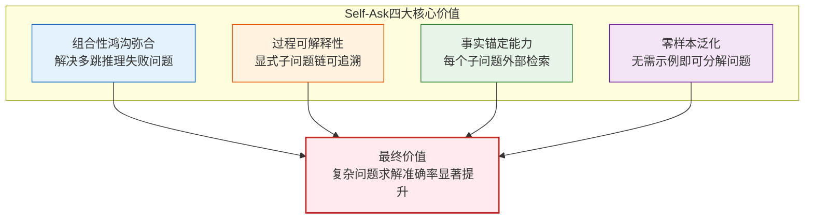
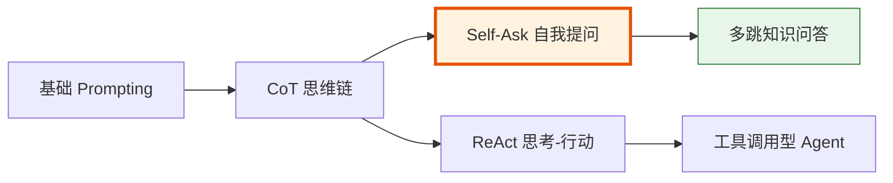
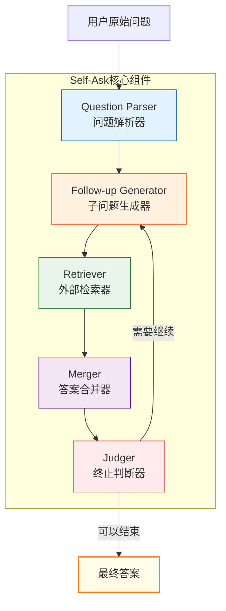
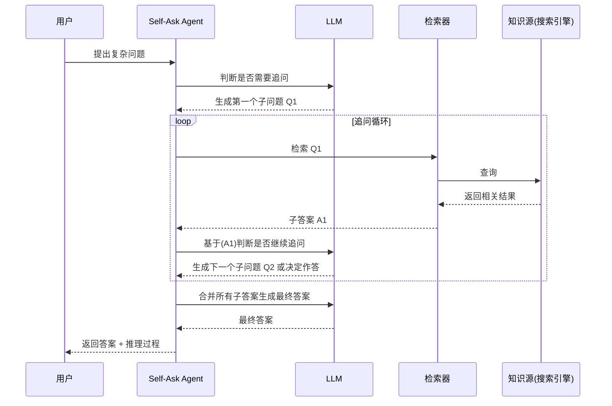
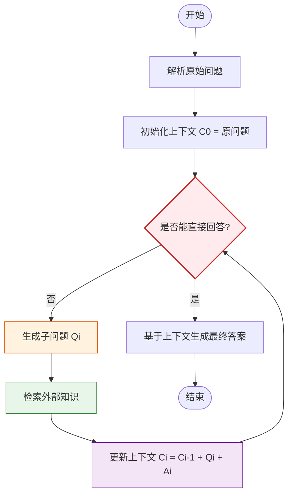
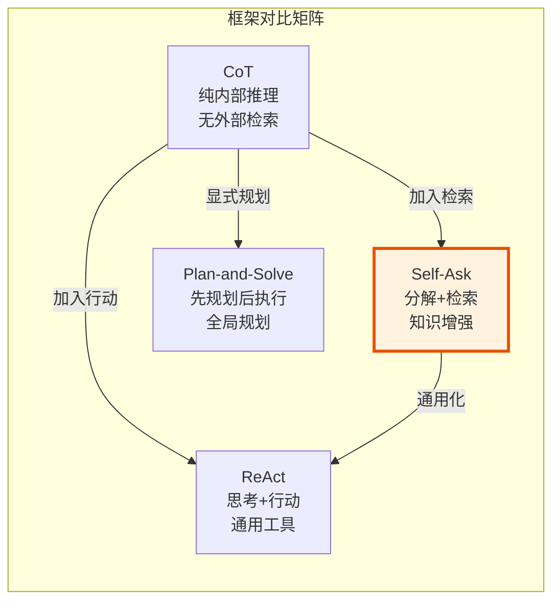
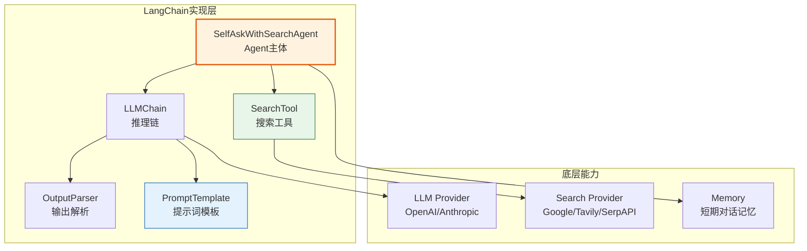
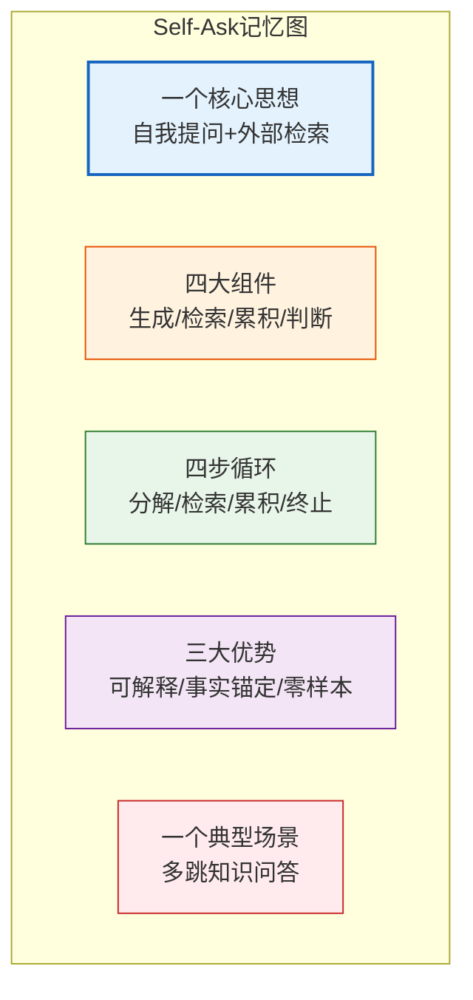

# Agent Self-Ask 框架解析面试专项

> 本文档系统阐述 Agent Self-Ask（自我提问）框架的核心概念、工作机制与基于 LangChain 的实现原理，专为技术面试场景设计，涵盖框架定义、关键组件、工作流程、对比分析与实战案例。

---

## 目录

- [1. 框架定义与核心价值](#1-框架定义与核心价值)
  - [1.1 什么是 Self-Ask 框架](#11-什么是-self-ask-框架)
  - [1.2 核心价值主张](#12-核心价值主张)
  - [1.3 框架定位](#13-框架定位)
- [2. 关键组件及交互流程](#2-关键组件及交互流程)
  - [2.1 组件总览](#21-组件总览)
  - [2.2 核心组件详解](#22-核心组件详解)
  - [2.3 组件交互流程](#23-组件交互流程)
- [3. 自我提问（Self-Ask）机制详解](#3-自我提问self-ask机制详解)
  - [3.1 工作原理总览](#31-工作原理总览)
  - [3.2 四步核心循环](#32-四步核心循环)
  - [3.3 提示词模板设计](#33-提示词模板设计)
  - [3.4 终止条件与决策逻辑](#34-终止条件与决策逻辑)
- [4. 与传统问答系统的区别与优势](#4-与传统问答系统的区别与优势)
  - [4.1 与传统 QA 系统对比](#41-与传统-qa-系统对比)
  - [4.2 与同类推理框架对比](#42-与同类推理框架对比)
  - [4.3 核心优势](#43-核心优势)
- [5. 基于 LangChain 的技术实现](#5-基于-langchain-的技术实现)
  - [5.1 技术架构总览](#51-技术架构总览)
  - [5.2 工具调用实现](#52-工具调用实现)
  - [5.3 提示词设计](#53-提示词设计)
  - [5.4 上下文管理](#54-上下文管理)
  - [5.5 完整实现示例](#55-完整实现示例)
- [6. 典型应用场景与案例分析](#6-典型应用场景与案例分析)
  - [6.1 应用场景矩阵](#61-应用场景矩阵)
  - [6.2 案例一：多跳知识问答](#62-案例一多跳知识问答)
  - [6.3 案例二：复杂事实核查](#63-案例二复杂事实核查)
- [7. 常见面试问题及参考答案](#7-常见面试问题及参考答案)
  - [7.1 基础概念题](#71-基础概念题)
  - [7.2 原理深度题](#72-原理深度题)
  - [7.3 实战应用题](#73-实战应用题)
  - [7.4 对比辨析题](#74-对比辨析题)
- [8. 总结与记忆口诀](#8-总结与记忆口诀)

---

## 1. 框架定义与核心价值

### 1.1 什么是 Self-Ask 框架

**Self-Ask**（自我提问框架）是一种由 Oxford 与 DeepMind 团队于 2022 年提出的 **Prompting + 检索增强**推理框架。其核心思想是：让 LLM 在面对复杂问题时，**主动将原问题分解为一系列可独立检索的子问题（Follow-up Questions）**，逐个查询外部知识源（如搜索引擎）获取事实，再将子答案合并推理出最终答案。

> **一句话定义**：Self-Ask = "自己提问自己回答"的迭代式推理 + 外部知识检索增强。

**论文出处**：*Measuring and Narrowing the Compositionality Gap in Language Models* (Press et al., 2022)

### 1.2 核心价值主张



| 价值维度 | 解决的核心问题 | 量化收益 |
|---------|--------------|---------|
| **组合性鸿沟弥合** | 多跳问题中 LLM 单次推理失败率高 | 准确率提升 10-20% |
| **过程可解释性** | 黑盒推理无法审计中间步骤 | 全链路子问题可追溯 |
| **事实锚定能力** | 模型幻觉与知识时效性 | 每步检索降低幻觉率 |
| **零样本泛化** | Few-shot 示例成本高 | 无需标注即可应用 |

### 1.3 框架定位

Self-Ask 在 Agent 推理框架谱系中的定位：



- **与 CoT 的关系**：Self-Ask 是 CoT 的"外化"版本——CoT 内部隐式推理，Self-Ask 显式分解为子问题
- **与 ReAct 的关系**：Self-Ask 专注"知识检索型"推理，ReAct 更通用支持任意工具
- **与 Plan-and-Solve 的关系**：Self-Ask 边问边答，Plan-and-Solve 先规划后执行

---

## 2. 关键组件及交互流程

### 2.1 组件总览



### 2.2 核心组件详解

| 组件 | 职责 | 输入 | 输出 | 实现要点 |
|------|------|------|------|---------|
| **Question Parser** | 解析原始问题，识别问题类型与复杂度 | 用户问题文本 | 结构化问题对象 | 识别"是否需要多跳推理" |
| **Follow-up Generator** | 生成下一个需要追问的子问题 | 已知上下文 + 历史子答案 | 下一个子问题 | LLM 通过 prompt 生成 |
| **Retriever** | 检索外部知识源回答子问题 | 子问题 | 子答案 | 搜索引擎/RAG/知识库 |
| **Merger** | 将子答案合并到上下文 | 子问题 + 子答案 | 更新后的上下文 | 累积式上下文 |
| **Judger** | 判断是否需要继续提问或可以作答 | 当前上下文 | 继续/终止信号 | LLM 判断或规则判断 |

### 2.3 组件交互流程



---

## 3. 自我提问（Self-Ask）机制详解

### 3.1 工作原理总览

Self-Ask 的核心机制可以用一个**自递归循环**描述：

> **当前上下文 → 生成下一个子问题 → 检索答案 → 更新上下文 → 判断是否结束**



### 3.2 四步核心循环

Self-Ask 的执行过程可严格划分为四个阶段的循环：

#### 阶段一：问题分解（Decompose）

LLM 基于当前已知信息，判断是否需要进一步追问。如需追问，生成一个**单一、原子化、可检索**的子问题。

```
原始问题: "Tesla的CEO出生在哪个国家？"

第1次分解:
  已知: Tesla的CEO
  子问题Q1: "谁是Tesla的CEO？"
```

#### 阶段二：外部检索（Retrieve）

将子问题提交给外部检索器（搜索引擎、向量库、知识图谱等），获取事实性答案。

```
Q1: "谁是Tesla的CEO？"
A1: "Elon Musk" (来自搜索引擎)
```

#### 阶段三：上下文累积（Accumulate）

将子问题和子答案追加到上下文中，形成**递进式知识链**。

```
当前上下文:
  Q1: 谁是Tesla的CEO？
  A1: Elon Musk
  
基于A1继续追问 → Q2: "Elon Musk出生在哪个国家？"
```

#### 阶段四：终止判断（Judge）

LLM 判断当前累积的上下文是否足以回答原问题。若可以，则合成最终答案；若不可以，则回到阶段一继续追问。

```
判断: 已知Tesla的CEO是Elon Musk，且Elon Musk出生于南非
结论: 可以回答原问题
最终答案: "Tesla的CEO出生于南非"
```

### 3.3 提示词模板设计

Self-Ask 的核心在于**结构化提示词模板**，引导 LLM 严格遵循"追问-检索-累积"模式：

```text
You are a helpful assistant that answers questions by breaking them down into sub-questions.

Use the following format:

Question: <the original question>
Are follow up questions needed here: Yes.
Follow up: <sub-question 1>
Intermediate answer: <answer to sub-question 1>
Follow up: <sub-question 2>
Intermediate answer: <answer to sub-question 2>
...
Are follow up questions needed here: No.
So the final answer is: <final answer>

Rules:
1. Each follow-up question should be atomic and independently searchable.
2. Use the intermediate answers to inform the next follow-up question.
3. Only answer "No" when you have enough information to answer the original question.

Example:
Question: When was the founder of Tesla born?
Are follow up questions needed here: Yes.
Follow up: Who is the founder of Tesla?
Intermediate answer: Elon Musk (and others)
Follow up: When was Elon Musk born?
Intermediate answer: June 28, 1971
Are follow up questions needed here: No.
So the final answer is: June 28, 1971

Now answer this question:
Question: {user_question}
```

### 3.4 终止条件与决策逻辑

终止判断是 Self-Ask 的关键风险点，存在两种典型策略：

| 策略 | 实现方式 | 优点 | 缺点 |
|------|---------|------|------|
| **LLM 自判断** | 让 LLM 输出 "No" 表示可终止 | 灵活，适应复杂场景 | 可能过早或过晚终止 |
| **规则判断** | 设置最大追问轮数或关键词触发 | 确定性，可控性强 | 不够灵活 |
| **混合策略** | LLM 判断 + 最大轮数兜底 | 兼顾灵活与安全 | 实现复杂度略高 |

**最佳实践**：采用混合策略，设置 `max_iterations=5` 作为兜底，避免无限循环。

---

## 4. 与传统问答系统的区别与优势

### 4.1 与传统 QA 系统对比

| 维度 | 传统 RAG/QA | Self-Ask |
|------|------------|----------|
| **检索策略** | 单次检索：原问题 → 检索 → 生成 | 多次检索：每个子问题独立检索 |
| **推理方式** | 单跳：直接基于检索结果生成 | 多跳：子问题链式累积推理 |
| **可解释性** | 黑盒：无法看到推理过程 | 白盒：子问题链可追溯 |
| **适用问题** | 简单事实查询 | 复杂组合性事实推理 |
| **错误传播** | 单点错误，影响有限 | 子问题错误可能级联传播 |
| **延迟成本** | 单次检索，延迟低 | 多次检索，延迟较高 |

### 4.2 与同类推理框架对比



| 对比维度 | CoT | Self-Ask | ReAct | Plan-and-Solve |
|---------|-----|---------|-------|---------------|
| **外部工具** | 无 | 检索器（固定） | 任意工具 | 任意工具 |
| **检索次数** | 0 | N（每个子问题一次） | 按需 | 按需 |
| **规划方式** | 隐式 | 边问边答 | 边想边做 | 先规划再执行 |
| **可解释性** | 中 | 高 | 高 | 高 |
| **延迟** | 低 | 中-高 | 中 | 中-高 |
| **适用场景** | 推理题 | 多跳知识问答 | 通用 Agent | 复杂多步任务 |

### 4.3 核心优势

1. **组合性鸿沟弥合**：实证表明，GPT-3 在 2-hop 问题上准确率仅 17%，使用 Self-Ask 后提升至 70%+
2. **细粒度检索**：每个子问题独立检索，避免单次检索信息过载
3. **错误隔离**：单个子问题错误可通过下一轮检索纠正
4. **零样本能力**：无需示例即可分解问题，降低使用门槛

---

## 5. 基于 LangChain 的技术实现

### 5.1 技术架构总览



### 5.2 工具调用实现

LangChain 中 Self-Ask 依赖一个 `Search` 工具，通过 `Tool` 接口封装：

```python
from langchain.tools import Tool
from langchain_community.utilities import GoogleSearchAPIWrapper

# 方式1: 使用 Google Search
search = GoogleSearchAPIWrapper()
search_tool = Tool(
    name="Intermediate Answer",
    func=search.run,
    description="useful for when you need to ask with search",
)

# 方式2: 使用 Tavily（推荐，专为 LLM 设计）
from langchain_community.tools.tavily_search import TavilySearchResults
search_tool = TavilySearchResults(
    max_results=3,
    name="Intermediate Answer",
    description="Search the web for intermediate answers"
)

# 方式3: 使用自定义 RAG 检索器
def custom_retriever(query: str) -> str:
    from langchain_community.vectorstores import FAISS
    from langchain_openai import OpenAIEmbeddings
    vectorstore = FAISS.load_local("index", OpenAIEmbeddings())
    docs = vectorstore.similarity_search(query, k=3)
    return "\n".join([d.page_content for d in docs])

search_tool = Tool(
    name="Intermediate Answer",
    func=custom_retriever,
    description="Search internal knowledge base"
)
```

### 5.3 提示词设计

LangChain 提供了内置的 Self-Ask 提示词模板，也可自定义：

```python
from langchain.prompts import PromptTemplate

# 内置模板
from langchain.agents.self_ask_with_search.prompt import PROMPT as SELF_ASK_PROMPT
print(SELF_ASK_PROMPT)

# 自定义增强模板
CUSTOM_SELF_ASK_TEMPLATE = """Question: Who lived longer, Muhammad Ali or Alan Turing?
Are follow up questions needed here: Yes.
Follow up: How old was Muhammad Ali when he died?
Intermediate answer: Muhammad Ali was 74 years old when he died.
Follow up: How old was Alan Turing when he died?
Intermediate answer: Alan Turing was 41 years old when he died.
So the final answer is: Muhammad Ali

Question: When was the founder of craigslist born?
Are follow up questions needed here: Yes.
Follow up: Who was the founder of craigslist?
Intermediate answer: Craigslist was founded by Craig Newmark.
Follow up: When was Craig Newmark born?
Intermediate answer: Craig Newmark was born on December 6, 1952.
So the final answer is: December 6, 1952

Question: Who was the maternal grandfather of George Washington?
Are follow up questions needed here: Yes.
Follow up: Who was the mother of George Washington?
Intermediate answer: The mother of George Washington was Mary Ball Washington.
Follow up: Who was the father of Mary Ball Washington?
Intermediate answer: The father of Mary Ball Washington was Joseph Ball.
So the final answer is: Joseph Ball

Question: {input}
"""

custom_prompt = PromptTemplate(
    input_variables=["input"],
    template=CUSTOM_SELF_ASK_TEMPLATE,
)
```

### 5.4 上下文管理

Self-Ask 的上下文是**累积式**的，每一轮的子问题和子答案都会保留：

```python
from langchain.memory import ConversationBufferMemory
from langchain.schema import BaseMessage

# 上下文累积的关键：将每轮子问题与子答案作为消息保留
class SelfAskContext:
    """Self-Ask 上下文管理器"""

    def __init__(self):
        self.follow_ups: list[dict] = []
        self.original_question: str = ""

    def add_follow_up(self, question: str, answer: str):
        self.follow_ups.append({
            "question": question,
            "answer": answer
        })

    def get_context_string(self) -> str:
        """生成累积式上下文，供 LLM 下一步推理"""
        context = [f"Question: {self.original_question}"]
        context.append("Are follow up questions needed here: Yes.")
        for fu in self.follow_ups:
            context.append(f"Follow up: {fu['question']}")
            context.append(f"Intermediate answer: {fu['answer']}")
        return "\n".join(context)

    def is_sufficient(self, max_follow_ups: int = 5) -> bool:
        """简单终止条件：达到最大轮数"""
        return len(self.follow_ups) >= max_follow_ups
```

### 5.5 完整实现示例

以下是基于 LangChain 的完整 Self-Ask Agent 实现：

```python
"""
基于 LangChain 的 Self-Ask Agent 完整实现
依赖: pip install langchain langchain-openai langchain-community tavily-python
"""
import os
from langchain.agents import initialize_agent, AgentType
from langchain_openai import ChatOpenAI
from langchain_community.tools.tavily_search import TavilySearchResults
from langchain.callbacks import StdOutCallbackHandler

# 1. 配置环境变量
os.environ["OPENAI_API_KEY"] = "your-openai-api-key"
os.environ["TAVILY_API_KEY"] = "your-tavily-api-key"

# 2. 初始化 LLM
llm = ChatOpenAI(
    model="gpt-4o-mini",
    temperature=0,  # Self-Ask 推荐低温度，保证推理稳定
    streaming=False,
)

# 3. 初始化搜索工具
search_tool = TavilySearchResults(
    max_results=3,
    name="Intermediate Answer",
    description="Search for intermediate answers to follow-up questions"
)
tools = [search_tool]

# 4. 初始化 Self-Ask Agent
self_ask_agent = initialize_agent(
    tools=tools,
    llm=llm,
    agent=AgentType.SELF_ASK_WITH_SEARCH,
    verbose=True,
    max_iterations=5,  # 最大追问轮数，防止无限循环
    handle_parsing_errors=True,
    callbacks=[StdOutCallbackHandler()],
)

# 5. 执行查询
question = "Tesla的CEO出生在哪个国家？他的母校是什么？"
result = self_ask_agent.run(question)

print("\n最终答案:", result)
```

**执行过程输出示例**：

```text
> Entering new AgentExecutor chain...
Are follow up questions needed here: Yes.
Follow up: Who is the CEO of Tesla?
Intermediate answer: Elon Musk
Follow up: In which country was Elon Musk born?
Intermediate answer: South Africa
Follow up: What university did Elon Musk attend?
Intermediate answer: University of Pennsylvania
So the final answer is: Tesla's CEO Elon Musk was born in South Africa and attended the University of Pennsylvania.

> Finished chain.
最终答案: Tesla's CEO Elon Musk was born in South Africa and attended the University of Pennsylvania.
```

**LangGraph 版本（推荐，更可控）**：

```python
"""
基于 LangGraph 的 Self-Ask 实现（更现代、更可控的方案）
"""
from typing import TypedDict, Annotated, List
from langgraph.graph import StateGraph, END
from langchain_openai import ChatOpenAI
from langchain_community.tools.tavily_search import TavilySearchResults

# 1. 定义状态
class SelfAskState(TypedDict):
    original_question: str
    follow_ups: List[dict]
    final_answer: str
    iteration: int

# 2. 初始化组件
llm = ChatOpenAI(model="gpt-4o-mini", temperature=0)
search = TavilySearchResults(max_results=3)

# 3. 定义节点
def generate_follow_up(state: SelfAskState) -> SelfAskState:
    """生成下一个子问题或最终答案"""
    context = "\n".join([
        f"Follow up: {fu['question']}\nIntermediate answer: {fu['answer']}"
        for fu in state["follow_ups"]
    ])
    prompt = f"""Question: {state['original_question']}
{context}
Are follow up questions needed here: Yes/No.
"""
    response = llm.invoke(prompt)
    # 解析 response，决定是生成子问题还是最终答案
    # ... 解析逻辑省略
    return state

def should_continue(state: SelfAskState) -> str:
    """判断是否继续"""
    if state["iteration"] >= 5:
        return "finalize"
    if "final_answer" in state and state["final_answer"]:
        return "finalize"
    return "search"

def search_intermediate(state: SelfAskState) -> SelfAskState:
    """执行检索"""
    last_question = state["follow_ups"][-1]["question"]
    result = search.invoke(last_question)
    state["follow_ups"][-1]["answer"] = result
    state["iteration"] += 1
    return state

# 4. 构建图
workflow = StateGraph(SelfAskState)
workflow.add_node("generate", generate_follow_up)
workflow.add_node("search", search_intermediate)

workflow.set_entry_point("generate")
workflow.add_conditional_edges("generate", should_continue, {
    "search": "search",
    "finalize": END,
})
workflow.add_edge("search", "generate")

app = workflow.compile()
```

---

## 6. 典型应用场景与案例分析

### 6.1 应用场景矩阵

| 场景类型 | 典型问题 | 适合度 | 说明 |
|---------|---------|-------|------|
| **多跳知识问答** | "Tesla CEO的母校在哪？" | ⭐⭐⭐⭐⭐ | 核心场景，框架原生支持 |
| **比较类推理** | "A和B谁更年长？" | ⭐⭐⭐⭐⭐ | 需检索两个实体信息后比较 |
| **时间线推理** | "X发生时Y的年龄？" | ⭐⭐⭐⭐ | 需多次时间检索 |
| **关系链推理** | "X的母亲的父亲是谁？" | ⭐⭐⭐⭐ | 链式关系检索 |
| **简单事实查询** | "今天北京天气如何？" | ⭐⭐ | 过度设计，单次检索即可 |
| **创造性任务** | "写一首诗" | ⭐ | 不适用，无事实检索需求 |

### 6.2 案例一：多跳知识问答

**问题**："2022年诺贝尔文学奖得主是哪国人？代表作是什么？"

**Self-Ask 推理过程**：

```mermaid
graph TB
    Q[原始问题<br/>2022年诺奖文学奖得主的国籍与代表作]
    Q --> F1[Q1: 2022年诺贝尔文学奖得主是谁？]
    F1 --> R1[检索: 2022 Nobel Prize Literature winner]
    R1 --> A1[A1: Annie Ernaux]
    A1 --> F2[Q2: Annie Ernaux是哪国人？]
    F2 --> R2[检索: Annie Ernaux nationality]
    R2 --> A2[A2: 法国]
    A2 --> F3[Q3: Annie Ernaux的代表作是什么？]
    F3 --> R3[检索: Annie Ernaux major works]
    R3 --> A3[A3: 《岁月》(Les Années)]
    A3 --> FINAL[最终答案<br/>法国，代表作《岁月》]

    style Q fill:#e3f2fd,stroke:#1565c0
    style F1 fill:#fff3e0,stroke:#e65100
    style F2 fill:#fff3e0,stroke:#e65100
    style F3 fill:#fff3e0,stroke:#e65100
    style FINAL fill:#e8f5e9,stroke:#2e7d32,stroke-width:2px
```

**关键观察**：
- 共 3 次检索，每次检索目标单一明确
- 子问题之间存在**强依赖**（Q2 依赖 A1 的结果）
- 最终答案通过累积上下文合成

### 6.3 案例二：复杂事实核查

**问题**："马斯克是否比贝佐斯先成为亿万富翁？"

**Self-Ask 推理过程**：

```
Q1: 马斯克何时成为亿万富翁？
A1: 约 2012 年（根据福布斯数据）

Q2: 贝佐斯何时成为亿万富翁？
A2: 1999 年（根据福布斯数据）

判断: 贝佐斯(1999) 早于 马斯克(2012)
最终答案: 不是，贝佐斯比马斯克先成为亿万富翁
```

**关键观察**：
- 两个子问题**相互独立**，可并行检索（优化方向）
- 最终答案需要**比较推理**，由 LLM 完成
- 这种"独立子问题"场景下，并行优化可显著降低延迟

---

## 7. 常见面试问题及参考答案

### 7.1 基础概念题

#### Q1: 什么是 Self-Ask 框架？它解决的核心问题是什么？

**参考答案**：
Self-Ask 是一种"自我提问"式推理框架，通过让 LLM 将复杂问题显式分解为一系列可独立检索的子问题，逐个查询外部知识源后合成最终答案。

它解决的核心问题是 **"组合性鸿沟"（Compositionality Gap）**——即 LLM 虽然能回答简单事实问题，但在需要组合多个事实进行多跳推理时准确率急剧下降。研究表明，GPT-3 在 2-hop 问题上准确率仅 17%，而通过 Self-Ask 分解后可提升至 70%+。

#### Q2: Self-Ask 与 CoT（Chain of Thought）有什么区别？

**参考答案**：

| 维度 | CoT | Self-Ask |
|------|-----|---------|
| 推理位置 | LLM 内部隐式 | 显式分解为子问题 |
| 外部知识 | 无 | 每个子问题外部检索 |
| 可解释性 | 中（仅看到推理链） | 高（子问题+子答案可追溯） |
| 适用场景 | 纯推理题 | 知识增强型推理 |
| 幻觉风险 | 高（依赖模型内部知识） | 低（外部检索锚定事实） |

核心区别：CoT 是"纯内部推理"，Self-Ask 是"外部检索增强的显式分解推理"。

### 7.2 原理深度题

#### Q3: Self-Ask 如何判断是否需要继续追问？终止条件如何设计？

**参考答案**：
Self-Ask 的终止判断有三种典型策略：

1. **LLM 自判断**：在提示词中要求 LLM 输出 "Are follow up questions needed here: No" 表示终止。优点是灵活，缺点是可能误判。

2. **规则判断**：设置最大追问轮数（如 5 次），达到上限强制终止。优点是可控，缺点是不灵活。

3. **混合策略（推荐）**：LLM 自判断为主，最大轮数兜底。同时可引入"重复检测"——如果生成的子问题与历史子问题相似度过高，则强制终止。

```python
def should_continue(state, max_iter=5, history):
    if state["iteration"] >= max_iter:
        return False  # 兜底
    # 检测重复
    current_q = state["current_follow_up"]
    for past_q in history:
        if similarity(current_q, past_q) > 0.85:
            return False  # 重复，终止
    return True
```

#### Q4: Self-Ask 的子问题生成策略是什么？如何保证子问题质量？

**参考答案**：
Self-Ask 的子问题生成遵循以下原则：

1. **原子性**：每个子问题应只包含一个待检索的事实
2. **依赖性**：后续子问题可基于前序子答案生成（链式）
3. **可检索性**：子问题应能被搜索引擎有效回答

保证子问题质量的关键技术：

- **Few-shot 示例**：提示词中提供 2-4 个高质量示例，示范"好的子问题"
- **温度控制**：LLM temperature 设为 0，保证生成稳定
- **后验证**：对生成的子问题进行有效性检查（如是否与原问题相关）

### 7.3 实战应用题

#### Q5: 在 LangChain 中如何实现一个 Self-Ask Agent？关键步骤是什么？

**参考答案**：
LangChain 中实现 Self-Ask Agent 的关键步骤：

1. **初始化 LLM**：使用 `ChatOpenAI`，temperature 设为 0
2. **配置搜索工具**：使用 `TavilySearchResults` 或 `GoogleSearchAPIWrapper`，命名为 "Intermediate Answer"
3. **初始化 Agent**：使用 `initialize_agent`，指定 `agent=AgentType.SELF_ASK_WITH_SEARCH`
4. **设置参数**：`max_iterations` 防止无限循环，`handle_parsing_errors` 容错
5. **执行查询**：调用 `agent.run(question)`

```python
from langchain.agents import initialize_agent, AgentType
from langchain_openai import ChatOpenAI
from langchain_community.tools.tavily_search import TavilySearchResults

llm = ChatOpenAI(model="gpt-4o-mini", temperature=0)
search_tool = TavilySearchResults(
    name="Intermediate Answer",
    description="Search for intermediate answers",
    max_results=3
)
agent = initialize_agent(
    tools=[search_tool],
    llm=llm,
    agent=AgentType.SELF_ASK_WITH_SEARCH,
    verbose=True,
    max_iterations=5,
    handle_parsing_errors=True,
)
result = agent.run("Tesla的CEO出生在哪个国家？")
```

#### Q6: Self-Ask 的延迟较高，如何优化？

**参考答案**：
Self-Ask 的延迟主要来自多次串行检索。优化策略：

1. **并行检索**：识别"独立子问题"（非链式依赖），并行检索
   ```python
   import asyncio
   async def parallel_search(questions):
       tasks = [search.ainvoke(q) for q in questions]
       return await asyncio.gather(*tasks)
   ```

2. **缓存机制**：对相同子问题使用缓存，避免重复检索
   ```python
   from functools import lru_cache
   @lru_cache(maxsize=128)
   def cached_search(query):
       return search.invoke(query)
   ```

3. **早停策略**：一旦累积上下文足够回答，立即终止

4. **混合推理**：简单问题走 RAG，复杂问题才启用 Self-Ask（路由判断）

5. **流式输出**：每完成一个子问题就流式输出，改善用户体验

### 7.4 对比辨析题

#### Q7: 何时应该选择 Self-Ask 而非 ReAct？

**参考答案**：
选择依据：

| 场景 | 推荐 | 原因 |
|------|------|------|
| 纯知识检索型多跳问答 | Self-Ask | 工具固定为检索器，流程更聚焦 |
| 需要多种工具（计算、API、代码执行） | ReAct | Self-Ask 不支持多工具 |
| 需要严格可解释性 | Self-Ask | 子问题链结构化、可审计 |
| 需要灵活决策工具调用 | ReAct | ReAct 的 Thought 更灵活 |
| 追求低延迟 | ReAct（按需调用） | Self-Ask 固定多次检索 |

**核心判断**：如果任务是"多次知识检索 + 推理"，选 Self-Ask；如果任务是"多类型工具协同"，选 ReAct。

#### Q8: Self-Ask 的局限性有哪些？

**参考答案**：
Self-Ask 的主要局限：

1. **延迟高**：固定多次检索，串行执行延迟显著
2. **工具单一**：原生仅支持检索工具，不支持多工具协同
3. **错误传播**：子答案错误会级联影响后续推理（尽管可被下一轮纠正）
4. **非知识型任务不适用**：创造性任务、推理题（无事实检索需求）不适用
5. **子问题质量依赖 LLM**：分解质量取决于 LLM 能力，弱模型可能生成低质量子问题
6. **检索质量依赖外部源**：搜索引擎返回质量直接影响最终准确率

---

## 8. 总结与记忆口诀

### 8.1 核心要点速记



### 8.2 记忆口诀

> **"自问自答四步走，分解检索累积判；多跳问答它最强，事实锚定可追溯。"**

| 口诀 | 含义 |
|------|------|
| 自问自答 | Self-Ask = 自己提问自己回答 |
| 四步走 | 分解→检索→累积→判断 四步循环 |
| 分解检索累积判 | 四大核心阶段 |
| 多跳问答它最强 | 核心适用场景 |
| 事实锚定可追溯 | 两大核心优势 |

### 8.3 面试速答模板

被问到"什么是 Self-Ask"时，按以下结构作答：

1. **定义**：Self-Ask 是一种"自我提问 + 外部检索"的推理框架，由 Oxford/DeepMind 于 2022 年提出。
2. **机制**：将复杂问题分解为子问题链，每个子问题独立检索外部知识，累积后合成最终答案。
3. **价值**：解决 LLM 的"组合性鸿沟"，提升多跳推理准确率（GPT-3 从 17% 提升至 70%+）。
4. **对比**：相比 CoT 增加了外部检索，相比 ReAct 更聚焦知识检索场景。
5. **实现**：LangChain 中通过 `AgentType.SELF_ASK_WITH_SEARCH` 一行初始化，核心是 Prompt 模板 + Search 工具。

---

> **文档结束** | 本文档覆盖 Self-Ask 框架的定义、机制、实现、应用与面试要点，建议结合 [6Agent核心架构逻辑面试专项.md](file:///d:/code/前端/note-book/agent/6Agent核心架构逻辑面试专项.md) 与 [7Agent工具体系核心价值与分类详解.md](file:///d:/code/前端/note-book/agent/7Agent工具体系核心价值与分类详解.md) 一并学习，形成 Agent 推理框架的完整知识体系。
