# Multi-Agent 多智能体系统核心概念详解

> **文档定位**:本文档是 `8多 Agent 系统` 系列的开篇基础文档,系统阐述 Multi-Agent 多智能体系统的核心概念、主要特征、组成要素、工作原理与典型应用场景。作为系列文档的概念基石,本文旨在提供专业且易于理解的 Multi-Agent 定义和说明,为后续深入研究协作机制、架构设计、应用实现等高级主题奠定认知基础。

---

## 目录

- [一、引言:从单 Agent 到多 Agent 的演进](#一引言从单-agent-到多-agent-的演进)
- [二、Multi-Agent 系统核心定义](#二multi-agent-系统核心定义)
- [三、Multi-Agent 系统主要特征](#三multi-agent-系统主要特征)
- [四、Multi-Agent 系统组成要素](#四multi-agent-系统组成要素)
- [五、Multi-Agent 系统工作原理](#五multi-agent-系统工作原理)
- [六、Multi-Agent 系统分类体系](#六multi-agent-系统分类体系)
- [七、典型应用场景](#七典型应用场景)
- [八、Multi-Agent vs 单 Agent 对比](#八multi-agent-vs-单-agent-对比)
- [九、总结与展望](#九总结与展望)

---

## 一、引言:从单 Agent 到多 Agent 的演进

### 1.1 单 Agent 的能力边界

单个 Agent 虽然具备感知、思考、行动的完整能力,但在面对复杂任务时存在天然局限:

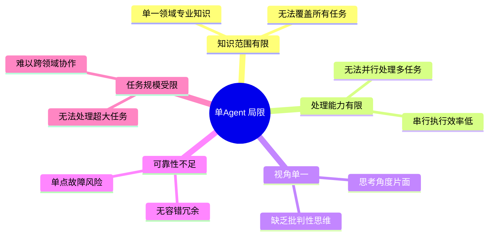

| 场景 | 单 Agent 表现 | 说明 |
|------|-------------|------|
| **大型软件开发** | 效率低下 | 单个 Agent 无法同时承担需求分析、架构设计、前后端开发、测试等多角色 |
| **复杂问题求解** | 易片面 | 单一视角可能忽略关键因素 |
| **高并发任务** | 能力不足 | 串行执行成为瓶颈 |
| **高可靠性要求** | 风险高 | 单点失败导致任务中断 |

### 1.2 多 Agent 系统的诞生背景

Multi-Agent 系统(MAS)的思想源于人类社会的协作模式——**通过多个具有独立能力的个体协同,完成远超单个个体能力的复杂任务**。

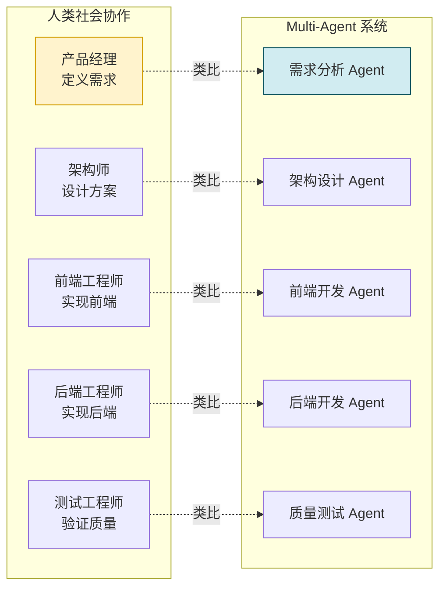

### 1.3 什么是 Multi-Agent 系统

**Multi-Agent 系统(Multi-Agent System,简称 MAS)** 是指由**多个具有独立感知、决策、行动能力的智能体(Agent)**,通过**相互通信、协作、协商**,共同完成单个 Agent 难以高效完成的复杂任务的分布式智能系统。

---

## 二、Multi-Agent 系统核心定义

### 2.1 学术定义

学术界对 Multi-Agent 系统的经典定义:

> Multi-Agent 系统是由多个位于同一环境中、相互间能够感知和通信的自主 Agent 所组成的系统。系统中的每个 Agent 都具有独立的目标和行为能力,Agent 之间通过协作与协调来实现系统的整体目标。

### 2.2 通俗理解

用一句话理解 Multi-Agent:

> **"一个好汉三个帮"——通过多个专业 Agent 分工协作,像一个小型团队一样高效工作。**

| 类比对象 | Multi-Agent 对应 | 说明 |
|---------|-----------------|------|
| **软件开发团队** | 开发团队多 Agent | PM / 架构师 / 前端 / 后端 / 测试 |
| **医院科室** | 医疗多 Agent | 问诊医生 / 检验师 / 影像医生 / 会诊医生 |
| **公司组织** | 企业多 Agent | CEO / CTO / CFO / 市场 / 销售 / 人力 |
| **足球比赛** | 比赛多 Agent | 门将 / 后卫 / 中场 / 前锋 |

### 2.3 与其他系统的区别

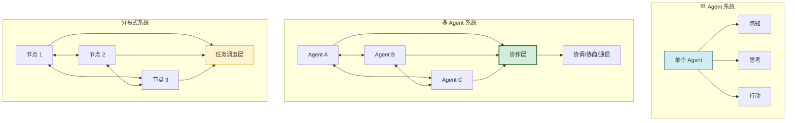

| 对比维度 | 单 Agent | 多 Agent | 传统分布式系统 |
|---------|---------|---------|--------------|
| **个体能力** | 通用全能 | 各自专业分工 | 功能相同/相似 |
| **通信目的** | 无 | 协作/协商/谈判 | 数据同步/任务分配 |
| **决策模式** | 集中决策 | 自主决策 + 协商 | 集中式调度 |
| **智能性** | 单体智能 | 群体涌现智能 | 无智能,按规则执行 |
| **目标关系** | 单目标 | 共同目标 + 子目标 | 相同目标 |

### 2.4 Multi-Agent 系统的核心要素

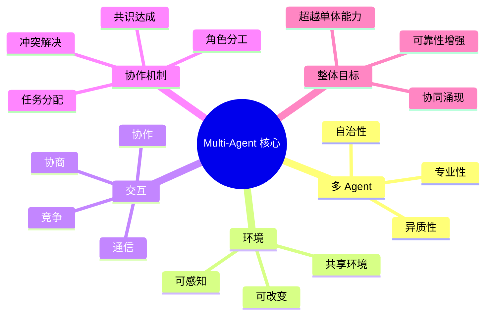

---

## 三、Multi-Agent 系统主要特征

### 3.1 八大核心特征

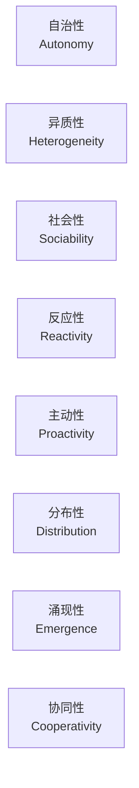

#### 3.1.1 自治性(Autonomy)

**定义**:每个 Agent 能够独立运作,自主决策,无需外部指令控制。

**说明**:
- Agent 有自己的目标、知识库和决策逻辑
- 可以自主选择行动,不需要被中央系统精确控制
- 类似团队成员各自负责自己的工作,不是被逐行指令调度

**示例**:
```
软件开发多 Agent 中:
- 测试 Agent 发现 Bug 后,可以自主决定是否先进行初步诊断再上报
- 无需等待中央系统"命令"它去诊断
```

#### 3.1.2 异质性(Heterogeneity)

**定义**:系统中的 Agent 在角色、能力、知识、目标上存在差异。

**说明**:
- 不同 Agent 承担不同职责(如"分析师 Agent"和"执行者 Agent")
- Agent 可以使用不同模型(小模型分类 + 大模型推理)
- Agent 可以拥有不同的知识背景和行为风格

**示例**:
```
医疗多 Agent 系统:
- 问诊 Agent:擅长问答和症状采集(参数:对话模型)
- 检验解读 Agent:擅长分析化验报告(参数:多模态模型)
- 影像诊断 Agent:擅长识别医学影像(参数:视觉模型)
```

#### 3.1.3 社会性(Sociability)

**定义**:Agent 之间能够通过通信语言进行交流、协作、协商。

**说明**:
- Agent 有标准的通信协议和消息格式
- 可以请求其他 Agent 的帮助
- 可以与其他 Agent 协商解决冲突

**示例**:
```
Agent A: 我需要一份用户数据分析报告,你能帮忙处理数据吗?
Agent B: 好的,需要处理哪些用户的数据?什么维度?
Agent A: 最近30天的活跃用户,维度是留存率和转化率
Agent B: 明白了,预计需要 2 分钟完成
```

#### 3.1.4 反应性(Reactivity)

**定义**:Agent 能够感知环境变化,并对变化做出及时响应。

**说明**:
- 持续监控环境状态
- 对突发事件快速反应
- 调整自身行为以适应变化

**示例**:
```
电商运营多 Agent:
- 定价 Agent 实时监控竞品价格
- 一旦竞品降价,自动触发价格调整决策
- 库存 Agent 同步检查库存是否充足
```

#### 3.1.5 主动性(Proactivity)

**定义**:Agent 不仅被动响应,还能主动采取行动实现目标。

**说明**:
- 主动寻找实现目标的机会
- 主动发起协作请求
- 主动预测问题并提前处理

**示例**:
```
项目管理多 Agent:
- 进度 Agent 不仅在询问时才报告进度
- 当发现任务可能延期时,主动向项目经理 Agent 发出预警
- 主动建议资源调配方案
```

#### 3.1.6 分布性(Distribution)

**定义**:Agent 在物理或逻辑上分布,没有集中式的单点控制。

**说明**:
- 各个 Agent 可以部署在不同服务器上
- 系统没有绝对的中央控制点
- 每个 Agent 有自己的运行时和内存空间

**示例**:
```
跨地域的客服多 Agent 系统:
- 北京节点:处理中文客服 Agent
- 上海节点:处理订单查询 Agent
- 广州节点:处理售后问题 Agent
- 各节点独立运行,通过消息队列通信
```

#### 3.1.7 涌现性(Emergence)

**定义**:通过多个 Agent 的简单交互,系统整体呈现出个体不具备的高级智能行为。

**说明**:
- 群体智能不是个体智能的简单叠加
- "1+1>2"的协同效应
- 从局部协作中涌现全局最优

**示例**:
```
蚁群觅食(自然界的 Multi-Agent):
- 单个蚂蚁:只会随机寻找食物 + 留下信息素
- 蚁群整体:能找到从蚁巢到食物的最短路径
                ← 这就是涌现性!
```

#### 3.1.8 协同性(Cooperativity)

**定义**:Agent 为了实现共同目标,愿意共享信息和资源,相互配合。

**说明**:
- 信息共享而非信息孤岛
- 能力互补而非各自为战
- 以团队目标优先而非个体目标

**示例**:
```
数据分析多 Agent:
- 采集 Agent 获取原始数据后,主动传递给清洗 Agent
- 清洗 Agent 完成后,主动传递给分析 Agent
- 分析 Agent 分析后,主动传递给可视化 Agent
- 最终共同生成分析报告
```

### 3.2 特征对比速记表

| 特征 | 关键词 | 一句话说明 |
|------|--------|-----------|
| 自治性 | 自己做主 | 每个 Agent 自己决策,不需要被逐行控制 |
| 异质性 | 各有专长 | 不同 Agent 有不同的角色和能力 |
| 社会性 | 善于沟通 | Agent 之间可以对话、协商、协作 |
| 反应性 | 见机行事 | 感知环境变化,及时做出响应 |
| 主动性 | 未雨绸缪 | 主动行动,不是被动等待指令 |
| 分布性 | 去中心化 | 分散部署,没有绝对的中央控制点 |
| 涌现性 | 1+1>2 | 个体协作产生超出单体的群体智能 |
| 协同性 | 齐心协力 | 为了共同目标,主动配合相互支持 |

---

## 四、Multi-Agent 系统组成要素

### 4.1 组成要素全景

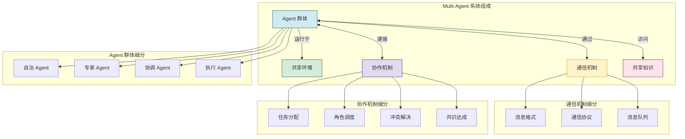

### 4.2 要素一:Agent 群体

Agent 是 Multi-Agent 系统的核心执行单元,按职责可分为:

| 类型 | 职责 | 典型例子 |
|------|------|---------|
| **自治 Agent** | 独立完成特定任务,具备完整能力 | 代码开发 Agent、文档撰写 Agent |
| **专家 Agent** | 专注某一领域,提供深度能力 | 医疗诊断 Agent、法律咨询 Agent |
| **协调 Agent** | 负责分配任务、协调其他 Agent | PM Agent、任务调度 Agent |
| **执行 Agent** | 具体执行原子操作 | API 调用 Agent、文件操作 Agent |
| **监控 Agent** | 监控系统状态和执行结果 | 日志 Agent、质量检测 Agent |

**代码示例:Agent 角色定义**

```python
from dataclasses import dataclass, field
from enum import Enum
from typing import list

class AgentRole(Enum):
    """Agent 角色枚举"""
    COORDINATOR = "coordinator"      # 协调者
    EXPERT = "expert"                 # 领域专家
    EXECUTOR = "executor"             # 执行者
    MONITOR = "monitor"               # 监控者
    SUPPORT = "support"               # 支持者

@dataclass
class AgentProfile:
    """Agent 画像定义"""
    agent_id: str
    name: str
    role: AgentRole
    description: str
    capabilities: list[str]          # 能力清单
    knowledge_domains: list[str]     # 知识领域
    communication_style: str         # 沟通风格
    tools: list[str]                 # 可使用工具
    max_concurrent_tasks: int = 1    # 最大并发任务
```

### 4.3 要素二:共享环境

共享环境是 Agent 群体共同运行和交互的场所:

| 环境类型 | 说明 | 例子 |
|---------|------|------|
| **运行环境** | 软件运行的物理/虚拟环境 | 服务器集群、K8s 集群 |
| **数据环境** | Agent 可访问的数据源 | 数据库、文件系统、API |
| **任务环境** | 待完成的任务池 | 任务队列、待办列表 |
| **通信环境** | Agent 之间的消息传递通路 | 消息总线、共享内存 |

**环境感知示例**

```python
@dataclass
class SharedEnvironment:
    """共享环境"""
    task_queue: list[Task]                          # 任务队列
    data_sources: dict[str, DataSource]             # 数据源注册
    shared_memory: dict[str, Any]                   # 共享内存
    communication_bus: MessageBus                   # 消息总线
    resource_pool: dict[str, Resource]              # 资源池
    system_state: SystemState                       # 系统状态

    def publish_state(self, key: str, value: Any):
        """Agent 发布状态到共享环境"""
        self.shared_memory[key] = value
        # 通知订阅者状态变化
        self.communication_bus.broadcast(
            topic="state_change",
            message={"key": key, "value": value}
        )

    def subscribe_state(self, key: str, callback):
        """Agent 订阅状态变化"""
        self.communication_bus.subscribe(
            topic="state_change",
            filter=lambda msg: msg["key"] == key,
            callback=callback
        )
```

### 4.4 要素三:通信机制

Agent 之间需要可靠的通信机制传递信息:

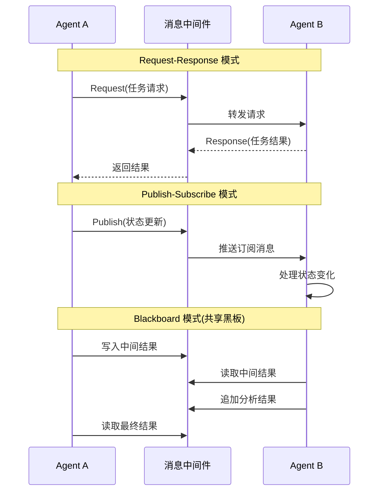

| 通信模式 | 说明 | 适用场景 |
|---------|------|---------|
| **点对点 (Direct)** | Agent A 直接发送给 Agent B | 定向请求,如"帮我分析数据" |
| **发布订阅 (Pub/Sub)** | 发布者广播,订阅者接收 | 状态通知,如"数据已更新" |
| **黑板模式 (Blackboard)** | 通过共享存储读写 | 协同解题,如多步骤推理 |
| **消息队列 (Queue)** | 生产者发送到队列,消费者消费 | 任务分发,如批量处理 |

**通信消息格式示例**

```json
{
    "message_id": "msg_20260807_001",
    "sender_id": "agent_analyst",
    "receiver_id": "agent_visualizer",
    "timestamp": 1723017600.0,
    "message_type": "task_request",
    "conversation_id": "conv_project_001",
    "payload": {
        "task_id": "task_vis_001",
        "task_type": "generate_chart",
        "task_data": {
            "data_source": "analysis_results.json",
            "chart_type": "bar",
            "title": "月度销售分析"
        },
        "priority": "high",
        "deadline": 1723021200.0
    },
    "requires_response": true,
    "response_timeout": 300
}
```

### 4.5 要素四:协作机制

协作机制是 Multi-Agent 系统的灵魂,决定了 Agent 群体如何协同工作:

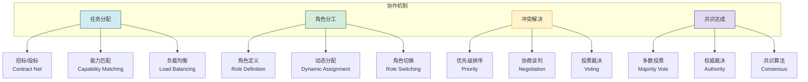

**协作机制代码示例**

```python
class TaskAllocator:
    """任务分配器"""

    def allocate_task(self, task: Task, agents: list[AgentProfile]) -> str:
        """选择最适合的 Agent 分配任务"""
        # 1. 能力匹配评分
        scored = []
        for agent in agents:
            score = self._score_agent_capability(task, agent)
            scored.append((agent, score))

        # 2. 负载均衡修正
        for i, (agent, score) in enumerate(scored):
            load_factor = agent.current_load / agent.max_concurrent_tasks
            adjusted_score = score * (1.0 - load_factor * 0.5)
            scored[i] = (agent, adjusted_score)

        # 3. 选择得分最高者
        scored.sort(key=lambda x: x[1], reverse=True)
        best_agent = scored[0][0]

        return best_agent.agent_id

    def _score_agent_capability(self, task: Task, agent: AgentProfile) -> float:
        """评估 Agent 对任务的能力匹配度"""
        score = 0.0
        # 能力关键词匹配
        for cap in agent.capabilities:
            if cap in task.required_capabilities:
                score += 0.3
        # 知识领域匹配
        for domain in agent.knowledge_domains:
            if domain in task.domain:
                score += 0.4
        # 历史表现
        score += agent.task_success_rate * 0.3
        return min(score, 1.0)
```

### 4.6 要素五:共享知识

共享知识是 Agent 群体的公共认知基础:

| 知识类型 | 说明 | 示例 |
|---------|------|------|
| **本体知识** | 概念定义和关系 | "客户订单"包含哪些字段 |
| **流程知识** | 标准工作流程 | 客户投诉处理的标准步骤 |
| **规则知识** | 业务规则和约束 | "VIP 客户优先处理" |
| **上下文知识** | 当前任务的上下文 | 当前项目的背景和目标 |
| **经验知识** | 历史案例和教训 | 过去处理类似问题的成功经验 |

---

## 五、Multi-Agent 系统工作原理

### 5.1 整体工作流程

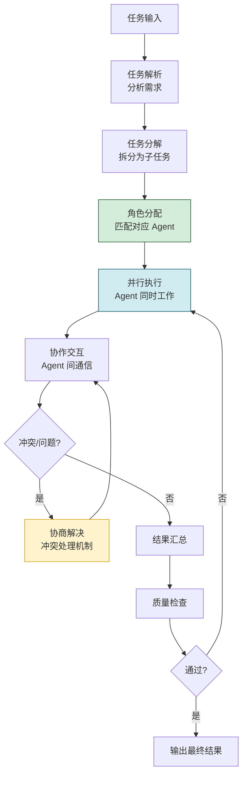

### 5.2 分阶段详解

#### 阶段一:任务解析与分解

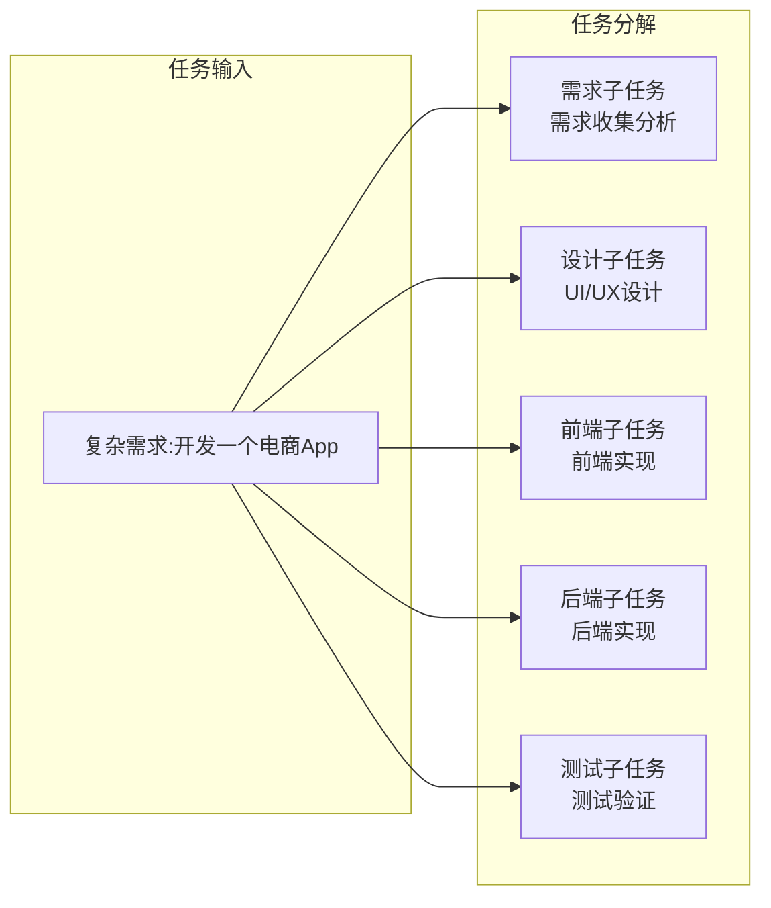

**任务分解代码示例**

```python
class TaskDecomposer:
    """任务分解器"""

    def decompose(self, task: Task) -> list[SubTask]:
        """将大任务分解为子任务"""
        prompt = f"""请将以下任务分解为可独立执行的子任务,
        定义每个子任务的名称、所需能力、输入输出:

        任务名称: {task.name}
        任务描述: {task.description}

        输出格式(JSON):
        {{
            "subtasks": [
                {{
                    "name": "子任务名称",
                    "description": "子任务描述",
                    "required_capabilities": ["能力1", "能力2"],
                    "inputs": ["输入1"],
                    "outputs": ["输出1"],
                    "dependencies": ["依赖的子任务名称"]
                }}
            ]
        }}
        """
        # LLM 分解任务
        result = self.llm.generate(prompt)
        subtasks = json.loads(result)["subtasks"]
        return [SubTask(**st) for st in subtasks]
```

#### 阶段二:角色分配与调度

```python
class RoleScheduler:
    """角色调度器"""

    def __init__(self, agent_registry: AgentRegistry):
        self.agent_registry = agent_registry

    def assign_roles(self, subtasks: list[SubTask]) -> dict[str, str]:
        """为子任务分配 Agent"""
        assignments = {}

        for subtask in subtasks:
            # 获取所有在线 Agent
            available_agents = self.agent_registry.get_available_agents()

            # 为子任务选择最合适的 Agent
            best_agent = self._select_best_agent(subtask, available_agents)
            assignments[subtask.id] = best_agent.agent_id

            # 标记 Agent 忙碌
            self.agent_registry.mark_busy(best_agent.agent_id)

        return assignments
```

#### 阶段三:并行执行与协作

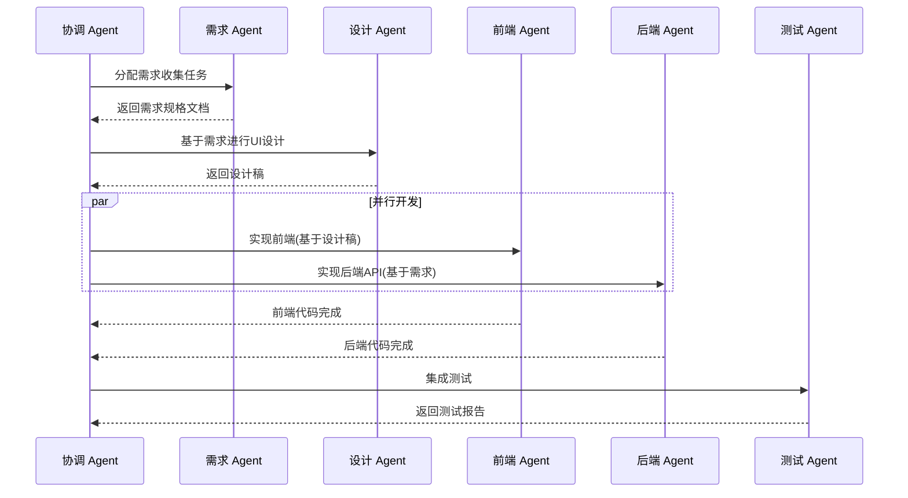

**并行执行实现**

```python
class ParallelExecutor:
    """并行执行器"""

    async def execute_parallel(self, assignments: dict[str, str],
                                 subtasks: list[SubTask]) -> dict[str, TaskResult]:
        """并行执行多个子任务"""
        # 创建并发任务
        coroutines = []
        for subtask_id, agent_id in assignments.items():
            subtask = next(st for st in subtasks if st.id == subtask_id)
            agent = self.agent_registry.get_agent(agent_id)
            coroutines.append(agent.execute(subtask))

        # 并发执行
        results = await asyncio.gather(*coroutines, return_exceptions=True)

        # 整理结果
        result_map = {}
        for (subtask_id, agent_id), result in zip(assignments.items(), results):
            if isinstance(result, Exception):
                result_map[subtask_id] = TaskResult(
                    status="failed", error=str(result)
                )
            else:
                result_map[subtask_id] = result

        return result_map
```

#### 阶段四:结果汇总与质量检查

```python
class ResultAggregator:
    """结果汇总器"""

    def aggregate(self, subtask_results: dict[str, TaskResult]) -> FinalResult:
        """汇总子任务结果"""
        # 1. 检查是否所有子任务成功
        failures = [st_id for st_id, res in subtask_results.items()
                    if res.status == "failed"]
        if failures:
            return FinalResult(
                status="partial_failure",
                failed_subtasks=failures,
                partial_results=subtask_results
            )

        # 2. 按依赖顺序组装结果
        assembled_output = self._assemble_results(subtask_results)

        # 3. 质量检查
        quality_report = self.quality_checker.check(assembled_output)
        if not quality_report.passed:
            return FinalResult(
                status="quality_failed",
                quality_issues=quality_report.issues,
                results=subtask_results
            )

        return FinalResult(
            status="success",
            output=assembled_output,
            quality_report=quality_report
        )
```

---

## 六、Multi-Agent 系统分类体系

### 6.1 按协作模式分类

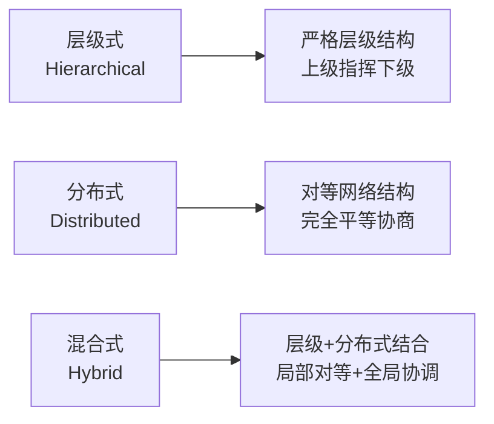

| 模式 | 结构 | 说明 | 优点 | 缺点 |
|------|------|------|------|------|
| **层级式** | Boss → Manager → Worker | 严格的上下级关系,中央协调 | 控制简单,权责清晰 | 中央瓶颈,扩展性有限 |
| **分布式** | 所有 Agent 对等 | Agent 直接协商,无中央控制 | 扩展性好,容错高 | 协调复杂,难控全局 |
| **混合式** | 全局协调 + 局部对等 | 全局有协调者,局部自由协作 | 兼顾可控性和灵活性 | 设计复杂度高 |

### 6.2 按目标关系分类

| 类型 | Agent 间目标关系 | 典型场景 |
|------|-----------------|---------|
| **合作型 (Cooperative)** | 目标完全一致 | 软件开发团队、数据分析流水线 |
| **竞争型 (Competitive)** | 目标相互冲突 | 博弈论、价格谈判、拍卖系统 |
| **自利型 (Self-interested)** | 各自优化自身目标 | 市场经济模拟、资源分配 |
| **混合型 (Hybrid)** | 部分合作部分竞争 | 企业内部部门协作(合作但有 KPI 竞争) |

### 6.3 按通信拓扑分类

| 拓扑类型 | 结构 | 通信效率 | 容错性 | 适用场景 |
|---------|------|---------|--------|---------|
| **星型** | 中心节点连接所有 | 高效 | 中心故障致命 | 层级式协作 |
| **总线型** | 共享通信总线 | 中等 | 总线故障致命 | 黑板模式 |
| **环型** | Agent 连成环 | 中等 | 单点故障不致命 | 轮询任务分配 |
| **网状** | Agent 可直接互联 | 最高 | 容错性最强 | 分布式协作 |

---

## 七、典型应用场景

### 7.1 软件工程:代码开发多 Agent

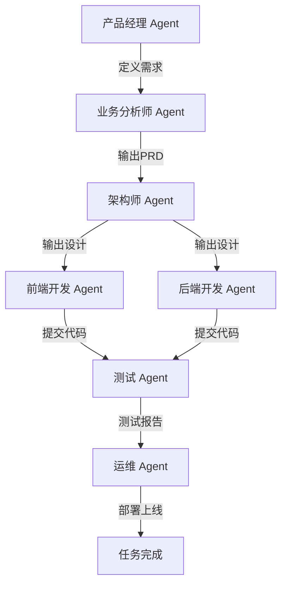

**应用场景说明**

| Agent 角色 | 职责 | 典型任务 |
|-----------|------|---------|
| **产品经理 Agent** | 需求分析、优先级排序 | 用户故事撰写、需求文档生成 |
| **架构师 Agent** | 技术选型、架构设计 | 技术方案、UML 图、接口定义 |
| **开发 Agent** | 代码实现 | 前后端代码、单元测试、Code Review |
| **测试 Agent** | 质量保证 | 测试用例、自动化测试、Bug 报告 |
| **运维 Agent** | 部署运维 | CI/CD、监控告警、故障排查 |

### 7.2 企业服务:智能办公多 Agent

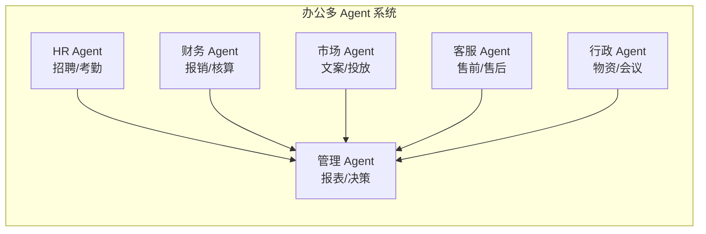

### 7.3 医疗健康:辅助诊疗多 Agent

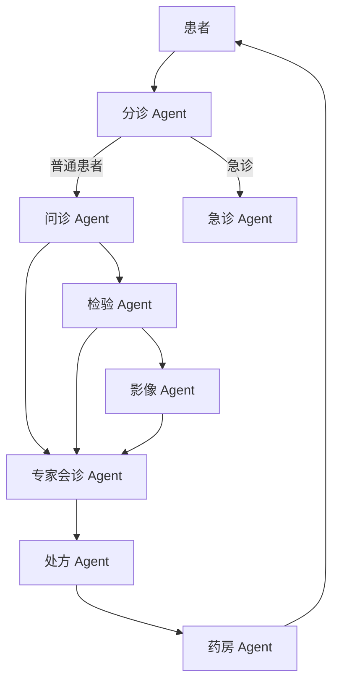

**医疗领域优势**:
- **专业能力**:不同 Agent 专攻不同医学领域
- **多重校验**:多个 Agent 交叉验证诊断结果,减少误诊
- **效率提升**:检验、影像、诊断并行进行,缩短就医时间

### 7.4 内容创作:多媒体制作多 Agent

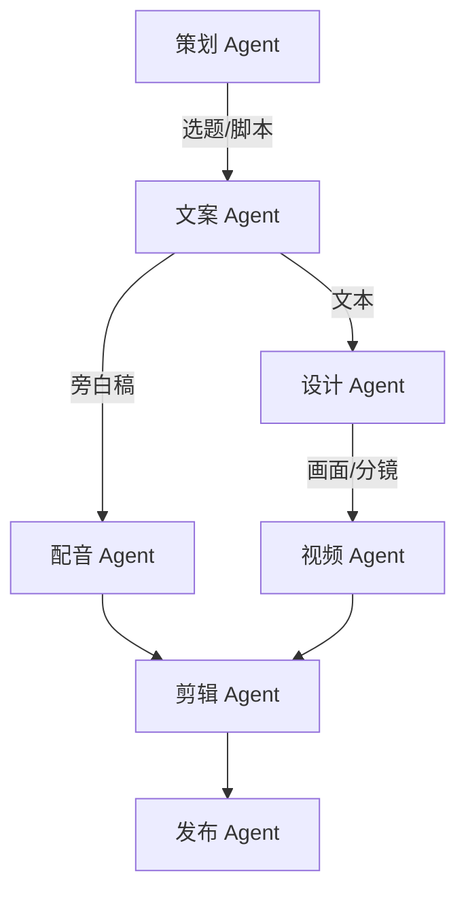

### 7.5 科学研究:学术研究多 Agent

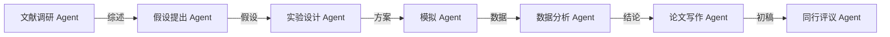

### 7.6 场景对比汇总

| 应用领域 | 代表 Agent | 核心价值 |
|---------|-----------|---------|
| **软件开发** | PM / 架构 / 开发 / 测试 / 运维 | 模拟完整开发团队,提升开发效率 |
| **企业办公** | HR / 财务 / 市场 / 客服 / 行政 | 自动化各职能工作,降低人力成本 |
| **医疗健康** | 分诊 / 问诊 / 检验 / 会诊 | 提升诊断准确性,加速诊疗流程 |
| **内容创作** | 策划 / 文案 / 设计 / 视频 | 流水线式内容生产,规模化输出 |
| **科学研究** | 文献 / 假设 / 实验 / 分析 | 加速科研过程,辅助研究发现 |
| **金融投资** | 研究 / 风控 / 交易 / 合规 | 多维度分析,降低投资风险 |

---

## 八、Multi-Agent vs 单 Agent 对比

### 8.1 能力对比

| 能力维度 | 单 Agent | 多 Agent |
|---------|---------|---------|
| **任务复杂度** | 适合中等复杂度 | 可处理超复杂任务 |
| **处理效率** | 串行,效率有限 | 并行,效率成倍提升 |
| **专业深度** | 知识广度受限 | 各 Agent 专攻,深度更高 |
| **可靠性** | 单点故障 | 冗余容错,可靠性高 |
| **扩展能力** | 垂直扩展(加算力) | 水平扩展(加 Agent) |
| **视角多样性** | 单一视角 | 多视角,相互制衡 |
| **协作能力** | 无 | 核心能力,专业协作 |

### 8.2 适用场景

| 场景 | 推荐方案 | 原因 |
|------|---------|------|
| **简单问答对话** | 单 Agent | 任务简单,多 Agent 反而增加复杂度 |
| **文档翻译** | 单 Agent | 单任务流,无需分工 |
| **小型工具助手** | 单 Agent | 调用工具,顺序执行即可 |
| **大型软件开发** | 多 Agent | 角色众多,需要分工协作 |
| **复杂决策支持** | 多 Agent | 需要多角度分析,交叉验证 |
| **高并发任务处理** | 多 Agent | 并行处理,吞吐量高 |
| **高可靠性要求** | 多 Agent | 冗余备份,容错性强 |
| **多角色协作流程** | 多 Agent | 天然匹配角色分工 |

### 8.3 选择决策树

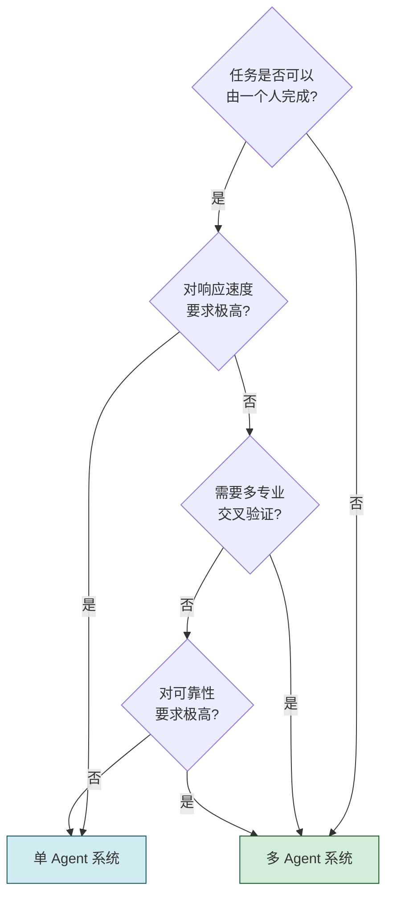

---

## 九、总结与展望

### 9.1 核心要点总结

| 概念 | 一句话总结 |
|------|-----------|
| **Multi-Agent 定义** | 多个独立智能体通过协作共同完成复杂任务的分布式智能系统 |
| **核心价值** | 通过分工协作,实现"1+1>2"的群体智能涌现 |
| **八大特征** | 自治性、异质性、社会性、反应性、主动性、分布性、涌现性、协同性 |
| **五大要素** | Agent 群体、共享环境、通信机制、协作机制、共享知识 |
| **工作流程** | 任务解析 → 任务分解 → 角色分配 → 并行执行 → 协作交互 → 结果汇总 |
| **典型应用** | 软件开发、企业办公、医疗健康、内容创作、科学研究等 |

### 9.2 Multi-Agent 系统的优势

1. **能力提升**:多专业 Agent 协同,覆盖更广的知识和能力
2. **效率提升**:并行执行多任务,缩短整体处理时间
3. **可靠性强**:无单点故障,冗余 Agent 可互为备份
4. **质量更高**:多 Agent 交叉验证,减少错误和偏见
5. **扩展灵活**:水平扩展,按需增加 Agent 数量
6. **视角丰富**:多 Agent 多角度思考,避免片面决策

### 9.3 系列文档展望

作为 `8多 Agent 系统` 系列的开篇文档,后续将深入探讨以下主题:

| 计划主题 | 说明 | 文档定位 |
|---------|------|---------|
| **Multi-Agent 协作机制详解** | 任务分配、协商协议、冲突解决 | 核心机制深入 |
| **Multi-Agent 架构设计** | 系统架构、模块划分、接口定义 | 工程实现指南 |
| **Multi-Agent 通信协议** | 消息格式、通信模式、可靠性设计 | 技术规范 |
| **主流 Multi-Agent 框架对比** | CrewAI / AutoGen / LangGraph / MetaGPT | 工具选型指南 |
| **Multi-Agent 实战案例** | 软件开发团队完整实现 | 项目实战 |

---

> **核心结论**:Multi-Agent 系统的本质是**"用软件模拟人类团队协作模式"**——通过让每个 Agent 专注于自己的专业领域,再通过高效的通信和协作机制将它们组合起来,就能构建出远超单个 Agent 能力的强大智能系统。从单体智能到群体智能,是 Agent 技术发展的必然趋势。
