# Multi-Agent 系统架构设计模式深度解析

> **文档定位**:本文档是 `8多 Agent 系统` 系列的架构设计核心篇,系统梳理 Multi-Agent 系统的**主要架构设计模式**。在 [1Multi-Agent多智能体系统核心概念详解.md](./1Multi-Agent多智能体系统核心概念详解.md) 阐述"什么是 MAS、有哪些组成要素"的基础上,本文深入回答"**多个 Agent 应该如何组织、如何通信、如何协作**"这一核心工程问题。涵盖分布式问题求解、层次化控制、协商协调、市场机制、黑板共享、网络对等、发布订阅、投票共识、角色扮演、涌现自组织等十大经典模式,每种模式均提供结构示意图、组件构成、通信机制、协作方式、技术要点、优劣分析与实战案例。
>
> **阅读建议**:本文是架构选型与设计文档,建议结合 [1Multi-Agent多智能体系统核心概念详解.md](./1Multi-Agent多智能体系统核心概念详解.md) 一并阅读。文中部分模式(如层次化、合同网)可与 `3Agent 架构设计` 目录下的 [40Plan-and-Execute_Agent完整实现方案.md](../3Agent%20架构设计/40Plan-and-Execute_Agent完整实现方案.md)、[49Agent复杂业务流程处理架构完整设计方案.md](../3Agent%20架构设计/49Agent复杂业务流程处理架构完整设计方案.md) 对照参考。

---

## 目录

- [一、引言:为什么需要架构设计模式](#一引言为什么需要架构设计模式)
- [二、架构模式分类体系总览](#二架构模式分类体系总览)
- [三、分布式问题求解模式(DPS)](#三分布式问题求解模式dps)
- [四、层次化控制模式(Hierarchical)](#四层次化控制模式hierarchical)
- [五、协商与协调模式(Negotiation & Coordination)](#五协商与协调模式negotiation--coordination)
- [六、市场机制模式(Market/Auction)](#六市场机制模式marketauction)
- [七、黑板共享模式(Blackboard)](#七黑板共享模式blackboard)
- [八、网络对等模式(Network/P2P)](#八网络对等模式networkp2p)
- [九、发布订阅与事件驱动模式(Pub-Sub)](#九发布订阅与事件驱动模式pub-sub)
- [十、投票与共识模式(Voting/Consensus)](#十投票与共识模式votingconsensus)
- [十一、角色扮演模式(Role-playing)](#十一角色扮演模式role-playing)
- [十二、涌现式自组织模式(Emergent)](#十二涌现式自组织模式emergent)
- [十三、模式对比与选型指南](#十三模式对比与选型指南)
- [十四、实际应用案例](#十四实际应用案例)
- [十五、最佳实践与避坑指南](#十五最佳实践与避坑指南)

---

## 一、引言:为什么需要架构设计模式

### 1.1 同样的"多 Agent",截然不同的效果

同样是把多个 LLM Agent 放在一起,不同的组织方式会产生截然不同的效果:

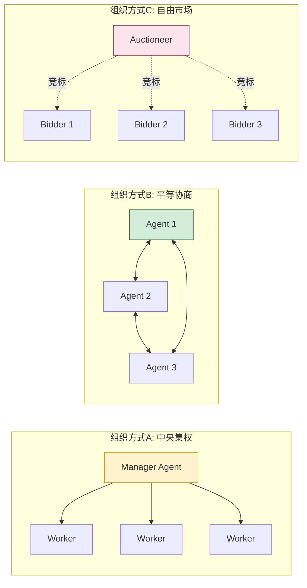

> **核心问题**:面对具体业务,应该选哪种组织方式? Agent 之间如何通信? 谁来决策? 失败了如何处理? 这些问题正是"架构设计模式"要回答的。

### 1.2 架构模式的本质

**Multi-Agent 架构设计模式** 是对"多个 Agent 协同完成任务的**结构性方案**"的抽象与总结,它定义了:

| 维度 | 模式所定义的内容 |
|------|----------------|
| **角色与职责** | 系统中有哪几类 Agent,各自的职责边界 |
| **拓扑结构** | Agent 之间的连接关系(星型/网状/树型/总线) |
| **控制流** | 谁指挥谁、决策权在哪、命令如何下达 |
| **数据流** | 信息如何流转、共享状态如何维护 |
| **通信协议** | Agent 之间"说什么、怎么说、什么时候说" |
| **协作机制** | 如何分工、如何同步、如何合并结果 |
| **失败处理** | Agent 崩溃/失联时的兜底策略 |

### 1.3 本文研究范围

本文聚焦**通用的、可复用的架构设计模式**,而非具体框架(AutoGen/CrewAI/LangGraph)的用法。重点回答三个工程问题:

1. **有哪些**经典模式?(分类与特征)
2. **怎么选**适合的模式?(适用场景与选型)
3. **怎么用**得好?(技术要点与避坑)

---

## 二、架构模式分类体系总览

### 2.1 按控制结构分类

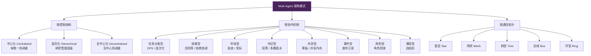

### 2.2 十大经典模式速查表

| # | 模式名称 | 核心思想 | 控制结构 | 典型代表算法/协议 |
|---|---------|---------|---------|------------------|
| 1 | **分布式问题求解 DPS** | 全局问题分解 → 子问题并行求解 → 结果汇总 | 中心化(分解器) | Contract Net、FA/CN |
| 2 | **层次化控制 Hierarchical** | Manager-Worker 树状结构,逐层下达任务 | 层次化 | Manager-Worker、Hierarchical Planner |
| 3 | **协商与协调 Negotiation** | Agent 通过对话达成一致(任务分配、资源分配) | 去中心化 | 合同网协议 CNP、Argumentation |
| 4 | **市场机制 Market/Auction** | 用"价格/竞价"作为协调信号,拍卖分配任务 | 去中心化(拍卖者) | English Auction、Vickrey、CBA |
| 5 | **黑板共享 Blackboard** | 共享工作空间,Agent 异步读写,触发驱动 | 中心化(黑板) | Hearsay-II、BB1 |
| 6 | **网络对等 P2P** | Agent 间点对点直接通信,无中心节点 | 去中心化 | Gossip、P2P Overlay |
| 7 | **发布订阅 Pub-Sub** | 事件驱动,生产者发布、消费者订阅 | 去中心化(总线) | Event Bus、Message Broker |
| 8 | **投票共识 Voting/Consensus** | 多 Agent 提案,投票/辩论决策 | 去中心化 | Plurality、Borda、Paxos |
| 9 | **角色扮演 Role-playing** | 模拟社会角色,通过对话协作 | 混合 | CAMEL、Social Simulation |
| 10 | **涌现式自组织 Emergent** | 简单局部规则 → 复杂全局行为涌现 | 完全去中心化 | Boids、Swarm Intelligence |

### 2.3 模式选择的决策树

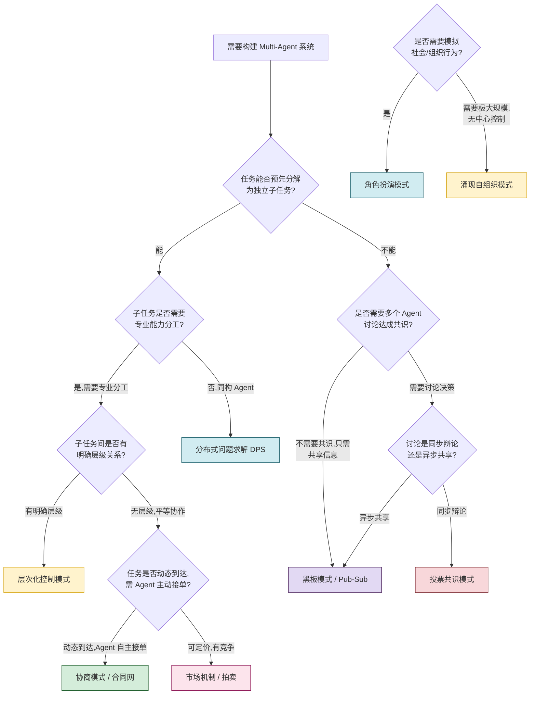

---

## 三、分布式问题求解模式(DPS)

### 3.1 模式核心思想

**分布式问题求解(Distributed Problem Solving,DPS)** 是最早出现的 MAS 模式之一,其核心思想是:**将一个全局复杂问题分解为若干相对独立的子问题,分配给多个专业 Agent 并行求解,最后汇总结果得到全局答案**。

### 3.2 结构示意图

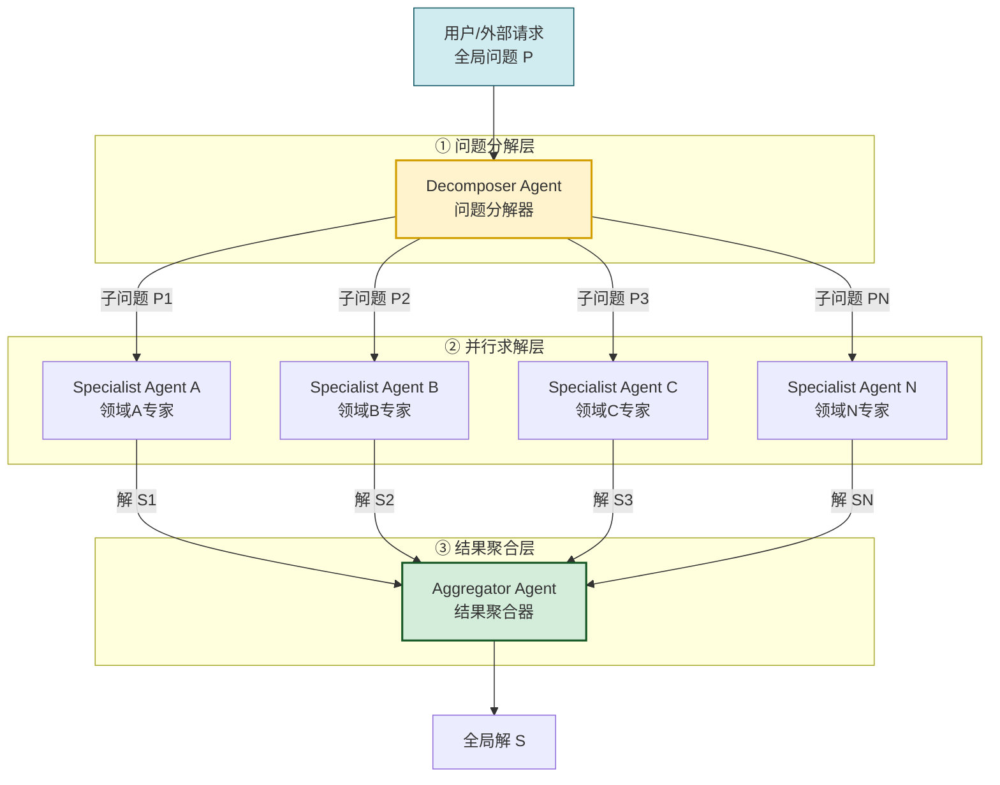

### 3.3 组件构成

| 组件 | 职责 | 关键能力 |
|------|------|---------|
| **Decomposer(分解器)** | 接收全局问题,分解为子问题 | 任务建模、依赖分析、子问题边界划分 |
| **Specialist(领域专家)** | 求解特定领域的子问题 | 领域知识、推理能力、工具调用 |
| **Aggregator(聚合器)** | 收集子解,合并为全局解 | 结果融合、冲突解决、一致性校验 |
| **任务分发器**(可选) | 调度子问题到合适的 Agent | 负载均衡、能力匹配 |

### 3.4 通信机制与协作方式

- **通信方式**:点对点(Decomposer → Specialist → Aggregator),通常不需要 Specialist 之间通信
- **通信内容**:任务描述(下行)、求解结果(上行)、状态查询(双向)
- **协作方式**:**任务并行** + **结果汇总**,Agent 之间松耦合
- **同步模型**:既可同步(等待所有子解)也可异步(流式聚合)

### 3.5 关键技术要点

```python
from dataclasses import dataclass, field
from typing import Any

@dataclass
class SubProblem:
    """子问题定义"""
    sub_id: str
    description: str
    required_capability: str           # 所需能力标签
    input_data: dict
    dependencies: list[str] = field(default_factory=list)  # 依赖的子问题ID
    timeout_seconds: int = 60

@dataclass
class SubSolution:
    """子解结果"""
    sub_id: str
    specialist_id: str
    result: Any
    confidence: float                  # 置信度,用于聚合权重
    error: str = None

class DPSOrchestrator:
    """DPS 模式编排器"""

    def __init__(self, decomposer, specialists: dict, aggregator):
        self.decomposer = decomposer
        self.specialists = specialists          # {capability: specialist_agent}
        self.aggregator = aggregator

    async def solve(self, global_problem: str) -> Any:
        # ① 分解
        sub_problems = await self.decomposer.decompose(global_problem)
        
        # ② 拓扑排序处理依赖
        execution_order = self._topological_sort(sub_problems)
        
        # ③ 分阶段并行求解
        solutions = {}
        for batch in execution_order:
            batch_solutions = await asyncio.gather(*[
                self._solve_one(sp, solutions) for sp in batch
            ])
            for sp, sol in zip(batch, batch_solutions):
                solutions[sp.sub_id] = sol
        
        # ④ 聚合
        return await self.aggregator.aggregate(list(solutions.values()))

    async def _solve_one(self, sp: SubProblem, prior_solutions: dict) -> SubSolution:
        specialist = self.specialists.get(sp.required_capability)
        if not specialist:
            return SubSolution(sp.sub_id, "none", None, 0.0, 
                              error=f"无匹配专家: {sp.required_capability}")
        
        # 注入依赖子问题的解作为输入
        if sp.dependencies:
            sp.input_data["prior_results"] = {
                dep_id: prior_solutions[dep_id].result for dep_id in sp.dependencies
            }
        
        try:
            result = await asyncio.wait_for(
                specialist.solve(sp), timeout=sp.timeout_seconds
            )
            return SubSolution(sp.sub_id, specialist.id, result, result.confidence)
        except asyncio.TimeoutError:
            return SubSolution(sp.sub_id, specialist.id, None, 0.0, error="超时")
```

### 3.6 优势与局限性

| 维度 | 优势 ✅ | 局限性 ❌ |
|------|--------|----------|
| **性能** | 子问题并行,大幅缩短总耗时 | 分解/聚合本身有开销,小任务不划算 |
| **可扩展性** | 增减 Specialist 不影响其他模块 | Decomposer/Aggregator 是单点,可能成为瓶颈 |
| **专业性** | 每个 Specialist 专注单一领域,效果好 | Specialist 之间无协作,可能丢掉跨领域洞察 |
| **容错性** | 单个 Specialist 失败不影响其他 | 分解器故障导致全局失败 |
| **适用性** | 子问题边界清晰的场景 | 子问题高度耦合、需频繁交互的场景不适合 |

### 3.7 实际应用案例

**案例:多学科医疗诊断系统**
- **Decomposer**:接收患者主诉,生成检查项目(血检、影像、心电等子问题)
- **Specialist**:血液科 Agent、影像科 Agent、心内科 Agent、内分泌科 Agent
- **Aggregator**:综合各科结论,输出最终诊断与治疗方案
- **特点**:各科独立诊断(可并行),最后汇总,符合医院实际工作流

---

## 四、层次化控制模式(Hierarchical)

### 4.1 模式核心思想

**层次化控制模式** 借鉴人类组织的**层级管理结构**:高层 Agent 负责战略规划与任务分解,中层 Agent 负责战术调度与协调,底层 Agent 负责具体执行。命令自上而下传达,结果自下而上汇报。

### 4.2 结构示意图

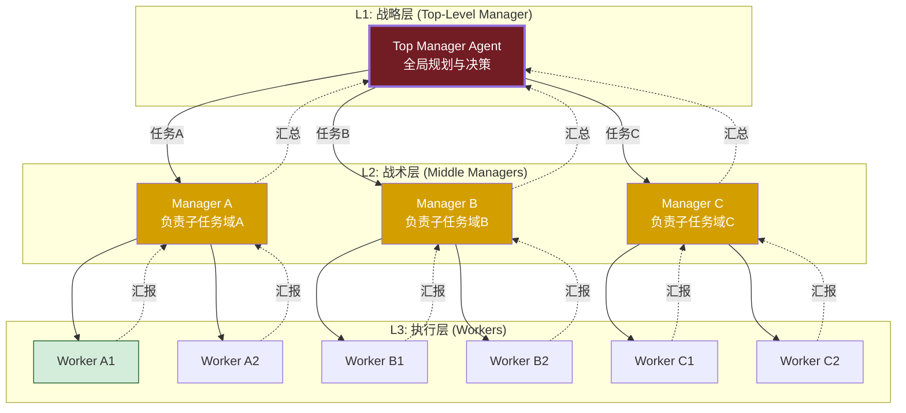

### 4.3 组件构成与职责分层

| 层级 | 角色 | 核心职责 | 决策权限 |
|------|------|---------|---------|
| **L1 战略层** | Top Manager | 全局目标解析、总规划、跨域协调 | 最高决策权,可重规划 |
| **L2 战术层** | Middle Manager | 子任务分解、Worker 调度、局部优化 | 子域内决策权 |
| **L3 执行层** | Worker | 单一任务执行、结果上报 | 仅执行,无决策权 |

### 4.4 通信机制

- **垂直通信**(主):上下级之间,命令下行、汇报上行
- **水平通信**(辅):同级 Manager 之间协调(可选,通常需经上级中转)
- **跨层禁止**:L1 不直接调 L3(管理跨度原则)

### 4.5 协作方式:Plan-Delegate-Execute-Report

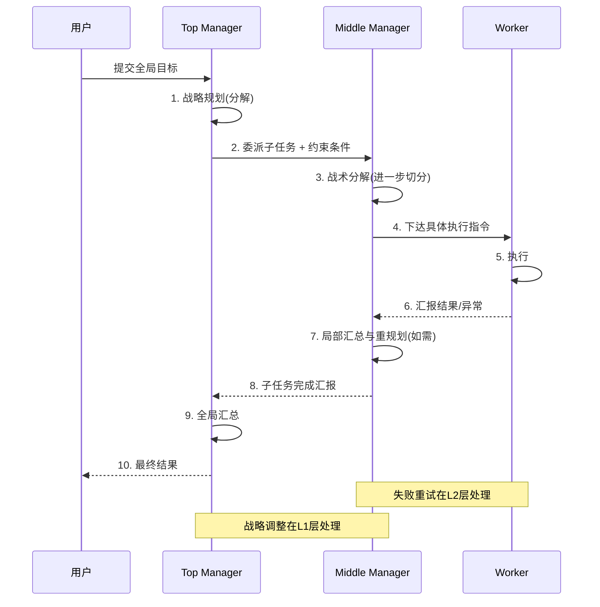

### 4.6 关键技术要点

1. **分层规划**:L1 做粗粒度规划,L2 做细粒度分解,避免 L1 过度细节化
2. **管理跨度控制**:每个 Manager 直接下属 5-9 个为宜(参考组织管理学)
3. **失败隔离**:Worker 失败由其直接 Manager 处理,不上抛给 Top Manager
4. **递归结构**:Manager 本质也是 Agent,可递归嵌套(子树即子 MAS)

```python
class HierarchicalManager:
    """层次化 Manager Agent"""

    def __init__(self, agent_id, role, llm, subordinates: list = None, parent=None):
        self.id = agent_id
        self.role = role            # top / middle / worker
        self.llm = llm
        self.subordinates = subordinates or []
        self.parent = parent

    async def execute(self, task: Task) -> Result:
        if self.role == "worker" or not self.subordinates:
            # 叶子节点:直接执行
            return await self._do_work(task)
        
        # 管理节点:分解 → 委派 → 汇总
        sub_tasks = await self._decompose(task)
        results = await asyncio.gather(*[
            sub.execute(st) for sub, st in zip(self._select_workers(sub_tasks), sub_tasks)
        ], return_exceptions=True)
        
        # 失败处理:重试或换 Worker
        results = await self._handle_failures(sub_tasks, results)
        
        # 汇总上报
        return await self._aggregate(results, task)

    async def _handle_failures(self, tasks, results):
        """失败在当前层级处理,不轻易上抛"""
        retry_results = []
        for task, result in zip(tasks, results):
            if isinstance(result, Exception):
                # 策略1:重试(最多2次)
                # 策略2:换Worker
                # 策略3:降级(简化任务)
                # 策略4:才上抛
                retry = await self._retry_with_fallback(task, result)
                retry_results.append(retry)
            else:
                retry_results.append(result)
        return retry_results
```

### 4.7 优势与局限性

| 维度 | 优势 ✅ | 局限性 ❌ |
|------|--------|----------|
| **可扩展性** | 易于横向扩展(增加同层节点) | 层级过深导致延迟累积、信息失真 |
| **可控性** | 责权清晰,易于监控管理 | 顶层单点故障影响全局 |
| **效率** | 分层决策,匹配复杂度层级 | 信息层层传递有损失(传话游戏效应) |
| **容错** | 局部失败局部处理 | 跨层协调困难 |
| **灵活性** | 局部调整不影响其他分支 | 整体重构成本高 |

### 4.8 实际应用案例

**案例:大型软件工程项目管理系统**
- **L1 Top Manager**:CTO Agent,负责整体项目规划(技术栈选型、里程碑)
- **L2 Middle Managers**:前端经理 Agent、后端经理 Agent、测试经理 Agent
- **L3 Workers**:React 开发 Agent、API 开发 Agent、单元测试 Agent、E2E 测试 Agent
- **特点**:每个开发 Agent 只需关心自己的模块,经理负责协调,完全映射现实研发团队

---

## 五、协商与协调模式(Negotiation & Coordination)

### 5.1 模式核心思想

**协商与协调模式** 强调:**多个自主 Agent 通过对话、协商、博弈,达成一致的任务分配或资源分配方案**。与 DPS 的"中心化分发"不同,协商模式下 Agent 是**自主的**,可以接受/拒绝任务,可以讨价还价。

最经典的协商协议是 **合同网协议(Contract Net Protocol,CNP)**。

### 5.2 结构示意图

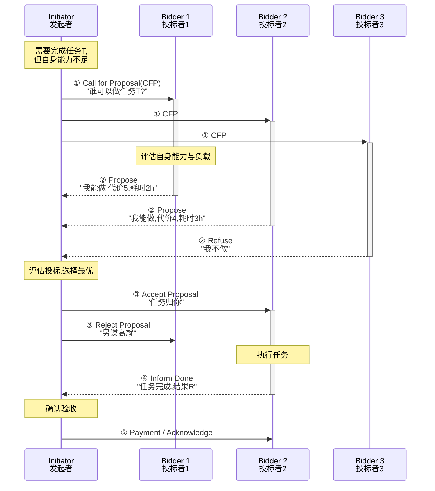

### 5.3 组件构成

| 组件 | 职责 |
|------|------|
| **Initiator(发起者)** | 识别需求,发布 CFP,收集投标,选择中标者,验收结果 |
| **Bidder(投标者)** | 接收 CFP,评估能力,提交投标,执行中标任务 |
| **协商协议** | 规定消息类型(CFP/Propose/Accept/Reject/Inform)与流转规则 |
| **评估函数** | Initiator 用于选择最优投标(代价、时间、质量综合) |

### 5.4 通信机制:经典 FIPA CNP 消息流

| 步骤 | 消息类型 | 方向 | 语义 |
|------|---------|------|------|
| ① | `cfp` (Call for Proposal) | Initiator → Bidders | 任务招标 |
| ② | `propose` | Bidder → Initiator | 提交投标(报价+时长) |
| ②' | `refuse` | Bidder → Initiator | 拒绝投标 |
| ②'' | `not-understood` | Bidder → Initiator | 不理解 CFP |
| ③ | `accept-proposal` | Initiator → Bidder | 中标通知 |
| ③' | `reject-proposal` | Initiator → Bidder | 未中标 |
| ④ | `inform-done` | Bidder → Initiator | 任务完成 |
| ④' | `failure` | Bidder → Initiator | 执行失败 |
| ⑤ | `inform-result` | Bidder → Initiator | 提交结果 |

### 5.5 协作方式:多轮协商

经典 CNP 是单轮的(一次 CFP → 一次投标 → 一次决策)。**扩展协商**支持多轮:

- **讨价还价(Bargaining)**:Initiator 还价,Bidder 再报价,多轮迭代
- **论证(Argumentation)**:Bidder 不仅报价,还给出理由,Initiator 据此重新评估
- **多方协商**:多 Agent 同时协商,达成多方协议

### 5.6 关键技术要点

```python
@dataclass
class Proposal:
    """投标方案"""
    bidder_id: str
    task_id: str
    cost: float                  # 报价
    duration: float              # 预计耗时
    quality_score: float         # 自评质量分(0-1)
    capacity_available: float    # 当前可用容量

class ContractNetInitiator:
    """合同网协议发起者"""

    async def run_cnp(self, task: Task, bidders: list, deadline: int = 30):
        # ① 发布 CFP
        cfp = self._build_cfp(task)
        responses = await asyncio.gather(*[
            self._send_cfp(b, cfp, deadline) for b in bidders
        ])
        
        # ② 收集投标
        proposals = [r for r in responses if isinstance(r, Proposal)]
        if not proposals:
            return TaskResult(success=False, error="无投标者")
        
        # ③ 评估选择(多目标加权)
        winner = max(proposals, key=lambda p: self._score(p))
        
        # ④ 通知结果
        await self._notify(winner.bidder_id, "accept")
        for p in proposals:
            if p.bidder_id != winner.bidder_id:
                await self._notify(p.bidder_id, "reject")
        
        # ⑤ 等待结果
        result = await self._await_done(winner.bidder_id, task.timeout)
        return result

    def _score(self, p: Proposal) -> float:
        """综合评分: 越低代价/时长越好,越高质量越好"""
        return (p.quality_score * 0.5 - p.cost * 0.3 - p.duration * 0.2)
```

### 5.7 优势与局限性

| 维度 | 优势 ✅ | 局限性 ❌ |
|------|--------|----------|
| **灵活性** | Agent 自主决策,适应动态环境 | 协商过程通信开销大 |
| **负载均衡** | 自动选择空闲 Agent | 可能出现"赢家诅咒"(过高估计能力) |
| **鲁棒性** | Agent 可拒绝任务,系统可再招标 | 投标者共谋可能扭曲结果 |
| **可扩展性** | Agent 数量可动态增减 | Agent 多时 CFP 风暴 |
| **适用性** | 任务异构、Agent 自主的场景 | 强实时、强一致场景不适合 |

### 5.8 实际应用案例

**案例:多机器人仓储调度系统**
- 场景:大型仓库中,订单不断到达,需调度多台 AGV 取货
- 应用:每个 AGV 是自主 Agent,新订单触发 CFP,各 AGV 根据当前位置、电量、负载投标
- 优势:相比中心化调度,响应更快,且单 AGV 故障不影响整体

---

## 六、市场机制模式(Market/Auction)

### 6.1 模式核心思想

**市场机制模式** 用"经济学原理"协调多 Agent:**将任务/资源商品化,通过拍卖(Auction)或市场竞价,让价格作为协调信号,实现资源最优配置**。比纯协商更结构化,适合大规模、可量化的分配问题。

### 6.2 结构示意图

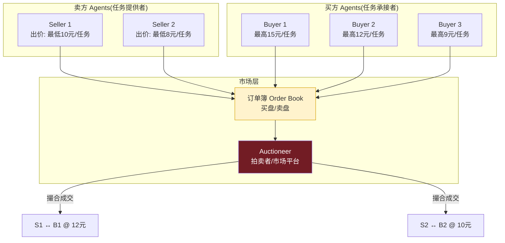

### 6.3 拍卖类型对比

| 拍卖类型 | 机制 | 特点 | 适用场景 |
|---------|------|------|---------|
| **英式拍卖 English** | 公开喊价,价高者得 | 透明,易理解 | 单件高价值任务分配 |
| **荷式拍卖 Dutch** | 从高价递减,首个应价者得 | 快速,防共谋 | 批量同质任务 |
| **密封投标 Sealed-bid** | 各自密封报价,最高者得 | 防信息泄露 | 保密性要求高 |
| **维克里拍卖 Vickrey** | 密封报价,最高者得但付次高价 | 鼓励真实报价(策略无关) | 单件任务最优配置 |
| **双重拍卖 Double** | 买卖双方同时报价,撮合 | 大规模市场 | 大量买卖双方的市场 |
| **组合拍卖 Combinatorial** | 允许对任务组合报价 | 解决任务互补性 | 协同效应强的任务 |

### 6.4 通信机制与协议

```python
@dataclass
class Bid:
    """投标"""
    bidder_id: str
    item_id: str               # 任务/资源ID
    price: float               # 报价
    quantity: int = 1
    timestamp: float = field(default_factory=time.time)

@dataclass
class Ask:
    """要价"""
    seller_id: str
    item_id: str
    price: float               # 最低接受价
    quantity: int = 1
    timestamp: float = field(default_factory=time.time)

class DoubleAuctionMarket:
    """连续双重拍卖市场"""

    def __init__(self):
        self.bids: list[Bid] = []        # 买盘(降序)
        self.asks: list[Ask] = []        # 卖盘(升序)
        self.trade_history: list = []

    def submit_bid(self, bid: Bid):
        heapq.heappush(self.bids, (-bid.price, bid))   # 最高买价优先
        self._match()

    def submit_ask(self, ask: Ask):
        heapq.heappush(self.asks, (ask.price, ask))    # 最低卖价优先
        self._match()

    def _match(self):
        """撮合: 最高买价 ≥ 最低卖价 → 成交"""
        while self.bids and self.asks:
            best_bid = self.bids[0][1]
            best_ask = self.asks[0][1]
            if -self.bids[0][0] >= self.asks[0][0]:
                # 成交价取中间价
                trade_price = (best_bid.price + best_ask.price) / 2
                trade_qty = min(best_bid.quantity, best_ask.quantity)
                self.trade_history.append({
                    "buyer": best_bid.bidder_id,
                    "seller": best_ask.seller_id,
                    "price": trade_price,
                    "qty": trade_qty
                })
                heapq.heappop(self.bids)
                heapq.heappop(self.asks)
                # 部分成交后剩余回填(略)
            else:
                break
```

### 6.5 协作方式:价格驱动协调

- **隐式协调**:Agent 不直接通信,仅通过价格信号调整行为
- **瓦尔拉斯均衡**:供需平衡时,价格稳定,资源最优配置
- **预算约束**:Agent 有"预算"(算力配额、token 配额),自然限制过度投标

### 6.6 优势与局限性

| 维度 | 优势 ✅ | 局限性 ❌ |
|------|--------|----------|
| **可扩展性** | 极佳,适合成百上千 Agent | 拍卖者仍是瓶颈(可用分布式拍卖缓解) |
| **效率** | 价格机制实现近似最优配置 | 评估 Agent 价值函数本身困难 |
| **鲁棒性** | Agent 进出市场不影响整体 | 价格波动可能导致投机 |
| **公平性** | 市场原则公平(出价高者得) | 富者愈富,可能出现垄断 |
| **可量化性** | 一切以价格衡量,易于评估 | 难以量化的因素(如信任)难以纳入 |

### 6.7 实际应用案例

**案例:云计算资源调度市场**
- 场景:数据中心多租户共享算力,需动态分配 GPU/CPU
- 应用:每个租户 Agent 代表用户需求,出价竞标 GPU 时段;资源提供方 Agent 报价
- 双重拍卖撮合成交,实现资源动态最优配置,优于静态配额

---

## 七、黑板共享模式(Blackboard)

### 7.1 模式核心思想

**黑板模式** 借鉴"专家围看黑板讨论"的场景:**维护一个共享的工作空间(黑板),多个知识源(KS,Knowledge Source)Agent 异步监视黑板状态,当发现自己能贡献时主动写入,触发其他 KS,逐步逼近最终解**。

### 7.2 结构示意图

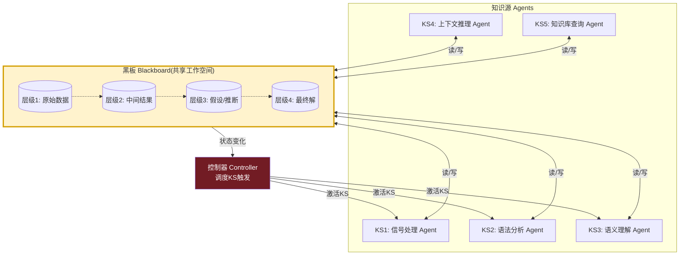

### 7.3 组件构成

| 组件 | 职责 |
|------|------|
| **Blackboard(黑板)** | 分层级的共享数据结构,存储问题求解的中间状态 |
| **Knowledge Source(知识源)** | 独立的专业 Agent,监视黑板特定条件,条件满足时执行操作 |
| **Controller(控制器)** | 监控黑板变化,决定下一个触发的 KS,控制求解节奏 |

### 7.4 通信机制:共享内存式

- **Agent 间不直接通信**,而是通过黑板间接交互
- KS 订阅黑板特定层级/字段的变化
- 写入操作触发事件 → 控制器评估 → 激活相关 KS

### 7.5 协作方式:opportunity-driven(机会驱动)

每个 KS 有触发条件,当黑板状态满足条件时,KS 主动"举手":

```python
@dataclass
class BlackboardEntry:
    """黑板条目"""
    entry_id: str
    level: int                    # 层级
    key: str
    value: Any
    contributed_by: str           # 写入的KS
    confidence: float
    timestamp: float

class KnowledgeSource:
    """知识源基类"""
    
    def __init__(self, ks_id, blackboard):
        self.id = ks_id
        self.bb = blackboard

    def condition(self) -> bool:
        """触发条件:黑板状态是否满足"""
        raise NotImplementedError

    async def action(self):
        """触发动作:向黑板写入新知识"""
        raise NotImplementedError

class Blackboard:
    """黑板:层级化共享存储"""

    def __init__(self):
        self.levels: dict[int, dict[str, BlackboardEntry]] = defaultdict(dict)
        self.subscribers: list[KnowledgeSource] = []
        self.lock = asyncio.Lock()

    async def write(self, level: int, key: str, value: Any, contributor: str, confidence: float = 1.0):
        async with self.lock:
            entry = BlackboardEntry(
                entry_id=str(uuid4()), level=level, key=key, value=value,
                contributed_by=contributor, confidence=confidence,
                timestamp=time.time()
            )
            self.levels[level][key] = entry
        # 通知控制器评估KS
        await self._notify_controller(entry)

    def read(self, level: int, key: str) -> Any:
        return self.levels.get(level, {}).get(key)

class BlackboardController:
    """黑板控制器:调度KS"""

    async def run(self, blackboard: Blackboard, ks_list: list, max_iter=100):
        for i in range(max_iter):
            # 评估所有KS的条件
            triggered = [ks for ks in ks_list if ks.condition()]
            if not triggered:
                break  # 无KS可触发,终止
            # 按优先级激活
            for ks in sorted(triggered, key=lambda k: -self._priority(k)):
                await ks.action()
```

### 7.6 优势与局限性

| 维度 | 优势 ✅ | 局限性 ❌ |
|------|--------|----------|
| **解耦性** | KS 之间无直接耦合,易增删 | 全局状态隐式,调试困难 |
| **灵活性** | KS 可异步响应,适合渐进式问题求解 | 控制器调度策略复杂 |
| **可扩展性** | 新增 KS 不影响现有 | 黑板可能成为竞争瓶颈 |
| **增量式** | 适合不完整信息下的渐进求解 | 难以保证收敛 |
| **适用性** | 信号处理、语音识别、知识融合 | 强实时、强结构场景不适合 |

### 7.7 实际应用案例

**案例:多源情报融合分析系统**
- 场景:从多种情报源(文本、图像、信号)融合推断目标身份
- 黑板层级:原始信号 → 特征提取 → 实体识别 → 关系推断 → 最终判断
- KS:OCR Agent、人脸识别 Agent、文本NLP Agent、关系图谱 Agent
- 任一 KS 写入新信息,触发下游 KS 进一步推断,逐步逼近结论

---

## 八、网络对等模式(Network/P2P)

### 8.1 模式核心思想

**网络对等模式(P2P)** 中,所有 Agent **地位平等,直接点对点通信**,无中心节点。每个 Agent 既是请求者也是服务者,通过 Gossip 等协议扩散信息。

### 8.2 结构示意图

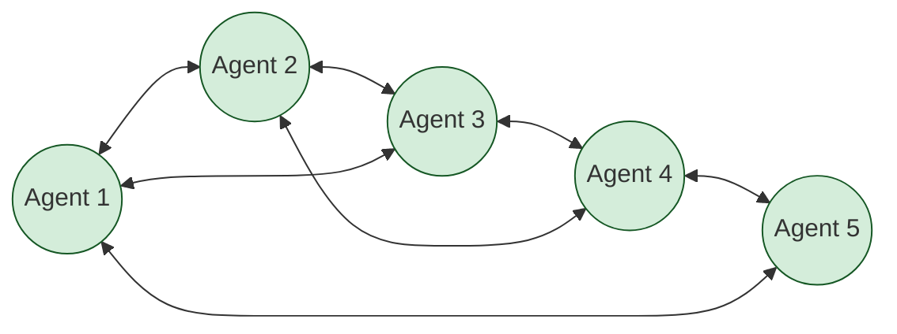

### 8.3 组件构成

| 组件 | 职责 |
|------|------|
| **Peer Agent** | 既是客户端也是服务端,平等参与 |
| **路由表** | 每个Agent维护邻居列表(如Chord DHT) |
| **Gossip 协议** | 信息扩散机制 |
| **一致性协议** | 多Agent状态同步(如Paxos/Raft变体) |

### 8.4 通信机制:Gossip 流言传播

```mermaid
flowchart LR
    subgraph T1["t=0"]
        A1((A1<br/>新信息))
        A2((A2))
        A3((A3))
        A4((A4))
        A5((A5))
        A6((A6))
    end

    subgraph T2["t=1 (A1告知2邻居)"]
        B1((A1))
        B2((A2<br/>已知))
        B3((A3<br/>已知))
        B4((A4))
        B5((A5))
        B6((A6))
    end

    subgraph T3["t=2 (A2/A3再告知各自邻居)"]
        C1((A1))
        C2((A2))
        C3((A3))
        C4((A4<br/>已知))
        C5((A5<br/>已知))
        C6((A6))
    end

    subgraph T4["t=3 (全网络扩散)"]
        D1((A1))
        D2((A2))
        D3((A3))
        D4((A4))
        D5((A5))
        D6((A6<br/>已知))
    end

    T1 --> T2 --> T3 --> T4
```

### 8.5 协作方式

- **直接通信**:Agent 知道对方地址时直接点对点
- **Gossip 扩散**:O(log N) 轮可覆盖全网
- **DHT 查询**:Chord/Kademlia 等结构化 P2P 提供精确查找

### 8.6 关键技术要点

```python
class P2PAgent:
    def __init__(self, agent_id, neighbors: list):
        self.id = agent_id
        self.neighbors = neighbors
        self.known_messages: set[str] = set()  # 去重

    async def gossip(self, message: dict):
        """流言传播:告知部分邻居,邻居再传播"""
        msg_id = message["id"]
        if msg_id in self.known_messages:
            return  # 已知,停止
        self.known_messages.add(msg_id)
        
        # 处理消息
        await self._handle(message)
        
        # 转发给fanout个邻居
        fanout = min(3, len(self.neighbors))
        targets = random.sample(self.neighbors, fanout)
        await asyncio.gather(*[self._send(t, message) for t in targets])
```

### 8.7 优势与局限性

| 维度 | 优势 ✅ | 局限性 ❌ |
|------|--------|----------|
| **可扩展性** | 极佳,理论上无上限 | 网络流量随规模增长 |
| **鲁棒性** | 无单点故障,部分节点宕机不影响 | 一致性达成困难 |
| **去中心化** | 真正平等,无中心控制 | 全局决策困难 |
| **延迟** | 邻居间通信快 | 全网传播有延迟 |
| **适用性** | 大规模分布式系统 | 需要强一致、快速决策的场景不适合 |

### 8.8 实际应用案例

**案例:分布式 AI 推理网络**
- 场景:多个边缘节点协作运行大模型推理,无中心服务器
- 应用:每个节点是 P2P Agent,通过 Gossip 同步模型参数、共享推理缓存
- 优势:抗审查、无单点故障,适合隐私敏感场景

---

## 九、发布订阅与事件驱动模式(Pub-Sub)

### 9.1 模式核心思想

**发布订阅模式** 通过**事件总线(Message Bus)** 解耦 Agent:**生产者 Agent 发布事件,消费者 Agent 订阅感兴趣的事件类型,总线负责路由分发**。Agent 之间不直接知道彼此,实现彻底解耦。

### 9.2 结构示意图

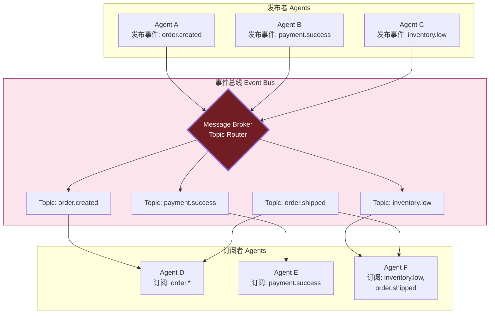

### 9.3 组件构成

| 组件 | 职责 |
|------|------|
| **Publisher(发布者)** | 发布事件到总线,不关心谁消费 |
| **Subscriber(订阅者)** | 订阅感兴趣的事件,被动响应 |
| **Event Bus(事件总线)** | 事件路由,支持主题/内容过滤 |
| **Topic/Queue** | 事件分类,支持通配符订阅(`order.*`) |

### 9.4 通信机制:主题与内容路由

- **主题订阅 Topic-based**:`topic = "order.created"`,精确匹配
- **通配符订阅 Wildcard**:`pattern = "order.*"`,匹配所有 order 子事件
- **内容订阅 Content-based**:`filter = "amount > 10000"`,按事件内容过滤

### 9.5 协作方式:事件链驱动

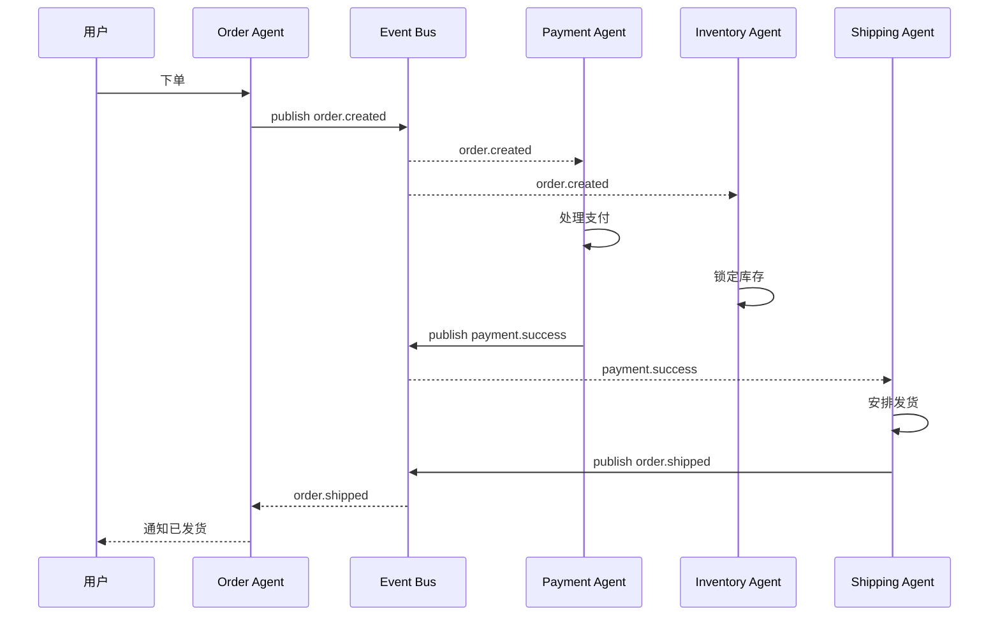

### 9.6 关键技术要点

```python
class EventBus:
    """事件总线: 支持主题与通配符订阅"""

    def __init__(self):
        self.subscriptions: dict[str, list[callable]] = defaultdict(list)

    def subscribe(self, pattern: str, handler: callable):
        """订阅: 支持通配符 order.* / order.>"""
        self.subscriptions[pattern].append(handler)

    async def publish(self, topic: str, event: dict):
        """发布: 匹配所有订阅模式"""
        for pattern, handlers in self.subscriptions.items():
            if self._match(pattern, topic):
                await asyncio.gather(*[h(event) for h in handlers])

    def _match(self, pattern: str, topic: str) -> bool:
        """NATS风格匹配: * 单层, > 多层"""
        p_parts = pattern.split(".")
        t_parts = topic.split(".")
        for i, p in enumerate(p_parts):
            if p == "*":
                if i >= len(t_parts): return False
            elif p == ">":
                return True
            elif i >= len(t_parts) or p != t_parts[i]:
                return False
        return len(p_parts) == len(t_parts)
```

### 9.7 优势与局限性

| 维度 | 优势 ✅ | 局限性 ❌ |
|------|--------|----------|
| **解耦性** | 发布者/订阅者互不感知 | 调试困难(事件流难追踪) |
| **可扩展性** | 增减订阅者无影响 | 事件总线可能成为瓶颈 |
| **异步性** | 天然异步,非阻塞 | 顺序保证困难 |
| **可观测性** | 事件流易于监控 | 事件风暴风险 |
| **适用性** | 微服务、IoT、流处理 | 强一致、强事务场景不适合 |

### 9.8 实际应用案例

**案例:智能客服系统的多 Agent 协作**
- 场景:用户咨询 → 识别意图 → 路由到专业 Agent → 跟进
- 事件流:`user.message → intent.detected → agent.routed → response.generated → satisfaction.scored`
- 多个 Agent 订阅不同事件,异步并行处理,新增 Agent 只需订阅相关事件

---

## 十、投票与共识模式(Voting/Consensus)

### 10.1 模式核心思想

**投票与共识模式** 通过**多个 Agent 提案、辩论、表决**,达成群体决策。借鉴民主决策机制,适合需要**多视角融合、避免单点偏见**的场景,也用于分布式系统的一致性达成。

### 10.2 结构示意图

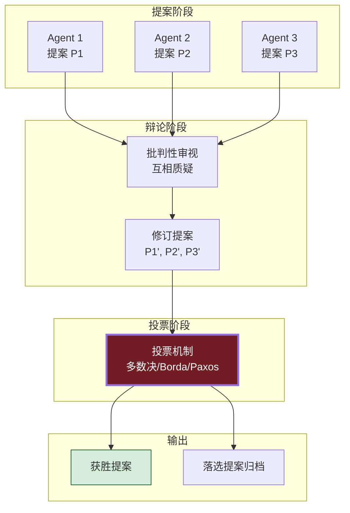

### 10.3 投票机制对比

| 机制 | 规则 | 优势 | 局限 |
|------|------|------|------|
| **多数决 Plurality** | 票多者赢 | 简单 | 可能少数派分裂 |
| **绝对多数 Majority** | 需>50% | 代表性强 | 可能多轮才能出结果 |
| **博尔达计数 Borda** | 排名加权 | 考虑偏好强度 | 计算复杂 |
| **共识协议 Paxos/Raft** | 多数派达成一致 | 强一致 | 实现复杂 |
| **法定人数 Quorum** | 需N个中M个同意 | 灵活 | 选M难 |
| **德尔菲法 Delphi** | 多轮匿名投票 | 避免从众 | 慢 |

### 10.4 通信机制

- **提案广播**:所有 Agent 看到所有提案
- **辩论通道**:支持 Agent 互相质疑/辩护
- **投票通道**:匿名或公开投票
- **结果广播**:决策结果通知所有 Agent

### 10.5 协作方式:辩论-投票-执行

```python
@dataclass
class Proposal:
    proposal_id: str
    proposer_id: str
    content: Any
    rationale: str           # 提案理由
    revisions: list = field(default_factory=list)

@dataclass
class Vote:
    voter_id: str
    proposal_id: str
    score: int               # 0-100 或排名
    comment: str = ""

class VotingOrchestrator:
    """投票编排器"""

    async def run(self, question: str, agents: list, max_rounds: int = 3):
        # ① 提案阶段
        proposals = await asyncio.gather(*[a.propose(question) for a in agents])
        proposals = [p for p in proposals if p]

        for round_num in range(max_rounds):
            # ② 辩论阶段:互相批判
            critiques = await self._debate(proposals, agents)
            
            # ③ 修订阶段:提案者改进提案
            proposals = await self._revise(proposals, critiques, agents)
            
            # ④ 投票阶段
            votes = await asyncio.gather(*[
                a.vote(proposals, method="borda") for a in agents
            ])
            
            # ⑤ 检查是否达成共识
            winner = self._tally(votes, method="borda")
            if self._has_consensus(winner, votes):
                return winner
        
        # 未达共识,取最高分
        return winner
```

### 10.6 优势与局限性

| 维度 | 优势 ✅ | 局限性 ❌ |
|------|--------|----------|
| **质量** | 多视角融合,降低偏见 | "群体盲思"风险(从众) |
| **可解释性** | 投票过程可追溯 | 辩论过程可能冗长 |
| **鲁棒性** | 个别 Agent 异常不影响 | 投票操纵(锡拉丘兹悖论) |
| **公平性** | 每个 Agent 平等发声 | 策略性投票扭曲结果 |
| **适用性** | 高质量决策、无单一权威 | 强实时场景不适合 |

### 10.7 实际应用案例

**案例:多模型协同的代码审查系统**
- 场景:多个 LLM Agent(基于不同模型)审查同一份代码,投票决定是否合并
- 流程:每个 Agent 独立审查 → 提交评审意见 → 辩论(对分歧激烈处) → 投票(Borda 计数)
- 优势:单一模型可能有偏见,多模型投票提高准确性

---

## 十一、角色扮演模式(Role-playing)

### 11.1 模式核心思想

**角色扮演模式** 让 Agent 模拟人类社会的不同**角色**(如产品经理/程序员/测试),通过**角色对话**推进任务。该模式在 LLM 时代特别流行(如 CAMEL 框架),利用角色视角的差异化激发更丰富的协作行为。

### 11.2 结构示意图

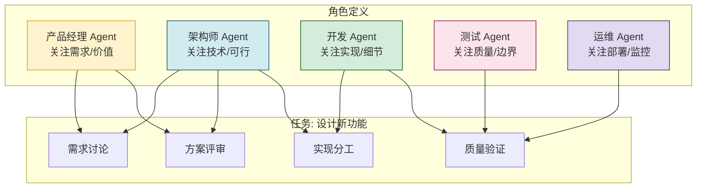

### 11.3 组件构成

| 组件 | 职责 |
|------|------|
| **角色定义** | 每个角色的 persona、目标、知识背景、行为约束 |
| **角色对话协议** | 谁对谁说什么、何时发言 |
| **任务推进器** | 协调角色发言顺序,推进任务阶段 |
| **共识达成** | 角色间的分歧如何解决(可嵌套投票模式) |

### 11.4 通信机制:角色对话

```python
@dataclass
class Role:
    name: str                  # 角色名: "产品经理"
    persona: str               # 角色设定: 你是资深PM...
    expertise: list[str]       # 专长领域
    goals: list[str]           # 角色目标
    constraints: list[str]     # 行为约束

class RolePlaySession:
    """角色扮演会话"""

    def __init__(self, roles: list[Role], task: str):
        self.roles = roles
        self.task = task
        self.history: list[dict] = []

    async def run(self, max_turns: int = 20):
        # 系统消息:任务介绍
        self.history.append({"role": "system", "content": f"任务: {self.task}"})
        
        for turn in range(max_turns):
            for role in self.roles:
                # 构造该角色的 prompt: persona + 历史 + 当前任务
                prompt = self._build_prompt(role, self.history)
                response = await self.llm.chat(
                    system=role.persona,
                    messages=[{"role": "user", "content": prompt}]
                )
                self.history.append({
                    "role": "assistant",
                    "name": role.name,
                    "content": response
                })
                
                # 检查是否达成共识/任务完成
                if self._is_task_complete(response):
                    return self._summarize()
```

### 11.5 协作方式:角色对话推进

- **顺序发言**:按角色顺序轮流发言(如 PM → 架构师 → 开发 → 测试)
- **响应式发言**:任一角色可"插话"(基于对话内容触发)
- **阶段切换**:角色讨论达成阶段目标后,推进下一阶段

### 11.6 优势与局限性

| 维度 | 优势 ✅ | 局限性 ❌ |
|------|--------|----------|
| **拟人性** | 贴近真实团队协作 | 可能"演过头"偏离任务 |
| **多样性** | 不同视角激发创意 | 角色设定不当导致冲突 |
| **可解释性** | 对话过程易于理解 | 对话冗长,token 消耗大 |
| **可定制性** | 角色灵活配置 | 角色间能力重叠时低效 |
| **适用性** | 创意任务、社会模拟 | 确定性任务不适合 |

### 11.7 实际应用案例

**案例:CAMEL 框架的 AI 代理社会模拟**
- 场景:研究多 AI 代理协作完成任务的行为模式
- 应用:定义"用户 Agent"和"助手 Agent",通过角色扮演对话完成任务
- 价值:可研究 Agent 间的指令遵循、自主行为、角色冲突等现象

---

## 十二、涌现式自组织模式(Emergent)

### 12.1 模式核心思想

**涌现式自组织模式** 借鉴生物群体(鸟群、蚁群、蜂群):**每个 Agent 遵循简单的局部规则,无需中心控制,通过局部交互涌现出复杂的全局智能行为**。强调"简单规则 → 复杂涌现"。

### 12.2 结构示意图

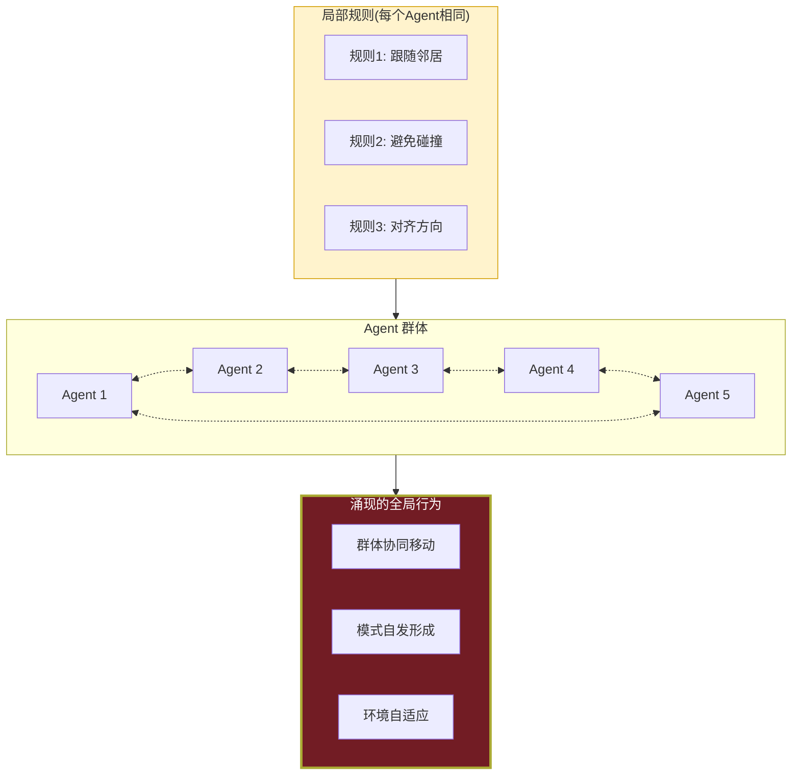

### 12.3 经典局部规则

| 群体算法 | 局部规则 | 涌现行为 |
|---------|---------|---------|
| **Boids(鸟群)** | 分离/对齐/凝聚 | 群体协同飞行 |
| **蚁群算法 ACO** | 信息素追随 | 最短路径寻优 |
| **粒子群 PSO** | 个体最优+全局最优 | 函数优化 |
| **蜂群 ABC** | 雇佣蜂/观察蜂/侦察蜂 | 多模态优化 |

### 12.4 通信机制:基于环境信号

Agent 间不直接通信,而是通过**环境**(信息素、共享场)间接交互:

```python
class BoidAgent:
    """Boids 鸟群模型Agent"""
    
    def __init__(self, position, velocity):
        self.pos = position           # 位置向量
        self.vel = velocity           # 速度向量

    def update(self, neighbors: list, env):
        # 三大规则
        sep = self._separation(neighbors)      # 分离: 避免碰撞
        ali = self._alignment(neighbors)       # 对齐: 跟随邻居方向
        coh = self._cohesion(neighbors)        # 凝聚: 向群体中心
        
        # 综合更新
        self.vel += sep * 1.5 + ali * 1.0 + coh * 1.0
        self.vel = self._limit(self.vel, max_speed=10)
        self.pos += self.vel

    def _separation(self, neighbors):
        """远离过近的邻居"""
        steer = Vector(0, 0)
        for n in neighbors:
            d = distance(self.pos, n.pos)
            if 0 < d < 25:
                steer += (self.pos - n.pos) / d**2
        return steer
```

### 12.5 优势与局限性

| 维度 | 优势 ✅ | 局限性 ❌ |
|------|--------|----------|
| **可扩展性** | 极佳,Agent数量可达千万 | 全局行为不可预测 |
| **鲁棒性** | 个体失败不影响整体 | 难以 directed 控制 |
| **自适应性** | 自动适应环境变化 | 收敛慢 |
| **简单性** | 个体规则简单 | 调参困难 |
| **适用性** | 优化、路径规划、群智 | 需要精确控制的任务不适合 |

### 12.7 实际应用案例

**案例:多无人机集群协同搜索**
- 场景:多架无人机搜索灾区幸存者,无中心指挥
- 应用:每架无人机遵循 Boids 规则,保持编队但又分散覆盖
- 信息素:已搜索区域留下"信息素",其他无人机避开
- 优势:单机失联不影响整体,自适应调整搜索模式

---

## 十三、模式对比与选型指南

### 13.1 十大模式综合对比

| 模式 | 控制结构 | 通信开销 | 可扩展性 | 鲁棒性 | 实现难度 | 适用规模 |
|------|---------|---------|---------|-------|---------|---------|
| **DPS** | 中心化 | 中 | 中 | 中 | 中 | 中(10-50) |
| **层次化** | 层次化 | 低 | 高 | 中 | 中 | 中-大(50-500) |
| **协商/CNP** | 去中心化 | 高 | 中 | 高 | 高 | 小-中(5-30) |
| **市场/拍卖** | 半去中心化 | 高 | 极高 | 高 | 高 | 大(100-1000+) |
| **黑板** | 中心化 | 中 | 中 | 中 | 中 | 小-中(5-30) |
| **P2P** | 去中心化 | 中 | 极高 | 极高 | 高 | 大(100-10000) |
| **Pub-Sub** | 半去中心化 | 低 | 高 | 高 | 低 | 大(100-10000) |
| **投票共识** | 去中心化 | 高 | 中 | 高 | 高 | 小(3-20) |
| **角色扮演** | 混合 | 中 | 中 | 中 | 低 | 小(2-10) |
| **涌现** | 完全去中心化 | 极低 | 极高 | 极高 | 中 | 极大(1000+) |

### 13.2 按业务场景选型

| 业务场景 | 推荐模式 | 备选模式 | 选型理由 |
|---------|---------|---------|---------|
| **大型软件工程项目** | 层次化 | DPS | 任务有明确层级,匹配组织结构 |
| **多学科医疗诊断** | DPS | 黑板 | 子问题相对独立,可并行 |
| **多机器人调度** | 协商(CNP) | 市场拍卖 | Agent自主,任务动态到达 |
| **云计算资源分配** | 市场拍卖 | 协商 | 资源可量化,大量买卖双方 |
| **情报融合分析** | 黑板 | DPS | 渐进式求解,信息异步到达 |
| **微服务编排** | Pub-Sub | 层次化 | 服务解耦,事件驱动 |
| **代码审查** | 投票共识 | 角色扮演 | 多视角融合,避免偏见 |
| **创意任务/社会模拟** | 角色扮演 | 投票 | 多角色激发创意 |
| **大规模分布式系统** | P2P | 涌现 | 无中心,抗故障 |
| **集群智能优化** | 涌现 | P2P | 简单规则涌现复杂行为 |

### 13.3 按任务特征选型

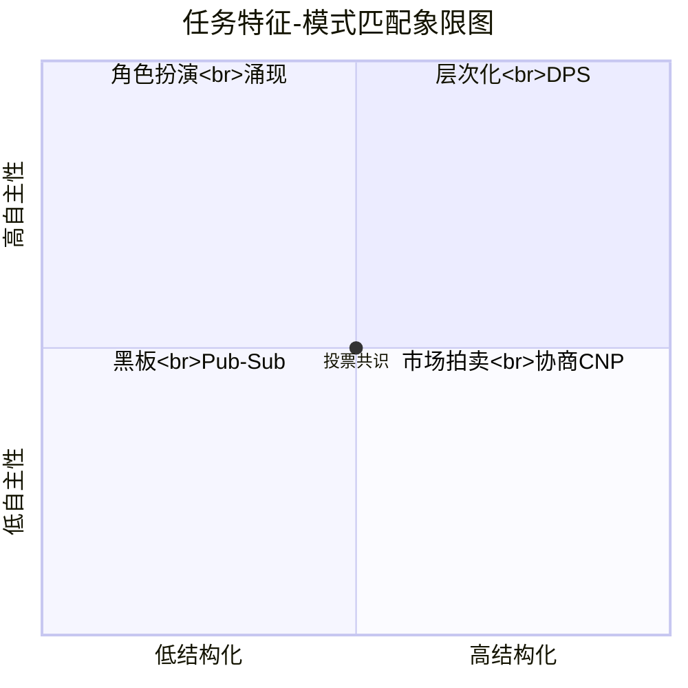

### 13.4 模式组合:现实系统多为混合模式

实际系统很少使用单一模式,通常是多种模式组合:

- **层次化 + DPS**:顶层 Manager 用 DPS 分发任务,中层 Manager 管理执行
- **Pub-Sub + 角色扮演**:Agent 按角色订阅不同事件,事件触发角色行为
- **市场拍卖 + 投票**:多 Agent 投标后,通过投票决定中标者
- **黑板 + 协商**:黑板共享信息,Agent 协商写入优先级

---

## 十四、实际应用案例

### 14.1 案例一:AutoGen 的多 Agent 协作架构(层次化 + 角色扮演)

**场景**:Microsoft AutoGen 框架的多 Agent 编程任务

**架构**:层次化 + 角色扮演
- **Top Manager**:User Proxy Agent(代表用户)
- **Middle Manager**:Assistant Agent(通用助手)
- **Worker**:Group Chat 中的专业 Agent(Coder/Critic/Executor)

**协作流程**:
1. User Proxy 提出任务
2. Group Chat Manager 选择下一个发言者
3. Coder 写代码 → Critic 审查 → Executor 执行 → 循环
4. 直到任务完成

### 14.2 案例二:CrewAI 的角色化团队(角色扮演 + 层次化)

**场景**:内容创作团队(写博客、做调研)

**架构**:
- 角色:Researcher、Writer、Editor、Reviewer
- 任务流:Researcher 调研 → Writer 写作 → Editor 编辑 → Reviewer 审查
- Manager Agent 协调整个流程

**特点**:每个 Agent 有明确的 role、goal、backstory,模拟真实团队

### 14.3 案例三:LangGraph 的图状编排(事件驱动 + 层次化)

**场景**:复杂的 RAG + 多 Agent 推理系统

**架构**:
- 用图(DAG)定义 Agent 间的流转关系
- 每个节点是一个 Agent 或工具
- 边定义控制流(条件路由)
- State 在节点间传递,类似黑板

**特点**:兼具层次化的可控性与事件驱动的灵活性

### 14.4 案例四:多机器人仓储系统(协商 + 市场)

**场景**:Amazon 仓储机器人调度

**架构**:
- 每台 AGV 是自主 Agent
- 新订单触发 CNP 拍卖:各 AGV 评估位置/电量,投标
- 高峰期转为市场机制:AGV 竞价热门区域任务
- 静态时段用层次化调度

**特点**:不同负载下切换不同模式,动态适配

---

## 十五、最佳实践与避坑指南

### 15.1 架构设计最佳实践(Do's)

| # | 最佳实践 | 说明 |
|---|---------|------|
| 1 | **先分析任务结构再选模式** | 任务特征决定模式,不要"手里拿锤子看什么都是钉子" |
| 2 | **从简单模式起步** | 先用层次化跑通,再根据瓶颈升级到协商/市场 |
| 3 | **混合模式按需组合** | 现实系统几乎都是混合模式,不要教条 |
| 4 | **明确 Agent 边界** | 每个Agent职责清晰,避免"全能Agent" |
| 5 | **设计良好的失败处理** | MAS 比单 Agent 更易失败,要预设兜底 |
| 6 | **可观测性优先** | 多 Agent 交互复杂,必须全链路追踪 |
| 7 | **通信开销控制** | Agent 间通信是性能瓶颈,能批量不单个 |
| 8 | **状态外置** | Agent 状态持久化,支持重启恢复 |
| 9 | **从小规模验证** | 先 3-5 个 Agent 验证,再扩展 |
| 10 | **保留人工介入点** | 关键决策提供 human-in-the-loop 接口 |

### 15.2 常见踩坑与避坑(Don'ts)

| # | 踩坑 | 后果 | 避坑方案 |
|---|------|------|---------|
| ❌1 | **Agent 数量过多** | 通信爆炸,token浪费 | 严格控制规模,合并同质Agent |
| ❌2 | **角色职责重叠** | 重复劳动,互相干扰 | 明确职责边界,用矩阵图梳理 |
| ❌3 | **同步等待死锁** | Agent A 等 B,B 等 A | 设超时 + 异步 + 兜底默认值 |
| ❌4 | **无终止条件** | Agent 无限辩论 | 设最大轮次 + 共识阈值 |
| ❌5 | **忽略失败传播** | 一个Agent失败引发雪崩 | 故障隔离 + 重试 + 降级 |
| ❌6 | **中心节点单点** | Manager 挂了全系统挂 | 中心节点HA + 故障转移 |
| ❌7 | **状态不一致** | Agent 间看到的"事实"不同 | 引入共享状态层(黑板/DB) |
| ❌8 | **过度协商** | 简单任务也要走完CNP | 区分任务复杂度,简单任务直接委派 |
| ❌9 | **可观测性缺失** | 出问题无法定位 | 全链路trace + Agent日志 + 状态快照 |
| ❌10 | **忽视成本** | 大量Agent调用LLM,账单爆炸 | 缓存 + 小模型路由 + token预算 |

### 15.3 模式实施路线图

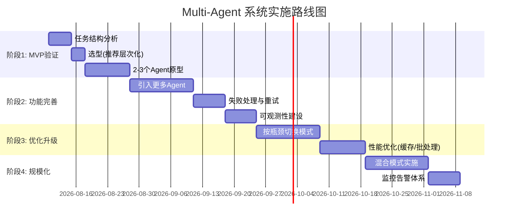

---

> **文档结语**:Multi-Agent 架构设计模式是 MAS 工程化的核心知识体系。本文梳理的十大经典模式,既有传统分布式AI的精华(DPS、合同网、黑板),也有 LLM 时代的新兴实践(角色扮演、涌现自组织)。**没有"最优"模式,只有"最适配"模式**——选型的关键在于深入分析任务结构、Agent 特性与系统约束。
>
> **后续演进方向**:① 探索 LLM 原生的 Multi-Agent 模式(如辩论式推理、思维链协作);② 研究 Agent 间的"组织文化"与"信任建立"机制;③ 与传统分布式系统理论(如 CAP、Paxos)融合,形成更严谨的 MAS 设计方法论。
