# Supervisor Agent 核心概念与架构设计深度解析

> **文档定位**:本文档是 `8多 Agent 系统` 系列的 Supervisor 专题篇,深入解析 **Supervisor Agent(监督者智能体)** 的概念定义、核心职责、架构设计、交互方式、决策机制与技术实现。在 [108Multi-Agent多智能体系统核心概念详解.md](./108Multi-Agent多智能体系统核心概念详解.md) 阐述 MAS 基础概念、[109Multi-Agent系统架构设计模式深度解析.md](./109Multi-Agent系统架构设计模式深度解析.md) 总览十大架构模式的基础上,本文聚焦其中**最重要、应用最广泛**的 Supervisor-Worker 模式,深度剖析 Supervisor 这一"中央调度大脑"的方方面面。
>
> **核心问题**:为什么多 Agent 系统需要 Supervisor?它具体做什么?如何设计?如何与其他 Agent 交互?如何做决策?如何实现?本文给出完整答案。

---

## 目录

- [一、Supervisor Agent 概念定义](#一supervisor-agent-概念定义)
- [二、核心职责详解](#二核心职责详解)
- [三、架构设计原理](#三架构设计原理)
- [四、与其他 Agent 的交互方式](#四与其他-agent-的交互方式)
- [五、决策机制深度解析](#五决策机制深度解析)
- [六、技术实现细节](#六技术实现细节)
- [七、在多 Agent 系统中的定位与重要性](#七在多-agent-系统中的定位与重要性)
- [八、失败模式与容错设计](#八失败模式与容错设计)
- [九、完整实现案例](#九完整实现案例)
- [十、最佳实践与总结](#十最佳实践与总结)

---

## 一、Supervisor Agent 概念定义

### 1.1 什么是 Supervisor Agent

**Supervisor Agent(监督者智能体)** 是多 Agent 系统中的**中央协调者**,负责接收用户请求、分解任务、分配给专门的 Worker Agent、收集结果并合成最终响应。它不直接执行具体业务操作,而是作为"大脑"统筹全局。

```mermaid
flowchart TB
    USER[用户请求<br/>"研究AI芯片市场并写报告"]
    
    SUP[Supervisor Agent<br/>中央调度大脑<br/>不做事,只管事]
    
    W1[Worker Agent 1<br/>研究专家]
    W2[Worker Agent 2<br/>写作专家]
    W3[Worker Agent 3<br/>审核专家]
    
    USER --> SUP
    SUP -->|1. 分配研究任务| W1
    W1 -->|2. 返回研究结果| SUP
    SUP -->|3. 分配写作任务| W2
    W2 -->|4. 返回报告草稿| SUP
    SUP -->|5. 分配审核任务| W3
    W3 -->|6. 返回审核结果| SUP
    SUP -->|7. 合成最终报告| USER
    
    style SUP fill:#fa8c16,color:#fff
    style W1 fill:#4a90d9,color:#fff
    style W2 fill:#4a90d9,color:#fff
    style W3 fill:#4a90d9,color:#fff
```

### 1.2 Supervisor 的本质:管理者而非执行者

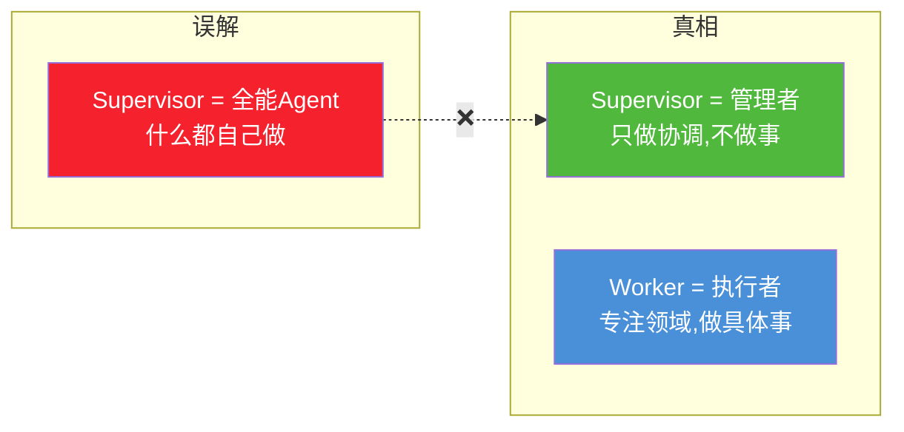

**关键区分**:

| 维度 | Supervisor Agent | Worker Agent |
|------|-----------------|-------------|
| **角色定位** | 管理者/调度者/决策者 | 执行者/专家/领域专才 |
| **是否做事** | ❌ 不直接执行业务 | ✅ 执行具体任务 |
| **工具数量** | 少(仅路由工具) | 多(领域工具集) |
| **上下文范围** | 全局(看大局) | 局部(只看自己的子任务) |
| **决策内容** | "分给谁""何时结束" | "怎么做这个子任务" |
| **类比** | 公司CEO/项目经理 | 部门经理/工程师 |

### 1.3 为什么需要 Supervisor

单 Agent 系统存在三大致命缺陷,Supervisor 模式正是为解决它们而生:

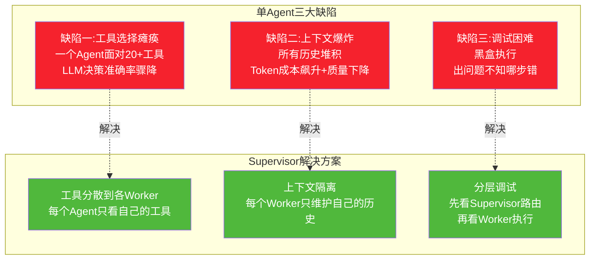

---

## 二、核心职责详解

### 2.1 四大核心职责

Supervisor Agent 承担四大核心职责,构成完整的管理闭环:

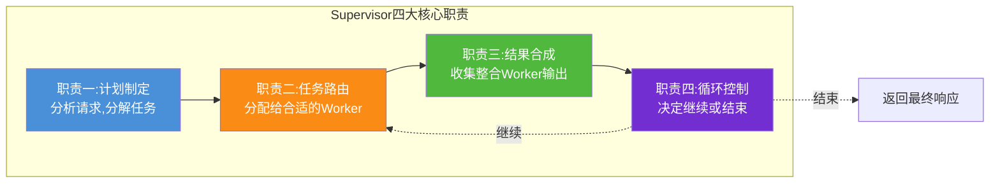

### 2.2 职责一:计划制定(Planning)

Supervisor 收到用户请求后,首先分析意图,制定执行策略。

```python
def supervisor_plan(state: OverallState) -> Command:
    """职责一:分析用户请求,制定执行计划"""
    
    user_query = state["messages"][-1].content
    
    # LLM 分析请求,制定计划
    plan = llm.invoke(f"""
    分析以下用户请求,制定多步骤执行计划:
    
    用户请求: {user_query}
    
    可用的专家 Agent:
    - researcher: 信息检索与网络搜索
    - analyst: 数据分析与计算  
    - writer: 内容创作与写作
    - reviewer: 质量审核与事实核查
    
    请输出:
    1. 任务分解:将请求拆为哪些子任务
    2. 执行顺序:各子任务的先后关系
    3. 分配方案:每个子任务交给哪个Agent
    4. 完成标准:什么情况下任务算完成
    """)
    
    return Command(update={"plan": plan, "current_step": 0})
```

**计划制定示例**:

```
用户请求: "研究2026年AI芯片市场并写一份投资分析报告"

Supervisor 制定的计划:
┌─────────────────────────────────────────────────────┐
│ Step 1: researcher → 搜索AI芯片市场数据、竞品分析    │
│ Step 2: analyst    → 分析市场份额、增长率、财务指标   │
│ Step 3: writer     → 撰写投资分析报告                │
│ Step 4: reviewer   → 审核报告准确性、逻辑性          │
│ 完成标准: reviewer 通过审核                         │
└─────────────────────────────────────────────────────┘
```

### 2.3 职责二:任务路由(Routing)

Supervisor 根据当前状态,决定将任务分发给哪个 Worker:

```python
def supervisor_route(state: OverallState) -> Command:
    """职责二:根据状态决定路由到哪个Worker"""
    
    plan = state["plan"]
    current_step = state["current_step"]
    completed_steps = state.get("completed_steps", [])
    
    # 决策逻辑:根据计划进度路由
    if current_step < len(plan):
        next_agent = plan[current_step]["agent"]  # 从计划中取下一个Agent
        task = plan[current_step]["task"]
        
        return Command(
            goto=next_agent,  # 路由到指定Worker
            update={
                "current_task": task,
                "current_agent": next_agent
            }
        )
    else:
        # 所有步骤完成,进入合成阶段
        return Command(goto="synthesizer")
```

**路由决策矩阵**:

| 当前状态 | 路由目标 | 理由 |
|---------|---------|------|
| 无研究结果 | `researcher` | 需先收集信息 |
| 有研究结果,无分析 | `analyst` | 信息齐了,该分析 |
| 有分析,无报告 | `writer` | 分析完了,该写作 |
| 有报告,未审核 | `reviewer` | 写完了,该审核 |
| 审核未通过 | `writer` | 需修改后重新审核 |
| 审核通过 | `END` | 任务完成 |

### 2.4 职责三:结果合成(Synthesis)

收集各 Worker 的输出,整合为最终响应:

```python
def supervisor_synthesize(state: OverallState) -> str:
    """职责三:合成各Worker的结果"""
    
    # 收集所有Worker的输出
    research_data = state.get("research_results", [])
    analysis = state.get("analysis_result", "")
    draft = state.get("draft_content", "")
    review = state.get("review_result", "")
    
    # LLM 合成最终响应
    final_response = llm.invoke(f"""
    基于以下各专家的工作成果,合成最终响应:
    
    研究数据: {research_data}
    分析结论: {analysis}
    报告草稿: {draft}
    审核意见: {review}
    
    要求:
    1. 整合所有信息,去除冗余
    2. 保持逻辑连贯
    3. 标注关键数据来源
    4. 生成用户友好的最终回答
    """)
    
    return final_response
```

### 2.5 职责四:循环控制(Loop Control)

Supervisor 决定是继续迭代还是结束工作流:

```python
def supervisor_should_continue(state: OverallState) -> str:
    """职责四:决定继续还是结束"""
    
    # 判断条件1: 是否所有计划步骤完成
    if state["current_step"] >= len(state["plan"]):
        return "synthesize"
    
    # 判断条件2: 是否达到最大轮数(防止死循环)
    if state["round_count"] >= MAX_ROUNDS:
        return "synthesize"
    
    # 判断条件3: 是否审核通过
    if state.get("review_passed") is True:
        return "synthesize"
    
    # 判断条件4: 是否有不可恢复错误
    if state.get("fatal_error"):
        return "error_exit"
    
    # 否则继续执行下一步
    return "continue"
```

---

## 三、架构设计原理

### 3.1 Supervisor-Worker 架构总览

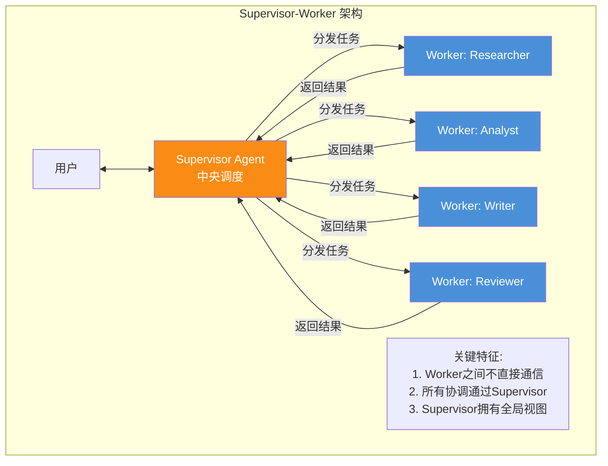

### 3.2 核心设计原则

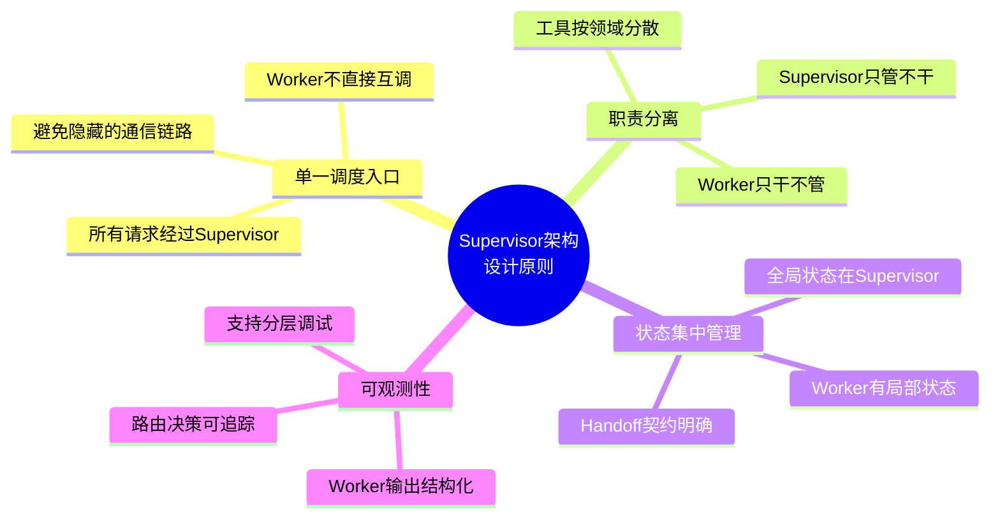

### 3.3 状态所有权设计

多 Agent 系统最难的决策是**状态归属**:哪些共享、哪些隔离。

```mermaid
flowchart TB
    subgraph 共享状态(Shared State)
        S1[用户目标 user_goal]
        S2[执行计划 plan]
        S3[当前步骤 current_step]
        S4[审核日志 audit_log]
        S5[最终决策 final_decision]
    end
    
    subgraph Worker1局部状态
        W1S[研究笔记 research_notes]
        W1T[搜索工具输出 tool_outputs]
    end
    
    subgraph Worker2局部状态
        W2S[分析中间结果 analysis_scratch]
        W2C[计算缓存 calc_cache]
    end
    
    subgraph Worker3局部状态
        W3S[写作草稿 draft_versions]
        W3F[格式化配置 format_config]
    end
    
    style S1 fill:#fa8c16,color:#fff
    style S2 fill:#fa8c16,color:#fff
    style W1S fill:#4a90d9,color:#fff
    style W2S fill:#50b83c,color:#fff
    style W3S fill:#722ed1,color:#fff
```

| 状态类型 | 所有权 | 内容 | 示例 |
|---------|--------|------|------|
| **共享状态** | Supervisor 管理 | 全局目标、计划、审计 | `user_goal`/`plan`/`audit_log` |
| **局部状态** | Worker 私有 | 专家笔记、中间结果 | `research_notes`/`draft_versions` |
| **Handoff 契约** | 交接时定义 | 移交原因、已完成工作、所需输入 | `{reason, completed, next_input}` |

### 3.4 Fan-out / Fan-in 模式

Supervisor 支持两种任务分发模式:

```mermaid
flowchart TB
    subgraph 串行模式(Sequential)
        SUP1[Supervisor] --> W1A[Worker A]
        W1A --> SUP1
        SUP1 --> W1B[Worker B]
        W1B --> SUP1
        SUP1 --> W1C[Worker C]
        W1C --> SUP1
    end
    
    subgraph 并行模式(Fan-out/Fan-in)
        SUP2[Supervisor] --> W2A[Worker A]
        SUP2 --> W2B[Worker B]
        SUP2 --> W2C[Worker C]
        W2A --> SUP2
        W2B --> SUP2
        W2C --> SUP2
    end
    
    style SUP1 fill:#fa8c16,color:#fff
    style SUP2 fill:#fa8c16,color:#fff
```

| 模式 | 适用场景 | 特点 |
|------|---------|------|
| **串行** | 后一步依赖前一步结果 | 顺序执行,逻辑清晰 |
| **并行(Fan-out)** | 子任务相互独立 | 同时执行,速度快 |
| **Fan-in** | 收集所有并行结果 | 等待所有Worker完成,合并 |

---

## 四、与其他 Agent 的交互方式

### 4.1 交互方式总览

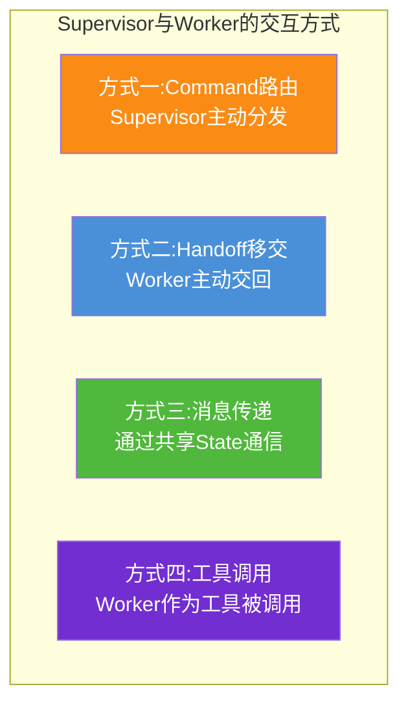

### 4.2 方式一:Command 路由(Supervisor 主动分发)

Supervisor 通过 `Command` 对象主动决定将控制权交给哪个 Worker:

```python
from langgraph.graph import StateGraph, START, END
from langgraph.types import Command
from typing import TypedDict, Literal

class OverallState(TypedDict):
    messages: list
    plan: list
    current_step: int
    research_results: list
    draft_content: str
    review_passed: bool

def supervisor_node(state: OverallState) -> Command[Literal["researcher", "writer", "reviewer", "synthesizer"]]:
    """Supervisor 通过 Command 主动路由"""
    
    # 决策:根据当前状态决定下一步
    if not state.get("research_results"):
        # 无研究结果 → 分配给researcher
        return Command(
            goto="researcher",
            update={
                "current_agent": "researcher",
                "current_task": "搜索AI芯片市场数据"
            }
        )
    elif not state.get("draft_content"):
        # 有研究,无草稿 → 分配给writer
        return Command(
            goto="writer",
            update={
                "current_agent": "writer",
                "current_task": "基于研究结果撰写报告"
            }
        )
    elif not state.get("review_passed"):
        # 有草稿,未审核 → 分配给reviewer
        return Command(
            goto="reviewer",
            update={"current_agent": "reviewer"}
        )
    else:
        # 审核通过 → 合成最终响应
        return Command(goto="synthesizer")
```

### 4.3 方式二:Handoff 移交(Worker 主动交回)

Worker 完成任务后,主动将控制权交回 Supervisor(或移交给其他 Worker):

```python
def researcher_node(state: OverallState) -> Command[Literal["supervisor"]]:
    """Worker完成任务后,Handoff回Supervisor"""
    
    # 执行研究任务
    search_results = search_tool.invoke(state["current_task"])
    
    # 将结果写入State,并交回控制权
    return Command(
        goto="supervisor",  # 交回Supervisor
        update={
            "research_results": search_results,
            "current_step": state["current_step"] + 1,
            "handoff_reason": "研究完成,等待下一步指示"
        }
    )
```

**Handoff 契约的四个要素**:

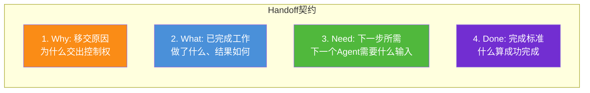

### 4.4 方式三:共享 State 通信

Worker 之间不直接通信,但通过**共享 State**间接传递信息:

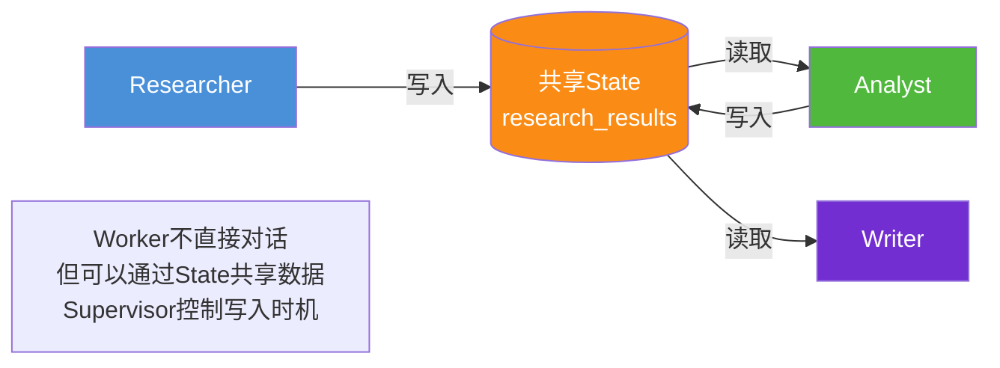

### 4.5 Worker 之间不直接通信的原因

| 原因 | 说明 |
|------|------|
| **避免隐藏链路** | Worker互调会形成不可见的通信网,难以调试 |
| **Supervisor全知** | 所有协调经Supervisor,保持全局视图完整 |
| **防止死循环** | Worker互调可能形成无限循环 |
| **状态可控** | Supervisor决定何时写State,避免冲突 |

---

## 五、决策机制深度解析

### 5.1 Supervisor 的三类决策

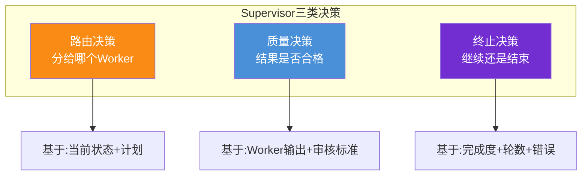

### 5.2 路由决策:基于 LLM 的智能路由

Supervisor 的路由不是硬编码的 if/else,而是让 LLM 基于当前状态智能决策:

```python
def supervisor_route_with_llm(state: OverallState) -> Command:
    """使用LLM做智能路由决策"""
    
    # 构建路由Prompt
    route_prompt = f"""
    你是Supervisor,负责协调多个专家Agent。
    根据当前状态,决定下一步将任务分给哪个Agent。
    
    当前状态:
    - 用户请求: {state['user_goal']}
    - 已完成步骤: {state['completed_steps']}
    - 研究结果: {state.get('research_results', '无')}
    - 分析结果: {state.get('analysis_result', '无')}
    - 草稿内容: {state.get('draft_content', '无')}
    - 审核状态: {state.get('review_passed', '未审核')}
    
    可选Agent:
    - researcher: 搜索信息、收集数据
    - analyst: 分析数据、计算指标
    - writer: 撰写内容、生成报告
    - reviewer: 审核质量、事实核查
    - FINISH: 任务完成,合成最终响应
    
    请输出下一步应分配的Agent名称,并说明理由。
    输出格式: {{"next": "agent_name", "reason": "..."}}
    """
    
    decision = llm.invoke(route_prompt)
    next_agent = decision["next"]
    
    if next_agent == "FINISH":
        return Command(goto="synthesizer", update={"decision_reason": decision["reason"]})
    else:
        return Command(goto=next_agent, update={"decision_reason": decision["reason"]})
```

### 5.3 质量决策:结果评估

Supervisor 需要评估 Worker 的输出质量,决定是否接受或要求重做:

```python
def evaluate_worker_output(worker_name: str, output: Any, 
                            task: str, state: OverallState) -> dict:
    """评估Worker输出质量"""
    
    evaluation = llm.invoke(f"""
    评估以下Worker的输出质量:
    
    Worker: {worker_name}
    分配的任务: {task}
    输出内容: {output}
    
    评估维度:
    1. 完整性: 是否完成了所有要求
    2. 准确性: 信息是否正确
    3. 相关性: 是否与任务相关
    4. 质量: 输出质量是否达标
    
    输出:
    {{
        "accept": true/false,
        "score": 0-100,
        "issues": ["问题1", "问题2"],
        "feedback": "给Worker的改进建议(如不接受)"
    }}
    """)
    
    return evaluation
```

### 5.4 终止决策:何时结束

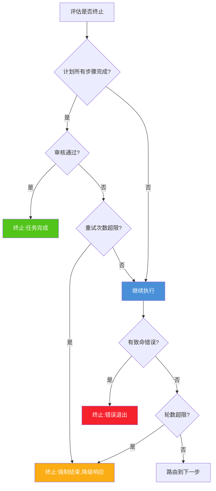

---

## 六、技术实现细节

### 6.1 LangGraph 中的 Supervisor 实现

LangGraph v1.0 提供两种实现 Supervisor 的方式:

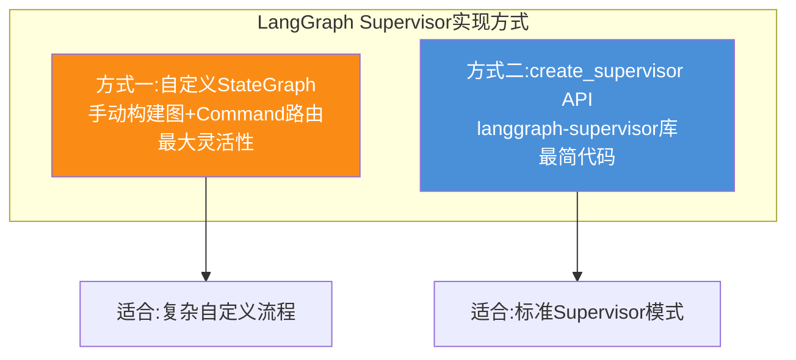

### 6.2 方式一:自定义 StateGraph

```python
from langgraph.graph import StateGraph, START, END
from langgraph.types import Command
from langgraph.checkpoint.postgres import PostgresSaver
from typing import TypedDict, Annotated, Literal
from langgraph.graph.message import add_messages

# 1. 定义全局状态
class OverallState(TypedDict):
    messages: Annotated[list, add_messages]
    user_goal: str
    plan: list
    current_step: int
    research_results: list
    analysis_result: str
    draft_content: str
    review_passed: bool
    round_count: int

# 2. 定义Supervisor节点
def supervisor_node(state: OverallState) -> Command[Literal["researcher", "analyst", "writer", "reviewer", "synthesizer"]]:
    """Supervisor: 智能路由决策"""
    
    # 使用LLM决策
    if not state.get("research_results"):
        return Command(goto="researcher", update={"current_agent": "researcher"})
    elif not state.get("analysis_result"):
        return Command(goto="analyst", update={"current_agent": "analyst"})
    elif not state.get("draft_content"):
        return Command(goto="writer", update={"current_agent": "writer"})
    elif not state.get("review_passed"):
        return Command(goto="reviewer", update={"current_agent": "reviewer"})
    else:
        return Command(goto="synthesizer")

# 3. 定义Worker节点
def researcher_node(state: OverallState) -> Command[Literal["supervisor"]]:
    """Researcher: 搜索信息"""
    results = search_tool.invoke(state["user_goal"])
    return Command(
        goto="supervisor",
        update={"research_results": results}
    )

def writer_node(state: OverallState) -> Command[Literal["supervisor"]]:
    """Writer: 撰写内容"""
    draft = llm.invoke(f"基于以下研究写报告: {state['research_results']}")
    return Command(
        goto="supervisor",
        update={"draft_content": draft}
    )

def synthesizer_node(state: OverallState) -> str:
    """合成最终响应"""
    return f"报告已完成: {state['draft_content']}"

# 4. 构建图
graph = StateGraph(OverallState)
graph.add_node("supervisor", supervisor_node)
graph.add_node("researcher", researcher_node)
graph.add_node("analyst", analyst_node)
graph.add_node("writer", writer_node)
graph.add_node("reviewer", reviewer_node)
graph.add_node("synthesizer", synthesizer_node)

graph.set_entry_point("supervisor")

# 5. 编译(含持久化)
app = graph.compile(checkpointer=PostgresSaver(...))
```

### 6.3 方式二:create_supervisor API

```python
from langgraph_supervisor import create_supervisor
from langgraph.prebuilt import create_react_agent
from langchain_openai import ChatOpenAI

# 1. 创建Worker Agents
researcher = create_react_agent(
    model=ChatOpenAI(model="gpt-4o"),
    tools=[search_web, search_arxiv],
    name="researcher",
    prompt="你是研究专家,负责搜索和整理信息。"
)

writer = create_react_agent(
    model=ChatOpenAI(model="gpt-4o"),
    tools=[write_document, format_markdown],
    name="writer",
    prompt="你是写作专家,负责撰写报告和文档。"
)

reviewer = create_react_agent(
    model=ChatOpenAI(model="gpt-4o"),
    tools=[fact_check, grammar_check],
    name="reviewer",
    prompt="你是审核专家,负责质量把关。"
)

# 2. 一行创建Supervisor
supervisor = create_supervisor(
    model=ChatOpenAI(model="gpt-4o"),
    agents=[researcher, writer, reviewer],
    prompt="""你是Supervisor,负责协调以下专家:
    - researcher: 信息检索
    - writer: 内容创作
    - reviewer: 质量审核
    
    根据用户请求,决定将任务分给哪个专家。
    收集专家结果后,决定是否需要其他专家或结束任务。""",
    # 可选:并行模式
    parallel_mode=False,  # 串行执行
)

# 3. 编译
app = supervisor.compile(checkpointer=PostgresSaver(...))

# 4. 使用
result = app.invoke({
    "messages": [{"role": "user", "content": "研究AI芯片市场并写报告"}]
})
```

### 6.4 CrewAI 中的 Supervisor 实现

```python
from crewai import Agent, Crew, Process

# 定义Worker Agents
researcher = Agent(
    role="研究专家",
    goal="收集和整理信息",
    backstory="资深研究员,擅长信息检索",
    tools=[search_tool]
)

writer = Agent(
    role="写作专家",
    goal="撰写高质量报告",
    backstory="技术作家,擅长复杂概念表达",
    tools=[write_tool]
)

# 定义Supervisor (Manager)
supervisor = Agent(
    role="项目经理",
    goal="协调团队完成任务",
    backstory="资深项目经理,擅长任务分解和团队协调",
    allow_delegation=True,  # 允许委派任务
    verbose=True
)

# 创建Crew,使用hierarchical模式
crew = Crew(
    agents=[researcher, writer],
    process=Process.hierarchical,  # 层级模式,自动创建Supervisor
    manager_llm=ChatOpenAI(model="gpt-4o"),  # Supervisor的LLM
    verbose=True
)

result = crew.kickoff("研究AI芯片市场并写报告")
```

---

## 七、在多 Agent 系统中的定位与重要性

### 7.1 系统架构中的定位

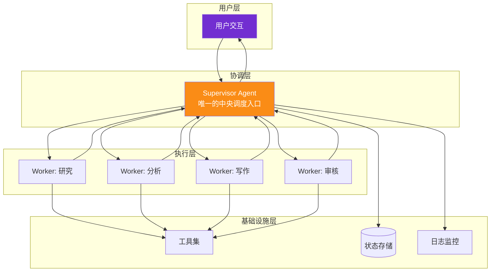

### 7.2 Supervisor 的五大重要性

| 重要性 | 说明 |
|--------|------|
| **唯一入口** | 所有用户请求经Supervisor,确保全局可控 |
| **全局视图** | 唯一拥有完整状态和执行计划的Agent |
| **质量保障** | 评估Worker输出,确保最终质量 |
| **容错核心** | Worker失败时,Supervisor决定重试/换人/降级 |
| **可观测枢纽** | 所有决策经此,是调试和监控的关键节点 |

### 7.3 Supervisor vs 其他协调模式

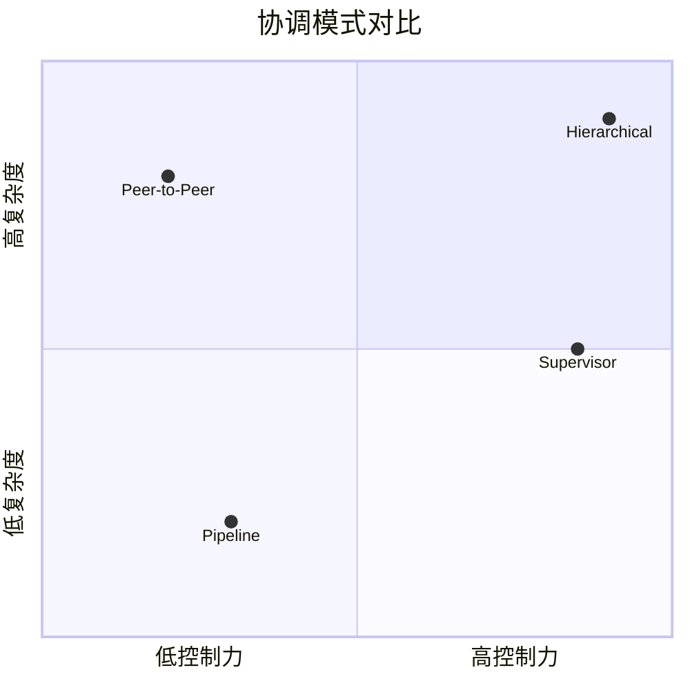

| 模式 | 控制力 | 复杂度 | 适合场景 |
|------|--------|--------|---------|
| **Supervisor** | 高 | 中 | 大多数企业级场景 |
| **Pipeline** | 低 | 低 | 线性流水线 |
| **Peer-to-Peer** | 低 | 高 | 需要多元视角的辩论 |
| **Hierarchical** | 高 | 高 | 超大规模多层组织 |

---

## 八、失败模式与容错设计

### 8.1 Supervisor 的五大失败模式

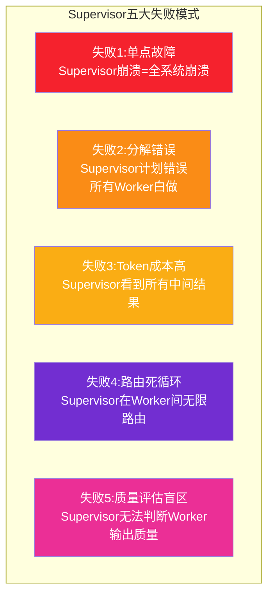

### 8.2 容错设计

#### 应对单点故障:持久化 + 恢复

```python
from langgraph.checkpoint.postgres import PostgresSaver

# 持久化:Supervisor崩溃后可从检查点恢复
app = graph.compile(
    checkpointer=PostgresSaver(conn_string="...")
)

# 崩溃后恢复:用相同thread_id继续
config = {"configurable": {"thread_id": "session-123"}}
# 崩溃前的状态自动恢复,从断点继续
result = app.invoke(None, config=config)
```

#### 应对分解错误:计划审核 + 人工介入

```python
def supervisor_plan_with_validation(state: OverallState) -> Command:
    """带审核的计划制定"""
    plan = llm.invoke(plan_prompt)
    
    # 计划审核:检查是否合理
    validation = validate_plan(plan)
    if not validation["valid"]:
        # 计划不合理 → 人工介入或重新制定
        if state.get("human_in_loop"):
            plan = ask_human_to_review_plan(plan)
        else:
            plan = llm.invoke(revised_plan_prompt)
    
    return Command(update={"plan": plan})
```

#### 应对路由死循环:最大轮数限制

```python
MAX_ROUNDS = 10

def supervisor_route_with_limit(state: OverallState) -> Command:
    """带轮数限制的路由"""
    round_count = state.get("round_count", 0)
    
    if round_count >= MAX_ROUNDS:
        # 超过最大轮数,强制结束
        return Command(
            goto="synthesizer",
            update={"force_end_reason": "超过最大轮数限制"}
        )
    
    return Command(
        update={"round_count": round_count + 1},
        goto=next_agent
    )
```

### 8.3 Worker 失败时 Supervisor 的处理

```python
def handle_worker_failure(state: OverallState, worker_name: str, error: Exception) -> Command:
    """Worker失败时,Supervisor的容错处理"""
    
    failure_count = state.get(f"{worker_name}_failures", 0)
    
    if failure_count < 2:
        # 策略1:重试(最多2次)
        return Command(
            goto=worker_name,
            update={
                f"{worker_name}_failures": failure_count + 1,
                "retry_reason": f"Worker {worker_name} 失败: {error}"
            }
        )
    elif has_alternative_worker(worker_name):
        # 策略2:换替代Worker
        alt = get_alternative_worker(worker_name)
        return Command(
            goto=alt,
            update={"fallback_reason": f"{worker_name}多次失败,改用{alt}"}
        )
    else:
        # 策略3:降级(跳过此步骤,用已有结果合成)
        return Command(
            goto="synthesizer",
            update={"degraded": True, "degrade_reason": f"{worker_name}不可用"}
        )
```

---

## 九、完整实现案例

### 9.1 场景:研究 + 写作团队

```python
"""
完整案例:Supervisor 协调 Researcher + Writer + Reviewer
任务:研究LangGraph并写技术报告
"""
from langgraph.graph import StateGraph, START, END
from langgraph.types import Command
from langgraph.checkpoint.memory import MemorySaver
from typing import TypedDict, Annotated, Literal
from langgraph.graph.message import add_messages
from langchain_openai import ChatOpenAI
from langchain_core.tools import tool

llm = ChatOpenAI(model="gpt-4o")

# ========== 状态定义 ==========
class TeamState(TypedDict):
    messages: Annotated[list, add_messages]
    user_goal: str
    research_results: str
    draft_content: str
    review_passed: bool
    review_feedback: str
    round_count: int

# ========== 工具定义 ==========
@tool
def search_web(query: str) -> str:
    """搜索网页获取信息"""
    return f"搜索结果: {query} 的相关信息..."

@tool
def write_document(content: str) -> str:
    """撰写文档"""
    return f"文档已生成: {content[:100]}..."

@tool
def check_quality(content: str) -> dict:
    """检查内容质量"""
    return {"passed": True, "score": 85, "issues": []}

# ========== Supervisor 节点 ==========
def supervisor_node(state: TeamState) -> Command[Literal["researcher", "writer", "reviewer", "synthesizer"]]:
    """Supervisor: 智能路由"""
    
    round_count = state.get("round_count", 0)
    
    # 防死循环:最大10轮
    if round_count >= 10:
        return Command(goto="synthesizer", update={"force_end": True})
    
    # 路由决策
    if not state.get("research_results"):
        return Command(
            goto="researcher",
            update={"round_count": round_count + 1}
        )
    elif not state.get("draft_content"):
        return Command(
            goto="writer",
            update={"round_count": round_count + 1}
        )
    elif not state.get("review_passed"):
        return Command(
            goto="reviewer",
            update={"round_count": round_count + 1}
        )
    else:
        return Command(goto="synthesizer")

# ========== Worker 节点 ==========
def researcher_node(state: TeamState) -> Command[Literal["supervisor"]]:
    """Researcher: 搜索信息"""
    results = search_web.invoke(state["user_goal"])
    return Command(
        goto="supervisor",
        update={"research_results": results}
    )

def writer_node(state: TeamState) -> Command[Literal["supervisor"]]:
    """Writer: 撰写报告"""
    draft = llm.invoke(
        f"基于以下研究写技术报告: {state['research_results']}"
    )
    return Command(
        goto="supervisor",
        update={"draft_content": draft.content}
    )

def reviewer_node(state: TeamState) -> Command[Literal["supervisor"]]:
    """Reviewer: 审核质量"""
    quality = check_quality.invoke(state["draft_content"])
    
    update = {"review_feedback": quality["issues"]}
    if quality["passed"]:
        update["review_passed"] = True
    else:
        # 审核不通过,清空草稿让Writer重写
        update["draft_content"] = None
    
    return Command(goto="supervisor", update=update)

def synthesizer_node(state: TeamState) -> str:
    """合成最终响应"""
    if state.get("review_passed"):
        return f"✅ 报告已完成并通过审核:\n\n{state['draft_content']}"
    else:
        return f"⚠️ 报告已完成但未通过审核(降级输出):\n\n{state.get('draft_content', '无内容')}"

# ========== 构建图 ==========
graph = StateGraph(TeamState)

graph.add_node("supervisor", supervisor_node)
graph.add_node("researcher", researcher_node)
graph.add_node("writer", writer_node)
graph.add_node("reviewer", reviewer_node)
graph.add_node("synthesizer", synthesizer_node)

graph.set_entry_point("supervisor")

# 编译(带持久化)
app = graph.compile(checkpointer=MemorySaver())

# ========== 运行 ==========
result = app.invoke(
    {
        "user_goal": "研究LangGraph框架并写技术报告",
        "messages": [{"role": "user", "content": "研究LangGraph框架并写技术报告"}]
    },
    config={"configurable": {"thread_id": "demo-001"}}
)

print(result)
```

### 9.2 执行流程时序

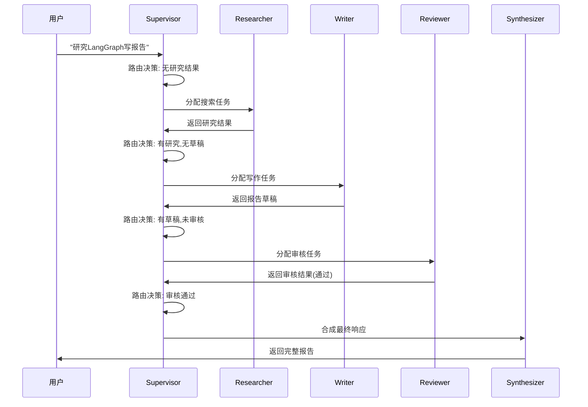

---

## 十、最佳实践与总结

### 10.1 Supervisor 设计检查清单

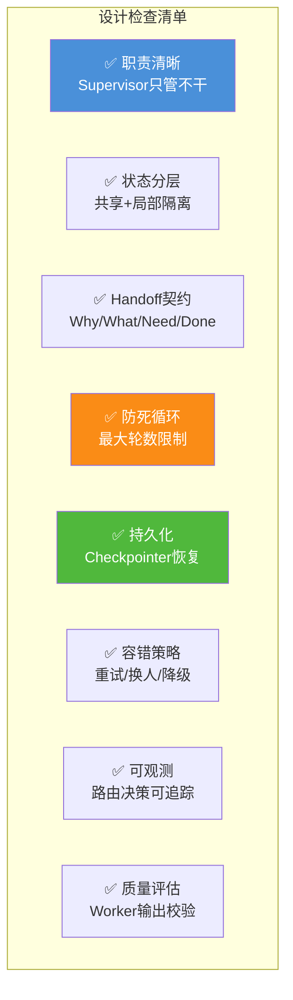

### 10.2 核心原则总结

| 原则 | 说明 |
|------|------|
| **管理者不执行** | Supervisor 只做协调,不直接调用业务工具 |
| **Worker 不互调** | 所有协调经 Supervisor,保持可观测 |
| **状态分层** | 共享状态 + Worker 局部状态,避免互相覆盖 |
| **契约式交接** | Handoff 必须包含 Why/What/Need/Done |
| **防止死循环** | 最大轮数 + 重复检测 |
| **优雅降级** | Worker 失败时重试→换人→降级 |

### 10.3 何时用 Supervisor 模式

| 场景特征 | 推荐 | 理由 |
|---------|------|------|
| 任务可分解为多个领域 | ✅ Supervisor | 领域专家分工 |
| 需要全局协调和顺序控制 | ✅ Supervisor | Supervisor 统一调度 |
| 需要质量审核环节 | ✅ Supervisor | Supervisor 评估输出 |
| 子任务相互独立 | ✅ Supervisor(并行) | Fan-out 提速 |
| 线性流水线(无分支) | ❌ 用 Pipeline | Supervisor 过重 |
| 需要多视角辩论 | ❌ 用 Peer-to-Peer | Supervisor 限制对话 |

### 10.4 与系列文档的关系

| 文档 | 主题 | 与本文关系 |
|------|------|-----------|
| [108号:MAS核心概念](./108Multi-Agent多智能体系统核心概念详解.md) | MAS 基础 | 本文的背景知识 |
| [109号:架构设计模式](./109Multi-Agent系统架构设计模式深度解析.md) | 十大模式总览 | 本文是其"层次化控制模式"的深入 |
| [87号:LangGraph诞生背景](../6Agent%20Framework/87LangGraph框架诞生背景与核心定位深度解析.md) | LangGraph 介绍 | 本文的实现框架 |
| [88号:LC vs LG对比](../6Agent%20Framework/88LangChain与LangGraph核心区别系统性对比深度解析.md) | 框架选型 | LangGraph 原生支持 Supervisor |
| **本文** | **Supervisor Agent 详解** | **Supervisor-Worker 模式的深度剖析** |

### 10.5 一句话总结

> **Supervisor Agent 是多 Agent 系统的"CEO"——它不亲自干活,但决定了"谁干什么、什么时候干、干得好不好、什么时候停"。没有 Supervisor 的多 Agent 系统是一群各自为战的散兵;有了 Supervisor,才是一支协同作战的团队。**

---

> **参考来源:**
> - [Five Multi-Agent Coordination Patterns That Actually Work in Enterprise](https://inductivee.com/blog/multiagent-coordination-patterns-enterprise) — Inductivee 企业级五种协调模式(2026年4月更新)
> - [LangGraph v1.0 多 Agent 系统实战:Supervisor 架构与 Subgraphs](https://blog.csdn.net/wayle123/article/details/158504965) — LangGraph v1.0 Supervisor 架构详解
> - [Multi-Agent AI: 4 Patterns and When Each One Breaks](https://webosmotic.com/blog/multi-agent-ai-architecture/) — WebOsmotic 四大模式与失败模式(2026年5月)
> - [LangGraph Multi-Agent Graphs: Supervisor, Specialist, and Handoff](https://www.tutorialslogic.com/langgraph/multi-agent-graphs) — LangGraph 官方文档 Supervisor 模式(2026年7月验证)
> - [LangGraph Multi-Agent Collaboration: Supervisor Pattern](https://eastondev.com/blog/en/posts/ai/20260512-langgraph-multi-agent-supervisor/) — Supervisor 模式实践案例(2026年5月)
> - [Microsoft Azure AI Foundry Orchestrator-Worker Model](https://webosmotic.com/blog/multi-agent-ai-architecture/) — Microsoft 编排者-工作者模型
