# 多 Agent 系统角色分工与任务分配策略深度解析

> **文档定位**:本文档是 `8多 Agent 系统` 系列的角色设计专题篇,深入解析 **多 Agent 系统中如何为各 Agent 进行科学合理的角色分工**。在 [108号文档](./108Multi-Agent多智能体系统核心概念详解.md) 阐述 MAS 基础概念、[109号文档](./109Multi-Agent系统架构设计模式深度解析.md) 总览架构模式、[110号文档](./110SupervisorAgent核心概念与架构设计深度解析.md) 解析 Supervisor 协调者的基础上,本文回答一个更上游的设计问题:**"系统里应该有哪些 Agent?每个 Agent 干什么?它们之间如何分工协作?"**
>
> **核心问题**:角色分工是多 Agent 系统设计的"第一性原理"——分工错了,再好的架构和协调机制都无法弥补。本文从功能定位、职责边界、协作机制、任务分配策略四个维度,结合行业级角色设计模式,提供一套可复用的角色分工方法论。

---

## 目录

- [一、角色分工的核心挑战与设计原则](#一角色分工的核心挑战与设计原则)
- [二、Agent 类型分类体系](#二agent-类型分类体系)
- [三、不同类型 Agent 的功能定位](#三不同类型-agent-的功能定位)
- [四、职责边界设计](#四职责边界设计)
- [五、协作机制设计](#五协作机制设计)
- [六、任务分配策略](#六任务分配策略)
- [七、行业级角色设计模式](#七行业级角色设计模式)
- [八、角色冲突与解决方案](#八角色冲突与解决方案)
- [九、完整案例与最佳实践](#九完整案例与最佳实践)

---

## 一、角色分工的核心挑战与设计原则

### 1.1 为什么角色分工是第一性原理

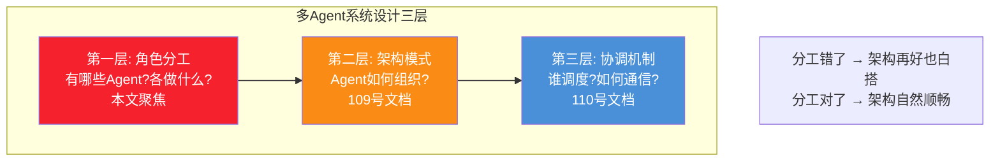

### 1.2 角色分工的五大挑战

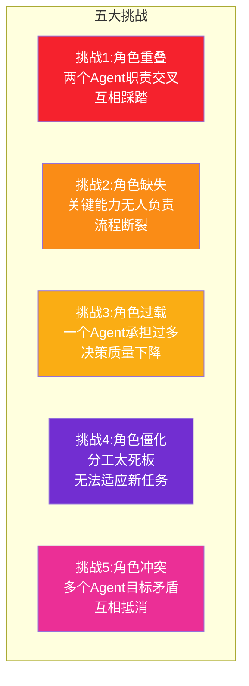

### 1.3 角色分工六原则

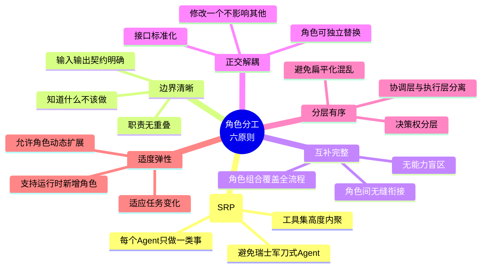

### 1.4 角色分工设计流程

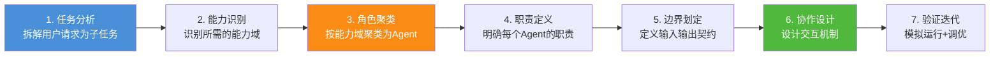

---

## 二、Agent 类型分类体系

### 2.1 按功能层次分类

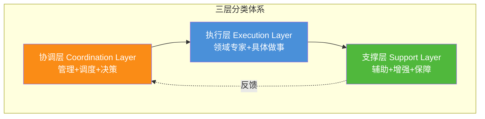

### 2.2 完整角色分类矩阵

| 层次 | 角色类型 | 核心职责 | 典型 Agent | 工具数量 |
|------|---------|---------|-----------|---------|
| **协调层** | Supervisor | 全局调度、任务路由、结果合成 | Supervisor Agent | 少(仅路由) |
| **协调层** | Planner | 任务分解、计划制定、步骤编排 | Planning Agent | 无(纯推理) |
| **协调层** | Router | 意图识别、请求分发 | Router Agent | 少(分类器) |
| **执行层** | Researcher | 信息检索、数据收集 | Search Agent | 中(搜索工具) |
| **执行层** | Analyst | 数据分析、计算、推理 | Analysis Agent | 中(计算工具) |
| **执行层** | Writer | 内容创作、文档生成 | Writing Agent | 少(格式化) |
| **执行层** | Coder | 代码编写、程序修改 | Coding Agent | 多(IDE/执行) |
| **执行层** | Reviewer | 质量审核、事实核查 | Review Agent | 少(校验工具) |
| **执行层** | Executor | 操作执行、副作用产生 | Action Agent | 多(业务系统) |
| **支撑层** | Memory Manager | 记忆管理、上下文维护 | Memory Agent | 少(存储API) |
| **支撑层** | Critic | 方案质疑、风险识别 | Critic Agent | 无(纯推理) |
| **支撑层** | Translator | 格式转换、协议适配 | Format Agent | 少(转换器) |
| **支撑层** | Guard | 安全检查、权限控制 | Safety Agent | 少(校验器) |

### 2.3 按决策权限分类

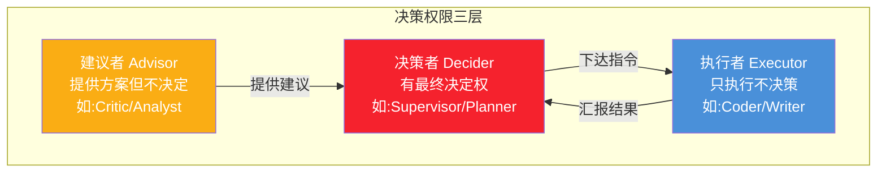

---

## 三、不同类型 Agent 的功能定位

### 3.1 协调层 Agent

#### Supervisor(监督者)

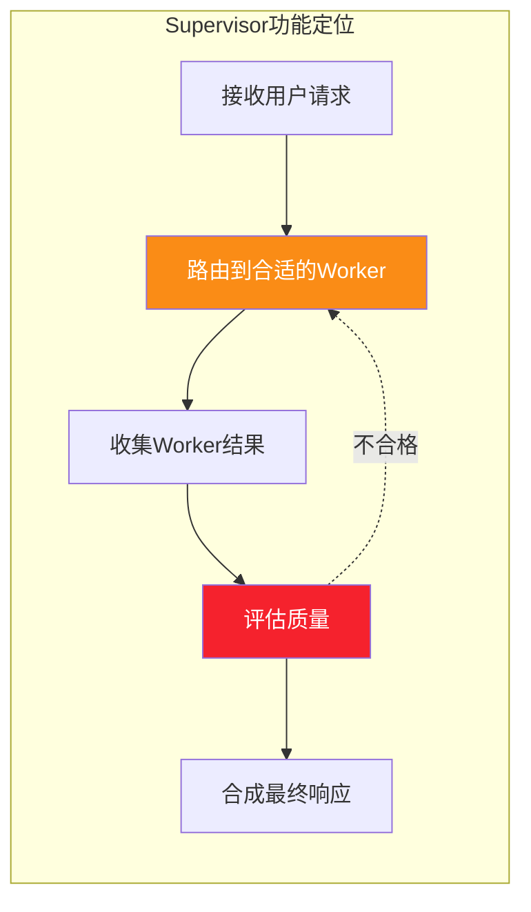

| 维度 | 定位 |
|------|------|
| **核心能力** | 全局视图、路由决策、质量评估 |
| **工具集** | 路由工具(不直接执行业务) |
| **上下文范围** | 全局(看所有Worker的输出) |
| **决策权** | 最高(决定分给谁、何时结束) |
| **详见** | [110号文档](./110SupervisorAgent核心概念与架构设计深度解析.md) |

#### Planner(规划者)

```python
class PlannerAgent:
    """规划者:将复杂任务分解为可执行的步骤序列"""
    
    role = "Planner"
    responsibility = "任务分解与计划制定"
    tools = []  # 无需工具,纯推理
    
    def plan(self, user_request: str) -> list:
        """将用户请求分解为步骤列表"""
        plan = llm.invoke(f"""
        将以下任务分解为可执行步骤:
        {user_request}
        
        输出格式:
        [
            {{"step": 1, "agent": "researcher", "task": "...", "depends_on": []}},
            {{"step": 2, "agent": "analyst", "task": "...", "depends_on": [1]}},
            ...
        ]
        """)
        return plan
```

| 维度 | 定位 |
|------|------|
| **核心能力** | 任务分解、依赖分析、步骤编排 |
| **工具集** | 无(纯 LLM 推理) |
| **输出** | 结构化执行计划(steps + dependencies) |
| **与 Supervisor 区别** | Planner 只制定计划,Supervisor 执行调度 |

#### Router(路由者)

```python
class RouterAgent:
    """路由者:轻量级意图识别和请求分发"""
    
    role = "Router"
    responsibility = "意图识别与请求路由"
    
    def route(self, user_input: str) -> str:
        """识别意图,路由到对应Agent"""
        intent = self.classify_intent(user_input)
        routing_table = {
            "question": "qa_agent",
            "task": "task_agent",
            "chat": "chat_agent",
            "complaint": "service_agent"
        }
        return routing_table.get(intent, "fallback_agent")
```

| 维度 | 定位 |
|------|------|
| **核心能力** | 意图分类、快速路由 |
| **适用场景** | 客服系统、多技能助手入口 |
| **与 Supervisor 区别** | Router 只做分类转发,不做质量评估和合成 |

### 3.2 执行层 Agent

#### Researcher(研究专家)

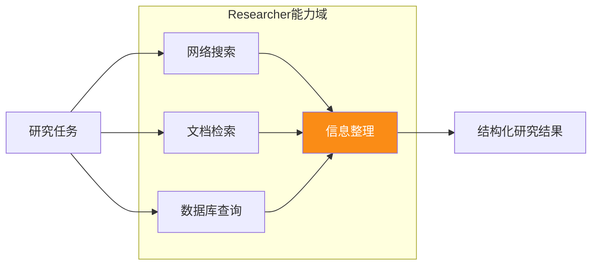

| 维度 | 定位 |
|------|------|
| **核心能力** | 信息检索、数据收集、来源标注 |
| **工具集** | `search_web`/`search_arxiv`/`query_db`/`read_doc` |
| **输入** | 研究主题/查询关键词 |
| **输出** | 结构化研究结果(含来源) |
| **职责边界** | 只负责"找信息",不负责"分析信息" |

#### Analyst(分析专家)

```python
class AnalystAgent:
    """分析专家:对数据进行计算、推理、洞察提取"""
    
    role = "Analyst"
    responsibility = "数据分析与洞察提取"
    tools = ["python_repl", "statistical_analysis", "data_visualization"]
    
    def analyze(self, research_data: list) -> dict:
        return {
            "summary": "数据概要",
            "trends": ["趋势1", "趋势2"],
            "metrics": {"growth_rate": 0.25, "confidence": 0.92},
            "insights": ["关键洞察1", "关键洞察2"]
        }
```

| 维度 | 定位 |
|------|------|
| **核心能力** | 数据计算、统计分析、趋势识别 |
| **工具集** | Python REPL、统计库、可视化工具 |
| **输入** | Researcher 的原始数据 |
| **输出** | 分析结论 + 指标 + 洞察 |
| **职责边界** | 只负责"分析",不负责"检索"或"写作" |

#### Writer(写作专家)

| 维度 | 定位 |
|------|------|
| **核心能力** | 内容组织、语言表达、格式化输出 |
| **工具集** | `write_document`/`format_markdown`/`translate` |
| **输入** | 分析结论 + 研究数据 |
| **输出** | 结构化文档/报告 |
| **职责边界** | 只负责"写",不负责"查"或"判" |

#### Coder(编程专家)

| 维度 | 定位 |
|------|------|
| **核心能力** | 代码编写、调试、重构 |
| **工具集** | `read_file`/`write_file`/`execute_code`/`run_test` |
| **输入** | 编程需求/bug 描述 |
| **输出** | 可运行代码 + 测试 |
| **职责边界** | 只负责"实现",不负责"需求分析"或"架构决策" |

#### Reviewer(审核专家)

```python
class ReviewerAgent:
    """审核专家:质量把关、事实核查、标准校验"""
    
    role = "Reviewer"
    responsibility = "质量审核与事实核查"
    tools = ["fact_check", "grammar_check", "plagiarism_check"]
    
    def review(self, content: str, criteria: dict) -> dict:
        return {
            "passed": True/False,
            "score": 85,
            "issues": ["问题1", "问题2"],
            "suggestions": ["建议1", "建议2"]
        }
```

| 维度 | 定位 |
|------|------|
| **核心能力** | 质量评估、事实核查、风险识别 |
| **工具集** | 事实核查、语法检查、抄袭检测 |
| **输入** | Worker 的输出内容 |
| **输出** | 审核结论 + 评分 + 改进建议 |
| **职责边界** | 只负责"评判",不负责"修改"(修改交回原 Worker) |

#### Executor(执行者)

| 维度 | 定位 |
|------|------|
| **核心能力** | 执行业务操作、产生副作用 |
| **工具集** | 业务系统 API(下单/转账/发邮件) |
| **输入** | 确认后的执行指令 |
| **输出** | 执行结果(成功/失败 + 凭证) |
| **职责边界** | 只负责"执行",不负责"决策"(需 Supervisor 确认) |
| **特殊要求** | 敏感操作必须经人工确认 |

### 3.3 支撑层 Agent

#### Critic(批评者)

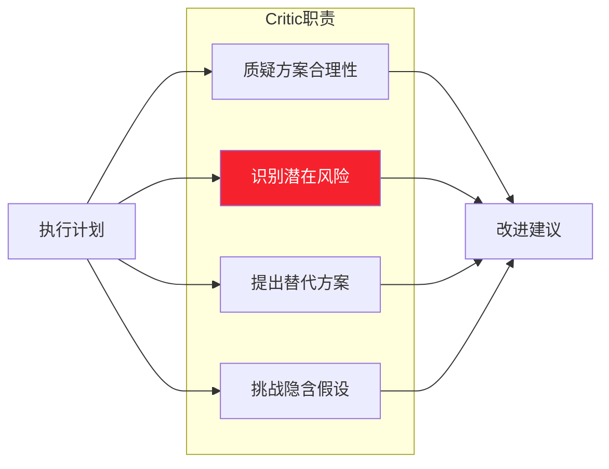

| 维度 | 定位 |
|------|------|
| **核心能力** | 批判性思维、风险识别、反方观点 |
| **工具集** | 无(纯 LLM 推理) |
| **价值** | 防止群体思维,提高方案鲁棒性 |
| **使用时机** | Planner 制定计划后、Reviewer 审核前 |

#### Memory Manager(记忆管理者)

| 维度 | 定位 |
|------|------|
| **核心能力** | 上下文压缩、记忆检索、记忆更新 |
| **工具集** | 向量数据库、键值存储 |
| **价值** | 防止上下文爆炸,维持长期记忆 |
| **与 RAG 关系** | 类似 RAG 但面向 Agent 内部状态 |

---

## 四、职责边界设计

### 4.1 职责边界的三个维度

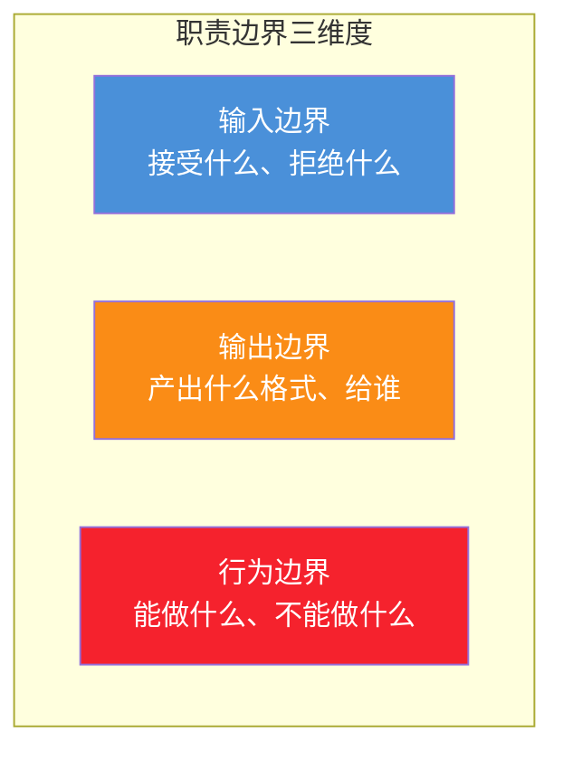

### 4.2 职责边界定义模板

每个 Agent 的职责边界应明确定义:

```yaml
# Agent 职责边界定义模板
agent_name: Researcher
layer: execution
responsibility: 信息检索与数据收集

# 输入边界
input:
  accepts:
    - research_topic: string  # 研究主题
    - search_keywords: list   # 搜索关键词
    - depth: enum[shallow, deep]  # 检索深度
  rejects:
    - 分析任务 → 转交 Analyst
    - 写作任务 → 转交 Writer

# 输出边界
output:
  format:
    type: structured_json
    schema:
      results: array
      sources: array
      confidence: float
  delivers_to: Supervisor

# 行为边界
behavior:
  can_do:
    - 调用搜索工具
    - 整理搜索结果
    - 标注信息来源
  cannot_do:
    - 不做数据分析(Analyst 的职责)
    - 不做内容创作(Writer 的职责)
    - 不做质量评判(Reviewer 的职责)
  escalation:
    - 信息不足 → 返回 Supervisor 请求补充
    - 搜索失败 → 返回 Supervisor 请求重试
```

### 4.3 职责边界矩阵(防重叠)

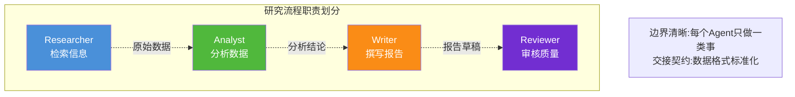

### 4.4 反模式:职责重叠

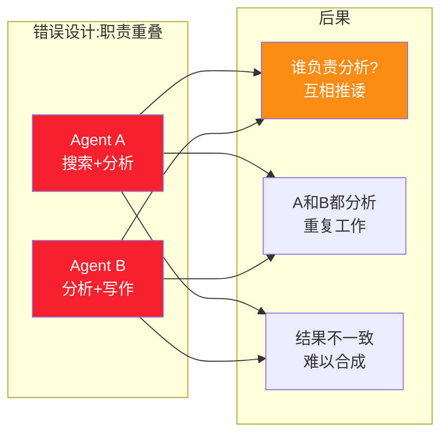

**正确做法**:分析只由 Analyst 负责,Researcher 只检索不分析,Writer 只写作不分析。

---

## 五、协作机制设计

### 5.1 四种协作模式

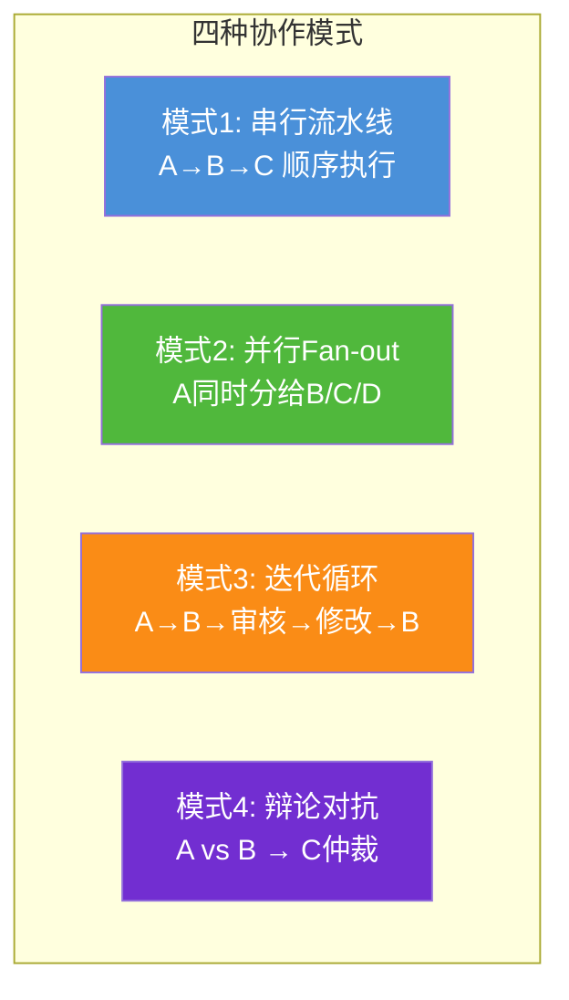

### 5.2 模式一:串行流水线

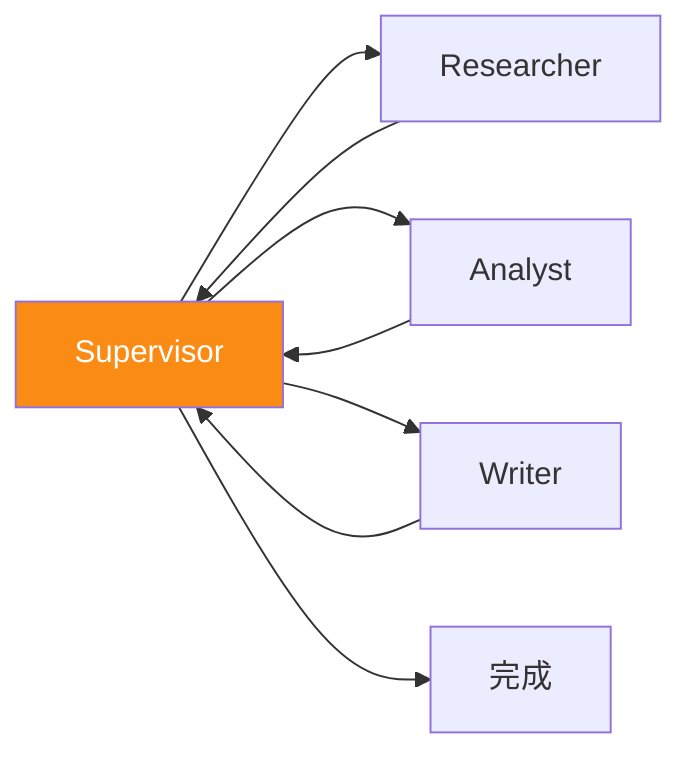

**适用场景**:后一步依赖前一步结果,逻辑顺序明确。

```python
# 串行流水线协作
def serial_pipeline(state):
    # Step 1: Researcher 检索
    research = researcher.invoke(state["topic"])
    state["research_results"] = research
    
    # Step 2: Analyst 分析(依赖Step 1)
    analysis = analyst.invoke(research)
    state["analysis"] = analysis
    
    # Step 3: Writer 写作(依赖Step 2)
    draft = writer.invoke(analysis)
    state["draft"] = draft
    
    return state
```

### 5.3 模式二:并行 Fan-out

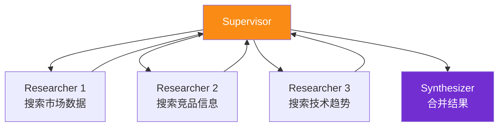

**适用场景**:子任务相互独立,可同时执行。

```python
# 并行Fan-out协作
import asyncio

async def parallel_fanout(state):
    # 同时启动3个研究任务
    tasks = [
        researcher.invoke("市场数据"),
        researcher.invoke("竞品信息"),
        researcher.invoke("技术趋势")
    ]
    results = await asyncio.gather(*tasks)
    
    # 合并结果
    state["research_results"] = merge(results)
    return state
```

### 5.4 模式三:迭代循环

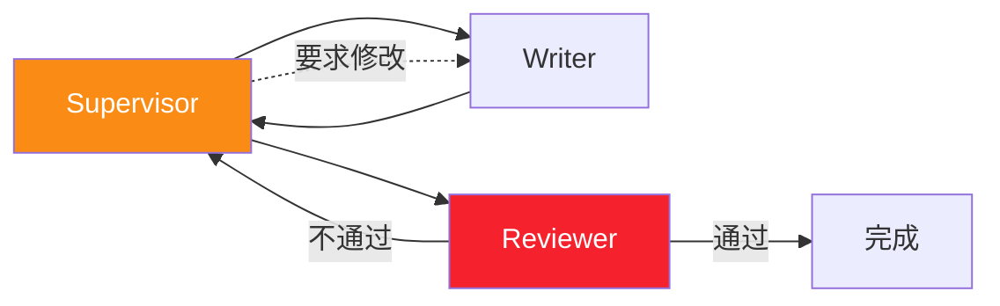

**适用场景**:需要质量审核和多轮修改。

### 5.5 模式四:辩论对抗

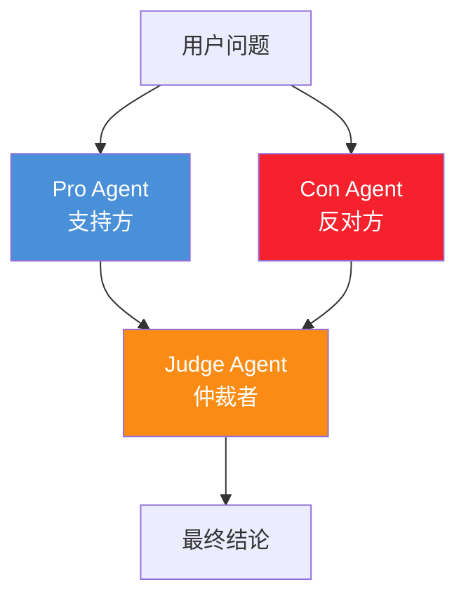

**适用场景**:需要多视角权衡的复杂决策(投资/政策/架构选型)。

### 5.6 协作通信契约

Agent 间协作必须遵循标准化通信契约:

```python
class HandoffContract(TypedDict):
    """Agent 间交接的标准契约"""
    from_agent: str        # 谁交出的
    to_agent: str          # 交给谁
    reason: str            # 为什么交接
    completed_work: str    # 已完成什么
    next_input: dict       # 下一个Agent需要的输入
    context: str           # 上下文摘要(避免重复劳动)
    done_criteria: str     # 什么算完成
```

---

## 六、任务分配策略

### 6.1 任务分配的五个考虑因素

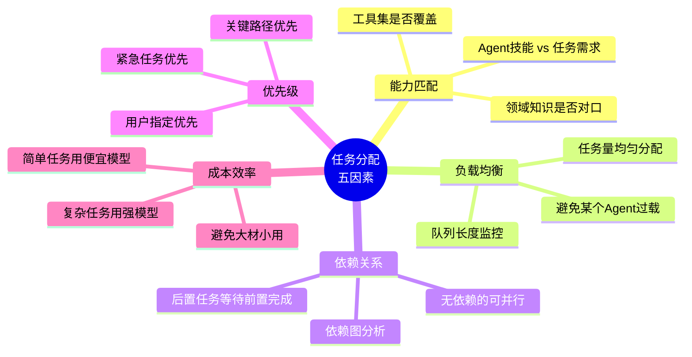

### 6.2 能力匹配矩阵

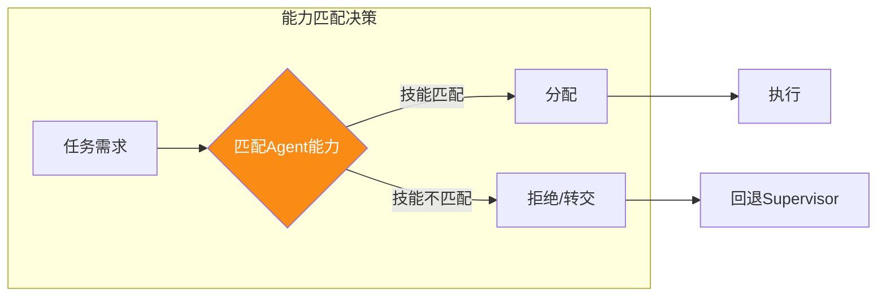

```python
class TaskAssigner:
    """基于能力匹配的任务分配器"""
    
    CAPABILITY_MATRIX = {
        "researcher": {"search", "retrieve", "collect"},
        "analyst": {"analyze", "calculate", "statistical"},
        "writer": {"write", "draft", "format"},
        "coder": {"code", "debug", "refactor"},
        "reviewer": {"review", "check", "verify"}
    }
    
    def assign(self, task: dict) -> str:
        """根据任务关键词匹配Agent"""
        task_keywords = extract_keywords(task["description"])
        
        best_agent = None
        best_score = 0
        
        for agent, capabilities in self.CAPABILITY_MATRIX.items():
            # 计算能力匹配度
            overlap = len(task_keywords & capabilities)
            score = overlap / len(capabilities)
            
            if score > best_score:
                best_score = score
                best_agent = agent
        
        if best_score < 0.3:
            # 匹配度过低,返回Supervisor处理
            return "supervisor"
        
        return best_agent
```

### 6.3 负载均衡策略

```python
class LoadBalancer:
    """Agent 负载均衡器"""
    
    def __init__(self):
        self.agent_loads = {agent: 0 for agent in AGENT_REGISTRY}
        self.agent_queues = {agent: [] for agent in AGENT_REGISTRY}
    
    def assign_with_balance(self, task: dict, capable_agents: list) -> str:
        """在能力匹配的Agent中选择负载最低的"""
        # 过滤出有能力的Agent
        candidates = [a for a in capable_agents if a in self.agent_loads]
        
        if not candidates:
            return None
        
        # 选择当前负载最低的
        balanced_agent = min(candidates, key=lambda a: self.agent_loads[a])
        
        # 更新负载
        self.agent_loads[balanced_agent] += 1
        self.agent_queues[balanced_agent].append(task)
        
        return balanced_agent
    
    def release(self, agent: str):
        """任务完成后释放负载"""
        if self.agent_loads[agent] > 0:
            self.agent_loads[agent] -= 1
            if self.agent_queues[agent]:
                self.agent_queues[agent].pop(0)
```

### 6.4 依赖关系管理

```python
class DependencyManager:
    """任务依赖关系管理器"""
    
    def build_dependency_graph(self, plan: list) -> dict:
        """构建依赖图"""
        graph = {}
        for step in plan:
            step_id = step["step"]
            depends_on = step.get("depends_on", [])
            graph[step_id] = {
                "agent": step["agent"],
                "task": step["task"],
                "depends_on": depends_on,
                "status": "pending"
            }
        return graph
    
    def get_ready_tasks(self, graph: dict) -> list:
        """获取所有依赖已满足的待执行任务"""
        ready = []
        for step_id, step in graph.items():
            if step["status"] != "pending":
                continue
            # 检查所有依赖是否完成
            deps_satisfied = all(
                graph[dep]["status"] == "completed"
                for dep in step["depends_on"]
            )
            if deps_satisfied:
                ready.append(step_id)
        return ready
    
    def can_parallelize(self, ready_tasks: list) -> bool:
        """判断是否有可并行的任务"""
        return len(ready_tasks) > 1
```

### 6.5 成本效率优化

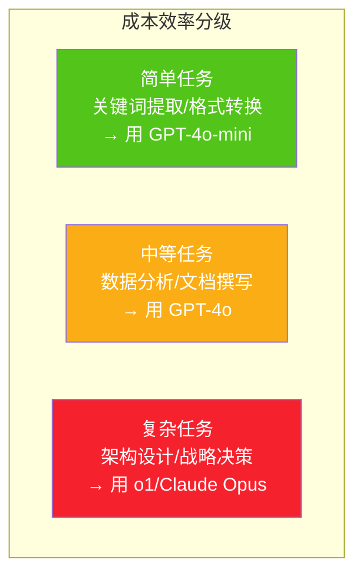

```python
class CostOptimizer:
    """基于任务复杂度的模型选择"""
    
    MODEL_TIERS = {
        "simple": "gpt-4o-mini",    # $0.15/1M tokens
        "medium": "gpt-4o",          # $2.50/1M tokens
        "complex": "o1"              # $15/1M tokens
    }
    
    def select_model(self, task: dict) -> str:
        """根据任务复杂度选择模型"""
        complexity = self.assess_complexity(task)
        return self.MODEL_TIERS[complexity]
    
    def assess_complexity(self, task: dict) -> str:
        """评估任务复杂度"""
        if task.get("requires_reasoning", False):
            return "complex"
        if task.get("requires_analysis", False):
            return "medium"
        return "simple"
```

---

## 七、行业级角色设计模式

### 7.1 模式一:研究-写作团队(最常见)

```mermaid
flowchart TB
    subgraph 研究写作团队
        SUP[Supervisor<br/>协调]
        RES[Researcher<br/>检索]
        ANA[Analyst<br/>分析]
        WRI[Writer<br/>写作]
        REV[Reviewer<br/>审核]
    end
    
    SUP --> RES --> ANA --> WRI --> REV
    REV -.->|不通过| WRI
    REV -.->|通过| SUP
    
    style SUP fill:#fa8c16,color:#fff
```

| 角色 | 职责 | 工具 |
|------|------|------|
| Supervisor | 协调全流程 | 路由工具 |
| Researcher | 检索信息 | 搜索/数据库 |
| Analyst | 分析数据 | Python/统计 |
| Writer | 撰写报告 | 格式化工具 |
| Reviewer | 审核质量 | 事实核查 |

**适用场景**:研究报告、市场分析、技术文档、学术论文。

### 7.2 模式二:软件开发团队

```mermaid
flowchart TB
    subgraph 软件开发团队
        PM[Product Manager<br/>需求分析]
        ARCH[Architect<br/>架构设计]
        CODER[Coder<br/>编码实现]
        TESTER[Tester<br/>测试验证]
        REV[Code Reviewer<br/>代码审核]
    end
    
    PM --> ARCH --> CODER --> TESTER
    TESTER -.->|Bug| CODER
    CODER --> REV
    REV -.->|需改| CODER
    
    style PM fill:#4a90d9,color:#fff
    style ARCH fill:#fa8c16,color:#fff
    style CODER fill:#50b83c,color:#fff
```

**适用场景**:自动化软件开发、Bug 修复、代码重构。

### 7.3 模式三:客服支持团队

```mermaid
flowchart TB
    RT[Router<br/>意图识别] --> QA[QA Agent<br/>常见问题]
    RT --> TK[Task Agent<br/>工单处理]
    RT --> CMP[Complaint Agent<br/>投诉处理]
    RT --> HUM[Human Handoff<br/>人工转接]
    
    QA --> END[解决]
    TK --> END
    CMP --> END
    HUM --> HUMAN[人工客服]
    
    style RT fill:#fa8c16,color:#fff
    style HUM fill:#f5222d,color:#fff
```

**适用场景**:智能客服、工单系统、售后支持。

### 7.4 模式四:投资决策团队

```mermaid
flowchart TB
    subgraph 投资决策团队(辩论模式)
        Q[投资标的] --> PRO[Bull Agent<br/>看多方]
        Q --> CON[Bear Agent<br/>看空方]
        PRO --> JUDGE[Judge<br/>仲裁]
        CON --> JUDGE
        JUDGE --> DEC[投资决策]
    end
    
    style PRO fill:#52c41a,color:#fff
    style CON fill:#f5222d,color:#fff
    style JUDGE fill:#fa8c16,color:#fff
```

**适用场景**:投资分析、战略决策、政策评估。

### 7.5 模式五:数据处理流水线

```mermaid
flowchart LR
    ING[Ingestor<br/>数据采集] --> CLEAN[Cleaner<br/>数据清洗]
    CLEAN --> TR[Transformer<br/>数据转换]
    TR --> ANA[Analyzer<br/>数据分析]
    ANA --> REP[Reporter<br/>报告生成]
    
    style ING fill:#4a90d9,color:#fff
    style ANA fill:#fa8c16,color:#fff
```

**适用场景**:ETL 流水线、数据分析自动化、报表生成。

---

## 八、角色冲突与解决方案

### 8.1 五类角色冲突

```mermaid
flowchart TB
    subgraph 五类角色冲突
        F1[冲突1: 目标冲突<br/>Agent目标互相矛盾]
        F2[冲突2: 资源冲突<br/>多个Agent抢同一资源]
        F3[冲突3: 结果冲突<br/>不同Agent给出矛盾结论]
        F4[冲突4: 边界冲突<br/>职责交叉互相推诿]
        F5[冲突5: 优先级冲突<br/>多个任务争抢同一Agent]
    end
    
    style F1 fill:#f5222d,color:#fff
    style F3 fill:#fa8c16,color:#fff
    style F5 fill:#faad14,color:#fff
```

### 8.2 冲突解决机制

#### 目标冲突:Supervisor 仲裁

```python
def resolve_goal_conflict(agent_a_goal: str, agent_b_goal: str, 
                           supervisor_context: dict) -> str:
    """Supervisor 仲裁目标冲突"""
    decision = supervisor_llm.invoke(f"""
    两个Agent的目标发生冲突:
    Agent A 目标: {agent_a_goal}
    Agent B 目标: {agent_b_goal}
    
    全局上下文: {supervisor_context}
    
    请基于全局最优原则仲裁:
    1. 哪个目标更符合用户原始请求?
    2. 能否找到折中方案?
    3. 输出最终决策和理由。
    """)
    return decision
```

#### 结果冲突:多轮投票

```mermaid
flowchart LR
    A[Agent A 结论: 是] --> VOTE[投票机制]
    B[Agent B 结论: 否] --> VOTE
    C[Agent C 结论: 是] --> VOTE
    VOTE --> R[少数服从多数: 是]
    
    style VOTE fill:#fa8c16,color:#fff
```

```python
def resolve_result_conflict(results: list) -> dict:
    """多Agent结果冲突 → 投票+置信度加权"""
    votes = {}
    for result in results:
        answer = result["conclusion"]
        confidence = result["confidence"]
        votes[answer] = votes.get(answer, 0) + confidence
    
    # 置信度加权投票
    final_answer = max(votes, key=votes.get)
    return {
        "conclusion": final_answer,
        "confidence": votes[final_answer] / sum(votes.values()),
        "dissenting": [r for r in results if r["conclusion"] != final_answer]
    }
```

#### 优先级冲突:优先级队列

```python
class PriorityQueue:
    """优先级冲突 → 基于优先级的任务调度"""
    
    def schedule(self, tasks: list) -> list:
        """按优先级排序任务"""
        return sorted(tasks, key=lambda t: (
            -t["priority"],       # 优先级高的先
            t["deadline"],        # 截止时间紧的先
            t["created_at"]       # 先来先服务
        ))
```

### 8.3 冲突预防设计

| 预防措施 | 说明 |
|---------|------|
| **职责明确化** | 每个Agent的职责边界用YAML定义,无重叠 |
| **目标对齐** | 所有Agent的system prompt包含全局目标 |
| **Supervisor权威** | 冲突时Supervisor有最终裁决权 |
| **Critic制衡** | Critic Agent专门负责发现潜在冲突 |
| **审计日志** | 所有决策记录,事后可追溯冲突原因 |

---

## 九、完整案例与最佳实践

### 9.1 完整案例:企业级研究助手

```python
"""
完整案例:企业级研究助手系统
任务: "研究AI芯片市场,分析竞争格局,撰写投资报告"
"""
from langgraph.graph import StateGraph, START, END
from langgraph.types import Command
from typing import TypedDict, Annotated, Literal
from langgraph.graph.message import add_messages

# ========== 状态定义 ==========
class ResearchSystemState(TypedDict):
    messages: Annotated[list, add_messages]
    user_goal: str
    plan: list
    research_results: dict       # 多个Researcher的并行结果
    analysis_result: dict
    draft_content: str
    review_passed: bool
    review_feedback: str
    round_count: int

# ========== 角色定义 ==========
ROLES = {
    "supervisor": {
        "layer": "coordination",
        "responsibility": "全局协调与路由",
        "tools": [],
        "model": "gpt-4o",
        "system_prompt": "你是项目经理,负责协调研究团队..."
    },
    "planner": {
        "layer": "coordination",
        "responsibility": "任务分解与计划制定",
        "tools": [],
        "model": "gpt-4o",
        "system_prompt": "你是规划专家,擅长任务分解..."
    },
    "researcher_market": {
        "layer": "execution",
        "responsibility": "市场数据检索",
        "tools": ["search_web", "query_market_db"],
        "model": "gpt-4o",
        "system_prompt": "你是市场研究专家,专注市场数据..."
    },
    "researcher_competitor": {
        "layer": "execution",
        "responsibility": "竞品信息检索",
        "tools": ["search_web", "query_competitor_db"],
        "model": "gpt-4o",
        "system_prompt": "你是竞品分析专家,专注竞争对手..."
    },
    "analyst": {
        "layer": "execution",
        "responsibility": "数据分析与洞察",
        "tools": ["python_repl", "statistical_analysis"],
        "model": "gpt-4o",
        "system_prompt": "你是数据分析师,擅长从数据中提取洞察..."
    },
    "writer": {
        "layer": "execution",
        "responsibility": "报告撰写",
        "tools": ["write_document", "format_markdown"],
        "model": "gpt-4o",
        "system_prompt": "你是技术作家,擅长撰写投资报告..."
    },
    "reviewer": {
        "layer": "execution",
        "responsibility": "质量审核",
        "tools": ["fact_check", "grammar_check"],
        "model": "gpt-4o",
        "system_prompt": "你是审核专家,严格把关质量..."
    },
    "critic": {
        "layer": "support",
        "responsibility": "方案质疑与风险识别",
        "tools": [],
        "model": "o1",
        "system_prompt": "你是批评者,专门质疑方案的合理性..."
    }
}

# ========== Supervisor 节点 ==========
def supervisor_node(state: ResearchSystemState) -> Command[Literal[
    "planner", "researcher_market", "researcher_competitor",
    "analyst", "writer", "reviewer", "critic", "synthesizer"
]]:
    """Supervisor: 全局路由"""
    
    round_count = state.get("round_count", 0)
    if round_count >= 10:
        return Command(goto="synthesizer", update={"force_end": True})
    
    # 路由逻辑
    if not state.get("plan"):
        return Command(goto="planner", update={"round_count": round_count + 1})
    
    if not state.get("research_results"):
        # 并行Fan-out: 同时启动两个Researcher
        return Command(
            goto=["researcher_market", "researcher_competitor"],
            update={"round_count": round_count + 1}
        )
    
    if not state.get("analysis_result"):
        return Command(goto="analyst", update={"round_count": round_count + 1})
    
    if not state.get("draft_content"):
        # 写作前先让Critic评估分析结论
        return Command(goto="critic", update={"round_count": round_count + 1})
    
    if state.get("critic_approved") and not state.get("draft_content"):
        return Command(goto="writer", update={"round_count": round_count + 1})
    
    if not state.get("review_passed"):
        return Command(goto="reviewer", update={"round_count": round_count + 1})
    
    return Command(goto="synthesizer")

# ========== Planner 节点 ==========
def planner_node(state: ResearchSystemState) -> Command[Literal["supervisor"]]:
    """Planner: 分解任务"""
    plan = llm.invoke(f"""
    分解任务: {state['user_goal']}
    
    输出步骤列表,每步指定负责Agent。
    """)
    return Command(goto="supervisor", update={"plan": plan})

# ========== Researcher 节点(并行) ==========
def researcher_market_node(state: ResearchSystemState) -> Command[Literal["supervisor"]]:
    """市场研究: 检索市场数据"""
    results = search_web.invoke("AI芯片市场规模 增长率")
    existing = state.get("research_results", {})
    existing["market"] = results
    return Command(goto="supervisor", update={"research_results": existing})

def researcher_competitor_node(state: ResearchSystemState) -> Command[Literal["supervisor"]]:
    """竞品研究: 检索竞品信息"""
    results = search_web.invoke("AI芯片 竞争格局 英伟达 AMD")
    existing = state.get("research_results", {})
    existing["competitor"] = results
    return Command(goto="supervisor", update={"research_results": existing})

# ========== Analyst 节点 ==========
def analyst_node(state: ResearchSystemState) -> Command[Literal["supervisor"]]:
    """分析专家: 分析数据"""
    analysis = llm.invoke(f"分析数据: {state['research_results']}")
    return Command(goto="supervisor", update={"analysis_result": analysis})

# ========== Critic 节点 ==========
def critic_node(state: ResearchSystemState) -> Command[Literal["supervisor"]]:
    """批评者: 质疑分析结论"""
    critique = llm.invoke(f"""
    质疑以下分析结论的合理性和风险:
    {state['analysis_result']}
    
    输出:
    - 是否认可: true/false
    - 风险点: [...]
    - 改进建议: [...]
    """)
    return Command(
        goto="supervisor",
        update={
            "critic_approved": critique["approved"],
            "critic_feedback": critique
        }
    )

# ========== Writer 节点 ==========
def writer_node(state: ResearchSystemState) -> Command[Literal["supervisor"]]:
    """写作专家: 撰写报告"""
    draft = llm.invoke(f"""
    基于以下内容撰写投资分析报告:
    研究: {state['research_results']}
    分析: {state['analysis_result']}
    批评意见: {state.get('critic_feedback', '')}
    """)
    return Command(goto="supervisor", update={"draft_content": draft})

# ========== Reviewer 节点 ==========
def reviewer_node(state: ResearchSystemState) -> Command[Literal["supervisor"]]:
    """审核专家: 质量把关"""
    review = llm.invoke(f"审核报告: {state['draft_content']}")
    update = {"review_feedback": review["issues"]}
    if review["passed"]:
        update["review_passed"] = True
    else:
        update["draft_content"] = None  # 清空,让Writer重写
    return Command(goto="supervisor", update=update)

# ========== Synthesizer 节点 ==========
def synthesizer_node(state: ResearchSystemState) -> str:
    """合成最终响应"""
    return f"投资分析报告:\n\n{state.get('draft_content', '报告未完成')}"

# ========== 构建图 ==========
graph = StateGraph(ResearchSystemState)
graph.add_node("supervisor", supervisor_node)
graph.add_node("planner", planner_node)
graph.add_node("researcher_market", researcher_market_node)
graph.add_node("researcher_competitor", researcher_competitor_node)
graph.add_node("analyst", analyst_node)
graph.add_node("critic", critic_node)
graph.add_node("writer", writer_node)
graph.add_node("reviewer", reviewer_node)
graph.add_node("synthesizer", synthesizer_node)
graph.set_entry_point("supervisor")

app = graph.compile()

# ========== 运行 ==========
result = app.invoke({
    "user_goal": "研究AI芯片市场,分析竞争格局,撰写投资报告",
    "messages": [{"role": "user", "content": "研究AI芯片市场并写投资报告"}]
})
print(result)
```

### 9.2 角色分工最佳实践

```mermaid
flowchart TB
    subgraph 角色分工最佳实践
        B1[✅ 单一职责<br/>每个Agent只做一类事]
        B2[✅ 边界清晰<br/>YAML定义输入输出]
        B3[✅ 互补完整<br/>角色组合覆盖全流程]
        B4[✅ 适度粒度<br/>不过细也不过粗]
        B5[✅ 冗余设计<br/>关键角色有备份]
        B6[✅ 动态扩展<br/>支持运行时新增角色]
    end
    
    style B1 fill:#4a90d9,color:#fff
    style B3 fill:#50b83c,color:#fff
    style B5 fill:#fa8c16,color:#fff
```

### 9.3 角色粒度把控

| 粒度 | 示例 | 优缺点 | 建议 |
|------|------|--------|------|
| **过细** | 每个工具一个 Agent | 协调开销大,通信成本高 | ❌ 避免 |
| **过粗** | 一个 Agent 包揽所有 | 上下文爆炸,工具选择瘫痪 | ❌ 避免 |
| **适中** | 按能力域划分(5-8个) | 职责清晰,协调成本可控 | ✅ 推荐 |

**经验法则**:一个多 Agent 系统通常 **5-8 个角色** 为最佳,超过 10 个应考虑分层(Hierarchical)。

### 9.4 与系列文档的关系

| 文档 | 主题 | 与本文关系 |
|------|------|-----------|
| [108号:MAS核心概念](./108Multi-Agent多智能体系统核心概念详解.md) | MAS 基础 | 本文的背景 |
| [109号:架构模式](./109Multi-Agent系统架构设计模式深度解析.md) | 十大模式 | 本文角色在模式中的组织 |
| [110号:Supervisor详解](./110SupervisorAgent核心概念与架构设计深度解析.md) | Supervisor | 本文协调层的核心角色 |
| [41号:任务规划机制](../3Agent%20架构设计/41Agent任务规划机制详解.md) | 任务规划 | 本文 Planner 角色的深入 |
| [42号:工具选择决策](../3Agent%20架构设计/42Agent工具选择决策机制深度解析.md) | 工具选择 | 影响执行层角色工具集设计 |
| **本文** | **角色分工** | **MAS设计的"第一性原理"** |

### 9.5 一句话总结

> **好的角色分工是多 Agent 系统的"基因"——基因对了,架构自然顺畅;基因错了,再好的协调机制也是"在错误的路上狂奔"。记住六个字:单一职责、边界清晰、互补完整。**

---

> **参考来源:**
> - [LangGraph Multi-Agent Supervisor Pattern](https://langchain-ai.github.io/langgraph/tutorials/multi_agent/multi-agent-collaboration/) — LangGraph 官方多 Agent 协作教程
> - [CrewAI Agents and Tasks](https://docs.crewai.com/concepts/agents) — CrewAI 角色定义与任务分配
> - [Microsoft Agent Design Patterns](https://learn.microsoft.com/en-us/azure/ai-services/agents/) — Azure AI Agent 设计模式
> - [AutoGen Multi-Agent Conversation](https://microsoft.github.io/autogen/) — Microsoft AutoGen 多 Agent 对话框架
> - [Five Multi-Agent Coordination Patterns](https://inductivee.com/blog/multiagent-coordination-patterns-enterprise) — 企业级协调模式
> - [Multi-Agent System Design Principles](https://webosmotic.com/blog/multi-agent-ai-architecture/) — MAS 设计原则与反模式
