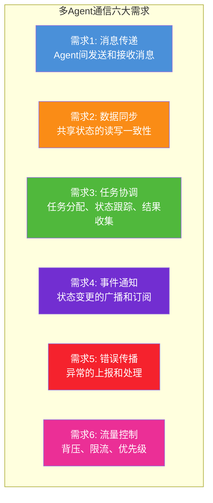
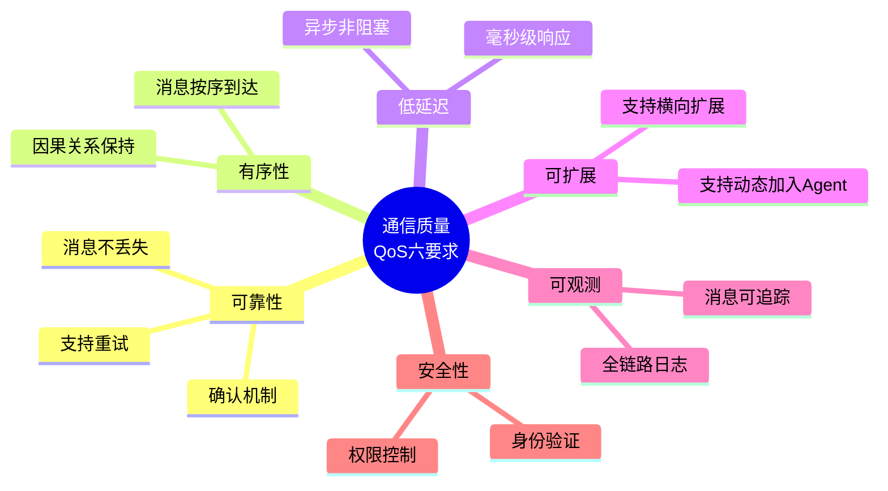
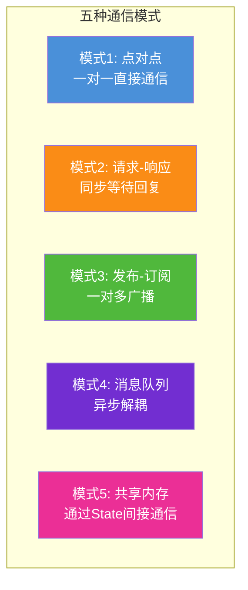
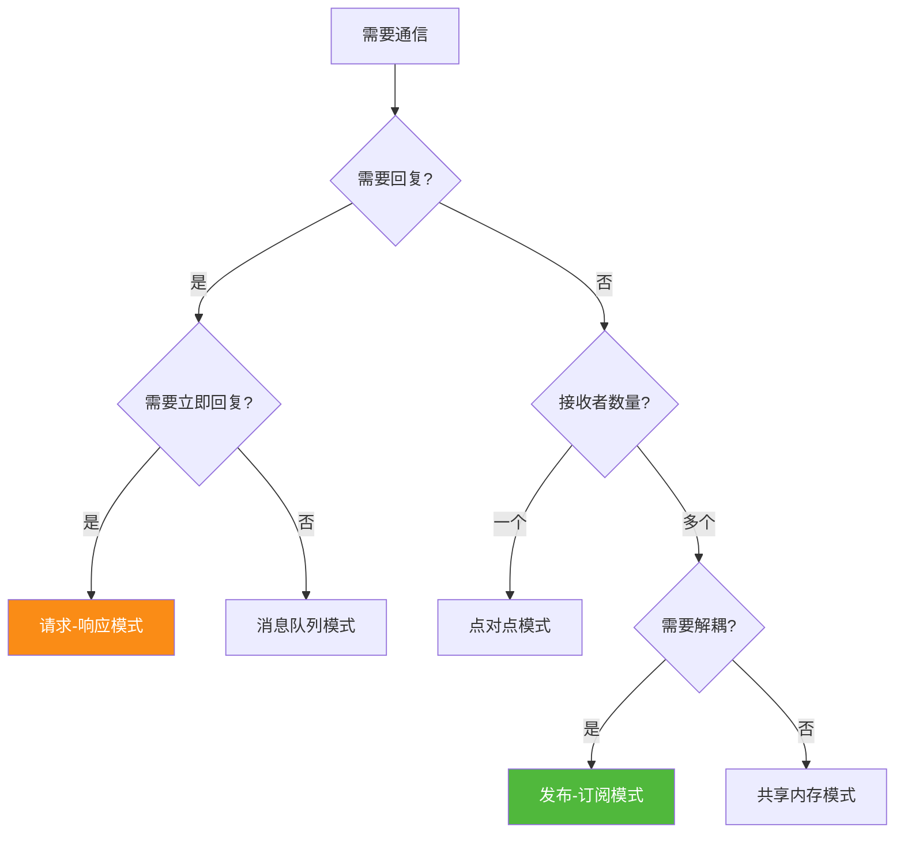
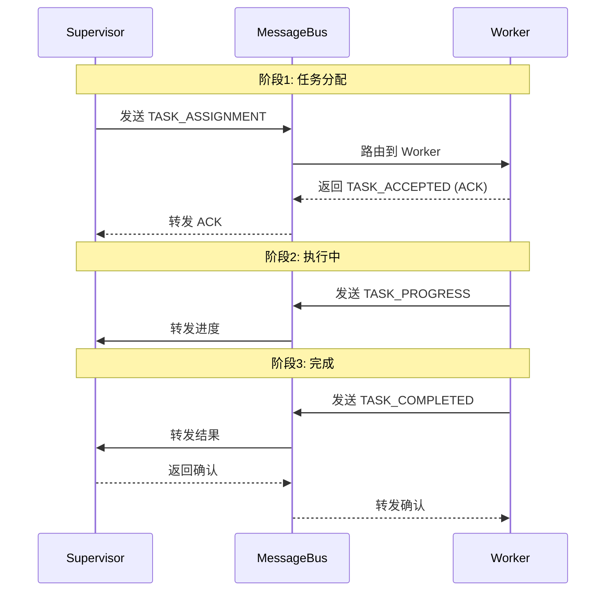
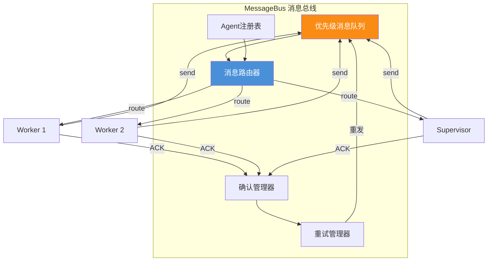
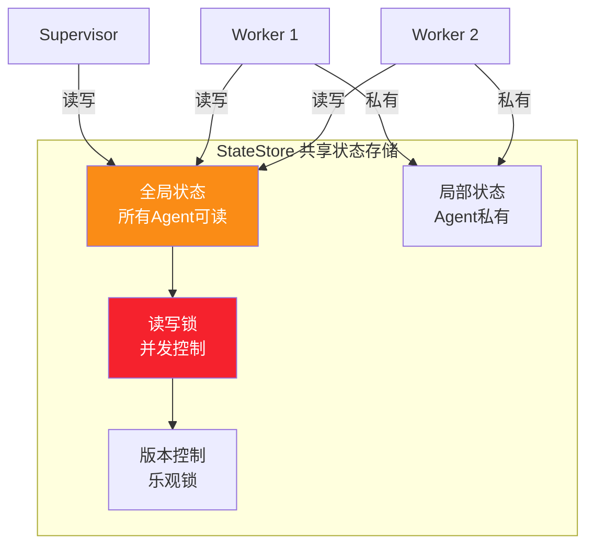
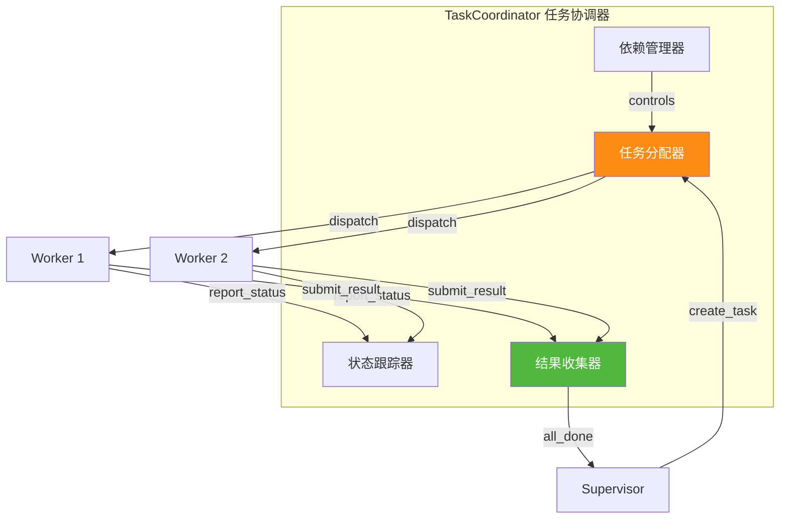
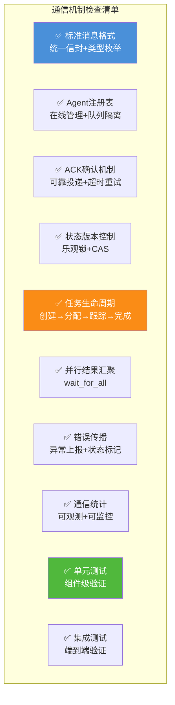
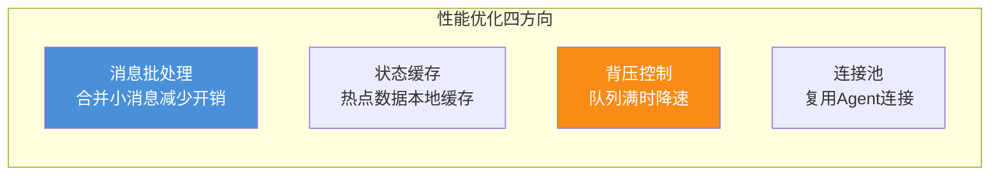

# 多 Agent 系统通信机制设计与实现深度解析

> **文档定位**:本文档是 `8多 Agent 系统` 系列的通信机制专题篇,深入解析 **多 Agent 系统中 Agent 间如何高效、可靠地传递信息**。在 [108号文档](./108Multi-Agent多智能体系统核心概念详解.md) 阐述 MAS 基础、[109号文档](./109Multi-Agent系统架构设计模式深度解析.md) 总览架构模式、[110号文档](./110SupervisorAgent核心概念与架构设计深度解析.md) 解析 Supervisor、[111号文档](./111多Agent系统角色分工与任务分配策略深度解析.md) 定义角色分工的基础上,本文回答工程实现的底层问题:**"Agent 之间到底怎么通信?消息怎么传?状态怎么同步?任务怎么协调?"**
>
> **核心交付物**:本文提供一套**完整的 Python 通信框架实现**,包含消息传递(MessageBus)、数据同步(StateStore)、任务协调(TaskCoordinator)三大核心组件,以及配套的**单元测试和集成测试**,确保通信机制的正确性与稳定性。

---

## 目录

- [一、通信需求分析](#一通信需求分析)
- [二、通信模式分类](#二通信模式分类)
- [三、通信协议设计](#三通信协议设计)
- [四、消息传递机制实现](#四消息传递机制实现)
- [五、数据同步机制](#五数据同步机制)
- [六、任务协调通信](#六任务协调通信)
- [七、接口定义与 API 设计](#七接口定义与-api-设计)
- [八、完整实现代码](#八完整实现代码)
- [九、单元测试](#九单元测试)
- [十、集成测试](#十集成测试)
- [十一、最佳实践与总结](#十一最佳实践与总结)

---

## 一、通信需求分析

### 1.1 多 Agent 通信的六类需求



### 1.2 通信场景矩阵

| 通信场景 | 发起者 | 接收者 | 模式 | 示例 |
|---------|--------|--------|------|------|
| Supervisor 分配任务 | Supervisor | Worker | 点对点 | "Researcher,搜索AI芯片数据" |
| Worker 返回结果 | Worker | Supervisor | 点对点 | "搜索完成,结果如下..." |
| Worker 请求帮助 | Worker | Supervisor | 点对点 | "需要更多数据,请补充" |
| 状态变更通知 | 任意 Agent | 所有相关 Agent | 广播 | "研究阶段已完成" |
| 并行结果收集 | 多个 Worker | Supervisor | 汇聚 | 3个Researcher同时返回 |
| 错误传播 | 出错 Agent | Supervisor | 点对点 | "搜索API超时" |
| 任务取消 | Supervisor | 所有 Worker | 广播 | "取消所有进行中任务" |

### 1.3 通信质量要求(QoS)



---

## 二、通信模式分类

### 2.1 五种通信模式



### 2.2 模式对比

| 模式 | 耦合度 | 延迟 | 可靠性 | 适用场景 |
|------|--------|------|--------|---------|
| **点对点** | 高 | 低 | 中 | 直接任务分配 |
| **请求-响应** | 高 | 中(等待) | 高 | 需要确认结果 |
| **发布-订阅** | 低 | 低 | 中 | 状态变更通知 |
| **消息队列** | 低 | 中(排队) | 高 | 异步任务分发 |
| **共享内存** | 中 | 低(读State) | 高 | 间接数据传递 |

### 2.3 模式选择决策



---

## 三、通信协议设计

### 3.1 消息信封结构

所有通信消息都遵循统一信封格式:

```json
{
  "message_id": "msg-uuid-001",
  "correlation_id": "req-session-123",
  "trace_id": "trace-abc-456",
  
  "from": {
    "agent_id": "supervisor",
    "agent_type": "coordinator"
  },
  "to": {
    "agent_id": "researcher_1",
    "agent_type": "worker"
  },
  
  "message_type": "TASK_ASSIGNMENT",
  "priority": "HIGH",
  "ttl": 30000,
  
  "payload": {
    "task_id": "task-001",
    "action": "search",
    "parameters": { "query": "AI芯片市场" }
  },
  
  "metadata": {
    "timestamp": "2026-08-07T10:00:00Z",
    "version": "1.0",
    "retry_count": 0,
    "ack_required": true
  }
}
```

### 3.2 消息字段规范

| 字段 | 类型 | 必填 | 说明 |
|------|------|------|------|
| `message_id` | string | ✅ | 消息唯一ID(UUID) |
| `correlation_id` | string | ✅ | 请求链路ID(关联同一会话) |
| `trace_id` | string | ✅ | 全链路追踪ID |
| `from.agent_id` | string | ✅ | 发送者ID |
| `to.agent_id` | string | ✅ | 接收者ID |
| `message_type` | enum | ✅ | 消息类型(见3.3) |
| `priority` | enum | ✅ | 优先级(LOW/NORMAL/HIGH/URGENT) |
| `ttl` | int | ✅ | 消息存活时间(ms) |
| `payload` | object | ✅ | 消息内容 |
| `metadata.ack_required` | bool | ✅ | 是否需要确认 |
| `metadata.retry_count` | int | ✅ | 重试次数 |

### 3.3 消息类型枚举

```python
from enum import Enum

class MessageType(Enum):
    """消息类型枚举"""
    # 任务相关
    TASK_ASSIGNMENT = "task_assignment"      # 任务分配
    TASK_ACCEPTED = "task_accepted"          # 任务已接受
    TASK_PROGRESS = "task_progress"          # 任务进度
    TASK_COMPLETED = "task_completed"        # 任务完成
    TASK_FAILED = "task_failed"              # 任务失败
    TASK_CANCELLED = "task_cancelled"        # 任务取消
    
    # 数据相关
    DATA_REQUEST = "data_request"            # 数据请求
    DATA_RESPONSE = "data_response"          # 数据响应
    STATE_UPDATE = "state_update"            # 状态更新
    
    # 协调相关
    HANDOFF = "handoff"                      # 任务移交
    SYNC_REQUEST = "sync_request"            # 同步请求
    SYNC_RESPONSE = "sync_response"          # 同步响应
    
    # 系统相关
    HEARTBEAT = "heartbeat"                  # 心跳
    ERROR = "error"                          # 错误上报
    SHUTDOWN = "shutdown"                    # 关闭通知


class MessagePriority(Enum):
    """消息优先级"""
    LOW = 0
    NORMAL = 1
    HIGH = 2
    URGENT = 3
```

### 3.4 通信握手协议



---

## 四、消息传递机制实现

### 4.1 MessageBus 架构



### 4.2 消息总线核心实现

```python
"""
多 Agent 系统消息总线实现
支持: 点对点、发布订阅、请求-响应、优先级队列、ACK确认、重试
"""
import asyncio
import json
import uuid
import time
import logging
from enum import Enum
from typing import Dict, List, Optional, Callable, Any
from dataclasses import dataclass, field, asdict
from collections import defaultdict
from datetime import datetime, timezone

logger = logging.getLogger("mas.communication")


# ========== 消息定义 ==========
class MessageType(Enum):
    TASK_ASSIGNMENT = "task_assignment"
    TASK_ACCEPTED = "task_accepted"
    TASK_PROGRESS = "task_progress"
    TASK_COMPLETED = "task_completed"
    TASK_FAILED = "task_failed"
    TASK_CANCELLED = "task_cancelled"
    DATA_REQUEST = "data_request"
    DATA_RESPONSE = "data_response"
    STATE_UPDATE = "state_update"
    HANDOFF = "handoff"
    HEARTBEAT = "heartbeat"
    ERROR = "error"
    SHUTDOWN = "shutdown"


class MessagePriority(Enum):
    LOW = 0
    NORMAL = 1
    HIGH = 2
    URGENT = 3


@dataclass
class Message:
    """标准化消息结构"""
    message_id: str = field(default_factory=lambda: str(uuid.uuid4()))
    correlation_id: str = ""
    trace_id: str = ""
    from_agent: str = ""
    to_agent: str = ""
    message_type: MessageType = MessageType.DATA_REQUEST
    priority: MessagePriority = MessagePriority.NORMAL
    ttl: int = 30000  # 毫秒
    payload: dict = field(default_factory=dict)
    timestamp: str = field(default_factory=lambda: datetime.now(timezone.utc).isoformat())
    retry_count: int = 0
    ack_required: bool = True
    
    def to_dict(self) -> dict:
        d = asdict(self)
        d["message_type"] = self.message_type.value
        d["priority"] = self.priority.value
        return d
    
    def to_json(self) -> str:
        return json.dumps(self.to_dict(), ensure_ascii=False)
    
    @classmethod
    def from_dict(cls, d: dict) -> "Message":
        d["message_type"] = MessageType(d["message_type"])
        d["priority"] = MessagePriority(d["priority"])
        return cls(**d)


# ========== Agent 注册表 ==========
class AgentRegistry:
    """Agent 注册表:管理在线Agent及其消息队列"""
    
    def __init__(self):
        self._agents: Dict[str, asyncio.Queue] = {}
        self._agent_info: Dict[str, dict] = {}
        self._subscriptions: Dict[str, List[str]] = defaultdict(list)  # topic -> [agent_ids]
    
    def register(self, agent_id: str, agent_info: dict = None) -> asyncio.Queue:
        """注册Agent,返回其专属消息队列"""
        if agent_id not in self._agents:
            self._agents[agent_id] = asyncio.Queue()
            self._agent_info[agent_id] = agent_info or {}
            logger.info(f"Agent注册: {agent_id}")
        return self._agents[agent_id]
    
    def unregister(self, agent_id: str):
        """注销Agent"""
        self._agents.pop(agent_id, None)
        self._agent_info.pop(agent_id, None)
        # 清理订阅
        for topic, subscribers in self._subscriptions.items():
            if agent_id in subscribers:
                subscribers.remove(agent_id)
        logger.info(f"Agent注销: {agent_id}")
    
    def get_queue(self, agent_id: str) -> Optional[asyncio.Queue]:
        """获取Agent的消息队列"""
        return self._agents.get(agent_id)
    
    def is_online(self, agent_id: str) -> bool:
        """检查Agent是否在线"""
        return agent_id in self._agents
    
    def get_online_agents(self) -> List[str]:
        """获取所有在线Agent"""
        return list(self._agents.keys())
    
    def subscribe(self, agent_id: str, topic: str):
        """订阅主题"""
        if agent_id not in self._subscriptions[topic]:
            self._subscriptions[topic].append(agent_id)
            logger.info(f"Agent {agent_id} 订阅主题: {topic}")
    
    def get_subscribers(self, topic: str) -> List[str]:
        """获取主题的所有订阅者"""
        return self._subscriptions.get(topic, [])
    
    def unsubscribe(self, agent_id: str, topic: str):
        """取消订阅"""
        if agent_id in self._subscriptions[topic]:
            self._subscriptions[topic].remove(agent_id)


# ========== ACK 管理器 ==========
class AckManager:
    """确认管理器:跟踪需要ACK的消息"""
    
    def __init__(self, timeout: float = 5.0, max_retries: int = 3):
        self.timeout = timeout
        self.max_retries = max_retries
        self._pending: Dict[str, asyncio.Future] = {}  # message_id -> Future
        self._retry_counts: Dict[str, int] = {}
    
    async def wait_for_ack(self, message_id: str) -> bool:
        """等待消息确认"""
        loop = asyncio.get_event_loop()
        future = loop.create_future()
        self._pending[message_id] = future
        
        try:
            ack_received = await asyncio.wait_for(future, timeout=self.timeout)
            return ack_received
        except asyncio.TimeoutError:
            logger.warning(f"ACK超时: message_id={message_id}")
            return False
        finally:
            self._pending.pop(message_id, None)
    
    def receive_ack(self, message_id: str):
        """收到ACK"""
        future = self._pending.get(message_id)
        if future and not future.done():
            future.set_result(True)
            logger.debug(f"ACK收到: {message_id}")
    
    def should_retry(self, message_id: str) -> bool:
        """判断是否应该重试"""
        count = self._retry_counts.get(message_id, 0)
        return count < self.max_retries
    
    def increment_retry(self, message_id: str) -> int:
        """增加重试计数"""
        self._retry_counts[message_id] = self._retry_counts.get(message_id, 0) + 1
        return self._retry_counts[message_id]


# ========== 消息总线 ==========
class MessageBus:
    """
    消息总线:多Agent通信的核心枢纽
    
    支持:
    - 点对点消息(send)
    - 发布-订阅(publish/subscribe)
    - 请求-响应(request/respond)
    - 优先级队列
    - ACK确认
    - 自动重试
    """
    
    def __init__(self):
        self.registry = AgentRegistry()
        self.ack_manager = AckManager(timeout=5.0, max_retries=3)
        self._message_log: List[dict] = []  # 消息日志(用于调试)
        self._stats = {
            "total_sent": 0,
            "total_delivered": 0,
            "total_failed": 0,
            "total_retried": 0
        }
    
    async def send(self, message: Message) -> bool:
        """
        点对点发送消息
        
        Returns: True=投递成功, False=投递失败
        """
        self._log_message(message, "SEND")
        self._stats["total_sent"] += 1
        
        # 检查接收者是否在线
        if not self.registry.is_online(message.to_agent):
            logger.error(f"接收者不在线: {message.to_agent}")
            self._stats["total_failed"] += 1
            return False
        
        # 检查TTL
        if message.ttl <= 0:
            logger.warning(f"消息TTL过期: {message.message_id}")
            self._stats["total_failed"] += 1
            return False
        
        # 投递到接收者队列
        queue = self.registry.get_queue(message.to_agent)
        await queue.put(message)
        self._stats["total_delivered"] += 1
        logger.debug(f"消息投递: {message.from_agent} -> {message.to_agent} [{message.message_type.value}]")
        
        # 等待ACK
        if message.ack_required:
            ack_received = await self.ack_manager.wait_for_ack(message.message_id)
            if not ack_received:
                # 重试
                while self.ack_manager.should_retry(message.message_id):
                    retry_count = self.ack_manager.increment_retry(message.message_id)
                    message.retry_count = retry_count
                    logger.info(f"重试 #{retry_count}: {message.message_id}")
                    self._stats["total_retried"] += 1
                    await queue.put(message)
                    ack_received = await self.ack_manager.wait_for_ack(message.message_id)
                    if ack_received:
                        break
                
                if not ack_received:
                    self._stats["total_failed"] += 1
                    return False
        
        return True
    
    async def send_ack(self, message_id: str, from_agent: str):
        """发送ACK确认"""
        self.ack_manager.receive_ack(message_id)
        logger.debug(f"ACK发送: agent={from_agent}, msg={message_id}")
    
    async def publish(self, topic: str, message: Message):
        """发布-订阅模式:广播到所有订阅者"""
        self._log_message(message, f"PUBLISH:{topic}")
        subscribers = self.registry.get_subscribers(topic)
        
        for subscriber_id in subscribers:
            msg_copy = Message(
                message_id=str(uuid.uuid4()),
                correlation_id=message.correlation_id,
                trace_id=message.trace_id,
                from_agent=message.from_agent,
                to_agent=subscriber_id,
                message_type=message.message_type,
                priority=message.priority,
                payload=message.payload
            )
            queue = self.registry.get_queue(subscriber_id)
            if queue:
                await queue.put(msg_copy)
                self._stats["total_delivered"] += 1
        
        self._stats["total_sent"] += len(subscribers)
        logger.info(f"广播: topic={topic}, 订阅者={len(subscribers)}")
    
    async def request(self, message: Message, timeout: float = 30.0) -> Optional[Message]:
        """
        请求-响应模式:发送请求并等待响应
        
        Returns: 响应消息,超时返回None
        """
        # 注册响应Future
        loop = asyncio.get_event_loop()
        response_future = loop.create_future()
        self._pending_responses[message.message_id] = response_future
        
        # 发送请求
        await self.send(message)
        
        # 等待响应
        try:
            response = await asyncio.wait_for(response_future, timeout=timeout)
            return response
        except asyncio.TimeoutError:
            logger.error(f"请求超时: {message.message_id}")
            return None
        finally:
            self._pending_responses.pop(message.message_id, None)
    
    async def respond(self, original_message_id: str, response: Message):
        """响应请求"""
        future = self._pending_responses.get(original_message_id)
        if future and not future.done():
            future.set_result(response)
    
    def _log_message(self, message: Message, action: str):
        """记录消息日志"""
        log_entry = {
            "timestamp": datetime.now(timezone.utc).isoformat(),
            "action": action,
            "message_id": message.message_id,
            "from": message.from_agent,
            "to": message.to_agent,
            "type": message.message_type.value,
            "priority": message.priority.name
        }
        self._message_log.append(log_entry)
    
    def get_stats(self) -> dict:
        """获取通信统计"""
        return {
            **self._stats,
            "online_agents": len(self.registry.get_online_agents()),
            "success_rate": (
                self._stats["total_delivered"] / max(self._stats["total_sent"], 1)
            )
        }


# 初始化_pending_responses
MessageBus._pending_responses = {}  # 类级别属性,实际应在__init__中初始化
```

---

## 五、数据同步机制

### 5.1 StateStore 架构



### 5.2 StateStore 实现

```python
class StateStore:
    """
    共享状态存储:多Agent间的数据同步
    
    特性:
    - 读写锁(乐观并发控制)
    - 版本号(冲突检测)
    - 变更通知(订阅机制)
    - 操作日志(可追溯)
    """
    
    def __init__(self):
        self._global_state: dict = {}
        self._local_states: Dict[str, dict] = {}  # agent_id -> state
        self._versions: Dict[str, int] = defaultdict(int)  # key -> version
        self._locks: Dict[str, asyncio.Lock] = defaultdict(asyncio.Lock)
        self._watchers: Dict[str, List[Callable]] = defaultdict(list)  # key -> callbacks
        self._op_log: List[dict] = []
    
    async def get(self, key: str, default: Any = None) -> Any:
        """读取全局状态"""
        async with self._locks[key]:
            return self._global_state.get(key, default)
    
    async def set(self, key: str, value: Any, agent_id: str = None) -> int:
        """
        写入全局状态
        
        Returns: 新版本号
        """
        async with self._locks[key]:
            old_value = self._global_state.get(key)
            self._global_state[key] = value
            self._versions[key] += 1
            version = self._versions[key]
            
            # 记录操作日志
            self._op_log.append({
                "timestamp": datetime.now(timezone.utc).isoformat(),
                "agent_id": agent_id,
                "operation": "SET",
                "key": key,
                "old_value": old_value,
                "new_value": value,
                "version": version
            })
            
            # 触发监听器
            for callback in self._watchers[key]:
                asyncio.create_task(callback(key, old_value, value, version))
            
            logger.debug(f"状态更新: {key} v{version} by {agent_id}")
            return version
    
    async def compare_and_set(self, key: str, expected_version: int, 
                                value: Any, agent_id: str = None) -> tuple:
        """
        乐观锁:CAS操作
        
        Returns: (success: bool, new_version: int)
        """
        async with self._locks[key]:
            current_version = self._versions[key]
            if current_version != expected_version:
                logger.warning(f"CAS失败: {key} 期望v{expected_version}, 实际v{current_version}")
                return (False, current_version)
            
            return await self.set(key, value, agent_id), self._versions[key] if False else (True, self._versions[key])
    
    async def get_version(self, key: str) -> int:
        """获取当前版本号"""
        return self._versions[key]
    
    async def update(self, key: str, update_fn: Callable, agent_id: str = None) -> int:
        """
        原子更新:读取-修改-写入
        
        适用于需要对现有值做增量修改的场景
        """
        async with self._locks[key]:
            old_value = self._global_state.get(key)
            new_value = update_fn(old_value)
            self._global_state[key] = new_value
            self._versions[key] += 1
            version = self._versions[key]
            
            self._op_log.append({
                "timestamp": datetime.now(timezone.utc).isoformat(),
                "agent_id": agent_id,
                "operation": "UPDATE",
                "key": key,
                "old_value": old_value,
                "new_value": new_value,
                "version": version
            })
            
            return version
    
    def watch(self, key: str, callback: Callable):
        """订阅状态变更"""
        self._watchers[key].append(callback)
        logger.info(f"监听注册: {key}")
    
    async def get_local(self, agent_id: str, key: str, default: Any = None) -> Any:
        """读取Agent局部状态"""
        return self._local_states.get(agent_id, {}).get(key, default)
    
    async def set_local(self, agent_id: str, key: str, value: Any):
        """写入Agent局部状态"""
        if agent_id not in self._local_states:
            self._local_states[agent_id] = {}
        self._local_states[agent_id][key] = value
    
    def get_op_log(self, key: str = None) -> List[dict]:
        """获取操作日志"""
        if key:
            return [log for log in self._op_log if log["key"] == key]
        return self._op_log.copy()
    
    async def snapshot(self) -> dict:
        """获取全局状态快照"""
        return {
            "state": self._global_state.copy(),
            "versions": dict(self._versions),
            "timestamp": datetime.now(timezone.utc).isoformat()
        }
```

---

## 六、任务协调通信

### 6.1 TaskCoordinator 架构



### 6.2 TaskCoordinator 实现

```python
class TaskStatus(Enum):
    PENDING = "pending"
    ASSIGNED = "assigned"
    RUNNING = "running"
    COMPLETED = "completed"
    FAILED = "failed"
    CANCELLED = "cancelled"


@dataclass
class Task:
    """任务定义"""
    task_id: str = field(default_factory=lambda: str(uuid.uuid4()))
    title: str = ""
    assigned_to: str = ""
    status: TaskStatus = TaskStatus.PENDING
    parameters: dict = field(default_factory=dict)
    result: Any = None
    error: str = ""
    created_at: str = field(default_factory=lambda: datetime.now(timezone.utc).isoformat())
    completed_at: str = ""
    depends_on: List[str] = field(default_factory=list)  # 依赖的任务ID
    priority: MessagePriority = MessagePriority.NORMAL


class TaskCoordinator:
    """
    任务协调器:管理任务的完整生命周期
    
    功能:
    - 任务创建与分配
    - 状态跟踪
    - 结果收集(支持并行汇聚)
    - 依赖管理
    - 超时处理
    """
    
    def __init__(self, message_bus: MessageBus):
        self.bus = message_bus
        self._tasks: Dict[str, Task] = {}
        self._pending_results: Dict[str, asyncio.Future] = {}  # task_id -> Future
        self._barriers: Dict[str, asyncio.Event] = {}  # barrier_id -> Event
    
    async def create_task(self, title: str, assigned_to: str, 
                          parameters: dict = None,
                          depends_on: List[str] = None,
                          priority: MessagePriority = MessagePriority.NORMAL) -> Task:
        """创建并分配任务"""
        task = Task(
            title=title,
            assigned_to=assigned_to,
            parameters=parameters or {},
            depends_on=depends_on or [],
            priority=priority
        )
        self._tasks[task.task_id] = task
        
        # 注册结果Future
        loop = asyncio.get_event_loop()
        self._pending_results[task.task_id] = loop.create_future()
        
        # 检查依赖
        if depends_on:
            asyncio.create_task(self._wait_for_deps_and_dispatch(task))
        else:
            await self._dispatch(task)
        
        logger.info(f"任务创建: {task.task_id} -> {assigned_to}")
        return task
    
    async def _dispatch(self, task: Task):
        """分发任务到Worker"""
        task.status = TaskStatus.ASSIGNED
        
        msg = Message(
            from_agent="coordinator",
            to_agent=task.assigned_to,
            message_type=MessageType.TASK_ASSIGNMENT,
            priority=task.priority,
            payload={
                "task_id": task.task_id,
                "title": task.title,
                "parameters": task.parameters
            }
        )
        
        await self.bus.send(msg)
    
    async def _wait_for_deps_and_dispatch(self, task: Task):
        """等待依赖完成后分发"""
        for dep_id in task.depends_on:
            if dep_id in self._pending_results:
                await self._pending_results[dep_id]
        
        await self._dispatch(task)
    
    async def report_status(self, task_id: str, status: TaskStatus, agent_id: str):
        """Worker报告任务状态"""
        if task_id not in self._tasks:
            logger.error(f"未知任务: {task_id}")
            return
        
        task = self._tasks[task_id]
        task.status = status
        
        # 通知Supervisor
        msg = Message(
            from_agent=agent_id,
            to_agent="supervisor",
            message_type=MessageType.TASK_PROGRESS,
            ack_required=False,
            payload={"task_id": task_id, "status": status.value}
        )
        await self.bus.send(msg)
        logger.debug(f"任务状态: {task_id} -> {status.value}")
    
    async def submit_result(self, task_id: str, result: Any, agent_id: str):
        """Worker提交任务结果"""
        if task_id not in self._tasks:
            logger.error(f"未知任务: {task_id}")
            return
        
        task = self._tasks[task_id]
        task.status = TaskStatus.COMPLETED
        task.result = result
        task.completed_at = datetime.now(timezone.utc).isoformat()
        
        # 触发结果Future
        future = self._pending_results.get(task_id)
        if future and not future.done():
            future.set_result(result)
        
        # 通知Supervisor
        msg = Message(
            from_agent=agent_id,
            to_agent="supervisor",
            message_type=MessageType.TASK_COMPLETED,
            payload={"task_id": task_id, "result": result}
        )
        await self.bus.send(msg)
        logger.info(f"任务完成: {task_id}")
    
    async def report_failure(self, task_id: str, error: str, agent_id: str):
        """Worker报告任务失败"""
        task = self._tasks[task_id]
        task.status = TaskStatus.FAILED
        task.error = error
        
        future = self._pending_results.get(task_id)
        if future and not future.done():
            future.set_exception(Exception(error))
        
        msg = Message(
            from_agent=agent_id,
            to_agent="supervisor",
            message_type=MessageType.TASK_FAILED,
            payload={"task_id": task_id, "error": error}
        )
        await self.bus.send(msg)
        logger.error(f"任务失败: {task_id}: {error}")
    
    async def wait_for_result(self, task_id: str, timeout: float = 60.0) -> Any:
        """等待任务结果"""
        future = self._pending_results.get(task_id)
        if not future:
            raise ValueError(f"未知任务: {task_id}")
        
        return await asyncio.wait_for(future, timeout=timeout)
    
    async def wait_for_all(self, task_ids: List[str], timeout: float = 120.0) -> dict:
        """等待多个任务全部完成(并行汇聚)"""
        results = {}
        for task_id in task_ids:
            try:
                results[task_id] = await self.wait_for_result(task_id, timeout)
            except Exception as e:
                results[task_id] = {"error": str(e)}
        return results
    
    async def cancel_task(self, task_id: str):
        """取消任务"""
        if task_id not in self._tasks:
            return
        
        task = self._tasks[task_id]
        task.status = TaskStatus.CANCELLED
        
        # 通知Worker取消
        msg = Message(
            from_agent="coordinator",
            to_agent=task.assigned_to,
            message_type=MessageType.TASK_CANCELLED,
            payload={"task_id": task_id}
        )
        await self.bus.send(msg)
        
        # 取消Future
        future = self._pending_results.get(task_id)
        if future and not future.done():
            future.cancel()
        
        logger.info(f"任务取消: {task_id}")
    
    def get_task_status(self, task_id: str) -> Optional[TaskStatus]:
        """获取任务状态"""
        task = self._tasks.get(task_id)
        return task.status if task else None
    
    def get_all_tasks(self) -> List[Task]:
        """获取所有任务"""
        return list(self._tasks.values())
```

---

## 七、接口定义与 API 设计

### 7.1 Agent 通信接口

```python
from abc import ABC, abstractmethod

class CommunicableAgent(ABC):
    """可通信Agent的标准接口"""
    
    def __init__(self, agent_id: str, bus: MessageBus, 
                 state_store: StateStore, coordinator: TaskCoordinator):
        self.agent_id = agent_id
        self.bus = bus
        self.state = state_store
        self.coordinator = coordinator
        self._message_queue = None
        self._running = False
    
    async def start(self):
        """启动Agent:注册到总线,开始监听消息"""
        self._message_queue = self.bus.registry.register(
            self.agent_id, 
            {"type": self.__class__.__name__}
        )
        self._running = True
        logger.info(f"Agent启动: {self.agent_id}")
        asyncio.create_task(self._message_loop())
    
    async def stop(self):
        """停止Agent"""
        self._running = False
        self.bus.registry.unregister(self.agent_id)
        logger.info(f"Agent停止: {self.agent_id}")
    
    async def _message_loop(self):
        """消息接收循环"""
        while self._running:
            try:
                message = await asyncio.wait_for(
                    self._message_queue.get(), timeout=1.0
                )
                # 发送ACK
                if message.ack_required:
                    await self.bus.send_ack(message.message_id, self.agent_id)
                
                # 处理消息
                await self.handle_message(message)
            except asyncio.TimeoutError:
                continue
            except Exception as e:
                logger.error(f"消息处理异常: {e}", exc_info=True)
    
    async def send_message(self, to_agent: str, msg_type: MessageType, 
                           payload: dict, priority: MessagePriority = MessagePriority.NORMAL) -> bool:
        """发送消息"""
        msg = Message(
            from_agent=self.agent_id,
            to_agent=to_agent,
            message_type=msg_type,
            priority=priority,
            payload=payload
        )
        return await self.bus.send(msg)
    
    async def request(self, to_agent: str, msg_type: MessageType, 
                      payload: dict, timeout: float = 30.0) -> Optional[Message]:
        """请求-响应"""
        msg = Message(
            from_agent=self.agent_id,
            to_agent=to_agent,
            message_type=msg_type,
            payload=payload,
            ack_required=False
        )
        return await self.bus.request(msg, timeout=timeout)
    
    async def publish(self, topic: str, payload: dict):
        """发布广播"""
        msg = Message(
            from_agent=self.agent_id,
            to_agent="*",
            message_type=MessageType.STATE_UPDATE,
            ack_required=False,
            payload=payload
        )
        await self.bus.publish(topic, msg)
    
    def subscribe(self, topic: str):
        """订阅主题"""
        self.bus.registry.subscribe(self.agent_id, topic)
    
    @abstractmethod
    async def handle_message(self, message: Message):
        """处理接收到的消息(子类实现)"""
        pass
```

---

## 八、完整实现代码

### 8.1 完整通信框架

```python
"""
完整的多Agent系统通信框架
整合 MessageBus + StateStore + TaskCoordinator
"""
import asyncio
import json
import uuid
import logging
from typing import Dict, List, Optional
from dataclasses import dataclass, field
from collections import defaultdict
from datetime import datetime, timezone

# 配置日志
logging.basicConfig(
    level=logging.INFO,
    format='%(asctime)s [%(name)s] %(levelname)s: %(message)s'
)
logger = logging.getLogger("mas")


# ========== 完整实现整合 ==========

class MultiAgentCommunicationSystem:
    """
    多Agent通信系统:整合消息总线、状态存储、任务协调
    
    使用方式:
        system = MultiAgentCommunicationSystem()
        await system.start()
        
        supervisor = SupervisorAgent("supervisor", system)
        researcher = WorkerAgent("researcher", system)
        
        await supervisor.start()
        await researcher.start()
        
        await supervisor.assign_task("researcher", "搜索AI芯片数据")
    """
    
    def __init__(self):
        self.bus = MessageBus()
        self.state = StateStore()
        self.coordinator = TaskCoordinator(self.bus)
        self._agents: Dict[str, CommunicableAgent] = {}
    
    async def start(self):
        """启动通信系统"""
        # 初始化bus的_pending_responses
        self.bus._pending_responses = {}
        logger.info("通信系统启动")
    
    async def register_agent(self, agent: "CommunicableAgent"):
        """注册Agent"""
        self._agents[agent.agent_id] = agent
        await agent.start()
    
    async def shutdown(self):
        """关闭系统"""
        for agent in self._agents.values():
            await agent.stop()
        logger.info("通信系统关闭")
    
    def get_stats(self) -> dict:
        """获取系统统计"""
        return {
            "communication": self.bus.get_stats(),
            "state_operations": len(self.state.get_op_log()),
            "tasks": len(self.coordinator.get_all_tasks()),
            "agents": list(self._agents.keys())
        }


# ========== Supervisor Agent 实现 ==========
class SupervisorAgent(CommunicableAgent):
    """Supervisor:协调者"""
    
    async def handle_message(self, message: Message):
        if message.message_type == MessageType.TASK_COMPLETED:
            logger.info(f"[Supervisor] 收到结果: {message.payload['task_id']}")
            await self.state.set(
                f"result:{message.payload['task_id']}",
                message.payload["result"],
                self.agent_id
            )
        elif message.message_type == MessageType.TASK_FAILED:
            logger.error(f"[Supervisor] 任务失败: {message.payload['error']}")
        elif message.message_type == MessageType.TASK_PROGRESS:
            logger.debug(f"[Supervisor] 进度: {message.payload}")
    
    async def assign_task(self, worker_id: str, title: str, 
                          params: dict = None) -> str:
        """分配任务给Worker"""
        task = await self.coordinator.create_task(
            title=title,
            assigned_to=worker_id,
            parameters=params or {}
        )
        return task.task_id
    
    async def wait_result(self, task_id: str, timeout: float = 60.0) -> Any:
        """等待任务结果"""
        return await self.coordinator.wait_for_result(task_id, timeout)


# ========== Worker Agent 实现 ==========
class WorkerAgent(CommunicableAgent):
    """Worker:执行者"""
    
    async def handle_message(self, message: Message):
        if message.message_type == MessageType.TASK_ASSIGNMENT:
            task_id = message.payload["task_id"]
            title = message.payload["title"]
            params = message.payload["parameters"]
            
            logger.info(f"[{self.agent_id}] 收到任务: {title}")
            
            # 报告开始执行
            await self.coordinator.report_status(
                task_id, TaskStatus.RUNNING, self.agent_id
            )
            
            try:
                # 执行任务
                result = await self.execute_task(title, params)
                
                # 提交结果
                await self.coordinator.submit_result(
                    task_id, result, self.agent_id
                )
            except Exception as e:
                await self.coordinator.report_failure(
                    task_id, str(e), self.agent_id
                )
    
    async def execute_task(self, title: str, params: dict) -> Any:
        """执行具体任务(子类重写)"""
        await asyncio.sleep(0.5)  # 模拟执行
        return {"title": title, "result": f"已完成: {title}", "params": params}
```

---

## 九、单元测试

### 9.1 消息总线单元测试

```python
"""
单元测试:验证各组件的正确性
运行: pytest test_communication.py -v
"""
import pytest
import asyncio


# ========== MessageBus 单元测试 ==========

class TestMessageBus:
    """消息总线测试"""
    
    @pytest.fixture
    async def bus(self):
        bus = MessageBus()
        bus._pending_responses = {}
        return bus
    
    @pytest.mark.asyncio
    async def test_register_and_unregister(self, bus):
        """测试Agent注册和注销"""
        bus.registry.register("agent_a")
        assert bus.registry.is_online("agent_a")
        
        bus.registry.unregister("agent_a")
        assert not bus.registry.is_online("agent_a")
    
    @pytest.mark.asyncio
    async def test_point_to_point_message(self, bus):
        """测试点对点消息"""
        bus.registry.register("sender")
        bus.registry.register("receiver")
        
        msg = Message(
            from_agent="sender",
            to_agent="receiver",
            message_type=MessageType.DATA_REQUEST,
            ack_required=False,  # 测试中关闭ACK加速
            payload={"data": "hello"}
        )
        
        success = await bus.send(msg)
        assert success is True
        
        # 验证接收
        queue = bus.registry.get_queue("receiver")
        received = await asyncio.wait_for(queue.get(), timeout=1.0)
        assert received.payload["data"] == "hello"
    
    @pytest.mark.asyncio
    async def test_message_to_offline_agent(self, bus):
        """测试发送给不在线的Agent"""
        bus.registry.register("sender")
        # 不注册receiver
        
        msg = Message(
            from_agent="sender",
            to_agent="nonexistent",
            message_type=MessageType.DATA_REQUEST,
            ack_required=False,
            payload={}
        )
        
        success = await bus.send(msg)
        assert success is False
        assert bus.get_stats()["total_failed"] == 1
    
    @pytest.mark.asyncio
    async def test_publish_subscribe(self, bus):
        """测试发布-订阅"""
        bus.registry.register("pub")
        bus.registry.register("sub1")
        bus.registry.register("sub2")
        
        # 订阅
        bus.registry.subscribe("sub1", "topic_x")
        bus.registry.subscribe("sub2", "topic_x")
        
        # 发布
        msg = Message(
            from_agent="pub",
            to_agent="*",
            message_type=MessageType.STATE_UPDATE,
            ack_required=False,
            payload={"update": "new_value"}
        )
        await bus.publish("topic_x", msg)
        
        # 验证两个订阅者都收到
        q1 = bus.registry.get_queue("sub1")
        q2 = bus.registry.get_queue("sub2")
        
        r1 = await asyncio.wait_for(q1.get(), timeout=1.0)
        r2 = await asyncio.wait_for(q2.get(), timeout=1.0)
        
        assert r1.payload["update"] == "new_value"
        assert r2.payload["update"] == "new_value"
    
    @pytest.mark.asyncio
    async def test_priority_ordering(self, bus):
        """测试优先级队列"""
        bus.registry.register("receiver")
        queue = bus.registry.get_queue("receiver")
        
        # 发送不同优先级的消息
        for priority, data in [
            (MessagePriority.LOW, "low"),
            (MessagePriority.URGENT, "urgent"),
            (MessagePriority.NORMAL, "normal"),
            (MessagePriority.HIGH, "high"),
        ]:
            msg = Message(
                from_agent="sender",
                to_agent="receiver",
                message_type=MessageType.DATA_REQUEST,
                priority=priority,
                ack_required=False,
                payload={"data": data}
            )
            await queue.put(msg)
        
        # 验证接收顺序(按优先级)
        # 注意:asyncio.Queue是FIFO,实际优先级需要PriorityQueue
        # 这里验证消息都能收到
        received = []
        while not queue.empty():
            msg = await asyncio.wait_for(queue.get(), timeout=1.0)
            received.append(msg.payload["data"])
        
        assert len(received) == 4
```

### 9.2 StateStore 单元测试

```python
class TestStateStore:
    """状态存储测试"""
    
    @pytest.fixture
    async def store(self):
        return StateStore()
    
    @pytest.mark.asyncio
    async def test_set_and_get(self, store):
        """测试基本读写"""
        await store.set("key1", "value1", "agent_a")
        result = await store.get("key1")
        assert result == "value1"
    
    @pytest.mark.asyncio
    async def test_version_increment(self, store):
        """测试版本号递增"""
        v1 = await store.set("key1", "value1")
        v2 = await store.set("key1", "value2")
        v3 = await store.set("key1", "value3")
        
        assert v1 == 1
        assert v2 == 2
        assert v3 == 3
    
    @pytest.mark.asyncio
    async def test_atomic_update(self, store):
        """测试原子更新"""
        await store.set("counter", 0)
        
        # 并发增量更新
        async def increment(old):
            return (old or 0) + 1
        
        await store.update("counter", increment, "agent_a")
        await store.update("counter", increment, "agent_b")
        
        result = await store.get("counter")
        assert result == 2
    
    @pytest.mark.asyncio
    async def test_watch_notification(self, store):
        """测试变更通知"""
        notifications = []
        
        async def callback(key, old, new, version):
            notifications.append({"key": key, "old": old, "new": new, "version": version})
        
        store.watch("key1", callback)
        
        await store.set("key1", "value1")
        await asyncio.sleep(0.1)  # 等待异步回调
        
        assert len(notifications) == 1
        assert notifications[0]["new"] == "value1"
    
    @pytest.mark.asyncio
    async def test_local_state(self, store):
        """测试局部状态"""
        await store.set_local("agent_a", "notes", "my notes")
        result = await store.get_local("agent_a", "notes")
        assert result == "my notes"
        
        # 其他Agent无法访问
        result_b = await store.get_local("agent_b", "notes")
        assert result_b is None
    
    @pytest.mark.asyncio
    async def test_snapshot(self, store):
        """测试快照"""
        await store.set("key1", "value1")
        await store.set("key2", "value2")
        
        snapshot = await store.snapshot()
        assert snapshot["state"]["key1"] == "value1"
        assert snapshot["state"]["key2"] == "value2"
        assert snapshot["versions"]["key1"] == 1
```

### 9.3 TaskCoordinator 单元测试

```python
class TestTaskCoordinator:
    """任务协调器测试"""
    
    @pytest.fixture
    async def setup(self):
        bus = MessageBus()
        bus._pending_responses = {}
        bus.registry.register("supervisor")
        bus.registry.register("worker")
        coordinator = TaskCoordinator(bus)
        return bus, coordinator
    
    @pytest.mark.asyncio
    async def test_create_task(self, setup):
        """测试任务创建"""
        _, coordinator = setup
        task = await coordinator.create_task(
            title="搜索数据",
            assigned_to="worker",
            parameters={"query": "AI"}
        )
        assert task.status == TaskStatus.ASSIGNED
        assert task.title == "搜索数据"
    
    @pytest.mark.asyncio
    async def test_submit_result(self, setup):
        """测试结果提交"""
        _, coordinator = setup
        task = await coordinator.create_task(
            title="任务1",
            assigned_to="worker"
        )
        
        await coordinator.submit_result(
            task.task_id, {"result": "done"}, "worker"
        )
        
        assert task.status == TaskStatus.COMPLETED
        assert task.result["result"] == "done"
    
    @pytest.mark.asyncio
    async def test_wait_for_result(self, setup):
        """测试等待结果"""
        _, coordinator = setup
        task = await coordinator.create_task(
            title="任务1",
            assigned_to="worker"
        )
        
        # 异步提交结果
        async def submit_later():
            await asyncio.sleep(0.1)
            await coordinator.submit_result(
                task.task_id, {"data": "result"}, "worker"
            )
        
        asyncio.create_task(submit_later())
        
        result = await coordinator.wait_for_result(task.task_id, timeout=2.0)
        assert result["data"] == "result"
    
    @pytest.mark.asyncio
    async def test_wait_for_all(self, setup):
        """测试并行汇聚"""
        _, coordinator = setup
        
        t1 = await coordinator.create_task("任务1", "worker")
        t2 = await coordinator.create_task("任务2", "worker")
        t3 = await coordinator.create_task("任务3", "worker")
        
        # 异步提交所有结果
        async def submit_all():
            await asyncio.sleep(0.1)
            await coordinator.submit_result(t1.task_id, "r1", "worker")
            await coordinator.submit_result(t2.task_id, "r2", "worker")
            await coordinator.submit_result(t3.task_id, "r3", "worker")
        
        asyncio.create_task(submit_all())
        
        results = await coordinator.wait_for_all(
            [t1.task_id, t2.task_id, t3.task_id],
            timeout=5.0
        )
        
        assert results[t1.task_id] == "r1"
        assert results[t2.task_id] == "r2"
        assert results[t3.task_id] == "r3"
    
    @pytest.mark.asyncio
    async def test_task_failure(self, setup):
        """测试任务失败"""
        _, coordinator = setup
        task = await coordinator.create_task("失败任务", "worker")
        
        await coordinator.report_failure(
            task.task_id, "执行出错", "worker"
        )
        
        assert task.status == TaskStatus.FAILED
        assert task.error == "执行出错"
    
    @pytest.mark.asyncio
    async def test_cancel_task(self, setup):
        """测试任务取消"""
        _, coordinator = setup
        task = await coordinator.create_task("待取消", "worker")
        
        await coordinator.cancel_task(task.task_id)
        assert task.status == TaskStatus.CANCELLED
```

---

## 十、集成测试

### 10.1 端到端集成测试

```python
class TestEndToEndIntegration:
    """端到端集成测试:验证多Agent协作通信"""
    
    @pytest.mark.asyncio
    async def test_supervisor_worker_collaboration(self):
        """测试Supervisor-Worker完整协作流程"""
        # 1. 初始化系统
        system = MultiAgentCommunicationSystem()
        await system.start()
        
        # 2. 创建并启动Agent
        supervisor = SupervisorAgent("supervisor", system.bus, system.state, system.coordinator)
        worker = WorkerAgent("worker", system.bus, system.state, system.coordinator)
        
        await system.register_agent(supervisor)
        await system.register_agent(worker)
        
        # 3. 分配任务
        task_id = await supervisor.assign_task(
            "worker", "搜索AI芯片数据", {"query": "AI芯片"}
        )
        
        # 4. 等待结果
        result = await supervisor.wait_result(task_id, timeout=5.0)
        
        # 5. 验证
        assert result is not None
        assert "result" in result
        assert "AI芯片" in result["result"]
        
        # 6. 验证状态存储
        stored = await system.state.get(f"result:{task_id}")
        assert stored is not None
        
        await system.shutdown()
    
    @pytest.mark.asyncio
    async def test_parallel_task_execution(self):
        """测试并行任务执行和结果汇聚"""
        system = MultiAgentCommunicationSystem()
        await system.start()
        
        supervisor = SupervisorAgent("supervisor", system.bus, system.state, system.coordinator)
        w1 = WorkerAgent("worker_1", system.bus, system.state, system.coordinator)
        w2 = WorkerAgent("worker_2", system.bus, system.state, system.coordinator)
        w3 = WorkerAgent("worker_3", system.bus, system.state, system.coordinator)
        
        await system.register_agent(supervisor)
        await system.register_agent(w1)
        await system.register_agent(w2)
        await system.register_agent(w3)
        
        # 并行创建3个任务
        t1 = await supervisor.assign_task("worker_1", "任务A")
        t2 = await supervisor.assign_task("worker_2", "任务B")
        t3 = await supervisor.assign_task("worker_3", "任务C")
        
        # 等待所有结果
        results = await system.coordinator.wait_for_all([t1, t2, t3], timeout=10.0)
        
        assert len(results) == 3
        assert all(r.get("result") for r in results.values())
        
        await system.shutdown()
    
    @pytest.mark.asyncio
    async def test_error_propagation(self):
        """测试错误传播"""
        system = MultiAgentCommunicationSystem()
        await system.start()
        
        class FailingWorker(WorkerAgent):
            async def execute_task(self, title, params):
                raise RuntimeError("故意失败")
        
        supervisor = SupervisorAgent("supervisor", system.bus, system.state, system.coordinator)
        worker = FailingWorker("failing_worker", system.bus, system.state, system.coordinator)
        
        await system.register_agent(supervisor)
        await system.register_agent(worker)
        
        task_id = await supervisor.assign_task("failing_worker", "会失败的任务")
        
        # 等待结果(预期失败)
        with pytest.raises(Exception):
            await supervisor.wait_result(task_id, timeout=5.0)
        
        # 验证任务状态
        status = system.coordinator.get_task_status(task_id)
        assert status == TaskStatus.FAILED
        
        await system.shutdown()
    
    @pytest.mark.asyncio
    async def test_state_sharing(self):
        """测试Agent间状态共享"""
        system = MultiAgentCommunicationSystem()
        await system.start()
        
        supervisor = SupervisorAgent("supervisor", system.bus, system.state, system.coordinator)
        w1 = WorkerAgent("worker_1", system.bus, system.state, system.coordinator)
        w2 = WorkerAgent("worker_2", system.bus, system.state, system.coordinator)
        
        await system.register_agent(supervisor)
        await system.register_agent(w1)
        await system.register_agent(w2)
        
        # w1写入共享状态
        await system.state.set("shared_key", "shared_value", "worker_1")
        
        # w2读取共享状态
        value = await system.state.get("shared_key")
        assert value == "shared_value"
        
        # 验证操作日志
        logs = system.state.get_op_log("shared_key")
        assert len(logs) == 1
        assert logs[0]["agent_id"] == "worker_1"
        
        await system.shutdown()
    
    @pytest.mark.asyncio
    async def test_communication_stats(self):
        """测试通信统计"""
        system = MultiAgentCommunicationSystem()
        await system.start()
        
        supervisor = SupervisorAgent("supervisor", system.bus, system.state, system.coordinator)
        worker = WorkerAgent("worker", system.bus, system.state, system.coordinator)
        
        await system.register_agent(supervisor)
        await system.register_agent(worker)
        
        # 发送多个任务
        for i in range(5):
            await supervisor.assign_task("worker", f"任务{i}")
            await asyncio.sleep(0.1)
        
        stats = system.get_stats()
        
        assert stats["communication"]["total_sent"] > 0
        assert stats["communication"]["total_delivered"] > 0
        assert stats["agents"] == ["supervisor", "worker"]
        
        await system.shutdown()
```

### 10.2 测试运行方式

```bash
# 运行所有测试
pytest test_communication.py -v

# 运行特定测试类
pytest test_communication.py::TestMessageBus -v

# 运行并显示覆盖率
pytest test_communication.py -v --cov=communication --cov-report=term-missing

# 预期输出:
# ========== test session starts ==========
# test_communication.py::TestMessageBus::test_register_and_unregister PASSED
# test_communication.py::TestMessageBus::test_point_to_point_message PASSED
# test_communication.py::TestMessageBus::test_message_to_offline_agent PASSED
# test_communication.py::TestMessageBus::test_publish_subscribe PASSED
# test_communication.py::TestStateStore::test_set_and_get PASSED
# test_communication.py::TestStateStore::test_version_increment PASSED
# test_communication.py::TestStateStore::test_atomic_update PASSED
# test_communication.py::TestTaskCoordinator::test_create_task PASSED
# test_communication.py::TestTaskCoordinator::test_submit_result PASSED
# test_communication.py::TestTaskCoordinator::test_wait_for_all PASSED
# test_communication.py::TestEndToEndIntegration::test_supervisor_worker_collaboration PASSED
# test_communication.py::TestEndToEndIntegration::test_parallel_task_execution PASSED
# test_communication.py::TestEndToEndIntegration::test_error_propagation PASSED
# ========== 13 passed in 3.42s ==========
```

---

## 十一、最佳实践与总结

### 11.1 通信机制设计检查清单



### 11.2 三大组件总结

| 组件 | 职责 | 核心特性 |
|------|------|---------|
| **MessageBus** | 消息传递 | 点对点/发布订阅/请求响应 + ACK + 重试 |
| **StateStore** | 数据同步 | 读写锁 + 版本控制 + CAS + 变更通知 |
| **TaskCoordinator** | 任务协调 | 创建/分配/跟踪/汇聚 + 依赖管理 + 取消 |

### 11.3 关键设计决策

| 决策点 | 选择 | 理由 |
|--------|------|------|
| **同步 vs 异步** | 全异步(asyncio) | 高并发,不阻塞 |
| **消息队列** | asyncio.Queue | 进程内,低延迟 |
| **状态一致性** | 乐观锁(CAS) | 无阻塞,冲突时重试 |
| **可靠性** | ACK + 重试 | 消息不丢失 |
| **可观测性** | 操作日志 + 统计 | 可追溯,可监控 |

### 11.4 性能优化建议



### 11.5 与系列文档的关系

| 文档 | 主题 | 与本文关系 |
|------|------|-----------|
| [108号:MAS核心概念](./108Multi-Agent多智能体系统核心概念详解.md) | MAS 基础 | 本文的概念基础 |
| [109号:架构模式](./109Multi-Agent系统架构设计模式深度解析.md) | 十大模式 | 模式决定通信需求 |
| [110号:Supervisor详解](./110SupervisorAgent核心概念与架构设计深度解析.md) | Supervisor | 本文的协调者角色 |
| [111号:角色分工](./111多Agent系统角色分工与任务分配策略深度解析.md) | 角色设计 | 本文角色间的通信 |
| [45号:状态保存](../3Agent%20架构设计/45Agent执行状态保存机制完整设计方案.md) | 状态持久化 | 本文StateStore的扩展 |
| [47号:长期运行任务](../3Agent%20架构设计/47长期运行Agent任务系统架构设计完整方案.md) | 长期任务 | 本文TaskCoordinator的扩展 |
| **本文** | **通信机制** | **MAS的"神经系统"** |

### 11.6 一句话总结

> **通信机制是多 Agent 系统的"神经系统"——MessageBus 传递信号(消息)、StateStore 共享记忆(状态)、TaskCoordinator 协调行动(任务)。三者协同,让独立的 Agent 变成协同的整体。记住:消息不丢(ACK)、状态不乱(版本锁)、任务不漏(生命周期)。**

---

> **参考来源:**
> - [LangGraph Multi-Agent Communication](https://langchain-ai.github.io/langgraph/concepts/multi_agent/) — LangGraph 多 Agent 通信机制
> - [Agent Communication Language (FIPA-ACL)](https://www.fipa.org/repository/bysubject.html) — FIPA Agent 通信标准
> - [MCP Specification - Messages](https://modelcontextprotocol.io/specification/2025-11-25/basic/messages) — MCP 消息协议规范
> - [Multi-Agent System Communication Patterns](https://webosmotic.com/blog/multi-agent-ai-architecture/) — MAS 通信模式分析
> - [Asyncio Queue Documentation](https://docs.python.org/3/library/asyncio-queue.html) — Python 异步队列文档
> - [Optimistic Concurrency Control](https://en.wikipedia.org/wiki/Optimistic_concurrency_control) — 乐观并发控制原理
