# 多 Agent 系统信息共享机制完整设计与实现深度解析

> 文档定位:系统阐述 Multi-Agent 系统中智能体间信息共享的完整方案,涵盖消息队列通信、共享知识库、分布式存储三大方案,以及数据格式标准、同步机制、权限控制、冲突解决,为构建高效协作的多 Agent 系统提供工程级指导。
>
> 阅读建议:本文是多 Agent 系列的信息共享专题,建议结合 [108Multi-Agent多智能体系统核心概念详解.md](./108Multi-Agent多智能体系统核心概念详解.md)、[109Multi-Agent系统架构设计模式深度解析.md](./109Multi-Agent系统架构设计模式深度解析.md)、[111多Agent系统角色分工与任务分配策略深度解析.md](./111多Agent系统角色分工与任务分配策略深度解析.md)、[112多Agent系统通信机制设计与实现深度解析.md](./112多Agent系统通信机制设计与实现深度解析.md) 一并阅读,前者聚焦通信协议,本文聚焦信息共享的数据层与治理层。

---

## 目录

- [一、信息共享概述](#一信息共享概述)
- [二、信息共享方案对比](#二信息共享方案对比)
- [三、基于消息队列的通信方式](#三基于消息队列的通信方式)
- [四、共享知识库架构](#四共享知识库架构)
- [五、分布式存储方案](#五分布式存储方案)
- [六、数据格式标准](#六数据格式标准)
- [七、同步机制设计](#七同步机制设计)
- [八、权限控制策略](#八权限控制策略)
- [九、冲突解决方法](#九冲突解决方法)
- [十、推荐架构设计与实现](#十推荐架构设计与实现)

---

## 一、信息共享概述

### 1.1 什么是信息共享

**Multi-Agent 系统信息共享**是指多个智能体之间交换、传递、访问共同信息的能力,使各 Agent 能够基于共享信息进行协作决策与任务执行。

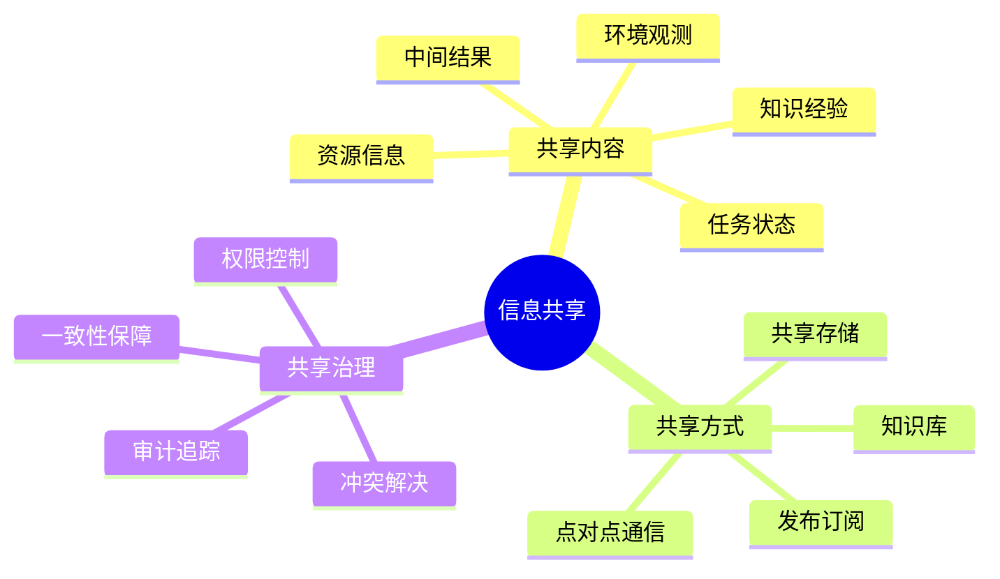

### 1.2 为什么需要信息共享

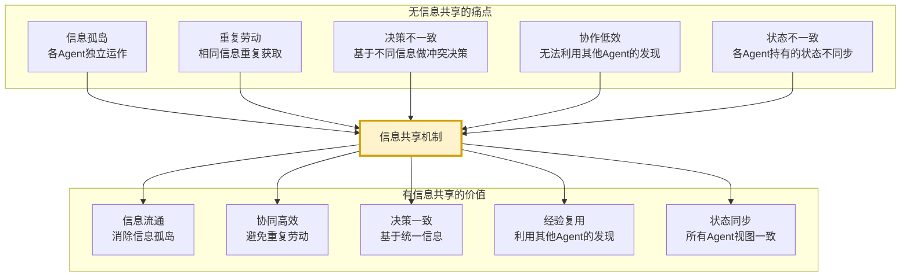

### 1.3 信息共享的核心挑战

| 挑战 | 描述 | 难度 |
|-----|------|:----:|
| **一致性** | 多 Agent 看到的信息是否一致 | ⭐⭐⭐⭐⭐ |
| **实时性** | 信息更新后其他 Agent 多快能感知 | ⭐⭐⭐⭐ |
| **可扩展性** | Agent 数量增加时的性能 | ⭐⭐⭐⭐ |
| **安全性** | 敏感信息的访问控制 | ⭐⭐⭐⭐⭐ |
| **冲突处理** | 多 Agent 同时修改同一信息 | ⭐⭐⭐⭐⭐ |
| **容错性** | 部分 Agent/存储故障时的可用性 | ⭐⭐⭐⭐ |

---

## 二、信息共享方案对比

### 2.1 三大方案全景

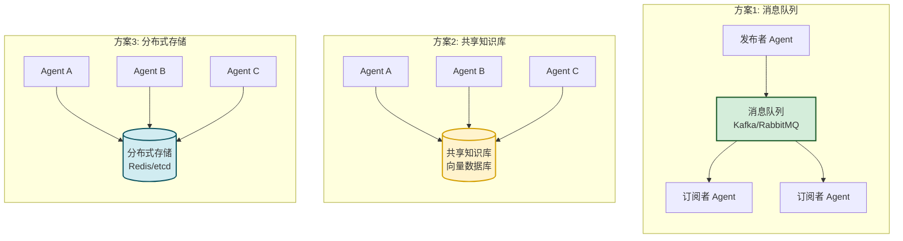

### 2.2 方案对比表

| 维度 | 消息队列 | 共享知识库 | 分布式存储 |
|-----|---------|----------|----------|
| **通信模型** | 异步、推送式 | 主动拉取 | 读写共享 |
| **实时性** | 高(毫秒级) | 中(需主动查询) | 高(缓存+通知) |
| **一致性** | 最终一致 | 最终一致 | 强一致或最终一致 |
| **持久化** | 消息持久化 | 知识持久化 | 数据持久化 |
| **可扩展** | 高(分区) | 中(索引分片) | 高(分片) |
| **复杂度** | 中 | 高 | 中 |
| **适用场景** | 事件通知、状态广播 | 知识共享、经验复用 | 状态共享、配置同步 |
| **数据量** | 大(流式) | 大(文档) | 中(键值) |
| **查询能力** | 弱(按主题) | 强(语义搜索) | 中(键查找) |
| **代表技术** | Kafka/RabbitMQ | 向量DB+知识图谱 | Redis/etcd/Consul |

### 2.3 方案选择决策树

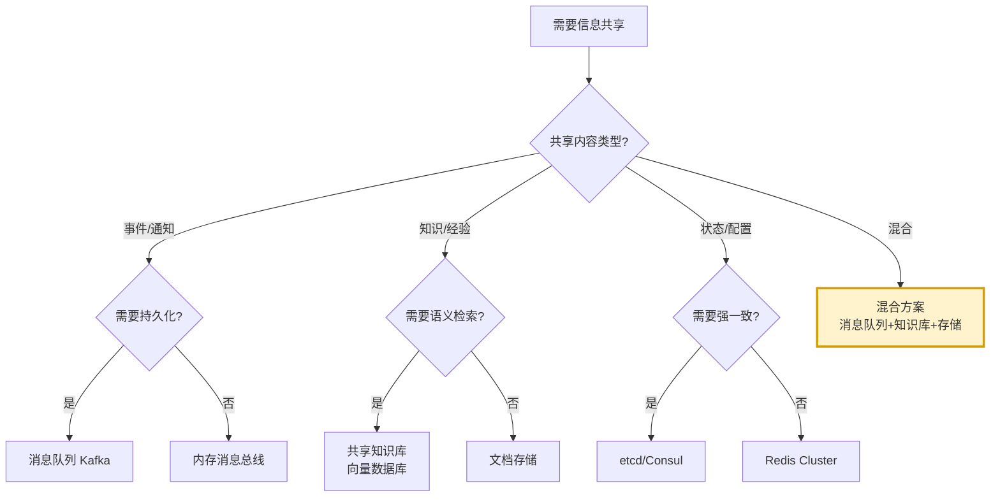

---

## 三、基于消息队列的通信方式

### 3.1 消息队列架构

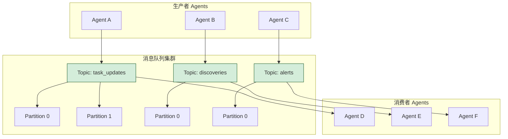

### 3.2 消息格式设计

```python
from dataclasses import dataclass, field
from typing import Any, Optional
from datetime import datetime
from enum import Enum
import uuid


class MessageType(Enum):
    """消息类型"""
    TASK_UPDATE = "task_update"          # 任务状态更新
    DISCOVERY = "discovery"              # 发现/观测
    ALERT = "alert"                      # 告警
    QUERY = "query"                       # 查询请求
    RESPONSE = "response"                 # 查询响应
    RESOURCE_SHARE = "resource_share"    # 资源共享
    KNOWLEDGE_SHARE = "knowledge_share"  # 知识共享


class MessagePriority(Enum):
    """消息优先级"""
    LOW = 1
    NORMAL = 5
    HIGH = 8
    CRITICAL = 10


@dataclass
class SharedMessage:
    """共享消息标准格式"""
    # 标识
    message_id: str = field(default_factory=lambda: str(uuid.uuid4()))
    trace_id: str = ""                  # 追踪ID(用于跨Agent链路)
    parent_id: str = ""                 # 父消息ID(用于消息链)
    
    # 路由
    topic: str = ""                     # 主题
    source_agent: str = ""              # 发送方Agent ID
    target_agent: str = ""              # 接收方Agent ID(空表示广播)
    
    # 内容
    message_type: MessageType = MessageType.TASK_UPDATE
    priority: MessagePriority = MessagePriority.NORMAL
    
    payload: dict = field(default_factory=dict)  # 消息内容
    metadata: dict = field(default_factory=dict)   # 元数据
    
    # 时间
    timestamp: str = field(default_factory=lambda: datetime.now().isoformat())
    ttl: int = 3600                     # 生存时间(秒),0表示永久
    
    # 版本
    schema_version: str = "1.0"
    
    def to_dict(self) -> dict:
        return {
            "message_id": self.message_id,
            "trace_id": self.trace_id,
            "parent_id": self.parent_id,
            "topic": self.topic,
            "source_agent": self.source_agent,
            "target_agent": self.target_agent,
            "message_type": self.message_type.value,
            "priority": self.priority.value,
            "payload": self.payload,
            "metadata": self.metadata,
            "timestamp": self.timestamp,
            "ttl": self.ttl,
            "schema_version": self.schema_version
        }


# 消息示例
TASK_UPDATE_MESSAGE = SharedMessage(
    topic="task_updates",
    source_agent="agent_search_001",
    message_type=MessageType.TASK_UPDATE,
    priority=MessagePriority.NORMAL,
    payload={
        "task_id": "task_abc123",
        "status": "completed",
        "result_summary": "找到10篇相关文档",
        "result_url": "shared://results/task_abc123.json",
        "confidence": 0.92
    },
    metadata={
        "session_id": "session_xyz",
        "task_type": "information_retrieval"
    }
)
```

### 3.3 消息队列实现

```python
import json
import threading
from collections import defaultdict
from typing import Callable, Optional


class MessageBroker:
    """消息代理(简化实现)"""
    
    def __init__(self):
        self._topics: dict[str, list[dict]] = defaultdict(list)  # topic -> messages
        self._subscribers: dict[str, list[tuple[str, Callable]]] = defaultdict(list)
        self._consumer_offsets: dict[str, dict[str, int]] = defaultdict(dict)
        self._lock = threading.RLock()
        self._retention = 10000  # 每个topic保留的最大消息数
    
    def publish(self, message: SharedMessage):
        """发布消息"""
        with self._lock:
            topic = message.topic
            self._topics[topic].append(message.to_dict())
            
            # 控制保留量
            if len(self._topics[topic]) > self._retention:
                self._topics[topic] = self._topics[topic][-self._retention:]
            
            # 通知订阅者
            for subscriber_id, callback in self._subscribers[topic]:
                try:
                    callback(message)
                except Exception as e:
                    print(f"订阅者 {subscriber_id} 回调失败: {e}")
    
    def subscribe(self, topic: str, subscriber_id: str, 
                  callback: Callable[[SharedMessage], None]):
        """订阅主题"""
        with self._lock:
            self._subscribers[topic].append((subscriber_id, callback))
            # 初始化offset
            if subscriber_id not in self._consumer_offsets[topic]:
                self._consumer_offsets[topic][subscriber_id] = 0
    
    def unsubscribe(self, topic: str, subscriber_id: str):
        """取消订阅"""
        with self._lock:
            self._subscribers[topic] = [
                (sid, cb) for sid, cb in self._subscribers[topic]
                if sid != subscriber_id
            ]
    
    def consume(self, topic: str, subscriber_id: str,
                max_messages: int = 100) -> list[dict]:
        """拉取消息"""
        with self._lock:
            offset = self._consumer_offsets[topic].get(subscriber_id, 0)
            messages = self._topics[topic][offset:offset + max_messages]
            self._consumer_offsets[topic][subscriber_id] = offset + len(messages)
            return messages
    
    def request_reply(self, request: SharedMessage,
                       timeout: float = 30) -> Optional[dict]:
        """请求-响应模式"""
        reply_topic = f"reply_{request.message_id}"
        response = [None]
        event = threading.Event()
        
        def callback(msg: SharedMessage):
            response[0] = msg.to_dict()
            event.set()
        
        self.subscribe(reply_topic, "requester", callback)
        self.publish(request)
        
        if event.wait(timeout):
            return response[0]
        return None
```

### 3.4 Agent 消息接口

```python
class AgentMessagingInterface:
    """Agent 消息接口"""
    
    def __init__(self, agent_id: str, broker: MessageBroker):
        self.agent_id = agent_id
        self.broker = broker
        self._subscriptions: list[str] = []
    
    def publish_task_update(self, task_id: str, status: str,
                              result: Optional[dict] = None):
        """发布任务更新"""
        msg = SharedMessage(
            topic="task_updates",
            source_agent=self.agent_id,
            message_type=MessageType.TASK_UPDATE,
            payload={
                "task_id": task_id,
                "status": status,
                "result": result
            }
        )
        self.broker.publish(msg)
    
    def publish_discovery(self, discovery_type: str, content: dict):
        """发布发现"""
        msg = SharedMessage(
            topic="discoveries",
            source_agent=self.agent_id,
            message_type=MessageType.DISCOVERY,
            payload={
                "discovery_type": discovery_type,
                "content": content,
                "timestamp": datetime.now().isoformat()
            }
        )
        self.broker.publish(msg)
    
    def publish_alert(self, alert_type: str, severity: str,
                       message: str):
        """发布告警"""
        priority = (MessagePriority.CRITICAL if severity == "critical"
                     else MessagePriority.HIGH)
        msg = SharedMessage(
            topic="alerts",
            source_agent=self.agent_id,
            message_type=MessageType.ALERT,
            priority=priority,
            payload={
                "alert_type": alert_type,
                "severity": severity,
                "message": message
            }
        )
        self.broker.publish(msg)
    
    def query_other_agent(self, target_agent: str, query: str) -> Optional[dict]:
        """查询其他Agent"""
        msg = SharedMessage(
            topic=f"query_{target_agent}",
            source_agent=self.agent_id,
            target_agent=target_agent,
            message_type=MessageType.QUERY,
            payload={"query": query}
        )
        return self.broker.request_reply(msg)
    
    def subscribe_topic(self, topic: str, callback: Callable):
        """订阅主题"""
        self.broker.subscribe(topic, self.agent_id, callback)
        self._subscriptions.append(topic)
    
    def unsubscribe_all(self):
        """取消所有订阅"""
        for topic in self._subscriptions:
            self.broker.unsubscribe(topic, self.agent_id)
        self._subscriptions.clear()
```

---

## 四、共享知识库架构

### 4.1 知识库架构

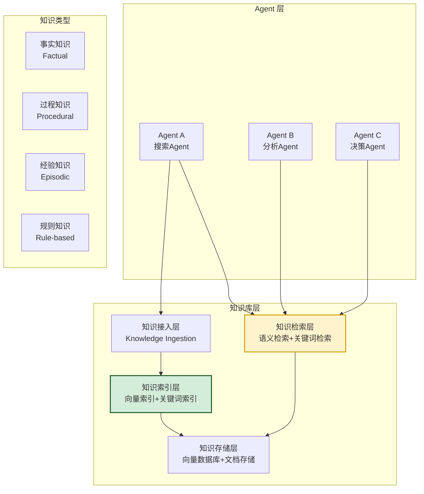

### 4.2 知识结构设计

```python
from dataclasses import dataclass, field
from typing import Optional
from enum import Enum


class KnowledgeType(Enum):
    """知识类型"""
    FACTUAL = "factual"          # 事实知识
    PROCEDURAL = "procedural"    # 过程知识
    EPISODIC = "episodic"        # 经验知识
    RULE = "rule"                # 规则知识
    META = "meta"                # 元知识


class KnowledgeSource(Enum):
    """知识来源"""
    AGENT_DISCOVERY = "agent_discovery"    # Agent发现
    EXTERNAL_IMPORT = "external_import"    # 外部导入
    INFERENCE = "inference"                # 推理得出
    HUMAN_INPUT = "human_input"            # 人工输入


@dataclass
class KnowledgeItem:
    """知识项"""
    knowledge_id: str                   # 唯一ID
    type: KnowledgeType                 # 知识类型
    source: KnowledgeSource             # 来源
    contributor: str                    # 贡献Agent ID
    
    # 内容
    title: str = ""                     # 标题
    content: str = ""                   # 内容
    summary: str = ""                   # 摘要
    
    # 结构化信息
    tags: list[str] = field(default_factory=list)
    metadata: dict = field(default_factory=dict)
    
    # 向量
    embedding: list[float] = field(default_factory=list)
    
    # 关联
    related_ids: list[str] = field(default_factory=list)
    parent_id: Optional[str] = None
    
    # 置信度
    confidence: float = 1.0
    
    # 时间
    created_at: str = field(default_factory=lambda: datetime.now().isoformat())
    updated_at: str = field(default_factory=lambda: datetime.now().isoformat())
    expires_at: Optional[str] = None     # 过期时间
    
    # 版本
    version: int = 1
    
    # 访问控制
    access_level: str = "shared"         # private/shared/public
    allowed_agents: list[str] = field(default_factory=list)  # 空表示所有Agent


class SharedKnowledgeBase:
    """共享知识库"""
    
    def __init__(self):
        self._knowledge: dict[str, KnowledgeItem] = {}
        self._embeddings: dict[str, list[float]] = {}
        self._lock = threading.RLock()
    
    def add_knowledge(self, item: KnowledgeItem) -> bool:
        """添加知识"""
        with self._lock:
            if item.knowledge_id in self._knowledge:
                return False
            
            self._knowledge[item.knowledge_id] = item
            if item.embedding:
                self._embeddings[item.knowledge_id] = item.embedding
            
            return True
    
    def update_knowledge(self, knowledge_id: str, 
                         updates: dict) -> bool:
        """更新知识"""
        with self._lock:
            if knowledge_id not in self._knowledge:
                return False
            
            item = self._knowledge[knowledge_id]
            
            # 版本递增
            old_version = item.version
            
            for key, value in updates.items():
                if hasattr(item, key):
                    setattr(item, key, value)
            
            item.version = old_version + 1
            item.updated_at = datetime.now().isoformat()
            
            # 更新向量
            if "embedding" in updates:
                self._embeddings[knowledge_id] = updates["embedding"]
            
            return True
    
    def get_knowledge(self, knowledge_id: str,
                      agent_id: str) -> Optional[KnowledgeItem]:
        """获取知识(含权限检查)"""
        with self._lock:
            item = self._knowledge.get(knowledge_id)
            if not item:
                return None
            
            # 权限检查
            if not self._check_access(item, agent_id):
                return None
            
            return item
    
    def search_semantic(self, query_embedding: list[float],
                        top_k: int = 5,
                        agent_id: str = "",
                        knowledge_type: Optional[KnowledgeType] = None) -> list[dict]:
        """语义搜索"""
        with self._lock:
            scored = []
            
            for kid, item in self._knowledge.items():
                # 权限检查
                if not self._check_access(item, agent_id):
                    continue
                
                # 类型过滤
                if knowledge_type and item.type != knowledge_type:
                    continue
                
                # 过期检查
                if item.expires_at:
                    if datetime.now().isoformat() > item.expires_at:
                        continue
                
                # 计算相似度
                embedding = self._embeddings.get(kid)
                if not embedding:
                    continue
                
                similarity = self._cosine_similarity(query_embedding, embedding)
                
                # 置信度加权
                score = similarity * item.confidence
                
                scored.append({
                    "knowledge": item,
                    "score": score,
                    "similarity": similarity
                })
            
            # 排序取TopK
            scored.sort(key=lambda x: x["score"], reverse=True)
            return scored[:top_k]
    
    def search_keyword(self, query: str,
                       agent_id: str = "",
                       top_k: int = 10) -> list[dict]:
        """关键词搜索"""
        with self._lock:
            scored = []
            query_lower = query.lower()
            
            for kid, item in self._knowledge.items():
                if not self._check_access(item, agent_id):
                    continue
                
                score = 0.0
                if query_lower in item.title.lower():
                    score += 1.0
                if query_lower in item.content.lower():
                    score += 0.5
                if query_lower in item.summary.lower():
                    score += 0.7
                for tag in item.tags:
                    if query_lower in tag.lower():
                        score += 0.3
                
                if score > 0:
                    scored.append({"knowledge": item, "score": score})
            
            scored.sort(key=lambda x: x["score"], reverse=True)
            return scored[:top_k]
    
    def _check_access(self, item: KnowledgeItem, agent_id: str) -> bool:
        """权限检查"""
        if item.access_level == "public":
            return True
        elif item.access_level == "shared":
            if not item.allowed_agents:
                return True
            return agent_id in item.allowed_agents
        elif item.access_level == "private":
            return agent_id == item.contributor
        return False
    
    def _cosine_similarity(self, a: list[float], 
                            b: list[float]) -> float:
        """余弦相似度"""
        import math
        dot = sum(x * y for x, y in zip(a, b))
        norm_a = math.sqrt(sum(x * x for x in a))
        norm_b = math.sqrt(sum(x * x for x in b))
        if norm_a == 0 or norm_b == 0:
            return 0.0
        return dot / (norm_a * norm_b)
```

### 4.3 知识共享流程

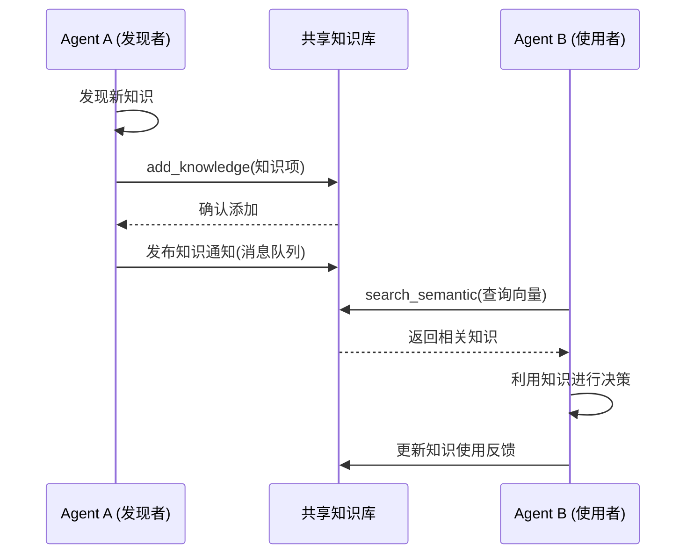

---

## 五、分布式存储方案

### 5.1 分布式存储架构

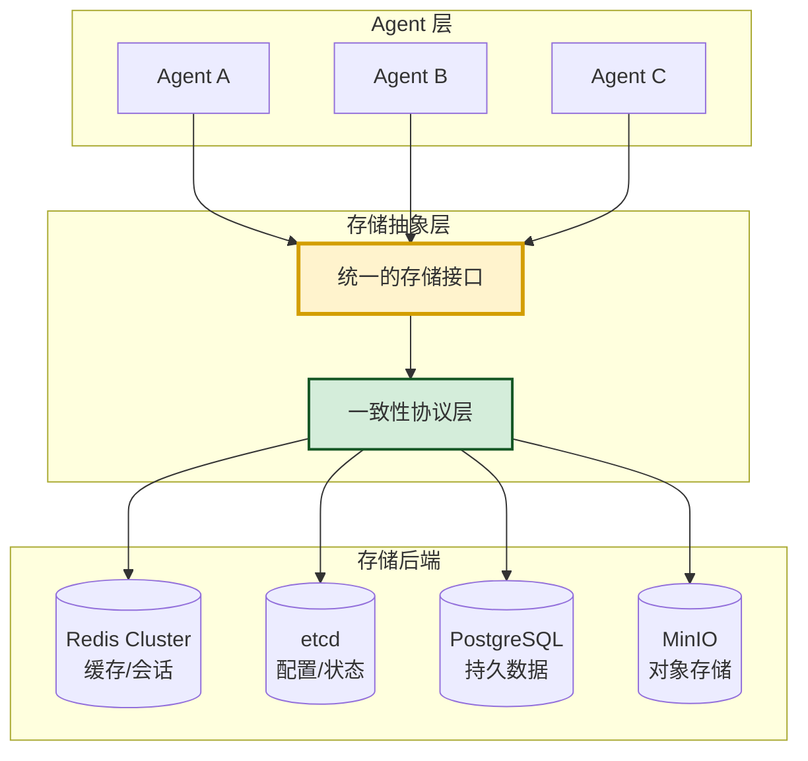

### 5.2 分布式存储实现

```python
from typing import Any, Optional
from enum import Enum


class StorageTier(Enum):
    """存储层级"""
    CACHE = "cache"           # 缓存层(Redis)
    CONFIG = "config"         # 配置层(etcd)
    PERSISTENT = "persistent" # 持久层(PostgreSQL)
    OBJECT = "object"         # 对象层(MinIO)


class ConsistencyLevel(Enum):
    """一致性级别"""
    STRONG = "strong"          # 强一致
    EVENTUAL = "eventual"      # 最终一致
    SESSION = "session"        # 会话一致


@dataclass
class StorageEntry:
    """存储项"""
    key: str
    value: Any
    version: int = 1
    created_at: str = field(default_factory=lambda: datetime.now().isoformat())
    updated_at: str = field(default_factory=lambda: datetime.now().isoformat())
    ttl: Optional[int] = None         # 生存时间(秒)
    owner: str = ""                    # 创建者
    consistency: ConsistencyLevel = ConsistencyLevel.EVENTUAL


class DistributedStorage:
    """分布式存储(简化实现)"""
    
    def __init__(self):
        self._cache: dict[str, StorageEntry] = {}      # 模拟Redis
        self._config: dict[str, StorageEntry] = {}      # 模拟etcd
        self._persistent: dict[str, StorageEntry] = {}  # 模拟PostgreSQL
        self._lock = threading.RLock()
        
        # 订阅通知
        self._watchers: dict[str, list[Callable]] = defaultdict(list)
    
    def put(self, key: str, value: Any,
            tier: StorageTier = StorageTier.CACHE,
            ttl: Optional[int] = None,
            owner: str = "") -> bool:
        """写入数据"""
        with self._lock:
            store = self._get_store(tier)
            
            # 检查是否已存在(版本控制)
            existing = store.get(key)
            version = (existing.version + 1) if existing else 1
            
            entry = StorageEntry(
                key=key,
                value=value,
                version=version,
                ttl=ttl,
                owner=owner
            )
            
            store[key] = entry
            
            # 通知观察者
            for callback in self._watchers[key]:
                try:
                    callback(entry)
                except Exception as e:
                    print(f"观察者回调失败: {e}")
            
            return True
    
    def get(self, key: str,
            tier: StorageTier = StorageTier.CACHE) -> Optional[StorageEntry]:
        """读取数据"""
        with self._lock:
            store = self._get_store(tier)
            entry = store.get(key)
            
            if entry and entry.ttl:
                # 检查TTL
                created = datetime.fromisoformat(entry.created_at)
                if (datetime.now() - created).total_seconds() > entry.ttl:
                    del store[key]
                    return None
            
            return entry
    
    def update(self, key: str, value: Any,
               tier: StorageTier = StorageTier.CACHE,
               expected_version: Optional[int] = None) -> tuple[bool, str]:
        """更新数据(乐观锁)"""
        with self._lock:
            store = self._get_store(tier)
            existing = store.get(key)
            
            if not existing:
                return False, "键不存在"
            
            # 乐观锁检查
            if expected_version is not None and existing.version != expected_version:
                return False, (
                    f"版本不匹配: 期望 {expected_version}, "
                    f"实际 {existing.version}"
                )
            
            existing.value = value
            existing.version += 1
            existing.updated_at = datetime.now().isoformat()
            
            # 通知观察者
            for callback in self._watchers[key]:
                callback(existing)
            
            return True, "更新成功"
    
    def delete(self, key: str,
               tier: StorageTier = StorageTier.CACHE) -> bool:
        """删除数据"""
        with self._lock:
            store = self._get_store(tier)
            if key in store:
                del store[key]
                return True
            return False
    
    def watch(self, key: str, callback: Callable):
        """监听键变化"""
        with self._lock:
            self._watchers[key].append(callback)
    
    def _get_store(self, tier: StorageTier) -> dict:
        """获取对应存储"""
        if tier == StorageTier.CACHE:
            return self._cache
        elif tier == StorageTier.CONFIG:
            return self._config
        elif tier == StorageTier.PERSISTENT:
            return self._persistent
        return self._cache
    
    def get_stats(self) -> dict:
        """获取存储统计"""
        with self._lock:
            return {
                "cache_size": len(self._cache),
                "config_size": len(self._config),
                "persistent_size": len(self._persistent),
                "watchers": len(self._watchers)
            }
```

### 5.3 共享状态管理

```python
class SharedStateManager:
    """共享状态管理器"""
    
    def __init__(self, storage: DistributedStorage):
        self.storage = storage
    
    def set_agent_state(self, agent_id: str, state: dict):
        """设置Agent状态"""
        key = f"agent:{agent_id}:state"
        self.storage.put(
            key, state,
            tier=StorageTier.CACHE,
            ttl=300,  # 5分钟过期
            owner=agent_id
        )
    
    def get_agent_state(self, agent_id: str) -> Optional[dict]:
        """获取Agent状态"""
        key = f"agent:{agent_id}:state"
        entry = self.storage.get(key, tier=StorageTier.CACHE)
        return entry.value if entry else None
    
    def set_shared_task(self, task_id: str, task: dict):
        """设置共享任务"""
        key = f"task:{task_id}"
        self.storage.put(
            key, task,
            tier=StorageTier.PERSISTENT,
            owner=task.get("owner", "")
        )
    
    def update_shared_task(self, task_id: str, updates: dict,
                            expected_version: Optional[int] = None) -> tuple[bool, str]:
        """更新共享任务(乐观锁)"""
        key = f"task:{task_id}"
        entry = self.storage.get(key, tier=StorageTier.PERSISTENT)
        if not entry:
            return False, "任务不存在"
        
        task = entry.value
        task.update(updates)
        
        return self.storage.update(
            key, task,
            tier=StorageTier.PERSISTENT,
            expected_version=expected_version
        )
    
    def watch_task(self, task_id: str, callback: Callable):
        """监听任务变化"""
        key = f"task:{task_id}"
        self.storage.watch(key, callback)
    
    def set_shared_config(self, config_key: str, value: Any):
        """设置共享配置"""
        self.storage.put(
            config_key, value,
            tier=StorageTier.CONFIG,
            owner="system"
        )
    
    def get_shared_config(self, config_key: str) -> Optional[Any]:
        """获取共享配置"""
        entry = self.storage.get(config_key, tier=StorageTier.CONFIG)
        return entry.value if entry else None
```

---

## 六、数据格式标准

### 6.1 数据格式设计原则

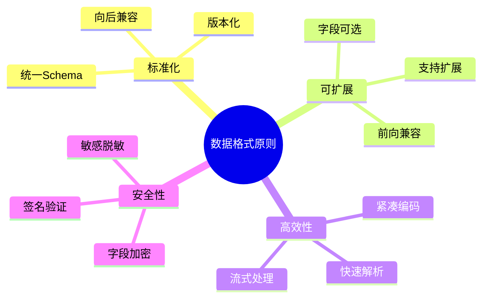

### 6.2 标准数据格式

```python
from dataclasses import dataclass, field
from typing import Any, Optional
from enum import Enum


class DataFormatVersion(Enum):
    """数据格式版本"""
    V1_0 = "1.0"
    V2_0 = "2.0"


@dataclass
class SharedDataEnvelope:
    """共享数据信封(标准包装)"""
    
    # 元数据
    schema_version: str = "1.0"
    data_type: str = ""               # 数据类型
    data_id: str = ""                 # 数据ID
    
    # 来源
    source_agent: str = ""            # 来源Agent
    source_component: str = ""        # 来源组件
    
    # 时间
    created_at: str = field(default_factory=lambda: datetime.now().isoformat())
    expires_at: Optional[str] = None
    
    # 安全
    checksum: str = ""                # 校验和
    signature: str = ""               # 签名
    encryption: str = "none"         # 加密方式
    
    # 数据
    payload: dict = field(default_factory=dict)
    
    # 追踪
    trace_id: str = ""
    parent_data_id: str = ""
    
    # 访问控制
    access_level: str = "shared"     # private/shared/public
    allowed_agents: list[str] = field(default_factory=list)
    
    def serialize(self) -> str:
        """序列化为JSON"""
        import json
        return json.dumps(self.__dict__, ensure_ascii=False)
    
    @classmethod
    def deserialize(cls, json_str: str) -> "SharedDataEnvelope":
        """从JSON反序列化"""
        import json
        data = json.loads(json_str)
        return cls(**data)


# 标准数据类型定义
class DataType:
    """标准数据类型"""
    
    TASK_STATE = "task_state"
    AGENT_STATUS = "agent_status"
    DISCOVERY = "discovery"
    KNOWLEDGE = "knowledge"
    RESOURCE = "resource"
    DECISION = "decision"
    OBSERVATION = "observation"
    ALERT = "alert"


# 标准数据模板
class DataTemplates:
    """数据模板"""
    
    @staticmethod
    def task_state_template() -> dict:
        return {
            "task_id": "",
            "task_type": "",
            "status": "",  # pending/running/completed/failed
            "progress": 0,  # 0-100
            "result": None,
            "error": None,
            "assigned_agents": [],
            "dependencies": [],
            "deadline": None
        }
    
    @staticmethod
    def agent_status_template() -> dict:
        return {
            "agent_id": "",
            "agent_type": "",
            "state": "",  # idle/busy/error/offline
            "current_task": None,
            "capabilities": [],
            "load": 0,  # 0-100
            "last_heartbeat": ""
        }
    
    @staticmethod
    def discovery_template() -> dict:
        return {
            "discovery_id": "",
            "discovery_type": "",
            "content": "",
            "confidence": 0.0,
            "evidence": [],
            "timestamp": "",
            "location": None
        }
```

### 6.3 数据验证

```python
class DataValidator:
    """数据验证器"""
    
    SCHEMAS = {
        "task_state": {
            "required": ["task_id", "status"],
            "optional": ["progress", "result", "error"],
            "types": {
                "task_id": str,
                "status": str,
                "progress": int,
                "result": (dict, type(None)),
                "error": (str, type(None))
            },
            "enums": {
                "status": ["pending", "running", "completed", "failed"]
            }
        },
        "agent_status": {
            "required": ["agent_id", "state"],
            "optional": ["current_task", "capabilities", "load"],
            "types": {
                "agent_id": str,
                "state": str,
                "load": int
            },
            "enums": {
                "state": ["idle", "busy", "error", "offline"]
            }
        }
    }
    
    @classmethod
    def validate(cls, data_type: str, data: dict) -> tuple[bool, str]:
        """验证数据"""
        schema = cls.SCHEMAS.get(data_type)
        if not schema:
            return False, f"未知数据类型: {data_type}"
        
        # 必填字段检查
        for field_name in schema["required"]:
            if field_name not in data:
                return False, f"缺少必填字段: {field_name}"
        
        # 类型检查
        for field_name, expected_type in schema["types"].items():
            if field_name in data:
                actual_value = data[field_name]
                if not isinstance(actual_value, expected_type):
                    return False, (
                        f"字段 {field_name} 类型错误: "
                        f"期望 {expected_type}, 实际 {type(actual_value)}"
                    )
        
        # 枚举值检查
        for field_name, allowed_values in schema.get("enums", {}).items():
            if field_name in data:
                if data[field_name] not in allowed_values:
                    return False, (
                        f"字段 {field_name} 值无效: "
                        f"允许 {allowed_values}, 实际 {data[field_name]}"
                    )
        
        return True, "验证通过"
```

---

## 七、同步机制设计

### 7.1 同步机制对比

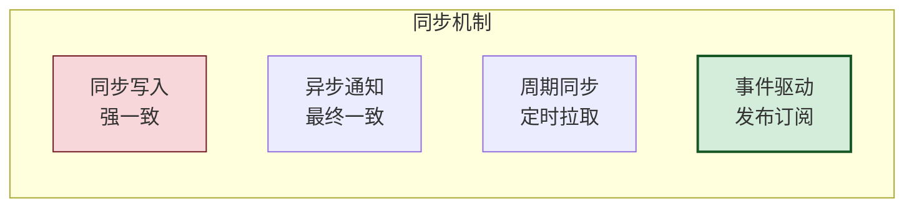

### 7.2 同步策略

| 策略 | 一致性 | 性能 | 适用场景 |
|-----|:------:|:----:|---------|
| **同步写入** | 强一致 | 低 | 关键状态(任务分配) |
| **异步通知** | 最终一致 | 高 | 发现/观测共享 |
| **周期同步** | 最终一致 | 中 | 状态快照 |
| **事件驱动** | 最终一致 | 高 | 实时变更通知 |

### 7.3 同步实现

```python
class SynchronizationManager:
    """同步管理器"""
    
    def __init__(self, storage: DistributedStorage,
                 broker: MessageBroker):
        self.storage = storage
        self.broker = broker
        self._sync_handlers: dict[str, Callable] = {}
    
    def register_sync_handler(self, data_type: str, 
                                handler: Callable):
        """注册同步处理器"""
        self._sync_handlers[data_type] = handler
    
    def sync_write(self, key: str, value: dict,
                    data_type: str,
                    agent_id: str) -> bool:
        """同步写入(强一致)"""
        # 1. 写入存储
        success = self.storage.put(
            key, value,
            tier=StorageTier.PERSISTENT,
            owner=agent_id
        )
        
        if success:
            # 2. 发布变更通知
            msg = SharedMessage(
                topic=f"sync_{data_type}",
                source_agent=agent_id,
                message_type=MessageType.RESOURCE_SHARE,
                payload={
                    "action": "update",
                    "key": key,
                    "data_type": data_type,
                    "version": value.get("version", 1)
                }
            )
            self.broker.publish(msg)
        
        return success
    
    def async_notify(self, key: str, change_type: str,
                      agent_id: str):
        """异步通知变更"""
        msg = SharedMessage(
            topic="data_changes",
            source_agent=agent_id,
            message_type=MessageType.RESOURCE_SHARE,
            payload={
                "key": key,
                "change_type": change_type,
                "timestamp": datetime.now().isoformat()
            }
        )
        self.broker.publish(msg)
    
    def periodic_sync(self, agent_id: str,
                      data_types: list[str],
                      interval: float = 60):
        """周期同步"""
        import threading
        
        def sync_loop():
            while True:
                for data_type in data_types:
                    self._sync_data_type(agent_id, data_type)
                threading.Event().wait(interval)
        
        thread = threading.Thread(target=sync_loop, daemon=True)
        thread.start()
    
    def _sync_data_type(self, agent_id: str, data_type: str):
        """同步指定类型数据"""
        handler = self._sync_handlers.get(data_type)
        if handler:
            handler(agent_id, data_type)
```

### 7.4 最终一致性保障

```python
class ConsistencyRepair:
    """一致性修复器"""
    
    def __init__(self, storage: DistributedStorage):
        self.storage = storage
        self._version_vector: dict[str, dict[str, int]] = defaultdict(dict)
    
    def record_write(self, key: str, agent_id: str, version: int):
        """记录写入"""
        self._version_vector[key][agent_id] = version
    
    def detect_conflict(self, key: str, agent_id: str,
                         version: int) -> bool:
        """检测冲突"""
        current = self._version_vector.get(key, {})
        latest_version = max(current.values()) if current else 0
        
        return version < latest_version
    
    def repair(self, key: str):
        """修复一致性"""
        # 简化:从持久层重新加载
        entry = self.storage.get(key, tier=StorageTier.PERSISTENT)
        if entry:
            self.storage.put(
                key, entry.value,
                tier=StorageTier.CACHE,
                owner=entry.owner
            )
            return True
        return False
```

---

## 八、权限控制策略

### 8.1 权限模型

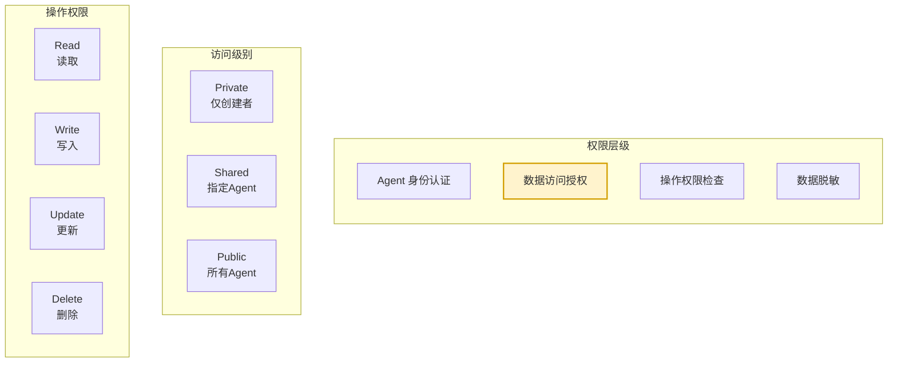

### 8.2 权限实现

```python
from enum import Enum


class AccessLevel(Enum):
    """访问级别"""
    PRIVATE = "private"
    SHARED = "shared"
    PUBLIC = "public"


class Operation(Enum):
    """操作类型"""
    READ = "read"
    WRITE = "write"
    UPDATE = "update"
    DELETE = "delete"


@dataclass
class AccessControlEntry:
    """访问控制项"""
    resource_key: str               # 资源键
    agent_id: str                  # Agent ID
    access_level: AccessLevel      # 访问级别
    allowed_operations: list[Operation]  # 允许的操作
    allowed_agents: list[str] = field(default_factory=list)  # SHARED级别下的允许列表


class AccessController:
    """访问控制器"""
    
    def __init__(self):
        self._policies: dict[str, AccessControlEntry] = {}
        self._agent_roles: dict[str, str] = {}  # agent_id -> role
        self._lock = threading.RLock()
    
    def authenticate(self, agent_id: str, token: str) -> bool:
        """Agent 身份认证"""
        # 简化:实际应集成IAM
        return True
    
    def authorize(self, agent_id: str, resource_key: str,
                   operation: Operation) -> tuple[bool, str]:
        """授权检查"""
        with self._lock:
            policy = self._policies.get(resource_key)
            
            if not policy:
                # 无策略:默认允许读,拒绝写
                if operation == Operation.READ:
                    return True, "默认允许读取"
                return False, "无策略,默认拒绝写入"
            
            # 检查访问级别
            if policy.access_level == AccessLevel.PUBLIC:
                if operation in policy.allowed_operations:
                    return True, "公共访问"
                return False, "操作不在允许列表"
            
            elif policy.access_level == AccessLevel.SHARED:
                if agent_id not in policy.allowed_agents:
                    return False, "Agent不在允许列表"
                if operation not in policy.allowed_operations:
                    return False, "操作不允许"
                return True, "共享访问授权通过"
            
            elif policy.access_level == AccessLevel.PRIVATE:
                if agent_id != policy.agent_id:
                    return False, "私有资源,非创建者"
                if operation not in policy.allowed_operations:
                    return False, "操作不允许"
                return True, "私有访问授权通过"
            
            return False, "未知访问级别"
    
    def set_policy(self, resource_key: str, agent_id: str,
                    access_level: AccessLevel,
                    operations: list[Operation],
                    allowed_agents: Optional[list[str]] = None):
        """设置访问策略"""
        with self._lock:
            self._policies[resource_key] = AccessControlEntry(
                resource_key=resource_key,
                agent_id=agent_id,
                access_level=access_level,
                allowed_operations=operations,
                allowed_agents=allowed_agents or []
            )
    
    def audit_access(self, agent_id: str, resource_key: str,
                      operation: Operation, granted: bool):
        """审计访问"""
        # 简化:实际应写入审计日志
        pass
```

### 8.3 数据脱敏

```python
class DataMasker:
    """数据脱敏器"""
    
    SENSITIVE_FIELDS = {
        "password", "token", "secret", "api_key",
        "credit_card", "ssn", "email", "phone"
    }
    
    @classmethod
    def mask(cls, data: dict, agent_id: str,
             access_level: str = "shared") -> dict:
        """脱敏数据"""
        if access_level == "private":
            return data  # 私有访问不脱敏
        
        masked = {}
        for key, value in data.items():
            if key.lower() in cls.SENSITIVE_FIELDS:
                masked[key] = cls._mask_value(value)
            elif isinstance(value, dict):
                masked[key] = cls.mask(value, agent_id, access_level)
            else:
                masked[key] = value
        
        return masked
    
    @staticmethod
    def _mask_value(value: str) -> str:
        """脱敏值"""
        if not value:
            return value
        if len(value) <= 4:
            return "*" * len(value)
        return value[:2] + "*" * (len(value) - 4) + value[-2:]
```

---

## 九、冲突解决方法

### 9.1 冲突类型

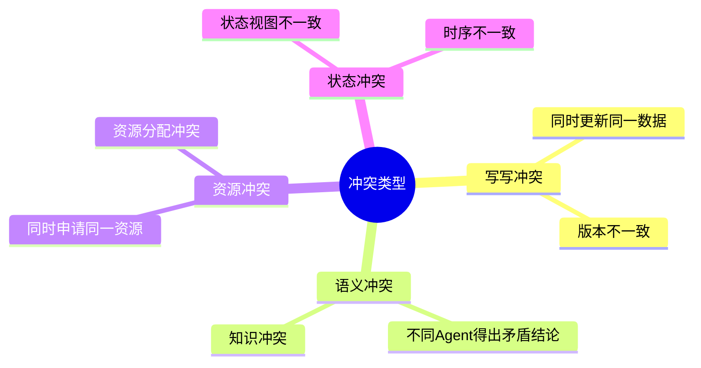

### 9.2 冲突解决策略

```python
from enum import Enum
from typing import Optional


class ConflictType(Enum):
    """冲突类型"""
    WRITE_WRITE = "write_write"      # 写写冲突
    SEMANTIC = "semantic"             # 语义冲突
    RESOURCE = "resource"             # 资源冲突
    STATE = "state"                   # 状态冲突


class ConflictResolution(Enum):
    """冲突解决策略"""
    LAST_WRITE_WINS = "last_write_wins"       # 最后写入胜出
    FIRST_WRITE_WINS = "first_write_wins"     # 首次写入胜出
    VERSION_VECTOR = "version_vector"          # 版本向量
    TIMESTAMP = "timestamp"                    # 时间戳
    PRIORITY = "priority"                      # 优先级
    CONSENSUS = "consensus"                    # 共识
    HUMAN = "human"                             # 人工裁决


@dataclass
class Conflict:
    """冲突"""
    conflict_id: str
    conflict_type: ConflictType
    resource_key: str
    
    # 冲突方
    agent_a: str = ""
    agent_b: str = ""
    
    # 冲突数据
    value_a: Any = None
    value_b: Any = None
    
    # 元数据
    timestamp_a: str = ""
    timestamp_b: str = ""
    version_a: int = 0
    version_b: int = 0
    
    # 解决
    resolution: Optional[ConflictResolution] = None
    resolved_value: Any = None
    resolved_at: Optional[str] = None


class ConflictResolver:
    """冲突解决器"""
    
    def __init__(self, default_strategy: ConflictResolution = 
                 ConflictResolution.LAST_WRITE_WINS):
        self.default_strategy = default_strategy
        self._strategies: dict[ConflictType, ConflictResolution] = {
            ConflictType.WRITE_WRITE: ConflictResolution.VERSION_VECTOR,
            ConflictType.SEMANTIC: ConflictResolution.CONSENSUS,
            ConflictType.RESOURCE: ConflictResolution.PRIORITY,
            ConflictType.STATE: ConflictResolution.TIMESTAMP,
        }
        self._agent_priorities: dict[str, int] = {}  # agent_id -> priority
    
    def resolve(self, conflict: Conflict) -> Conflict:
        """解决冲突"""
        strategy = self._strategies.get(
            conflict.conflict_type, self.default_strategy
        )
        
        conflict.resolution = strategy
        
        if strategy == ConflictResolution.LAST_WRITE_WINS:
            conflict = self._resolve_by_last_write(conflict)
        elif strategy == ConflictResolution.VERSION_VECTOR:
            conflict = self._resolve_by_version(conflict)
        elif strategy == ConflictResolution.TIMESTAMP:
            conflict = self._resolve_by_timestamp(conflict)
        elif strategy == ConflictResolution.PRIORITY:
            conflict = self._resolve_by_priority(conflict)
        elif strategy == ConflictResolution.CONSENSUS:
            conflict = self._resolve_by_consensus(conflict)
        
        conflict.resolved_at = datetime.now().isoformat()
        return conflict
    
    def _resolve_by_last_write(self, conflict: Conflict) -> Conflict:
        """最后写入胜出"""
        if conflict.timestamp_a > conflict.timestamp_b:
            conflict.resolved_value = conflict.value_a
        else:
            conflict.resolved_value = conflict.value_b
        return conflict
    
    def _resolve_by_version(self, conflict: Conflict) -> Conflict:
        """版本向量解决"""
        if conflict.version_a > conflict.version_b:
            conflict.resolved_value = conflict.value_a
        elif conflict.version_b > conflict.version_a:
            conflict.resolved_value = conflict.value_b
        else:
            # 版本相同,回退到时间戳
            return self._resolve_by_timestamp(conflict)
        return conflict
    
    def _resolve_by_timestamp(self, conflict: Conflict) -> Conflict:
        """时间戳解决"""
        return self._resolve_by_last_write(conflict)
    
    def _resolve_by_priority(self, conflict: Conflict) -> Conflict:
        """优先级解决"""
        priority_a = self._agent_priorities.get(conflict.agent_a, 0)
        priority_b = self._agent_priorities.get(conflict.agent_b, 0)
        
        if priority_a >= priority_b:
            conflict.resolved_value = conflict.value_a
        else:
            conflict.resolved_value = conflict.value_b
        return conflict
    
    def _resolve_by_consensus(self, conflict: Conflict) -> Conflict:
        """共识解决(简化:实际需多轮协商)"""
        # 简化:取两个值的合并
        if isinstance(conflict.value_a, dict) and isinstance(conflict.value_b, dict):
            conflict.resolved_value = {**conflict.value_a, **conflict.value_b}
        else:
            conflict.resolved_value = conflict.value_a
        return conflict
    
    def set_agent_priority(self, agent_id: str, priority: int):
        """设置Agent优先级"""
        self._agent_priorities[agent_id] = priority
```

### 9.3 乐观锁实现

```python
class OptimisticLockManager:
    """乐观锁管理器"""
    
    def __init__(self, storage: DistributedStorage):
        self.storage = storage
    
    def update_with_lock(self, key: str, updater: Callable,
                         tier: StorageTier = StorageTier.PERSISTENT,
                         max_retries: int = 3) -> tuple[bool, str]:
        """带乐观锁的更新"""
        for attempt in range(max_retries):
            # 1. 读取当前值与版本
            entry = self.storage.get(key, tier=tier)
            if not entry:
                return False, "键不存在"
            
            # 2. 调用更新函数
            new_value = updater(entry.value)
            if new_value is None:
                return False, "更新函数返回None"
            
            # 3. 尝试写入(带版本检查)
            success, message = self.storage.update(
                key, new_value,
                tier=tier,
                expected_version=entry.version
            )
            
            if success:
                return True, "更新成功"
            
            # 版本不匹配,重试
            if attempt < max_retries - 1:
                import time
                time.sleep(0.1 * (attempt + 1))  # 退避
        
        return False, f"超过最大重试次数 {max_retries}"
```

---

## 十、推荐架构设计与实现

### 10.1 推荐架构:混合方案

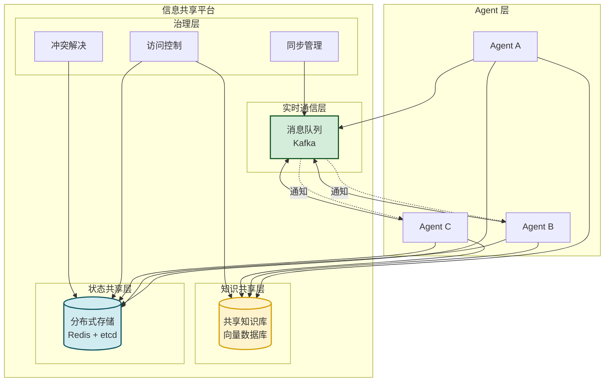

### 10.2 统一信息共享接口

```python
class InformationSharingHub:
    """信息共享中心 - 统一接口"""
    
    def __init__(self):
        self.broker = MessageBroker()
        self.knowledge_base = SharedKnowledgeBase()
        self.storage = DistributedStorage()
        self.access_controller = AccessController()
        self.conflict_resolver = ConflictResolver()
        self.lock_manager = OptimisticLockManager(self.storage)
        self.validator = DataValidator()
    
    def share_information(self, agent_id: str, info_type: str,
                            data: dict,
                            access_level: str = "shared",
                            allowed_agents: Optional[list[str]] = None) -> dict:
        """共享信息(统一入口)"""
        result = {
            "success": False,
            "info_id": "",
            "message": ""
        }
        
        # 1. 数据验证
        valid, msg = self.validator.validate(info_type, data)
        if not valid:
            result["message"] = f"数据验证失败: {msg}"
            return result
        
        # 2. 包装数据
        envelope = SharedDataEnvelope(
            data_type=info_type,
            data_id=f"info_{int(time.time())}_{agent_id}",
            source_agent=agent_id,
            payload=data,
            access_level=access_level,
            allowed_agents=allowed_agents or []
        )
        
        # 3. 根据类型路由到不同存储
        if info_type in ["task_state", "agent_status"]:
            # 状态类:分布式存储
            self.storage.put(
                envelope.data_id, envelope.payload,
                tier=StorageTier.CACHE,
                ttl=300,
                owner=agent_id
            )
        elif info_type in ["knowledge", "discovery"]:
            # 知识类:共享知识库
            item = KnowledgeItem(
                knowledge_id=envelope.data_id,
                type=KnowledgeType.FACTUAL,
                source=KnowledgeSource.AGENT_DISCOVERY,
                contributor=agent_id,
                title=data.get("title", ""),
                content=data.get("content", ""),
                access_level=access_level,
                allowed_agents=allowed_agents or []
            )
            self.knowledge_base.add_knowledge(item)
        
        # 4. 发布通知
        msg = SharedMessage(
            topic=f"shared_{info_type}",
            source_agent=agent_id,
            message_type=MessageType.RESOURCE_SHARE,
            payload={
                "info_id": envelope.data_id,
                "info_type": info_type,
                "access_level": access_level
            }
        )
        self.broker.publish(msg)
        
        result["success"] = True
        result["info_id"] = envelope.data_id
        result["message"] = "信息共享成功"
        return result
    
    def retrieve_information(self, agent_id: str, info_id: str,
                                info_type: str) -> Optional[dict]:
        """获取共享信息"""
        # 权限检查
        granted, msg = self.access_controller.authorize(
            agent_id, info_id, Operation.READ
        )
        if not granted:
            return None
        
        # 根据类型从不同存储获取
        if info_type in ["task_state", "agent_status"]:
            entry = self.storage.get(info_id, tier=StorageTier.CACHE)
            return entry.value if entry else None
        elif info_type in ["knowledge", "discovery"]:
            item = self.knowledge_base.get_knowledge(info_id, agent_id)
            return item.__dict__ if item else None
        
        return None
    
    def search_information(self, agent_id: str, query: str,
                            info_type: Optional[str] = None,
                            top_k: int = 5) -> list[dict]:
        """搜索共享信息"""
        # 语义搜索知识库
        results = self.knowledge_base.search_keyword(query, agent_id, top_k)
        return results
    
    def update_shared_information(self, agent_id: str, info_id: str,
                                    updates: dict,
                                    info_type: str) -> tuple[bool, str]:
        """更新共享信息"""
        # 权限检查
        granted, msg = self.access_controller.authorize(
            agent_id, info_id, Operation.UPDATE
        )
        if not granted:
            return False, msg
        
        # 乐观锁更新
        def updater(current):
            current.update(updates)
            return current
        
        return self.lock_manager.update_with_lock(
            info_id, updater, tier=StorageTier.PERSISTENT
        )
```

### 10.3 推荐技术选型

| 技术领域 | 推荐选型 | 备选 | 选型理由 |
|---------|---------|------|---------|
| **消息队列** | Kafka | RabbitMQ/Pulsar | 高吞吐、持久化、分区 |
| **向量数据库** | Milvus | Pinecone/Weaviate | 开源、可扩展 |
| **缓存** | Redis Cluster | Memcached | 丰富的数据结构 |
| **配置存储** | etcd | Consul/ZooKeeper | 强一致、Watch机制 |
| **持久存储** | PostgreSQL | MySQL | JSONB、扩展性 |
| **对象存储** | MinIO | AWS S3 | 兼容S3、私有部署 |
| **搜索** | Elasticsearch | OpenSearch | 全文+向量搜索 |

### 10.4 最佳实践

| 领域 | 最佳实践 |
|-----|---------|
| **消息设计** | 标准信封格式、版本化、含追踪ID |
| **知识管理** | 分类存储、置信度评分、过期清理 |
| **状态同步** | 实时通知+周期同步结合 |
| **权限控制** | 最小权限原则、默认拒绝 |
| **冲突解决** | 乐观锁为主、优先级为辅 |
| **数据验证** | 入库前强制验证、Schema版本化 |
| **监控** | 全链路追踪、冲突告警 |

### 10.5 核心要点回顾

1. **三大方案**:消息队列(实时通信)、共享知识库(知识复用)、分布式存储(状态共享)。
2. **数据格式**:标准信封包装、类型化payload、版本化Schema。
3. **同步机制**:同步写入(强一致)+ 异步通知(最终一致)+ 周期同步(快照)。
4. **权限控制**:三级访问(Private/Shared/Public)+ 操作授权 + 数据脱敏。
5. **冲突解决**:乐观锁(写写冲突)+ 优先级(资源冲突)+ 共识(语义冲突)。
6. **推荐架构**:混合方案,三种存储各司其职,统一接口管理。
7. **技术选型**:Kafka+Milvus+Redis+etcd+PostgreSQL。

### 10.6 与系列文档的关联

本文档作为多 Agent 系列的信息共享专题,与其他文档形成完整闭环:

- **基础概念**:[108Multi-Agent多智能体系统核心概念详解.md](./108Multi-Agent多智能体系统核心概念详解.md)
- **架构模式**:[109Multi-Agent系统架构设计模式深度解析.md](./109Multi-Agent系统架构设计模式深度解析.md)
- **角色分工**:[111多Agent系统角色分工与任务分配策略深度解析.md](./111多Agent系统角色分工与任务分配策略深度解析.md)
- **通信机制**:[112多Agent系统通信机制设计与实现深度解析.md](./112多Agent系统通信机制设计与实现深度解析.md)
- **本文档**:**信息共享机制**,聚焦数据层与治理层

---

> **相关文档**
>
> - [108Multi-Agent多智能体系统核心概念详解.md](./108Multi-Agent多智能体系统核心概念详解.md)
> - [109Multi-Agent系统架构设计模式深度解析.md](./109Multi-Agent系统架构设计模式深度解析.md)
> - [110SupervisorAgent核心概念与架构设计深度解析.md](./110SupervisorAgent核心概念与架构设计深度解析.md)
> - [111多Agent系统角色分工与任务分配策略深度解析.md](./111多Agent系统角色分工与任务分配策略深度解析.md)
> - [112多Agent系统通信机制设计与实现深度解析.md](./112多Agent系统通信机制设计与实现深度解析.md)
