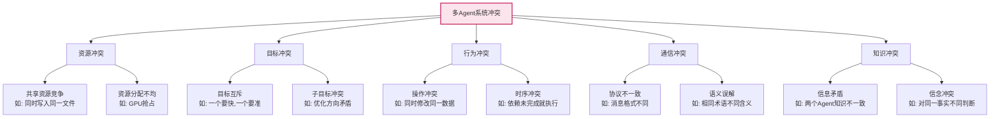
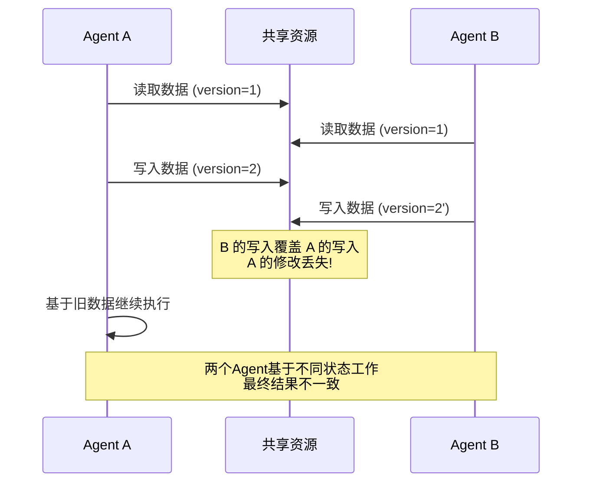
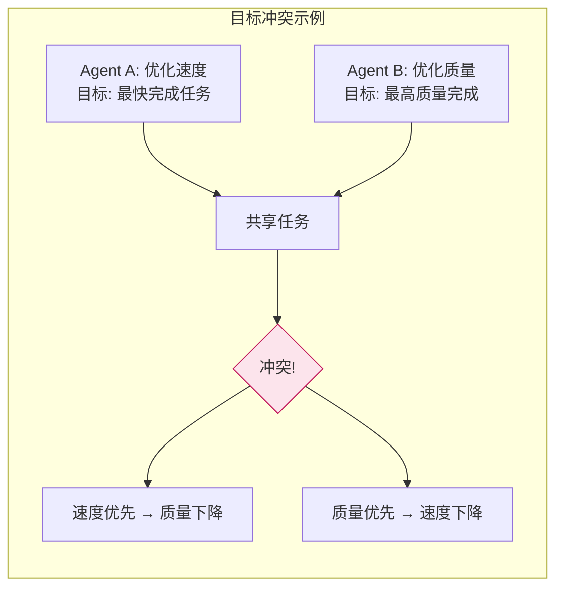
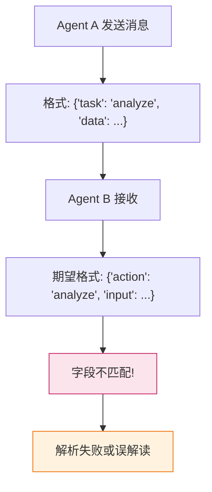
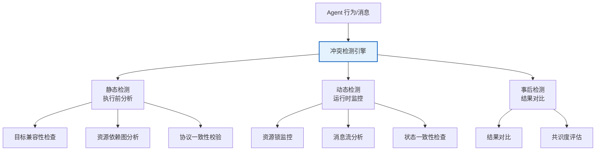
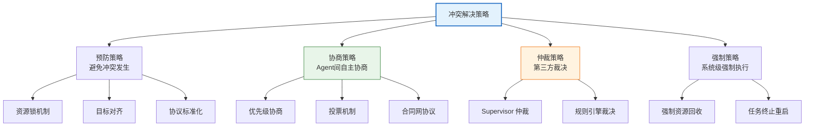
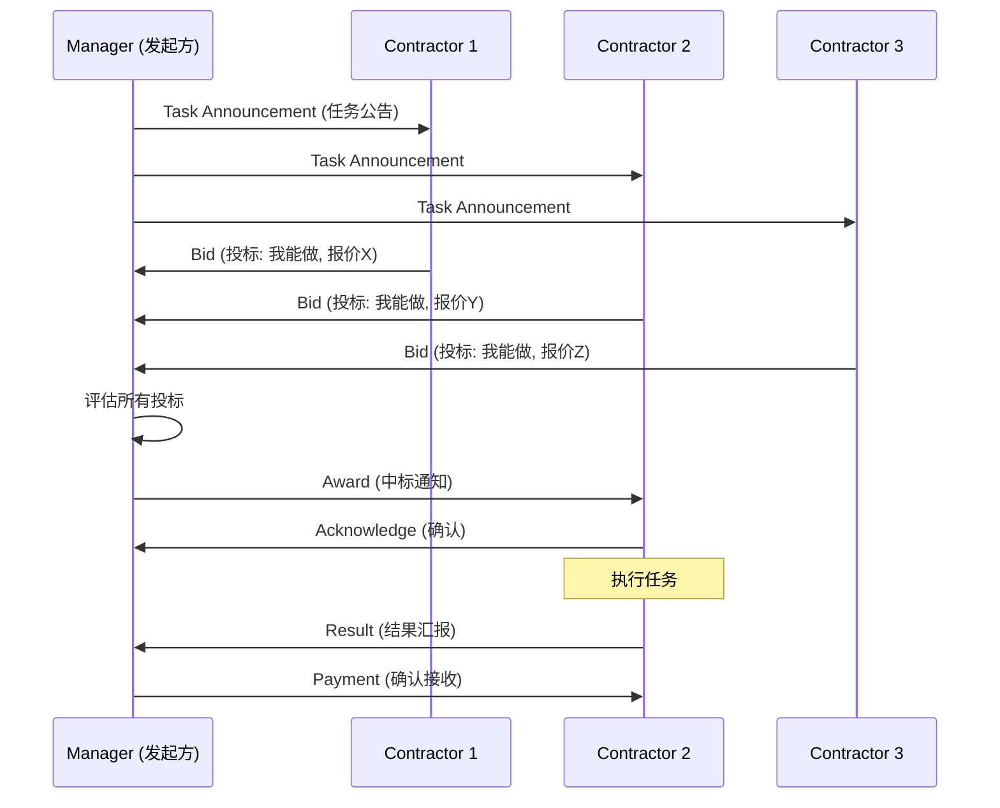
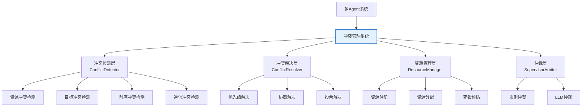
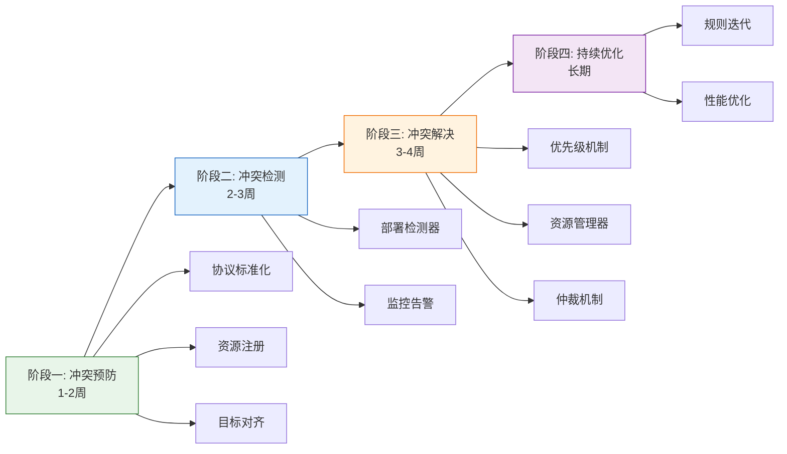
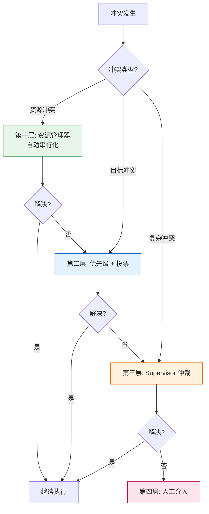

# 多 Agent 系统冲突识别与解决机制深度解析

## 引言

多 Agent 系统通过多个智能体的协作完成复杂任务，但当多个 Agent 同时运行时，**冲突**不可避免。冲突轻则导致效率下降、资源浪费，重则引发系统死锁、目标偏离甚至整个协作失败。

如何**系统性地识别和解决 Agent 之间的冲突**，是多 Agent 系统从"能运行"到"能协同"的关键工程挑战。本文从冲突场景分析、检测方法、解决策略、实现步骤和验证方案五个维度，完整阐述多 Agent 系统的冲突管理机制。

---

## 1. 冲突问题全景分析

### 1.1 什么是 Agent 冲突？

在多 Agent 系统中，**冲突**指两个或多个 Agent 在追求各自目标时，因资源、目标、行为或通信等方面的不一致，导致系统无法达成预期协同状态的现象。



### 1.2 冲突的四大危害

| 危害 | 表现 | 影响 |
| :--- | :--- | :--- |
| **系统死锁** | Agent 互相等待对方释放资源 | 系统完全停滞 |
| **结果不一致** | 多个 Agent 产出矛盾结果 | 无法达成共识 |
| **资源浪费** | 重复执行、无效计算 | 成本增加 |
| **目标偏离** | 冲突消耗导致主目标未达成 | 任务失败 |

---

## 2. 冲突场景深度分析

### 2.1 场景一：资源竞争冲突

#### 2.1.1 典型场景

多个 Agent 同时访问**共享资源**（文件、数据库、API、GPU），导致数据不一致或资源耗尽。



#### 2.1.2 具体实例

```python
# 场景: 两个 Agent 同时编辑同一文档
class Agent:
    def __init__(self, name):
        self.name = name
    
    def edit_document(self, doc, changes):
        """编辑文档（无锁保护）"""
        current = doc.read()
        # ⚠️ 此处可能被其他 Agent 打断
        updated = current + changes
        doc.write(updated)
        return updated

# 冲突复现
doc = SharedDocument("初始内容")
agent_a = Agent("Writer-A")
agent_b = Agent("Writer-B")

# 并发编辑 → 内容丢失
# agent_a: "初始内容" + "A的修改" = "初始内容A的修改"
# agent_b: "初始内容" + "B的修改" = "初始内容B的修改"  ← 覆盖了A
# 最终: "初始内容B的修改"  ← A的修改丢失!
```

### 2.2 场景二：目标冲突

#### 2.2.1 典型场景

多个 Agent 的目标**互相矛盾**，优化一个目标会损害另一个目标。



#### 2.2.2 具体实例

```python
# 场景: 代码审查系统
# Agent A (性能优化专家): 建议移除日志代码以提升性能
# Agent B (安全审计专家): 建议增加日志以提升可追溯性
# 两者目标直接矛盾

class GoalConflictExample:
    def __init__(self):
        self.performance_agent = PerformanceAgent()
        self.security_agent = SecurityAgent()
    
    def review_code(self, code):
        suggestions_a = self.performance_agent.analyze(code)
        suggestions_b = self.security_agent.analyze(code)
        
        # 冲突: A 建议移除日志, B 建议增加日志
        # suggestions_a: {"action": "remove_logging", "reason": "性能提升10%"}
        # suggestions_b: {"action": "add_logging", "reason": "安全审计需要"}
        
        # 如何解决? → 需要冲突解决策略
```

### 2.3 场景三：通信协议不一致

#### 2.3.1 典型场景

Agent 使用不同的**消息格式、字段定义或通信协议**，导致信息传递错误。



### 2.4 场景四：时序依赖冲突

#### 2.4.1 典型场景

Agent 的执行存在**依赖关系**，但执行顺序未正确协调。

```mermaid
sequenceDiagram
    participant A as Agent A (数据采集)
    participant B as Agent B (数据分析)
    participant C as Agent C (报告生成)
    
    Note over A: 应该的顺序: A → B → C
    B->>B: 开始分析 (数据未就绪!)
    A->>A: 完成数据采集
    C->>C: 开始生成 (分析未完成!)
    
    Note over A,B,C: 时序混乱导致: <br/>B 基于空数据分析<br/>C 基于空报告生成
```

### 2.5 冲突场景汇总表

| 冲突类型 | 根因 | 典型表现 | 严重程度 |
| :--- | :--- | :--- | :--- |
| **资源竞争** | 共享资源无序访问 | 数据覆盖、丢失 | 高 |
| **目标冲突** | Agent 目标互斥 | 结果矛盾、无法收敛 | 高 |
| **通信不一致** | 协议/格式不统一 | 消息误解读 | 中 |
| **时序依赖** | 执行顺序未协调 | 基于未就绪数据执行 | 高 |
| **知识冲突** | 信息不一致 | 决策分歧 | 中 |
| **行为冲突** | 操作互斥 | 系统状态混乱 | 高 |

---

## 3. 系统性冲突检测方法

### 3.1 冲突检测框架



### 3.2 冲突检测器实现

```python
# conflict_detector.py
import time
from typing import Dict, List, Any, Optional, Set, Tuple
from dataclasses import dataclass, field
from enum import Enum
import threading


class ConflictType(Enum):
    """冲突类型枚举"""
    RESOURCE = "resource"           # 资源冲突
    GOAL = "goal"                   # 目标冲突
    COMMUNICATION = "communication"  # 通信冲突
    TIMING = "timing"               # 时序冲突
    KNOWLEDGE = "knowledge"         # 知识冲突
    BEHAVIOR = "behavior"           # 行为冲突


class ConflictSeverity(Enum):
    """冲突严重程度"""
    LOW = "low"         # 可自动解决
    MEDIUM = "medium"   # 需协商
    HIGH = "high"       # 需人工介入
    CRITICAL = "critical"  # 系统停滞


@dataclass
class Conflict:
    """冲突描述"""
    conflict_id: str
    conflict_type: ConflictType
    severity: ConflictSeverity
    agents: List[str]              # 涉及的 Agent
    description: str
    detected_at: float = field(default_factory=time.time)
    resource: Optional[str] = None
    context: Dict[str, Any] = field(default_factory=dict)


class ConflictDetector:
    """冲突检测引擎"""
    
    def __init__(self):
        self.resource_locks: Dict[str, str] = {}  # resource -> agent_id
        self.agent_goals: Dict[str, Dict] = {}     # agent_id -> goals
        self.message_history: List[Dict] = []
        self.detected_conflicts: List[Conflict] = []
        self._lock = threading.Lock()
    
    def register_agent(self, agent_id: str, goals: Dict):
        """注册 Agent 及其目标"""
        with self._lock:
            self.agent_goals[agent_id] = goals
    
    def check_resource_conflict(
        self, agent_id: str, resource: str, access_mode: str = "write"
    ) -> Optional[Conflict]:
        """检测资源冲突"""
        with self._lock:
            if resource in self.resource_locks:
                owner = self.resource_locks[resource]
                if owner != agent_id:
                    conflict = Conflict(
                        conflict_id=f"rc_{int(time.time()*1000)}",
                        conflict_type=ConflictType.RESOURCE,
                        severity=ConflictSeverity.HIGH,
                        agents=[owner, agent_id],
                        description=f"资源 '{resource}' 被 '{owner}' 占用, '{agent_id}' 请求{access_mode}访问",
                        resource=resource,
                    )
                    self.detected_conflicts.append(conflict)
                    return conflict
            return None
    
    def acquire_resource(self, agent_id: str, resource: str) -> bool:
        """尝试获取资源"""
        with self._lock:
            if resource in self.resource_locks:
                return self.resource_locks[resource] == agent_id
            self.resource_locks[resource] = agent_id
            return True
    
    def release_resource(self, agent_id: str, resource: str) -> bool:
        """释放资源"""
        with self._lock:
            if self.resource_locks.get(resource) == agent_id:
                del self.resource_locks[resource]
                return True
            return False
    
    def check_goal_conflict(
        self, agent_id_a: str, agent_id_b: str
    ) -> List[Conflict]:
        """检测目标冲突"""
        conflicts = []
        with self._lock:
            goals_a = self.agent_goals.get(agent_id_a, {})
            goals_b = self.agent_goals.get(agent_id_b, {})
            
            for goal_key, goal_val_a in goals_a.items():
                if goal_key in goals_b:
                    goal_val_b = goals_b[goal_key]
                    if self._is_conflicting(goal_val_a, goal_val_b):
                        conflict = Conflict(
                            conflict_id=f"gc_{int(time.time()*1000)}",
                            conflict_type=ConflictType.GOAL,
                            severity=ConflictSeverity.MEDIUM,
                            agents=[agent_id_a, agent_id_b],
                            description=f"目标 '{goal_key}' 冲突: {agent_id_a}={goal_val_a}, {agent_id_b}={goal_val_b}",
                        )
                        conflicts.append(conflict)
                        self.detected_conflicts.append(conflict)
        return conflicts
    
    def _is_conflicting(self, val_a: Any, val_b: Any) -> bool:
        """判断两个目标值是否冲突"""
        # 数值型目标: 优化方向相反
        if isinstance(val_a, dict) and isinstance(val_b, dict):
            if val_a.get("direction") != val_b.get("direction"):
                return True
        # 布尔型目标: 直接矛盾
        if isinstance(val_a, bool) and isinstance(val_b, bool):
            return val_a != val_b
        # 字符串型目标: 互斥操作
        if isinstance(val_a, str) and isinstance(val_b, str):
            return val_a != val_b
        return False
    
    def check_timing_conflict(
        self, agent_id: str, task: str,
        dependencies: List[str], completed_tasks: Set[str]
    ) -> Optional[Conflict]:
        """检测时序冲突"""
        unmet_deps = [d for d in dependencies if d not in completed_tasks]
        if unmet_deps:
            conflict = Conflict(
                conflict_id=f"tc_{int(time.time()*1000)}",
                conflict_type=ConflictType.TIMING,
                severity=ConflictSeverity.HIGH,
                agents=[agent_id],
                description=f"Agent '{agent_id}' 任务 '{task}' 依赖未满足: {unmet_deps}",
                context={"unmet_dependencies": unmet_deps},
            )
            self.detected_conflicts.append(conflict)
            return conflict
        return None
    
    def check_communication_conflict(
        self, sender: str, receiver: str,
        message: Dict, expected_schema: Dict
    ) -> Optional[Conflict]:
        """检测通信冲突"""
        missing_fields = [
            f for f in expected_schema if f not in message
        ]
        if missing_fields:
            conflict = Conflict(
                conflict_id=f"cc_{int(time.time()*1000)}",
                conflict_type=ConflictType.COMMUNICATION,
                severity=ConflictSeverity.MEDIUM,
                agents=[sender, receiver],
                description=f"消息缺少必需字段: {missing_fields}",
                context={"message": message, "expected": expected_schema},
            )
            self.detected_conflicts.append(conflict)
            return conflict
        return None
    
    def get_all_conflicts(self) -> List[Conflict]:
        """获取所有检测到的冲突"""
        with self._lock:
            return self.detected_conflicts.copy()
```

### 3.3 检测方法对比

| 检测方法 | 检测时机 | 适用冲突类型 | 优势 | 局限 |
| :--- | :--- | :--- | :--- | :--- |
| **静态分析** | 执行前 | 目标、协议 | 提前预防 | 无法发现运行时冲突 |
| **动态监控** | 运行时 | 资源、时序 | 实时发现 | 性能开销 |
| **事后审计** | 执行后 | 知识、结果 | 全面分析 | 为时已晚 |
| **混合检测** | 全周期 | 所有类型 | 全面覆盖 | 实现复杂 |

---

## 4. 冲突解决策略

### 4.1 策略总览



### 4.2 策略一：优先级机制

#### 4.2.1 原理

为每个 Agent 分配**优先级**，冲突时高优先级 Agent 优先获得资源或决策权。

```python
# priority_resolver.py
from enum import IntEnum
from typing import List, Optional
import time


class AgentPriority(IntEnum):
    """Agent 优先级"""
    CRITICAL = 100   # 系统关键
    HIGH = 80        # 高优先级
    NORMAL = 50      # 普通优先级
    LOW = 20         # 低优先级
    BACKGROUND = 10  # 后台任务


@dataclass
class AgentProfile:
    """Agent 档案"""
    agent_id: str
    priority: AgentPriority
    role: str
    current_task: Optional[str] = None


class PriorityConflictResolver:
    """基于优先级的冲突解决器"""
    
    def __init__(self):
        self.agents: Dict[str, AgentProfile] = {}
    
    def register_agent(self, agent_id: str, priority: AgentPriority, role: str):
        """注册 Agent"""
        self.agents[agent_id] = AgentProfile(agent_id, priority, role)
    
    def resolve_resource_conflict(
        self, agent_a: str, agent_b: str, resource: str
    ) -> str:
        """
        基于优先级解决资源冲突
        Returns: 获得资源的 agent_id
        """
        profile_a = self.agents.get(agent_a)
        profile_b = self.agents.get(agent_b)
        
        if not profile_a or not profile_b:
            raise ValueError("Agent 未注册")
        
        # 优先级直接比较
        if profile_a.priority > profile_b.priority:
            return agent_a
        elif profile_b.priority > profile_a.priority:
            return agent_b
        else:
            # 优先级相同: 先到先得 (FCFS)
            # 实际实现中记录请求时间
            return agent_a  # 简化处理
    
    def resolve_goal_conflict(
        self, agents: List[str], goals: Dict[str, Any]
    ) -> Dict[str, Any]:
        """
        基于优先级解决目标冲突
        高优先级 Agent 的目标优先采纳
        """
        # 按优先级排序
        sorted_agents = sorted(
            agents,
            key=lambda aid: self.agents[aid].priority,
            reverse=True
        )
        
        # 最高优先级 Agent 的目标获胜
        winner = sorted_agents[0]
        return goals[winner]
```

### 4.3 策略二：协商算法

#### 4.3.1 合同网协议（Contract Net Protocol）



```python
# contract_net_protocol.py
import time
from typing import Dict, List, Callable, Any, Optional
from dataclasses import dataclass


@dataclass
class Task:
    """任务定义"""
    task_id: str
    description: str
    requirements: Dict[str, Any]
    deadline: float
    reward: float = 0.0


@dataclass
class Bid:
    """投标"""
    bidder_id: str
    task_id: str
    estimated_cost: float
    estimated_time: float
    capability_score: float
    timestamp: float = field(default_factory=time.time)


class ContractNetManager:
    """合同网协议管理器"""
    
    def __init__(self):
        self.tasks: Dict[str, Task] = {}
        self.bids: Dict[str, List[Bid]] = {}  # task_id -> bids
        self.assignments: Dict[str, str] = {}  # task_id -> bidder_id
    
    def announce_task(self, task: Task, contractors: List[str]):
        """发布任务公告"""
        self.tasks[task.task_id] = task
        self.bids[task.task_id] = []
        # 在实际系统中, 这里会向所有 contractor 发送消息
        return task
    
    def receive_bid(self, bid: Bid) -> bool:
        """接收投标"""
        if bid.task_id not in self.tasks:
            return False
        task = self.tasks[bid.task_id]
        if time.time() > task.deadline:
            return False  # 投标超时
        self.bids[bid.task_id].append(bid)
        return True
    
    def evaluate_bids(
        self, task_id: str,
        evaluation_fn: Optional[Callable] = None
    ) -> Optional[Bid]:
        """评估投标并选择最优"""
        if task_id not in self.bids or not self.bids[task_id]:
            return None
        
        bids = self.bids[task_id]
        
        if evaluation_fn:
            # 自定义评估函数
            best_bid = min(bids, key=evaluation_fn)
        else:
            # 默认: 综合成本和时间, 最大化能力评分
            def default_score(bid: Bid) -> float:
                # 成本越低越好, 时间越短越好, 能力越高越好
                return (bid.estimated_cost * 0.3 +
                        bid.estimated_time * 0.3 -
                        bid.capability_score * 0.4)
            best_bid = min(bids, key=default_score)
        
        self.assignments[task_id] = best_bid.bidder_id
        return best_bid


# Contractor 端实现
class ContractNetContractor:
    """合同网协议承包方"""
    
    def __init__(self, agent_id: str, capabilities: Dict[str, float]):
        self.agent_id = agent_id
        self.capabilities = capabilities  # capability -> score
    
    def evaluate_task(self, task: Task) -> Optional[Bid]:
        """评估任务并决定是否投标"""
        # 检查能力是否匹配
        for req, threshold in task.requirements.items():
            if self.capabilities.get(req, 0) < threshold:
                return None  # 能力不足, 不投标
        
        # 估算成本和时间
        estimated_cost = sum(task.requirements.values()) * 10
        estimated_time = sum(task.requirements.values()) * 5
        
        bid = Bid(
            bidder_id=self.agent_id,
            task_id=task.task_id,
            estimated_cost=estimated_cost,
            estimated_time=estimated_time,
            capability_score=sum(self.capabilities.values()),
        )
        return bid
```

#### 4.3.2 投票协商机制

```python
# voting_mechanism.py
from typing import List, Dict, Any
from collections import Counter


class VotingNegotiator:
    """投票协商机制"""
    
    @staticmethod
    def majority_vote(
        proposals: Dict[str, Any],  # agent_id -> proposal
    ) -> Any:
        """多数投票"""
        vote_count = Counter(proposals.values())
        winner, count = vote_count.most_common(1)[0]
        
        if count > len(proposals) / 2:
            return winner  # 绝对多数
        else:
            return None  # 无绝对多数, 需进一步协商
    
    @staticmethod
    def weighted_vote(
        proposals: Dict[str, Any],  # agent_id -> proposal
        weights: Dict[str, float],  # agent_id -> weight
    ) -> Any:
        """加权投票"""
        proposal_scores: Dict[Any, float] = {}
        
        for agent_id, proposal in proposals.items():
            weight = weights.get(agent_id, 1.0)
            proposal_scores[proposal] = proposal_scores.get(proposal, 0) + weight
        
        winner = max(proposal_scores, key=proposal_scores.get)
        return winner
    
    @staticmethod
    def borda_count(
        rankings: Dict[str, List[Any]],  # agent_id -> 排序列表
    ) -> Any:
        """Borda 计数投票"""
        n = len(next(iter(rankings.values())))
        scores: Dict[Any, int] = {}
        
        for ranking in rankings.values():
            for i, candidate in enumerate(ranking):
                # 排名越高(索引越小)得分越高
                scores[candidate] = scores.get(candidate, 0) + (n - i)
        
        return max(scores, key=scores.get)
```

### 4.4 策略三：资源分配方案

#### 4.4.1 资源池管理器

```python
# resource_manager.py
import threading
import time
from typing import Dict, Any, Optional, List
from dataclasses import dataclass
from enum import Enum


class ResourceState(Enum):
    FREE = "free"
    LOCKED = "locked"
    RESERVED = "reserved"


@dataclass
class Resource:
    """资源定义"""
    resource_id: str
    resource_type: str
    state: ResourceState = ResourceState.FREE
    owner: Optional[str] = None
    acquired_at: Optional[float] = None
    max_hold_time: float = 300.0  # 最大持有时间(秒), 防止死锁


class ResourceManager:
    """资源管理器 - 集中式资源分配"""
    
    def __init__(self):
        self.resources: Dict[str, Resource] = {}
        self.waiting_queues: Dict[str, List[str]] = {}  # resource_id -> [agent_ids]
        self._lock = threading.Lock()
        self._condition = threading.Condition(self._lock)
    
    def register_resource(self, resource_id: str, resource_type: str):
        """注册资源"""
        with self._lock:
            self.resources[resource_id] = Resource(resource_id, resource_type)
            self.waiting_queues[resource_id] = []
    
    def acquire(
        self,
        agent_id: str,
        resource_id: str,
        timeout: float = 30.0,
        max_hold_time: Optional[float] = None,
    ) -> bool:
        """
        获取资源 (带超时和死锁预防)
        """
        deadline = time.time() + timeout
        
        with self._lock:
            resource = self.resources.get(resource_id)
            if not resource:
                return False
            
            if max_hold_time:
                resource.max_hold_time = max_hold_time
            
            # 加入等待队列
            if resource.state != ResourceState.FREE:
                self.waiting_queues[resource_id].append(agent_id)
            
            # 等待资源释放
            while resource.state != ResourceState.FREE:
                remaining = deadline - time.time()
                if remaining <= 0:
                    # 超时, 从队列移除
                    if agent_id in self.waiting_queues[resource_id]:
                        self.waiting_queues[resource_id].remove(agent_id)
                    return False
                
                # 检查当前持有者是否超时 (死锁预防)
                if (resource.owner and resource.acquired_at and
                    time.time() - resource.acquired_at > resource.max_hold_time):
                    # 强制回收 (死锁预防)
                    print(f"⚠️ 资源 {resource_id} 持有超时, "
                          f"强制从 {resource.owner} 回收")
                    resource.state = ResourceState.FREE
                    resource.owner = None
                    resource.acquired_at = None
                    break  # 退出等待, 当前 agent 获取
                
                self._condition.wait(timeout=min(remaining, 1.0))
            
            # 获取资源
            if agent_id in self.waiting_queues[resource_id]:
                self.waiting_queues[resource_id].remove(agent_id)
            
            resource.state = ResourceState.LOCKED
            resource.owner = agent_id
            resource.acquired_at = time.time()
            return True
    
    def release(self, agent_id: str, resource_id: str) -> bool:
        """释放资源"""
        with self._lock:
            resource = self.resources.get(resource_id)
            if not resource or resource.owner != agent_id:
                return False
            
            resource.state = ResourceState.FREE
            resource.owner = None
            resource.acquired_at = None
            
            self._condition.notify_all()  # 通知所有等待者
            return True
    
    def force_release(self, resource_id: str) -> bool:
        """强制释放资源 (管理员操作)"""
        with self._lock:
            resource = self.resources.get(resource_id)
            if not resource:
                return False
            resource.state = ResourceState.FREE
            resource.owner = None
            resource.acquired_at = None
            self._condition.notify_all()
            return True
    
    def get_resource_status(self) -> Dict[str, Dict]:
        """获取所有资源状态"""
        with self._lock:
            return {
                rid: {
                    "state": r.state.value,
                    "owner": r.owner,
                    "waiting": len(self.waiting_queues.get(rid, [])),
                    "held_time": (time.time() - r.acquired_at 
                                  if r.acquired_at else None),
                }
                for rid, r in self.resources.items()
            }
```

### 4.5 策略四：Supervisor 仲裁机制

```python
# supervisor_arbiter.py
from typing import Dict, Any, List, Optional
import re


class SupervisorArbiter:
    """Supervisor 仲裁器 - 基于规则和 LLM 的冲突裁决"""
    
    def __init__(self, llm_client=None):
        self.llm = llm_client
        self.rules: List[Dict] = []
        self._load_default_rules()
    
    def _load_default_rules(self):
        """加载默认仲裁规则"""
        self.rules = [
            {
                "name": "safety_first",
                "condition": lambda c: any("delete" in str(a).lower() 
                                           for a in c.context.values()),
                "resolution": "reject_destructive",
                "priority": 100,
            },
            {
                "name": "data_integrity",
                "condition": lambda c: c.conflict_type == ConflictType.RESOURCE,
                "resolution": "serialize_access",
                "priority": 90,
            },
            {
                "name": "goal_alignment",
                "condition": lambda c: c.conflict_type == ConflictType.GOAL,
                "resolution": "negotiate_compromise",
                "priority": 80,
            },
        ]
    
    def arbitrate(self, conflict: Conflict) -> Dict[str, Any]:
        """
        仲裁冲突
        Returns: {
            "resolution": 解决方案,
            "winner": 获胜方 (如有),
            "rationale": 仲裁理由,
            "actions": 具体行动列表,
        }
        """
        # 1. 尝试基于规则仲裁
        for rule in sorted(self.rules, key=lambda r: -r["priority"]):
            if rule["condition"](conflict):
                return self._apply_rule(rule, conflict)
        
        # 2. 规则无法解决, 使用 LLM 仲裁
        if self.llm:
            return self._llm_arbitrate(conflict)
        
        # 3. 默认: 按 Agent 优先级
        return {
            "resolution": "priority_based",
            "winner": conflict.agents[0],
            "rationale": "默认按 Agent 顺序仲裁",
            "actions": [f"采纳 {conflict.agents[0]} 的方案"],
        }
    
    def _apply_rule(self, rule: Dict, conflict: Conflict) -> Dict:
        """应用仲裁规则"""
        resolutions = {
            "reject_destructive": {
                "resolution": "reject_destructive",
                "winner": None,
                "rationale": "安全规则: 拒绝破坏性操作",
                "actions": ["拒绝执行删除类操作", "要求Agent使用安全替代方案"],
            },
            "serialize_access": {
                "resolution": "serialize_access",
                "winner": conflict.agents[0],
                "rationale": "资源串行化访问, 避免冲突",
                "actions": [
                    f"{conflict.agents[0]} 先执行",
                    f"{conflict.agents[1]} 排队等待",
                ],
            },
            "negotiate_compromise": {
                "resolution": "negotiate_compromise",
                "winner": None,
                "rationale": "目标冲突需协商折中",
                "actions": ["启动协商流程", "寻找帕累托最优解"],
            },
        }
        return resolutions.get(rule["resolution"], {})
    
    def _llm_arbitrate(self, conflict: Conflict) -> Dict:
        """使用 LLM 进行仲裁"""
        prompt = f"""你是多Agent系统的仲裁者。请分析以下冲突并给出解决方案:

冲突类型: {conflict.conflict_type.value}
严重程度: {conflict.severity.value}
涉及Agent: {conflict.agents}
冲突描述: {conflict.description}
上下文: {conflict.context}

请给出:
1. 仲裁结果 (支持哪个Agent或折中方案)
2. 仲裁理由
3. 具体行动步骤
"""
        response = self.llm.chat.completions.create(
            model="qwen2.5-7b",
            messages=[{"role": "user", "content": prompt}],
        )
        return {
            "resolution": "llm_arbitration",
            "winner": None,
            "rationale": response.choices[0].message.content,
            "actions": ["按 LLM 仲裁结果执行"],
        }
```

### 4.6 冲突解决策略对比

| 策略 | 适用场景 | 优势 | 局限 | 复杂度 |
| :--- | :--- | :--- | :--- | :--- |
| **优先级机制** | 资源、行为冲突 | 决策快速 | 可能不公平 | 低 |
| **合同网协议** | 任务分配冲突 | 最优匹配 | 通信开销大 | 高 |
| **投票机制** | 目标、知识冲突 | 民主决策 | 少数被忽略 | 中 |
| **资源池管理** | 资源竞争冲突 | 死锁预防 | 中心化瓶颈 | 中 |
| **Supervisor仲裁** | 所有类型 | 灵活智能 | 依赖LLM成本 | 中高 |

---

## 5. 完整冲突管理系统实现

### 5.1 系统架构



### 5.2 完整实现

```python
# conflict_management_system.py
"""多Agent系统冲突管理完整实现"""
import threading
import time
from typing import Dict, List, Any, Optional
from dataclasses import dataclass, field
from enum import Enum


class ConflictManagementSystem:
    """冲突管理系统 - 集成检测、解决、仲裁"""
    
    def __init__(self, llm_client=None):
        # 核心组件
        self.detector = ConflictDetector()
        self.resource_manager = ResourceManager()
        self.priority_resolver = PriorityConflictResolver()
        self.arbiter = SupervisorArbiter(llm_client)
        self.voting = VotingNegotiator()
        
        # 统计
        self.stats = {
            "total_conflicts": 0,
            "resolved": 0,
            "failed": 0,
            "by_type": {},
            "by_strategy": {},
        }
        self._stats_lock = threading.Lock()
    
    def register_agent(
        self, agent_id: str, priority: AgentPriority,
        role: str, goals: Dict = None
    ):
        """注册 Agent"""
        self.priority_resolver.register_agent(agent_id, priority, role)
        if goals:
            self.detector.register_agent(agent_id, goals)
    
    def register_resource(self, resource_id: str, resource_type: str):
        """注册共享资源"""
        self.resource_manager.register_resource(resource_id, resource_type)
    
    def acquire_resource(
        self, agent_id: str, resource_id: str, timeout: float = 30.0
    ) -> bool:
        """获取资源 (带冲突检测和解决)"""
        # 检测冲突
        conflict = self.detector.check_resource_conflict(
            agent_id, resource_id, "write"
        )
        
        if conflict:
            self._record_conflict(conflict)
            # 尝试解决
            resolution = self._resolve_conflict(conflict)
            if not resolution.get("success"):
                return False
        
        # 通过资源管理器获取
        success = self.resource_manager.acquire(
            agent_id, resource_id, timeout
        )
        return success
    
    def release_resource(self, agent_id: str, resource_id: str) -> bool:
        """释放资源"""
        return self.resource_manager.release(agent_id, resource_id)
    
    def execute_task(
        self, agent_id: str, task: str,
        dependencies: List[str], completed_tasks: set
    ) -> Dict[str, Any]:
        """执行任务 (带时序冲突检测)"""
        # 检测时序冲突
        conflict = self.detector.check_timing_conflict(
            agent_id, task, dependencies, completed_tasks
        )
        
        if conflict:
            self._record_conflict(conflict)
            return {
                "success": False,
                "reason": "dependencies_not_met",
                "conflict": conflict,
            }
        
        return {"success": True, "result": "task_executed"}
    
    def resolve_goal_conflict(
        self, proposals: Dict[str, Any],  # agent_id -> proposal
        weights: Optional[Dict[str, float]] = None,
    ) -> Any:
        """解决目标冲突"""
        if weights:
            return self.voting.weighted_vote(proposals, weights)
        else:
            return self.voting.majority_vote(proposals)
    
    def _resolve_conflict(self, conflict: Conflict) -> Dict:
        """解决冲突"""
        result = {"success": False, "strategy": None}
        
        try:
            if conflict.conflict_type == ConflictType.RESOURCE:
                # 资源冲突: 优先级 + 资源管理器
                winner = self.priority_resolver.resolve_resource_conflict(
                    conflict.agents[0], conflict.agents[1],
                    conflict.resource
                )
                result = {"success": True, "strategy": "priority", "winner": winner}
            
            elif conflict.conflict_type == ConflictType.GOAL:
                # 目标冲突: Supervisor 仲裁
                arbitration = self.arbiter.arbitrate(conflict)
                result = {"success": True, "strategy": "arbitration", **arbitration}
            
            elif conflict.conflict_type == ConflictType.TIMING:
                # 时序冲突: 等待依赖完成
                result = {"success": True, "strategy": "wait_dependencies"}
            
            else:
                # 其他: Supervisor 仲裁
                arbitration = self.arbiter.arbitrate(conflict)
                result = {"success": True, "strategy": "arbitration", **arbitration}
            
            with self._stats_lock:
                self.stats["resolved"] += 1
                self.stats["by_strategy"][result["strategy"]] = \
                    self.stats["by_strategy"].get(result["strategy"], 0) + 1
        
        except Exception as e:
            with self._stats_lock:
                self.stats["failed"] += 1
            result = {"success": False, "error": str(e)}
        
        return result
    
    def _record_conflict(self, conflict: Conflict):
        """记录冲突"""
        with self._stats_lock:
            self.stats["total_conflicts"] += 1
            conflict_type = conflict.conflict_type.value
            self.stats["by_type"][conflict_type] = \
                self.stats["by_type"].get(conflict_type, 0) + 1
    
    def get_system_status(self) -> Dict:
        """获取系统状态"""
        with self._stats_lock:
            stats = self.stats.copy()
        
        return {
            "stats": stats,
            "resources": self.resource_manager.get_resource_status(),
            "recent_conflicts": [
                {
                    "id": c.conflict_id,
                    "type": c.conflict_type.value,
                    "severity": c.severity.value,
                    "agents": c.agents,
                    "description": c.description,
                }
                for c in self.detector.get_all_conflicts()[-10:]
            ],
        }
```

---

## 6. 实施步骤

### 6.1 分阶段实施计划



### 6.2 具体实施步骤

| 步骤 | 内容 | 产出 | 周期 |
| :--- | :--- | :--- | :--- |
| **1. 冲突场景梳理** | 分析业务中的潜在冲突场景 | 冲突场景清单 | 2 天 |
| **2. 协议标准化** | 统一消息格式、字段定义 | 通信协议规范 | 3 天 |
| **3. 资源注册** | 识别共享资源并注册 | 资源清单 | 1 天 |
| **4. 检测器部署** | 部署 ConflictDetector | 检测系统 | 5 天 |
| **5. 优先级配置** | 为 Agent 配置优先级 | 优先级矩阵 | 1 天 |
| **6. 资源管理器** | 部署 ResourceManager | 资源管理系统 | 5 天 |
| **7. 仲裁机制** | 配置规则 + LLM 仲裁 | 仲裁系统 | 5 天 |
| **8. 测试验证** | 冲突场景测试 | 测试报告 | 5 天 |
| **9. 上线监控** | 生产环境监控 | 监控大盘 | 持续 |

---

## 7. 验证方案

### 7.1 测试用例设计

```python
# test_conflict_management.py
import pytest
import threading
import time
from conflict_management_system import ConflictManagementSystem


class TestConflictManagement:
    """冲突管理系统测试"""
    
    @pytest.fixture
    def system(self):
        """测试系统"""
        cms = ConflictManagementSystem()
        # 注册 Agent
        cms.register_agent("agent_a", AgentPriority.HIGH, "writer",
                          {"optimization": {"direction": "speed"}})
        cms.register_agent("agent_b", AgentPriority.NORMAL, "reviewer",
                          {"optimization": {"direction": "quality"}})
        # 注册资源
        cms.register_resource("shared_doc", "document")
        return cms
    
    def test_resource_conflict_resolution(self, system):
        """资源冲突解决测试"""
        # agent_a 先获取资源
        assert system.acquire_resource("agent_a", "shared_doc") is True
        
        # agent_b 请求同一资源 (应等待)
        result = []
        def try_acquire():
            result.append(system.acquire_resource(
                "agent_b", "shared_doc", timeout=2.0
            ))
        
        t = threading.Thread(target=try_acquire)
        t.start()
        time.sleep(0.5)
        
        # agent_a 释放
        system.release_resource("agent_a", "shared_doc")
        t.join()
        
        # agent_b 应成功获取
        assert result[0] is True
    
    def test_goal_conflict_resolution(self, system):
        """目标冲突解决测试"""
        proposals = {
            "agent_a": "speed_optimization",
            "agent_b": "quality_optimization",
        }
        weights = {"agent_a": 0.8, "agent_b": 0.6}
        
        result = system.resolve_goal_conflict(proposals, weights)
        assert result == "speed_optimization"  # agent_a 权重更高
    
    def test_timing_conflict_detection(self, system):
        """时序冲突检测测试"""
        # 依赖未完成时执行任务
        result = system.execute_task(
            "agent_a", "generate_report",
            dependencies=["collect_data", "analyze_data"],
            completed_tasks={"collect_data"},  # analyze_data 未完成
        )
        
        assert result["success"] is False
        assert result["reason"] == "dependencies_not_met"
    
    def test_deadlock_prevention(self, system):
        """死锁预防测试"""
        # agent_a 持有资源超时, 应被强制回收
        system.resource_manager.resources["shared_doc"].max_hold_time = 1.0
        
        assert system.acquire_resource("agent_a", "shared_doc") is True
        
        # 等待超时
        time.sleep(1.5)
        
        # agent_b 应能获取 (agent_a 被强制释放)
        assert system.acquire_resource("agent_b", "shared_doc", timeout=2.0) is True
    
    def test_concurrent_resource_access(self, system):
        """并发资源访问测试"""
        results = []
        results_lock = threading.Lock()
        
        def worker(agent_id):
            success = system.acquire_resource(agent_id, "shared_doc", timeout=5.0)
            with results_lock:
                results.append((agent_id, success))
            if success:
                time.sleep(0.1)
                system.release_resource(agent_id, "shared_doc")
        
        threads = [
            threading.Thread(target=worker, args=(f"agent_{i}",))
            for i in range(5)
        ]
        
        for t in threads:
            t.start()
        for t in threads:
            t.join()
        
        # 所有 Agent 最终都应成功获取 (串行)
        successful = sum(1 for _, s in results if s)
        assert successful == 5
    
    def test_system_status_report(self, system):
        """系统状态报告测试"""
        # 执行一些操作产生冲突
        system.acquire_resource("agent_a", "shared_doc")
        system.acquire_resource("agent_b", "shared_doc", timeout=0.5)
        
        status = system.get_system_status()
        
        assert "stats" in status
        assert "resources" in status
        assert "recent_conflicts" in status
        assert status["stats"]["total_conflicts"] > 0
```

### 7.2 性能验证指标

| 指标 | 目标值 | 测试方法 |
| :--- | :--- | :--- |
| **冲突检测延迟** | < 10ms | 压测检测器响应时间 |
| **冲突解决延迟** | < 100ms | 测量从检测到解决的时间 |
| **资源获取等待** | < 5s (P99) | 并发请求资源测试 |
| **死锁恢复时间** | < 1s | 模拟死锁场景 |
| **系统吞吐量** | > 100 TPS | 并发任务执行压测 |
| **冲突解决成功率** | > 95% | 统计解决/总冲突 |

### 7.3 监控指标

```python
# 监控仪表盘关键指标
monitoring_metrics = {
    "conflict_rate": "每分钟冲突数 (应 < 10)",
    "resolution_success_rate": "冲突解决成功率 (应 > 95%)",
    "avg_resolution_time": "平均解决时间 (应 < 100ms)",
    "resource_wait_time_p99": "资源等待 P99 (应 < 5s)",
    "deadlock_count": "死锁次数 (应 = 0)",
    "agent_priority_distribution": "各优先级 Agent 分布",
    "conflict_type_distribution": "冲突类型分布",
}
```

---

## 8. 最佳实践建议

### 8.1 冲突预防优于解决

| 预防措施 | 实施方法 | 效果 |
| :--- | :--- | :--- |
| **协议标准化** | 统一所有 Agent 的消息格式 | 消除 90% 通信冲突 |
| **资源预分配** | 启动时分配而非运行时竞争 | 消除资源竞争 |
| **目标对齐** | 任务分解时检查子目标一致性 | 减少 70% 目标冲突 |
| **依赖图规划** | 执行前构建 DAG 确定时序 | 消除时序冲突 |

### 8.2 分层解决策略



### 8.3 选型决策

| 场景 | 推荐策略 | 理由 |
| :--- | :--- | :--- |
| **Agent 数量少 (<5)** | 优先级机制 | 简单高效 |
| **Agent 数量多 (>10)** | 资源池 + 投票 | 避免中心化瓶颈 |
| **任务复杂度高** | 合同网协议 | 最优任务分配 |
| **安全敏感场景** | Supervisor 仲裁 | 可控性强 |
| **高并发场景** | 分层解决 | 渐进式处理 |

---

## 9. 总结

多 Agent 系统的冲突管理是确保系统**协同工作、达成预期目标**的关键能力。本文完整阐述了从冲突识别到解决的系统化方案：

1. **冲突场景全面识别**：分析了资源竞争、目标冲突、通信不一致、时序依赖、知识矛盾五大类冲突场景，每类都配有具体实例。

2. **系统性检测方法**：实现了 `ConflictDetector` 覆盖静态、动态、事后三种检测模式，支持资源、目标、时序、通信四类冲突的实时检测。

3. **多维度解决策略**：
   - **优先级机制**：简单高效的资源/行为冲突解决。
   - **合同网协议**：最优化的任务分配协商。
   - **投票机制**：民主化的目标/知识冲突解决。
   - **资源池管理**：带死锁预防的集中式资源分配。
   - **Supervisor 仲裁**：基于规则和 LLM 的智能裁决。

4. **完整系统实现**：`ConflictManagementSystem` 集成检测、解决、仲裁三层架构，支持统计监控和状态报告。

5. **实施与验证**：四阶段实施计划 + 完整测试用例 + 六项性能指标，确保方案可落地、可验证。

**核心原则**：**预防优于解决，分层渐进处理，自动优先人工兜底**。通过系统性地实施冲突管理机制，多 Agent 系统能够从"各自为政"进化为"协同共进"，真正实现 1+1>2 的协作效能。
