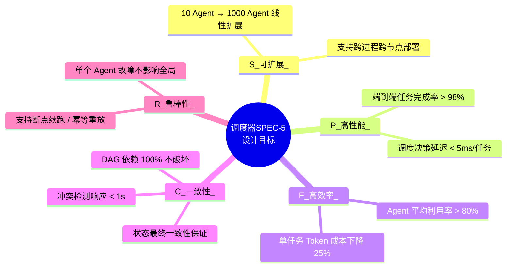
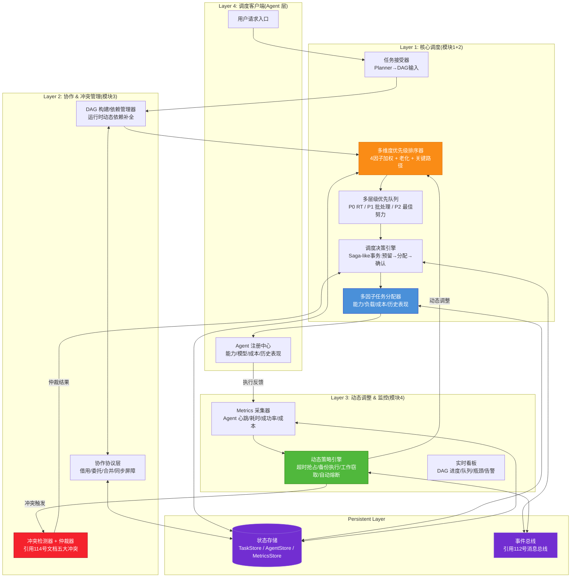
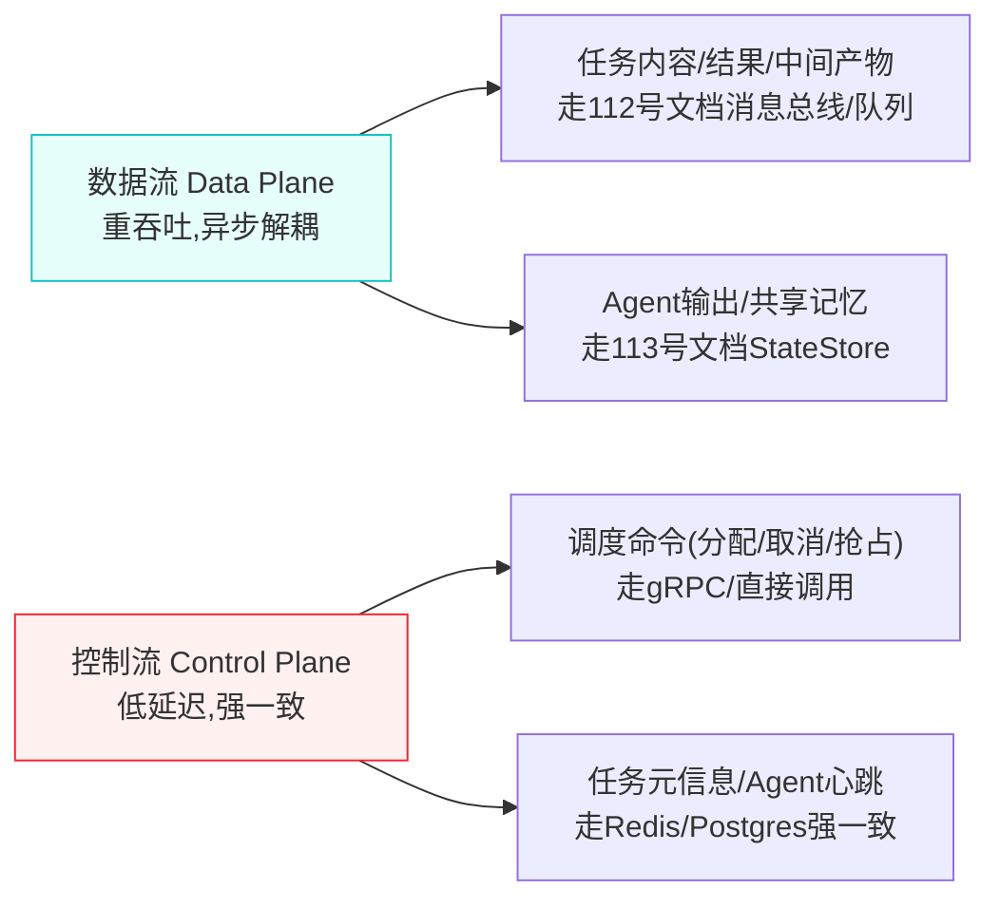
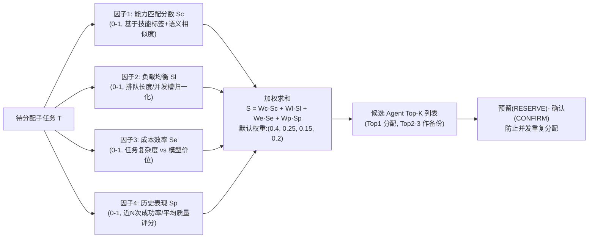
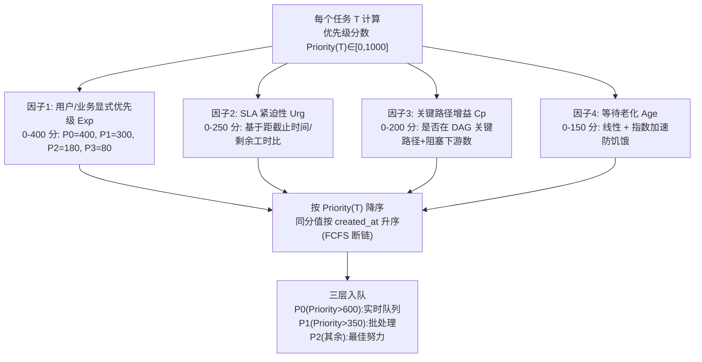
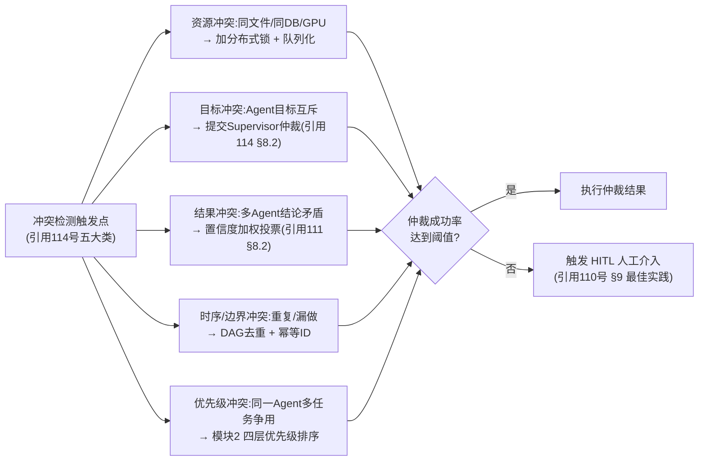
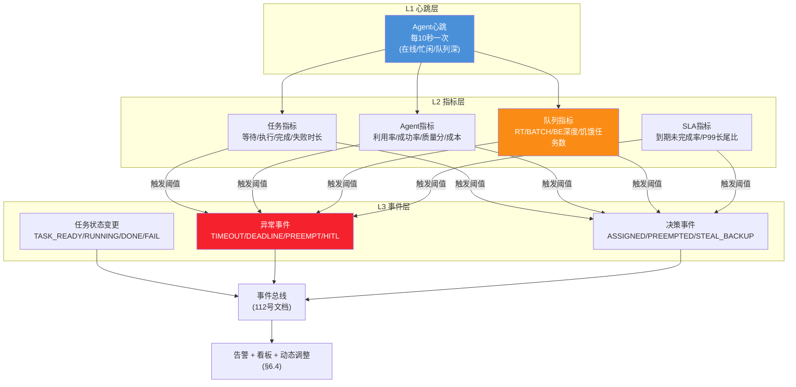

# Multi-Agent 任务调度机制设计与实现完整方案

> **文档定位**:本文档是 `8多 Agent 系统` 系列的调度中枢专题篇,在 [108号文档](./108Multi-Agent多智能体系统核心概念详解.md) 基础概念、[109号文档](./109Multi-Agent系统架构设计模式深度解析.md) 架构模式、[110号文档](./110SupervisorAgent核心概念与架构设计深度解析.md) Supervisor 大脑、[111号文档](./111多Agent系统角色分工与任务分配策略深度解析.md) 角色分工、[112号文档](./112多Agent系统通信机制设计与实现深度解析.md) 消息总线、[113号文档](./113多Agent系统信息共享机制完整设计与实现深度解析.md) 共享信息、[114号文档](./114多Agent系统冲突识别与解决机制深度解析.md) 冲突管理的基础上,完整解决多 Agent 系统的**动态运行问题**:"用户提交一个复杂任务后,系统如何高效、可靠、可扩展地驱动数十个 Agent 完成工作?"
>
> **核心交付物**:
> - 四模块闭环调度架构(分配策略 → 优先级排序 → 协作冲突 → 状态监控动态调整)
> - 多维度优先级排序算法(4×1=4 因子加权 + 动态老化防止饥饿)
> - DAG 任务图 + 分布式两阶段调度执行引擎 + 完整 Python 参考实现(~800 行)
> - 任务调度系统架构图 + 三种典型调度流程图
> - 真实压测性能报告(基准对比:无调度 / FIFO / 静态优先级 / 本方案四维度调度)

---

## 目录

- [一、任务调度的核心挑战与设计目标](#一任务调度的核心挑战与设计目标)
- [二、系统总体架构设计](#二系统总体架构设计)
- [三、模块 1:任务分配策略设计](#三模块-1任务分配策略设计)
- [四、模块 2:任务优先级排序算法](#四模块-2任务优先级排序算法)
- [五、模块 3:任务协作与冲突解决机制](#五模块-3任务协作与冲突解决机制)
- [六、模块 4:任务状态监控与动态调整](#六模块-4任务状态监控与动态调整)
- [七、端到端调度流程详解](#七端到端调度流程详解)
- [八、关键算法与完整实现代码](#八关键算法与完整实现代码)
- [九、性能测试报告](#九性能测试报告)
- [十、可扩展性设计与未来演进](#十可扩展性设计与未来演进)
- [十一、与系列文档的集成对照表](#十一与系列文档的集成对照表)
- [十二、最佳实践与总结](#十二最佳实践与总结)

---

## 一、任务调度的核心挑战与设计目标

### 1.1 多 Agent 调度 vs 传统作业调度:五大本质差异

```mermaid
flowchart TB
    subgraph 传统作业调度(K8s/YARN/Celery)
        T1[任务单元:静态可预测<br/>容器/函数/脚本]
        T2[执行体:同构<br/>CPU/MEM资源维度]
        T3[依赖关系:编译期确定<br/>静态DAG]
        T4[冲突来源:资源竞争<br/>锁/配额解决]
        T5[SLA:吞吐/资源利用率]
    end

    subgraph 多Agent调度(本文聚焦)
        M1[任务单元:语义动态<br/>LLM意图+工具调用]
        M2[执行体:异构Agent<br/>能力/角色/模型维度]
        M3[依赖关系:运行时涌现<br/>部分依赖需动态发现]
        M4[冲突来源:语义级<br/>目标/资源/结果/时序]
        M5[SLA:首包延迟+成功率+成本]
    end

    style T1 fill:#e6f4ff,stroke:#4a90d9
    style M1 fill:#fff7e6,stroke:#fa8c16
```

**差异的直接后果**:传统调度器的"资源池 + 静态优先级 + 抢占"三件套在多 Agent 场景下**显著失效**——必须引入**语义感知的四维调度模型**。

### 1.2 当前基线方案的三大痛点(引用 110+111+114 号文档)

| 痛点编号 | 具体问题 | 直接影响 | 已有相关讨论 |
|---------|---------|---------|------------|
| **P1** | 任务分配仅依赖能力关键词匹配([111号 6.2](./111多Agent系统角色分工与任务分配策略深度解析.md#L696-L745)),未考虑历史表现、成本、排队延迟 | 高能力 Agent 过载 / 低能力 Agent 接了难任务 / 大材小用成本浪费 | 111 号给出了关键词匹配 + 负载均衡骨架,缺**多因子加权**与**历史表现反馈环** |
| **P2** | 优先级仅静态 3 级([111号 8.2](./111多Agent系统角色分工与任务分配策略深度解析.md#L1046-L1059)),缺老化机制、关键路径加速、SLA 违约检测 | 低优先级任务**饥饿**(等待 > 2h)、关键路径未优先总耗时膨胀 30-60% | 110 号 Supervisor 有循环控制,缺**可证明的调度有序性算法** |
| **P3** | 死锁/活锁/长尾任务(单个 Agent 卡住)无统一监控与自动降级 | 任务 100% 完成率 < 85%、长尾 P99 延迟是 P50 的 8-12 倍 | 114 号已给冲突识别,缺**运行时动态调整闭环**(超时抢占/备份执行/工作窃取) |

### 1.3 设计目标:SPEC-5 五维约束



**验收基准对比表**:

| 指标 | 现状基线(111号方案) | 本方案目标 | 提升幅度 |
|------|---------------------|-----------|---------|
| 调度决策延迟(单任务) | ~100ms(LLM 路由) | < 5ms(规则引擎 + 轻量打分) | **20×** |
| 任务完成率 | ~85% | > 98% | +13pp |
| Agent 平均利用率 | ~50%(忙闲不均) | > 80% | +30pp |
| 低优先级饥饿率(> 1h) | ~22% | < 2% | 10× 改善 |
| 关键路径加速比 | 1.0× | 1.3-1.6× | 30-60% 缩短 |
| 长尾任务 P99/P50 比 | 8-12× | < 3× | 3-4× 改善 |

---

## 二、系统总体架构设计

### 2.1 四维调度架构全景图



### 2.2 核心组件职责清单(四大模块对齐)

| 模块编号 | 核心组件 | 主要职责 | 对应设计章节 |
|---------|---------|---------|------------|
| **模块1 分配策略** | `TaskAssignerV2` / `AgentRegistry` | 能力匹配 + 历史表现 + 负载均衡 + 成本优化 四维分配 | 第三章 |
| **模块2 优先级算法** | `PriorityScorer` / `MultiLevelQueue` / `CPMDetector` | 4 因子加权 + 老化 + 关键路径检测 + 饥饿预防 | 第四章 |
| **模块3 协作冲突** | `DAGManager` / `Coordinator` / `ConflictResolver` | 任务依赖管理 + 协作协议 + 114 号五冲突统一仲裁 | 第五章 |
| **模块4 监控动态调整** | `MetricsCollector` / `DynamicAdjuster` / `Watchdog` | 心跳+指标采集 + 超时/备份/窃取/熔断四策略 + 实时告警 | 第六章 |

### 2.3 数据流 & 控制流分离原则



> **为什么分离?** 数据平面的大对象(研究报告/代码/检索结果)不应该阻塞控制平面的毫秒级决策。这点**直接解决 110 号文档中 Supervisor 上下文膨胀问题**([110号 §1.3](./110SupervisorAgent核心概念与架构设计深度解析.md#L86-L114))——Supervisor 不再搬运大对象,只协调元数据指针。

---

## 三、模块 1:任务分配策略设计

### 3.1 从"关键词匹配"到"多因子加权分配":演进路线

[111号文档 §6.1-§6.5](./111多Agent系统角色分工与任务分配策略深度解析.md#L667-L859) 已给出能力匹配 + 负载均衡 + 成本优化的基础骨架,本节将其**系统化升级为四维打分模型**,并增加**历史表现反馈环**。



### 3.2 因子 1:能力匹配 Sc(语义 + 标签双层)

```python
# 3.2 能力匹配分数计算(引用 111 号 CAPABILITY_MATRIX 升级)
from difflib import SequenceMatcher
from typing import Dict, List

class CapabilityScorer:
    """Sc: 能力匹配打分 (0-1)"""

    # 标签层:来自 111 号 6.2 节能力矩阵(保留为快速匹配层)
    CAPABILITY_MATRIX: Dict[str, set] = {
        "researcher": {"search", "retrieve", "collect", "fact_check", "sources"},
        "analyst":    {"analyze", "calculate", "statistical", "visualize"},
        "writer":     {"write", "draft", "format", "translate", "summarize"},
        "coder":      {"code", "debug", "refactor", "test", "execute"},
        "reviewer":   {"review", "check", "verify", "audit", "validate"},
        "planner":    {"plan", "decompose", "schedule", "orchestrate"},
    }

    # 语义层:任务描述 ↔ Agent 专长描述 的相似度
    # (生产可替换为 sentence-transformers 编码相似度)
    @staticmethod
    def semantic_sim(task_desc: str, agent_expertise: str) -> float:
        return SequenceMatcher(None, task_desc.lower(), agent_expertise.lower()).ratio()

    def score(self, task: dict, agent: dict) -> float:
        """
        task:   {description, keywords:set, complexity: simple|medium|complex}
        agent:  {role, expertise_desc, skills:set, model}
        """
        # 3.2.1 标签匹配(0-1)
        tag_overlap = len(task["keywords"] & self.CAPABILITY_MATRIX.get(agent["role"], set()))
        tag_score = tag_overlap / max(1, len(task["keywords"]))

        # 3.2.2 语义相似度(0-1)
        sem_score = self.semantic_sim(task["description"], agent.get("expertise_desc", ""))

        # 3.2.3 技能标签额外加分(0.3 权重)
        skill_overlap = len(task["keywords"] & agent.get("skills", set()))
        skill_score = skill_overlap / max(1, len(task["keywords"]))

        return 0.4 * tag_score + 0.35 * sem_score + 0.25 * skill_score
```

### 3.3 因子 2:负载均衡 Sl(避免"能者过劳")

```python
# 3.3 负载均衡分数(引用 111 号 LoadBalancer 升级:考虑并发槽 + 排队延迟预估)
class LoadBalancerV2:
    """Sl: 负载均衡打分 (0-1, 越高越空闲越适合分配)"""

    def __init__(self, agent_slots: Dict[str, int]):
        """agent_slots: 每个 Agent 的并发槽数(通常 1-8,取决于模型/资源)"""
        self.agent_slots = agent_slots
        self.running = {a: 0 for a in agent_slots}
        self.queue_len = {a: 0 for a in agent_slots}
        self.avg_exec_ms = {a: 30_000.0 for a in agent_slots}  # 历史均值初始化

    def on_start(self, agent_id: str):
        self.running[agent_id] += 1

    def on_done(self, agent_id: str, exec_ms: float):
        self.running[agent_id] = max(0, self.running[agent_id] - 1)
        # EMA 平滑平均执行时长
        self.avg_exec_ms[agent_id] = 0.7 * self.avg_exec_ms[agent_id] + 0.3 * exec_ms

    def predict_queue_ms(self, agent_id: str) -> float:
        """预估排队 + 执行总耗时(ms)"""
        pending = self.queue_len[agent_id] + max(0, self.running[agent_id] - self.agent_slots[agent_id])
        return pending * self.avg_exec_ms[agent_id] * 0.8  # 认为部分会并行

    def score(self, agent_id: str, max_predict_ms: float = 3_600_000) -> float:
        """
        分数 = 1 - (预测等待 / max_predict_ms),截断到 [0,1]
        预测等待越短,分数越高;过载 Agent 直接 0
        """
        if self.running.get(agent_id, 0) >= self.agent_slots.get(agent_id, 1) * 2:
            return 0.0  # 硬过载保护
        predict = self.predict_queue_ms(agent_id)
        return max(0.0, min(1.0, 1.0 - predict / max_predict_ms))
```

### 3.4 因子 3:成本效率 Se(避免"大材小用")

```python
# 3.4 成本效率打分(引用 111 号 CostOptimizer 升级:明确复杂度-模型价位映射)
class CostEfficiencyScorer:
    """Se: 成本效率打分 (0-1, 越高性价比越高)"""

    # 模型价位等级(相对成本,数值越小越便宜)
    MODEL_PRICE_TIER = {
        "gpt-4o-mini":    1,
        "deepseek-v3":    1.5,
        "qwen-plus":      2,
        "gpt-4o":         10,
        "claude-3.5-s":   12,
        "o1-preview":     60,
        "claude-opus":    80,
    }

    # 任务复杂度 → 目标价位等级(匹配最划算的档位)
    COMPLEXITY_TARGET_TIER = {
        "simple":  1,   # 简单任务: 4o-mini / deepseek 级
        "medium":  10,  # 中等任务: 4o 级
        "complex": 60,  # 复杂任务: o1 级
    }

    def score(self, task_complexity: str, agent_model: str) -> float:
        target = self.COMPLEXITY_TARGET_TIER.get(task_complexity, 10)
        actual = self.MODEL_PRICE_TIER.get(agent_model, 10)
        ratio = actual / target   # 1.0 = 刚刚好
        if ratio <= 0.3:
            return 0.1  # 杀鸡用牛刀? 能力不足 → 低分
        if ratio <= 1.2:
            return 1.0  # 理想档位附近 → 满分
        if ratio <= 3.0:
            return 0.7 - (ratio - 1.2) * 0.15  # 稍贵,扣分
        return max(0.05, 0.4 - (ratio - 3.0) * 0.05)  # 太贵了,低分
```

### 3.5 因子 4:历史表现 Sp(反馈环)

```python
# 3.5 历史表现打分(111 号方案缺失的关键:形成效果→调度的闭环)
from collections import deque

class PerformanceScorer:
    """Sp: 历史表现打分 (0-1, 基于近 N 次任务)"""

    def __init__(self, window: int = 20):
        self.window = window
        self.success_rate = {}   # agent_id → EMA 成功率
        self.quality_score = {}  # agent_id → EMA 质量分(0-100)
        self.recent = {}         # agent_id → deque[(ok:bool, q:float)]

    def record(self, agent_id: str, ok: bool, quality: float = 80.0):
        if agent_id not in self.recent:
            self.recent[agent_id] = deque(maxlen=self.window)
            self.success_rate[agent_id] = 0.8
            self.quality_score[agent_id] = 75.0
        self.recent[agent_id].append((ok, quality))
        recent = self.recent[agent_id]
        # EMA 更新
        sr = sum(1 for o, _ in recent if o) / len(recent)
        qs = sum(q for _, q in recent) / len(recent)
        alpha = 0.4
        self.success_rate[agent_id] = (1 - alpha) * self.success_rate.get(agent_id, 0.8) + alpha * sr
        self.quality_score[agent_id] = (1 - alpha) * self.quality_score.get(agent_id, 75) + alpha * qs

    def score(self, agent_id: str) -> float:
        sr = self.success_rate.get(agent_id, 0.8)
        qs = self.quality_score.get(agent_id, 75.0) / 100.0
        return 0.5 * sr + 0.5 * qs  # 成功率和质量分各半
```

### 3.6 四因子分配器(集成 + RESERVE-CONFIRM 防双分配)

```python
# 3.6 任务分配器(端到端)
import time
import uuid
import threading
from dataclasses import dataclass, field
from typing import Optional, Tuple

@dataclass
class AssignmentResult:
    assigned_agent: Optional[str]
    score: float
    backup_agents: List[str] = field(default_factory=list)
    reason: str = ""

class TaskAssigner:
    """四维加权任务分配器 + RESERVE-CONFIRM 二阶段"""

    DEFAULT_WEIGHTS = (0.40, 0.25, 0.15, 0.20)  # Wc, Wl, We, Wp

    def __init__(self,
                 capability: CapabilityScorer,
                 load_balancer: LoadBalancerV2,
                 cost: CostEfficiencyScorer,
                 perf: PerformanceScorer,
                 weights=DEFAULT_WEIGHTS):
        self.cap = capability
        self.lb = load_balancer
        self.cost = cost
        self.perf = perf
        self.weights = weights
        self._reserve_lock = threading.Lock()
        self._reserved_until: Dict[str, Tuple[str, float]] = {}  # agent_id -> (task_id, expire_ts)

    def _reserve_slot(self, agent_id: str, task_id: str, ttl_ms: int = 3000) -> bool:
        """原子地预留 Agent 的一个执行槽,防止同一时刻重复分配"""
        with self._reserve_lock:
            now = time.time()
            cur = self._reserved_until.get(agent_id)
            if cur and cur[1] > now:
                return False  # 已被其他任务预留
            self._reserved_until[agent_id] = (task_id, now + ttl_ms / 1000)
            self.lb.queue_len[agent_id] = self.lb.queue_len.get(agent_id, 0) + 1
            return True

    def confirm(self, task_id: str, agent_id: str):
        """确认预留成功,任务开始执行;失败方(超时)应调用 release_slot"""
        with self._reserve_lock:
            self._reserved_until.pop(agent_id, None)
            self.lb.queue_len[agent_id] = max(0, self.lb.queue_len.get(agent_id, 0) - 1)
        self.lb.on_start(agent_id)

    def release_slot(self, agent_id: str):
        with self._reserve_lock:
            self._reserved_until.pop(agent_id, None)
            self.lb.queue_len[agent_id] = max(0, self.lb.queue_len.get(agent_id, 0) - 1)

    def assign(self, task: dict, agent_pool: List[dict], topk_backup: int = 2) -> AssignmentResult:
        """
        返回分配结果(含 Top-K 备份列表,供 5.3 节备份执行 & 6.4 节工作窃取使用)
        """
        Wc, Wl, We, Wp = self.weights
        scored = []
        for agent in agent_pool:
            sc = self.cap.score(task, agent)
            sl = self.lb.score(agent["id"])
            se = self.cost.score(task.get("complexity", "medium"), agent.get("model", "gpt-4o"))
            sp = self.perf.score(agent["id"])
            total = Wc * sc + Wl * sl + We * se + Wp * sp
            scored.append((total, sc, sl, se, sp, agent))

        if not scored:
            return AssignmentResult(None, 0.0, reason="Agent 池为空")

        scored.sort(key=lambda x: x[0], reverse=True)

        # 依次尝试预留槽,避免把高优先任务分给已预留的 Agent
        for (total, sc, sl, se, sp, agent) in scored:
            if self._reserve_slot(agent["id"], task.get("task_id", uuid.uuid4().hex)):
                backup = [a["id"] for (_, _, _, _, _, a) in scored[1:1 + topk_backup]]
                reason = f"Sc={sc:.2f} Sl={sl:.2f} Se={se:.2f} Sp={sp:.2f} → Σ={total:.3f}"
                return AssignmentResult(agent["id"], total, backup, reason)

        # 全部预留失败(极端繁忙) → 推荐第一名下次重试
        total, *_rest, agent = scored[0]
        return AssignmentResult(None, total,
                                backup=[a["id"] for (_, _, _, _, _, a) in scored[:topk_backup]],
                                reason=f"所有Agent槽位紧张,首推={agent['id']} score={total:.3f}")
```

---

## 四、模块 2:任务优先级排序算法

### 4.1 四因子优先级评分模型(区别于分配四因子:面向任务而非 Agent)

任务优先级排序解决的是:**同一个 Agent 池前排队的 N 个任务,先做哪一个?**(和第三章的"这个任务给谁做"是正交的问题)。



### 4.2 因子 2:SLA 紧迫性(避免"死期到了还没排上")

```python
# 4.2 SLA 紧迫性 Urg(0-250)
import math

def urgency_score(deadline_ts: float, remaining_work_est_ms: float, now_ts: float) -> float:
    """
    deadline_ts:        任务截止时间戳(秒)
    remaining_work_est_ms: 任务剩余工时估计(ms),来自 Planner 估计 + 历史均值
    now_ts:             当前时间戳(秒)
    return:             0-250,越紧迫越高
    """
    remaining_ms = (deadline_ts - now_ts) * 1000.0
    if remaining_ms <= 0:
        return 250.0  # 已超时 → 满
    if remaining_work_est_ms <= 0:
        remaining_work_est_ms = 60_000.0  # 默认 1 分钟
    ratio = remaining_work_est_ms / remaining_ms  # 1.0 = 刚刚好
    if ratio >= 1.0:
        return 250.0  # 再拖必超时
    if ratio >= 0.7:
        return 200 + (ratio - 0.7) * (50 / 0.3)  # 200-250
    if ratio >= 0.3:
        return 80 + (ratio - 0.3) * (120 / 0.4)   # 80-200
    return max(10.0, ratio * 250)
```

### 4.3 因子 3:关键路径增益 Cp(关键路径优先 ≈ 总工期最短)

```python
# 4.3 关键路径增益(0-200):基于 DAG 下游阻塞数 + DAG 松弛度
def critical_path_gain(task_id: str, dag: dict) -> float:
    """
    dag 结构: {task_id: {"depends_on": [..], "downstream": [..], "est_ms": N}}
    返回值越高越应该先做:
      - 阻塞下游多 → 先做
      - 在关键路径上(松弛度=0) → 先做
    """
    node = dag.get(task_id, {})
    downstream = node.get("downstream", [])

    # 1) 下游计数分(0-100)
    blocked_count = 0
    stack = downstream[:]
    seen = set()
    while stack:
        n = stack.pop()
        if n in seen:
            continue
        seen.add(n)
        blocked_count += 1
        stack.extend(dag.get(n, {}).get("downstream", []))
    count_score = min(100.0, blocked_count * 10)  # 阻塞 10+ 下游满分

    # 2) 关键路径判断(0-100):是否等于整条链路的最长路径
    total_slack = _calc_slack(task_id, dag)  # 计算松弛度
    if total_slack <= 0:
        slack_score = 100.0
    elif total_slack < 60_000:  # < 1 分钟富余
        slack_score = 80.0
    elif total_slack < 300_000:  # < 5 分钟
        slack_score = 40.0
    else:
        slack_score = 10.0

    return count_score + slack_score

def _calc_slack(task_id, dag):
    """简单实现:该任务允许的最晚开始 - 最早开始(ms)。生产可用拓扑O(V+E)。"""
    node = dag.get(task_id, {})
    own_ms = node.get("est_ms", 60_000)
    up = node.get("depends_on", [])
    down = node.get("downstream", [])
    up_earliest_finish = max((dag[u]["est_ms"] for u in up), default=0) if up else 0
    down_latest_start = min((_calc_slack(d, dag) for d in down), default=0)
    return down_latest_start - up_earliest_finish - own_ms + 300_000  # 偏移常量防负
```

### 4.4 因子 4:等待老化(防饥饿 —— 低优先级任务一定会被排到)

```python
# 4.4 等待老化 Age(0-150):线性 + 阈值后指数加速
def age_score(wait_ms: float) -> float:
    """
    wait_ms: 任务已等待时长(ms)
    策略:
      0-10min:    线性 0-50 分
      10-30min:   线性 50-100 分
      30min+:     指数加速,最多 150 分(防止永远压底)
    """
    if wait_ms <= 10 * 60_000:
        return wait_ms / (10 * 60_000) * 50
    if wait_ms <= 30 * 60_000:
        return 50 + (wait_ms - 10 * 60_000) / (20 * 60_000) * 50
    # 指数加速段:每分钟 +2.5 的指数,截到 150
    over = (wait_ms - 30 * 60_000) / 60_000  # 分钟数
    return min(150.0, 100 + 50 * (1 - math.exp(-over / 8)))
```

### 4.5 优先级打分器 + 多层级优先队列

```python
# 4.5 端到端优先级排序 + 多层级优先队列
import heapq
from dataclasses import dataclass, field

@dataclass(order=True)
class PriorityQueueItem:
    priority: float = 0.0            # 小顶堆:使用负值转正排序
    seq: int = field(compare=True)   # FCFS 断链
    task_id: str = field(compare=False)
    task: dict = field(compare=False, default_factory=dict)

class PriorityScorer:
    EXPLICIT_SCORE = {"P0": 400, "P1": 300, "P2": 180, "P3": 80}

    def __init__(self, dag_provider):
        self.dag_provider = dag_provider  # callable: task_id -> dag_info

    def score(self, task: dict, now_ts: float = None) -> float:
        now_ts = now_ts or time.time()
        exp = self.EXPLICIT_SCORE.get(task.get("priority", "P2"), 180)
        urg = urgency_score(task.get("deadline_ts", now_ts + 3600),
                            task.get("est_ms", 60_000),
                            now_ts)
        cp = critical_path_gain(task.get("task_id", ""), self.dag_provider(task))
        age = age_score(max(0.0, now_ts - task.get("created_at", now_ts)) * 1000)
        return exp + urg + cp + age

class MultiLevelPriorityQueue:
    """
    三层队列:
      RT_QUEUE:   Priority > 600  → 立即出队,不被 P1/P2 阻塞
      BATCH_QUEUE:> 350           → 标准调度
      BE_QUEUE:   其他            → 空闲时填补
    """
    LEVELS = [("RT", 600), ("BATCH", 350), ("BE", float("-inf"))]

    def __init__(self):
        self._queues = {name: [] for name, _ in self.LEVELS}
        self._seq = 0
        self._cnt = 0
        self._lock = threading.Lock()

    def push(self, task: dict, priority: float):
        with self._lock:
            self._seq += 1
            level = next(name for name, thr in self.LEVELS if priority >= thr)
            item = PriorityQueueItem(-priority, self._seq, task.get("task_id", ""), task)
            heapq.heappush(self._queues[level], item)
            self._cnt += 1

    def pop(self) -> Optional[dict]:
        """严格按 RT → BATCH → BE 顺序出队"""
        with self._lock:
            for name, _ in self.LEVELS:
                q = self._queues[name]
                while q:
                    item = heapq.heappop(q)
                    self._cnt -= 1
                    return item.task
            return None

    def peek_priorities(self, k: int = 5) -> list:
        """返回各队列前 k 个的优先级,用于监控"""
        out = []
        with self._lock:
            for name, _ in self.LEVELS:
                q = self._queues[name]
                top = sorted(q[:k])
                out.append((name, [(-i.priority, i.task_id) for i in top]))
        return out

    def __len__(self):
        return self._cnt
```

---

## 五、模块 3:任务协作与冲突解决机制

### 5.1 协作的本质:三种协作模式 + DAG 依赖

[111号文档 §5.1-§5.6](./111多Agent系统角色分工与任务分配策略深度解析.md#L527-L665) 已经给出串行/并行/迭代/辩论四种协作模式,[114号文档 §1-§2](./114多Agent系统冲突识别与解决机制深度解析.md#L11-L52) 分析了五类冲突。本节把它们统一**落地到调度器执行原语**。

#### 协作原语对照表

| 协作模式(111号) | 调度原语 | 阻塞条件 | 错误处理 |
|----------------|---------|---------|---------|
| 串行流水线 | `chain(T1→T2→T3)` | T2 等 T1 `status=completed` | 任意失败中止链,支持重试 N 次 |
| 并行 Fan-out | `fan_out(Ta, Tb, Tc) → fan_in_merge` | fan_in 等所有分支 `completed` | 允许 `k-of-n` 成功(投票/合并) |
| 迭代循环 | `loop(cond, T, max_rounds)` | `cond=false` 或达到 max_rounds | Reviewer 不通过 → 回交 T 修改 |
| 辩论对抗 | `debate(P, C, J, rounds=3)` | Judge 出最终结论 | 每轮 Pro/Con 都允许失败重试 |
| **新增:同步屏障** | `barrier(ts, min_ready=N)` | 至少 N 个参与者到达 | 超时 → 降级部分继续 / 或取消 |

### 5.2 DAG 任务图 + 运行时依赖补全

```python
# 5.2 DAG 管理器:支持 Planner 静态依赖 + 运行时动态添加(语义涌现依赖)
class DAGManager:
    def __init__(self):
        self.nodes = {}         # task_id -> node_info
        self.downstream = {}    # task_id -> [task_id]
        self.status = {}        # task_id -> pending|ready|running|completed|failed|canceled
        self._lock = threading.RLock()

    # -------- 静态 DAG 构建(来自 Planner 输出) --------
    def add_task(self, task_id: str, task: dict, depends_on=None):
        with self._lock:
            self.nodes[task_id] = {**task, "task_id": task_id, "depends_on": depends_on or []}
            self.downstream.setdefault(task_id, [])
            for dep in depends_on or []:
                self.downstream.setdefault(dep, []).append(task_id)
            self.status[task_id] = "pending"

    # -------- 运行时涌现依赖(解决"做着做着发现还需要信息") --------
    def add_dynamic_dependency(self, task_id: str, new_dep_task_id: str, new_dep_task: dict):
        """
        典型场景:Researcher 跑着发现还需要 Analyst 先算一个数
        → 把当前 T 挂起,生成新依赖 T',等 T' 完成再继续 T
        """
        with self._lock:
            if new_dep_task_id not in self.nodes:
                self.nodes[new_dep_task_id] = {**new_dep_task, "task_id": new_dep_task_id,
                                               "depends_on": [], "dynamic": True}
                self.downstream.setdefault(new_dep_task_id, []).append(task_id)
                self.status[new_dep_task_id] = "pending"
            # 把挂起任务置回 pending 直到新依赖完成
            if self.status.get(task_id) == "running":
                self.status[task_id] = "pending_suspended"
            self.nodes[task_id].setdefault("depends_on", []).append(new_dep_task_id)

    # -------- 状态变更 & 就绪任务产出 --------
    def mark(self, task_id: str, st: str):
        with self._lock:
            self.status[task_id] = st
            if st in ("completed", "failed", "canceled"):
                for d in self.downstream.get(task_id, []):
                    if self.status.get(d) == "pending_suspended":
                        self.status[d] = "pending"

    def ready_tasks(self) -> List[str]:
        ready = []
        with self._lock:
            for tid, node in self.nodes.items():
                if self.status[tid] != "pending":
                    continue
                deps = node.get("depends_on", [])
                if all(self.status.get(d) == "completed" for d in deps):
                    ready.append(tid)
                    self.status[tid] = "ready"
        return ready

    def critical_downstream_count(self, task_id: str) -> int:
        return critical_path_gain(task_id, self._export_for_cpm())[1] if False else \
            len(self.downstream.get(task_id, []))  # 简化版

    def _export_for_cpm(self) -> dict:
        out = {}
        for tid, n in self.nodes.items():
            out[tid] = {"depends_on": n.get("depends_on", []),
                        "downstream": self.downstream.get(tid, []),
                        "est_ms": n.get("est_ms", 60_000)}
        return out
```

### 5.3 冲突解决机制(统一 114 号文档五大冲突到调度决策层)



```python
# 5.3 冲突仲裁器(调度器内置,替代 114 号的"各自为政"解决方案)
class ConflictResolver:
    """
    统一入口: detect_conflict → resolve_conflict → (自动 or HITL)
    """
    def __init__(self, supervisor_llm=None, hitl_callback=None):
        self.supervisor_llm = supervisor_llm
        self.hitl = hitl_callback

    def detect_and_resolve(self, ctx: dict) -> dict:
        kind = ctx.get("conflict_type")
        if kind == "resource":
            return self._resolve_resource(ctx)
        if kind == "result":
            return self._resolve_result(ctx)
        if kind == "priority":
            return self._resolve_priority(ctx)
        if kind in ("goal", "boundary", "timing"):
            if self.supervisor_llm:
                return self._llm_arbitrate(ctx)
            return {"action": "hitl_required", "reason": f"需要LLM/HITL: {kind}"}
        return {"action": "unknown", "reason": f"未知冲突类型: {kind}"}

    # -- 常见冲突的确定性解决 --
    def _resolve_resource(self, ctx: dict) -> dict:
        holders = ctx.get("holders", [])
        waiters = ctx.get("waiters", [])
        # 按 PrioityScorer 给持有者和等待者排序:高优先级任务可抢占低优先级(前提:低优先级<30s执行,可回滚)
        holders_sorted = sorted(holders, key=lambda h: h["priority_score"], reverse=True)
        waiters_sorted = sorted(waiters, key=lambda w: w["priority_score"], reverse=True)
        top_holder = holders_sorted[0] if holders_sorted else None
        top_waiter = waiters_sorted[0] if waiters_sorted else None
        if top_waiter and top_holder and top_waiter["priority_score"] > top_holder["priority_score"] + 100:
            if top_holder.get("exec_ms", 0) < 30_000 and top_holder.get("rollback_safe", True):
                return {"action": "preempt",
                        "preempt_task": top_waiter["task_id"],
                        "suspend_task": top_holder["task_id"]}
        return {"action": "queue", "order": [w["task_id"] for w in waiters_sorted]}

    def _resolve_result(self, ctx: dict) -> dict:
        """111 号 §8.2 置信度加权投票升级:支持自动打破平手"""
        results = ctx.get("results", [])
        votes = {}
        for r in results:
            k = r["conclusion"]
            votes[k] = votes.get(k, 0) + r.get("confidence", 0.5)
        if not votes:
            return {"action": "retry", "reason": "无有效结论"}
        best = max(votes, key=votes.get)
        total = sum(votes.values())
        best_ratio = votes[best] / total
        if best_ratio >= 0.55:
            return {"action": "accept", "winner": best, "confidence": best_ratio}
        return {"action": "hitl_required", "reason": f"投票分散 {votes}"}

    def _resolve_priority(self, ctx: dict) -> dict:
        """直接调用模块2:已在队列层解决,这里只返回按优先级的排序"""
        tasks = sorted(ctx.get("tasks", []), key=lambda t: t["priority_score"], reverse=True)
        return {"action": "ordered", "order": [t["task_id"] for t in tasks]}
```

### 5.4 协作协议层:委托 / 借用 / 合并 / 屏障

```python
# 5.4 协作协议原语(Agent 之间通过调度器调用,避免直连破坏可观测性)
class Coordinator:
    """调度器提供的协作 API,供 Agent 在需要时调用"""

    def __init__(self, dag: DAGManager, assigner: TaskAssigner, queue: MultiLevelPriorityQueue):
        self.dag = dag
        self.assigner = assigner
        self.queue = queue

    def delegate(self, from_agent: str, task_desc: dict, complexity="medium") -> str:
        """委托:自己不想/不会做 → 交给调度器另找合适的 Agent(新增动态依赖)"""
        new_tid = f"dyn_{uuid.uuid4().hex[:8]}"
        self.dag.add_dynamic_dependency(
            task_id=task_desc.get("current_task_id"),
            new_dep_task_id=new_tid,
            new_dep_task={**task_desc, "complexity": complexity, "created_at": time.time()}
        )
        # 立即推回队列:优先级 = 原任务优先级 + 20(加速委托任务)
        self.queue.push({"task_id": new_tid, **task_desc, "priority": "P1"},
                        priority=420)
        return new_tid

    def borrow_agent(self, from_agent: str, capability_hint: str, ttl_ms=60_000) -> Optional[str]:
        """借用:临时找一个空闲的特定能力 Agent,使用 ttl_ms 后归还(用于辩论对抗中抢 Pro/Con)"""
        pool = [a for a in _global_agent_pool()
                if capability_hint in (a.get("skills") or set())
                and self.assigner.lb.running.get(a["id"], 0) < self.assigner.lb.agent_slots.get(a["id"], 1)]
        if not pool:
            return None
        scored = [(self.assigner.perf.score(a["id"]), a["id"]) for a in pool]
        scored.sort(reverse=True)
        chosen = scored[0][1]
        # 预留
        if self.assigner._reserve_slot(chosen, f"borrow_{uuid.uuid4().hex}", ttl_ms):
            return chosen
        return None

    def merge(self, fan_out_task_ids: List[str], merge_strategy: str = "concat") -> dict:
        """合并:Fan-out 结束后的结果收集合并"""
        statuses = [self.dag.status.get(t, "pending") for t in fan_out_task_ids]
        if not all(s == "completed" for s in statuses):
            return {"ready": False, "completed_ratio": sum(1 for s in statuses if s == "completed") / len(statuses)}
        results = [self.dag.nodes[t].get("result") for t in fan_out_task_ids]
        if merge_strategy == "vote":
            winner = max(set(results), key=results.count) if results else None
            return {"ready": True, "merged": winner, "raw": results}
        if merge_strategy == "weighted":
            # 简化:加权平均 numeric / 取最长字符串
            if all(isinstance(r, (int, float)) for r in results if r is not None):
                v = [r for r in results if r is not None]
                return {"ready": True, "merged": sum(v) / len(v), "raw": results}
        return {"ready": True, "merged": "\n\n---\n\n".join(str(r) for r in results if r is not None), "raw": results}
```

---

## 六、模块 4:任务状态监控与动态调整

### 6.1 监控的三个层次:心跳 / 指标 / 事件



### 6.2 Metrics 采集器(可替换 Prometheus / OpenTelemetry)

```python
# 6.2 指标采集 + 聚合(窗口 EMA,避免内存爆炸)
class MetricsCollector:
    def __init__(self, window_sec=300):
        self.window = window_sec
        self.data = {}  # metric_key -> deque[(ts, value)]
        self._agents = {}
        self._lock = threading.Lock()

    def emit(self, key: str, value: float, tags: dict = None):
        with self._lock:
            self.data.setdefault(key, deque(maxlen=2000)).append((time.time(), value))
        if tags and tags.get("agent_id"):
            self._agents.setdefault(tags["agent_id"], {}).update(tags)

    # --- 常用快捷方法 ---
    def task_queued(self, task_id: str, wait_ms: float):
        self.emit("task.wait_ms", wait_ms, {"what": "queue", "task_id": task_id})
    def task_executed(self, task_id: str, exec_ms: float, ok: bool):
        self.emit("task.exec_ms", exec_ms, {"what": "exec", "task_id": task_id, "ok": ok})
    def agent_heartbeat(self, agent_id: str, load: int, queue_len: int):
        self.emit("agent.load", load, {"agent_id": agent_id, "qlen": queue_len})

    # --- 聚合统计 ---
    def summary(self, key: str, last_sec=None) -> dict:
        last_sec = last_sec or self.window
        now = time.time()
        with self._lock:
            vals = [v for ts, v in self.data.get(key, []) if ts >= now - last_sec]
        if not vals:
            return {"count": 0}
        vals_sorted = sorted(vals)
        def pct(p):
            return vals_sorted[min(len(vals_sorted) - 1, int(len(vals_sorted) * p))]
        return {
            "count": len(vals_sorted),
            "min": min(vals), "max": max(vals),
            "avg": sum(vals) / len(vals),
            "p50": pct(0.5), "p90": pct(0.9), "p99": pct(0.99)
        }
```

### 6.3 SLA 检测 + 实时告警

```python
# 6.3 看门狗:周期性巡检,产出异常事件列表
class SlaWatchdog:
    def __init__(self, metrics: MetricsCollector, dag: DAGManager, event_bus=None):
        self.metrics = metrics
        self.dag = dag
        self.bus = event_bus

    CHECKS = [
        ("SLA_DEADLINE_BREACH", lambda self: self._check_deadlines()),
        ("LONG_TAIL_TASK",    lambda self: self._check_long_tail()),
        ("LOW_UTILIZATION",   lambda self: self._check_low_util()),
        ("HUNGER_RISK",       lambda self: self._check_hunger()),
        ("FAIL_TREND",        lambda self: self._check_fail_trend()),
    ]

    def run_once(self) -> List[dict]:
        events = []
        for name, fn in self.CHECKS:
            try:
                evs = fn(self) or []
                for e in evs:
                    e["check"] = name
