# 代码 Agent 系统完整工程设计方案:架构·模块·选型·接口·安全·学习·集成·测试

> **文档定位**:本文档是 `9AI Agent 工程实践` 系列的**代码 Agent 专题篇**。面向 AI 应用工程师、架构师与研发效能团队,系统阐述一个**功能完善、可扩展、可工程落地**的代码 Agent 系统的完整工程设计,覆盖代码分析、代码生成、错误修复、文档生成、代码审查、重构建议六大核心能力,支持 Python / Java / Go / TypeScript / JavaScript / Rust 六种主流语言,深度集成 IDE、CI/CD、代码托管三大开发环境。
>
> 本文提供**从架构到代码、从模型选型到接口契约、从安全沙箱到测试方案**的端到端工程蓝图,所有设计方案均配套技术选型依据、数据模型、接口定义和可执行代码示例,确保工程团队可直接据此启动开发。
>
> **关联文档**(建议一并阅读):
> - [118企业知识库Agent系统完整工程设计方案.md](./118企业知识库Agent系统完整工程设计方案_架构数据流模型选型接口安全开发计划与测试.md) — 同系列工程实践首篇
> - [../3Agent 架构设计/36企业级Agent系统完整设计方案.md](../3Agent%20架构设计/36企业级Agent系统完整设计方案.md) — Agent 整体架构
> - [../7Tool Calling 工具调用/85工具调用工程化实践.md](../7Tool%20Calling%20工具调用/85工具调用工程化实践.md) — Tool Calling 体系
> - [../13项目经验/154Agent自主学习功能设计与实现完整方案.md](../13项目经验/154Agent自主学习功能设计与实现完整方案.md) — Agent 自主学习
> - [../13项目经验/158Agent项目模型调用成本控制完整方案.md](../13项目经验/158Agent项目模型调用成本控制完整方案_诊断8大策略成本网关预算预警闭环.md) — 成本治理

---

## 目录

- [一、系统概述与设计目标](#一系统概述与设计目标)
- [二、系统总体架构设计](#二系统总体架构设计)
- [三、核心功能模块设计](#三核心功能模块设计)
- [四、技术选型决策](#四技术选型决策)
- [五、接口设计](#五接口设计)
- [六、数据流程设计](#六数据流程设计)
- [七、Agent 学习能力设计](#七agent-学习能力设计)
- [八、与开发环境的集成](#八与开发环境的集成)
- [九、安全策略](#九安全策略)
- [十、性能优化策略](#十性能优化策略)
- [十一、实现步骤与关键技术难点](#十一实现步骤与关键技术难点)
- [十二、测试计划](#十二测试计划)

---

## 一、系统概述与设计目标

### 1.1 业务背景与核心痛点

研发团队在日常开发中面临六大核心痛点,代码 Agent 的存在价值即对应解决这六大痛点:

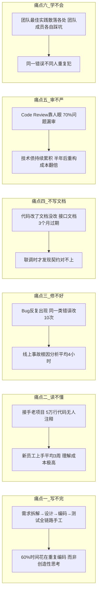

### 1.2 系统设计目标(量化指标)

| 维度 | 指标 | 基线(人工) | 目标(Agent) | 改善幅度 |
|-----|------|:---------:|:----------:|:-------:|
| **编码效率** | 单功能开发耗时 | 8h | ≤3h | ↓62% |
| **代码质量** | 千行 Bug 率 | 4.2 | ≤1.5 | ↓64% |
| **修复速度** | Bug 平均修复耗时 | 4h | ≤30min | ↓87% |
| **理解效率** | 接手新项目上手时间 | 3 周 | ≤3 天 | ↓86% |
| **文档覆盖** | API 文档覆盖率 | 35% | ≥95% | ↑171% |
| **Review 质量** | 问题检出率 | 30% | ≥85% | ↑183% |
| **响应延迟** | 单次代码补全首 Token | — | ≤300ms | — |
| **响应延迟** | 单次代码生成 P99 | — | ≤5s | — |
| **响应延迟** | Bug 修复方案生成 P99 | — | ≤15s | — |

### 1.3 系统六大核心能力全景

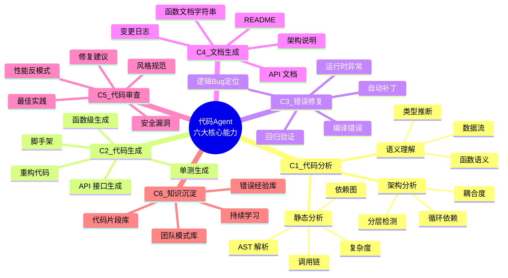

### 1.4 设计原则(8 条约束)

| 原则 | 内容 | 防止出现什么 |
|-----|------|-------------|
| **P1 代码确定性优先** | 生成的代码必须可执行、可测试、可验证;不生成"看起来对"的伪代码 | 幻觉代码上线导致事故 |
| **P2 上下文充分性** | 每次生成前必须构建完整上下文(AST+依赖+约定+历史),不打无准备之仗 | 生成与项目风格不一致的代码 |
| **P3 增量可逆** | 所有代码改动以 diff/patch 形式输出,支持一键回滚 | 大段重写毁掉原有代码 |
| **P4 沙箱隔离** | Agent 执行/编译/测试全部在沙箱,生产代码只读访问 | Agent 误操作污染代码库 |
| **P5 人审闭环** | 所有"写入代码库"动作必须经人审 PR,Agent 不直接 commit | Agent 自作主张引入 Bug |
| **P6 多语言抽象** | 语言相关逻辑用 Language Plugin 抽象,核心引擎语言无关 | 每加一种语言重写一遍 |
| **P7 可观测** | 每次生成/修复全链路 trace,可回溯为何这样生成 | 出错找不到根因 |
| **P8 成本可控** | 大模型调用走成本网关,小模型优先,缓存复用 | 月底账单爆炸 |

---

## 二、系统总体架构设计

### 2.1 八层架构总览

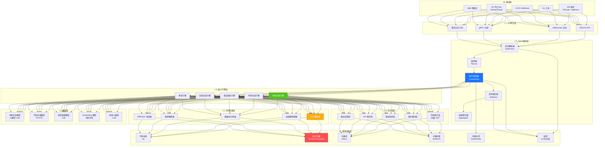

### 2.2 各层职责说明

| 层级 | 层名 | 核心职责 | 关键技术 |
|-----|------|---------|---------|
| **L1** | 基础设施层 | 代码存储、沙箱执行、向量检索、对象存储、消息队列 | Git, Docker, Milvus, MinIO, Redis |
| **L2** | 模型层 | 多尺寸代码模型协同(补全/生成/推理/Embedding/审查) | Qwen-Coder, DeepSeek-Coder, CodeLlama |
| **L3** | 知识库层 | 代码语义索引、团队模式、错误经验、API 契约、最佳实践 | Milvus + Postgres + Redis |
| **L4** | 代码处理层 | AST 解析、依赖图、数据流、类型推断、Diff 生成 | Tree-sitter, Semgrep, LSP |
| **L5** | 能力引擎层 | 六大核心能力的业务逻辑实现 | 引擎模式 + 策略模式 |
| **L6** | Agent 编排层 | 任务解析→规划→执行→反思→聚合的完整 ReAct 循环 | ReAct, Plan-Execute, Reflection |
| **L7** | API 网关层 | 对外统一 API,支持 REST/WebSocket/gRPC/SSE | FastAPI, gRPC |
| **L8** | 集成层 | 五大开发环境入口 | LSP, Webhook, Bot |

### 2.3 核心组件交互时序(以"修复 Bug"为例)

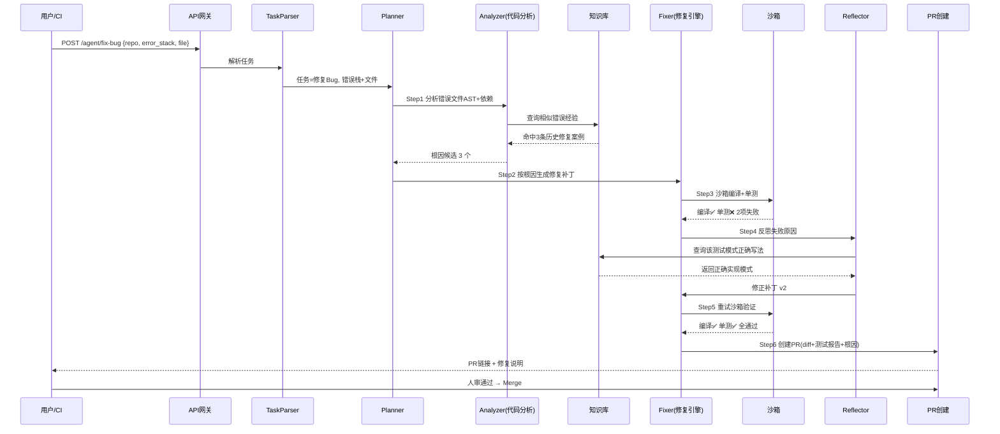

---

## 三、核心功能模块设计

### 3.1 模块划分总览(七大模块)

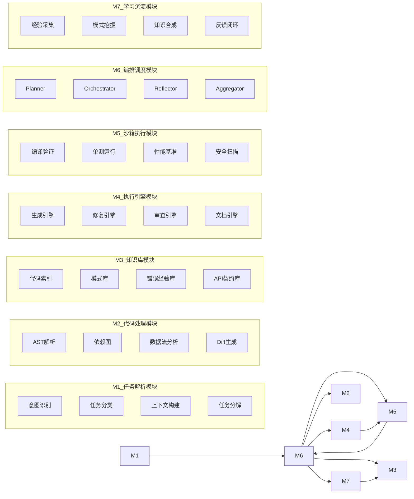

### 3.2 模块 1:任务解析模块(TaskParser)

**职责**:将用户的自然语言需求解析为结构化任务,自动构建执行上下文。

```python
"""
task_parser.py — 任务解析模块
职责: 自然语言 → 结构化任务 + 上下文构建
"""
from dataclasses import dataclass, field
from enum import Enum
from typing import Optional


class TaskType(str, Enum):
    CODE_GENERATION = "code_generation"   # 生成新代码
    BUG_FIX = "bug_fix"                   # 修复Bug
    CODE_REVIEW = "code_review"           # 代码审查
    DOC_GENERATION = "doc_generation"     # 文档生成
    CODE_ANALYSIS = "code_analysis"       # 代码分析
    REFACTOR = "refactor"                 # 重构


class Language(str, Enum):
    PYTHON = "python"
    JAVA = "java"
    GO = "go"
    TYPESCRIPT = "typescript"
    JAVASCRIPT = "javascript"
    RUST = "rust"


@dataclass
class TaskContext:
    """任务执行上下文 — 每次任务必构建"""
    task_id: str
    task_type: TaskType
    language: Language
    repo_path: str                        # 代码仓库路径
    target_files: list[str] = field(default_factory=list)  # 涉及文件
    target_symbols: list[str] = field(default_factory=list)  # 函数/类
    # 上下文四要素
    ast_context: dict = field(default_factory=dict)      # AST 结构
    dependency_context: dict = field(default_factory=dict)  # 依赖图
    convention_context: dict = field(default_factory=dict)  # 项目编码规范
    history_context: dict = field(default_factory=dict)     # git 历史相关
    # 错误特定上下文
    error_stack: Optional[str] = None
    test_command: Optional[str] = None
    # 约束
    max_diff_lines: int = 500             # 单次改动不超过 500 行
    must_pass_tests: bool = True          # 必须通过测试


class TaskParser:
    """任务解析主入口"""
    
    INTENT_KEYWORDS = {
        TaskType.CODE_GENERATION: ["实现", "生成", "写一个", "create", "implement", "generate"],
        TaskType.BUG_FIX: ["修复", "bug", "fix", "错误", "异常", "报错", "error", "exception"],
        TaskType.CODE_REVIEW: ["审查", "review", "检查", "review", "lint"],
        TaskType.DOC_GENERATION: ["文档", "注释", "doc", "document", "comment", "readme"],
        TaskType.CODE_ANALYSIS: ["分析", "理解", "explain", "analyze", "这个函数做什么"],
        TaskType.REFACTOR: ["重构", "refactor", "优化结构", "提取"],
    }
    
    def parse(self, user_input: str, repo_path: str,
              language: Language = Language.PYTHON) -> TaskContext:
        # Step1: 意图识别(关键词 + 小模型分类器)
        task_type = self._classify_intent(user_input)
        # Step2: 提取目标文件和符号
        target_files = self._extract_target_files(user_input, repo_path)
        target_symbols = self._extract_symbols(user_input)
        # Step3: 构建上下文(交给 CodeProcessor)
        ctx = TaskContext(
            task_id=self._gen_id(),
            task_type=task_type, language=language, repo_path=repo_path,
            target_files=target_files, target_symbols=target_symbols,
        )
        # Step4: 任务复杂度评估 → 决定路由到哪个模型
        ctx.complexity = self._estimate_complexity(ctx)
        return ctx
    
    def _classify_intent(self, text: str) -> TaskType:
        text_lower = text.lower()
        scores = {t: sum(1 for kw in kws if kw in text_lower)
                  for t, kws in self.INTENT_KEYWORDS.items()}
        return max(scores, key=scores.get) if max(scores.values()) > 0 \
            else TaskType.CODE_ANALYSIS
    
    def _estimate_complexity(self, ctx: TaskContext) -> str:
        """评估任务复杂度 → 路由到不同尺寸模型"""
        if ctx.task_type == TaskType.BUG_FIX and ctx.error_stack:
            return "hard"  # Bug修复默认 hard
        if len(ctx.target_files) > 3:
            return "hard"
        if len(ctx.target_files) <= 1 and ctx.task_type in (
            TaskType.CODE_GENERATION, TaskType.DOC_GENERATION):
            return "easy"
        return "medium"
```

### 3.3 模块 2:代码处理模块(CodeProcessor)

**职责**:对源代码做静态分析,构建 AST、依赖图、数据流,为生成/修复提供精确上下文。

```python
"""
code_processor.py — 代码处理模块
核心: 基于 Tree-sitter 做多语言 AST 解析 + 依赖图 + 数据流
"""
from tree_sitter import Parser, Language as TSLanguage
from typing import Optional
from dataclasses import dataclass, field
import subprocess, json


@dataclass
class FunctionAST:
    name: str
    start_line: int
    end_line: int
    params: list[dict] = field(default_factory=list)  # {name, type, default}
    return_type: Optional[str] = None
    docstring: Optional[str] = None
    complexity: int = 0          # 圈复杂度
    called_functions: list[str] = field(default_factory=list)
    callers: list[str] = field(default_factory=list)


@dataclass
class DependencyGraph:
    """文件级依赖图"""
    nodes: dict[str, dict] = field(default_factory=dict)  # file → {imports, exported}
    edges: list[tuple[str, str]] = field(default_factory=list)  # (from, to)
    
    def get_call_chain(self, symbol: str, depth: int = 3) -> list[str]:
        """获取某函数的调用链(用于Bug根因分析)"""
        # BFS 遍历
        visited, chain = set(), []
        queue = [(symbol, 0)]
        while queue:
            node, d = queue.pop(0)
            if d > depth or node in visited: continue
            visited.add(node); chain.append(node)
            for callee in self.nodes.get(node, {}).get("calls", []):
                queue.append((callee, d + 1))
        return chain


class CodeProcessor:
    """代码处理模块主类"""
    
    # Tree-sitter 语言映射
    TS_LANGUAGES = {
        Language.PYTHON: "python",
        Language.JAVA: "java",
        Language.GO: "go",
        Language.TYPESCRIPT: "typescript",
        Language.JAVASCRIPT: "javascript",
        Language.RUST: "rust",
    }
    
    def __init__(self):
        self._parsers: dict[str, Parser] = {}
        self._init_parsers()
    
    def _init_parsers(self):
        for lang, ts_name in self.TS_LANGUAGES.items():
            try:
                parser = Parser()
                # 实际项目中用 tree_sitter_{lang} 包
                # parser.set_language(TSLanguage(...))
                self._parsers[lang] = parser
            except Exception:
                pass  # 语言未安装,降级到正则
    
    def parse_file(self, file_path: str, language: Language) -> dict:
        """解析单文件 → AST 结构 + 函数列表 + 复杂度"""
        with open(file_path, "rb") as f:
            source = f.read()
        parser = self._parsers.get(language)
        if parser is None:
            return self._fallback_regex_parse(file_path, language)
        tree = parser.parse(source)
        functions = self._extract_functions(tree, source)
        return {
            "file_path": file_path,
            "language": language.value,
            "functions": [f.__dict__ for f in functions],
            "imports": self._extract_imports(tree, source),
            "total_lines": source.count(b"\n") + 1,
        }
    
    def build_dependency_graph(self, repo_path: str,
                                language: Language) -> DependencyGraph:
        """构建仓库级依赖图"""
        graph = DependencyGraph()
        files = self._scan_files(repo_path, language)
        for f in files:
            ast = self.parse_file(f, language)
            graph.nodes[f] = {
                "imports": ast["imports"],
                "functions": [fn["name"] for fn in ast["functions"]],
            }
            for imp in ast["imports"]:
                resolved = self._resolve_import(imp, f, repo_path)
                if resolved:
                    graph.edges.append((f, resolved))
        return graph
    
    def generate_diff(self, original: str, modified: str,
                      context_lines: int = 3) -> str:
        """生成 unified diff 格式(P3: 增量可逆)"""
        import difflib
        diff = difflib.unified_diff(
            original.splitlines(keepends=True),
            modified.splitlines(keepends=True),
            n=context_lines
        )
        return "".join(diff)
```

### 3.4 模块 3:知识库模块(KnowledgeBase)

**职责**:管理代码索引、团队模式、错误经验、API 契约、最佳实践五类知识资产。

```python
"""
knowledge_base.py — 知识库模块
五库协同: 代码索引 / 团队模式 / 错误经验 / API契约 / 最佳实践
"""
from dataclasses import dataclass
from typing import Optional, Any
import json


@dataclass
class CodeChunk:
    """代码语义块(向量化单元)"""
    chunk_id: str
    file_path: str
    language: str
    symbol_type: str        # function / class / method / module
    symbol_name: str
    content: str            # 代码内容
    signature: str          # 函数签名
    docstring: str = ""
    embedding: list[float] = None
    metadata: dict = None   # 调用关系、复杂度等


@dataclass
class ErrorExperience:
    """错误经验(用于Bug修复)"""
    exp_id: str
    error_type: str         # 编译错误/运行时/逻辑
    error_pattern: str      # 错误栈特征 hash
    language: str
    root_cause: str
    fix_pattern: str        # 修复模式描述
    fix_code_example: str
    success_count: int = 0
    fail_count: int = 0


class KnowledgeBase:
    """知识库统一入口"""
    
    def __init__(self, vector_client, db_conn, redis_client):
        self.vec = vector_client       # Milvus 向量库
        self.db = db_conn              # Postgres 结构化
        self.redis = redis_client      # 缓存
    
    # ---- 代码索引库 ----
    def index_repo(self, repo_path: str, language: str):
        """全量索引仓库 → 切片 → 向量化 → 入库"""
        # 1. 用 CodeProcessor 解析每个文件
        # 2. 按函数/类切片
        # 3. 用代码 Embedding 模型向量化
        # 4. 入 Milvus
        pass
    
    def search_similar_code(self, query: str, language: str,
                            top_k: int = 5) -> list[CodeChunk]:
        """语义检索相似代码"""
        emb = self._embed(query, is_code=True)
        results = self.vec.search(
            collection="code_index",
            vector=emb, top_k=top_k,
            filter={"language": language}
        )
        return [self._row_to_chunk(r) for r in results]
    
    # ---- 错误经验库 ----
    def find_similar_errors(self, error_stack: str,
                            language: str) -> list[ErrorExperience]:
        """检索相似错误历史(用于Bug修复)"""
        pattern = self._hash_error_stack(error_stack)
        rows = self.db.query(
            "SELECT * FROM error_experiences WHERE language=%s "
            "AND error_pattern LIKE %s ORDER BY success_count DESC LIMIT 5",
            [language, f"%{pattern}%"]
        )
        return [ErrorExperience(**r) for r in rows]
    
    def record_error_fix(self, exp: ErrorExperience, success: bool):
        """记录修复结果 → 更新经验库"""
        if success:
            exp.success_count += 1
        else:
            exp.fail_count += 1
        self.db.execute(
            "UPDATE error_experiences SET success_count=%s, fail_count=%s WHERE exp_id=%s",
            [exp.success_count, exp.fail_count, exp.exp_id]
        )
    
    # ---- 团队模式库 ----
    def get_team_pattern(self, pattern_type: str,
                         language: str) -> Optional[dict]:
        """查询团队约定模式(如命名/分层/错误处理)"""
        key = f"team_pattern:{language}:{pattern_type}"
        cached = self.redis.get(key)
        if cached:
            return json.loads(cached)
        row = self.db.query_one(
            "SELECT * FROM team_patterns WHERE pattern_type=%s AND language=%s",
            [pattern_type, language]
        )
        if row:
            self.redis.setex(key, 86400, json.dumps(row))
            return row
        return None
```

### 3.5 模块 4:执行引擎模块(六大能力引擎)

**职责**:实现代码分析/生成/修复/文档/审查/重构六大核心能力的业务逻辑。每个能力一个独立引擎,通过统一接口调度。

```python
"""
engines.py — 六大能力引擎
统一接口 IEngine + 六个实现
"""
from abc import ABC, abstractmethod
from dataclasses import dataclass
from typing import Optional


@dataclass
class EngineResult:
    success: bool
    output: str                  # 生成的代码/文档/审查报告
    diff: Optional[str] = None  # diff 格式改动
    test_result: Optional[dict] = None  # 测试结果
    explanation: str = ""       # 解释说明
    confidence: float = 0.0     # 置信度 0-1
    cost: float = 0.0            # 本次调用成本


class IEngine(ABC):
    """能力引擎统一接口"""
    
    @abstractmethod
    async def execute(self, task_ctx: TaskContext,
                      knowledge: KnowledgeBase,
                      sandbox: Sandbox) -> EngineResult: ...
    
    @abstractmethod
    def get_required_model_tier(self, complexity: str) -> str: ...
    # 返回 "small" / "mid" / "large"


class CodeGenerationEngine(IEngine):
    """代码生成引擎"""
    
    async def execute(self, task_ctx, knowledge, sandbox) -> EngineResult:
        # Step1: 检索相似代码作为 few-shot
        similar = knowledge.search_similar_code(
            task_ctx.user_query, task_ctx.language.value, top_k=3
        )
        # Step2: 获取团队模式(命名/分层/错误处理)
        pattern = knowledge.get_team_pattern("naming", task_ctx.language.value)
        # Step3: 构建增强 Prompt
        prompt = self._build_prompt(task_ctx, similar, pattern)
        # Step4: 路由模型(简单→1.8B, 复杂→14B)
        model = self.get_required_model_tier(task_ctx.complexity)
        # Step5: 调用模型
        result = await self._call_model(model, prompt)
        # Step6: 沙箱验证(编译+单测)
        test_result = await sandbox.validate(result, task_ctx)
        # Step7: 计算置信度
        confidence = self._compute_confidence(result, test_result)
        return EngineResult(
            success=test_result["compile_passed"],
            output=result, diff=None,
            test_result=test_result,
            explanation="基于相似代码+团队模式生成",
            confidence=confidence
        )
    
    def get_required_model_tier(self, complexity: str) -> str:
        return {"easy": "small", "medium": "mid", "hard": "large"}[complexity]


class BugFixEngine(IEngine):
    """错误修复引擎 — 最复杂的引擎,五步修复法"""
    
    async def execute(self, task_ctx, knowledge, sandbox) -> EngineResult:
        # Step1: 分析错误栈 → 定位文件和行号
        error_location = self._locate_error(task_ctx.error_stack)
        # Step2: 检索相似错误历史经验
        similar_errors = knowledge.find_similar_errors(
            task_ctx.error_stack, task_ctx.language.value
        )
        # Step3: AST 分析错误上下文
        ast_ctx = self._analyze_error_context(error_location, task_ctx)
        # Step4: 生成修复补丁(可能多个候选)
        candidates = await self._generate_fix_candidates(
            ast_ctx, similar_errors, n=3
        )
        # Step5: 沙箱验证 → 选最佳补丁
        best = None
        for cand in candidates:
            test_res = await sandbox.validate(cand, task_ctx)
            if test_res["all_passed"]:
                best = (cand, test_res)
                break
        # Step6: 反思修正(如果没有全通过的)
        if not best:
            best = await self._reflect_and_retry(
                candidates, test_res, knowledge, sandbox, task_ctx, max_retry=2
            )
        # Step7: 记录经验
        if best:
            knowledge.record_error_fix(
                self._to_experience(task_ctx, best), success=True
            )
        return EngineResult(
            success=best is not None,
            output=best[0] if best else "",
            diff=self._generate_diff(task_ctx, best[0] if best else ""),
            test_result=best[1] if best else None,
            explanation=self._explain_fix(task_ctx, similar_errors, best),
            confidence=0.9 if best else 0.3
        )
    
    def get_required_model_tier(self, complexity: str) -> str:
        return "large"  # Bug修复总是用大模型


class CodeReviewEngine(IEngine):
    """代码审查引擎"""
    async def execute(self, task_ctx, knowledge, sandbox) -> EngineResult:
        # 1. 解析 PR diff
        # 2. 多维度检查: 安全/性能/风格/最佳实践
        # 3. 输出结构化审查报告
        pass


class DocGenerationEngine(IEngine):
    """文档生成引擎"""
    async def execute(self, task_ctx, knowledge, sandbox) -> EngineResult:
        # 1. 解析函数/类 AST
        # 2. 生成 docstring / API 文档 / README
        pass


class CodeAnalysisEngine(IEngine):
    """代码分析引擎"""
    async def execute(self, task_ctx, knowledge, sandbox) -> EngineResult:
        # 1. AST 分析
        # 2. 调用链/依赖图分析
        # 3. 复杂度/坏味道检测
        pass


class RefactorEngine(IEngine):
    """重构引擎"""
    async def execute(self, task_ctx, knowledge, sandbox) -> EngineResult:
        # 1. 识别坏味道(长函数/重复代码/过大类)
        # 2. 生成重构方案
        # 3. 沙箱验证等价性(测试不劣化)
        pass
```

### 3.6 模块 5:沙箱执行模块(Sandbox)

**职责**:在隔离环境中编译、运行单测、做性能基准和安全扫描,保证 Agent 生成的代码可执行可验证。

```python
"""
sandbox.py — 沙箱执行模块
基于 Docker / Firecracker 微VM,保证 Agent 不污染宿主环境
"""
import asyncio
import docker
from dataclasses import dataclass
from typing import Optional


@dataclass
class TestResult:
    compile_passed: bool = False
    tests_total: int = 0
    tests_passed: int = 0
    tests_failed: int = 0
    coverage_pct: float = 0.0
    failures: list[dict] = None  # 失败详情
    perf_metrics: dict = None    # 性能基准
    security_issues: list = None  # 安全扫描结果
    elapsed_ms: float = 0


class Sandbox:
    """Docker 沙箱执行器"""
    
    IMAGES = {
        Language.PYTHON: "code-agent-python:3.11",
        Language.JAVA: "code-agent-java:17",
        Language.GO: "code-agent-go:1.21",
        Language.TYPESCRIPT: "code-agent-node:20",
        Language.JAVASCRIPT: "code-agent-node:20",
        Language.RUST: "code-agent-rust:1.75",
    }
    
    RESOURCE_LIMITS = {
        "cpu_count": 2,
        "mem_limit": "2g",
        "timeout_sec": 120,
    }
    
    def __init__(self):
        self.client = docker.from_env()
    
    async def validate(self, code: str, task_ctx: TaskContext) -> TestResult:
        """验证生成的代码: 编译 → 单测 → 覆盖率 → 安全扫描"""
        result = TestResult()
        image = self.IMAGES[task_ctx.language]
        
        # 创建临时容器(只读挂载源码,可写挂载临时工作区)
        container = self.client.containers.create(
            image=image,
            command="sleep 600",
            cpu_count=self.RESOURCE_LIMITS["cpu_count"],
            mem_limit=self.RESOURCE_LIMITS["mem_limit"],
            network_mode="none",  # 禁用网络,防恶意外联
            volumes={
                task_ctx.repo_path: {"bind": "/repo", "mode": "ro"},
                "/tmp/work": {"bind": "/work", "mode": "rw"},
            },
        )
        try:
            container.start()
            # Step1: 写入生成的代码到 /work
            await self._exec(container, f"cat > /work/generated.py <<'EOF'\n{code}\nEOF")
            # Step2: 编译检查
            compile_out = await self._exec(container, self._compile_cmd(task_ctx))
            result.compile_passed = (compile_out.exit_code == 0)
            if not result.compile_passed:
                result.failures = [{"type": "compile", "msg": compile_out.output}]
                return result
            # Step3: 运行单测
            test_out = await self._exec(container, task_ctx.test_command or self._default_test_cmd(task_ctx))
            result.tests_total, result.tests_passed, result.tests_failed = \
                self._parse_test_output(test_out.output, task_ctx.language)
            # Step4: 覆盖率
            cov_out = await self._exec(container, self._coverage_cmd(task_ctx))
            result.coverage_pct = self._parse_coverage(cov_out.output)
            # Step5: 安全扫描(bandit/semgrep)
            sec_out = await self._exec(container, self._security_scan_cmd(task_ctx))
            result.security_issues = self._parse_security(sec_out.output)
        finally:
            container.stop()
            container.remove()
        return result
    
    async def _exec(self, container, cmd: str, timeout: int = None):
        timeout = timeout or self.RESOURCE_LIMITS["timeout_sec"]
        exec_obj = container.exec_run(
            cmd, shell=True, demux=True, workdir="/work"
        )
        return exec_obj
```

### 3.7 模块 6:编排调度模块(Orchestrator)

**职责**:Plan-Execute-Reflect 三阶段编排,把任务分解、调度各引擎、反思修正、聚合结果。

```python
"""
orchestrator.py — Agent 编排调度主入口
ReAct + Plan-Execute + Reflection 三模式融合
"""
import asyncio
from dataclasses import dataclass
from typing import Optional


@dataclass
class ExecutionPlan:
    steps: list[dict]  # [{engine, input, depends_on}]
    estimated_cost: float = 0
    max_reflect_rounds: int = 2


class Orchestrator:
    """Agent 大脑:任务解析→规划→执行→反思→聚合"""
    
    def __init__(self, task_parser, engines: dict, knowledge, sandbox,
                 reflector, aggregator):
        self.parser = task_parser
        self.engines = engines        # {TaskType: IEngine}
        self.knowledge = knowledge
        self.sandbox = sandbox
        self.reflector = reflector
        self.aggregator = aggregator
    
    async def run(self, user_input: str, repo_path: str,
                  language: Language = Language.PYTHON) -> dict:
        """主入口"""
        # L1: 任务解析
        task_ctx = self.parser.parse(user_input, repo_path, language)
        # L2: 规划
        plan = self._plan(task_ctx)
        # L3: 执行(按依赖顺序)
        results = []
        for step in plan.steps:
            engine = self.engines[task_ctx.task_type]
            result = await engine.execute(task_ctx, self.knowledge, self.sandbox)
            results.append(result)
            # L4: 反思(失败则修正重试)
            if not result.success and plan.max_reflect_rounds > 0:
                fixed = await self._reflect_and_retry(
                    task_ctx, result, engine, plan.max_reflect_rounds
                )
                if fixed:
                    results[-1] = fixed
        # L5: 聚合
        final = self.aggregator.aggregate(results, task_ctx)
        return final
    
    def _plan(self, task_ctx: TaskContext) -> ExecutionPlan:
        """根据任务类型生成执行计划"""
        plans = {
            TaskType.BUG_FIX: ExecutionPlan(
                steps=[
                    {"engine": "analyzer", "input": "分析错误"},
                    {"engine": "fixer", "input": "生成修复", "depends_on": 0},
                    {"engine": "sandbox", "input": "验证", "depends_on": 1},
                ],
                estimated_cost=0.05, max_reflect_rounds=2
            ),
            TaskType.CODE_GENERATION: ExecutionPlan(
                steps=[
                    {"engine": "generator", "input": "生成代码"},
                    {"engine": "sandbox", "input": "验证"},
                ],
                max_reflect_rounds=1
            ),
            # ... 其他任务类型
        }
        return plans.get(task_ctx.task_type, ExecutionPlan(steps=[]))
    
    async def _reflect_and_retry(self, ctx, failed_result, engine, max_rounds):
        """反思失败原因 → 修正 → 重试"""
        for round_n in range(max_rounds):
            reflection = await self.reflector.reflect(failed_result, ctx)
            if reflection.should_give_up:
                return None
            # 注入反思结论到上下文
            ctx.reflection = reflection.suggestions
            new_result = await engine.execute(ctx, self.knowledge, self.sandbox)
            if new_result.success:
                return new_result
            failed_result = new_result
        return None
```

### 3.8 模块 7:学习沉淀模块

**职责**:持续从执行轨迹中学习,沉淀团队模式、错误经验、代码片段。设计思路同 154 号文档,此处做代码 Agent 专项适配。

```python
"""
learning.py — 学习沉淀模块
代码 Agent 专项的自主学习闭环
"""
from dataclasses import dataclass
from datetime import datetime


@dataclass
class CodeTrace:
    trace_id: str
    task_type: str
    language: str
    user_query: str
    generated_code: str
    test_result: dict
    user_feedback: Optional[str] = None  # 用户接受/拒绝/修改
    reviewer_feedback: Optional[str] = None  # 代码审查反馈
    timestamp: datetime = None


class LearningModule:
    """学习沉淀主类"""
    
    def __init__(self, knowledge_base):
        self.kb = knowledge_base
        self.traces: list[CodeTrace] = []
    
    async def collect_trace(self, trace: CodeTrace):
        """采集执行轨迹"""
        self.traces.append(trace)
        if len(self.traces) >= 100:
            await self._batch_learn()
    
    async def _batch_learn(self):
        """批量学习(周级)"""
        # 1. 成功轨迹 → 提取代码模式 → 入团队模式库
        success_traces = [t for t in self.traces if t.test_result.get("all_passed")]
        for t in success_traces:
            pattern = self._extract_pattern(t)
            if pattern:
                self.kb.save_team_pattern(pattern)
        
        # 2. 失败轨迹 → 提取错误经验 → 入错误经验库
        fail_traces = [t for t in self.traces if not t.test_result.get("all_passed")]
        for t in fail_traces:
            exp = self._extract_error_experience(t)
            if exp:
                self.kb.save_error_experience(exp)
        
        # 3. 用户修改的轨迹 → 学习用户偏好
        modified = [t for t in success_traces if t.user_feedback == "modified"]
        for t in modified:
            self._learn_user_preference(t)
        
        self.traces.clear()
    
    def _extract_pattern(self, trace: CodeTrace) -> dict:
        """从成功轨迹提取代码模式"""
        # 用 AST 分析 + 聚类,提取可复用模式
        pass
```

---

## 四、技术选型决策

### 4.1 模型选型(代码专用模型)

| 模型角色 | 推荐模型 | 参数量 | 部署 | 单次成本 | 选型理由 |
|---------|---------|:-----:|:----:|:-------:|---------|
| **代码补全(实时)** | Qwen2.5-Coder-1.5B INT4 | 1.5B | 本地 GPU | ¥0.0003 | 实时补全要求 <300ms,1.5B 量化可满足 |
| **代码生成(函数级)** | Qwen2.5-Coder-7B INT4 AWQ | 7B | 4090 | ¥0.005 | 函数级生成质量与速度平衡 |
| **深度推理(Bug修复/审查)** | DeepSeek-Coder-V2-16B | 16B MoE | A100 | ¥0.015 | 代码理解+推理最强,复杂任务专用 |
| **代码 Embedding** | jina-code-embeddings-v3 | 335M | 本地 | ¥0.0001 | 代码语义检索专用,支持多种语言 |
| **审查小模型** | Qwen2.5-Coder-1.5B | 1.5B | 本地 | ¥0.0003 | 安全/风格快速初筛 |

### 4.2 核心技术栈选型

| 维度 | 选型 | 理由 |
|-----|------|------|
| **AST 解析** | Tree-sitter | 支持多语言统一 API,增量解析快 |
| **LSP 协议** | pygls + 多语言 LSP server | IDE 集成标准协议 |
| **静态分析** | Semgrep + 自定义规则 | 多语言规则,可扩展 |
| **向量库** | Milvus 2.4+ | 支持代码 Embedding + 元数据过滤 |
| **沙箱** | Docker(开发)/ Firecracker(生产) | 隔离性 + 启动速度平衡 |
| **Diff/Patch** | difflib + unified-diff | 标准 diff 格式,IDE 友好 |
| **API 框架** | FastAPI(REST/WebSocket) + gRPC(内部) | 异步 + 流式 + 类型安全 |
| **消息队列** | Redis Streams | 轻量,够用;大规模上 Kafka |
| **监控** | Prometheus + Grafana(对接 121 文档) | 标准 + 已有体系 |
| **CI/CD 集成** | GitHub Actions / GitLab CI | 主流平台 Webhook |

### 4.3 语言支持矩阵(Phase 1-3 渐进)

| 语言 | AST 解析 | LSP | 沙箱编译 | 单测 | 审查规则 | 阶段 |
|-----|:-------:|:---:|:-------:|:---:|:-------:|:----:|
| **Python** | ✅ | ✅ | ✅ | ✅ pytest | ✅ 50+ | Phase 1 |
| **TypeScript** | ✅ | ✅ | ✅ | ✅ jest | ✅ 40+ | Phase 1 |
| **Java** | ✅ | ✅ | ✅ | ✅ JUnit | ✅ 45+ | Phase 2 |
| **Go** | ✅ | ✅ | ✅ | ✅ go test | ✅ 30+ | Phase 2 |
| **JavaScript** | ✅ | ✅ | ✅ | ✅ jest | ✅ 35+ | Phase 3 |
| **Rust** | ✅ | ✅ | ✅ | ✅ cargo test | ⚠️ 15+ | Phase 3 |

---

## 五、接口设计

### 5.1 RESTful API 设计

```yaml
# 代码 Agent REST API v1
openapi: 3.0.0
info:
  title: Code Agent API
  version: 1.0.0

paths:
  # ============ 任务管理 ============
  /api/v1/tasks:
    post:
      summary: 创建代码任务(异步)
      requestBody:
        content:
          application/json:
            schema:
              type: object
              properties:
                task_type: {enum: [code_generation, bug_fix, code_review, doc_generation, code_analysis, refactor]}
                language: {enum: [python, java, go, typescript, javascript, rust]}
                repo_url: {type: string}
                target_files: {type: array, items: {type: string}}
                user_query: {type: string}
                error_stack: {type: string, description: "Bug修复任务必填"}
                test_command: {type: string}
                options:
                  type: object
                  properties:
                    max_diff_lines: {type: integer, default: 500}
                    auto_create_pr: {type: boolean, default: false}
                    model_tier: {enum: [auto, small, mid, large]}
      responses:
        200:
          description: 返回任务ID
          content:
            application/json:
              schema:
                type: object
                properties:
                  task_id: {type: string}
                  status: {enum: [pending, running, completed, failed]}
                  estimated_time_sec: {type: integer}
  
  /api/v1/tasks/{task_id}:
    get:
      summary: 查询任务状态和结果
      responses:
        200:
          description: 任务详情
          content:
            application/json:
              schema:
                type: object
                properties:
                  task_id: {type: string}
                  status: {enum: [pending, running, completed, failed]}
                  result:
                    type: object
                    properties:
                      output: {type: string}
                      diff: {type: string}
                      test_result: {type: object}
                      explanation: {type: string}
                      confidence: {type: number}
                      pr_url: {type: string, description: "若auto_create_pr=true"}
                  cost: {type: number}
                  trace_id: {type: string}
  
  # ============ 代码补全(实时) ============
  /api/v1/completion:
    post:
      summary: 实时代码补全(低延迟)
      requestBody:
        content:
          application/json:
            schema:
              type: object
              properties:
                language: {type: string}
                file_path: {type: string}
                cursor_line: {type: integer}
                cursor_column: {type: integer}
                prefix_code: {type: string, description: "光标前代码"}
                suffix_code: {type: string, description: "光标后代码"}
                context_files: {type: array, items: {type: string}}
      responses:
        200:
          description: 补全结果
          content:
            application/json:
              schema:
                type: object
                properties:
                  completions:
                    type: array
                    items:
                      type: object
                      properties:
                        text: {type: string}
                        score: {type: number}
                        type: {enum: [line, block, function]}
  
  # ============ 知识库管理 ============
  /api/v1/kb/index:
    post:
      summary: 索引代码仓库
      requestBody:
        content:
          application/json:
             schema:
              type: object
              properties:
                repo_url: {type: string}
                branch: {type: string, default: main}
                language: {type: string}
      responses:
        202:
          description: 索引任务已提交
  
  /api/v1/kb/search:
    post:
      summary: 语义代码检索
      requestBody:
        content:
          application/json:
            schema:
              type: object
              properties:
                query: {type: string}
                language: {type: string}
                top_k: {type: integer, default: 5}
      responses:
        200:
          description: 检索结果
  
  # ============ 流式接口 ============
  /api/v1/tasks/{task_id}/stream:
    get:
      summary: SSE 流式获取任务进度
      responses:
        200:
          description: SSE 事件流
          content:
            text/event-stream:
              schema:
                type: object
                events:
                  - plan_created
                  - step_started
                  - step_completed
                  - reflect_retry
                  - final_result
```

### 5.2 WebSocket 流式接口(实时补全)

```python
# WebSocket 协议: 双向实时补全
# 客户端 → 服务端
{
  "type": "completion_request",
  "id": "req_123",
  "language": "python",
  "file_path": "src/auth/login.py",
  "cursor": {"line": 42, "column": 16},
  "prefix": "def validate_token(token: str) -> bool:\n    \"\"\"验证JWT token有效性\"\"\"\n    ",
  "suffix": "\n    return True",
  "context": {
    "imports": ["import jwt", "from datetime import datetime"],
    "current_function": "validate_token"
  }
}

# 服务端 → 客户端
{
  "type": "completion_response",
  "id": "req_123",
  "completions": [
    {"text": "try:\n        payload = jwt.decode(token, SECRET_KEY, algorithms=['HS256'])\n        return not datetime.fromtimestamp(payload['exp']) < datetime.now()\n    except jwt.ExpiredSignatureError:\n        return False\n    except jwt.InvalidTokenError:\n        return False", "score": 0.92, "type": "block"}
  ],
  "latency_ms": 180
}
```

### 5.3 内部 gRPC 接口(引擎间高效通信)

```protobuf
// code_agent.proto
syntax = "proto3";
package code_agent.v1;

service CodeAgentService {
  // 同步代码补全
  rpc Complete(CompletionRequest) returns (CompletionResponse);
  // 异步任务提交
  rpc SubmitTask(TaskRequest) returns (TaskResponse);
  // 流式任务执行(双向流)
  rpc StreamTask(stream TaskEvent) returns (stream TaskEvent);
}

message CompletionRequest {
  string language = 1;
  string file_path = 2;
  int32 cursor_line = 3;
  int32 cursor_column = 4;
  string prefix_code = 5;
  string suffix_code = 6;
  repeated string context_files = 7;
}

message CompletionResponse {
  repeated Completion completions = 1;
  int32 latency_ms = 2;
}

message Completion {
  string text = 1;
  float score = 2;
  string type = 3;  // line / block / function
}
```

---

## 六、数据流程设计

### 6.1 代码生成全链路数据流

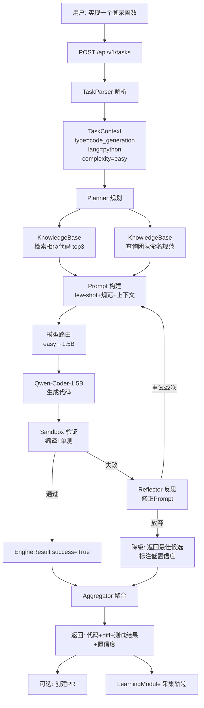

### 6.2 Bug 修复五步法数据流

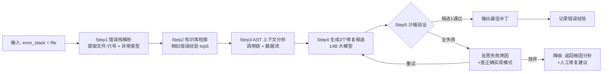

### 6.3 代码索引与检索数据流

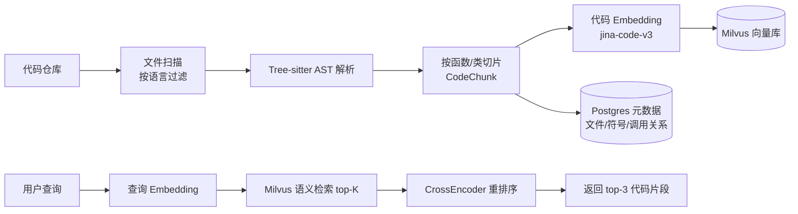

---

## 七、Agent 学习能力设计

### 7.1 三层学习架构(适配 154 号文档,代码 Agent 专项)

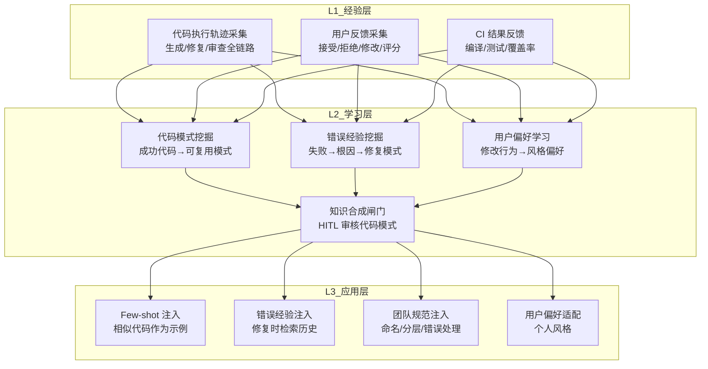

### 7.2 四种学习范式(代码场景适配)

| 范式 | 学习对象 | 触发条件 | 输出 | 复用方式 |
|-----|---------|:-------:|------|---------|
| **F1 代码模式学习** | 成功生成/修复的代码模式 | 累计 50 条成功轨迹 | 可检索的代码模式 chunk | few-shot 注入 |
| **F2 错误经验学习** | 失败的生成/修复案例 | 累计 20 条失败轨迹 | 错误-根因-修复 三元组 | 修复时检索注入 |
| **F3 团队规范学习** | 项目代码风格统计 | 索引 1000+ 文件后 | 命名/分层/错误处理规范 | Prompt 模板注入 |
| **F4 用户偏好学习** | 用户对生成结果的修改 | 累计 30 条修改轨迹 | 个人编码风格偏好 | 按用户ID注入 |

### 7.3 学习节拍

- **周级**:F1/F2 批量学习,低风险模式自动入库
- **月级**:F3 团队规范更新,需 Tech Lead 审核
- **季度级**:F4 用户偏好 + LoRA 微调(可选,样本 ≥5K 时)

---

## 八、与开发环境的集成

### 8.1 IDE 集成(VSCode / JetBrains)

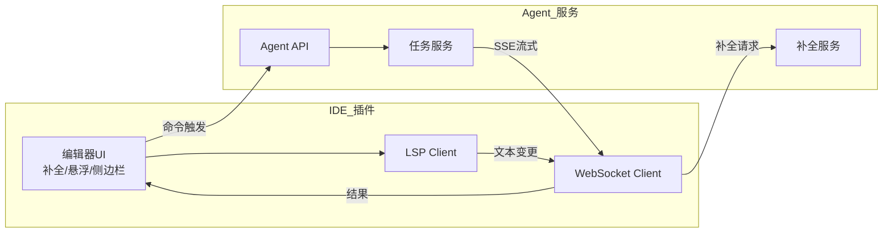

**IDE 集成四类交互**:
1. **实时补全**:光标停顿 300ms → WebSocket 请求 → 流式返回
2. **命令面板**:Ctrl+Shift+P → "Agent: 修复此Bug" / "Agent: 生成文档" / "Agent: 审查代码"
3. **侧边栏面板**:任务列表 + 执行进度 + diff 预览 + 一键应用
4. **悬浮卡片**:鼠标悬停函数 → Agent 解释功能 + 调用关系 + 潜在问题

### 8.2 CI/CD 集成

```yaml
# .github/workflows/code-agent.yml
name: Code Agent CI
on:
  pull_request:
    types: [opened, synchronize]

jobs:
  agent-review:
    runs-on: ubuntu-latest
    steps:
      - uses: actions/checkout@v4
      - name: Trigger Code Agent Review
        run: |
          curl -X POST ${{ secrets.AGENT_API }}/api/v1/tasks \
            -H "Authorization: Bearer ${{ secrets.AGENT_TOKEN }}" \
            -d '{
              "task_type": "code_review",
              "language": "python",
              "repo_url": "${{ github.repository }}",
              "target_files": ["${{ github.event.pull_request.files }}"],
              "options": {"auto_create_pr_comment": true}
            }'
      - name: Wait for Review
        run: |
          # 轮询任务状态或接收 Webhook
          ./scripts/wait_agent_task.sh $TASK_ID
```

### 8.3 Git 平台 Bot 集成

| 触发场景 | Bot 行为 |
|---------|---------|
| PR 创建 | 自动审查 → 评论问题 + 修复建议 |
| Issue 标记 `bug` | 自动分析 → 提交修复 PR |
| Commit 包含 `@agent docs` | 自动生成/更新文档 |
| 分支合并到 main | 自动更新代码索引 + 学习沉淀 |

---

## 九、安全策略

### 9.1 安全五层防护

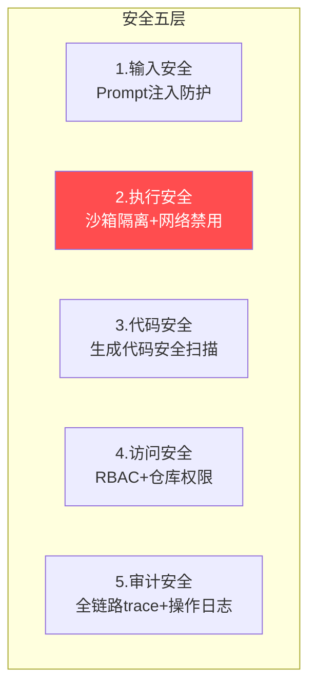

### 9.2 关键安全措施

| 层级 | 推施 | 实现 |
|-----|------|------|
| **输入安全** | 防 Prompt 注入 | 用户输入做转义 + 关键词黑名单 + LLM 输入过滤 |
| **执行安全** | 沙箱隔离 | Docker 容器 `network_mode=none` + 只读挂载源码 + 资源限制 |
| **代码安全** | 生成代码扫描 | bandit(Python)/semgrep(多语言)自动扫描,高危代码拒绝输出 |
| **访问安全** | RBAC + 仓库 ACL | 用户只能操作有权限的仓库;敏感仓库只读 |
| **审计安全** | 全链路 trace | 每次任务 trace_id 贯穿;操作日志 180 天留存 |

### 9.3 生成代码安全红线

```python
# 生成代码必须过安全扫描,以下任一命中则拒绝输出
SECURITY_BLOCKLIST = {
    "python": [
        r"eval\s*\(",           # 任意代码执行
        r"exec\s*\(",
        r"subprocess\.call.*shell=True",
        r"os\.system\s*\(",
        r"__import__\s*\(",
        r"pickle\.loads\s*\(",  # 反序列化漏洞
    ],
    "javascript": [
        r"eval\s*\(",
        r"Function\s*\(",
        r"child_process.*exec",
        r"innerHTML\s*=",
    ],
    # ... 其他语言
}

def scan_generated_code(code: str, language: str) -> tuple[bool, list]:
    """返回:(是否安全, 命中的风险列表)"""
    import re
    risks = []
    for pattern in SECURITY_BLOCKLIST.get(language, []):
        if re.search(pattern, code):
            risks.append(pattern)
    return len(risks) == 0, risks
```

---

## 十、性能优化策略

### 10.1 性能优化 10 项措施

| # | 优化项 | 目标指标 | 实现方式 |
|:-:|:------|:-------|:---------|
| **PF1** | 补全首 Token ≤300ms | TTFT | 1.5B 本地模型 + KV Cache 复用 |
| **PF2** | 代码生成 P99 ≤5s | 端到端 | 7B INT4 + 流式输出 + 上下文裁剪 |
| **PF3** | 语义检索 ≤50ms | 检索延迟 | Milvus HNSW 索引 + Embedding 缓存 |
| **PF4** | AST 解析 ≤100ms/文件 | 解析延迟 | Tree-sitter 增量解析 + 解析缓存 |
| **PF5** | 沙箱启动 ≤2s | 验证延迟 | 预热容器池 + Firecracker 微VM |
| **PF6** | 并发承载 ≥100 QPS | 吞吐量 | vLLM PagedAttention + 异步框架 |
| **PF7** | 缓存命中率 ≥30% | 成本 | 代码补全精确缓存 + 语义缓存 |
| **PF8** | 上下文 Token ≤4000 | 成本 | 动态 Top-K + 调用链裁剪 |
| **PF9** | 冷启动 ≤5s | 启动 | 模型预加载 + 索引预加载 |
| **PF10** | 内存稳定 ≤4GB | 稳定性 | LRU TTL 缓存(157 §5.3) |

### 10.2 代码补全缓存策略(关键路径优化)

```python
class CompletionCache:
    """代码补全三级缓存 — 关键路径只读内存"""
    
    def __init__(self):
        self.l1_exact = make_cache("comp_exact", max_size=50000, ttl=3600)
        self.l2_semantic = make_cache("comp_sem", max_size=20000, ttl=86400)
        self.l3_ast = make_cache("comp_ast", max_size=10000, ttl=86400)
    
    def get(self, prefix: str, suffix: str, file_path: str,
            cursor_pos: tuple) -> Optional[list]:
        # L1: 精确匹配(同文件同位置同上下文)
        key = f"{file_path}:{cursor_pos}:{hash(prefix+suffix)}"
        hit, val = self.l1_exact.get(key)
        if hit: return val
        # L2: 语义相似(同函数签名 + 相似前缀)
        # ... 向量检索
        # L3: AST 模式匹配(同类型函数结构)
        # ...
        return None
```

---

## 十一、实现步骤与关键技术难点

### 11.1 四阶段 16 周开发路线图

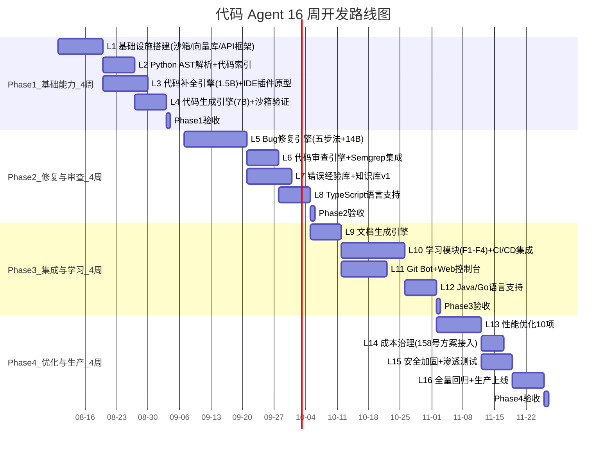

### 11.2 关键技术难点与解决方案

| # | 难点 | 难度 | 解决方案 |
|:-:|-----|:---:|---------|
| **D1** | **多语言 AST 统一抽象** | ⭐⭐⭐ | Tree-sitter 统一 API + Language Plugin 模式;每种语言一个 adapter |
| **D2** | **Bug 根因定位准确率** | ⭐⭐⭐⭐⭐ | 五步法(栈解析→经验检索→AST分析→候选生成→沙箱验证)+ 反思重试 |
| **D3** | **生成代码与项目风格一致** | ⭐⭐⭐⭐ | F3 团队规范学习 + few-shot 注入相似代码 + AST 结构对齐 |
| **D4** | **沙箱启动速度** | ⭐⭐⭐ | 预热容器池(Firecracker 微VM <125ms 启动)+ 按语言预热 |
| **D5** | **大仓库索引效率** | ⭐⭐⭐ | 增量索引(git diff 触发)+ 后台异步 + 分片并行 |
| **D6** | **补全延迟 <300ms** | ⭐⭐⭐⭐ | 1.5B 本地模型 + KV Cache + 三级缓存 + WebSocket 长连接 |
| **D7** | **生成代码安全性** | ⭐⭐⭐ | 安全红线正则 + Semgrep 扫描 + 沙箱 network=none |
| **D8** | **反思不无限循环** | ⭐⭐⭐ | 硬预算 max_reflect_rounds=2 + 收敛检测 + 降级返回 |
| **D9** | **成本控制** | ⭐⭐⭐ | 接入 158 号成本网关;小模型优先 + 缓存 + 批处理 |
| **D10** | **IDE 多平台兼容** | ⭐⭐⭐ | LSP 标准协议 + VSCode/JetBrains 各自插件壳 |

### 11.3 团队配置(6 人核心团队)

| 角色 | 人数 | 职责 |
|-----|:---:|------|
| 架构师 | 1 | 总体架构 + 技术选型 + 难点攻关 |
| AI 应用工程师 | 2 | 引擎开发 + Prompt 工程 + 模型调优 |
| 平台工程师 | 1 | 沙箱 + 知识库 + API 网关 |
| IDE 插件工程师 | 1 | VSCode/JetBrains 插件 + LSP |
| 测试工程师 | 1 | 测试方案 + 自动化 + 效果评估 |

---

## 十二、测试计划

### 12.1 六大模块测试用例矩阵

| 模块 | 测试类别 | 用例数 | 关键用例示例 | 通过标准 |
|-----|:------:|:-----:|-----------|---------|
| **代码补全** | 功能 | 50 | Python 函数补全 / TS 类型补全 / 多行块补全 | Top-1 命中率 ≥60% |
| **代码生成** | 功能 | 80 | CRUD API 生成 / 单测生成 / 脚手架 | 编译通过率 ≥90% |
| **Bug 修复** | 功能 | 60 | 编译错误修复 / 运行时异常 / 逻辑Bug | 修复成功率 ≥75% |
| **代码审查** | 功能 | 40 | 安全漏洞检测 / 性能反模式 / 风格违规 | 检出率 ≥85% |
| **文档生成** | 功能 | 30 | docstring / API 文档 / README | 覆盖率 ≥95% |
| **代码分析** | 功能 | 30 | 调用链 / 复杂度 / 依赖分析 | 准确率 ≥90% |

### 12.2 性能测试基准

| 指标 | 测试方法 | 目标 | 实测方法 |
|-----|---------|:---:|---------|
| 补全 TTFT | 1000 次补全 P99 | ≤300ms | 自动化压测 |
| 生成 P99 | 100 次函数生成 | ≤5s | 自动化压测 |
| 修复 P99 | 50 次 Bug 修复 | ≤15s | 自动化压测 |
| 并发 QPS | 逐步加压到失败 | ≥100 | locust 压测 |
| 检索延迟 | 1000 次语义检索 P99 | ≤50ms | 自动化 |
| 沙箱启动 | 100 次容器启动 P99 | ≤2s | 自动化 |

### 12.3 安全测试

| 测试项 | 方法 | 通过标准 |
|-------|------|---------|
| 沙箱逃逸 | 尝试容器内提权/逃逸 | 100% 阻断 |
| 代码注入 | Prompt 注入尝试生成恶意代码 | 100% 拦截 |
| 越权访问 | 无权限用户尝试操作他人仓库 | 100% 拒绝 |
| 敏感数据 | 生成代码是否泄露密钥/Token | 0 泄露 |

### 12.4 效果评估(HumanEval + 自有数据集)

| 评估集 | 指标 | 基线 | 目标 |
|-------|------|:---:|:---:|
| HumanEval(英文) | pass@1 | 35% | ≥55% |
| HumanEval(中文) | pass@1 | 30% | ≥50% |
| 自有业务集(100 题) | pass@1 | 40% | ≥70% |
| Bug 修复集(50 题) | 修复成功率 | 50% | ≥75% |
| 代码审查集(30 PR) | 问题检出率 | 30% | ≥85% |

### 12.5 持续集成测试流水线

```yaml
# CI 流水线: 每次 PR 自动跑
test_pipeline:
  stage_test:
    - unit_test:        # 单元测试覆盖率 ≥80%
    - integration_test: # 模块间集成测试
    - e2e_test:         # 端到端 50 个标准用例
    - performance_test: # 性能基准回归
    - security_scan:    # 安全扫描
    - eval_test:        # HumanEval 评估(不劣化)
  gate:
    - coverage ≥ 80%
    - e2e_pass ≥ 95%
    - perf_no_regression
    - eval_no_regression
```

---

> **核心结论**:代码 Agent 的工程设计核心在于 **"上下文充分性(P2)+ 沙箱验证(P4)+ 人审闭环(P5)"** 三大原则。Agent 不是替代开发者,而是把开发者从重复劳动中解放出来,聚焦创造性思考。通过八层架构 + 七大模块 + 六大引擎 + 五步修复法 + 四种学习范式,16 周可交付生产可用的代码 Agent v1.0。

---

> **相关文档导航**
>
> - 同系列工程实践首篇:[118企业知识库Agent系统完整工程设计方案.md](./118企业知识库Agent系统完整工程设计方案_架构数据流模型选型接口安全开发计划与测试.md)
> - Agent 架构基础:[../3Agent 架构设计/36企业级Agent系统完整设计方案.md](../3Agent%20架构设计/36企业级Agent系统完整设计方案.md)
> - Tool Calling 体系:[../7Tool Calling 工具调用/85工具调用工程化实践.md](../7Tool%20Calling%20工具调用/85工具调用工程化实践.md)
> - 自主学习闭环:[../13项目经验/154Agent自主学习功能设计与实现完整方案.md](../13项目经验/154Agent自主学习功能设计与实现完整方案.md)
> - 成本治理:[../13项目经验/158Agent项目模型调用成本控制完整方案.md](../13项目经验/158Agent项目模型调用成本控制完整方案_诊断8大策略成本网关预算预警闭环.md)
> - 性能监控:[../10Agent性能优化/121Agent运行状态全面监控方案深度解析与实现.md](../10Agent性能优化/121Agent运行状态全面监控方案深度解析与实现.md)
> - 模型选型:[../11模型部署与工程化/147开源大模型系统性选型评估框架与决策指南.md](../11模型部署与工程化/147开源大模型系统性选型评估框架与决策指南.md)
