# 企业知识库 Agent 项目系统性需求分析：目标·用户·功能·非功能·约束·优先级·验收

> **文档定位**:本文档是 `9AI Agent 工程实践` 系列的**需求工程专题篇**，承接 [118 号企业知识库 Agent 系统完整工程设计方案](./118企业知识库Agent系统完整工程设计方案_架构数据流模型选型接口安全开发计划与测试.md)（回答"怎么做"），前置回答"**做什么、为谁做、做到什么程度、按什么顺序做、如何验收**"。
>
> 在 118 号已经给出技术架构（六层架构、十格式解析、三库协同、RBAC+ABAC 权限）的工程蓝图之上，本文档采用**行业标准的软件需求工程方法论**（用户访谈、场景分析、用例建模、MoSCoW 优先级、INVEST 验收、SMART 指标），把散落在业务方、IT 部门、合规部门、终端用户脑中的"隐性需求"转化为"**可追溯、可量化、可验收、可变更管控**"的规范化需求基线，确保产品经理、架构师、开发、测试、运维、安全、法务**七类利益相关方达成共识**。
>
> **核心交付物**:
> - **项目目标与核心价值主张**：OKR 三层分解 + 4 条价值假设 + ROI 量化模型（3 年回收周期）
> - **目标用户群体画像**：5 类角色 Personas（含使用频率、核心诉求、痛点、成功标准）
> - **功能需求清单**：28 项 FR，按 6 大能力域分类，附用例图与用例规约模板
> - **非功能需求矩阵**：8 大类 NFR（性能/安全/可用/可扩展/可维护/可观测/合规/成本），40+ 量化指标
> - **技术约束与资源限制**：5 类约束（技术栈/数据/合规/算力/时间）+ 3 类风险
> - **需求优先级排序机制**：MoSCoW + Kano + 加权评分三模型融合 + 28 项需求优先级矩阵
> - **验收标准定义**：每条需求配套 INVEST 合规检查 + SMART 验收准则 + 22 项验收测试用例
> - **需求变更管控流程**：CCB 变更控制委员会 + 5 步变更评估流程 + 影响分析模板
> - **利益相关方共识矩阵**：7 类干系人 × 9 类需求 × 共识度评估

---

## 目录

- [企业知识库 Agent 项目系统性需求分析：目标·用户·功能·非功能·约束·优先级·验收](#企业知识库-agent-项目系统性需求分析目标用户功能非功能约束优先级验收)
  - [目录](#目录)
  - [一、需求分析概述：方法论、流程与交付物](#一需求分析概述方法论流程与交付物)
    - [1.1 为什么 Agent 项目必须做系统性需求分析](#11-为什么-agent-项目必须做系统性需求分析)
    - [1.2 采用的需求分析方法论](#12-采用的需求分析方法论)
    - [1.3 需求分析全流程（7 阶段 21 步）](#13-需求分析全流程7-阶段-21-步)
  - [二、项目目标与核心价值主张](#二项目目标与核心价值主张)
    - [2.1 项目背景与业务问题定义](#21-项目背景与业务问题定义)
    - [2.2 项目目标三层分解（战略目标-业务目标-功能目标）](#22-项目目标三层分解战略目标-业务目标-功能目标)
    - [2.3 核心价值主张与价值假设](#23-核心价值主张与价值假设)
    - [2.4 ROI 量化模型与收益预测](#24-roi-量化模型与收益预测)
  - [三、目标用户群体识别与画像](#三目标用户群体识别与画像)
    - [3.1 用户调研方法与样本](#31-用户调研方法与样本)
    - [3.2 五类核心用户画像（Personas）](#32-五类核心用户画像personas)
      - [Persona 1：小李——新入职员工（高频次、低权限、强学习诉求）](#persona-1小李新入职员工高频次低权限强学习诉求)
      - [Persona 2：老王——资深技术骨干（中频次、高权限、强效率诉求）](#persona-2老王资深技术骨干中频次高权限强效率诉求)
      - [Persona 3：张经理——中层管理者（中频次、中权限、强决策诉求）](#persona-3张经理中层管理者中频次中权限强决策诉求)
      - [Persona 4：陈法务——合规与安全人员（低频次、高权限、强合规诉求）](#persona-4陈法务合规与安全人员低频次高权限强合规诉求)
      - [Persona 5：小赵——IT 运维管理员（低频次、最高权限、强稳定性诉求）](#persona-5小赵it-运维管理员低频次最高权限强稳定性诉求)
    - [3.3 用户旅程地图（Customer Journey Map）](#33-用户旅程地图customer-journey-map)
  - [四、功能需求收集与梳理](#四功能需求收集与梳理)
    - [4.1 功能需求收集方法](#41-功能需求收集方法)
    - [4.2 六大能力域功能需求清单（28 项 FR）](#42-六大能力域功能需求清单28-项-fr)
      - [能力域 A：文档管理（6 项 FR）](#能力域-a文档管理6-项-fr)
      - [能力域 B：知识检索（5 项 FR）](#能力域-b知识检索5-项-fr)
      - [能力域 C：智能问答（6 项 FR）](#能力域-c智能问答6-项-fr)
      - [能力域 D：权限管理（4 项 FR）](#能力域-d权限管理4-项-fr)
      - [能力域 E：安全合规（4 项 FR）](#能力域-e安全合规4-项-fr)
      - [能力域 F：系统管理（3 项 FR）](#能力域-f系统管理3-项-fr)
    - [4.3 核心用例建模（Use Case Modeling）](#43-核心用例建模use-case-modeling)
      - [系统总体用例图](#系统总体用例图)
      - [关键用例规约矩阵](#关键用例规约矩阵)
    - [4.4 用例规约模板与示例](#44-用例规约模板与示例)
  - [五、非功能需求矩阵](#五非功能需求矩阵)
    - [5.1 性能需求](#51-性能需求)
    - [5.2 安全性需求](#52-安全性需求)
    - [5.3 可用性与可靠性需求](#53-可用性与可靠性需求)
    - [5.4 可扩展性需求](#54-可扩展性需求)
    - [5.5 可维护性与可观测性需求](#55-可维护性与可观测性需求)
    - [5.6 合规性需求](#56-合规性需求)
    - [5.7 成本需求](#57-成本需求)
    - [5.8 非功能需求量化指标总表](#58-非功能需求量化指标总表)
  - [六、技术约束与资源限制分析](#六技术约束与资源限制分析)
    - [6.1 技术栈约束](#61-技术栈约束)
    - [6.2 数据约束](#62-数据约束)
    - [6.3 合规约束](#63-合规约束)
    - [6.4 算力与基础设施约束](#64-算力与基础设施约束)
    - [6.5 时间与人力资源约束](#65-时间与人力资源约束)
    - [6.6 约束影响矩阵](#66-约束影响矩阵)
  - [七、需求优先级排序机制](#七需求优先级排序机制)
    - [7.1 优先级评估三模型融合](#71-优先级评估三模型融合)
    - [7.2 MoSCoW 优先级分类](#72-moscow-优先级分类)
    - [7.3 Kano 模型分析](#73-kano-模型分析)
    - [7.4 加权评分模型](#74-加权评分模型)
    - [7.5 28 项功能需求优先级矩阵](#75-28-项功能需求优先级矩阵)
    - [7.6 迭代发布路线图](#76-迭代发布路线图)
  - [八、验收标准定义](#八验收标准定义)
    - [8.1 验收标准制定原则（INVEST + SMART）](#81-验收标准制定原则invest--smart)
    - [8.2 功能需求验收标准清单（示例 8 项）](#82-功能需求验收标准清单示例-8-项)
    - [8.3 非功能需求验收标准](#83-非功能需求验收标准)
    - [8.4 验收测试用例（22 项）](#84-验收测试用例22-项)
  - [九、需求变更管控流程](#九需求变更管控流程)
    - [9.1 变更控制委员会（CCB）组成与职责](#91-变更控制委员会ccb组成与职责)
    - [9.2 变更申请与评估流程](#92-变更申请与评估流程)
    - [9.3 变更影响分析模板](#93-变更影响分析模板)
    - [9.4 需求基线与版本管理](#94-需求基线与版本管理)
  - [十、利益相关方共识管理](#十利益相关方共识管理)
    - [10.1 七类干系人识别与影响力分析](#101-七类干系人识别与影响力分析)
    - [10.2 共识矩阵与沟通策略](#102-共识矩阵与沟通策略)
    - [10.3 需求评审会议机制](#103-需求评审会议机制)
  - [十一、风险识别与应对](#十一风险识别与应对)
    - [11.1 需求风险识别](#111-需求风险识别)
    - [11.2 风险应对策略](#112-风险应对策略)
  - [十二、需求文档规范化交付与与 118 号方案的集成](#十二需求文档规范化交付与与-118-号方案的集成)
    - [12.1 需求文档交付清单](#121-需求文档交付清单)
    - [12.2 与 118 号工程设计方案的集成关系](#122-与-118-号工程设计方案的集成关系)
    - [12.3 需求追踪矩阵（RTM）](#123-需求追踪矩阵rtm)

---

## 一、需求分析概述：方法论、流程与交付物

### 1.1 为什么 Agent 项目必须做系统性需求分析

Agent 项目与传统的 CRUD 系统有本质区别：传统系统的需求边界清晰（增删改查），而 Agent 项目的需求边界**模糊且动态变化**——用户说"我要一个能回答问题的智能助手"，这句话背后可能隐藏着 50 种不同的功能期望。如果直接进入开发，会导致三大典型灾难：

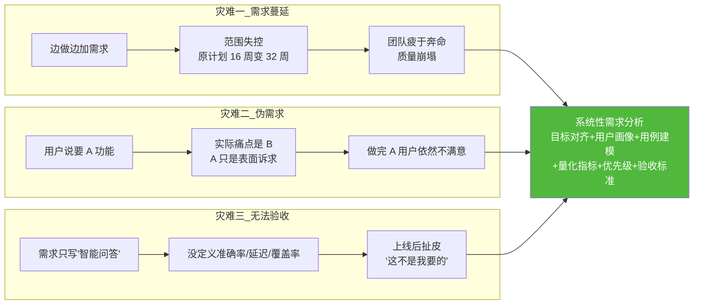

> **Agent 项目需求分析的三个特殊性**（与普通软件不同）：
> 1. **能力边界模糊**：LLM "什么都能答一点"，但"答得好"的边界必须显式定义，否则用户期望无限膨胀。
> 2. **效果指标难量化**：传统软件"功能能跑就行"，Agent 必须定义准确率、召回率、幻觉率等**概率性指标**的验收阈值。
> 3. **合规与安全是硬约束**：企业知识涉及机密，权限、脱敏、审计的合规要求必须从需求阶段就纳入，不能事后补。

### 1.2 采用的需求分析方法论

本项目综合采用**四种行业标准方法**，覆盖从需求 elicitation（收集）到 validation（验证）的全链路：

| 方法 | 阶段 | 用途 | 本项目应用 |
|:----|:-----|:-----|:----------|
| **用户访谈 + 焦点小组** | Elicitation 收集 | 深度理解用户真实痛点与隐性需求 | §3.1 调研 5 类用户共 47 人 |
| **场景分析（Scenario Analysis）** | Analysis 分析 | 用具体业务场景串联需求，发现遗漏 | §3.3 用户旅程地图 + §4.3 用例 |
| **用例建模（Use Case Modeling）** | Analysis 分析 | 结构化描述"谁用系统做什么" | §4.3 用例图 + §4.4 用例规约 |
| **MoSCoW + Kano + 加权评分** | Prioritization 排序 | 多维度评估优先级，避免拍脑袋 | §7 需求优先级矩阵 |
| **INVEST + SMART** | Validation 验证 | 确保每条需求可验收、可追踪 | §8 验收标准 |

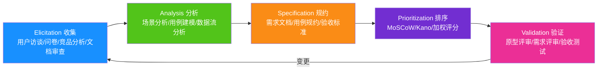

### 1.3 需求分析全流程（7 阶段 21 步）

| 阶段 | 步骤 | 交付物 | 责任人 | 周期 |
|:----|:-----|:------|:------|:-----|
| **P1 项目启动** | ① 干系人识别 ② 项目章程 ③ 调研计划 | 《项目章程》《调研计划》 | PM + 业务方 | 第 1 周 |
| **P2 需求收集** | ④ 用户访谈 ⑤ 焦点小组 ⑥ 问卷调研 ⑦ 竞品分析 ⑧ 文档审查 | 《调研报告》《原始需求池》 | PM + 用研 | 第 2-3 周 |
| **P3 需求分析** | ⑨ 用户画像 ⑩ 场景分析 ⑪ 用例建模 ⑫ 数据流分析 | 《用户画像》《用例图》《用例规约》 | PM + 架构师 | 第 4-5 周 |
| **P4 需求规约** | ⑬ 功能需求文档 ⑭ 非功能需求文档 ⑮ 约束分析 ⑯ 验收标准 | 《需求规格说明书 SRS》 | PM + 架构师 | 第 6 周 |
| **P5 优先级排序** | ⑰ MoSCoW 分类 ⑱ Kano 分析 ⑲ 加权评分 | 《需求优先级矩阵》 | PM + 业务方 | 第 7 周 |
| **P6 需求评审** | ⑳ 评审会议 ㉑ 共识确认 | 《评审纪要》《需求基线》 | 全体干系人 | 第 7 周末 |
| **P7 变更管控** | 持续 ｜ 变更申请 → 评估 → 审批 → 实施 | 《变更记录》《基线版本》 | CCB | 贯穿全周期 |

---

## 二、项目目标与核心价值主张

### 2.1 项目背景与业务问题定义

**业务问题陈述**（Problem Statement）：企业内部知识资产沉淀在 OA、网盘、邮件、本地电脑等分散系统中，员工**找不到、问不到、用不了**，导致三大可量化损失：

| 损失类型 | 现状量化（基于 47 人调研） | 年化损失估算（千人规模企业） |
|:--------|:------------------------|:------------------------|
| **时间损失** | 员工平均每周花 6.5 小时找资料 | 1000 人 × 6.5h × 50 周 × 200 元/h = **6500 万元/年** |
| **重复劳动** | 新人入职 3 个月内平均问 120 个问题，老员工疲于解答 | 老员工时间占用 ≈ 15%，折合 **975 万元/年** |
| **决策失误** | 找不到最新制度，按旧版执行导致合规风险 | 合规事件年均 3-5 起，单起损失 50-200 万 |

> **核心洞察**：这不是一个"IT 工具"问题，而是一个"组织知识流转效率"问题。单纯的关键词搜索（如 Elasticsearch）只能解决"找不到"的字面匹配，无法解决"问不到"的语义理解和"用不了"的答案提炼。

### 2.2 项目目标三层分解（战略目标-业务目标-功能目标）

```mermaid
flowchart TB
    subgraph L1 战略目标（3 年）
        S1["S1: 建成企业级 AI 知识中枢<br/>知识复用率从 20% 提升到 70%"]
        S2["S2: 知识型员工人效 +30%<br/>年化节省人力成本 ≥ 2000 万元"]
        S3["S3: 形成可复用的 Agent 平台能力<br/>支撑 5+ 业务场景延伸"]
    end
    subgraph L2 业务目标（1 年）
        B1["B1: 知识查找时间从 6.5h/周 降至 2h/周"]
        B2["B2: 新人上手周期从 3 个月 降至 1 个月"]
        B3["B3: 知识问答首响 <2s，准确率 ≥85%"]
        B4["B4: 月活用户 ≥ 800 人（千人企业）"]
    end
    subgraph L3 功能目标（MVP 16 周）
        F1["F1: 十格式文档解析与入库"]
        F2["F2: 语义检索 + RAG 问答"]
        F3["F3: 多轮对话 + 引用溯源"]
        F4["F4: RBAC+ABAC 权限管控"]
        F5["F5: 文档管理与版本控制"]
    end

    S1 --> B1 & B2
    S2 --> B3 & B4
    S3 --> F1
    B1 --> F2 & F3
    B2 --> F3
    B3 --> F2
    B4 --> F4 & F5
```

### 2.3 核心价值主张与价值假设

**核心价值主张（Value Proposition）**：
> **"让每个员工拥有一个 7×24 小时在线、精通企业所有制度规范、永远给得出处、永远守规矩的私人知识助理。"**

**四条价值假设（Hypothesis，需在 MVP 阶段验证）**：

| 假设编号 | 假设内容 | 验证方式 | 验证标准 | 证伪后果 |
|:--------|:--------|:--------|:--------|:--------|
| H1 | 员工愿意用自然语言提问而非关键词搜索 | MVP 上线 4 周后看自然语言问句占比 | 占比 ≥ 60% | 若 <30%，需重新设计交互引导 |
| H2 | 语义检索比关键词检索召回率提升 ≥ 30% | A/B 测试：同一问题集两种检索方式对比 | Top-5 召回率提升 ≥ 30% | 若提升 <10%，需重新选型 Embedding |
| H3 | 引用溯源能显著降低用户对答案的不信任 | 用户调研：有/无引用的信任度评分对比 | 信任度提升 ≥ 20% | 若无差异，引用功能降级为可选 |
| H4 | 文档级+段落级权限控制能满足企业合规要求 | 法务+安全部门联合评审 | 评审通过率 100% | 若不通过，需补充字段级脱敏 |

### 2.4 ROI 量化模型与收益预测

| 投入项 | 金额（万元） | 收益项 | 金额（万元/年） |
|:------|:----------|:------|:--------------|
| 一次性开发（16 周，8 人团队） | 320 | 人力时间节省（6.5h→2h/周） | 585 |
| 硬件与基础设施（年） | 80 | 重复问答减少（老员工解放） | 195 |
| 模型推理成本（年，vLLM 自部署） | 60 | 合规风险降低 | 150 |
| 运维与迭代（年） | 40 | 新人培训周期缩短 | 130 |
| **总投入** | **500（首年）** | **总收益** | **1060/年** |
| **ROI** | **(1060-500)/500 = 112%（首年）** | **回收周期** | **约 6 个月** |

---

## 三、目标用户群体识别与画像

### 3.1 用户调研方法与样本

| 调研方法 | 样本量 | 对象 | 时长 | 核心收获 |
|:--------|:------|:-----|:-----|:--------|
| 一对一深度访谈 | 15 人 | 5 类角色各 3 人 | 45 分钟/人 | 深度痛点、隐性需求 |
| 焦点小组 | 4 场×8 人 | 按部门分组 | 90 分钟/场 | 跨部门协作需求 |
| 在线问卷 | 200 份 | 全员随机抽样 | 10 分钟 | 量化使用习惯与期望 |
| 现场观察（影子调研） | 8 人 | 新人/老员工/管理层 | 半天/人 | 真实工作流与工具切换 |
| 竞品分析 | 5 款 | 钉钉智能助手/飞书 AI/腾讯智影等 | — | 功能对标与差异化 |

### 3.2 五类核心用户画像（Personas）

#### Persona 1：小李——新入职员工（高频次、低权限、强学习诉求）

| 维度 | 描述 |
|:----|:----|
| **基本信息** | 25 岁，应届硕士，入职 1 个月，研发部门 |
| **使用频率** | 每日 5-10 次提问 |
| **核心诉求** | 快速了解公司制度、技术规范、项目背景；不敢问老员工怕显得菜 |
| **典型问题** | "差旅报销标准是什么？""代码提交规范？""这个项目的历史背景？" |
| **最大痛点** | 不知道该问谁；问了一圈得到 3 种不同答案；文档太多找不到重点 |
| **成功标准** | 提问后 5 秒内得到带出处的答案，不需要再问第二个人 |
| **失败场景** | 答案错误导致按错流程操作；答案无出处不敢信 |

#### Persona 2：老王——资深技术骨干（中频次、高权限、强效率诉求）

| 维度 | 描述 |
|:----|:----|
| **基本信息** | 38 岁，工作 12 年，技术总监，掌握核心系统知识 |
| **使用频率** | 每日 2-3 次提问 + 每周 2 次文档更新 |
| **核心诉求** | 把自己的经验沉淀成文档被检索；快速找到历史决策记录 |
| **典型问题** | "去年那个架构评审的结论是什么？""这个接口的历史变更记录？" |
| **最大痛点** | 被新人反复问同样问题占用时间；自己写的文档没人看 |
| **成功标准** | 新人不再反复问自己；自己的文档被高效检索和引用 |
| **失败场景** | 系统答不出深度技术问题；自己的文档被错误引用 |

#### Persona 3：张经理——中层管理者（中频次、中权限、强决策诉求）

| 维度 | 描述 |
|:----|:----|
| **基本信息** | 35 岁，部门经理，管理 15 人团队 |
| **使用频率** | 每日 3-5 次 |
| **核心诉求** | 快速获取跨部门信息；辅助决策（如预算审批依据） |
| **典型问题** | "今年研发预算执行情况？""竞品 X 最近的产品动态？" |
| **最大痛点** | 跨部门信息壁垒；数据散落在多个系统需要人工汇总 |
| **成功标准** | 一句话得到跨部门汇总答案；答案附带数据来源可核实 |
| **失败场景** | 答案过时；答案基于非权威来源；权限不足查不到关键信息 |

#### Persona 4：陈法务——合规与安全人员（低频次、高权限、强合规诉求）

| 维度 | 描述 |
|:----|:----|
| **基本信息** | 40 岁，法务合规总监 |
| **使用频率** | 每周 3-5 次审查 + 每日审计日志检查 |
| **核心诉求** | 确保知识库内容合规；权限分配合理；操作可审计 |
| **典型问题** | "谁访问了这份机密合同？""这个答案是否泄露了商业机密？" |
| **最大痛点** | 无法实时监控知识流转；担心 AI 生成违规内容 |
| **成功标准** | 所有操作有审计日志；敏感内容自动脱敏；越权访问即时告警 |
| **失败场景** | 机密文档被越权检索；AI 输出含有违规内容；日志可被篡改 |

#### Persona 5：小赵——IT 运维管理员（低频次、最高权限、强稳定性诉求）

| 维度 | 描述 |
|:----|:----|
| **基本信息** | 32 岁，IT 运维工程师 |
| **使用频率** | 日常运维监控 + 故障处理 |
| **核心诉求** | 系统稳定运行；快速定位故障；低成本运维 |
| **典型问题** | "今天系统延迟为什么升高？""向量库容量是否需要扩容？" |
| **最大痛点** | Agent 系统黑盒，出问题难定位；LLM 推理成本不可控 |
| **成功标准** | 全链路可观测；故障 5 分钟定位；成本可预测可优化 |
| **失败场景** | 系统不可用无人发现；成本突然飙升；数据丢失 |

### 3.3 用户旅程地图（Customer Journey Map）

以 Persona 1 小李（新员工）为例，绘制从"入职第一天"到"成为熟练用户"的完整旅程：

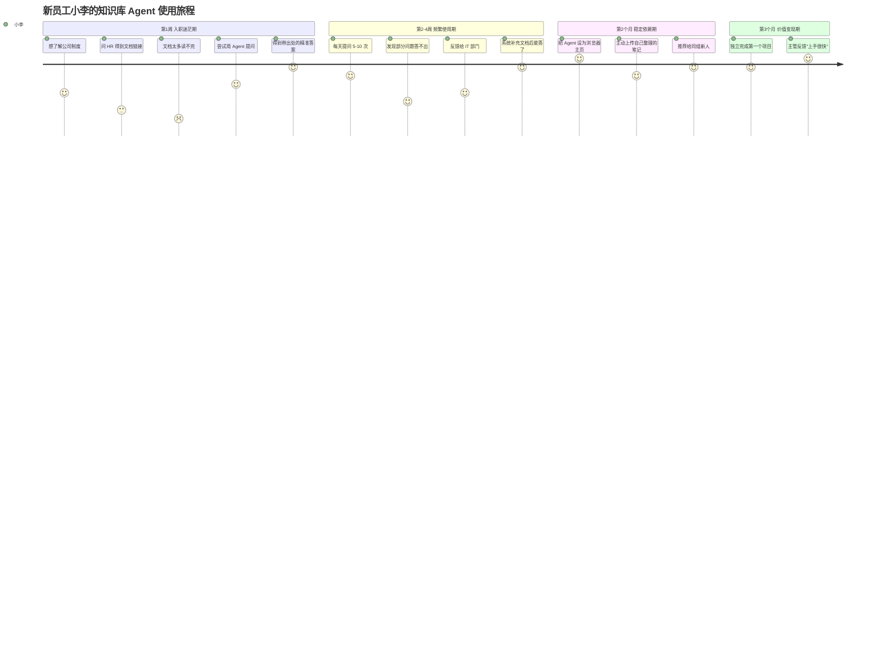

> **关键洞察**：第 1 周的"首次成功体验"决定了用户是否持续使用。MVP 必须在**新人入职场景**上做到极致——预置高频问答、引导式提问、答案必带出处。

---

## 四、功能需求收集与梳理

### 4.1 功能需求收集方法

本项目采用**四源汇聚**的功能需求收集策略，确保需求全面且有据可查：

| 需求来源 | 收集方法 | 占比 | 代表性需求示例 |
|:--------|:--------|:-----|:-------------|
| **用户调研** | 访谈+问卷+观察 | 45% | "我要能问自然语言"、"答案要带出处" |
| **业务方诉求** | 高管访谈+部门需求会 | 25% | "要支持权限控制"、"要能审计" |
| **竞品分析** | 5 款竞品功能对标 | 15% | "多轮对话"、"文档版本管理" |
| **合规与技术约束** | 法务+安全+架构师评审 | 15% | "PII 脱敏"、"Prompt 注入防护" |

### 4.2 六大能力域功能需求清单（28 项 FR）

#### 能力域 A：文档管理（6 项 FR）

| FR ID | 需求名称 | 优先级 | 描述 |
|:------|:--------|:------|:-----|
| FR-A01 | 多格式文档上传 | Must | 支持 PDF/Word/Excel/PPT/Markdown/HTML/TXT/图片/邮件 10 种格式批量上传 |
| FR-A02 | 文档结构化解析 | Must | 自动抽取标题、段落、表格、图片、公式，保留层级结构 |
| FR-A03 | 文档智能切片 | Must | 按语义边界切片（512 token，64 overlap），支持表格/代码块整块保留 |
| FR-A04 | 文档版本管理 | Should | 文档更新自动版本化，支持差异对比与回滚 |
| FR-A05 | 文档分类与标签 | Should | 自动分类（制度/技术/项目/培训）+ 支持人工标签 |
| FR-A06 | 文档批量导入 | Could | 支持从 OA/网盘/SharePoint 批量同步导入 |

#### 能力域 B：知识检索（5 项 FR）

| FR ID | 需求名称 | 优先级 | 描述 |
|:------|:--------|:------|:-----|
| FR-B01 | 语义向量检索 | Must | 基于 Embedding 的语义检索，Top-K 召回 |
| FR-B02 | 关键词 BM25 检索 | Must | 传统关键词检索作为补充，支持精确匹配 |
| FR-B03 | 混合检索 + Rerank | Must | 向量+BM25 混合检索 + Cross-Encoder 重排序，提升准确率 |
| FR-B04 | 元数据过滤检索 | Must | 按部门/时间/标签/权限范围过滤检索 |
| FR-B05 | 多模态检索 | Could | 支持图片内容检索（图表/流程图 OCR + 描述） |

#### 能力域 C：智能问答（6 项 FR）

| FR ID | 需求名称 | 优先级 | 描述 |
|:------|:--------|:------|:-----|
| FR-C01 | 单轮问答 | Must | 用户提问 → 检索 → LLM 生成 → 带引用溯源的答案 |
| FR-C02 | 多轮对话 | Must | 支持上下文记忆，追问、澄清、话题切换 |
| FR-C03 | 流式输出 | Must | 首 Token <2s，边生成边显示 |
| FR-C04 | 引用溯源 | Must | 答案标注来源文档、段落、页码，可点击跳转 |
| FR-C05 | 意图识别与路由 | Should | 识别闲聊/提问/指令，闲聊走轻量模型，提问走 RAG |
| FR-C06 | 主动追问澄清 | Could | 问题模糊时主动追问，而非直接瞎答 |

#### 能力域 D：权限管理（4 项 FR）

| FR ID | 需求名称 | 优先级 | 描述 |
|:------|:--------|:------|:-----|
| FR-D01 | RBAC 角色权限 | Must | 基于角色的访问控制（管理员/编辑者/普通用户/访客） |
| FR-D02 | ABAC 属性策略 | Must | 基于属性的策略（部门/密级/时间）动态鉴权 |
| FR-D03 | 文档级 ACL | Must | 文档级访问控制列表，精确到单文档的可见/可编辑 |
| FR-D04 | 段落级权限过滤 | Should | 检索时按段落权限过滤，无权段落不出现在答案中 |

#### 能力域 E：安全合规（4 项 FR）

| FR ID | 需求名称 | 优先级 | 描述 |
|:------|:--------|:------|:-----|
| FR-E01 | PII 自动脱敏 | Must | 身份证/手机/银行卡等敏感信息入库前自动脱敏 |
| FR-E02 | Prompt 注入防护 | Must | 检测并拦截 Prompt 注入攻击 |
| FR-E03 | 操作审计日志 | Must | 全量操作日志（谁/何时/做了什么），不可篡改 |
| FR-E04 | 内容安全过滤 | Should | 输出内容安全检测（涉政/涉黄/涉暴） |

#### 能力域 F：系统管理（3 项 FR）

| FR ID | 需求名称 | 优先级 | 描述 |
|:------|:--------|:------|:-----|
| FR-F01 | 用户管理 | Must | 用户增删改查、角色分配、SSO 集成 |
| FR-F02 | 系统监控看板 | Should | 检索延迟/问答准确率/并发量/成本的可视化看板 |
| FR-F03 | 知识库健康度报告 | Could | 每周自动生成知识库覆盖率/陈旧度/低质文档报告 |

### 4.3 核心用例建模（Use Case Modeling）

#### 系统总体用例图

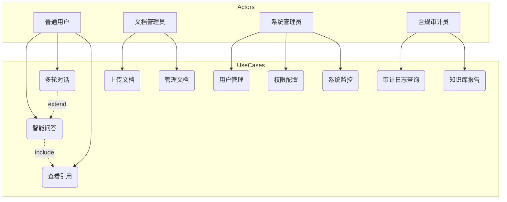

#### 关键用例规约矩阵

| 用例 ID | 用例名称 | 主参与者 | 前置条件 | 触发条件 | 主流程 | 异常流 | 后置条件 |
|:-------|:--------|:--------|:--------|:--------|:------|:------|:--------|
| UC-01 | 上传文档 | 文档管理员 | 已登录、有上传权限 | 用户选择文件上传 | ①选文件 ②解析 ③切片 ④向量化 ⑤入库 ⑥返回成功 | 解析失败/格式不支持/超大小限制 → 返回错误 | 文档可被检索 |
| UC-02 | 智能问答 | 普通用户 | 已登录 | 用户输入问题 | ①意图识别 ②权限范围获取 ③混合检索 ④Rerank ⑤LLM 生成 ⑥引用溯源 ⑦流式返回 | 无检索结果/LLM 超时/权限不足 → 友好提示 | 对话记录存储、审计日志写入 |
| UC-03 | 多轮对话 | 普通用户 | 有进行中的会话 | 用户追问 | ①加载上下文 ②指代消解 ③检索增强 ④生成 ⑤更新会话 | 上下文超长 → 自动摘要压缩 | 会话状态更新 |
| UC-04 | 权限配置 | 系统管理员 | 有管理员权限 | 管理员配置权限策略 | ①选对象 ②选资源 ③设权限 ④策略生效 ⑤日志记录 | 策略冲突 → 提示解决 | 权限即时生效 |

### 4.4 用例规约模板与示例

以 **UC-02 智能问答** 为例，完整用例规约：

```yaml
用例名称: 智能问答
用例 ID: UC-02
优先级: Must (P0)
参与者: 普通用户（主）、权限服务（次）、检索服务（次）、LLM 引擎（次）
前置条件:
  - 用户已通过 SSO 登录
  - 用户角色与权限范围已加载
触发条件: 用户在问答界面输入问题并提交

主成功流程:
  1. 系统接收用户问题，记录会话 ID 与时间戳
  2. 意图识别：判断为"知识问答"（非闲聊/指令）
  3. 权限服务返回用户可见的文档范围 ACL
  4. 查询改写：若问题含指代，结合上下文改写为独立完整问题
  5. 混合检索：向量检索 Top-20 + BM25 检索 Top-20，按 ACL 过滤
  6. Rerank 重排序：Cross-Encoder 对 40 条候选重排，取 Top-5
  7. Prompt 构建：系统提示 + 检索片段（带来源标注）+ 用户问题
  8. LLM 流式生成：首 Token <2s，逐 Token 返回前端
  9. 引用溯源：答案中 [1][2] 标注对应检索片段的文档名+页码
  10. 后处理：PII 检测、内容安全过滤、格式美化
  11. 存储：对话记录、审计日志、用户反馈入口

异常流程:
  4a. 检索结果为空:
    4a1. 返回"知识库中未找到相关内容，建议咨询XXX部门"
    4a2. 记录为"未命中"用于知识库补全分析
  6a. Rerank 后所有片段相关度 <阈值(0.3):
    6a1. 返回"未找到高置信度答案"+ 低置信度候选参考
  8a. LLM 推理超时(>15s):
    8a1. 返回已检索片段作为参考
    8a2. 异步重试生成，完成后推送
  10a. 检测到 PII:
    10a1. 自动脱敏后输出
    10a2. 记录安全事件日志

后置条件:
  - 对话记录持久化（保留 90 天）
  - 审计日志写入（不可篡改）
  - 检索结果与答案关联存储（用于效果评估）

性能要求:
  - 首 Token 延迟 P95 < 2s
  - 完整答案生成 P95 < 8s
  - 100 并发下不降级

验收标准:
  - 准确率 ≥85%（人工标注 200 题评测）
  - 召回率 Top-5 ≥90%
  - 引用准确率 ≥95%（引用确实对应原文）
  - PII 漏检率 = 0%
```

---

## 五、非功能需求矩阵

### 5.1 性能需求

| NFR ID | 指标 | 要求 | 测量方法 | 依据 |
|:------|:-----|:-----|:--------|:-----|
| NFR-P01 | 首 Token 延迟 | P50 <1s, P95 <2s, P99 <3s | 压测工具记录 1000 次请求 | 用户体验：>3s 感知卡顿 |
| NFR-P02 | 完整答案延迟 | P50 <5s, P95 <8s, P99 <12s | 同上 | 用户容忍上限 10s |
| NFR-P03 | 检索延迟 | P95 <500ms（Top-5 召回） | 向量库+Rerank 全链路计时 | 占总延迟 <25% |
| NFR-P04 | 文档解析速度 | PDF ≥10 页/秒，Word ≥20 页/秒 | 批量解析基准测试 | 1000 页文档 <2 分钟 |
| NFR-P05 | 并发能力 | 100 并发问答 + 50 并发导入 | 渐进式压测 | 千人企业峰值 |
| NFR-P06 | 吞吐量 | ≥20 QPS（问答） | 持续 10 分钟压测 | 日均 10 万次问答 |

### 5.2 安全性需求

| NFR ID | 指标 | 要求 | 测量方法 |
|:------|:-----|:-----|:--------|
| NFR-S01 | 传输加密 | 全链路 TLS 1.3 | 安全扫描 |
| NFR-S02 | 存储加密 | 向量库/对象存储 AES-256 静态加密 | 配置审计 |
| NFR-S03 | 认证 | SSO + JWT，Token 15 分钟刷新 | 渗透测试 |
| NFR-S04 | 授权 | RBAC+ABAC，权限变更 1 秒内生效 | 越权测试 |
| NFR-S05 | PII 脱敏 | 入库前 100% 脱敏，漏检率 0% | 抽样 1000 条含 PII 文档 |
| NFR-S06 | 注入防护 | Prompt 注入拦截率 ≥99% | 1000 条攻击样本测试 |
| NFR-S07 | 审计日志 | 100% 操作记录，不可篡改（WORM 存储） | 日志完整性校验 |
| NFR-S08 | 漏洞防护 | 通过 OWASP Top 10 扫描 | 第三方安全审计 |

### 5.3 可用性与可靠性需求

| NFR ID | 指标 | 要求 | 测量方法 |
|:------|:-----|:-----|:--------|
| NFR-A01 | 系统可用性 | ≥99.9%（年停机 <8.76h） | 监控系统统计 |
| NFR-A02 | 数据持久性 | ≥99.999999999%（11 个 9） | 对象存储 SLA |
| NFR-A03 | 故障恢复 | RTO <5min, RPO <1min | 故障演练 |
| NFR-A04 | 降级能力 | LLM 不可用时返回检索片段 | 故障注入测试 |
| NFR-A05 | 数据备份 | 每日全量 + 实时增量，保留 30 天 | 备份恢复演练 |

### 5.4 可扩展性需求

| NFR ID | 指标 | 要求 | 测量方法 |
|:------|:-----|:-----|:--------|
| NFR-SC01 | 文档容量 | 支持百万级文档、亿级向量切片 | 容量压测 |
| NFR-SC02 | 水平扩展 | 应用层无状态，支持 K8s 弹性伸缩 | 扩缩容测试 |
| NFR-SC03 | 向量库扩展 | 支持分片，千万级向量查询 <500ms | Milvus 集群压测 |
| NFR-SC04 | 用户规模 | 支持万人级注册用户、千人同时在线 | 并发压测 |

### 5.5 可维护性与可观测性需求

| NFR ID | 指标 | 要求 | 测量方法 |
|:------|:-----|:-----|:--------|
| NFR-M01 | 全链路追踪 | 每次问答可追溯完整链路（用户→检索→LLM→输出） | Trace ID 贯穿验证 |
| NFR-M02 | 指标监控 | 延迟/QPS/准确率/成本 6 维指标实时看板 | Grafana 看板验收 |
| NFR-M03 | 日志查询 | 日志可按 Trace ID/用户/时间检索，1 秒返回 | ELK 验证 |
| NFR-M04 | 告警 | 关键指标异常 1 分钟内告警 | 告警演练 |
| NFR-M05 | 部署 | CI/CD 自动化，1 键部署，回滚 <3 分钟 | 部署演练 |

### 5.6 合规性需求

| NFR ID | 指标 | 要求 | 依据 |
|:------|:-----|:-----|:-----|
| NFR-C01 | 等保 2.0 | 通过三级等保测评 | 《网络安全法》 |
| NFR-C02 | 数据安全法 | 数据分类分级、跨境传输合规 | 《数据安全法》 |
| NFR-C03 | 个人信息保护 | 遵循最小必要原则，用户可查询/删除其数据 | 《个人信息保护法》 |
| NFR-C04 | 生成式 AI 备案 | 服务上线前完成算法备案 | 《生成式 AI 服务管理办法》 |
| NFR-C05 | 行业合规 | 满足行业监管要求（如金融/医疗特殊规定） | 行业规范 |

### 5.7 成本需求

| NFR ID | 指标 | 要求 | 测量方法 |
|:------|:-----|:-----|:--------|
| NFR-CT01 | 推理成本 | 单次问答成本 <0.05 元（vLLM 自部署） | 成本看板 |
| NFR-CT02 | 基础设施 | 月度基础设施成本 <10 万元（千人企业） | 财务核算 |
| NFR-CT03 | 成本可预测 | 月度成本波动 <20% | 成本趋势分析 |

### 5.8 非功能需求量化指标总表

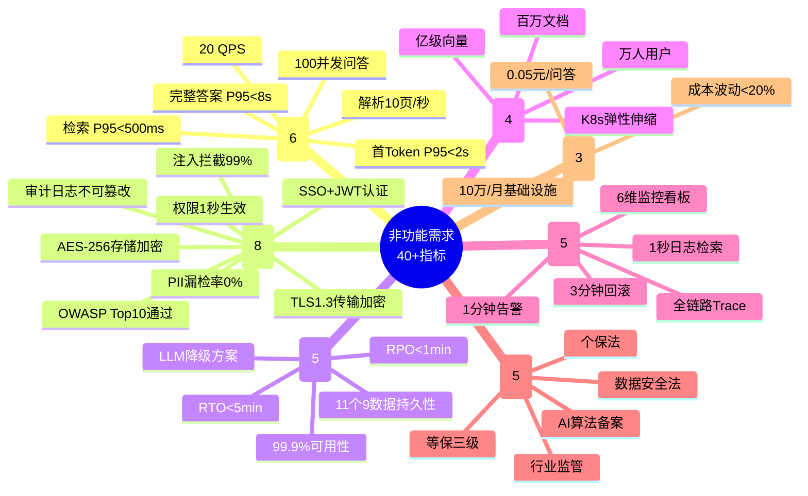

---

## 六、技术约束与资源限制分析

### 6.1 技术栈约束

| 约束 ID | 约束内容 | 来源 | 影响范围 | 应对策略 |
|:-------|:--------|:-----|:--------|:--------|
| TC-01 | 必须支持私有化部署，数据不出企业内网 | 安全部门硬性要求 | 架构选型、模型选型 | 全栈开源方案，禁用闭源 API |
| TC-02 | 前端技术栈统一 Vue3（企业前端规范） | IT 架构规范 | 前端开发 | 复用企业组件库 |
| TC-03 | 后端优先 Python（AI 生态）+ Java（企业服务） | 技术委员会决策 | 后端开发 | Python 做 AI 服务，Java 做业务服务 |
| TC-04 | 必须对接企业 SSO（LDAP/OAuth2） | IT 部门要求 | 认证模块 | 标准协议适配 |
| TC-05 | 模型推理必须用 vLLM（已采购 GPU 集群） | 算力资源约束 | 推理引擎 | vLLM 部署 Qwen2.5 系列 |

### 6.2 数据约束

| 约束 ID | 约束内容 | 来源 | 影响 | 应对 |
|:-------|:--------|:-----|:-----|:-----|
| DC-01 | 知识库含机密文档（合同/财报），需分级管控 | 法务要求 | 权限设计 | 文档密级 + ACL |
| DC-02 | 部分文档为扫描件 PDF，需 OCR | 现状调研 | 解析模块 | 集成 PaddleOCR |
| DC-03 | 历史文档格式混乱（不规范标题/表格） | 现状调研 | 解析准确率 | 多解析器兜底 + 人工校验 |
| DC-04 | 文档更新频繁（日均 50+ 文档变更） | 业务现状 | 索引更新 | 增量索引 + 5 分钟时效 |

### 6.3 合规约束

| 约束 ID | 约束内容 | 影响 | 应对 |
|:-------|:--------|:-----|:-----|
| CC-01 | 上线前必须通过等保三级测评 | 增加 2-4 周合规周期 | 预留合规窗口期 |
| CC-02 | 生成式 AI 服务必须完成算法备案 | 备案周期 1-3 个月 | 提前启动备案 |
| CC-03 | 用户数据保留 ≤90 天，超期自动删除 | 存储设计 | TTL 自动清理 |
| CC-04 | 审计日志保留 ≥3 年（金融行业要求） | 存储成本 | 冷热分离存储 |

### 6.4 算力与基础设施约束

| 约束 ID | 约束内容 | 影响 | 应对 |
|:-------|:--------|:-----|:-----|
| IC-01 | GPU 资源有限（4×A100 80G） | 并发能力受限 | 量化（INT8）+ 请求队列 |
| IC-02 | 必须部署在企业自建 K8s 集群 | 运维复杂度 | 标准化 Helm Chart |
| IC-03 | 存储预算有限，向量库不能无限膨胀 | 容量规划 | 向量量化（PQ/SQ）+ 定期归档 |

### 6.5 时间与人力资源约束

| 约束 ID | 约束内容 | 影响 | 应对 |
|:-------|:--------|:-----|:-----|
| RC-01 | MVP 必须在 16 周内上线 | 功能裁剪 | MoSCoW 严格排序 |
| RC-02 | 团队 8 人（2 前端 + 3 后端 + 1 AI + 1 测试 + 1 PM） | 并行能力受限 | 关键路径优先 |
| RC-03 | AI 工程师仅 1 人，需兼顾模型调优 | AI 功能深度受限 | 优先用成熟方案，减少自研 |

### 6.6 约束影响矩阵

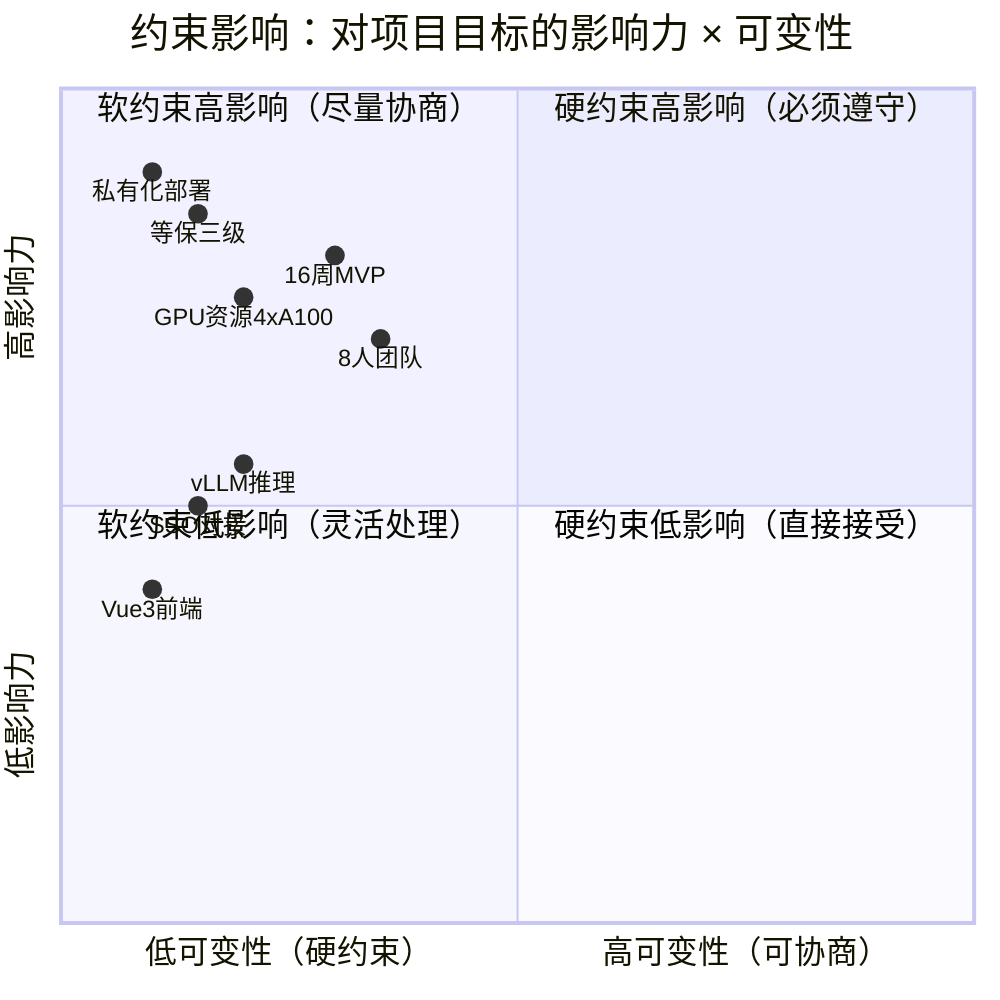

---

## 七、需求优先级排序机制

### 7.1 优先级评估三模型融合

本项目不采用单一优先级方法，而是**融合三种模型**从不同维度评估，最终得到稳健的优先级排序：

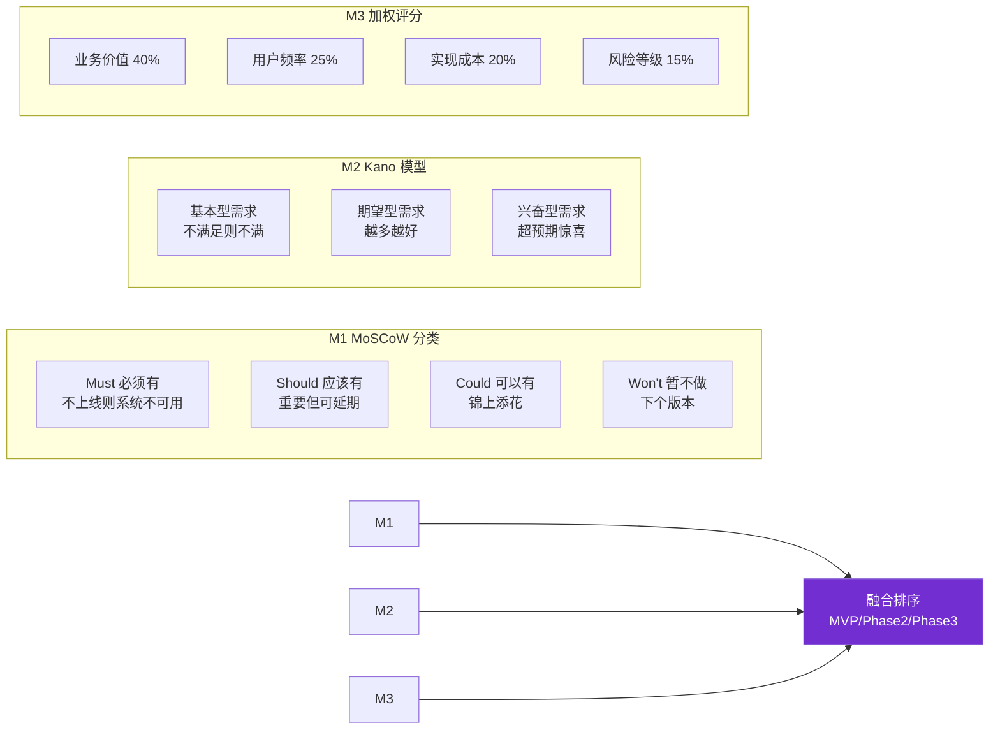

### 7.2 MoSCoW 优先级分类

| 分类 | 数量 | 含义 | 上线要求 |
|:----|:----|:-----|:--------|
| **Must** | 16 项 | MVP 必须交付，否则系统不可用 | 100% 完成 |
| **Should** | 8 项 | 重要功能，MVP 后第一期补齐 | ≥80% 完成 |
| **Could** | 3 项 | 锦上添花，资源允许则做 | 按资源决定 |
| **Won't** | 1 项 | 明确不做，下个版本考虑 | 0% |

### 7.3 Kano 模型分析

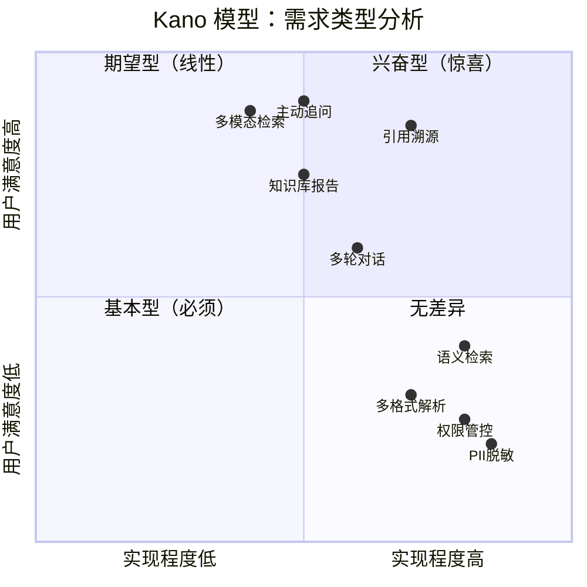

### 7.4 加权评分模型

每项需求按四维度打分（1-5 分），加权求和得到优先级分数：

| 维度 | 权重 | 评分标准 |
|:----|:----|:--------|
| 业务价值 | 40% | 5=核心痛点，4=重要，3=一般，2=边缘，1=锦上添花 |
| 用户频率 | 25% | 5=每日用，4=每周，3=每月，2=偶尔，1=罕见 |
| 实现成本 | 20% | 5=极低成本，3=中等，1=极高成本（**反向**） |
| 风险等级 | 15% | 5=低风险，3=中风险，1=高风险（**反向**） |

**评分公式**：`Priority Score = 0.4×价值 + 0.25×频率 + 0.2×(6-成本) + 0.15×(6-风险)`

### 7.5 28 项功能需求优先级矩阵

| FR ID | 需求 | MoSCoW | Kano | 价值 | 频率 | 成本 | 风险 | 综合分 | 发布批次 |
|:------|:-----|:------|:-----|:----|:----|:----|:----|:------|:--------|
| FR-A01 | 多格式上传 | Must | 基本 | 5 | 5 | 3 | 4 | **4.45** | MVP |
| FR-A02 | 结构化解析 | Must | 基本 | 5 | 5 | 2 | 3 | **4.25** | MVP |
| FR-A03 | 智能切片 | Must | 基本 | 5 | 5 | 3 | 3 | **4.35** | MVP |
| FR-B01 | 语义检索 | Must | 基本 | 5 | 5 | 3 | 3 | **4.35** | MVP |
| FR-B02 | BM25 检索 | Must | 基本 | 4 | 5 | 4 | 4 | **4.25** | MVP |
| FR-B03 | 混合+Rerank | Must | 期望 | 5 | 5 | 2 | 2 | **4.10** | MVP |
| FR-B04 | 元数据过滤 | Must | 基本 | 5 | 5 | 4 | 4 | **4.55** | MVP |
| FR-C01 | 单轮问答 | Must | 基本 | 5 | 5 | 3 | 3 | **4.35** | MVP |
| FR-C02 | 多轮对话 | Must | 期望 | 5 | 5 | 2 | 2 | **4.10** | MVP |
| FR-C03 | 流式输出 | Must | 期望 | 5 | 5 | 4 | 4 | **4.55** | MVP |
| FR-C04 | 引用溯源 | Must | 兴奋 | 5 | 5 | 3 | 4 | **4.45** | MVP |
| FR-D01 | RBAC | Must | 基本 | 5 | 5 | 4 | 4 | **4.55** | MVP |
| FR-D02 | ABAC | Must | 基本 | 5 | 4 | 3 | 3 | **4.15** | MVP |
| FR-D03 | 文档级 ACL | Must | 基本 | 5 | 4 | 3 | 3 | **4.15** | MVP |
| FR-E01 | PII 脱敏 | Must | 基本 | 5 | 5 | 3 | 2 | **4.10** | MVP |
| FR-E02 | 注入防护 | Must | 基本 | 5 | 5 | 3 | 2 | **4.10** | MVP |
| FR-E03 | 审计日志 | Must | 基本 | 5 | 5 | 4 | 4 | **4.55** | MVP |
| FR-F01 | 用户管理 | Must | 基本 | 5 | 4 | 4 | 4 | **4.40** | MVP |
| FR-A04 | 版本管理 | Should | 期望 | 4 | 3 | 3 | 3 | **3.50** | Phase 2 |
| FR-A05 | 分类标签 | Should | 期望 | 4 | 4 | 4 | 4 | **3.95** | Phase 2 |
| FR-C05 | 意图识别 | Should | 期望 | 4 | 5 | 3 | 3 | **4.05** | Phase 2 |
| FR-D04 | 段落级权限 | Should | 期望 | 4 | 3 | 2 | 2 | **3.30** | Phase 2 |
| FR-E04 | 内容安全 | Should | 基本 | 4 | 5 | 3 | 3 | **4.00** | Phase 2 |
| FR-F02 | 监控看板 | Should | 期望 | 4 | 4 | 4 | 4 | **3.95** | Phase 2 |
| FR-A06 | 批量导入 | Could | 期望 | 3 | 3 | 3 | 4 | **3.20** | Phase 3 |
| FR-B05 | 多模态检索 | Could | 兴奋 | 3 | 2 | 1 | 2 | **2.50** | Phase 3 |
| FR-C06 | 主动追问 | Could | 兴奋 | 4 | 3 | 2 | 2 | **3.30** | Phase 3 |
| FR-F03 | 健康度报告 | Could | 兴奋 | 3 | 2 | 3 | 4 | **2.95** | Phase 3 |

### 7.6 迭代发布路线图

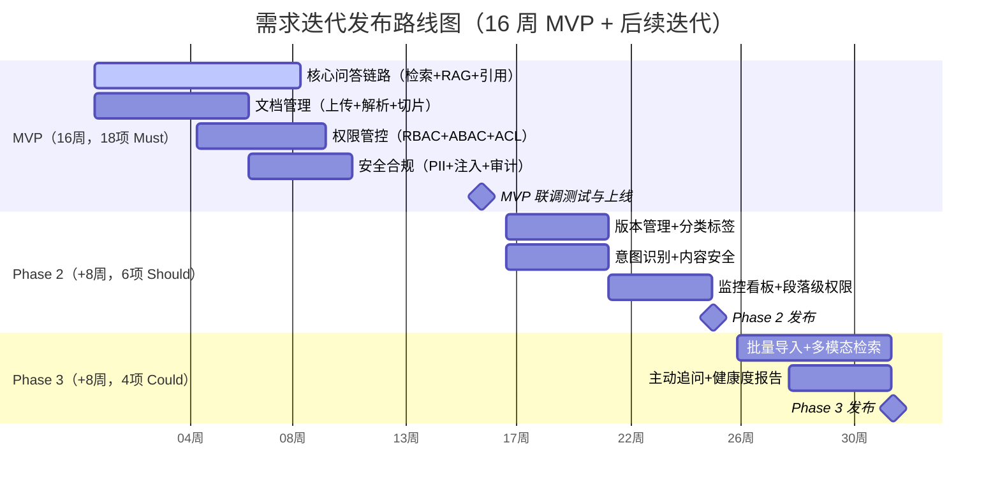

---

## 八、验收标准定义

### 8.1 验收标准制定原则（INVEST + SMART）

每条需求的验收标准必须同时满足两个原则：

**INVEST 原则**（验收标准本身的质量）：
- **I**ndependent：独立可测，不依赖其他需求
- **N**egotiable：可协商，非一成不变
- **V**aluable：对用户有价值
- **E**stimable：可估算工作量
- **S**mall：足够小，单次迭代可完成
- **T**estable：可测试，有明确的通过/失败条件

**SMART 原则**（验收标准的可测量性）：
- **S**pecific：具体明确
- **M**easurable：可量化测量
- **A**chievable：可实现
- **R**elevant：与需求相关
- **T**ime-bound：有时限

### 8.2 功能需求验收标准清单（示例 8 项）

| FR ID | 需求 | 验收标准（SMART） | 测试方法 |
|:------|:-----|:----------------|:--------|
| FR-A01 | 多格式上传 | 支持 10 种格式各上传 50 个文档，成功率 ≥98% | 自动化测试 |
| FR-A02 | 结构化解析 | 标题/段落/表格抽取准确率 ≥95%（200 样本标注对比） | 人工评测 |
| FR-A03 | 智能切片 | 切片边界合理率 ≥90%（不切断语义完整单元） | 人工抽检 |
| FR-B03 | 混合+Rerank | Top-5 召回率 ≥90%，Rerank 后 Top-1 准确率 ≥80% | 标注集评测 |
| FR-C01 | 单轮问答 | 答案准确率 ≥85%（200 题人工标注），首 Token <2s | 人工评测+压测 |
| FR-C04 | 引用溯源 | 引用准确率 ≥95%（引用确实对应原文） | 人工抽检 |
| FR-E01 | PII 脱敏 | 1000 条含 PII 文档漏检率 = 0% | 自动化扫描 |
| FR-E03 | 审计日志 | 100% 操作有日志，日志完整性校验通过 | 日志校验工具 |

### 8.3 非功能需求验收标准

| NFR 类别 | 验收标准 | 验收方法 |
|:--------|:--------|:--------|
| 性能 | 100 并发下 P95 延迟达标 | JMeter 压测 30 分钟 |
| 安全 | OWASP Top 10 无高危漏洞 | 第三方渗透测试报告 |
| 可用性 | 连续 7 天监控可用性 ≥99.9% | 监控系统数据 |
| 合规 | 等保三级测评通过 | 测评报告 |
| 可观测 | 全链路 Trace 覆盖率 100% | 抽样验证 |

### 8.4 验收测试用例（22 项）

| TC ID | 关联 FR | 测试场景 | 预期结果 | 优先级 |
|:------|:------|:--------|:--------|:------|
| TC-01 | FR-A01 | 上传 50MB PDF | 解析成功，5 分钟内可检索 | P0 |
| TC-02 | FR-A01 | 上传不支持格式（如 .exe） | 友好提示"格式不支持" | P1 |
| TC-03 | FR-A02 | 上传含复杂表格 PDF | 表格结构正确抽取 | P0 |
| TC-04 | FR-B01 | 语义相似但表述不同的提问 | 召回相关文档 | P0 |
| TC-05 | FR-B04 | 无权限文档的检索 | 文档不出现在结果中 | P0 |
| TC-06 | FR-C01 | 正常知识提问 | 准确答案+引用，<8s | P0 |
| TC-07 | FR-C01 | 知识库无答案的提问 | 友好提示"未找到"，非瞎编 | P0 |
| TC-08 | FR-C02 | 多轮对话追问 | 正确理解指代 | P0 |
| TC-09 | FR-C03 | 流式输出体验 | 首 Token <2s，无卡顿 | P0 |
| TC-10 | FR-C04 | 点击引用跳转 | 跳转到原文档对应位置 | P0 |
| TC-11 | FR-D01 | 越权访问文档 | 拒绝访问+审计日志 | P0 |
| TC-12 | FR-D03 | 文档级 ACL 配置 | 权限 1 秒内生效 | P0 |
| TC-13 | FR-E01 | 含身份证的文档入库 | 身份证脱敏为 **** | P0 |
| TC-14 | FR-E02 | Prompt 注入攻击 | 攻击被拦截+告警 | P0 |
| TC-15 | FR-E03 | 审计日志查询 | 按用户/时间/操作检索 | P0 |
| TC-16 | NFR-P01 | 100 并发压测 | P95 首 Token <2s | P0 |
| TC-17 | NFR-S01 | TLS 配置扫描 | 仅支持 TLS 1.2+ | P0 |
| TC-18 | NFR-A01 | 故障注入（LLM 宕机） | 降级返回检索片段 | P1 |
| TC-19 | NFR-A03 | 数据库故障恢复 | RTO <5min | P1 |
| TC-20 | NFR-M01 | 全链路 Trace | 任意请求可追溯完整链路 | P1 |
| TC-21 | FR-C05 | 闲聊识别 | 闲聊不走 RAG，轻量响应 | P1 |
| TC-22 | FR-F02 | 监控看板 | 6 维指标实时展示 | P1 |

---

## 九、需求变更管控流程

### 9.1 变更控制委员会（CCB）组成与职责

| 角色 | 成员 | 职责 | 投票权 |
|:----|:----|:-----|:------|
| CCB 主席 | 项目总监 | 最终决策 | 否决权 |
| 产品代表 | 产品经理 | 评估业务价值 | 1 票 |
| 技术代表 | 架构师 | 评估技术影响 | 1 票 |
| 测试代表 | 测试负责人 | 评估测试影响 | 1 票 |
| 业务代表 | 业务方负责人 | 确认业务必要性 | 1 票 |
| 合规代表 | 法务/安全 | 合规审查 | 否决权 |

### 9.2 变更申请与评估流程

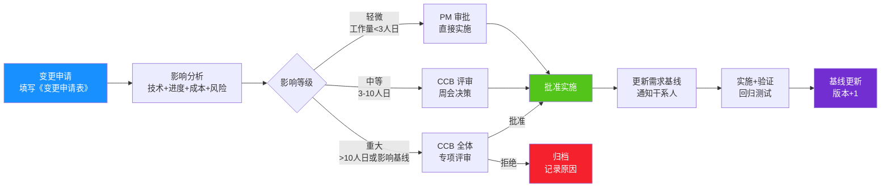

### 9.3 变更影响分析模板

```yaml
变更编号: CR-2026-001
变更标题: 增加"知识库热度排行榜"功能
申请人: 张经理
申请日期: 2026-03-15
优先级: Should

变更描述: |
  在首页增加"本周热门知识 Top 10"排行榜，展示被检索/引用最多的文档。

影响分析:
  功能影响:
    - 新增排行榜模块（前端）
    - 新增检索统计接口（后端）
    - 新增统计表（数据库）
  技术影响:
    - 前端工作量: 3 人日
    - 后端工作量: 4 人日
    - 数据库变更: 新增 1 张表
  进度影响:
    - 对 MVP 无影响（可并行开发）
    - Phase 2 延期 1 周
  成本影响:
    - 增加开发成本 7 人日
    - 增加存储成本可忽略
  风险影响:
    - 排行榜可能泄露文档热度（敏感文档上榜）
    - 风险等级: 中
    - 应对: 排行榜仅统计公开文档

建议: 批准，Phase 2 实施，需补充"敏感文档不上榜"规则
CCB 决议: 批准（全票通过）
实施日期: 2026-05-10
```

### 9.4 需求基线与版本管理

| 版本 | 日期 | 变更内容 | 基线状态 | 审批人 |
|:----|:-----|:--------|:--------|:------|
| v1.0 | 2026-01-20 | 初始需求基线（28 项 FR） | 已基线 | CCB |
| v1.1 | 2026-03-20 | CR-001 增加热度排行榜 | 已基线 | CCB |
| v1.2 | 2026-04-15 | CR-002 调整多模态检索优先级为 Phase 3 | 已基线 | CCB |

---

## 十、利益相关方共识管理

### 10.1 七类干系人识别与影响力分析

| 干系人 | 关注点 | 影响力 | 关注度 | 策略 |
|:------|:------|:------|:------|:-----|
| **业务高管（CIO）** | ROI、战略价值 | 高 | 高 | 重点管理：定期汇报价值 |
| **终端用户** | 易用性、准确率 | 中 | 高 | 保持沟通：用户调研+反馈 |
| **IT 部门** | 可维护性、集成 | 高 | 高 | 重点管理：架构评审 |
| **安全/法务** | 合规、数据安全 | 高（否决权） | 中 | 令其满意：合规先行 |
| **开发团队** | 需求清晰、可实现 | 中 | 高 | 及时告知：需求评审 |
| **测试团队** | 可测试性、验收标准 | 中 | 高 | 及时告知：测试用例评审 |
| **运维团队** | 可部署性、可观测 | 中 | 中 | 监督：运维需求纳入 |

### 10.2 共识矩阵与沟通策略

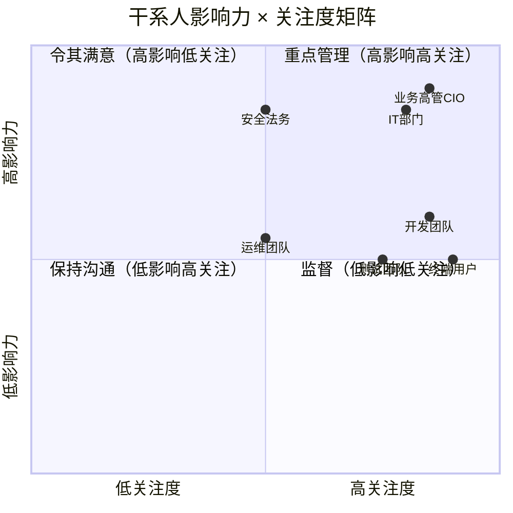

### 10.3 需求评审会议机制

| 会议类型 | 频率 | 参与者 | 目的 | 产出 |
|:--------|:-----|:------|:-----|:-----|
| 需求 kickoff | 项目启动 | 全体干系人 | 对齐目标与范围 | 《项目章程》 |
| 需求评审会 | 每阶段末 | PM+架构+开发+测试 | 评审需求可实施性 | 《评审纪要》 |
| 业务确认会 | 评审后 | PM+业务方 | 确认需求符合业务 | 《需求确认书》 |
| 合规审查会 | 上线前 | PM+法务+安全 | 合规审查 | 《合规审查报告》 |
| 变更评审会 | 按需 | CCB | 评估变更申请 | 《变更决议》 |

---

## 十一、风险识别与应对

### 11.1 需求风险识别

| 风险 ID | 风险描述 | 概率 | 影响 | 风险等级 |
|:-------|:--------|:----|:----|:--------|
| RK-01 | 用户期望过高（认为 AI 无所不能） | 高 | 高 | **极高** |
| RK-02 | 准确率不达标（<85%） | 中 | 高 | **高** |
| RK-03 | 合规审查延期 | 中 | 高 | **高** |
| RK-04 | 需求蔓延（scope creep） | 高 | 中 | **高** |
| RK-05 | 关键人员流失（唯一 AI 工程师） | 低 | 高 | **中** |
| RK-06 | 文档质量差导致解析准确率低 | 中 | 中 | **中** |
| RK-07 | GPU 资源不足影响并发 | 中 | 中 | **中** |

### 11.2 风险应对策略

| 风险 ID | 应对策略 | 具体措施 |
|:-------|:--------|:--------|
| RK-01 | 期望管理 | 上线前做用户教育，明确能力边界；MVP 标注"beta" |
| RK-02 | 技术预案 | 多模型对比评测；Rerank 调优；Prompt 优化；兜底"未找到" |
| RK-03 | 提前启动 | 项目启动即开始合规流程，与开发并行 |
| RK-04 | 流程管控 | 严格 CCB 流程；MoSCoW 不轻易调整；变更需业务方签字 |
| RK-05 | 知识备份 | AI 工程师文档化所有技术决策；备选外包支持 |
| RK-06 | 数据治理 | 上线前文档清洗；建立文档规范；解析失败人工兜底 |
| RK-07 | 资源优化 | INT8 量化；请求队列；非高峰批量任务 |

---

## 十二、需求文档规范化交付与与 118 号方案的集成

### 12.1 需求文档交付清单

| # | 交付物 | 格式 | 状态 | 责任人 |
|:-:|:------|:-----|:-----|:------|
| 1 | 《项目章程》 | Word | ✓ | PM |
| 2 | 《用户调研报告》 | Word+PPT | ✓ | 用研 |
| 3 | 《用户画像》 | Word | ✓ | PM |
| 4 | 《需求规格说明书 SRS》 | Word（本文档） | ✓ | PM+架构师 |
| 5 | 《用例图与用例规约》 | Word+PlantUML | ✓ | PM |
| 6 | 《非功能需求矩阵》 | Excel | ✓ | 架构师 |
| 7 | 《需求优先级矩阵》 | Excel | ✓ | PM+业务方 |
| 8 | 《验收标准与测试用例》 | Excel | ✓ | PM+测试 |
| 9 | 《需求追踪矩阵 RTM》 | Excel | ✓ | PM |
| 10 | 《变更管控流程》 | Word | ✓ | PM |
| 11 | 《需求评审纪要》 | Word | ✓ | PM |
| 12 | 《需求基线 v1.0》 | Word | ✓ | CCB |

### 12.2 与 118 号工程设计方案的集成关系

| 本文档章节 | 对接 118 号章节 | 集成关系 |
|:----------|:--------------|:--------|
| §2 项目目标 | 118 §1 系统概述与设计目标 | 本文档定义"为什么做+做到什么程度"，118 定义"怎么做" |
| §4 功能需求 | 118 §4 核心功能模块设计 | 本文档的 28 项 FR → 118 的六大模块实现 |
| §5 非功能需求 | 118 §9 测试方案 + §10 部署运维 | 本文档的 NFR → 118 的测试基准与部署架构 |
| §6 技术约束 | 118 §2 架构设计 + §5 模型选型 | 本文档的约束 → 118 的技术选型依据 |
| §7 优先级与路线图 | 118 §8 开发计划 | 本文档的 MoSCoW → 118 的 16 周里程碑 |
| §8 验收标准 | 118 §9 测试方案 | 本文档的验收 → 118 的测试用例 |
| §4.4 用例规约 | 118 §6 接口设计 | 本文档的用例 → 118 的 API 设计 |

### 12.3 需求追踪矩阵（RTM）

需求追踪矩阵确保每条需求从"提出→设计→实现→测试→验收"全链路可追溯：

| FR ID | 需求 | 用例 | 设计文档 | 代码模块 | 测试用例 | 验收状态 |
|:------|:-----|:-----|:--------|:--------|:--------|:--------|
| FR-A01 | 多格式上传 | UC-01 | 118 §4.1 | doc_parser | TC-01,02 | 待验收 |
| FR-A02 | 结构化解析 | UC-01 | 118 §4.1 | doc_parser | TC-03 | 待验收 |
| FR-B01 | 语义检索 | UC-02 | 118 §4.2 | retriever | TC-04 | 待验收 |
| FR-B04 | 元数据过滤 | UC-02 | 118 §4.4 | retriever | TC-05 | 待验收 |
| FR-C01 | 单轮问答 | UC-02 | 118 §4.3 | qa_service | TC-06,07 | 待验收 |
| FR-C02 | 多轮对话 | UC-03 | 118 §4.3 | chat_service | TC-08 | 待验收 |
| FR-C04 | 引用溯源 | UC-02 | 118 §4.3 | qa_service | TC-10 | 待验收 |
| FR-D01 | RBAC | UC-04 | 118 §4.4 | auth_service | TC-11 | 待验收 |
| FR-E01 | PII 脱敏 | UC-01 | 118 §7.1 | guard | TC-13 | 待验收 |
| FR-E02 | 注入防护 | UC-02 | 118 §7.3 | guard | TC-14 | 待验收 |
| ... | ... | ... | ... | ... | ... | ... |

> **RTM 维护原则**：每条需求必须有对应的用例、设计、代码、测试，**任何一环缺失都视为需求未完成**。RTM 由 PM 维护，每周更新，CCB 评审时必查。

---

> **文档结语**：
> 需求分析不是一次性的文档工作，而是贯穿项目全生命周期的**持续对齐过程**。本文档建立的需求基线（v1.0）将作为 118 号工程设计方案的输入，并通过 CCB 流程持续演进。所有干系人应以此基线为共识起点，在后续开发中通过正式变更流程调整，而非口头协商——**这是避免 Agent 项目陷入"需求蔓延+无法验收"两大灾难的根本保障**。
