# 智能采购 Agent 系统完整工程设计方案：需求解析·供应商筛选·决策引擎·流程自动化·订单跟踪·异常处理·接口·安全·开发计划与测试

> **文档定位**:本文档是 `9AI Agent 工程实践` 系列的**采购业务垂直落地专题篇**。面向 AI 应用工程师、架构师、采购数字化负责人与项目经理,系统阐述一个**可落地的智能采购 Agent 系统**的完整工程设计,覆盖需求分析、供应商筛选、价格比较、采购流程自动化、订单跟踪及异常处理六大核心功能,实现从"自然语言采购需求"到"自动化下单履约"的端到端智能闭环。
>
> 本文提供**从架构到代码、从模型选型到接口设计、从安全策略到测试方案**的端到端工程蓝图,所有设计方案均配套技术选型依据、数据模型、接口契约和可执行的代码示例,确保工程团队可直接据此启动开发。同时充分考虑与现有 ERP（SAP/用友/金蝶）、SRM、OA、财务系统的兼容集成。
>
> **关联文档**(建议一并阅读):
> - [118企业知识库Agent系统完整工程设计方案](./118企业知识库Agent系统完整工程设计方案_架构数据流模型选型接口安全开发计划与测试.md) — 同系列工程实践首篇,架构模式与安全策略可复用
> - [../3Agent 架构设计/36企业级Agent系统完整设计方案.md](../3Agent%20架构设计/36企业级Agent系统完整设计方案.md) — Agent 整体架构
> - [../3Agent 架构设计/50Agent权限控制系统完整设计方案.md](../3Agent%20架构设计/50Agent权限控制系统完整设计方案.md) — 权限控制深度方案
> - [../4RAG 检索增强生成/51RAG检索增强生成详解.md](../4RAG%20检索增强生成/51RAG检索增强生成详解.md) — RAG 技术全集(采购知识库检索)
> - [../7Tool Calling/89企业级Agent工具调用系统完整设计方案.md](../7Tool%20Calling/89企业级Agent工具调用系统完整设计方案.md) — Tool Calling 工程化方案

---

## 目录

- [智能采购 Agent 系统完整工程设计方案：需求解析·供应商筛选·决策引擎·流程自动化·订单跟踪·异常处理·接口·安全·开发计划与测试](#智能采购-agent-系统完整工程设计方案需求解析供应商筛选决策引擎流程自动化订单跟踪异常处理接口安全开发计划与测试)
  - [目录](#目录)
  - [一、系统概述与设计目标](#一系统概述与设计目标)
    - [1.1 业务背景与核心痛点](#11-业务背景与核心痛点)
    - [1.2 系统设计目标（量化指标）](#12-系统设计目标量化指标)
    - [1.3 系统核心能力全景](#13-系统核心能力全景)
    - [1.4 与现有采购系统的定位关系](#14-与现有采购系统的定位关系)
  - [二、系统总体架构设计](#二系统总体架构设计)
    - [2.1 七层架构总览](#21-七层架构总览)
    - [2.2 各层职责与技术选型](#22-各层职责与技术选型)
    - [2.3 核心场景交互时序](#23-核心场景交互时序)
  - [三、核心功能模块设计](#三核心功能模块设计)
    - [3.1 需求解析模块：从自然语言到结构化采购需求](#31-需求解析模块从自然语言到结构化采购需求)
    - [3.2 供应商管理模块：多维画像与动态评级](#32-供应商管理模块多维画像与动态评级)
    - [3.3 决策引擎模块：智能比价与供应商推荐](#33-决策引擎模块智能比价与供应商推荐)
    - [3.4 执行模块：采购流程自动化编排](#34-执行模块采购流程自动化编排)
    - [3.5 订单跟踪模块：全链路实时监控](#35-订单跟踪模块全链路实时监控)
    - [3.6 异常处理模块：智能预警与自动降级](#36-异常处理模块智能预警与自动降级)
  - [四、数据流程设计](#四数据流程设计)
    - [4.1 采购全链路数据流：从需求到验收](#41-采购全链路数据流从需求到验收)
    - [4.2 核心数据模型](#42-核心数据模型)
    - [4.3 采购知识库构建与检索增强](#43-采购知识库构建与检索增强)
  - [五、模型选型决策](#五模型选型决策)
    - [5.1 LLM 大模型选型](#51-llm-大模型选型)
    - [5.2 Embedding 模型选型](#52-embedding-模型选型)
    - [5.3 供应商评分模型选型](#53-供应商评分模型选型)
    - [5.4 向量数据库选型](#54-向量数据库选型)
  - [六、接口设计](#六接口设计)
    - [6.1 RESTful API 设计（需求+供应商+订单+决策）](#61-restful-api-设计需求供应商订单决策)
    - [6.2 WebSocket 实时通知接口](#62-websocket-实时通知接口)
    - [6.3 与现有系统集成接口](#63-与现有系统集成接口)
  - [七、安全策略](#七安全策略)
    - [7.1 数据安全：加密、脱敏与隔离](#71-数据安全加密脱敏与隔离)
    - [7.2 访问安全：认证、鉴权与审计](#72-访问安全认证鉴权与审计)
    - [7.3 采购合规安全：防围标防舞弊](#73-采购合规安全防围标防舞弊)
  - [八、可扩展性与兼容性设计](#八可扩展性与兼容性设计)
    - [8.1 可扩展性架构](#81-可扩展性架构)
    - [8.2 与现有系统兼容集成方案](#82-与现有系统兼容集成方案)
  - [九、开发计划与里程碑](#九开发计划与里程碑)
    - [9.1 五阶段 20 周开发路线图](#91-五阶段-20-周开发路线图)
    - [9.2 团队配置与职责分工](#92-团队配置与职责分工)
    - [9.3 交付物清单](#93-交付物清单)
  - [十、测试策略与验收标准](#十测试策略与验收标准)
    - [10.1 功能测试：六大模块用例矩阵](#101-功能测试六大模块用例矩阵)
    - [10.2 性能测试：并发与延迟基准](#102-性能测试并发与延迟基准)
    - [10.3 安全测试：渗透与合规验证](#103-安全测试渗透与合规验证)
    - [10.4 智能决策准确性评估](#104-智能决策准确性评估)
    - [10.5 验收标准汇总](#105-验收标准汇总)
  - [十一、部署架构与运维](#十一部署架构与运维)
    - [11.1 部署拓扑：高可用集群设计](#111-部署拓扑高可用集群设计)
    - [11.2 监控告警与运维体系](#112-监控告警与运维体系)
  - [十二、总结与最佳实践](#十二总结与最佳实践)
    - [12.1 方案核心价值](#121-方案核心价值)
    - [12.2 最佳实践建议](#122-最佳实践建议)

---

## 一、系统概述与设计目标

### 1.1 业务背景与核心痛点

企业采购是连接供应链与生产运营的核心环节,年采购额动辄数亿至数十亿。然而,传统采购流程长期依赖人工经验驱动,面临五大核心痛点:

```mermaid
flowchart LR
    subgraph 痛点一_需求不清
        P1A[采购申请描述模糊<br/>如"买一批电脑"] --> P1B[反复沟通确认<br/>平均3-5轮]
        P1B --> P1C[需求周期拉长5-10天]
    end
    subgraph 痛点二_供应商盲选
        P2A[依赖少数固定供应商] --> P2B[缺乏全网比价<br/>采购价偏高10-20%]
        P2B --> P2C[供应商淘汰机制缺失]
    end
    subgraph 痛点三_流程低效
        P3A[寻源-比价-审批-下单<br/>全手工操作] --> P3B[单笔采购平均耗时15-30天]
        P3B --> P3C[采购人员60%时间耗在事务性工作]
    end
    subgraph 痛点四_跟踪失控
        P4A[订单状态靠人工追问] --> P4B[延期发现滞后<br/>影响生产计划]
        P4B --> P4C[异常处理被动响应]
    end
    subgraph 痛点五_合规风险
        P5A[围标串标/暗箱操作] --> P5B[采购舞弊频发]
        P5B --> P5C[审计追溯困难]
    end
    
    P1C & P2C & P3C & P4C & P5C --> SOLUTION[智能采购Agent系统<br/>需求解析+供应商筛选+决策引擎<br/>流程自动化+订单跟踪+异常处理]
    
    style SOLUTION fill:#50b83c,color:#fff,stroke-width:3px
```

### 1.2 系统设计目标（量化指标）

| 目标维度 | 量化指标 | 当前基线 | 达成手段 |
|---------|---------|---------|---------|
| **需求解析准确率** | 结构化提取准确率 ≥ 92% | 人工描述准确率约 70% | LLM 意图解析 + 规范约束 |
| **供应商筛选效率** | 候选供应商生成 < 30s | 人工寻源 2-5 天 | 供应商画像库 + 智能匹配 |
| **比价覆盖率** | 同一品类 ≥ 3 家供应商比价 | 平均 1.5 家 | 多渠道自动寻源 |
| **采购成本节约** | 综合采购成本下降 ≥ 8% | — | 智能比价 + 谈判策略推荐 |
| **流程周期缩短** | 单笔采购周期缩短 ≥ 50% | 15-30 天 | 流程自动化编排 |
| **订单跟踪覆盖率** | 关键节点 100% 自动跟踪 | 人工跟踪 < 40% | 全链路事件订阅 |
| **异常预警提前量** | 延期风险提前 ≥ 3 天预警 | 事后发现 | 预测模型 + 阈值监控 |
| **合规审计追溯** | 全链路操作 100% 可追溯 | 部分环节缺失 | 区块链存证 + 审计日志 |
| **系统集成覆盖** | ERP/SRM/OA 接口覆盖率 ≥ 95% | 手工录入为主 | 标准化集成网关 |

### 1.3 系统核心能力全景

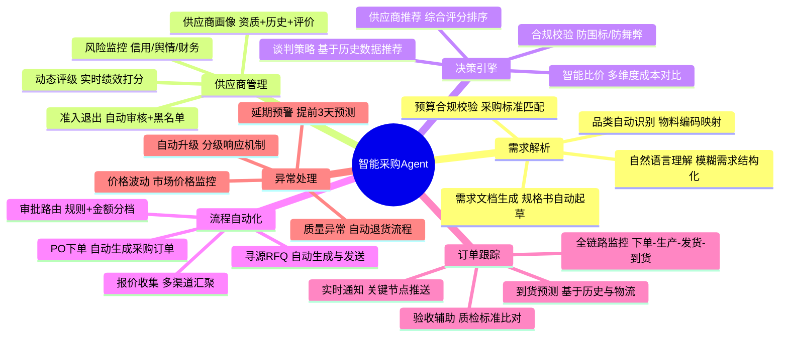

### 1.4 与现有采购系统的定位关系

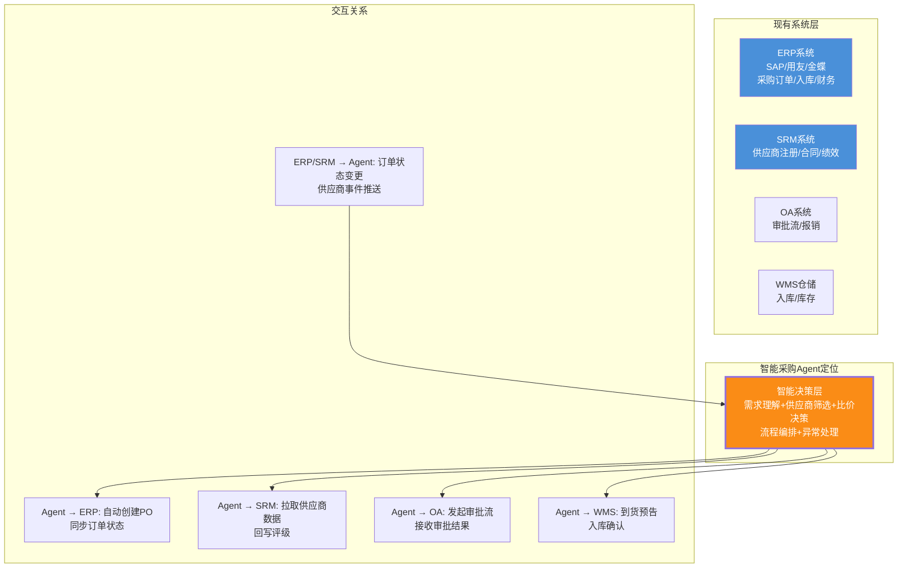

> **定位说明**:智能采购 Agent **不替代**现有 ERP/SRM 系统,而是作为**智能决策与自动化编排层**架在其之上。ERP/SRM 仍是数据归集与流程执行的"底座",Agent 负责理解需求、辅助决策、编排流程、监控异常,通过标准接口与现有系统双向交互。

---

## 二、系统总体架构设计

### 2.1 七层架构总览

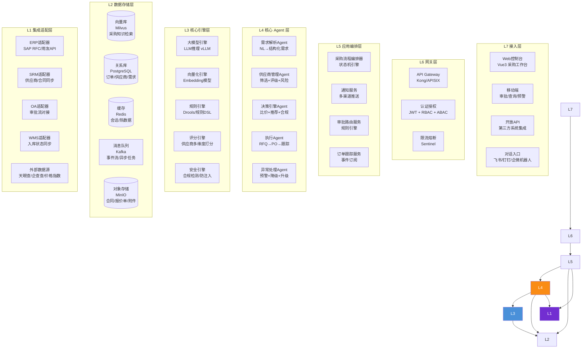

### 2.2 各层职责与技术选型

| 层级 | 职责 | 技术选型 | 选型理由 |
|-----|------|---------|---------|
| **L7 接入层** | 多端用户入口 | Vue3 + 飞书/钉钉 SDK + RESTful API | 全端覆盖,IM 机器人适配采购对话场景 |
| **L6 网关层** | 统一鉴权、限流、路由 | Kong + JWT + Sentinel | 企业级网关,插件生态丰富,支持细粒度限流 |
| **L5 应用编排层** | 流程编排、审批路由、通知 | Python + LangGraph + 状态机引擎 | LangGraph 原生支持复杂多步流程编排与状态管理 |
| **L4 核心 Agent 层** | 五大 Agent 智能体 | Python + LangChain + Agent 框架 | Agent 范式天然适配采购多角色协作 |
| **L3 引擎层** | AI 推理 + 规则 + 评分 | vLLM + Transformers + Drools(Python DSL) | LLM 推理高性能,规则引擎保障合规刚性 |
| **L2 存储层** | 多模态数据持久化 | Milvus + PostgreSQL + Redis + Kafka + MinIO | 五库协同覆盖全场景,Kafka 保障事件驱动 |
| **L1 集成层** | 现有系统适配 | SAP RFC SDK + REST API + Webhook | 标准适配器模式,解耦现有系统差异 |

### 2.3 核心场景交互时序

**场景:从自然语言采购需求到自动下单全流程**

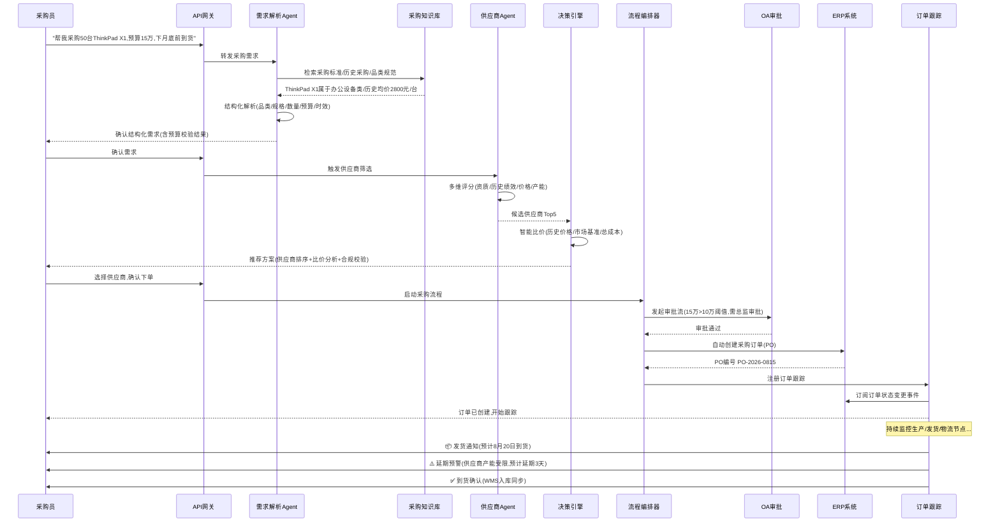

---

## 三、核心功能模块设计

### 3.1 需求解析模块：从自然语言到结构化采购需求

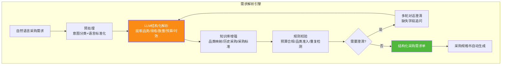

**结构化需求单数据模型**:

```python
"""
采购需求结构化模型
从自然语言中提取的完整采购需求,经过知识库增强与规则校验
"""
from dataclasses import dataclass, field
from typing import List, Optional
from enum import Enum

class PurchaseCategory(str, Enum):
    IT_EQUIPMENT = "it_equipment"        # IT设备
    OFFICE_SUPPLIES = "office_supplies"  # 办公用品
    RAW_MATERIAL = "raw_material"        # 原材料
    SERVICE = "service"                  # 服务类
    MRO = "mro"                          # 维保备件

class UrgencyLevel(str, Enum):
    URGENT = "urgent"        # 紧急(7天内)
    NORMAL = "normal"        # 正常(30天内)
    PLANNED = "planned"      # 计划(90天内)

@dataclass
class PurchaseRequirement:
    req_id: str                              # 需求编号
    raw_input: str                           # 原始自然语言输入
    category: PurchaseCategory               # 采购品类
    item_name: str                           # 物品名称
    specifications: dict                     # 规格参数 {参数名: 值}
    quantity: int                            # 数量
    unit: str                                # 单位(台/个/吨/批)
    budget_max: float                        # 预算上限
    currency: str = "CNY"                    # 币种
    delivery_date: str = ""                  # 期望交付日期
    delivery_location: str = ""              # 交付地点
    urgency: UrgencyLevel = UrgencyLevel.NORMAL
    material_code: Optional[str] = None      # 物料编码(ERP映射)
    preferred_suppliers: List[str] = field(default_factory=list)  # 指定供应商
    compliance_requirements: List[str] = field(default_factory=list)  # 合规要求
    reference_orders: List[str] = field(default_factory=list)  # 历史参考订单
    confidence_score: float = 0.0            # 解析置信度
    needs_clarification: bool = False        # 是否需要澄清
    clarification_questions: List[str] = field(default_factory=list)  # 澄清问题


class RequirementParser:
    """
    需求解析Agent核心逻辑
    输入: 自然语言采购需求
    输出: 结构化PurchaseRequirement + 置信度 + 澄清问题
    """
    
    # LLM解析Prompt模板
    PARSE_PROMPT = """你是一个专业的采购需求分析专家。请将用户的自然语言采购需求解析为结构化数据。

## 核心准则
1. 精确提取:品类、物品名称、规格、数量、预算、交付时间
2. 合理推断:根据上下文补充隐含信息(如"下月底"→具体日期)
3. 诚实标注:对不确定的字段设置confidence<0.7并生成澄清问题
4. 合规校验:预算是否超限、品类是否需要特殊审批

## 用户输入
{user_input}

## 历史参考信息(来自知识库)
{reference_context}

## 输出格式(严格JSON)
{{
  "category": "采购品类",
  "item_name": "物品名称",
  "specifications": {{"参数名": "值"}},
  "quantity": 数量,
  "unit": "单位",
  "budget_max": 预算上限,
  "delivery_date": "YYYY-MM-DD",
  "urgency": "urgent|normal|planned",
  "compliance_requirements": ["合规要求1"],
  "confidence_score": 0.0-1.0,
  "needs_clarification": true/false,
  "clarification_questions": ["需要澄清的问题"]
}}
"""
    
    async def parse(self, user_input: str, user_id: str,
                    conversation_history: list = None) -> PurchaseRequirement:
        """解析自然语言采购需求"""
        # 1. 从采购知识库检索参考信息
        reference_context = await self._retrieve_reference(user_input)
        
        # 2. LLM结构化解析
        prompt = self.PARSE_PROMPT.format(
            user_input=user_input,
            reference_context=reference_context
        )
        parsed = await self.llm.generate(prompt, temperature=0.1)
        
        # 3. 知识库增强:品类映射、物料编码匹配
        requirement = self._build_requirement(parsed, user_input)
        requirement.material_code = await self._match_material_code(requirement)
        requirement.reference_orders = await self._find_historical_orders(requirement)
        
        # 4. 规则校验
        validation = self._validate(requirement, user_id)
        if not validation.passed:
            requirement.needs_clarification = True
            requirement.clarification_questions.extend(validation.issues)
        
        return requirement
    
    async def _retrieve_reference(self, query: str) -> str:
        """从采购知识库检索采购标准、历史采购、品类规范"""
        # 向量检索 + BM25 混合检索
        results = await self.rag.retrieve(
            query=query,
            top_k=5,
            filter={"doc_type": ["purchase_standard", "historical_order", "category_spec"]}
        )
        return "\n".join([r["content"] for r in results])
    
    def _validate(self, req: PurchaseRequirement, user_id: str) -> "ValidationResult":
        """规则校验:预算合规、品类准入、重复检测"""
        issues = []
        # 预算阈值校验
        budget_limit = self._get_user_budget_limit(user_id, req.category)
        if req.budget_max > budget_limit:
            issues.append(f"预算{req.budget_max}超出{req.category}类限额{budget_limit},需额外审批")
        # 重复需求检测
        if self._check_duplicate(req):
            issues.append("检测到近7天有相似采购需求,是否合并采购?")
        return ValidationResult(passed=len(issues) == 0, issues=issues)


@dataclass
class ValidationResult:
    passed: bool
    issues: list
```

**需求解析多轮对话示例**:

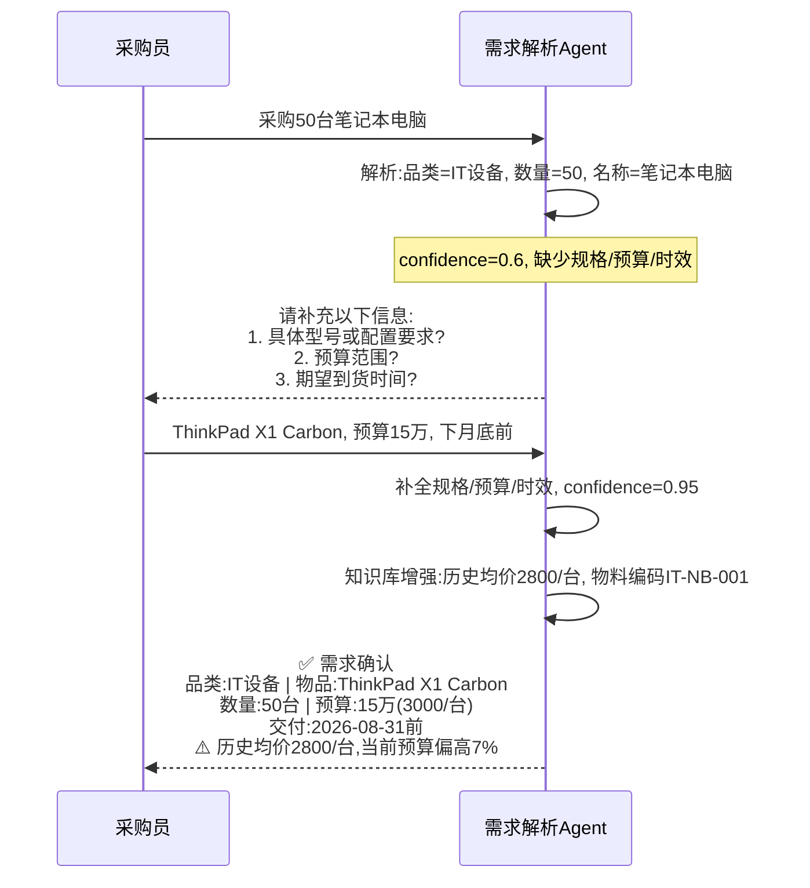

### 3.2 供应商管理模块：多维画像与动态评级

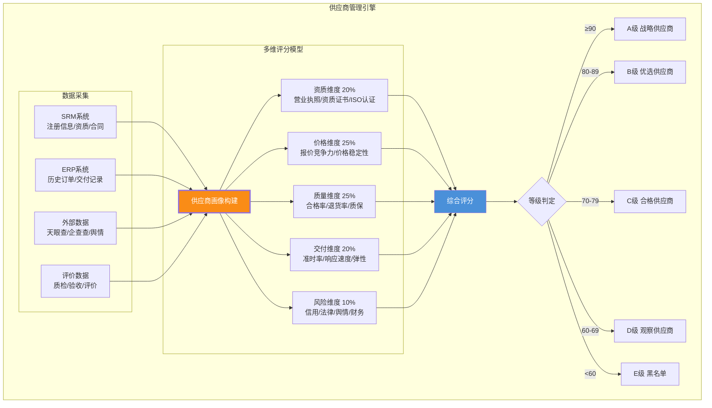

**供应商画像数据模型与评分引擎**:

```python
"""
供应商多维评分引擎
综合资质、价格、质量、交付、风险五个维度,动态评级
"""
from dataclasses import dataclass, field
from typing import List, Dict, Optional
from datetime import datetime, timedelta
import numpy as np

@dataclass
class SupplierProfile:
    supplier_id: str
    name: str
    # 资质信息
    qualifications: Dict[str, str]      # {资质类型: 证书编号}
    certifications: List[str]           # ISO9001/ISO14001等
    registered_capital: float           # 注册资本(万元)
    business_years: int                 # 经营年限
    # 交易历史
    total_orders: int = 0               # 历史订单总数
    total_amount: float = 0.0           # 历史采购总额
    on_time_delivery_rate: float = 0.0  # 准时交货率
    quality_pass_rate: float = 0.0      # 质量合格率
    return_rate: float = 0.0            # 退货率
    avg_price_competitiveness: float = 0.0  # 平均价格竞争力(0-1)
    # 风险信息
    risk_score: float = 0.0             # 风险评分(0-100,越高越危险)
    risk_alerts: List[str] = field(default_factory=list)
    # 评级
    overall_score: float = 0.0
    grade: str = "C"


class SupplierScoringEngine:
    """供应商多维评分引擎"""
    
    # 五维度权重配置(可按品类调整)
    DEFAULT_WEIGHTS = {
        "qualification": 0.20,   # 资质维度
        "price": 0.25,           # 价格维度
        "quality": 0.25,         # 质量维度
        "delivery": 0.20,        # 交付维度
        "risk": 0.10,            # 风险维度
    }
    
    def score(self, profile: SupplierProfile,
              weights: Dict[str, float] = None) -> SupplierProfile:
        """计算供应商综合评分"""
        w = weights or self.DEFAULT_WEIGHTS
        
        # 1. 资质得分(0-100)
        qual_score = self._score_qualification(profile)
        # 2. 价格竞争力得分(0-100)
        price_score = self._score_price(profile)
        # 3. 质量得分(0-100)
        quality_score = self._score_quality(profile)
        # 4. 交付得分(0-100)
        delivery_score = self._score_delivery(profile)
        # 5. 风险得分(0-100,风险越低分越高)
        risk_score = 100 - profile.risk_score
        
        # 加权综合
        profile.overall_score = (
            qual_score * w["qualification"] +
            price_score * w["price"] +
            quality_score * w["quality"] +
            delivery_score * w["delivery"] +
            risk_score * w["risk"]
        )
        
        # 等级判定
        profile.grade = self._determine_grade(profile.overall_score)
        return profile
    
    def _score_qualification(self, p: SupplierProfile) -> float:
        """资质评分:证书数量+注册资本+经营年限"""
        score = 0
        # 资质证书(每个加10分,上限40)
        score += min(len(p.certifications) * 10, 40)
        # 注册资本(>5000万=30分, >1000万=20分, >100万=10分)
        if p.registered_capital >= 5000: score += 30
        elif p.registered_capital >= 1000: score += 20
        else: score += 10
        # 经营年限(>10年=30分, >5年=20分, >2年=10分)
        if p.business_years >= 10: score += 30
        elif p.business_years >= 5: score += 20
        else: score += 10
        return min(score, 100)
    
    def _score_quality(self, p: SupplierProfile) -> float:
        """质量评分:合格率*60 + (1-退货率)*40"""
        if p.total_orders == 0:
            return 50  # 新供应商给中性分
        score = p.quality_pass_rate * 60 + (1 - p.return_rate) * 40
        return min(score, 100)
    
    def _score_delivery(self, p: SupplierProfile) -> float:
        """交付评分:准时交货率为核心"""
        if p.total_orders == 0:
            return 50
        score = p.on_time_delivery_rate * 100
        return min(score, 100)
    
    def _score_price(self, p: SupplierProfile) -> float:
        """价格竞争力评分"""
        # price_competitiveness: 0-1, 1表示价格最优
        return p.avg_price_competitiveness * 100
    
    def _determine_grade(self, score: float) -> str:
        if score >= 90: return "A"
        elif score >= 80: return "B"
        elif score >= 70: return "C"
        elif score >= 60: return "D"
        else: return "E"


class SupplierManager:
    """供应商管理Agent:筛选+评级+风险监控"""
    
    async def screen_suppliers(self, requirement: "PurchaseRequirement",
                               top_k: int = 5) -> List[SupplierProfile]:
        """根据采购需求筛选候选供应商"""
        # 1. 基础过滤:品类匹配+资质准入+非黑名单
        candidates = await self._filter_by_category(requirement)
        candidates = [s for s in candidates if s.grade != "E"]  # 排除黑名单
        
        # 2. 按品类调整评分权重
        weights = self._get_category_weights(requirement.category)
        
        # 3. 重新评分排序
        scored = [self.scoring_engine.score(s, weights) for s in candidates]
        scored.sort(key=lambda s: s.overall_score, reverse=True)
        
        # 4. 返回Top-K
        return scored[:top_k]
    
    def _get_category_weights(self, category: "PurchaseCategory") -> dict:
        """不同品类的评分权重调整"""
        weight_profiles = {
            PurchaseCategory.IT_EQUIPMENT: {
                "qualification": 0.15, "price": 0.30,
                "quality": 0.25, "delivery": 0.20, "risk": 0.10
            },
            PurchaseCategory.RAW_MATERIAL: {
                "qualification": 0.20, "price": 0.20,
                "quality": 0.30, "delivery": 0.20, "risk": 0.10
            },
            PurchaseCategory.SERVICE: {
                "qualification": 0.30, "price": 0.20,
                "quality": 0.25, "delivery": 0.15, "risk": 0.10
            },
        }
        return weight_profiles.get(category, SupplierScoringEngine.DEFAULT_WEIGHTS)
```

### 3.3 决策引擎模块：智能比价与供应商推荐

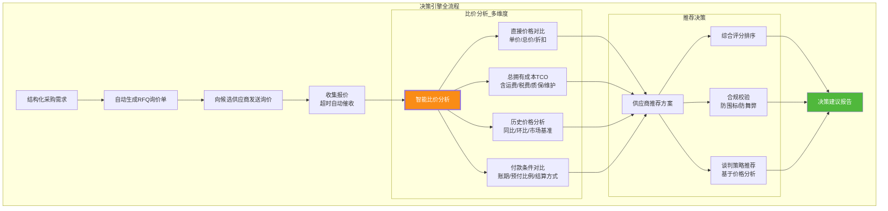

**决策引擎核心实现**:

```python
"""
采购决策引擎:智能比价 + 供应商推荐 + 合规校验 + 谈判策略
"""
from dataclasses import dataclass, field
from typing import List, Dict, Optional
from enum import Enum

class CommodityType(str, Enum):
    STANDARD = "standard"      # 标准品(规格统一,价格透明)
    CUSTOMIZED = "customized"  # 定制品(需定制生产)
    SERVICE = "service"        # 服务类

@dataclass
class Quotation:
    supplier_id: str
    supplier_name: str
    unit_price: float
    quantity: int
    total_price: float
    currency: str = "CNY"
    delivery_days: int = 0          # 交货周期(天)
    warranty_months: int = 12       # 质保期(月)
    payment_terms: str = "30天账期" # 付款条件
    freight_cost: float = 0.0       # 运费
    tax_rate: float = 0.13          # 税率
    discount: float = 0.0           # 折扣
    validity_days: int = 30         # 报价有效期
    remarks: str = ""

@dataclass
class ComparisonResult:
    supplier_id: str
    supplier_name: str
    unit_price: float
    total_cost_ownership: float     # TCO总拥有成本
    price_rank: int                 # 价格排名
    delivery_rank: int              # 交期排名
    tco_rank: int                   # TCO排名
    overall_score: float            # 综合评分
    recommendation: str             # 推荐理由
    risk_flags: List[str] = field(default_factory=list)  # 风险标记


class DecisionEngine:
    """采购决策引擎"""
    
    async def compare_and_recommend(
        self,
        requirement: "PurchaseRequirement",
        quotations: List[Quotation],
        supplier_profiles: List["SupplierProfile"]
    ) -> List[ComparisonResult]:
        """智能比价与供应商推荐"""
        
        # 1. 计算总拥有成本(TCO)
        tco_results = self._calculate_tco(quotations, requirement)
        
        # 2. 历史价格分析
        price_benchmark = await self._get_price_benchmark(requirement)
        
        # 3. 多维度排名
        results = self._rank_suppliers(tco_results, quotations, 
                                       supplier_profiles, price_benchmark)
        
        # 4. 合规校验(防围标/防舞弊)
        results = self._compliance_check(results, quotations)
        
        # 5. LLM生成推荐理由
        results = await self._generate_recommendations(results, requirement, 
                                                        price_benchmark)
        
        # 6. 按综合评分排序
        results.sort(key=lambda r: r.overall_score, reverse=True)
        
        return results
    
    def _calculate_tco(self, quotations: List[Quotation],
                       requirement: "PurchaseRequirement") -> Dict[str, float]:
        """计算总拥有成本(TCO) = 产品成本 + 运费 + 税费 - 折扣 + 维护成本估算"""
        tco_map = {}
        for q in quotations:
            product_cost = q.unit_price * q.quantity * (1 - q.discount)
            tax = product_cost * q.tax_rate
            # 维护成本估算(简单模型:质保期外年维护费=产品成本*5%)
            warranty_years = q.warranty_months / 12
            expected_lifespan = 5  # 假设5年使用寿命
            maintenance_years = max(0, expected_lifespan - warranty_years)
            maintenance_cost = product_cost * 0.05 * maintenance_years
            
            tco = product_cost + q.freight_cost + tax + maintenance_cost
            tco_map[q.supplier_id] = tco
        return tco_map
    
    async def _get_price_benchmark(self, requirement: "PurchaseRequirement") -> dict:
        """获取历史价格基准"""
        # 从历史采购订单中检索同类物料价格
        historical = await self._query_historical_prices(requirement)
        if not historical:
            return {"avg": 0, "min": 0, "max": 0, "trend": "unknown"}
        
        prices = [h["unit_price"] for h in historical]
        return {
            "avg": np.mean(prices),
            "min": np.min(prices),
            "max": np.max(prices),
            "trend": self._analyze_price_trend(historical),
            "sample_count": len(prices)
        }
    
    def _compliance_check(self, results: List[ComparisonResult],
                          quotations: List[Quotation]) -> List[ComparisonResult]:
        """合规校验:防围标、防舞弊"""
        # 1. 围标检测:多家报价供应商是否有关联关系
        collusion_flags = self._detect_collusion(quotations)
        # 2. 价格异常检测:报价是否偏离市场基准过远
        price_anomaly = self._detect_price_anomaly(quotations)
        # 3. 串通标记
        for r in results:
            if r.supplier_id in collusion_flags:
                r.risk_flags.append("⚠️ 疑似围标:与其它报价方存在关联关系")
            if r.supplier_id in price_anomaly:
                r.risk_flags.append("⚠️ 价格异常:报价显著偏离市场基准")
        
        return results
    
    def _detect_collusion(self, quotations: List[Quotation]) -> set:
        """围标检测:检查供应商关联关系(法人/股东/地址重叠)"""
        flagged = set()
        # 简化逻辑:实际应调用天眼查/企查查API检查关联关系
        for i, q1 in enumerate(quotations):
            for q2 in quotations[i+1:]:
                if self._has_affiliation(q1.supplier_id, q2.supplier_id):
                    flagged.add(q1.supplier_id)
                    flagged.add(q2.supplier_id)
        return flagged
    
    async def _generate_recommendations(self, results: List[ComparisonResult],
                                        requirement: "PurchaseRequirement",
                                        benchmark: dict) -> List[ComparisonResult]:
        """LLM生成推荐理由与谈判策略"""
        prompt = f"""你是采购决策专家。基于以下比价数据,为每个供应商生成推荐理由和谈判建议。

采购需求: {requirement.item_name} x{requirement.quantity}
市场基准价: 均价{benchmark['avg']:.2f}, 最低{benchmark['min']:.2f}

供应商比价数据:
{self._format_results(results)}

请为每个供应商生成:
1. recommendation: 推荐理由(50字内)
2. negotiation_tip: 谈判策略建议(如"可基于市场最低价XX谈判")
"""
        llm_response = await self.llm.generate(prompt, temperature=0.3)
        # 解析LLM输出并填充到results中...
        return self._merge_llm_suggestions(results, llm_response)
```

### 3.4 执行模块：采购流程自动化编排

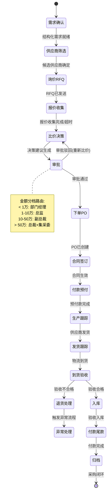

**流程编排引擎核心实现**:

```python
"""
采购流程编排引擎
基于状态机驱动采购全生命周期,支持自动流转与人工干预
"""
from enum import Enum
from dataclasses import dataclass, field
from typing import Callable, Dict, List, Optional
from datetime import datetime
import asyncio

class ProcurementState(str, Enum):
    REQUIREMENT_CONFIRMED = "requirement_confirmed"
    SUPPLIER_SCREENING = "supplier_screening"
    RFQ_SENT = "rfq_sent"
    QUOTATION_COLLECTING = "quotation_collecting"
    COMPARISON_DONE = "comparison_done"
    APPROVAL_PENDING = "approval_pending"
    APPROVAL_REJECTED = "approval_rejected"
    PO_CREATED = "po_created"
    CONTRACT_SIGNED = "contract_signed"
    PREPAID = "prepaid"
    IN_PRODUCTION = "in_production"
    SHIPPED = "shipped"
    DELIVERED = "delivered"
    INSPECTION_PASSED = "inspection_passed"
    INSPECTION_FAILED = "inspection_failed"
    STORED = "stored"
    FINAL_PAID = "final_paid"
    ARCHIVED = "archived"

class ProcurementEvent(str, Enum):
    REQUIREMENT_READY = "requirement_ready"
    SUPPLIERS_SELECTED = "suppliers_selected"
    RFQ_SENT_OK = "rfq_sent_ok"
    QUOTATIONS_RECEIVED = "quotations_received"
    QUOTATION_TIMEOUT = "quotation_timeout"
    COMPARISON_COMPLETE = "comparison_complete"
    APPROVAL_APPROVED = "approval_approved"
    APPROVAL_REJECTED = "approval_rejected"
    PO_CREATED_OK = "po_created_ok"
    CONTRACT_SIGNED_OK = "contract_signed_ok"
    PREPAYMENT_DONE = "prepayment_done"
    PRODUCTION_UPDATE = "production_update"
    SHIPMENT_UPDATE = "shipment_update"
    DELIVERY_CONFIRMED = "delivery_confirmed"
    INSPECTION_RESULT = "inspection_result"
    STORED_OK = "stored_ok"
    FINAL_PAYMENT_DONE = "final_payment_done"


@dataclass
class ProcurementContext:
    """采购流程上下文,在状态机各节点间传递"""
    process_id: str
    requirement: dict                     # 结构化采购需求
    candidate_suppliers: List[dict] = field(default_factory=list)
    quotations: List[dict] = field(default_factory=list)
    comparison_result: Optional[dict] = None
    selected_supplier: Optional[str] = None
    po_number: Optional[str] = None
    contract_id: Optional[str] = None
    current_state: ProcurementState = ProcurementState.REQUIREMENT_CONFIRMED
    history: List[dict] = field(default_factory=list)
    error: Optional[str] = None


class ProcurementOrchestrator:
    """
    采购流程编排器
    基于事件驱动状态机,编排需求解析→供应商筛选→比价→审批→下单→跟踪全链路
    """
    
    # 状态转移表: (当前状态, 事件) → (目标状态, 动作函数)
    TRANSITIONS = {
        (ProcurementState.REQUIREMENT_CONFIRMED, ProcurementEvent.REQUIREMENT_READY): 
            (ProcurementState.SUPPLIER_SCREENING, "screen_suppliers"),
        (ProcurementState.SUPPLIER_SCREENING, ProcurementEvent.SUPPLIERS_SELECTED): 
            (ProcurementState.RFQ_SENT, "send_rfq"),
        (ProcurementState.RFQ_SENT, ProcurementEvent.RFQ_SENT_OK): 
            (ProcurementState.QUOTATION_COLLECTING, "wait_quotations"),
        (ProcurementState.QUOTATION_COLLECTING, ProcurementEvent.QUOTATIONS_RECEIVED): 
            (ProcurementState.COMPARISON_DONE, "compare_quotations"),
        (ProcurementState.QUOTATION_COLLECTING, ProcurementEvent.QUOTATION_TIMEOUT): 
            (ProcurementState.COMPARISON_DONE, "compare_quotations"),
        (ProcurementState.COMPARISON_DONE, ProcurementEvent.COMPARISON_COMPLETE): 
            (ProcurementState.APPROVAL_PENDING, "route_approval"),
        (ProcurementState.APPROVAL_PENDING, ProcurementEvent.APPROVAL_APPROVED): 
            (ProcurementState.PO_CREATED, "create_po"),
        (ProcurementState.APPROVAL_PENDING, ProcurementEvent.APPROVAL_REJECTED): 
            (ProcurementState.APPROVAL_REJECTED, "handle_rejection"),
        (ProcurementState.PO_CREATED, ProcurementEvent.PO_CREATED_OK): 
            (ProcurementState.CONTRACT_SIGNED, "sign_contract"),
        (ProcurementState.CONTRACT_SIGNED, ProcurementEvent.CONTRACT_SIGNED_OK): 
            (ProcurementState.PREPAID, "process_prepayment"),
        (ProcurementState.PREPAID, ProcurementEvent.PREPAYMENT_DONE): 
            (ProcurementState.IN_PRODUCTION, "start_tracking"),
        (ProcurementState.IN_PRODUCTION, ProcurementEvent.PRODUCTION_UPDATE): 
            (ProcurementState.IN_PRODUCTION, "update_tracking"),
        (ProcurementState.IN_PRODUCTION, ProcurementEvent.SHIPMENT_UPDATE): 
            (ProcurementState.SHIPPED, "update_tracking"),
        (ProcurementState.SHIPPED, ProcurementEvent.DELIVERY_CONFIRMED): 
            (ProcurementState.DELIVERED, "start_inspection"),
        (ProcurementState.DELIVERED, ProcurementEvent.INSPECTION_RESULT): 
            (ProcurementState.INSPECTION_PASSED, "pass_inspection"),
        (ProcurementState.INSPECTION_PASSED, ProcurementEvent.STORED_OK): 
            (ProcurementState.STORED, "process_final_payment"),
        (ProcurementState.STORED, ProcurementEvent.FINAL_PAYMENT_DONE): 
            (ProcurementState.ARCHIVED, "archive_process"),
    }
    
    def __init__(self):
        self._action_handlers: Dict[str, Callable] = {
            "screen_suppliers": self._action_screen_suppliers,
            "send_rfq": self._action_send_rfq,
            "wait_quotations": self._action_wait_quotations,
            "compare_quotations": self._action_compare_quotations,
            "route_approval": self._action_route_approval,
            "create_po": self._action_create_po,
            "sign_contract": self._action_sign_contract,
            "process_prepayment": self._action_process_prepayment,
            "start_tracking": self._action_start_tracking,
            "update_tracking": self._action_update_tracking,
            "start_inspection": self._action_start_inspection,
            "pass_inspection": self._action_pass_inspection,
            "process_final_payment": self._action_process_final_payment,
            "archive_process": self._action_archive,
            "handle_rejection": self._action_handle_rejection,
        }
    
    async def trigger(self, ctx: ProcurementContext, event: ProcurementEvent) -> ProcurementContext:
        """触发状态转移"""
        key = (ctx.current_state, event)
        if key not in self.TRANSITIONS:
            raise ValueError(f"非法状态转移: {ctx.current_state} + {event}")
        
        next_state, action_name = self.TRANSITIONS[key]
        handler = self._action_handlers[action_name]
        
        # 执行动作
        ctx = await handler(ctx)
        ctx.current_state = next_state
        ctx.history.append({
            "timestamp": datetime.now().isoformat(),
            "from_state": key[0].value,
            "event": event.value,
            "to_state": next_state.value,
            "action": action_name
        })
        
        # 持久化状态
        await self._persist(ctx)
        # 发布事件通知
        await self._notify(ctx, event)
        
        return ctx
    
    async def _action_route_approval(self, ctx: ProcurementContext) -> ProcurementContext:
        """审批路由:按金额分档自动路由到对应审批人"""
        budget = ctx.requirement.get("budget_max", 0)
        
        # 审批路由规则
        if budget < 10_000:
            approver_role = "department_manager"
        elif budget < 100_000:
            approver_role = "director"
        elif budget < 500_000:
            approver_role = "vp"
        else:
            approver_role = "ceo_and_committee"
        
        # 调用OA系统发起审批流
        approval_id = await self.oa_adapter.create_approval(
            title=f"采购审批: {ctx.requirement['item_name']} (¥{budget:,.0f})",
            amount=budget,
            approver_role=approver_role,
            attachments=[ctx.comparison_result],
            callback_url=f"/api/v1/procurement/{ctx.process_id}/approval-callback"
        )
        ctx.history.append({"action": "approval_created", "approval_id": approval_id})
        return ctx
    
    async def _action_create_po(self, ctx: ProcurementContext) -> ProcurementContext:
        """自动创建采购订单(调用ERP接口)"""
        po_data = {
            "supplier_id": ctx.selected_supplier,
            "items": [{
                "material_code": ctx.requirement["material_code"],
                "quantity": ctx.requirement["quantity"],
                "unit_price": ctx.comparison_result["unit_price"],
            }],
            "delivery_date": ctx.requirement["delivery_date"],
            "payment_terms": ctx.comparison_result["payment_terms"],
        }
        po_number = await self.erp_adapter.create_purchase_order(po_data)
        ctx.po_number = po_number
        return ctx
    
    async def _action_send_rfq(self, ctx: ProcurementContext) -> ProcurementContext:
        """自动生成并发送RFQ询价单"""
        rfq = await self._generate_rfq(ctx.requirement)
        for supplier in ctx.candidate_suppliers:
            await self._send_rfq_to_supplier(rfq, supplier)
        # 设置报价收集超时(48小时)
        asyncio.create_task(self._quotation_timeout_monitor(ctx.process_id, 48))
        return ctx
```

### 3.5 订单跟踪模块：全链路实时监控

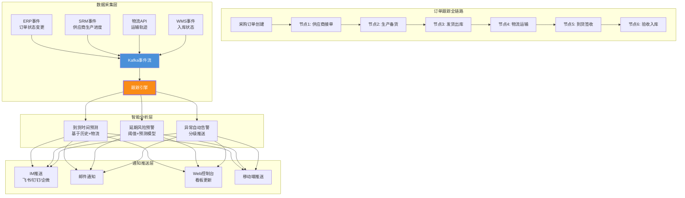

**订单跟踪核心实现**:

```python
"""
订单跟踪引擎
基于事件订阅驱动的全链路实时监控,含到货预测与延期预警
"""
from dataclasses import dataclass, field
from datetime import datetime, timedelta
from typing import List, Optional, Dict
from enum import Enum

class OrderMilestone(str, Enum):
    PO_ACCEPTED = "po_accepted"         # 供应商接单
    IN_PRODUCTION = "in_production"     # 生产中
    SHIPPED = "shipped"                 # 已发货
    IN_TRANSIT = "in_transit"           # 运输中
    DELIVERED = "delivered"             # 已到货
    INSPECTED = "inspected"             # 已验收
    STORED = "stored"                   # 已入库

class AlertLevel(str, Enum):
    INFO = "info"        # 信息通知
    WARNING = "warning"  # 预警
    CRITICAL = "critical"  # 严重告警

@dataclass
class OrderTrackingRecord:
    process_id: str
    po_number: str
    current_milestone: OrderMilestone
    milestones_history: List[dict] = field(default_factory=list)
    expected_delivery: Optional[datetime] = None
    predicted_delivery: Optional[datetime] = None
    delay_risk_score: float = 0.0       # 延期风险评分 0-1
    alerts: List[dict] = field(default_factory=list)
    supplier_progress: float = 0.0      # 供应商生产进度 0-100%


class OrderTracker:
    """订单跟踪引擎"""
    
    async def on_event(self, event: dict):
        """处理来自Kafka的订单事件"""
        process_id = event["process_id"]
        tracking = await self._load_tracking(process_id)
        
        # 更新里程碑
        milestone = OrderMilestone(event["milestone"])
        tracking.current_milestone = milestone
        tracking.milestones_history.append({
            "milestone": milestone.value,
            "timestamp": event["timestamp"],
            "data": event.get("data", {})
        })
        
        # 重新预测到货时间
        tracking.predicted_delivery = await self._predict_delivery(tracking)
        
        # 延期风险评估
        tracking.delay_risk_score = self._assess_delay_risk(tracking)
        
        # 生成告警
        if tracking.delay_risk_score > 0.7:
            await self._send_alert(tracking, AlertLevel.CRITICAL,
                                   f"⚠️ 订单{tracking.po_number}延期风险高({tracking.delay_risk_score:.0%})")
        elif tracking.delay_risk_score > 0.4:
            await self._send_alert(tracking, AlertLevel.WARNING,
                                   f"📌 订单{tracking.po_number}存在延期风险({tracking.delay_risk_score:.0%})")
        
        await self._save_tracking(tracking)
        await self._notify_dashboard(tracking)
    
    async def _predict_delivery(self, tracking: OrderTrackingRecord) -> datetime:
        """基于历史数据+当前进度预测到货时间"""
        # 1. 获取该供应商该品类的历史交付周期
        avg_delivery_days = await self._get_supplier_avg_delivery_days(
            tracking.po_number
        )
        # 2. 根据当前里程碑调整预测
        milestone_weights = {
            OrderMilestone.PO_ACCEPTED: 1.0,      # 刚接单,用完整周期
            OrderMilestone.IN_PRODUCTION: 0.6,    # 生产中,剩余60%时间
            OrderMilestone.SHIPPED: 0.2,          # 已发货,剩余20%时间(物流)
            OrderMilestone.IN_TRANSIT: 0.1,       # 运输中,剩余10%时间
        }
        remaining_ratio = milestone_weights.get(tracking.current_milestone, 1.0)
        remaining_days = avg_delivery_days * remaining_ratio
        
        return datetime.now() + timedelta(days=remaining_days)
    
    def _assess_delay_risk(self, tracking: OrderTrackingRecord) -> float:
        """评估延期风险(0-1)"""
        if not tracking.expected_delivery or not tracking.predicted_delivery:
            return 0.0
        
        # 预测到货 vs 期望到货
        if tracking.predicted_delivery <= tracking.expected_delivery:
            return 0.0  # 无延期风险
        
        delay_days = (tracking.predicted_delivery - tracking.expected_delivery).days
        # 延期1天=10%风险,3天=40%,7天=80%,14天=100%
        risk = min(delay_days / 14, 1.0)
        return risk
```

### 3.6 异常处理模块：智能预警与自动降级

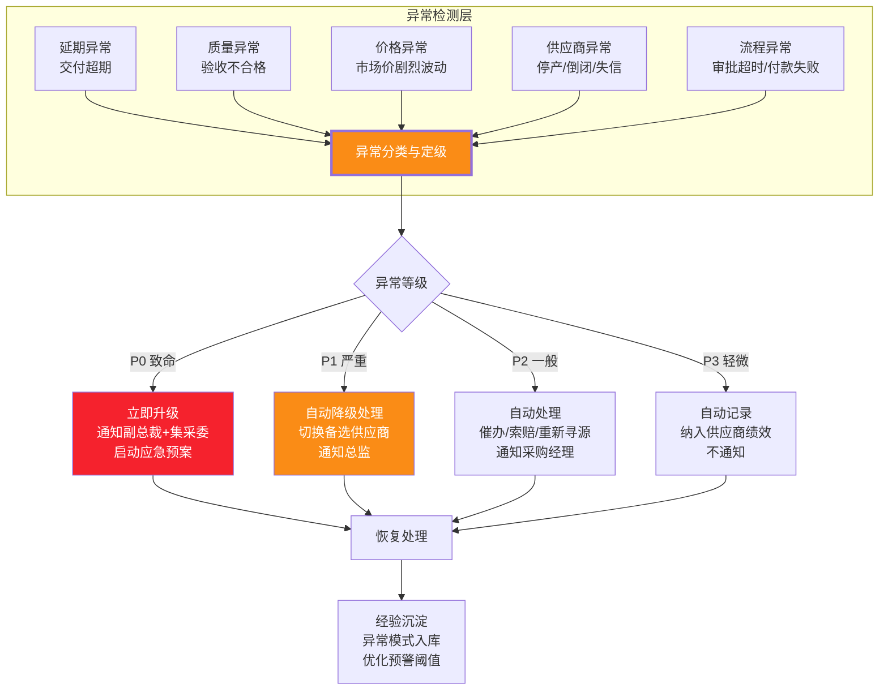

**异常处理引擎核心实现**:

```python
"""
异常处理引擎
自动检测、分级、响应采购全链路异常,支持自动降级与人工升级
"""
from dataclasses import dataclass, field
from typing import List, Optional, Callable
from enum import Enum

class ExceptionType(str, Enum):
    DELAY = "delay"                 # 延期
    QUALITY = "quality"             # 质量问题
    PRICE_VOLATILITY = "price"      # 价格异常
    SUPPLIER_RISK = "supplier_risk" # 供应商风险
    PROCESS_TIMEOUT = "process"     # 流程超时
    PAYMENT_FAILURE = "payment"     # 付款失败

class Severity(str, Enum):
    P0 = "p0_critical"   # 致命:影响生产/合规违规
    P1 = "p1_severe"     # 严重:订单延期>7天/质量批量不合格
    P2 = "p2_normal"     # 一般:延期1-7天/个别质量问题
    P3 = "p3_minor"      # 轻微:轻微延期/记录性异常

@dataclass
class ProcurementException:
    exception_id: str
    process_id: str
    exception_type: ExceptionType
    severity: Severity
    description: str
    detected_at: datetime
    context: dict                       # 异常上下文
    auto_resolvable: bool = False       # 是否可自动处理
    resolution_action: Optional[str] = None
    resolution_status: str = "open"     # open/resolving/resolved/escalated
    notified_roles: List[str] = field(default_factory=list)


class ExceptionHandler:
    """异常处理引擎"""
    
    # 异常等级判定规则
    SEVERITY_RULES = {
        ExceptionType.DELAY: [
            {"condition": lambda ctx: ctx.get("delay_days", 0) >= 7, "severity": Severity.P1},
            {"condition": lambda ctx: 1 <= ctx.get("delay_days", 0) < 7, "severity": Severity.P2},
            {"condition": lambda ctx: ctx.get("delay_days", 0) > 0, "severity": Severity.P3},
        ],
        ExceptionType.QUALITY: [
            {"condition": lambda ctx: ctx.get("defect_rate", 0) >= 0.1, "severity": Severity.P0},
            {"condition": lambda ctx: ctx.get("defect_rate", 0) >= 0.05, "severity": Severity.P1},
            {"condition": lambda ctx: ctx.get("defect_rate", 0) > 0, "severity": Severity.P2},
        ],
        ExceptionType.SUPPLIER_RISK: [
            {"condition": lambda ctx: ctx.get("risk_type") == "bankruptcy", "severity": Severity.P0},
            {"condition": lambda ctx: ctx.get("risk_type") == "credit_downgrade", "severity": Severity.P1},
            {"condition": lambda ctx: ctx.get("risk_type") == "lawsuit", "severity": Severity.P2},
        ],
    }
    
    # 自动处理策略
    AUTO_RESOLUTIONS = {
        (ExceptionType.DELAY, Severity.P2): "auto_escalate_to_supplier",
        (ExceptionType.DELAY, Severity.P1): "switch_to_backup_supplier",
        (ExceptionType.QUALITY, Severity.P2): "initiate_return_process",
        (ExceptionType.SUPPLIER_RISK, Severity.P1): "freeze_supplier_and_resource",
        (ExceptionType.PROCESS_TIMEOUT, Severity.P2): "auto_remind_approver",
    }
    
    # 通知路由
    NOTIFY_ROUTING = {
        Severity.P0: ["vp", "procurement_director", "ceo"],
        Severity.P1: ["procurement_director", "procurement_manager"],
        Severity.P2: ["procurement_manager", "buyer"],
        Severity.P3: [],  # 不通知,仅记录
    }
    
    async def handle(self, exception: ProcurementException) -> ProcurementException:
        """处理异常:分级→决策→执行→通知"""
        # 1. 判定严重等级
        exception.severity = self._classify_severity(exception)
        
        # 2. 决策处理方式
        key = (exception.exception_type, exception.severity)
        action = self.AUTO_RESOLUTIONS.get(key)
        
        if action:
            exception.auto_resolvable = True
            exception.resolution_action = action
            # 3. 执行自动处理
            try:
                await self._execute_resolution(exception, action)
                exception.resolution_status = "resolved"
            except Exception as e:
                exception.resolution_status = "escalated"
                exception.severity = Severity.P0  # 自动处理失败则升级
        else:
            # 无自动处理策略,走人工升级
            exception.resolution_status = "escalated"
            await self._escalate_to_human(exception)
        
        # 4. 通知相关角色
        roles = self.NOTIFY_ROUTING.get(exception.severity, [])
        if roles:
            await self._notify_roles(exception, roles)
        
        # 5. 经验沉淀
        await self._record_exception_pattern(exception)
        
        return exception
    
    async def _execute_resolution(self, exc: ProcurementException, action: str):
        """执行自动处理策略"""
        handlers = {
            "auto_escalate_to_supplier": self._auto_escalate_to_supplier,
            "switch_to_backup_supplier": self._switch_to_backup_supplier,
            "initiate_return_process": self._initiate_return,
            "freeze_supplier_and_resource": self._freeze_and_resource,
            "auto_remind_approver": self._auto_remind_approver,
        }
        handler = handlers.get(action)
        if handler:
            await handler(exc)
    
    async def _switch_to_backup_supplier(self, exc: ProcurementException):
        """自动切换到备选供应商"""
        process_id = exc.process_id
        # 1. 获取原流程的候选供应商列表(第二名)
        backup_supplier = await self._get_backup_supplier(process_id)
        if not backup_supplier:
            raise Exception("无可用备选供应商")
        
        # 2. 通知原供应商取消订单
        await self._cancel_po(process_id)
        
        # 3. 向备选供应商发起新订单
        await self._create_new_po(process_id, backup_supplier)
        
        # 4. 更新流程状态
        await self._update_process_state(process_id, "supplier_switched")
```

---

## 四、数据流程设计

### 4.1 采购全链路数据流：从需求到验收

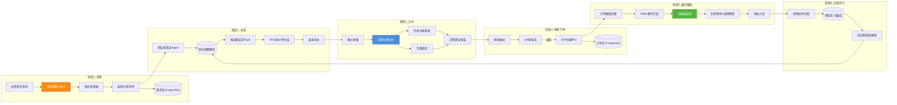

### 4.2 核心数据模型

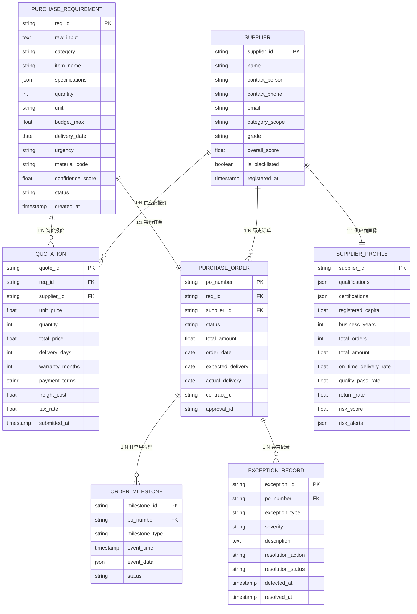

### 4.3 采购知识库构建与检索增强

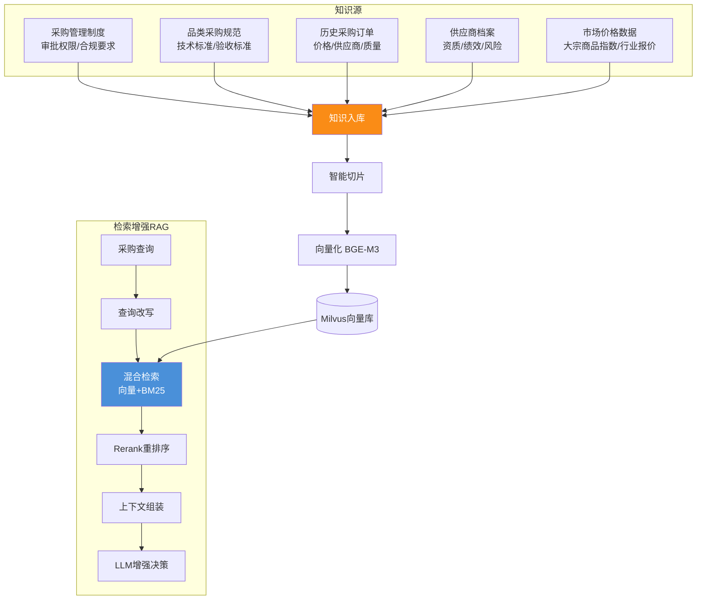

**采购知识库分区设计**:

| 知识类型 | Milvus Partition | 向量数量级 | 更新频率 | 检索场景 |
|---------|:----------------:|:--------:|:------:|---------|
| 采购管理制度 | `policy` | 1K~5K | 季度 | 需求解析时校验合规性 |
| 品类采购规范 | `category_spec` | 5K~20K | 月度 | 需求解析时匹配规格标准 |
| 历史采购订单 | `historical_order` | 50K~500K | 实时增量 | 比价时提供价格基准 |
| 供应商档案 | `supplier_profile` | 1K~10K | 实时增量 | 供应商筛选时画像匹配 |
| 市场价格数据 | `market_price` | 10K~100K | 日度 | 决策引擎价格趋势分析 |

---

## 五、模型选型决策

### 5.1 LLM 大模型选型

| 模型 | 参数量 | 中文能力 | 上下文长度 | 部署方式 | 成本 | 推荐场景 |
|-----|:-----:|:------:|:--------:|:------:|:--:|---------|
| **Qwen2.5-72B** ✨ 推荐 | 72B | ⭐⭐⭐⭐⭐ | 128K | 本地(vLLM) | 中 | 需求解析+决策推荐首选,中文最强 |
| DeepSeek-V3 | 671B(MoE) | ⭐⭐⭐⭐⭐ | 128K | API/本地 | 低 | 性价比极高,适合高并发场景 |
| Qwen2.5-14B | 14B | ⭐⭐⭐⭐ | 128K | 本地 | 低 | 轻量级需求解析(资源受限) |
| GPT-4o | — | ⭐⭐⭐⭐ | 128K | API | 高 | 效果最优但数据出域,不推荐 |

**选型结论**:
- **数据敏感型企业(默认推荐)**:Qwen2.5-72B 本地部署(vLLM),采购数据涉及商业机密,数据不出企业
- **成本敏感型企业**:DeepSeek-V3 API,性价比最高
- **混合策略**:需求解析与合规校验用本地 Qwen(涉及敏感数据),比价分析用 DeepSeek API 分流

### 5.2 Embedding 模型选型

| 模型 | 维度 | 最大长度 | 中文能力 | 推荐场景 |
|-----|:----:|:------:|:------:|---------|
| **BGE-M3** ✨ 推荐 | 1024 | 8192 | ⭐⭐⭐⭐⭐ | 采购知识库首选,中文最强,支持长文本 |
| BGE-Large-zh | 1024 | 512 | ⭐⭐⭐⭐⭐ | 纯中文场景,短文本 |
| m3e-base | 768 | 512 | ⭐⭐⭐⭐ | 轻量级,资源受限 |

**选型结论**:推荐 **BGE-M3**,与 [118 号文档](./118企业知识库Agent系统完整工程设计方案_架构数据流模型选型接口安全开发计划与测试.md) 一致,支持稠密+稀疏+Multi-vector 三合一检索。

### 5.3 供应商评分模型选型

| 方法 | 类型 | 优势 | 劣势 | 推荐场景 |
|-----|:----:|------|------|---------|
| **加权评分法** ✨ 推荐 | 规则 | 可解释性强、审计友好 | 权重需人工调优 | 默认方案,采购合规要求高 |
| 层次分析法(AHP) | 规则 | 科学确定权重 | 计算复杂 | 品类权重优化时使用 |
| LightGBM | ML | 自动学习权重、精度高 | 可解释性弱 | 数据量>10K订单时辅助 |
| LLM 评分 | AI | 灵活理解非结构化评价 | 成本高、一致性差 | 辅助分析供应商舆情评价 |

**选型结论**:以**加权评分法**为主(保障可解释性与合规审计),当历史订单数据积累超过 10K 条时,用 **LightGBM** 辅助优化权重,用 **LLM** 处理非结构化的舆情/评价文本。

### 5.4 向量数据库选型

| 特性 | **Milvus** ✨ 推荐 | Qdrant | pgvector |
|-----|:-----------:|:------:|:--------:|
| 分布式 | ✅ 原生 | ✅ | ❌ |
| 元数据过滤 | ✅ 强(标量字段) | ✅ | ✅(SQL) |
| 分区机制 | ✅(按知识类型分区) | ✅ | ❌ |
| 动态数据 | ✅ 增删改 | ✅ | ✅ |
| 性能(亿级) | ✅ | 中 | 弱 |

**选型结论**:推荐 **Milvus**,理由:原生分布式支持海量历史订单向量;Partition 分区机制天然适配采购知识库多类型分区;标量字段过滤能力支持供应商/品类过滤检索。

---

## 六、接口设计

### 6.1 RESTful API 设计（需求+供应商+订单+决策）

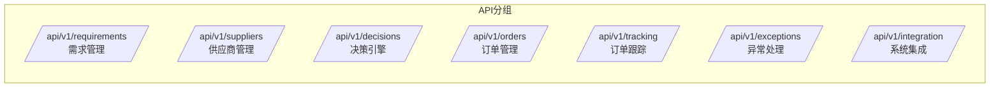

**核心 API 端点设计**:

| 模块 | 方法 | 路径 | 描述 | 请求体/参数 | 响应 |
|-----|:----:|-----|------|----------|------|
| 需求管理 | POST | `/api/v1/requirements/parse` | 自然语言解析采购需求 | {raw_input, user_id} | 结构化需求+澄清问题 |
| 需求管理 | POST | `/api/v1/requirements` | 创建采购需求 | 结构化需求JSON | req_id |
| 需求管理 | GET | `/api/v1/requirements/{req_id}` | 需求详情 | — | 需求完整信息 |
| 需求管理 | PUT | `/api/v1/requirements/{req_id}/confirm` | 确认需求(触发寻源) | — | process_id |
| 供应商管理 | GET | `/api/v1/suppliers` | 供应商列表(分页+筛选) | ?page&size&grade&category | 供应商列表 |
| 供应商管理 | GET | `/api/v1/suppliers/{supplier_id}` | 供应商详情+画像 | — | 画像+评分+历史 |
| 供应商管理 | POST | `/api/v1/suppliers/{supplier_id}/rate` | 更新供应商评级 | {scores} | 操作结果 |
| 供应商管理 | GET | `/api/v1/suppliers/{supplier_id}/risk` | 供应商风险监控 | — | 风险评分+告警 |
| 决策引擎 | POST | `/api/v1/decisions/compare` | 触发比价分析 | {req_id, quotations[]} | 比价结果+推荐方案 |
| 决策引擎 | GET | `/api/v1/decisions/{process_id}` | 获取决策建议 | — | 推荐报告 |
| 订单管理 | POST | `/api/v1/orders` | 创建采购订单(审批后) | {process_id, supplier_id} | po_number |
| 订单管理 | GET | `/api/v1/orders/{po_number}` | 订单详情 | — | 订单完整信息 |
| 订单管理 | PUT | `/api/v1/orders/{po_number}/cancel` | 取消订单 | {reason} | 操作结果 |
| 订单跟踪 | GET | `/api/v1/tracking/{po_number}` | 订单跟踪状态 | — | 里程碑+预测+风险 |
| 订单跟踪 | GET | `/api/v1/tracking/{po_number}/timeline` | 订单时间线 | — | 事件列表 |
| 订单跟踪 | POST | `/api/v1/tracking/{po_number}/milestone` | 上报里程碑事件 | {milestone, data} | 操作结果 |
| 异常处理 | GET | `/api/v1/exceptions` | 异常列表 | ?severity&status | 异常列表 |
| 异常处理 | POST | `/api/v1/exceptions/{exception_id}/resolve` | 处理异常 | {action, note} | 处理结果 |
| 系统集成 | POST | `/api/v1/integration/erp/sync` | 同步ERP订单状态 | {po_number, status} | 操作结果 |
| 系统集成 | POST | `/api/v1/integration/oa/approval-callback` | OA审批回调 | {approval_id, result} | 操作结果 |

**统一响应格式**:

```json
{
    "code": 0,
    "message": "success",
    "data": { ... },
    "trace_id": "req_20260808_abc123"
}
```

**需求解析接口示例**:

```python
# FastAPI 需求解析接口
from fastapi import FastAPI, HTTPException, Depends
from pydantic import BaseModel
from typing import List, Optional

app = FastAPI(title="智能采购Agent API")

class ParseRequest(BaseModel):
    raw_input: str
    user_id: str
    conversation_id: Optional[str] = None

class PurchaseRequirementResponse(BaseModel):
    req_id: str
    category: str
    item_name: str
    specifications: dict
    quantity: int
    unit: str
    budget_max: float
    delivery_date: str
    urgency: str
    material_code: Optional[str]
    confidence_score: float
    needs_clarification: bool
    clarification_questions: List[str]
    reference_info: dict  # 历史均价、品类标准等参考

@app.post("/api/v1/requirements/parse", response_model=PurchaseRequirementResponse)
async def parse_requirement(req: ParseRequest,
                            current_user: User = Depends(get_current_user)):
    """自然语言解析采购需求"""
    # 权限校验
    if not current_user.has_permission("requirement:create"):
        raise HTTPException(403, "无采购需求创建权限")
    
    # 调用需求解析Agent
    parser = RequirementParser()
    requirement = await parser.parse(
        user_input=req.raw_input,
        user_id=current_user.id,
        conversation_history=req.conversation_id
    )
    
    return PurchaseRequirementResponse(
        req_id=requirement.req_id,
        category=requirement.category.value,
        item_name=requirement.item_name,
        specifications=requirement.specifications,
        quantity=requirement.quantity,
        unit=requirement.unit,
        budget_max=requirement.budget_max,
        delivery_date=requirement.delivery_date,
        urgency=requirement.urgency.value,
        material_code=requirement.material_code,
        confidence_score=requirement.confidence_score,
        needs_clarification=requirement.needs_clarification,
        clarification_questions=requirement.clarification_questions,
        reference_info={
            "historical_avg_price": 2800,
            "market_trend": "stable",
            "budget_warning": requirement.budget_max > 2800 * requirement.quantity * 1.1
        }
    )
```

### 6.2 WebSocket 实时通知接口

```python
# WebSocket 实时通知(订单状态变更/异常告警/审批通知)
from fastapi import WebSocket, WebSocketDisconnect

@app.websocket("/ws/v1/notifications/{user_id}")
async def notification_websocket(websocket: WebSocket, user_id: str):
    """实时通知WebSocket连接"""
    await websocket.accept()
    notification_queue = await get_user_notification_queue(user_id)
    
    try:
        while True:
            # 推送通知
            notification = await notification_queue.get()
            await websocket.send_json(notification)
    except WebSocketDisconnect:
        await cleanup_connection(user_id)

# 通知消息格式
NOTIFICATION_TEMPLATES = {
    "order_status_changed": {
        "type": "order_status",
        "title": "订单状态更新",
        "body": "订单 {po_number} 已发货,预计 {delivery_date} 到货",
        "severity": "info"
    },
    "delay_warning": {
        "type": "delay_warning",
        "title": "⚠️ 延期预警",
        "body": "订单 {po_number} 预计延期 {delay_days} 天,风险等级: {risk_level}",
        "severity": "warning"
    },
    "approval_required": {
        "type": "approval",
        "title": "📝 待审批",
        "body": "采购申请 {req_id} 金额 ¥{amount} 待您审批",
        "severity": "info"
    },
    "exception_alert": {
        "type": "exception",
        "title": "🚨 采购异常",
        "body": "订单 {po_number} 发生{exception_type},已{action}",
        "severity": "critical"
    }
}
```

### 6.3 与现有系统集成接口

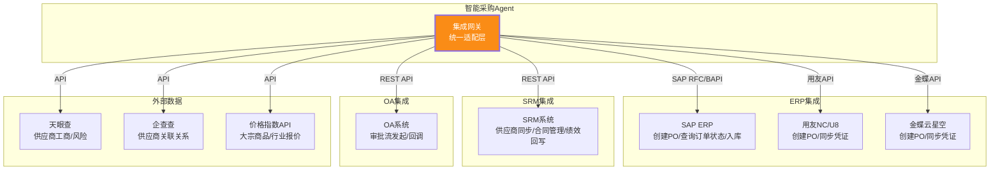

**ERP适配器接口规范**:

```python
"""
ERP适配器抽象接口
支持SAP/用友/金蝶等多ERP系统,通过适配器模式解耦
"""
from abc import ABC, abstractmethod
from typing import Optional, List

class IERPAdapter(ABC):
    """ERP系统适配器统一接口"""
    
    @abstractmethod
    async def create_purchase_order(self, po_data: dict) -> str:
        """创建采购订单,返回PO编号"""
        pass
    
    @abstractmethod
    async def get_order_status(self, po_number: str) -> dict:
        """查询订单状态"""
        pass
    
    @abstractmethod
    async def cancel_order(self, po_number: str, reason: str) -> bool:
        """取消订单"""
        pass
    
    @abstractmethod
    async def get_historical_prices(self, material_code: str, 
                                     limit: int = 100) -> List[dict]:
        """查询历史采购价格"""
        pass
    
    @abstractmethod
    async def confirm_receipt(self, po_number: str, receipt_data: dict) -> bool:
        """确认入库"""
        pass


class SAPAdapter(IERPAdapter):
    """SAP ERP适配器(通过RFC/BAPI调用)"""
    
    def __init__(self, config):
        self.connection = self._init_sap_connection(config)
    
    async def create_purchase_order(self, po_data: dict) -> str:
        """通过BAPI_PO_CREATE1创建SAP采购订单"""
        # 映射采购Agent数据模型到SAP BAPI参数
        bapi_params = self._map_to_sap_po_structure(po_data)
        result = await self.connection.call("BAPI_PO_CREATE1", **bapi_params)
        
        if result["RETURN"][0]["TYPE"] == "E":
            raise Exception(f"SAP创建PO失败: {result['RETURN'][0]['MESSAGE']}")
        
        return result["PURCHASEORDER"]  # 返回SAP PO编号


class YonyouAdapter(IERPAdapter):
    """用友NC/U8适配器(通过REST API)"""
    
    async def create_purchase_order(self, po_data: dict) -> str:
        """调用用友API创建采购订单"""
        yonyou_payload = self._map_to_yonyou_structure(po_data)
        response = await self.http_client.post(
            f"{self.base_url}/ncpuap/buyer/order/create",
            json=yonyou_payload,
            headers={"auth-token": await self._get_token()}
        )
        return response.json()["data"]["order_code"]


class IntegrationGateway:
    """集成网关:统一路由到不同ERP/SRM/OA适配器"""
    
    def __init__(self):
        self._erp_adapters: dict = {}  # {erp_type: IERPAdapter}
        self._oa_adapter = None
        self._srm_adapter = None
        self._external_apis = {}
    
    def get_erp_adapter(self, erp_type: str = "sap") -> IERPAdapter:
        """获取ERP适配器"""
        return self._erp_adapters.get(erp_type)
```

---

## 七、安全策略

### 7.1 数据安全：加密、脱敏与隔离

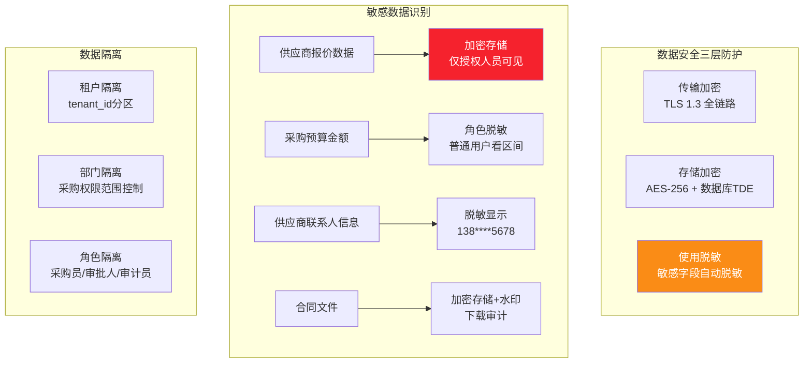

**采购敏感数据脱敏规则**:

| 敏感数据 | 识别方式 | 脱敏规则 | 可见角色 |
|---------|---------|---------|---------|
| 供应商报价金额 | 字段标记 | 普通采购员看排名不看金额 | 采购经理+可见 |
| 采购预算上限 | 字段标记 | 普通用户看区间(10-15万) | 审批人+可见 |
| 供应商银行账号 | 正则+字段标记 | 保留后4位 `****1234` | 财务+可见 |
| 供应商联系人电话 | 正则 | `138****5678` | 采购员+可见 |
| 合同金额 | 字段标记 | 按角色分级显示 | 按审批权限 |
| 供应商成本价 | 字段标记 | 完全隐藏 | 仅高级管理层 |

### 7.2 访问安全：认证、鉴权与审计

| 安全层 | 机制 | 实现 |
|-------|------|------|
| **认证** | JWT Token + Refresh Token | access_token 30min, refresh_token 7d |
| **鉴权** | RBAC + ABAC + 金额分权 | 角色+品类+金额三维度权限控制 |
| **限流** | 用户级 60 QPM + IP 级 500 QPM | Sentinel 网关限流 |
| **审计** | 全操作日志 + 不可篡改 | 操作日志写入 ELK + 关键操作区块链存证 |
| **防重放** | 请求时间戳 + Nonce | 5 分钟窗口内 nonce 不可重复 |

**采购角色权限矩阵**:

| 功能 \ 角色 | 采购总监 | 采购经理 | 采购员 | 审批人 | 审计员 | 供应商 |
|-----------|:------:|:------:|:----:|:----:|:----:|:----:|
| 创建采购需求 | ✅ | ✅ | ✅ | ❌ | ❌ | ❌ |
| 查看采购需求 | ✅ 全部 | ✅ 本部门 | ✅ 自己 | ✅ 待审 | ✅ 全部 | ❌ |
| 供应商筛选与推荐 | ✅ | ✅ | ✅ | ❌ | ❌ | ❌ |
| 查看报价详情 | ✅ | ✅ | ❌(仅排名) | ✅ 待审 | ✅ | ❌ |
| 审批采购订单 | ✅ | ✅(< 10万) | ❌ | ✅(按金额) | ❌ | ❌ |
| 创建采购订单 | ✅ | ✅ | ❌ | ❌ | ❌ | ❌ |
| 订单跟踪查看 | ✅ 全部 | ✅ 本部门 | ✅ 自己 | ✅ | ✅ | ✅ 自己 |
| 异常处理 | ✅ | ✅ | ✅ 上报 | ❌ | ✅ 查看 | ❌ |
| 供应商评级 | ✅ | ✅ | ❌ | ❌ | ✅ 查看 | ❌ |
| 审计日志查看 | ✅ | ❌ | ❌ | ❌ | ✅ | ❌ |
| 接收RFQ询价 | ❌ | ❌ | ❌ | ❌ | ❌ | ✅ |
| 提交报价 | ❌ | ❌ | ❌ | ❌ | ❌ | ✅ |

### 7.3 采购合规安全：防围标防舞弊

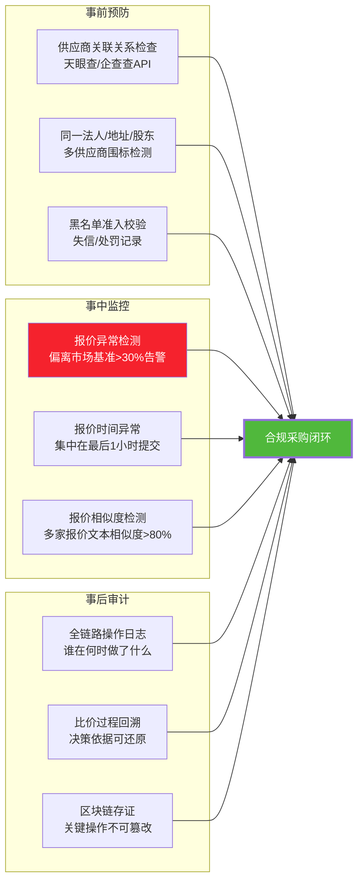

**合规检测规则**:

| 风险类型 | 检测规则 | 处置方式 |
|---------|---------|---------|
| **围标** | 多家报价供应商法人/股东/地址有交集 | 标记告警 + 人工审核 |
| **串标** | 多家报价单文本相似度 > 80% | 标记告警 + 废标 |
| **价格操纵** | 报价偏离市场基准 > 30% | 标记告警 + 要求说明 |
| **时序异常** | 多家报价在最后 1 小时集中提交 | 标记告警 + 延长报价期 |
| **指定供应商** | 需求中明确指定唯一供应商(非合理理由) | 拦截 + 要求公开寻源 |
| **拆单规避** | 同一品类拆分为多个小额订单规避审批 | 合并检测 + 追溯 |

---

## 八、可扩展性与兼容性设计

### 8.1 可扩展性架构

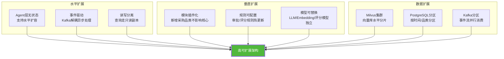

**关键扩展性设计**:

| 扩展维度 | 设计方案 | 扩展能力 |
|---------|---------|---------|
| **新增采购品类** | 品类配置化,评分权重/审批规则/知识库分区按品类独立配置 | 新增品类仅需配置,不改代码 |
| **新增供应商数据源** | 适配器模式,新增天眼查/企查查等数据源只需实现适配器接口 | 即插即用 |
| **新增 ERP 集成** | IERPAdapter 抽象接口,新 ERP 实现 Adapter 即可 | 无缝接入 |
| **模型升级** | LLM/Embedding/Rerank 模型独立配置,支持 A/B 切换 | 零停机切换 |
| **规则变更** | 审批阈值/评分权重/合规规则存储在配置中心,热更新 | 无需重启 |
| **流量增长** | Agent 层无状态 + Kafka 异步 + 数据库读写分离 | 线性扩容 |

### 8.2 与现有系统兼容集成方案

| 现有系统 | 集成方式 | 数据流向 | 兼容性保障 |
|---------|---------|---------|-----------|
| **SAP ERP** | SAP RFC/BAPI + IDoc | Agent→SAP: 创建PO/查询状态; SAP→Agent: 状态变更IDoc | 适配器模式,支持SAP ECC/S4HANA |
| **用友 NC/U8** | REST API + Webhook | Agent→用友: 创建PO/同步凭证; 用友→Agent: Webhook回调 | 支持NC6/U8/YonBIP |
| **金蝶云星空** | REST API(云) + WebService(本地) | Agent→金蝶: 创建PO/查询; 金蝶→Agent: 回调 | 支持云版/星空本地版 |
| **SRM 系统** | REST API 双向同步 | Agent↔SRM: 供应商/合同/绩效双向同步 | 标准API协议 |
| **OA 系统** | REST API + 审批回调 | Agent→OA: 发起审批; OA→Agent: 审批结果回调 | 支持泛微/致远/蓝凌 |
| **WMS 仓储** | REST API + 事件订阅 | WMS→Agent: 入库事件推送 | 支持主流WMS |
| **飞书/钉钉/企微** | 开放平台 API + 机器人 | Agent→IM: 通知推送; IM→Agent: 对话指令 | 多IM适配层 |

**兼容性设计原则**:

```python
"""
集成兼容性设计:适配器模式 + 版本协商 + 降级策略
"""
class IntegrationCompatibilityManager:
    """系统集成兼容性管理器"""
    
    # 1. 版本协商:自动适配不同版本的ERP API
    async def negotiate_version(self, system: str) -> str:
        """探测系统版本,选择对应适配器"""
        version = await self._probe_system_version(system)
        adapter_version = self.VERSION_MAP.get((system, version), "default")
        return adapter_version
    
    # 2. 降级策略:集成失败时自动降级
    async def create_po_with_fallback(self, po_data: dict) -> str:
        """创建PO,含降级策略"""
        try:
            # 优先走ERP自动创建
            return await self.erp_adapter.create_purchase_order(po_data)
        except ERPUnavailableError:
            # ERP不可用 → 降级为生成PO草稿 + 人工确认
            po_draft = await self._generate_po_draft(po_data)
            await self._notify_buyer_manual_create(po_draft)
            return po_draft["draft_id"]
        except Exception:
            # 未知异常 → 降级为完全人工模式
            await self._notify_admin_integration_failure(po_data)
            raise
    
    # 3. 数据一致性保障:最终一致性 + 补偿机制
    async def sync_with_compensation(self, operation: str, data: dict):
        """同步操作 + 补偿机制(失败时自动回滚)"""
        saga = CompensationSaga()
        try:
            await saga.execute_step("create_po", self.erp_adapter.create_po, data)
            await saga.execute_step("update_srm", self.srm_adapter.sync_order, data)
            await saga.execute_step("notify_oa", self.oa_adapter.notify, data)
        except Exception:
            await saga.compensate()  # 自动回滚已执行的步骤
            raise
```

---

## 九、开发计划与里程碑

### 9.1 五阶段 20 周开发路线图

```mermaid
gantt
    title 智能采购Agent系统 20周开发路线图
    dateFormat YYYY-MM-DD
    axisFormat %m/%d
    
    section 第一阶段:基础架构(4周)
    P1 项目搭建与基础设施 :a1, 2026-09-01, 7d
    P2 数据模型与存储层 :a2, after a1, 10d
    P3 集成适配层(ERP/SRM/OA) :a3, after a1, 14d
    P4 采购知识库构建 :a4, after a2, 7d
    milestone M1 基础架构验收 :milestone, after a3 a4, 1d
    
    section 第二阶段:核心Agent(4周)
    P5 需求解析Agent :b1, 2026-09-29, 10d
    P6 供应商管理Agent :b2, 2026-09-29, 12d
    P7 决策引擎Agent :b3, after b1, 12d
    P8 采购知识库RAG检索 :b4, after b1, 7d
    milestone M2 核心Agent验收 :milestone, after b2 b3 b4, 1d
    
    section 第三阶段:流程与跟踪(4周)
    P9 流程编排引擎(状态机) :c1, 2026-10-27, 12d
    P10 订单跟踪模块 :c2, 2026-10-27, 10d
    P11 异常处理模块 :c3, after c1, 10d
    P12 审批路由+OA集成 :c4, after c1, 7d
    milestone M3 流程跟踪验收 :milestone, after c2 c3 c4, 1d
    
    section 第四阶段:安全与接口(4周)
    P5_ 安全策略(加密/脱敏/审计) :d1, 2026-11-24, 10d
    P6_ 合规检测(防围标/防舞弊) :d2, 2026-11-24, 10d
    P7_ RESTful API + WebSocket :d3, 2026-11-24, 12d
    P8_ Web控制台前端 :d4, 2026-11-24, 14d
    P9_ IM机器人集成 :d5, after d3, 5d
    milestone M4 安全接口验收 :milestone, after d1 d2 d4 d5, 1d
    
    section 第五阶段:测试与上线(4周)
    P10_ 功能测试+性能测试 :e1, 2026-12-22, 10d
    P11_ 安全测试+合规验证 :e2, after e1, 7d
    P12_ 部署架构+监控告警 :e3, 2026-12-22, 10d
    P13_ UAT用户验收+优化 :e4, after e2, 7d
    milestone M5 正式上线 :crit, milestone, after e3 e4, 1d
```

### 9.2 团队配置与职责分工

| 角色 | 人数 | 职责 | 阶段投入 |
|-----|:---:|------|:------:|
| **项目经理** | 1 | 项目管理、进度跟踪、风险管控、对接业务方 | 全程 |
| **架构师** | 1 | 系统架构设计、技术选型、核心评审、集成方案 | 全程 |
| **后端工程师** | 4 | API/Agent/流程编排/集成适配开发 | 阶段1~4 |
| **AI 算法工程师** | 2 | 需求解析/决策引擎/RAG/评分模型 | 阶段2~3 |
| **前端工程师** | 2 | Web控制台/IM机器人/数据看板 | 阶段4~5 |
| **DevOps 工程师** | 1 | K8s部署/CI-CD/监控/运维 | 阶段3~5 |
| **测试工程师** | 2 | 功能/性能/安全/合规测试 | 阶段5 |
| **采购业务专家** | 1 | 采购流程梳理/规则定义/UAT验收 | 阶段1~2, 5 |
| **合计** | **14** | — | — |

### 9.3 交付物清单

| # | 交付物 | 形式 | 验收标准 | 交付阶段 |
|---|-------|------|---------|:------:|
| D1 | 系统架构设计文档 | PDF + 架构图 | 评审通过 | 阶段1 |
| D2 | 数据库设计文档 | ER图 + DDL | 评审通过 | 阶段1 |
| D3 | 集成接口规范文档 | OpenAPI Spec + 适配器接口 | 评审通过 | 阶段1 |
| D4 | 源代码 + 依赖说明 | Git 仓库 | Code Review 通过 | 阶段2~4 |
| D5 | 采购知识库构建文档 | 数据源+切片+索引方案 | 知识库可检索 | 阶段2 |
| D6 | 部署手册 + 运维文档 | PDF + 脚本 | 可独立部署 | 阶段4 |
| D7 | 测试报告(功能+性能+安全+合规) | PDF + 数据 | 全部用例通过 | 阶段5 |
| D8 | 智能决策准确性评估报告 | PDF + 数据 | 需求解析≥92% 推荐采纳率≥70% | 阶段5 |
| D9 | 用户手册 + 培训材料 | PDF + 视频 | UAT 通过 | 阶段5 |

---

## 十、测试策略与验收标准

### 10.1 功能测试：六大模块用例矩阵

| 模块 | 测试用例数 | 核心测试点 | 通过标准 |
|-----|:-------:|---------|---------|
| **需求解析** | 60 | 自然语言多场景/模糊输入/多轮澄清/预算校验/品类映射 | 解析准确率≥92% |
| **供应商管理** | 50 | 画像构建/多维度评分/等级判定/准入退出/风险监控 | 评分一致性≥95% |
| **决策引擎** | 40 | 比价计算/TCO/历史基准/合规检测/围标识别/推荐生成 | 推荐合理率≥85% |
| **流程编排** | 50 | 状态机全路径/审批路由/异常分支/回退/并行 | 流程通过率100% |
| **订单跟踪** | 40 | 事件订阅/里程碑更新/到货预测/延期预警 | 预警准确率≥80% |
| **异常处理** | 40 | 异常分级/自动降级/供应商切换/升级通知 | 自动处理率≥70% |

### 10.2 性能测试：并发与延迟基准

| 性能指标 | 测试条件 | 目标值 | 测试工具 |
|---------|---------|:-----:|---------|
| 需求解析延迟 | LLM解析+知识库检索 | < 3s | Locust |
| 供应商筛选延迟 | 1000+供应商评分排序 | < 500ms | Locust |
| 比价决策延迟 | 5家供应商TCO计算+推荐 | < 2s | Locust |
| 订单跟踪查询 | 单订单全链路状态 | < 200ms | Locust |
| 并发需求解析 | 50并发用户 | 错误率<1% | Locust |
| 并发订单跟踪 | 500并发订单事件 | 消息处理延迟<1s | Kafka压测 |
| 知识库检索 | 50万向量,混合检索 | P99 < 200ms | 自定义脚本 |
| 系统吞吐 | 100 QPS需求解析(缓存命中) | P99 < 1s | Locust |

### 10.3 安全测试：渗透与合规验证

| 安全测试项 | 测试方法 | 通过标准 |
|----------|---------|---------|
| 越权访问 | 采购员尝试查看他人报价详情 | 0次成功 |
| 金额越权 | 采购员尝试审批超额订单 | 0次成功 |
| 报价泄露 | 供应商A尝试查看供应商B报价 | 0次成功 |
| 围标检测 | 构造关联供应商报价场景 | 100%检测告警 |
| 价格操纵 | 构造偏离基准30%的报价 | 100%检测告警 |
| 拆单规避 | 构造拆分订单规避审批场景 | 100%检测拦截 |
| Prompt 注入 | 50种注入模式测试需求解析 | 全部拦截 |
| 数据加密 | 抓包验证传输+存储加密 | 全程加密 |
| 审计追溯 | 关键操作回溯验证 | 100%可追溯 |

### 10.4 智能决策准确性评估

| 评估维度 | 评估指标 | 评估方法 | 目标值 | 数据集 |
|---------|---------|---------|:-----:|:-----:|
| **需求解析准确率** | 结构化字段提取准确率 | 人工标注对比 | ≥92% | 200题 |
| **需求解析置信度** | 高置信度(>0.9)且正确的比例 | 自动统计 | ≥85% | 200题 |
| **供应商推荐采纳率** | 采购员选择Top1推荐的比例 | 线上统计 | ≥70% | 上线后3月 |
| **比价合理率** | 比价结果符合人工判断的比例 | 专家评审 | ≥85% | 100题 |
| **合规检测召回率** | 已知围标/舞弊场景检出率 | 构造测试集 | ≥95% | 50题 |
| **延期预测准确率** | 预测延期与实际延期一致率 | 线上统计 | ≥80% | 上线后3月 |
| **异常自动处理率** | 异常自动处理/总异常比例 | 线上统计 | ≥70% | 上线后3月 |
| **端到端满意度** | 采购员对Agent整体满意度 | 5分制问卷 | ≥4.0 | 50用户 |

### 10.5 验收标准汇总

```mermaid
flowchart TB
    subgraph 验收标准六大维度
        V1[功能完备性<br/>六大模块全部通过<br/>290个用例≥95%通过]
        V2[性能达标<br/>8项性能指标全部达标<br/>并发与延迟满足SLA]
        V3[安全合规<br/>9项安全测试全部通过<br/>围标/舞弊检测≥95%]
        V4[智能准确性<br/>需求解析≥92%<br/>推荐采纳率≥70%]
        V5[集成兼容<br/>ERP/SRM/OA接口<br/>覆盖率≥95%]
        V6[用户体验<br/>UAT验收通过<br/>满意度≥4.0]
    end
    
    V1 & V2 & V3 & V4 & V5 & V6 --> ACCEPTANCE[✅ 系统验收通过<br/>正式上线]
    
    style ACCEPTANCE fill:#50b83c,color:#fff,stroke-width:3px
```

---

## 十一、部署架构与运维

### 11.1 部署拓扑：高可用集群设计

```mermaid
graph TB
    subgraph 接入层
        LB[负载均衡<br/>Nginx/ALB]
        CDN[CDN<br/>静态资源加速]
    end
    
    subgraph K8s集群_高可用
        subgraph Agent节点池
            AG1[需求解析Agent x2]
            AG2[供应商Agent x2]
            AG3[决策引擎Agent x2]
            AG4[执行Agent x2]
            AG5[异常处理Agent x2]
        end
        
        subgraph 应用节点池
            APP1[API服务 x3]
            APP2[流程编排 x2]
            APP3[通知服务 x2]
        end
        
        subgraph 引擎节点池
            LLM1[LLM推理 vLLM<br/>GPU节点 x2]
            EMB1[Embedding服务 x1]
        end
    end
    
    subgraph 数据层_高可用
        MILVUS[Milvus集群<br/>3节点]
        PG[PostgreSQL主从<br/>1主2从]
        REDIS[Redis集群<br/>3主3从]
        KAFKA[Kafka集群<br/>3Broker]
        MINIO[MinIO集群<br/>4节点]
    end
    
    subgraph 集成层
        ERP_INT[SAP/用友/金蝶适配器]
        OA_INT[OA适配器]
        EXT_INT[天眼查/企查查适配器]
    end
    
    LB --> AG1 & AG2 & AG3 & AG4 & AG5
    LB --> APP1
    AG1 & AG2 & AG3 --> LLM1 & EMB1
    APP1 & APP2 & APP3 --> PG & REDIS
    AG1 & AG3 --> MILVUS
    APP2 --> KAFKA
    AG4 & AG5 --> ERP_INT & OA_INT
    
    style AG1 fill:#fa8c16,color:#fff
    style LLM1 fill:#4a90d9,color:#fff
    style PG fill:#50b83c,color:#fff
```

### 11.2 监控告警与运维体系

```mermaid
graph TB
    subgraph 监控采集层
        M1[Prometheus<br/>指标采集]
        M2[ELK<br/>日志采集]
        M3[Jaeger<br/>链路追踪]
    end
    
    subgraph 监控看板
        D1[Grafana<br/>系统看板<br/>CPU/内存/QPS/延迟]
        D2[业务看板<br/>采购量/订单状态/异常率]
        D3[AI看板<br/>解析准确率/推荐采纳率/LLM调用量]
    end
    
    subgraph 告警体系
        A1[告警规则<br/>阈值+趋势+异常检测]
        A2[告警分级<br/>P0-P3 四级响应]
        A3[告警通知<br/>飞书/钉钉/短信/电话]
    end
    
    M1 --> D1 & D2 & D3
    M2 --> D2
    M3 --> D1
    D1 & D2 & D3 --> A1 --> A2 --> A3
    
    style D2 fill:#fa8c16,color:#fff
    style A2 fill:#f5222d,color:#fff
```

**核心监控指标**:

| 监控维度 | 指标 | 告警阈值 | 告警级别 |
|---------|------|---------|:------:|
| **系统资源** | CPU 使用率 | > 80% | P2 |
| **系统资源** | 内存使用率 | > 85% | P2 |
| **Agent 延迟** | 需求解析 P99 | > 5s | P1 |
| **Agent 延迟** | 比价决策 P99 | > 3s | P1 |
| **业务指标** | 采购订单创建失败率 | > 5% | P1 |
| **业务指标** | 异常自动处理率 | < 60% | P2 |
| **AI 指标** | 需求解析准确率 | < 85% | P1 |
| **AI 指标** | LLM 调用错误率 | > 3% | P1 |
| **集成指标** | ERP 接口超时率 | > 10% | P1 |
| **集成指标** | OA 审批回调延迟 | > 30min | P2 |

---

## 十二、总结与最佳实践

### 12.1 方案核心价值

| 价值维度 | 传统采购 | 智能采购 Agent | 提升幅度 |
|---------|---------|:-------------:|:------:|
| 需求到下单周期 | 15-30 天 | 3-7 天 | **↓ 60-75%** |
| 供应商比价覆盖 | 1-2 家 | ≥ 3 家自动比价 | **↑ 100%+** |
| 采购成本 | 基准 | ↓ 8-15% | **节约显著** |
| 订单跟踪覆盖率 | < 40% 人工 | 100% 自动 | **↑ 150%** |
| 异常发现时效 | 事后被动 | 提前 3 天预警 | **事前主动** |
| 合规审计能力 | 部分缺失 | 全链路可追溯 | **100% 覆盖** |
| 采购人员效率 | 60% 事务工作 | 20% 事务工作 | **↑ 3 倍** |

### 12.2 最佳实践建议

1. **分阶段实施,先易后难**:先上需求解析和供应商筛选(见效快、风险低),再上决策引擎和流程自动化(价值大、复杂度高),最后上异常处理和智能预警(需数据积累)。

2. **知识库先行,数据驱动**:采购知识库(管理制度/品类规范/历史订单)是 Agent 智能的基础,必须在第一阶段完成构建,后续持续增量更新。

3. **人机协同,渐进自动化**:初期采用"Agent 建议 + 人工确认"模式,待准确率稳定后再逐步放开自动执行权限,避免"全自动"导致合规风险。

4. **合规内嵌,非外挂**:防围标、防舞弊、金额分权等合规规则必须内嵌到决策引擎和流程编排中,而非事后检查,从设计层面保障合规。

5. **集成解耦,适配器模式**:与 ERP/SRM/OA 的集成通过适配器模式解耦,避免硬编码,保障现有系统升级不影响 Agent 运行。

6. **数据闭环,持续优化**:采购执行数据 → 知识库增量 → 模型优化 → 决策更准,形成正向飞轮,越用越智能。

> **最终结论**:智能采购 Agent 系统的核心价值在于将采购人员从大量事务性工作中解放出来,聚焦于战略性采购决策;通过 AI 辅助决策降低采购成本与合规风险;通过流程自动化缩短采购周期;通过全链路跟踪与异常预警保障供应链稳定。本方案提供了从架构设计到测试验收的完整工程蓝图,团队可直接据此启动开发。
