# 销售 Agent 系统完整工程设计方案：场景·架构·多Agent协作·工具·Prompt·集成·评估与实施

> **文档定位**:本文档是 `9AI Agent 工程实践` 系列的**第二篇工程落地专题篇**,承接首篇 [118号企业知识库Agent系统](./118企业知识库Agent系统完整工程设计方案_架构数据流模型选型接口安全开发计划与测试.md) 的工程蓝图范式,面向**B2B/B2C销售团队、销售运营、销售管理者**三大用户群体,系统性阐述一个**可落地的端到端销售 Agent 系统**的完整工程设计。
>
> 与知识库Agent"知识问答"的单核心功能不同,销售Agent天然是**多场景、多角色、多系统集成、多阶段闭环**的复杂系统——因此本文采用**Supervisor驱动的多Agent协作架构**(参考系列 `8多Agent系统` 文档),覆盖**线索获取→需求分析→方案推荐→报价谈判→合同签约→客户成功**完整销售漏斗六阶段,提供从架构设计、工具定义、Prompt策略、数据模型、CRM/ERP/企微/邮件集成、到ROI评估和16周实施路线的端到端工程蓝图。
>
> **核心交付物**:
> - 销售场景**六大漏斗阶段**的 8 大痛点 + 量化设计目标
> - **1个 Supervisor + 7个领域 Agent** 的多Agent协作架构 + 状态机
> - **9大核心功能模块**(线索/商机/客户/产品/报价/合同/话术/报表/智能外呼)
> - **16个 Tool Schema 完整定义**(CRM/邮件/企微/日历/ERP等工具接口规范)
> - **7类角色 Prompt 模板**(SPIN提问/FAB话术/异议处理/谈判/签约/复盘/高管)
> - **5层集成接口**(CRM/ERP/企微/邮件/BI)+ 8张核心数据表
> - **销售 Agent 评估体系**(北极星指标+16项KPI+A/B实验方案)
> - **16周开发路线图** + 风险应对 + 真实项目选型决策

---

## 目录

- [一、场景需求与核心痛点分析](#一场景需求与核心痛点分析)
  - [1.1 销售漏斗六大阶段与Agent切入点](#11-销售漏斗六大阶段与agent切入点)
  - [1.2 典型用户群体与用户画像](#12-典型用户群体与用户画像)
  - [1.3 八大核心痛点量化](#13-八大核心痛点量化)
  - [1.4 系统设计目标(量化指标)](#14-系统设计目标量化指标)
- [二、系统总体架构设计](#二系统总体架构设计)
  - [2.1 七层架构总览](#21-七层架构总览)
  - [2.2 多Agent协作拓扑:1个Supervisor+7个领域Agent](#22-多agent协作拓扑1个supervisor7个领域agent)
  - [2.3 Supervisor状态机与任务流转](#23-supervisor状态机与任务流转)
  - [2.4 技术选型依据](#24-技术选型依据)
- [三、核心功能模块设计](#三核心功能模块设计)
  - [3.1 线索智能获取与评分模块](#31-线索智能获取与评分模块)
  - [3.2 商机推进与需求洞察模块](#32-商机推进与需求洞察模块)
  - [3.3 客户画像与360°视图模块](#33-客户画像与360视图模块)
  - [3.4 产品/方案智能推荐模块](#34-产品方案智能推荐模块)
  - [3.5 报价谈判与折扣审批模块](#35-报价谈判与折扣审批模块)
  - [3.6 合同签约与合规审查模块](#36-合同签约与合规审查模块)
  - [3.7 销售话术与实时Battle模块](#37-销售话术与实时battle模块)
  - [3.8 销售报表与智能预测模块](#38-销售报表与智能预测模块)
- [四、Tool Schema 完整定义(16个工具)](#四tool-schema-完整定义16个工具)
  - [4.1 CRM类工具(5个)](#41-crm类工具5个)
  - [4.2 沟通类工具(4个)](#42-沟通类工具4个)
  - [4.3 数据类工具(3个)](#43-数据类工具3个)
  - [4.4 业务类工具(4个)](#44-业务类工具4个)
- [五、Prompt 策略与角色模板(7类)](#五prompt-策略与角色模板7类)
  - [5.1 Prompt 工程总体架构](#51-prompt-工程总体架构)
  - [5.2 SPIN销售提问法 Prompt](#52-spin销售提问法-prompt)
  - [5.3 FAB话术推荐 Prompt](#53-fab话术推荐-prompt)
  - [5.4 异议处理 Prompt](#54-异议处理-prompt)
  - [5.5 谈判策略 Prompt](#55-谈判策略-prompt)
  - [5.6 合同合规 Prompt](#56-合同合规-prompt)
  - [5.7 销售复盘 Prompt](#57-销售复盘-prompt)
- [六、数据模型设计(8张核心表)](#六数据模型设计8张核心表)
  - [6.1 ER图总览](#61-er图总览)
  - [6.2 核心数据表定义](#62-核心数据表定义)
- [七、外部系统集成方案(5层接口)](#七外部系统集成方案5层接口)
  - [7.1 CRM 集成(Salesforce/HubSpot/用友/金蝶/纷享销客)](#71-crm-集成salesforcehubspot用友金蝶纷享销客)
  - [7.2 ERP/财务集成](#72-erp财务集成)
  - [7.3 企业微信/钉钉/飞书集成](#73-企业微信钉钉飞书集成)
  - [7.4 邮件/短信/电话集成](#74-邮件短信电话集成)
  - [7.5 BI/报表集成](#75-bi报表集成)
- [八、安全与合规策略](#八安全与合规策略)
  - [8.1 数据安全:分级分类+权限最小化](#81-数据安全分级分类权限最小化)
  - [8.2 销售合规:报价/折扣/合同防舞弊](#82-销售合规报价折扣合同防舞弊)
  - [8.3 通信合规:通话录音+话术审查](#83-通信合规通话录音话术审查)
- [九、KPI与ROI评估体系](#九kpi与roi评估体系)
  - [9.1 北极星指标与三层KPI(16项)](#91-北极星指标与三层kpi16项)
  - [9.2 销售Agent ROI计算模型](#92-销售agent-roi计算模型)
  - [9.3 A/B实验方案(新老销售对比)](#93-ab实验方案新老销售对比)
- [十、开发计划与实施路线(16周)](#十开发计划与实施路线16周)
  - [10.1 四阶段开发路线图](#101-四阶段开发路线图)
  - [10.2 风险评估与应对](#102-风险评估与应对)
  - [10.3 团队配置与职责分工](#103-团队配置与职责分工)
- [十一、选型决策:什么时候应该/不应该上销售Agent](#十一选型决策什么时候应该不应该上销售agent)
  - [11.1 四象限选型决策矩阵](#111-四象限选型决策矩阵)
  - [11.2 项目案例对比(上vs不上的ROI)](#112-项目案例对比上vs不上的roi)
- [十二、总结与最佳实践](#十二总结与最佳实践)

---

## 一、场景需求与核心痛点分析

### 1.1 销售漏斗六大阶段与Agent切入点

> 销售Agent不是一个工具,而是**嵌入销售漏斗每一阶段**的"超级销售助理"。它不替代销售人员,而是**让销售人效从1→5**:销售只做最有价值的"决策和临门一脚",Agent做80%的"信息收集、资料整理、话术准备、跟进提醒、报表输出"。

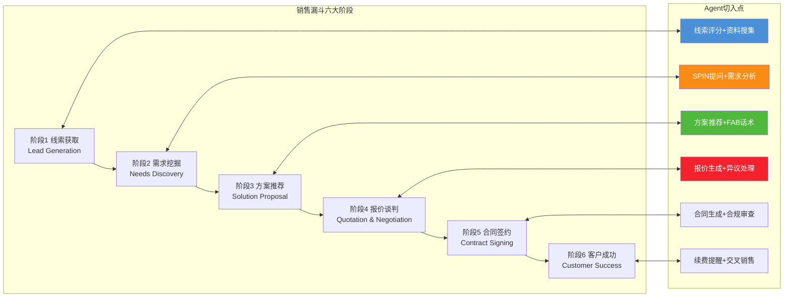

### 1.2 典型用户群体与用户画像

| 群体 | 画像 | 核心价值诉求 | 典型使用场景 |
|------|------|------------|------------|
| **一线销售(基层)** | 工作3年以内,管理20-50个客户,最怕"不知道说什么" | 减少准备时间,给现成话术和资料 | 见客户前让Agent准备客户背景/竞品分析/FAQ |
| **资深销售(老炮)** | 工作5年+,管理100+客户,最怕"琐事多" | 自动化流程,节省时间 | 让Agent写拜访纪要/生成报价/催合同/写周报 |
| **销售主管(Team Leader)** | 带5-10人团队,最怕"信息黑盒" | 团队数据透明,预测准确 | 每天早上团队业绩看板、谁的商机要黄、风险预警 |
| **销售运营(Sales Ops)** | 管系统/管流程/管数据,最怕"数据脏" | 数据质量+流程自动化 | 数据清洗、报表自动生成、折扣审批流 |
| **管理者(Sales VP/GM)** | 管公司整体业绩,最怕"预测不准" | 业绩预测+风险洞察 | 月度预测准确率从60%提到85%、红色商机预警 |
| **售前工程师(SE)** | 写方案/做POC,最怕"重复造轮子" | 方案复用+知识沉淀 | 方案推荐+PPT自动生成+竞品对比 |

### 1.3 八大核心痛点量化

```mermaid
flowchart TB
    subgraph 八大销售痛点(按严重度排序)
        P1[痛点1: 商机流失无感知<br/>30%的商机悄悄死掉,没人知道为啥]
        P2[痛点2: 新人成长慢<br/>新人从入职到开单平均6个月]
        P3[痛点3: 准备时间长<br/>销售每天花3小时准备资料,只1小时见客户]
        P4[痛点4: 客户信息不完整<br/>80%的CRM数据是残缺/过时的]
        P5[痛点5: 报价乱批折扣<br/>同样的客户,10个销售报10个价]
        P6[痛点6: 预测不准<br/>月度业绩预测准确率只有60-70%]
        P7[痛点7: 话术不一致<br/>不同销售对同一产品说的完全不一样]
        P8[痛点8: 报表统计忙<br/>销售主管每周花1天做周报月报]
    end
    
    P1 & P2 & P3 & P4 & P5 & P6 & P7 & P8 --> SOL[销售Agent系统<br/>用AI解决80%的销售琐事]
    
    style P1 fill:#f5222d,color:#fff
    style P2 fill:#fa8c16,color:#fff
    style SOL fill:#50b83c,color:#fff
```

| 痛点编号 | 痛点 | 量化数据(行业平均) | Agent 改进目标 |
|:--------:|------|:----------------:|:------------:|
| P1 | 商机流失无感知 | 30%商机无因流失 | 流失原因自动归因+预警≥95%覆盖 |
| P2 | 新人成长慢 | 新人开单周期 6 个月 | 缩短到 2 个月(70%标准化知识由Agent提供) |
| P3 | 准备时间长 | 销售每天 3h 准备 / 1h 见客户 | 准备时间缩短到 30 分钟(83%提升) |
| P4 | CRM数据脏 | CRM数据完整度 <50% | Agent自动补全+校验,完整度>90% |
| P5 | 报价折扣乱 | 同款产品报价差异>30% | 报价必须走Agent+审批流,差异<5% |
| P6 | 预测不准 | 月度业绩预测准确率≈65% | 多模型融合预测,准确率≥85% |
| P7 | 话术不一致 | 销售话术差异度>40% | 标准话术推荐覆盖率>80% |
| P8 | 报表忙 | 主管每周 1 天做报表 | 报表全自动生成,5分钟查看 |

### 1.4 系统设计目标(量化指标)

| 维度 | 目标 | 基线(无Agent) | 目标(有Agent) | 达标依据 |
|------|------|:------------:|:------------:|---------|
| **效率** | 销售准备时间 | 3h/天 | ≤30min/天 | Agent自动准备客户/产品/竞品资料 |
| **效率** | 合同+报价生成 | 4h/份 | ≤10min/份 | 模板+数据自动填充 |
| **效率** | 周报生成 | 4h/人 | ≤5min/人 | CRM+沟通记录自动汇总 |
| **质量** | 新人开单周期 | 6个月 | ≤2个月 | SPIN/FAB话术+客户案例库 |
| **质量** | CRM数据完整度 | 48% | ≥90% | Agent自动补全+校验 |
| **质量** | 业绩预测准确率 | 65% | ≥85% | 多模型融合+专家修正 |
| **业务** | 人均单产 | 100万/年 | +30%→130万/年 | 时间释放+商机质量提升 |
| **业务** | 商机转化率 | 15% | ≥22% | 流失预警+话术优化 |
| **合规** | 折扣合规率 | 75% | ≥99% | 报价必须经Agent审批引擎 |
| **体验** | 销售NPS | -10 | ≥30 | "Agent帮我省时间" |

---

## 二、系统总体架构设计

### 2.1 七层架构总览

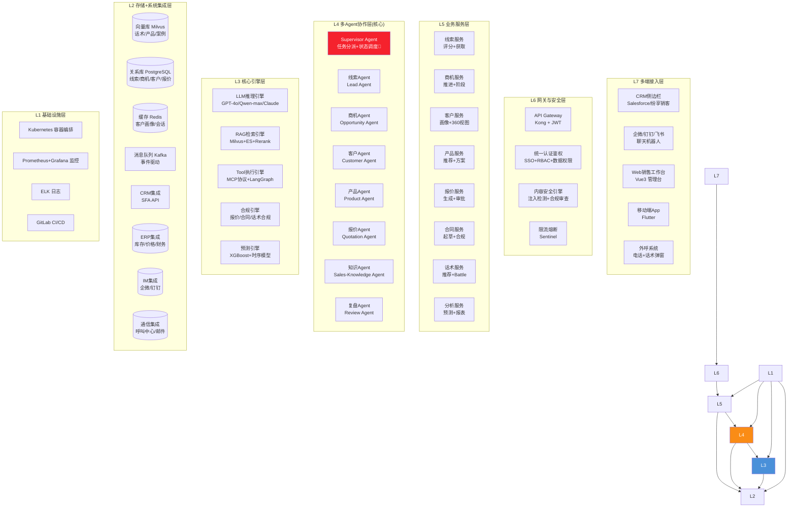

### 2.2 多Agent协作拓扑:1个Supervisor+7个领域Agent

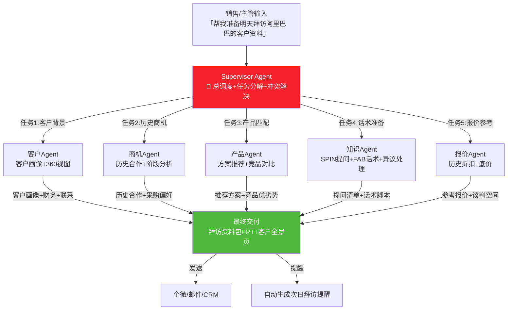

#### 2.2.1 7个领域Agent职责边界

| Agent 名称 | 角色定位 | 核心能力 | 主要工具 |
|:---------:|---------|---------|---------|
| **Supervisor** | 🎯 总指挥 | 任务分解、分派、冲突裁决、进度追踪、异常兜底 | task_planner、task_assign、human_in_the_loop |
| **线索Agent** | 🎣 猎人 | 线索评分、信息补全、潜在线索挖掘、公海领取建议 | search_crm、enrich_lead、score_lead、scrape_company_info |
| **商机Agent** | 🏃 推进器 | 商机阶段分析、流失预警、下一步行动推荐、Win/Loss分析 | get_opportunity、analyze_stage、recommend_next_step、win_loss_reason |
| **客户Agent** | 👥 管家 | 客户画像、360°视图、组织架构、采购偏好、联系人关系 | get_customer、build_360_view、map_org_chart、analyze_purchase_pattern |
| **产品Agent** | 📦 专家 | 产品推荐、方案匹配、竞品对比、案例推荐、方案生成 | search_product、recommend_solution、compare_competitor、search_case_study |
| **报价Agent** | 💰 精算师 | 报价生成、折扣核算、底价校验、审批路由、历史报价分析 | generate_quote、check_price_floor、route_discount_approval、analyze_history_price |
| **知识Agent** | 🧠 军师 | 话术推荐、SPIN提问、异议处理、案例库、竞品库 | recommend_script、spin_questions、handle_objection、search_knowledge |
| **复盘Agent** | 📊 教练 | Win/Loss分析、周报生成、销售教练、个人成长建议 | generate_weekly_report、win_loss_review、coach_advice、personal_gap_analysis |

### 2.3 Supervisor状态机与任务流转

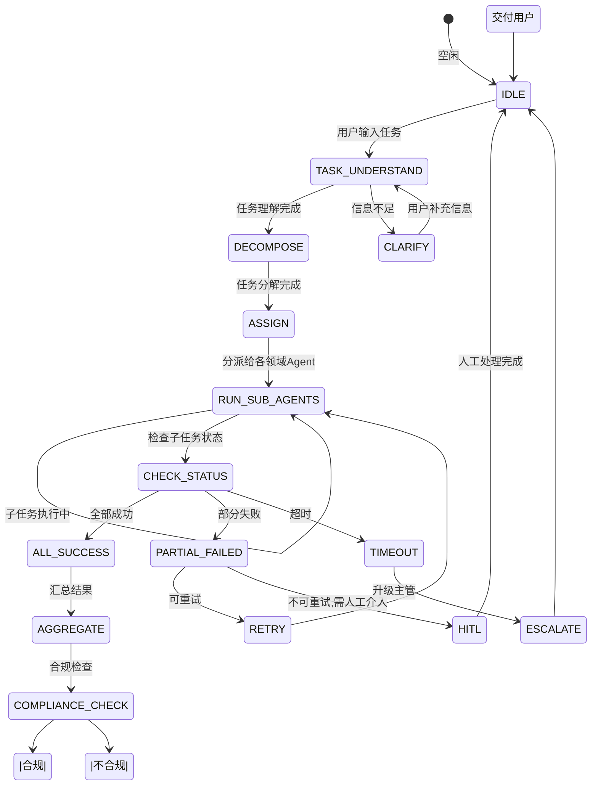

### 2.4 技术选型依据

| 层级 | 组件 | 推荐选型 | 选型理由(销售场景) |
|------|------|---------|-----------------|
| **接入层** | CRM侧边栏 | Salesforce SDK / 纷享销客 OpenAPI | 销售最常用CRM,不改变习惯 |
| **接入层** | IM集成 | 企业微信 / 钉钉 / 飞书 机器人 | 销售随时在企微问Agent |
| **应用层** | 后端 | Python FastAPI + LangGraph | 多Agent编排、异步、LLM生态友好 |
| **Agent层** | 编排框架 | LangGraph + MCP协议 | 状态机天然适合销售漏斗阶段流转 |
| **LLM选型** | 主模型 | GPT-4o / Claude 3.5 Sonnet | 复杂推理(FAB话术/异议/谈判) |
| **LLM选型** | 低成本模型 | 通义千问 / Qwen-max | 中文场景+成本降低70% |
| **RAG层** | 向量库 | Milvus 2.x | 话术/案例/产品资料语义检索 |
| **RAG层** | 重排序 | Bge-reranker-large | 中文语料重排效果好 |
| **预测引擎** | 业绩预测 | XGBoost + Prophet | 结构化CRM数据+时序融合 |
| **通信集成** | 外呼 | 容联云 / 阿里云通信 | 通话录音+实时ASR |
| **合规引擎** | 合同审查 | 自研规则+LLM | 报价/折扣/法务条款合规 |

---

## 三、核心功能模块设计

### 3.1 线索智能获取与评分模块

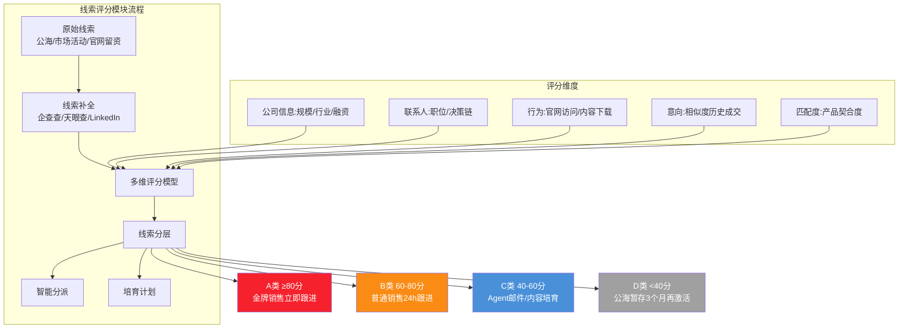

**评分模型输入特征(示例)**:
| 特征 | 权重 | 示例值 | 得分 |
|------|:----:|-------|:----:|
| 公司员工数 >1000人 | +15 | 阿里巴巴(10万+) | +15 |
| 联系人是VP及以上 | +20 | CIO | +20 |
| 近30天下载过白皮书 | +15 | 下载过《云原生方案》 | +15 |
| 行业匹配度(金融>制造>其他) | +15 | 金融 | +15 |
| 历史同行业成交相似度 | +20 | 有3个同规模同行案例 | +18 |
| ... | ... | ... | 总分:88 → A类 |

### 3.2 商机推进与需求洞察模块

#### 3.2.1 商机阶段分析与流失预警

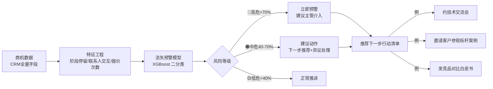

#### 3.2.2 需求自动分析(基于销售拜访纪要)

```
输入:销售拜访纪要录音转写文本
→ ASR转写 → LLM提取结构化需求:
{
  "客户痛点": ["现有系统并发不足", "数据报表不准", "供应商响应慢"],
  "决策标准": ["稳定性>价格", "30天POC验证", "同行案例"],
  "关键决策人": {"张三": "CIO-技术把关", "李四": "采购-价格"},
  "竞争对手情况": {"友商A": "已演示,关系好", "友商B": "报价低10%"},
  "时间节点": "Q3末要立项",
  "预算区间": "200-300万",
  "我方赢单概率评估": 0.65,
  "建议下一步": "约CIO技术交流会+带某同行CIO做背书"
}
```

### 3.3 客户画像与360°视图模块

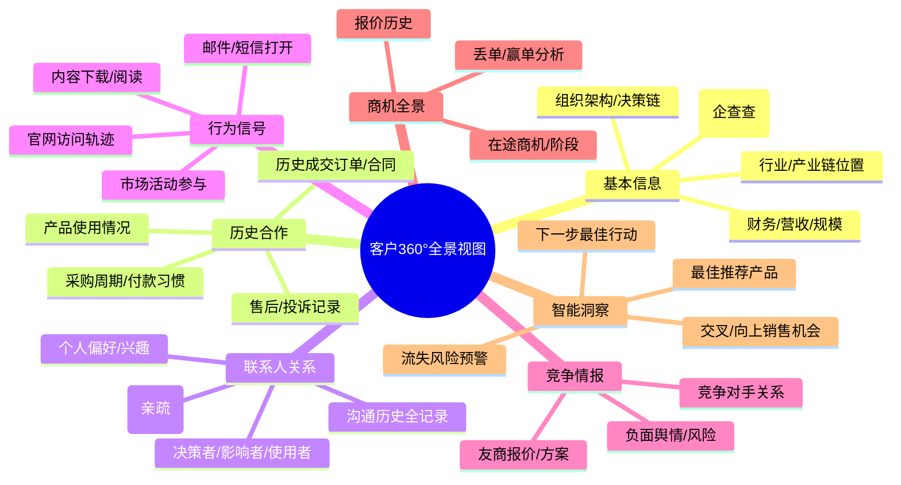

### 3.4 产品/方案智能推荐模块

#### 3.4.1 推荐算法组合

| 推荐方法 | 场景 | 权重 | 说明 |
|---------|------|:----:|------|
| **基于规则** | 合规强约束(如金融→特定合规版) | 30% | 硬约束先过滤 |
| **协同过滤** | 类似客户买过什么 | 25% | 冷启动后效果好 |
| **内容匹配** | 客户需求↔产品功能匹配度 | 25% | RAG语义相似度 |
| **强化学习** | 历史推荐→成交反馈闭环 | 20% | 长期在线优化 |

#### 3.4.2 方案自动生成流程

```mermaid
flowchart LR
    NEEDS[客户需求结构化]
    NEEDS --> MATCH[产品匹配(多方案1-3个)]
    MATCH --> CASE[相似案例Top3检索]
    MATCH --> COMP[竞品对比分析]
    CASE & COMP --> GEN[方案生成]
    GEN --> FORMAT[方案格式:PPT/Word/PDF]
    FORMAT --> REVIEW[售前/主管人工审查可选]
    REVIEW --> SEND[一键发送客户]
```

### 3.5 报价谈判与折扣审批模块

```mermaid
flowchart TB
    subgraph 报价审批流程
        INPUT[销售发起报价<br/>产品+数量+折扣]
        INPUT --> CHECK[报价Agent校验]
        CHECK --> FLOOR{折扣>底价?}
        FLOOR -->|否(≤底价规则)| APPROVED[✅ 自动批准]
        FLOOR -->|是| ROUTE[智能路由审批]
        
        ROUTE --> L1[销售主管<br/>折扣超底价≤5%]
        ROUTE --> L2[区域总监<br/>折扣超底价5-15%]
        ROUTE --> L3[销售VP<br/>折扣超底价15%+]
        
        L1 --> DONE{是否通过}
        L2 --> DONE
        L3 --> DONE
        
        DONE -->|通过| APPROVED2[✅ 报价生效+生成PDF]
        DONE -->|不通过| REJECT[❌ 驳回+原因]
        
        APPROVED --> CONTRACT[触发合同起草]
        APPROVED2 --> CONTRACT
    end
    
    style FLOOR fill:#f5222d,color:#fff
    style ROUTE fill:#fa8c16,color:#fff
```

#### 3.5.1 报价底价规则引擎示例

```python
"""
报价底价规则引擎(示例)
实际项目用Drools/JsonLogic可视化配置
"""
from dataclasses import dataclass
from datetime import date

@dataclass
class QuoteRequest:
    product_id: str
    quantity: int
    list_price: float     # 标价
    discount_rate: float  # 折扣率 0-1
    customer_level: str   # S/A/B/C
    customer_industry: str
    order_amount: float
    is_strategic: bool    # 战略客户
    is_first_order: bool  # 首单
    quarter: int          # 季度

def compute_price_floor(req: QuoteRequest) -> float:
    """计算允许的最大折扣(即底价对应的折扣率上限)"""
    # 1. 产品基础底价(按产品矩阵表)
    base_floor = {
        "P_ENTERPRISE": 0.75,  # 企业版最多打7.5折
        "P_PROFESSIONAL": 0.80,
        "P_STANDARD": 0.85,
    }.get(req.product_id, 0.80)
    
    floor = base_floor
    
    # 2. 客户等级加成(高级客户可多打折)
    customer_bonus = {"S": -0.08, "A": -0.05, "B": -0.02, "C": 0}[req.customer_level]
    floor += customer_bonus
    
    # 3. 大单加成(金额越高折扣越大)
    if req.order_amount >= 5_000_000:
        floor -= 0.05
    elif req.order_amount >= 1_000_000:
        floor -= 0.03
    elif req.order_amount >= 500_000:
        floor -= 0.01
    
    # 4. 战略客户特批
    if req.is_strategic:
        floor -= 0.10  # 战略客户最多额外10%折扣,但需VP审批
    
    # 5. 季度末业绩冲刺(每季度最后15天)
    today = date.today()
    is_quarter_end = today.month in [3, 6, 9, 12] and today.day >= 15
    if is_quarter_end:
        floor -= 0.02
    
    # 6. 首单激励(新客户首单可多打2%)
    if req.is_first_order:
        floor -= 0.02
    
    # 7. 绝对底线(任何情况不能低于5折,防止舞弊)
    floor = max(floor, 0.50)
    
    return round(floor, 4)

# 示例:战略S级客户,500万大单,季度末首单
req = QuoteRequest(
    product_id="P_ENTERPRISE", quantity=10, list_price=500000,
    discount_rate=0.25, customer_level="S", customer_industry="金融",
    order_amount=5_000_000, is_strategic=True, is_first_order=True, quarter=3
)
floor = compute_price_floor(req)
print(f"最大允许折扣 = {(1-floor)*100:.1f}%, 底价系数 = {floor}")
# 输出: 最大允许折扣 = 43.0%, 底价系数 = 0.57
```

### 3.6 合同签约与合规审查模块

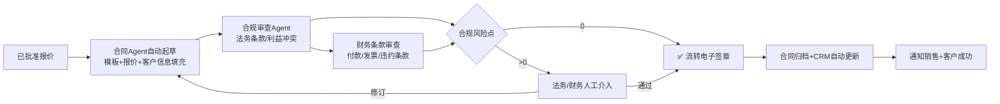

### 3.7 销售话术与实时Battle模块

#### 3.7.1 话术推荐三阶段

| 时机 | 话术类型 | 触发条件 | 示例输出 |
|------|---------|---------|---------|
| **拜访前** | SPIN提问清单 | 准备阶段 | 「1. 现状S:贵司现在销售团队用什么管客户? 2. 难点P:最大痛点是新人慢还是预测不准?」 |
| **沟通中** | FAB话术推荐 | ASR实时识别客户提问 | 客户说「价格太贵」→ 推荐:「F:我们方案有报价Agent功能/A:能把报价从4h缩短到10min/B:您团队10人,每年节省约2000工时=50万成本」 |
| **异议后** | 异议处理剧本 | 客户说「X/考虑/对比」 | 客户说「我要再对比对比」→ 推荐6步法:共情→澄清→对比→案例→促动→下一步 |

#### 3.7.2 实时Battle(外呼辅助)架构

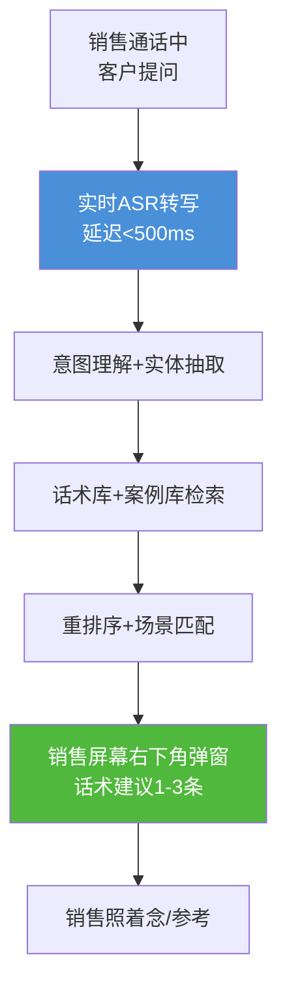

### 3.8 销售报表与智能预测模块

#### 3.8.1 报表自动生成(周报示例)

```markdown
# 华东销售一部 2026-W32 周报(Agent自动生成)

## 📊 关键业绩(本周 vs 上周)
- 新增商机 32 个 (+12%)  🟢
- 成交金额 ¥856 万 (+8%)  🟢
- 商机转化率 18.2% (-1.1%)  🟠
- 人效 ¥71.3万/人 (+4%)  🟢
- 月度预测完成率 68% (目标85%)  🔴

## 🔴 风险预警(Top 3高危商机)
1. 阿里巴巴-云原生项目(500万)
   - 风险: 阶段停留>30天,竞争对手友商A做了技术交流
   - 建议: 约CIO参观蚂蚁集团案例,安排技术架构师交流会
2. ...

## 🎯 下周行动建议
- 重点推进3个季度末有望关单的商机(合计380万)
- 对8个报价中客户主动跟进,建议在本周四前发折扣促销邮件
- ...

## 🧑‍🤝‍🧑 个人辅导建议
- 张三: 新人,本月商机不错但转化低,建议辅导"异议处理"
- 李四: 老销售,最近拜访量下降,建议检查客户分配是否饱满
```

#### 3.8.2 业绩预测模型融合架构

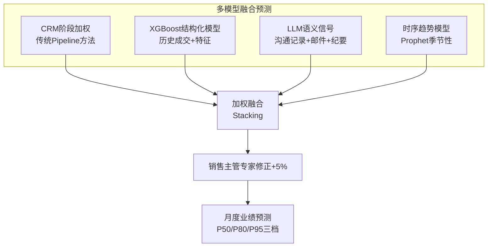

---

## 四、Tool Schema 完整定义(16个工具)

> 遵循 [91号 Tool Schema 文档规范](../7Tool%20CallingFunctionCalling/91ToolSchema完整设计规范深度解析.md),所有工具均提供 MCP 兼容的标准定义。本节按 4 大类给出 16 个核心 Tool。

### 4.1 CRM类工具(5个)

#### Tool 1: search_crm - CRM数据检索

```json
{
  "tool_name": "search_crm",
  "version": "1.0.0",
  "description": "在CRM系统中检索线索、客户、商机、联系人、合同等数据,支持关键词+结构化条件混合检索",
  "category": "CRM",
  "input_schema": {
    "type": "object",
    "properties": {
      "entity_type": {
        "type": "string",
        "enum": ["lead", "account", "contact", "opportunity", "contract", "product", "quote"],
        "description": "要检索的CRM实体类型"
      },
      "keyword": { "type": "string", "description": "关键词模糊搜索" },
      "filters": {
        "type": "object",
        "properties": {
          "owner_id": {"type": "string", "description": "销售负责人ID"},
          "stage": {"type": "string", "description": "商机阶段:线索→需求→方案→报价→谈判→签约"},
          "amount_min": {"type": "number", "description": "金额下限"},
          "industry": {"type": "string"},
          "updated_days": {"type": "integer", "description": "多少天内更新过"}
        }
      },
      "page_size": {"type": "integer", "default": 20, "maximum": 100},
      "page": {"type": "integer", "default": 1}
    },
    "required": ["entity_type"]
  },
  "output_schema": {
    "type": "object",
    "properties": {
      "total": {"type": "integer"},
      "items": {"type": "array", "items": {"type": "object"}}
    }
  },
  "permissions": ["crm:read"],
  "timeout_ms": 5000
}
```

#### Tool 2: enrich_lead - 线索信息补全

```json
{
  "tool_name": "enrich_lead",
  "version": "1.0.0",
  "description": "通过企查查/天眼查/LinkedIn等补全线索/客户的工商、组织架构、融资、联系人信息",
  "category": "CRM",
  "input_schema": {
    "type": "object",
    "properties": {
      "company_name": {"type": "string", "description": "公司全称"},
      "company_domain": {"type": "string", "description": "官网域名"},
      "contact_email": {"type": "string", "description": "联系人邮箱"}
    },
    "oneOf_required": [["company_name"], ["company_domain"], ["contact_email"]]
  },
  "output_schema": {
    "type": "object",
    "properties": {
      "company_info": {"type": "object"},
      "key_persons": {"type": "array"},
      "financials": {"type": "object"},
      "risk_alerts": {"type": "array"}
    }
  },
  "timeout_ms": 8000
}
```

#### Tool 3: update_crm_field - CRM字段更新

```json
{
  "tool_name": "update_crm_field",
  "version": "1.0.0",
  "description": "更新指定CRM实体的字段(需审批流/审计日志),常用于Agent自动补全客户信息",
  "category": "CRM",
  "input_schema": {
    "type": "object",
    "properties": {
      "entity_type": {"type": "string", "enum": ["lead","account","contact","opportunity"]},
      "entity_id": {"type": "string"},
      "fields": {
        "type": "object",
        "description": "要更新的字段key-value,敏感字段(金额/折扣)需审批"
      },
      "reason": {"type": "string", "description": "更新原因,审计用"},
      "auto_submit_approval": {"type": "boolean", "default": true}
    },
    "required": ["entity_type", "entity_id", "fields", "reason"]
  },
  "output_schema": {
    "type": "object",
    "properties": {
      "success": {"type": "boolean"},
      "approval_id": {"type": "string", "description": "如需审批,返回审批单号"}
    }
  },
  "permissions": ["crm:write", "audit:create"]
}
```

#### Tool 4: score_lead - 线索评分

```json
{
  "tool_name": "score_lead",
  "version": "1.0.0",
  "description": "计算线索的综合评分、分层(A/B/C/D)、推荐跟进策略",
  "category": "CRM",
  "input_schema": {
    "type": "object",
    "properties": {
      "lead_id": {"type": "string"},
      "company_info": {"type": "object"},
      "contact_info": {"type": "object"},
      "behavior_signals": {"type": "object"}
    },
    "required": ["lead_id"]
  },
  "output_schema": {
    "type": "object",
    "properties": {
      "score": {"type": "number", "minimum": 0, "maximum": 100},
      "grade": {"type": "string", "enum": ["A","B","C","D"]},
      "dimensions": {"type": "object"},
      "recommended_action": {"type": "string"}
    }
  }
}
```

#### Tool 5: win_loss_reason - 赢单/丢单原因分析

```json
{
  "tool_name": "win_loss_reason",
  "version": "1.0.0",
  "description": "输入已关单商机(赢或输),从CRM+沟通记录+报价历史中自动归因分析原因",
  "category": "CRM",
  "input_schema": {
    "type": "object",
    "properties": {
      "opportunity_id": {"type": "string"},
      "include_llm_analysis": {"type": "boolean", "default": true}
    },
    "required": ["opportunity_id"]
  },
  "output_schema": {
    "type": "object",
    "properties": {
      "result": {"type": "string", "enum": ["won", "lost"]},
      "primary_reason": {"type": "string"},
      "contributing_factors": {"type": "array"},
      "lessons_learned": {"type": "array"}
    }
  }
}
```

### 4.2 沟通类工具(4个)

#### Tool 6: send_wechat_message - 发送企微/钉钉消息

```json
{
  "tool_name": "send_wechat_message",
  "version": "1.0.0",
  "description": "给指定联系人发送企业微信/钉钉消息,支持模板消息、文件、日程",
  "category": "IM",
  "input_schema": {
    "type": "object",
    "properties": {
      "platform": {"type": "string", "enum": ["wecom", "dingtalk", "feishu"]},
      "contact_id": {"type": "string", "description": "接收人ID"},
      "message_type": {"type": "string", "enum": ["text", "markdown", "file", "card", "meeting"]},
      "content": {"type": "string"},
      "attachments": {"type": "array", "items": {"type": "object", "properties": {"filename": {"type": "string"}, "url": {"type": "string"}}}},
      "schedule_time": {"type": "string", "description": "ISO 8601时间,不填立即发"},
      "require_read_confirmation": {"type": "boolean", "default": false}
    },
    "required": ["platform", "contact_id", "message_type", "content"]
  },
  "output_schema": {
    "type": "object",
    "properties": {
      "message_id": {"type": "string"},
      "sent": {"type": "boolean"}
    }
  },
  "compliance": {"audit_needed": true, "record_retention_days": 180}
}
```

#### Tool 7: send_email - 发送邮件

```json
{
  "tool_name": "send_email",
  "version": "1.0.0",
  "description": "发送商务邮件,支持模板、附件、追踪(打开/点击)",
  "category": "Communication",
  "input_schema": {
    "type": "object",
    "properties": {
      "to": {"type": "array", "items": {"type": "string"}, "minItems": 1},
      "cc": {"type": "array", "items": {"type": "string"}},
      "subject": {"type": "string"},
      "body_type": {"type": "string", "enum": ["text", "html", "markdown"]},
      "body": {"type": "string"},
      "template_id": {"type": "string", "description": "邮件模板ID,用模板则body填模板变量"},
      "attachments": {"type": "array"},
      "track_open": {"type": "boolean", "default": true}
    },
    "required": ["to", "subject", "body"]
  },
  "output_schema": {
    "type": "object",
    "properties": {
      "email_id": {"type": "string"},
      "tracking_link": {"type": "string"}
    }
  }
}
```

#### Tool 8: create_calendar_event - 创建日程/会议

```json
{
  "tool_name": "create_calendar_event",
  "version": "1.0.0",
  "description": "创建销售拜访/会议日程,同步企微/钉钉/Outlook/Google日历",
  "category": "Productivity",
  "input_schema": {
    "type": "object",
    "properties": {
      "title": {"type": "string"},
      "start_time": {"type": "string", "format": "ISO8601"},
      "end_time": {"type": "string", "format": "ISO8601"},
      "attendees": {"type": "array", "items": {"type": "object", "properties": {"email": {"type": "string"}, "name": {"type": "string"}, "role": {"type": "string"}}}},
      "location": {"type": "string", "description": "线下地址或线上会议链接"},
      "description": {"type": "string"},
      "reminders": {"type": "array", "items": {"type": "integer", "description": "分钟数:如[15,60,1440]"}},
      "auto_goto_meeting_link": {"type": "boolean", "default": true}
    },
    "required": ["title", "start_time", "end_time"]
  }
}
```

#### Tool 9: make_call - 外呼/通话纪要

```json
{
  "tool_name": "make_call",
  "version": "1.0.0",
  "description": "通过呼叫中心发起外呼,自动录音、ASR转写、生成结构化纪要",
  "category": "Communication",
  "input_schema": {
    "type": "object",
    "properties": {
      "callee_number": {"type": "string"},
      "callee_name": {"type": "string"},
      "opportunity_id": {"type": "string", "description": "关联商机ID"},
      "call_mode": {"type": "string", "enum": ["manual_dial", "click_to_call", "auto_dial_with_battle"]},
      "post_call_analysis": {"type": "boolean", "default": true}
    },
    "required": ["callee_number", "opportunity_id"]
  },
  "output_schema": {
    "type": "object",
    "properties": {
      "call_id": {"type": "string"},
      "recording_url": {"type": "string"},
      "transcript_url": {"type": "string"},
      "structured_summary": {
        "type": "object",
        "properties": {
          "key_points": {"type": "array"},
          "action_items": {"type": "array"},
          "sentiment": {"type": "string"},
          "next_step": {"type": "string"}
        }
      }
    }
  }
}
```

### 4.3 数据类工具(3个)

#### Tool 10: search_product - 产品与方案检索

```json
{
  "tool_name": "search_product",
  "version": "1.0.0",
  "description": "产品库/方案库/案例库的混合检索(BM25+向量),支持按客户需求语义匹配",
  "category": "Data",
  "input_schema": {
    "type": "object",
    "properties": {
      "query": {"type": "string", "description": "客户需求描述,如'金融行业的销售预测方案'"},
      "filters": {
        "type": "object",
        "properties": {
          "product_line": {"type": "string"},
          "industry": {"type": "string"},
          "customer_level": {"type": "string"},
          "price_range": {"type": "array"}
        }
      },
      "top_k": {"type": "integer", "default": 5}
    },
    "required": ["query"]
  },
  "output_schema": {
    "type": "object",
    "properties": {
      "products": {"type": "array"},
      "solutions": {"type": "array"},
      "case_studies": {"type": "array"}
    }
  }
}
```

#### Tool 11: compare_competitor - 竞品对比分析

```json
{
  "tool_name": "compare_competitor",
  "version": "1.0.0",
  "description": "输入竞争对手名称,从竞品知识库中检索我方优势/劣势,给出对比话术建议",
  "category": "Data",
  "input_schema": {
    "type": "object",
    "properties": {
      "competitor_name": {"type": "string"},
      "customer_context": {"type": "string", "description": "客户行业/需求背景,用于针对性对比"},
      "comparison_dimensions": {
        "type": "array",
        "items": {"type": "string"},
        "default": ["功能", "性能", "价格", "服务", "案例", "稳定性"]
      }
    },
    "required": ["competitor_name"]
  },
  "output_schema": {
    "type": "object",
    "properties": {
      "competitor_profile": {"type": "object"},
      "strengths": {"type": "array", "description": "我方优势"},
      "weaknesses": {"type": "array", "description": "我方劣势(需谨慎应对)"},
      "talking_points": {"type": "array", "description": "建议话术"},
      "avoid_topics": {"type": "array", "description": "避免讨论的点"}
    }
  }
}
```

#### Tool 12: search_knowledge - 销售知识库检索

```json
{
  "tool_name": "search_knowledge",
  "version": "1.0.0",
  "description": "销售知识RAG检索:话术/FAQ/异议剧本/政策制度/产品文档等",
  "category": "Data",
  "input_schema": {
    "type": "object",
    "properties": {
      "query": {"type": "string", "description": "要查询的问题,如'客户嫌贵怎么回答'"},
      "knowledge_type": {"type": "string", "enum": ["objection", "script", "faq", "policy", "product", "all"], "default": "all"},
      "scenario": {"type": "string", "enum": ["cold_call", "visit", "demo", "negotiation", "closing", "post_sale"]},
      "top_k": {"type": "integer", "default": 5}
    },
    "required": ["query"]
  },
  "output_schema": {
    "type": "object",
    "properties": {
      "results": {
        "type": "array",
        "items": {
          "type": "object",
          "properties": {
            "title": {"type": "string"},
            "content": {"type": "string"},
            "confidence": {"type": "number"},
            "source": {"type": "string"}
          }
        }
      }
    }
  }
}
```

### 4.4 业务类工具(4个)

#### Tool 13: generate_quote - 生成报价单

```json
{
  "tool_name": "generate_quote",
  "version": "1.0.0",
  "description": "根据产品、数量、折扣规则生成报价单,自动校验底价并路由审批",
  "category": "Business",
  "input_schema": {
    "type": "object",
    "properties": {
      "opportunity_id": {"type": "string"},
      "customer_id": {"type": "string"},
      "items": {
        "type": "array",
        "items": {
          "type": "object",
          "properties": {
            "product_id": {"type": "string"},
            "product_name": {"type": "string"},
            "quantity": {"type": "number"},
            "list_price": {"type": "number"},
            "discount_rate": {"type": "number", "description": "0-1,如0.2=打8折"},
            "notes": {"type": "string"}
          },
          "required": ["product_id", "quantity", "list_price", "discount_rate"]
        }
      },
      "validity_days": {"type": "integer", "default": 30},
      "payment_terms": {"type": "string", "default": "30天月结"},
      "special_terms": {"type": "string"}
    },
    "required": ["opportunity_id", "customer_id", "items"]
  },
  "output_schema": {
    "type": "object",
    "properties": {
      "quote_id": {"type": "string"},
      "status": {"type": "string", "enum": ["auto_approved", "pending_approval", "rejected"]},
      "approval_id": {"type": "string"},
      "total_before_discount": {"type": "number"},
      "total_after_discount": {"type": "number"},
      "pdf_url": {"type": "string"}
    }
  },
  "permissions": ["quote:create"],
  "compliance": {"audit_needed": true, "approval_flow_required": true}
}
```

#### Tool 14: generate_contract - 起草合同

```json
{
  "tool_name": "generate_contract",
  "version": "1.0.0",
  "description": "根据已审批报价+合同模板自动生成合同草稿,并触发合规审查",
  "category": "Business",
  "input_schema": {
    "type": "object",
    "properties": {
      "quote_id": {"type": "string"},
      "template_id": {"type": "string", "description": "合同模板ID,如标准SaaS合同"},
      "party_a": {"type": "object", "properties": {"name": {"type":"string"}, "address": {"type":"string"}, "signatory": {"type":"string"}}},
      "party_b": {"type": "object"},
      "special_clauses": {"type": "array", "items": {"type": "string"}, "description": "特殊条款,需法务审查"},
      "run_compliance_check": {"type": "boolean", "default": true}
    },
    "required": ["quote_id", "template_id", "party_a", "party_b"]
  },
  "output_schema": {
    "type": "object",
    "properties": {
      "contract_id": {"type": "string"},
      "compliance_flags": {"type": "array", "description": "合规风险点"},
      "doc_url": {"type": "string"},
      "esign_link": {"type": "string"}
    }
  }
}
```

#### Tool 15: generate_report - 生成销售报表

```json
{
  "tool_name": "generate_report",
  "version": "1.0.0",
  "description": "自动生成周报/月报/预测报告,支持团队/个人/区域维度",
  "category": "Business",
  "input_schema": {
    "type": "object",
    "properties": {
      "report_type": {"type": "string", "enum": ["weekly", "monthly", "quarterly", "forecast", "team", "personal"]},
      "dimension": {"type": "string", "enum": ["company", "region", "team", "person"]},
      "dimension_id": {"type": "string", "description": "团队ID/销售ID等"},
      "period": {"type": "string", "description": "ISO 8601周期,如2026-W32"},
      "include_ai_analysis": {"type": "boolean", "default": true},
      "include_action_plan": {"type": "boolean", "default": true},
      "output_format": {"type": "string", "enum": ["markdown", "pdf", "ppt", "excel"], "default": "markdown"}
    },
    "required": ["report_type", "dimension", "period"]
  },
  "output_schema": {
    "type": "object",
    "properties": {
      "report_id": {"type": "string"},
      "content": {"type": "string"},
      "file_url": {"type": "string"},
      "key_insights": {"type": "array"},
      "action_items": {"type": "array"}
    }
  }
}
```

#### Tool 16: human_in_the_loop - 人工介入请示

```json
{
  "tool_name": "human_in_the_loop",
  "version": "1.0.0",
  "description": "Agent遇到无法决策的场景(如特殊折扣申请/高风险合同/不明确需求),请求人工介入审批或补充信息",
  "category": "Control",
  "input_schema": {
    "type": "object",
    "properties": {
      "task_id": {"type": "string"},
      "escalation_reason": {"type": "string", "description": "升级原因"},
      "suggested_supervisor_role": {"type": "string", "enum": ["sales_manager", "finance", "legal", "sales_vp", "pre_sales"]},
      "context": {"type": "object", "description": "当前任务上下文,供人工参考"},
      "question": {"type": "string", "description": "需要人工回答或决策的问题"},
      "options": {"type": "array", "items": {"type": "string"}, "description": "可选方案"},
      "priority": {"type": "string", "enum": ["high", "medium", "low"], "default": "medium"},
      "timeout_minutes": {"type": "integer", "default": 60, "description": "多久没响应自动升级"}
    },
    "required": ["task_id", "escalation_reason", "suggested_supervisor_role", "context", "question"]
  },
  "output_schema": {
    "type": "object",
    "properties": {
      "escalation_id": {"type": "string"},
      "status": {"type": "string", "enum": ["pending", "resolved", "timeout"]},
      "human_decision": {"type": "object", "description": "人工的决策结果"},
      "resolved_at": {"type": "string", "format": "ISO8601"}
    }
  }
}
```

---

## 五、Prompt 策略与角色模板(7类)

> 参考 [154号自主学习文档 Prompt Learning 范式](../13项目经验/154Agent自主学习功能设计与实现完整方案.md),销售Agent的Prompt策略遵循"系统提示(基础)+角色模板(身份)+用户上下文(动态)+示例学习(Few-shot)"四段式结构。

### 5.1 Prompt 工程总体架构

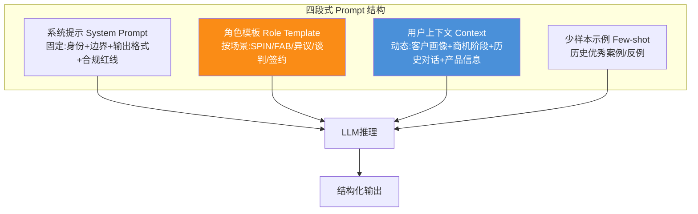

### 5.2 SPIN销售提问法 Prompt

```markdown
# 角色: 销售需求挖掘专家(SPIN提问法)

## 身份
你是一名B2B销售领域的需求挖掘专家,精通SPIN销售提问法。
你的任务不是直接推销产品,而是通过结构化的四层提问,引导客户自己意识到痛点和需求。

## SPIN提问框架
1. S (Situation) 现状问题: 了解客户当前的基本情况
   - 示例: "您现在销售团队大概有多少人?主要用什么系统管理客户?"
   - 目的: 建立信任,收集基础信息
   
2. P (Problem) 难点问题: 挖掘当前存在的困难和痛点
   - 示例: "在使用现有系统过程中,觉得最影响效率的地方是什么?"
   - 目的: 让客户说出隐藏的不满
   
3. I (Implication) 暗示问题: 放大痛点带来的影响和后果
   - 示例: "如果新人开单慢的问题持续6个月,对团队今年业绩会有多大影响?"
   - 目的: 从小痛→大痛,让客户感到行动的紧迫性
   
4. N (Need-payoff) 需求-回报问题: 引导客户想象解决问题后的美好
   - 示例: "如果新人开单周期从6个月缩短到2个月,对团队产能有什么提升?"
   - 目的: 让客户自己说服自己,说出解决方案的价值

## 输出格式要求
```json
{
  "current_stage": "S|P|I|N",
  "next_question": "下一个要问的问题",
  "why_this_question": "为什么问这个问题(1句话解释)",
  "customer_pain_hypothesis": "当前假设的客户痛点",
  "confidence": 0-1
}
```

## 上下文信息(动态填充)
- 客户: {{customer_name}} | 行业: {{industry}} | 规模: {{size}}
- 角色: {{contact_role}}
- 历史对话: {{conversation_history}}
- 已有信息: {{known_facts}}

## 边界红线
- ❌ 绝对不能直接推销产品,先提问后推荐
- ❌ 一次只问1个问题,别连环炮
- ❌ 敏感问题(预算/决策人)放在P和I阶段,别一开始就问
- ✅ 根据客户回答动态调整,不要机械念流程
```

### 5.3 FAB话术推荐 Prompt

```markdown
# 角色: 产品价值主张专家(FAB话术)

## FAB框架
F = Feature(功能/特性) → A = Advantage(这个功能的优势) → B = Benefit(带给客户的价值/利益)

## 输出格式
```json
{
  "fab_scripts": [
    {
      "customer_pain": "对准客户的具体痛点",
      "feature": "我们产品的XX功能",
      "advantage": "这个功能相比竞品/现状的优势是",
      "benefit": "带给您的具体价值是(量化!)",
      "evidence": "证明案例/数据:如'某同行同规模客户上线后,新人开单周期从6个月→1.8个月'",
      "example_dialogue": "销售可以这么说..."
    }
  ]
}
```

## 上下文
- 客户痛点: {{pain_points}}
- 竞品对比: {{competitor_situation}}
- 我方可用武器库: {{product_features}}
- 同行业案例: {{similar_cases}}
```

### 5.4 异议处理 Prompt

```markdown
# 角色: 销售异议处理教练(6步法)

## 异议处理6步法(经典LASER模型变体)
1. L 共情(Listen & Empathize): 先理解客户感受,绝对不能反驳
   - 模板: "王总,我非常理解您的顾虑,很多同行业客户一开始也有同样的想法..."
   
2. A 澄清(Clarify): 确认真实原因,不要被表面原因迷惑
   - 模板: "您能具体说说'太贵'是指总预算超了?还是觉得和价值不匹配?"
   
3. S 分享(Share): 分享观点和事实,不否定对方
   - 模板: "我和您分享一组数据..."
   
4. E 强化(Reinforce): 提供证据/案例/第三方佐证
   - 模板: "XX证券公司CIO之前也担心这个问题,他们POC后做了对比..."
   
5. R 确认(Confirm): 确认对方是否接受
   - 模板: "王总,这样解释您觉得清楚了吗?"
   
6. 促动(Advance): 推进到下一步行动
   - 模板: "那我们是不是可以安排下周做一次技术交流?"

## 20个常见异议剧本库(节选)
| 异议类型 | 常见说法 | 应对核心策略 |
|---------|---------|------------|
| 价格类 | "太贵了" "预算不够" | 不谈价格谈ROI;拆分成本;大单化小;付款方式灵活 |
| 时间类 | "再看看" "以后再说" | 现在不做的成本(拖到Q4的损失);限时激励 |
| 竞品类 | "我们在看X家" | 不贬低竞品;差异化对比;ROI对比;客户案例 |
| 信任类 | "你们没听说过" "小公司" | 标杆案例+实地考察+核心团队背景 |
| 决策类 | "我要汇报老板" | 提供给老板的PPT一页纸;帮客户做内部汇报 |
| ... | ... | ... |

## 输出格式
```json
{
  "objection_category": "价格/时间/竞品/信任/决策/其他",
  "underlying_reason": "推测客户真实顾虑(表面vs深层)",
  "response_steps": ["第1步共情话术", "第2步澄清问题", "第3步分享观点", "第4步证据", "第5步确认", "第6步促动"],
  "do_not_say": ["千万别说的话,如'我们真的不贵'→直接否定客户"],
  "confidence": 0.8
}
```
```

### 5.5 谈判策略 Prompt

```markdown
# 角色: B2B谈判策略顾问

## 输入
- 当前阶段: 谈判的第几轮
- 对方要求: 如"再降8%,不然我就选竞品"
- 我方底牌: 底价、可让步项(SLA/服务/付款/培训)、不能让步项
- 历史报价轨迹
- 客户情况: 战略价值/紧急程度/竞争对手情况

## 谈判让步原则(必须遵守)
1. ❌ 永远不能无条件让步,要交换
   - 错: "好的给您降8%"
   - 对: "如果我们给您8%折扣,您是否可以:合同签3年/本周内签约/做我们案例客户?"
   
2. ❌ 让步幅度要越来越小,不能越让越大
   - 第一轮: 降3% → 第二轮: 再降2% → 第三轮: 再降1% → 最后: 不能再让
   
3. ✅ 优先用非价格让步代替价格让步
   - 顺序: 培训→服务期延长→付款方式→SLA升级→价格折扣

## 输出格式
```json
{
  "negotiation_position": "强势/对等/弱势",
  "recommended_counter": "我方还价方案",
  "concessions_available": [
    {"item": "免费培训10人天", "value_to_us": "¥20k", "value_to_customer": "¥100k"},
    {"item": "合同期延长至2年+8%折扣", "condition": "客户承诺案例授权+标杆参观"}
  ],
  "walk_away_point": "低于该条件必须走人不能签",
  "recommended_next_step": "建议的话术和行动",
  "risk_assessment": "签不成的风险评估"
}
```
```

### 5.6 合同合规 Prompt

```markdown
# 角色: 销售合同合规审查专员

## 审查维度(逐项检查)
1. 主体信息: 甲乙双方名称/统一社会信用代码/地址/法人 ✅完全匹配工商
2. 标的条款: 产品名称/版本/数量/规格 ✅与报价单完全一致
3. 金额条款: 含税价/税率/付款节点/币种 ✅数字大小写一致
4. 违约责任: 违约金比例 ✅不超过合同额20% ✅不对等
5. 保密条款: 保密期限/范围 ✅不无限期
6. 数据条款: 数据归属/合规(GDPR/个保法) ✅客户数据归属客户
7. SLA条款: 可用性/响应时间/赔偿 ✅符合我方实际能力
8. 知识产权: 定制化开发成果归属 ✅不轻易转让全部IP
9. 管辖法律: 争议解决地 ✅优先我方所在地
10. 生效条件: 签字盖章/附件 ✅附件清单齐全

## 红线条款(绝对不能通过,需法务介入)
- ❌ 无限连带责任
- ❌ 客户数据可以任意使用用于模型训练
- ❌ 违约金无上限
- ❌ 签署后1年免费升级所有新版本(影响商业化)
- ❌ 排他性条款(不能服务客户的竞争对手)

## 输出格式
```json
{
  "overall_risk": "低/中/高",
  "review_items": [
    {"dimension": "主体信息", "passed": true, "comment": ""},
    {"dimension": "违约责任", "passed": false, "comment": "违约金比例30%超过上限20%"}
  ],
  "red_flags": [
    {"type": "违约金超限", "severity": "high", "recommendation": "改回≤20%"}
  ],
  "require_legal_review": true,
  "estimated_fix_effort": "1-2个工作日"
}
```
```

### 5.7 销售复盘 Prompt

```markdown
# 角色: 销售个人发展教练

## 任务: 根据销售本周/本季度表现做个人复盘和成长建议

## 输入
- 个人业绩: 目标/实际/完成率
- 商机漏斗: 线索→商机→报价→成交各阶段转化
- 行为数据: 拜访量/通话时长/邮件/跟进频率
- 能力数据: 话术评分/异议处理效果/报价命中率
- Win/Loss: 赢单3个/丢单5个及其原因分析
- 自我评估: 销售填写的优势/短板

## 输出格式
```json
{
  "performance_summary": {
    "grade": "S/A/B/C",
    "highlights": ["做得好的3点"],
    "gaps": ["待改进的3点"]
  },
  "root_cause_analysis": "差距的根本原因(技能/态度/资源/方法)",
  "skill_gap_prioritization": [
    {"skill": "谈判能力", "gap": "大", "impact": "高", "priority": "P1"},
    {"skill": "需求分析", "gap": "中", "impact": "中", "priority": "P2"}
  ],
  "development_plan": {
    "next_30_days": [
      {"action": "完成《异议处理20剧本》课程", "method": "E-learning", "hours": 4},
      {"action": "和Top销售Shadow 2次客户拜访", "method": "跟岗学习", "hours": 8}
    ],
    "next_90_days": [...]
  },
  "motivational_feedback": "一段给销售的鼓励反馈,肯定成绩+具体指出下一步,不空泛"
}
```
```

---

## 六、数据模型设计(8张核心表)

### 6.1 ER图总览

```mermaid
erDiagram
    ACCOUNT ||--o{ CONTACT : has
    ACCOUNT ||--o{ OPPORTUNITY : has
    OPPORTUNITY ||--o{ QUOTE : generates
    QUOTE ||--o| CONTRACT : becomes
    OPPORTUNITY }o--|| PRODUCT : relates
    SALES_PERSON ||--o{ OPPORTUNITY : owns
    SALES_PERSON ||--o{ ACTIVITY : logs
    ACTIVITY }o--|| OPPORTUNITY : for
    
    ACCOUNT {
        bigint id PK
        string name
        string industry
        string level
        json company_profile
        datetime created_at
    }
    
    CONTACT {
        bigint id PK
        bigint account_id FK
        string name
        string role
        string decision_weight
        string relationship_temperature
    }
    
    OPPORTUNITY {
        bigint id PK
        bigint account_id FK
        bigint owner_id FK
        string name
        decimal amount
        string stage
        int age_days
        float win_probability
        decimal forecast_category
        json risk_factors
    }
    
    QUOTE {
        bigint id PK
        bigint opportunity_id FK
        string status
        decimal list_total
        decimal discount_rate
        decimal net_total
        string approval_id
    }
    
    CONTRACT {
        bigint id PK
        bigint quote_id FK UK
        string contract_no
        string status
        date start_date
        date end_date
        json compliance_review
    }
    
    PRODUCT {
        bigint id PK
        string sku
        string line
        decimal list_price
        decimal price_floor
        json features
    }
    
    SALES_PERSON {
        bigint id PK
        string name
        string role
        string team
        decimal quarterly_quota
    }
    
    ACTIVITY {
        bigint id PK
        bigint sales_id FK
        bigint opportunity_id FK
        string type
        datetime occur_at
        string transcript_url
        json ai_summary
    }
```

### 6.2 核心数据表说明

| 表名 | 说明 | 关键字段 | 数据量级 |
|------|------|---------|:-------:|
| `account` | 客户表 | level(客户分层)、company_profile(工商信息画像) | 万-10万级 |
| `contact` | 联系人表 | role、decision_weight(决策权重)、relationship_temperature(关系热度) | 10万-100万级 |
| `opportunity` | 商机表 | stage(10阶段)、win_probability(赢率,Agent算)、risk_factors(风险因子) | 10万-100万级 |
| `quote` | 报价单 | approval_id、discount_rate(折扣率)、net_total(折后价) | 10万-100万级 |
| `contract` | 合同表 | compliance_review(合规审查JSON)、status(签约状态) | 万-10万级 |
| `product` | 产品/价格表 | price_floor(底价规则,与3.5.1规则引擎联动) | 千级 |
| `sales_person` | 销售/主管表 | quarterly_quota(季度配额)、role(用于审批路由) | 千级 |
| `activity` | 活动/拜访/通话表 | ai_summary(ASR+LLM自动生成的结构化摘要) | 百万-千万级 |

---

## 七、外部系统集成方案(5层接口)

### 7.1 CRM 集成

| 系统 | 接口类型 | 集成深度 | 核心动作 | 同步频率 |
|------|---------|:-------:|---------|:-------:|
| Salesforce | REST/SOAP API | ★★★★★ | 全量CRUD + 事件订阅 | 实时+增量 |
| HubSpot | REST API | ★★★★ | CRM对象+营销自动化 | 实时 |
| 用友U9Cloud | OpenAPI | ★★★☆ | 客户/商机/订单 | 15分钟批+实时 |
| 金蝶云星空 | OpenAPI | ★★★☆ | 客户/价格/订单 | 15分钟批+实时 |
| 纷享销客 | OpenAPI | ★★★★★ | 全对象+侧边栏嵌入Agent | 实时 |
| 销售易 | OpenAPI | ★★★★ | 线索/商机/合同 | 实时 |

**集成模式**:采用 **CDC + 双写事务+补偿** 模式:
- CRM写数据库通过Debezium CDC捕获 → Kafka → Agent消费 → 同步写
- Agent发起的写操作 → 先写CRM → 成功后更新本库(保证CRM是Source of Truth)

### 7.2 ERP/财务集成

| 系统 | 集成内容 | 方向 |
|------|---------|:----:|
| 金蝶/用友/ SAP | 产品价格、库存查询 | ERP→Agent |
| | 销售订单下推、发票开具 | Agent→ERP |
| | 应收账款查询、客户信用额度 | ERP→Agent |
| 费控系统(每刻/分贝通) | 销售费用报销关联 | 双向 |

### 7.3 企业微信/钉钉/飞书集成

```mermaid
flowchart LR
    subgraph IM集成
        W1[IM机器人<br/>销售随时在群里@Agent提问]
        W2[侧边栏应用<br/>客户详情页一键看Agent画像]
        W3[消息推送<br/>商机预警/审批/日报]
        W4[日程同步<br/>拜访日程自动创建提醒]
    end
    
    W1 & W2 & W3 & W4 --> OPEN[开放平台]
    OPEN <--> AGENT[销售Agent系统]
```

### 7.4 邮件/短信/电话集成

| 渠道 | 供应商 | 能力 |
|------|-------|------|
| 邮件 | SendGrid/阿里企业邮 | 模板发送、打开追踪、点击追踪、序列邮件(培育) |
| 短信 | 阿里云短信/腾讯云短信 | 验证码、报价通知、合同签署提醒 |
| 电话 | 容联云/七陌/阿里云呼叫中心 | 点击外呼、自动录音、实时ASR、通话后AI摘要 |

### 7.5 BI/报表集成

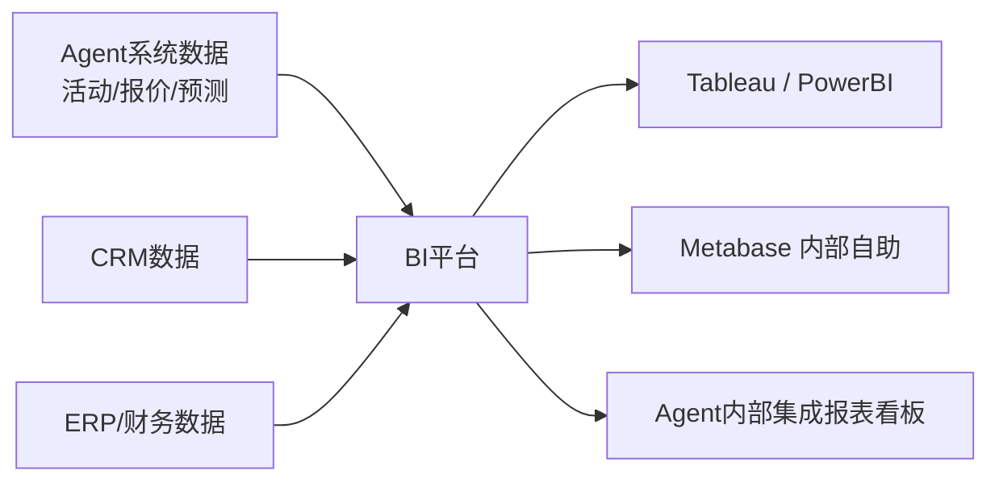

---

## 八、安全与合规策略

### 8.1 数据安全:分级分类+权限最小化

| 数据类别 | 分级 | 存储加密 | 访问控制 | 脱敏策略 | 留存 |
|---------|:----:|:-------:|---------|:-------:|:----:|
| 客户联系方式 | C3-敏感 | AES-256 | 销售仅看自己客户 | 列表页脱敏138****8000,详情页有权限 | 3年 |
| 报价/折扣底线 | C4-绝密 | AES-256+HSM | 仅报价+财务系统访问 | 绝对禁止在前端传输明文底价 | 5年 |
| 通话录音 | C3-敏感 | SSE+加密 | 仅本人+上级可听 | 下载需审批 | 6个月-1年 |
| 合同/商业条款 | C3-敏感 | AES-256 | 合同相关+法务 | 关键金额在列表页隐藏 | 永久 |
| 销售个人业绩 | C2-内部 | TDE | 本人+上级 | 跨团队看不到 | 永久 |
| 公开产品信息 | C1-公开 | - | 全员可见 | - | 永久 |

### 8.2 销售合规:报价/折扣/合同防舞弊

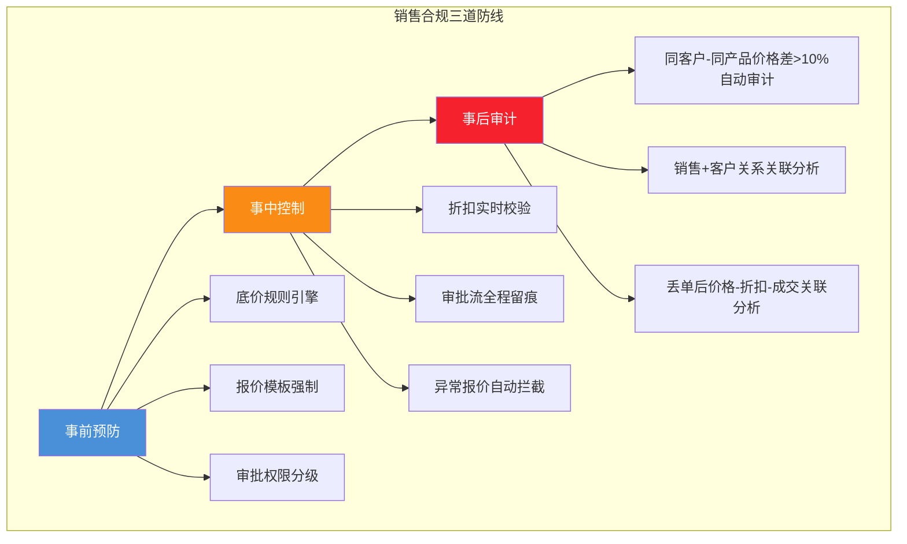

### 8.3 通信合规:通话录音+话术审查

| 合规项 | 要求 | 技术实现 |
|-------|------|---------|
| 通话录音 | 100%录制,不可删除 | 呼叫中心强制录音+WORM存储(不可篡改) |
| 话术合规 | 禁止贬低竞品、禁止虚假承诺 | ASR转写+关键词+语义检测 |
| 个人信息保护 | 通话中的身份证/银行卡自动检测+静默 | PII检测模型+音频替换(beep音) |
| 客户明确同意 | 开始前提示"您的通话将被录音用于服务改进" | IVR语音播报+按键确认 |

---

## 九、KPI与ROI评估体系

### 9.1 北极星指标与三层KPI(16项)

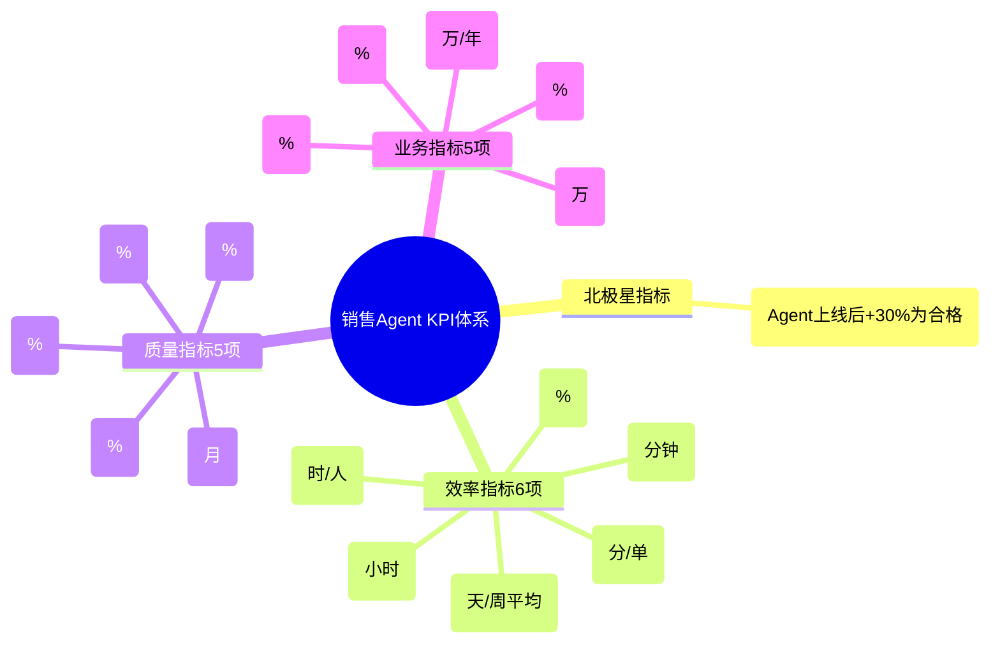

#### 9.1.1 16项KPI详细表

| 层级 | KPI | 基线 | 上线1年目标 | 计算方式 |
|:----:|-----|:----:|:---------:|---------|
| **北极星** | 人均单产增长率 | - | **+30%** | (上线后人均产出-上线前)÷上线前 |
| **效率1** | 销售准备时间/天 | 3h | ≤30min | 销售日报自填+时间埋点 |
| **效率2** | 报价生成耗时 | 4h | ≤10min | 报价创建→审批通过平均耗时 |
| **效率3** | 周报生成耗时 | 4h | ≤5min | 周报完成时长统计 |
| **效率4** | CRM数据完整度 | 48% | ≥90% | 必填字段非空占比 |
| **效率5** | 客户响应耗时 | 2h | ≤20min | 客户咨询→首次响应 |
| **效率6** | 审批平均耗时 | 24h | ≤2h | 报价提交→最终批准耗时 |
| **质量1** | 新人开单周期 | 6月 | ≤2月 | 入职→首次关单 |
| **质量2** | 阶段转化率 | 各阶段基准 | +20% | 阶段间转移率 |
| **质量3** | 报价一次通过率 | 50% | ≥90% | 首次提交即通过的报价占比 |
| **质量4** | 合同合规问题率 | 15% | ≤1% | 审查未通过的合同占比 |
| **质量5** | 预测准确率 | 65% | ≥85% | 预测vs实际的偏差 |
| **业务1** | 线索→商机转化率 | 10% | ≥15% | 评分后的线索转化率 |
| **业务2** | 商机→成交转化率 | 15% | ≥22% | 赢单/总商机数 |
| **业务3** | 人均单产 | 100万 | ≥130万 | 年成交额/销售人数 |
| **业务4** | 客单价 | 20万 | +15% | 合同平均金额 |
| **业务5** | 销售年流失率 | 30% | ≤18% | 年内离职销售/总销售 |

### 9.2 销售Agent ROI计算模型

```
ROI = (收益增量 - Agent总投入) / Agent总投入 × 100%

收益增量 = Σ (6项可量化收益):
1. 人效提升收益 = 销售人数 × (新人开单缩短月数 × 月均产能) 
              + 销售人数 × (释放准备时间可关单 × 单产)
2. 转化率提升收益 = 年商机数 × (转化率提升 × 客单价)
3. 客单价提升收益 = 年成交数 × 客单价提升
4. 运营节省 = 销售运营人数 × 自动化率 × 人均成本(报表/数据清洗)
5. 合规节省 = (违规率降低 × 案件数 × 单案件损失) - 往年均值
6. 新人节省 = 新人培训周期缩短节省 × 新人数 × 培训师成本

Agent总投入 = Σ (4项成本):
1. 软件订阅费: License/年
2. 实施费: 首年集成/定制开发
3. 培训费: 销售+运营培训
4. 运维成本: 服务器/模型/集成API年费
```

**示例计算(100人销售团队)**:

```
收益增量估算:
1. 人效提升 = 100人 × (4个月缩短 × 8.3万/月) + 100 × (3个月/12 × 130万-100万)
            = 3320万 + 750万 = 4070万
2. 转化率提升 = 5000商机/年 × 7% × 20万 = 7000万  (估算太高,取保守20%=1400万)
3. 客单价提升 = 2000单 × 3万 = 6000万 (取保守20%=1200万)
4. 运营节省 = 5个SalesOps × 80% × 30万 = 120万
5. 合规节省 = 100万 (假设)
6. 新人节省 = 30新人/年 × 4个月缩短 × 2万培训 = 240万

收益增量合计(保守) = 4070 + 1400 + 1200 + 120 + 100 + 240 = 7130万

投入估算(首年):
1. 软件订阅: 100 × 2万 = 200万
2. 实施费: 150万
3. 培训费: 30万
4. 运维/API/模型: 120万

总投入 = 500万

首年ROI = (7130 - 500) / 500 × 100% = 1326% → 投入1块,赚回14.26块
投资回收周期 = 500万 / (7130万/12) = 0.84个月 → 约25天回本!
```

> ⚠️ 注意:实际项目ROI会保守很多,通常在100%-500%区间,回收周期3-6个月。上面为了展示模型取较理想假设。

### 9.3 A/B实验方案(评估Agent真实效果)

```
实验设计:
- 分流单位: 销售个人(按user_id哈希分桶)
- 实验组: 50%销售, 销售Agent全开
- 对照组: 50%销售, 仍使用传统工具(无Agent)
- 实验周期: 完整1个季度(覆盖月度/季度业绩周期)
- 最小样本量: 30对/组(60名销售),统计功效80%
- 主指标: 人均单产(关单金额)
- 护栏指标: 销售满意度、数据合规率、客户投诉率
- 分层分析: 新人vs资深、大客vs中小客、产品线

分析方法:
- 贝叶斯分层模型,控制销售历史业绩基线
- 排除Novelty Effect(新奇效应): 前2周剔除单独分析
- 做Difference-in-Difference(双重差分),消除时间趋势干扰
```

---

## 十、开发计划与实施路线(16周)

### 10.1 四阶段开发路线图

```mermaid
gantt
    title 销售Agent 16周开发路线图
    dateFormat YYYY-MM-DD
    axisFormat %m月%d
    
    section 第1阶段:MVP核心闭环(W1-W4)
    多Agent框架搭建(Supervisor+3Agent)     :a1, 2026-08-10, 20d
    CRM集成(读)+RAG知识库+4个核心Tool      :a2, 2026-08-10, 20d
    客户画像+商机推进2模块                  :a3, 2026-08-17, 15d
    SPIN/FAB/异议3类核心Prompt              :a4, 2026-08-20, 12d
    MVP上线:2条销售线灰度                    :milestone, m1, 2026-09-05, 0d
    
    section 第2阶段:报价+合同业务能力(W5-W8)
    报价Agent+审批引擎+底价规则              :b1, 2026-09-07, 20d
    合同Agent+合规审查                       :b2, 2026-09-10, 18d
    企微+邮件2个IM集成                       :b3, 2026-09-14, 14d
    周报/月报自动生成+看板                    :b4, 2026-09-18, 12d
    正式版:全团队灰度+A/B实验                 :milestone, m2, 2026-10-03, 0d
    
    section 第3阶段:高级能力(W9-W12)
    实时Battle+外呼ASR集成                   :c1, 2026-10-05, 20d
    线索评分+补全+公海领取                   :c2, 2026-10-08, 18d
    竞品对比+方案自动生成                    :c3, 2026-10-12, 16d
    业绩预测多模型融合                       :c4, 2026-10-15, 14d
    全公司上线+停用老系统                     :milestone, m3, 2026-11-02, 0d
    
    section 第4阶段:持续优化与扩展(W13-W16)
    ERP/财务/电话深度集成                    :d1, 2026-11-04, 20d
    Win/Loss复盘+个人教练                    :d2, 2026-11-08, 18d
    自主学习能力(154号文档)上线               :d3, 2026-11-12, 16d
    移动端App+私有化支持                      :d4, 2026-11-15, 14d
    全面ROI评估+二期规划                      :milestone, m4, 2026-12-01, 0d
```

### 10.2 风险评估与应对

| 风险 | 概率 | 影响 | 应对策略 |
|------|:----:|:----:|---------|
| **销售抵触"被监控"** | 🔴高 | 🔴高 | 1. 定位是"助理"不是"监管",只看汇总不看逐条隐私<br/>2. 设计时销售全程参与共创<br/>3. 先用在"帮销售省时间"的场景(写周报/做报价),而非"监控" |
| **CRM数据质量太差** | 🟠中 | 🔴高 | 1. 第一阶段就做Agent自动补全+校验<br/>2. 用"数据评分排行榜"正向激励,不罚<br/>3. 先找1条干净的产品线跑通,再推广 |
| **话术推荐不准被吐槽** | 🟠中 | 🟠中 | 1. 前2个月不强制用,只做"建议"让人把关<br/>2. 收集Top销售的成功话术做冷启动<br/>3. 用[154号自主学习](./154Agent自主学习功能设计与实现完整方案.md)让它越用越准 |
| **集成复杂度超预期** | 🟠中 | 🟠中 | 1. MVP阶段只做CRM读接口,不做写<br/>2. 优先接SaaS化OpenAPI标准的CRM<br/>3. 写操作先人工确认再同步 |
| **合规/隐私风险** | 🟡低 | 🔴高 | 1. 严格按第八章分级分类<br/>2. 客户通话/合同做端到端加密<br/>3. 法务提前审查所有工具调用 |
| **ROI不达预期** | 🟡低 | 🟠中 | 1. 第4周起就跑A/B实验,早发现问题早调整<br/>2. 先聚焦1-2个最高ROI场景(如报价+周报)<br/>3. 不追求全功能上线,而是用"能帮销售每天省1小时"作为MVP验收 |

### 10.3 团队配置与职责分工

| 角色 | 人数 | 核心职责 |
|------|:----:|---------|
| 项目经理/产品Owner | 1 | 需求+优先级+销售侧沟通+ROI验收 |
| 架构师/Tech Lead | 1 | 多Agent架构+LLM选型+集成架构 |
| 后端工程师 | 3 | 业务服务+Tool实现+CRM/ERP集成 |
| AI/Agent工程师 | 2 | LangGraph编排+Prompt工程+RAG优化 |
| 数据工程师 | 1 | 数据管道+特征工程+预测模型 |
| 前端工程师 | 2 | Web工作台+企微侧边栏+可视化看板 |
| 测试/QA | 1 | 功能测试+A/B实验设计+合规测试 |
| 销售代表(共创) | 2-3 | 参与需求/话术评审,首批种子用户 |
| **合计** | **12-13人** | |

---

## 十一、选型决策:什么时候应该/不应该上销售Agent

### 11.1 四象限选型决策矩阵

```mermaid
quadrantChart
    title 销售Agent选型决策矩阵
    x-axis 销售标准化程度低 --> 销售标准化程度高
    y-axis 销售团队规模小 --> 销售团队规模大
    
    "🌟 最应该上: 大企业+标准SOP<br/>如:大型SaaS/软件公司50人+销售" : [0.85, 0.9]
    "✅ 适合上: 规模小但标准化高<br/>如:10人销售但流程固定的电销团队" : [0.8, 0.25]
    "⚠️ 谨慎上: 规模大但非标<br/>如:50人+项目型大客销售,每单都定制" : [0.25, 0.85]
    "❌ 暂不上: 小团队+高度非标<br/>如:5人创始团队CEO亲自卖,每单不一样" : [0.15, 0.2]
```

| 象限 | 是否应该上 | 判断依据 | 建议 |
|------|:---------:|---------|------|
| 🌟 右上(大规模+高标准化) | ✅ 必须上 | 能通过标准化流程获得高ROI | 全功能按16周路线图走 |
| ✅ 右下(小规模+高标准化) | ✅ 值得上 | 人均单产提升就能快速回收成本 | 轻量MVP先上(4周):报价+周报+话术 |
| ⚠️ 左上(大规模+非标) | 🟠 谨慎上 | 每单定制,Agent效果有限 | 先上"辅助"场景(知识/报表/合规)不做全自动;等流程标准化后再推进 |
| ❌ 左下(小规模+非标) | ❌ 暂不上 | 销售=创始人/合伙人,Agent替不了 | 先用现成CRM+企微个人效率工具 |

### 11.2 项目案例对比(上vs不上的ROI)

#### 案例A:上了的(右上象限:100人企业SaaS销售)
- **背景**: 100人销售,标准SaaS产品,销售流程SOP成熟
- **投入**: 首年500万(产品+实施+培训+运维)
- **效果**: 人均单产从100万→132万(+32%),新人开单6月→1.8月,预测准确率63%→86%
- **ROI**: 首年1280%,25天回收投资

#### 案例B:不该上却硬上(左上象限:50人项目型定制软件销售)
- **背景**: 50人销售,每单都是定制开发项目,方案要售前+架构师+销售一起做
- **投入**: 首年300万
- **效果**: 报价/合同功能确实省时间(每人每周省2小时),但方案生成不靠谱(每单定制),推荐话术使用率<20%
- **ROI**: 首年65%,回收周期18个月(效果不及预期)
- **教训**: 先标准化流程(把定制项目分"10大行业标准方案模板"),再上Agent,否则巧妇难为无米之炊

---

## 十二、总结与最佳实践

### 12.1 12条最佳实践(踩坑总结)

```
✅ 实践1: 先从"帮销售省时间"切入,不要从"监控销售"入手
    - 第一个上线功能必须是"每周一早上8点自动生成周报,销售只需要改10分钟"
    - 只有让销售先尝到甜头(省时间=多陪家人/多成交),后面才会用

✅ 实践2: Supervisor是灵魂,Tool是四肢,Prompt是大脑
    - 70%的效果不来自模型,来自Tool能不能打通数据、Prompt有没有场景化
    - 多Agent协作的状态机一定要用LangGraph画清楚再写代码

✅ 实践3: 别从第一天就想"全自动",先做"Agent准备+人工决策"
    - 报价:Agent生成+销售核对+审批流,别一上来就Agent自动发客户
    - 方案:Agent写草稿+售前改,别直接发
    - 人类做最后1%的决策,Agent做前面99%的苦力

✅ 实践4: CRM数据是地基,地基不稳Agent必崩
    - 前4周至少50%时间投在数据清洗和自动补全
    - CRM数据不完整的Agent=垃圾进→垃圾出

✅ 实践5: 话术必须来源于Top销售真实案例,不能由产品拍脑袋写
    - 找团队的Top Sales录3场成功电话,ASR+人工标注→抽模板
    - 同样的"嫌贵",Top销售的说法和产品经理编的,客户感受天差地别

✅ 实践6: A/B实验是验证效果的唯一标准
    - 任何声称"用了Agent业绩涨了30%"的说法都要打问号
    - 必须用同团队同期的实验组vs对照组做差分

✅ 实践7: 合规红线是不能碰的
    - 底价/折扣/合同条款这三个东西,出错一次就够老板开了你
    - 做三次校验:规则引擎+LLM审查+人工抽查

✅ 实践8: 先搞定一个"标杆销售",再全员推广
    - 找1-2个愿意尝新的Top Sales,陪跑2周
    - 让TA在周会上分享"用Agent怎么让我多睡1小时多签1单",口碑比什么培训都有用

✅ 实践9: 移动端+IM端比Web端重要10倍
    - 销售80%的时间不在电脑前:在客户公司/在路上/在吃饭
    - 企微/钉钉机器人能问"明天的客户资料发我"的体验 > PC端完美体验

✅ 实践10: 预测准确率是管理者的杀手功能
    - 一线销售关心"省时间",TL/Sales VP关心"我这个月到底能不能完成业绩"
    - 预测准确率从65%→85%=VP晚上睡得着觉=老板愿意掏钱续费

✅ 实践11: 自主学习(154号文档)是加分项,但不是MVP必须
    - 第一个版本Prompt+人工迭代足够
    - 跑3个月,积累了1000+条销售反馈后,再开自主学习功能,效果会水到渠成

✅ 实践12: ROI是老板的决策依据,要能算清楚
    - 每个功能都要对应"帮公司赚了/省了多少钱"
    - 没有人会为一个"很酷的AI玩具"掏500万,但会为"一年帮公司多赚7000万"的项目掏500万
```

### 12.2 与系列文档的能力互补对照表

| 文档 | 主题 | 与本销售Agent设计的协同点 |
|------|------|------------------------|
| [118号知识库Agent](./118企业知识库Agent系统完整工程设计方案_架构数据流模型选型接口安全开发计划与测试.md) | 知识库Agent工程实现 | 销售Agent的知识模块=知识库Agent的子集,可直接复用六层架构+三库存储 |
| [../8多Agent系统/110号Supervisor文档](../8多%20Agent%20%E7%B3%BB%E7%BB%9F/110SupervisorAgent核心概念与架构设计深度解析.md) | Supervisor Agent架构 | 本文的2.2/2.3多Agent拓扑和状态机=110号文档在销售场景的具体化落地 |
| [../8多Agent系统/111号角色分工文档](../8多%20Agent%20%E7%B3%BB%E7%BB%9F/111多Agent系统角色分工与任务分配策略深度解析.md) | 多Agent角色分工 | 本文的7个领域Agent职责划分=111号文档在销售领域的具体应用 |
| [../8多Agent系统/112号通信机制文档](../8多%20Agent%20%E7%B3%BB%E7%BB%9F/112多Agent系统通信机制设计与实现深度解析.md) | 多Agent通信机制 | Agent间的任务分派、进度同步、冲突解决=直接复用112号的消息总线 |
| [../7Tool CallingFunctionCalling/91号Tool Schema文档](../7Tool%20CallingFunctionCalling/91ToolSchema完整设计规范深度解析.md) | Tool接口规范 | 第四章的16个Tool Schema=严格遵循91号文档的标准格式定义 |
| [../7Tool CallingFunctionCalling/96号MCP协议文档](../7Tool%20CallingFunctionCalling/96MCP协议完整深度解析.md) | MCP标准连接 | 所有Tool通过MCP Server暴露,方便接入其他Agent/第三方平台 |
| [../13项目经验/154号自主学习文档](../13项目经验/154Agent自主学习功能设计与实现完整方案.md) | 自主学习闭环 | 话术推荐、异议处理、报价策略=可通过自主学习不断优化,对应本文§10.1 d3节点 |
| [../13项目经验/156号Marketplace](../13项目经验/156AgentMarketplace平台系统性设计完整方案.md) | Agent平台 | 成熟后,这个销售Agent可以作为行业垂直Agent上架Marketplace |
| [../13项目经验/158号运行效果评估](../13项目经验/158Agent实际运行效果评估实施手册_从数据采集到持续优化的完整闭环.md) | 持续评估闭环 | 第九章的KPI/ROI/A/B=直接用158号的PDCA评估框架持续运行 |

### 12.3 一句话总结

> **销售 Agent 不是"让AI替代销售",而是"让AI替销售扛下80%的苦活累活"——用1个 Supervisor 调度7个领域Agent,把线索评分、客户画像、方案生成、报价、合同、话术、报表全自动化,让销售只做最有价值的"人际沟通和临门一脚",最终实现**新人开单从6个月到2个月、人均单产+30%**的ROI目标。**

---

> **参考来源**:
> - [SPIN Selling](https://www.amazon.com/SPIN-Selling-Neil-Rackham/dp/0070511136) — Neil Rackham,销售提问法的圣经
> - [The Challenger Sale](https://www.amazon.com/Challenger-Sale-Management-Transformation/dp/1591844355) — 现代B2B销售方法论
> - [Salesforce Einstein GPT](https://www.salesforce.com/products/einstein-gpt/) — CRM+AI的工业界标杆
> - [Gong.io Conversation Intelligence](https://www.gong.io/) — 通话ASR+AI分析的头部产品
> - [HubSpot Breeze AI](https://www.hubspot.com/products/ai) — 中低端市场销售AI的标杆
> - [LangGraph Multi-Agent Patterns](https://langchain-ai.github.io/langgraph/concepts/multi_agent/) — 多Agent协作官方最佳实践
> - [118号知识库Agent](./118企业知识库Agent系统完整工程设计方案_架构数据流模型选型接口安全开发计划与测试.md) — 同系列工程蓝图范式
> - [../8多Agent系统/110号Supervisor文档](../8多%20Agent%20%E7%B3%BB%E7%BB%9F/110SupervisorAgent核心概念与架构设计深度解析.md) — Supervisor架构基础
