# 高效客服 Agent 系统完整工程设计方案：意图识别·知识检索·多轮对话·情绪分析·工单创建·模块化架构·监控优化

> **文档定位**:本文档是 `9AI Agent 工程实践` 系列的**119号客服 Agent 专题篇**,面向 AI 应用工程师、客服系统架构师和技术负责人。系统阐述一个**高效、模块化、可扩展的企业级客服 Agent 系统**的完整工程设计,覆盖用户意图识别、知识库检索、多轮对话管理、情绪分析、工单创建五大核心功能模块,以及模块化扩展架构、知识库更新机制、系统监控方案三大工程保障体系。
>
> **核心设计指标**:平均响应时间 < 2 秒、意图识别准确率 > 90%、用户满意度评分 > 4.5/5。所有设计方案均配套技术选型依据、模块接口契约、数据模型和可执行代码示例,确保工程团队可直接据此启动开发。
>
> **关联文档**(建议一并阅读):
> - [118企业知识库Agent系统完整工程设计方案](./118企业知识库Agent系统完整工程设计方案_架构数据流模型选型接口安全开发计划与测试.md) — 知识库底座(本文客服知识检索复用其 RAG 架构)
> - [../4RAG 检索增强生成/51RAG检索增强生成详解.md](../4RAG%20检索增强生成/51RAG检索增强生成详解.md) ~ [72RAG知识库更新机制](../4RAG%20检索增强生成/72RAG知识库更新机制系统性解决方案.md) — RAG 技术全集
> - [../3Agent 架构设计/36企业级Agent系统完整设计方案.md](../3Agent%20架构设计/36企业级Agent系统完整设计方案.md) — Agent 整体架构
> - [../3Agent 架构设计/45Agent执行状态保存机制完整设计方案.md](../3Agent%20架构设计/45Agent执行状态保存机制完整设计方案.md) — 多轮对话状态管理

---

## 目录

- [一、系统概述与设计目标](#一系统概述与设计目标)
  - [1.1 业务背景与核心挑战](#11-业务背景与核心挑战)
  - [1.2 系统设计目标（量化指标）](#12-系统设计目标量化指标)
  - [1.3 系统核心能力全景](#13-系统核心能力全景)
- [二、系统总体架构设计](#二系统总体架构设计)
  - [2.1 模块化六层架构总览](#21-模块化六层架构总览)
  - [2.2 核心处理流水线：从用户消息到响应输出](#22-核心处理流水线从用户消息到响应输出)
  - [2.3 模块化扩展机制：插件化设计](#23-模块化扩展机制插件化设计)
- [三、核心功能模块设计](#三核心功能模块设计)
  - [3.1 用户意图识别模块：准确率>90%的三级识别架构](#31-用户意图识别模块准确率90的三级识别架构)
  - [3.2 知识库检索模块：毫秒级精准召回](#32-知识库检索模块毫秒级精准召回)
  - [3.3 多轮对话管理模块：状态机+槽位填充](#33-多轮对话管理模块状态机槽位填充)
  - [3.4 情绪分析模块：实时情绪感知与 escalation 策略](#34-情绪分析模块实时情绪感知与-escalation-策略)
  - [3.5 工单创建模块：自动化工单生成与流转](#35-工单创建模块自动化工单生成与流转)
- [四、自然语言理解引擎设计](#四自然语言理解引擎设计)
  - [4.1 NLU 引擎三层架构](#41-nlu-引擎三层架构)
  - [4.2 意图识别模型选型与训练](#42-意图识别模型选型与训练)
  - [4.3 实体抽取与槽位填充](#43-实体抽取与槽位填充)
- [五、模块化扩展架构](#五模块化扩展架构)
  - [5.1 插件化模块注册机制](#51-插件化模块注册机制)
  - [5.2 渠道扩展：多端接入](#52-渠道扩展多端接入)
  - [5.3 业务扩展：行业场景适配](#53-业务扩展行业场景适配)
- [六、知识库更新机制](#六知识库更新机制)
  - [6.1 三种更新模式：实时/定时/批量](#61-三种更新模式实时定时批量)
  - [6.2 知识质量保障：审核与反馈闭环](#62-知识质量保障审核与反馈闭环)
  - [6.3 知识衰退检测与自动失效](#63-知识衰退检测与自动失效)
- [七、系统监控方案](#七系统监控方案)
  - [7.1 四维监控体系：性能/质量/业务/安全](#71-四维监控体系性能质量业务安全)
  - [7.2 实时监控看板设计](#72-实时监控看板设计)
  - [7.3 告警策略与自动处置](#73-告警策略与自动处置)
- [八、性能优化：响应时间<2秒的工程保障](#八性能优化响应时间2秒的工程保障)
  - [8.1 端到端延迟分解与优化目标](#81-端到端延迟分解与优化目标)
  - [8.2 关键路径优化策略](#82-关键路径优化策略)
- [九、开发计划与测试方案](#九开发计划与测试方案)
  - [9.1 四阶段14周开发路线图](#91-四阶段14周开发路线图)
  - [9.2 测试方案：功能/性能/准确率/满意度](#92-测试方案功能性能准确率满意度)
- [十、部署架构与运维](#十部署架构与运维)
  - [10.1 高可用部署拓扑](#101-高可用部署拓扑)
  - [10.2 持续优化闭环：从监控到迭代](#102-持续优化闭环从监控到迭代)
- [十一、总结与最佳实践](#十一总结与最佳实践)

---

## 一、系统概述与设计目标

### 1.1 业务背景与核心挑战

客服是企业与用户接触的第一线,传统客服系统面临四大核心挑战:

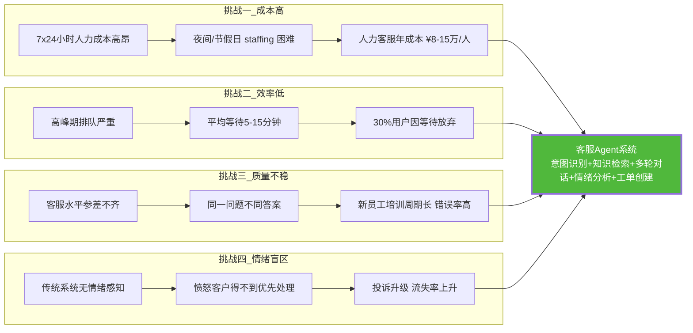

### 1.2 系统设计目标（量化指标）

| 目标维度 | 量化指标 | 行业基准 | 达标路径 |
|---------|---------|---------|---------|
| **平均响应时间** | < 2 秒 | 传统人工 30s~5min | 流式输出 + 并行处理 + 缓存 |
| **意图识别准确率** | > 90% | 关键词匹配 60~70% | 三级识别架构 + 持续训练 |
| **用户满意度** | > 4.5/5 | 传统 IVR 3.0~3.5 | 精准回答 + 情绪关怀 + 快速转人工 |
| **问题解决率** | > 80% | 传统客服 60~70% | RAG 知识检索 + 多轮澄清 |
| **首问解决率** | > 65% | 传统客服 40~50% | 意图精准 + 知识全面 |
| **人工转接率** | < 25% | 传统 100% | 情绪阈值控制 + 复杂问题兜底 |
| **并发处理能力** | 500 并发会话 | — | 异步架构 + 弹性伸缩 |
| **系统可用性** | 99.9% | — | 高可用集群 + 故障自动转移 |

### 1.3 系统核心能力全景

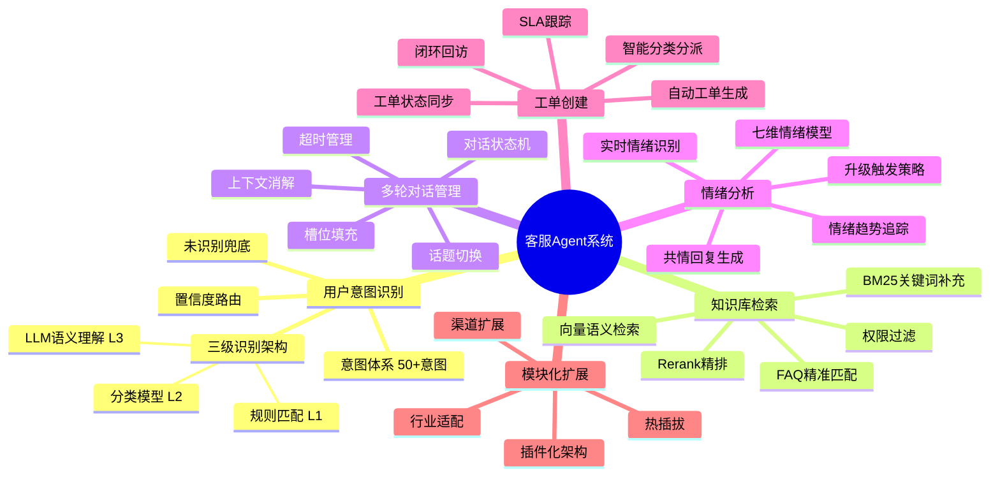

---

## 二、系统总体架构设计

### 2.1 模块化六层架构总览

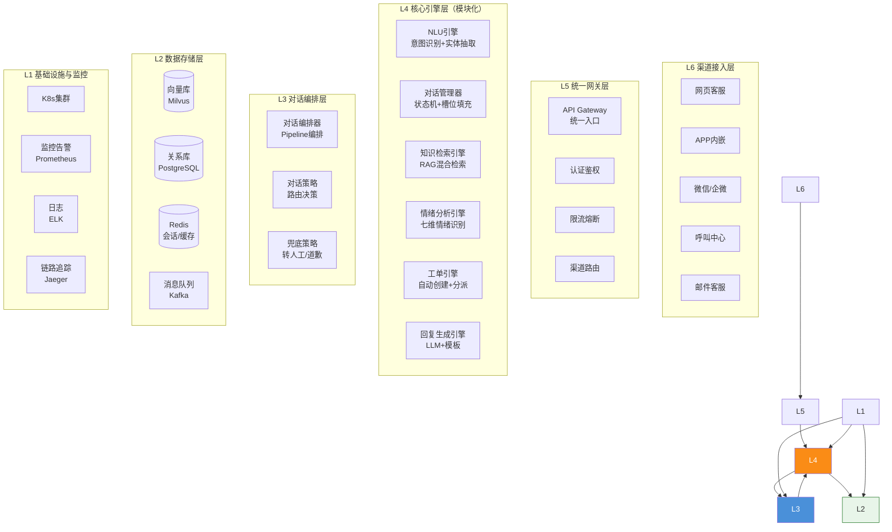

### 2.2 核心处理流水线：从用户消息到响应输出

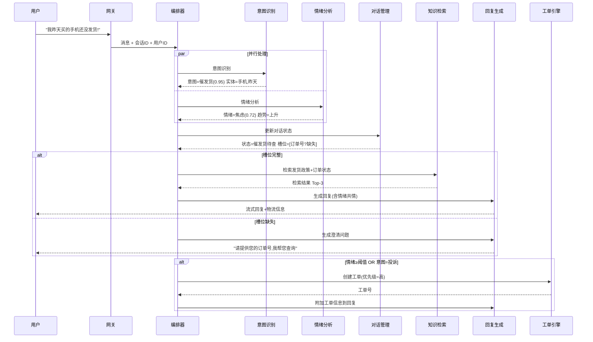

### 2.3 模块化扩展机制：插件化设计

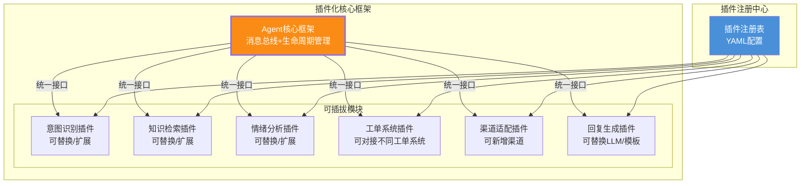

**插件接口规范**（所有模块遵循统一接口契约）:

```python
# 插件统一接口规范
from abc import ABC, abstractmethod
from dataclasses import dataclass
from typing import Any, Dict, Optional

@dataclass
class PluginContext:
    """插件上下文:包含会话/用户/渠道等全局信息"""
    session_id: str
    user_id: str
    channel: str           # web/app/wechat/call/email
    conversation_history: list
    user_profile: dict
    metadata: dict

@dataclass
class PluginResult:
    """插件统一返回结构"""
    success: bool
    data: Dict[str, Any]   # 插件输出数据
    confidence: float       # 置信度 0~1
    latency_ms: int         # 处理耗时
    next_action: Optional[str] = None  # 建议下一步动作
    error: Optional[str] = None

class AgentPlugin(ABC):
    """所有插件模块的基类"""
    
    @abstractmethod
    def get_plugin_info(self) -> dict:
        """返回插件元信息: name/version/description/dependencies"""
        pass
    
    @abstractmethod
    async def initialize(self, config: dict):
        """插件初始化(加载模型/连接资源)"""
        pass
    
    @abstractmethod
    async def process(self, input_data: dict, context: PluginContext) -> PluginResult:
        """核心处理方法"""
        pass
    
    @abstractmethod
    async def health_check(self) -> bool:
        """健康检查"""
        pass
    
    async def shutdown(self):
        """优雅关闭(释放资源)"""
        pass
```

---

## 三、核心功能模块设计

### 3.1 用户意图识别模块：准确率>90%的三级识别架构

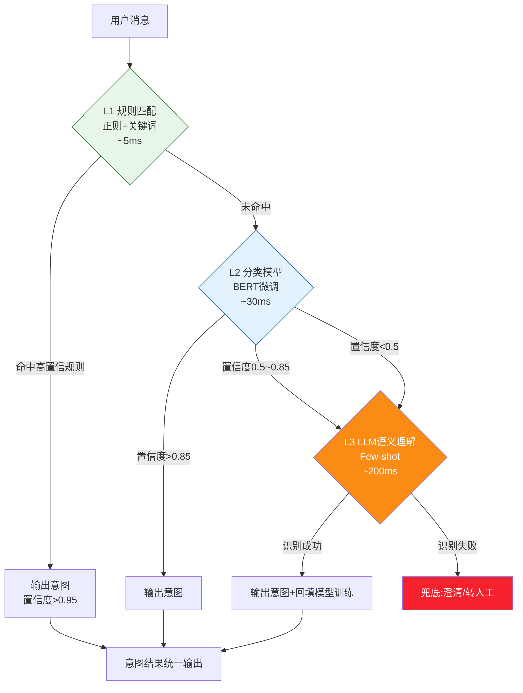

**三级识别架构设计依据**:

| 级别 | 技术 | 延迟 | 准确率 | 覆盖率 | 适用场景 |
|-----|------|:---:|:-----:|:-----:|---------|
| **L1 规则匹配** | 正则 + 关键词词典 + 模板 | <5ms | 98% | 40% | 高频标准问题("怎么退款"/"查物流") |
| **L2 分类模型** | BERT/RoBERTa 微调 | ~30ms | 92% | 85% | 标准意图分类(50+意图类别) |
| **L3 LLM 理解** | LLM Few-shot(仅低置信时触发) | ~200ms | 88% | 98% | 复杂/口语化/多意图场景 |
| **三级行合** | 级联 + 置信度路由 | 平均~25ms | **>90%** | 98% | 综合最优 |

**意图体系设计（50+ 意图，按业务域分组）**:

```python
# 意图体系定义
INTENT_HIERARCHY = {
    "售前咨询": {
        "产品咨询": ["product_info", "product_compare", "product_recommend"],
        "价格咨询": ["price_query", "discount_query", "quote_request"],
        "活动咨询": ["promotion_info", "coupon_query", "event_detail"],
    },
    "售中跟进": {
        "订单管理": ["order_status", "order_modify", "order_cancel"],
        "物流查询": ["logistics_track", "delivery_time", "address_change"],
        "支付问题": ["payment_method", "payment_failed", "invoice_request"],
    },
    "售后服务": {
        "退换货": ["return_request", "exchange_request", "refund_status"],
        "质量投诉": ["quality_complaint", "warranty_claim", "repair_request"],
        "使用咨询": ["usage_guide", "troubleshoot", "faq_query"],
    },
    "账户服务": {
        "账户管理": ["account_register", "password_reset", "account_security"],
        "会员服务": ["membership_query", "points_query", "level_benefit"],
    },
    "通用意图": {
        "转人工": ["human_handoff"],
        "问候": ["greeting"],
        "感谢": ["thanks"],
        "投诉": ["complaint", "escalation"],
        "闲聊": ["chitchat"],
    }
}
```

**L2 分类模型训练方案**:

```python
# BERT意图分类模型训练
from transformers import BertForSequenceClassification, BertTokenizer, Trainer
import torch

class IntentClassifier:
    """基于BERT的意图分类器"""
    
    def __init__(self, model_name="bert-base-chinese", num_labels=55):
        self.tokenizer = BertTokenizer.from_pretrained(model_name)
        self.model = BertForSequenceClassification.from_pretrained(
            model_name, num_labels=num_labels
        )
        self.intent_labels = load_intent_labels()  # 55个意图标签
    
    async def predict(self, text: str) -> dict:
        """预测意图"""
        inputs = self.tokenizer(
            text, return_tensors="pt", 
            max_length=128, truncation=True, padding=True
        )
        with torch.no_grad():
            outputs = self.model(**inputs)
            probs = torch.softmax(outputs.logits, dim=-1)
        
        top_prob, top_idx = torch.max(probs, dim=-1)
        confidence = top_prob.item()
        intent = self.intent_labels[top_idx.item()]
        
        return {
            "intent": intent,
            "confidence": confidence,
            "top3": self._get_top3(probs)  # 返回Top3候选意图
        }
    
    def _get_top3(self, probs):
        """返回Top3候选意图及置信度"""
        top3_probs, top3_indices = torch.topk(probs, k=3, dim=-1)
        return [
            {"intent": self.intent_labels[idx], "confidence": prob}
            for prob, idx in zip(top3_probs[0], top3_indices[0])
        ]
```

### 3.2 知识库检索模块：毫秒级精准召回

> 知识库底座复用 [118企业知识库Agent系统](./118企业知识库Agent系统完整工程设计方案_架构数据流模型选型接口安全开发计划与测试.md) 的 RAG 架构,本节聚焦客服场景的专项优化。

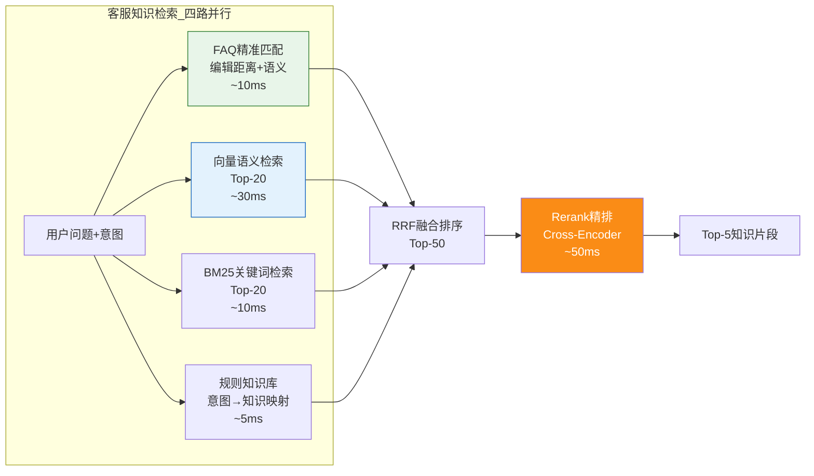

**客服知识库分层结构**:

| 知识层 | 内容 | 检索方式 | 更新频率 | 典型场景 |
|-------|------|---------|:-------:|---------|
| **FAQ 精准库** | 高频问答对(Q-A) | 语义匹配+编辑距离 | 实时 | "怎么退款?"→标准答案 |
| **政策文档库** | 退换货政策/保修条款/运费规则 | 向量检索+Rerank | 每周 | "7天无理由退货条件?" |
| **产品知识库** | 产品参数/使用说明/常见故障 | 向量检索+属性过滤 | 随产品更新 | "XX型号支持5G吗?" |
| **订单数据** | 实时订单状态/物流信息 | API查询(非检索) | 实时 | "我的订单到哪了?" |
| **历史工单库** | 历史工单及解决方案 | 向量检索(相似问题) | 实时 | "别人遇到这问题怎么解决的?" |

**FAQ 精准匹配（最快路径,命中率 40%+,延迟 <10ms）**:

```python
# FAQ精准匹配引擎
class FAQMatcher:
    """FAQ精准匹配:语义相似度+编辑距离混合"""
    
    def __init__(self, faq_db, embedding_model):
        self.faq_db = faq_db                    # FAQ数据库
        self.embedder = embedding_model          # Embedding模型
        self.faq_embeddings = self._preload()    # 预加载FAQ向量
    
    async def match(self, query: str, threshold: float = 0.88) -> Optional[dict]:
        """精准匹配FAQ"""
        # 1. 向量相似度检索Top-5
        query_vec = await self.embedder.encode(query)
        similarities = cosine_similarity(query_vec, self.faq_embeddings)
        top5_idx = np.argsort(similarities)[-5:][::-1]
        
        # 2. 对Top-5做编辑距离二次验证
        for idx in top5_idx:
            faq = self.faq_db[idx]
            sem_sim = similarities[idx]
            edit_sim = self._edit_similarity(query, faq["question"])
            hybrid_score = sem_sim * 0.7 + edit_sim * 0.3
            
            if hybrid_score >= threshold:
                return {
                    "matched_faq": faq,
                    "score": hybrid_score,
                    "answer": faq["answer"],
                    "source": "faq_exact_match"
                }
        
        return None  # 无精准匹配
```

### 3.3 多轮对话管理模块：状态机+槽位填充

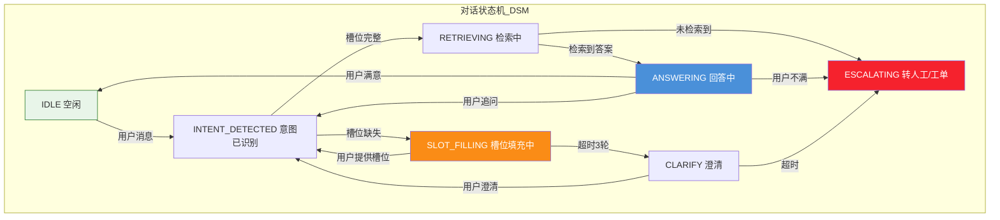

**对话状态管理实现**:

```python
# 对话状态管理器
from enum import Enum
from dataclasses import dataclass, field
from typing import Dict, List, Optional

class DialogState(Enum):
    IDLE = "idle"
    INTENT_DETECTED = "intent_detected"
    SLOT_FILLING = "slot_filling"
    RETRIEVING = "retrieving"
    ANSWERING = "answering"
    CLARIFY = "clarify"
    ESCALATING = "escalating"

@dataclass
class Slot:
    """槽位定义"""
    name: str               # 槽位名(如 order_id)
    required: bool          # 是否必填
    value: Optional[str]    # 当前值
    prompt: str             # 询问话术
    validation: str         # 校验正则

@dataclass
class DialogSession:
    """对话会话"""
    session_id: str
    user_id: str
    state: DialogState
    intent: Optional[str]       # 当前意图
    slots: Dict[str, Slot]      # 槽位集合
    history: List[dict]         # 对话历史
    turn_count: int             # 当前意图轮次
    topic_stack: List[str]      # 话题栈(支持话题切换)
    created_at: float
    last_active: float
    sentiment_trend: List[float]  # 情绪趋势

class DialogManager:
    """对话管理器:状态机驱动+槽位填充"""
    
    # 意图→必填槽位映射
    INTENT_SLOTS = {
        "order_status": [Slot("order_id", True, None, "请提供您的订单号", r"\d{10,20}")],
        "return_request": [
            Slot("order_id", True, None, "请提供订单号", r"\d{10,20}"),
            Slot("return_reason", True, None, "请问退货原因是什么?", None),
        ],
        "logistics_track": [Slot("order_id", True, None, "请提供订单号", r"\d{10,20}")],
    }
    
    async def process_message(self, session: DialogSession, 
                              user_msg: str, intent: dict) -> dict:
        """处理用户消息,驱动状态机"""
        
        # 1. 更新对话状态
        session.intent = intent["intent"]
        session.turn_count += 1
        
        # 2. 槽位填充
        if session.intent in self.INTENT_SLOTS:
            required_slots = self.INTENT_SLOTS[session.intent]
            session.slots = {s.name: s for s in required_slots}
            
            # 从用户消息中抽取槽位值
            extracted = await self._extract_slots(user_msg, session.intent)
            for name, value in extracted.items():
                if name in session.slots:
                    session.slots[name].value = value
            
            # 检查必填槽位是否完整
            missing = [s for s in session.slots.values() if s.required and not s.value]
            
            if missing:
                # 槽位不完整 → 进入槽位填充状态
                session.state = DialogState.SLOT_FILLING
                next_slot = missing[0]
                return {
                    "action": "ask_slot",
                    "response": next_slot.prompt,
                    "missing_slot": next_slot.name
                }
        
        # 3. 槽位完整 → 进入检索
        session.state = DialogState.RETRIEVING
        return {
            "action": "retrieve",
            "intent": session.intent,
            "slots": {k: v.value for k, v in session.slots.items() if v.value}
        }
    
    async def _extract_slots(self, msg: str, intent: str) -> dict:
        """从消息中抽取槽位值(实体抽取)"""
        # 使用NER模型抽取订单号/产品名/日期等实体
        entities = await self.ner_engine.extract(msg, intent)
        return entities
```

**多轮对话核心场景处理**:

| 场景 | 用户输入 | 系统处理 | 输出 |
|-----|---------|---------|------|
| **首次提问(信息完整)** | "查下订单 20260808123 的物流" | 意图=物流查询,槽位=订单号✅ | 直接检索物流信息 |
| **首次提问(信息缺失)** | "我的快递到哪了" | 意图=物流查询,槽位=订单号❌ | "请提供您的订单号" |
| **多轮澄清** | "是昨天买的那个" | 上下文消解→查历史订单 | "您是指订单20260808123吗?" |
| **话题切换** | (查物流中)"对了,怎么退款?" | 话题栈保存原话题→切换退款意图 | 切换到退款流程,原话题入栈 |
| **超时处理** | 3轮未提供订单号 | 超过槽位填充轮次上限 | "为更好帮您,转接人工客服" |

### 3.4 情绪分析模块：实时情绪感知与 escalation 策略

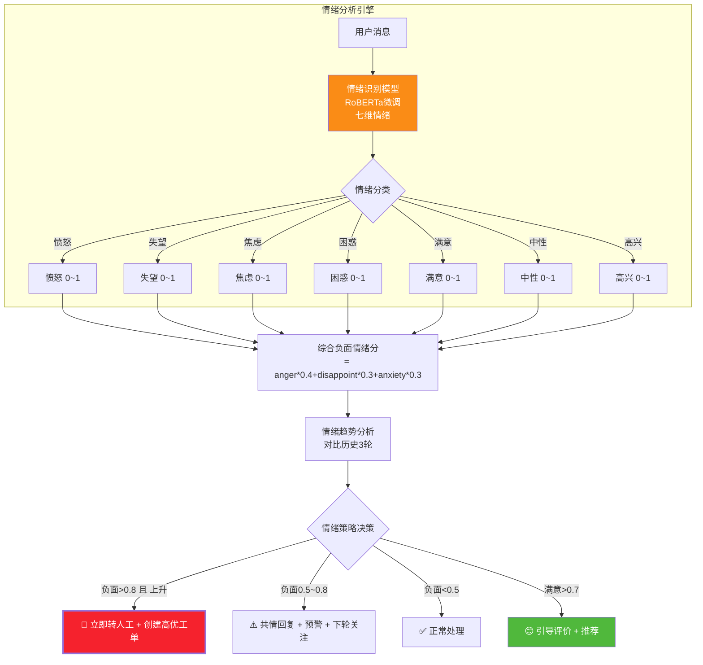

**情绪分析模型与策略**:

```python
# 情绪分析引擎
class SentimentAnalyzer:
    """七维情绪分析引擎"""
    
    EMOTIONS = ["anger", "disappointment", "anxiety", "confusion", 
                "satisfaction", "neutral", "happiness"]
    
    # 情绪→负面权重(用于计算综合负面分)
    NEGATIVE_WEIGHTS = {
        "anger": 0.4, "disappointment": 0.3, "anxiety": 0.3
    }
    
    async def analyze(self, message: str, session: DialogSession) -> dict:
        """分析用户情绪"""
        # 1. 模型推理:七维情绪概率
        emotions = await self.model.predict(message)
        # emotions = {"anger": 0.65, "disappointment": 0.20, ...}
        
        # 2. 计算综合负面情绪分
        negative_score = sum(
            emotions.get(e, 0) * w for e, w in self.NEGATIVE_WEIGHTS.items()
        )
        
        # 3. 情绪趋势分析(对比最近3轮)
        session.sentiment_trend.append(negative_score)
        trend = self._calc_trend(session.sentiment_trend[-3:])
        
        # 4. 策略决策
        action = self._decide_action(negative_score, trend, session)
        
        return {
            "emotions": emotions,
            "negative_score": negative_score,
            "trend": trend,            # "rising"/"falling"/"stable"
            "action": action,
            "should_escalate": action == "escalate"
        }
    
    def _decide_action(self, score: float, trend: str, session: DialogSession) -> str:
        """情绪策略决策"""
        if score > 0.8 and trend == "rising":
            return "escalate"          # 立即转人工
        elif score > 0.8:
            return "escalate_warn"     # 转人工(可稍等)
        elif score > 0.5:
            return "empathy"           # 共情回复+预警
        elif score < 0.2 and session.turn_count > 2:
            return "satisfy"           # 引导评价
        else:
            return "normal"            # 正常处理
```

**情绪 escalation 矩阵**:

| 负面情绪分 | 趋势 | 策略 | 系统动作 | 回复风格 |
|:--------:|:---:|------|---------|---------|
| >0.8 | 上升 | 🚨 立即升级 | 转人工+创建P1工单+通知主管 | 共情+致歉+承诺 |
| >0.8 | 稳定 | ⚠️ 预警升级 | 创建P2工单+下轮再判 | 共情+解决方案 |
| 0.5~0.8 | 上升 | ⚠️ 关注 | 标记关注+预填工单 | 共情+积极解决 |
| 0.5~0.8 | 稳定/下降 | 正常 | 记录情绪 | 友好+高效 |
| <0.5 | — | ✅ 正常 | 正常处理 | 专业+简洁 |
| <0.2(满意) | — | 😊 引导 | 引导评价+推荐 | 感谢+推荐 |

### 3.5 工单创建模块：自动化工单生成与流转

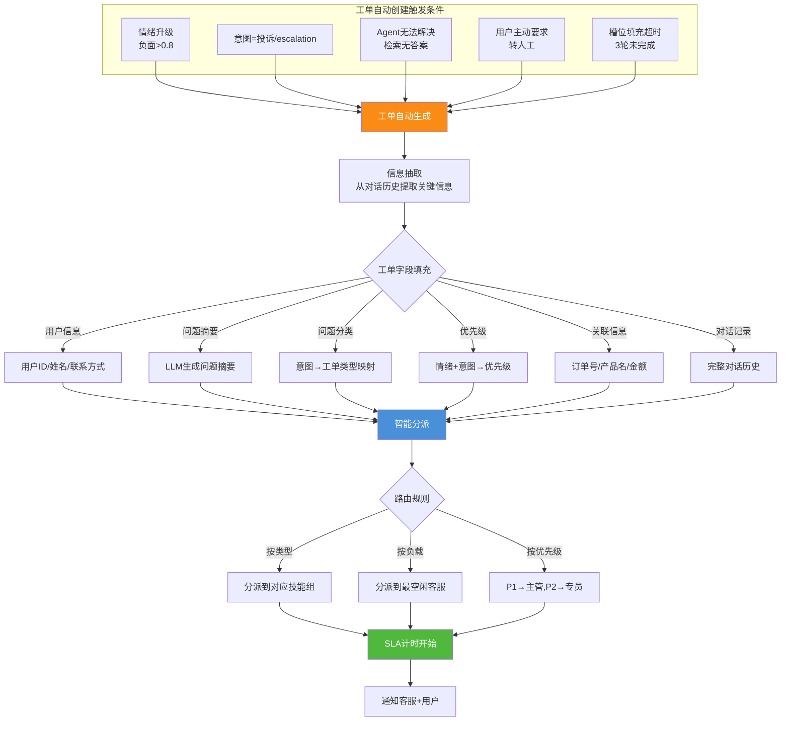

**工单数据模型与自动生成**:

```python
# 工单自动生成引擎
from dataclasses import dataclass
from datetime import datetime, timedelta

@dataclass
class Ticket:
    ticket_id: str
    user_id: str
    user_name: str
    user_contact: str
    title: str               # 工单标题
    summary: str             # 问题摘要(LLM生成)
    category: str            # 工单类型
    priority: str            # P1/P2/P3/P4
    status: str              # open/assigned/resolved/closed
    related_order: str       # 关联订单号
    related_product: str     # 关联产品
    sentiment_score: float   # 情绪分
    conversation_log: list   # 对话记录
    assigned_to: str         # 分派客服
    assigned_group: str      # 技能组
    sla_deadline: datetime   # SLA截止时间
    created_at: datetime
    updated_at: datetime

class TicketEngine:
    """工单自动创建与流转引擎"""
    
    # 意图→工单类型映射
    INTENT_CATEGORY_MAP = {
        "quality_complaint": "质量投诉",
        "return_request": "退换货",
        "order_cancel": "订单取消",
        "complaint": "一般投诉",
        "escalation": "升级投诉",
        "payment_failed": "支付问题",
    }
    
    # 优先级矩阵:情绪×意图
    PRIORITY_MATRIX = {
        ("high_negative", "complaint"): "P1",      # 愤怒+投诉 → P1
        ("high_negative", "quality_complaint"): "P1",
        ("high_negative", "*"): "P2",               # 愤怒+其他 → P2
        ("medium_negative", "complaint"): "P2",
        ("medium_negative", "*"): "P3",
        ("*", "*"): "P4",
    }
    
    # SLA时效
    SLA_HOURS = {"P1": 2, "P2": 8, "P3": 24, "P4": 48}
    
    async def create_ticket(self, session: DialogSession, 
                            trigger_reason: str) -> Ticket:
        """自动创建工单"""
        # 1. LLM生成问题摘要
        summary = await self._generate_summary(session.history)
        
        # 2. 确定工单类型
        category = self.INTENT_CATEGORY_MAP.get(
            session.intent, "一般咨询"
        )
        
        # 3. 确定优先级
        priority = self._calc_priority(session)
        
        # 4. 抽取关联信息
        related = self._extract_related_info(session)
        
        # 5. 创建工单
        ticket = Ticket(
            ticket_id=generate_ticket_id(),
            user_id=session.user_id,
            user_name=session.user_profile.get("name", ""),
            user_contact=session.user_profile.get("phone", ""),
            title=f"[{category}]{summary[:30]}",
            summary=summary,
            category=category,
            priority=priority,
            status="open",
            related_order=related.get("order_id", ""),
            related_product=related.get("product", ""),
            sentiment_score=session.sentiment_trend[-1] if session.sentiment_trend else 0,
            conversation_log=session.history,
            assigned_to="",
            assigned_group=self._route_to_group(category, priority),
            sla_deadline=datetime.now() + timedelta(hours=self.SLA_HOURS[priority]),
            created_at=datetime.now(),
            updated_at=datetime.now(),
        )
        
        # 6. 持久化
        await self.db.save_ticket(ticket)
        
        # 7. 分派+通知
        await self._assign_and_notify(ticket)
        
        return ticket
    
    async def _generate_summary(self, history: list) -> str:
        """LLM生成问题摘要"""
        prompt = f"""请用一句话概括用户的核心问题(50字以内):

对话记录:
{self._format_history(history)}

问题摘要:"""
        return await self.llm.generate(prompt, max_tokens=60)
```

---

## 四、自然语言理解引擎设计

### 4.1 NLU 引擎三层架构

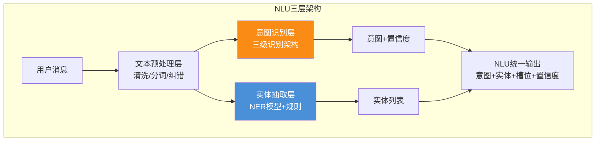

### 4.2 意图识别模型选型与训练

| 模型 | 类型 | 中文能力 | 推理速度 | 部署 | 推荐度 |
|-----|:----:|:------:|:------:|:--:|:----:|
| **RoBERTa-wwm-ext-large** ✨ | BERT变体 | ⭐⭐⭐⭐⭐ | ~30ms | 本地 | ⭐⭐⭐⭐⭐ |
| BERT-base-chinese | BERT | ⭐⭐⭐⭐ | ~20ms | 本地 | ⭐⭐⭐⭐ |
| TextCNN | CNN | ⭐⭐⭐ | ~5ms | 本地 | ⭐⭐⭐(轻量) |
| LLM Few-shot | 生成式 | ⭐⭐⭐⭐⭐ | ~200ms | API/本地 | ⭐⭐⭐(兜底) |

**训练数据构建与持续学习**:

```python
# 意图识别持续学习闭环
class IntentTrainingPipeline:
    """意图模型持续训练管线"""
    
    async def daily_training(self):
        """每日增量训练(利用前一天的用户反馈数据)"""
        # 1. 从对话日志中提取新样本
        new_samples = await self._extract_labeled_samples()
        
        # 2. 人工审核低置信样本(Active Learning)
        reviewed = await self._active_learning_review(new_samples)
        
        # 3. 增量训练
        if len(reviewed) >= 50:  # 新样本够多才训练
            await self._incremental_train(reviewed)
        
        # 4. A/B验证新模型
        new_metrics = await self._evaluate_new_model()
        if new_metrics["accuracy"] > self.current_accuracy:
            await self._deploy_new_model()
    
    async def _extract_labeled_samples(self):
        """从用户反馈中提取标注样本"""
        # 用户点了"回答有帮助" → 正样本
        # 用户点了"答非所问" → 负样本,人工修正意图
        # 用户转人工 → 低置信样本,人工审核
        pass
```

### 4.3 实体抽取与槽位填充

```python
# 实体抽取引擎
class EntityExtractor:
    """实体抽取:NER模型+规则混合"""
    
    # 规则实体(正则高精度)
    RULE_ENTITIES = {
        "order_id": r"\b\d{10,20}\b",
        "phone": r"1[3-9]\d{9}",
        "amount": r"\d+\.?\d*元?",
        "date": r"\d{4}年\d{1,2}月\d{1,2}日|\d{1,2}月\d{1,2}日|今天|昨天|前天",
        "tracking_no": r"[A-Z]{2}\d{10,}",
    }
    
    # NER模型实体(语义理解)
    NER_ENTITIES = ["product_name", "address", "person_name", "issue_description"]
    
    async def extract(self, text: str, intent: str = None) -> dict:
        """抽取实体"""
        entities = {}
        
        # 1. 规则抽取(高精度)
        for ent_type, pattern in self.RULE_ENTITIES.items():
            matches = re.findall(pattern, text)
            if matches:
                entities[ent_type] = matches[0]
        
        # 2. NER模型抽取(语义)
        ner_results = await self.ner_model.predict(text)
        for ent in ner_results:
            entities[ent["type"]] = ent["value"]
        
        # 3. 意图引导抽取(根据意图关注特定实体)
        if intent and intent in self.INTENT_ENTITY_MAP:
            focus_entities = self.INTENT_ENTITY_MAP[intent]
            entities = {k: v for k, v in entities.items() 
                       if k in focus_entities}
        
        return entities
```

---

## 五、模块化扩展架构

### 5.1 插件化模块注册机制

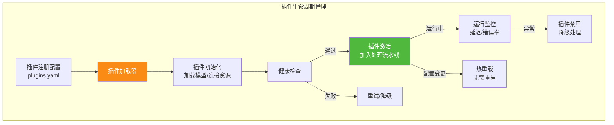

```yaml
# plugins.yaml - 插件注册配置
plugins:
  intent_recognition:
    class: "plugins.nlu.IntentRecognitionPlugin"
    version: "2.1.0"
    config:
      model_path: "models/roberta-intent-v2"
      confidence_threshold: 0.85
      fallback_to_llm: true
    dependencies:
      - "knowledge_retrieval"  # 依赖的知识检索插件
    
  knowledge_retrieval:
    class: "plugins.kb.KnowledgeRetrievalPlugin"
    version: "1.5.0"
    config:
      vector_db: "milvus"
      collection: "cs_knowledge_base"
      embedding_model: "BGE-M3"
      rerank_model: "bge-reranker-v2-m3"
      top_k: 5
    
  sentiment_analysis:
    class: "plugins.sentiment.SentimentAnalysisPlugin"
    version: "1.2.0"
    config:
      model_path: "models/roberta-sentiment-v1"
      emotions: ["anger", "disappointment", "anxiety", "satisfaction"]
      escalate_threshold: 0.8
    
  ticket_engine:
    class: "plugins.ticket.TicketEnginePlugin"
    version: "1.0.0"
    config:
      ticket_system: "internal"  # internal / zendesk / freshdesk
      sla_config: "config/sla.yaml"
    
  response_generation:
    class: "plugins.response.ResponseGenPlugin"
    version: "2.0.0"
    config:
      llm_provider: "local"  # local / openai / azure
      model: "Qwen2.5-72B"
      stream: true
      empathy_enabled: true
```

### 5.2 渠道扩展：多端接入

| 渠道 | 接入方式 | 消息格式 | 特殊处理 |
|-----|---------|---------|---------|
| **网页客服** | WebSocket | 文本/图片/文件 | 支持富文本+卡片消息 |
| **APP 内嵌** | RESTful API | 文本/图片 | SDK 集成 |
| **微信/企微** | 微信回调 | 文本/图片/语音 | 语音转文字(ASR) |
| **呼叫中心** | ASR + TTS | 语音→文本→语音 | 语音识别+合成 |
| **邮件客服** | IMAP/SMTP | 邮件正文+附件 | 邮件解析+异步回复 |

### 5.3 业务扩展：行业场景适配

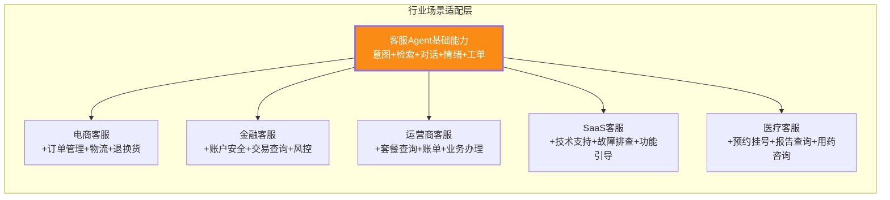

**行业适配只需扩展三要素**:① 意图体系(行业专属意图) ② 知识库(行业知识) ③ 工单类型(行业流程)。基础引擎无需修改。

---

## 六、知识库更新机制

> 知识库底座复用 [118企业知识库Agent系统](./118企业知识库Agent系统完整工程设计方案_架构数据流模型选型接口安全开发计划与测试.md),本节聚焦客服场景的知识更新专项设计。

### 6.1 三种更新模式：实时/定时/批量

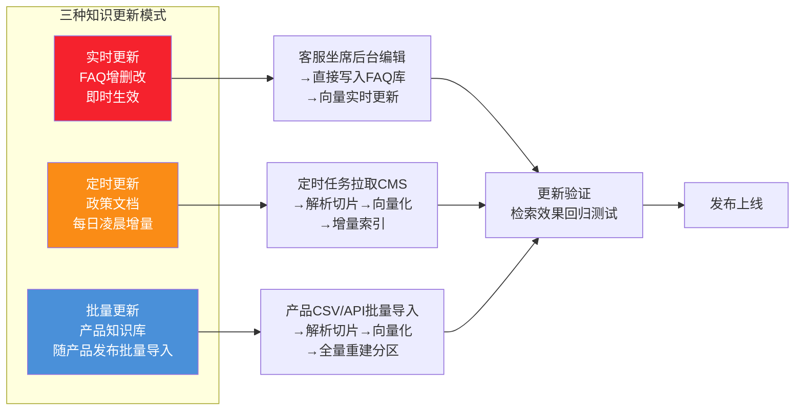

### 6.2 知识质量保障：审核与反馈闭环

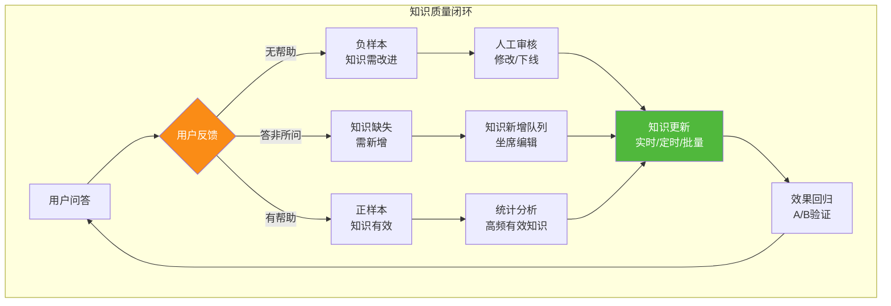

**知识衰退检测指标**:

| 检测指标 | 计算方式 | 衰退阈值 | 处置 |
|---------|---------|:-------:|------|
| 点击率下降 | 周环比下降率 | >30% | 标记待审查 |
| 负反馈率 | 无帮助/总反馈 | >40% | 触发人工审核 |
| 检索命中率 | 被检索次数/周期 | 趋近0 | 标记为冷门,考虑下线 |
| 时效性 | 距最后更新天数 | >180天 | 标记待更新 |

### 6.3 知识衰退检测与自动失效

```python
# 知识衰退检测与自动失效引擎
class KnowledgeDecayDetector:
    """知识衰退检测:定期扫描知识库,识别需更新/下线的内容"""
    
    async def scan_decay(self):
        """每周扫描知识衰退情况"""
        all_faqs = await self.db.get_all_faqs()
        
        for faq in all_faqs:
            decay_score = self._calc_decay_score(faq)
            
            if decay_score > 0.7:
                # 高度衰退 → 通知坐席审核
                await self._notify_review(faq, decay_score)
                faq.status = "under_review"
            elif decay_score > 0.5:
                # 中度衰退 → 标记观察
                faq.status = "decaying"
            
            await self.db.update_faq_status(faq)
    
    def _calc_decay_score(self, faq) -> float:
        """计算知识衰退分(0~1,越高越衰退)"""
        score = 0.0
        
        # 1. 时效性(距最后更新天数)
        days_since_update = (datetime.now() - faq.updated_at).days
        if days_since_update > 180:
            score += 0.3
        elif days_since_update > 90:
            score += 0.15
        
        # 2. 负反馈率
        if faq.total_feedback > 10:
            neg_rate = faq.negative_feedback / faq.total_feedback
            if neg_rate > 0.4:
                score += 0.4
            elif neg_rate > 0.2:
                score += 0.2
        
        # 3. 点击率下降趋势
        if faq.ctr_trend == "declining":
            score += 0.3
        
        return min(score, 1.0)
```

---

## 七、系统监控方案

### 7.1 四维监控体系：性能/质量/业务/安全

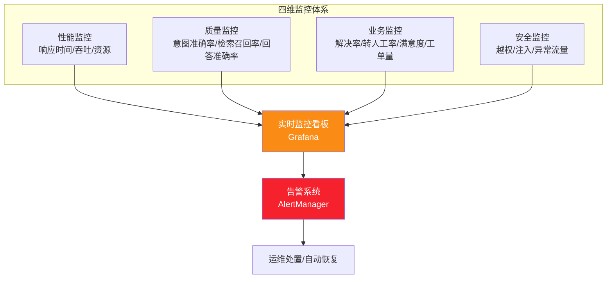

**四维监控指标清单**:

| 维度 | 指标 | 采集方式 | 告警阈值 | 处置 |
|-----|------|---------|:-------:|------|
| **性能** | 平均响应时间 | 链路追踪 | >2s | 自动扩容 |
| **性能** | P99 响应时间 | 链路追踪 | >5s | 限流降级 |
| **性能** | 意图识别延迟 | 打点 | >50ms | 模型优化 |
| **性能** | 检索延迟 | 打点 | >100ms | 向量库优化 |
| **性能** | GPU 利用率 | DCGM | >90% | 扩容 |
| **质量** | 意图识别准确率 | 采样标注 | <90% | 触发重训 |
| **质量** | 检索 Top-5 召回率 | 标注集 | <85% | 知识/模型检查 |
| **质量** | 回答准确率 | 用户反馈 | <80% | RAG 优化 |
| **质量** | 幻觉率 | NLI 检测 | >10% | Prompt 调整 |
| **业务** | 问题解决率 | 会话分析 | <75% | 知识补充 |
| **业务** | 人工转接率 | 会话统计 | >30% | Agent 优化 |
| **业务** | 满意度评分 | 用户评价 | <4.0 | 全面排查 |
| **业务** | 工单 SLA 达标率 | 工单系统 | <90% | 客服调度 |
| **安全** | 越权尝试 | 日志分析 | >10次/min | 封禁 IP |
| **安全** | 注入攻击 | 内容检测 | 任何命中 | 拦截+告警 |

### 7.2 实时监控看板设计

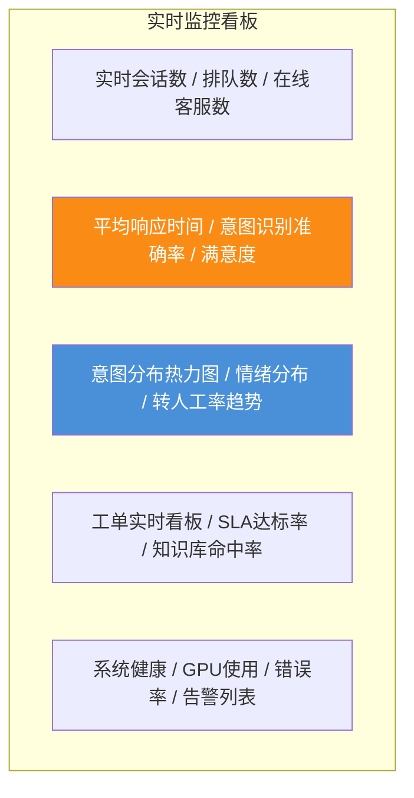

### 7.3 告警策略与自动处置

| 告警级别 | 触发条件 | 响应时间 | 处置方式 |
|:-------:|---------|:-------:|---------|
| 🔴 P0 | 系统不可用/数据丢失 | <1min | 自动故障转移 + 电话告警 + 全员响应 |
| 🟠 P1 | 响应时间>5s/准确率<85% | <5min | 自动扩容/限流 + 飞书告警 + 值班响应 |
| 🟡 P2 | 指标劣化趋势/满意度<4.0 | <30min | 飞书告警 + 工作时间响应 |
| 🟢 P3 | 常规预警 | 下一工作日 | 邮件通知 + 周报汇总 |

---

## 八、性能优化：响应时间<2秒的工程保障

### 8.1 端到端延迟分解与优化目标

```mermaid
gantt
    title 端到端响应延迟分解(目标<2s)
    dateFormat s
    axisFormat %S秒
    
    section 并行处理(关键路径)
    网关路由 :0, 0.02
    意图识别(L1+L2) :0.02, 0.03
    情绪分析(并行) :0.02, 0.03
    对话状态更新 :0.05, 0.01
    
    section 串行(关键路径)
    知识检索(向量+BM25) :0.06, 0.05
    Rerank精排 :0.11, 0.05
    LLM首Token(流式) :0.16, 0.84
    LLM完整输出(流式) :1.0, 1.0
```

| 处理环节 | 优化前延迟 | 优化后目标 | 优化手段 |
|---------|:--------:|:--------:|---------|
| 网关路由 | 50ms | **20ms** | 连接池复用 + 路由缓存 |
| 意图识别 | 200ms(全走LLM) | **30ms**(L1+L2级联) | 三级架构,90%请求不走L3 |
| 情绪分析 | 50ms | **30ms**(并行) | 与意图识别并行处理 |
| 知识检索 | 100ms | **50ms** | FAQ缓存 + 向量库HNSW优化 |
| Rerank | 100ms | **50ms** | 批量推理 + GPU加速 |
| LLM 首 Token | 1.5s | **800ms** | vLLM + KV Cache + Prompt缓存 |
| LLM 完整输出 | 5s | **流式输出(首Token<1s)** | 流式生成,用户即时看到 |
| **端到端(首响应)** | — | **<1s** | 流式输出 |
| **端到端(完整回答)** | — | **<2s(短) ~ 5s(长)** | 取决于回答长度 |

### 8.2 关键路径优化策略

```python
# 性能优化:并行处理 + 缓存 + 流式输出
class OptimizedPipeline:
    """优化后的处理流水线"""
    
    async def handle_message(self, user_msg: str, session: DialogSession):
        # 1. 并行启动:意图识别 + 情绪分析 + FAQ匹配
        intent_task = asyncio.create_task(self.nlu.recognize(user_msg))
        sentiment_task = asyncio.create_task(self.sentiment.analyze(user_msg, session))
        faq_task = asyncio.create_task(self.faq_matcher.match(user_msg))
        
        intent, sentiment, faq = await asyncio.gather(
            intent_task, sentiment_task, faq_task
        )
        
        # 2. FAQ命中 → 直接返回(最快路径,<200ms)
        if faq and faq["score"] > 0.88:
            return self._format_response(faq["answer"], sources=["FAQ"])
        
        # 3. FAQ未命中 → 知识检索 + Rerank
        retrieved = await self.kb.retrieve(user_msg, intent["intent"], top_k=20)
        reranked = await self.reranker.rerank(user_msg, retrieved, top_k=5)
        
        # 4. 流式生成(首Token<1s)
        context = self._build_context(reranked, sentiment)
        async for token in self.llm.stream_generate(context, user_msg):
            yield token  # 流式输出,用户即时看到
        
        # 5. 后置:工单创建/日志记录(异步,不阻塞响应)
        if sentiment["should_escalate"]:
            asyncio.create_task(self.ticket_engine.create_ticket(session, "sentiment"))
```

**缓存策略**:

| 缓存层 | 缓存内容 | 命中率 | TTL | 工具 |
|-------|---------|:-----:|:---:|------|
| **FAQ 答案缓存** | 高频FAQ的完整答案 | 40%+ | 永久(随FAQ更新) | Redis |
| **意图识别缓存** | 相同输入的意图结果 | 15% | 1小时 | Redis |
| **Embedding 缓存** | 问题的Embedding向量 | 20% | 24小时 | Redis |
| **LLM 回复缓存** | 高频问题的完整回复 | 10% | 1小时 | Redis |
| **Prompt 前缀缓存** | System Prompt的KV Cache | 80%+ | 持久 | vLLM KV Cache |

---

## 九、开发计划与测试方案

### 9.1 四阶段14周开发路线图

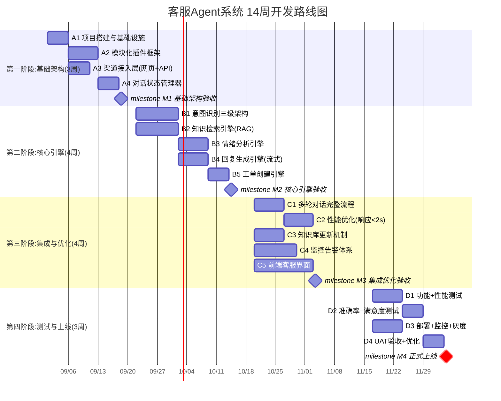

### 9.2 测试方案：功能/性能/准确率/满意度

| 测试类型 | 测试内容 | 用例数 | 通过标准 | 工具 |
|---------|---------|:-----:|---------|------|
| **功能测试** | 五大模块全功能验证 | 200 | 100%通过 | pytest |
| **性能测试** | 响应时间/并发/吞吐 | 8项指标 | 响应<2s,500并发 | Locust |
| **意图准确率** | 意图识别准确率 | 1000题 | >90% | 标注集 |
| **检索质量** | 召回率/MRR | 500题 | Top-5召回>85% | 标注集 |
| **回答准确率** | 端到端答案质量 | 200题 | 准确率>85% | 人工评分 |
| **情绪准确率** | 情绪识别准确率 | 500题 | >85% | 标注集 |
| **满意度测试** | 真实用户体验 | 100用户 | 满意度>4.5/5 | UAT |
| **工单测试** | 自动创建准确率 | 50场景 | 字段准确率>90% | 场景测试 |
| **安全测试** | 越权/注入/异常 | 30项 | 0漏洞 | 渗透测试 |

---

## 十、部署架构与运维

### 10.1 高可用部署拓扑

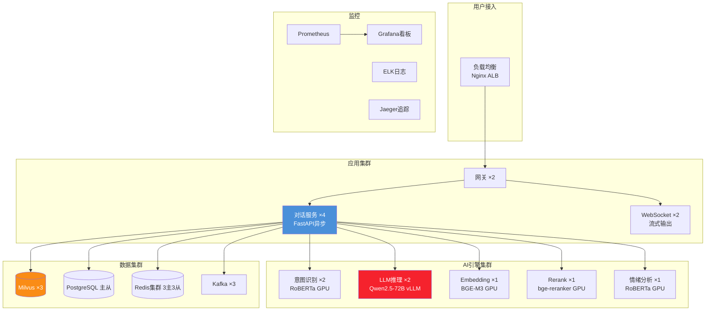

**硬件资源规划**:

| 组件 | 配置 | 数量 | 月成本估算 |
|-----|------|:---:|:--------:|
| GPU 服务器(A100×2) | LLM 推理 | 2台 | ¥4万/台 |
| GPU 服务器(T4×1) | NLU+Embedding+Rerank+情绪 | 2台 | ¥0.8万/台 |
| CPU 服务器(32C 64G) | 应用+网关 | 4台 | ¥0.3万/台 |
| 内存型(128G) | Milvus+Redis | 3台 | ¥0.4万/台 |
| 存储型(2TB SSD) | PG+Kafka | 3台 | ¥0.3万/台 |
| **合计** | — | 14台 | **~¥12万/月** |

### 10.2 持续优化闭环：从监控到迭代

```mermaid
flowchart LR
    subgraph 持续优化飞轮
        M[监控数据<br/>性能/质量/业务] --> A[分析诊断<br/>识别瓶颈与问题]
        A --> I[迭代优化<br/>模型重训/知识更新/策略调整]
        I --> D[灰度发布<br/>A/B验证效果]
        D -->|验证通过| P[全量发布]
        D -->|验证不通过| A
        P --> M
    end
    
    style M fill:#4a90d9,color:#fff
    style I fill:#fa8c16,color:#fff
    style P fill:#50b83c,color:#fff
```

**持续优化节奏**:

| 优化项 | 频率 | 触发条件 | 方法 |
|-------|:----:|---------|------|
| 意图模型重训 | 每日 | 新增标注样本>50条 | 增量训练 + A/B验证 |
| 知识库更新 | 实时/每日 | 坐席编辑/定时拉取 | 实时FAQ + 定时文档 |
| Prompt 优化 | 每周 | 回答准确率下降 | Prompt实验 + A/B |
| 情绪模型优化 | 每月 | 情绪准确率<85% | 标注补充 + 重训 |
| 性能调优 | 持续 | 响应时间>2s | 缓存/并行/扩容 |
| 满意度提升 | 每周 | 满意度<4.5 | 用户反馈分析 + 回复策略调整 |

---

## 十一、总结与最佳实践

### 核心设计原则

```mermaid
mindmap
  root((客服Agent设计原则))
    快速响应
      三级意图识别级联
      并行处理意图+情绪
      FAQ缓存最快路径
      流式输出首Token<1s
    准确优先
      意图>90%三级保障
      RAG检索+Rerank精排
      幻觉检测兜底
      低置信转人工
    情绪关怀
      实时七维情绪分析
      负面升级自动转人工
      共情回复风格
      情绪趋势追踪
    模块化
      插件化架构
      统一接口契约
      热插拔扩展
      行业适配只扩三要素
    持续优化
      监控数据驱动
      每日模型增量训练
      知识衰退检测
      A/B灰度验证
```

### 最佳实践清单

| # | 最佳实践 | 反模式（避免） |
|---|---------|------------|
| 1 | 三级意图识别(L1规则→L2模型→L3 LLM) | 全走LLM(慢且贵) |
| 2 | 意图+情绪并行处理 | 串行处理(延迟翻倍) |
| 3 | FAQ缓存作为最快路径(40%命中) | 所有问题都走RAG(慢) |
| 4 | 流式输出(首Token<1s) | 等完整生成再返回(体验差) |
| 5 | 槽位填充+状态机管理多轮 | 无状态单轮处理(多轮失败) |
| 6 | 情绪>0.8自动转人工 | 忽略情绪(投诉升级) |
| 7 | 工单自动生成+智能分派 | 手动创建工单(效率低) |
| 8 | 插件化架构(热插拔) | 硬编码(难扩展) |
| 9 | 知识衰退检测+自动失效 | 知识只增不删(质量下降) |
| 10 | 监控数据驱动持续优化 | 上线后不迭代(效果衰退) |

> **工程判断**:客服 Agent 系统的核心竞争力不在于单点技术(意图识别/检索/生成),而在于**端到端响应速度(<2s)、意图准确率(>90%)、情绪感知能力、模块化可扩展性**四者的工程化平衡。本文方案通过三级意图级联(90%请求不走LLM)、并行处理(意图+情绪同时)、FAQ缓存(40%秒回)、流式输出(首Token<1s)四大手段保障响应速度;通过三级识别架构+持续训练保障准确率;通过七维情绪分析+自动escalation保障用户体验;通过插件化架构保障可扩展性。所有指标均可量化验证,可直接作为工程团队的落地蓝图。
