# 高效数据分析 Agent 系统完整工程设计方案：多源接入·自动化预处理·算法集成·可视化与自然语言解释

> **文档定位**:本文档是 `9AI Agent 工程实践` 系列的**数据分析 Agent 工程落地指南**,面向 AI 应用工程师、数据工程师和架构师。系统阐述一个**可落地的高效数据分析 Agent 系统**的完整工程设计,覆盖数据收集、清洗、分析、可视化、结果解释五大核心能力,支持数据库、API 接口、文件、流数据等多种数据源,集成描述性统计、推断性统计、预测建模、聚类降维等常用分析算法,提供交互式可视化与自然语言结果解释,实现"对话即分析"的智能数据分析体验。
>
> 本文提供**从架构到代码、从算法选型到接口设计、从安全策略到测试方案**的端到端工程蓝图,所有设计方案均配套技术选型依据、数据模型、接口契约和可执行的代码示例,确保工程团队可直接据此启动开发。
>
> **关联文档**(建议一并阅读):
> - [118 企业知识库 Agent 系统完整工程设计方案](./118企业知识库Agent系统完整工程设计方案_架构数据流模型选型接口安全开发计划与测试.md) — 同系列工程实践首篇,本文延续其架构风格与工程规范
> - [../13项目经验/158 Agent 系统幻觉问题系统性分析与解决方案](../13项目经验/158Agent系统幻觉问题系统性分析与解决方案.md) — 数据分析结果解释的幻觉防护
> - [../14高级 Agent/178 安全可靠的 Agent 沙箱执行环境设计](../14高级%20Agent/178安全可靠的Agent沙箱执行环境设计面试题详解.md) — 代码执行沙箱安全

---

## 目录

- [一、系统概述与设计目标](#一系统概述与设计目标)
  - [1.1 业务背景与核心痛点](#11-业务背景与核心痛点)
  - [1.2 系统设计目标（量化指标）](#12-系统设计目标量化指标)
  - [1.3 系统核心能力全景](#13-系统核心能力全景)
- [二、系统总体架构设计](#二系统总体架构设计)
  - [2.1 六层架构总览](#21-六层架构总览)
  - [2.2 各层职责与技术选型](#22-各层职责与技术选型)
  - [2.3 核心组件交互时序](#23-核心组件交互时序)
- [三、数据源接入与数据收集模块](#三数据源接入与数据收集模块)
  - [3.1 多数据源接入架构](#31-多数据源接入架构)
  - [3.2 数据源连接管理与连接池](#32-数据源连接管理与连接池)
  - [3.3 增量数据采集策略](#33-增量数据采集策略)
- [四、自动化数据预处理流程](#四自动化数据预处理流程)
  - [4.1 预处理五阶段流水线](#41-预处理五阶段流水线)
  - [4.2 数据清洗：缺失值·异常值·重复值](#42-数据清洗缺失值异常值重复值)
  - [4.3 数据转换：类型·标准化·编码](#43-数据转换类型标准化编码)
  - [4.4 特征工程自动化](#44-特征工程自动化)
  - [4.5 数据质量评估](#45-数据质量评估)
- [五、数据分析算法与统计模型集成](#五数据分析算法与统计模型集成)
  - [5.1 算法能力矩阵](#51-算法能力矩阵)
  - [5.2 描述性统计分析](#52-描述性统计分析)
  - [5.3 推断性统计：假设检验与置信区间](#53-推断性统计假设检验与置信区间)
  - [5.4 预测建模：回归·分类·时间序列](#54-预测建模回归分类时间序列)
  - [5.5 聚类与降维](#55-聚类与降维)
  - [5.6 算法自动选择策略](#56-算法自动选择策略)
- [六、数据可视化模块](#六数据可视化模块)
  - [6.1 可视化类型与智能选择](#61-可视化类型与智能选择)
  - [6.2 交互式可视化设计](#62-交互式可视化设计)
  - [6.3 可视化生成引擎](#63-可视化生成引擎)
- [七、自然语言结果解释模块](#七自然语言结果解释模块)
  - [7.1 结果解释三层架构](#71-结果解释三层架构)
  - [7.2 洞察发现自动生成](#72-洞察发现自动生成)
  - [7.3 建议推荐引擎](#73-建议推荐引擎)
  - [7.4 幻觉防护与事实核查](#74-幻觉防护与事实核查)
- [八、模型选型决策](#八模型选型决策)
  - [8.1 LLM 大模型选型](#81-llm-大模型选型)
  - [8.2 数据分析引擎选型](#82-数据分析引擎选型)
  - [8.3 可视化库选型](#83-可视化库选型)
- [九、接口设计](#九接口设计)
  - [9.1 RESTful API 设计](#91-restful-api-设计)
  - [9.2 WebSocket 流式分析接口](#92-websocket-流式分析接口)
  - [9.3 SDK 与集成接口](#93-sdk-与集成接口)
- [十、安全策略](#十安全策略)
  - [10.1 数据安全：加密·脱敏与隔离](#101-数据安全加密脱敏与隔离)
  - [10.2 代码执行安全：沙箱隔离](#102-代码执行安全沙箱隔离)
  - [10.3 访问安全：认证·鉴权与审计](#103-访问安全认证鉴权与审计)
- [十一、可扩展性与性能优化](#十一可扩展性与性能优化)
  - [11.1 水平扩展架构](#111-水平扩展架构)
  - [11.2 数据处理效率优化](#112-数据处理效率优化)
  - [11.3 多级缓存策略](#113-多级缓存策略)
- [十二、用户交互体验设计](#十二用户交互体验设计)
  - [12.1 对话式分析流程](#121-对话式分析流程)
  - [12.2 多轮对话与上下文管理](#122-多轮对话与上下文管理)
  - [12.3 交互式可视化体验](#123-交互式可视化体验)
- [十三、开发计划与里程碑](#十三开发计划与里程碑)
  - [13.1 四阶段 16 周开发路线图](#131-四阶段-16-周开发路线图)
  - [13.2 团队配置与职责分工](#132-团队配置与职责分工)
- [十四、测试方案](#十四测试方案)
  - [14.1 功能测试：七大模块用例矩阵](#141-功能测试七大模块用例矩阵)
  - [14.2 性能测试：大数据量与并发基准](#142-性能测试大数据量与并发基准)
  - [14.3 分析准确性测试](#143-分析准确性测试)
- [十五、总结与最佳实践](#十五总结与最佳实践)

---

## 一、系统概述与设计目标

### 1.1 业务背景与核心痛点

数据分析是企业决策的核心支撑,但传统数据分析流程面临三大痛点:

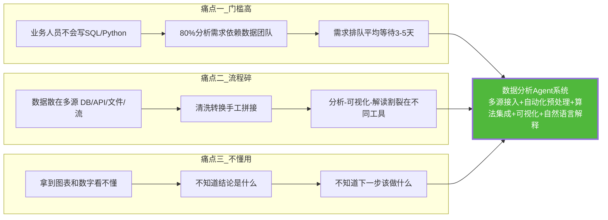

**核心矛盾**:业务人员有分析需求但缺乏技术能力,数据团队有技术能力但需求积压。数据分析 Agent 的价值在于——**让业务人员用自然语言描述分析需求,Agent 自动完成从数据到洞察的全流程**,把分析等待时间从天级降到分钟级。

### 1.2 系统设计目标（量化指标）

| 目标维度 | 量化指标 | 行业基准 | 达标依据 |
|---------|---------|---------|---------|
| **数据源覆盖** | 支持 6 类数据源(DB/API/文件/流/对象存储/数据仓库) | 多数 BI 工具 3-4 类 | 统一数据源抽象层 |
| **预处理自动化** | 80% 清洗转换自动完成,人工干预 ≤20% | 传统手工 100% | 智能预处理流水线 |
| **分析准确率** | 统计分析结果准确率 ≥ 95% | — | 算法正确选择 + 结果校验 |
| **可视化生成** | 自然语言→图表 ≤ 5 秒,图表类型正确率 ≥ 90% | — | 智能图表选择引擎 |
| **结果解释** | 解释准确率 ≥ 90%,幻觉率 ≤ 5% | — | 事实核查 + 幻觉防护 |
| **响应延迟** | 简单分析 < 10s,复杂建模 < 60s | 传统手工数小时 | 并行计算 + 增量处理 |
| **数据处理量** | 单次分析支持 10GB / 1 亿行 | — | 分块处理 + 列式存储 |
| **并发能力** | 50 并发分析任务 | — | 异步队列 + 弹性伸缩 |
| **可扩展性** | 新算法/数据源接入 ≤ 2 人天 | — | 插件化架构 |

### 1.3 系统核心能力全景

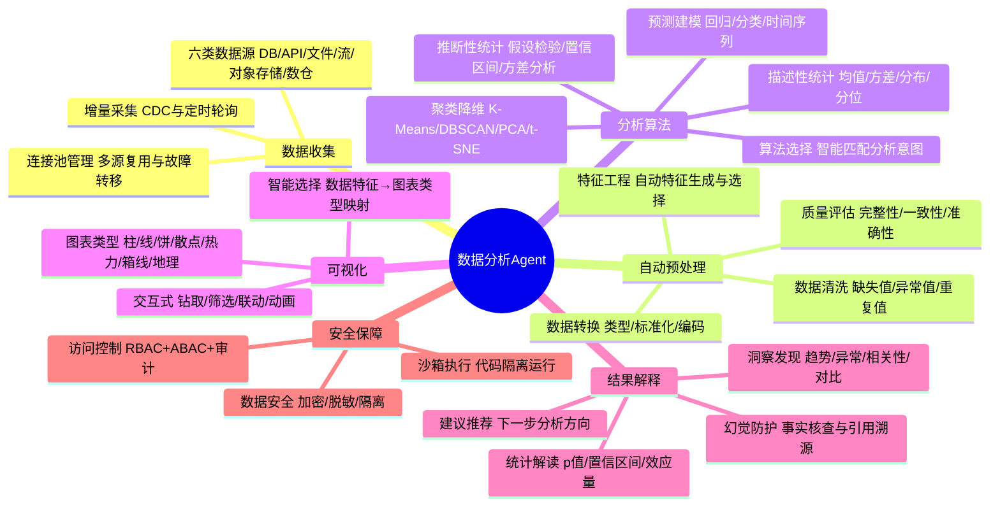

---

## 二、系统总体架构设计

### 2.1 六层架构总览

```mermaid
flowchart TB
    subgraph L6["接入层 Interaction Layer"]
        L6A[Web UI 对话式界面]
        L6B[RESTful API]
        L6C[WebSocket 流式]
        L6D[SDK / IDE 插件]
    end

    subgraph L5["智能编排层 Orchestration Layer"]
        L5A[意图理解 Intent Parser]
        L5B[分析计划 Planner]
        L5C[任务编排 DAG Executor]
        L5D[结果整合 Aggregator]
    end

    subgraph L4["分析能力层 Analysis Layer"]
        L4A[统计分析引擎]
        L4B[机器学习引擎]
        L4C[可视化引擎]
        L4D[自然语言解释引擎]
    end

    subgraph L3["数据处理层 Processing Layer"]
        L3A[数据清洗 Cleaning]
        L3B[数据转换 Transform]
        L3C[特征工程 Feature]
        L3D[质量评估 Quality]
    end

    subgraph L2["数据接入层 Ingestion Layer"]
        L2A[数据源连接器 Connector]
        L2B[连接池管理 Pool]
        L2C[增量采集 CDC]
        L2D[数据缓存 Cache]
    end

    subgraph L1["基础设施层 Infrastructure"]
        L1A[计算引擎 Spark/DuckDB]
        L1B[存储 PostgreSQL/Redis/MinIO]
        L1C[消息队列 Kafka]
        L1D[沙箱 Docker/gVisor]
        L1E[监控 Prometheus/Grafana]
    end

    L6 --> L5 --> L4 --> L3 --> L2 --> L1

    style L6 fill:#e3f2fd,stroke:#1565c0
    style L5 fill:#f3e5f5,stroke:#7b1fa2
    style L4 fill:#fce4ec,stroke:#c2185b
    style L3 fill:#fff3e0,stroke:#ef6c00
    style L2 fill:#e8f5e9,stroke:#2e7d32
    style L1 fill:#f5f5f5,stroke:#616161
```

### 2.2 各层职责与技术选型

| 架构层 | 核心职责 | 技术选型 | 选型依据 |
|:------|:--------|:--------|:--------|
| **L6 接入层** | 用户交互入口,对话式分析 + API 集成 | Vue3 + FastAPI + WebSocket | Vue3 响应式可视化;FastAPI 异步高性能 |
| **L5 智能编排层** | 意图理解→分析计划→任务编排→结果整合 | LangGraph + LLM(GPT-4o/Qwen2) | LangGraph 适合多步骤 DAG 编排;LLM 理解自然语言意图 |
| **L4 分析能力层** | 统计/ML/可视化/NL 解释四大引擎 | pandas/scikit-learn/Plotly + LLM | pandas 数据处理标准;scikit-learn 算法全;Plotly 交互式 |
| **L3 数据处理层** | 清洗/转换/特征工程/质量评估 | pandas + Great Expectations | GE 是数据质量验证行业标准 |
| **L2 数据接入层** | 多源连接/连接池/增量采集/缓存 | SQLAlchemy + Kafka + Debezium | SQLAlchemy 统一 DB 接口;Debezium CDC 标准 |
| **L1 基础设施层** | 计算/存储/消息/沙箱/监控 | DuckDB/Spark + PostgreSQL/Redis/MinIO + Docker | DuckDB 嵌入式 OLAP 轻量;Spark 大规模;Docker 沙箱隔离 |

### 2.3 核心组件交互时序

以"分析上月销售数据,找出top10产品和下降原因"为例:

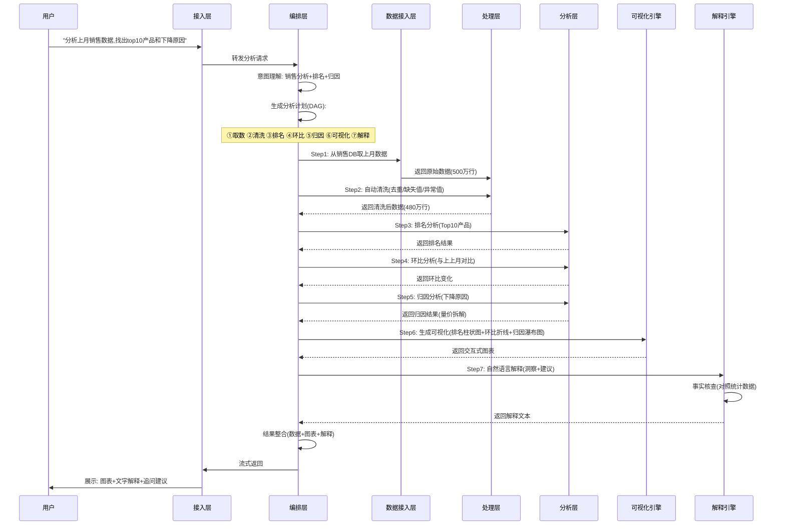

---

## 三、数据源接入与数据收集模块

### 3.1 多数据源接入架构

数据分析 Agent 必须支持多种数据源,通过统一的**数据源抽象层**屏蔽底层差异:

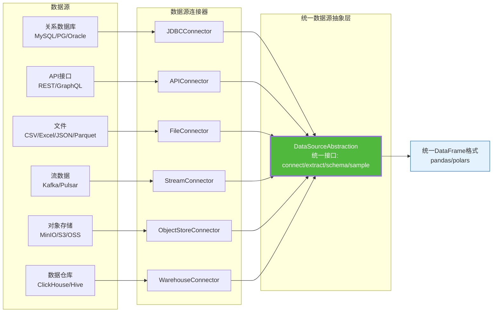

#### 统一数据源抽象接口

```python
from abc import ABC, abstractmethod
from typing import Any, Optional
import pandas as pd
from dataclasses import dataclass


@dataclass
class DataSourceConfig:
    """数据源统一配置"""
    source_type: str          # jdbc / api / file / stream / object_store / warehouse
    connection: dict          # 连接参数
    auth: dict                # 认证信息
    options: dict             # 额外选项(编码/分隔符/超时等)


class DataSourceConnector(ABC):
    """数据源连接器抽象基类——所有数据源实现统一接口"""

    @abstractmethod
    def connect(self, config: DataSourceConfig) -> bool:
        """建立连接,返回是否成功"""
        pass

    @abstractmethod
    def extract(self, query: str = None, **kwargs) -> pd.DataFrame:
        """提取数据,返回统一 DataFrame"""
        pass

    @abstractmethod
    def get_schema(self) -> dict:
        """获取数据模式(字段名/类型/约束)"""
        pass

    @abstractmethod
    def sample(self, n: int = 100) -> pd.DataFrame:
        """采样数据(用于快速预览和类型推断)"""
        pass

    @abstractmethod
    def close(self):
        """关闭连接,释放资源"""
        pass


class JDBCConnector(DataSourceConnector):
    """关系数据库连接器——支持 MySQL/PostgreSQL/Oracle 等"""

    def __init__(self):
        self.engine = None
        self.pool = None

    def connect(self, config: DataSourceConfig) -> bool:
        from sqlalchemy import create_engine
        conn = config.connection
        url = f"mysql+pymysql://{conn['user']}:{conn['password']}@{conn['host']}:{conn['port']}/{conn['database']}"
        # 连接池配置:大小/超时/回收
        self.engine = create_engine(
            url,
            pool_size=conn.get('pool_size', 10),
            max_overflow=conn.get('max_overflow', 20),
            pool_timeout=conn.get('pool_timeout', 30),
            pool_recycle=conn.get('pool_recycle', 3600),
            pool_pre_ping=True  # 连接前检查活性,避免使用失效连接
        )
        return self.engine is not None

    def extract(self, query: str = None, table: str = None, **kwargs) -> pd.DataFrame:
        if query:
            return pd.read_sql(query, self.engine, **kwargs)
        elif table:
            # 分块读取大表,避免 OOM
            chunksize = kwargs.get('chunksize', 100000)
            chunks = pd.read_sql_table(table, self.engine, chunksize=chunksize)
            return pd.concat(chunks, ignore_index=True)
        else:
            raise ValueError("必须提供 query 或 table 参数")

    def get_schema(self) -> dict:
        from sqlalchemy import inspect
        inspector = inspect(self.engine)
        schema = {}
        for table_name in inspector.get_table_names():
            columns = inspector.get_columns(table_name)
            schema[table_name] = {
                col['name']: str(col['type']) for col in columns
            }
        return schema

    def sample(self, n: int = 100) -> pd.DataFrame:
        return pd.read_sql(f"SELECT * FROM {self._table} ORDER BY RAND() LIMIT {n}", self.engine)

    def close(self):
        if self.engine:
            self.engine.dispose()


class APIConnector(DataSourceConnector):
    """API 接口连接器——支持 REST/GraphQL"""

    def connect(self, config: DataSourceConfig) -> bool:
        self.base_url = config.connection['base_url']
        self.headers = config.auth.get('headers', {})
        self.timeout = config.options.get('timeout', 30)
        return True

    def extract(self, query: str = None, endpoint: str = None, **kwargs) -> pd.DataFrame:
        import requests
        url = f"{self.base_url}/{endpoint}" if endpoint else self.base_url

        # 自动分页处理
        all_data = []
        page = 1
        while True:
            params = {**kwargs, 'page': page, 'page_size': 1000}
            resp = requests.get(url, headers=self.headers, params=params, timeout=self.timeout)
            resp.raise_for_status()
            data = resp.json()

            items = data.get('items', data.get('data', []))
            if not items:
                break
            all_data.extend(items)

            if len(items) < 1000:  # 最后一页
                break
            page += 1

        return pd.DataFrame(all_data)

    def get_schema(self) -> dict:
        sample_df = self.sample(n=1)
        return {col: str(dtype) for col, dtype in sample_df.dtypes.items()}

    def sample(self, n: int = 100) -> pd.DataFrame:
        import requests
        params = {'page': 1, 'page_size': n}
        resp = requests.get(self.base_url, headers=self.headers, params=params, timeout=self.timeout)
        return pd.DataFrame(resp.json().get('items', []))

    def close(self):
        pass  # HTTP 无状态,无需关闭


class FileConnector(DataSourceConnector):
    """文件连接器——支持 CSV/Excel/JSON/Parquet"""

    SUPPORTED_FORMATS = {
        '.csv': 'read_csv',
        '.xlsx': 'read_excel',
        '.xls': 'read_excel',
        '.json': 'read_json',
        '.parquet': 'read_parquet',
        '.feather': 'read_feather',
    }

    def connect(self, config: DataSourceConfig) -> bool:
        self.file_path = config.connection['file_path']
        self.format = config.connection.get('format')
        self.options = config.options
        return True

    def extract(self, query: str = None, **kwargs) -> pd.DataFrame:
        import os
        ext = os.path.splitext(self.file_path)[1].lower()
        method = self.SUPPORTED_FORMATS.get(ext)
        if not method:
            raise ValueError(f"不支持的文件格式: {ext}")

        reader = getattr(pd, method)
        # 大文件分块读取
        if ext == '.csv' and self.options.get('chunked'):
            chunks = reader(self.file_path, chunksize=100000, **self.options, **kwargs)
            return pd.concat(chunks, ignore_index=True)
        else:
            return reader(self.file_path, **self.options, **kwargs)

    def get_schema(self) -> dict:
        df = self.sample(n=1)
        return {col: str(dtype) for col, dtype in df.dtypes.items()}

    def sample(self, n: int = 100) -> pd.DataFrame:
        import os
        ext = os.path.splitext(self.file_path)[1].lower()
        if ext == '.csv':
            return pd.read_csv(self.file_path, nrows=n)
        elif ext == '.parquet':
            return pd.read_parquet(self.file_path).head(n)
        else:
            return self.extract().head(n)

    def close(self):
        pass
```

### 3.2 数据源连接管理与连接池

多数据源并发访问需要统一的连接池管理:

```python
from concurrent.futures import ThreadPoolExecutor
from threading import Lock
import time


class ConnectionPoolManager:
    """数据源连接池管理器——统一管理多源连接的创建/复用/回收/故障转移"""

    def __init__(self, max_connections_per_source: int = 10):
        self.pools = {}  # source_id -> {connector, last_used, in_use}
        self.lock = Lock()
        self.max_connections = max_connections_per_source

    def get_connector(self, source_id: str, config: DataSourceConfig) -> DataSourceConnector:
        """获取连接器(优先复用,不存在则创建)"""
        with self.lock:
            if source_id in self.pools:
                entry = self.pools[source_id]
                entry['last_used'] = time.time()
                return entry['connector']

            # 创建新连接器
            connector = self._create_connector(config)
            if not connector.connect(config):
                # 主连接失败,尝试故障转移
                connector = self._failover(config)
            self.pools[source_id] = {
                'connector': connector,
                'last_used': time.time(),
                'in_use': 0
            }
            return connector

    def _create_connector(self, config: DataSourceConfig) -> DataSourceConnector:
        """根据类型创建连接器"""
        CONNECTORS = {
            'jdbc': JDBCConnector,
            'api': APIConnector,
            'file': FileConnector,
            'stream': StreamConnector,
            'object_store': ObjectStoreConnector,
            'warehouse': WarehouseConnector,
        }
        connector_cls = CONNECTORS.get(config.source_type)
        if not connector_cls:
            raise ValueError(f"不支持的数据源类型: {config.source_type}")
        return connector_cls()

    def _failover(self, config: DataSourceConfig) -> DataSourceConnector:
        """故障转移——切换到备用数据源"""
        replicas = config.connection.get('replicas', [])
        for replica in replicas:
            failover_config = DataSourceConfig(
                source_type=config.source_type,
                connection={**config.connection, **replica},
                auth=config.auth,
                options=config.options
            )
            connector = self._create_connector(failover_config)
            if connector.connect(failover_config):
                return connector
        raise ConnectionError(f"所有数据源均不可用: {config.connection.get('host')}")

    def cleanup_idle(self, max_idle_seconds: int = 1800):
        """清理空闲连接(默认 30 分钟未使用则回收)"""
        now = time.time()
        with self.lock:
            to_remove = [
                sid for sid, entry in self.pools.items()
                if now - entry['last_used'] > max_idle_seconds and entry['in_use'] == 0
            ]
            for sid in to_remove:
                self.pools[sid]['connector'].close()
                del self.pools[sid]
```

### 3.3 增量数据采集策略

对于持续更新的数据源(如业务数据库),支持增量采集避免全量拉取:

```python
class IncrementalCollector:
    """增量数据采集——支持 CDC 和时间戳轮询两种模式"""

    def __init__(self, connector: DataSourceConnector, mode: str = "timestamp"):
        self.connector = connector
        self.mode = mode  # timestamp / cdc
        self.last_sync_point = None  # 上次同步位点

    def collect_incremental(self, table: str, timestamp_col: str = "updated_at") -> pd.DataFrame:
        """增量采集——只拉取上次同步后的新数据"""
        if self.mode == "timestamp":
            return self._collect_by_timestamp(table, timestamp_col)
        elif self.mode == "cdc":
            return self._collect_by_cdc(table)
        else:
            raise ValueError(f"不支持的增量模式: {self.mode}")

    def _collect_by_timestamp(self, table: str, timestamp_col: str) -> pd.DataFrame:
        """基于时间戳的增量采集"""
        if self.last_sync_point is None:
            # 首次同步——全量拉取
            query = f"SELECT * FROM {table}"
            df = self.connector.extract(query=query)
        else:
            # 增量拉取——只取上次同步后的数据
            query = f"SELECT * FROM {table} WHERE {timestamp_col} > '{self.last_sync_point}'"
            df = self.connector.extract(query=query)

        if not df.empty:
            self.last_sync_point = df[timestamp_col].max()
        return df

    def _collect_by_cdc(self, table: str) -> pd.DataFrame:
        """基于 CDC(Change Data Capture)的增量采集"""
        # 对接 Debezium/Kafka CDC 流
        from kafka import KafkaConsumer
        import json

        consumer = KafkaConsumer(
            f"cdc.{table}",
            bootstrap_servers=self.connector.config.connection['kafka_servers'],
            group_id='data-analysis-agent',
            auto_offset_reset='latest',
            enable_auto_commit=False
        )

        changes = []
        for message in consumer:
            event = json.loads(message.value)
            if event['op'] in ('c', 'u', 'd'):  # create/update/delete
                changes.append(event['after'] if event['op'] != 'd' else event['before'])
            consumer.commit()
            if len(changes) >= 10000:  # 批量处理
                break

        return pd.DataFrame(changes)
```

---

## 四、自动化数据预处理流程

### 4.1 预处理五阶段流水线

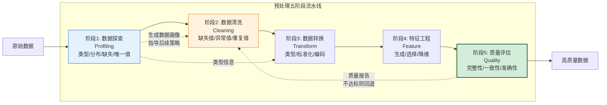

#### 流水线编排器

```python
class PreprocessingPipeline:
    """自动化预处理流水线编排器"""

    def __init__(self):
        self.profiler = DataProfiler()
        self.cleaner = DataCleaner()
        self.transformer = DataTransformer()
        self.feature_engineer = FeatureEngineer()
        self.quality_assessor = QualityAssessor()

    def run(self, df: pd.DataFrame, analysis_goal: str = None) -> dict:
        """执行完整预处理流水线"""
        report = {"steps": [], "quality": None}

        # 阶段1: 数据探查
        profile = self.profiler.profile(df)
        report["steps"].append({"step": "profiling", "result": profile})

        # 阶段2: 数据清洗(基于探查结果自动选择策略)
        df, cleaning_log = self.cleaner.clean(df, profile)
        report["steps"].append({"step": "cleaning", "result": cleaning_log})

        # 阶段3: 数据转换(基于类型和分析目标)
        df, transform_log = self.transformer.transform(df, profile, analysis_goal)
        report["steps"].append({"step": "transform", "result": transform_log})

        # 阶段4: 特征工程(基于分析目标)
        df, feature_log = self.feature_engineer.engineer(df, analysis_goal)
        report["steps"].append({"step": "feature", "result": feature_log})

        # 阶段5: 质量评估
        quality = self.quality_assessor.assess(df, profile)
        report["quality"] = quality
        report["steps"].append({"step": "quality", "result": quality})

        # 质量不达标则回退重新清洗
        if quality["overall_score"] < 0.7:
            df, report = self._retry_with_stricter_cleaning(df, profile, report)

        return {"data": df, "report": report}

    def _retry_with_stricter_cleaning(self, df, profile, report):
        """质量不达标时,用更严格的清洗策略重试"""
        self.cleaner.set_strict_mode(True)
        df, cleaning_log = self.cleaner.clean(df, profile)
        report["steps"][1]["result"] = cleaning_log
        report["steps"][1]["retry"] = True
        return df, report
```

### 4.2 数据清洗：缺失值·异常值·重复值

#### 数据探查器

```python
class DataProfiler:
    """数据探查器——自动识别数据类型/分布/缺失/异常"""

    def profile(self, df: pd.DataFrame) -> dict:
        profile = {
            "shape": df.shape,
            "columns": {},
            "overall": {
                "missing_ratio": df.isnull().sum().sum() / df.size,
                "duplicate_ratio": df.duplicated().sum() / len(df),
            }
        }

        for col in df.columns:
            col_info = {
                "dtype": str(df[col].dtype),
                "missing_count": int(df[col].isnull().sum()),
                "missing_ratio": float(df[col].isnull().sum() / len(df)),
                "unique_count": int(df[col].nunique()),
                "unique_ratio": float(df[col].nunique() / len(df)),
            }

            # 类型推断:数值型/类别型/日期型/文本型
            col_info["semantic_type"] = self._infer_semantic_type(df[col])

            # 数值型:统计分布
            if col_info["semantic_type"] == "numeric":
                col_info.update({
                    "mean": float(df[col].mean()),
                    "std": float(df[col].std()),
                    "min": float(df[col].min()),
                    "max": float(df[col].max()),
                    "median": float(df[col].median()),
                    "skewness": float(df[col].skew()),
                    "kurtosis": float(df[col].kurtosis()),
                    "outlier_count_iqr": self._count_outliers_iqr(df[col]),
                })
            # 类别型:取值分布
            elif col_info["semantic_type"] == "categorical":
                value_counts = df[col].value_counts().head(20)
                col_info["top_values"] = value_counts.to_dict()
                col_info["cardinality"] = int(df[col].nunique())

            profile["columns"][col] = col_info

        return profile

    def _infer_semantic_type(self, series: pd.Series) -> str:
        """推断语义类型:numeric/categorical/datetime/text/boolean"""
        dtype = str(series.dtype)

        if dtype.startswith('int') or dtype.startswith('float'):
            # 唯一值少且为整数 → 可能是类别编码
            if series.nunique() < 20 and dtype.startswith('int'):
                return "categorical"
            return "numeric"

        if dtype == 'bool' or (series.nunique() == 2):
            return "boolean"

        # 尝试解析日期
        if dtype == 'object':
            try:
                pd.to_datetime(series.head(100))
                return "datetime"
            except (ValueError, TypeError):
                pass

            # 文本 vs 类别:按唯一值比例判断
            if series.nunique() / len(series) > 0.5:
                return "text"
            else:
                return "categorical"

        return "unknown"

    def _count_outliers_iqr(self, series: pd.Series) -> int:
        """IQR 法统计异常值数量"""
        Q1, Q3 = series.quantile(0.25), series.quantile(0.75)
        IQR = Q3 - Q1
        lower, upper = Q1 - 1.5 * IQR, Q3 + 1.5 * IQR
        return int(((series < lower) | (series > upper)).sum())
```

#### 数据清洗器

```python
import numpy as np
from scipy import stats


class DataCleaner:
    """数据清洗器——缺失值/异常值/重复值自动处理"""

    def __init__(self):
        self.strict_mode = False

    def set_strict_mode(self, enabled: bool):
        self.strict_mode = enabled

    def clean(self, df: pd.DataFrame, profile: dict) -> tuple:
        log = {"actions": [], "rows_before": len(df), "rows_after": len(df)}

        # 1. 缺失值处理
        df, missing_log = self._handle_missing(df, profile)
        log["actions"].append({"type": "missing_value", "detail": missing_log})

        # 2. 异常值处理
        df, outlier_log = self._handle_outliers(df, profile)
        log["actions"].append({"type": "outlier", "detail": outlier_log})

        # 3. 重复值处理
        df, dup_log = self._handle_duplicates(df)
        log["actions"].append({"type": "duplicate", "detail": dup_log})

        # 4. 格式统一(字符串去空格/日期标准化)
        df, format_log = self._normalize_format(df, profile)
        log["actions"].append({"type": "format", "detail": format_log})

        log["rows_after"] = len(df)
        return df, log

    def _handle_missing(self, df: pd.DataFrame, profile: dict) -> tuple:
        log = {"handled_columns": []}

        for col, info in profile["columns"].items():
            missing_ratio = info["missing_ratio"]
            if missing_ratio == 0:
                continue

            action = {}
            # 缺失率 > 50%:删除列(信息量不足)
            if missing_ratio > 0.5:
                df = df.drop(columns=[col])
                action = {"column": col, "strategy": "drop_column", "reason": f"缺失率{missing_ratio:.0%}>50%"}
            # 缺失率 5%-50%:根据类型填充
            elif missing_ratio > 0.05:
                if info["semantic_type"] == "numeric":
                    # 偏态分布用中位数,正态分布用均值
                    if abs(info.get("skewness", 0)) > 1:
                        fill_value = info["median"]
                        strategy = "median"
                    else:
                        fill_value = info["mean"]
                        strategy = "mean"
                    df[col] = df[col].fillna(fill_value)
                    action = {"column": col, "strategy": strategy, "fill_value": fill_value}
                elif info["semantic_type"] == "categorical":
                    # 类别型用众数填充
                    fill_value = df[col].mode().iloc[0]
                    df[col] = df[col].fillna(fill_value)
                    action = {"column": col, "strategy": "mode", "fill_value": fill_value}
                else:
                    # 其他类型用"未知"填充
                    df[col] = df[col].fillna("未知")
                    action = {"column": col, "strategy": "constant", "fill_value": "未知"}
            # 缺失率 < 5%:删除行(影响小)
            else:
                df = df.dropna(subset=[col])
                action = {"column": col, "strategy": "drop_row"}

            log["handled_columns"].append(action)

        return df, log

    def _handle_outliers(self, df: pd.DataFrame, profile: dict) -> tuple:
        log = {"handled_columns": []}
        threshold = 3.0 if not self.strict_mode else 2.5  # 严格模式收紧阈值

        for col, info in profile["columns"].items():
            if info["semantic_type"] != "numeric":
                continue

            # Z-score 法检测异常值
            z_scores = np.abs(stats.zscore(df[col].dropna()))
            outlier_mask = z_scores > threshold
            outlier_count = outlier_mask.sum()

            if outlier_count > 0:
                # 盖帽法(Capping):将异常值截断到阈值边界,而非删除
                lower_cap = df[col].quantile(0.01)
                upper_cap = df[col].quantile(0.99)
                df[col] = df[col].clip(lower_cap, upper_cap)

                log["handled_columns"].append({
                    "column": col,
                    "outlier_count": int(outlier_count),
                    "strategy": "capping",
                    "lower_cap": float(lower_cap),
                    "upper_cap": float(upper_cap)
                })

        return df, log

    def _handle_duplicates(self, df: pd.DataFrame) -> tuple:
        dup_count = df.duplicated().sum()
        if dup_count > 0:
            df = df.drop_duplicates()
        return df, {"duplicate_count": int(dup_count), "strategy": "drop"}

    def _normalize_format(self, df: pd.DataFrame, profile: dict) -> tuple:
        log = {"normalized_columns": []}

        for col, info in profile["columns"].items():
            if col not in df.columns:
                continue

            if info["semantic_type"] == "datetime" and df[col].dtype == 'object':
                df[col] = pd.to_datetime(df[col], errors='coerce')
                log["normalized_columns"].append({"column": col, "action": "to_datetime"})

            if df[col].dtype == 'object':
                df[col] = df[col].astype(str).str.strip()
                log["normalized_columns"].append({"column": col, "action": "strip_whitespace"})

        return df, log
```

### 4.3 数据转换：类型·标准化·编码

```python
class DataTransformer:
    """数据转换器——类型转换/标准化/编码"""

    def transform(self, df: pd.DataFrame, profile: dict, analysis_goal: str = None) -> tuple:
        log = {"actions": []}

        # 1. 类型转换
        df, type_log = self._convert_types(df, profile)
        log["actions"].append({"type": "type_conversion", "detail": type_log})

        # 2. 标准化/归一化(数值型,基于分析目标决定是否需要)
        if analysis_goal in ("clustering", "pca", "regression", "classification"):
            df, scale_log = self._scale_numeric(df, profile, analysis_goal)
            log["actions"].append({"type": "scaling", "detail": scale_log})

        # 3. 类别编码
        df, encode_log = self._encode_categorical(df, profile, analysis_goal)
        log["actions"].append({"type": "encoding", "detail": encode_log})

        return df, log

    def _convert_types(self, df: pd.DataFrame, profile: dict) -> tuple:
        log = {"converted": []}
        for col, info in profile["columns"].items():
            if col not in df.columns:
                continue

            semantic = info["semantic_type"]
            if semantic == "datetime" and not pd.api.types.is_datetime64_any_dtype(df[col]):
                df[col] = pd.to_datetime(df[col], errors='coerce')
                log["converted"].append({"column": col, "to": "datetime64"})

            elif semantic == "numeric" and df[col].dtype == 'object':
                df[col] = pd.to_numeric(df[col], errors='coerce')
                log["converted"].append({"column": col, "to": "numeric"})

            elif semantic == "boolean":
                df[col] = df[col].astype('bool')
                log["converted"].append({"column": col, "to": "bool"})

            elif semantic == "categorical":
                df[col] = df[col].astype('category')
                log["converted"].append({"column": col, "to": "category"})

        return df, log

    def _scale_numeric(self, df: pd.DataFrame, profile: dict, goal: str) -> tuple:
        from sklearn.preprocessing import StandardScaler, MinMaxScaler, RobustScaler

        log = {"scaled": []}
        numeric_cols = [c for c, i in profile["columns"].items()
                        if i["semantic_type"] == "numeric" and c in df.columns]

        if not numeric_cols:
            return df, log

        # 根据分析目标选择缩放策略
        if goal in ("clustering", "pca"):
            # 聚类/PCA:用 StandardScaler(均值0方差1)
            scaler = StandardScaler()
            strategy = "standard"
        elif goal == "regression":
            # 回归:有异常值用 RobustScaler,无异常值用 StandardScaler
            has_outliers = any(i.get("outlier_count_iqr", 0) > 0
                               for i in profile["columns"].values())
            scaler = RobustScaler() if has_outliers else StandardScaler()
            strategy = "robust" if has_outliers else "standard"
        else:
            scaler = MinMaxScaler()  # 归一化到 [0,1]
            strategy = "minmax"

        df[numeric_cols] = scaler.fit_transform(df[numeric_cols])
        log["scaled"] = [{"columns": numeric_cols, "strategy": strategy}]

        return df, log

    def _encode_categorical(self, df: pd.DataFrame, profile: dict, goal: str) -> tuple:
        log = {"encoded": []}
        cat_cols = [c for c, i in profile["columns"].items()
                    if i["semantic_type"] == "categorical" and c in df.columns]

        for col in cat_cols:
            cardinality = profile["columns"][col].get("cardinality",
                                                       df[col].nunique())

            if cardinality <= 2:
                # 二分类:标签编码
                df[col] = pd.get_dummies(df[col], prefix=col, drop_first=True)
                log["encoded"].append({"column": col, "strategy": "label_encoding"})
            elif cardinality <= 10:
                # 低基数:One-Hot 编码
                dummies = pd.get_dummies(df[col], prefix=col)
                df = pd.concat([df.drop(col, axis=1), dummies], axis=1)
                log["encoded"].append({"column": col, "strategy": "one_hot",
                                       "new_columns": list(dummies.columns)})
            else:
                # 高基数:目标编码(回归/分类)或频率编码(聚类)
                if goal in ("regression", "classification"):
                    # 目标编码需要目标变量,简化为频率编码
                    freq = df[col].value_counts(normalize=True)
                    df[col] = df[col].map(freq)
                    log["encoded"].append({"column": col, "strategy": "frequency_encoding"})
                else:
                    freq = df[col].value_counts(normalize=True)
                    df[col] = df[col].map(freq)
                    log["encoded"].append({"column": col, "strategy": "frequency_encoding"})

        return df, log
```

### 4.4 特征工程自动化

```python
class FeatureEngineer:
    """特征工程自动化——自动生成时间/交叉/聚合特征"""

    def engineer(self, df: pd.DataFrame, analysis_goal: str = None) -> tuple:
        log = {"generated": []}

        # 1. 时间特征自动生成
        df, time_log = self._generate_time_features(df)
        if time_log:
            log["generated"].append({"type": "time", "detail": time_log})

        # 2. 交叉特征自动生成(数值型两两组合)
        df, cross_log = self._generate_cross_features(df)
        if cross_log:
            log["generated"].append({"type": "cross", "detail": cross_log})

        # 3. 聚合特征自动生成(按类别列聚合数值列)
        df, agg_log = self._generate_aggregate_features(df)
        if agg_log:
            log["generated"].append({"type": "aggregate", "detail": agg_log})

        # 4. 特征选择——剔除冗余特征
        df, select_log = self._select_features(df, analysis_goal)
        log["generated"].append({"type": "selection", "detail": select_log})

        return df, log

    def _generate_time_features(self, df: pd.DataFrame) -> tuple:
        log = []
        datetime_cols = df.select_dtypes(include=['datetime64']).columns

        for col in datetime_cols:
            # 提取年/月/日/时/星期/季度/是否周末/是否节假日
            df[f'{col}_year'] = df[col].dt.year
            df[f'{col}_month'] = df[col].dt.month
            df[f'{col}_day'] = df[col].dt.day
            df[f'{col}_dayofweek'] = df[col].dt.dayofweek
            df[f'{col}_quarter'] = df[col].dt.quarter
            df[f'{col}_is_weekend'] = df[col].dt.dayofweek >= 5

            log.append({
                "source": col,
                "features": ["year", "month", "day", "dayofweek", "quarter", "is_weekend"]
            })

        return df, log

    def _generate_cross_features(self, df: pd.DataFrame) -> tuple:
        log = []
        numeric_cols = df.select_dtypes(include=[np.number]).columns.tolist()
        numeric_cols = [c for c in numeric_cols if not c.startswith('_')]

        # 限制交叉特征数量(避免维度爆炸,最多 Top 5 重要特征的两两组合)
        if len(numeric_cols) > 5:
            # 按方差排序取 Top 5
            variances = df[numeric_cols].var().sort_values(ascending=False)
            numeric_cols = variances.head(5).index.tolist()

        for i, col1 in enumerate(numeric_cols):
            for col2 in numeric_cols[i+1:]:
                # 加法/乘法/除法特征
                df[f'{col1}_x_{col2}'] = df[col1] * df[col2]
                if df[col2].abs().min() > 1e-10:  # 避免除以0
                    df[f'{col1}_div_{col2}'] = df[col1] / df[col2]
                log.append({"features": [f"{col1}_x_{col2}", f"{col1}_div_{col2}"]})

        return df, log

    def _generate_aggregate_features(self, df: pd.DataFrame) -> tuple:
        log = []
        cat_cols = df.select_dtypes(include=['category', 'object']).columns.tolist()
        numeric_cols = df.select_dtypes(include=[np.number]).columns.tolist()

        for cat_col in cat_cols[:3]:  # 限制类别列数量
            for num_col in numeric_cols[:3]:  # 限制数值列数量
                # 按类别列分组,计算数值列的均值/求和/计数
                agg = df.groupby(cat_col)[num_col].agg(['mean', 'sum', 'count'])
                agg.columns = [f'{num_col}_{stat}_by_{cat_col}' for stat in agg.columns]
                df = df.merge(agg, on=cat_col, how='left')
                log.append({"group_by": cat_col, "target": num_col,
                            "stats": ["mean", "sum", "count"]})

        return df, log

    def _select_features(self, df: pd.DataFrame, goal: str) -> tuple:
        from sklearn.feature_selection import VarianceThreshold

        log = {"before": df.shape[1], "after": df.shape[1], "removed": []}

        # 方差过滤:移除方差极低的特征(几乎不变的列)
        numeric_df = df.select_dtypes(include=[np.number])
        selector = VarianceThreshold(threshold=0.01)
        selector.fit(numeric_df)

        removed = numeric_df.columns[~selector.get_support()].tolist()
        if removed:
            df = df.drop(columns=removed)
            log["removed"] = removed
            log["after"] = df.shape[1]

        return df, log
```

### 4.5 数据质量评估

```python
class QualityAssessor:
    """数据质量评估器——完整性/一致性/准确性/时效性"""

    def assess(self, df: pd.DataFrame, profile: dict) -> dict:
        quality = {
            "completeness": self._assess_completeness(df),
            "consistency": self._assess_consistency(df, profile),
            "accuracy": self._assess_accuracy(df, profile),
            "timeliness": self._assess_timeliness(df, profile),
        }

        # 综合质量分(加权平均)
        weights = {"completeness": 0.3, "consistency": 0.25,
                   "accuracy": 0.25, "timeliness": 0.2}
        quality["overall_score"] = sum(
            quality[dim] * weights[dim] for dim in weights
        )

        quality["grade"] = self._score_to_grade(quality["overall_score"])
        quality["passed"] = quality["overall_score"] >= 0.7

        return quality

    def _assess_completeness(self, df: pd.DataFrame) -> float:
        """完整性:非缺失值占比"""
        return 1.0 - (df.isnull().sum().sum() / df.size)

    def _assess_consistency(self, df: pd.DataFrame, profile: dict) -> float:
        """一致性:数据格式/类型一致性"""
        consistent = 0
        total = 0
        for col in df.columns:
            if col in profile["columns"]:
                total += 1
                expected_type = profile["columns"][col]["semantic_type"]
                actual_type = self._infer_type(df[col])
                if expected_type == actual_type:
                    consistent += 1
        return consistent / total if total > 0 else 1.0

    def _assess_accuracy(self, df: pd.DataFrame, profile: dict) -> float:
        """准确性:异常值占比(异常值越少越准确)"""
        numeric_cols = df.select_dtypes(include=[np.number]).columns
        if len(numeric_cols) == 0:
            return 1.0

        total_outliers = 0
        total_values = 0
        for col in numeric_cols:
            Q1, Q3 = df[col].quantile(0.25), df[col].quantile(0.75)
            IQR = Q3 - Q1
            if IQR > 0:
                outliers = ((df[col] < Q1 - 1.5*IQR) | (df[col] > Q3 + 1.5*IQR)).sum()
                total_outliers += outliers
                total_values += len(df[col])

        return 1.0 - (total_outliers / total_values) if total_values > 0 else 1.0

    def _assess_timeliness(self, df: pd.DataFrame, profile: dict) -> float:
        """时效性:日期列的新鲜度"""
        datetime_cols = df.select_dtypes(include=['datetime64']).columns
        if len(datetime_cols) == 0:
            return 1.0

        latest_dates = []
        for col in datetime_cols:
            latest = df[col].max()
            if pd.notna(latest):
                latest_dates.append(latest)

        if not latest_dates:
            return 1.0

        max_latest = max(latest_dates)
        days_old = (pd.Timestamp.now() - max_latest).days

        # 30天内=1.0, 90天内=0.8, 180天内=0.6, 更久=0.4
        if days_old <= 30:
            return 1.0
        elif days_old <= 90:
            return 0.8
        elif days_old <= 180:
            return 0.6
        else:
            return 0.4

    def _infer_type(self, series: pd.Series) -> str:
        dtype = str(series.dtype)
        if dtype.startswith(('int', 'float')):
            return "numeric"
        if pd.api.types.is_datetime64_any_dtype(series):
            return "datetime"
        if series.nunique() / len(series) > 0.5:
            return "text"
        return "categorical"

    def _score_to_grade(self, score: float) -> str:
        if score >= 0.9:
            return "A"
        elif score >= 0.8:
            return "B"
        elif score >= 0.7:
            return "C"
        elif score >= 0.6:
            return "D"
        else:
            return "F"
```

---

## 五、数据分析算法与统计模型集成

### 5.1 算法能力矩阵

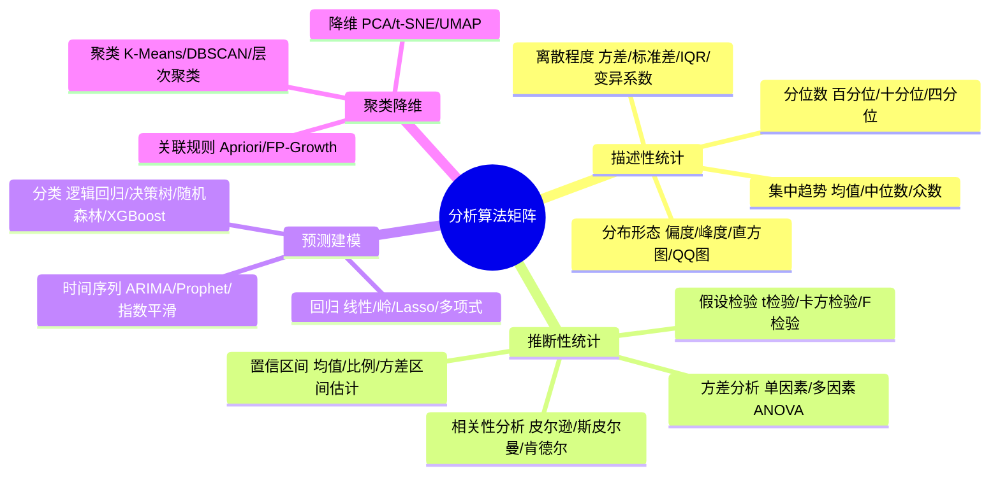

### 5.2 描述性统计分析

```python
class DescriptiveAnalyzer:
    """描述性统计分析引擎"""

    def analyze(self, df: pd.DataFrame, columns: list = None) -> dict:
        if columns is None:
            columns = df.select_dtypes(include=[np.number]).columns.tolist()

        results = {}
        for col in columns:
            if col not in df.columns:
                continue
            series = df[col].dropna()

            results[col] = {
                # 集中趋势
                "mean": float(series.mean()),
                "median": float(series.median()),
                "mode": series.mode().iloc[0] if not series.mode().empty else None,

                # 离散程度
                "std": float(series.std()),
                "var": float(series.var()),
                "range": float(series.max() - series.min()),
                "iqr": float(series.quantile(0.75) - series.quantile(0.25)),
                "cv": float(series.std() / series.mean()) if series.mean() != 0 else None,  # 变异系数

                # 分布形态
                "skewness": float(series.skew()),
                "kurtosis": float(series.kurtosis()),
                "distribution": self._classify_distribution(series),

                # 分位数
                "percentiles": {
                    "p10": float(series.quantile(0.10)),
                    "p25": float(series.quantile(0.25)),
                    "p50": float(series.quantile(0.50)),
                    "p75": float(series.quantile(0.75)),
                    "p90": float(series.quantile(0.90)),
                    "p95": float(series.quantile(0.95)),
                    "p99": float(series.quantile(0.99)),
                },

                # 极值
                "min": float(series.min()),
                "max": float(series.max()),
            }

        return results

    def _classify_distribution(self, series: pd.Series) -> str:
        """分类分布类型"""
        skew = series.skew()
        kurt = series.kurtosis()

        if abs(skew) < 0.5 and abs(kurt) < 0.5:
            return "normal"          # 近似正态
        elif skew > 0.5:
            return "right_skewed"    # 右偏
        elif skew < -0.5:
            return "left_skewed"     # 左偏
        elif kurt > 3:
            return "heavy_tailed"    # 重尾
        else:
            return "other"
```

### 5.3 推断性统计：假设检验与置信区间

```python
from scipy import stats
from statsmodels.stats.anova import anova_lm
from statsmodels.formula.api import ols
import statsmodels.api as sm


class InferentialAnalyzer:
    """推断性统计分析引擎——假设检验/置信区间/方差分析/相关性"""

    def hypothesis_test(self, df: pd.DataFrame, test_type: str, **kwargs) -> dict:
        """假设检验统一入口"""
        TESTS = {
            "t_test_one_sample": self._t_test_one_sample,
            "t_test_two_sample": self._t_test_two_sample,
            "chi_square": self._chi_square_test,
            "mann_whitney": self._mann_whitney_test,
            "anova": self._anova_test,
        }
        test_func = TESTS.get(test_type)
        if not test_func:
            raise ValueError(f"不支持的检验类型: {test_type}")

        result = test_func(df, **kwargs)
        result["test_type"] = test_type
        result["interpretation"] = self._interpret_p_value(
            result["p_value"], result.get("alpha", 0.05), test_type
        )
        return result

    def _t_test_one_sample(self, df, column, pop_mean, alpha=0.05):
        """单样本 t 检验:检验样本均值是否与假设值有显著差异"""
        t_stat, p_value = stats.ttest_1samp(df[column].dropna(), pop_mean)
        return {
            "t_statistic": float(t_stat),
            "p_value": float(p_value),
            "alpha": alpha,
            "null_hypothesis": f"均值 = {pop_mean}",
            "alternative": f"均值 ≠ {pop_mean}",
        }

    def _t_test_two_sample(self, df, col1, col2=None, group_col=None, alpha=0.05):
        """双样本 t 检验:检验两组均值是否有显著差异"""
        if group_col:
            groups = df[group_col].unique()
            if len(groups) != 2:
                raise ValueError("分组列必须恰好有2个类别")
            g1 = df[df[group_col] == groups[0]][col1].dropna()
            g2 = df[df[group_col] == groups[1]][col1].dropna()
        else:
            g1 = df[col1].dropna()
            g2 = df[col2].dropna()

        # 先检验方差齐性(Levene检验)
        _, p_levene = stats.levene(g1, g2)
        equal_var = p_levene > 0.05

        t_stat, p_value = stats.ttest_ind(g1, g2, equal_var=equal_var)
        return {
            "t_statistic": float(t_stat),
            "p_value": float(p_value),
            "alpha": alpha,
            "equal_variance": equal_var,
            "levene_p": float(p_levene),
            "group1_mean": float(g1.mean()),
            "group2_mean": float(g2.mean()),
            "null_hypothesis": "两组均值相等",
            "alternative": "两组均值不相等",
        }

    def _chi_square_test(self, df, col1, col2, alpha=0.05):
        """卡方检验:检验两个类别变量是否独立"""
        contingency = pd.crosstab(df[col1], df[col2])
        chi2, p_value, dof, expected = stats.chi2_contingency(contingency)
        return {
            "chi2_statistic": float(chi2),
            "p_value": float(p_value),
            "dof": int(dof),
            "alpha": alpha,
            "null_hypothesis": f"{col1} 与 {col2} 相互独立",
            "alternative": f"{col1} 与 {col2} 不独立(存在关联)",
            "cramers_v": float(np.sqrt(chi2 / (len(df) * (min(contingency.shape) - 1)))),
        }

    def _mann_whitney_test(self, df, col1, group_col, alpha=0.05):
        """Mann-Whitney U 检验:非参数双样本检验"""
        groups = df[group_col].unique()
        g1 = df[df[group_col] == groups[0]][col1].dropna()
        g2 = df[df[group_col] == groups[1]][col1].dropna()
        u_stat, p_value = stats.mannwhitneyu(g1, g2, alternative='two-sided')
        return {
            "u_statistic": float(u_stat),
            "p_value": float(p_value),
            "alpha": alpha,
            "null_hypothesis": "两组分布相同",
            "alternative": "两组分布不同",
        }

    def _anova_test(self, df, value_col, group_col, alpha=0.05):
        """单因素方差分析:检验多组均值是否有显著差异"""
        model = ols(f'{value_col} ~ C({group_col})', data=df).fit()
        anova_table = anova_lm(model, typ=2)
        return {
            "f_statistic": float(anova_table.loc[f'C({group_col})', 'F']),
            "p_value": float(anova_table.loc[f'C({group_col})', 'PR(>F)']),
            "alpha": alpha,
            "null_hypothesis": "所有组均值相等",
            "alternative": "至少有一组均值与其他不同",
        }

    def confidence_interval(self, df, column, confidence=0.95) -> dict:
        """置信区间估计"""
        series = df[column].dropna()
        n = len(series)
        mean = series.mean()
        sem = stats.sem(series)  # 标准误
        h = sem * stats.t.ppf((1 + confidence) / 2, n - 1)

        return {
            "mean": float(mean),
            "lower": float(mean - h),
            "upper": float(mean + h),
            "confidence_level": confidence,
            "margin_of_error": float(h),
            "sample_size": n,
            "interpretation": f"在{confidence:.0%}置信度下,{column}的总体均值落在[{mean-h:.4f}, {mean+h:.4f}]区间内"
        }

    def correlation_analysis(self, df, method="pearson") -> dict:
        """相关性分析"""
        numeric_df = df.select_dtypes(include=[np.number])
        if method == "pearson":
            corr_matrix = numeric_df.corr(method='pearson')
        elif method == "spearman":
            corr_matrix = numeric_df.corr(method='spearman')
        elif method == "kendall":
            corr_matrix = numeric_df.corr(method='kendall')
        else:
            raise ValueError(f"不支持的相关方法: {method}")

        # 提取强相关对
        strong_pairs = []
        for i in range(len(corr_matrix.columns)):
            for j in range(i+1, len(corr_matrix.columns)):
                corr_val = corr_matrix.iloc[i, j]
                if abs(corr_val) >= 0.5:  # |r| >= 0.5 视为强相关
                    strong_pairs.append({
                        "var1": corr_matrix.columns[i],
                        "var2": corr_matrix.columns[j],
                        "correlation": float(corr_val),
                        "strength": self._corr_strength(corr_val)
                    })

        return {
            "method": method,
            "matrix": corr_matrix.to_dict(),
            "strong_correlations": sorted(strong_pairs, key=lambda x: abs(x["correlation"]), reverse=True),
        }

    def _corr_strength(self, r):
        r = abs(r)
        if r >= 0.8:
            return "very_strong"
        elif r >= 0.6:
            return "strong"
        elif r >= 0.4:
            return "moderate"
        elif r >= 0.2:
            return "weak"
        else:
            return "very_weak"

    def _interpret_p_value(self, p_value, alpha, test_type):
        if p_value < alpha:
            return (f"p值({p_value:.4f}) < 显著性水平({alpha}),拒绝原假设。"
                    f"结果具有统计显著性,表明{test_type}检测到的差异/关联是真实的(而非随机误差)。")
        else:
            return (f"p值({p_value:.4f}) ≥ 显著性水平({alpha}),不能拒绝原假设。"
                    f"结果不具有统计显著性,无法证明存在显著差异/关联。")
```

### 5.4 预测建模：回归·分类·时间序列

```python
from sklearn.linear_model import LinearRegression, Ridge, Lasso, LogisticRegression
from sklearn.ensemble import RandomForestRegressor, RandomForestClassifier, GradientBoostingClassifier
from sklearn.tree import DecisionTreeClassifier
from sklearn.model_selection import train_test_split, cross_val_score
from sklearn.metrics import (
    mean_squared_error, r2_score, mean_absolute_error,
    accuracy_score, precision_score, recall_score, f1_score, roc_auc_score, confusion_matrix
)
from prophet import Prophet
from statsmodels.tsa.arima.model import ARIMA


class PredictiveModeler:
    """预测建模引擎——回归/分类/时间序列"""

    def regression(self, df, target, features=None, model_type="linear", **kwargs):
        """回归分析"""
        if features is None:
            features = [c for c in df.select_dtypes(include=[np.number]).columns if c != target]

        X = df[features].dropna()
        y = df.loc[X.index, target].dropna()
        X = X.loc[y.index]

        X_train, X_test, y_train, y_test = train_test_split(X, y, test_size=0.2, random_state=42)

        # 模型选择
        MODELS = {
            "linear": LinearRegression(),
            "ridge": Ridge(alpha=kwargs.get('alpha', 1.0)),
            "lasso": Lasso(alpha=kwargs.get('alpha', 0.1)),
        }
        model = MODELS.get(model_type, LinearRegression())
        model.fit(X_train, y_train)

        # 预测与评估
        y_pred = model.predict(X_test)
        mse = mean_squared_error(y_test, y_pred)
        rmse = np.sqrt(mse)

        result = {
            "model_type": model_type,
            "features": features,
            "target": target,
            "coefficients": dict(zip(features, model.coef_)) if hasattr(model, 'coef_') else None,
            "intercept": float(model.intercept_) if hasattr(model, 'intercept_') else None,
            "metrics": {
                "r2": float(r2_score(y_test, y_pred)),
                "rmse": float(rmse),
                "mae": float(mean_absolute_error(y_test, y_pred)),
                "mse": float(mse),
            },
            "feature_importance": self._get_feature_importance(model, features),
            "interpretation": self._interpret_regression(r2_score(y_test, y_pred), rmse, y_test),
        }
        return result

    def classify(self, df, target, features=None, model_type="random_forest", **kwargs):
        """分类分析"""
        if features is None:
            features = [c for c in df.columns if c != target]

        X = df[features].dropna()
        y = df.loc[X.index, target].dropna()
        X = X.loc[y.index]

        X_train, X_test, y_train, y_test = train_test_split(X, y, test_size=0.2, random_state=42, stratify=y)

        MODELS = {
            "logistic": LogisticRegression(max_iter=1000),
            "decision_tree": DecisionTreeClassifier(max_depth=kwargs.get('max_depth', 10)),
            "random_forest": RandomForestClassifier(n_estimators=100, random_state=42),
            "xgboost": GradientBoostingClassifier(random_state=42),
        }
        model = MODELS.get(model_type, RandomForestClassifier())
        model.fit(X_train, y_train)

        y_pred = model.predict(X_test)
        y_proba = model.predict_proba(X_test)[:, 1] if len(model.classes_) == 2 else None

        result = {
            "model_type": model_type,
            "features": features,
            "target": target,
            "classes": list(model.classes_),
            "metrics": {
                "accuracy": float(accuracy_score(y_test, y_pred)),
                "precision": float(precision_score(y_test, y_pred, average='weighted')),
                "recall": float(recall_score(y_test, y_pred, average='weighted')),
                "f1": float(f1_score(y_test, y_pred, average='weighted')),
            },
            "confusion_matrix": confusion_matrix(y_test, y_pred).tolist(),
            "feature_importance": self._get_feature_importance(model, features),
        }

        if y_proba is not None:
            result["metrics"]["auc_roc"] = float(roc_auc_score(y_test, y_proba))

        return result

    def time_series_forecast(self, df, date_col, value_col, periods=30, model_type="prophet"):
        """时间序列预测"""
        ts_df = df[[date_col, value_col]].dropna().sort_values(date_col)
        ts_df = ts_df.groupby(date_col)[value_col].sum().reset_index()

        if model_type == "prophet":
            # Prophet:适合有季节性趋势的时间序列
            prophet_df = ts_df.rename(columns={date_col: 'ds', value_col: 'y'})
            model = Prophet(
                yearly_seasonality=True,
                weekly_seasonality=True,
                daily_seasonality=False,
                changepoint_prior_scale=0.05  # 趋势灵活度
            )
            model.fit(prophet_df)
            future = model.make_future_dataframe(periods=periods)
            forecast = model.predict(future)

            result = {
                "model_type": "prophet",
                "history": ts_df.to_dict('records'),
                "forecast": forecast[['ds', 'yhat', 'yhat_lower', 'yhat_upper']].tail(periods).to_dict('records'),
                "components": {
                    "trend": forecast['trend'].tail(periods).tolist(),
                    "seasonal": forecast.get('weekly', forecast.get('yearly', pd.Series())).tail(periods).tolist(),
                },
                "metrics": self._ts_metrics(ts_df[value_col].values, forecast['yhat'][:len(ts_df)].values),
            }

        elif model_type == "arima":
            # ARIMA:适合自回归模式明显的时间序列
            ts = ts_df.set_index(date_col)[value_col]
            model = ARIMA(ts, order=(1, 1, 1))  # (p,d,q) 可自动调优
            fitted = model.fit()
            forecast = fitted.forecast(steps=periods)

            result = {
                "model_type": "arima",
                "order": (1, 1, 1),
                "history": ts_df.to_dict('records'),
                "forecast": [{"date": str(ts.index[-1] + pd.Timedelta(days=i+1)),
                              "yhat": float(forecast.iloc[i])} for i in range(periods)],
                "metrics": {
                    "aic": float(fitted.aic),
                    "bic": float(fitted.bic),
                },
            }

        return result

    def _get_feature_importance(self, model, features):
        if hasattr(model, 'feature_importances_'):
            return dict(zip(features, model.feature_importances_.tolist()))
        elif hasattr(model, 'coef_'):
            return dict(zip(features, np.abs(model.coef_).tolist()))
        return None

    def _interpret_regression(self, r2, rmse, y_test):
        if r2 >= 0.9:
            quality = "优秀"
        elif r2 >= 0.7:
            quality = "良好"
        elif r2 >= 0.5:
            quality = "一般"
        else:
            quality = "较差"

        return (f"模型拟合{quality}(R²={r2:.3f}),解释了目标变量{r2:.1%}的方差变化。"
                f"预测误差(RMSE={rmse:.4f})相对于目标变量标准差({y_test.std():.4f})。")

    def _ts_metrics(self, actual, predicted):
        return {
            "mape": float(np.mean(np.abs((actual - predicted) / actual)) * 100),  # 平均绝对百分比误差
            "rmse": float(np.sqrt(mean_squared_error(actual, predicted))),
        }
```

### 5.5 聚类与降维

```python
from sklearn.cluster import KMeans, DBSCAN, AgglomerativeClustering
from sklearn.decomposition import PCA
from sklearn.manifold import TSNE
from sklearn.metrics import silhouette_score


class ClusteringReducer:
    """聚类与降维引擎"""

    def cluster(self, df, features=None, method="kmeans", n_clusters=None, **kwargs):
        if features is None:
            features = df.select_dtypes(include=[np.number]).columns.tolist()

        X = df[features].dropna()

        if method == "kmeans":
            # 自动确定最优 K(轮廓系数法)
            if n_clusters is None:
                n_clusters = self._optimal_k_silhouette(X, max_k=min(10, len(X)//10))

            model = KMeans(n_clusters=n_clusters, random_state=42, n_init=10)
            labels = model.fit_predict(X)
            centers = model.cluster_centers_

            result = {
                "method": "kmeans",
                "n_clusters": n_clusters,
                "labels": labels.tolist(),
                "centers": centers.tolist(),
                "features": features,
                "silhouette_score": float(silhouette_score(X, labels)),
                "inertia": float(model.inertia_),
            }

        elif method == "dbscan":
            model = DBSCAN(eps=kwargs.get('eps', 0.5), min_samples=kwargs.get('min_samples', 5))
            labels = model.fit_predict(X)
            n_clusters = len(set(labels)) - (1 if -1 in labels else 0)  # -1 是噪声点

            result = {
                "method": "dbscan",
                "n_clusters": n_clusters,
                "labels": labels.tolist(),
                "noise_points": int(sum(labels == -1)),
                "features": features,
            }

        elif method == "hierarchical":
            if n_clusters is None:
                n_clusters = 3
            model = AgglomerativeClustering(n_clusters=n_clusters)
            labels = model.fit_predict(X)

            result = {
                "method": "hierarchical",
                "n_clusters": n_clusters,
                "labels": labels.tolist(),
                "features": features,
                "silhouette_score": float(silhouette_score(X, labels)) if len(set(labels)) > 1 else None,
            }

        # 簇画像:每个簇的统计特征
        df_with_labels = X.copy()
        df_with_labels['cluster'] = labels
        result["cluster_profiles"] = df_with_labels.groupby('cluster').agg(['mean', 'std', 'count']).to_dict()

        return result

    def reduce_dimensions(self, df, features=None, method="pca", n_components=2):
        if features is None:
            features = df.select_dtypes(include=[np.number]).columns.tolist()

        X = df[features].dropna()

        if method == "pca":
            model = PCA(n_components=n_components)
            reduced = model.fit_transform(X)

            result = {
                "method": "pca",
                "n_components": n_components,
                "reduced_data": reduced.tolist(),
                "explained_variance_ratio": model.explained_variance_ratio_.tolist(),
                "cumulative_variance": float(np.cumsum(model.explained_variance_ratio_)[-1]),
                "feature_loadings": dict(zip(features, model.components_[0].tolist())),
                "interpretation": (f"前{n_components}个主成分解释了"
                                   f"{np.cumsum(model.explained_variance_ratio_)[-1]:.1%}的方差"),
            }

        elif method == "tsne":
            model = TSNE(n_components=n_components, random_state=42, perplexity=min(30, len(X)-1))
            reduced = model.fit_transform(X)

            result = {
                "method": "tsne",
                "n_components": n_components,
                "reduced_data": reduced.tolist(),
                "features": features,
            }

        return result

    def _optimal_k_silhouette(self, X, max_k=10):
        """轮廓系数法确定最优 K"""
        scores = {}
        for k in range(2, max_k + 1):
            kmeans = KMeans(n_clusters=k, random_state=42, n_init=10)
            labels = kmeans.fit_predict(X)
            scores[k] = silhouette_score(X, labels)
        return max(scores, key=scores.get)
```

### 5.6 算法自动选择策略

```python
class AlgorithmSelector:
    """算法自动选择器——根据分析意图和数据特征匹配最优算法"""

    def select(self, intent: str, data_profile: dict, **kwargs) -> list:
        """
        根据分析意图选择算法
        intent: describe / compare / correlate / predict / cluster / reduce
        """
        SELECTORS = {
            "describe": self._select_descriptive,
            "compare": self._select_comparison,
            "correlate": self._select_correlation,
            "predict": self._select_predictive,
            "cluster": self._select_clustering,
            "reduce": self._select_reduction,
        }
        selector = SELECTORS.get(intent)
        if not selector:
            raise ValueError(f"不支持的分析意图: {intent}")
        return selector(data_profile, **kwargs)

    def _select_descriptive(self, profile, **kwargs):
        return [
            {"algorithm": "descriptive_stats", "reason": "基础描述统计必做"},
            {"algorithm": "distribution_analysis", "reason": "了解数据分布形态"},
        ]

    def _select_comparison(self, profile, **kwargs):
        algorithms = []
        group_col = kwargs.get('group_col')

        if group_col:
            cardinality = profile["columns"].get(group_col, {}).get("cardinality", 2)
            if cardinality == 2:
                algorithms.append({"algorithm": "t_test", "reason": "两组比较用t检验"})
            else:
                algorithms.append({"algorithm": "anova", "reason": f"{cardinality}组比较用方差分析"})
        return algorithms

    def _select_correlation(self, profile, **kwargs):
        algorithms = []
        numeric_count = sum(1 for c in profile["columns"].values()
                           if c["semantic_type"] == "numeric")

        if numeric_count >= 2:
            # 检查是否有非正态分布的列
            non_normal = any(c.get("distribution") not in ("normal", None)
                            for c in profile["columns"].values()
                            if c["semantic_type"] == "numeric")
            if non_normal:
                algorithms.append({"algorithm": "spearman_correlation", "reason": "非正态分布用Spearman"})
            else:
                algorithms.append({"algorithm": "pearson_correlation", "reason": "正态分布用Pearson"})
        return algorithms

    def _select_predictive(self, profile, **kwargs):
        algorithms = []
        target = kwargs.get('target')
        if not target:
            return algorithms

        target_info = profile["columns"].get(target, {})
        target_type = target_info.get("semantic_type")

        if target_type == "numeric":
            # 回归问题
            sample_size = profile["shape"][0]
            if sample_size < 1000:
                algorithms.append({"algorithm": "linear_regression", "reason": "小样本用线性回归"})
            else:
                algorithms.append({"algorithm": "random_forest_regressor", "reason": "大样本用随机森林"})
        elif target_type in ("categorical", "boolean"):
            # 分类问题
            cardinality = target_info.get("cardinality", 2)
            if cardinality == 2:
                algorithms.append({"algorithm": "logistic_regression", "reason": "二分类用逻辑回归"})
                algorithms.append({"algorithm": "random_forest_classifier", "reason": "二分类用随机森林对比"})
            else:
                algorithms.append({"algorithm": "random_forest_classifier", "reason": "多分类用随机森林"})

        # 时间序列检测
        datetime_cols = [c for c, i in profile["columns"].items()
                        if i["semantic_type"] == "datetime"]
        if datetime_cols:
            algorithms.append({"algorithm": "prophet_forecast", "reason": "有时间列用Prophet预测"})

        return algorithms

    def _select_clustering(self, profile, **kwargs):
        return [
            {"algorithm": "kmeans", "reason": "K-Means作为基线聚类"},
            {"algorithm": "dbscan", "reason": "DBSCAN处理非球形簇和噪声"},
        ]

    def _select_reduction(self, profile, **kwargs):
        numeric_count = sum(1 for c in profile["columns"].values()
                           if c["semantic_type"] == "numeric")
        if numeric_count > 10:
            return [{"algorithm": "pca", "reason": "高维数据用PCA降维"}]
        return []
```

---

## 六、数据可视化模块

### 6.1 可视化类型与智能选择

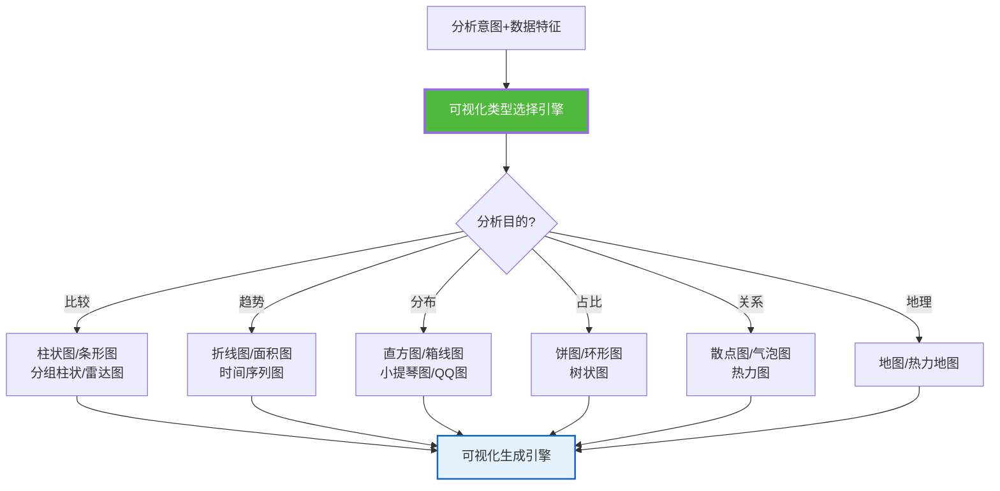

#### 智能图表选择引擎

```python
class VisualizationSelector:
    """智能图表选择引擎——根据分析意图和数据特征自动选择最优图表类型"""

    def select(self, intent: str, data: dict, **kwargs) -> list:
        """
        智能选择图表类型
        返回推荐图表列表(按适配度排序)
        """
        recommendations = []
        numeric_count = data.get("numeric_count", 0)
        categorical_count = data.get("categorical_count", 0)
        has_time = data.get("has_datetime", False)
        sample_size = data.get("sample_size", 0)

        if intent == "comparison":  # 比较
            if categorical_count >= 1 and numeric_count >= 1:
                recommendations.append({"chart": "bar", "score": 0.95,
                    "reason": "分类比较首选柱状图"})
                if categorical_count == 1 and numeric_count <= 3:
                    recommendations.append({"chart": "radar", "score": 0.75,
                        "reason": "多维对比可用雷达图"})
            recommendations.append({"chart": "grouped_bar", "score": 0.85,
                "reason": "多组对比用分组柱状图"})

        elif intent == "trend":  # 趋势
            if has_time:
                recommendations.append({"chart": "line", "score": 0.95,
                    "reason": "时间趋势首选折线图"})
                recommendations.append({"chart": "area", "score": 0.80,
                    "reason": "累积趋势用面积图"})

        elif intent == "distribution":  # 分布
            if numeric_count >= 1:
                recommendations.append({"chart": "histogram", "score": 0.95,
                    "reason": "分布分析首选直方图"})
                recommendations.append({"chart": "box", "score": 0.90,
                    "reason": "分布+异常值用箱线图"})
                if sample_size < 1000:
                    recommendations.append({"chart": "violin", "score": 0.75,
                        "reason": "小样本分布用小提琴图"})

        elif intent == "composition":  # 占比
            if categorical_count >= 1:
                recommendations.append({"chart": "pie", "score": 0.85,
                    "reason": "占比分析用饼图(类别≤6)"})
                recommendations.append({"chart": "treemap", "score": 0.80,
                    "reason": "层级占比用树状图"})

        elif intent == "relationship":  # 关系
            if numeric_count >= 2:
                recommendations.append({"chart": "scatter", "score": 0.95,
                    "reason": "两变量关系首选散点图"})
                if numeric_count >= 3:
                    recommendations.append({"chart": "bubble", "score": 0.80,
                        "reason": "三变量关系用气泡图"})
                if numeric_count >= 3:
                    recommendations.append({"chart": "heatmap", "score": 0.85,
                        "reason": "相关矩阵用热力图"})

        elif intent == "geographic":  # 地理
            if data.get("has_geo"):
                recommendations.append({"chart": "map", "score": 0.95,
                    "reason": "地理数据用地图"})
                recommendations.append({"chart": "choropleth", "score": 0.85,
                    "reason": "区域数值用着色地图"})

        # 按适配度排序
        recommendations.sort(key=lambda x: x["score"], reverse=True)
        return recommendations
```

### 6.2 交互式可视化设计

```python
import plotly.graph_objects as go
import plotly.express as px


class VisualizationEngine:
    """可视化生成引擎——生成交互式 Plotly 图表"""

    def generate(self, chart_type: str, df: pd.DataFrame, **kwargs) -> dict:
        """统一生成入口"""
        GENERATORS = {
            "bar": self._bar_chart,
            "line": self._line_chart,
            "pie": self._pie_chart,
            "scatter": self._scatter_chart,
            "histogram": self._histogram,
            "box": self._box_plot,
            "heatmap": self._heatmap,
            "violin": self._violin_plot,
            "treemap": self._treemap,
            "bubble": self._bubble_chart,
        }
        generator = GENERATORS.get(chart_type)
        if not generator:
            raise ValueError(f"不支持的图表类型: {chart_type}")

        fig = generator(df, **kwargs)
        return {
            "chart_type": chart_type,
            "figure": fig.to_dict(),  # Plotly JSON(前端可直接渲染)
            "config": {"displayModeBar": True, "responsive": True},
            "insights": self._auto_insights(fig, chart_type, df, **kwargs),
        }

    def _bar_chart(self, df, x, y, color=None, title=None, **kwargs):
        fig = px.bar(df, x=x, y=y, color=color, title=title,
                     text_auto='.2s',  # 柱上显示数值
                     barmode=kwargs.get('barmode', 'group'))
        fig.update_layout(
            xaxis_title=x, yaxis_title=y,
            hovermode='x unified',  # 统一悬浮提示
            showlegend=bool(color)
        )
        return fig

    def _line_chart(self, df, x, y, color=None, title=None, **kwargs):
        fig = px.line(df, x=x, y=y, color=color, title=title,
                      markers=kwargs.get('markers', True))
        fig.update_layout(
            xaxis_title=x, yaxis_title=y,
            hovermode='x unified',
            xaxis_rangeslider_visible=True  # 时间范围滑块
        )
        return fig

    def _pie_chart(self, df, names, values, title=None, **kwargs):
        fig = px.pie(df, names=names, values=values, title=title,
                     hole=kwargs.get('hole', 0))  # hole>0 变环形图
        fig.update_traces(textposition='inside', textinfo='percent+label')
        return fig

    def _scatter_chart(self, df, x, y, color=None, size=None, title=None, **kwargs):
        fig = px.scatter(df, x=x, y=y, color=color, size=size, title=title,
                         trendline=kwargs.get('trendline', None),  # 可加回归线
                         marginal_x='histogram', marginal_y='histogram')  # 边际分布
        return fig

    def _histogram(self, df, x, color=None, title=None, **kwargs):
        fig = px.histogram(df, x=x, color=color, title=title,
                           marginal=kwargs.get('marginal', 'box'),  # 边际箱线图
                           nbins=kwargs.get('nbins', 30))
        return fig

    def _box_plot(self, df, x=None, y, color=None, title=None, **kwargs):
        fig = px.box(df, x=x, y=y, color=color, title=title,
                     points=kwargs.get('points', 'outliers'))  # 只显示异常点
        return fig

    def _heatmap(self, df, **kwargs):
        # 相关性热力图
        corr_matrix = kwargs.get('corr_matrix', df.corr())
        fig = go.Figure(data=go.Heatmap(
            z=corr_matrix.values,
            x=corr_matrix.columns,
            y=corr_matrix.columns,
            colorscale='RdBu',  # 红-蓝发散色阶
            zmid=0,  # 0为中性色
            text=corr_matrix.round(3).values,
            texttemplate='%{text}',
            hoverongaps=False
        ))
        fig.update_layout(title=kwargs.get('title', '相关性热力图'))
        return fig

    def _violin_plot(self, df, x=None, y, color=None, title=None, **kwargs):
        fig = px.violin(df, x=x, y=y, color=color, title=title,
                        box=True, points='all')  # 内嵌箱线图+显示所有点
        return fig

    def _treemap(self, df, path, values, title=None, **kwargs):
        fig = px.treemap(df, path=path, values=values, title=title)
        return fig

    def _bubble_chart(self, df, x, y, size, color=None, title=None, **kwargs):
        fig = px.scatter(df, x=x, y=y, size=size, color=color, title=title,
                         size_max=kwargs.get('size_max', 50))
        return fig

    def _auto_insights(self, fig, chart_type, df, **kwargs):
        """自动生成图表洞察"""
        insights = []
        x = kwargs.get('x')
        y = kwargs.get('y')

        if chart_type == "bar" and x and y and y in df.columns:
            # 柱状图:最大/最小/平均
            max_val = df.loc[df[y].idxmax()]
            min_val = df.loc[df[y].idxmin()]
            insights.append(f"最高: {max_val[x]} = {max_val[y]:.2f}")
            insights.append(f"最低: {min_val[x]} = {min_val[y]:.2f}")
            insights.append(f"平均: {df[y].mean():.2f}")

        elif chart_type == "line" and y and y in df.columns:
            # 折线图:趋势/最大/最小
            trend = "上升" if df[y].iloc[-1] > df[y].iloc[0] else "下降"
            change_pct = (df[y].iloc[-1] - df[y].iloc[0]) / df[y].iloc[0] * 100
            insights.append(f"整体趋势: {trend} ({change_pct:+.1f}%)")
            insights.append(f"最高点: {df[y].max():.2f}")
            insights.append(f"最低点: {df[y].min():.2f}")

        elif chart_type == "histogram" and x and x in df.columns:
            # 直方图:分布特征
            skew = df[x].skew()
            dist = "右偏" if skew > 0.5 else "左偏" if skew < -0.5 else "近似对称"
            insights.append(f"分布形态: {dist} (偏度={skew:.2f})")
            insights.append(f"均值: {df[x].mean():.2f}, 中位数: {df[x].median():.2f}")

        return insights
```

### 6.3 可视化生成引擎工作流

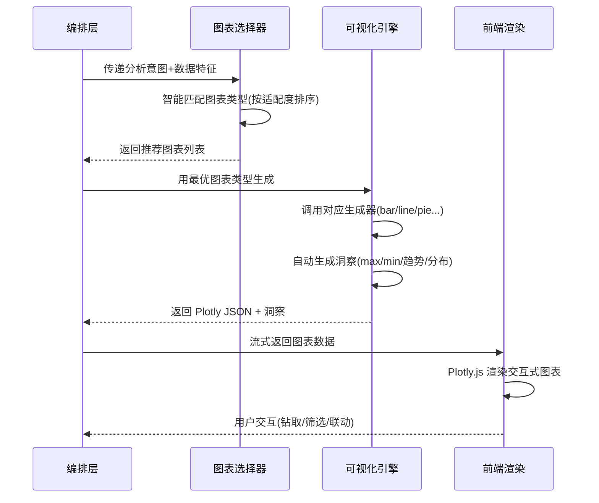

---

## 七、自然语言结果解释模块

### 7.1 结果解释三层架构

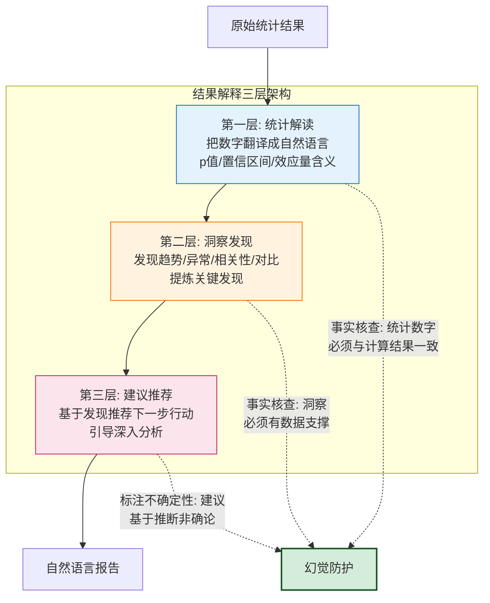

### 7.2 洞察发现自动生成

```python
class InsightGenerator:
    """洞察发现生成器——自动从分析结果中发现关键洞察"""

    def generate(self, analysis_result: dict, data: pd.DataFrame) -> list:
        insights = []

        # 1. 趋势洞察
        insights.extend(self._trend_insights(analysis_result, data))

        # 2. 异常洞察
        insights.extend(self._anomaly_insights(analysis_result, data))

        # 3. 相关性洞察
        insights.extend(self._correlation_insights(analysis_result, data))

        # 4. 对比洞察
        insights.extend(self._comparison_insights(analysis_result, data))

        # 5. 分布洞察
        insights.extend(self._distribution_insights(analysis_result, data))

        # 按重要度排序
        insights.sort(key=lambda x: x["importance"], reverse=True)
        return insights

    def _trend_insights(self, result, data):
        insights = []
        if "time_series_forecast" in result:
            forecast = result["time_series_forecast"]
            history = forecast.get("history", [])
            if len(history) >= 2:
                first_val = history[0]["y"]
                last_val = history[-1]["y"]
                change_pct = (last_val - first_val) / first_val * 100

                if abs(change_pct) > 20:
                    direction = "上升" if change_pct > 0 else "下降"
                    insights.append({
                        "type": "trend",
                        "importance": 0.9,
                        "insight": f"时间序列呈现显著{direction}趋势,变化幅度达{change_pct:+.1f}%",
                        "data_support": {"first": first_val, "last": last_val, "change_pct": change_pct},
                        "actionable": True,
                    })
        return insights

    def _anomaly_insights(self, result, data):
        insights = []
        if "descriptive" in result:
            for col, stats in result["descriptive"].items():
                if isinstance(stats, dict) and "outlier_count_iqr" in stats:
                    outlier_count = stats["outlier_count_iqr"]
                    if outlier_count > 0:
                        outlier_ratio = outlier_count / len(data)
                        if outlier_ratio > 0.05:  # 异常值占比>5%
                            insights.append({
                                "type": "anomaly",
                                "importance": 0.85,
                                "insight": f"字段'{col}'存在{outlier_count}个异常值(占比{outlier_ratio:.1%}),需关注数据质量或业务异常",
                                "data_support": {"column": col, "outlier_count": outlier_count, "ratio": outlier_ratio},
                                "actionable": True,
                            })
        return insights

    def _correlation_insights(self, result, data):
        insights = []
        if "correlation" in result:
            strong_corrs = result["correlation"].get("strong_correlations", [])
            for corr in strong_corrs[:3]:  # Top 3 强相关
                strength = corr["strength"]
                if strength in ("very_strong", "strong"):
                    var1, var2 = corr["var1"], corr["var2"]
                    r = corr["correlation"]
                    direction = "正" if r > 0 else "负"
                    insights.append({
                        "type": "correlation",
                        "importance": 0.8,
                        "insight": f"'{var1}'与'{var2}'存在{direction}相关(r={r:.3f}),{var1}的变化可解释{var2}约{r**2:.1%}的方差",
                        "data_support": corr,
                        "actionable": True,
                    })
        return insights

    def _comparison_insights(self, result, data):
        insights = []
        if "hypothesis_test" in result:
            test = result["hypothesis_test"]
            if test["p_value"] < test.get("alpha", 0.05):
                insights.append({
                    "type": "comparison",
                    "importance": 0.85,
                    "insight": f"假设检验结果显著(p={test['p_value']:.4f}),{test.get('alternative', '存在显著差异')}",
                    "data_support": test,
                    "actionable": True,
                })
        return insights

    def _distribution_insights(self, result, data):
        insights = []
        if "descriptive" in result:
            for col, stats in result["descriptive"].items():
                if isinstance(stats, dict) and "distribution" in stats:
                    dist = stats["distribution"]
                    if dist == "right_skewed":
                        insights.append({
                            "type": "distribution",
                            "importance": 0.6,
                            "insight": f"字段'{col}'右偏分布(偏度={stats['skewness']:.2f}),大部分值集中在较低区间,存在少量高值",
                            "data_support": {"column": col, "skewness": stats["skewness"]},
                            "actionable": False,
                        })
                    elif dist == "heavy_tailed":
                        insights.append({
                            "type": "distribution",
                            "importance": 0.7,
                            "insight": f"字段'{col}'重尾分布(峰度={stats['kurtosis']:.2f}),极端值出现频率高于正态分布",
                            "data_support": {"column": col, "kurtosis": stats["kurtosis"]},
                            "actionable": True,
                        })
        return insights
```

### 7.3 建议推荐引擎

```python
class RecommendationEngine:
    """建议推荐引擎——基于分析结果推荐下一步行动"""

    def recommend(self, insights: list, analysis_result: dict) -> list:
        recommendations = []

        for insight in insights:
            if not insight.get("actionable"):
                continue

            recs = self._generate_recommendation(insight, analysis_result)
            recommendations.extend(recs)

        # 去重并排序
        recommendations = self._deduplicate(recommendations)
        recommendations.sort(key=lambda x: x["priority"], reverse=True)
        return recommendations

    def _generate_recommendation(self, insight, result):
        recs = []
        itype = insight["type"]

        if itype == "trend":
            change = insight["data_support"]["change_pct"]
            if change > 50:
                recs.append({
                    "priority": 0.9,
                    "action": "深入归因分析",
                    "reason": f"增长{change:.1f}%幅度较大,建议分析增长驱动因素(量价拆解/渠道拆解/产品拆解)",
                    "next_step": "对增长做维度拆解,定位主要贡献因子",
                })
            elif change < -20:
                recs.append({
                    "priority": 0.95,
                    "action": "风险预警与归因",
                    "reason": f"下降{abs(change):.1f}%需警惕,建议做归因分析定位下降原因",
                    "next_step": "对下降做维度拆解,排除数据质量问题后定位业务原因",
                })

        elif itype == "anomaly":
            recs.append({
                "priority": 0.85,
                "action": "异常值排查",
                "reason": f"字段'{insight['data_support']['column']}'异常值较多,需排查是数据质量问题还是业务异常",
                "next_step": "1)检查数据采集是否有误 2)如数据正确则分析异常背后的业务原因",
            })

        elif itype == "correlation":
            recs.append({
                "priority": 0.7,
                "action": "因果关系验证",
                "reason": f"相关性不等于因果性,建议通过实验或更深入的分析验证因果关系",
                "next_step": "设计A/B实验或使用因果推断方法(如工具变量/双重差分)验证因果",
            })

        elif itype == "comparison":
            recs.append({
                "priority": 0.8,
                "action": "差异归因分析",
                "reason": "组间差异显著,建议分析导致差异的具体因素",
                "next_step": "对差异做维度拆解,定位差异的主要来源",
            })

        return recs

    def _deduplicate(self, recommendations):
        seen = set()
        unique = []
        for rec in recommendations:
            key = rec["action"]
            if key not in seen:
                seen.add(key)
                unique.append(rec)
        return unique
```

### 7.4 幻觉防护与事实核查

参考 [158 号幻觉治理方案](../13项目经验/158Agent系统幻觉问题系统性分析与解决方案.md),对自然语言解释做事实核查,确保解释内容与统计计算结果一致:

```python
class ExplanationFactChecker:
    """解释事实核查器——防止 LLM 在解释分析结果时产生幻觉"""

    def check(self, explanation: str, analysis_result: dict) -> dict:
        """
        核查自然语言解释与统计结果是否一致
        """
        issues = []

        # 1. 数值一致性核查:解释中提到的数字必须与统计结果一致
        issues.extend(self._check_numeric_consistency(explanation, analysis_result))

        # 2. 结论一致性核查:解释的结论必须与统计检验结果一致
        issues.extend(self._check_conclusion_consistency(explanation, analysis_result))

        # 3. 引用溯源核查:解释中引用的统计量必须可追溯到计算结果
        issues.extend(self._check_citation_traceability(explanation, analysis_result))

        passed = len(issues) == 0
        return {
            "passed": passed,
            "issues": issues,
            "factuality_score": 1.0 - len(issues) * 0.15,  # 每个问题扣15分
            "action": "pass" if passed else "rewrite"
        }

    def _check_numeric_consistency(self, explanation, result):
        """数值一致性核查:提取解释中的数字,与统计结果比对"""
        import re
        issues = []

        # 提取解释中的所有数字
        numbers_in_text = re.findall(r'(\d+\.?\d*)', explanation)

        # 提取统计结果中的所有数值
        actual_numbers = self._extract_all_numbers(result)

        # 比对:解释中的每个数字是否能在统计结果中找到(容差 0.01)
        for num_str in numbers_in_text:
            num = float(num_str)
            matched = any(abs(num - actual) < 0.01 for actual in actual_numbers)
            if not matched and num > 1:  # 忽略小数字(可能是序号)
                issues.append({
                    "type": "numeric_mismatch",
                    "claimed": num,
                    "issue": f"解释中的数字{num}在统计结果中找不到对应值,可能是捏造"
                })

        return issues

    def _check_conclusion_consistency(self, explanation, result):
        """结论一致性核查:解释的统计结论必须与检验结果一致"""
        issues = []

        if "hypothesis_test" in result:
            test = result["hypothesis_test"]
            p_value = test["p_value"]
            alpha = test.get("alpha", 0.05)
            is_significant = p_value < alpha

            # 检查解释中是否与显著性结论矛盾
            if is_significant and ("不显著" in explanation or "无差异" in explanation):
                issues.append({
                    "type": "conclusion_contradiction",
                    "issue": f"检验结果显著(p={p_value:.4f}<{alpha}),但解释称不显著,存在矛盾"
                })
            elif not is_significant and ("显著" in explanation and "不显著" not in explanation):
                issues.append({
                    "type": "conclusion_contradiction",
                    "issue": f"检验结果不显著(p={p_value:.4f}≥{alpha}),但解释称显著,存在矛盾"
                })

        return issues

    def _check_citation_traceability(self, explanation, result):
        """引用溯源核查"""
        issues = []
        # 检查解释中引用的统计量是否存在于结果中
        if "R²" in explanation or "R2" in explanation or "r²" in explanation:
            if not self._has_metric(result, "r2"):
                issues.append({
                    "type": "untraceable_citation",
                    "issue": "解释引用了R²,但统计结果中无此指标"
                })
        if "p值" in explanation or "p=" in explanation:
            if not self._has_metric(result, "p_value"):
                issues.append({
                    "type": "untraceable_citation",
                    "issue": "解释引用了p值,但统计结果中无此指标"
                })
        return issues

    def _extract_all_numbers(self, obj):
        """递归提取结果中的所有数值"""
        numbers = []
        if isinstance(obj, dict):
            for v in obj.values():
                numbers.extend(self._extract_all_numbers(v))
        elif isinstance(obj, list):
            for item in obj:
                numbers.extend(self._extract_all_numbers(item))
        elif isinstance(obj, (int, float)):
            numbers.append(float(obj))
        return numbers

    def _has_metric(self, result, metric_name):
        """检查结果中是否包含某指标"""
        if isinstance(result, dict):
            for k, v in result.items():
                if k == metric_name:
                    return True
                if self._has_metric(v, metric_name):
                    return True
        elif isinstance(result, list):
            for item in result:
                if self._has_metric(item, metric_name):
                    return True
        return False
```

---

## 八、模型选型决策

### 8.1 LLM 大模型选型

| 选型维度 | GPT-4o | Qwen2-72B | Claude-3.5-Sonnet | DeepSeek-V3 | 选型建议 |
|:--------|:------:|:---------:|:-----------------:|:-----------:|:--------|
| **意图理解** | ★★★★★ | ★★★★ | ★★★★★ | ★★★★ | GPT-4o/Claude 适合复杂意图 |
| **代码生成** | ★★★★★ | ★★★★ | ★★★★★ | ★★★★★ | 数据分析代码生成均可用 |
| **结果解释** | ★★★★★ | ★★★★ | ★★★★★ | ★★★★ | 解释质量差距不大 |
| **中文能力** | ★★★★ | ★★★★★ | ★★★★ | ★★★★★ | 中文场景优先 Qwen2/DeepSeek |
| **私有化部署** | ✗ | ✓ | ✗ | ✓ | 数据敏感场景用可私有化模型 |
| **成本(每百万Token)** | ¥15-60 | ¥4-12(自部署) | ¥15-60 | ¥1-4 | 成本敏感选 DeepSeek |
| **延迟** | 中 | 低(自部署) | 中 | 低 | 实时交互选自部署 |

**推荐策略**:
- **意图理解 + 分析计划生成**:GPT-4o 或 Claude-3.5(复杂意图理解强)
- **代码生成 + 执行**:DeepSeek-V3 或 Qwen2-72B(代码能力强 + 成本低 + 可私有化)
- **结果解释**:与意图理解同模型,保持上下文一致性
- **多模型路由**:简单分析用小模型,复杂建模用大模型(参考 118 号 §5.2 多模型路由策略)

### 8.2 数据分析引擎选型

| 引擎 | 适用场景 | 数据规模 | 优势 | 劣势 | 选型建议 |
|:-----|:--------|:--------|:-----|:-----|:--------|
| **pandas** | 单机分析 | <5GB | 生态成熟/易用 | 单机内存限制 | 默认引擎 |
| **polars** | 单机大数据 | 5-50GB | 比 pandas 快 5-10x/内存优化 | 生态不如 pandas 全 | 中等数据量首选 |
| **DuckDB** | 嵌入式 OLAP | <100GB | SQL 分析/列式存储/零部署 | 不适合超大数据 | SQL 分析首选 |
| **Spark** | 分布式大数据 | >100GB | 分布式计算/生态丰富 | 部署重/延迟高 | 超大数据量用 |

**推荐策略**:
```python
class AnalysisEngineSelector:
    """根据数据量自动选择分析引擎"""

    def select(self, data_size_mb: int, operation_type: str) -> str:
        if data_size_mb < 5000:  # <5GB
            return "pandas"
        elif data_size_mb < 50000:  # 5-50GB
            return "polars"
        elif data_size_mb < 100000:  # 50-100GB
            return "duckdb" if operation_type == "sql" else "polars"
        else:  # >100GB
            return "spark"
```

### 8.3 可视化库选型

| 库 | 交互性 | 输出格式 | 适用场景 | 选型建议 |
|:---|:------:|:--------|:--------|:--------|
| **Plotly** | ★★★★★ | HTML/JSON | 交互式 Web 可视化 | **首选**(交互+易集成) |
| **Matplotlib** | ★★ | PNG/SVG | 静态出版级图表 | 报告导出用 |
| **Seaborn** | ★★★ | PNG/SVG | 统计可视化 | 快速统计图 |
| **ECharts** | ★★★★★ | JS/JSON | 大数据量交互式 | 前端原生集成 |

**推荐**:Plotly(后端生成 JSON + 前端 Plotly.js 渲染),兼顾交互性和工程集成。

---

## 九、接口设计

### 9.1 RESTful API 设计

```python
from fastapi import FastAPI, HTTPException, WebSocket
from pydantic import BaseModel
from typing import Optional
import uuid

app = FastAPI(title="数据分析Agent API", version="1.0")


# ========== 数据源管理 ==========

class DataSourceCreate(BaseModel):
    name: str
    source_type: str  # jdbc/api/file/stream/object_store/warehouse
    connection: dict
    auth: dict
    options: dict = {}


@app.post("/api/v1/datasources")
async def create_datasource(req: DataSourceCreate):
    """创建数据源"""
    source_id = str(uuid.uuid4())
    # 测试连接
    config = DataSourceConfig(**req.dict())
    connector = ConnectionPoolManager().get_connector(source_id, config)
    return {"source_id": source_id, "status": "connected"}


@app.get("/api/v1/datasources/{source_id}/schema")
async def get_schema(source_id: str):
    """获取数据源 schema"""
    connector = pool_manager.get_connector(source_id, ...)
    return connector.get_schema()


@app.get("/api/v1/datasources/{source_id}/preview")
async def preview_data(source_id: str, table: str = None, limit: int = 100):
    """预览数据(采样)"""
    connector = pool_manager.get_connector(source_id, ...)
    df = connector.sample(n=limit)
    return {"data": df.to_dict('records'), "shape": df.shape}


# ========== 分析任务 ==========

class AnalysisRequest(BaseModel):
    query: str                          # 自然语言分析请求
    datasource_id: str                  # 数据源ID
    table: Optional[str] = None         # 表名(可选)
    filters: Optional[dict] = None      # 过滤条件
    options: Optional[dict] = None      # 额外选项


@app.post("/api/v1/analysis")
async def create_analysis(req: AnalysisRequest):
    """创建分析任务(异步)"""
    task_id = str(uuid.uuid4())
    # 异步执行分析
    await analysis_orchestrator.submit(task_id, req)
    return {"task_id": task_id, "status": "processing"}


@app.get("/api/v1/analysis/{task_id}")
async def get_analysis_result(task_id: str):
    """获取分析结果"""
    result = analysis_orchestrator.get_result(task_id)
    if result is None:
        return {"task_id": task_id, "status": "processing"}
    return {
        "task_id": task_id,
        "status": "completed",
        "data": result.get("data"),
        "statistics": result.get("statistics"),
        "visualizations": result.get("visualizations"),
        "insights": result.get("insights"),
        "explanation": result.get("explanation"),
        "recommendations": result.get("recommendations"),
    }


# ========== 可视化 ==========

class VisualizationRequest(BaseModel):
    data: list                  # 数据
    chart_type: Optional[str] = None  # 指定图表类型(可选,不指定则智能选择)
    intent: Optional[str] = None      # 分析意图(用于智能选择)
    config: Optional[dict] = None     # 图表配置


@app.post("/api/v1/visualize")
async def generate_chart(req: VisualizationRequest):
    """生成可视化图表"""
    df = pd.DataFrame(req.data)

    if req.chart_type:
        chart_type = req.chart_type
    elif req.intent:
        selector = VisualizationSelector()
        recommendations = selector.select(req.intent, {
            "numeric_count": len(df.select_dtypes(include=[np.number]).columns),
            "categorical_count": len(df.select_dtypes(exclude=[np.number]).columns),
        })
        chart_type = recommendations[0]["chart"] if recommendations else "bar"
    else:
        chart_type = "bar"  # 默认

    engine = VisualizationEngine()
    result = engine.generate(chart_type, df, **(req.config or {}))
    return result
```

### 9.2 WebSocket 流式分析接口

```python
@app.websocket("/ws/v1/analysis/stream")
async def stream_analysis(websocket: WebSocket):
    """WebSocket 流式分析——实时推送分析进度和结果"""
    await websocket.accept()

    try:
        while True:
            # 接收分析请求
            request = await websocket.receive_json()

            # 流式推送分析过程
            async for progress in analysis_orchestrator.execute_streaming(request):
                await websocket.send_json(progress)
                # progress 格式:
                # {"stage": "data_loading", "status": "in_progress", "message": "正在加载数据..."}
                # {"stage": "preprocessing", "status": "completed", "result": {...}}
                # {"stage": "analysis", "status": "in_progress", "message": "正在执行回归分析..."}
                # {"stage": "visualization", "status": "completed", "chart": {...}}
                # {"stage": "explanation", "status": "completed", "text": "分析结果:..."}

    except WebSocketDisconnect:
        pass
```

### 9.3 SDK 与集成接口

```python
class DataAnalysisAgentSDK:
    """数据分析 Agent SDK——供外部系统集成"""

    def __init__(self, base_url: str, api_key: str):
        self.base_url = base_url
        self.headers = {"Authorization": f"Bearer {api_key}"}

    def analyze(self, query: str, datasource_id: str, **kwargs) -> dict:
        """同步分析(阻塞直到完成)"""
        import requests, time
        resp = requests.post(f"{self.base_url}/api/v1/analysis",
                            headers=self.headers,
                            json={"query": query, "datasource_id": datasource_id, **kwargs})
        task_id = resp.json()["task_id"]

        # 轮询结果
        while True:
            result = requests.get(f"{self.base_url}/api/v1/analysis/{task_id}",
                                headers=self.headers).json()
            if result["status"] == "completed":
                return result
            time.sleep(1)

    def analyze_stream(self, query: str, datasource_id: str):
        """流式分析(生成器)"""
        from websockets import connect
        import asyncio, json

        async def _stream():
            async with connect(f"ws://{self.base_url}/ws/v1/analysis/stream") as ws:
                await ws.send(json.dumps({"query": query, "datasource_id": datasource_id}))
                while True:
                    msg = await ws.recv()
                    yield json.loads(msg)

        return _stream()
```

---

## 十、安全策略

### 10.1 数据安全：加密·脱敏与隔离

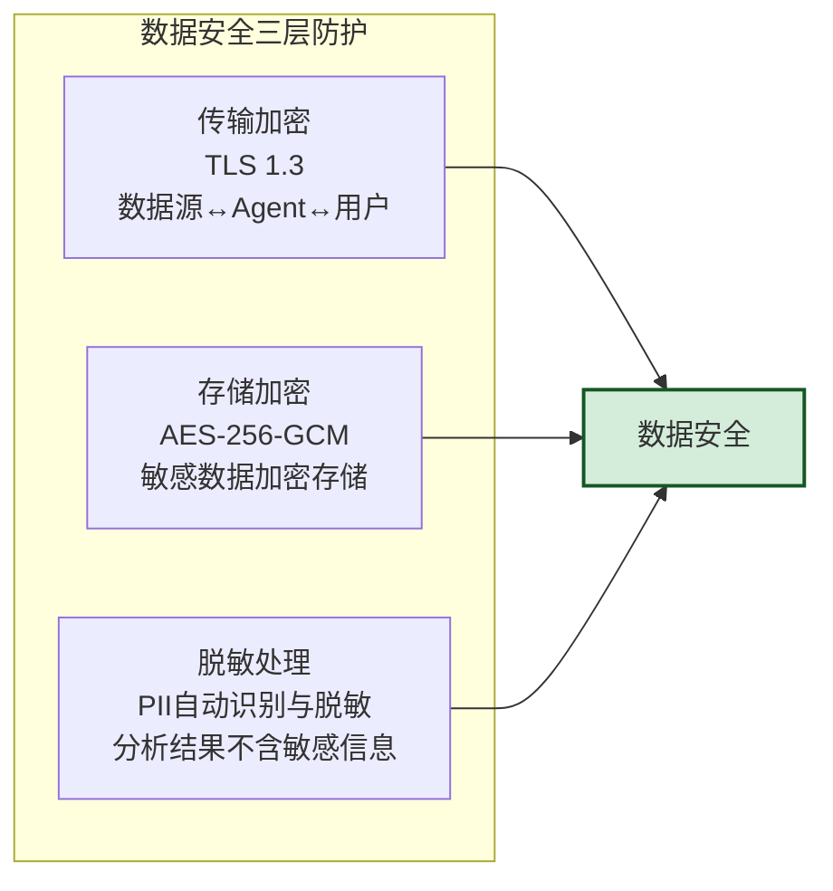

```python
class DataSecurityManager:
    """数据安全管理器——加密/脱敏/隔离"""

    # PII 正则模式(参考 158 号 S8 案例教训)
    PII_PATTERNS = {
        "id_card": r'\d{17}[\dXx]',
        "phone": r'1[3-9]\d{9}',
        "email": r'[\w.-]+@[\w.-]+\.\w+',
        "bank_card": r'\d{16,19}',
        "ip_address": r'\d{1,3}\.\d{1,3}\.\d{1,3}\.\d{1,3}',
    }

    def mask_pii(self, df: pd.DataFrame) -> pd.DataFrame:
        """自动识别并脱敏 PII 数据"""
        import re
        df_masked = df.copy()

        for col in df_masked.columns:
            if df_masked[col].dtype == 'object':
                for pii_type, pattern in self.PII_PATTERNS.items():
                    df_masked[col] = df_masked[col].astype(str).str.replace(
                        pattern, f'***{pii_type}***', regex=True
                    )
        return df_masked

    def encrypt_sensitive_columns(self, df: pd.DataFrame, sensitive_cols: list) -> pd.DataFrame:
        """加密敏感列(存储时加密,分析时解密)"""
        from cryptography.fernet import Fernet
        key = self._get_encryption_key()
        cipher = Fernet(key)

        df_encrypted = df.copy()
        for col in sensitive_cols:
            if col in df_encrypted.columns:
                df_encrypted[col] = df_encrypted[col].astype(str).apply(
                    lambda x: cipher.encrypt(x.encode()).decode()
                )
        return df_encrypted
```

### 10.2 代码执行安全：沙箱隔离

数据分析 Agent 需要 LLM 生成并执行代码(如 pandas 操作),必须在沙箱中执行防止安全风险。参考 [178 号沙箱执行环境设计](../14高级%20Agent/178安全可靠的Agent沙箱执行环境设计面试题详解.md):

```python
import docker
import tempfile
import os


class SandboxExecutor:
    """沙箱执行器——在 Docker 容器中隔离执行 LLM 生成的代码"""

    def __init__(self):
        self.client = docker.from_env()
        self.image = "data-analysis-sandbox:latest"  # 预构建镜像(pandas/sklearn/plotly)

    def execute(self, code: str, data: pd.DataFrame = None,
                timeout: int = 30, memory_limit: str = "2g") -> dict:
        """在沙箱中执行代码"""
        # 1. 代码安全检查(静态扫描)
        security_check = self._security_scan(code)
        if not security_check["passed"]:
            return {"success": False, "error": "代码安全检查未通过",
                    "details": security_check["issues"]}

        # 2. 准备执行环境
        with tempfile.TemporaryDirectory() as tmpdir:
            # 写入代码文件
            code_file = os.path.join(tmpdir, "analysis.py")
            with open(code_file, 'w') as f:
                f.write(self._wrap_code(code))

            # 写入数据文件(如有)
            if data is not None:
                data_file = os.path.join(tmpdir, "input_data.parquet")
                data.to_parquet(data_file)

            # 3. 在 Docker 容器中执行
            try:
                result = self.client.containers.run(
                    self.image,
                    command=f"python /workspace/analysis.py",
                    volumes={tmpdir: {"bind": "/workspace", "mode": "rw"}},
                    mem_limit=memory_limit,
                    cpu_period=100000,
                    cpu_quota=200000,  # 限制 2 核
                    network_mode="none",  # 禁止网络访问
                    read_only=False,     # 需写临时文件
                    cap_drop=["ALL"],    # 删除所有 Linux capabilities
                    security_opt=["no-new-privileges"],  # 禁止提权
                    timeout=timeout,
                    remove=True  # 执行完自动删除容器
                )
                return {"success": True, "output": result.decode()}
            except Exception as e:
                return {"success": False, "error": str(e)}

    def _security_scan(self, code: str) -> dict:
        """代码安全静态扫描"""
        FORBIDDEN = [
            ("import os", "禁止操作系统调用"),
            ("import subprocess", "禁止子进程调用"),
            ("import socket", "禁止网络操作"),
            ("open(", "禁止文件系统操作(除指定路径)"),
            ("eval(", "禁止 eval 执行"),
            ("exec(", "禁止 exec 执行"),
            ("__import__", "禁止动态导入"),
            ("os.system", "禁止系统命令"),
        ]
        issues = []
        for pattern, reason in FORBIDDEN:
            if pattern in code:
                issues.append({"pattern": pattern, "reason": reason})
        return {"passed": len(issues) == 0, "issues": issues}

    def _wrap_code(self, code: str) -> str:
        """包装用户代码:注入数据加载和结果输出"""
        wrapper = f"""
import pandas as pd
import json
import sys

# 加载输入数据
try:
    input_data = pd.read_parquet('/workspace/input_data.parquet')
except:
    input_data = None

# 用户代码
{code}

# 输出结果(通过 stdout 传回)
if 'result' in dir():
    print(json.dumps({{"result": str(result)}}))
"""
        return wrapper
```

### 10.3 访问安全：认证·鉴权与审计

```python
from datetime import datetime
from functools import wraps


class SecurityManager:
    """安全管理器——认证/鉴权/审计"""

    def authenticate(self, token: str) -> dict:
        """JWT 认证"""
        # 验证 JWT token
        payload = jwt.decode(token, SECRET_KEY, algorithms=["HS256"])
        return {"user_id": payload["user_id"], "role": payload["role"],
                "tenant_id": payload["tenant_id"]}

    def authorize(self, user: dict, resource: str, action: str) -> bool:
        """ABAC 鉴权:基于用户+资源+环境+风险多维策略"""
        policy = self._get_policy(user["role"], resource)
        if action not in policy.get("allowed_actions", []):
            return False

        # 数据源级权限:用户只能访问授权的数据源
        if resource.startswith("datasource:"):
            source_id = resource.split(":")[1]
            if source_id not in user.get("authorized_sources", []):
                return False

        return True

    def audit_log(self, user: dict, action: str, resource: str,
                  result: str, detail: dict = None):
        """审计日志——所有分析操作可追溯"""
        log_entry = {
            "timestamp": datetime.utcnow().isoformat(),
            "user_id": user["user_id"],
            "tenant_id": user["tenant_id"],
            "action": action,        # create_analysis / view_data / export
            "resource": resource,    # datasource:xxx / task:xxx
            "result": result,        # success / denied / error
            "detail": detail,        # 查询内容/数据量等
            "ip": request.remote_addr,
        }
        # 写入防篡改审计日志(哈希链式存储,参考 181 号 DLP 方案)
        self.audit_store.append_chain(log_entry)
```

---

## 十一、可扩展性与性能优化

### 11.1 水平扩展架构

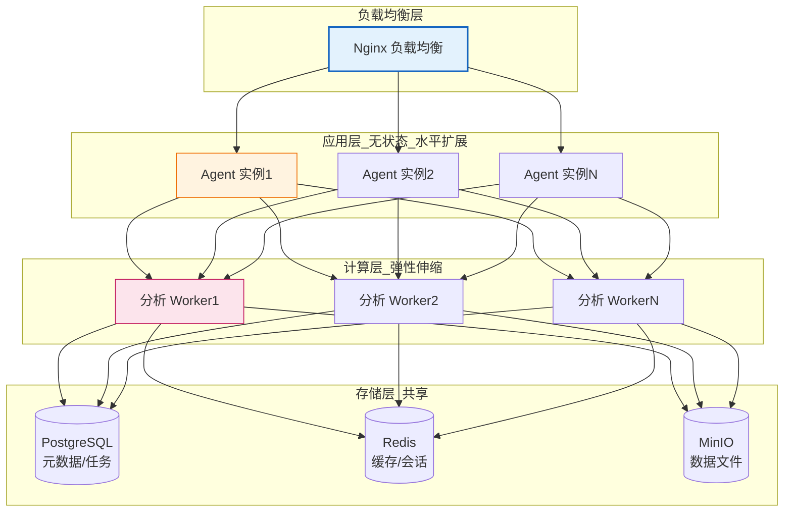

**水平扩展设计要点**:
- **Agent 层无状态**:会话状态存储在 Redis,Agent 实例可任意扩缩
- **分析 Worker 弹性伸缩**:按任务队列长度自动扩缩(K8s HPA)
- **数据源连接池共享**:连接池元数据存 PostgreSQL,多实例共享
- **计算与存储分离**:分析 Worker 不持有数据,从共享存储读取

### 11.2 数据处理效率优化

```python
class PerformanceOptimizer:
    """数据处理效率优化器"""

    def optimize_dataframe(self, df: pd.DataFrame) -> pd.DataFrame:
        """DataFrame 内存优化——减少 50-70% 内存占用"""
        # 1. 数值类型降精度
        for col in df.select_dtypes(include=['int64']).columns:
            col_min, col_max = df[col].min(), df[col].max()
            if col_min >= 0:
                if col_max < 255:
                    df[col] = df[col].astype('uint8')
                elif col_max < 65535:
                    df[col] = df[col].astype('uint16')
                elif col_max < 4294967295:
                    df[col] = df[col].astype('uint32')
            else:
                if col_min > -128 and col_max < 127:
                    df[col] = df[col].astype('int8')
                elif col_min > -32768 and col_max < 32767:
                    df[col] = df[col].astype('int16')
                elif col_min > -2147483648 and col_max < 2147483647:
                    df[col] = df[col].astype('int32')

        # 2. 浮点类型降精度
        for col in df.select_dtypes(include=['float64']).columns:
            df[col] = df[col].astype('float32')

        # 3. 类别型转换
        for col in df.select_dtypes(include=['object']).columns:
            unique_ratio = df[col].nunique() / len(df)
            if unique_ratio < 0.5:  # 唯一值占比<50%转为category
                df[col] = df[col].astype('category')

        return df

    def parallelize_analysis(self, df: pd.DataFrame, func, n_partitions: int = None):
        """并行化分析——分块处理大数据"""
        import multiprocessing
        if n_partitions is None:
            n_partitions = multiprocessing.cpu_count()

        # 分块
        chunks = np.array_split(df, n_partitions)

        # 并行处理
        with multiprocessing.Pool(n_partitions) as pool:
            results = pool.map(func, chunks)

        # 合并结果
        return self._merge_results(results)

    def lazy_loading(self, source_id: str, query: str):
        """惰性加载——只加载分析所需列"""
        # 先获取 schema
        connector = pool_manager.get_connector(source_id, ...)
        schema = connector.get_schema()

        # LLM 分析查询,确定所需列
        required_cols = self._infer_required_columns(query, schema)

        # 只查询所需列(减少数据传输)
        col_list = ", ".join(required_cols)
        optimized_query = f"SELECT {col_list} FROM ({query}) sub"
        return connector.extract(query=optimized_query)
```

### 11.3 多级缓存策略

```python
class MultiLevelCache:
    """多级缓存——L1内存 + L2 Redis + L3语义"""

    def __init__(self):
        self.l1_memory = {}       # 进程内缓存(最快)
        self.l2_redis = redis.Client()  # Redis 分布式缓存
        self.l3_semantic = SemanticCache()  # 语义相似度缓存

    def get(self, key: str, query: str = None):
        """多级缓存查询"""
        # L1 内存缓存
        if key in self.l1_memory:
            return {"data": self.l1_memory[key], "level": "L1", "latency": "0.1ms"}

        # L2 Redis 缓存
        cached = self.l2_redis.get(key)
        if cached:
            self.l1_memory[key] = json.loads(cached)  # 回填 L1
            return {"data": json.loads(cached), "level": "L2", "latency": "1ms"}

        # L3 语义缓存(相似查询复用)
        if query:
            similar = self.l3_semantic.search(query, threshold=0.95)
            if similar:
                # 语义缓存命中需二次校验(参考 158 号防幻觉方案)
                if self._validate_applicability(query, similar["query"]):
                    return {"data": similar["result"], "level": "L3", "latency": "10ms"}

        return None  # 缓存未命中

    def set(self, key: str, value: dict, query: str = None, ttl: int = 3600):
        """写入多级缓存"""
        # L1
        self.l1_memory[key] = value
        # L2
        self.l2_redis.setex(key, ttl, json.dumps(value))
        # L3(语义缓存,需要 query 文本)
        if query:
            self.l3_semantic.store(query, value)
```

---

## 十二、用户交互体验设计

### 12.1 对话式分析流程

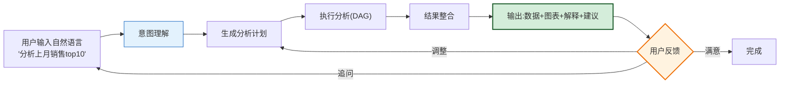

#### 对话式分析状态机

```python
class ConversationStateMachine:
    """对话式分析状态机——管理多轮对话流程"""

    STATES = {
        "INIT": "初始状态,等待用户输入",
        "UNDERSTANDING": "理解用户意图",
        "CONFIRMING": "与用户确认分析计划",
        "EXECUTING": "执行分析中",
        "PRESENTING": "展示分析结果",
        "FOLLOW_UP": "等待用户追问或调整",
        "COMPLETED": "分析完成",
    }

    def handle_message(self, user_input: str, context: dict) -> dict:
        state = context.get("state", "INIT")

        if state == "INIT" or state == "FOLLOW_UP":
            # 理解意图
            intent = self._parse_intent(user_input, context)
            if intent["confidence"] < 0.7:
                # 意图不明确,追问澄清
                return {
                    "state": "INIT",
                    "response": f"我理解你想做{intent['type']}分析,但需要更多信息。请问你想分析哪个数据源?具体想看什么指标?",
                    "need_clarification": True,
                }

            # 生成分析计划
            plan = self._generate_plan(intent, context)

            # 简单分析直接执行,复杂分析先确认
            if len(plan["steps"]) <= 3:
                return {"state": "EXECUTING", "plan": plan,
                        "response": "正在分析,请稍候..."}
            else:
                return {
                    "state": "CONFIRMING",
                    "plan": plan,
                    "response": self._format_plan_confirmation(plan),
                    "need_confirmation": True,
                }

        elif state == "CONFIRMING":
            if "确认" in user_input or "yes" in user_input.lower():
                return {"state": "EXECUTING", "response": "开始执行分析..."}
            else:
                # 用户要调整计划
                adjusted_plan = self._adjust_plan(user_input, context["plan"])
                return {"state": "CONFIRMING", "plan": adjusted_plan,
                        "response": self._format_plan_confirmation(adjusted_plan)}

        elif state == "PRESENTING" or state == "FOLLOW_UP":
            # 处理追问
            if "为什么" in user_input or "原因" in user_input:
                # 归因分析
                return {"state": "EXECUTING",
                        "plan": self._plan_attribution_analysis(user_input, context),
                        "response": "正在做归因分析..."}
            elif "对比" in user_input or "比较" in user_input:
                return {"state": "EXECUTING",
                        "plan": self._plan_comparison_analysis(user_input, context),
                        "response": "正在做对比分析..."}
            elif "预测" in user_input or "未来" in user_input:
                return {"state": "EXECUTING",
                        "plan": self._plan_forecast_analysis(user_input, context),
                        "response": "正在做预测分析..."}
            else:
                # 新分析
                return self.handle_message(user_input, {**context, "state": "INIT"})

        return {"state": state, "response": "抱歉,我没有理解你的意思,能再说详细些吗?"}
```

### 12.2 多轮对话与上下文管理

```python
class ConversationContextManager:
    """对话上下文管理器——维护多轮分析的上下文"""

    def __init__(self):
        self.contexts = {}  # session_id -> context

    def get_context(self, session_id: str) -> dict:
        return self.contexts.get(session_id, {
            "state": "INIT",
            "history": [],           # 对话历史
            "current_data": None,     # 当前分析的数据
            "current_result": None,   # 当前分析结果
            "datasource_id": None,    # 当前数据源
            "filters": {},            # 当前过滤条件
            "active_visualization": None,  # 当前活跃的可视化
        })

    def update_context(self, session_id: str, **kwargs):
        ctx = self.get_context(session_id)
        ctx.update(kwargs)
        # 记录对话历史(用于多轮引用)
        if "response" in kwargs:
            ctx["history"].append({
                "role": "assistant",
                "content": kwargs["response"],
                "timestamp": datetime.utcnow().isoformat()
            })
        self.contexts[session_id] = ctx

    def resolve_reference(self, user_input: str, context: dict) -> str:
        """解析用户输入中的指代引用(如'刚才那个'/'上一个图表')"""
        references = {
            "刚才": context.get("current_result"),
            "上一个": context.get("current_result"),
            "这个": context.get("active_visualization"),
            "那个": context.get("current_result"),
        }
        for ref_word, ref_value in references.items():
            if ref_word in user_input and ref_value:
                user_input = user_input.replace(ref_word, f"[ref:{ref_value['id']}]")
        return user_input
```

### 12.3 交互式可视化体验

```python
class InteractiveVisualizationManager:
    """交互式可视化管理——支持钻取/筛选/联动"""

    def handle_interaction(self, action: str, params: dict, context: dict) -> dict:
        """处理用户与图表的交互"""
        if action == "drill_down":
            # 钻取:点击柱状图某根柱子,查看该类别的详细数据
            return self._drill_down(params["category"], params["dimension"], context)
        elif action == "filter":
            # 筛选:在图表上框选范围,过滤数据
            return self._filter_data(params["range"], params["column"], context)
        elif action == "linkage":
            # 联动:一个图表的筛选联动到其他图表
            return self._linkage_filter(params["filter"], context)
        elif action == "export":
            # 导出:将当前图表导出为图片/数据
            return self._export(params["format"], context)

    def _drill_down(self, category, dimension, context):
        """钻取分析"""
        df = context["current_data"]
        drilled = df[df[dimension] == category]
        # 自动生成下钻后的分析
        return self.viz_engine.generate("bar", drilled, x=dimension)
```

---

## 十三、开发计划与里程碑

### 13.1 四阶段 16 周开发路线图

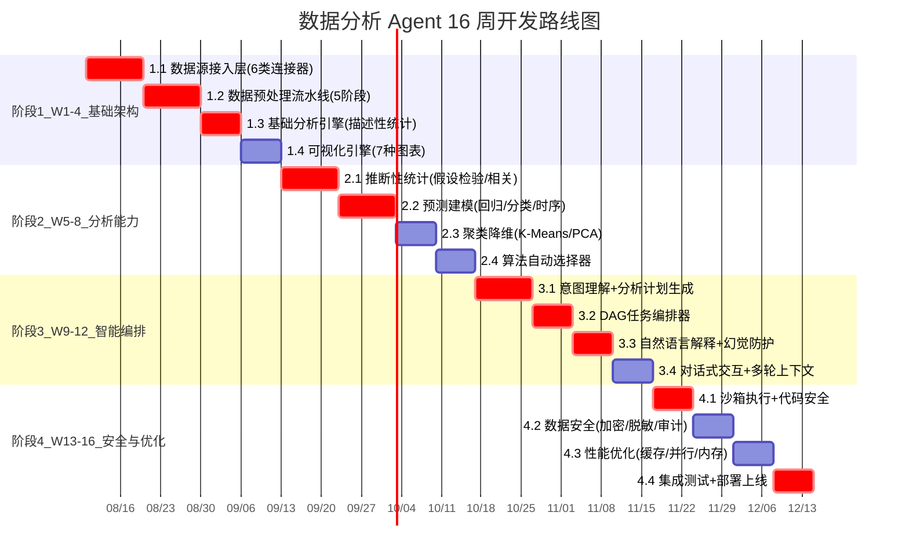

### 13.2 团队配置与职责分工

| 角色 | 人数 | 核心职责 | 关键技能 |
|:-----|:---:|:--------|:--------|
| **架构师** | 1 | 总体架构设计/技术选型/架构评审 | 系统设计/分布式/数据分析 |
| **后端工程师** | 3 | 数据接入/预处理/分析引擎/API | Python/FastAPI/pandas/SQL |
| **算法工程师** | 1 | 统计/ML 算法实现/算法选择 | scikit-learn/statsmodels/Prophet |
| **前端工程师** | 2 | 对话式 UI/交互式可视化 | Vue3/Plotly.js/WebSocket |
| **DevOps** | 1 | Docker/K8s 部署/监控/沙箱 | Docker/K8s/Prometheus |
| **测试工程师** | 1 | 功能/性能/准确性测试 | pytest/Locust/数据验证 |

---

## 十四、测试方案

### 14.1 功能测试：七大模块用例矩阵

| 模块 | 测试用例数 | 核心测试点 | 通过标准 |
|:-----|:--------:|:--------|:--------|
| 数据源接入 | 30 | 6 类数据源连接/连接池/故障转移/增量采集 | 连接成功率 100% |
| 数据预处理 | 40 | 清洗/转换/特征工程/质量评估/回退重试 | 预处理自动化率 ≥80% |
| 分析算法 | 50 | 描述/推断/预测/聚类各算法正确性 | 结果准确率 ≥95% |
| 可视化 | 25 | 7 种图表生成/智能选择/交互(钻取/筛选) | 图表类型正确率 ≥90% |
| 结果解释 | 20 | 统计解读/洞察/建议/幻觉防护 | 解释准确率 ≥90%,幻觉率 ≤5% |
| 安全 | 15 | 沙箱隔离/PII脱敏/鉴权审计 | 安全检查 100% 通过 |
| 对话交互 | 20 | 意图理解/多轮对话/指代解析 | 意图识别准确率 ≥85% |

### 14.2 性能测试：大数据量与并发基准

| 测试场景 | 数据量 | 指标 | 目标 |
|:--------|:------|:-----|:-----|
| 数据加载 | 1GB / 1000万行 | 加载时间 | <10s |
| 数据加载 | 10GB / 1亿行 | 加载时间 | <60s |
| 预处理 | 1GB | 清洗+转换时间 | <15s |
| 描述性统计 | 1亿行 | 计算时间 | <5s |
| 回归分析 | 100万行 × 50列 | 训练时间 | <10s |
| 可视化生成 | 10万行 | 生成时间 | <5s |
| 并发分析 | 50 并发 | 响应时间 P99 | <30s |
| 内存占用 | 5GB 数据 | 峰值内存 | <8GB(优化后) |

### 14.3 分析准确性测试

```python
class AnalysisAccuracyTester:
    """分析准确性测试——用已知答案的数据集验证"""

    # 标准测试数据集(有已知正确答案)
    TEST_DATASETS = {
        "iris": {"expected_clusters": 3, "expected_accuracy": 0.95},
        "boston_housing": {"expected_r2": 0.7, "expected_top_feature": "LSTAT"},
        "sales_monthly": {"expected_trend": "upward", "expected_growth": 0.15},
    }

    def test_regression_accuracy(self):
        """测试回归分析准确性"""
        from sklearn.datasets import load_boston
        data = load_boston()
        df = pd.DataFrame(data.data, columns=data.feature_names)
        df['target'] = data.target

        result = PredictiveModeler().regression(df, target='target', model_type='linear')

        # 验证 R² 达标
        assert result['metrics']['r2'] >= 0.7, f"R²={result['metrics']['r2']} 未达标"
        # 验证重要特征正确
        importance = result['feature_importance']
        top_feature = max(importance, key=importance.get)
        assert top_feature in ('LSTAT', 'RM'), f"Top 特征{top_feature}不符合预期"

    def test_clustering_accuracy(self):
        """测试聚类准确性"""
        from sklearn.datasets import load_iris
        data = load_iris()
        df = pd.DataFrame(data.data, columns=data.feature_names)

        result = ClusteringReducer().cluster(df, method='kmeans')

        # 验证簇数正确
        assert result['n_clusters'] == 3, f"簇数{result['n_clusters']}≠3"
        # 验证轮廓系数达标
        assert result['silhouette_score'] >= 0.5, "轮廓系数过低"

    def test_explanation_no_hallucination(self):
        """测试结果解释无幻觉"""
        analysis_result = {
            "descriptive": {"sales": {"mean": 1000, "std": 200, "distribution": "normal"}},
            "hypothesis_test": {"p_value": 0.001, "alpha": 0.05}
        }
        explanation = "销售均值1000,标准差200,假设检验显著(p=0.001)"

        check = ExplanationFactChecker().check(explanation, analysis_result)
        assert check['passed'], f"幻觉检测未通过: {check['issues']}"
```

---

## 十五、总结与最佳实践

### 15.1 核心设计原则总结

```mermaid
mindmap
  root((数据分析Agent<br/>设计原则))
    P1_数据为王
      多源统一接入
      自动化预处理
      质量门禁把关
    P2_算法智能
      意图驱动选择
      算法能力矩阵
      自动选型策略
    P3_可视先行
      智能图表选择
      交互式探索
      图文协同
    P4_解释可信
      三层解释架构
      洞察自动发现
      幻觉防护核查
    P5_安全内建
      沙箱代码执行
      PII自动脱敏
      全链路审计
    P6_性能可控
      多级缓存
      并行处理
      内存优化
```

### 15.2 最佳实践清单

| 序号 | 最佳实践 | 说明 | 对应章节 |
|:---:|:--------|:-----|:--------|
| 1 | 数据源抽象层屏蔽差异 | 用统一接口适配 6 类数据源,新数据源接入 ≤2 人天 | §3.1 |
| 2 | 预处理流水线自动化 | 探查→清洗→转换→特征→质量五阶段,80% 自动完成 | §4.1 |
| 3 | 算法选择基于意图 | 根据分析意图(描述/比较/预测/聚类)自动匹配算法 | §5.6 |
| 4 | 图表选择基于数据特征 | 根据数值/类别列数、时间维度智能选择图表类型 | §6.1 |
| 5 | 解释三层递进 | 统计解读→洞察发现→建议推荐,逐层深入 | §7.1 |
| 6 | 幻觉防护事实核查 | 解释中的数字/结论必须与统计结果一致 | §7.4 |
| 7 | 沙箱执行 LLM 代码 | Docker 隔离 + 安全扫描 + 资源限制 | §10.2 |
| 8 | PII 自动脱敏 | 分析结果不含身份证/手机/银行卡等敏感信息 | §10.1 |
| 9 | 多级缓存加速 | L1 内存 + L2 Redis + L3 语义缓存 | §11.3 |
| 10 | 对话式多轮交互 | 支持追问/调整/指代解析,上下文连续 | §12.2 |

### 15.3 与 118 号知识库 Agent 的协同

本数据分析 Agent 与 [118 号企业知识库 Agent](./118企业知识库Agent系统完整工程设计方案_架构数据流模型选型接口安全开发计划与测试.md) 可形成协同:

- **知识库 Agent 为数据分析 Agent 提供业务知识**:分析结果解释时,引用知识库中的业务规则和政策文档,增强解释的业务准确性
- **数据分析 Agent 为知识库 Agent 提供数据洞察**:分析发现的数据趋势和异常,可作为知识条目沉淀回知识库
- **共享安全基础设施**:两者共用沙箱执行环境、PII 脱敏、审计日志等安全组件

### 15.4 未来演进方向

| 方向 | 描述 | 预期效果 |
|:-----|:-----|:--------|
| **实时流分析** | 对接 Kafka/Flink,支持实时数据流分析 | 从离线分析到实时洞察 |
| **自动建模** | AutoML 自动特征工程+模型选择+超参调优 | 降低建模门槛 |
| **因果推断** | 集成 DoWhy/EconML 因果推断框架 | 从相关性到因果性 |
| **自然语言数据查询** | Text-to-SQL 直接对话式查询 | 无需预定义分析 |
| **协作分析** | 多人协同分析+评论+分享 | 团队数据协作 |

---

**文档版本**:v1.0(2026-08-08)
**所属系列**:`9AI Agent 工程实践` 专题 #119
**关联文档**:
- [118 企业知识库 Agent 系统完整工程设计方案](./118企业知识库Agent系统完整工程设计方案_架构数据流模型选型接口安全开发计划与测试.md) — 同系列工程实践首篇
- [158 Agent 系统幻觉问题系统性分析与解决方案](../13项目经验/158Agent系统幻觉问题系统性分析与解决方案.md) — 结果解释幻觉防护
- [178 安全可靠的 Agent 沙箱执行环境设计](../14高级%20Agent/178安全可靠的Agent沙箱执行环境设计面试题详解.md) — 代码执行沙箱安全

