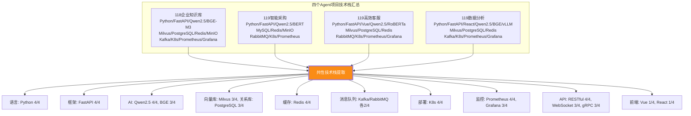
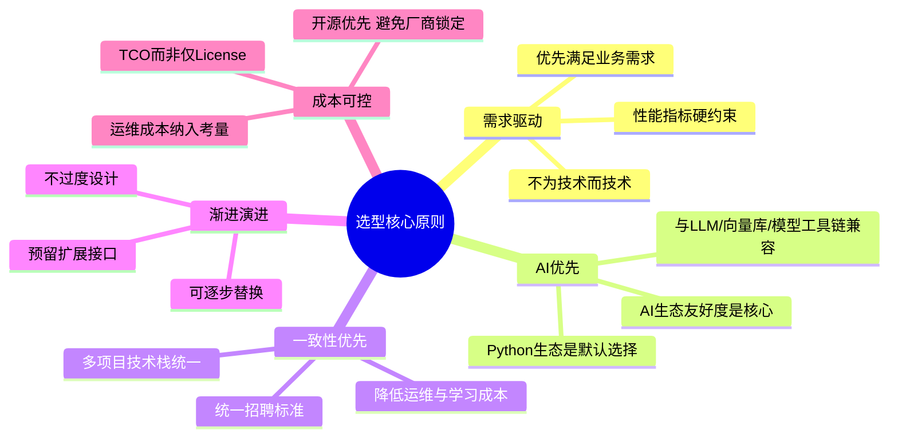
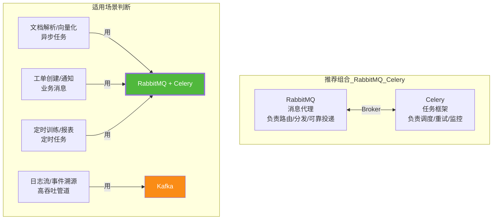
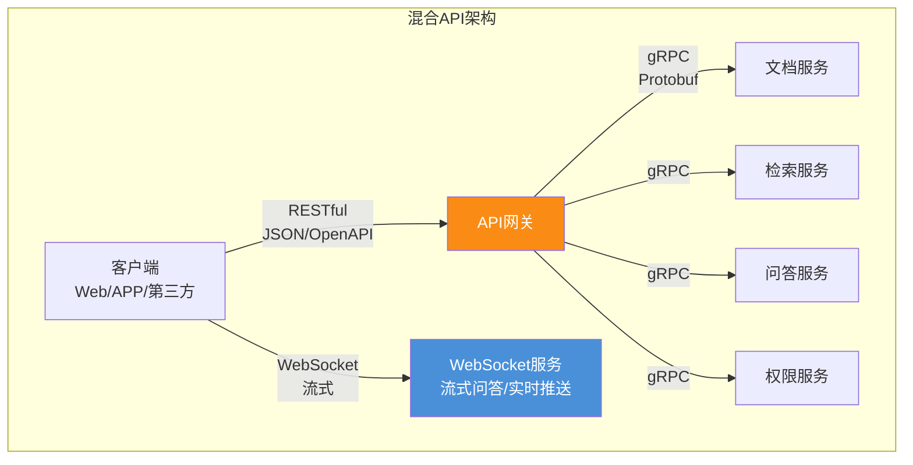
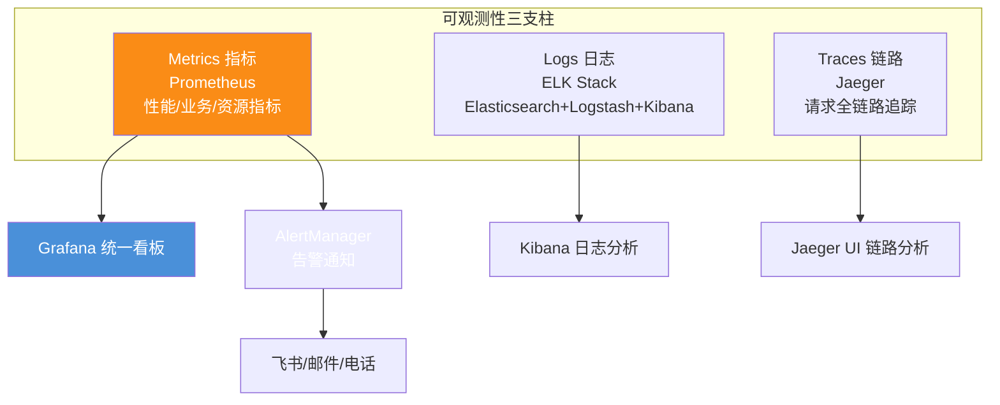
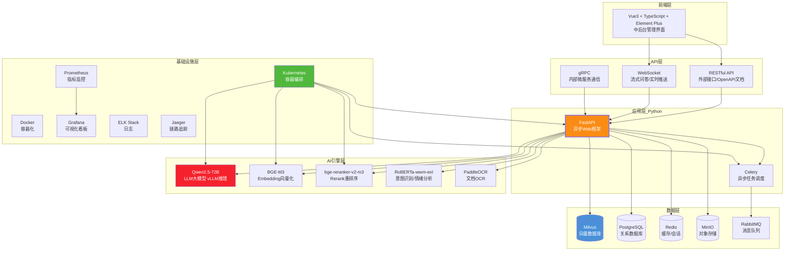
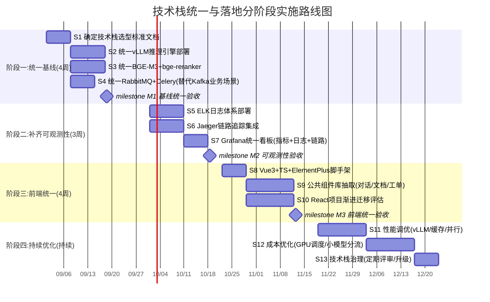
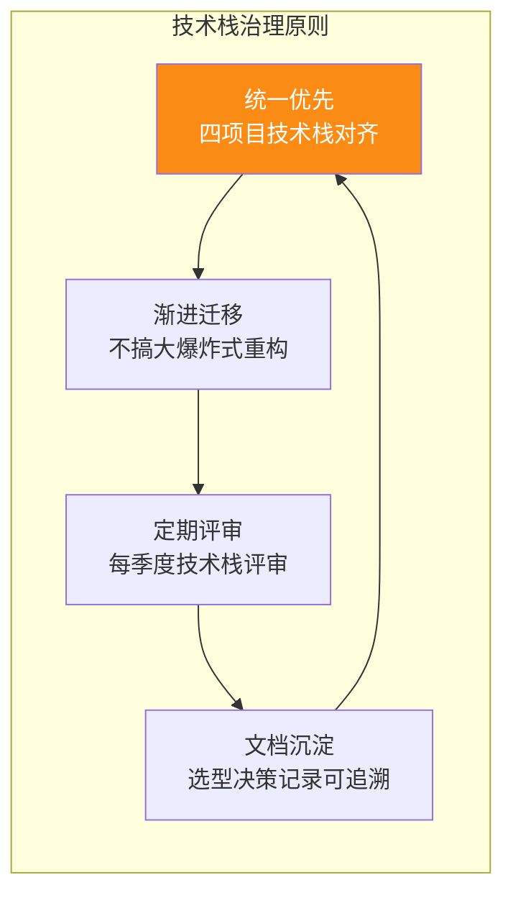

# Agent 项目全面技术选型分析报告：十大核心组件对比评估·推荐技术栈·实施建议

> **文档定位**:本文档是 `9AI Agent 工程实践` 系列的**120号技术选型专题篇**,面向技术负责人、架构师和工程团队。基于本目录 [118企业知识库Agent](./118企业知识库Agent系统完整工程设计方案_架构数据流模型选型接口安全开发计划与测试.md)、[119智能采购Agent](./119智能采购Agent系统完整工程设计方案_需求解析供应商筛选决策引擎流程自动化订单跟踪异常处理接口安全开发计划与测试.md)、[119高效客服Agent](./119高效客服Agent系统完整工程设计方案_意图识别知识检索多轮对话情绪分析工单创建模块化架构监控优化.md)、[119高效数据分析Agent](./119高效数据分析Agent系统完整工程设计方案_多源接入自动化预处理算法集成可视化与自然语言解释.md) 四个项目的实际技术栈使用情况,对**编程语言、开发框架、AI 模型集成、数据库系统、消息队列、API 设计、前端技术、部署环境、监控系统**九大核心技术组件进行系统性选型分析。
>
> 每个组件均提供**多方案对比表**(优缺点/适用场景/决策依据),最终给出**推荐技术栈组合**与**分阶段实施建议**,确保技术选型兼顾项目需求、团队技术栈、性能要求和长期维护。
>
> **选型评估方法论**:本文采用**六维评分法**(开发效率×0.2 + 性能×0.2 + 生态成熟度×0.15 + AI 友好度×0.15 + 运维成本×0.15 + 团队匹配度×0.15)对每个候选方案量化打分,总分 10 分。

---

## 目录

- [一、技术选型概述与评估方法论](#一技术选型概述与评估方法论)
  - [1.1 现有项目技术栈盘点](#11-现有项目技术栈盘点)
  - [1.2 选型评估六维模型](#12-选型评估六维模型)
  - [1.3 选型核心原则](#13-选型核心原则)
- [二、编程语言选型：Python vs Java vs Go](#二编程语言选型python-vs-java-vs-go)
  - [2.1 候选方案对比](#21-候选方案对比)
  - [2.2 决策依据与推荐](#22-决策依据与推荐)
- [三、开发框架选型：FastAPI vs Flask vs Django vs Spring Boot](#三开发框架选型fastapi-vs-flask-vs-django-vs-spring-boot)
  - [3.1 候选方案对比](#31-候选方案对比)
  - [3.2 决策依据与推荐](#32-决策依据与推荐)
- [四、AI 模型集成方案选型](#四ai-模型集成方案选型)
  - [4.1 LLM 大模型选型](#41-llm-大模型选型)
  - [4.2 Embedding 模型选型](#42-embedding-模型选型)
  - [4.3 Rerank 模型选型](#43-rerank-模型选型)
  - [4.4 LLM 推理引擎选型](#44-llm-推理引擎选型)
  - [4.5 NLU 专项模型选型](#45-nlu-专项模型选型)
- [五、数据库系统选型](#五数据库系统选型)
  - [5.1 向量数据库选型：Milvus vs FAISS vs Qdrant vs pgvector](#51-向量数据库选型milvus-vs-faiss-vs-qdrant-vs-pgvector)
  - [5.2 关系型数据库选型：PostgreSQL vs MySQL](#52-关系型数据库选型postgresql-vs-mysql)
  - [5.3 缓存选型：Redis vs Memcached](#53-缓存选型redis-vs-memcached)
  - [5.4 对象存储选型：MinIO vs 云 OSS](#54-对象存储选型minio-vs-云-oss)
- [六、消息队列选型：Kafka vs RabbitMQ vs Celery](#六消息队列选型kafka-vs-rabbitmq-vs-celery)
  - [6.1 候选方案对比](#61-候选方案对比)
  - [6.2 决策依据与推荐](#62-决策依据与推荐)
- [七、API 设计规范选型：REST vs gRPC vs GraphQL vs WebSocket](#七api-设计规范选型rest-vs-grpc-vs-graphql-vs-websocket)
  - [7.1 候选方案对比](#71-候选方案对比)
  - [7.2 混合 API 策略推荐](#72-混合-api-策略推荐)
- [八、前端技术选型：Vue3 vs React](#八前端技术选型vue3-vs-react)
  - [8.1 候选方案对比](#81-候选方案对比)
  - [8.2 决策依据与推荐](#82-决策依据与推荐)
- [九、部署环境选型：Kubernetes vs Docker Swarm vs 裸机](#九部署环境选型kubernetes-vs-docker-swarm-vs-裸机)
  - [9.1 候选方案对比](#91-候选方案对比)
  - [9.2 决策依据与推荐](#92-决策依据与推荐)
- [十、监控系统选型：Prometheus + Grafana vs 其他方案](#十监控系统选型prometheus--grafana-vs-其他方案)
  - [10.1 候选方案对比](#101-候选方案对比)
  - [10.2 推荐监控体系](#102-推荐监控体系)
- [十一、推荐技术栈组合与实施建议](#十一推荐技术栈组合与实施建议)
  - [11.1 推荐技术栈全景图](#111-推荐技术栈全景图)
  - [11.2 技术栈选型决策一览表](#112-技术栈选型决策一览表)
  - [11.3 分阶段实施建议](#113-分阶段实施建议)
  - [11.4 技术债务预警与规避](#114-技术债务预警与规避)

---

## 一、技术选型概述与评估方法论

### 1.1 现有项目技术栈盘点

**盘点结论**:四个项目已形成高度一致的技术栈共识——Python + FastAPI + Qwen2.5 + Redis + K8s + Prometheus 是 4/4 共识;Milvus + PostgreSQL 是 3/4 共识;主要分歧点在**消息队列(Kafka vs RabbitMQ)**和**前端(Vue vs React)**,本文将重点分析这两处分歧。

### 1.2 选型评估六维模型

| 评估维度 | 权重 | 评分标准(0~10分) | 核心问题 |
|---------|:---:|---------------|---------|
| **开发效率** | 20% | 代码简洁度/开发速度/社区资源 | "能不能快速开发?" |
| **性能** | 20% | 延迟/吞吐/资源占用 | "跑得快不快?" |
| **生态成熟度** | 15% | 社区活跃度/文档完善/第三方集成 | "踩坑有人填吗?" |
| **AI 友好度** | 15% | 与 AI/ML 生态的兼容性 | "跟 AI 工具链配不配?" |
| **运维成本** | 15% | 部署难度/监控/故障排查 | "好不好运维?" |
| **团队匹配度** | 15% | 团队已有技能/学习曲线 | "团队会不会用?" |

### 1.3 选型核心原则

---

## 二、编程语言选型：Python vs Java vs Go

### 2.1 候选方案对比

| 对比维度 | **Python** ✨ 推荐 | Java | Go |
|---------|:-----------:|:----:|:--:|
| **AI/ML 生态** | ⭐⭐⭐⭐⭐ 绝对优势 | ⭐⭐⭐ DL4J/可用但弱 | ⭐⭐ 几乎无原生AI生态 |
| **开发效率** | ⭐⭐⭐⭐⭐ 简洁快速 | ⭐⭐⭐ 繁文缛节多 | ⭐⭐⭐⭐ 简洁但显式 |
| **运行性能** | ⭐⭐ 解释执行较慢 | ⭐⭐⭐⭐ JIT 优秀 | ⭐⭐⭐⭐⭐ 编译型最快 |
| **并发能力** | ⭐⭐⭐ asyncio 异步 | ⭐⭐⭐⭐ 线程模型成熟 | ⭐⭐⭐⭐⭐ Goroutine 最强 |
| **类型安全** | ⭐⭐⭐ 类型提示可选 | ⭐⭐⭐⭐⭐ 强类型 | ⭐⭐⭐⭐⭐ 强类型 |
| **运维部署** | ⭐⭐⭐ 依赖管理弱 | ⭐⭐⭐⭐ JVM 成熟 | ⭐⭐⭐⭐⭐ 单二进制 |
| **团队匹配** | ⭐⭐⭐⭐⭐ AI团队默认 | ⭐⭐⭐⭐ 企业后端常见 | ⭐⭐⭐ 需学习 |
| **向量库/AI 库兼容** | PyTorch/Transformers/LangChain 原生 | 需 JNI/REST 桥接 | 需 CGO/REST 桥接 |
| **六维加权总分** | **9.0** | 7.2 | 6.8 |
| **适用场景** | AI 应用层/数据处理/模型集成 | 企业核心事务/高并发后端 | 基础设施/网关/微服务 |

### 2.2 决策依据与推荐

> **推荐:Python(主语言) + Go(辅助,用于网关/基础设施)**

**决策理由**:
1. **AI 生态绝对优势**:Agent 系统的核心是 LLM/Embedding/Rerank 集成,Python 拥有 PyTorch、Transformers、LangChain、LlamaIndex 等全套 AI 工具链,Java/Go 需通过 REST/gRPC 桥接,开发效率差 3~5 倍
2. **四项目已统一**:现有 118/119 四个项目全部使用 Python,保持一致性是第一原则
3. **性能瓶颈可解**:Python 计算密集型瓶颈通过 GPU 推理(PyTorch/vLLM)解决,IO 密集型通过 asyncio 异步解决,核心路径性能不受限
4. **Go 用于网关层**:API 网关(Kong/APISIX)、服务网格等基础设施层可用 Go,享受编译型性能优势,但业务逻辑层统一 Python

**不推荐 Java 的原因**:虽然 Java 在企业级后端成熟,但 AI 生态薄弱,与 Python 工具链割裂会导致"两套语言两个团队",增加协作成本。Agent 项目核心在 AI 层,应以 AI 生态为先。

**不推荐 Go 全栈的原因**:Go 的 AI 生态几乎为零,Embedding/LLM/Rerank 集成全部需 REST 桥接,丧失 Python 的快速迭代能力。

---

## 三、开发框架选型：FastAPI vs Flask vs Django vs Spring Boot

### 3.1 候选方案对比

| 对比维度 | **FastAPI** ✨ 推荐 | Flask | Django | Spring Boot(Java) |
|---------|:---------------:|:-----:|:------:|:----------------:|
| **异步支持** | ⭐⭐⭐⭐⭐ 原生 asyncio | ⭐⭐ 需 async 扩展 | ⭐⭐⭐ 逐步支持 | ⭐⭐⭐⭐ WebFlux |
| **性能** | ⭐⭐⭐⭐⭐ 接近 Go | ⭐⭐⭐ 同步为主 | ⭐⭐⭐ 重量级 | ⭐⭐⭐⭐ 优秀 |
| **类型提示** | ⭐⭐⭐⭐⭐ Pydantic 原生 | ⭐⭐ 手动 | ⭐⭐⭐ 部分 | ⭐⭐⭐⭐⭐ 强类型 |
| **API 文档** | ⭐⭐⭐⭐⭐ 自动 OpenAPI | ⭐⭐ 需 Swagger 插件 | ⭐⭐⭐ 需 DRF | ⭐⭐⭐⭐ Springdoc |
| **AI 集成** | ⭐⭐⭐⭐⭐ 异步+Pydantic | ⭐⭐⭐⭐ 可用但同步 | ⭐⭐⭐ 过重 | ⭐⭐ 需桥接 |
| **WebSocket** | ⭐⭐⭐⭐⭐ 原生支持 | ⭐⭐⭐ Flask-SocketIO | ⭐⭐⭐ Channels | ⭐⭐⭐⭐ 原生 |
| **学习曲线** | ⭐⭐⭐⭐⭐ 极低 | ⭐⭐⭐⭐⭐ 极低 | ⭐⭐⭐ 中等 | ⭐⭐⭐ 陡峭 |
| **轻量程度** | ⭐⭐⭐⭐⭐ 微框架 | ⭐⭐⭐⭐⭐ 微框架 | ⭐⭐ 重量级全家桶 | ⭐⭐ 重量级 |
| **生态插件** | ⭐⭐⭐⭐ 快速增长 | ⭐⭐⭐⭐⭐ 最丰富 | ⭐⭐⭐⭐⭐ 全家桶 | ⭐⭐⭐⭐⭐ 企业级 |
| **六维加权总分** | **9.2** | 7.8 | 7.0 | 7.5 |
| **适用场景** | AI API/异步服务/流式 | 简单 API/原型 | CMS/全栈 Web | 企业级 Java 团队 |

### 3.2 决策依据与推荐

> **推荐:FastAPI**

**决策理由**:
1. **异步原生**:Agent 系统大量 IO 操作(LLM 调用/向量检索/数据库),asyncio 原生支持使并发性能接近 Go,Flask 同步模型会成为瓶颈
2. **Pydantic 类型安全**:请求/响应自动校验 + 序列化,减少手写校验代码 50%+,AI 应用的数据结构复杂(JSON/嵌套),类型安全至关重要
3. **自动 OpenAPI 文档**:FastAPI 自动生成 Swagger/ReDoc 文档,四项目中 RESTful API 端点众多,自动文档省去大量维护成本
4. **WebSocket 原生**:流式问答(SSE/WebSocket)是 Agent 系统核心需求,FastAPI 原生支持无需额外插件
5. **四项目已统一**:118/119 四项目全部使用 FastAPI,保持一致

**不推荐 Flask**:虽然生态最丰富,但同步模型在高并发 LLM 调用场景下会成为瓶颈,且缺乏原生类型校验和自动文档。

**不推荐 Django**:全家桶过重,Agent 系统不需要 Django 的 ORM/Admin/Template,引入反而增加复杂度。

---

## 四、AI 模型集成方案选型

### 4.1 LLM 大模型选型

| 对比维度 | **Qwen2.5-72B** ✨ 推荐 | DeepSeek-V3 | GPT-4o | Claude 3.5 | Llama 3.1-70B |
|---------|:-----------------:|:----------:|:------:|:----------:|:------------:|
| **中文能力** | ⭐⭐⭐⭐⭐ 最强 | ⭐⭐⭐⭐⭐ 最强 | ⭐⭐⭐⭐ | ⭐⭐⭐⭐ | ⭐⭐⭐ |
| **部署方式** | 本地(vLLM) | API/本地 | 仅 API | 仅 API | 本地(vLLM) |
| **数据合规** | ⭐⭐⭐⭐⭐ 数据不出企业 | ⭐⭐⭐⭐ 国内API | ⭐⭐ 数据出境 | ⭐⭐ 数据出境 | ⭐⭐⭐⭐⭐ 本地 |
| **上下文长度** | 128K | 128K | 128K | 200K | 128K |
| **推理成本** | 中(GPU自建) | 低(API极便宜) | 高 | 高 | 中 |
| **工具调用** | ⭐⭐⭐⭐⭐ 原生Function | ⭐⭐⭐⭐⭐ | ⭐⭐⭐⭐⭐ | ⭐⭐⭐⭐⭐ | ⭐⭐⭐⭐ |
| **开源免费** | ✅ | ✅(API低价) | ❌ | ❌ | ✅ |
| **推荐场景** | 企业首选(数据敏感) | 成本敏感/API | 效果优先(非敏感) | 长文本/推理 | 英文场景 |

**推荐策略**:主用 **Qwen2.5-72B 本地部署**(vLLM 推理),数据不出企业;非敏感轻量任务可用 DeepSeek-V3 API 分流降本。四项目已统一 Qwen2.5。

### 4.2 Embedding 模型选型

| 模型 | 维度 | 最大长度 | 中文能力 | 检索类型 | 推荐 |
|-----|:----:|:------:|:------:|:------:|:---:|
| **BGE-M3** ✨ | 1024 | 8192 | ⭐⭐⭐⭐⭐ | 稠密+稀疏+多向量 | ⭐⭐⭐⭐⭐ |
| BGE-Large-zh | 1024 | 512 | ⭐⭐⭐⭐⭐ | 稠密 | ⭐⭐⭐⭐ |
| text-embedding-3 | 3072 | 8191 | ⭐⭐⭐⭐ | 稠密 | ⭐⭐⭐ |
| m3e-base | 768 | 512 | ⭐⭐⭐⭐ | 稠密 | ⭐⭐⭐ |

**推荐:BGE-M3**——中文最强,支持长文本(8192),一模型三用(稠密+稀疏+多向量),开源本地部署。四项目中 3/4 已采用。

### 4.3 Rerank 模型选型

| 模型 | 中文能力 | 推理速度 | 推荐度 |
|-----|:------:|:------:|:----:|
| **bge-reranker-v2-m3** ✨ | ⭐⭐⭐⭐⭐ | 中 | ⭐⭐⭐⭐⭐ |
| bge-reranker-large | ⭐⭐⭐⭐ | 快 | ⭐⭐⭐⭐ |
| Cohere Rerank(API) | ⭐⭐⭐⭐ | 快 | ⭐⭐⭐ |

**推荐:bge-reranker-v2-m3**——与 BGE-M3 同系列,中文精排最优,Cross-Encoder 架构精度最高。

### 4.4 LLM 推理引擎选型

| 引擎 | 性能 | 易用性 | 模型支持 | 流式输出 | 推荐 |
|-----|:---:|:----:|:------:|:------:|:---:|
| **vLLM** ✨ | ⭐⭐⭐⭐⭐ 最高(PagedAttention) | ⭐⭐⭐⭐ | ⭐⭐⭐⭐⭐ 主流模型 | ✅ | ⭐⭐⭐⭐⭐ |
| TGI(HuggingFace) | ⭐⭐⭐⭐ 高 | ⭐⭐⭐⭐ | ⭐⭐⭐⭐ | ✅ | ⭐⭐⭐⭐ |
| Ollama | ⭐⭐⭐ 中 | ⭐⭐⭐⭐⭐ 极简 | ⭐⭐⭐ | ✅ | ⭐⭐⭐(原型) |
| Triton(TensorRT-LLM) | ⭐⭐⭐⭐⭐ 最高 | ⭐⭐ 复杂 | ⭐⭐⭐ 需转换 | ✅ | ⭐⭐⭐(极致性能) |

**推荐:vLLM**——PagedAttention 技术使吞吐量达 HuggingFace 原生的 2~4 倍,KV Cache 共享降低显存占用,OpenAI 兼容 API 开箱即用,支持流式输出。四项目中数据分析 Agent 已采用。

### 4.5 NLU 专项模型选型

| 任务 | 推荐模型 | 架构 | 中文能力 | 延迟 |
|-----|---------|:---:|:------:|:---:|
| **意图分类** | RoBERTa-wwm-ext-large | BERT | ⭐⭐⭐⭐⭐ | ~30ms |
| **实体抽取(NER)** | BERT-NER / UIE | BERT | ⭐⭐⭐⭐⭐ | ~20ms |
| **情绪分析** | RoBERTa-sentiment | BERT | ⭐⭐⭐⭐⭐ | ~30ms |
| **OCR** | PaddleOCR | PP-OCR | ⭐⭐⭐⭐⭐ | ~200ms |
| **语音识别(ASR)** | Paraformer / Whisper | Transformer | ⭐⭐⭐⭐⭐ | 实时 |

**推荐**:NLU 专项任务统一使用 **RoBERTa-wwm-ext-large** 系列(意图/情绪/NER),OCR 用 **PaddleOCR**,与 LLM(Qwen)形成"小模型快通道 + 大模型深理解"的分级架构。客服 Agent 已采用此方案。

---

## 五、数据库系统选型

### 5.1 向量数据库选型：Milvus vs FAISS vs Qdrant vs pgvector

| 对比维度 | **Milvus** ✨ 推荐 | FAISS | Qdrant | pgvector |
|---------|:-----------:|:-----:|:------:|:--------:|
| **分布式** | ✅ 原生分布式 | ❌ 单机库 | ✅ | ❌(PG扩展) |
| **规模** | 十亿级 | 十亿级 | 亿级 | 百万级 |
| **元数据过滤** | ✅ 强(标量字段) | ❌ 无 | ✅ | ✅(SQL WHERE) |
| **动态增删改** | ✅ | ❌ 需重建 | ✅ | ✅ |
| **权限过滤** | ✅ 元数据过滤 | ❌ | ✅ | ✅ |
| **分区机制** | ✅ Partition | ❌ | ✅ Collection | ❌ |
| **索引类型** | HNSW/IVF/DiskANN | IVF/HNSW/PQ | HNSW | HNSW/IVFFlat |
| **运维复杂度** | 中(集群) | 低(库) | 低 | 低(PG内) |
| **生态** | ⭐⭐⭐⭐⭐ | ⭐⭐⭐⭐⭐ | ⭐⭐⭐ | ⭐⭐⭐⭐(PG生态) |
| **六维加权总分** | **8.8** | 6.5 | 7.8 | 7.5 |
| **适用场景** | 企业级大规模+权限过滤 | 纯检索无元数据 | 中小规模 | 已有PG+小规模 |

**推荐:Milvus**——企业级 Agent 系统需要权限过滤(Milvus 标量字段过滤)、分区(按部门/租户)、动态增删改(知识更新)、十亿级规模,Milvus 是唯一全面满足的方案。四项目中 3/4 已采用。

**pgvector 适用场景**:已有 PostgreSQL 且向量规模 <100 万的小型项目,可复用 PG 运维能力,无需引入新组件。

### 5.2 关系型数据库选型：PostgreSQL vs MySQL

| 对比维度 | **PostgreSQL** ✨ 推荐 | MySQL |
|---------|:---------------:|:-----:|
| **JSON 支持** | ⭐⭐⭐⭐⭐ JSONB 原生强 | ⭐⭐⭐ JSON 类型 |
| **全文检索** | ⭐⭐⭐⭐⭐ 内置 tsvector | ⭐⭐⭐ FULLTEXT(中文弱) |
| **向量扩展** | ✅ pgvector | ❌ 需第三方 |
| **复杂查询** | ⭐⭐⭐⭐⭐ 窗口函数/CTE/物化视图 | ⭐⭐⭐⭐ |
| **数据类型** | ⭐⭐⭐⭐⭐ 丰富(数组/范围/几何) | ⭐⭐⭐ |
| **扩展生态** | ⭐⭐⭐⭐⭐ 插件丰富 | ⭐⭐⭐⭐ |
| **运维成熟度** | ⭐⭐⭐⭐ | ⭐⭐⭐⭐⭐ |
| **六维加权总分** | **8.5** | 7.8 |
| **适用场景** | Agent元数据/JSON/全文检索/向量 | 简单CRUD/团队熟悉 |

**推荐:PostgreSQL**——Agent 系统的元数据(文档/切片/权限/日志)包含大量 JSON 字段,BM25 全文检索(与向量检索互补),且 pgvector 可作为小规模向量库的备选。JSONB + GIN 索引对半结构化数据查询效率远超 MySQL。四项目中 3/4 已采用。

### 5.3 缓存选型：Redis vs Memcached

| 对比维度 | **Redis** ✨ 推荐 | Memcached |
|---------|:-----------:|:---------:|
| **数据结构** | String/List/Hash/Set/ZSet/Stream | 仅 String |
| **持久化** | ✅ RDB+AOF | ❌ 纯内存 |
| **Pub/Sub** | ✅ | ❌ |
| **Lua 脚本** | ✅ 原子操作 | ❌ |
| **集群** | ✅ Redis Cluster | ✅ 一致性哈希 |
| **适用场景** | 会话/缓存/排行榜/限流 | 纯 KV 缓存 |

**推荐:Redis**——Agent 系统需要会话管理(List 存对话历史)、限流(计数器)、FAQ缓存(String)、分布式锁,Redis 的丰富数据结构不可或缺。四项目已全部采用。

### 5.4 对象存储选型：MinIO vs 云 OSS

| 对比维度 | **MinIO** ✨ 推荐 | 阿里云 OSS / AWS S3 |
|---------|:-----------:|:-----------------:|
| **部署方式** | 自建(数据不出企业) | 云服务 |
| **S3 兼容** | ✅ 完全兼容 | ✅ 原生 |
| **数据合规** | ⭐⭐⭐⭐⭐ 本地 | ⭐⭐⭐ 看云厂商 |
| **成本** | 硬件一次性+低运维 | 按量计费(量大后贵) |
| **运维** | 需自运维 | 免运维 |
| **适用场景** | 企业数据敏感 | 创业期/快速上线 |

**推荐:MinIO**(企业自建)——Agent 系统存储原始文档/图片/附件,企业数据合规要求高,MinIO 自建+ S3 兼容 API 是最佳选择。云上部署可用 OSS/S3。

---

## 六、消息队列选型：Kafka vs RabbitMQ vs Celery

> **这是四项目主要分歧点之一**(118/119数据分析用 Kafka,119客服/采购用 RabbitMQ),需重点分析。

### 6.1 候选方案对比

| 对比维度 | **Kafka** | **RabbitMQ** ✨ 推荐 | Celery |
|---------|:--------:|:----------------:|:------:|
| **定位** | 分布式流处理平台 | 消息代理(Broker) | 任务队列(基于Broker) |
| **吞吐量** | ⭐⭐⭐⭐⭐ 百万/秒 | ⭐⭐⭐⭐ 万/秒 | ⭐⭐⭐(取决于Broker) |
| **延迟** | ⭐⭐⭐ 批量优化→较高 | ⭐⭐⭐⭐⭐ 毫秒级 | ⭐⭐⭐⭐ |
| **消息顺序** | ✅ Partition 内有序 | ✅ 队列内有序 | ❌ 不保证 |
| **消息可靠性** | ⭐⭐⭐⭐ 高(副本) | ⭐⭐⭐⭐⭐ 极高(ACK+持久化) | ⭐⭐⭐⭐(取决于Broker) |
| **路由灵活性** | ⭐⭐⭐ Topic 分区 | ⭐⭐⭐⭐⭐ Exchange 四种模式 | ⭐⭐⭐⭐ 路由键 |
| **任务调度** | ❌ 需额外组件 | ❌ 需额外调度器 | ✅ 原生(crontab/beat) |
| **Python 集成** | ⭐⭐⭐⭐ aiokafka | ⭐⭐⭐⭐⭐ pika/aio-pika | ⭐⭐⭐⭐⭐ 原生 |
| **运维复杂度** | ⭐⭐ 高(Zookeeper/KRaft) | ⭐⭐⭐⭐ 中(开箱即用) | ⭐⭐⭐⭐ 低(依赖Broker) |
| **适用场景** | 日志流/事件溯源/大数据管道 | 业务消息/任务分发/RPC | Python 异步任务/定时任务 |
| **六维加权总分** | 7.5 | **8.5** | 7.8 |

### 6.2 决策依据与推荐

> **推荐:RabbitMQ(消息代理) + Celery(任务调度)** 组合;仅大数据流式管道场景用 Kafka

**决策理由**:

1. **Agent 系统的核心需求是"任务分发"而非"流处理"**:文档解析、向量化、工单创建等都是异步任务,RabbitMQ 的 Exchange 路由模型(topic/direct/fanout)完美匹配,Celery 提供重试/超时/监控等任务管理能力
2. **消息可靠性更优**:RabbitMQ 的 ACK 机制 + 持久化 + 死信队列确保任务不丢失,Agent 系统的文档解析任务一旦丢失需重新上传,可靠性要求高
3. **运维更简单**:RabbitMQ 开箱即用(Erlang 进程管理),Kafka 需维护 Zookeeper/KRaft + 副本同步,运维复杂度高 2~3 倍
4. **Python 生态最佳**:Celery 是 Python 异步任务的事实标准,与 FastAPI 深度集成,RabbitMQ 是 Celery 最成熟的 Broker

**Kafka 的适用场景**:仅当需要日志流处理、事件溯源、实时数据管道(如数据分析 Agent 的大数据管道)时使用 Kafka。四项目中数据分析 Agent 用 Kafka 是合理的(多源数据流式接入),但其他三个项目用 RabbitMQ 更合适。

**统一建议**:业务任务队列统一 RabbitMQ + Celery;数据分析场景的大数据管道保留 Kafka。

---

## 七、API 设计规范选型：REST vs gRPC vs GraphQL vs WebSocket

### 7.1 候选方案对比

| 对比维度 | RESTful | gRPC | GraphQL | WebSocket |
|---------|:-------:|:----:|:-------:|:---------:|
| **通信模式** | 请求-响应 | 请求-响应/流 | 请求-响应 | 双向实时 |
| **数据格式** | JSON | Protobuf(二进制) | JSON | JSON/文本 |
| **性能** | ⭐⭐⭐ JSON解析慢 | ⭐⭐⭐⭐⭐ Protobuf极快 | ⭐⭐⭐ | ⭐⭐⭐⭐ 持久连接 |
| **浏览器支持** | ✅ 原生 | ❌ 需 gRPC-Web | ✅ 原生 | ✅ 原生 |
| **流式支持** | ❌(SSE可模拟) | ✅ 双向流 | ❌ | ✅ 双向流 |
| **类型安全** | ⭐⭐⭐ OpenAPI | ⭐⭐⭐⭐⭐ Proto | ⭐⭐⭐⭐ Schema | ⭐⭐ |
| **适用场景** | CRUD/外部API | 微服务间通信 | 灵活查询 | 实时双向/流式输出 |

### 7.2 混合 API 策略推荐

> **推荐:RESTful(外部 API) + gRPC(内部微服务) + WebSocket(流式问答) 混合架构**

| 场景 | API 类型 | 理由 |
|-----|---------|------|
| **外部 API(客户端/第三方)** | RESTful | 浏览器原生支持、OpenAPI 自动文档、通用性最强 |
| **内部微服务间通信** | gRPC | Protobuf 二进制序列化快 5~10 倍、强类型、双向流 |
| **流式问答/实时推送** | WebSocket | LLM 流式输出需持久连接、双向通信 |
| **文件上传** | RESTful multipart | 标准 HTTP 文件上传、CDN 兼容 |

**四项目已采用**:RESTful(4/4) + WebSocket(3/4) + gRPC(3/4) 的混合策略已验证可行,本文正式确认为推荐标准。

---

## 八、前端技术选型：Vue3 vs React

> **这是四项目另一分歧点**(客服 Agent 用 Vue,数据分析 Agent 用 React)。

### 8.1 候选方案对比

| 对比维度 | **Vue3** ✨ 推荐 | React |
|---------|:-----------:|:-----:|
| **学习曲线** | ⭐⭐⭐⭐⭐ 极低(模板直观) | ⭐⭐⭐ 中等(JSX/Hooks) |
| **中文生态** | ⭐⭐⭐⭐⭐ 尤雨溪/中文社区强 | ⭐⭐⭐⭐ 英文为主 |
| **开发效率** | ⭐⭐⭐⭐⭐ SFC 单文件组件 | ⭐⭐⭐⭐ Hooks 灵活 |
| **性能** | ⭐⭐⭐⭐⭐ Proxy 响应式 | ⭐⭐⭐⭐ Fiber 调度 |
| **TypeScript** | ⭐⭐⭐⭐ 原生支持 | ⭐⭐⭐⭐⭐ 最强(TS 原生) |
| **生态规模** | ⭐⭐⭐⭐ | ⭐⭐⭐⭐⭐ 最大 |
| **企业采用** | ⭐⭐⭐⭐ 国内企业多 | ⭐⭐⭐⭐⭐ 全球主流 |
| **UI 组件库** | Element Plus/Ant Design Vue | Ant Design/Material UI |
| **适用场景** | 中后台管理/国内企业 | 复杂交互/国际化/大团队 |

### 8.2 决策依据与推荐

> **推荐:Vue3(国内企业默认) + TypeScript + Element Plus**

**决策理由**:
1. **国内团队匹配**:Vue3 在国内企业采用率更高(尤雨溪中文社区),团队招聘和学习成本更低
2. **中后台开发效率**:Agent 系统前端以中后台管理界面为主(知识库管理/客服工作台/工单管理),Vue3 的 SFC + Element Plus 是中后台最佳组合
3. **学习曲线低**:Vue3 模板语法直观,后端工程师也能快速上手(全栈开发友好),React 的 JSX + Hooks 模式对纯后端团队学习成本高
4. **性能优秀**:Vue3 的 Proxy 响应式 + 编译优化,中后台场景性能足够

**React 适用场景**:如果团队已有 React 经验,或项目需要复杂的前端交互(如数据分析 Agent 的复杂可视化),React + Ant Design 也是合理选择。**关键是团队内统一,不要同时混用**。

**统一建议**:新建项目默认 Vue3 + TypeScript + Element Plus;已有 React 项目保持 React 不迁移。

---

## 九、部署环境选型：Kubernetes vs Docker Swarm vs 裸机

### 9.1 候选方案对比

| 对比维度 | **Kubernetes** ✨ 推荐 | Docker Swarm | 裸机/Docker Compose |
|---------|:---------------:|:-----------:|:-----------------:|
| **容器编排** | ⭐⭐⭐⭐⭐ 最强 | ⭐⭐⭐ 基础 | ⭐⭐ 无 |
| **自动扩缩容** | ✅ HPA/VPA | ✅(基础) | ❌ |
| **服务发现** | ✅ 内置 DNS | ✅ 内置 | ❌ 需手动 |
| **滚动更新** | ✅ 原生 | ✅ | ❌ |
| **GPU 调度** | ✅ Device Plugin | ❌ | ⭐⭐ 手动 |
| **多集群管理** | ✅ Federation | ❌ | ❌ |
| **运维复杂度** | ⭐⭐ 高(需学习) | ⭐⭐⭐⭐ 低 | ⭐⭐⭐⭐⭐ 最低 |
| **生态** | ⭐⭐⭐⭐⭐ 最丰富 | ⭐⭐⭐ | ⭐⭐ |
| **适用场景** | 生产级/多服务/GPU | 小规模/简单 | 单机/原型 |

### 9.2 决策依据与推荐

> **推荐:Kubernetes(生产环境) + Docker Compose(开发环境)**

**决策理由**:
1. **GPU 调度**:Agent 系统需要 GPU(LLM/Embedding/Rerank),K8s 的 Device Plugin 是唯一能自动调度 GPU 的容器编排工具
2. **多服务编排**:Agent 系统包含 10+ 微服务(网关/应用/引擎/数据库),K8s 的 Service/Ingress/ConfigMap/Secret 提供完整管理能力
3. **弹性扩缩容**:Agent 系统有明显的流量高峰(客服高峰期/文档批量导入),K8s HPA 可根据 CPU/GPU/自定义指标自动扩缩
4. **四项目已统一**:118/119 四个项目全部使用 K8s

**开发环境用 Docker Compose**:本地开发用 docker-compose.yml 一键启动全部依赖(数据库/Redis/Milvus),降低开发环境搭建成本。

---

## 十、监控系统选型：Prometheus + Grafana vs 其他方案

### 10.1 候选方案对比

| 对比维度 | **Prometheus + Grafana** ✨ | Datadog | Zabbix | OpenTelemetry |
|---------|:-------------------:|:------:|:------:|:-------------:|
| **部署方式** | 开源自建 | SaaS 云服务 | 开源自建 | 开源标准(需后端) |
| **指标采集** | Pull 模型 | Agent Push | Agent Push | 统一标准 |
| **时序数据库** | 内置 TSDB | 云端 | MySQL/PG | 可选(Prom/Jaeger) |
| **告警** | AlertManager | 内置 | 内置 | 需配后端 |
| **可视化** | Grafana(最强) | 内置 | 内置(弱) | 需配 Grafana |
| **K8s 集成** | ⭐⭐⭐⭐⭐ 原生 | ⭐⭐⭐⭐⭐ | ⭐⭐⭐ | ⭐⭐⭐⭐ |
| **成本** | 免费(自运维) | 按量(贵) | 免费 | 免费 |
| **适用场景** | 云原生/K8s | 企业级SaaS | 传统IT | 统一可观测性 |

### 10.2 推荐监控体系

> **推荐:Prometheus(指标) + Grafana(看板) + ELK(日志) + Jaeger(链路追踪) 四件套**

| 监控支柱 | 工具 | 采集内容 | 告警阈值示例 |
|---------|------|---------|-----------|
| **Metrics** | Prometheus | CPU/GPU/内存/响应时间/QPS/准确率 | 响应>2s,准确率<90% |
| **Logs** | ELK | 应用日志/错误日志/审计日志 | 错误率>1% |
| **Traces** | Jaeger | 请求全链路耗时分解 | P99>5s |
| **看板** | Grafana | 统一可视化看板 | — |

**决策理由**:
1. **K8s 原生集成**:Prometheus 是 K8s 监控的事实标准,Service Monitor 自动发现 Pod 指标
2. **开源免费**:全套开源,无 SaaS 按量计费的成本风险
3. **四项目已统一**:118/119 四个项目已使用 Prometheus + Grafana,ELK 和 Jaeger 补齐日志与链路追踪
4. **Agent 专属监控**:需自定义指标(意图准确率/检索召回率/LLM 延迟/GPU 利用率),Prometheus 的自定义 Exporter 模型完美支持

---

## 十一、推荐技术栈组合与实施建议

### 11.1 推荐技术栈全景图

### 11.2 技术栈选型决策一览表

| # | 技术组件 | 推荐方案 | 备选方案 | 决策依据 | 四项目一致性 |
|---|---------|---------|---------|---------|:---------:|
| 1 | **编程语言** | Python | Go(网关) | AI 生态绝对优势 | 4/4 ✅ |
| 2 | **Web 框架** | FastAPI | — | 异步原生+Pydantic+自动文档 | 4/4 ✅ |
| 3 | **LLM 大模型** | Qwen2.5-72B(本地) | DeepSeek-V3(API分流) | 中文最强+数据合规+开源 | 4/4 ✅ |
| 4 | **LLM 推理** | vLLM | TGI | PagedAttention 性能最优 | 1/4(应统一) |
| 5 | **Embedding** | BGE-M3 | — | 中文最强+长文本+一模型三用 | 3/4 ✅ |
| 6 | **Rerank** | bge-reranker-v2-m3 | — | 与 BGE-M3 同系列+中文精排最优 | 2/4(应统一) |
| 7 | **NLU 专项** | RoBERTa-wwm-ext-large | — | 中文意图/情绪/NER 最强 | 1/4(客服) |
| 8 | **向量数据库** | Milvus | pgvector(小规模) | 分布式+元数据过滤+分区 | 3/4 ✅ |
| 9 | **关系数据库** | PostgreSQL | MySQL | JSONB+全文检索+pgvector | 3/4 ✅ |
| 10 | **缓存** | Redis | — | 丰富数据结构+会话+限流 | 4/4 ✅ |
| 11 | **对象存储** | MinIO | 云 OSS | 数据合规+S3 兼容 | 3/4 ✅ |
| 12 | **消息队列** | RabbitMQ + Celery | Kafka(大数据管道) | 任务分发+可靠投递+Python原生 | 2/4(应统一) |
| 13 | **API 外部** | RESTful + OpenAPI | — | 通用性+自动文档 | 4/4 ✅ |
| 14 | **API 流式** | WebSocket | SSE | LLM 流式输出+双向通信 | 3/4 ✅ |
| 15 | **API 内部** | gRPC | — | Protobuf 快+强类型 | 3/4 ✅ |
| 16 | **前端** | Vue3 + TypeScript + Element Plus | React(已有经验) | 国内企业+中后台效率 | 1/4(应统一) |
| 17 | **容器编排** | Kubernetes | Docker Compose(开发) | GPU 调度+弹性扩缩+多服务 | 4/4 ✅ |
| 18 | **指标监控** | Prometheus | — | K8s 原生+自定义指标 | 4/4 ✅ |
| 19 | **可视化** | Grafana | — | 最强看板+多数据源 | 3/4 ✅ |
| 20 | **日志** | ELK Stack | — | 全文检索+审计 | 1/4(应补齐) |
| 21 | **链路追踪** | Jaeger | — | 微服务全链路分析 | 0/4(应补齐) |

### 11.3 分阶段实施建议

| 阶段 | 目标 | 关键动作 | 周期 | 优先级 |
|-----|------|---------|:---:|:----:|
| **阶段一:统一基线** | 消除四项目技术分歧 | 统一 vLLM/BGE-M3/Reranker/RabbitMQ+Celery | 4周 | 🔴高 |
| **阶段二:补齐可观测性** | 日志+链路追踪全覆盖 | 部署 ELK + Jaeger + Grafana 统一看板 | 3周 | 🟠中高 |
| **阶段三:前端统一** | 消除 Vue/React 分歧 | Vue3 脚手架 + 公共组件库 + 迁移评估 | 4周 | 🟡中 |
| **阶段四:持续优化** | 性能与成本持续改善 | vLLM 调优/缓存策略/GPU 调度/小模型分流 | 持续 | 🟢持续 |

### 11.4 技术债务预警与规避

| 技术债务风险 | 严重度 | 触发条件 | 规避策略 |
|-----------|:----:|---------|---------|
| **消息队列混用(Kafka+RabbitMQ)** | 🟠中高 | 四项目中两种并存 | 业务任务统一 RabbitMQ,仅大数据管道用 Kafka |
| **前端混用(Vue+React)** | 🟡中 | 客服用 Vue,数据分析用 React | 新项目统一 Vue3,旧项目渐进评估 |
| **LLM 推理引擎不统一** | 🟠中高 | 部分用 vLLM,部分未指定 | 全部统一 vLLM,PagedAttention 性能最优 |
| **Rerank 模型不统一** | 🟡中 | 部分项目未明确 Rerank | 统一 bge-reranker-v2-m3 |
| **日志/链路追踪缺失** | 🟠中高 | 多数项目仅有 Prometheus | 补齐 ELK + Jaeger,形成三支柱 |
| **GPU 资源浪费** | 🟡中 | NLU/Embedding/Rerank 各占 GPU | 多模型共享 GPU(vLLM + Triton 多模型服务) |
| **厂商锁定** | 🟡中 | 深度绑定某 LLM/API | 抽象 Provider 层,支持多模型切换 |

> **最终结论**:本目录四个 Agent 项目已形成以 **Python + FastAPI + Qwen2.5 + Milvus + PostgreSQL + Redis + K8s + Prometheus** 为核心的高度一致技术栈。主要需统一的分歧点是:① LLM 推理引擎统一为 vLLM;② 业务消息队列统一为 RabbitMQ+Celery(Kafka 仅限大数据管道);③ Rerank 统一为 bge-reranker-v2-m3;④ 前端新项目统一 Vue3;⑤ 补齐 ELK 日志 + Jaeger 链路追踪。按四阶段实施路线图(统一基线→补齐可观测性→前端统一→持续优化)在 11 周内完成技术栈对齐,即可形成一套**AI 友好、高性能、可运维、可扩展**的 Agent 项目标准技术栈。
