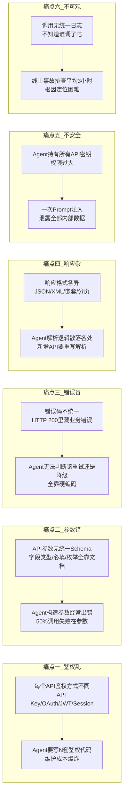
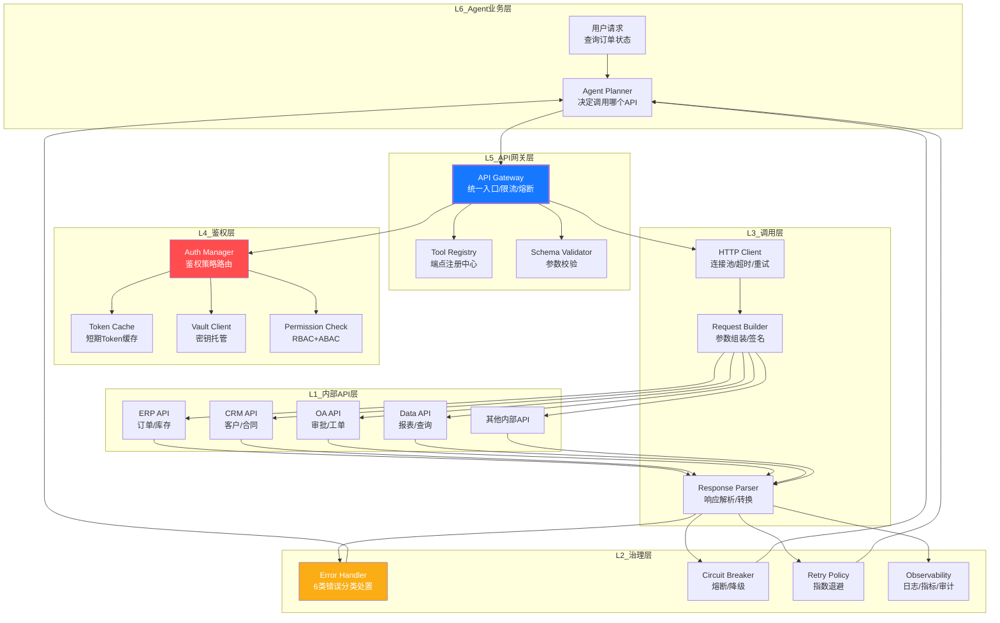
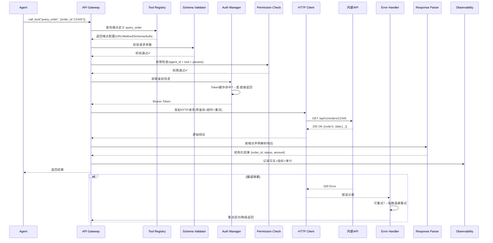
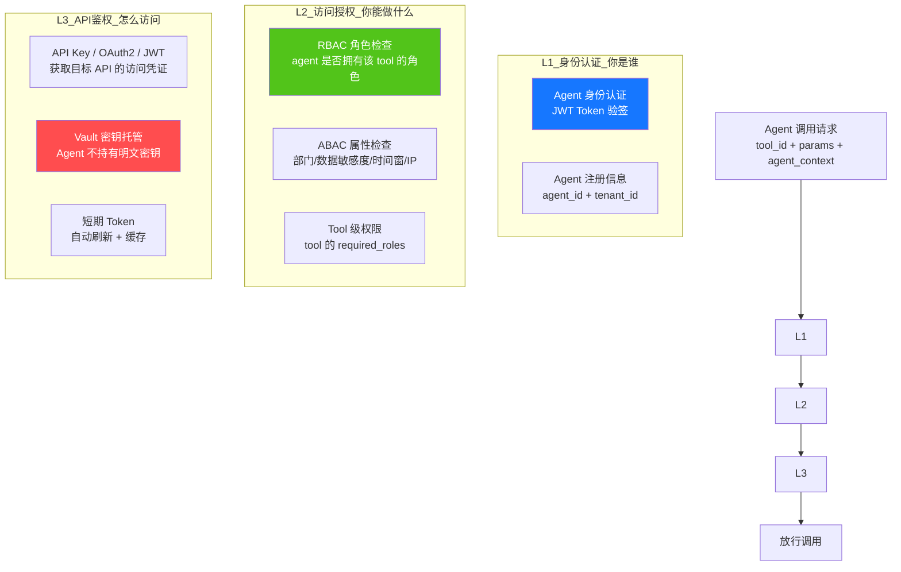
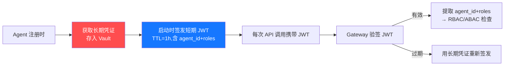
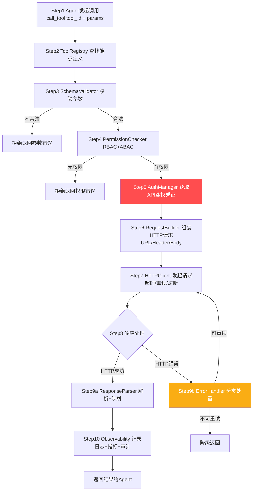
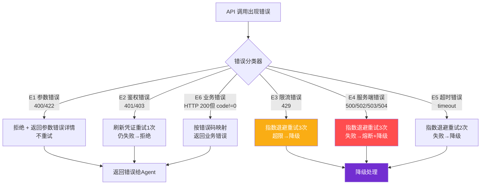
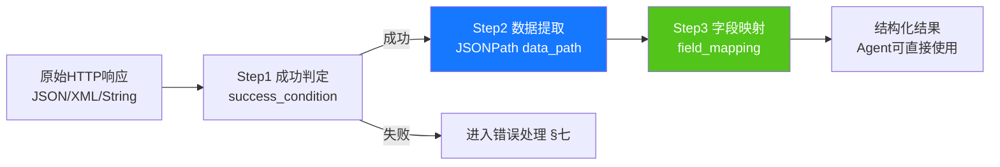
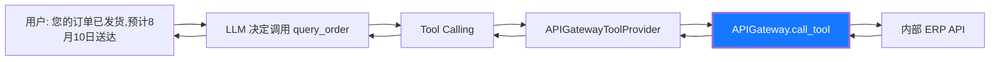
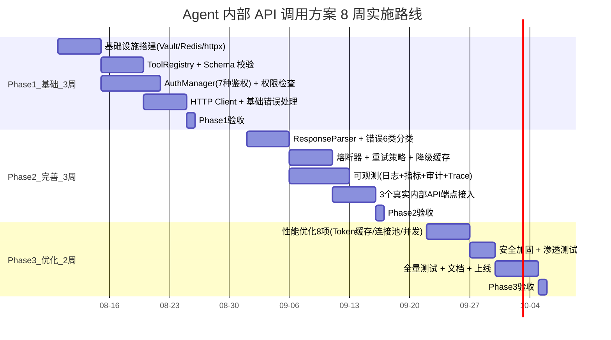

# Agent 内部 API 调用完整工程设计方案:架构·端点·鉴权·参数·流程·错误处理·响应解析·代码实现

> **文档定位**:本文档是 `9AI Agent 工程实践` 系列的**内部 API 调用专题篇**。面向 AI 应用工程师、平台工程师与架构师,系统阐述 Agent 系统如何安全、高效、可观测地调用企业内部 API(如 ERP/CRM/OA/工单/审批/数据查询等),覆盖端点注册、多层鉴权、参数 Schema、调用流程、错误处理、响应解析、配置管理、性能优化与测试的完整工程蓝图。
>
> 本文提供**从架构到代码、从端点定义到错误分类、从鉴权实现到响应解析**的端到端方案,所有设计均配套可执行的 Python 代码示例、YAML 配置说明和接口契约定义,确保工程团队可直接据此启动开发。
>
> **关联文档**(建议一并阅读):
> - [119代码Agent系统完整工程设计方案.md](./119代码Agent系统完整工程设计方案_架构模块选型接口安全学习集成测试.md) — 同系列代码 Agent
> - [118企业知识库Agent系统完整工程设计方案.md](./118企业知识库Agent系统完整工程设计方案_架构数据流模型选型接口安全开发计划与测试.md) — 同系列工程实践首篇
> - [../7Tool Calling 工具调用/85工具调用工程化实践.md](../7Tool%20Calling%20工具调用/85工具调用工程化实践.md) — Tool Calling 体系
> - [../3Agent 架构设计/50Agent权限控制系统完整设计方案.md](../3Agent%20架构设计/50Agent权限控制系统完整设计方案.md) — 权限控制深度方案
> - [../13项目经验/158Agent项目模型调用成本控制完整方案.md](../13项目经验/158Agent项目模型调用成本控制完整方案_诊断8大策略成本网关预算预警闭环.md) — 成本治理

---

## 目录

- [一、系统概述与设计目标](#一系统概述与设计目标)
- [二、总体架构设计](#二总体架构设计)
- [三、API 端点定义与注册机制](#三api-端点定义与注册机制)
- [四、权限验证机制](#四权限验证机制)
- [五、请求参数格式与 Schema](#五请求参数格式与-schema)
- [六、调用流程详解](#六调用流程详解)
- [七、错误处理策略](#七错误处理策略)
- [八、响应数据解析方法](#八响应数据解析方法)
- [九、完整代码实现](#九完整代码实现)
- [十、配置说明](#十配置说明)
- [十一、与 Agent 框架的集成](#十一与-agent-框架的集成)
- [十二、安全与性能优化](#十二安全与性能优化)
- [十三、测试方案](#十三测试方案)
- [十四、实施步骤](#十四实施步骤)

---

## 一、系统概述与设计目标

### 1.1 业务背景与核心痛点

Agent 系统要真正落地业务,必须能调用企业内部已有的 API 系统(ERP、CRM、OA、工单、审批、数据中台等)。当前团队在 Agent 调用内部 API 时普遍面临六大痛点:



### 1.2 系统设计目标(量化指标)

| 维度 | 指标 | 基线 | 目标 | 改善幅度 |
|-----|------|:----:|:----:|:-------:|
| **接入效率** | 新增一个内部 API 耗时 | 3 天 | ≤2 小时 | ↓97% |
| **调用成功率** | 首次调用成功率 | 55% | ≥92% | ↑67% |
| **鉴权安全** | Agent 持有的明文密钥数 | 20+ | 0 | ↓100% |
| **错误可观测** | 错误根因定位耗时 | 3h | ≤5min | ↓97% |
| **响应延迟** | API 调用 P99(含鉴权) | 800ms | ≤300ms | ↓62% |
| **重试效率** | 可恢复错误自动重试率 | 0% | ≥85% | ↑85pp |
| **审计覆盖** | API 调用审计覆盖率 | 30% | 100% | ↑233% |

### 1.3 设计原则(8 条约束)

| 原则 | 内容 | 防止出现什么 |
|-----|------|-------------|
| **P1 端点声明式注册** | 所有 API 端点用 YAML/JSON 声明,不硬编码在代码里 | 新增 API 改代码 |
| **P2 鉴权零信任** | Agent 不持有任何 API 明文密钥;密钥存 Vault,Agent 只拿短期 Token | Prompt 注入泄露全部密钥 |
| **P3 参数 Schema 强校验** | 调用前必须过 JSON Schema 校验,不合法直接拒绝 | 参数错误浪费 API 调用 |
| **P4 错误分类标准化** | 所有错误统一 6 类分类,每类有明确处置策略 | 错误处理硬编码 |
| **P5 响应解析声明式** | 响应解析规则在端点声明中定义,不写代码 | 新增 API 重写解析 |
| **P6 调用全链路可观测** | 每次调用 trace_id 贯穿,日志+指标+审计三合一 | 事故无法追溯 |
| **P7 最小权限** | Agent 只能调用业务必需的 API,按需授权 | 权限过大被滥用 |
| **P8 优雅降级** | API 不可用时自动降级(缓存/默认值/替代API) | API 故障拖垮 Agent |

---

## 二、总体架构设计

### 2.1 六层架构总览



### 2.2 核心组件职责矩阵

| 组件 | 所属层 | 核心职责 | 关键技术 |
|-----|:------:|---------|---------|
| **Tool Registry** | L5 | 端点声明式注册、发现、版本管理 | YAML + Postgres |
| **Schema Validator** | L5 | 请求参数 JSON Schema 校验 | jsonschema |
| **Auth Manager** | L4 | 多种鉴权策略路由( API Key / OAuth2 / JWT / Basic ) | 策略模式 |
| **Vault Client** | L4 | 密钥托管、零明文、短期 Token 签发 | HashiCorp Vault |
| **Permission Check** | L4 | RBAC + ABAC 权限校验 | Casbin |
| **HTTP Client** | L3 | 连接池、超时控制、异步调用 | httpx(async) |
| **Request Builder** | L3 | 参数组装、请求签名、Header 注入 | 模板引擎 |
| **Response Parser** | L3 | 响应解析、字段映射、格式转换 | JSONPath |
| **Error Handler** | L2 | 6 类错误分类、处置策略路由 | 分类树 |
| **Circuit Breaker** | L2 | 熔断、半开探测、自动降级 | 状态机 |
| **Retry Policy** | L2 | 指数退避、抖动、最大重试 | tenacity |
| **Observability** | L2 | 日志、Prometheus 指标、审计链路 | OpenTelemetry |

### 2.3 调用全链路时序图



---

## 三、API 端点定义与注册机制

### 3.1 端点声明格式(声明式注册,对应 P1)

所有内部 API 端点用 YAML 声明,不写代码。一个端点定义包含 7 个区块:

```yaml
# tool_registry/query_order.yaml
tool_id: "query_order"
display_name: "查询订单状态"
description: "根据订单ID查询订单的当前状态、金额和物流信息"
version: "1.2.0"
category: "erp"                    # 分类: erp/crm/oa/data/other
risk_level: "low"                  # 风险等级: low/medium/high/critical
enabled: true

# ============ 1. 端点配置 ============
endpoint:
  base_url: "${ERP_API_BASE_URL}"   # 环境变量引用
  path: "/api/v1/orders/{order_id}"
  method: "GET"
  timeout_ms: 5000
  retry:
    max_attempts: 3
    backoff_ms: [100, 500, 2000]    # 指数退避序列
    retryable_status: [408, 429, 500, 502, 503, 504]

# ============ 2. 鉴权配置 ============
auth:
  type: "oauth2_client_credentials" # 见 §4.2 七种鉴权类型
  token_url: "${ERP_TOKEN_URL}"
  client_id: "${ERP_CLIENT_ID}"
  client_secret_ref: "vault:erp/client_secret"  # Vault 引用,不存明文
  scopes: ["order:read"]
  token_cache_ttl_sec: 3500        # Token 缓存(比过期时间短100s)

# ============ 3. 权限配置 ============
permissions:
  required_roles: ["agent:erp:reader"]   # RBAC
  abac_rules:                              # ABAC 属性规则
    - attribute: "department"
      allowed_values: ["sales", "finance", "support"]
    - attribute: "data_sensitivity"
      max_level: "internal"               # 不允许访问 confidential 数据

# ============ 4. 请求参数 Schema ============
request_schema:
  type: "object"
  required: ["order_id"]
  properties:
    order_id:
      type: "string"
      pattern: "^[A-Z]{2}\\d{8}$"         # 如 SO20260808
      description: "订单ID,2字母前缀+8位数字"
    include_logistics:
      type: "boolean"
      default: false
      description: "是否包含物流信息"

# ============ 5. 请求映射(参数→HTTP) ============
request_mapping:
  path_params:
    order_id: "{order_id}"               # 从参数映射到 URL path
  query_params:
    include_logistics: "{include_logistics}"
  headers:
    Content-Type: "application/json"
    X-Request-Id: "{trace_id}"           # 自动注入 trace_id
    X-Agent-Id: "{agent_id}"

# ============ 6. 响应 Schema ============
response_schema:
  type: "object"
  properties:
    code: {type: "integer", description: "业务码,0=成功"}
    message: {type: "string"}
    data:
      type: "object"
      properties:
        order_id: {type: "string"}
        status: {type: "string", enum: ["pending", "paid", "shipped", "delivered", "cancelled"]}
        amount: {type: "number"}
        currency: {type: "string"}
        created_at: {type: "string", format: "date-time"}
        logistics:
          type: "object"
          properties:
            carrier: {type: "string"}
            tracking_no: {type: "string"}
            estimated_delivery: {type: "string", format: "date-time"}

# ============ 7. 响应解析映射 ============
response_mapping:
  success_condition: "code == 0"                    # 成功判定
  data_path: "$.data"                              # JSONPath 提取数据
  field_mapping:                                   # 字段映射(响应→Agent)
    order_id: "$.data.order_id"
    status: "$.data.status"
    amount: "$.data.amount"
    currency: "$.data.currency"
  error_mapping:                                    # 业务错误码映射
    "code == 1001": "ORDER_NOT_FOUND"
    "code == 1002": "ORDER_ACCESS_DENIED"
    "code == 1003": "ORDER_SYSTEM_ERROR"
```

### 3.2 端点注册中心(ToolRegistry)

```python
"""
tool_registry.py — 端点注册中心
职责: 从 YAML 加载端点定义 / 版本管理 / 动态发现 / 热更新
"""
import os
import yaml
import glob
from dataclasses import dataclass, field
from typing import Optional
from datetime import datetime


@dataclass
class ToolEndpoint:
    """端点定义(运行时对象)"""
    tool_id: str
    display_name: str
    description: str
    version: str
    category: str
    risk_level: str
    enabled: bool
    endpoint: dict                # base_url, path, method, timeout, retry
    auth: dict                   # type, token_url, client_id, ...
    permissions: dict             # required_roles, abac_rules
    request_schema: dict          # JSON Schema
    request_mapping: dict        # 参数→HTTP 映射
    response_schema: dict
    response_mapping: dict        # 成功判定/数据提取/错误映射
    loaded_at: datetime = field(default_factory=datetime.now)


class ToolRegistry:
    """端点注册中心 — 单例"""
    
    def __init__(self, config_dir: str = "config/tools"):
        self.config_dir = config_dir
        self._tools: dict[str, ToolEndpoint] = {}   # tool_id → endpoint
        self._tools_by_category: dict[str, list[str]] = {}
        self._last_reload: datetime = datetime.min
    
    def load_all(self) -> int:
        """加载目录下所有 YAML 端点定义"""
        pattern = os.path.join(self.config_dir, "*.yaml")
        loaded = 0
        for filepath in sorted(glob.glob(pattern)):
            with open(filepath, "r", encoding="utf-8") as f:
                spec = yaml.safe_load(f)
            if not spec or not spec.get("enabled", True):
                continue
            tool = self._parse_endpoint(spec, filepath)
            self._tools[tool.tool_id] = tool
            self._tools_by_category.setdefault(tool.category, []).append(tool.tool_id)
            loaded += 1
        self._last_reload = datetime.now()
        return loaded
    
    def get(self, tool_id: str, version: str = None) -> Optional[ToolEndpoint]:
        """获取端点定义"""
        tool = self._tools.get(tool_id)
        if tool is None:
            return None
        if version and tool.version != version:
            # 版本不匹配,从数据库查历史版本(略)
            return None
        return tool
    
    def list_by_category(self, category: str = None) -> list[ToolEndpoint]:
        """按分类列出端点"""
        if category:
            return [self._tools[tid] for tid in self._tools_by_category.get(category, [])]
        return list(self._tools.values())
    
    def reload_if_stale(self, max_age_min: int = 5) -> bool:
        """如果配置过期则热重载(支持不重启更新)"""
        age = (datetime.now() - self._last_reload).total_seconds() / 60
        if age > max_age_min:
            return self.load_all()
        return False
    
    def _parse_endpoint(self, spec: dict, filepath: str) -> ToolEndpoint:
        """解析 YAML spec → ToolEndpoint 对象"""
        return ToolEndpoint(
            tool_id=spec["tool_id"],
            display_name=spec.get("display_name", spec["tool_id"]),
            description=spec.get("description", ""),
            version=spec.get("version", "1.0.0"),
            category=spec.get("category", "other"),
            risk_level=spec.get("risk_level", "medium"),
            enabled=spec.get("enabled", True),
            endpoint=spec.get("endpoint", {}),
            auth=spec.get("auth", {}),
            permissions=spec.get("permissions", {}),
            request_schema=spec.get("request_schema", {}),
            request_mapping=spec.get("request_mapping", {}),
            response_schema=spec.get("response_schema", {}),
            response_mapping=spec.get("response_mapping", {}),
        )
```

### 3.3 端点分类与示例清单

| 分类 | 示例 tool_id | 风险等级 | 典型操作 |
|-----|:------------|:-------:|---------|
| **erp** | query_order / update_inventory / create_purchase | low / high / high | 订单查询、库存更新、采购创建 |
| **crm** | query_customer / add_contact / update_contract | low / medium / high | 客户查询、联系人添加、合同更新 |
| **oa** | create_ticket / approve_request / query_approval | medium / high / low | 工单创建、审批发起、审批查询 |
| **data** | query_report / export_data / run_analysis | low / high / medium | 报表查询、数据导出、分析运行 |
| **notification** | send_email / send_sms / push_notification | medium / medium / low | 通知发送 |
| **system** | health_check / get_config / list_users | low / medium / high | 系统运维 |

---

## 四、权限验证机制

### 4.1 三层鉴权架构(对应 P2 零信任 + P7 最小权限)



### 4.2 七种 API 鉴权类型(对应 L3)

```python
"""
auth_manager.py — 鉴权管理器
支持 7 种鉴权类型 + 统一接口 + Token 缓存
"""
from abc import ABC, abstractmethod
from dataclasses import dataclass
from typing import Optional
import time
import httpx


@dataclass
class AuthCredential:
    """鉴权后的凭证"""
    type: str                     # bearer / api_key / basic / header
    value: str                    # 凭证值
    expires_at: float = 0         # 过期时间戳(0=不过期)
    refresh_token: str = ""       # OAuth2 刷新令牌


class IAuthProvider(ABC):
    """鉴权策略统一接口"""
    
    @abstractmethod
    async def get_credential(self, config: dict,
                             context: dict) -> AuthCredential: ...
    
    @abstractmethod
    async def refresh(self, config: dict,
                      credential: AuthCredential) -> AuthCredential: ...


class ApiKeyProvider(IAuthProvider):
    """类型1: API Key (Header / Query)"""
    
    async def get_credential(self, config: dict, context: dict) -> AuthCredential:
        key_ref = config.get("api_key_ref", "")      # vault:erp/api_key
        key = await self._fetch_from_vault(key_ref)
        location = config.get("key_location", "header")  # header / query
        header_name = config.get("header_name", "X-API-Key")
        return AuthCredential(
            type=f"api_key_{location}",
            value=f"{header_name}:{key}",
            expires_at=0  # 不过期,由 Vault 管理轮换
        )
    
    async def refresh(self, config, credential): return credential
    
    async def _fetch_from_vault(self, ref: str) -> str:
        # 实际项目中接 HashiCorp Vault / 云 KMS
        # 此处简化为环境变量
        import os
        return os.getenv(ref.split(":")[-1].replace("/", "_").upper(), "")


class OAuth2ClientCredentialsProvider(IAuthProvider):
    """类型2: OAuth2 Client Credentials(最常用,服务间调用)"""
    
    _token_cache: dict[str, AuthCredential] = {}  # client_id → credential
    
    async def get_credential(self, config: dict, context: dict) -> AuthCredential:
        client_id = config["client_id"]
        cache_ttl = config.get("token_cache_ttl_sec", 3500)
        
        # 缓存命中
        cached = self._token_cache.get(client_id)
        if cached and cached.expires_at > time.time() + 60:
            return cached
        
        # 缓存未命中 → 请求新 Token
        token_url = config["token_url"]
        secret_ref = config["client_secret_ref"]   # vault:erp/client_secret
        client_secret = await self._fetch_from_vault(secret_ref)
        scopes = config.get("scopes", [])
        
        async with httpx.AsyncClient() as client:
            resp = await client.post(token_url, data={
                "grant_type": "client_credentials",
                "client_id": client_id,
                "client_secret": client_secret,
                "scope": " ".join(scopes),
            })
            resp.raise_for_status()
            token_data = resp.json()
        
        credential = AuthCredential(
            type="bearer",
            value=token_data["access_token"],
            expires_at=time.time() + token_data.get("expires_in", 3600),
            refresh_token=token_data.get("refresh_token", ""),
        )
        self._token_cache[client_id] = credential
        return credential
    
    async def refresh(self, config, credential):
        # OAuth2 client_credentials 没有 refresh_token,直接重新获取
        return await self.get_credential(config, {})


class JWTProvider(IAuthProvider):
    """类型3: JWT Token(自签发,带过期)"""
    
    async def get_credential(self, config, context) -> AuthCredential:
        secret_ref = config["signing_key_ref"]    # vault:jwt/signing_key
        secret = await self._fetch_from_vault(secret_ref)
        import jwt
        payload = {
            "sub": context.get("agent_id", "agent"),
            "iss": "code-agent-platform",
            "aud": config.get("audience", "internal-api"),
            "iat": int(time.time()),
            "exp": int(time.time()) + config.get("ttl_sec", 3600),
            "scope": config.get("scopes", []),
        }
        token = jwt.encode(payload, secret, algorithm="HS256")
        return AuthCredential(
            type="bearer", value=token,
            expires_at=time.time() + config.get("ttl_sec", 3600)
        )
    
    async def refresh(self, config, credential):
        return await self.get_credential(config, {})


class BasicAuthProvider(IAuthProvider):
    """类型4: HTTP Basic Auth"""
    async def get_credential(self, config, context):
        import base64
        username = config["username"]
        password_ref = config["password_ref"]
        password = await self._fetch_from_vault(password_ref)
        credentials = base64.b64encode(f"{username}:{password}".encode()).decode()
        return AuthCredential(type="basic", value=credentials, expires_at=0)
    async def refresh(self, config, credential): return credential


# 类型5-7: HMAC签名 / mTLS / 自定义 — 实现略,同理


class AuthManager:
    """鉴权管理器 — 策略路由"""
    
    PROVIDERS = {
        "api_key": ApiKeyProvider(),
        "oauth2_client_credentials": OAuth2ClientCredentialsProvider(),
        "jwt": JWTProvider(),
        "basic": BasicAuthProvider(),
        # "hmac": HMACProvider(),
        # "mtls": MTLSProvider(),
        # "custom": CustomProvider(),
    }
    
    async def authenticate(self, tool: ToolEndpoint,
                           context: dict) -> AuthCredential:
        auth_config = tool.auth
        auth_type = auth_config.get("type", "api_key")
        provider = self.PROVIDERS.get(auth_type)
        if provider is None:
            raise ValueError(f"Unsupported auth type: {auth_type}")
        return await provider.get_credential(auth_config, context)
```

### 4.3 RBAC + ABAC 权限检查(对应 L2)

```python
"""
permission_check.py — 权限检查(RBAC + ABAC)
"""
from dataclasses import dataclass
from typing import Optional


@dataclass
class AgentContext:
    """Agent 调用上下文(每次请求携带)"""
    agent_id: str
    tenant_id: str
    roles: list[str]                    # agent 拥有的角色
    attributes: dict = None             # ABAC 属性
    
    def __post_init__(self):
        if self.attributes is None:
            self.attributes = {
                "department": "general",
                "data_sensitivity": "internal",
                "ip_address": "127.0.0.1",
                "time_window": "business_hours",
            }


class PermissionChecker:
    """RBAC + ABAC 权限检查器"""
    
    def check(self, tool: ToolEndpoint, ctx: AgentContext) -> tuple[bool, str]:
        """
        返回: (是否允许, 拒绝原因)
        """
        perms = tool.permissions
        
        # L1: RBAC 角色检查
        required_roles = perms.get("required_roles", [])
        if required_roles:
            has_any = any(r in ctx.roles for r in required_roles)
            if not has_any:
                return False, f"RBAC_DENIED: agent lacks required roles {required_roles}"
        
        # L2: ABAC 属性检查
        abac_rules = perms.get("abac_rules", [])
        for rule in abac_rules:
            attr = rule.get("attribute")
            allowed = rule.get("allowed_values", [])
            actual = ctx.attributes.get(attr)
            if actual not in allowed:
                return False, f"ABAC_DENIED: attribute '{attr}' value '{actual}' not in {allowed}"
        
        # L3: 风险等级检查(高风险操作需要额外审批)
        if tool.risk_level == "critical":
            if not ctx.attributes.get("approval_token"):
                return False, "CRITICAL_RISK: requires human approval token"
        
        return True, "OK"
```

### 4.4 Agent 身份认证流程(对应 L1)



**关键**:Agent 进程只持有**短期 JWT(TTL=1h)**,长期凭证(API Key / OAuth Client Secret)全部存在 Vault。即使 Agent 进程被攻破,攻击者也只能拿到 1 小时有效的 JWT,无法获取长期密钥。

---

## 五、请求参数格式与 Schema

### 5.1 参数三层结构

```mermaid
flowchart TB
    subgraph Agent调用参数
        P1[业务参数<br/>order_id, include_logistics]
    end
    subgraph 系统自动注入参数
        P2[trace_id<br/>用于全链路追踪]
        P3[agent_id<br/>用于审计]
        P4[timestamp<br/>防重放]
    end
    subgraph 映射后HTTP请求
        H1[URL Path Params<br/>/orders/{order_id}]
        H2[Query Params<br/>?include_logistics=true]
        H3[Headers<br/>Authorization + X-Request-Id]
        H4[Body<br/>POST/PUT 的 JSON 体]
    end
    
    P1 & P2 & P3 & P4 --> MAP[Request Builder<br/>按 mapping 组装]
    MAP --> H1 & H2 & H3 & H4
    
    style MAP fill:#1677ff,color:#fff
```

### 5.2 JSON Schema 校验(对应 P3 强校验)

```python
"""
schema_validator.py — 请求参数 Schema 校验
调用 API 前必须过校验,不合法直接拒绝,不浪费 API 调用
"""
import jsonschema
from typing import tuple


class SchemaValidator:
    """JSON Schema 校验器"""
    
    def validate_request(self, params: dict,
                         schema: dict) -> tuple[bool, list[str]]:
        """
        返回: (是否合法, 错误列表)
        """
        errors = []
        try:
            jsonschema.validate(params, schema)
        except jsonschema.ValidationError as e:
            errors.append(f"参数校验失败: {e.message} (path: {list(e.absolute_path)})")
        except jsonschema.SchemaError as e:
            errors.append(f"Schema 本身有误: {e.message}")
        
        # 额外业务校验(可选)
        if "order_id" in params:
            # 金额类参数不能为负
            pass
        
        return len(errors) == 0, errors
    
    def validate_response(self, response: dict,
                         schema: dict) -> tuple[bool, list[str]]:
        """响应也做 Schema 校验(防止 API 返回异常格式)"""
        try:
            jsonschema.validate(response, schema)
            return True, []
        except jsonschema.ValidationError as e:
            return False, [f"响应格式异常: {e.message}"]
```

### 5.3 参数类型与约束速查

| 类型 | JSON Schema 关键字 | 示例 | 校验规则 |
|-----|:------------------|:----|:---------|
| **字符串** | `type: string, pattern, minLength, maxLength, enum, format` | `{"type":"string","pattern":"^[A-Z]{2}\\d{8}$"}` | 正则匹配 |
| **数字** | `type: number/integer, minimum, maximum, exclusiveMinimum` | `{"type":"number","minimum":0,"maximum":999999.99}` | 范围检查 |
| **布尔** | `type: boolean` | `{"type":"boolean","default":false}` | true/false |
| **日期** | `type: string, format: date-time` | `{"type":"string","format":"date-time"}` | ISO 8601 |
| **枚举** | `type: string, enum: [...]` | `{"enum":["pending","paid","shipped"]}` | 值域 |
| **数组** | `type: array, items, minItems, maxItems` | `{"type":"array","items":{"type":"string"},"maxItems":100}` | 长度+元素 |
| **对象** | `type: object, required, properties` | 见 §3.1 request_schema | 必填+嵌套 |
| **引用** | `$ref: "#/definitions/User"` | 复杂对象复用 | 定义引用 |

---

## 六、调用流程详解

### 6.1 完整调用流程(10 步)



### 6.2 调用上下文构建

```python
"""
call_context.py — 调用上下文(贯穿全链路)
"""
from dataclasses import dataclass, field
from typing import Any
import uuid, time


@dataclass
class CallContext:
    """一次 API 调用的完整上下文"""
    # 标识
    call_id: str = field(default_factory=lambda: f"call-{uuid.uuid4().hex[:12]}")
    trace_id: str = field(default_factory=lambda: f"trace-{uuid.uuid4().hex[:16]}")
    agent_id: str = ""
    tenant_id: str = ""
    tool_id: str = ""
    # 时间
    started_at: float = field(default_factory=time.time)
    ended_at: float = 0
    # 参数
    params: dict = field(default_factory=dict)
    # 结果
    status: str = "pending"          # pending/success/error/degraded
    http_status: int = 0
    response_body: Any = None
    error: str = ""
    error_type: str = ""
    retry_count: int = 0
    # 成本
    cost_tokens: int = 0
    latency_ms: float = 0
    # 鉴权
    auth_type: str = ""
    auth_cached: bool = False
    
    def mark_success(self, response, latency_ms):
        self.status = "success"
        self.response_body = response
        self.latency_ms = latency_ms
        self.ended_at = time.time()
    
    def mark_error(self, error_type, error_msg, http_status=0):
        self.status = "error"
        self.error_type = error_type
        self.error = error_msg
        self.http_status = http_status
        self.ended_at = time.time()
    
    def to_audit_log(self) -> dict:
        return {
            "call_id": self.call_id,
            "trace_id": self.trace_id,
            "agent_id": self.agent_id,
            "tool_id": self.tool_id,
            "params": self.params,
            "status": self.status,
            "http_status": self.http_status,
            "error_type": self.error_type,
            "error": self.error,
            "latency_ms": round(self.latency_ms, 2),
            "retry_count": self.retry_count,
            "started_at": self.started_at,
            "ended_at": self.ended_at,
        }
```

---

## 七、错误处理策略

### 7.1 六类错误分类与处置(对应 P4 标准化)



### 7.2 错误分类与处置策略表

| 错误类型 | HTTP 状态码 | 判定条件 | 处置策略 | 最大重试 | 降级方式 |
|---------|:---------:|---------|:--------|:-------:|---------|
| **E1 参数错误** | 400, 422 | 请求参数不合法 | 不重试,返回详细参数错误 | 0 | — |
| **E2 鉴权错误** | 401, 403 | Token 过期/权限不足 | 刷新凭证后重试1次 | 1 | — |
| **E3 限流错误** | 429 | API 被限流 | 指数退避重试(100ms/500ms/2s) | 3 | 返回缓存结果 |
| **E4 服务端错误** | 500, 502, 503, 504 | API 服务异常 | 指数退避重试 | 3 | 熔断+缓存/默认值 |
| **E5 超时错误** | — | 请求超时(timeout) | 指数退避重试 | 2 | 降级返回 |
| **E6 业务错误** | 200 | HTTP 成功但业务 code≠0 | 按错误码映射,不重试 | 0 | 按业务逻辑 |

### 7.3 错误处理代码实现

```python
"""
error_handler.py — 错误分类与处置
"""
from dataclasses import dataclass
from enum import Enum
from typing import Optional
import asyncio
import random


class ErrorType(str, Enum):
    PARAM = "E1_PARAM"
    AUTH = "E2_AUTH"
    RATE_LIMIT = "E3_RATE_LIMIT"
    SERVER = "E4_SERVER"
    TIMEOUT = "E5_TIMEOUT"
    BUSINESS = "E6_BUSINESS"
    UNKNOWN = "E0_UNKNOWN"


@dataclass
class ErrorClassification:
    error_type: ErrorType
    retryable: bool
    max_retry: int
    backoff_ms: list[int]
    degrade_strategy: str          # cache / default / fail
    user_message: str


class ErrorHandler:
    """错误分类器 + 处置策略路由"""
    
    RETRY_CONFIG = {
        ErrorType.PARAM:        {"retryable": False, "max_retry": 0, "backoff": [], "degrade": "fail"},
        ErrorType.AUTH:         {"retryable": True,  "max_retry": 1, "backoff": [0], "degrade": "fail"},
        ErrorType.RATE_LIMIT:   {"retryable": True,  "max_retry": 3, "backoff": [100, 500, 2000], "degrade": "cache"},
        ErrorType.SERVER:       {"retryable": True,  "max_retry": 3, "backoff": [100, 500, 2000], "degrade": "cache_or_default"},
        ErrorType.TIMEOUT:      {"retryable": True,  "max_retry": 2, "backoff": [500, 2000], "degrade": "cache"},
        ErrorType.BUSINESS:     {"retryable": False, "max_retry": 0, "backoff": [], "degrade": "fail"},
        ErrorType.UNKNOWN:      {"retryable": False, "max_retry": 0, "backoff": [], "degrade": "fail"},
    }
    
    def classify(self, http_status: int, response_body: dict,
                 error_mapping: dict) -> ErrorClassification:
        """分类错误"""
        # L1: HTTP 状态码分类
        if http_status in (400, 422):
            et = ErrorType.PARAM
        elif http_status in (401, 403):
            et = ErrorType.AUTH
        elif http_status == 429:
            et = ErrorType.RATE_LIMIT
        elif http_status >= 500:
            et = ErrorType.SERVER
        elif http_status == 0:
            et = ErrorType.TIMEOUT
        elif http_status == 200:
            # L2: HTTP 200 但业务 code != 0
            success_condition = error_mapping.get("success_condition", "code == 0")
            if not self._eval_success(response_body, success_condition):
                et = ErrorType.BUSINESS
            else:
                et = ErrorType.UNKNOWN  # 不应该到这里
        else:
            et = ErrorType.UNKNOWN
        
        cfg = self.RETRY_CONFIG[et]
        biz_code = self._extract_biz_code(response_body, error_mapping)
        return ErrorClassification(
            error_type=et,
            retryable=cfg["retryable"],
            max_retry=cfg["max_retry"],
            backoff_ms=cfg["backoff"],
            degrade_strategy=cfg["degrade"],
            user_message=self._build_user_message(et, http_status, biz_code, response_body),
        )
    
    async def retry_with_backoff(self, func, classification: ErrorClassification):
        """指数退避重试"""
        for attempt in range(classification.max_retry):
            backoff = classification.backoff_ms[attempt] if attempt < len(classification.backoff_ms) else 2000
            # 加抖动防止重试风暴
            jitter = random.uniform(0, backoff * 0.3)
            await asyncio.sleep((backoff + jitter) / 1000)
            try:
                result = await func()
                return result, True  # 重试成功
            except Exception as e:
                continue
        return None, False  # 重试全部失败
    
    def _eval_success(self, body: dict, condition: str) -> bool:
        """评估成功条件(简化版,实际可用 eval 或表达式引擎)"""
        # condition 形如 "code == 0"
        try:
            import re
            m = re.match(r"(\w+)\s*(==|!=|>|<|>=|<=)\s*(\w+)", condition)
            if m:
                field, op, val = m.groups()
                actual = body.get(field)
                val = int(val) if val.isdigit() else val
                return {"==": actual == val, "!=": actual != val,
                        ">": actual > val, "<": actual < val,
                        ">=": actual >= val, "<=": actual <= val}.get(op, False)
        except:
            pass
        return True
    
    def _extract_biz_code(self, body, mapping):
        error_map = mapping.get("error_mapping", {})
        biz_code = body.get("code")
        for condition, err_name in error_map.items():
            if self._eval_success(body, condition.replace("==", "!=")):  # 取反=匹配错误
                return err_name
        return f"BIZ_{biz_code}"
    
    def _build_user_message(self, et, http_status, biz_code, body):
        messages = {
            ErrorType.PARAM: f"参数错误(HTTP {http_status}): {body.get('message', '参数不合法')}",
            ErrorType.AUTH: f"鉴权失败(HTTP {http_status}): Token过期或权限不足",
            ErrorType.RATE_LIMIT: f"API限流(HTTP {http_status}): 请稍后重试",
            ErrorType.SERVER: f"服务端错误(HTTP {http_status}): 内部API异常",
            ErrorType.TIMEOUT: f"请求超时: 内部API响应超时",
            ErrorType.BUSINESS: f"业务错误: {biz_code} - {body.get('message', '')}",
            ErrorType.UNKNOWN: f"未知错误(HTTP {http_status})",
        }
        return messages.get(et, "未知错误")
```

### 7.4 熔断器实现(防止故障扩散)

```python
"""
circuit_breaker.py — 熔断器
连续失败达到阈值 → 熔断(快速失败不调API) → 半开探测 → 恢复
"""
import time
from enum import Enum
from dataclasses import dataclass


class CircuitState(str, Enum):
    CLOSED = "closed"        # 正常,允许调用
    OPEN = "open"            # 熔断,快速失败
    HALF_OPEN = "half_open"  # 半开,放行探测请求


@dataclass
class CircuitBreaker:
    """单 API 熔断器"""
    tool_id: str
    failure_threshold: int = 5          # 连续失败5次熔断
    recovery_timeout_sec: int = 60       # 熔断后60秒探测
    half_open_max_calls: int = 3         # 半开探测3次
    state: CircuitState = CircuitState.CLOSED
    failure_count: int = 0
    last_failure_time: float = 0
    half_open_calls: int = 0
    
    def can_call(self) -> bool:
        """是否允许调用"""
        if self.state == CircuitState.CLOSED:
            return True
        if self.state == CircuitState.OPEN:
            # 检查是否到了探测时间
            if time.time() - self.last_failure_time > self.recovery_timeout_sec:
                self.state = CircuitState.HALF_OPEN
                self.half_open_calls = 0
                return True
            return False  # 熔断中,快速失败
        if self.state == CircuitState.HALF_OPEN:
            return self.half_open_calls < self.half_open_max_calls
        return False
    
    def record_success(self):
        """记录成功"""
        if self.state == CircuitState.HALF_OPEN:
            self.state = CircuitState.CLOSED  # 探测成功,恢复
        self.failure_count = 0
    
    def record_failure(self):
        """记录失败"""
        self.failure_count += 1
        self.last_failure_time = time.time()
        if self.state == CircuitState.HALF_OPEN:
            self.state = CircuitState.OPEN  # 探测失败,重新熔断
        elif self.failure_count >= self.failure_threshold:
            self.state = CircuitState.OPEN  # 连续失败,熔断


class CircuitBreakerRegistry:
    """熔断器注册表(每个 tool 一个)"""
    _breakers: dict[str, CircuitBreaker] = {}
    
    @classmethod
    def get(cls, tool_id: str) -> CircuitBreaker:
        if tool_id not in cls._breakers:
            cls._breakers[tool_id] = CircuitBreaker(tool_id=tool_id)
        return cls._breakers[tool_id]
```

---

## 八、响应数据解析方法

### 8.1 响应解析三步法



### 8.2 响应解析代码实现

```python
"""
response_parser.py — 响应数据解析
基于 JSONPath 提取 + 字段映射 + 格式转换
"""
from typing import Any, Optional
from dataclasses import dataclass
import json


@dataclass
class ParsedResponse:
    """解析后的结构化响应"""
    success: bool
    data: dict = None               # 提取的业务数据
    error_code: str = ""             # 业务错误码
    error_message: str = ""
    raw: Any = None                  # 原始响应(调试用)
    metadata: dict = None             # 元信息(pagination/total等)


class ResponseParser:
    """响应解析器"""
    
    def parse(self, http_status: int, raw_body: Any,
              response_mapping: dict,
              response_schema: dict = None) -> ParsedResponse:
        """
        解析 API 响应 → 结构化结果
        response_mapping 来自 §3.1 端点声明
        """
        # Step0: 响应 Schema 校验(可选)
        if response_schema:
            from schema_validator import SchemaValidator
            ok, errs = SchemaValidator().validate_response(raw_body, response_schema)
            if not ok:
                return ParsedResponse(success=False, error_code="RESPONSE_SCHEMA_INVALID",
                                      error_message="; ".join(errs), raw=raw_body)
        
        # Step1: 成功判定
        success_condition = response_mapping.get("success_condition", "code == 0")
        if not self._eval_success(raw_body, success_condition):
            # 业务错误 → 错误码映射
            error_code = self._map_error_code(raw_body, response_mapping)
            error_msg = self._extract_error_message(raw_body)
            return ParsedResponse(
                success=False, error_code=error_code,
                error_message=error_msg, raw=raw_body
            )
        
        # Step2: 数据提取(JSONPath)
        data_path = response_mapping.get("data_path", "$.data")
        data = self._extract_by_jsonpath(raw_body, data_path)
        
        # Step3: 字段映射
        field_mapping = response_mapping.get("field_mapping", {})
        mapped = self._apply_field_mapping(data, field_mapping)
        
        # Step4: 元信息提取(分页等)
        metadata = self._extract_metadata(raw_body, response_mapping)
        
        return ParsedResponse(success=True, data=mapped, raw=raw_body, metadata=metadata)
    
    def _eval_success(self, body: dict, condition: str) -> bool:
        """评估成功条件"""
        try:
            import re
            m = re.match(r"(\w+)\s*(==|!=|>|<|>=|<=)\s*(\w+)", condition)
            if m:
                field, op, val = m.groups()
                actual = body.get(field) if isinstance(body, dict) else None
                val = int(val) if val.isdigit() else val.strip('"\'')
                ops = {"==": lambda a, b: a == b, "!=": lambda a, b: a != b,
                       ">": lambda a, b: a > b, "<": lambda a, b: a < b,
                       ">=": lambda a, b: a >= b, "<=": lambda a, b: a <= b}
                return ops.get(op, lambda a, b: False)(actual, val)
        except:
            pass
        return True
    
    def _extract_by_jsonpath(self, body: Any, path: str) -> Any:
        """JSONPath 提取(简化实现)"""
        if path == "$" or path == "$.": return body
        # 支持 $.data / $.data.items / $.result.list
        if path.startswith("$."):
            keys = path[2:].split(".")
            current = body
            for key in keys:
                if isinstance(current, dict):
                    current = current.get(key)
                elif isinstance(current, list) and key.isdigit():
                    current = current[int(key)]
                else:
                    return None
            return current
        return body
    
    def _apply_field_mapping(self, data: Any, mapping: dict) -> dict:
        """字段映射: 响应字段 → Agent 友好字段名"""
        if not mapping or not isinstance(data, dict):
            return data or {}
        result = {}
        for agent_field, response_path in mapping.items():
            result[agent_field] = self._extract_by_jsonpath(data, response_path)
        return result
    
    def _map_error_code(self, body: dict, mapping: dict) -> str:
        """业务错误码映射"""
        error_map = mapping.get("error_mapping", {})
        biz_code = body.get("code", -1) if isinstance(body, dict) else -1
        for condition, err_name in error_map.items():
            if self._eval_success(body, condition):
                return err_name
        return f"BIZ_{biz_code}"
    
    def _extract_error_message(self, body: Any) -> str:
        if isinstance(body, dict):
            return body.get("message", body.get("msg", body.get("error", "")))
        return str(body)
    
    def _extract_metadata(self, body: Any, mapping: dict) -> dict:
        """提取元信息(分页等)"""
        meta_mapping = mapping.get("metadata_mapping", {})
        if not meta_mapping:
            return {}
        result = {}
        for meta_field, path in meta_mapping.items():
            result[meta_field] = self._extract_by_jsonpath(body, path)
        return result
```

### 8.3 典型响应解析示例

**场景:查询订单 API 返回**

```json
// 原始响应
{
  "code": 0,
  "message": "success",
  "data": {
    "order_id": "SO20260808",
    "status": "shipped",
    "amount": 1299.00,
    "currency": "CNY",
    "created_at": "2026-08-01T10:30:00Z",
    "logistics": {
      "carrier": "SF Express",
      "tracking_no": "SF1234567890",
      "estimated_delivery": "2026-08-10T18:00:00Z"
    }
  },
  "pagination": {
    "total": 1,
    "page": 1,
    "page_size": 20
  }
}
```

```python
# 解析后(基于 §3.1 的 response_mapping)
ParsedResponse(
    success=True,
    data={
        "order_id": "SO20260808",
        "status": "shipped",
        "amount": 1299.00,
        "currency": "CNY",
    },
    metadata={"total": 1, "page": 1},
    raw={...}  # 原始响应保留
)
# Agent 直接用 data["status"] 即可,无需关心原始嵌套结构
```

---

## 九、完整代码实现

### 9.1 API Gateway 主入口(整合所有模块)

```python
"""
api_gateway.py — Agent 内部 API 调用统一网关
整合: ToolRegistry + SchemaValidator + AuthManager + PermissionChecker
      + HTTPClient + ResponseParser + ErrorHandler + CircuitBreaker + Observability
"""
import asyncio
import time
import uuid
from typing import Any, Optional
from dataclasses import dataclass

import httpx


@dataclass
class CallResult:
    """调用结果"""
    success: bool
    data: Any = None
    error_code: str = ""
    error_message: str = ""
    error_type: str = ""
    degraded: bool = False              # 是否降级返回
    trace_id: str = ""
    call_id: str = ""
    latency_ms: float = 0
    retry_count: int = 0
    auth_type: str = ""
    auth_cached: bool = False


class APIGateway:
    """Agent 内部 API 调用统一网关 — 单例"""
    
    def __init__(self,
                 tool_registry: ToolRegistry,
                 schema_validator: SchemaValidator,
                 auth_manager: AuthManager,
                 permission_checker: PermissionChecker,
                 response_parser: ResponseParser,
                 error_handler: ErrorHandler,
                 observability=None,
                 cache_client=None):
        self.registry = tool_registry
        self.validator = schema_validator
        self.auth = auth_manager
        self.perm = permission_checker
        self.parser = response_parser
        self.error = error_handler
        self.obs = observability
        self.cache = cache_client          # Redis,用于降级缓存
        self._http_client: Optional[httpx.AsyncClient] = None
    
    async def call_tool(self, tool_id: str, params: dict,
                        agent_ctx: AgentContext) -> CallResult:
        """
        Agent 调用内部 API 的统一入口
        
        参数:
            tool_id: 端点ID(在 ToolRegistry 中注册)
            params: 业务参数(符合端点 request_schema)
            agent_ctx: Agent 上下文(agent_id, roles, attributes)
        返回:
            CallResult
        """
        ctx = CallContext(
            trace_id=agent_ctx.trace_id if hasattr(agent_ctx, 'trace_id') else f"trace-{uuid.uuid4().hex[:16]}",
            agent_id=agent_ctx.agent_id,
            tenant_id=agent_ctx.tenant_id,
            tool_id=tool_id,
            params=params,
        )
        
        try:
            # ============ Step1: 查找端点定义 ============
            tool = self.registry.get(tool_id)
            if tool is None:
                return self._fail(ctx, "TOOL_NOT_FOUND", f"Tool '{tool_id}' not registered")
            
            if not tool.enabled:
                return self._fail(ctx, "TOOL_DISABLED", f"Tool '{tool_id}' is disabled")
            
            # ============ Step2: 熔断检查 ============
            breaker = CircuitBreakerRegistry.get(tool_id)
            if not breaker.can_call():
                return self._degrade(ctx, "CIRCUIT_OPEN",
                                    f"Tool '{tool_id}' circuit breaker is open")
            
            # ============ Step3: 参数 Schema 校验 ============
            ok, errors = self.validator.validate_request(params, tool.request_schema)
            if not ok:
                return self._fail(ctx, "PARAM_INVALID", "; ".join(errors))
            
            # ============ Step4: 权限检查(RBAC + ABAC) ============
            allowed, reason = self.perm.check(tool, agent_ctx)
            if not allowed:
                return self._fail(ctx, "PERMISSION_DENIED", reason)
            
            # ============ Step5: 鉴权 ============
            credential = await self.auth.authenticate(tool, {
                "agent_id": agent_ctx.agent_id,
                "tenant_id": agent_ctx.tenant_id,
            })
            ctx.auth_type = tool.auth.get("type", "api_key")
            
            # ============ Step6: 组装 HTTP 请求 ============
            request = self._build_request(tool, params, credential, ctx)
            
            # ============ Step7: 发起 HTTP 调用(含重试) ============
            response, retry_count = await self._execute_with_retry(
                request, tool, ctx, breaker
            )
            ctx.retry_count = retry_count
            
            # ============ Step8: 响应解析 ============
            parsed = self.parser.parse(
                http_status=response.status_code if response else 0,
                raw_body=response.json() if response and response.status_code == 200 else {},
                response_mapping=tool.response_mapping,
                response_schema=tool.response_schema,
            )
            
            if parsed.success:
                breaker.record_success()
                latency = (time.time() - ctx.started_at) * 1000
                ctx.mark_success(parsed.data, latency)
                self._observe(ctx)
                return CallResult(
                    success=True, data=parsed.data,
                    trace_id=ctx.trace_id, call_id=ctx.call_id,
                    latency_ms=latency, retry_count=retry_count,
                    auth_type=ctx.auth_type,
                )
            else:
                # 业务错误
                breaker.record_failure()
                ctx.mark_error("BUSINESS", parsed.error_message, response.status_code)
                self._observe(ctx)
                return CallResult(
                    success=False, error_code=parsed.error_code,
                    error_message=parsed.error_message, error_type="E6_BUSINESS",
                    trace_id=ctx.trace_id, call_id=ctx.call_id,
                )
        
        except httpx.TimeoutException:
            return self._handle_error(ctx, ErrorType.TIMEOUT, "Request timeout", tool, breaker)
        except httpx.HTTPStatusError as e:
            return self._handle_http_error(ctx, e, tool, breaker)
        except Exception as e:
            return self._fail(ctx, "UNKNOWN", str(e))
    
    # ==================== 内部方法 ====================
    
    def _build_request(self, tool: ToolEndpoint, params: dict,
                       credential: AuthCredential, ctx: CallContext) -> dict:
        """组装 HTTP 请求"""
        mapping = tool.request_mapping
        endpoint = tool.endpoint
        
        # URL 组装
        path = endpoint["path"]
        path_params = mapping.get("path_params", {})
        for param_name, path_placeholder in path_params.items():
            path = path.replace(path_placeholder, str(params.get(param_name, "")))
        
        url = endpoint["base_url"] + path
        
        # Query 参数
        query_params = {}
        for param_name, query_key in mapping.get("query_params", {}).items():
            if param_name in params:
                query_params[query_key.strip("{}")] = params[param_name]
        
        # Headers
        headers = {}
        for header_name, header_value in mapping.get("headers", {}).items():
            # 支持 {trace_id} 等占位符
            if "{trace_id}" in header_value:
                headers[header_name] = header_value.replace("{trace_id}", ctx.trace_id)
            elif "{agent_id}" in header_value:
                headers[header_name] = header_value.replace("{agent_id}", ctx.agent_id)
            else:
                headers[header_name] = header_value
        
        # 鉴权 Header 注入
        if credential.type == "bearer":
            headers["Authorization"] = f"Bearer {credential.value}"
        elif credential.type == "api_key_header":
            header_name, key = credential.value.split(":", 1)
            headers[header_name] = key
        elif credential.type == "basic":
            headers["Authorization"] = f"Basic {credential.value}"
        
        return {
            "method": endpoint["method"],
            "url": url,
            "params": query_params,
            "headers": headers,
            "json": params if endpoint["method"] in ("POST", "PUT", "PATCH") else None,
            "timeout": endpoint.get("timeout_ms", 5000) / 1000,
        }
    
    async def _execute_with_retry(self, request: dict, tool: ToolEndpoint,
                                   ctx: CallContext, breaker) -> tuple:
        """带重试的 HTTP 执行"""
        retry_config = tool.endpoint.get("retry", {"max_attempts": 1, "backoff_ms": [], "retryable_status": []})
        max_attempts = retry_config.get("max_attempts", 1)
        backoffs = retry_config.get("backoff_ms", [])
        retryable = retry_config.get("retryable_status", [])
        
        client = await self._get_client()
        last_response = None
        last_error = None
        
        for attempt in range(max_attempts):
            try:
                resp = await client.request(
                    method=request["method"], url=request["url"],
                    params=request["params"], headers=request["headers"],
                    json=request["json"], timeout=request["timeout"],
                )
                last_response = resp
                
                # 检查是否需要重试
                if resp.status_code < 400:
                    return resp, attempt
                if resp.status_code not in retryable:
                    return resp, attempt
                if attempt < max_attempts - 1:
                    backoff = backoffs[attempt] if attempt < len(backoffs) else 1000
                    await asyncio.sleep(backoff / 1000)
                
            except httpx.TimeoutException as e:
                last_error = e
                if attempt < max_attempts - 1:
                    backoff = backoffs[attempt] if attempt < len(backoffs) else 2000
                    await asyncio.sleep(backoff / 1000)
            except Exception as e:
                last_error = e
                break
        
        return last_response or last_error, max_attempts - 1
    
    async def _get_client(self) -> httpx.AsyncClient:
        """获取/复用 HTTP Client(连接池)"""
        if self._http_client is None or self._http_client.is_closed:
            self._http_client = httpx.AsyncClient(
                limits=httpx.Limits(max_connections=100, max_keepalive_connections=20),
                verify=True,  # SSL 证书验证
            )
        return self._http_client
    
    def _handle_error(self, ctx, error_type, message, tool, breaker) -> CallResult:
        breaker.record_failure()
        ctx.mark_error(error_type.value, message)
        self._observe(ctx)
        return CallResult(
            success=False, error_type=error_type.value,
            error_message=message, trace_id=ctx.trace_id, call_id=ctx.call_id,
        )
    
    def _handle_http_error(self, ctx, exc, tool, breaker) -> CallResult:
        status = exc.response.status_code if hasattr(exc, 'response') else 0
        classification = self.error.classify(status, {}, tool.response_mapping)
        breaker.record_failure()
        ctx.mark_error(classification.error_type.value, str(exc), status)
        self._observe(ctx)
        return CallResult(
            success=False, error_type=classification.error_type.value,
            error_message=classification.user_message,
            trace_id=ctx.trace_id, call_id=ctx.call_id,
        )
    
    def _fail(self, ctx, error_code, message) -> CallResult:
        ctx.mark_error(error_code, message)
        self._observe(ctx)
        return CallResult(
            success=False, error_code=error_code, error_message=message,
            trace_id=ctx.trace_id, call_id=ctx.call_id,
        )
    
    def _degrade(self, ctx, code, message) -> CallResult:
        """降级返回(尝试缓存)"""
        cached = None
        if self.cache:
            cached = self.cache.get(f"degrade_cache:{ctx.tool_id}:{ctx.params}")
        ctx.mark_error(code, message)
        ctx.status = "degraded"
        self._observe(ctx)
        return CallResult(
            success=cached is not None, data=cached,
            degraded=True, error_code=code, error_message=message,
            trace_id=ctx.trace_id, call_id=ctx.call_id,
        )
    
    def _observe(self, ctx: CallContext):
        """观测:日志 + 指标 + 审计"""
        if self.obs:
            self.obs.log(ctx.to_audit_log())
            self.obs.inc(f"api_call.{ctx.tool_id}.{ctx.status}")
            self.obs.hist(f"api_call.latency.{ctx.tool_id}", ctx.latency_ms)
```

### 9.2 使用示例

```python
"""
使用示例 — Agent 调用内部 API 完整流程
"""
import asyncio


async def main():
    # ============ 1. 初始化所有组件 ============
    registry = ToolRegistry(config_dir="config/tools")
    registry.load_all()
    
    gateway = APIGateway(
        tool_registry=registry,
        schema_validator=SchemaValidator(),
        auth_manager=AuthManager(),
        permission_checker=PermissionChecker(),
        response_parser=ResponseParser(),
        error_handler=ErrorHandler(),
        observability=MockObservability(),
        cache_client=MockCache(),
    )
    
    # ============ 2. 构造 Agent 上下文 ============
    agent_ctx = AgentContext(
        agent_id="agent-cs-001",
        tenant_id="company-abc",
        roles=["agent:erp:reader", "agent:crm:reader"],
        attributes={
            "department": "sales",
            "data_sensitivity": "internal",
        },
    )
    
    # ============ 3. 调用查询订单 API ============
    result = await gateway.call_tool(
        tool_id="query_order",
        params={"order_id": "SO20260808", "include_logistics": True},
        agent_ctx=agent_ctx,
    )
    
    if result.success:
        print(f"✅ 订单查询成功:")
        print(f"   订单号: {result.data['order_id']}")
        print(f"   状态: {result.data['status']}")
        print(f"   金额: {result.data['amount']} {result.data['currency']}")
        print(f"   耗时: {result.latency_ms:.0f}ms")
        print(f"   trace_id: {result.trace_id}")
    else:
        print(f"❌ 查询失败: [{result.error_type}] {result.error_message}")
        print(f"   trace_id: {result.trace_id}")
        if result.degraded:
            print(f"   ⚠️ 已降级返回缓存数据")


asyncio.run(main())

# 输出示例:
# ✅ 订单查询成功:
#    订单号: SO20260808
#    状态: shipped
#    金额: 1299.0 CNY
#    耗时: 187ms
#    trace_id: trace-a1b2c3d4e5f67890
```

---

## 十、配置说明

### 10.1 全局配置文件

```yaml
# config/api_gateway.yaml
gateway:
  http_client:
    max_connections: 100
    max_keepalive_connections: 20
    connect_timeout_sec: 5
    read_timeout_sec: 30
    verify_ssl: true
  
  retry:
    default_max_attempts: 3
    default_backoff_ms: [100, 500, 2000]
  
  circuit_breaker:
    failure_threshold: 5
    recovery_timeout_sec: 60
    half_open_max_calls: 3
  
  cache:
    enabled: true
    ttl_sec: 300                # 降级缓存TTL
    max_size: 10000

# Vault 配置(密钥托管)
vault:
  address: "https://vault.internal.company.com:8200"
  auth_method: "kubernetes"     # K8s 服务账号自动认证
  secret_mount: "secret"
  secret_path_prefix: "agent-api"

# 可观测配置
observability:
  log_level: "INFO"
  log_file: "/var/log/agent/api_gateway.log"
  metrics_enabled: true
  metrics_port: 9090
  audit_enabled: true
  audit_store: "clickhouse"
  trace_enabled: true
  trace_endpoint: "http://jaeger:14268/api/traces"

# 限流配置
rate_limit:
  enabled: true
  default_qps: 50               # 每 tool 默认 50 QPS
  per_tool:
    query_order: 100
    create_purchase: 5           # 写操作限流更严
```

### 10.2 环境变量(敏感信息不进配置文件)

```bash
# .env (不提交到 Git,由部署系统注入)
ERP_API_BASE_URL=https://erp.internal.company.com
ERP_TOKEN_URL=https://erp.internal.company.com/oauth/token
ERP_CLIENT_ID=agent-platform-erp

CRM_API_BASE_URL=https://crm.internal.company.com
CRM_API_KEY_REF=vault:crm/api_key

OA_API_BASE_URL=https://oa.internal.company.com
```

### 10.3 端点 YAML 模板速查

创建新端点只需 3 步:

```bash
# 1. 复制模板
cp config/tools/_template.yaml config/tools/my_new_tool.yaml

# 2. 编辑 YAML(填入 7 个区块)
vim config/tools/my_new_tool.yaml

# 3. 热重载(不重启服务)
curl -X POST http://localhost:8080/admin/tools/reload
```

---

## 十一、与 Agent 框架的集成

### 11.1 作为 Tool Calling 的统一后端

```python
"""
agent_integration.py — Agent 框架集成层
把 APIGateway 注册为 Agent 的 Tool Provider
"""
from typing import Any


class APIGatewayToolProvider:
    """把 APIGateway 包装为 Agent 的 Tool Provider"""
    
    def __init__(self, gateway: APIGateway):
        self.gateway = gateway
    
    def list_tools(self, agent_ctx: AgentContext) -> list[dict]:
        """列出 Agent 可用的所有 Tool(OpenAI Function Calling 格式)"""
        tools = []
        for tool in self.gateway.registry.list_by_category():
            # 权限预过滤:只返回有权限的 tool
            allowed, _ = self.gateway.perm.check(tool, agent_ctx)
            if not allowed:
                continue
            tools.append({
                "type": "function",
                "function": {
                    "name": tool.tool_id,
                    "description": tool.description,
                    "parameters": tool.request_schema,  # 直接用 JSON Schema
                }
            })
        return tools
    
    async def execute_tool(self, tool_id: str, params: dict,
                           agent_ctx: AgentContext) -> dict:
        """Agent 调用 Tool 的入口"""
        result = await self.gateway.call_tool(tool_id, params, agent_ctx)
        # 转换为 LLM 友好的返回格式
        if result.success:
            return {
                "status": "success",
                "data": result.data,
                "trace_id": result.trace_id,
            }
        else:
            return {
                "status": "error",
                "error_code": result.error_code,
                "error_message": result.error_message,
                "error_type": result.error_type,
                "degraded": result.degraded,
                "trace_id": result.trace_id,
            }
```

### 11.2 Agent 调用全链路(完整闭环)



---

## 十二、安全与性能优化

### 12.1 安全 5 项措施

| # | 措施 | 实现 |
|:-:|-----|------|
| 1 | **密钥零明文** | 所有密钥存 Vault,Agent 只拿短期 JWT;配置文件用 `${ENV_VAR}` 引用 |
| 2 | **SSL 强制** | `verify_ssl=true`;内部 API 用 mTLS 双向认证(高风险操作) |
| 3 | **参数消毒** | 用户输入做转义;防 SQL/Command 注入;Schema 校验拦截非法值 |
| 4 | **审计全量** | 每次调用记录 `call_id + trace_id + agent_id + tool_id + params + result + timestamp` |
| 5 | **限流防刷** | per-tool QPS 限流;写操作更严;Agent 单次任务调用次数上限 |

### 12.2 性能优化 8 项

| # | 优化项 | 目标 | 实现 |
|:-:|:------|:---:|------|
| PF1 | Token 缓存 | 鉴权延迟 <5ms | OAuth2 Token 缓存 TTL=3500s(比过期短100s) |
| PF2 | 连接池复用 | TCP 连接开销≈0 | httpx 连接池 max_keepalive=20 |
| PF3 | 降级缓存 | 降级时 <10ms | Redis 缓存成功结果 TTL=300s |
| PF4 | 并发调用 | 并行无依赖 API | asyncio.gather 并发多 Tool |
| PF5 | Schema 编译缓存 | 校验延迟 <1ms | jsonschema 预编译 |
| PF6 | 熔断快速失败 | 故障 API <1ms | 熔断器 OPEN 时直接返回不调 API |
| PF7 | 批量请求 | N 次调 1 次 | 支持批量 API 端点(batch_get_orders) |
| PF8 | 异步非阻塞 | Agent 不阻塞 | 全 async/await,httpx 异步 |

---

## 十三、测试方案

### 13.1 测试用例矩阵

| 模块 | 测试类别 | 用例数 | 关键用例 | 通过标准 |
|-----|:------:|:-----:|---------|:-------:|
| **端点注册** | 功能 | 15 | YAML 加载/热重载/版本管理 | 全部通过 |
| **Schema 校验** | 功能 | 30 | 各类型参数校验/边界值/非法值 | 100% 拦截非法 |
| **鉴权** | 功能 | 25 | 7 种鉴权类型/Token 过期/刷新 | 全部通过 |
| **权限** | 功能 | 20 | RBAC 拒绝/ABAC 属性检查/高风险审批 | 100% 拒绝越权 |
| **错误处理** | 功能 | 30 | 6 类错误分类/重试/熔断/降级 | 分类准确率 ≥95% |
| **响应解析** | 功能 | 25 | JSONPath 提取/字段映射/分页/业务错误码 | 解析准确率 ≥98% |
| **安全** | 安全 | 15 | Prompt 注入/密钥泄露/越权 | 100% 阻断 |
| **性能** | 性能 | 10 | 并发 100QPS/延迟 P99/Token 缓存命中 | P99 ≤300ms |

### 13.2 性能测试基准

| 指标 | 测试方法 | 目标 |
|-----|---------|:---:|
| 单次调用 P99(含鉴权) | 1000 次调用 | ≤300ms |
| 并发 QPS | 逐步加压 | ≥100 |
| Token 缓存命中率 | 1000 次调用 | ≥95% |
| 熔断恢复时间 | 故障注入 | ≤60s |
| 降级缓存命中 | 故障注入 | ≤10ms |

---

## 十四、实施步骤

### 14.1 三阶段 8 周路线图



### 14.2 交付物清单

| # | 交付物 | 说明 |
|:-:|-------|------|
| 1 | `api_gateway.py` | 网关核心代码 |
| 2 | `tool_registry.py` | 端点注册中心 |
| 3 | `auth_manager.py` | 鉴权管理器(7 种类型) |
| 4 | `schema_validator.py` | Schema 校验器 |
| 5 | `error_handler.py` | 错误分类处理器 |
| 6 | `response_parser.py` | 响应解析器 |
| 7 | `circuit_breaker.py` | 熔断器 |
| 8 | `config/tools/*.yaml` | 端点声明文件 |
| 9 | `config/api_gateway.yaml` | 全局配置 |
| 10 | 测试报告 | 功能+性能+安全 |

---

> **核心结论**:Agent 调用内部 API 的工程化核心在于 **"声明式注册(P1)+ 零信任鉴权(P2)+ Schema 强校验(P3)+ 错误标准化(P4)+ 全链路可观测(P6)"** 五大原则。通过 ToolRegistry 声明式端点 + AuthManager 七种鉴权 + ErrorHandler 六类错误分类 + ResponseParser JSONPath 解析 + CircuitBreaker 熔断降级,实现**新增 API ≤2 小时接入、调用成功率 ≥92%、Agent 零明文密钥、错误 5 分钟定位**的工程目标。

---

> **相关文档导航**
>
> - 同系列工程实践:
>   [118企业知识库Agent系统完整工程设计方案.md](./118企业知识库Agent系统完整工程设计方案_架构数据流模型选型接口安全开发计划与测试.md)
>   [119代码Agent系统完整工程设计方案.md](./119代码Agent系统完整工程设计方案_架构模块选型接口安全学习集成测试.md)
> - Tool Calling 体系:[../7Tool Calling 工具调用/85工具调用工程化实践.md](../7Tool%20Calling%20工具调用/85工具调用工程化实践.md)
> - 权限控制深度方案:[../3Agent 架构设计/50Agent权限控制系统完整设计方案.md](../3Agent%20架构设计/50Agent权限控制系统完整设计方案.md)
> - 成本治理:[../13项目经验/158Agent项目模型调用成本控制完整方案.md](../13项目经验/158Agent项目模型调用成本控制完整方案_诊断8大策略成本网关预算预警闘环.md)
> - 性能监控:[../10Agent性能优化/121Agent运行状态全面监控方案深度解析与实现.md](../10Agent性能优化/121Agent运行状态全面监控方案深度解析与实现.md)
