# Agent 结构化数据处理完整工程设计方案:接收·解析·验证·存储·应用全链路工程实践

> **文档定位**:本文档是 `9AI Agent 工程实践` 系列的**结构化数据处理横切专题篇**。与系列内 [118号知识库Agent](./118企业知识库Agent系统完整工程设计方案_架构数据流模型选型接口安全开发计划与测试.md)(非结构化文档→向量)、[120号采购Agent](./120智能采购Agent系统完整工程设计方案_需求解析供应商筛选决策引擎流程自动化订单跟踪异常处理接口安全开发计划与测试.md)(业务垂直落地,大量涉及结构化数据但未专章阐述)、[119号销售Agent](./119销售Agent系统完整工程设计方案_多Agent架构_工具Prompt集成评估实施.md)(商机/报价/合同结构化)形成互补——**前述文档回答"做什么业务",本文回答"所有业务Agent都绕不开的结构化数据,如何系统性地接收、解析、验证、存储、应用、转换、容错、保安全、与其它模块协作"**。
>
> Agent 系统中 80% 的工程Bug 来自结构化数据处理不当:LLM 输出的 JSON 字段缺失、外部 API 返回的嵌套结构解析失败、CSV 编码错乱、Excel 日期时区漂移、Schema 漂移导致下游崩溃、敏感字段泄漏到日志……本文提供**从架构到代码、从格式规范到错误处理、从安全合规到模块协作**的端到端工程蓝图,所有方案均配套可执行代码示例,确保工程团队可直接据此构建健壮的结构化数据处理管道。
>
> **核心交付物**:
> - **结构化数据五阶段全链路**(接收→解析→验证→存储→应用)与可观测管道架构
> - **六类结构化数据源接收规范**(REST/Webhook/MQ/文件/数据库CDC/LLM生成)
> - **九种格式解析引擎选型矩阵**(JSON/CSV/Excel/XML/YAML/Parquet/Avro/Protobuf/LLM提取)
> - **三层验证体系**(Schema校验+业务规则+数据质量)与 Pydantic 参考实现
> - **分层存储策略**(OLTP/OLAP/缓存/对象存储/向量库)与冷热分层
> - **格式转换中间件**(18种常见转换路径)与零拷贝优化
> - **四层错误处理机制**(字段级→记录级→批次级→管道级)+ 死信队列+补偿
> - **五维数据安全保障**(传输/存储/脱敏/权限/审计)
> - **与六大模块的交互契约**(RAG/Tool Calling/多Agent/LLM/外部系统/前端)
> - **三个完整实现案例**(采购需求结构化/销售商机合并/客户360°聚合)
> - **15条最佳实践清单**与反模式警示

---

## 目录

- [一、为什么Agent必须严肃对待结构化数据](#一为什么agent必须严肃对待结构化数据)
  - [1.1 结构化数据在Agent系统中的占比与地位](#11-结构化数据在agent系统中的占比与地位)
  - [1.2 八大典型故障模式](#12-八大典型故障模式)
  - [1.3 设计目标:RADS五维](#13-设计目标rads五维)
- [二、结构化数据处理总体架构](#二结构化数据处理总体架构)
  - [2.1 五阶段管道架构](#21-五阶段管道架构)
  - [2.2 与Agent系统的分层关系](#22-与agent系统的分层关系)
  - [2.3 技术选型矩阵](#23-技术选型矩阵)
- [三、数据接收层设计](#三数据接收层设计)
  - [3.1 六类数据源接收规范](#31-六类数据源接收规范)
  - [3.2 接收层统一抽象:DataEnvelope](#32-接收层统一抽象dataenvelope)
  - [3.3 接收层可靠性保障](#33-接收层可靠性保障)
- [四、数据解析层设计](#四数据解析层设计)
  - [4.1 九种格式解析引擎选型](#41-九种格式解析引擎选型)
  - [4.2 LLM驱动的非结构化→结构化提取](#42-llm驱动的非结构化结构化提取)
  - [4.3 解析层性能优化](#43-解析层性能优化)
- [五、数据验证层设计](#五数据验证层设计)
  - [5.1 三层验证体系](#51-三层验证体系)
  - [5.2 Pydantic Schema 定义与校验实现](#52-pydantic-schema-定义与校验实现)
  - [5.3 业务规则引擎](#53-业务规则引擎)
  - [5.4 数据质量评分](#54-数据质量评分)
- [六、数据存储层设计](#六数据存储层设计)
  - [6.1 分层存储策略](#61-分层存储策略)
  - [6.2 核心数据模型规范](#62-核心数据模型规范)
  - [6.3 存储层写入可靠性](#63-存储层写入可靠性)
- [七、数据应用层设计](#七数据应用层设计)
  - [7.1 五种消费场景](#71-五种消费场景)
  - [7.2 LLM消费结构化数据的Prompt规范](#72-llm消费结构化数据的prompt规范)
  - [7.3 查询性能优化](#73-查询性能优化)
- [八、格式转换中间件](#八格式转换中间件)
  - [8.1 18种常见转换路径](#81-18种常见转换路径)
  - [8.2 转换中间件架构](#82-转换中间件架构)
  - [8.3 转换中的陷阱与防范](#83-转换中的陷阱与防范)
- [九、错误处理机制](#九错误处理机制)
  - [9.1 四层错误处理模型](#91-四层错误处理模型)
  - [9.2 死信队列与补偿机制](#92-死信队列与补偿机制)
  - [9.3 错误处理参考实现](#93-错误处理参考实现)
- [十、数据安全保障](#十数据安全保障)
  - [10.1 五维安全防护](#101-五维安全防护)
  - [10.2 敏感数据脱敏实现](#102-敏感数据脱敏实现)
  - [10.3 审计与合规](#103-审计与合规)
- [十一、与其它模块的交互方式](#十一与其它模块的交互方式)
  - [11.1 与 RAG 模块的交互](#111-与-rag-模块的交互)
  - [11.2 与 Tool Calling 模块的交互](#112-与-tool-calling-模块的交互)
  - [11.3 与多Agent协作模块的交互](#113-与多agent协作模块的交互)
  - [11.4 与外部系统的交互](#114-与外部系统的交互)
- [十二、实现案例与最佳实践](#十二实现案例与最佳实践)
  - [12.1 案例一:采购需求自然语言→结构化(对接120号采购Agent)](#121-案例一采购需求自然语言结构化对接120号采购agent)
  - [12.2 案例二:多源销售商机合并去重(对接119号销售Agent)](#122-案例二多源销售商机合并去重对接119号销售agent)
  - [12.3 案例三:客户360°多系统聚合(对接118号知识库Agent)](#123-案例三客户360多系统聚合对接118号知识库agent)
  - [12.4 15条最佳实践清单](#124-15条最佳实践清单)

---

## 一、为什么Agent必须严肃对待结构化数据

### 1.1 结构化数据在Agent系统中的占比与地位

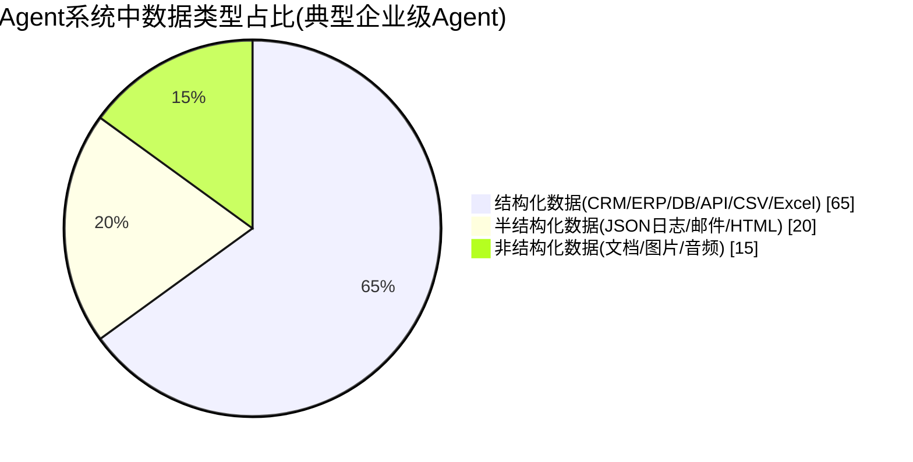

> **关键认知**:虽然 RAG 和 LLM 让 Agent "能读懂文档",但 **Agent 真正"做决策、调工具、写回系统"的操作,95% 以上是结构化数据**——商机金额、报价折扣、订单状态、客户ID、产品SKU、合同条款,这些都是结构化字段。**结构化数据处理不好,RAG再准、LLM再强,Agent也无法完成业务闭环**。

| Agent 类型 | 结构化数据占比 | 典型结构化数据 |
|-----------|:------------:|-------------|
| 采购Agent(120号) | 85% | 采购需求/供应商/报价/订单/合同 |
| 销售Agent(119号) | 80% | 线索/商机/客户/报价/合同/活动 |
| 知识库Agent(118号) | 30% | 文档元数据/权限ACL/用户画像 |
| 数据分析Agent | 95% | 数据集/查询/图表/指标 |
| 客服Agent | 60% | 工单/客户/订单/FAQ |

### 1.2 八大典型故障模式

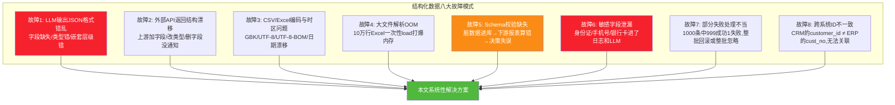

### 1.3 设计目标:RADS五维

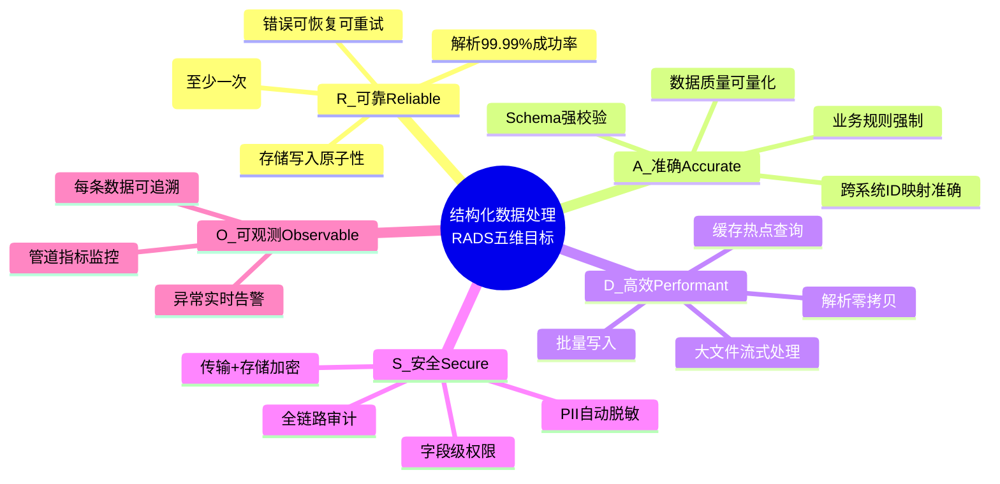

---

## 二、结构化数据处理总体架构

### 2.1 五阶段管道架构

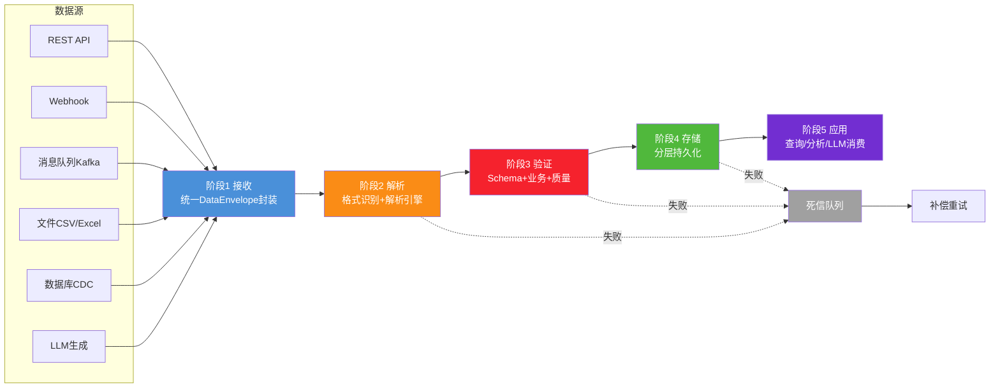

### 2.2 与Agent系统的分层关系

```mermaid
flowchart TB
    subgraph Agent业务层
        B1[采购Agent 120号]
        B2[销售Agent 119号]
        B3[知识库Agent 118号]
    end
    
    subgraph 结构化数据处理中台(本文)
        M1[接收层]
        M2[解析层]
        M3[验证层]
        M4[存储层]
        M5[应用层]
        M6[转换中间件]
        M7[错误处理]
        M8[安全保障]
    end
    
    subgraph 基础设施
        I1[Kafka]
        I2[PostgreSQL]
        I3[Redis]
        I4[MinIO]
        I5[ClickHouse]
    end
    
    B1 & B2 & B3 --> M1
    M5 --> B1 & B2 & B3
    M1 --> M2 --> M3 --> M4 --> M5
    M6 -.贯穿.-> M2 & M5
    M7 -.贯穿.-> M1 & M2 & M3 & M4
    M8 -.贯穿.-> M1 & M3 & M4
    
    M4 --> I2 & I3 & I4 & I5
    M1 --> I1
    
    style M3 fill:#f5222d,color:#fff
    style M4 fill:#50b83c,color:#fff
```

**核心定位**:结构化数据处理是**横切中台**,不绑定任何具体业务Agent,所有业务Agent通过统一管道处理结构化数据,避免每个Agent各搞一套导致的不一致与重复造轮子。

### 2.3 技术选型矩阵

| 阶段 | 组件 | 推荐选型 | 选型理由 |
|------|------|---------|---------|
| **接收** | REST API | FastAPI | 异步、Pydantic原生集成、OpenAPI自动生成 |
| **接收** | 消息队列 | Kafka | 高吞吐、Exactly-Once语义、CDC集成 |
| **接收** | Webhook | FastAPI + HMAC验签 | 轻量、与REST同栈 |
| **解析** | JSON | orjson | 比标准json快10倍 |
| **解析** | CSV | polars / DuckDB | 流式、零拷贝、比pandas快5-10倍 |
| **解析** | Excel | openpyxl(读写) / python-calamine(读) | 大文件calamine快10倍 |
| **解析** | XML | lxml | C实现、XPath支持 |
| **解析** | Parquet/Avro | pyarrow | 列存高效、生态标准 |
| **验证** | Schema | Pydantic v2 | Rust内核、类型友好、生态最广 |
| **验证** | 业务规则 | Drools(Python用simpleeval)/JsonLogic | 可视化规则、非工程师可维护 |
| **存储** | OLTP | PostgreSQL 16 | 强事务、JSONB支持好 |
| **存储** | OLAP | ClickHouse / Doris | 列存、亚秒级聚合 |
| **存储** | 缓存 | Redis 7 | 高性能、数据结构丰富 |
| **存储** | 对象存储 | MinIO / S3 | 大文件、低成本 |
| **转换** | ETL | DuckDB / dbt | 嵌入式SQL转换/版本化 |
| **错误** | 死信 | Kafka DLQ topic | 与主流道同栈、可重放 |

---

## 三、数据接收层设计

### 3.1 六类数据源接收规范

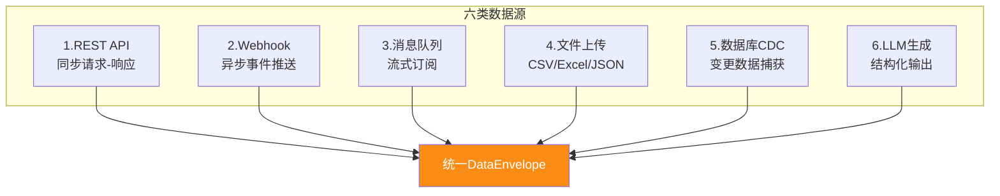

#### 3.1.1 各源接收要点

| 源类型 | 协议/格式 | 可靠性保障 | 关键挑战 |
|--------|---------|-----------|---------|
| **REST API** | HTTP/JSON | 幂等键+重试 | 同步阻塞、超时控制 |
| **Webhook** | HTTP/JSON | HMAC验签+去重 | 安全验签、乱序处理 |
| **Kafka** | Avro/JSON | Exactly-Once | 消费位点管理、rebalance |
| **文件上传** | multipart | 分片+断点续传 | 大文件、编码、病毒扫描 |
| **CDC** | Debezium→Kafka | Offset持久化 | Schema变更、初始全量 |
| **LLM生成** | JSON(函数调用) | 结构化输出+重试 | 幻觉、字段缺失、格式漂移 |

### 3.2 接收层统一抽象:DataEnvelope

> 无论数据来自何方,接收层都将其封装为统一的 `DataEnvelope`,后续阶段无需关心数据源差异。

```python
"""
DataEnvelope: 接收层统一数据封装
所有数据源接入后,统一转为DataEnvelope,屏蔽源差异
"""
from pydantic import BaseModel, Field
from typing import Any, Optional
from datetime import datetime
from enum import Enum
import uuid

class SourceType(str, Enum):
    REST_API = "rest_api"
    WEBHOOK = "webhook"
    KAFKA = "kafka"
    FILE_UPLOAD = "file_upload"
    CDC = "cdc"
    LLM_GENERATED = "llm_generated"

class DataEnvelope(BaseModel):
    """统一数据信封:封装所有进入管道的结构化数据"""
    # —— 标识与溯源 ——
    envelope_id: str = Field(default_factory=lambda: f"env_{uuid.uuid4().hex}")
    source_type: SourceType
    source_id: str = Field(description="源系统标识,如crm_salesforce、erp_sap")
    source_event_id: Optional[str] = Field(None, description="源事件ID,用于幂等去重")
    
    # —— 时间与版本 ——
    received_at: datetime = Field(default_factory=datetime.utcnow)
    source_event_time: Optional[datetime] = Field(None, description="源事件发生时间")
    schema_version: str = Field(default="1.0", description="数据Schema版本")
    
    # —— 载荷 ——
    payload: dict = Field(description="原始载荷,格式由format字段指定")
    payload_format: str = Field(description="json/csv/excel/xml/yaml/parquet")
    payload_encoding: str = Field(default="utf-8")
    
    # —— 上下文 ——
    tenant_id: Optional[str] = Field(None, description="多租户隔离")
    operator_id: Optional[str] = Field(None, description="触发操作的用户/系统")
    trace_id: str = Field(default_factory=lambda: uuid.uuid4().hex, description="全链路追踪ID")
    
    # —— 安全 ——
    sensitivity_level: str = Field(default="internal", description="public/internal/confidential/secret")
    pii_detected: bool = Field(default=False, description="是否含PII,后续触发脱敏")
    
    class Config:
        json_encoders = {datetime: lambda v: v.isoformat()}

# 使用示例:Kafka消息接入
def from_kafka_message(kafka_msg: dict) -> DataEnvelope:
    return DataEnvelope(
        source_type=SourceType.KAFKA,
        source_id=kafka_msg["headers"]["source_system"],
        source_event_id=kafka_msg["key"],
        source_event_time=kafka_msg["timestamp"],
        payload=kafka_msg["value"],
        payload_format="json",
        tenant_id=kafka_msg["headers"].get("tenant_id"),
        trace_id=kafka_msg["headers"].get("trace_id", uuid.uuid4().hex),
    )
```

### 3.3 接收层可靠性保障

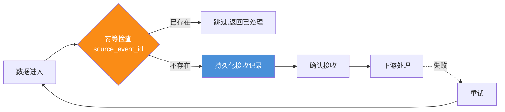

**幂等去重三要素**:
1. **唯一键**: `source_id + source_event_id` 组合唯一
2. **去重表**: PostgreSQL `received_messages(source_id, source_event_id, status, processed_at)`
3. **状态机**: `received → processing → completed / failed`

---

## 四、数据解析层设计

### 4.1 九种格式解析引擎选型

| 格式 | 推荐引擎 | 解析速度 | 适用场景 | 关键陷阱 |
|------|---------|:-------:|---------|---------|
| **JSON** | orjson / ujson | ★★★★★ | API、LLM输出、配置 | 嵌套过深、BOM头、尾逗号 |
| **CSV** | polars / DuckDB | ★★★★★ | 数据导出、批量导入 | 分隔符(逗号/分号/制表符)、引号转义、编码 |
| **Excel** | python-calamine(读)/openpyxl(写) | ★★★★ | 业务报表、人工录入 | 日期序列号、合并单元格、多Sheet |
| **XML** | lxml | ★★★★ | SOAP、旧系统集成、SVG | 命名空间、CDATA、XXE攻击 |
| **YAML** | PyYAML / ruamel.yaml | ★★★ | 配置文件、K8s清单 | !!危险标签(代码执行)、缩进敏感 |
| **Parquet** | pyarrow | ★★★★★ | 大数据列存、数据湖 | Schema演化、嵌套类型 |
| **Avro** | fastavro | ★★★★★ | Kafka消息、Schema Registry | Schema版本兼容 |
| **Protobuf** | protobuf | ★★★★★ | 高性能RPC、内部服务 | 需.proto定义、不可读 |
| **LLM提取** | LLM+JSON Mode | ★ | 自然语言→结构化 | 幻觉、字段缺失、格式漂移 |

#### 4.1.1 解析引擎统一接口

```python
"""
解析引擎统一接口:所有格式解析器实现该接口
便于按格式自动路由 + 新格式扩展
"""
from abc import ABC, abstractmethod
from typing import Iterator, Any
from .envelope import DataEnvelope

class BaseParser(ABC):
    """解析器基类:流式优先,大文件不OOM"""
    
    @abstractmethod
    def parse(self, envelope: DataEnvelope) -> Iterator[dict]:
        """解析为记录迭代器,支持流式"""
        pass
    
    @abstractmethod
    def supported_format(self) -> str:
        pass

class JsonParser(BaseParser):
    def supported_format(self): return "json"
    
    def parse(self, envelope: DataEnvelope):
        import orjson
        data = orjson.loads(envelope.payload["body"])
        # 数组→逐条,对象→单条
        if isinstance(data, list):
            yield from data
        else:
            yield data

class CsvParser(BaseParser):
    def supported_format(self): return "csv"
    
    def parse(self, envelope: DataEnvelope):
        """用polars流式读CSV,避免大文件OOM"""
        import polars as pl
        import io
        
        # 探测分隔符(逗号/分号/制表符)
        sample = envelope.payload["body"][:1024]
        delimiter = self._detect_delimiter(sample)
        encoding = self._detect_encoding(sample)
        
        # 流式读取(lazy)
        df = pl.scan_csv(
            io.BytesIO(envelope.payload["body"]),
            separator=delimiter,
            encoding=encoding,
            try_parse_dates=True,
            infer_schema_length=1000,
        )
        # 按批yield
        for batch in df.collect(streaming=True).iter_slices(n=1000):
            for row in batch.to_dicts():
                yield row
    
    def _detect_delimiter(self, sample: str) -> str:
        for d in [",", ";", "\t", "|"]:
            if d in sample: return d
        return ","
    
    def _detect_encoding(self, sample: bytes) -> str:
        if sample.startswith(b'\xef\xbb\xbf'): return "utf-8"  # BOM
        try:
            sample.decode("utf-8"); return "utf-8"
        except: return "gbk"  # 中文环境fallback

class ExcelParser(BaseParser):
    def supported_format(self): return "excel"
    
    def parse(self, envelope: DataEnvelope):
        """用calamine读Excel,比openpyxl快10倍"""
        from python_calamine import CalamineWorkbook
        import io
        
        wb = CalamineWorkbook.from_filelike(io.BytesIO(envelope.payload["body"]))
        sheet_name = envelope.payload.get("sheet", wb.sheet_names[0])
        sheet = wb.get_sheet_by_name(sheet_name)
        rows = sheet.to_python()
        
        if not rows: return
        headers = [str(h).strip() if h else f"col_{i}" for i, h in enumerate(rows[0])]
        for row in rows[1:]:
            yield dict(zip(headers, row))

class LlmStructuredParser(BaseParser):
    """LLM输出的结构化数据解析(详见4.2)"""
    def supported_format(self): return "llm_structured"
    
    def parse(self, envelope: DataEnvelope):
        # LLM输出已在生成阶段用JSON Mode约束,这里只做容错解析
        import orjson
        raw = envelope.payload["body"]
        # 容错:剥离可能的markdown代码块包裹
        if raw.startswith("```"):
            raw = raw.split("\n", 1)[1].rsplit("```", 1)[0]
        try:
            data = orjson.loads(raw)
        except orjson.JSONDecodeError:
            # 二次容错:用json5解析(允许尾逗号/单引号/注释)
            import json5
            data = json5.loads(raw)
        yield from data if isinstance(data, list) else [data]

# 解析器注册表
PARSERS: dict[str, BaseParser] = {
    p.supported_format(): p() for p in [JsonParser(), CsvParser(), ExcelParser(), LlmStructuredParser()]
}

def get_parser(format: str) -> BaseParser:
    parser = PARSERS.get(format)
    if not parser:
        raise ValueError(f"不支持的格式: {format},支持:{list(PARSERS.keys())}")
    return parser
```

### 4.2 LLM驱动的非结构化→结构化提取

> Agent 最独特的场景:用户用自然语言描述需求,Agent 用 LLM 提取为结构化数据。这是 [120号采购Agent"需求解析模块"](./120智能采购Agent系统完整工程设计方案_需求解析供应商筛选决策引擎流程自动化订单跟踪异常处理接口安全开发计划与测试.md) 的核心能力,本节给出工程化实现。

#### 4.2.1 三层保障:让LLM稳定输出结构化数据

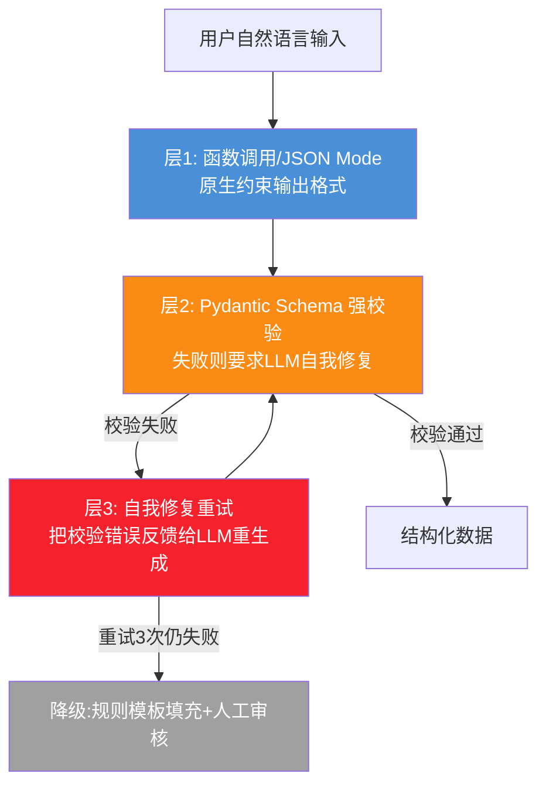

#### 4.2.2 LLM结构化提取参考实现

```python
"""
LLM驱动的结构化数据提取
三层保障:JSON Mode + Schema校验 + 自我修复
"""
from pydantic import BaseModel, Field, ValidationError
from typing import Optional
from openai import OpenAI

client = OpenAI()

# 1. 定义目标Schema(采购需求)
class PurchaseRequirement(BaseModel):
    """采购需求结构化Schema"""
    product_name: str = Field(..., description="采购物品名称,如'笔记本电脑'")
    category: str = Field(..., description="品类,如'IT设备/办公设备/原材料'")
    quantity: int = Field(..., gt=0, description="采购数量,必须>0")
    unit: str = Field(..., description="单位,如'台/个/吨/件'")
    spec: Optional[str] = Field(None, description="规格要求,如'i7/16G/512G'")
    budget_max: Optional[float] = Field(None, gt=0, description="预算上限(元)")
    expected_delivery_date: Optional[str] = Field(None, description="期望交付日期YYYY-MM-DD")
    delivery_location: Optional[str] = Field(None, description="交付地点")
    urgency: str = Field("normal", description="紧急程度:urgent/high/normal/low")
    purpose: Optional[str] = Field(None, description="采购用途说明")

PURCHASE_SYSTEM_PROMPT = """你是采购需求解析专家。将用户的自然语言采购需求转为结构化数据。

## 输出要求
- 严格按JSON Schema输出,不得有任何额外字段或文字
- 字段缺失时填null,不要瞎编
- 数量必须是正整数
- 日期格式必须是YYYY-MM-DD

## 示例
输入:"帮我买20台开发用的笔记本,要i7 32G的,预算1万5一台,下个月15号要送到上海办公室,挺急的"
输出:{
  "product_name": "笔记本电脑",
  "category": "IT设备",
  "quantity": 20,
  "unit": "台",
  "spec": "i7/32G",
  "budget_max": 300000,
  "expected_delivery_date": "2026-09-15",
  "delivery_location": "上海办公室",
  "urgency": "high",
  "purpose": "开发用"
}
"""

def extract_structured_with_retry(
    user_input: str,
    schema_model: type[BaseModel],
    system_prompt: str,
    max_retries: int = 3
) -> dict:
    """
    LLM结构化提取,带自我修复重试
    """
    messages = [
        {"role": "system", "content": system_prompt},
        {"role": "user", "content": user_input},
    ]
    
    last_error = None
    for attempt in range(max_retries):
        # 第1层:用JSON Mode约束输出
        response = client.chat.completions.create(
            model="gpt-4o",
            messages=messages,
            response_format={"type": "json_object"},  # 强制JSON
            temperature=0.1,  # 低温度提高稳定性
        )
        raw_output = response.choices[0].message.content
        
        try:
            # 第2层:Pydantic强校验
            parsed = schema_model.model_validate_json(raw_output)
            return parsed.model_dump()
        except ValidationError as e:
            last_error = e
            # 第3层:自我修复——把错误反馈给LLM重试
            messages.append({"role": "assistant", "content": raw_output})
            messages.append({
                "role": "user",
                "content": f"""你上次的输出有以下校验错误,请修正后重新输出:
{str(e)[:500]}

请严格按Schema重新输出,不要有任何多余文字。"""
            })
    
    # 重试用尽,降级
    raise StructuredExtractionError(
        f"LLM提取失败,重试{max_retries}次仍未通过Schema校验。最后错误:{last_error}"
    )

class StructuredExtractionError(Exception): pass

# 使用示例
if __name__ == "__main__":
    user_text = "采购50吨钢材,Q235B规格,预算控制在200万内,9月底前送到杭州工厂,用于厂房建设"
    result = extract_structured_with_retry(
        user_input=user_text,
        schema_model=PurchaseRequirement,
        system_prompt=PURCHASE_SYSTEM_PROMPT,
    )
    print(result)
    # {'product_name': '钢材', 'category': '原材料', 'quantity': 50, 'unit': '吨', 
    #  'spec': 'Q235B', 'budget_max': 2000000.0, 'expected_delivery_date': '2026-09-30', 
    #  'delivery_location': '杭州工厂', 'urgency': 'normal', 'purpose': '厂房建设'}
```

### 4.3 解析层性能优化

| 优化手段 | 适用场景 | 收益 |
|---------|---------|:----:|
| **流式解析** | 大CSV/Excel/JSONL | 内存占用降90%+ |
| **零拷贝(Arrow)** | 列式数据 | 解析速度5-10× |
| **并行解析** | 多文件批处理 | 吞吐量×N核 |
| **格式预识别** | 混合格式 | 避免试错开销 |
| **解析结果缓存** | 重复文件 | 二次访问0耗时 |
| **Lazy Schema推断** | CSV首N行推断 | 大文件不全扫 |

---

## 五、数据验证层设计

> **验证层是结构化数据处理的"海关"**——所有数据必须过三关,过不了的去死信队列,绝不让脏数据污染存储。

### 5.1 三层验证体系

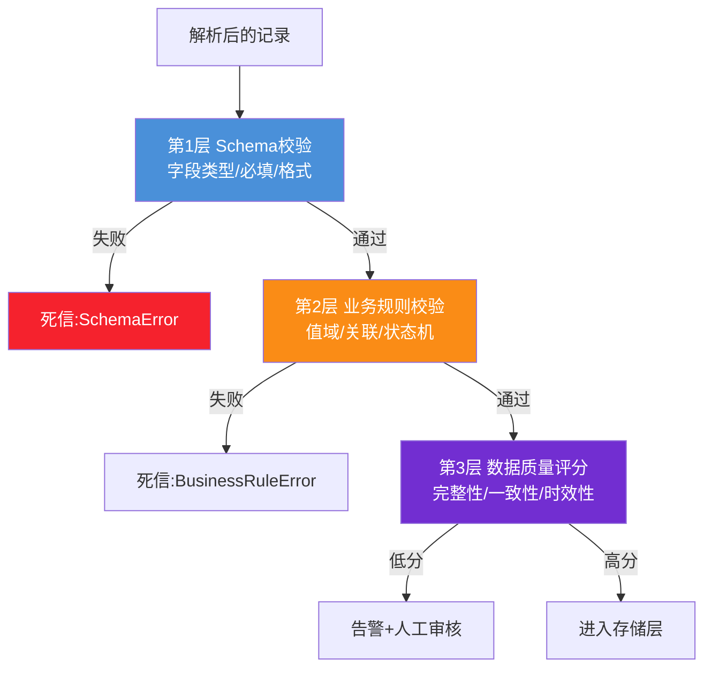

### 5.2 Pydantic Schema 定义与校验实现

#### 5.2.1 完整Schema定义示例(订单数据)

```python
"""
结构化数据Schema定义:订单(跨119销售/120采购通用)
展示Pydantic v2的所有关键校验能力
"""
from pydantic import BaseModel, Field, field_validator, model_validator, ConfigDict
from typing import Optional, Literal
from datetime import date, datetime
from enum import Enum
import re

class OrderStatus(str, Enum):
    DRAFT = "draft"
    PENDING_APPROVAL = "pending_approval"
    APPROVED = "approved"
    REJECTED = "rejected"
    FULFILLED = "fulfilled"
    CANCELLED = "cancelled"

class OrderItem(BaseModel):
    model_config = ConfigDict(extra="forbid")  # 禁止多余字段,防止注入
    
    product_id: str = Field(..., min_length=1, max_length=50, description="产品SKU")
    product_name: str = Field(..., min_length=1, max_length=200)
    quantity: int = Field(..., gt=0, le=100000, description="数量1-10万")
    unit_price: float = Field(..., gt=0, description="单价>0")
    discount_rate: float = Field(0.0, ge=0, le=0.5, description="折扣率0-0.5")
    
    @field_validator("product_id")
    @classmethod
    def validate_product_id_format(cls, v):
        """SKU格式:大写字母+数字,如PROD001"""
        if not re.match(r'^[A-Z]{2,6}\d{3,8}$', v):
            raise ValueError(f"产品ID格式错误,应为2-6位大写字母+3-8位数字,得到:{v}")
        return v
    
    @model_validator(mode="after")
    def validate_discount_reasonableness(self):
        """折扣>30%需要后续审批流触发(这里只标记)"""
        if self.discount_rate > 0.3:
            # 不报错,但标记需审批(通过返回值的context传递)
            object.__setattr__(self, "_needs_approval", True)
        return self
    
    @property
    def net_price(self) -> float:
        return round(self.unit_price * self.quantity * (1 - self.discount_rate), 2)

class Order(BaseModel):
    model_config = ConfigDict(extra="forbid")
    
    order_id: str = Field(..., pattern=r'^ORD\d{12}$', description="订单号ORD+12位数字")
    customer_id: str = Field(..., min_length=1, max_length=50)
    customer_name: str = Field(..., min_length=1, max_length=200)
    items: list[OrderItem] = Field(..., min_length=1, max_length=100, description="1-100个明细")
    status: OrderStatus = OrderStatus.DRAFT
    order_date: date
    expected_delivery_date: Optional[date] = None
    salesperson_id: str = Field(..., min_length=1)
    currency: Literal["CNY", "USD", "EUR"] = "CNY"
    notes: Optional[str] = Field(None, max_length=1000)
    
    @field_validator("expected_delivery_date")
    @classmethod
    def validate_delivery_future(cls, v, info):
        """交付日期必须晚于订单日期"""
        if v and info.data.get("order_date") and v <= info.data["order_date"]:
            raise ValueError("交付日期必须晚于订单日期")
        return v
    
    @model_validator(mode="after")
    def validate_total_amount_reasonable(self):
        """总金额合理性校验(防舞弊)"""
        total = sum(item.net_price for item in self.items)
        if total > 100_000_000:  # 单笔超1亿,触发人工审核
            object.__setattr__(self, "_needs_vp_approval", True)
        if total <= 0:
            raise ValueError("订单总金额必须>0")
        return self
    
    @property
    def total_amount(self) -> float:
        return round(sum(item.net_price for item in self.items), 2)

# 校验示例
valid_order = {
    "order_id": "ORD202608080001",
    "customer_id": "CUST001",
    "customer_name": "阿里巴巴",
    "items": [
        {"product_id": "PROD001", "product_name": "企业版SaaS", "quantity": 10, "unit_price": 50000, "discount_rate": 0.15},
        {"product_id": "SVC002", "product_name": "实施服务", "quantity": 1, "unit_price": 200000, "discount_rate": 0.0}
    ],
    "order_date": "2026-08-08",
    "expected_delivery_date": "2026-09-30",
    "salesperson_id": "SP001"
}

order = Order.model_validate(valid_order)
print(f"订单总金额: ¥{order.total_amount:,.2f}")  # ¥650,000.00

# 校验失败示例
try:
    Order.model_validate({
        "order_id": "INVALID",  # 格式错
        "customer_id": "",
        "items": [],  # 至少1个
        "order_date": "2026-08-08",
        "salesperson_id": "SP001",
        "extra_field": "hack"  # 多余字段
    })
except ValidationError as e:
    print(f"校验失败:\n{e}")
```

### 5.3 业务规则引擎

> Schema校验只能查"格式对不对",业务规则查"值合不合理"。如:折扣不能超底价、客户信用额度不能超、库存不能为负。

```python
"""
业务规则引擎:可配置、可热更新、非工程师可维护
基于JsonLogic,规则存数据库,运行时加载
"""
from typing import Callable
from dataclasses import dataclass
from enum import Enum

class RuleSeverity(str, Enum):
    ERROR = "error"      # 阻断,数据进死信
    WARN = "warn"        # 告警,数据继续但标记
    INFO = "info"        # 记录,不影响

@dataclass
class BusinessRule:
    rule_id: str
    name: str
    description: str
    severity: RuleSeverity
    check: Callable[[dict], tuple[bool, str]]  # 返回(是否通过, 原因)

# 业务规则示例:采购订单
PURCHASE_RULES: list[BusinessRule] = [
    BusinessRule(
        rule_id="PR001",
        name="折扣不超底价",
        description="任何明细的折扣率不能超过该产品的底价规则",
        severity=RuleSeverity.ERROR,
        check=lambda data: (
            all(item["discount_rate"] <= get_product_floor(item["product_id"]) 
                for item in data.get("items", [])),
            "存在折扣超过底价的明细"
        )
    ),
    BusinessRule(
        rule_id="PR002",
        name="客户信用额度",
        description="订单总金额不能超过客户的信用额度",
        severity=RuleSeverity.ERROR,
        check=lambda data: (
            data.get("total_amount", 0) <= get_customer_credit(data["customer_id"]),
            f"订单金额{data.get('total_amount')}超过客户信用额度"
        )
    ),
    BusinessRule(
        rule_id="PR003",
        name="战略客户VIP折扣审批",
        description="战略客户折扣>20%需VP审批",
        severity=RuleSeverity.WARN,
        check=lambda data: (
            not (is_strategic_customer(data["customer_id"]) and 
                 any(i["discount_rate"] > 0.2 for i in data.get("items", []))),
            "战略客户折扣>20%,需触发VP审批流"
        )
    ),
    BusinessRule(
        rule_id="PR004",
        name="非工作日订单提醒",
        description="周末/节假日下单需人工确认",
        severity=RuleSeverity.INFO,
        check=lambda data: (
            is_business_day(data["order_date"]),
            "非工作日下单,建议人工确认"
        )
    ),
]

def apply_business_rules(data: dict, rules: list[BusinessRule]) -> dict:
    """应用业务规则,返回检查结果"""
    results = {"passed": True, "errors": [], "warnings": [], "infos": []}
    for rule in rules:
        try:
            ok, reason = rule.check(data)
            if not ok:
                if rule.severity == RuleSeverity.ERROR:
                    results["errors"].append({"rule_id": rule.rule_id, "reason": reason})
                    results["passed"] = False
                elif rule.severity == RuleSeverity.WARN:
                    results["warnings"].append({"rule_id": rule.rule_id, "reason": reason})
                else:
                    results["infos"].append({"rule_id": rule.rule_id, "reason": reason})
        except Exception as e:
            # 规则执行异常,按ERROR处理(防御性)
            results["errors"].append({"rule_id": rule.rule_id, "reason": f"规则执行异常:{e}"})
            results["passed"] = False
    return results
```

### 5.4 数据质量评分

```python
"""
数据质量评分:对每条数据打0-100分,低分进人工审核
六个维度:完整性/准确性/一致性/时效性/唯一性/合理性
"""
def compute_quality_score(record: dict, schema_rules: dict) -> dict:
    score_card = {}
    
    # 1. 完整性:必填字段非空率
    required = schema_rules.get("required_fields", [])
    filled = sum(1 for f in required if record.get(f) not in (None, "", []))
    score_card["completeness"] = filled / len(required) * 100 if required else 100
    
    # 2. 准确性:格式正确率(如邮箱/手机号/日期)
    format_fields = schema_rules.get("format_fields", {})
    if format_fields:
        valid = sum(1 for f, pattern in format_fields.items() 
                    if re.match(pattern, str(record.get(f, ""))))
        score_card["accuracy"] = valid / len(format_fields) * 100
    else:
        score_card["accuracy"] = 100
    
    # 3. 一致性:跨字段逻辑(如交付日期>订单日期)
    consistency_checks = schema_rules.get("consistency_checks", [])
    if consistency_checks:
        passed = sum(1 for check in consistency_checks if check(record))
        score_card["consistency"] = passed / len(consistency_checks) * 100
    else:
        score_card["consistency"] = 100
    
    # 4. 时效性:数据更新是否及时(对比source_event_time与now)
    if "source_event_time" in record:
        age_hours = (datetime.utcnow() - record["source_event_time"]).total_seconds() / 3600
        score_card["timeliness"] = max(0, 100 - age_hours * 2)  # 每小时扣2分
    else:
        score_card["timeliness"] = 100
    
    # 5. 唯一性:主键是否重复(需查库,这里简化)
    score_card["uniqueness"] = 100  # 实际由幂等去重保障
    
    # 6. 合理性:值域是否合理(如金额在0-1亿之间)
    score_card["reasonableness"] = 100  # 由业务规则引擎覆盖
    
    # 综合分(加权)
    weights = {"completeness": 0.3, "accuracy": 0.25, "consistency": 0.2,
               "timeliness": 0.1, "uniqueness": 0.1, "reasonableness": 0.05}
    total = sum(score_card[k] * w for k, w in weights.items())
    
    return {"total_score": round(total, 1), "dimensions": score_card}
```

---

## 六、数据存储层设计

### 6.1 分层存储策略

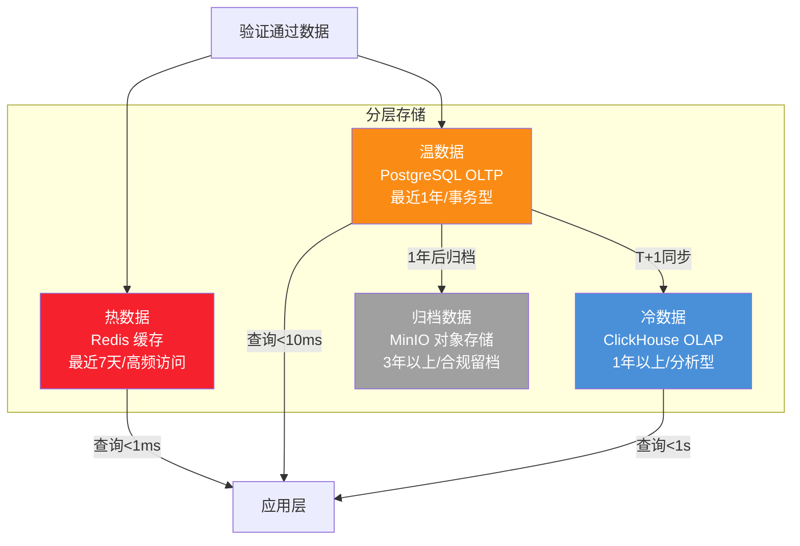

#### 6.1.1 各层定位与选型

| 层级 | 存储 | 存什么 | 查询模式 | 期望延迟 |
|:----:|------|-------|---------|:-------:|
| **热** | Redis | 客户画像、会话上下文、热点订单 | KV/Hash | <1ms |
| **温** | PostgreSQL | 当前业务数据(订单/客户/商机) | 事务/JOIN | <10ms |
| **冷** | ClickHouse | 历史数据、日志、事件流 | 聚合/扫描 | <1s |
| **归档** | MinIO/S3 | 合规留档、原始文件 | 偶发访问 | <10s |
| **向量** | Milvus | 结构化数据的语义检索(见§11.1) | ANN | <50ms |

### 6.2 核心数据模型规范

#### 6.2.1 结构化数据存储三原则

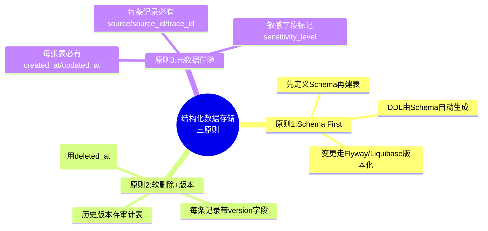

#### 6.2.2 通用表结构模板

```sql
-- 通用结构化数据表模板(以订单为例)
CREATE TABLE orders (
    -- 主键与业务键
    id BIGSERIAL PRIMARY KEY,
    order_id VARCHAR(20) UNIQUE NOT NULL,  -- 业务键,带唯一索引
    
    -- 业务字段(由Schema生成)
    customer_id VARCHAR(50) NOT NULL,
    customer_name VARCHAR(200) NOT NULL,
    status VARCHAR(20) NOT NULL DEFAULT 'draft',
    order_date DATE NOT NULL,
    total_amount DECIMAL(15,2) NOT NULL,
    currency VARCHAR(3) DEFAULT 'CNY',
    
    -- 明细(JSONB,兼顾灵活与查询)
    items JSONB NOT NULL,
    
    -- 元数据(所有表必备)
    source VARCHAR(30) NOT NULL,           -- 数据来源:crm/erp/api/manual
    source_id VARCHAR(100),                -- 源系统ID,用于幂等
    trace_id VARCHAR(64),                  -- 全链路追踪
    schema_version VARCHAR(10) DEFAULT '1.0',
    sensitivity_level VARCHAR(20) DEFAULT 'internal',
    
    -- 审计字段(所有表必备)
    created_at TIMESTAMPTZ DEFAULT NOW(),
    updated_at TIMESTAMPTZ DEFAULT NOW(),
    created_by VARCHAR(50),
    updated_by VARCHAR(50),
    deleted_at TIMESTAMPTZ,                -- 软删除标记
    version INT DEFAULT 1,                 -- 乐观锁版本
    
    -- 索引
    CONSTRAINT chk_order_id_format CHECK (order_id ~ '^ORD\d{12}$'),
    CONSTRAINT chk_amount_positive CHECK (total_amount > 0)
);

-- 关键索引
CREATE INDEX idx_orders_customer ON orders(customer_id) WHERE deleted_at IS NULL;
CREATE INDEX idx_orders_status_date ON orders(status, order_date DESC) WHERE deleted_at IS NULL;
CREATE INDEX idx_orders_source ON orders(source, source_id) WHERE deleted_at IS NULL;
CREATE INDEX idx_orders_items_gin ON orders USING GIN (items jsonb_path_ops);  -- JSONB查询

-- 更新时间触发器
CREATE TRIGGER trg_orders_updated_at 
    BEFORE UPDATE ON orders 
    FOR EACH ROW EXECUTE FUNCTION update_updated_at();
```

### 6.3 存储层写入可靠性

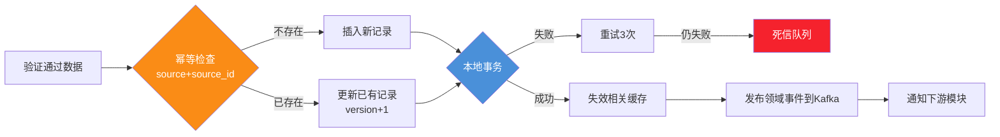

**写入可靠性四要素**:
1. **幂等**: `source + source_id` 唯一约束,重试不产生重复
2. **事务**: 主表+明细+审计日志在同一本地事务
3. **缓存失效**: 写DB后删缓存(非更新),采用 Cache-Aside 模式
4. **事件发布**: 用 Outbox 模式保证"DB写入"与"事件发布"原子性

---

## 七、数据应用层设计

### 7.1 五种消费场景

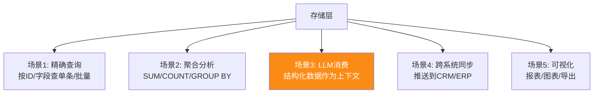

### 7.2 LLM消费结构化数据的Prompt规范

> **关键工程问题**:如何把结构化数据"喂"给LLM,让它准确理解又不浪费Token?这是119/120号Agent都遇到的核心问题。

#### 7.2.1 三种喂法对比

| 喂法 | 示例 | Token消耗 | LLM理解度 | 适用场景 |
|------|------|:--------:|:--------:|---------|
| **原始JSON** | `{"customer":"阿里","amount":500000}` | 中 | ★★★ | 简单数据 |
| **Markdown表格** | 见下 | 高 | ★★★★★ | 多记录对比 |
| **自然语言描述** | "客户阿里,金额50万" | 低 | ★★★★ | 单记录摘要 |

#### 7.2.2 推荐做法:Markdown表格 + 字段说明

```python
"""
结构化数据→LLM上下文 的最佳转换
平衡Token效率与LLM理解度
"""
def structured_to_llm_context(
    records: list[dict],
    fields: list[tuple[str, str]],  # (字段名, 中文名说明)
    max_records: int = 20
) -> str:
    """
    将结构化记录转为LLM友好的Markdown表格上下文
    
    fields: [("customer_id", "客户编号"), ("amount", "订单金额(元)")]
    """
    if not records:
        return "(无相关数据)"
    
    records = records[:max_records]  # 限制条数防Token爆炸
    
    # 表头
    header = "| " + " | ".join(cn for _, cn in fields) + " |"
    separator = "| " + " | ".join("---" for _ in fields) + " |"
    
    # 数据行
    rows = []
    for r in records:
        row = "| " + " | ".join(str(r.get(f, "")) for f, _ in fields) + " |"
        rows.append(row)
    
    table = "\n".join([header, separator] + rows)
    
    # 字段说明(帮助LLM理解字段含义)
    field_desc = "\n".join(f"- {cn}({f}): {r.get(f, '')}" for f, cn in fields[:3])
    
    return f"""以下是{len(records)}条相关数据:

{table}

字段说明:
{field_desc}

(共{len(records)}条,已截断至最近{max_records}条)"""

# 使用示例
orders = [
    {"order_id": "ORD001", "customer_name": "阿里", "amount": 500000, "status": "approved"},
    {"order_id": "ORD002", "customer_name": "腾讯", "amount": 300000, "status": "pending"},
]
context = structured_to_llm_context(
    orders,
    fields=[("order_id", "订单号"), ("customer_name", "客户"), ("amount", "金额(元)"), ("status", "状态")]
)
print(context)
```

输出:
```markdown
以下是2条相关数据:

| 订单号 | 客户 | 金额(元) | 状态 |
| --- | --- | --- | --- |
| ORD001 | 阿里 | 500000 | approved |
| ORD002 | 腾讯 | 300000 | pending |

字段说明:
- 订单号(order_id): ORD001
- 客户(customer_name): 阿里
- 金额(元)(amount): 500000

(共2条,已截断至最近20条)
```

### 7.3 查询性能优化

| 优化手段 | 场景 | 效果 |
|---------|------|:----:|
| **索引覆盖** | 高频查询字段建复合索引 | 10-100× |
| **缓存热点** | Redis缓存查询结果 | 100× |
| **读写分离** | 分析查询走从库/OLAP | 主库减压 |
| **物化视图** | 复杂聚合预计算 | 1000× |
| **分页优化** | 用游标分页替代OFFSET | 大数据集稳定 |
| **JSONB GIN索引** | JSON字段查询 | 10× |

---

## 八、格式转换中间件

### 8.1 18种常见转换路径

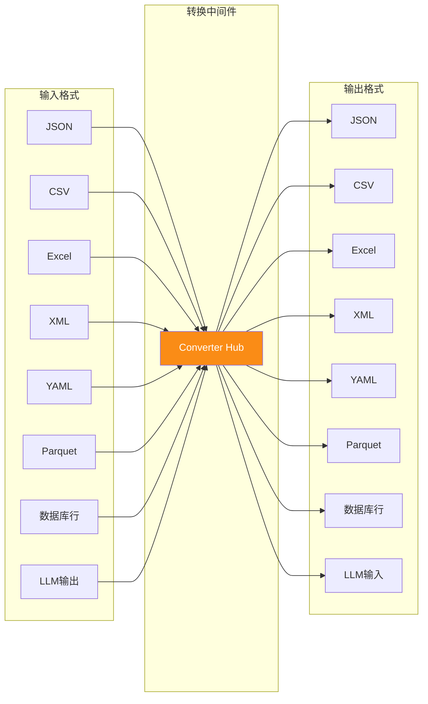

**18种高频转换路径**(8输入×8输出=64组合,实际常用18种):

| 转换 | 场景 | 工具 |
|------|------|------|
| JSON→CSV | API数据导出报表 | pandas/polars |
| CSV→JSON | 文件导入API | polars |
| Excel→JSON | 业务报表导入 | calamine |
| JSON→Excel | 数据导出给业务 | openpyxl |
| JSON→Parquet | 入数据湖 | pyarrow |
| Parquet→JSON | 数据湖查询 | pyarrow |
| DB→JSON | API响应 | ORM序列化 |
| JSON→DB | API写入 | ORM反序列化 |
| XML→JSON | 旧系统集成 | xmltodict |
| JSON→XML | SOAP接口 | dicttoxml |
| YAML→JSON | 配置解析 | PyYAML |
| LLM→JSON | LLM结构化输出 | 见§4.2 |
| JSON→LLM | LLM上下文 | 见§7.2 |
| CSV→Parquet | 批量入湖 | DuckDB |
| JSON→JSON | Schema映射转换 | JQ/DictPath |
| DB→CSV | 数据导出 | psql COPY |
| Excel→CSV | 格式标准化 | calamine+csv |
| JSON→YAML | 配置生成 | PyYAML |

### 8.2 转换中间件架构

```python
"""
格式转换中间件:统一接口、链式调用、零拷贝优化
"""
from typing import Any, Callable
from dataclasses import dataclass

@dataclass
class ConversionResult:
    data: Any
    format: str
    metadata: dict  # 转换过程中的统计信息

class Converter:
    def __init__(self):
        self._converters: dict[tuple[str, str], Callable] = {}
        self._register_builtins()
    
    def convert(self, data: Any, from_format: str, to_format: str, **opts) -> ConversionResult:
        """格式转换主入口"""
        if from_format == to_format:
            return ConversionResult(data=data, format=from_format, metadata={"converted": 0})
        
        key = (from_format, to_format)
        # 直接转换
        if key in self._converters:
            converter = self._converters[key]
            result = converter(data, **opts)
            return ConversionResult(data=result, format=to_format, 
                                     metadata={"converted": 1, "path": f"{from_format}->{to_format}"})
        
        # 间接转换:经由中间格式JSON(任意→JSON→任意)
        if from_format != "json" and to_format != "json":
            to_json = self._converters.get((from_format, "json"))
            from_json = self._converters.get(("json", to_format))
            if to_json and from_json:
                json_data = to_json(data, **opts)
                result = from_json(json_data, **opts)
                return ConversionResult(data=result, format=to_format,
                                         metadata={"converted": 1, "path": f"{from_format}->json->{to_format}"})
        
        raise ValueError(f"不支持的转换:{from_format}->{to_format}")
    
    def _register_builtins(self):
        # JSON <-> CSV
        self._converters[("json", "csv")] = self._json_to_csv
        self._converters[("csv", "json")] = self._csv_to_json
        # JSON <-> Excel
        self._converters[("json", "excel")] = self._json_to_excel
        self._converters[("excel", "json")] = self._excel_to_json
        # ... 其余转换器
    
    def _json_to_csv(self, data: list[dict], **opts) -> bytes:
        import polars as pl
        df = pl.DataFrame(data)
        import io
        buf = io.BytesIO()
        df.write_csv(buf)
        return buf.getvalue()
    
    def _csv_to_json(self, data: bytes, **opts) -> list[dict]:
        import polars as pl, io
        df = pl.read_csv(io.BytesIO(data), try_parse_dates=True)
        return df.to_dicts()

# 使用
conv = Converter()
csv_bytes = conv.convert(
    [{"name": "张三", "age": 30}, {"name": "李四", "age": 25}],
    from_format="json", to_format="csv"
)
```

### 8.3 转换中的陷阱与防范

| 陷阱 | 表现 | 防范 |
|------|------|------|
| **日期时区漂移** | Excel日期读出来差8小时 | 显式指定时区,用`datetime`而非`date` |
| **数值精度丢失** | 金额float转int丢小数 | 全程用Decimal,禁用float存金额 |
| **编码混乱** | CSV中文乱码 | 探测BOM,默认UTF-8,中文环境fallback GBK |
| **空值语义不一致** | NULL/空串/None/NaN混用 | 统一为None,转换时显式映射 |
| **嵌套结构丢失** | JSON嵌套转CSV被压平 | 用JSONB列存,或扁平化+关联表 |
| **大整数溢出** | ID转float丢精度 | 用字符串传输ID,禁用float |
| **Schema漂移** | 源加字段目标没加 | 转换器用Schema驱动,extra="forbid" |

---

## 九、错误处理机制

### 9.1 四层错误处理模型

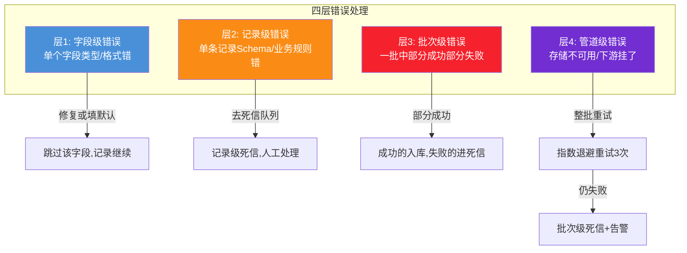

### 9.2 死信队列与补偿机制

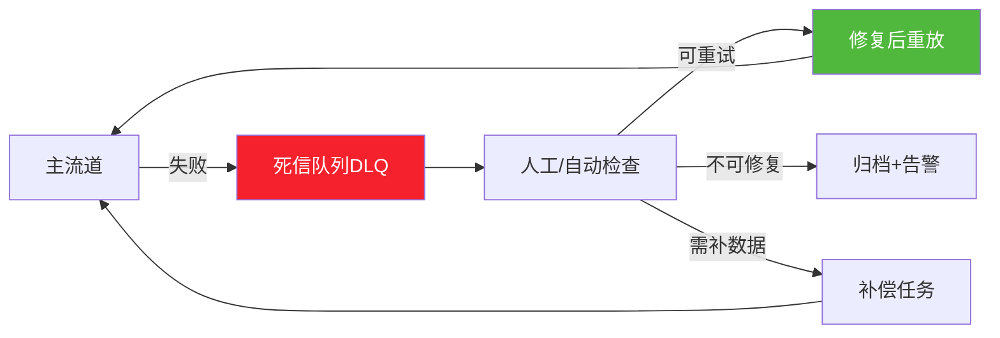

**死信消息结构**:
```json
{
  "dlq_id": "dlq_abc123",
  "original_envelope_id": "env_xyz789",
  "failed_stage": "validate",
  "error_type": "ValidationError",
  "error_message": "discount_rate 0.6 > 0.5 上限",
  "error_stack": "...",
  "original_payload": {...},
  "failed_at": "2026-08-08T10:30:00Z",
  "retry_count": 0,
  "max_retry": 3,
  "next_retry_at": "2026-08-08T10:35:00Z",
  "tenant_id": "tenant_001",
  "trace_id": "trace_xxx"
}
```

### 9.3 错误处理参考实现

```python
"""
管道错误处理:四层分级 + 死信 + 重试 + 补偿
"""
from typing import Callable, Any
from dataclasses import dataclass
from enum import Enum
import asyncio
import structlog

logger = structlog.get_logger()

class ErrorSeverity(str, Enum):
    FIELD = "field"        # 字段级:跳过字段
    RECORD = "record"      # 记录级:进死信
    BATCH = "batch"        # 批次级:部分成功
    PIPELINE = "pipeline"  # 管道级:整体重试

@dataclass
class ProcessingResult:
    success_count: int = 0
    failed_count: int = 0
    errors: list = None
    dlq_messages: list = None

async def process_batch(
    records: list[dict],
    schema_validator: Callable,
    business_rules: list,
    storage_writer: Callable,
    dlq_producer: Callable,
    max_retries: int = 3
) -> ProcessingResult:
    """批处理:字段→记录→批次→管道 四层错误处理"""
    result = ProcessingResult(errors=[], dlq_messages=[])
    
    for record in records:
        try:
            # 层1+2: Schema校验 + 业务规则
            validated = schema_validator(record)
            rule_result = apply_business_rules(validated, business_rules)
            if not rule_result["passed"]:
                raise BusinessRuleError(rule_result["errors"])
            
            # 层4: 存储写入(带重试)
            await write_with_retry(
                storage_writer, validated, 
                max_retries=max_retries,
                dlq_producer=dlq_producer,
                envelope_id=record.get("envelope_id")
            )
            result.success_count += 1
            
        except ValidationError as e:
            # 层2: 记录级错误→死信
            logger.warning("record_validation_failed", 
                          error=str(e), record_id=record.get("id"))
            result.failed_count += 1
            result.dlq_messages.append({
                "original": record,
                "error_type": "ValidationError",
                "error": str(e),
                "stage": "validate"
            })
            await dlq_producer.send(result.dlq_messages[-1])
            
        except BusinessRuleError as e:
            # 层2: 业务规则失败→死信
            logger.warning("business_rule_failed",
                          error=str(e), record_id=record.get("id"))
            result.failed_count += 1
            result.dlq_messages.append({
                "original": record,
                "error_type": "BusinessRuleError",
                "error": str(e),
                "stage": "business_rule"
            })
            await dlq_producer.send(result.dlq_messages[-1])
            
        except Exception as e:
            # 层4: 未预期错误→死信+告警
            logger.error("unexpected_error", 
                        error=str(e), record_id=record.get("id"),
                        exc_info=True)
            result.failed_count += 1
            await dlq_producer.send({
                "original": record,
                "error_type": type(e).__name__,
                "error": str(e),
                "stage": "unknown"
            })
            # 严重错误触发告警
            if result.failed_count > len(records) * 0.1:  # 失败率>10%
                await send_alert("batch_failure_rate_high", 
                                f"批次失败率{result.failed_count/len(records)*100:.1f}%")
    
    return result

async def write_with_retry(writer, data, max_retries, dlq_producer, envelope_id):
    """层4: 存储写入指数退避重试"""
    for attempt in range(max_retries):
        try:
            await writer(data)
            return
        except Exception as e:
            if attempt == max_retries - 1:
                await dlq_producer.send({
                    "original": data,
                    "error_type": "StorageWriteError",
                    "error": str(e),
                    "stage": "storage",
                    "envelope_id": envelope_id
                })
                raise
            wait = 2 ** attempt  # 1s, 2s, 4s
            logger.warning("write_retry", attempt=attempt+1, wait=wait, error=str(e))
            await asyncio.sleep(wait)

class BusinessRuleError(Exception): pass
```

---

## 十、数据安全保障

### 10.1 五维安全防护

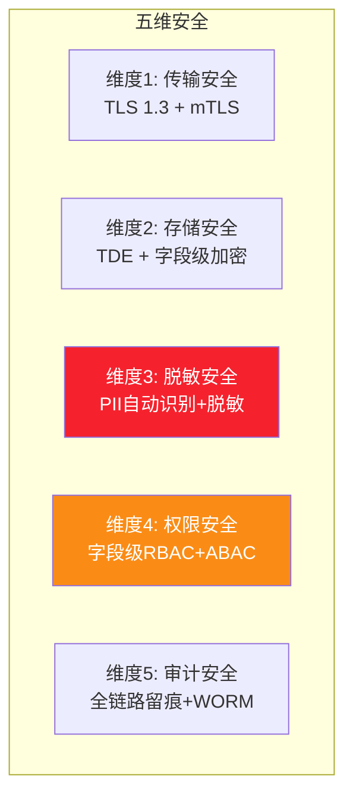

| 维度 | 措施 | 实现要点 |
|------|------|---------|
| **传输** | TLS 1.3强制 | 所有API/组件间通信HTTPS;mTLS用于服务间 |
| **存储** | TDE + 字段加密 | 数据库TDE透明加密;身份证/银行卡等字段AES-256-GCM |
| **脱敏** | PII识别+脱敏 | 用Presidio/Microsoft识别18类PII;日志/LLM上下文必脱敏 |
| **权限** | 字段级RBAC | 普通销售只看自己客户;财务字段仅财务可见 |
| **审计** | 全链路留痕 | 读写操作记audit_log;敏感操作WORM不可篡改 |

### 10.2 敏感数据脱敏实现

```python
"""
PII识别与脱敏:进入日志/LLM上下文前必须脱敏
"""
import re
from dataclasses import dataclass
from typing import Any

# PII识别正则库
PII_PATTERNS = {
    "id_card": (r'\b[1-9]\d{5}(?:19|20)\d{2}(?:0[1-9]|1[0-2])(?:0[1-9]|[12]\d|3[01])\d{3}[\dXx]\b', 
                lambda m: m.group()[:6] + "********" + m.group()[-4:]),
    "phone": (r'\b1[3-9]\d{9}\b', 
              lambda m: m.group()[:3] + "****" + m.group()[-4:]),
    "bank_card": (r'\b[1-9]\d{14,18}\b', 
                  lambda m: m.group()[:4] + "********" + m.group()[-4:]),
    "email": (r'\b[A-Za-z0-9._%+-]+@[A-Za-z0-9.-]+\.[A-Z|a-z]{2,}\b',
              lambda m: m.group()[:2] + "***@" + m.group().split("@")[1]),
    "ip": (r'\b(?:\d{1,3}\.){3}\d{1,3}\b',
           lambda m: re.sub(r'\.\d+$', '.***', m.group())),
}

def mask_pii(text: str, patterns: dict = PII_PATTERNS) -> tuple[str, list]:
    """脱敏文本中的PII,返回(脱敏后文本, 命中清单)"""
    hits = []
    masked = text
    for pii_type, (pattern, masker) in patterns.items():
        def replace_and_log(m, t=pii_type):
            hits.append({"type": t, "original_length": len(m.group())})
            return masker(m)
        masked = re.sub(pattern, replace_and_log, masked)
    return masked, hits

def mask_pii_in_dict(data: dict) -> tuple[dict, list]:
    """递归脱敏dict中的PII(用于日志/LLM上下文)"""
    all_hits = []
    def _walk(obj):
        if isinstance(obj, dict):
            return {k: _walk(v) for k, v in obj.items()}
        elif isinstance(obj, list):
            return [_walk(item) for item in obj]
        elif isinstance(obj, str):
            masked, hits = mask_pii(obj)
            all_hits.extend(hits)
            return masked
        return obj
    masked_data = _walk(data)
    return masked_data, all_hits

# 使用:写日志前脱敏
import structlog
logger = structlog.get_logger()

def safe_log(event: str, **kwargs):
    """安全日志:自动脱敏所有字符串值"""
    masked_kwargs, hits = mask_pii_in_dict(kwargs)
    if hits:
        masked_kwargs["_pii_masked"] = f"{len(hits)}个PII已脱敏"
    logger.info(event, **masked_kwargs)

# 使用:喂给LLM前脱敏
def safe_llm_context(data: dict) -> dict:
    """进入LLM上下文前必脱敏"""
    masked, hits = mask_pii_in_dict(data)
    if hits:
        # 记录审计:谁在何时把含PII的数据发给了LLM
        audit_log("pii_to_llm", pii_count=len(hits), pii_types=list({h["type"] for h in hits}))
    return masked
```

### 10.3 审计与合规

```sql
-- 审计日志表(WORM:只允许INSERT,不允许UPDATE/DELETE)
CREATE TABLE audit_log (
    id BIGSERIAL PRIMARY KEY,
    event_time TIMESTAMPTZ NOT NULL DEFAULT NOW(),
    actor_id VARCHAR(50) NOT NULL,          -- 操作人
    actor_type VARCHAR(20) NOT NULL,        -- user/system/agent
    action VARCHAR(50) NOT NULL,            -- create/read/update/delete/export
    resource_type VARCHAR(50) NOT NULL,     -- order/customer/quote
    resource_id VARCHAR(100),               -- 资源ID
    tenant_id VARCHAR(50),
    trace_id VARCHAR(64),
    ip_address INET,
    user_agent TEXT,
    before_state JSONB,                     -- 变更前(UPDATE/DELETE)
    after_state JSONB,                      -- 变更后(CREATE/UPDATE)
    pii_accessed TEXT[],                    -- 访问了哪些PII字段
    risk_level VARCHAR(20) DEFAULT 'low',   -- low/medium/high
    CONSTRAINT chk_worm READ_ONLY  -- 逻辑约束(实际用触发器+权限)
);

-- 禁止UPDATE/DELETE的触发器
CREATE OR REPLACE FUNCTION prevent_modify_audit() RETURNS TRIGGER AS $$
BEGIN
    RAISE EXCEPTION 'audit_log表只允许INSERT,禁止修改';
END;
$$ LANGUAGE plpgsql;

CREATE TRIGGER trg_audit_no_update BEFORE UPDATE ON audit_log
    FOR EACH ROW EXECUTE FUNCTION prevent_modify_audit();
CREATE TRIGGER trg_audit_no_delete BEFORE DELETE ON audit_log
    FOR EACH ROW EXECUTE FUNCTION prevent_modify_audit();

-- 合规留存:3年(满足SOX/等保/个保法)
ALTER TABLE audit_log SET (autovacuum_enabled = true);
-- 3年后用分区表自动归档
```

---

## 十一、与其它模块的交互方式

### 11.1 与 RAG 模块的交互

```mermaid
flowchart LR
    subgraph 结构化数据处理
        SD[结构化数据<br/>如客户/订单]
    end
    
    subgraph RAG模块(118号文档)
        EMB[Embedding]
        VDB[(向量库)]
        RET[检索]
    end
    
    SD -->|元数据+摘要文本| EMB
    EMB --> VDB
    SD -->|原始结构化| PG[(PostgreSQL)]
    
    QUERY[用户查询] --> RET
    RET --> VDB
    RET -->|过滤条件| PG
    RET -->|混合检索| RESULT[结构化+语义结果]
    
    style SD fill:#fa8c16,color:#fff
    style VDB fill:#4a90d9,color:#fff
```

**交互契约**:
- **结构化数据→RAG**:把记录的关键字段拼接为"可检索文本"(如`客户:阿里 | 行业:互联网 | 金额:500万 | 状态:成交`),Embedding后存向量库,**元数据存结构化字段**用于过滤
- **RAG→结构化数据**:检索时先按结构化条件过滤(如`行业=金融 AND 金额>100万`),再语义匹配
- **关键**:向量库的payload必须包含原始记录的ID,以便回查完整结构化数据

### 11.2 与 Tool Calling 模块的交互

> 结构化数据处理是Tool Calling的"输入输出格式化层"。参考 [89号企业级Tool Calling文档](../7Tool%20Calling/89企业级Agent工具调用系统完整设计方案.md) 和 [91号Tool Schema文档](../7Tool%20CallingFunctionCalling/91ToolSchema完整设计规范深度解析.md)。

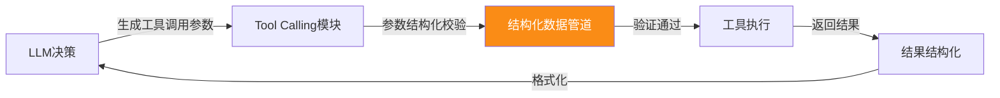

**交互契约**:
- **入参**:LLM生成的工具参数本质是结构化数据,必须经过§5验证层校验才能执行工具(防止LLM幻觉参数打挂下游)
- **出参**:工具返回结果统一封装为`ToolResult`结构化对象,再转LLM上下文(§7.2)

### 11.3 与多Agent协作模块的交互

> 参考 [110号Supervisor文档](../8多Agent系统/110SupervisorAgent核心概念与架构设计深度解析.md) 和 [112号通信机制文档](../8多Agent系统/112多Agent系统通信机制设计与实现深度解析.md)。

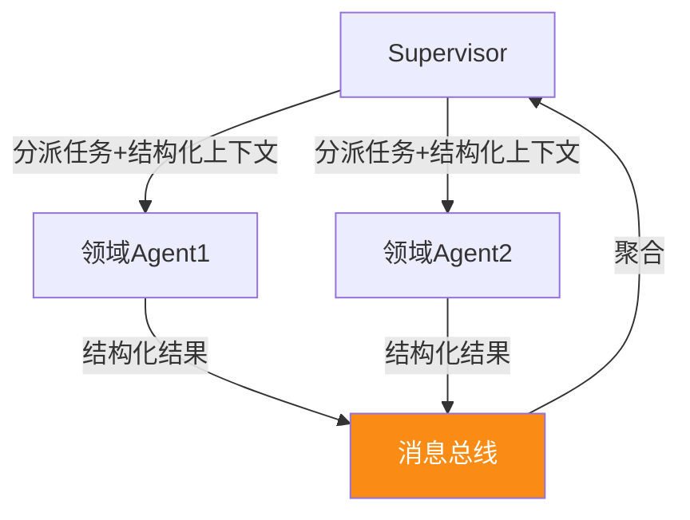

**交互契约**:
- **任务分派**:Supervisor发给子Agent的任务是结构化的`TaskEnvelope`(任务ID/类型/输入数据/约束/超时)
- **结果回传**:子Agent返回`ResultEnvelope`(任务ID/状态/输出数据/日志/异常)
- **消息格式**:统一用JSON Schema定义,通过Kafka/Redis Stream传输

### 11.4 与外部系统的交互

```mermaid
flowchart LR
    subgraph 外部系统
        CRM[CRM<br/>Salesforce/纷享]
        ERP[ERP<br/>SAP/用友/金蝶]
        IM[企微/钉钉]
    end
    
    subgraph 结构化数据中台
        ADAPT[适配器层]
        PIPE[处理管道]
    end
    
    CRM <-->|OpenAPI/JSON| ADAPT
    ERP <-->|OpenAPI/JSON| ADAPT
    IM <-->|Webhook/JSON| ADAPT
    ADAPT <--> PIPE
    
    style ADAPT fill:#fa8c16,color:#fff
```

**适配器模式**:
- 每个外部系统一个Adapter,负责"系统特有格式↔统一Schema"的双向转换
- Adapter向上屏蔽系统差异,管道只处理统一Schema
- 新增系统只需新增Adapter,管道代码零改动(开闭原则)

---

## 十二、实现案例与最佳实践

### 12.1 案例一:采购需求自然语言→结构化(对接120号采购Agent)

```python
"""
案例一:对接120号采购Agent的"需求解析模块"
用户:"帮我采购20台开发用的MacBook Pro M3,32G内存,1T硬盘,预算2万5一台,9月15前送到上海,挺急的"
→ 结构化采购需求 → 进入采购流程
"""
from pydantic import BaseModel, Field
from typing import Optional
from datetime import date

class PurchaseRequirement(BaseModel):
    """采购需求结构化(简化版,完整版见120号文档)"""
    product_name: str
    category: str
    quantity: int = Field(gt=0)
    unit: str
    spec: Optional[str] = None
    unit_budget_max: Optional[float] = Field(None, gt=0)
    total_budget_max: Optional[float] = Field(None, gt=0)
    expected_delivery_date: Optional[str] = None
    delivery_location: Optional[str] = None
    urgency: str = "normal"
    purpose: Optional[str] = None

# 端到端处理:接收(自然语言) → 解析(LLM提取) → 验证(Schema) → 存储(入库) → 应用(触发采购流)
async def handle_purchase_request(user_text: str, user_id: str) -> dict:
    # 1. 接收:封装为DataEnvelope
    envelope = DataEnvelope(
        source_type=SourceType.LLM_GENERATED,
        source_id="user_input",
        payload={"body": user_text, "user_id": user_id},
        payload_format="llm_structured",
        operator_id=user_id,
    )
    
    # 2. 解析:LLM结构化提取(§4.2)
    structured = extract_structured_with_retry(
        user_input=user_text,
        schema_model=PurchaseRequirement,
        system_prompt=PURCHASE_SYSTEM_PROMPT,
    )
    
    # 3. 验证:业务规则(折扣/预算/紧急程度)
    rule_result = apply_business_rules(structured, PURCHASE_RULES)
    if not rule_result["passed"]:
        return {"status": "rejected", "errors": rule_result["errors"]}
    
    # 4. 存储:写入采购需求表
    req_id = await save_purchase_requirement(structured, envelope)
    
    # 5. 应用:触发采购流程编排(寻源→比价→审批→下单)
    await trigger_procurement_flow(req_id)
    
    return {"status": "success", "requirement_id": req_id, "data": structured}
```

### 12.2 案例二:多源销售商机合并去重(对接119号销售Agent)

```python
"""
案例二:对接119号销售Agent
多个销售各自在CRM录入了同一条商机(阿里巴巴云原生项目),需要合并去重
来源:Salesforce + 纷享销客 + 手工录入
"""
async def merge_duplicate_opportunities():
    # 1. 接收:从三源拉取商机数据
    salesforce_opps = await fetch_from_salesforce()
    fx_opps = await fetch_from_fenxiang()
    manual_opps = await fetch_manual_input()
    
    all_opps = salesforce_opps + fx_opps + manual_opps
    
    # 2. 解析:各源格式统一(适配器转换)
    unified = [adapt_to_unified_schema(opp, source) for opp, source in all_opps]
    
    # 3. 验证:Schema校验 + 去重规则
    valid_opps = [opp for opp in unified if validate_opportunity(opp)]
    
    # 4. 去重:基于客户名+商机名+金额的模糊匹配
    merged = deduplicate_opportunities(valid_opps, 
        match_keys=["customer_name", "opp_name"],
        similarity_threshold=0.85)  # 用Embedding相似度
    
    # 5. 存储:合并后的主商机入库,被合并的记录关联到主商机
    for master, duplicates in merged.items():
        master_id = await save_master_opportunity(master)
        for dup in duplicates:
            await link_duplicate_to_master(dup["id"], master_id, dup["source"])
    
    # 6. 应用:通知相关销售"发现重复商机,已合并"
    await_notify_sales_team(merged)
```

### 12.3 案例三:客户360°多系统聚合(对接118号知识库Agent)

```python
"""
案例三:对接118号知识库Agent
客户360°视图:从CRM(基础)+ERP(订单)+客服(工单)+知识库(合作文档)聚合
"""
async def build_customer_360(customer_id: str) -> dict:
    # 1. 并行接收:四源数据
    crm_data, erp_data, ticket_data, kb_data = await asyncio.gather(
        fetch_crm_customer(customer_id),
        fetch_erp_orders(customer_id),
        fetch_support_tickets(customer_id),
        fetch_kb_documents(customer_id),
    )
    
    # 2. 解析:各源格式适配
    unified = {
        "basic": adapt_crm(crm_data),
        "orders": [adapt_erp(o) for o in erp_data],
        "tickets": [adapt_ticket(t) for t in ticket_data],
        "documents": [adapt_kb(d) for d in kb_data],
    }
    
    # 3. 验证:跨源一致性(如客户名在CRM和ERP是否一致)
    consistency = check_cross_source_consistency(unified)
    
    # 4. 存储:聚合结果存Redis(热)+PostgreSQL(温),1小时过期
    view_360 = {
        "customer_id": customer_id,
        "basic": unified["basic"],
        "order_summary": aggregate_orders(unified["orders"]),
        "ticket_summary": aggregate_tickets(unified["tickets"]),
        "documents": unified["documents"][:10],
        "consistency_warnings": consistency["warnings"],
        "assembled_at": datetime.utcnow(),
    }
    await redis.setex(f"cust360:{customer_id}", 3600, json.dumps(view_360))
    
    # 5. 应用:喂给销售Agent做拜访准备(§7.2 LLM上下文)
    return view_360
```

### 12.4 15条最佳实践清单

```
✅ 实践1: Schema First —— 先定义Pydantic Schema,再写解析/存储代码
    DDL由Schema自动生成,变更走Flyway版本化

✅ 实践2: 接收层统一封装 DataEnvelope,屏蔽源差异
    所有数据进管道前必须封装,后续阶段不关心来源

✅ 实践3: LLM结构化输出三层保障(JSON Mode + Schema校验 + 自我修复)
    单纯依赖JSON Mode不够,LLM仍会幻觉字段,必须有Schema兜底

✅ 实践4: 验证三层(Schema + 业务规则 + 数据质量),过不了去死信
    绝不让脏数据进库,污染下游报表和决策

✅ 实践5: 金额全程用Decimal,禁用float
    float有精度问题,0.1+0.2≠0.3,金额计算必出Bug

✅ 实践6: ID用字符串传输,禁用数字
    雪花ID/长整型ID在JSON转float会丢精度,统一用string

✅ 实践7: 日期显式指定时区,用datetime而非date
    Excel日期读出来差8小时是经典坑,全程UTC+ISO8601

✅ 实践8: 大文件流式解析,禁用load全量
    10万行Excel全load必OOM,用polars/calamine流式读

✅ 实践9: 软删除+版本号,禁止物理删除
    deleted_at + version,保留历史可追溯,满足合规审计

✅ 实践10: PII进日志/LLM前必脱敏
    身份证/手机号/银行卡进日志=合规事故,用Presidio自动识别

✅ 实践11: 字段级权限,不只是行级
    普通销售能看客户名但不能看底价;财务能看金额但不能看技术细节

✅ 实践12: 错误分级处理,部分失败不阻塞全批
    1000条中999成功1失败:成功入库,失败进死信,告警人工处理

✅ 实践13: 幂等去重三要素(唯一键+去重表+状态机)
    source + source_id 组合唯一,重试不产生重复数据

✅ 实践14: 事件发布用Outbox模式,保证DB写入与事件原子性
    先写DB+outbox表(同事务),再异步poll outbox发Kafka

✅ 实践15: LLM消费结构化数据用Markdown表格,而非原始JSON
    表格格式LLM理解度★★★★★,Token效率适中,远优于原始JSON

❌ 反模式1: 信任LLM输出的JSON直接入库,不做Schema校验
    → LLM幻觉字段/类型错,脏数据污染全系统

❌ 反模式2: 用pandas读大Excel,load全量到内存
    → 10万行Excel OOM崩溃

❌ 反模式3: 用float存金额,用int存ID
    → 精度丢失,金额对不上账;ID溢出,关联断裂

❌ 反模式4: 把含PII的原始数据直接喂给LLM
    → 用户隐私泄漏,合规违法

❌ 反模式5: 1000条批量处理,1条失败整批回滚
    → 999条白做了,效率极低

❌ 反模式6: 多个Agent各搞一套结构化数据处理
    → 重复造轮子+不一致,必须用中台统一
```

### 12.5 与系列文档的关系

| 文档 | 主题 | 与本文关系 |
|------|------|-----------|
| [118号知识库Agent](./118企业知识库Agent系统完整工程设计方案_架构数据流模型选型接口安全开发计划与测试.md) | 非结构化文档处理 | **互补**:118号处理文档(非结构化),本文处理业务数据(结构化),二者共同覆盖Agent全数据类型 |
| [120号采购Agent](./120智能采购Agent系统完整工程设计方案_需求解析供应商筛选决策引擎流程自动化订单跟踪异常处理接口安全开发计划与测试.md) | 采购业务落地 | **应用**:120号的"需求解析/供应商/订单"等模块直接使用本文的管道处理结构化数据 |
| [119号销售Agent](./119销售Agent系统完整工程设计方案_多Agent架构_工具Prompt集成评估实施.md) | 销售业务落地 | **应用**:119号的"商机/报价/合同"等模块的结构化数据处理复用本文方案 |
| [../7Tool Calling/91号Tool Schema](../7Tool%20CallingFunctionCalling/91ToolSchema完整设计规范深度解析.md) | 工具接口规范 | **协同**:Tool的入参/出参本质是结构化数据,本文提供验证/转换的工程实现 |
| [../8多Agent系统/112号通信机制](../8多Agent系统/112多Agent系统通信机制设计与实现深度解析.md) | Agent间通信 | **协同**:多Agent间传递的任务/结果是结构化数据,本文提供DataEnvelope规范 |
| [../4RAG检索增强生成/61号向量数据库](../4RAG检索增强生成/61向量数据库在RAG系统中的核心作用深度解析.md) | 向量检索 | **协同**:结构化数据的语义检索(§11.1)依赖向量库,本文定义"结构化→可检索"的转换 |

### 12.6 一句话总结

> **Agent 处理结构化数据 = 用"五阶段管道(接收→解析→验证→存储→应用)"把杂乱无章的多源数据,变成"Schema 强约束、业务规则把关、PII 自动脱敏、错误分级处理、全链路可审计"的干净数据,再以 Markdown 表格的形式精准喂给 LLM 消费——这一层做不好,LLM 再聪明也只能在垃圾数据上做垃圾决策。**

---

> **参考来源**:
> - [Pydantic v2 Documentation](https://docs.pydantic.dev/latest/) — Python 数据验证的事实标准
> - [Polars Documentation](https://pola.rs/) — 比 pandas 快 5-10 倍的 DataFrame 库,流式处理
> - [Apache Arrow & Parquet](https://arrow.apache.org/) — 列式内存格式,零拷贝跨语言传输
> - [DuckDB](https://duckdb.org/) — 嵌入式 OLAP 数据库,JSON/CSV/Parquet 直接查询
> - [Microsoft Presidio](https://microsoft.github.io/presidio/) — PII 识别与脱敏开源工具
> - [Outbox Pattern](https://microservices.io/patterns/data/transactional-outbox.html) — 分布式事务的事件发布可靠性方案
> - [JSON Schema Specification](https://json-schema.org/) — 跨语言数据 Schema 标准
> - [118号知识库Agent](./118企业知识库Agent系统完整工程设计方案_架构数据流模型选型接口安全开发计划与测试.md) — 同系列工程蓝图,非结构化数据处理范式
> - [120号采购Agent](./120智能采购Agent系统完整工程设计方案_需求解析供应商筛选决策引擎流程自动化订单跟踪异常处理接口安全开发计划与测试.md) — 结构化数据应用场景
> - [91号Tool Schema](../7Tool%20CallingFunctionCalling/91ToolSchema完整设计规范深度解析.md) — 工具调用结构化接口规范
