# Agent 自动报告生成功能完整工程设计方案：模板引擎·数据采集·内容生成·格式转换·定时触发·定制化·接口·安全·测试

> **文档定位**:本文档是 `9AI Agent 工程实践` 系列的**自动报告生成功能专项工程设计篇**。面向 AI 应用工程师、架构师和数据产品经理,系统阐述如何为 Agent 系统设计并实现一套**高准确、高可读、可定制、可调度**的自动报告生成功能,覆盖报告模板设计、数据采集与处理、LLM 内容生成、多格式转换、定时/触发机制、定制化框架及与现有架构的兼容集成。
>
> 本文提供**从架构到代码、从模板引擎到调度系统、从安全策略到测试方案**的端到端工程蓝图,所有设计方案均配套技术选型依据、数据模型、接口契约和可执行代码示例,确保工程团队可直接据此启动开发。
>
> **关联文档**(建议一并阅读):
> - [118企业知识库Agent系统完整工程设计方案](./118企业知识库Agent系统完整工程设计方案_架构数据流模型选型接口安全开发计划与测试.md) — 同系列工程实践首篇,架构模式与安全策略可复用
> - [119高效数据分析Agent系统完整工程设计方案](./119高效数据分析Agent系统完整工程设计方案_多源接入自动化预处理算法集成可视化与自然语言解释.md) — 数据分析与可视化能力可复用
> - [120智能采购Agent系统完整工程设计方案](./120智能采购Agent系统完整工程设计方案_需求解析供应商筛选决策引擎流程自动化订单跟踪异常处理接口安全开发计划与测试.md) — 流程编排引擎与集成适配器模式可复用
> - [../3Agent 架构设计/36企业级Agent系统完整设计方案.md](../3Agent%20架构设计/36企业级Agent系统完整设计方案.md) — Agent 整体架构
> - [../4RAG 检索增强生成/51RAG检索增强生成详解.md](../4RAG%20检索增强生成/51RAG检索增强生成详解.md) — RAG 技术全集(报告数据增强)

---

## 目录

- [Agent 自动报告生成功能完整工程设计方案：模板引擎·数据采集·内容生成·格式转换·定时触发·定制化·接口·安全·测试](#agent-自动报告生成功能完整工程设计方案模板引擎数据采集内容生成格式转换定时触发定制化接口安全测试)
  - [目录](#目录)
  - [一、系统概述与设计目标](#一系统概述与设计目标)
    - [1.1 业务背景与核心痛点](#11-业务背景与核心痛点)
    - [1.2 系统设计目标（量化指标）](#12-系统设计目标量化指标)
    - [1.3 系统核心能力全景](#13-系统核心能力全景)
    - [1.4 与现有Agent架构的兼容定位](#14-与现有agent架构的兼容定位)
  - [二、系统总体架构设计](#二系统总体架构设计)
    - [2.1 六层架构总览](#21-六层架构总览)
    - [2.2 各层职责与技术选型](#22-各层职责与技术选型)
    - [2.3 报告生成全流程交互时序](#23-报告生成全流程交互时序)
  - [三、报告模板引擎设计](#三报告模板引擎设计)
    - [3.1 模板体系架构：三层模板抽象](#31-模板体系架构三层模板抽象)
    - [3.2 模板 DSL 设计与解析](#32-模板-dsl-设计与解析)
    - [3.3 模板管理与版本控制](#33-模板管理与版本控制)
  - [四、数据采集与处理流程](#四数据采集与处理流程)
    - [4.1 多源数据采集架构](#41-多源数据采集架构)
    - [4.2 数据处理 ETL 流水线](#42-数据处理-etl-流水线)
    - [4.3 数据质量保障机制](#43-数据质量保障机制)
  - [五、内容生成引擎](#五内容生成引擎)
    - [5.1 LLM 叙事生成：从数据到洞察](#51-llm-叙事生成从数据到洞察)
    - [5.2 图表自动生成与嵌入](#52-图表自动生成与嵌入)
    - [5.3 数据分析逻辑与结论推导](#53-数据分析逻辑与结论推导)
    - [5.4 内容准确性与幻觉防控](#54-内容准确性与幻觉防控)
  - [六、格式转换与输出引擎](#六格式转换与输出引擎)
    - [6.1 多格式输出架构](#61-多格式输出架构)
    - [6.2 格式转换实现方案](#62-格式转换实现方案)
    - [6.3 排版与美化引擎](#63-排版与美化引擎)
  - [七、定时调度与触发机制](#七定时调度与触发机制)
    - [7.1 三种触发模式设计](#71-三种触发模式设计)
    - [7.2 调度引擎核心实现](#72-调度引擎核心实现)
    - [7.3 依赖链与失败重试](#73-依赖链与失败重试)
  - [八、定制化与可读性设计](#八定制化与可读性设计)
    - [8.1 多维度定制化框架](#81-多维度定制化框架)
    - [8.2 可读性优化策略](#82-可读性优化策略)
    - [8.3 交互式报告设计](#83-交互式报告设计)
  - [九、接口设计与系统集成](#九接口设计与系统集成)
    - [9.1 RESTful API 设计](#91-restful-api-设计)
    - [9.2 Webhook 回调与事件通知](#92-webhook-回调与事件通知)
    - [9.3 与现有系统集成方案](#93-与现有系统集成方案)
  - [十、安全权限与审计策略](#十安全权限与审计策略)
    - [10.1 报告数据安全](#101-报告数据安全)
    - [10.2 权限控制矩阵](#102-权限控制矩阵)
    - [10.3 审计与追溯](#103-审计与追溯)
  - [十一、开发计划与测试方案](#十一开发计划与测试方案)
    - [11.1 四阶段 16 周开发路线图](#111-四阶段-16-周开发路线图)
    - [11.2 团队配置与交付物](#112-团队配置与交付物)
    - [11.3 测试策略与验收标准](#113-测试策略与验收标准)
  - [十二、部署运维与最佳实践](#十二部署运维与最佳实践)
    - [12.1 部署架构](#121-部署架构)
    - [12.2 监控告警体系](#122-监控告警体系)
    - [12.3 最佳实践总结](#123-最佳实践总结)

---

## 一、系统概述与设计目标

### 1.1 业务背景与核心痛点

在企业级 Agent 系统运营过程中,报告生成是连接"数据"与"决策"的关键桥梁。无论是采购分析报告、销售周报、运营月报还是风险预警报告,传统做法长期依赖人工收集数据、制作图表、撰写分析,面临五大核心痛点:

```mermaid
flowchart LR
    subgraph 痛点一_效率低
        P1A[人工收集数据+做表+写分析] --> P1B[单份报告平均4-8小时]
        P1B --> P1C[月度报告需3-5个工作日完成]
    end
    subgraph 痛点二_不一致
        P2A[不同人写的报告<br/>口径不一/格式不一] --> P2B[数据对不上]
        P2B --> P2C[管理层信任度低]
    end
    subgraph 痛点三_时效差
        P3A[月报在次月第二周才出] --> P3B[数据已过时]
        P3B --> P3C[决策滞后失去价值]
    end
    subgraph 痛点四_深度浅
        P4A[报告停留在"描述数据"] --> P4B[缺少洞察与归因分析]
        P4B --> P4C[可执行建议缺失]
    end
    subgraph 痛点五_定制难
        P5A[不同管理层级需要不同粒度] --> P5B[每改一版要重做]
        P5B --> P5C[个性化需求无法满足]
    end
    
    P1C & P2C & P3C & P4C & P5C --> SOLUTION[Agent自动报告生成系统<br/>模板引擎+数据采集+LLM内容生成<br/>多格式输出+定时触发+定制化框架]
    
    style SOLUTION fill:#50b83c,color:#fff,stroke-width:3px
```

### 1.2 系统设计目标（量化指标）

| 目标维度 | 量化指标 | 当前基线 | 达成手段 |
|---------|---------|---------|---------|
| **生成效率** | 单份报告生成 < 60s | 人工 4-8 小时 | 数据自动化 + LLM 并行生成 |
| **数据准确性** | 数据字段准确率 ≥ 99% | 人工录入错误率 3-5% | 自动采集 + 校验闸门 + 交叉验证 |
| **内容准确性** | 分析结论准确率 ≥ 92% | 人工约 80% | RAG 增强 + 幻觉检测 + 事实校验 |
| **格式一致性** | 格式规范符合率 100% | 格式因人而异 | 模板引擎 + 统一排版 |
| **时效性** | 日报 8:00 前自动送达 | 人工次日下午 | 定时调度 + 流式生成 |
| **定制化** | 支持 ≥ 5 维度定制 | 无定制能力 | 模板参数化 + 条件渲染 |
| **格式覆盖** | 支持 5 种格式输出 | 仅 Word/Excel | PDF/Word/Excel/HTML/PPT |
| **可读性评分** | 用户可读性评分 ≥ 4.2/5 | — | 结构化叙事 + 图文结合 + 分层摘要 |

### 1.3 系统核心能力全景

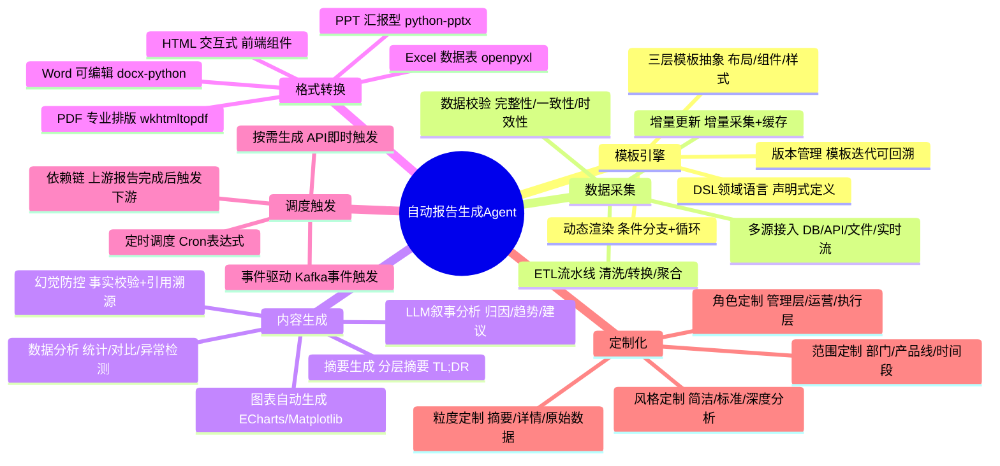

### 1.4 与现有Agent架构的兼容定位

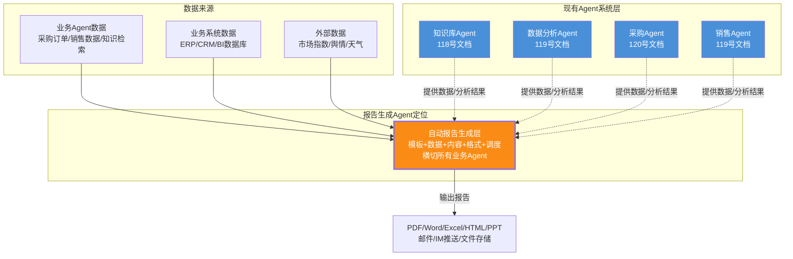

> **定位说明**:自动报告生成 Agent 是一个**横切型功能层**,它不替代任何现有业务 Agent,而是**从各业务 Agent 和业务系统中采集数据**,经过模板渲染、LLM 内容生成、格式转换后输出多格式报告。它与现有架构完全兼容,通过标准数据接口对接,不侵入业务逻辑。

---

## 二、系统总体架构设计

### 2.1 六层架构总览

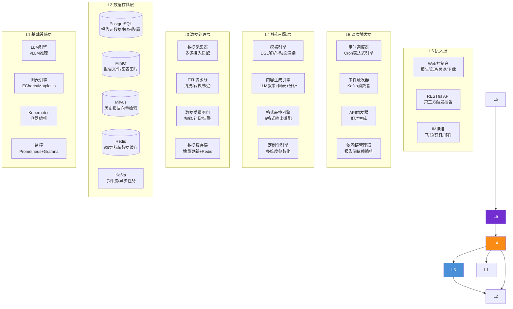

### 2.2 各层职责与技术选型

| 层级 | 职责 | 技术选型 | 选型理由 |
|-----|------|---------|---------|
| **L6 接入层** | 用户入口与报告分发 | Vue3 + RESTful API + IM SDK | 全端覆盖,IM 适配推送场景 |
| **L5 调度层** | 定时/事件/API 三模式触发 | APScheduler + Kafka Consumer + FastAPI | 轻量调度 + 事件驱动 + 即时响应 |
| **L4 核心引擎层** | 模板渲染+内容生成+格式转换 | Jinja2 + LangChain + WeasyPrint/docx | 模板成熟 + AI 生态 + 多格式覆盖 |
| **L3 数据处理层** | 多源采集+ETL+质量保障 | Python + Pandas + SQLAlchemy | 数据处理生态丰富 |
| **L2 存储层** | 元数据/文件/向量/缓存 | PostgreSQL + MinIO + Milvus + Redis + Kafka | 五库协同覆盖全场景 |
| **L1 基础设施** | LLM 推理+图表+容器+监控 | vLLM + ECharts + K8s + Prometheus | 推理高性能 + 图表丰富 + 云原生 |

### 2.3 报告生成全流程交互时序

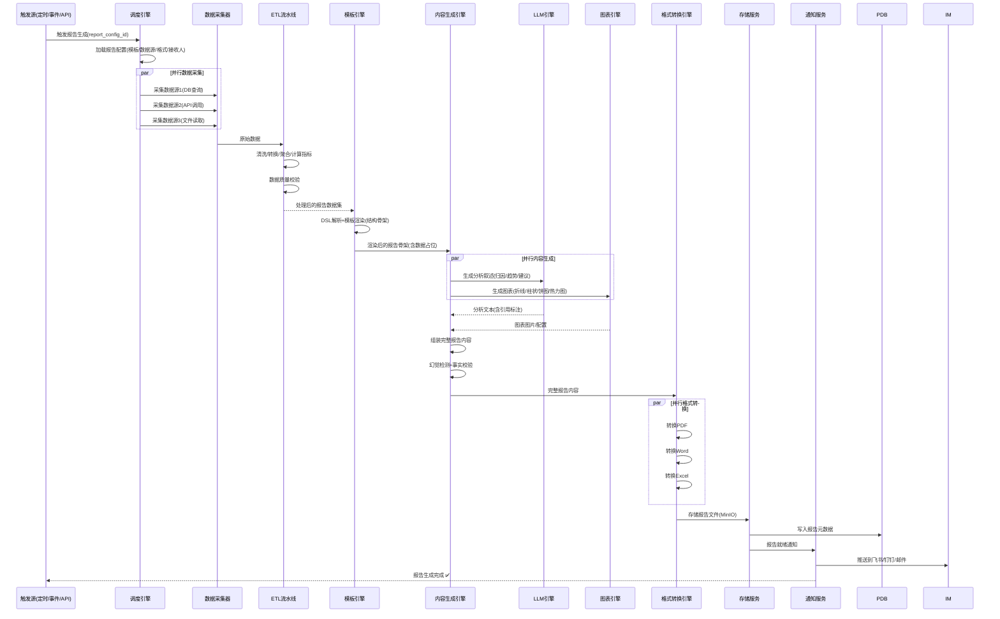

---

## 三、报告模板引擎设计

### 3.1 模板体系架构：三层模板抽象

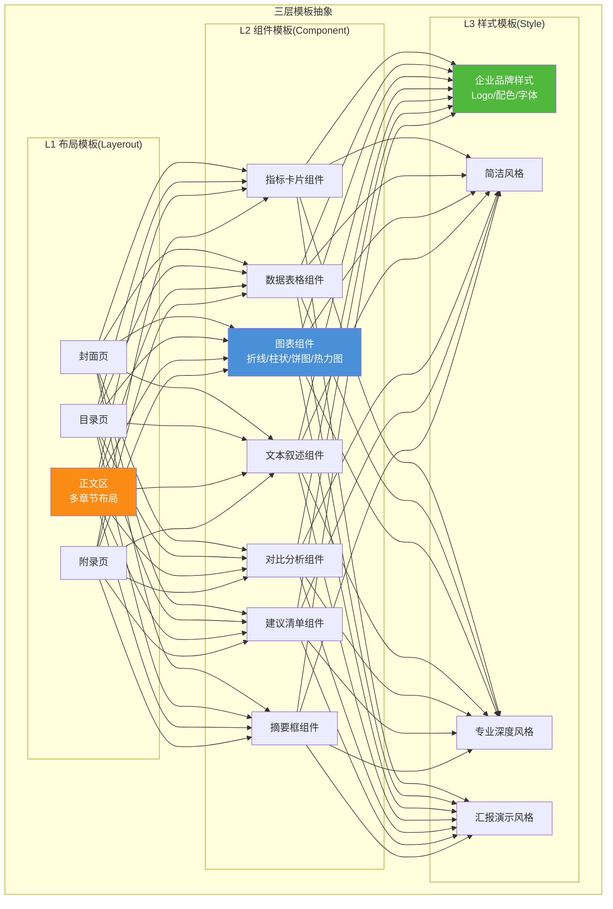

**三层模板说明**:

| 层级 | 职责 | 粒度 | 示例 |
|-----|------|------|------|
| **L1 布局层** | 定义报告整体结构(页面/章节/区域) | 报告级 | 封面→目录→执行摘要→详细分析→建议→附录 |
| **L2 组件层** | 定义可复用的报告组件(数据驱动的展示单元) | 组件级 | 指标卡片、数据表格、图表、文本叙述 |
| **L3 样式层** | 定义视觉风格(颜色/字体/间距/品牌) | 全局级 | 企业蓝主题、简洁黑白、汇报彩印 |

### 3.2 模板 DSL 设计与解析

```python
"""
报告模板 DSL (Domain Specific Language)
使用 YAML 声明式定义报告结构,支持条件渲染、循环、变量引用
"""

# ============= 报告模板 DSL 示例 =============
REPORT_TEMPLATE_DSL = """
template:
  id: "purchase_monthly_report"
  name: "采购月度分析报告"
  version: "2.1.0"
  style: "corporate_blue"
  layout:
    - page: cover
      title: "${report_title}"
      subtitle: "${period_label}分析报告"
      meta:
        - "报告周期: ${start_date} ~ ${end_date}"
        - "生成时间: ${generated_at}"
        - "编制部门: ${department}"
    
    - page: toc
    
    - page: summary
      title: "执行摘要"
      components:
        - type: summary_box
          priority: high
          content: "${llm_summary}"  # LLM生成的摘要
        
        - type: metric_cards
          metrics:
            - name: "采购总额"
              value: "${total_amount}"
              unit: "万元"
              trend: "${total_amount_yoy}"  # 同比
              trend_label: "同比"
            
            - name: "订单数量"
              value: "${order_count}"
              unit: "笔"
              trend: "${order_count_mom}"  # 环比
            
            - name: "节约金额"
              value: "${savings_amount}"
              unit: "万元"
              trend: "${savings_rate}"
            
            - name: "供应商数"
              value: "${supplier_count}"
              unit: "家"
    
    - page: detail
      title: "详细分析"
      sections:
        - title: "一、采购品类分析"
          components:
            - type: chart
              chart_type: pie
              title: "采购品类分布"
              data: "${category_distribution}"
            
            - type: text_narrative
              source: llm
              prompt: "分析本月采购品类分布特点,指出占比最高和变化最大的品类"
              data_context: "${category_distribution}"
            
            - type: data_table
              title: "品类采购明细"
              data: "${category_detail_table}"
              columns: ["品类", "金额(万元)", "占比", "同比", "环比"]
        
        - title: "二、供应商分析"
          condition: "${supplier_count > 0}"  # 条件渲染
          components:
            - type: chart
              chart_type: bar
              title: "TOP10供应商采购金额"
              data: "${top10_suppliers}"
            
            - type: text_narrative
              source: llm
              prompt: "分析TOP10供应商集中度,评估供应商风险"
            
            - type: comparison
              title: "供应商评级分布对比"
              data: "${supplier_grade_comparison}"
        
        - title: "三、价格趋势分析"
          loop: "${price_trends}"  # 循环渲染
          loop_var: "trend"
          components:
            - type: chart
              chart_type: line
              title: "${trend.material_name}价格趋势"
              data: "${trend.price_series}"
            
            - type: text_narrative
              source: llm
              prompt: "分析${trend.material_name}的价格走势,给出采购建议"
    
    - page: recommendations
      title: "建议与行动计划"
      components:
        - type: recommendation_list
          source: llm
          prompt: "基于以上数据分析,给出3-5条可执行的采购优化建议"
          format: numbered
    
    - page: appendix
      title: "附录"
      components:
        - type: data_table
          title: "完整采购明细"
          data: "${full_detail_table}"
          pagination: true
"""

from dataclasses import dataclass, field
from typing import List, Dict, Any, Optional
import yaml

@dataclass
class ReportComponent:
    """报告组件定义"""
    type: str                    # 组件类型: metric_cards/chart/text_narrative/data_table等
    title: str = ""
    data_key: str = ""           # 数据在报告数据集中的key
    properties: Dict = field(default_factory=dict)  # 组件特有属性
    condition: Optional[str] = None  # 渲染条件表达式
    loop: Optional[str] = None      # 循环数据源
    loop_var: str = "item"

@dataclass
class ReportSection:
    """报告章节"""
    title: str
    components: List[ReportComponent] = field(default_factory=list)
    condition: Optional[str] = None

@dataclass
class ReportPage:
    """报告页面"""
    page_type: str               # cover/toc/summary/detail/recommendations/appendix
    title: str = ""
    sections: List[ReportSection] = field(default_factory=list)
    components: List[ReportComponent] = field(default_factory=list)
    properties: Dict = field(default_factory=dict)

@dataclass
class ReportTemplate:
    """报告模板"""
    template_id: str
    name: str
    version: str
    style: str
    pages: List[ReportPage] = field(default_factory=list)
    raw_dsl: str = ""


class TemplateEngine:
    """
    模板引擎核心
    1. 解析DSL YAML → ReportTemplate对象
    2. 加载报告数据 → 变量绑定
    3. 条件渲染 + 循环渲染 → 生成报告结构树
    4. 传递给内容生成引擎填充LLM文本和图表
    """
    
    def __init__(self):
        self.template_cache: Dict[str, ReportTemplate] = {}
    
    def load_template(self, template_id: str, version: str = "latest") -> ReportTemplate:
        """加载模板(从数据库,带缓存)"""
        cache_key = f"{template_id}:{version}"
        if cache_key not in self.template_cache:
            raw_dsl = self._fetch_template_from_db(template_id, version)
            template = self._parse_dsl(raw_dsl)
            template.raw_dsl = raw_dsl
            self.template_cache[cache_key] = template
        return self.template_cache[cache_key]
    
    def _parse_dsl(self, dsl_str: str) -> ReportTemplate:
        """解析DSL YAML为ReportTemplate对象"""
        dsl = yaml.safe_load(dsl_str)
        tmpl = dsl["template"]
        
        pages = []
        for page_def in tmpl.get("layout", []):
            page = ReportPage(
                page_type=page_def.get("page", ""),
                title=page_def.get("title", ""),
                properties=page_def.get("meta", {})
            )
            for section_def in page_def.get("sections", []):
                section = ReportSection(
                    title=section_def.get("title", ""),
                    condition=section_def.get("condition")
                )
                for comp_def in section_def.get("components", []):
                    section.components.append(self._build_component(comp_def))
                page.sections.append(section)
            
            # 页面级组件(非章节嵌套)
            for comp_def in page_def.get("components", []):
                page.components.append(self._build_component(comp_def))
            
            pages.append(page)
        
        return ReportTemplate(
            template_id=tmpl["id"],
            name=tmpl["name"],
            version=tmpl["version"],
            style=tmpl.get("style", "default"),
            pages=pages
        )
    
    def _build_component(self, comp_def: dict) -> ReportComponent:
        """构建组件对象"""
        return ReportComponent(
            type=comp_def.get("type", ""),
            title=comp_def.get("title", ""),
            data_key=comp_def.get("data", "").strip("${}"),
            properties={k: v for k, v in comp_def.items() 
                       if k not in ("type", "title", "data", "condition", "loop")},
            condition=comp_def.get("condition"),
            loop=comp_def.get("loop"),
            loop_var=comp_def.get("loop_var", "item")
        )
    
    def render(self, template: ReportTemplate, 
               report_data: Dict[str, Any]) -> "RenderedReport":
        """
        渲染模板:绑定数据 + 条件/循环处理 → 生成渲染后的报告结构树
        """
        rendered_pages = []
        
        for page in template.pages:
            # 页面级条件检查
            if page.properties.get("condition"):
                if not self._eval_condition(page.properties["condition"], report_data):
                    continue
            
            rendered_page = self._render_page(page, report_data)
            rendered_pages.append(rendered_page)
        
        return RenderedReport(
            template_id=template.template_id,
            name=template.name,
            style=template.style,
            pages=rendered_pages
        )
    
    def _render_page(self, page: ReportPage, 
                     data: Dict) -> "RenderedPage":
        """渲染单个页面"""
        rendered_sections = []
        
        for section in page.sections:
            # 章节条件渲染
            if section.condition and not self._eval_condition(section.condition, data):
                continue
            
            rendered_components = []
            for comp in section.components:
                # 组件条件渲染
                if comp.condition and not self._eval_condition(comp.condition, data):
                    continue
                
                # 循环渲染
                if comp.loop:
                    loop_data = self._resolve_var(comp.loop, data)
                    if loop_data and isinstance(loop_data, list):
                        for item in loop_data:
                            child_data = {**data, comp.loop_var: item}
                            rendered_components.append(
                                self._render_component(comp, child_data)
                            )
                else:
                    rendered_components.append(self._render_component(comp, data))
            
            rendered_sections.append(RenderedSection(
                title=self._resolve_template_vars(section.title, data),
                components=rendered_components
            ))
        
        # 页面级组件
        rendered_page_components = []
        for comp in page.components:
            rendered_page_components.append(self._render_component(comp, data))
        
        return RenderedPage(
            page_type=page.page_type,
            title=self._resolve_template_vars(page.title, data),
            sections=rendered_sections,
            components=rendered_page_components
        )
    
    def _render_component(self, comp: ReportComponent, 
                          data: Dict) -> "RenderedComponent":
        """渲染单个组件(绑定数据)"""
        resolved_data = self._resolve_var(comp.data_key, data) if comp.data_key else None
        return RenderedComponent(
            type=comp.type,
            title=self._resolve_template_vars(comp.title, data),
            data=resolved_data,
            properties=comp.properties
        )
    
    def _eval_condition(self, expr: str, data: Dict) -> bool:
        """安全评估条件表达式"""
        # 将${var}替换为实际值后eval
        resolved = self._resolve_template_vars(expr, data)
        try:
            return bool(eval(resolved, {"__builtins__": {}}, {}))
        except Exception:
            return False
    
    def _resolve_var(self, var_expr: str, data: Dict) -> Any:
        """解析${var}变量引用"""
        if not var_expr:
            return None
        key = var_expr.strip("${}")
        return data.get(key)
    
    def _resolve_template_vars(self, text: str, data: Dict) -> str:
        """解析文本中的所有${var}变量"""
        import re
        def replacer(match):
            key = match.group(1)
            val = data.get(key, match.group(0))
            return str(val)
        return re.sub(r'\$\{(\w+)\}', replacer, text)


@dataclass
class RenderedReport:
    template_id: str
    name: str
    style: str
    pages: List["RenderedPage"]

@dataclass
class RenderedPage:
    page_type: str
    title: str
    sections: List["RenderedSection"]
    components: List["RenderedComponent"]

@dataclass
class RenderedSection:
    title: str
    components: List["RenderedComponent"]

@dataclass
class RenderedComponent:
    type: str
    title: str
    data: Any
    properties: dict
```

### 3.3 模板管理与版本控制

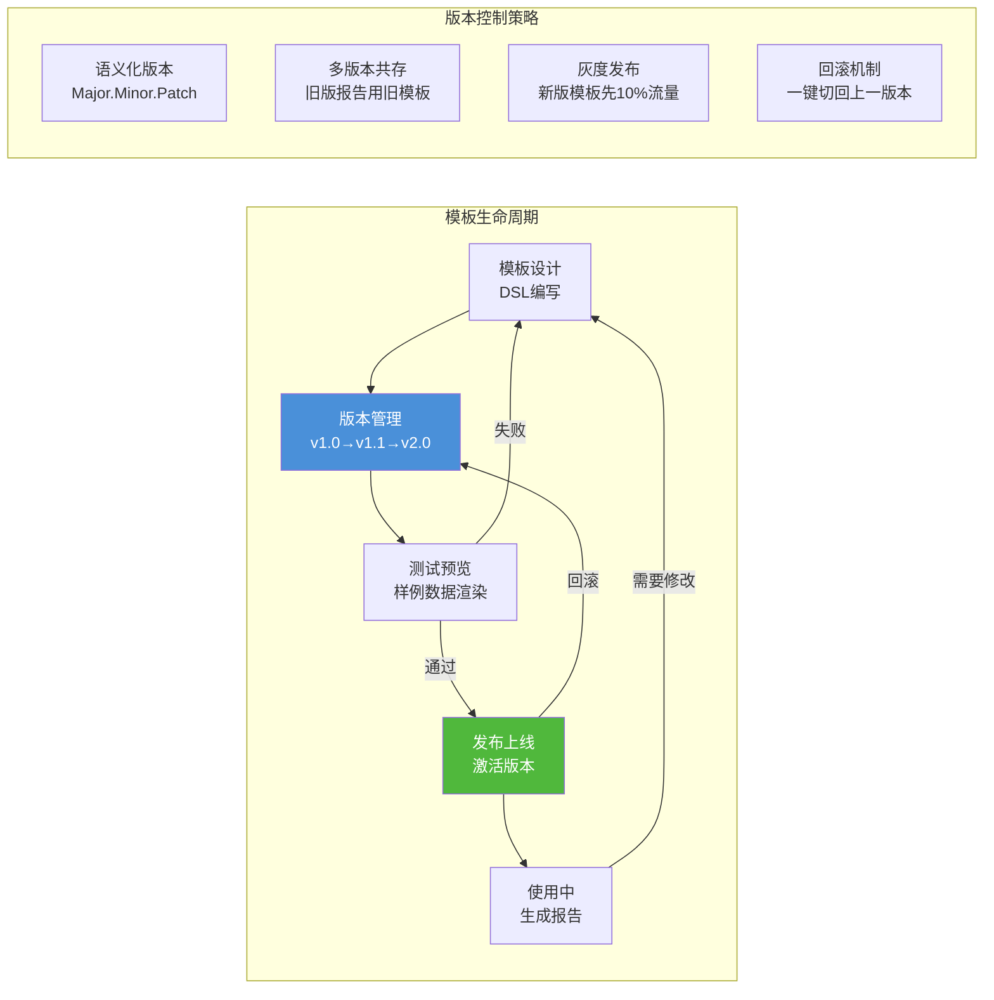

**模板数据库模型**:

```sql
-- 报告模板表
CREATE TABLE report_templates (
    template_id      VARCHAR(64) PRIMARY KEY,
    name             VARCHAR(128) NOT NULL,
    category         VARCHAR(64),           -- 报告类别: purchase/sales/operation/risk
    version          VARCHAR(16) NOT NULL,  -- 语义化版本
    dsl_content      TEXT NOT NULL,         -- DSL YAML内容
    style_config     JSONB,                 -- 样式配置
    status           VARCHAR(16) DEFAULT 'draft', -- draft/testing/active/archived
    created_by       VARCHAR(64),
    created_at       TIMESTAMP DEFAULT NOW(),
    updated_at       TIMESTAMP DEFAULT NOW(),
    UNIQUE(template_id, version)
);

-- 报告配置表(绑定模板+数据源+调度+接收人)
CREATE TABLE report_configs (
    config_id        VARCHAR(64) PRIMARY KEY,
    name             VARCHAR(128) NOT NULL,
    template_id      VARCHAR(64) NOT NULL REFERENCES report_templates,
    template_version VARCHAR(16) DEFAULT 'latest',
    data_sources     JSONB NOT NULL,        -- 数据源配置列表
    schedule_type    VARCHAR(16) NOT NULL,  -- cron/event/api
    schedule_cron    VARCHAR(64),           -- Cron表达式
    trigger_event    VARCHAR(128),          -- 事件触发主题
    output_formats   JSONB NOT NULL,        -- ["pdf","word","excel"]
    recipients       JSONB NOT NULL,        -- 接收人列表
    customization    JSONB,                 -- 定制化参数
    enabled          BOOLEAN DEFAULT TRUE,
    created_at       TIMESTAMP DEFAULT NOW()
);

-- 报告实例表(每次生成的报告记录)
CREATE TABLE report_instances (
    instance_id      VARCHAR(64) PRIMARY KEY,
    config_id        VARCHAR(64) NOT NULL REFERENCES report_configs,
    template_id      VARCHAR(64) NOT NULL,
    template_version VARCHAR(16) NOT NULL,
    status           VARCHAR(16) DEFAULT 'pending', -- pending/generating/completed/failed
    period_start     DATE,
    period_end       DATE,
    file_paths       JSONB,                 -- {"pdf": "oss://...", "word": "oss://..."}
    file_sizes       JSONB,
    data_snapshot    JSONB,                 -- 生成时的数据快照(审计追溯)
    llm_cost         DECIMAL(10,4),         -- LLM调用成本
    generated_at     TIMESTAMP,
    duration_ms      INTEGER,
    error_message    TEXT,
    created_at       TIMESTAMP DEFAULT NOW()
);
```

---

## 四、数据采集与处理流程

### 4.1 多源数据采集架构

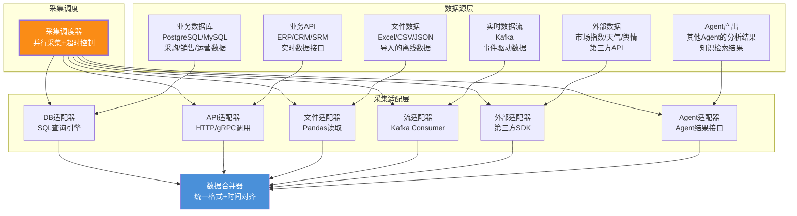

**数据采集器核心实现**:

```python
"""
多源数据采集器
支持6种数据源类型,并行采集,统一输出格式
"""
from dataclasses import dataclass, field
from typing import List, Dict, Any, Optional
from enum import Enum
import asyncio
import pandas as pd
from datetime import datetime

class DataSourceType(str, Enum):
    DATABASE = "database"
    API = "api"
    FILE = "file"
    STREAM = "stream"
    EXTERNAL = "external"
    AGENT = "agent"

@dataclass
class DataSourceConfig:
    source_id: str
    source_type: DataSourceType
    name: str
    connection: Dict[str, Any]      # 连接配置
    query: Dict[str, Any]           # 查询参数(SQL/API路径/文件路径等)
    params: Dict[str, Any] = field(default_factory=dict)  # 额外参数
    timeout: int = 30               # 超时(秒)
    retry: int = 3                  # 重试次数
    cache_ttl: int = 3600           # 缓存TTL(秒)


class DataCollector:
    """多源数据采集器"""
    
    def __init__(self):
        self._adapters: Dict[DataSourceType, "IDataSourceAdapter"] = {
            DataSourceType.DATABASE: DatabaseAdapter(),
            DataSourceType.API: APIAdapter(),
            DataSourceType.FILE: FileAdapter(),
            DataSourceType.STREAM: StreamAdapter(),
            DataSourceType.EXTERNAL: ExternalAdapter(),
            DataSourceType.AGENT: AgentAdapter(),
        }
    
    async def collect_all(self, sources: List[DataSourceConfig],
                          report_context: dict) -> Dict[str, Any]:
        """并行采集所有数据源,返回统一格式的数据集"""
        tasks = []
        for source in sources:
            task = self._collect_with_retry(source, report_context)
            tasks.append((source.source_id, task))
        
        # 并行采集,等待全部完成(或超时)
        results = {}
        for source_id, task in tasks:
            try:
                data = await asyncio.wait_for(task, timeout=source.timeout)
                results[source_id] = data
            except asyncio.TimeoutError:
                results[source_id] = {"error": "timeout", "data": None}
                await self._alert_data_source_failure(source_id, "timeout")
            except Exception as e:
                results[source_id] = {"error": str(e), "data": None}
                await self._alert_data_source_failure(source_id, str(e))
        
        return results
    
    async def _collect_with_retry(self, source: DataSourceConfig,
                                  context: dict) -> Any:
        """带重试的采集"""
        adapter = self._adapters[source.source_type]
        last_error = None
        for attempt in range(source.retry):
            try:
                # 检查缓存
                cache_key = self._build_cache_key(source, context)
                cached = await self._get_cache(cache_key)
                if cached is not None:
                    return cached
                
                # 执行采集
                data = await adapter.fetch(source, context)
                
                # 写入缓存
                await self._set_cache(cache_key, data, source.cache_ttl)
                return data
            except Exception as e:
                last_error = e
                if attempt < source.retry - 1:
                    await asyncio.sleep(2 ** attempt)  # 指数退避
        
        raise last_error


class IDataSourceAdapter:
    """数据源适配器统一接口"""
    async def fetch(self, config: DataSourceConfig, 
                    context: dict) -> Any:
        pass


class DatabaseAdapter(IDataSourceAdapter):
    """数据库适配器"""
    
    async def fetch(self, config: DataSourceConfig, context: dict) -> pd.DataFrame:
        """执行SQL查询,返回DataFrame"""
        sql = self._render_sql(config.query["sql"], context)
        engine = self._get_engine(config.connection)
        df = pd.read_sql(sql, engine)
        return df.to_dict(orient="records")
    
    def _render_sql(self, sql_template: str, context: dict) -> str:
        """渲染SQL中的变量(如日期范围)"""
        return sql_template.format(
            start_date=context.get("start_date"),
            end_date=context.get("end_date"),
            department=context.get("department", "")
        )


class APIAdapter(IDataSourceAdapter):
    """API适配器"""
    
    async def fetch(self, config: DataSourceConfig, context: dict) -> dict:
        """调用REST API获取数据"""
        import httpx
        url = config.query["url"].format(**context)
        params = {k: context.get(v.strip("{}"), v) 
                  for k, v in config.query.get("params", {}).items()}
        
        async with httpx.AsyncClient(timeout=config.timeout) as client:
            response = await client.get(url, params=params,
                                        headers=config.connection.get("headers", {}))
            response.raise_for_status()
            return response.json()


class AgentAdapter(IDataSourceAdapter):
    """Agent适配器:从其他Agent获取分析结果"""
    
    async def fetch(self, config: DataSourceConfig, context: dict) -> dict:
        """调用其他Agent的分析接口"""
        agent_id = config.query["agent_id"]
        analysis_type = config.query["analysis_type"]
        # 通过Agent间的标准接口获取分析结果
        result = await self.agent_registry.call_agent(
            agent_id=agent_id,
            action="analyze",
            params={**context, "analysis_type": analysis_type}
        )
        return result
```

### 4.2 数据处理 ETL 流水线

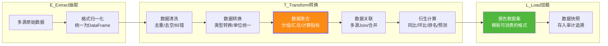

**ETL 流水线实现**:

```python
"""
ETL流水线:清洗→转换→聚合→关联→衍生计算
输出:模板引擎可直接消费的报告数据集
"""
import pandas as pd
import numpy as np
from dataclasses import dataclass
from typing import Dict, Any, List, Callable

@dataclass
class ETLPipeline:
    """ETL流水线配置与执行"""
    
    # 清洗规则
    CLEANING_RULES = {
        "drop_duplicates": True,       # 去重
        "drop_null_columns": True,     # 删除全空列
        "fill_numeric_null": 0,        # 数值空值填0
        "fill_string_null": "N/A",     # 字符串空值填N/A
        "trim_strings": True,          # 去除首尾空格
    }
    
    async def process(self, raw_data: Dict[str, Any],
                      report_config: dict) -> Dict[str, Any]:
        """执行完整ETL流水线"""
        # 1. 格式归一化:所有数据源转为统一DataFrame
        dataframes = self._normalize(raw_data)
        
        # 2. 数据清洗
        cleaned = {k: self._clean(df) for k, df in dataframes.items()}
        
        # 3. 数据转换
        transformed = {k: self._transform(df, report_config) 
                       for k, df in cleaned.items()}
        
        # 4. 数据聚合
        aggregated = self._aggregate(transformed, report_config)
        
        # 5. 数据关联(多源Join)
        merged = self._merge_sources(aggregated, report_config)
        
        # 6. 衍生指标计算
        final_dataset = self._calculate_derived_metrics(merged, report_config)
        
        return final_dataset
    
    def _normalize(self, raw_data: Dict[str, Any]) -> Dict[str, pd.DataFrame]:
        """格式归一化:统一为DataFrame"""
        dataframes = {}
        for source_id, data in raw_data.items():
            if data is None or data.get("error"):
                continue
            records = data.get("data", data) if isinstance(data, dict) else data
            if isinstance(records, list):
                dataframes[source_id] = pd.DataFrame(records)
            elif isinstance(records, dict):
                dataframes[source_id] = pd.DataFrame([records])
        return dataframes
    
    def _clean(self, df: pd.DataFrame) -> pd.DataFrame:
        """数据清洗"""
        if df.empty:
            return df
        if self.CLEANING_RULES["drop_duplicates"]:
            df = df.drop_duplicates()
        if self.CLEANING_RULES["drop_null_columns"]:
            df = df.dropna(axis=1, how="all")
        if self.CLEANING_RULES["fill_numeric_null"]:
            numeric_cols = df.select_dtypes(include=[np.number]).columns
            df[numeric_cols] = df[numeric_cols].fillna(self.CLEANING_RULES["fill_numeric_null"])
        if self.CLEANING_RULES["fill_string_null"]:
            string_cols = df.select_dtypes(include=["object"]).columns
            df[string_cols] = df[string_cols].fillna(self.CLEANING_RULES["fill_string_null"])
        if self.CLEANING_RULES["trim_strings"]:
            string_cols = df.select_dtypes(include=["object"]).columns
            df[string_cols] = df[string_cols].apply(lambda x: x.str.strip() if x.dtype == "object" else x)
        return df
    
    def _aggregate(self, dataframes: Dict[str, pd.DataFrame],
                   config: dict) -> Dict[str, Any]:
        """数据聚合:按配置的聚合规则计算汇总指标"""
        result = {}
        for agg_def in config.get("aggregations", []):
            source = agg_def["source"]
            if source not in dataframes:
                continue
            df = dataframes[source]
            
            # 分组聚合
            if "group_by" in agg_def:
                grouped = df.groupby(agg_def["group_by"])
                for metric in agg_def["metrics"]:
                    col = metric["column"]
                    func = metric["function"]  # sum/mean/count/min/max
                    key = metric.get("output_key", f"{col}_{func}")
                    result[key] = grouped[col].agg(func).to_dict()
            else:
                # 全局聚合
                for metric in agg_def["metrics"]:
                    col = metric["column"]
                    func = metric["function"]
                    key = metric.get("output_key", f"{col}_{func}")
                    result[key] = df[col].agg(func)
        
        return result
    
    def _calculate_derived_metrics(self, data: Dict[str, Any],
                                   config: dict) -> Dict[str, Any]:
        """计算衍生指标:同比/环比/排名/趋势"""
        for metric_def in config.get("derived_metrics", []):
            name = metric_def["name"]
            metric_type = metric_def["type"]
            
            if metric_type == "yoy":  # 同比
                current = data.get(metric_def["current"])
                previous = data.get(metric_def["previous"])
                if current and previous and previous != 0:
                    data[name] = (current - previous) / previous
                else:
                    data[name] = 0
            
            elif metric_type == "mom":  # 环比
                current = data.get(metric_def["current"])
                previous = data.get(metric_def["previous"])
                if current and previous and previous != 0:
                    data[name] = (current - previous) / previous
                else:
                    data[name] = 0
            
            elif metric_type == "rank":  # 排名
                values = data.get(metric_def["source"], {})
                if isinstance(values, dict):
                    ranked = sorted(values.items(), key=lambda x: x[1], 
                                   reverse=metric_def.get("descending", True))
                    data[name] = {k: i+1 for i, (k, _) in enumerate(ranked)}
            
            elif metric_type == "percentage":  # 百分比
                part = data.get(metric_def["part"])
                total = data.get(metric_def["total"])
                if total and total != 0:
                    data[name] = part / total
                else:
                    data[name] = 0
        
        return data
```

### 4.3 数据质量保障机制

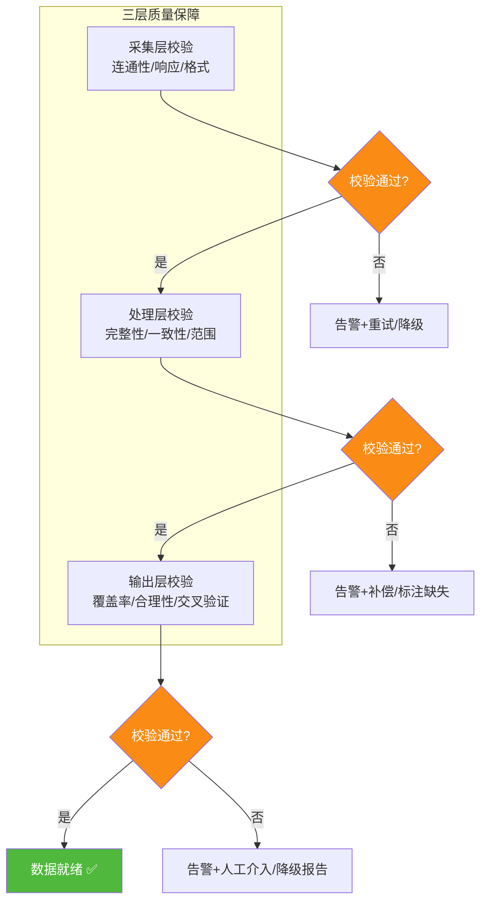

**数据质量校验规则**:

| 校验维度 | 校验规则 | 失败处理 | 严重级别 |
|---------|---------|---------|:------:|
| **完整性** | 关键字段非空率 ≥ 99% | 缺失字段标注"N/A" | P2 |
| **一致性** | 多源同一指标偏差 < 1% | 以权威源为准,记录偏差 | P1 |
| **时效性** | 数据时间戳在报告周期内 | 排除超期数据,标注覆盖范围 | P1 |
| **范围合理性** | 数值在合理区间(如金额>0) | 异常值标记,不剔除但标注 | P2 |
| **交叉验证** | 总计 = 各分项之和 | 差异>0.5%则告警 | P1 |
| **覆盖率** | 数据覆盖报告所需维度的 ≥ 95% | 低于阈值则降级报告 | P0 |

---

## 五、内容生成引擎

### 5.1 LLM 叙事生成：从数据到洞察

```mermaid
flowchart TB
    subgraph LLM叙事生成全流程
        DATA[报告数据集] --> CTX[上下文组装<br/>数据摘要+历史对比+行业基准]
        CTX --> PROMPT[Prompt工程<br/>分析指令+数据+约束+格式]
        PROMPT --> LLM[LLM推理<br/>Qwen2.5-72B]
        LLM --> DRAFT[初稿文本]
        DRAFT --> CHECK[事实校验<br/>数据引用一致性]
        CHECK -->|通过| FINAL[最终叙事文本]
        CHECK -->|不通过| REGEN[重新生成<br/>附加纠错指令]
        REGEN --> LLM
    end
    
    subgraph 叙事内容类型
        T1[描述性分析<br/>"本月采购总额XX万,环比增长X%"]
        T2[归因分析<br/>"增长主要由XX品类驱动,原因是..."]
        T3[趋势预测<br/>"基于近6个月趋势,预计下月..."]
        T4[对比分析<br/>"与去年同期相比,XX指标提升..."]
        T5[建议行动<br/>"建议优化XX供应商,预计可节约..."]
    end
    
    FINAL --> T1 & T2 & T3 & T4 & T5
    
    style LLM fill:#fa8c16,color:#fff,stroke-width:3px
    style CHECK fill:#f5222d,color:#fff
    style FINAL fill:#50b83c,color:#fff
```

**LLM 叙事生成核心实现**:

```python
"""
LLM叙事生成引擎
将结构化数据转化为有洞察力的分析叙述
"""
from dataclasses import dataclass, field
from typing import List, Dict, Any, Optional
from enum import Enum

class NarrativeType(str, Enum):
    SUMMARY = "summary"              # 摘要
    DESCRIPTIVE = "descriptive"      # 描述性分析
    ATTRIBUTION = "attribution"      # 归因分析
    TREND = "trend"                  # 趋势分析
    COMPARISON = "comparison"        # 对比分析
    RECOMMENDATION = "recommendation" # 建议行动
    ANOMALY = "anomaly"              # 异常分析

@dataclass
class NarrativeRequest:
    narrative_type: NarrativeType
    data_context: Dict[str, Any]       # 数据上下文
    historical_context: Optional[Dict] = None  # 历史对比数据
    industry_benchmark: Optional[Dict] = None  # 行业基准
    max_length: int = 500              # 最大字数
    tone: str = "professional"         # 语气: professional/concise/detailed
    include_numbers: bool = True       # 是否包含具体数据
    target_audience: str = "management" # 目标读者

@dataclass
class NarrativeResult:
    text: str                          # 生成的叙事文本
    data_references: List[dict]        # 引用的数据点(用于校验)
    confidence: float                  # 置信度
    fact_check_passed: bool            # 事实校验是否通过


class NarrativeGenerator:
    """LLM叙事生成引擎"""
    
    # 各类型的Prompt模板
    PROMPT_TEMPLATES = {
        NarrativeType.SUMMARY: """请基于以下数据生成一段执行摘要,要求:
1. 概括核心数据和关键变化
2. 突出最重要的2-3个发现
3. 语言简洁有力,适合管理层快速阅读
4. 字数控制在{max_length}字以内

## 报告数据
{data_context}

## 历史对比
{historical_context}

输出格式: 纯文本段落,不要使用markdown标题""",
        
        NarrativeType.ATTRIBUTION: """请基于以下数据进行归因分析,要求:
1. 指出关键指标变化的主要驱动因素
2. 量化各因素的贡献度
3. 分析变化的根本原因
4. 字数控制在{max_length}字以内

## 当前数据
{data_context}

## 历史对比
{historical_context}

## 行业基准
{industry_benchmark}

输出格式: 
- 主要发现: ...
- 驱动因素: ...
- 根本原因: ...""",
        
        NarrativeType.TREND: """请基于以下数据进行趋势分析,要求:
1. 识别数据中的趋势(上升/下降/波动/平稳)
2. 分析趋势形成的原因
3. 基于历史数据预测未来走向
4. 给出趋势应对建议
5. 字数控制在{max_length}字以内

## 趋势数据(近6期)
{data_context}

## 行业基准趋势
{industry_benchmark}

输出格式:
- 趋势描述: ...
- 原因分析: ...
- 未来预测: ...
- 应对建议: ...""",
        
        NarrativeType.RECOMMENDATION: """请基于以上分析数据,给出{max_count}条可执行的优化建议,要求:
1. 每条建议包含:问题描述、建议措施、预期效果
2. 建议必须基于数据,不能凭空编造
3. 按优先级排序(高→中→低)
4. 措施要具体可落地,不能太泛

## 分析数据
{data_context}

## 历史对比
{historical_context}

输出格式:
### 建议1: [标题] (优先级: 高)
- 问题: ...
- 措施: ...
- 预期效果: ..."""
    }
    
    async def generate(self, request: NarrativeRequest) -> NarrativeResult:
        """生成叙事文本"""
        # 1. 组装Prompt
        prompt = self._build_prompt(request)
        
        # 2. LLM生成
        raw_text = await self.llm.generate(
            prompt=prompt,
            temperature=0.3,  # 低温度保证一致性
            max_tokens=request.max_length * 2
        )
        
        # 3. 提取数据引用
        references = self._extract_data_references(raw_text, request.data_context)
        
        # 4. 事实校验
        fact_check = await self._fact_check(raw_text, request.data_context, references)
        
        # 5. 如果校验失败,重新生成(附加纠错指令)
        if not fact_check.passed:
            raw_text = await self._regenerate_with_correction(prompt, fact_check.errors)
            references = self._extract_data_references(raw_text, request.data_context)
            fact_check = await self._fact_check(raw_text, request.data_context, references)
        
        return NarrativeResult(
            text=raw_text,
            data_references=references,
            confidence=fact_check.confidence,
            fact_check_passed=fact_check.passed
        )
    
    def _build_prompt(self, request: NarrativeRequest) -> str:
        """组装Prompt"""
        template = self.PROMPT_TEMPLATES.get(
            request.narrative_type, 
            self.PROMPT_TEMPLATES[NarrativeType.DESCRIPTIVE]
        )
        return template.format(
            max_length=request.max_length,
            data_context=self._format_data(request.data_context),
            historical_context=self._format_data(request.historical_context),
            industry_benchmark=self._format_data(request.industry_benchmark),
            max_count=5,
            target_audience=request.target_audience
        )
    
    def _format_data(self, data: Any) -> str:
        """格式化数据为LLM可理解的文本"""
        if data is None:
            return "无"
        if isinstance(data, dict):
            lines = []
            for k, v in data.items():
                if isinstance(v, (int, float)):
                    if isinstance(v, float):
                        lines.append(f"- {k}: {v:.2f}")
                    else:
                        lines.append(f"- {k}: {v:,}")
                elif isinstance(v, list):
                    lines.append(f"- {k}: {v[:10]}")  # 最多展示10项
                else:
                    lines.append(f"- {k}: {v}")
            return "\n".join(lines)
        return str(data)
    
    async def _fact_check(self, text: str, data_context: dict,
                          references: list) -> "FactCheckResult":
        """事实校验:检查叙事文本中的数据是否与原始数据一致"""
        errors = []
        checked_count = 0
        correct_count = 0
        
        for ref in references:
            checked_count += 1
            # 提取文本中提到的数值
            stated_value = ref["stated_value"]
            actual_value = ref["actual_value"]
            data_key = ref["data_key"]
            
            if actual_value is not None:
                # 数值校验:允许1%误差
                if isinstance(actual_value, (int, float)):
                    if abs(stated_value - actual_value) / max(abs(actual_value), 1) > 0.01:
                        errors.append(
                            f"数据不一致: 文本中{data_key}={stated_value}, "
                            f"实际值={actual_value}"
                        )
                    else:
                        correct_count += 1
                else:
                    correct_count += 1
        
        confidence = correct_count / max(checked_count, 1)
        passed = len(errors) == 0 and confidence >= 0.95
        
        return FactCheckResult(
            passed=passed,
            errors=errors,
            confidence=confidence
        )
    
    def _extract_data_references(self, text: str, 
                                 data_context: dict) -> list:
        """从叙事文本中提取引用的数据点"""
        import re
        references = []
        
        # 查找文本中的数值引用(如"采购总额1523.5万元")
        # 对每个数据上下文中的数值,检查是否在文本中被提及
        for key, value in data_context.items():
            if isinstance(value, (int, float)):
                # 在文本中搜索该数值
                pattern = rf'{key}[^0-9]*({value:.1f}|{value:.2f}|{int(value)})'
                match = re.search(pattern, text)
                if match:
                    references.append({
                        "data_key": key,
                        "actual_value": value,
                        "stated_value": float(match.group(1)),
                        "in_text": True
                    })
        
        return references


@dataclass
class FactCheckResult:
    passed: bool
    errors: List[str]
    confidence: float
```

### 5.2 图表自动生成与嵌入

```python
"""
图表自动生成引擎
根据数据特征自动选择图表类型,生成图表图片或配置
"""
from dataclasses import dataclass
from typing import List, Dict, Any, Optional
from enum import Enum
import json
import base64

class ChartType(str, Enum):
    LINE = "line"           # 折线图(趋势)
    BAR = "bar"             # 柱状图(对比)
    PIE = "pie"             # 饼图(占比)
    AREA = "area"           # 面积图(累积)
    SCATTER = "scatter"     # 散点图(相关性)
    HEATMAP = "heatmap"     # 热力图(密度)
    GAUGE = "gauge"         # 仪表盘(达标率)
    TABLE = "table"         # 数据表格

@dataclass
class ChartConfig:
    chart_type: ChartType
    title: str
    data: Any
    x_axis: str = ""
    y_axis: str = ""
    series: List[dict] = field(default_factory=list)
    options: dict = field(default_factory=dict)  # ECharts配置
    width: int = 800
    height: int = 400


class ChartGenerator:
    """图表自动生成引擎"""
    
    async def generate(self, data: Any, chart_type: ChartType = None,
                       title: str = "", **kwargs) -> ChartConfig:
        """生成图表配置"""
        # 自动选择图表类型(如果未指定)
        if chart_type is None:
            chart_type = self._auto_select_chart_type(data)
        
        # 生成ECharts配置
        if chart_type == ChartType.LINE:
            config = self._gen_line_chart(data, title, **kwargs)
        elif chart_type == ChartType.BAR:
            config = self._gen_bar_chart(data, title, **kwargs)
        elif chart_type == ChartType.PIE:
            config = self._gen_pie_chart(data, title, **kwargs)
        else:
            config = self._gen_generic_chart(data, chart_type, title, **kwargs)
        
        return config
    
    def _auto_select_chart_type(self, data: Any) -> ChartType:
        """根据数据特征自动选择图表类型"""
        if isinstance(data, dict):
            # 单值字典 → 仪表盘
            if all(isinstance(v, (int, float)) for v in data.values()) and len(data) <= 1:
                return ChartType.GAUGE
            # 占比数据(值都为正且和约为100) → 饼图
            values = list(data.values())
            if all(isinstance(v, (int, float)) and v > 0 for v in values):
                if abs(sum(values) - 100) < 5 or abs(sum(values) - 1) < 0.05:
                    return ChartType.PIE
                # 多类别数值 → 柱状图
                if len(values) <= 20:
                    return ChartType.BAR
        elif isinstance(data, list):
            # 时序数据 → 折线图
            if data and isinstance(data[0], dict):
                if any("date" in k or "time" in k or "month" in k 
                       for k in data[0].keys()):
                    return ChartType.LINE
        return ChartType.BAR  # 默认柱状图
    
    def _gen_line_chart(self, data: Any, title: str, **kwargs) -> ChartConfig:
        """生成折线图配置(ECharts)"""
        if isinstance(data, list) and data and isinstance(data[0], dict):
            x_field = kwargs.get("x_field", "date")
            y_fields = kwargs.get("y_fields", 
                                  [k for k in data[0].keys() if k != x_field])
            x_data = [item.get(x_field, "") for item in data]
            series = []
            for yf in y_fields:
                series.append({
                    "name": yf,
                    "type": "line",
                    "data": [item.get(yf, 0) for item in data],
                    "smooth": True
                })
        else:
            x_data = list(data.keys()) if isinstance(data, dict) else []
            series = [{
                "name": title,
                "type": "line",
                "data": list(data.values()) if isinstance(data, dict) else data
            }]
        
        echarts_option = {
            "title": {"text": title, "left": "center"},
            "tooltip": {"trigger": "axis"},
            "legend": {"data": [s["name"] for s in series], "bottom": 0},
            "xAxis": {"type": "category", "data": x_data},
            "yAxis": {"type": "value"},
            "series": series,
            "grid": {"left": "10%", "right": "10%", "bottom": "15%", "top": "15%"}
        }
        
        return ChartConfig(
            chart_type=ChartType.LINE,
            title=title,
            data=data,
            options=echarts_option
        )
    
    def _gen_pie_chart(self, data: Any, title: str, **kwargs) -> ChartConfig:
        """生成饼图配置"""
        if isinstance(data, dict):
            pie_data = [{"name": k, "value": v} for k, v in data.items()]
        else:
            pie_data = data
        
        echarts_option = {
            "title": {"text": title, "left": "center"},
            "tooltip": {"trigger": "item", "formatter": "{b}: {c} ({d}%)"},
            "legend": {"orient": "vertical", "left": "left"},
            "series": [{
                "type": "pie",
                "radius": "60%",
                "data": pie_data,
                "emphasis": {
                    "itemStyle": {"shadowBlur": 10, "shadowOffsetX": 0, 
                                  "shadowColor": "rgba(0,0,0,0.5)"}
                }
            }]
        }
        
        return ChartConfig(
            chart_type=ChartType.PIE,
            title=title,
            data=data,
            options=echarts_option
        )
    
    async def render_to_image(self, config: ChartConfig) -> bytes:
        """将ECharts配置渲染为图片(使用无头浏览器)"""
        # 通过Node.js puppeteer或Playwright渲染ECharts为图片
        html = self._build_echarts_html(config)
        image_bytes = await self.headless_browser.screenshot(html, 
                                                              width=config.width,
                                                              height=config.height)
        return image_bytes
```

### 5.3 数据分析逻辑与结论推导

```python
"""
数据分析引擎:自动执行统计分析,生成数据洞察
"""
from dataclasses import dataclass
from typing import List, Dict, Any, Optional
import numpy as np
from scipy import stats

@dataclass
class DataInsight:
    insight_type: str         # trend/anomaly/correlation/ranking/threshold
    description: str          # 洞察描述
    data: dict                # 支撑数据
    significance: float       # 显著性(0-1,越高越重要)
    action_suggested: str     # 建议行动

class DataAnalyzer:
    """数据分析引擎"""
    
    def analyze(self, data: Dict[str, Any], 
                config: dict) -> List[DataInsight]:
        """自动执行多维分析,返回洞察列表"""
        insights = []
        
        # 1. 趋势分析
        insights.extend(self._analyze_trends(data, config))
        # 2. 异常检测
        insights.extend(self._detect_anomalies(data, config))
        # 3. 排名分析
        insights.extend(self._analyze_rankings(data, config))
        # 4. 阈值检查
        insights.extend(self._check_thresholds(data, config))
        # 5. 相关性分析
        insights.extend(self._analyze_correlations(data, config))
        
        # 按显著性排序
        insights.sort(key=lambda x: x.significance, reverse=True)
        return insights
    
    def _analyze_trends(self, data: dict, config: dict) -> List[DataInsight]:
        """趋势分析"""
        insights = []
        for trend_def in config.get("trend_analysis", []):
            key = trend_def["key"]
            values = data.get(key)
            if not values or not isinstance(values, list):
                continue
            
            # 线性回归判断趋势方向
            x = np.arange(len(values))
            slope, intercept, r_value, p_value, std_err = stats.linregress(x, values)
            
            if p_value < 0.05:  # 统计显著
                direction = "上升" if slope > 0 else "下降"
                change_rate = (values[-1] - values[0]) / values[0] if values[0] else 0
                
                insights.append(DataInsight(
                    insight_type="trend",
                    description=f"{key}呈{direction}趋势,变化率{change_rate:.1%}",
                    data={"slope": slope, "r_value": r_value, "p_value": p_value},
                    significance=min(abs(change_rate), 1.0),
                    action_suggested=f"关注{key}的{direction}趋势,{'加强' if slope > 0 else '遏制'}相关措施"
                ))
        
        return insights
    
    def _detect_anomalies(self, data: dict, config: dict) -> List[DataInsight]:
        """异常检测:基于Z-Score"""
        insights = []
        for anomaly_def in config.get("anomaly_detection", []):
            key = anomaly_def["key"]
            values = data.get(key)
            if not values or not isinstance(values, list) or len(values) < 3:
                continue
            
            mean = np.mean(values)
            std = np.std(values)
            if std == 0:
                continue
            
            z_scores = [(v - mean) / std for v in values]
            for i, z in enumerate(z_scores):
                if abs(z) > 2:  # Z-Score > 2 为异常
                    insights.append(DataInsight(
                        insight_type="anomaly",
                        description=f"{key}在第{i+1}期出现异常值({values[i]}),偏离均值{z:.1f}个标准差",
                        data={"value": values[i], "mean": mean, "std": std, "z_score": z},
                        significance=min(abs(z) / 4, 1.0),
                        action_suggested=f"调查第{i+1}期{key}异常的原因"
                    ))
        
        return insights
```

### 5.4 内容准确性与幻觉防控

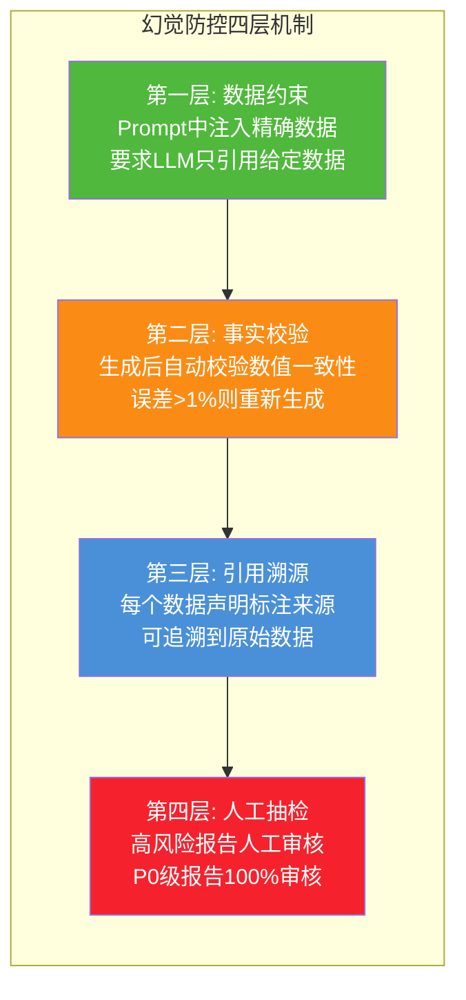

**幻觉防控规则**:

| 防控层 | 机制 | 检测方法 | 处置方式 |
|-------|------|---------|---------|
| **数据约束** | Prompt 明确要求"只能引用提供的数据" | Prompt 模板固化 | 生成前 |
| **事实校验** | 文本中数值与原始数据自动比对 | 正则提取+数值比较 | 误差>1%重生成 |
| **引用溯源** | 每个数据声明关联 source_id | 结构化标注 | 无引用的数据声明标记 |
| **不确定性标注** | LLM 对不确定内容标注"待核实" | Prompt 指令要求 | 标注内容人工复核 |
| **禁止编造** | Prompt 禁止编造未提供的数据/原因 | 后处理检测虚构数据 | 删除或标注 |
| **人工抽检** | P0 级报告 100% / P1 级 30% / P2 级 10% | 人工审核 | 审核通过后发布 |

---

## 六、格式转换与输出引擎

### 6.1 多格式输出架构

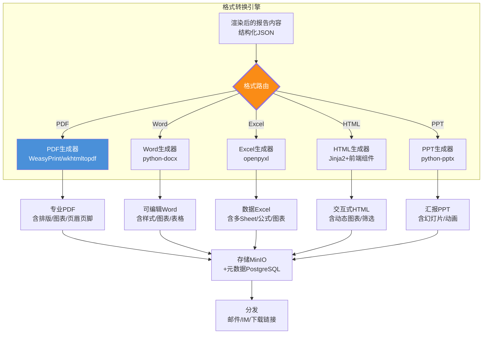

### 6.2 格式转换实现方案

```python
"""
多格式转换引擎
将统一的报告内容JSON转换为5种格式输出
"""
from dataclasses import dataclass
from typing import List, Dict, Any, Optional
from enum import Enum
import json
import io

class OutputFormat(str, Enum):
    PDF = "pdf"
    WORD = "word"
    EXCEL = "excel"
    HTML = "html"
    PPT = "ppt"

class FormatConverter:
    """格式转换引擎"""
    
    async def convert(self, rendered_report: "RenderedReport",
                      formats: List[OutputFormat],
                      style_config: dict) -> Dict[str, bytes]:
        """将渲染后的报告转换为多种格式"""
        results = {}
        for fmt in formats:
            if fmt == OutputFormat.PDF:
                results["pdf"] = await self._to_pdf(rendered_report, style_config)
            elif fmt == OutputFormat.WORD:
                results["word"] = await self._to_word(rendered_report, style_config)
            elif fmt == OutputFormat.EXCEL:
                results["excel"] = await self._to_excel(rendered_report, style_config)
            elif fmt == OutputFormat.HTML:
                results["html"] = await self._to_html(rendered_report, style_config)
            elif fmt == OutputFormat.PPT:
                results["ppt"] = await self._to_ppt(rendered_report, style_config)
        return results
    
    async def _to_pdf(self, report: "RenderedReport", 
                      style: dict) -> bytes:
        """生成PDF(使用WeasyPrint)"""
        from weasyprint import HTML, CSS
        
        # 先生成HTML,再转PDF
        html_content = await self._report_to_html(report, style, for_pdf=True)
        css_content = self._generate_pdf_css(style)
        
        pdf_bytes = HTML(string=html_content).write_pdf(
            stylesheets=[CSS(string=css_content)]
        )
        return pdf_bytes
    
    async def _to_word(self, report: "RenderedReport",
                       style: dict) -> bytes:
        """生成Word文档(使用python-docx)"""
        from docx import Document
        from docx.shared import Inches, Pt, RGBColor
        from docx.enum.text import WD_ALIGN_PARAGRAPH
        
        doc = Document()
        
        # 设置样式
        style_config = style.get("word", {})
        font_name = style_config.get("font", "微软雅黑")
        font_size = Pt(style_config.get("font_size", 11))
        
        for page in report.pages:
            if page.page_type == "cover":
                # 封面
                p = doc.add_paragraph()
                p.alignment = WD_ALIGN_PARAGRAPH.CENTER
                run = p.add_run(page.title)
                run.font.size = Pt(28)
                run.font.bold = True
                doc.add_page_break()
            
            elif page.page_type == "summary":
                # 摘要
                doc.add_heading(page.title, level=1)
                for comp in page.components:
                    if comp.type == "summary_box":
                        doc.add_paragraph(comp.data if isinstance(comp.data, str) else str(comp.data))
                    elif comp.type == "metric_cards":
                        self._add_metric_table_to_docx(doc, comp.data)
            
            elif page.page_type == "detail":
                for section in page.sections:
                    doc.add_heading(section.title, level=2)
                    for comp in section.components:
                        if comp.type == "text_narrative":
                            doc.add_paragraph(comp.data if isinstance(comp.data, str) else "")
                        elif comp.type == "chart":
                            # 插入图表图片
                            if comp.properties.get("image_path"):
                                doc.add_picture(comp.properties["image_path"], 
                                              width=Inches(6))
                        elif comp.type == "data_table":
                            self._add_data_table_to_docx(doc, comp.data, comp.title)
            
            elif page.page_type == "recommendations":
                doc.add_heading(page.title, level=1)
                for comp in page.components:
                    if comp.type == "recommendation_list":
                        for rec in (comp.data if isinstance(comp.data, list) else []):
                            doc.add_paragraph(rec, style="List Number")
        
        # 保存为bytes
        buffer = io.BytesIO()
        doc.save(buffer)
        return buffer.getvalue()
    
    async def _to_excel(self, report: "RenderedReport",
                        style: dict) -> bytes:
        """生成Excel(使用openpyxl)"""
        from openpyxl import Workbook
        from openpyxl.styles import Font, Alignment, PatternFill
        from openpyxl.chart import BarChart, LineChart, PieChart, Reference
        
        wb = Workbook()
        
        # 第一个Sheet: 摘要
        ws_summary = wb.active
        ws_summary.title = "摘要"
        ws_summary["A1"] = report.name
        ws_summary["A1"].font = Font(size=16, bold=True)
        
        # 各章节作为独立Sheet
        for page in report.pages:
            if page.page_type == "detail":
                for section in page.sections:
                    for comp in section.components:
                        if comp.type == "data_table" and comp.data:
                            sheet_name = section.title[:31]  # Excel Sheet名最长31
                            ws = wb.create_sheet(sheet_name)
                            self._write_table_to_excel(ws, comp.data, comp.title)
        
        buffer = io.BytesIO()
        wb.save(buffer)
        return buffer.getvalue()
    
    def _write_table_to_excel(self, ws, data: list, title: str):
        """将数据表写入Excel Sheet"""
        if not data or not isinstance(data, list):
            return
        # 标题行
        ws.cell(row=1, column=1, value=title).font = Font(bold=True, size=14)
        # 表头
        headers = list(data[0].keys()) if isinstance(data[0], dict) else []
        for col, header in enumerate(headers, 1):
            cell = ws.cell(row=3, column=col, value=header)
            cell.font = Font(bold=True)
            cell.fill = PatternFill(start_color="4472C4", end_color="4472C4", 
                                   fill_type="solid")
            cell.font = Font(bold=True, color="FFFFFF")
        # 数据行
        for row_idx, row_data in enumerate(data, 4):
            if isinstance(row_data, dict):
                for col, header in enumerate(headers, 1):
                    ws.cell(row=row_idx, column=col, value=row_data.get(header, ""))
    
    async def _to_html(self, report: "RenderedReport",
                       style: dict) -> bytes:
        """生成交互式HTML(含ECharts动态图表)"""
        from jinja2 import Template
        
        html_template = """<!DOCTYPE html>
<html lang="zh-CN">
<head>
    <meta charset="UTF-8">
    <title>{{ report_name }}</title>
    <script src="https://cdn.jsdelivr.net/npm/echarts@5/dist/echarts.min.js"></script>
    <style>
        body { font-family: {{ font }}; margin: 40px; color: {{ text_color }}; }
        .report-title { font-size: 28px; font-weight: bold; text-align: center; 
                        margin-bottom: 30px; color: {{ primary_color }}; }
        .section-title { font-size: 20px; font-weight: bold; 
                         border-left: 4px solid {{ primary_color }}; padding-left: 10px;
                         margin-top: 30px; }
        .metric-card { display: inline-block; width: 200px; padding: 20px;
                       margin: 10px; border-radius: 8px; 
                       background: {{ card_bg }}; box-shadow: 0 2px 8px rgba(0,0,0,0.1); }
        .metric-value { font-size: 32px; font-weight: bold; color: {{ primary_color }}; }
        .metric-label { font-size: 14px; color: #666; }
        .chart-container { width: 100%; height: 400px; margin: 20px 0; }
        .narrative { line-height: 1.8; font-size: 14px; }
        .data-table { width: 100%; border-collapse: collapse; margin: 20px 0; }
        .data-table th { background: {{ primary_color }}; color: white; padding: 10px; }
        .data-table td { padding: 8px; border-bottom: 1px solid #ddd; }
    </style>
</head>
<body>
    <div class="report-title">{{ report_name }}</div>
    
        
            <div class="section-title">{{ section.title }}</div>
            
                
                    <div class="narrative">{{ comp.data }}</div>
                
                    <div id="chart_{{ loop_index }}" class="chart-container"></div>
                    <script>
                        var chart_{{ loop_index }} = echarts.init(
                            document.getElementById('chart_{{ loop_index }}')
                        );
                        chart_{{ loop_index }}.setOption({{ comp.options_json | safe }});
                    </script>
                
                    <table class="data-table">
                        <tr><th>{{ h }}</th></tr>
                        
                        <tr><td>{{ v }}</td></tr>
                        
                    </table>
                
            
        
    
</body>
</html>"""
        
        template = Template(html_template)
        html_str = template.render(
            report_name=report.name,
            pages=self._prepare_html_pages(report),
            font=style.get("font", "微软雅黑"),
            primary_color=style.get("primary_color", "#1677ff"),
            text_color=style.get("text_color", "#333"),
            card_bg=style.get("card_bg", "#f0f5ff")
        )
        return html_str.encode("utf-8")
    
    async def _to_ppt(self, report: "RenderedReport",
                      style: dict) -> bytes:
        """生成PPT(使用python-pptx)"""
        from pptx import Presentation
        from pptx.util import Inches, Pt
        
        prs = Presentation()
        prs.slide_width = Inches(13.333)  # 16:9
        prs.slide_height = Inches(7.5)
        
        # 封面幻灯片
        slide_layout = prs.slide_layouts[6]  # 空白布局
        slide = prs.slides.add_slide(slide_layout)
        title_box = slide.shapes.add_textbox(Inches(1), Inches(2), 
                                              Inches(11), Inches(2))
        title_tf = title_box.text_frame
        title_tf.text = report.name
        title_tf.paragraphs[0].font.size = Pt(40)
        title_tf.paragraphs[0].font.bold = True
        
        # 每个章节一张幻灯片
        for page in report.pages:
            if page.page_type == "detail":
                for section in page.sections:
                    slide = prs.slides.add_slide(prs.slide_layouts[6])
                    # 标题
                    title_box = slide.shapes.add_textbox(Inches(0.5), Inches(0.3),
                                                          Inches(12), Inches(1))
                    title_box.text_frame.text = section.title
                    title_box.text_frame.paragraphs[0].font.size = Pt(28)
                    title_box.text_frame.paragraphs[0].font.bold = True
                    
                    # 内容(简化:取第一个文本组件)
                    for comp in section.components:
                        if comp.type == "text_narrative":
                            content_box = slide.shapes.add_textbox(
                                Inches(0.5), Inches(1.5), Inches(12), Inches(5))
                            content_box.text_frame.text = str(comp.data)[:500]
                            content_box.text_frame.paragraphs[0].font.size = Pt(18)
        
        buffer = io.BytesIO()
        prs.save(buffer)
        return buffer.getvalue()
```

### 6.3 排版与美化引擎

```python
"""
排版美化引擎:统一的样式系统,确保报告视觉一致
"""

STYLE_THEMES = {
    "corporate_blue": {
        "primary_color": "#1677ff",
        "secondary_color": "#52c41a",
        "accent_color": "#fa8c16",
        "danger_color": "#f5222d",
        "text_color": "#333333",
        "background_color": "#ffffff",
        "card_background": "#f0f5ff",
        "font_family": "微软雅黑",
        "font_size_body": "11pt",
        "font_size_heading1": "18pt",
        "font_size_heading2": "14pt",
        "font_size_title": "28pt",
        "table_header_bg": "#1677ff",
        "table_header_color": "#ffffff",
        "table_row_alt_bg": "#f5f5f5",
        "chart_color_palette": ["#1677ff", "#52c41a", "#fa8c16", "#f5222d", 
                                "#722ed1", "#13c2c2", "#eb2f96"],
    },
    "minimalist": {
        "primary_color": "#333333",
        "secondary_color": "#666666",
        "accent_color": "#1890ff",
        "text_color": "#333333",
        "background_color": "#ffffff",
        "font_family": "微软雅黑",
        "font_size_body": "11pt",
        "chart_color_palette": ["#333333", "#666666", "#999999", "#1890ff"],
    }
}

class LayoutEngine:
    """排版引擎:控制页面布局、间距、分页"""
    
    PAGE_CONFIG = {
        "size": "A4",
        "margin_top": "2cm",
        "margin_bottom": "2cm",
        "margin_left": "2.5cm",
        "margin_right": "2.5cm",
        "header": "{report_name} - {period}",
        "footer": "第 {page} 页 / 共 {total_pages} 页 | 生成时间: {generated_at}",
    }
    
    def apply_layout(self, rendered_report, style_theme: str):
        """应用排版样式到渲染后的报告"""
        theme = STYLE_THEMES.get(style_theme, STYLE_THEMES["corporate_blue"])
        # 应用颜色、字体、间距等样式...
        return rendered_report, theme
```

---

## 七、定时调度与触发机制

### 7.1 三种触发模式设计

```mermaid
flowchart TB
    subgraph 触发模式一_定时调度
        CRON_IN[Cron表达式配置<br/>如:0 8 * * 1(每周一8点)] --> CRON_ENG[定时调度引擎<br/>APScheduler]
        CRON_ENG --> CRON_TRIG[触发报告生成]
    end
    
    subgraph 触发模式二_事件驱动
        EVENT_IN[业务事件<br/>如:月度结算完成/采购订单关闭] --> KAFKA[Kafka消息]
        KAFKA --> EVENT_CONS[事件消费者]
        EVENT_CONS -->|匹配报告规则| EVENT_TRIG[触发报告生成]
    end
    
    subgraph 触发模式三_按需生成
        API_IN[API请求<br/>POST /api/v1/reports/generate] --> API_HANDLER[API处理器]
        API_HANDLER --> API_TRIG[即时触发报告生成]
    end
    
    CRON_TRIG & EVENT_TRIG & API_TRIG --> GEN_PIPE[报告生成管线<br/>采集→渲染→生成→转换→存储→通知]
    
    style CRON_ENG fill:#722ed1,color:#fff
    style EVENT_CONS fill:#fa8c16,color:#fff
    style API_HANDLER fill:#4a90d9,color:#fff
```

**三种触发模式对比**:

| 模式 | 触发方式 | 适用场景 | 延迟 | 配置方式 |
|-----|---------|---------|:---:|---------|
| **定时调度** | Cron 表达式 | 日报/周报/月报/季报 | 精确到分钟 | 报告配置表 schedule_cron |
| **事件驱动** | Kafka 事件 | 事件触发型报告(如订单关闭后生成验收报告) | 秒级 | 报告配置表 trigger_event |
| **按需生成** | API 调用 | 临时报告/用户手动触发 | 即时(60s内) | REST API 即时调用 |

### 7.2 调度引擎核心实现

```python
"""
报告调度引擎
支持定时/事件/API三种触发模式,含依赖链与失败重试
"""
from dataclasses import dataclass, field
from typing import List, Dict, Optional, Callable
from enum import Enum
from datetime import datetime, timedelta
import asyncio
from apscheduler.schedulers.asyncio import AsyncIOScheduler
from apscheduler.triggers.cron import CronTrigger

class TriggerType(str, Enum):
    CRON = "cron"
    EVENT = "event"
    API = "api"

@dataclass
class ReportJob:
    job_id: str
    config_id: str               # 报告配置ID
    trigger_type: TriggerType
    trigger_config: dict          # cron表达式/事件topic/API参数
    status: str = "pending"       # pending/running/completed/failed/retrying
    priority: int = 5             # 1(最高) - 10(最低)
    depends_on: List[str] = field(default_factory=list)  # 依赖的上游报告job_id
    retry_count: int = 0
    max_retry: int = 3
    created_at: datetime = field(default_factory=datetime.now)
    started_at: Optional[datetime] = None
    completed_at: Optional[datetime] = None
    result: Optional[dict] = None


class ReportScheduler:
    """报告调度引擎"""
    
    def __init__(self):
        self.scheduler = AsyncIOScheduler()
        self._event_consumers: Dict[str, asyncio.Task] = {}
        self._dependency_graph: Dict[str, List[str]] = {}  # job_id -> 依赖的job_ids
        self._job_queue: asyncio.PriorityQueue = asyncio.PriorityQueue()
    
    async def start(self):
        """启动调度引擎"""
        # 1. 加载所有定时报告配置
        cron_configs = await self._load_cron_configs()
        for config in cron_configs:
            self._register_cron_job(config)
        
        # 2. 启动事件消费者
        event_configs = await self._load_event_configs()
        for config in event_configs:
            self._register_event_consumer(config)
        
        # 3. 启动任务消费者(处理优先队列)
        asyncio.create_task(self._process_job_queue())
        
        self.scheduler.start()
    
    def _register_cron_job(self, config: dict):
        """注册定时报告任务"""
        cron_expr = config["schedule_cron"]  # 如 "0 8 * * 1"
        trigger = CronTrigger.from_crontab(cron_expr)
        
        self.scheduler.add_job(
            func=self._trigger_report_generation,
            trigger=trigger,
            args=[config["config_id"], TriggerType.CRON],
            id=f"cron_{config['config_id']}",
            replace_existing=True,
            misfire_grace_time=3600,  # 1小时内的误触发仍执行
        )
    
    def _register_event_consumer(self, config: dict):
        """注册事件驱动报告任务"""
        topic = config["trigger_event"]
        
        async def event_handler(event_data: dict):
            # 检查事件是否匹配报告触发条件
            if self._match_trigger_condition(event_data, config.get("trigger_condition")):
                await self._trigger_report_generation(
                    config["config_id"], TriggerType.EVENT, 
                    event_context=event_data
                )
        
        # 订阅Kafka topic
        consumer_task = asyncio.create_task(
            self.kafka_consumer.subscribe(topic, event_handler)
        )
        self._event_consumers[topic] = consumer_task
    
    async def trigger_api(self, config_id: str, params: dict = None) -> str:
        """API触发报告生成(即时)"""
        job = ReportJob(
            job_id=f"api_{config_id}_{datetime.now().strftime('%Y%m%d%H%M%S')}",
            config_id=config_id,
            trigger_type=TriggerType.API,
            trigger_config=params or {},
            priority=1  # API触发优先级最高
        )
        await self._job_queue.put((job.priority, job))
        return job.job_id
    
    async def _trigger_report_generation(self, config_id: str,
                                          trigger_type: TriggerType,
                                          event_context: dict = None):
        """触发报告生成(创建Job放入队列)"""
        config = await self._load_report_config(config_id)
        
        job = ReportJob(
            job_id=f"{trigger_type.value}_{config_id}_{datetime.now().strftime('%Y%m%d%H%M%S')}",
            config_id=config_id,
            trigger_type=trigger_type,
            trigger_config=event_context or {},
            priority=config.get("priority", 5),
            depends_on=config.get("depends_on", [])
        )
        
        # 如果有依赖,注册到依赖图
        if job.depends_on:
            self._dependency_graph[job.job_id] = job.depends_on
            # 检查依赖是否已完成
            if not await self._check_dependencies_ready(job):
                job.status = "waiting_dependencies"
                await self._save_job(job)
                return
        
        await self._job_queue.put((job.priority, job))
    
    async def _process_job_queue(self):
        """任务队列消费者:按优先级处理报告生成任务"""
        while True:
            priority, job = await self._job_queue.get()
            asyncio.create_task(self._execute_job(job))
    
    async def _execute_job(self, job: ReportJob):
        """执行报告生成任务"""
        job.status = "running"
        job.started_at = datetime.now()
        await self._save_job(job)
        
        try:
            # 1. 加载报告配置
            config = await self._load_report_config(job.config_id)
            
            # 2. 数据采集
            data = await self.data_collector.collect_all(
                config["data_sources"], 
                self._build_report_context(config, job)
            )
            
            # 3. ETL处理
            dataset = await self.etl_pipeline.process(data, config)
            
            # 4. 模板渲染
            template = self.template_engine.load_template(
                config["template_id"], 
                config.get("template_version", "latest")
            )
            rendered = self.template_engine.render(template, dataset)
            
            # 5. 内容生成(LLM叙事 + 图表)
            rendered = await self.narrative_generator.generate_all(
                rendered, dataset, config
            )
            
            # 6. 格式转换
            files = await self.format_converter.convert(
                rendered, config["output_formats"], 
                self._get_style_config(template.style)
            )
            
            # 7. 存储与通知
            instance = await self._store_report(job, config, files, dataset)
            await self._notify_recipients(config, instance)
            
            job.status = "completed"
            job.completed_at = datetime.now()
            job.result = {"instance_id": instance.instance_id}
            
            # 8. 触发下游依赖报告
            await self._trigger_dependent_reports(job.job_id)
            
        except Exception as e:
            job.retry_count += 1
            if job.retry_count < job.max_retry:
                job.status = "retrying"
                await asyncio.sleep(60 * job.retry_count)  # 指数退避
                await self._job_queue.put((job.priority, job))
            else:
                job.status = "failed"
                await self._alert_failure(job, str(e))
        
        await self._save_job(job)
    
    async def _check_dependencies_ready(self, job: ReportJob) -> bool:
        """检查依赖的上游报告是否已完成"""
        for dep_job_id in job.depends_on:
            dep_job = await self._load_job(dep_job_id)
            if not dep_job or dep_job.status != "completed":
                return False
        return True
    
    async def _trigger_dependent_reports(self, completed_job_id: str):
        """上游报告完成后,触发依赖它的下游报告"""
        for downstream_id, deps in self._dependency_graph.items():
            if completed_job_id in deps:
                downstream_job = await self._load_job(downstream_id)
                if downstream_job and downstream_job.status == "waiting_dependencies":
                    if await self._check_dependencies_ready(downstream_job):
                        downstream_job.status = "pending"
                        await self._job_queue.put((
                            downstream_job.priority, downstream_job
                        ))
```

### 7.3 依赖链与失败重试

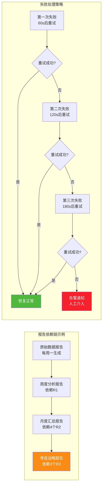

**失败重试与降级策略**:

| 失败阶段 | 重试次数 | 重试间隔 | 降级策略 | 告警级别 |
|---------|:------:|:------:|---------|:------:|
| 数据采集失败 | 3 | 60s/120s/180s | 使用缓存数据+标注"数据可能非最新" | P2 |
| ETL 处理失败 | 2 | 30s/60s | 跳过失败步骤+标注"部分数据缺失" | P1 |
| LLM 生成失败 | 3 | 10s/20s/30s | 使用模板化文本替代LLM叙述 | P2 |
| 格式转换失败 | 2 | 10s/20s | 仅输出成功格式+标注其他格式缺失 | P3 |
| 全流程失败 | — | — | 发送"报告生成失败"通知+人工介入 | P0 |

---

## 八、定制化与可读性设计

### 8.1 多维度定制化框架

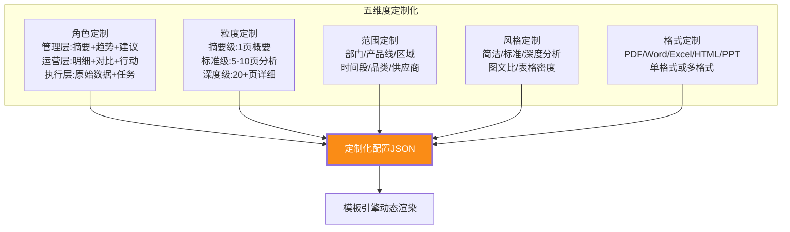

**定制化配置示例**:

```python
"""
报告定制化框架
支持5个维度的参数化定制
"""

CUSTOMIZATION_EXAMPLE = {
    "role": "management",          # management/operational/executive
    "granularity": "summary",      # summary/standard/detailed
    "scope": {
        "department": "采购部",
        "product_lines": ["IT设备", "办公用品"],
        "period": "2026-07",
        "suppliers": []            # 空=全部
    },
    "style": {
        "narrative_style": "concise",   # concise/standard/detailed
        "chart_density": "medium",       # low/medium/high
        "table_detail": "summary",       # summary/full
        "color_theme": "corporate_blue"
    },
    "format": ["pdf", "html"],     # 输出格式列表
    "sections": {                  # 章节级开关
        "executive_summary": True,
        "category_analysis": True,
        "supplier_analysis": True,
        "price_trend": False,      # 管理层不需要价格细节
        "recommendations": True,
        "appendix": False           # 管理层不需要附录
    },
    "language": "zh-CN",
    "extra_fields": {              # 自定义字段
        "include_benchmark": True,  # 包含行业基准对比
        "include_forecast": True,   # 包含趋势预测
    }
}


class CustomizationEngine:
    """定制化引擎:根据配置动态调整报告内容"""
    
    ROLE_PROFILES = {
        "management": {
            "default_granularity": "summary",
            "sections": {
                "executive_summary": True,
                "detailed_analysis": False,
                "raw_data": False,
                "recommendations": True,
                "appendix": False
            },
            "narrative_style": "concise",
            "max_pages": 5
        },
        "operational": {
            "default_granularity": "standard",
            "sections": {
                "executive_summary": True,
                "detailed_analysis": True,
                "raw_data": False,
                "recommendations": True,
                "appendix": True
            },
            "narrative_style": "standard",
            "max_pages": 15
        },
        "executive": {
            "default_granularity": "detailed",
            "sections": {
                "executive_summary": True,
                "detailed_analysis": True,
                "raw_data": True,
                "recommendations": True,
                "appendix": True
            },
            "narrative_style": "detailed",
            "max_pages": 30
        }
    }
    
    def apply_customization(self, template: "ReportTemplate",
                            config: dict) -> "ReportTemplate":
        """根据定制化配置调整模板"""
        # 1. 应用角色配置文件
        role = config.get("role", "operational")
        role_profile = self.ROLE_PROFILES.get(role, self.ROLE_PROFILES["operational"])
        
        # 2. 根据章节开关过滤模板页面
        section_switches = config.get("sections", role_profile["sections"])
        filtered_pages = []
        for page in template.pages:
            if self._should_include_page(page, section_switches):
                filtered_pages.append(page)
        template.pages = filtered_pages
        
        # 3. 应用粒度调整(控制组件详情程度)
        granularity = config.get("granularity", role_profile["default_granularity"])
        template = self._apply_granularity(template, granularity)
        
        return template
    
    def _should_include_page(self, page: "ReportPage", 
                             switches: dict) -> bool:
        """根据章节开关判断页面是否包含"""
        page_section_map = {
            "summary": "executive_summary",
            "detail": "detailed_analysis",
            "recommendations": "recommendations",
            "appendix": "appendix"
        }
        section_key = page_section_map.get(page.page_type)
        if section_key and section_key in switches:
            return switches[section_key]
        return True  # cover/toc默认包含
```

### 8.2 可读性优化策略

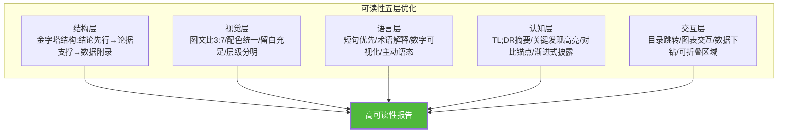

**可读性优化规则**:

| 优化维度 | 具体规则 | 实现方式 |
|---------|---------|---------|
| **结构** | 金字塔原理:结论→论据→数据 | 摘要页先行,详细分析在后,附录放原始数据 |
| **摘要** | 每个章节开头有 2-3 句 TL;DR | LLM 生成章节摘要,标注"本章要点" |
| **数据** | 关键数字加粗/高亮 | 渲染时自动识别数字并标记 `<strong>` |
| **图表** | 图表配有"读图说明" | 图表下方 LLM 生成一句话解读 |
| **对比** | 变化量标注颜色(涨绿跌红) | 自动计算同比/环比并着色 |
| **语言** | 句子<30字/段落<5句/避免术语 | LLM Prompt 约束输出风格 |
| **视觉** | 充足留白/统一配色/清晰层级 | 样式模板统一控制 |
| **导航** | 目录可跳转/页眉标注章节 | PDF/HTML 生成时自动添加 |

### 8.3 交互式报告设计

```python
"""
交互式HTML报告:支持图表交互、数据下钻、筛选
"""
INTERACTIVE_HTML_TEMPLATE = """
<!DOCTYPE html>
<html lang="zh-CN">
<head>
    <meta charset="UTF-8">
    <title>{{ report_name }}</title>
    <script src="https://cdn.jsdelivr.net/npm/echarts@5/dist/echarts.min.js"></script>
    <script src="https://cdn.jsdelivr.net/npm/vue@3/dist/vue.global.js"></script>
    <style>
        /* 交互式报告样式 */
        .drill-down { cursor: pointer; color: #1677ff; }
        .drill-down:hover { text-decoration: underline; }
        .filter-bar { background: #f0f5ff; padding: 15px; border-radius: 8px; margin: 10px 0; }
        .collapsible { cursor: pointer; padding: 10px; background: #fafafa; }
        .collapsible-content { display: none; padding: 10px; }
        .collapsible.active + .collapsible-content { display: block; }
    </style>
</head>
<body>
    <div id="app">
        <!-- 筛选栏 -->
        <div class="filter-bar">
            <label>时间范围:</label>
            <select v-model="filter.period">
                <option value="week">本周</option>
                <option value="month">本月</option>
                <option value="quarter">本季</option>
            </select>
            <label>部门:</label>
            <select v-model="filter.department">
                <option value="">全部</option>
                <option v-for="d in departments" :value="d">{{ d }}</option>
            </select>
            <button @click="applyFilter">应用筛选</button>
        </div>
        
        <!-- 报告内容(支持交互) -->
        <div v-for="section in filteredSections">
            <div class="collapsible" @click="toggleSection(section)">
                {{ section.title }} <span>{{ section.expanded ? '▼' : '▶' }}</span>
            </div>
            <div class="collapsible-content" v-show="section.expanded">
                <!-- 交互式图表 -->
                <div v-for="chart in section.charts" 
                     :id="chart.id" class="chart-container"
                     @click="drillDown(chart)">
                </div>
                <!-- 可下钻的数据表格 -->
                <table class="data-table">
                    <tr v-for="row in section.tableData">
                        <td class="drill-down" @click="drillDown(row)">
                            {{ row.name }}
                        </td>
                        <td>{{ row.value }}</td>
                    </tr>
                </table>
            </div>
        </div>
    </div>
</body>
</html>
"""
```

---

## 九、接口设计与系统集成

### 9.1 RESTful API 设计

| 模块 | 方法 | 路径 | 描述 | 请求体/参数 | 响应 |
|-----|:----:|-----|------|----------|------|
| 模板管理 | GET | `/api/v1/templates` | 模板列表 | ?category&status | 模板列表 |
| 模板管理 | POST | `/api/v1/templates` | 创建模板 | DSL YAML | template_id |
| 模板管理 | GET | `/api/v1/templates/{id}` | 模板详情(含版本) | ?version | 模板DSL |
| 模板管理 | PUT | `/api/v1/templates/{id}` | 更新模板(新版本) | DSL YAML | 新版本号 |
| 模板管理 | POST | `/api/v1/templates/{id}/preview` | 模板预览(样例数据) | {data} | 预览HTML |
| 报告配置 | GET | `/api/v1/report-configs` | 报告配置列表 | — | 配置列表 |
| 报告配置 | POST | `/api/v1/report-configs` | 创建报告配置 | 配置JSON | config_id |
| 报告配置 | PUT | `/api/v1/report-configs/{id}` | 更新配置 | 配置JSON | 操作结果 |
| 报告生成 | POST | `/api/v1/reports/generate` | 即时触发报告生成 | {config_id, params} | job_id |
| 报告生成 | GET | `/api/v1/reports/jobs/{job_id}` | 查询生成状态 | — | 状态+进度 |
| 报告查询 | GET | `/api/v1/reports/instances` | 报告实例列表 | ?config_id&period&status | 报告列表 |
| 报告查询 | GET | `/api/v1/reports/instances/{id}` | 报告详情 | — | 元数据+下载链接 |
| 报告下载 | GET | `/api/v1/reports/instances/{id}/download` | 下载报告文件 | ?format=pdf | 文件流 |
| 报告预览 | GET | `/api/v1/reports/instances/{id}/preview` | 在线预览 | — | HTML内容 |
| 调度管理 | GET | `/api/v1/schedule/jobs` | 调度任务列表 | — | 定时任务列表 |
| 调度管理 | POST | `/api/v1/schedule/jobs` | 创建定时任务 | {config_id, cron} | job_id |
| 调度管理 | DELETE | `/api/v1/schedule/jobs/{id}` | 删除定时任务 | — | 操作结果 |
| 数据源管理 | GET | `/api/v1/data-sources` | 数据源列表 | — | 数据源列表 |
| 数据源管理 | POST | `/api/v1/data-sources/test` | 测试数据源连通性 | 连接配置 | 测试结果 |

**统一响应格式**:

```json
{
    "code": 0,
    "message": "success",
    "data": { ... },
    "trace_id": "req_20260808_abc123"
}
```

**报告生成接口示例**:

```python
from fastapi import FastAPI, BackgroundTasks, HTTPException, Depends
from pydantic import BaseModel
from typing import List, Optional

app = FastAPI(title="自动报告生成Agent API")

class GenerateReportRequest(BaseModel):
    config_id: str
    params: Optional[dict] = None  # 定制化参数(覆盖默认配置)
    formats: Optional[List[str]] = None  # 输出格式(覆盖默认)
    priority: int = 5

class ReportJobResponse(BaseModel):
    job_id: str
    status: str
    estimated_time: int  # 预估完成时间(秒)
    trace_id: str

@app.post("/api/v1/reports/generate", response_model=ReportJobResponse)
async def generate_report(req: GenerateReportRequest,
                          background_tasks: BackgroundTasks,
                          current_user: User = Depends(get_current_user)):
    """即时触发报告生成"""
    # 权限校验
    if not current_user.has_permission("report:generate"):
        raise HTTPException(403, "无报告生成权限")
    
    # 触发报告生成
    job_id = await scheduler.trigger_api(
        config_id=req.config_id,
        params=req.params
    )
    
    return ReportJobResponse(
        job_id=job_id,
        status="pending",
        estimated_time=60,
        trace_id=request.trace_id
    )

@app.get("/api/v1/reports/jobs/{job_id}")
async def get_job_status(job_id: str):
    """查询报告生成状态"""
    job = await scheduler.get_job(job_id)
    if not job:
        raise HTTPException(404, "任务不存在")
    
    return {
        "job_id": job_id,
        "status": job.status,
        "progress": self._calculate_progress(job),
        "started_at": job.started_at,
        "completed_at": job.completed_at,
        "result": job.result,
        "error": job.error_message if job.status == "failed" else None
    }

@app.get("/api/v1/reports/instances/{instance_id}/download")
async def download_report(instance_id: str, format: str = "pdf"):
    """下载报告文件"""
    instance = await report_store.get_instance(instance_id)
    if not instance:
        raise HTTPException(404, "报告不存在")
    
    # 权限校验:用户是否有权访问该报告
    if not await check_report_access(current_user, instance):
        raise HTTPException(403, "无权下载该报告")
    
    file_path = instance.file_paths.get(format)
    if not file_path:
        raise HTTPException(404, f"格式{format}不可用")
    
    # 从MinIO下载文件
    file_bytes = await minio_client.get_object(file_path)
    
    return StreamingResponse(
        io.BytesIO(file_bytes),
        media_type=MEDIA_TYPES[format],
        headers={
            "Content-Disposition": f'attachment; filename="{instance.name}.{format}"'
        }
    )
```

### 9.2 Webhook 回调与事件通知

```python
"""
报告生成完成后的通知机制
支持Webhook回调、IM推送、邮件通知
"""
from dataclasses import dataclass
from typing import List, Optional

@dataclass
class ReportNotification:
    instance_id: str
    report_name: str
    config_id: str
    formats: List[str]
    download_urls: dict       # {format: presigned_url}
    preview_url: str
    generated_at: str
    recipients: List[str]
    summary: str              # 报告摘要(LLM生成)

class NotificationService:
    """报告通知服务"""
    
    async def notify(self, notification: ReportNotification):
        """多渠道通知"""
        # 并行发送
        await asyncio.gather(
            self._notify_webhook(notification),
            self._notify_im(notification),
            self._notify_email(notification)
        )
    
    async def _notify_webhook(self, notification: ReportNotification):
        """Webhook回调(供第三方系统集成)"""
        config = await self._get_webhook_config(notification.config_id)
        if not config or not config.get("webhook_url"):
            return
        
        payload = {
            "event": "report.completed",
            "instance_id": notification.instance_id,
            "report_name": notification.report_name,
            "formats": notification.formats,
            "download_urls": notification.download_urls,
            "preview_url": notification.preview_url,
            "generated_at": notification.generated_at,
            "summary": notification.summary
        }
        
        import httpx
        async with httpx.AsyncClient() as client:
            await client.post(
                config["webhook_url"],
                json=payload,
                headers={"X-Report-Signature": self._sign(payload)},
                timeout=10
            )
    
    async def _notify_im(self, notification: ReportNotification):
        """IM推送(飞书/钉钉/企微)"""
        message = {
            "msg_type": "interactive",
            "card": {
                "header": {
                    "title": {"tag": "plain_text", 
                              "content": f"📋 {notification.report_name} 已生成"},
                    "template": "blue"
                },
                "elements": [
                    {"tag": "div", "text": {"tag": "lark_md", 
                     "content": notification.summary}},
                    {"tag": "action", "actions": [
                        {"tag": "button", "text": {"tag": "plain_text", 
                         "content": "📥 下载PDF"},
                         "url": notification.download_urls.get("pdf", "")},
                        {"tag": "button", "text": {"tag": "plain_text", 
                         "content": "👁 在线预览"},
                         "url": notification.preview_url}
                    ]}
                ]
            }
        }
        
        for recipient in notification.recipients:
            await self.im_client.send_to_user(recipient, message)
```

### 9.3 与现有系统集成方案

| 现有系统 | 集成方式 | 数据流向 | 兼容性保障 |
|---------|---------|---------|-----------|
| **数据分析Agent** | Agent 适配器接口 | Agent分析结果 → 报告数据源 | 标准Agent间接口,解耦 |
| **采购Agent** | 共享数据库 + API | 采购订单数据 → 采购报告 | 只读访问,不侵入 |
| **知识库Agent** | RAG 检索接口 | 知识检索结果 → 报告增强内容 | 复用118号RAG能力 |
| **ERP 系统** | DB 适配器 / API | ERP业务数据 → 报告数据源 | 只读查询,适配器模式 |
| **OA 系统** | REST API | 报告生成完成 → OA通知 | Webhook回调 |
| **飞书/钉钉** | 开放平台API | 报告推送 → IM消息 | 多IM适配层 |
| **邮件系统** | SMTP | 报告附件 → 邮件推送 | 标准SMTP协议 |

---

## 十、安全权限与审计策略

### 10.1 报告数据安全

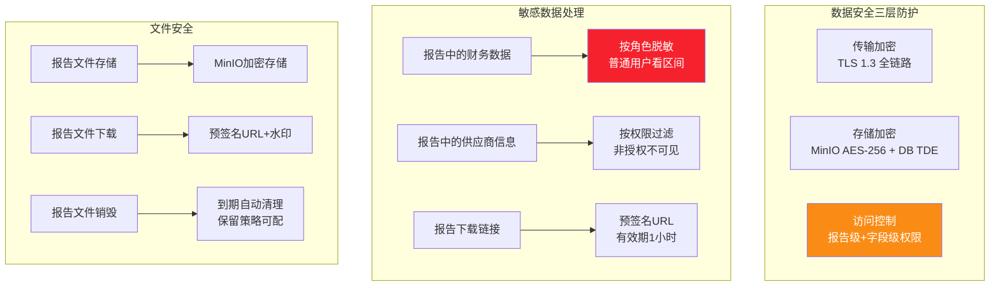

### 10.2 权限控制矩阵

| 功能 \ 角色 | 报告管理员 | 部门管理者 | 报告编辑者 | 普通用户 | 审计员 |
|-----------|:------:|:------:|:------:|:----:|:----:|
| 模板管理(增删改) | ✅ | ❌ | ✅ | ❌ | ❌ |
| 报告配置(增删改) | ✅ | ✅ 本部门 | ✅ | ❌ | ❌ |
| 触发报告生成 | ✅ | ✅ 本部门 | ✅ | ✅ 按需 | ❌ |
| 查看报告列表 | ✅ 全部 | ✅ 本部门 | ✅ 自己 | ✅ 自己 | ✅ 全部 |
| 下载报告文件 | ✅ 全部 | ✅ 本部门 | ✅ 自己 | ✅ 授权范围 | ✅ 全部 |
| 在线预览报告 | ✅ | ✅ 本部门 | ✅ 自己 | ✅ 授权范围 | ✅ |
| 配置定时调度 | ✅ | ✅ 本部门 | ❌ | ❌ | ❌ |
| 查看审计日志 | ✅ | ❌ | ❌ | ❌ | ✅ |

### 10.3 审计与追溯

```python
"""
报告审计:全链路操作日志,支持追溯
"""

AUDIT_LOG_STRUCTURE = {
    "trace_id": "req_20260808_abc123",
    "timestamp": "2026-08-08T10:30:00Z",
    "user_id": "user_001",
    "user_name": "张三",
    "action": "report.download",      # generate/preview/download/config_update
    "report_instance_id": "rpt_20260808_001",
    "report_name": "采购月度分析报告",
    "template_id": "purchase_monthly_report",
    "template_version": "2.1.0",
    "format": "pdf",
    "ip": "192.168.1.100",
    "user_agent": "Mozilla/5.0...",
    "result": "success",
    "duration_ms": 45000,             # 生成耗时
    "data_sources_used": ["erp_db", "srm_api", "market_index"],
    "llm_cost": 0.0325,               # LLM调用成本
    "data_snapshot_hash": "sha256:abc123..."  # 数据快照哈希(追溯)
}
```

**审计要求**:

| 审计维度 | 记录内容 | 保留期限 | 查询方式 |
|---------|---------|:------:|---------|
| **生成审计** | 谁在何时触发了什么报告,用了哪些数据 | 3年 | 按用户/时间/模板查询 |
| **访问审计** | 谁在何时查看/下载了什么报告 | 3年 | 按用户/报告查询 |
| **配置审计** | 谁在何时修改了模板/配置 | 5年 | 按配置/时间查询 |
| **数据快照** | 报告生成时的数据快照(哈希) | 1年 | 按报告实例查询 |
| **完整性校验** | 报告文件哈希(防篡改) | 永久 | 文件下载时校验 |

---

## 十一、开发计划与测试方案

### 11.1 四阶段 16 周开发路线图

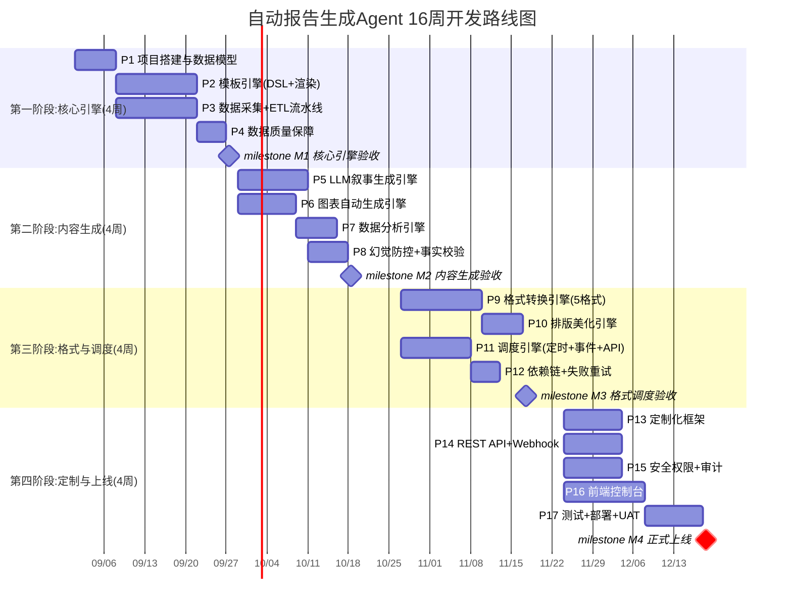

### 11.2 团队配置与交付物

| 角色 | 人数 | 职责 | 阶段投入 |
|-----|:---:|------|:------:|
| **项目经理** | 1 | 项目管理、进度跟踪、对接业务方 | 全程 |
| **架构师** | 1 | 架构设计、技术选型、核心评审 | 全程 |
| **后端工程师** | 3 | 模板引擎/ETL/格式转换/调度开发 | 阶段1~3 |
| **AI 算法工程师** | 2 | LLM叙事/图表生成/数据分析/幻觉防控 | 阶段2~3 |
| **前端工程师** | 2 | Web控制台/交互式HTML报告/数据看板 | 阶段4 |
| **DevOps 工程师** | 1 | K8s部署/CI-CD/监控 | 阶段3~4 |
| **测试工程师** | 2 | 功能/性能/准确性/安全测试 | 阶段4 |
| **合计** | **12** | — | — |

**交付物清单**:

| # | 交付物 | 形式 | 验收标准 | 交付阶段 |
|---|-------|------|---------|:------:|
| D1 | 系统架构设计文档 | PDF + 架构图 | 评审通过 | 阶段1 |
| D2 | 模板DSL规范文档 | PDF + 示例 | 评审通过 | 阶段1 |
| D3 | 数据库设计文档 | ER图 + DDL | 评审通过 | 阶段1 |
| D4 | 源代码 + 依赖说明 | Git 仓库 | Code Review 通过 | 阶段2~3 |
| D5 | API 接口文档 | OpenAPI Spec | 评审通过 | 阶段4 |
| D6 | 部署手册 + 运维文档 | PDF + 脚本 | 可独立部署 | 阶段4 |
| D7 | 测试报告(功能+性能+安全) | PDF + 数据 | 全部用例通过 | 阶段4 |
| D8 | 内容准确性评估报告 | PDF + 数据 | 准确率≥92% | 阶段4 |
| D9 | 用户手册 + 培训材料 | PDF + 视频 | UAT 通过 | 阶段4 |

### 11.3 测试策略与验收标准

| 测试维度 | 测试用例数 | 核心测试点 | 通过标准 |
|---------|:-------:|---------|---------|
| **模板引擎** | 40 | DSL解析/条件渲染/循环渲染/版本管理/预览 | 渲染准确率100% |
| **数据采集** | 30 | 6种数据源/并行采集/缓存/重试/超时 | 采集成功率≥99% |
| **ETL处理** | 35 | 清洗/转换/聚合/关联/衍生计算/质量校验 | 数据准确率≥99% |
| **LLM生成** | 50 | 6种叙事类型/事实校验/幻觉检测/多轮纠错 | 准确率≥92%/幻觉率≤5% |
| **图表生成** | 30 | 7种图表类型/自动选择/数据正确性/渲染 | 图表数据100%正确 |
| **格式转换** | 40 | 5种格式/排版/图表嵌入/表格/分页 | 格式规范符合率100% |
| **调度系统** | 30 | 定时/事件/API/依赖链/重试/降级 | 调度准确率100% |
| **定制化** | 25 | 5维度定制/角色配置/章节开关/粒度调整 | 定制效果符合预期 |
| **安全权限** | 30 | 权限矩阵/数据脱敏/审计日志/文件安全 | 越权0通过 |
| **性能** | 10 | 生成延迟/并发/大报告/多格式并行 | 单报告<60s |

**性能基准**:

| 性能指标 | 测试条件 | 目标值 |
|---------|---------|:-----:|
| 报告生成延迟(简单) | 摘要级,3个数据源,PDF | < 15s |
| 报告生成延迟(标准) | 标准级,5个数据源,PDF+Word | < 30s |
| 报告生成延迟(深度) | 深度级,10+数据源,3格式 | < 60s |
| 并发生成 | 10个报告同时生成 | 全部成功,无超时 |
| 大数据量报告 | 100万行数据源 | < 120s |
| LLM生成延迟 | 单段叙事(500字) | < 5s |
| 图表渲染延迟 | 单个ECharts图表 | < 2s |
| 格式转换延迟 | PDF+Word+Excel并行 | < 10s |

**验收标准汇总**:

| 维度 | 指标 | 目标值 |
|-----|------|:-----:|
| 功能完备性 | 320个测试用例通过率 | ≥95% |
| 生成效率 | 标准报告生成延迟 | <30s |
| 数据准确性 | 数据字段准确率 | ≥99% |
| 内容准确性 | 分析结论准确率 | ≥92% |
| 幻觉率 | LLM叙事幻觉率 | ≤5% |
| 格式一致性 | 格式规范符合率 | 100% |
| 定制化 | 5维度定制支持 | 全部支持 |
| 安全性 | 越权访问 | 0通过 |
| 用户满意度 | UAT可读性评分 | ≥4.2/5 |

---

## 十二、部署运维与最佳实践

### 12.1 部署架构

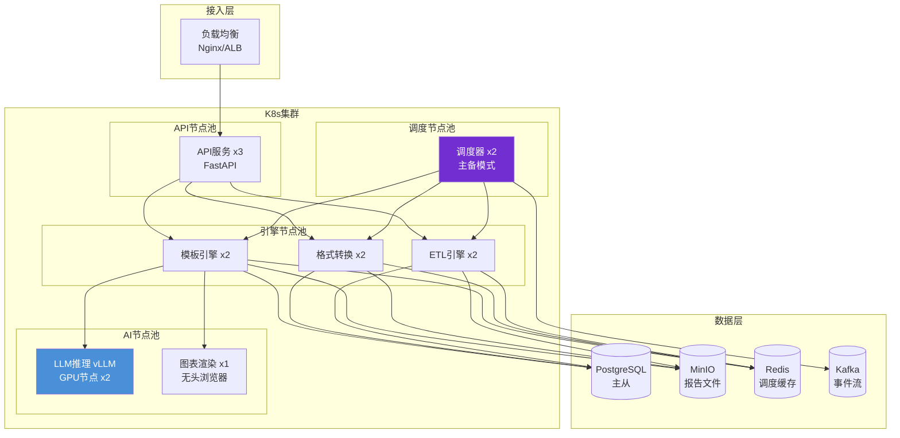

### 12.2 监控告警体系

| 监控维度 | 指标 | 告警阈值 | 告警级别 |
|---------|------|---------|:------:|
| **生成成功率** | 报告生成失败率 | > 5% | P1 |
| **生成延迟** | 标准报告 P99 | > 60s | P2 |
| **LLM 调用** | LLM 错误率 | > 3% | P1 |
| **LLM 成本** | 日均 LLM 调用成本 | > 预算 80% | P2 |
| **数据采集** | 数据源失败率 | > 10% | P1 |
| **调度延迟** | 定时报告延迟 | > 10 分钟 | P1 |
| **存储容量** | MinIO 使用率 | > 80% | P2 |
| **准确性** | 内容准确率 | < 88% | P1 |

### 12.3 最佳实践总结

1. **模板先行**:在开发报告生成功能前,先设计好模板 DSL 规范,确保模板引擎的通用性和可扩展性。

2. **数据质量是基石**:报告的价值取决于数据质量,必须在 ETL 流水线中设置严格的数据质量闸门,宁可标注"数据缺失"也不要输出错误数据。

3. **LLM 生成必须校验**:LLM 叙事必须经过事实校验,数据引用必须可追溯。采用"生成→校验→纠错"三步法,确保内容准确性。

4. **格式分离**:内容生成与格式转换解耦,先生成结构化内容,再按需转换为多种格式,避免格式耦合导致重复工作。

5. **调度可观测**:调度系统是报告按时送达的保障,必须有完善的监控告警,定时报告的延迟或失败必须第一时间发现。

6. **渐进式自动化**:初期采用"Agent 生成 + 人工审核"模式,待准确率稳定后再逐步放开全自动发布,避免错误报告影响决策。

7. **定制化是关键**:不同角色、不同场景对报告的需求差异巨大,定制化框架是用户满意度的核心,从角色、粒度、范围、风格、格式五维度提供灵活定制。

8. **成本可控**:LLM 调用是主要成本,通过 Prompt 优化(精简输入)、结果缓存(相似报告复用)、模型分级(摘要用小模型,深度分析用大模型)控制成本。

> **最终结论**:Agent 自动报告生成功能的核心价值在于将"数据→洞察→报告"的链路自动化,从人工 4-8 小时缩短到 60 秒内,同时通过模板引擎保障格式一致性、通过 LLM 生成保障内容深度、通过事实校验保障数据准确性、通过定制化框架满足多角色需求。本方案提供了从模板设计到测试验收的完整工程蓝图,团队可直接据此启动开发。
