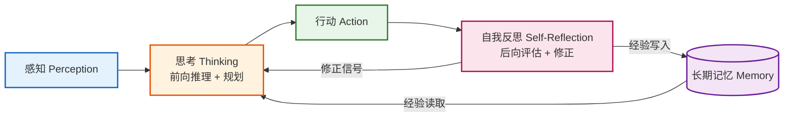
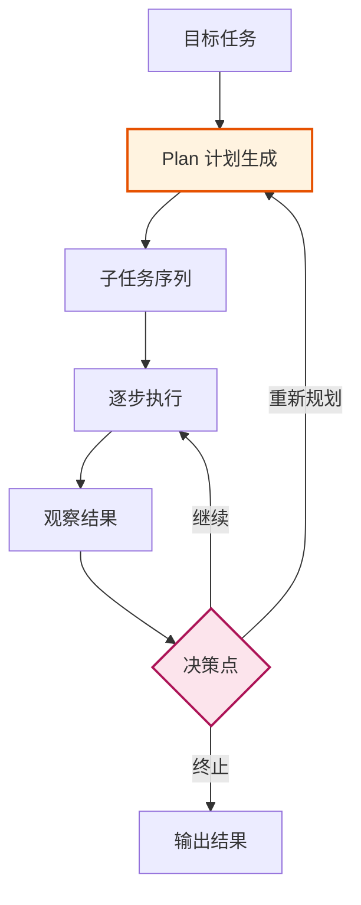
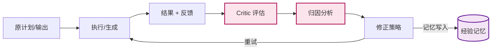
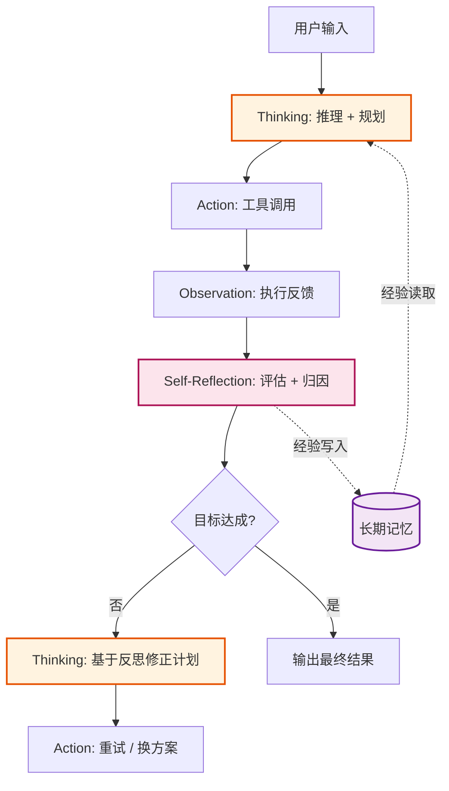
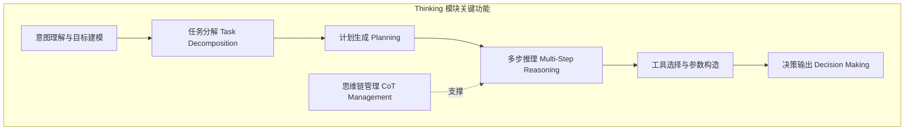
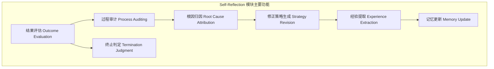

# Agent 思考与自我反思（Thinking and Self-Reflection）面试专项

> 本文档系统阐述 Agent 思考（Thinking）与自我反思（Self-Reflection）两大核心机制的概念定义、底层原理、应用场景及模块设计，专为技术面试准备设计，兼顾理论深度与实践指导意义。

---

## 目录

- [1. 核心概念](#1-核心概念)
  - [1.1 思考（Thinking）的定义与内涵](#11-思考thinking的定义与内涵)
  - [1.2 自我反思（Self-Reflection）的定义与内涵](#12-自我反思self-reflection的定义与内涵)
  - [1.3 二者的关系与边界](#13-二者的关系与边界)
  - [1.4 理论基础](#14-理论基础)
- [2. 核心原理](#2-核心原理)
  - [2.1 思考机制的底层原理](#21-思考机制的底层原理)
  - [2.2 自我反思机制的底层原理](#22-自我反思机制的底层原理)
  - [2.3 协同工作机制](#23-协同工作机制)
- [3. 应用场景与价值](#3-应用场景与价值)
  - [3.1 应用场景矩阵](#31-应用场景矩阵)
  - [3.2 典型应用案例](#32-典型应用案例)
  - [3.3 实际价值分析](#33-实际价值分析)
- [4. Thinking 模块解析](#4-thinking-模块解析)
  - [4.1 模块定位与核心特点](#41-模块定位与核心特点)
  - [4.2 关键功能](#42-关键功能)
  - [4.3 在 Agent 系统中的作用](#43-在-agent-系统中的作用)
  - [4.4 典型实现范式](#44-典型实现范式)
- [5. Self-Reflection 模块解析](#5-self-reflection-模块解析)
  - [5.1 模块定位与独特特性](#51-模块定位与独特特性)
  - [5.2 主要功能](#52-主要功能)
  - [5.3 对 Agent 性能提升的贡献](#53-对-agent-性能提升的贡献)
  - [5.4 典型实现范式](#54-典型实现范式)
- [6. 高频面试题与参考答案](#6-高频面试题与参考答案)
- [7. 总结与记忆口诀](#7-总结与记忆口诀)

---

## 1. 核心概念

### 1.1 思考（Thinking）的定义与内涵

**定义**：Agent 的"思考"是指在执行动作之前，利用大语言模型（LLM）进行**内部推理、规划与决策**的过程，本质上是将"刺激—反应"式的直接输出，转化为"刺激—推理—反应"式的延迟输出。

**核心内涵**：

1. **内部推理过程**：在用户输入与最终动作之间插入一段显式的推理链（Chain-of-Thought, CoT），让模型"先想后做"。
2. **目标分解与规划**：将复杂目标拆解为可执行的子任务序列，形成行动计划（Plan）。
3. **多步决策**：在每一步决策时综合当前状态、历史记忆、工具能力，输出下一步最优动作。
4. **延迟满足**：克制"立即回答"的冲动，通过额外计算换取更高质量输出（即 Test-Time Compute）。

> **一句话定义**：Thinking = 让 Agent 在"感知"与"行动"之间显式地"想一下"，把推理过程外化为可观察、可干预的中间状态。

### 1.2 自我反思（Self-Reflection）的定义与内涵

**定义**：Agent 的"自我反思"是指在执行动作并获取反馈后，对**自身推理过程、决策质量与执行结果**进行评估、归因与修正的元认知（Metacognition）过程。

**核心内涵**：

1. **结果评估**：判断当前动作是否达成预期目标，输出是否正确、合理。
2. **过程归因**：定位失败或次优结果的根因（是计划错误？工具选择错误？参数错误？还是上下文缺失？）。
3. **策略修正**：基于归因结果调整后续策略，如更换工具、修改提示词、回退到上一步重试。
4. **经验沉淀**：将反思得到的经验写入长期记忆，形成可复用的"教训库"，实现跨任务的学习与进化。

> **一句话定义**：Self-Reflection = 让 Agent 在"行动"之后"回头看一眼"，从成败中学习并改进下一次决策。

### 1.3 二者的关系与边界



| 维度 | Thinking（思考） | Self-Reflection（自我反思） |
|------|------------------|-----------------------------|
| **时序** | 行动**之前** | 行动**之后** |
| **方向** | 前向：从目标推导动作 | 后向：从结果回溯原因 |
| **输入** | 任务目标 + 上下文 + 记忆 | 执行结果 + 反馈信号 + 原计划 |
| **输出** | 行动计划 / 下一步动作 | 评估结论 / 修正策略 / 经验条目 |
| **本质** | 推理（Reasoning） | 元认知（Metacognition） |
| **类比人类** | "想清楚再做" | "做完后复盘" |
| **失败应对** | 难以自查 | 主动发现并改进 |

### 1.4 理论基础

| 理论来源 | 核心观点 | 对 Agent 的启发 |
|----------|----------|-----------------|
| **CoT（Chain-of-Thought）** Wei et al., 2022 | 让 LLM 输出中间推理步骤可显著提升复杂推理准确率 | Thinking 的理论基石 |
| **Self-Ask** Press et al., 2022 | 自我提问 + 外部检索可弥合组合性鸿沟 | Thinking 中的子问题分解 |
| **ReAct** Yao et al., 2022 | Reason 与 Act 交替进行，Thought→Action→Observation 循环 | Thinking 与 Action 的协同范式 |
| **Reflexion** Shinn et al., 2023 | 语言化反思 + 记忆强化可实现无参数更新的自我改进 | Self-Reflection 的代表框架 |
| **Self-Refine** Madaan et al., 2023 | LLM 自我生成反馈并迭代修正自身输出 | Self-Reflection 在生成任务中的应用 |
| **Metacognition 心理学** | "对认知的认知"，监控与调节自身思维过程 | Self-Reflection 的认知科学根基 |
| **Test-Time Compute Scaling** | 推理阶段投入更多计算可换取性能提升 | Thinking 的"延迟满足"价值 |

---

## 2. 核心原理

### 2.1 思考机制的底层原理

#### 2.1.1 推理链外化

LLM 本质是自回归生成模型，其"推理"能力依赖**Token 序列的逐步展开**。Thinking 的核心原理是：通过提示词工程或训练，让模型在输出最终答案前，先输出一段显式的推理 Token 序列，从而：

- **扩展有效计算量**：每个推理 Token 都为模型提供了一次"中间状态写入"，相当于在上下文中扩展了工作记忆。
- **降低单步预测难度**：将"一步到位"的难题拆解为多个"小步预测"，每步预测分布更尖锐、更易命中正确答案。
- **暴露中间错误**：推理链可被观察与干预，便于调试与人工纠偏。

#### 2.1.2 规划与决策

思考层通常采用以下规划范式：



**关键决策模式**：

1. **Plan-and-Execute**：先一次性生成完整计划，再逐步执行（适合结构稳定任务）。
2. **ReAct 滚动决策**：每一步都重新思考（Thought→Action→Observation），适合动态环境。
3. **Tree-of-Thought (ToT)**：在思考层引入树搜索，对多个候选思路进行评估与回溯。
4. **MCTS + LLM**：蒙特卡洛树搜索结合 LLM 价值评估，实现"系统2"式的深度思考。

#### 2.1.3 Test-Time Compute

OpenAI o1 / DeepSeek-R1 等推理模型通过**强化学习训练模型"学会思考"**，其原理为：

- 训练阶段：用 RL 优化模型生成"长思维链"的能力，奖励最终答案正确性。
- 推理阶段：模型自主生成大量内部思考 Token（隐藏于 `<think>` 标签内），通过更长的思考时间换取更高准确率。
- Scaling Law 新维度：除训练算力外，**推理算力**成为新的性能增长来源。

### 2.2 自我反思机制的底层原理

#### 2.2.1 反馈闭环

Self-Reflection 的本质是构建一个**反馈闭环（Feedback Loop）**：



#### 2.2.2 三层反思机制

| 反思层级 | 评估对象 | 典型问题 | 输出 |
|----------|----------|----------|------|
| **结果反思** | 最终输出是否正确 | "答案是否解决了用户问题？" | 通过/失败信号 |
| **过程反思** | 推理链是否合理 | "我的子问题分解是否正确？工具选择是否最优？" | 局部修正建议 |
| **策略反思** | 整体方法论是否有效 | "我是否应该换一种解题范式？是否需要回退到规划阶段？" | 元层面策略更新 |

#### 2.2.3 语言化反思（Verbalized Reflection）

Reflexion 框架的核心创新：**用自然语言而非数值梯度进行自我改进**。

- 模型在失败后，被提示"反思你刚才的尝试为何失败，并给出改进建议"。
- 反思文本被写入" episodic memory"，作为下一次尝试的额外上下文。
- 优势：无需梯度更新、无需额外训练、可即插即用；劣势：依赖 LLM 自评估能力，存在"自信但错误"风险。

#### 2.2.4 自评估与奖励建模

- **Self-Critique**：让 LLM 扮演 Critic 角色，对自己的输出打分或挑错。
- **LLM-as-a-Judge**：用更强模型或同模型多轮投票评估输出质量。
- **Process Reward Model (PRM)**：对推理过程的每一步打分，引导模型生成更高质量思维链。

### 2.3 协同工作机制

Thinking 与 Self-Reflection 在完整 Agent 循环中的协同：



**协同要点**：

1. **反思驱动重规划**：Self-Reflection 的归因结果作为 Thinking 层重规划的输入信号。
2. **记忆双向流通**：Thinking 读取经验记忆以避免重复试错；Self-Reflection 写入新经验以持续进化。
3. **终止判定**：Self-Reflection 承担"目标达成"的判定职责，避免 Thinking 陷入无限循环。

---

## 3. 应用场景与价值

### 3.1 应用场景矩阵

| 场景类别 | Thinking 价值 | Self-Reflection 价值 | 典型复杂度 |
|----------|---------------|----------------------|------------|
| **多跳问答** | 子问题分解、逐步推理 | 答案交叉验证、证据回溯 | 中 |
| **代码生成与调试** | 算法设计、边界考虑 | 单元测试反馈、Bug 定位 | 高 |
| **数学推理** | 公式推导、分步计算 | 结果合理性校验、方法回溯 | 高 |
| **Agent 工具调用** | 工具选择、参数构造 | 调用失败归因、参数修正 | 中 |
| **复杂决策系统** | 多目标权衡、策略规划 | 决策复盘、策略迭代 | 高 |
| **写作与内容生成** | 结构规划、论点组织 | 自我审稿、风格修正 | 中 |
| **自主任务执行** | 任务分解、执行顺序 | 失败重试、经验积累 | 高 |
| **对话系统** | 意图理解、回复规划 | 对话质量评估、纠错 | 中 |

### 3.2 典型应用案例

#### 案例一：代码生成 Agent（如 Devin、SWE-Agent）

```
用户: "修复 GitHub 仓库中的 issue #123"

Thinking:
1. 分析 issue 描述，定位可能涉及的代码模块
2. 制定计划: 搜索代码 → 复现 Bug → 定位根因 → 编写修复 → 测试验证
3. 选择工具: grep 搜索、文件读取、代码执行

Action: 执行 grep 搜索关键词 → 读取相关文件

Self-Reflection (测试失败后):
- 评估: 修复未通过单元测试
- 归因: 修复逻辑未覆盖边界条件 X
- 修正: 补充边界条件处理
- 记忆: "此类 Bug 需特别关注边界条件 X" → 写入经验库

Thinking (基于反思重规划): 重新设计修复方案，覆盖边界条件
```

**价值**：自主完成"理解需求—定位—修复—验证"全流程，将工程师从重复性 Bug 修复中解放。

#### 案例二：数学推理（如 o1、DeepSeek-R1）

- Thinking：生成长达数千 Token 的内部思维链，尝试多种解题方法、自我验证中间步骤。
- Self-Reflection：在思维链内部不断"我刚才的推导是否正确？是否有更优解法？"，对错误中间结论及时回溯。
- 价值：在 AIME、IMO 等高难度数学基准上，性能随推理算力增长而持续提升。

#### 案例三：自主 Agent 任务（如 AutoGPT、BabyAGI）

- Thinking：将"调研某市场并生成报告"分解为搜索、整理、分析、撰写等子任务。
- Self-Reflection：每完成一个子任务后，评估是否达到子目标，未达标则调整策略。
- 价值：在无需人工干预的情况下，完成多步骤、长时程的开放任务。

#### 案例四：对话系统中的纠错

- 当用户指出"你刚才说的不对"时，Agent 触发 Self-Reflection：重新审视上一轮回答、定位错误、给出修正。
- 价值：提升对话可信度与用户信任，避免"幻觉"持续累积。

### 3.3 实际价值分析

| 价值维度 | 具体表现 |
|----------|----------|
| **准确性提升** | 通过推理链与反思闭环，显著降低幻觉与错误率 |
| **复杂任务能力** | 使 Agent 具备处理多步、多跳、长程任务的能力 |
| **自主学习** | 通过经验记忆实现无需参数更新的持续改进 |
| **可解释性** | 显式思维链与反思文本为决策过程提供可审计轨迹 |
| **鲁棒性** | 面对工具失败、数据噪声时能自适应调整策略 |
| **降本增效** | 自我纠错减少人工介入，提升自动化水平 |

---

## 4. Thinking 模块解析

### 4.1 模块定位与核心特点

**模块定位**：Thinking 模块位于 Agent 架构的**思考层（Reasoning Layer）**，是连接感知层与行动层的"大脑中枢"，承担从"理解"到"决策"的全部认知计算。

**核心特点**：

1. **显式性（Explicitness）**：推理过程以可读文本形式呈现，而非黑盒隐式计算。
2. **结构性（Structure）**：通常包含目标分解、计划生成、步骤推理、决策输出等结构化子模块。
3. **上下文感知（Context-Aware）**：综合短期记忆、工作记忆、长期记忆进行推理。
4. **可中断与可干预**：支持流式输出、人工打断、中途修正。
5. **算力弹性（Compute Elasticity）**：可根据任务难度动态调整思考深度（Test-Time Compute Scaling）。

### 4.2 关键功能



| 功能 | 描述 | 典型实现 |
|------|------|----------|
| 意图理解 | 解析用户输入的真实意图与隐含目标 | LLM + 意图识别 Prompt |
| 任务分解 | 将复杂目标拆解为子任务树 | Plan-and-Solve、HuggingGPT |
| 计划生成 | 为子任务编排执行顺序与依赖 | ReWOO、LLM+P |
| 多步推理 | 逐步推导，每步基于前序结论 | CoT、Self-Consistency |
| 工具选择 | 从工具库中选择合适工具并构造参数 | Function Calling、Toolformer |
| 决策输出 | 输出最终动作指令或下一步 Action | ReAct、Plan-and-Execute |
| 思维链管理 | 控制思维链长度、终止、回溯 | ToT、GoT、MCTS |

### 4.3 在 Agent 系统中的作用

1. **质量保障层**：将"直接生成"升级为"推理后生成"，是输出质量的核心保障。
2. **复杂任务拆解中枢**：承担"无法一步解决"任务的分解与编排职责。
3. **工具调用决策器**：决定"何时用工具、用哪个工具、怎么用"。
4. **反思信号消费者**：接收 Self-Reflection 的修正信号，触发重规划。
5. **可解释性出口**：通过思维链为用户提供决策依据，增强可信度。

### 4.4 典型实现范式

#### 4.4.1 ReAct 范式

```text
Thought 1: 我需要先查询用户的订单状态
Action 1: query_order(user_id="123")
Observation 1: 订单状态为"已发货，待收货"
Thought 2: 用户问的是预计送达时间，我需要查询物流
Action 2: query_logistics(order_id="abc")
Observation 2: 预计 7 月 9 日送达
Thought 3: 已获取答案，可以回复用户
Final Answer: 您的订单预计 7 月 9 日送达。
```

#### 4.4.2 Plan-and-Execute 范式

```text
[Planner]
Plan:
  1. 搜索 X 的定义
  2. 搜索 X 的应用领域
  3. 综合两方面信息撰写报告

[Executor]
Step 1: search("X 定义") → 观察结果
Step 2: search("X 应用") → 观察结果
Step 3: write_report(合并信息) → 最终输出
```

#### 4.4.3 推理模型范式（o1/R1）

```text
<think>
用户问的是数学题，我需要先列出已知条件...
让我尝试方法 A：... 推导到第 3 步发现矛盾...
回溯，尝试方法 B：... 推导成功...
验证：将结果代入原题，成立。
</think>
[最终答案]
```

#### 4.4.4 代码示意（伪代码）

```python
def thinking_module(goal, context, memory):
    # 1. 意图理解
    intent = llm.understand_intent(goal, context)
    # 2. 任务分解
    subtasks = llm.decompose_task(intent)
    # 3. 计划生成
    plan = planner.generate(subtasks, memory.retrieve(intent))
    
    for step in plan:
        # 4. 思考：选择工具 + 构造参数
        thought = llm.reason(step, context, memory)
        action = llm.select_tool(thought, tool_registry)
        # 5. 执行并观察
        observation = action.execute()
        context.append({thought, action, observation})
        # 6. 触发反思
        if reflection.should_reflect(observation):
            feedback = reflection.evaluate(observation)
            if feedback.need_replan:
                plan = planner.regenerate(feedback)
    return context.final_answer
```

---

## 5. Self-Reflection 模块解析

### 5.1 模块定位与独特特性

**模块定位**：Self-Reflection 模块位于 Agent 架构的**元认知层（Metacognitive Layer）**，是对思考层与行动层的"二阶监控"，承担"评估—归因—修正—学习"的反馈闭环职责。

**独特特性**：

1. **后向性（Backward）**：在行动之后触发，与 Thinking 的前向性形成对照。
2. **元认知性（Metacognitive）**：对"认知本身"进行认知，是二阶思维。
3. **自评估性（Self-Evaluation）**：依赖 LLM 自身作为评估器，无需外部标注。
4. **归因能力（Attribution）**：能定位失败的具体环节，而非仅给出"对/错"二元判断。
5. **经验固化（Experience Crystallization）**：将反思结果结构化为可复用经验，写入长期记忆。
6. **迭代性（Iterative）**：支持多轮反思—改进循环，逐步逼近正确答案。

### 5.2 主要功能



| 功能 | 描述 | 关键问题 |
|------|------|----------|
| 结果评估 | 判断输出/动作是否达成目标 | "结果正确吗？用户满意吗？" |
| 过程审计 | 检查推理链每一步是否合理 | "我的推理有无逻辑漏洞？" |
| 根因归因 | 定位失败的精确环节 | "是计划错、工具错，还是参数错？" |
| 修正策略 | 生成具体改进方案 | "下一步应该怎么改？" |
| 经验提取 | 将反思抽象为可迁移知识 | "这次教训可以泛化为什么规则？" |
| 记忆更新 | 写入长期记忆供未来调用 | "存入 episodic/semantic memory" |
| 终止判定 | 决定是否结束 Agent 循环 | "目标已达成，可终止" |

### 5.3 对 Agent 性能提升的贡献

#### 5.3.1 性能提升维度

| 维度 | 提升机制 | 典型数据（论文报告） |
|------|----------|----------------------|
| **准确率** | 通过重试与修正降低错误率 | Reflexion 在 HotpotQA 提升 11 个百分点 |
| **鲁棒性** | 工具失败/数据噪声下自适应调整 | 失败恢复率显著提升 |
| **学习效率** | 经验记忆避免重复试错 | 后续任务试错次数下降 |
| **可解释性** | 反思文本提供失败原因 | 决策过程可审计 |
| **自主性** | 自我纠错减少人工介入 | 端到端任务完成率提升 |

#### 5.3.2 Reflexion 框架的核心贡献

Reflexion（Shinn et al., 2023）是 Self-Reflection 的代表性工作，其核心贡献：

1. **语言化反思**：用自然语言反思替代数值梯度，无需微调即可自我改进。
2. **Episodic Memory**：将每次反思存为"episode"，在后续尝试中以"你之前因为 X 失败，请避免"形式注入上下文。
3. **三轮迭代**：通常在 1-3 轮反思后性能显著提升，超过单次生成的强基线。

#### 5.3.3 Self-Refine 的贡献

- **同一模型自我反馈**：LLM 既生成输出，又生成反馈，再生成修正，无需外部 Critic。
- **轻量级**：仅需单次 LLM 调用循环，工程实现简单。
- **任务通用**：在对话生成、代码优化、数学推理等 7 类任务上平均提升 20%。

#### 5.3.4 风险与局限

| 局限 | 表现 | 缓解策略 |
|------|------|----------|
| 自评估偏差 | LLM 可能"自信但错误"，反思失效 | 引入外部反馈、多模型投票 |
| 反思过度 | 陷入"反复反思但不改进"的死循环 | 设置最大反思轮次、收敛判定 |
| 经验污染 | 错误经验写入记忆后误导未来决策 | 经验置信度评估、人工审核 |
| 成本倍增 | 多轮反思显著增加 Token 消耗 | 难度感知触发、缓存复用 |

### 5.4 典型实现范式

#### 5.4.1 Reflexion 范式

```text
[Attempt 1]
Trajectory: Thought → Action → Observation → ... → Final Answer (错误)

[Reflection]
"我刚才假设了 X，但实际上 X 不成立。
我应该先用工具 Y 验证 X。
下次请先验证关键假设。"
→ 写入 episodic memory

[Attempt 2] (携带反思记忆)
"根据上次反思，先验证 X..."
→ 输出正确答案
```

#### 5.4.2 Self-Refine 范式

```text
[Generate]   产出初版输出 O₀
[Feedback]   LLM 自评 O₀ 的不足：缺少 X、Y 不准确
[Refine]     基于反馈生成 O₁
[Feedback]   评估 O₁：已改善，仍有 Z 问题
[Refine]     生成 O₂
... 直到反馈为"无需改进"
```

#### 5.4.3 代码示意（伪代码）

```python
def self_reflection_module(goal, trajectory, memory, max_iters=3):
    for i in range(max_iters):
        # 1. 结果评估
        evaluation = llm.evaluate(goal, trajectory)
        if evaluation.success:
            return trajectory.final_answer
        
        # 2. 根因归因
        attribution = llm.attribute_failure(goal, trajectory, evaluation)
        
        # 3. 经验提取与记忆更新
        lesson = llm.extract_lesson(attribution)
        memory.write_episodic(lesson)
        
        # 4. 修正策略生成
        revision_strategy = llm.generate_strategy(attribution, lesson)
        
        # 5. 触发 Thinking 重规划
        trajectory = thinking_module.replan(goal, revision_strategy, memory)
    
    raise MaxReflectionExceeded
```

---

## 6. 高频面试题与参考答案

### Q1：Agent 的"思考"和"自我反思"有什么本质区别？

**参考答案**：
- **时序不同**：思考发生在行动之前，是前向推理；自我反思发生在行动之后，是后向评估。
- **本质不同**：思考是"推理（Reasoning）"，自我反思是"元认知（Metacognition）"，即对认知的认知。
- **作用不同**：思考负责"决定怎么做"，自我反思负责"评估做得对不对、为什么、下次怎么改"。
- **类比**：思考类似"事前规划"，自我反思类似"事后复盘"。

### Q2：什么是 Reflexion 框架？它的核心创新是什么？

**参考答案**：
Reflexion 是 2023 年提出的自我反思框架，核心创新是用**自然语言反思**替代梯度更新实现自我改进。Agent 在失败后生成一段反思文本，存入 episodic memory，在下次尝试时作为上下文注入。其优势是无需微调、即插即用、可解释；局限是依赖 LLM 自评估能力。

### Q3：ReAct 中的 Thought 与 Thinking 模块是什么关系？

**参考答案**：
ReAct 中的 Thought 是 Thinking 模块的一种**轻量级实现**。ReAct 在每一步循环中都输出一段 Thought（思考），然后选择 Action，观察 Observation。这正是 Thinking 模块"前向推理 + 滚动决策"的典型范式。但 Thinking 模块本身是一个更广的概念，还包括 Plan-and-Execute、ToT、推理模型等更多范式。

### Q4：为什么 Self-Reflection 能提升 Agent 性能？请从机制层面解释。

**参考答案**：
1. **反馈闭环**：将开环的"一次生成"转变为闭环的"生成—评估—修正"，通过迭代逼近正确答案。
2. **经验复用**：反思生成的经验写入记忆，避免未来任务重复试错，实现跨任务学习。
3. **错误定位**：归因能力使 Agent 能精确修复错误环节，而非整体重做。
4. **元认知监控**：在思考层之上增加二阶监控，弥补 LLM 难以自检的缺陷。

### Q5：Self-Reflection 有哪些局限？如何缓解？

**参考答案**：
- **自评估偏差**：LLM 可能"自信但错误"。缓解：引入外部反馈（如编译器、测试用例、强模型 Critic）。
- **反思死循环**：反复反思但不改进。缓解：设置最大反思轮次、收敛性判定。
- **经验污染**：错误经验误导未来。缓解：经验置信度评估、记忆去重。
- **成本倍增**：多轮反思消耗大量 Token。缓解：难度感知触发（仅失败时反思）、缓存复用。

### Q6：o1 / DeepSeek-R1 这类推理模型与传统 CoT 提示有什么区别？

**参考答案**：
- **训练方式**：传统 CoT 是提示词技巧，模型未专门训练；推理模型通过 RL 训练模型"学会长思考"，思考能力内化为模型权重。
- **思考长度**：推理模型可生成数千至上万 Token 的内部思维链，远超 CoT 提示。
- **自我修正**：推理模型在思维链内部自带"回溯—验证—重试"能力，类似内置 Self-Reflection。
- **算力维度**：推理模型引入 Test-Time Compute 作为新 Scaling Law 维度。

### Q7：在设计 Agent 系统时，如何权衡 Thinking 深度与延迟成本？

**参考答案**：
1. **难度感知**：先用轻量模型判断任务难度，简单任务直接输出，复杂任务触发深度思考。
2. **分级思考**：设置 Thinking 的"档位"（如快速/标准/深度），按需调用。
3. **流式输出**：边思考边输出，让用户感知到进展，降低延迟体感。
4. **缓存复用**：对相似任务的思维链缓存，避免重复计算。
5. **早停机制**：在思维链中设置置信度阈值，达阈值即终止思考。

---

## 7. 总结与记忆口诀

### 7.1 核心要点速记

```mermaid
graph LR
    CORE[Thinking + Self-Reflection<br/>Agent 的"大脑 + 元认知"]
    CORE --> T[Thinking<br/>前向推理<br/>行动之前]
    CORE --> R[Self-Reflection<br/>后向评估<br/>行动之后]
    T --> T1[CoT / ReAct / ToT / 推理模型]
    T --> T2[目标分解 + 计划 + 决策]
    R --> R1[Reflexion / Self-Refine]
    R --> R2[评估 + 归因 + 修正 + 记忆]
    T <-->|协同| R

    style CORE fill:#f3e5f5,stroke:#6a1b9a,stroke-width:2px
    style T fill:#fff3e0,stroke:#e65100,stroke-width:2px
    style R fill:#fce4ec,stroke:#ad1457,stroke-width:2px
```

### 7.2 记忆口诀

> **"一想二做三反思，四存经验五再思"**
>
> - 一想：Thinking 在行动前推理规划
> - 二做：Action 执行工具调用
> - 三反思：Self-Reflection 评估归因
> - 四存：经验写入长期记忆
> - 五再思：基于反思触发重规划

### 7.3 一句话总结

**Thinking 让 Agent "想清楚再做"，Self-Reflection 让 Agent "做完后复盘并进化"，二者通过反馈闭环与记忆机制共同构成 Agent 的智能核心——前者是认知，后者是元认知；前者决定单次决策质量，后者决定跨任务学习能力。**

---

> **参考资料**：
> - Wei et al., *Chain-of-Thought Prompting Elicits Reasoning in LLMs*, 2022
> - Yao et al., *ReAct: Synergizing Reasoning and Acting in LLMs*, 2022
> - Press et al., *Measuring and Narrowing the Compositionality Gap in Language Models*, 2022
> - Shinn et al., *Reflexion: Language Agents with Verbal Reinforcement Learning*, 2023
> - Madaan et al., *Self-Refine: Iterative Refinement with Self-Feedback*, 2023
> - OpenAI o1 Technical Report, 2024
> - DeepSeek-R1 Technical Report, 2025
