# A2A（Agent-to-Agent）协议面试题集详解

> 本文档系统梳理 A2A（Agent2Agent）协议的核心概念、架构设计、使用场景、实现难点与未来趋势，并对比 MCP 协议，难度覆盖基础、中级、高级三个层次，题型含概念题、原理题、分析题、设计题。

---

## 目录

- [A2A（Agent-to-Agent）协议面试题集详解](#a2aagent-to-agent协议面试题集详解)
  - [目录](#目录)
  - [一、A2A 技术概念与原理简介](#一a2a-技术概念与原理简介)
    - [1.1 什么是 A2A](#11-什么是-a2a)
    - [1.2 核心特性](#12-核心特性)
    - [1.3 与传统系统的区别](#13-与传统系统的区别)
  - [二、A2A 架构设计要点](#二a2a-架构设计要点)
    - [2.1 核心角色与组件](#21-核心角色与组件)
    - [2.2 通信机制](#22-通信机制)
      - [2.2.1 协议栈](#221-协议栈)
      - [2.2.2 核心方法](#222-核心方法)
      - [2.2.3 Task 状态机](#223-task-状态机)
    - [2.3 数据交互流程](#23-数据交互流程)
      - [2.3.1 完整协作时序](#231-完整协作时序)
      - [2.3.2 任务请求示例](#232-任务请求示例)
      - [2.3.3 任务响应示例](#233-任务响应示例)
    - [2.4 安全策略](#24-安全策略)
  - [三、A2A 典型使用场景分析](#三a2a-典型使用场景分析)
    - [3.1 场景一：跨框架多智能体协作](#31-场景一跨框架多智能体协作)
    - [3.2 场景二：跨企业供应链协同](#32-场景二跨企业供应链协同)
    - [3.3 场景三：复杂任务委派](#33-场景三复杂任务委派)
    - [3.4 场景四：人机混合协作](#34-场景四人机混合协作)
  - [四、A2A 技术实现难点与解决方案](#四a2a-技术实现难点与解决方案)
    - [4.1 难点一：异步通信与长任务处理](#41-难点一异步通信与长任务处理)
    - [4.2 难点二：冲突解决机制](#42-难点二冲突解决机制)
    - [4.3 难点三：性能优化](#43-难点三性能优化)
    - [4.4 难点四：错误处理与容错](#44-难点四错误处理与容错)
    - [4.5 难点五：可观测性与调试](#45-难点五可观测性与调试)
  - [五、A2A 未来发展趋势与挑战](#五a2a-未来发展趋势与挑战)
    - [5.1 发展趋势](#51-发展趋势)
    - [5.2 面临的挑战](#52-面临的挑战)
  - [六、A2A vs MCP 对比](#六a2a-vs-mcp-对比)
    - [6.1 定位对比](#61-定位对比)
    - [6.2 核心差异对比表](#62-核心差异对比表)
    - [6.3 互补关系](#63-互补关系)
    - [6.4 选型建议](#64-选型建议)
  - [七、面试题及详解](#七面试题及详解)
    - [题目 1：A2A 定义与核心特性（概念题·基础）](#题目-1a2a-定义与核心特性概念题基础)
    - [题目 2：A2A vs 传统 API 区别（概念题·基础）](#题目-2a2a-vs-传统-api-区别概念题基础)
    - [题目 3：Agent Card 作用与字段（概念题·基础）](#题目-3agent-card-作用与字段概念题基础)
    - [题目 4：Task 状态机流转（原理题·中级）](#题目-4task-状态机流转原理题中级)
    - [题目 5：通信机制与核心方法（原理题·中级）](#题目-5通信机制与核心方法原理题中级)
    - [题目 6：安全策略分层（原理题·中级）](#题目-6安全策略分层原理题中级)
    - [题目 7：跨框架协作场景分析（分析题·中级）](#题目-7跨框架协作场景分析分析题中级)
    - [题目 8：异步通信与长任务处理（分析题·高级）](#题目-8异步通信与长任务处理分析题高级)
    - [题目 9：冲突解决机制设计（设计题·高级）](#题目-9冲突解决机制设计设计题高级)
    - [题目 10：性能优化方案（设计题·高级）](#题目-10性能优化方案设计题高级)
    - [题目 11：容错与故障转移（设计题·高级）](#题目-11容错与故障转移设计题高级)
    - [题目 12：A2A vs MCP 对比与选型（分析题·高级）](#题目-12a2a-vs-mcp-对比与选型分析题高级)
  - [八、考点速查表](#八考点速查表)

---

## 一、A2A 技术概念与原理简介

### 1.1 什么是 A2A

**A2A（Agent2Agent Protocol）** 是 Google 于 2025 年 4 月联合 50+ 合作伙伴推出的**开放协议**，旨在让不同框架（LangGraph/AutoGen/CrewAI 等）、不同厂商构建的 Agent 能够**跨框架、跨平台互相通信与协作**，打破 Agent 生态孤岛。

**一句话定义**：A2A = Agent 间的 HTTP/JSON-RPC 通信标准，让任意 Agent 都能像调用 API 一样调用其他 Agent。

**协议定位**：

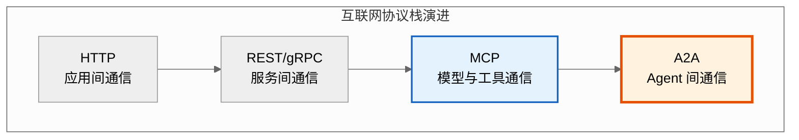

### 1.2 核心特性

| 特性 | 说明 | 价值 |
|------|------|------|
| **框架无关** | 不绑定任何 Agent 框架，LangGraph/AutoGen/CrewAI 均可接入 | 打破生态孤岛 |
| **基于 Web 标准** | HTTP + JSON-RPC 2.0，复用现有基础设施 | 低门槛接入 |
| **Agent Card 自描述** | Agent 通过 JSON 元数据暴露能力，支持动态发现 | 即插即用 |
| **Task 生命周期管理** | Task 有完整状态机（submitted→working→completed） | 可追踪、可恢复 |
| **多模态支持** | Message 由多个 Part 组成（文本/文件/结构化数据） | 支持复杂业务 |
| **流式响应** | 通过 SSE（Server-Sent Events）支持长任务流式输出 | 用户体验好 |
| **推送通知** | 支持 Webhook 回调，无需轮询长任务状态 | 资源高效 |
| **企业级安全** | 支持 OAuth2/API Key/Bearer Token 等标准认证 | 生产可用 |

### 1.3 与传统系统的区别

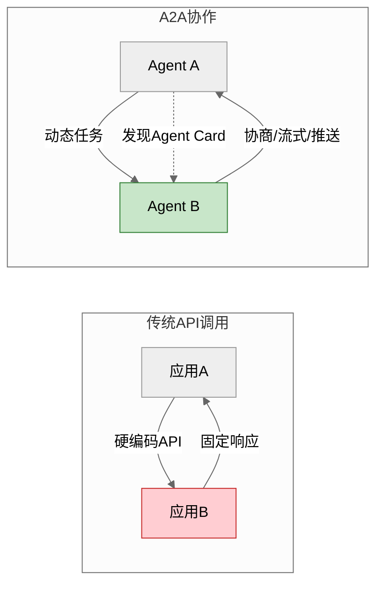

| 维度 | 传统 API 调用 | A2A 协作 |
|------|--------------|----------|
| **调用方** | 应用 A 硬编码调用应用 B | Agent A 动态发现并调用 Agent B |
| **接口定义** | OpenAPI/Swagger 固定 Schema | Agent Card 自描述，可动态发现 |
| **交互模式** | 请求-响应，同步为主 | 任务驱动，支持流式/推送/长任务 |
| **响应内容** | 固定 JSON 结构 | 多模态 Message（文本+文件+数据） |
| **状态管理** | 无状态，每次独立 | Task 有完整生命周期状态机 |
| **错误处理** | HTTP 状态码 | Task 状态（failed/canceled）+ 错误对象 |
| **发现机制** | 需提前知道端点 | Agent Card 自动发现能力 |
| **协作深度** | 单次调用 | 多轮协商、子任务委派 |

---

## 二、A2A 架构设计要点

### 2.1 核心角色与组件

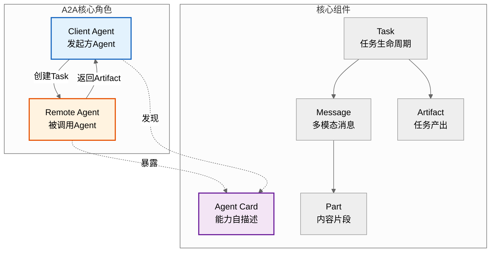

| 组件 | 定义 | 关键字段 |
|------|------|----------|
| **Agent Card** | Agent 的自描述 JSON，暴露能力与端点 | `name`, `description`, `url`, `skills`, `authentication` |
| **Task** | 协作的基本单位，有生命周期 | `id`, `status`, `messages`, `artifacts` |
| **Message** | Task 中的多模态消息 | `role`(user/agent), `parts[]` |
| **Part** | Message 的内容片段 | `text` / `file` / `data` |
| **Artifact** | Task 的产出物 | `name`, `parts[]` |

**Agent Card 示例**：

```json
{
  "name": "code-review-agent",
  "description": "自动化代码审查 Agent,支持多语言",
  "url": "https://agent.example.com/a2a",
  "version": "1.0.0",
  "capabilities": {
    "streaming": true,
    "pushNotifications": true
  },
  "skills": [
    {
      "id": "review_python",
      "name": "Python 代码审查",
      "description": "审查 Python 代码质量、规范、安全",
      "tags": ["python", "code-review", "security"]
    },
    {
      "id": "review_java",
      "name": "Java 代码审查",
      "description": "审查 Java 代码规范与潜在 Bug",
      "tags": ["java", "code-review"]
    }
  ],
  "authentication": {
    "schemes": ["Bearer", "OAuth2"]
  },
  "defaultInputModes": ["text", "file"],
  "defaultOutputModes": ["text", "file"]
}
```

### 2.2 通信机制

#### 2.2.1 协议栈

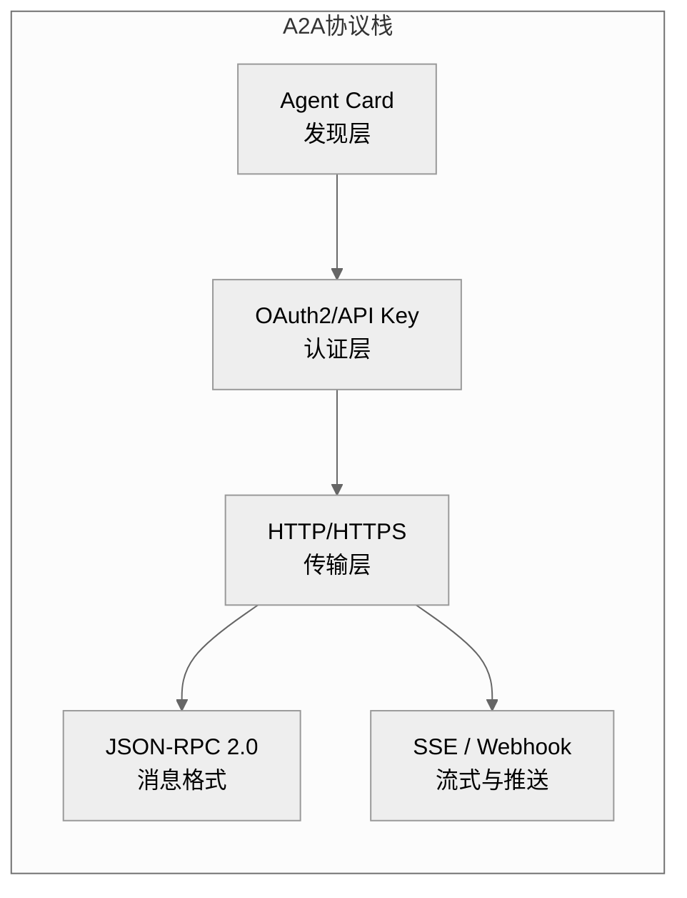

#### 2.2.2 核心方法

| JSON-RPC 方法 | 用途 | 模式 |
|---------------|------|------|
| `tasks/send` | 发送任务（同步返回结果） | 请求-响应 |
| `tasks/sendSubscribe` | 发送任务并订阅流式更新 | SSE 流式 |
| `tasks/get` | 查询任务状态 | 请求-响应 |
| `tasks/cancel` | 取消任务 | 请求-响应 |
| `tasks/pushNotificationSet` | 设置 Webhook 回调地址 | 请求-响应 |
| `tasks/resubscribe` | 重新订阅已断开的流 | SSE 流式 |

#### 2.2.3 Task 状态机

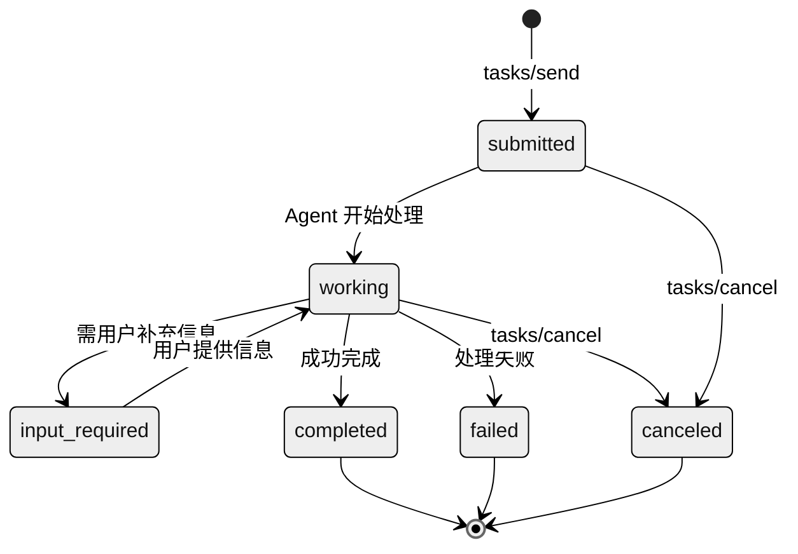

| 状态 | 含义 | Client 动作 |
|------|------|-------------|
| `submitted` | 任务已提交，未开始 | 等待 |
| `working` | Agent 处理中 | 流式接收或轮询 |
| `input_required` | 需用户补充信息 | 收集输入并 `tasks/send` |
| `completed` | 成功完成 | 读取 Artifact |
| `failed` | 处理失败 | 读取错误信息 |
| `canceled` | 已取消 | 终止 |

### 2.3 数据交互流程

#### 2.3.1 完整协作时序

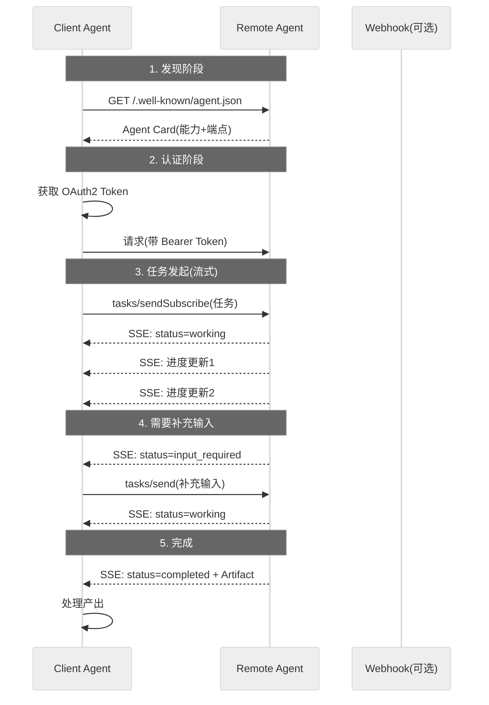

#### 2.3.2 任务请求示例

```json
{
  "jsonrpc": "2.0",
  "method": "tasks/send",
  "id": "req-001",
  "params": {
    "id": "task-12345",
    "message": {
      "role": "user",
      "parts": [
        {"text": "审查这段 Python 代码"},
        {"file": {"mimeType": "text/x-python", "data": "base64..."}}
      ]
    }
  }
}
```

#### 2.3.3 任务响应示例

```json
{
  "jsonrpc": "2.0",
  "id": "req-001",
  "result": {
    "id": "task-12345",
    "status": {"state": "completed"},
    "artifacts": [
      {
        "name": "审查报告",
        "parts": [
          {"text": "发现 3 个问题:1...."},
          {"data": {"issues": 3, "severity": "high", "json": "..."}}
        ]
      }
    ]
  }
}
```

### 2.4 安全策略

| 安全层 | 机制 | 说明 |
|--------|------|------|
| **认证** | OAuth2 / API Key / Bearer Token | Agent Card 声明支持的 schemes |
| **授权** | Scope / Role-Based | 限制 Agent 可访问的资源 |
| **传输** | HTTPS 强制 | 防止中间人攻击 |
| **输入校验** | JSON Schema 校验 Message | 防 Prompt 注入、参数篡改 |
| **速率限制** | Rate Limiting | 防滥用、防 DoS |
| **审计** | 全量 Task 日志 | 满足合规审计 |
| **隔离** | Agent 沙箱执行 | 防恶意代码执行 |

---

## 三、A2A 典型使用场景分析

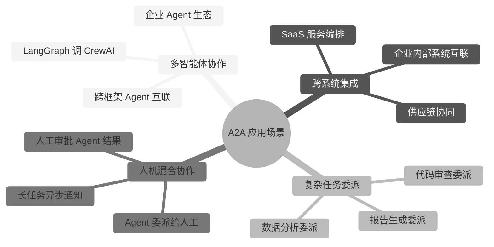

### 3.1 场景一：跨框架多智能体协作

**业务背景**：企业已有 LangGraph 构建的客服 Agent，需调用 CrewAI 构建的数据分析 Agent 完成用户数据查询。

**A2A 解决方案**：

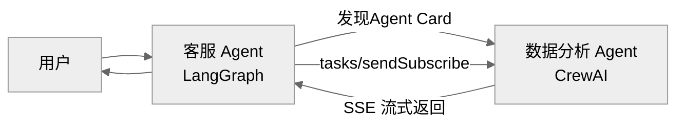

**关键点**：
- 客服 Agent 通过 `GET /.well-known/agent.json` 发现数据分析 Agent 的能力。
- 用 `tasks/sendSubscribe` 发起分析任务，SSE 流式接收进度。
- 数据分析 Agent 返回 Artifact（分析报告），客服 Agent 整合后回复用户。
- **无需改写框架**，LangGraph 与 CrewAI 通过 A2A 标准 HTTP 通信。

### 3.2 场景二：跨企业供应链协同

**业务背景**：采购方 Agent 需协调供应商 Agent 查询库存、下单、跟踪物流。

| 协作步骤 | A2A 调用 | 说明 |
|----------|----------|------|
| 1. 发现供应商能力 | `GET agent.json` | 获取供应商 Agent 的 skills |
| 2. 查询库存 | `tasks/send` | 同步返回库存数据 |
| 3. 下单 | `tasks/sendSubscribe` | 长任务，流式跟踪订单状态 |
| 4. 物流跟踪 | `tasks/pushNotificationSet` | 设置 Webhook，物流更新自动推送 |
| 5. 异常处理 | `input_required` 状态 | 缺货时 Agent 请求采购方决策 |

### 3.3 场景三：复杂任务委派

**业务背景**：项目经理 Agent 需协调多个专业 Agent 完成产品发布。

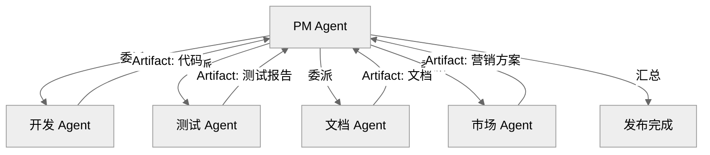

**关键点**：
- PM Agent 用 A2A 委派子任务给 4 个专业 Agent。
- 各 Agent 独立工作，通过 Artifact 返回产出。
- PM Agent 用 `tasks/get` 轮询或 Webhook 推送收集结果。
- 任一 Agent 失败（`failed` 状态），PM Agent 决定重试或降级。

### 3.4 场景四：人机混合协作

**业务背景**：金融合规审查 Agent 处理大额交易，需人工审批。

| 步骤 | 状态流转 | 说明 |
|------|----------|------|
| 1. Agent 收到交易 | `submitted` | 合规 Agent 接收任务 |
| 2. Agent 初审 | `working` | 自动检查黑名单、规则 |
| 3. 需人工决策 | `input_required` | 触发人工审批 |
| 4. 人工批准 | `working` → `completed` | 人工输入决策结果 |
| 5. 人工拒绝 | `working` → `canceled` | 取消交易 |
| 6. 长任务通知 | Webhook 推送 | 异步通知审批结果 |

---

## 四、A2A 技术实现难点与解决方案

### 4.1 难点一：异步通信与长任务处理

**问题**：复杂任务（如代码审查、数据分析）可能耗时数分钟到数小时，同步 HTTP 会超时。

**解决方案**：

| 方案 | 机制 | 适用场景 |
|------|------|----------|
| **SSE 流式订阅** | `tasks/sendSubscribe` 长连接，实时推送进度 | 中等耗时（秒-分钟） |
| **Webhook 推送** | `tasks/pushNotificationSet` 注册回调，状态变更推送 | 长耗时（分钟-小时） |
| **轮询** | `tasks/get` 定期查询状态 | 简单场景，不实时 |
| **断线重连** | `tasks/resubscribe` 重新订阅已断开流 | 网络不稳定 |

**Webhook 实现示例**：

```python
# Client 注册 Webhook
await client.send({
    "method": "tasks/pushNotificationSet",
    "params": {
        "id": "task-12345",
        "pushNotificationConfig": {
            "url": "https://client.example.com/webhook",
            "token": "secret-token",  # 验证用
            "events": ["completed", "failed", "input_required"]
        }
    }
})

# Remote Agent 在状态变更时推送
async def notify_client(task_id: str, new_state: str):
    config = get_push_config(task_id)
    async with httpx.AsyncClient() as client:
        await client.post(
            config["url"],
            headers={"X-Agent-Token": config["token"]},
            json={"task_id": task_id, "state": new_state}
        )
```

### 4.2 难点二：冲突解决机制

**问题**：多个 Client Agent 同时调用同一 Remote Agent，可能产生资源冲突或结果冲突。

**冲突类型与解决**：

| 冲突类型 | 表现 | 解决方案 |
|----------|------|----------|
| **并发写冲突** | 多 Agent 同时修改同一 Task | Task 级锁 + 乐观并发控制（版本号） |
| **资源争用** | 多 Agent 争抢 Remote Agent 算力 | 队列排队 + 优先级调度 |
| **结果不一致** | 多 Agent 对同一问题给出不同结果 | Client 侧投票/仲裁/择优 |
| **死锁** | Agent A 等 B，B 等 A | 超时强制取消 + DAG 检测循环 |

**乐观并发控制**：

```python
class TaskManager:
    """带乐观并发的 Task 管理"""

    async def update_task(self, task_id: str, update: dict, expected_version: int):
        """带版本号的更新,防并发冲突"""
        task = await self.get(task_id)
        if task["version"] != expected_version:
            raise ConflictError(
                f"版本冲突:期望 {expected_version},实际 {task['version']}"
            )
        update["version"] = task["version"] + 1
        return await self.save(task_id, update)
```

### 4.3 难点三：性能优化

**优化方案**：

| 优化维度 | 方案 | 效果 |
|----------|------|------|
| **连接复用** | HTTP Keep-Alive / 连接池 | 减少 TCP 握手开销 |
| **流式优先** | SSE 替代轮询 | 实时性提升，资源消耗降低 |
| **批处理** | 多 Task 合并提交 | 吞吐量提升 |
| **Agent Card 缓存** | 客户端缓存发现结果 | 减少发现请求 |
| **结果缓存** | 相同输入 Task 结果缓存 | 重复任务零延迟 |
| **分级路由** | 简单任务路由到轻量 Agent | 成本降低 |
| **压缩传输** | Gzip/Brotli 压缩 JSON | 带宽降低 70% |

### 4.4 难点四：错误处理与容错

**错误分类与处理**：

| 错误类型 | JSON-RPC 错误码 | 处理策略 |
|----------|----------------|----------|
| **认证失败** | -32001 | 刷新 Token 重试 |
| **授权不足** | -32002 | 降级或转人工 |
| **任务不存在** | -32003 | 重新创建任务 |
| **任务已取消** | -32004 | 终止处理 |
| **参数校验失败** | -32602 | 修正参数重试 |
| **Agent 内部错误** | -32603 | 指数退避重试 |
| **超时** | 网络层 | 切换 Webhook 异步模式 |
| **Agent 不可用** | 网络层 | 故障转移到备用 Agent |

**指数退避重试实现**：

```python
import asyncio
from tenacity import retry, stop_after_attempt, wait_exponential, retry_if_exception_type


class A2AClient:
    """带容错的 A2A 客户端"""

    @retry(
        stop=stop_after_attempt(3),
        wait=wait_exponential(multiplier=1, min=1, max=30),
        retry=retry_if_exception_type((TimeoutError, ConnectionError)),
    )
    async def send_task(self, remote_agent_url: str, task: dict) -> dict:
        """发送任务,带自动重试"""
        async with httpx.AsyncClient(timeout=30) as client:
            resp = await client.post(
                remote_agent_url,
                json={
                    "jsonrpc": "2.0",
                    "method": "tasks/send",
                    "id": self._gen_id(),
                    "params": task,
                },
                headers={"Authorization": f"Bearer {self.token}"},
            )
            resp.raise_for_status()
            data = resp.json()
            if "error" in data:
                raise A2AError(data["error"])
            return data["result"]

    async def send_task_with_fallback(
        self, primary: str, backup: str, task: dict
    ) -> dict:
        """带故障转移的任务发送"""
        try:
            return await self.send_task(primary, task)
        except Exception as e:
            print(f"主 Agent 失败,切换备用: {e}")
            return await self.send_task(backup, task)
```

### 4.5 难点五：可观测性与调试

**挑战**：跨 Agent 调用链路复杂，问题难定位。

**解决方案**：

| 方案 | 做法 | 价值 |
|------|------|------|
| **trace_id 透传** | 全链路追踪 ID 贯穿所有 Agent | 跨 Agent 调用链可视化 |
| **Task 日志** | 记录每次状态变更 | 审计与回溯 |
| **SSE 事件流** | 流式更新即日志 | 实时观测进度 |
| **Agent Card 版本** | 记录调用的 Agent 版本 | 问题复现 |
| **LangSmith 集成** | A2A 调用接入追踪平台 | 生产级可观测 |

---

## 五、A2A 未来发展趋势与挑战

### 5.1 发展趋势

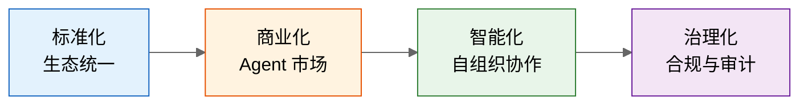

| 趋势 | 说明 | 影响 |
|------|------|------|
| **Agent 市场兴起** | 类似 App Store 的 Agent 能力市场 | Agent 可变现、可发现 |
| **跨厂商互操作** | OpenAI/Anthropic/Google 统一支持 | 生态融合 |
| **自组织协作** | Agent 自主发现、协商、组队 | 复杂任务自动化 |
| **Agent 身份体系** | Agent 有独立身份与信誉 | 信任机制建立 |
| **实时流式协作** | 多 Agent 实时流式交互 | 协作效率提升 |
| **边缘 Agent** | Agent 部署到边缘节点 | 低延迟场景 |

### 5.2 面临的挑战

| 挑战 | 描述 | 潜在解法 |
|------|------|----------|
| **安全信任** | 跨组织 Agent 调用如何建立信任 | Agent 身份认证 + 信誉系统 |
| **质量保证** | 远程 Agent 返回结果质量参差 | SLA 协议 + 质量评估 |
| **成本计费** | 跨组织调用如何计费结算 | Token 化计量 + 智能合约 |
| **隐私保护** | 敏感数据跨 Agent 流转 | 联邦学习 + 数据脱敏 |
| **协议碎片化** | A2A vs MCP vs 厂商私有协议 | 协议融合或适配层 |
| **调试困难** | 跨 Agent 调用链路复杂 | 标准化追踪协议 |
| **治理合规** | Agent 自主决策的合规边界 | 审计日志 + 人工监督 |

---

## 六、A2A vs MCP 对比

### 6.1 定位对比

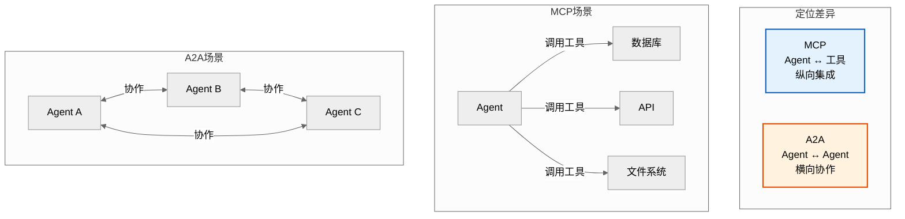

### 6.2 核心差异对比表

| 维度 | MCP（Model Context Protocol） | A2A（Agent2Agent Protocol） |
|------|------------------------------|---------------------------|
| **出品方** | Anthropic（2024.11） | Google（2025.4） |
| **定位** | Agent 与工具/资源之间的连接 | Agent 与 Agent 之间的协作 |
| **通信方向** | 纵向：Agent → 工具 | 横向：Agent ↔ Agent |
| **核心抽象** | Tools / Resources / Prompts | Task / Message / Artifact |
| **通信模式** | 请求-响应（主），Sampling 反向 | 请求-响应 + SSE 流式 + Webhook 推送 |
| **状态管理** | 无状态（工具调用） | Task 有完整生命周期状态机 |
| **传输协议** | stdio（本地） + Streamable HTTP | HTTP + JSON-RPC 2.0 |
| **发现机制** | Server 暴露 Tools/Resources | Agent Card 自描述（`.well-known/agent.json`） |
| **长任务支持** | 弱（工具调用即时返回） | 强（Task 状态机 + 流式 + 推送） |
| **多模态** | 弱（文本为主） | 强（Message 含文本/文件/数据 Part） |
| **典型场景** | Agent 调数据库/API/文件 | 跨框架 Agent 协作、跨企业协同 |
| **认证** | 本地 stdio 无需；HTTP 用标准认证 | OAuth2 / API Key / Bearer Token |

### 6.3 互补关系

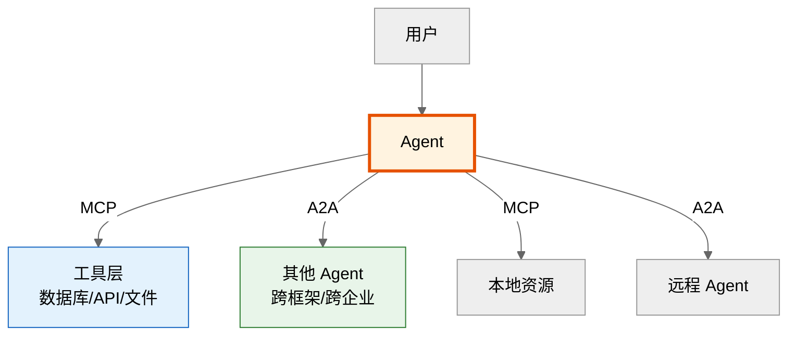

| 协作模式 | 说明 | 示例 |
|----------|------|------|
| **MCP 纵向** | Agent 用 MCP 调用工具获取能力 | Agent 通过 MCP 查数据库 |
| **A2A 横向** | Agent 用 A2A 与其他 Agent 协作 | 客服 Agent 委派分析 Agent |
| **MCP + A2A** | Agent 既调工具又协作 | Agent A 用 MCP 查数据，用 A2A 委派 Agent B 处理 |

### 6.4 选型建议

| 场景 | 推荐协议 | 理由 |
|------|----------|------|
| **Agent 访问数据库/API** | MCP | MCP 是工具连接标准，生态丰富 |
| **Agent 读取本地文件** | MCP | stdio 传输，本地高效 |
| **Agent 调用 RAG 检索** | MCP | Resources 原语适配 |
| **跨框架 Agent 协作** | A2A | A2A 是 Agent 间通信标准 |
| **跨企业 Agent 协同** | A2A | HTTP+认证，适合跨组织 |
| **长任务委派（代码审查）** | A2A | Task 状态机 + 流式，支持长任务 |
| **多 Agent 协商辩论** | A2A | 多轮 Task 交互 |
| **Agent 同时需工具+协作** | MCP + A2A | 互补使用，不冲突 |

**一句话总结**：**MCP 让 Agent 拥有工具，A2A 让 Agent 拥有伙伴。**

---

## 七、面试题及详解

### 题目 1：A2A 定义与核心特性（概念题·基础）

**难度**：基础　**类型**：概念题

**问题描述**：
请简述 A2A 协议的定义，列举至少 4 个核心特性，并说明它解决了什么问题。

**参考答案要点**：

**定义**：A2A 是 Google 联合 50+ 合作伙伴推出的开放协议，基于 HTTP + JSON-RPC 2.0，让不同框架、不同厂商构建的 Agent 能够跨框架、跨平台互相通信与协作。

**核心特性**（列举 4+ 即可）：
1. **框架无关**：不绑定 LangGraph/AutoGen/CrewAI 等特定框架。
2. **基于 Web 标准**：HTTP + JSON-RPC，复用现有基础设施。
3. **Agent Card 自描述**：Agent 通过 JSON 元数据暴露能力，支持动态发现。
4. **Task 生命周期管理**：Task 有完整状态机（submitted→working→completed）。
5. **多模态支持**：Message 含文本/文件/数据 Part。
6. **流式响应**：SSE 支持长任务流式输出。
7. **推送通知**：Webhook 回调，无需轮询。

**解决的问题**：打破 Agent 生态孤岛——不同框架的 Agent 之前无法互操作，每个框架都是封闭生态。A2A 提供统一通信标准，让任意 Agent 都能像调用 API 一样调用其他 Agent。

**评分标准**：定义准确 2 分；特性≥4 个 2 分；解决的问题 1 分（满分 5）。

---

### 题目 2：A2A vs 传统 API 区别（概念题·基础）

**难度**：基础　**类型**：概念题

**问题描述**：
请从接口定义、交互模式、状态管理、发现机制四个维度对比 A2A 与传统 API 调用。

**参考答案要点**：

| 维度 | 传统 API | A2A |
|------|----------|-----|
| **接口定义** | OpenAPI/Swagger 固定 Schema | Agent Card 自描述，动态发现 |
| **交互模式** | 请求-响应，同步为主 | 任务驱动，支持流式/推送/长任务 |
| **状态管理** | 无状态，每次独立 | Task 有完整生命周期状态机 |
| **发现机制** | 需提前知道端点 | Agent Card 自动发现能力 |

**关键区别**：传统 API 是"硬编码调用"，A2A 是"动态发现+任务协作"。A2A 的 Task 有状态机，支持长任务流式和 Webhook 推送，而传统 API 通常是单次无状态调用。

**评分标准**：四维度对比各 1 分；关键区别说明 1 分（满分 5）。

---

### 题目 3：Agent Card 作用与字段（概念题·基础）

**难度**：基础　**类型**：概念题

**问题描述**：
Agent Card 是 A2A 的核心组件之一，请说明其作用并列出至少 5 个关键字段。

**参考答案要点**：

**作用**：Agent Card 是 Agent 的自描述 JSON 文件，通常位于 `/.well-known/agent.json`，让 Client Agent 能够：
1. **发现 Agent**：通过 GET 请求获取能力清单。
2. **了解能力**：通过 skills 字段知道 Agent 能做什么。
3. **知道如何调用**：通过 url 字段获取端点。
4. **知道如何认证**：通过 authentication 字段选择认证方式。

**关键字段**（列出 5+ 即可）：
- `name`：Agent 名称
- `description`：Agent 功能描述
- `url`：Agent 的 A2A 端点
- `version`：Agent 版本
- `capabilities`：能力声明（streaming/pushNotifications）
- `skills`：技能列表（id/name/description/tags）
- `authentication`：支持的认证方式（schemes）
- `defaultInputModes` / `defaultOutputModes`：默认输入输出模式

**评分标准**：作用说明 2 分；字段≥5 个 2 分；发现机制说明 1 分（满分 5）。

---

### 题目 4：Task 状态机流转（原理题·中级）

**难度**：中级　**类型**：原理题

**问题描述**：
请画出（或描述）A2A Task 的完整状态机，并说明每个状态的含义与 Client 的对应动作。

**参考答案要点**：

**状态流转**：
```
submitted → working → completed
                ↓        ↑
          input_required
                ↓
             working（用户提供输入后）

working → failed（处理失败）
working → canceled（被取消）
```

**状态说明**：

| 状态 | 含义 | Client 动作 |
|------|------|-------------|
| `submitted` | 任务已提交，未开始 | 等待 |
| `working` | Agent 处理中 | 流式接收或轮询 |
| `input_required` | 需用户补充信息 | 收集输入并 `tasks/send` |
| `completed` | 成功完成 | 读取 Artifact |
| `failed` | 处理失败 | 读取错误信息，决定重试 |
| `canceled` | 已取消 | 终止处理 |

**关键点**：
- `input_required` 是 A2A 的特色，支持多轮交互（Agent 处理中发现需补充信息）。
- `working` 可通过 SSE 流式接收进度，或用 `tasks/get` 轮询。
- 终止状态（completed/failed/canceled）后 Task 不可再变更。

**评分标准**：状态机完整 2 分；状态含义 2 分；Client 动作 1.5 分；关键点 0.5 分（满分 6）。

---

### 题目 5：通信机制与核心方法（原理题·中级）

**难度**：中级　**类型**：原理题

**问题描述**：
请列出 A2A 的 6 个核心 JSON-RPC 方法，说明各自用途与交互模式。

**参考答案要点**：

| 方法 | 用途 | 交互模式 |
|------|------|----------|
| `tasks/send` | 发送任务，同步返回结果 | 请求-响应 |
| `tasks/sendSubscribe` | 发送任务并订阅流式更新 | SSE 流式 |
| `tasks/get` | 查询任务状态 | 请求-响应 |
| `tasks/cancel` | 取消任务 | 请求-响应 |
| `tasks/pushNotificationSet` | 设置 Webhook 回调 | 请求-响应 |
| `tasks/resubscribe` | 重新订阅已断开的流 | SSE 流式 |

**关键点**：
- 同步任务用 `tasks/send`，长任务用 `tasks/sendSubscribe`（SSE）。
- 长任务也可用 `tasks/pushNotificationSet` 注册 Webhook，异步推送状态变更。
- 网络断开时用 `tasks/resubscribe` 恢复流式订阅，避免丢失进度。

**评分标准**：6 个方法各 0.5 分 3 分；交互模式 1.5 分；关键点 1.5 分（满分 6）。

---

### 题目 6：安全策略分层（原理题·中级）

**难度**：中级　**类型**：原理题

**问题描述**：
A2A 作为跨组织 Agent 通信协议，安全至关重要。请从认证、授权、传输、输入校验四层说明安全策略。

**参考答案要点**：

| 安全层 | 机制 | 说明 |
|--------|------|------|
| **认证** | OAuth2 / API Key / Bearer Token | Agent Card 声明支持的 schemes，Client 按声明获取凭证 |
| **授权** | Scope / Role-Based | 限制 Agent 可访问的资源范围 |
| **传输** | HTTPS 强制 | 防止中间人攻击，所有通信加密 |
| **输入校验** | JSON Schema 校验 Message | 防 Prompt 注入、参数篡改 |
| **速率限制** | Rate Limiting | 防滥用、防 DoS |
| **审计** | 全量 Task 日志 | 满足合规审计 |
| **隔离** | Agent 沙箱执行 | 防恶意代码执行 |

**关键点**：
- 认证方式由 Agent Card 的 `authentication.schemes` 声明，Client 必须按声明方式认证。
- 跨组织场景优先用 OAuth2，支持细粒度 Scope 授权。
- 输入校验不仅校验格式，还需检测 Prompt 注入（如恶意指令）。

**评分标准**：四层各 1 分 4 分；关键点 2 分（满分 6）。

---

### 题目 7：跨框架协作场景分析（分析题·中级）

**问题描述**：
企业已有 LangGraph 构建的客服 Agent，需调用 CrewAI 构建的数据分析 Agent。请用 A2A 设计协作方案，说明发现、调用、结果整合流程。

**参考答案要点**：

**协作流程**：

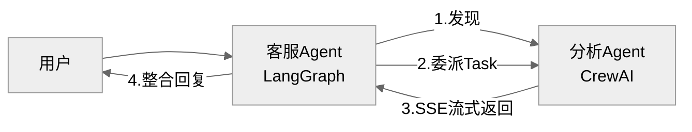

**详细步骤**：
1. **发现**：客服 Agent 通过 `GET https://analytics.example.com/.well-known/agent.json` 获取分析 Agent 的 Agent Card，了解其 skills（数据分析）与端点。
2. **认证**：客服 Agent 用 OAuth2 获取访问 Token。
3. **发起任务**：用 `tasks/sendSubscribe` 发起分析任务，SSE 流式接收进度。
4. **状态处理**：
   - `working`：展示进度给用户
   - `input_required`：收集用户补充信息后 `tasks/send` 继续
   - `completed`：读取 Artifact（分析报告）
5. **结果整合**：客服 Agent 将分析报告整合到对话中回复用户。

**关键点**：
- LangGraph 与 CrewAI 无需互相适配，通过 A2A 标准 HTTP 通信。
- 流式更新让用户实时感知进度，体验好。
- `input_required` 支持多轮交互，Agent 处理中可请求补充信息。

**评分标准**：流程完整 2.5 分；A2A 方法使用正确 2 分；关键点 1.5 分（满分 6）。

---

### 题目 8：异步通信与长任务处理（分析题·高级）

**问题描述**：
代码审查任务可能耗时 10-30 分钟，同步 HTTP 会超时。请用 A2A 设计长任务处理方案，包含 SSE、Webhook、断线重连。

**参考答案要点**：

**方案设计**：

| 阶段 | A2A 方法 | 机制 |
|------|----------|------|
| 1. 发起长任务 | `tasks/sendSubscribe` | SSE 长连接，实时推送进度 |
| 2. 进度更新 | SSE 事件 | status=working + 进度文本 |
| 3. 注册备份通知 | `tasks/pushNotificationSet` | Webhook 作为 SSE 断线兜底 |
| 4. SSE 断线 | `tasks/resubscribe` | 重新订阅，恢复流 |
| 5. 任务完成 | SSE / Webhook | status=completed + Artifact |

**关键设计**：
1. **SSE 优先**：实时性好，用户可看到进度。但 SSE 可能因网络中断断开。
2. **Webhook 兜底**：同时注册 Webhook，SSE 断线时 Webhook 仍能推送最终状态。
3. **断线重连**：用 `tasks/resubscribe` 恢复流，不丢失已处理进度。
4. **超时保护**：Client 设置最大等待时间，超时后用 `tasks/get` 查询最终状态。

```python
# 长任务处理伪代码
async def long_task_with_fallback(agent_url, task):
    # 1. 注册 Webhook 兜底
    await client.call(agent_url, "tasks/pushNotificationSet", {
        "id": task["id"],
        "pushNotificationConfig": {"url": WEBHOOK_URL, "token": SECRET}
    })

    # 2. SSE 流式订阅
    try:
        async for event in client.subscribe(agent_url, "tasks/sendSubscribe", task):
            if event["status"] == "completed":
                return event["artifact"]
    except ConnectionError:
        # 3. 断线重连
        async for event in client.resubscribe(agent_url, task["id"]):
            if event["status"] == "completed":
                return event["artifact"]

    # 4. 兜底:Webhook 会异步推送,Client 可等待或轮询
    return await wait_for_webhook(task["id"], timeout=3600)
```

**评分标准**：方案完整 2.5 分；SSE+Webhook 双保险 1.5 分；断线重连 1 分；代码 1 分（满分 6）。

---

### 题目 9：冲突解决机制设计（设计题·高级）

**问题描述**：
多个 Client Agent 同时调用同一 Remote Agent，可能产生并发写冲突、资源争用、结果不一致。请设计完整的冲突解决机制。

**参考答案要点**：

**冲突类型与解决**：

| 冲突类型 | 解决方案 | 实现 |
|----------|----------|------|
| **并发写冲突** | 乐观并发控制（版本号） | Task 带 version，更新时校验 |
| **资源争用** | 队列排队 + 优先级 | Remote Agent 侧任务队列 |
| **结果不一致** | Client 侧投票/仲裁 | 多 Agent 结果多数表决 |
| **死锁** | 超时强制取消 + DAG 检测 | 循环依赖检测 |

**乐观并发控制实现**：

```python
class TaskManager:
    async def update_task(self, task_id, update, expected_version):
        task = await self.get(task_id)
        if task["version"] != expected_version:
            raise ConflictError(f"版本冲突:期望{expected_version},实际{task['version']}")
        update["version"] = task["version"] + 1
        return await self.save(task_id, update)
```

**死锁检测**：
- Client 维护调用 DAG（有向无环图）。
- 新增调用前检查是否形成环。
- 检测到环则超时取消其中一个 Task，打破死锁。

**评分标准**：四类冲突各 1 分 4 分；乐观并发实现 1 分；死锁检测 1 分（满分 6）。

---

### 题目 10：性能优化方案（设计题·高级）

**问题描述**：
A2A 系统在高并发场景下延迟高、吞吐量低。请从连接、传输、缓存、路由四个维度给出优化方案。

**参考答案要点**：

| 维度 | 优化方案 | 效果 |
|------|----------|------|
| **连接** | HTTP Keep-Alive / 连接池复用 | 减少 TCP 握手开销 |
| **传输** | SSE 替代轮询；Gzip/Brotli 压缩 JSON | 实时性提升，带宽降 70% |
| **缓存** | Agent Card 缓存 + Task 结果缓存 | 减少发现请求，重复任务零延迟 |
| **路由** | 简单任务路由到轻量 Agent（mini 模型） | 成本降低 40% |
| **批处理** | 多 Task 合并提交 | 吞吐量提升 |
| **异步流水线** | Agent 间异步传递，不阻塞等待 | 资源利用率提升 |

**Agent Card 缓存示例**：
```python
from functools import lru_cache

@lru_cache(maxsize=128, ttl=3600)  # 缓存1小时
async def get_agent_card(agent_url: str) -> dict:
    """带缓存的 Agent Card 发现"""
    async with httpx.AsyncClient() as client:
        resp = await client.get(f"{agent_url}/.well-known/agent.json")
        return resp.json()
```

**评分标准**：四维度各 1 分 4 分；量化效果 1 分；代码示例 1 分（满分 6）。

---

### 题目 11：容错与故障转移（设计题·高级）

**问题描述**：
Remote Agent 可能不可用或超时。请设计 A2A 客户端的容错与故障转移方案。

**参考答案要点**：

**容错策略**：

| 错误类型 | 策略 | 实现 |
|----------|------|------|
| **网络超时** | 指数退避重试 | tenacity 重试 3 次 |
| **Agent 不可用** | 故障转移到备用 Agent | 主备 Agent 列表 |
| **认证失败** | 刷新 Token 重试 | OAuth2 token refresh |
| **Task 失败** | 重新创建任务 | 记录上下文，重试 |
| **5xx 错误** | 指数退避重试 | 区分可重试错误 |
| **4xx 错误** | 不重试，修正参数 | 参数校验 |

**故障转移实现**：

```python
class A2AClient:
    @retry(stop=stop_after_attempt(3), wait=wait_exponential(min=1, max=30),
           retry=retry_if_exception_type((TimeoutError, ConnectionError)))
    async def send_task(self, url, task):
        async with httpx.AsyncClient(timeout=30) as client:
            resp = await client.post(url, json=self._wrap(task),
                                      headers={"Authorization": f"Bearer {self.token}"})
            resp.raise_for_status()
            return resp.json()["result"]

    async def send_with_fallback(self, primary, backup, task):
        try:
            return await self.send_task(primary, task)
        except Exception as e:
            print(f"主Agent失败,切换备用: {e}")
            return await self.send_task(backup, task)
```

**评分标准**：错误分类 2 分；重试策略 2 分；故障转移实现 2 分（满分 6）。

---

### 题目 12：A2A vs MCP 对比与选型（分析题·高级）

**问题描述**：
请对比 A2A 与 MCP 的定位、核心抽象、通信模式、适用场景，并说明二者关系及选型建议。

**参考答案要点**：

**核心对比**：

| 维度 | MCP | A2A |
|------|-----|-----|
| **定位** | Agent ↔ 工具（外部，获取天气 钉钉等内容）（纵向集成） | Agent ↔ Agent（横向协作） |
| **核心抽象** | Tools / Resources / Prompts | Task / Message / Artifact |
| **通信模式** | 请求-响应为主 | 请求-响应 + SSE + Webhook |
| **状态管理** | 无状态 | Task 生命周期状态机 |
| **传输** | stdio + Streamable HTTP | HTTP + JSON-RPC |
| **发现** | Server 暴露 Tools/Resources | Agent Card 自描述 |
| **长任务** | 弱 | 强（流式+推送） |

**关系**：**互补而非竞争**。
- MCP 让 Agent 拥有工具（纵向能力扩展）。
- A2A 让 Agent 拥有伙伴（横向协作扩展）。
- 一个 Agent 可同时用 MCP 调工具 + 用 A2A 协作。

**选型建议**：
- Agent 访问数据库/API/文件 → **MCP**
- 跨框架/跨企业 Agent 协作 → **A2A**
- 长任务委派（代码审查等）→ **A2A**
- Agent 既需工具又需协作 → **MCP + A2A**

**一句话总结**：**MCP 让 Agent 拥有工具，A2A 让 Agent 拥有伙伴。**

**评分标准**：对比维度≥6 项 3 分；互补关系 1.5 分；选型建议 1 分；总结 0.5 分（满分 6）。

---

## 八、考点速查表

| 题号 | 类型 | 难度 | 考点 | 满分 |
|------|------|------|------|------|
| 1 | 概念题 | 基础 | A2A 定义、核心特性 | 5 |
| 2 | 概念题 | 基础 | A2A vs 传统 API 区别 | 5 |
| 3 | 概念题 | 基础 | Agent Card 作用与字段 | 5 |
| 4 | 原理题 | 中级 | Task 状态机流转 | 6 |
| 5 | 原理题 | 中级 | 通信机制（JSON-RPC 方法） | 6 |
| 6 | 原理题 | 中级 | 安全策略分层 | 6 |
| 7 | 分析题 | 中级 | 跨框架协作场景分析 | 6 |
| 8 | 分析题 | 高级 | 异步通信与长任务处理 | 6 |
| 9 | 设计题 | 高级 | 冲突解决机制设计 | 6 |
| 10 | 设计题 | 高级 | 性能优化方案 | 6 |
| 11 | 设计题 | 高级 | 容错与故障转移 | 6 |
| 12 | 分析题 | 高级 | A2A vs MCP 对比与选型 | 6 |

**面试官建议**：
- **初级岗位**：重点考察题 1-3，要求理解 A2A 基本概念与 Agent Card。
- **中级岗位**：增加题 4-7，要求掌握 Task 状态机、通信机制、能分析场景。
- **高级岗位**：重点考察题 8-12，要求能设计容错、优化性能、对比选型 A2A vs MCP。
