# Agent 任务解构框架详解

> 本文档系统阐述 Agent 任务解构框架的三大核心组成部分：**任务定义层、状态感知层、流程控制层**，旨在帮助开发人员理解并应用该框架进行 Agent 任务开发，附真实案例分析。

---

## 目录

- [一、框架总览](#一框架总览)
- [二、任务定义层](#二任务定义层)
- [三、状态感知层](三状态感知层)
- [四、流程控制层](#四流程控制层)
- [五、三层协同工作机制](#五三层协同工作机制)
- [六、真实案例分析](#六真实案例分析)
- [七、框架选型与落地建议](#七框架选型与落地建议)

---

## 一、框架总览

### 1.1 为什么需要任务解构框架

Agent 在面对复杂业务场景（如智能客服、自动化运维、代码生成）时，若直接将任务丢给 LLM"一步到位"处理，会面临三大问题：

| 问题 | 表现 | 后果 |
|------|------|------|
| **目标模糊** | 用户输入自然语言，意图不清晰 | LLM 输出偏离业务预期 |
| **状态丢失** | 多轮交互中上下文丢失 | 重复提问、决策不一致 |
| **流程失控** | 无明确执行路径，LLM 自由发挥 | 不可预测、不可审计 |

**任务解构框架**通过三层结构系统化解决上述问题，将"模糊任务"转化为"可执行、可监控、可回溯"的结构化流程。

### 1.2 三层核心架构

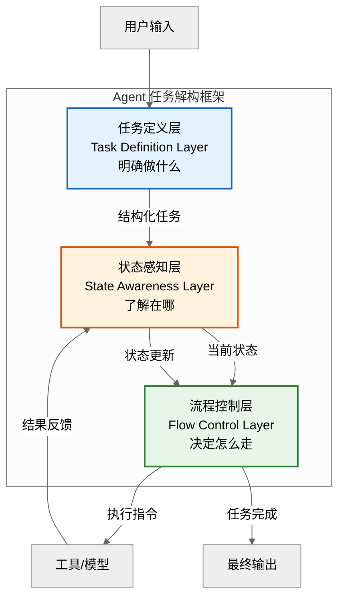

### 1.3 三层定位速查表

| 维度 | 任务定义层 | 状态感知层 | 流程控制层 |
|------|-----------|-----------|-----------|
| **核心问题** | 做什么？ | 现在在哪？ | 下一步怎么走？ |
| **设计目的** | 消除目标模糊 | 消除状态丢失 | 消除流程失控 |
| **输入** | 用户原始输入、业务约束 | 结构化任务、执行反馈 | 任务定义 + 当前状态 |
| **输出** | 结构化任务对象 | 状态快照、上下文 | 执行指令、跳转决策 |
| **关键组件** | 任务模板、参数抽取、目标校验 | 状态机、上下文管理、记忆系统 | 流程引擎、条件路由、异常处理 |
| **类比人类** | 接需求、写 PRD | 看进度、查现状 | 排计划、做决策 |

---

## 二、任务定义层

### 2.1 主要功能

任务定义层负责将用户的**自然语言输入**转化为**结构化任务对象**，确保 Agent 明确"要做什么"。

### 2.2 设计目的

1. **消除歧义**：将模糊的用户意图转为明确的任务目标。
2. **约束边界**：定义任务的输入参数、成功条件、失败约束。
3. **支持编排**：复杂任务可拆解为子任务，支持多 Agent 协作。

### 2.3 关键组件

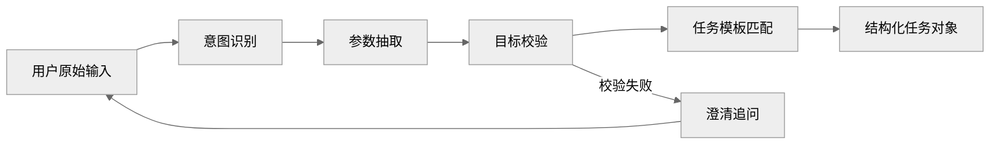

| 组件 | 职责 | 实现方式 |
|------|------|----------|
| **意图识别器** | 识别用户想做什么（查询、创建、修改、删除） | LLM Few-shot、分类模型 |
| **参数抽取器** | 从自然语言中抽取任务所需参数 | LLM Function Calling、NER |
| **目标校验器** | 校验参数完整性、合法性 | 规则引擎、JSON Schema 校验 |
| **任务模板库** | 预定义常见任务的结构化模板 | YAML/JSON 配置 |
| **澄清机制** | 参数缺失时主动向用户追问 | 多轮对话管理 |

### 2.4 结构化任务对象示例

```python
from pydantic import BaseModel
from typing import Optional, List
from enum import Enum


class TaskType(str, Enum):
    QUERY = "query"
    CREATE = "create"
    MODIFY = "modify"
    DELETE = "delete"


class TaskStatus(str, Enum):
    PENDING = "pending"
    RUNNING = "running"
    PAUSED = "paused"
    COMPLETED = "completed"
    FAILED = "failed"


class Task(BaseModel):
    """结构化任务对象"""
    task_id: str                          # 任务唯一标识
    task_type: TaskType                   # 任务类型
    intent: str                           # 用户意图描述
    parameters: dict                      # 任务参数
    success_criteria: str                 # 成功条件
    constraints: List[str] = []           # 约束条件
    priority: int = 0                     # 优先级
    timeout: int = 300                    # 超时时间（秒）
    parent_task_id: Optional[str] = None  # 父任务（支持子任务拆解）


# 示例：用户"帮我查下北京明天的天气"
task = Task(
    task_id="task-001",
    task_type=TaskType.QUERY,
    intent="查询天气",
    parameters={"city": "北京", "date": "明天"},
    success_criteria="返回北京明天的天气信息",
    constraints=["仅查询，不执行写操作"],
    priority=1,
    timeout=30,
)
```

### 2.5 复杂任务拆解

对于复杂任务，任务定义层支持将其拆解为多个子任务：

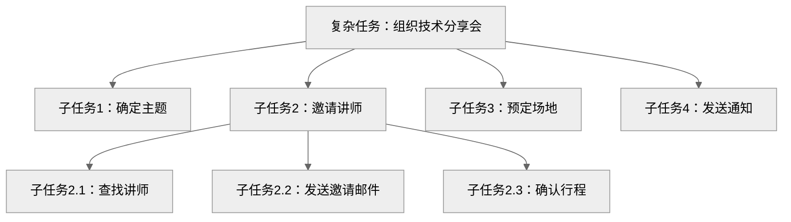

---

## 三、状态感知层

### 3.1 主要功能

状态感知层负责**跟踪 Agent 的执行进度与上下文**，回答"现在在哪"的问题，确保多轮交互中状态不丢失。

### 3.2 设计目的

1. **上下文连续**：跨多轮对话保持状态一致。
2. **进度可见**：实时感知任务执行到哪一步。
3. **决策依据**：为流程控制层提供准确的现状信息。

### 3.3 关键组件

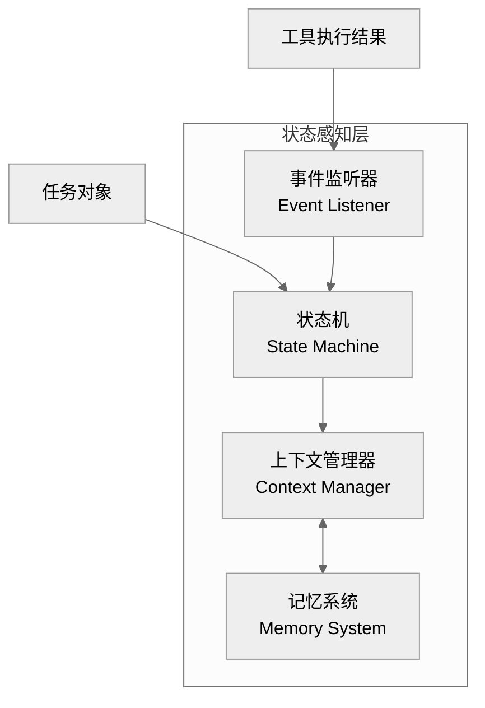

| 组件 | 职责 | 实现方式 |
|------|------|----------|
| **状态机** | 管理任务状态流转（pending→running→completed） | 状态模式、状态图 |
| **上下文管理器** | 维护当前会话的短期上下文 | 滑动窗口、Token 截断 |
| **记忆系统** | 持久化长期记忆（用户偏好、历史决策） | 向量数据库、KV 存储 |
| **事件监听器** | 监听工具执行结果、外部事件并更新状态 | 观察者模式、Webhook |

### 3.4 状态机设计

```python
from enum import Enum
from transitions import Machine


class AgentState(Enum):
    IDLE = "idle"
    ANALYZING = "analyzing"
    PLANNING = "planning"
    EXECUTING = "executing"
    WAITING_INPUT = "waiting_input"
    REFLECTING = "reflecting"
    COMPLETED = "completed"
    FAILED = "failed"


class AgentStateMachine:
    """Agent 状态机"""

    transitions = [
        # 触发事件          源状态          目标状态
        ("start_analyze",  "idle",         "analyzing"),
        ("finish_analyze", "analyzing",    "planning"),
        ("start_execute",  "planning",     "executing"),
        ("need_input",     "executing",    "waiting_input"),
        ("receive_input",  "waiting_input", "executing"),
        ("error_occurs",   "executing",    "failed"),
        ("start_reflect",  "executing",    "reflecting"),
        ("finish_reflect", "reflecting",   "planning"),
        ("complete",       "executing",    "completed"),
        ("reset",          "*",            "idle"),
    ]

    def __init__(self):
        self.state = AgentState.IDLE
        self.machine = Machine(
            model=self,
            states=AgentState,
            transitions=self.transitions,
            initial=AgentState.IDLE,
        )

    def get_context_snapshot(self) -> dict:
        """获取当前状态快照"""
        return {
            "current_state": self.state.value,
            "task_id": getattr(self, "task_id", None),
            "executed_steps": getattr(self, "executed_steps", []),
            "pending_steps": getattr(self, "pending_steps", []),
        }
```

### 3.5 状态流转图

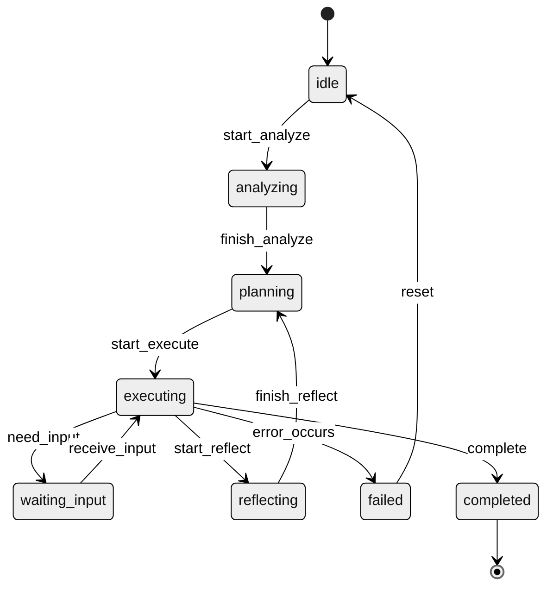

---

## 四、流程控制层

### 4.1 主要功能

流程控制层负责**决定 Agent 下一步执行什么动作**，是整个框架的"大脑"，回答"下一步怎么走"的问题。

### 4.2 设计目的

1. **流程可控**：预定义执行路径，避免 LLM 自由发挥。
2. **条件路由**：根据状态动态选择分支。
3. **异常处理**：失败时自动重试、回滚或转人工。
4. **可审计**：每一步决策都有据可查。

### 4.3 关键组件

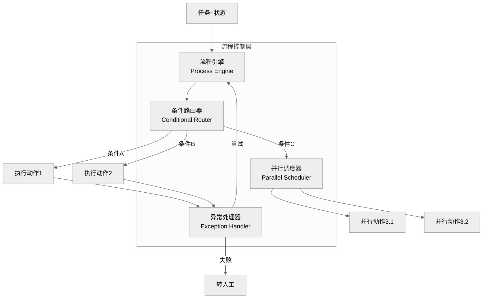

| 组件 | 职责 | 实现方式 |
|------|------|----------|
| **流程引擎** | 按预定义 DAG 执行任务流程 | 状态图、工作流引擎（如 LangGraph） |
| **条件路由器** | 根据状态选择执行分支 | if-else 规则、LLM 决策 |
| **异常处理器** | 捕获异常并执行恢复策略 | try/except、重试策略、降级 |
| **并行调度器** | 并行执行无依赖的子任务 | asyncio、线程池 |

### 4.4 条件路由策略

```python
from typing import Callable, Dict, Any


class ConditionalRouter:
    """条件路由器：根据当前状态选择下一步动作"""

    def __init__(self):
        self.routes: Dict[str, Callable] = {}

    def register(self, condition: str, action: Callable):
        """注册路由规则"""
        self.routes[condition] = action

    def route(self, context: dict) -> Callable:
        """根据上下文选择动作"""
        state = context.get("current_state")
        task_type = context.get("task_type")

        # 优先匹配具体规则
        key = f"{task_type}:{state}"
        if key in self.routes:
            return self.routes[key]

        # 回退到通用规则
        if state in self.routes:
            return self.routes[state]

        # 默认动作
        return self.routes.get("default", lambda ctx: "no_action")


# 使用示例
router = ConditionalRouter()
router.register("query:planning", lambda ctx: plan_query(ctx))
router.register("query:executing", lambda ctx: execute_query(ctx))
router.register("create:planning", lambda ctx: plan_create(ctx))
router.register("default", lambda ctx: ask_user(ctx))
```

### 4.5 异常处理策略

| 异常类型 | 处理策略 | 示例 |
|----------|----------|------|
| **工具超时** | 重试 3 次，间隔指数退避 | API 调用超时 |
| **参数错误** | 回到任务定义层重新抽取 | 参数缺失 |
| **LLM 幻觉** | 触发反思，重新规划 | 输出不符合 Schema |
| **权限不足** | 转人工处理 | 越权操作 |
| **状态冲突** | 回滚到上一个稳定状态 | 并发冲突 |

---

## 五、三层协同工作机制

### 5.1 完整执行流程

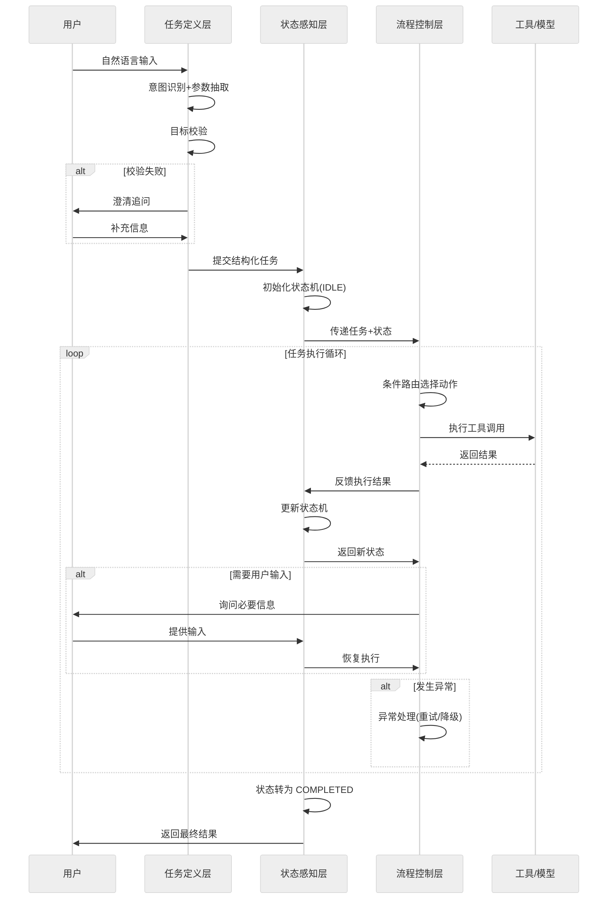

### 5.2 三层交互矩阵

| 调用方 → 被调方 | 任务定义层 | 状态感知层 | 流程控制层 |
|------------------|-----------|-----------|-----------|
| **任务定义层** | - | 提交任务、请求状态 | - |
| **状态感知层** | 反馈缺失参数 | - | 提供状态快照 |
| **流程控制层** | 触发重新定义 | 更新状态、读取状态 | - |

### 5.3 数据流示意

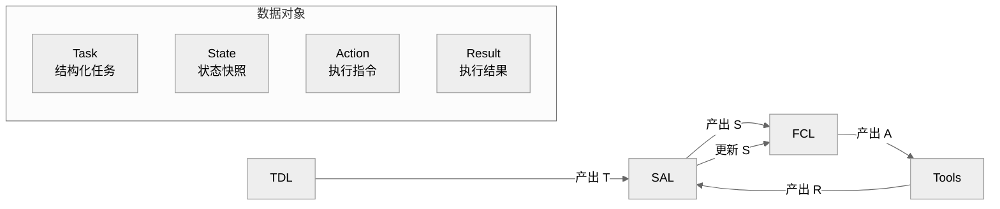

---

## 六、真实案例分析

### 案例一：智能客服工单系统

**业务背景**：某电信运营商构建智能客服 Agent，处理用户宽带故障报修，日均处理 5000+ 工单。

**三层落地**：

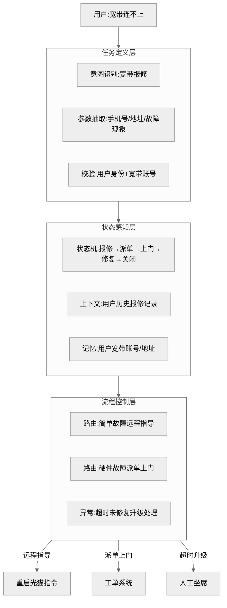

**关键实现**：

```python
# 任务定义层
class BroadbandRepairTask(BaseModel):
    task_type: str = "broadband_repair"
    phone: str                    # 用户手机号
    address: str                  # 安装地址
    fault_type: str               # 故障类型:断网/慢/不稳定
    fault_description: str        # 故障描述


# 状态感知层
class RepairState(Enum):
    REPORTED = "reported"         # 已报修
    DIAGNOSED = "diagnosed"       # 已诊断
    REMOTE_FIXING = "remote_fixing"  # 远程修复中
    DISPATCHED = "dispatched"     # 已派单
    ON_SITE = "on_site"           # 上门维修中
    RESOLVED = "resolved"         # 已修复
    CLOSED = "closed"             # 已关闭


# 流程控制层
def route_repair(state: dict) -> str:
    """根据故障类型和状态路由"""
    fault_type = state.get("fault_type")
    current_state = state.get("current_state")

    if current_state == RepairState.REPORTED:
        if fault_type in ["断网", "完全无法连接"]:
            return "diagnose_hardware"  # 硬件故障→派单
        else:
            return "remote_guide"       # 简单故障→远程指导
    elif current_state == RepairState.REMOTE_FIXING:
        if state.get("retry_count", 0) >= 3:
            return "escalate_to_human"  # 重试3次失败→升级
        return "retry_remote"
    elif current_state == RepairState.DISPATCHED:
        if state.get("wait_hours", 0) > 24:
            return "escalate_to_manager"  # 超时→升级经理
        return "wait_on_site"
```

**遇到的挑战与解决**：

| 挑战 | 解决方案 |
|------|----------|
| 用户描述模糊无法定位故障 | 任务定义层增加澄清机制，追问"光猫指示灯状态" |
| 多轮交互中用户重复报修 | 状态感知层查询 24 小时内同账号工单，合并处理 |
| 远程指导失败未及时升级 | 流程控制层设置 3 次重试上限，超限自动转人工 |
| 上门维修超时无感知 | 状态感知层增加超时事件监听，超 24 小时触发升级 |

**最终效果**：一次解决率从 45% 提升至 72%，平均处理时长从 25 分钟降至 8 分钟，人工干预率降低 60%。

---

### 案例二：自动化代码审查 Agent

**业务背景**：某互联网公司构建代码审查 Agent，自动审查 GitLab MR，日均处理 300+ MR。

**三层落地**：

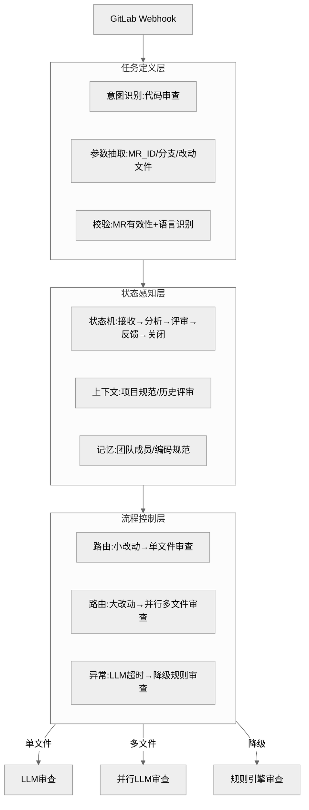

**关键实现**：

```python
# 任务定义层
class CodeReviewTask(BaseModel):
    task_type: str = "code_review"
    mr_id: int                     # MR ID
    project_id: int                # 项目 ID
    source_branch: str             # 源分支
    target_branch: str             # 目标分支
    changed_files: List[str]       # 改动文件列表
    language: str                  # 主要语言
    lines_changed: int             # 改动行数


# 状态感知层
class ReviewState(Enum):
    RECEIVED = "received"          # 收到 MR
    ANALYZING = "analyzing"        # 分析改动
    REVIEWING = "reviewing"        # 评审中
    FEEDBACK = "feedback"          # 反馈中
    APPROVED = "approved"          # 已通过
    CHANGES_REQUESTED = "changes_requested"  # 需修改
    CLOSED = "closed"              # 已关闭


# 流程控制层
def route_review(state: dict) -> str:
    """根据改动规模路由审查策略"""
    lines = state.get("lines_changed", 0)
    files = state.get("changed_files", [])

    if lines < 100 and len(files) <= 3:
        return "single_file_review"      # 小改动→单文件审查
    elif lines < 500:
        return "parallel_review"          # 中等改动→并行审查
    else:
        return "chunked_review"           # 大改动→分块审查
```

**遇到的挑战与解决**：

| 挑战 | 解决方案 |
|------|----------|
| 大型 MR（1000+ 行）LLM 上下文溢出 | 流程控制层分块审查，每块 200 行，结果聚合 |
| 多语言项目识别错误 | 任务定义层增加文件后缀检测，按语言分配审查器 |
| LLM 偶发幻觉给出错误建议 | 状态感知层增加"置信度"判断，低置信度降级为规则审查 |
| 评审结果无人跟进 | 流程控制层自动在 MR 评论 @作者，3 天未处理升级 Tech Lead |

**最终效果**：代码审查覆盖率从 60% 提升至 100%，平均审查时长从 4 小时降至 15 分钟，缺陷发现率提升 35%。

---

### 案例三：智能投顾 Agent

**业务背景**：某券商构建智能投顾 Agent，根据用户风险偏好推荐资产配置方案。

**三层落地**：

| 层次 | 实现 |
|------|------|
| **任务定义层** | 意图识别（咨询/调仓/查询）；参数抽取（风险等级、投资期限、金额）；合规校验（风险测评有效性） |
| **状态感知层** | 状态机（咨询中→推荐中→确认中→执行中→完成）；记忆系统（用户历史持仓、风险偏好变化） |
| **流程控制层** | 条件路由（保守型→债券型方案；激进型→股票型方案）；异常处理（市场剧烈波动→暂停推荐+预警） |

**遇到的挑战**：
1. 用户风险测评过期，仍尝试推荐高风险产品。
2. 市场剧烈波动时，推荐方案与实时行情脱节。
3. 用户多次咨询后，前后推荐方案不一致。

**解决方案**：
1. 任务定义层增加"风险测评有效期校验"，过期则强制重新测评。
2. 状态感知层接入实时行情事件，波动超阈值触发流程控制层暂停推荐。
3. 状态感知层记忆系统持久化历史推荐，流程控制层路由时读取历史保证一致性。

**最终效果**：合规违规事件降为 0，用户满意度提升 40%，转化率提升 25%。

---

## 七、框架选型与落地建议

### 7.1 与主流框架的对应关系

| 本框架层次 | LangGraph 实现 | LangChain 实现 | AutoGen 实现 |
|-----------|---------------|---------------|-------------|
| 任务定义层 | State Schema + Node 入参 | Chain 输入 + Output Parser | Agent 的 task 定义 |
| 状态感知层 | State + Checkpointer | Memory + RunnableConfig | Agent 的 context |
| 流程控制层 | Edge + Conditional Edge | LCEL 路由 + Tool Router | GroupChat + Manager |

### 7.2 落地步骤

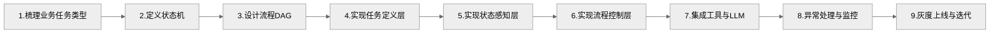

### 7.3 选型建议

| 场景特征 | 推荐框架 | 理由 |
|----------|----------|------|
| 流程复杂、需持久化 | LangGraph | 原生支持状态机 + Checkpointer |
| 简单链式任务 | LangChain LCEL | 轻量、易上手 |
| 多 Agent 协作 | AutoGen | 原生支持 GroupChat |
| 企业级工作流 | LangGraph + 自定义网关 | 可控性强、可审计 |

### 7.4 常见陷阱

| 陷阱 | 表现 | 规避方法 |
|------|------|----------|
| 任务定义过粗 | 一个任务包含多种意图，状态机爆炸 | 按意图拆分独立任务 |
| 状态机过深 | 状态嵌套超过 3 层，难以维护 | 扁平化设计，子状态独立为子任务 |
| 流程控制硬编码 | if-else 堆砌，无法扩展 | 使用规则引擎或配置化路由 |
| 忽略异常处理 | 上线后偶发故障导致卡死 | 每个状态都设计超时与降级策略 |
| 记忆系统膨胀 | 长期记忆无限增长，检索变慢 | 设置 TTL + 定期归档 |

---

## 八、总结

Agent 任务解构框架通过**三层分工**系统化解决 Agent 开发的核心痛点：

| 层次 | 解决问题 | 核心价值 |
|------|----------|----------|
| **任务定义层** | 目标模糊 | 结构化、可校验、可拆解 |
| **状态感知层** | 状态丢失 | 上下文连续、进度可见 |
| **流程控制层** | 流程失控 | 路径可控、异常可恢复 |

三层协同工作，让 Agent 从"黑盒魔法"变为"工程化系统"，具备**可预测、可监控、可审计、可演进**的工程特性，是构建生产级 Agent 应用的基础框架。
