# Agent 开发三大主流框架详解

> 本文档系统介绍 Agent 开发中最常用的三大框架：**LangChain、LangGraph、AutoGen**，涵盖核心特点、功能模块、适用场景、技术架构、优缺点分析与使用示例，帮助开发人员快速选型与上手。

---

## 目录

- [一、框架总览](#一框架总览)
- [二、LangChain](#二langchain)
- [三、LangGraph](#三langgraph)
- [四、AutoGen](#四autogen)
- [五、三大框架对比](#五三大框架对比)
- [六、选型建议](#六选型建议)
- [七、多 Agent 框架与协同机制详解](#七多-agent-框架与协同机制详解)
- [八、总结](#八总结)

---

## 一、框架总览

### 1.1 三大框架定位

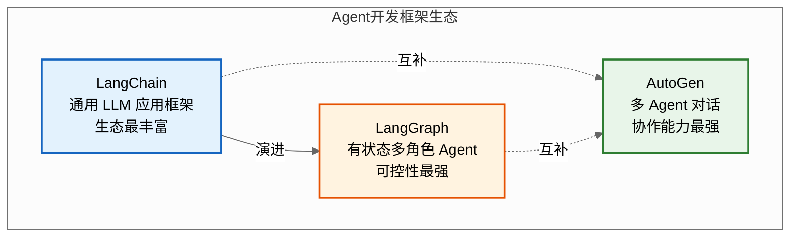

### 1.2 速查表

| 维度 | LangChain | LangGraph | AutoGen |
|------|-----------|-----------|---------|
| **出品方** | LangChain 公司 | LangChain 公司 | 微软研究院 |
| **定位** | 通用 LLM 应用框架 | 有状态 Agent 编排框架 | 多 Agent 对话框架 |
| **核心抽象** | Chain / Runnable | StateGraph / Node / Edge | ConversableAgent / GroupChat |
| **状态管理** | 弱（Memory 模块） | 强（Checkpointer 原生） | 中（对话历史） |
| **多 Agent** | 不擅长 | 支持（子图） | 原生支持 |
| **可控性** | 中 | 高（条件边、中断） | 中 |
| **学习曲线** | 中 | 陡 | 平缓 |
| **生态** | 最丰富 | 依托 LangChain | 中等 |
| **适用场景** | RAG、简单 Chain | 复杂工作流、HITL | 多 Agent 协作 |

---

## 二、LangChain

### 2.1 核心特点

**LangChain** 是由 LangChain 公司开源的通用 LLM 应用开发框架，是当前生态最丰富的 Agent 开发工具。它通过**模块化组件 + LCEL 表达式**让开发者像搭积木一样构建 LLM 应用。

**五大核心特点**：

| 特点 | 说明 |
|------|------|
| **模块化组件** | Models/Prompts/Tools/Memory/Indexes 等独立模块，按需组合 |
| **LCEL 表达式** | LangChain Expression Language，用 `|` 管道符串联组件 |
| **统一接口** | 抽象各 LLM 厂商差异，一套代码切换 OpenAI/Claude/本地模型 |
| **生态丰富** | 600+ 集成（向量库/工具/文档加载器），社区最大 |
| **LangSmith** | 配套调试、监控、评估平台 |

### 2.2 主要功能模块

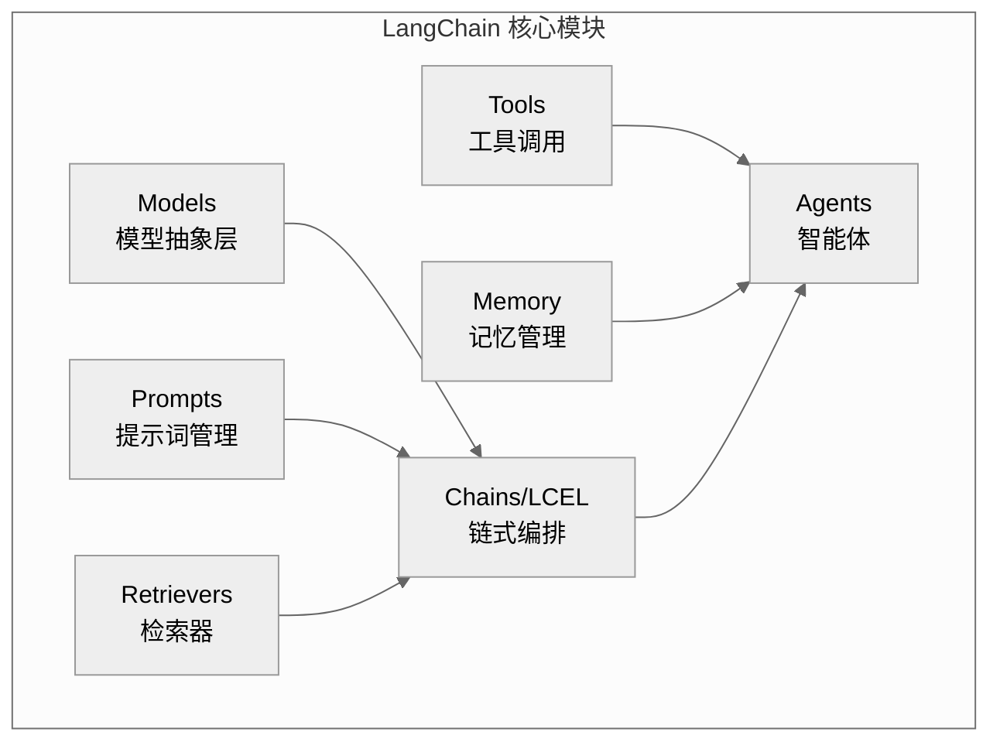

| 模块 | 职责 | 关键类 |
|------|------|--------|
| **Models** | 抽象 LLM/ChatModel/Embedding | `ChatOpenAI`, `OpenAIEmbeddings` |
| **Prompts** | 管理提示词模板 | `ChatPromptTemplate`, `FewShotPromptTemplate` |
| **Tools** | 定义工具供 Agent 调用 | `@tool`, `BaseTool` |
| **Memory** | 管理对话历史 | `ConversationBufferMemory`, `ConversationSummaryMemory` |
| **Retrievers** | 检索外部知识（RAG 核心） | `VectorStoreRetriever`, `MultiQueryRetriever` |
| **Chains/LCEL** | 串联组件 | `RunnableSequence`, `|` 管道 |
| **Agents** | 智能体（基于工具自主决策） | `create_tool_calling_agent`, `AgentExecutor` |

### 2.3 技术架构

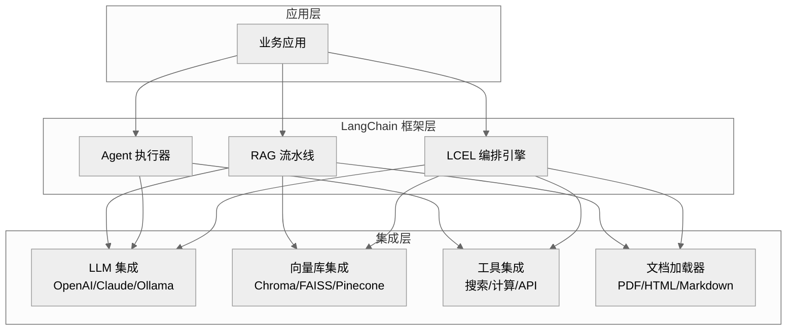

### 2.4 适用场景

| 场景 | 推荐用法 | 优势 |
|------|----------|------|
| **RAG 知识问答** | Retriever + LCEL | 集成丰富，开箱即用 |
| **简单工具调用** | Tool Calling Agent | 统一接口，多模型支持 |
| **文档处理** | Document Loaders + Splitters | 支持 50+ 文档格式 |
| **对话机器人** | Memory + LLM | 多种记忆策略 |
| **批量推理任务** | LCEL Batch | 并行批处理 |

### 2.5 优缺点分析

| 优点 | 缺点 |
|------|------|
| 生态最丰富，600+ 集成 | API 变动频繁，版本兼容性差 |
| LCEL 表达式简洁优雅 | 复杂 Agent 可控性不足 |
| 统一抽象，切换模型成本低 | 抽象层多，调试困难 |
| 社区活跃，文档丰富 | "胶水代码"多，性能开销 |
| LangSmith 配套监控 | 状态管理弱，不适合复杂工作流 |

### 2.6 使用示例：RAG 知识问答

```python
from langchain_openai import ChatOpenAI, OpenAIEmbeddings
from langchain_community.vectorstores import Chroma
from langchain_core.prompts import ChatPromptTemplate
from langchain_core.output_parsers import StrOutputParser
from langchain_text_splitters import RecursiveCharacterTextSplitter
from langchain_community.document_loaders import TextLoader

# 1. 加载并切分文档
loader = TextLoader("knowledge.txt")
docs = loader.load()
splitter = RecursiveCharacterTextSplitter(chunk_size=500, chunk_overlap=50)
chunks = splitter.split_documents(docs)

# 2. 构建向量库
vectorstore = Chroma.from_documents(chunks, OpenAIEmbeddings())
retriever = vectorstore.as_retriever(search_kwargs={"k": 3})

# 3. 构建 RAG 链（LCEL 表达式）
llm = ChatOpenAI(model="gpt-4o", temperature=0)
prompt = ChatPromptTemplate.from_template("""
基于以下上下文回答问题：

上下文: {context}

问题: {question}

回答:""")

# LCEL 管道:检索 → 格式化 → Prompt → LLM → 解析
rag_chain = (
    {"context": retriever | (lambda docs: "\n".join(d.page_content for d in docs)),
     "question": lambda x: x["question"]}
    | prompt
    | llm
    | StrOutputParser()
)

# 4. 调用
answer = rag_chain.invoke({"question": "LangGraph 的持久化机制是什么?"})
print(answer)
```

### 2.7 使用示例：Tool Calling Agent

```python
from langchain_openai import ChatOpenAI
from langchain_core.tools import tool
from langchain.agents import create_tool_calling_agent, AgentExecutor
from langchain_core.prompts import ChatPromptTemplate

# 定义工具
@tool
def search_weather(city: str) -> str:
    """查询指定城市天气"""
    return f"{city} 今天 25°C,多云"

@tool
def calculate(expression: str) -> str:
    """计算数学表达式"""
    return str(eval(expression))

tools = [search_weather, calculate]

# 创建 Agent
llm = ChatOpenAI(model="gpt-4o")
prompt = ChatPromptTemplate.from_messages([
    ("system", "你是助手,可调用工具回答问题"),
    ("user", "{input}"),
    ("placeholder", "{agent_scratchpad}"),
])

agent = create_tool_calling_agent(llm, tools, prompt)
executor = AgentExecutor(agent=agent, tools=tools, verbose=True)

# 执行
result = executor.invoke({"input": "北京天气怎么样?123*456等于多少?"})
print(result["output"])
```

---

## 三、LangGraph

### 3.1 核心特点

**LangGraph** 是 LangChain 公司推出的**有状态、多角色 Agent 编排框架**，基于图结构（StateGraph）构建 Agent 工作流，是 LangChain 在复杂 Agent 场景的进化版。核心解决"复杂工作流的状态管理与可控性"问题。

**五大核心特点**：

| 特点 | 说明 |
|------|------|
| **图结构编排** | 用 StateGraph 定义节点（Node）和边（Edge），支持循环、分支 |
| **状态管理** | State 对象贯穿全图，Checkpointer 原生持久化 |
| **条件路由** | Conditional Edge 支持动态分支决策 |
| **HITL 支持** | interrupt() 原生支持人机协作中断 |
| **多 Agent** | 子图组合实现多 Agent 协作 |

### 3.2 主要功能模块

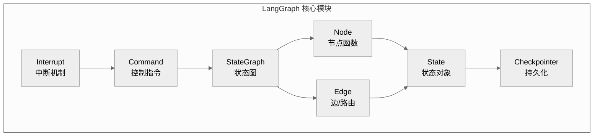

| 模块 | 职责 | 关键 API |
|------|------|----------|
| **StateGraph** | 定义有状态图 | `StateGraph(State)`, `add_node()`, `add_edge()` |
| **Node** | 图节点，执行具体逻辑 | 普通函数，接收 State 返回 dict |
| **Edge** | 节点间的连接 | `add_edge()`, `add_conditional_edges()` |
| **State** | 贯穿全图的状态对象 | `TypedDict` / Pydantic Model |
| **Checkpointer** | 状态持久化 | `MemorySaver`, `SqliteSaver`, `PostgresSaver` |
| **Interrupt** | 中断与人机协作 | `interrupt()`, `Command(resume=)` |
| **Command** | 运行时控制指令 | `Command(goto=, update=, resume=)` |

### 3.3 技术架构

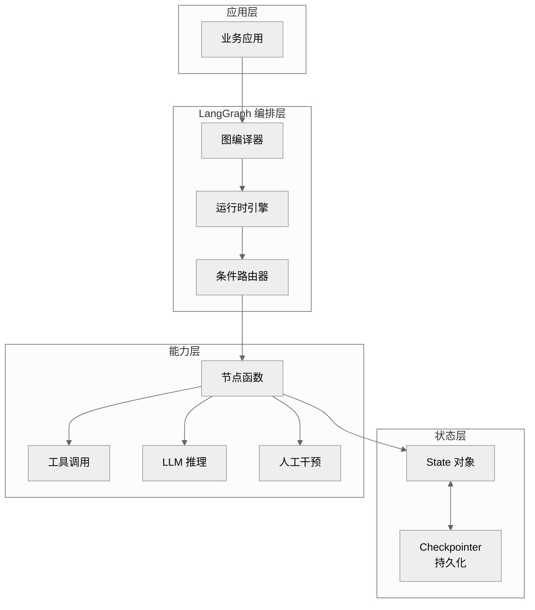

### 3.4 适用场景

| 场景 | 推荐用法 | 优势 |
|------|----------|------|
| **复杂工作流** | StateGraph 多节点编排 | 循环、分支、并行支持 |
| **多步骤 Agent** | ReAct 循环图实现 | 状态持久化，可中断恢复 |
| **HITL 人机协作** | interrupt() + Command(resume=) | 原生支持，无需自研 |
| **多 Agent 协作** | 子图组合 | Supervisor 协调多子图 |
| **长任务管理** | Checkpointer + thread_id | 跨进程恢复 |
| **生产级 Agent** | PostgresSaver + 监控 | 可控、可审计、可恢复 |

### 3.5 优缺点分析

| 优点 | 缺点 |
|------|------|
| 状态管理强，原生持久化 | 学习曲线陡峭 |
| 可控性高，条件路由灵活 | 生态依托 LangChain |
| HITL 原生支持 | 简单任务过重 |
| 支持循环和复杂工作流 | 文档相对复杂 |
| 生产级可靠性（可恢复、可审计） | 调试需配合 LangSmith |

### 3.6 使用示例：ReAct Agent

```python
from typing import TypedDict, Annotated
from langgraph.graph import StateGraph, START, END
from langgraph.graph.message import add_messages
from langgraph.prebuilt import ToolNode
from langchain_openai import ChatOpenAI
from langchain_core.tools import tool


# 1. 定义状态
class State(TypedDict):
    messages: Annotated[list, add_messages]


# 2. 定义工具
@tool
def search_weather(city: str) -> str:
    """查询指定城市天气"""
    return f"{city} 今天 25°C,多云"

@tool
def calculate(expression: str) -> str:
    """计算数学表达式"""
    return str(eval(expression))

tools = [search_weather, calculate]
tool_node = ToolNode(tools)

# 3. 定义 Agent 节点
llm = ChatOpenAI(model="gpt-4o").bind_tools(tools)

def agent_node(state: State):
    response = llm.invoke(state["messages"])
    return {"messages": [response]}

# 4. 条件路由:判断是否调用工具
def should_use_tools(state: State) -> str:
    last_msg = state["messages"][-1]
    if last_msg.tool_calls:
        return "tools"
    return END

# 5. 构建图
builder = StateGraph(State)
builder.add_node("agent", agent_node)
builder.add_node("tools", tool_node)

builder.add_edge(START, "agent")
builder.add_conditional_edges("agent", should_use_tools)
builder.add_edge("tools", "agent")  # 工具结果回到 agent

graph = builder.compile()

# 6. 调用
result = graph.invoke({"messages": [("user", "北京天气?")]})
print(result["messages"][-1].content)
```

### 3.7 使用示例：HITL 审批流程

```python
from langgraph.graph import StateGraph, START, END
from langgraph.checkpoint.memory import MemorySaver
from langgraph.types import interrupt, Command


class State(TypedDict):
    amount: float
    approved: bool


def refund_node(state: State):
    # 中断等待人工审批
    decision = interrupt({"question": f"确认退款 ¥{state['amount']}?"})
    if decision == "approve":
        return {"approved": True}
    return {"approved": False}


builder = StateGraph(State)
builder.add_node("refund", refund_node)
builder.add_edge(START, "refund")
builder.add_edge("refund", END)

graph = builder.compile(checkpointer=MemorySaver())
config = {"configurable": {"thread_id": "refund-001"}}

# 触发中断
result = graph.invoke({"amount": 999.0}, config)

# 人工批准后恢复
result = graph.invoke(Command(resume="approve"), config)
print(result)  # {"amount": 999.0, "approved": True}
```

---

## 四、AutoGen

### 4.1 核心特点

**AutoGen** 是微软研究院开源的**多 Agent 对话框架**，核心思想是通过多个 ConversableAgent 之间的对话协作解决复杂任务。它是多 Agent 协作场景的事实标准。

**五大核心特点**：

| 特点 | 说明 |
|------|------|
| **多 Agent 对话** | Agent 之间自然对话协作，无需显式编排 |
| **GroupChat** | 群聊模式，Manager 自动调度发言顺序 |
| **角色定制** | 每个 Agent 独立角色、系统提示、工具集 |
| **人类参与** | UserProxyAgent 代表人类参与对话 |
| **代码执行** | 原生支持代码生成与执行（Docker 沙箱） |

### 4.2 主要功能模块

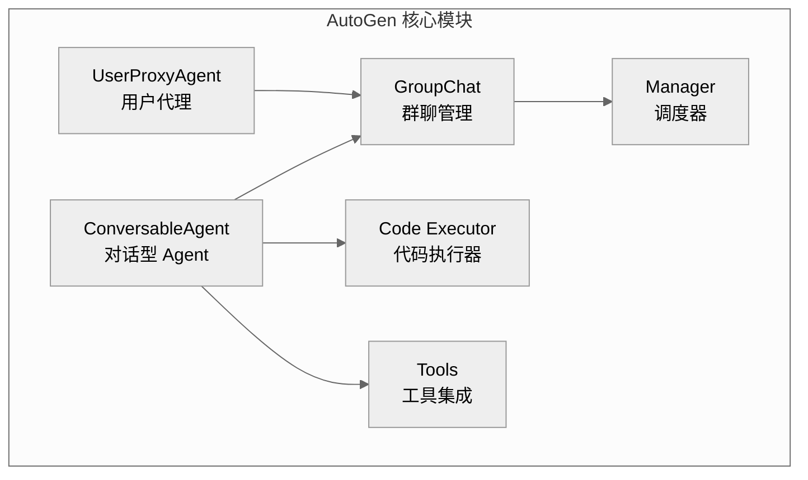

| 模块 | 职责 | 关键类 |
|------|------|--------|
| **ConversableAgent** | 可对话的 Agent 基类 | `ConversableAgent`, `AssistantAgent` |
| **UserProxyAgent** | 代表人类用户，可执行代码 | `UserProxyAgent` |
| **GroupChat** | 管理多 Agent 群聊 | `GroupChat`, `GroupChatManager` |
| **Code Executor** | 安全执行 Agent 生成的代码 | `LocalCommandLineCodeExecutor`, `DockerCodeExecutor` |
| **Tools** | 工具注册与调用 | `register_for_llm()`, `register_for_execution()` |

### 4.3 技术架构

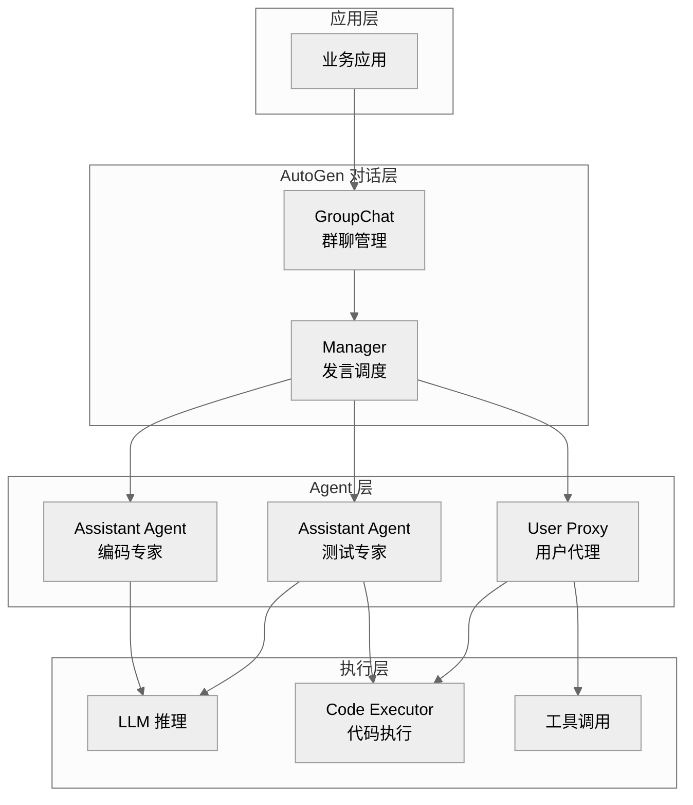

### 4.4 适用场景

| 场景 | 推荐用法 | 优势 |
|------|----------|------|
| **多 Agent 协作** | GroupChat + 多角色 Agent | 原生支持对话式协作 |
| **代码生成与执行** | Assistant + UserProxy + Code Executor | 生成-执行-反馈闭环 |
| **复杂任务分解** | 多专家 Agent 分工讨论 | 角色分工，各司其职 |
| **人机协作** | UserProxyAgent 代表人类 | 人类可随时介入 |
| **研究与实验** | 多 Agent 辩论、头脑风暴 | 灵活的对话拓扑 |

### 4.5 优缺点分析

| 优点 | 缺点 |
|------|------|
| 多 Agent 协作能力最强 | 对话轮次难控制，成本高 |
| 原生代码执行（Docker 沙箱） | 状态管理弱（无持久化） |
| 角色定制灵活 | 复杂工作流不如 LangGraph 可控 |
| 学习曲线平缓 | 生态不如 LangChain 丰富 |
| 微软背书，稳定维护 | HITL 需自行实现 |

### 4.6 使用示例：多 Agent 协作写代码

```python
from autogen import ConversableAgent, UserProxyAgent

# 1. 配置 LLM
llm_config = {"model": "gpt-4o", "api_key": "your-api-key"}

# 2. 创建 Coder Agent
coder = ConversableAgent(
    name="Coder",
    system_message="你是资深 Python 工程师,负责编写高质量代码。",
    llm_config=llm_config,
    human_input_mode="NEVER",  # 不需人工输入
)

# 3. 创建 User Proxy Agent（代表用户,可执行代码）
user_proxy = UserProxyAgent(
    name="User",
    human_input_mode="NEVER",
    is_termination_msg=lambda msg: "TERMINATE" in msg.get("content", ""),
    code_execution_config={
        "work_dir": "workspace",
        "use_docker": False,  # 生产环境建议 True
    },
)

# 4. 发起对话:用户请求写代码
user_proxy.initiate_chat(
    coder,
    message="""
请用 Python 实现一个快速排序算法,并写测试用例验证。
代码写完后请执行测试。
""",
)

# 对话流程:
# User → Coder: 请求写快排
# Coder → User: 返回代码
# User: 执行代码,返回结果
# Coder → User: 确认测试通过,TERMINATE
```

### 4.7 使用示例：GroupChat 多专家协作

```python
from autogen import (
    ConversableAgent, UserProxyAgent, GroupChat, GroupChatManager
)

llm_config = {"model": "gpt-4o", "api_key": "your-api-key"}

# 1. 创建多个专家 Agent
data_scientist = ConversableAgent(
    name="DataScientist",
    system_message="你是数据科学家,负责数据分析和建模建议。",
    llm_config=llm_config,
    human_input_mode="NEVER",
)

engineer = ConversableAgent(
    name="Engineer",
    system_message="你是 ML 工程师,负责实现代码和部署方案。",
    llm_config=llm_config,
    human_input_mode="NEVER",
)

product_manager = ConversableAgent(
    name="PM",
    system_message="你是产品经理,负责需求澄清和验收标准。",
    llm_config=llm_config,
    human_input_mode="NEVER",
)

# 2. 创建 GroupChat
group_chat = GroupChat(
    agents=[data_scientist, engineer, product_manager],
    messages=[],
    max_round=10,  # 最多 10 轮对话
)

# 3. 创建 Manager（调度发言顺序）
manager = GroupChatManager(
    groupchat=group_chat,
    llm_config=llm_config,
)

# 4. 用户代理发起讨论
user_proxy = UserProxyAgent(
    name="User",
    human_input_mode="NEVER",
    code_execution_config=False,
)

user_proxy.initiate_chat(
    manager,
    message="我们需要构建一个用户流失预测模型,请各位专家讨论方案。",
)

# 讨论流程:
# PM 澄清需求 → DataScientist 给建模方案 → Engineer 给实现方案
# → PM 确认验收标准 → TERMINATE
```

---

## 五、三大框架对比

### 5.1 核心能力对比

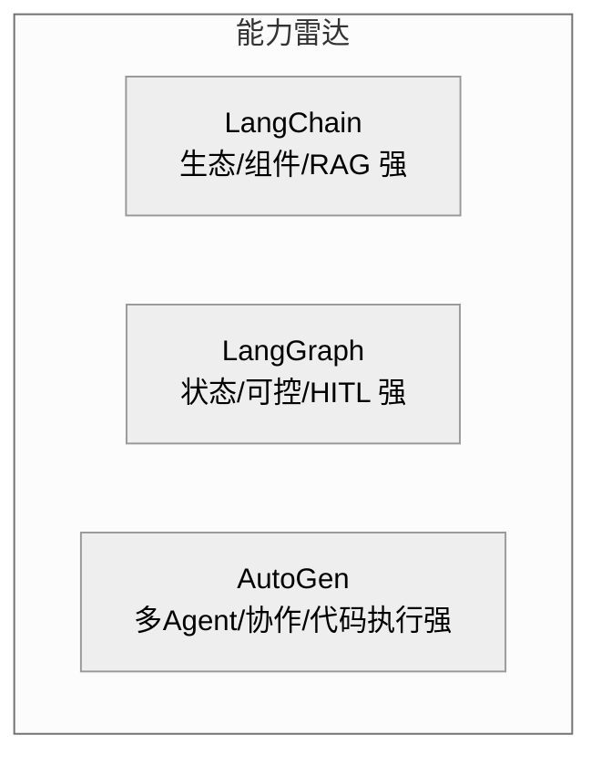

| 能力维度 | LangChain | LangGraph | AutoGen |
|----------|-----------|-----------|---------|
| **生态丰富度** | ★★★★★ | ★★★（依托 LC） | ★★★ |
| **状态管理** | ★★ | ★★★★★ | ★★★ |
| **多 Agent 协作** | ★★ | ★★★★ | ★★★★★ |
| **可控性** | ★★★ | ★★★★★ | ★★★ |
| **HITL 支持** | ★★ | ★★★★★ | ★★ |
| **代码执行** | ★★ | ★★ | ★★★★★ |
| **学习曲线** | ★★★ | ★★ | ★★★★ |
| **生产可靠性** | ★★★ | ★★★★★ | ★★★ |
| **RAG 能力** | ★★★★★ | ★★★ | ★★ |
| **简单任务效率** | ★★★★ | ★★★ | ★★★ |

### 5.2 架构对比

| 维度 | LangChain | LangGraph | AutoGen |
|------|-----------|-----------|---------|
| **核心抽象** | Chain / Runnable | StateGraph | ConversableAgent |
| **编排方式** | LCEL 管道 | 图（节点+边） | 对话（消息传递） |
| **状态传递** | 显式传参 | State 对象贯穿全图 | 消息历史 |
| **流程控制** | 顺序为主 | 条件边、循环、分支 | Manager 调度 |
| **持久化** | 需自建 | Checkpointer 原生 | 无原生支持 |
| **并发** | LCEL batch | 并行分支 | GroupChat 多 Agent |

### 5.3 代码复杂度对比

同一任务"ReAct Agent（查天气+计算）"的实现复杂度：

| 框架 | 代码行数 | 关键步骤 | 复杂度 |
|------|----------|----------|--------|
| **LangChain** | ~15 行 | create_tool_calling_agent + AgentExecutor | 低 |
| **LangGraph** | ~30 行 | StateGraph + Node + Conditional Edge | 中 |
| **AutoGen** | ~20 行 | ConversableAgent + initiate_chat | 低 |

---

## 六、选型建议

### 6.1 选型决策树

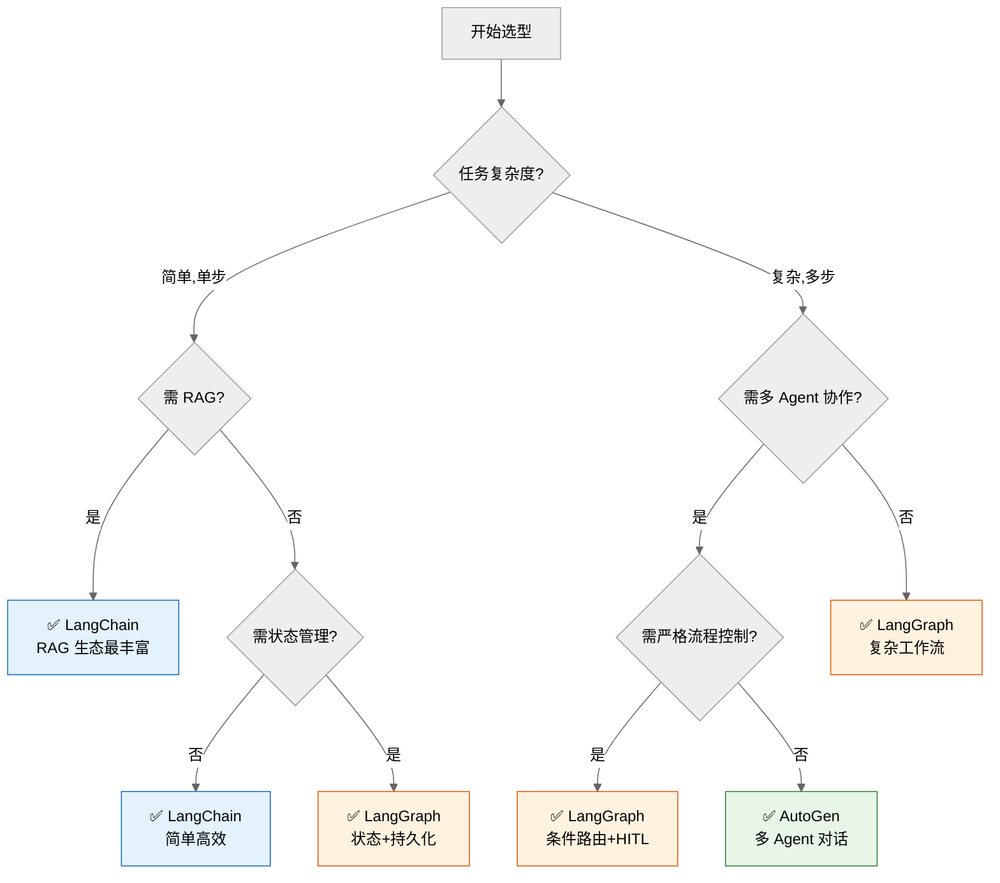

### 6.2 场景推荐表

| 场景 | 首选框架 | 理由 |
|------|----------|------|
| **RAG 知识问答** | LangChain | 生态最丰富，开箱即用 |
| **简单工具调用 Agent** | LangChain | API 简洁，上手快 |
| **复杂多步工作流** | LangGraph | 图编排+条件路由+循环 |
| **需持久化/可恢复** | LangGraph | Checkpointer 原生支持 |
| **HITL 人机协作** | LangGraph | interrupt() 原生支持 |
| **多 Agent 协作** | AutoGen | GroupChat 原生支持 |
| **代码生成与执行** | AutoGen | Docker 沙箱原生 |
| **多专家讨论** | AutoGen | 角色定制灵活 |
| **生产级高可靠** | LangGraph | 可控+可审计+可恢复 |
| **快速原型验证** | LangChain | 代码量少，迭代快 |

### 6.3 组合使用建议

三大框架可组合使用，发挥各自优势：

| 组合 | 用法 | 场景 |
|------|------|------|
| **LangChain + LangGraph** | LangChain 组件作为 LangGraph 节点 | 复杂工作流 + 复用 LangChain 生态 |
| **LangChain + AutoGen** | LangChain 工具集成到 AutoGen Agent | 多 Agent 协作 + 丰富工具集 |
| **LangGraph + AutoGen** | AutoGen GroupChat 作为 LangGraph 子图 | 多 Agent 协作 + 流程控制 |

**组合示例：LangChain 工具 + LangGraph 编排**：

```python
from langchain_core.tools import tool
from langgraph.graph import StateGraph, START, END

# 复用 LangChain 的 @tool 装饰器
@tool
def search_weather(city: str) -> str:
    """查询天气"""
    return f"{city} 25°C"

# 用 LangGraph 编排复杂工作流
def weather_node(state):
    result = search_weather.invoke({"city": state["city"]})
    return {"weather": result}

builder = StateGraph(dict)
builder.add_node("weather", weather_node)
builder.add_edge(START, "weather")
builder.add_edge("weather", END)
graph = builder.compile()
```

### 6.4 学习路径建议

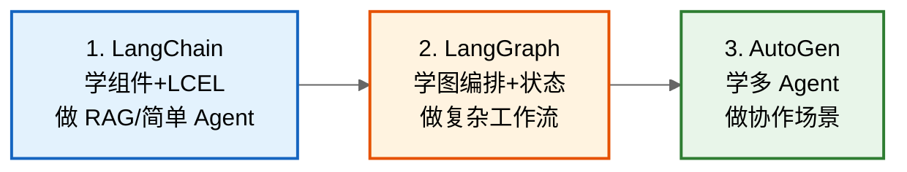

**推荐学习顺序**：
1. **LangChain 先行**：掌握 LLM 应用基础（Prompt/Tool/Memory/RAG），生态最丰富。
2. **LangGraph 进阶**：掌握复杂工作流编排（状态/条件/HITL），生产级 Agent 必备。
3. **AutoGen 扩展**：掌握多 Agent 协作（GroupChat/角色定制），特定场景利器。

---

## 七、多 Agent 框架与协同机制详解

> 本章节深入阐述多 Agent 框架的核心架构、关键组件、典型场景，系统说明 Agent 间通信协议、数据交换格式、消息传递机制，全面梳理协同工作策略、任务分配、冲突解决与性能优化方案。

### 7.1 多 Agent 框架核心架构设计

#### 7.1.1 为什么需要多 Agent

单 Agent 在复杂场景下面临四大瓶颈：

| 瓶颈 | 表现 | 多 Agent 解法 |
|------|------|---------------|
| **能力泛化难** | 单一 Agent 难精通所有领域 | 按领域分工，专业 Agent 各司其职 |
| **上下文爆炸** | 单 Agent 承载所有任务上下文 | 各 Agent 上下文聚焦，Token 可控 |
| **决策冲突** | 单 Agent 多目标决策互相干扰 | 多 Agent 分治，目标解耦 |
| **可扩展性** | 单 Agent 能力上限受限 | 按需增减 Agent，横向扩展 |

#### 7.1.2 四种典型架构模式

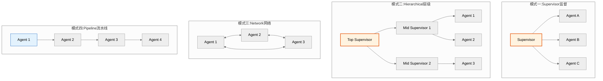

| 模式 | 结构 | 调度方式 | 适用场景 | 代表框架 |
|------|------|----------|----------|----------|
| **Supervisor（监督）** | 中心化，Supervisor 统一调度 | Supervisor 分配任务给工作 Agent | 任务可并行、需统一决策 | LangGraph、AutoGen GroupChat |
| **Hierarchical（层级）** | 树状，多级 Supervisor | 上级分配给下级 Supervisor | 超大规模任务分解 | LangGraph 子图嵌套 |
| **Network（网络）** | 去中心化，Agent 间直接通信 | 自主协商 | 探索式、开放式任务 | AutoGen Network、CrewAI |
| **Pipeline（流水线）** | 线性，Agent 串行处理 | 前序 Agent 输出作为后序输入 | 流程明确的任务链 | LangChain LCEL、LangGraph 线性图 |

#### 7.1.3 核心架构组件

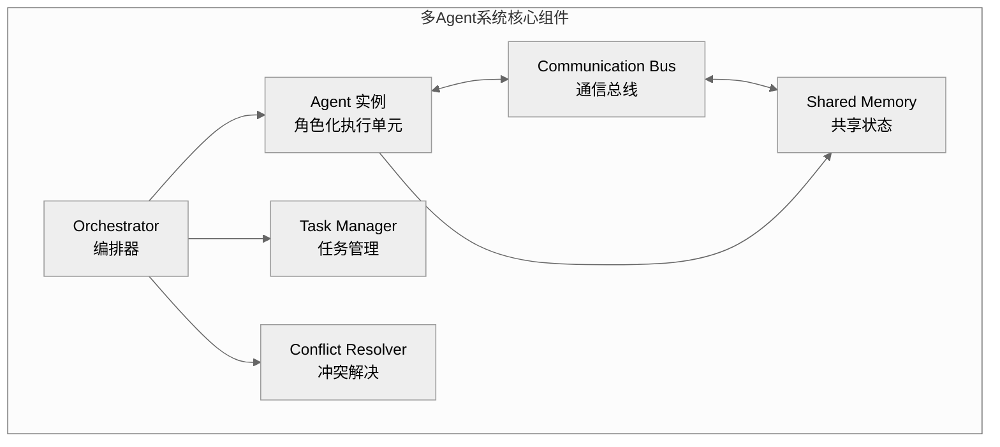

| 组件 | 职责 | 关键设计 |
|------|------|----------|
| **Orchestrator（编排器）** | 全局调度，决定谁何时执行 | Supervisor 模式核心，路由决策 |
| **Agent 实例** | 角色化执行单元 | 独立 Prompt、工具集、LLM 配置 |
| **Communication Bus（通信总线）** | Agent 间消息传递 | 同步/异步、点对点/广播 |
| **Shared Memory（共享状态）** | 全局状态共享 | 黑板模式、共享 State |
| **Task Manager（任务管理）** | 任务分解、分配、追踪 | 任务 DAG、依赖管理 |
| **Conflict Resolver（冲突解决）** | 处理 Agent 决策冲突 | 优先级、投票、人工裁决 |

### 7.2 Agent 间通信机制

#### 7.2.1 通信协议标准

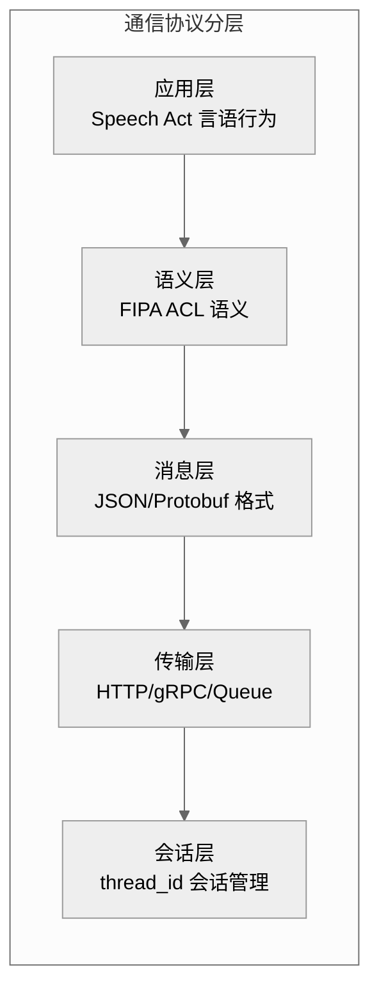

**主流通信协议对比**：

| 协议 | 出处 | 核心特点 | 适用框架 |
|------|------|----------|----------|
| **FIPA ACL** | FIPA 标准 | Agent 通信语言标准，含 performative（言语行为） | 学术、JADE |
| **MCP（Model Context Protocol）** | Anthropic | 模型上下文协议，标准化工具/资源暴露 | 跨 Agent 工具共享 |
| **A2A（Agent-to-Agent）** | Google | Agent 间标准化通信协议 | 跨框架 Agent 协作 |
| **自然语言消息** | AutoGen | 用自然语言对话，最灵活 | AutoGen GroupChat |
| **结构化 State** | LangGraph | 用共享 State 对象传递 | LangGraph 子图 |

#### 7.2.2 消息类型与言语行为（Speech Act）

借鉴 FIPA ACL，多 Agent 消息按"言语行为"分类：

| 消息类型 | performative | 含义 | 示例 |
|----------|-------------|------|------|
| **请求** | `request` | 请求对方执行任务 | "请查询订单状态" |
| **告知** | `inform` | 告知信息或结果 | "订单已发货" |
| **询问** | `query` | 询问信息 | "库存还有多少?" |
| **回复** | `reply` | 回复询问 | "库存 100 件" |
| **提议** | `propose` | 提出方案 | "建议用方案 A" |
| **接受** | `accept` | 接受提议 | "同意方案 A" |
| **拒绝** | `reject` | 拒绝提议 | "反对方案 A" |
| **订阅** | `subscribe` | 订阅事件 | "库存低于 10 时通知我" |
| **终止** | `terminate` | 结束对话 | "TERMINATE" |

#### 7.2.3 数据交换格式

**标准消息信封（Envelope）**：

```python
from pydantic import BaseModel
from typing import Any, Optional
from datetime import datetime
from enum import Enum


class Performative(str, Enum):
    REQUEST = "request"
    INFORM = "inform"
    QUERY = "query"
    REPLY = "reply"
    PROPOSE = "propose"
    ACCEPT = "accept"
    REJECT = "reject"
    TERMINATE = "terminate"


class AgentMessage(BaseModel):
    """标准 Agent 间消息格式"""
    # —— 路由信息 ——
    sender: str                    # 发送者 Agent ID
    receiver: str                  # 接收者 Agent ID（"broadcast" 表示广播）
    reply_to: Optional[str] = None # 回复目标（用于请求-回复模式）

    # —— 消息元数据 ——
    message_id: str                # 消息唯一 ID
    conversation_id: str           # 会话 ID（同一对话链）
    performative: Performative     # 言语行为类型
    timestamp: str = datetime.now().isoformat()

    # —— 内容 ——
    content: Any                   # 消息内容（文本/结构化数据）
    content_type: str = "text"     # text/json/code/result
    language: str = "zh-CN"        # 内容语言

    # —— 追踪 ——
    in_reply_to: Optional[str] = None  # 回复的消息 ID
    trace_id: Optional[str] = None     # 全链路追踪 ID


# 示例:Agent A 请求 Agent B 查询订单
msg = AgentMessage(
    sender="agent-customer-service",
    receiver="agent-order-query",
    message_id="msg-001",
    conversation_id="conv-123",
    performative=Performative.REQUEST,
    content={"action": "query_order", "order_id": "ORD-456"},
    content_type="json",
    trace_id="trace-789",
)
```

#### 7.2.4 消息传递机制

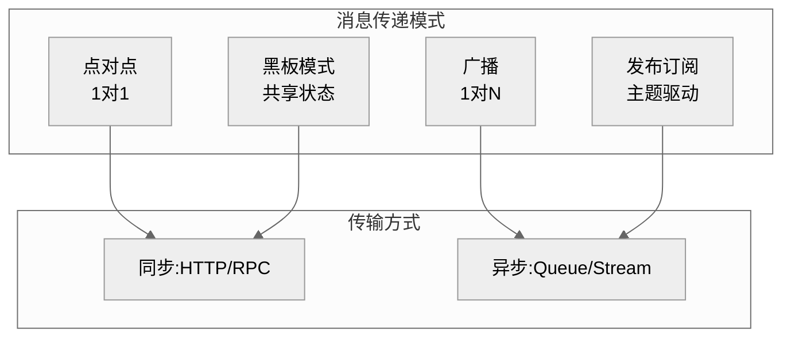

| 传递模式 | 机制 | 适用场景 | 代表实现 |
|----------|------|----------|----------|
| **点对点** | 发送者直接发给指定接收者 | 请求-回复、明确目标 | LangGraph 边、AutoGen initiate_chat |
| **广播** | 发给所有 Agent | 全局通知、状态同步 | GroupChat 群发 |
| **发布订阅** | 按主题订阅，匹配者接收 | 事件驱动、解耦 | Kafka 主题、Event Bus |
| **黑板模式** | 写入共享 State，其他 Agent 读取 | 异步协作、状态共享 | LangGraph Shared State |

**通信总线实现**：

```python
import asyncio
from collections import defaultdict
from typing import Callable


class CommunicationBus:
    """Agent 通信总线:支持点对点、广播、发布订阅"""

    def __init__(self):
        self.agents: dict[str, Callable] = {}          # agent_id -> handler
        self.subscriptions: dict[str, list[str]] = defaultdict(list)  # topic -> [agent_ids]
        self.blackboard: dict = {}                     # 共享黑板状态

    def register(self, agent_id: str, handler: Callable):
        """注册 Agent"""
        self.agents[agent_id] = handler

    def subscribe(self, topic: str, agent_id: str):
        """订阅主题"""
        self.subscriptions[topic].append(agent_id)

    async def send_point_to_point(self, message: AgentMessage):
        """点对点发送"""
        handler = self.agents.get(message.receiver)
        if handler:
            await handler(message)

    async def broadcast(self, message: AgentMessage):
        """广播给所有 Agent"""
        tasks = [handler(message) for handler in self.agents.values()
                 if handler != self.agents.get(message.sender)]
        await asyncio.gather(*tasks)

    async def publish(self, topic: str, message: AgentMessage):
        """发布订阅模式"""
        subscribers = self.subscriptions.get(topic, [])
        tasks = [self.agents[aid](message) for aid in subscribers
                 if aid != message.sender]
        await asyncio.gather(*tasks)

    def write_blackboard(self, key: str, value):
        """写入共享黑板"""
        self.blackboard[key] = value

    def read_blackboard(self, key: str):
        """读取共享黑板"""
        return self.blackboard.get(key)
```

### 7.3 多 Agent 协同工作策略

#### 7.3.1 五种协同模式

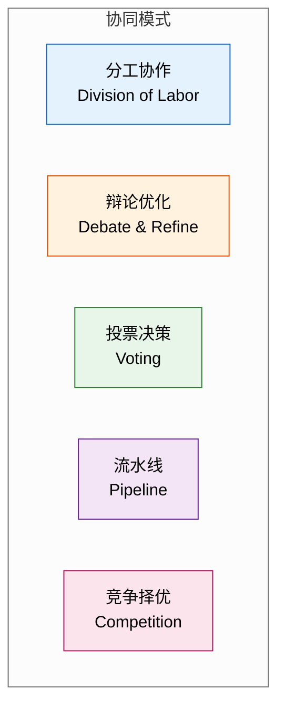

| 协同模式 | 机制 | 适用场景 | 示例 |
|----------|------|----------|------|
| **分工协作** | 按领域分解任务，各 Agent 独立完成子任务 | 任务可分解、领域明确 | PM+Dev+QA 协作开发 |
| **辩论优化** | 多 Agent 对同一问题给出方案，互相质疑优化 | 方案需严谨、避免单点偏差 | 多专家辩论架构选型 |
| **投票决策** | 多 Agent 各自决策，多数表决 | 决策需共识、降低风险 | 多模型投票分类 |
| **流水线** | Agent 串行处理，前序输出作为后序输入 | 流程明确的任务链 | 调研→设计→编码→测试 |
| **竞争择优** | 多 Agent 竞争同一任务，选最优结果 | 需要最优解、资源充足 | 多模型生成代码选最优 |

#### 7.3.2 任务分配方法

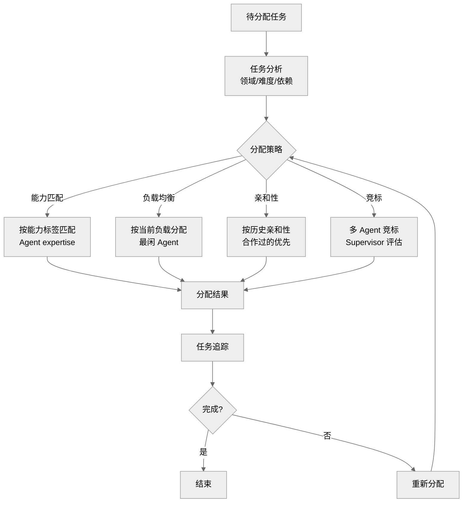

| 分配方法 | 原理 | 优点 | 缺点 |
|----------|------|------|------|
| **能力匹配** | 按任务领域标签匹配 Agent 专长 | 专业性强 | 需维护能力标签 |
| **负载均衡** | 分配给当前最闲的 Agent | 资源利用率高 | 可能分配给非专家 |
| **亲和性** | 优先分配给合作过的 Agent | 减少磨合成本 | 易形成小团体 |
| **竞标制** | 多 Agent 提交方案，Supervisor 评估 | 选最优 | 通信开销大 |
| **静态分配** | 预定义任务-Agent 映射 | 简单可控 | 不灵活 |

**能力匹配实现**：

```python
from dataclasses import dataclass


@dataclass
class AgentCapability:
    """Agent 能力标签"""
    agent_id: str
    expertise: list[str]      # 专长领域,如 ["python", "frontend"]
    capacity: int             # 当前剩余容量(0-100)
    success_rate: float       # 历史成功率


class TaskAllocator:
    """任务分配器:能力匹配 + 负载均衡"""

    def __init__(self, agents: list[AgentCapability]):
        self.agents = agents

    def allocate(self, task: dict) -> str:
        """分配任务给最合适的 Agent"""
        required_skills = task.get("required_skills", [])
        candidates = []

        for agent in self.agents:
            # 计算能力匹配度
            skill_overlap = len(
                set(required_skills) & set(agent.expertise)
            ) / max(len(required_skills), 1)

            # 综合分 = 能力匹配 × 成功率 × 剩余容量
            score = (
                skill_overlap * 0.5
                + agent.success_rate * 0.3
                + (agent.capacity / 100) * 0.2
            )
            candidates.append((agent.agent_id, score))

        # 选最高分
        candidates.sort(key=lambda x: -x[1])
        return candidates[0][0] if candidates else None
```

#### 7.3.3 冲突解决机制

**冲突类型**：

| 冲突类型 | 表现 | 示例 |
|----------|------|------|
| **结果冲突** | 多 Agent 给出不同结果 | A 说用 React，B 说用 Vue |
| **资源冲突** | 多 Agent 争抢同一资源 | 同时写同一文件 |
| **目标冲突** | Agent 目标互相矛盾 | A 要快，B 要全 |
| **依赖冲突** | Agent 间依赖死锁 | A 等 B，B 等 A |

**冲突解决策略**：

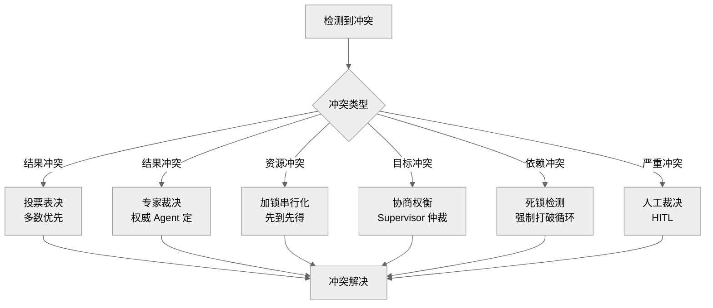

| 解决策略 | 适用场景 | 实现方式 |
|----------|----------|----------|
| **投票表决** | 结果冲突，多 Agent 决策 | 多数优先，平局时权威 Agent 决定 |
| **专家裁决** | 需专业判断的冲突 | 指定领域专家 Agent 最终决策 |
| **优先级** | 资源冲突 | 按 Agent 优先级抢占 |
| **加锁串行** | 写操作冲突 | 分布式锁，先到先得 |
| **协商** | 目标冲突 | Agent 互相让步达成共识 |
| **死锁检测** | 依赖冲突 | 超时强制打破循环依赖 |
| **人工裁决** | 严重冲突无法自动解决 | HITL 中断，人工决定 |

**投票决策实现**：

```python
from collections import Counter


class ConflictResolver:
    """冲突解决器"""

    def __init__(self, authority_agent: str = None):
        self.authority = authority_agent  # 权威 Agent(平局裁决)

    def vote(self, proposals: dict[str, Any]) -> Any:
        """投票表决:proposals = {agent_id: proposal}"""
        proposal_counts = Counter(
            str(p) for p in proposals.values()
        )
        winner, count = proposal_counts.most_common(1)[0]

        if count > len(proposals) / 2:
            # 多数通过
            return eval(winner)

        # 平局:权威 Agent 决定
        if self.authority and self.authority in proposals:
            return proposals[self.authority]

        # 无权威:选第一个
        return list(proposals.values())[0]

    def negotiate(self, positions: dict[str, dict]) -> dict:
        """协商:positions = {agent_id: {position, priority}}"""
        # 按优先级排序,高优先级立场优先采纳
        sorted_agents = sorted(
            positions.items(),
            key=lambda x: -x[1].get("priority", 0)
        )
        # 合并立场(各取高优先级部分)
        result = {}
        for _, pos in sorted_agents:
            for key, value in pos["position"].items():
                if key not in result:  # 未决定的字段采纳
                    result[key] = value
        return result
```

#### 7.3.4 性能优化方案

| 优化维度 | 方案 | 效果 |
|----------|------|------|
| **并行化** | 无依赖任务并行执行 | 延迟降低 50%+ |
| **缓存复用** | Agent 中间结果缓存 | 重复计算零开销 |
| **分级路由** | 简单任务用轻量 Agent，复杂用专家 Agent | 成本降低 40% |
| **上下文隔离** | 各 Agent 上下文独立，避免互相污染 | Token 减少 30% |
| **批处理** | 多用户请求合并处理 | 吞吐量提升 3 倍 |
| **异步流水线** | Agent 间异步传递，避免阻塞等待 | 资源利用率提升 |
| **结果流式** | 边生成边传递，不等全部完成 | 用户体感延迟降低 |

**并行任务调度实现**：

```python
import asyncio
from typing import Any


class ParallelOrchestrator:
    """并行编排器:无依赖任务并行执行"""

    async def execute_dag(self, task_dag: dict[str, dict]) -> dict[str, Any]:
        """执行任务 DAG:task_dag = {task_id: {agent, deps: []}}"""
        results: dict[str, Any] = {}
        completed: set = set()
        pending = set(task_dag.keys())

        while pending:
            # 找出所有依赖已完成的任务
            ready = [
                t for t in pending
                if all(d in completed for d in task_dag[t].get("deps", []))
            ]
            if not ready:
                raise RuntimeError("检测到死锁:存在循环依赖")

            # 并行执行所有就绪任务
            tasks = [
                self._execute_single(task_dag[t], results)
                for t in ready
            ]
            task_results = await asyncio.gather(*tasks)

            # 收集结果
            for task_id, result in zip(ready, task_results):
                results[task_id] = result
                completed.add(task_id)
                pending.remove(task_id)

        return results

    async def _execute_single(self, task: dict, context: dict) -> Any:
        """执行单个任务"""
        agent = task["agent"]
        # 注入依赖结果作为上下文
        dep_results = {d: context[d] for d in task.get("deps", [])}
        return await agent.execute(task["input"], dep_results)
```

### 7.4 典型应用场景分析

#### 7.4.1 场景一：软件开发多 Agent 协作

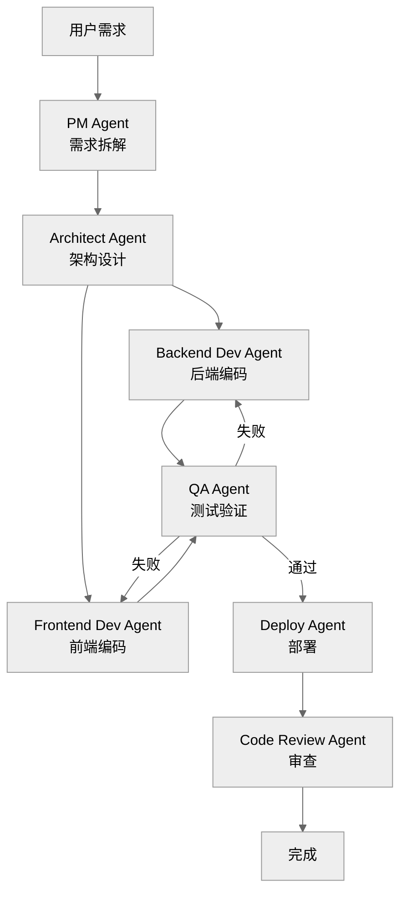

| Agent 角色 | 职责 | 工具 |
|-----------|------|------|
| PM Agent | 需求澄清、任务拆解、验收标准 | 文档分析 |
| Architect Agent | 技术选型、架构设计 | 架构模板 |
| Backend/Frontend Dev | 代码实现 | 代码生成、IDE |
| QA Agent | 测试用例、执行验证 | 测试框架 |
| Deploy Agent | 部署配置、环境管理 | CI/CD |
| Code Review Agent | 代码审查、规范检查 | Linter |

**协作流程**：PM 拆解需求 → Architect 设计 → Dev 并行编码 → QA 验证（失败回流）→ Deploy → Review。

#### 7.4.2 场景二：投研报告多 Agent 协作

| Agent 角色 | 职责 | 协同方式 |
|-----------|------|----------|
| 行业分析 Agent | 收集行业数据 | 分工协作 |
| 财务分析 Agent | 分析财报数据 | 分工协作 |
| 估值模型 Agent | 建立估值模型 | 分工协作 |
| 辩论 Agent A/B | 多空辩论 | 辩论优化 |
| 主笔 Agent | 综合撰写报告 | 流水线 |
| 审稿 Agent | 质量审核 | 投票决策 |

#### 7.4.3 场景三：客服多 Agent 协作

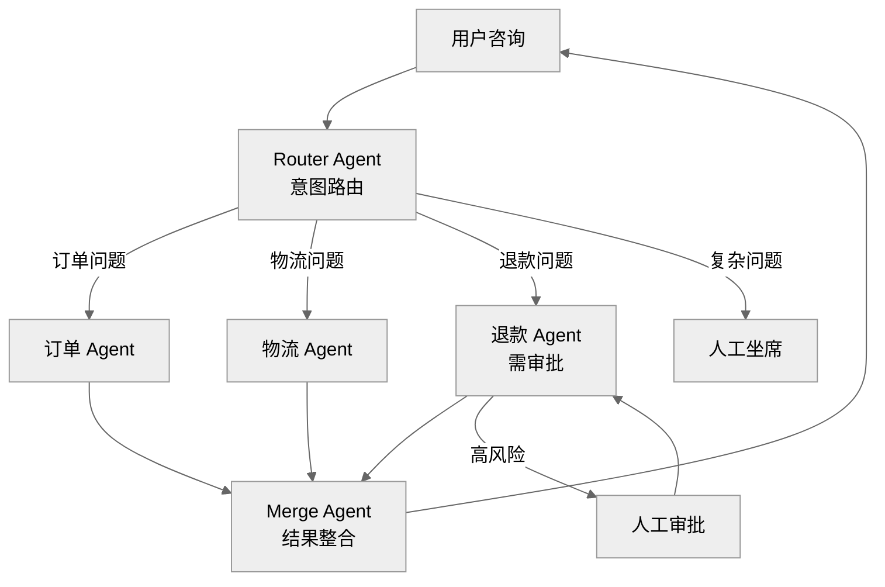

**协作要点**：
- Router Agent 做意图分类，路由到专业 Agent
- 专业 Agent 独立处理，结果由 Merge Agent 整合
- 退款等高风险操作触发 HITL 人工审批

### 7.5 框架对多 Agent 的支持对比

| 能力 | LangChain | LangGraph | AutoGen |
|------|-----------|-----------|---------|
| **多 Agent 架构** | 弱 | Supervisor/层级/网络 | GroupChat/Network |
| **通信机制** | 显式传参 | 共享 State + 边 | 自然语言对话 |
| **任务分配** | 自实现 | 条件边路由 | Manager 调度 |
| **冲突解决** | 自实现 | Supervisor 仲裁 | Manager 裁决 |
| **并行执行** | LCEL batch | 并行分支 | GroupChat 多 Agent |
| **状态共享** | 弱 | Shared State 原生 | 对话历史共享 |
| **HITL** | 自实现 | interrupt() 原生 | UserProxyAgent |
| **适用规模** | 2-3 Agent | 任意规模 | 3-10 Agent |

### 7.6 多 Agent 系统设计最佳实践

| 实践 | 说明 |
|------|------|
| **角色明确** | 每个 Agent 有清晰职责边界，避免重叠 |
| **接口标准化** | Agent 间用标准消息格式通信，降低耦合 |
| **无状态优先** | Agent 尽量无状态，状态集中管理 |
| **幂等设计** | Agent 执行可重试，避免副作用重复 |
| **超时保护** | 每个 Agent 设置超时，避免阻塞全局 |
| **可观测** | 全链路 trace_id，每步通信可追溯 |
| **渐进式复杂度** | 从 Supervisor 模式起步，按需升级网络模式 |
| **成本控制** | 分级路由（简单用 mini，复杂用完整模型） |

---

## 八、总结

| 框架 | 一句话定位 | 核心价值 | 最佳场景 |
|------|-----------|----------|----------|
| **LangChain** | 通用 LLM 应用框架 | 生态丰富，组件齐全 | RAG、简单 Agent、快速原型 |
| **LangGraph** | 有状态 Agent 编排框架 | 可控、可恢复、可审计 | 复杂工作流、HITL、生产级 Agent |
| **AutoGen** | 多 Agent 对话框架 | 多角色协作，代码执行 | 多专家协作、代码生成与验证 |

**选型口诀**：
> **简单 RAG 用 Chain，复杂流程用 Graph，多 Agent 用 AutoGen。**
