# AI Agent 记忆机制面试专项

> 本文档系统阐述 AI Agent 记忆机制的核心概念、分类体系、实现技术、优化策略及面试高频问题，专为 Agent 相关岗位面试准备。

---

## 目录

- [1. 基本概念与理论基础](#1-基本概念与理论基础)
  - [1.1 什么是 Agent 记忆机制](#11-什么是-agent-记忆机制)
  - [1.2 为什么 Agent 需要记忆](#12-为什么-agent-需要记忆)
  - [1.3 记忆机制的理论基础](#13-记忆机制的理论基础)
- [2. 记忆机制主要分类](#2-记忆机制主要分类)
  - [2.1 分类总览](#21-分类总览)
  - [2.2 短期记忆（Short-Term Memory）](#22-短期记忆short-term-memory)
  - [2.3 长期记忆（Long-Term Memory）](#23-长期记忆long-term-memory)
  - [2.4 情景记忆（Episodic Memory）](#24-情景记忆episodic-memory)
  - [2.5 语义记忆（Semantic Memory）](#25-语义记忆semantic-memory)
  - [2.6 程序记忆（Procedural Memory）](#26-程序记忆procedural-memory)
  - [2.7 各类记忆对比](#27-各类记忆对比)
- [3. 常见实现技术](#3-常见实现技术)
  - [3.1 技术全景图](#31-技术全景图)
  - [3.2 向量数据库与嵌入检索](#32-向量数据库与嵌入检索)
  - [3.3 知识图谱记忆](#33-知识图谱记忆)
  - [3.4 注意力机制与上下文窗口](#34-注意力机制与上下文窗口)
  - [3.5 强化学习记忆回放](#35-强化学习记忆回放)
  - [3.6 摘要压缩技术](#36-摘要压缩技术)
- [4. 记忆系统三大优化策略](#4-记忆系统三大优化策略)
  - [4.1 容量优化策略](#41-容量优化策略)
  - [4.2 检索效率优化策略](#42-检索效率优化策略)
  - [4.3 遗忘机制优化策略](#43-遗忘机制优化策略)
- [5. 典型应用场景分析](#5-典型应用场景分析)
- [6. 当前研究进展](#6-当前研究进展)
- [7. 面试高频提问及参考答案](#7-面试高频提问及参考答案)
- [8. 参考文献](#8-参考文献)

---

## 1. 基本概念与理论基础

### 1.1 什么是 Agent 记忆机制

**定义**：Agent 记忆机制是指 AI 智能体获取、存储、组织和检索信息的系统化方法，使 Agent 能够利用历史经验、上下文信息和积累的知识来指导当前的感知、推理和决策。

**核心能力**：
- **信息留存**：跨时间尺度保存交互信息
- **经验复用**：利用历史经验优化当前决策
- **上下文维持**：在多轮交互中保持连贯性
- **知识积累**：从交互中持续学习和进化

### 1.2 为什么 Agent 需要记忆

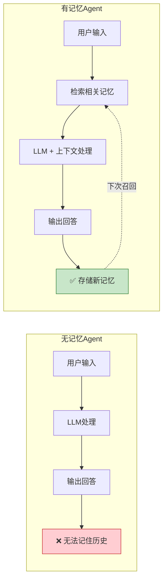

| 问题场景 | 无记忆的表现 | 有记忆的解决 |
|---------|-------------|-------------|
| 多轮对话 | 每轮独立，前后矛盾 | 保持话题连贯性 |
| 个性化服务 | 所有用户相同回答 | 基于用户偏好定制 |
| 长期任务 | 无法跟踪任务进度 | 记住中间状态和进展 |
| 错误学习 | 重复犯同样错误 | 从历史失败中学习 |
| 知识积累 | 无法沉淀经验 | 持续构建知识库 |

### 1.3 记忆机制的理论基础

**认知科学基础**：Agent 记忆机制的设计灵感来源于人类认知心理学中的记忆模型——**Atkinson-Shiffrin 多重存储模型**：

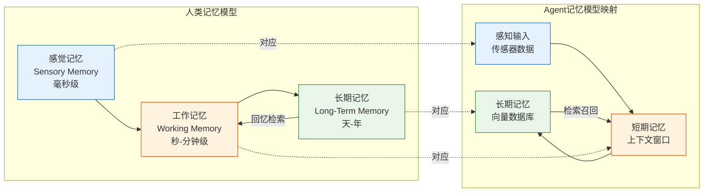

**三个关键理论**：
1. **编码（Encoding）**：将感知信息转化为可存储的表示
2. **存储（Storage）**：在不同记忆系统中保持信息
3. **检索（Retrieval）**：根据当前需求召回相关记忆

---

## 2. 记忆机制主要分类

### 2.1 分类总览

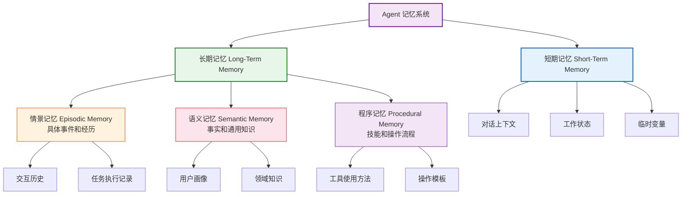

### 2.2 短期记忆（Short-Term Memory）

#### 定义
短期记忆是 Agent 在当前会话中临时保存的信息，类似于人类的"工作记忆"，容量有限，生命周期短。

#### 核心特征

| 特征 | 说明 |
|------|------|
| **存储内容** | 当前对话上下文、中间推理结果、临时变量 |
| **容量限制** | 受 LLM 上下文窗口限制（如 4K-128K tokens） |
| **生命周期** | 会话级别，会话结束后清除 |
| **访问速度** | 最快，直接在 Prompt 中引用 |
| **实现方式** | 内存对象、Redis、对话历史列表 |

#### 代码示例

```java
// 短期记忆实现：基于会话的对话历史管理
public class ShortTermMemory {

    // 每个会话维护一个消息列表
    private final Map<String, LinkedList<ChatMessage>> sessionMessages = new ConcurrentHashMap<>();
    private final int maxTokens = 4096;  // 上下文窗口限制

    /**
     * 添加消息到短期记忆
     */
    public void addMessage(String sessionId, ChatMessage message) {
        sessionMessages.computeIfAbsent(sessionId, k -> new LinkedList<>()).add(message);
        // 超过容量时触发压缩或淘汰
        ensureCapacity(sessionId);
    }

    /**
     * 获取当前会话的上下文（用于构造 Prompt）
     */
    public String getContext(String sessionId) {
        LinkedList<ChatMessage> messages = sessionMessages.get(sessionId);
        if (messages == null || messages.isEmpty()) {
            return "";
        }
        return messages.stream()
            .map(ChatMessage::format)
            .collect(Collectors.joining("\n"));
    }

    /**
     * 容量控制：超出窗口时压缩旧消息
     */
    private void ensureCapacity(String sessionId) {
        LinkedList<ChatMessage> messages = sessionMessages.get(sessionId);
        int totalTokens = estimateTokens(messages);
        while (totalTokens > maxTokens && messages.size() > 2) {
            // 移除最早的消息，可选择性摘要后存入长期记忆
            ChatMessage removed = messages.removeFirst();
            totalTokens = estimateTokens(messages);
        }
    }
}
```

### 2.3 长期记忆（Long-Term Memory）

#### 定义
长期记忆是 Agent 跨会话持久化存储的信息，容量大、生命周期长，是 Agent 积累知识和经验的核心载体。

#### 核心特征

| 特征 | 说明 |
|------|------|
| **存储内容** | 历史交互、用户偏好、领域知识、技能模板 |
| **容量限制** | 理论上无限（受存储系统限制） |
| **生命周期** | 永久，需主动遗忘或更新 |
| **访问速度** | 较慢，需要检索过程 |
| **实现方式** | 向量数据库、知识图谱、关系数据库 |

### 2.4 情景记忆（Episodic Memory）

#### 定义
情景记忆存储 Agent 经历的**具体事件和交互序列**，包括时间、地点、参与者、行为和结果等上下文信息。

#### 特点
- **时序性**：记录事件发生的时间顺序
- **情境性**：包含完整的上下文细节
- **一次性**：每个事件通常是独特的

#### 代码示例

```java
// 情景记忆：记录和检索交互事件
public class EpisodicMemory {

    private final VectorStore vectorStore;  // 向量数据库

    /**
     * 记录一个交互事件
     */
    public void recordEpisode(Episode episode) {
        // 构造记忆条目：时间戳 + 事件描述 + 上下文 + 结果
        MemoryEntry entry = MemoryEntry.builder()
            .type("episodic")
            .timestamp(Instant.now())
            .sessionId(episode.getSessionId())
            .content(episode.getDescription())       // "用户询问了北京天气，我调用了天气API返回了结果"
            .context(episode.getContext())           // 对话上下文
            .action(episode.getAction())             // 执行的动作
            .outcome(episode.getOutcome())           // 执行结果
            .embedding(embed(episode.getDescription()))  // 向量表示
            .build();

        vectorStore.add(entry);
    }

    /**
     * 检索相似的历史事件
     */
    public List<Episode> recallSimilar(String query, int topK) {
        float[] queryVector = embed(query);
        return vectorStore.similaritySearch(queryVector, topK)
            .stream()
            .map(this::toEpisode)
            .sorted(Comparator.comparing(Episode::getTimestamp).reversed())  // 按时间倒序
            .toList();
    }
}
```

### 2.5 语义记忆（Semantic Memory）

#### 定义
语义记忆存储**事实、概念和通用知识**，不依赖于具体的获取情境，是 Agent 的"知识库"。

#### 特点
- **抽象性**：去除了情境细节的通用知识
- **结构性**：通常以结构化形式组织（如知识图谱）
- **持久性**：相对稳定，不频繁变化

#### 代码示例

```java
// 语义记忆：基于知识图谱的事实存储
public class SemanticMemory {

    private final KnowledgeGraph kg;

    /**
     * 存储一个事实三元组：(主体, 关系, 客体)
     */
    public void storeFact(String subject, String relation, String object) {
        // 例：("张三", "职业", "软件工程师")
        // 例：("Python", "属于", "编程语言")
        kg.addTriple(subject, relation, object);
    }

    /**
     * 查询知识
     */
    public List<String> query(String subject, String relation) {
        return kg.query(subject, relation);
        // 例：query("张三", "职业") → ["软件工程师"]
    }

    /**
     * 多跳推理查询
     */
    public List<String> multiHopQuery(String entity, int hops) {
        return kg.bfsTraversal(entity, hops);
    }
}
```

### 2.6 程序记忆（Procedural Memory）

#### 定义
程序记忆存储 Agent 的**技能、操作流程和工具使用方法**，类似于人类的"肌肉记忆"。

#### 特点
- **操作性**：描述"怎么做"而非"是什么"
- **复用性**：可在不同情境中重复使用
- **渐进性**：可通过练习不断优化

#### 代码示例

```java
// 程序记忆：操作模板和技能存储
public class ProceduralMemory {

    private final Map<String, Procedure> procedures = new ConcurrentHashMap<>();

    /**
     * 注册一个操作流程
     */
    public void registerProcedure(String name, Procedure procedure) {
        // 例：注册"发送邮件"的操作流程
        // 步骤1: 获取收件人地址
        // 步骤2: 撰写邮件内容
        // 步骤3: 调用SMTP API发送
        procedures.put(name, procedure);
    }

    /**
     * 根据任务检索匹配的操作流程
     */
    public Procedure retrieveProcedure(String taskDescription) {
        return procedures.values().stream()
            .filter(p -> p.matches(taskDescription))
            .max(Comparator.comparing(Procedure::getSuccessRate))  // 按成功率排序
            .orElse(null);
    }
}
```

### 2.7 各类记忆对比

| 维度 | 短期记忆 | 情景记忆 | 语义记忆 | 程序记忆 |
|------|---------|---------|---------|---------|
| **时间尺度** | 秒-分钟 | 小时-天 | 天-永久 | 天-永久 |
| **存储内容** | 当前上下文 | 具体事件 | 事实知识 | 操作技能 |
| **容量** | 小（受窗口限制） | 大 | 大 | 中 |
| **检索方式** | 直接引用 | 向量相似检索 | 图谱查询 | 模式匹配 |
| **人类类比** | 工作记忆 | 回忆经历 | 知道事实 | 骑自行车 |
| **实现技术** | 内存/Redis | 向量数据库 | 知识图谱 | 模板库 |
| **遗忘速度** | 快（会话结束） | 中（逐渐模糊） | 慢（稳定保持） | 慢（需要不练习才遗忘） |

---

## 3. 常见实现技术

### 3.1 技术全景图

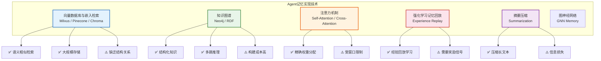

### 3.2 向量数据库与嵌入检索

#### 原理
将文本信息通过 Embedding 模型转化为高维向量，存储在向量数据库中。检索时将查询也向量化，通过余弦相似度找到最相关的记忆。

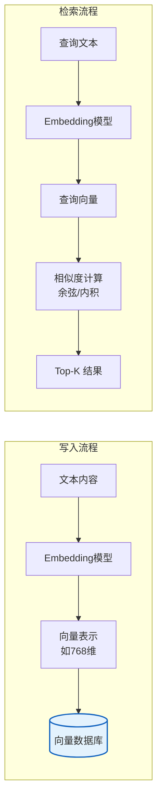

#### 代码示例

```java
// 基于 LangChain4j 的向量记忆实现
public class VectorMemory {

    private final EmbeddingModel embeddingModel;
    private final EmbeddingStore<TextSegment> store;  // 如 MilvusEmbeddingStore

    /**
     * 存储记忆
     */
    public void remember(String content, Map<String, String> metadata) {
        TextSegment segment = TextSegment.from(content);
        // 添加元数据（时间、类型、来源等）
        metadata.forEach((k, v) -> segment.metadata().put(k, v));

        Embedding embedding = embeddingModel.embed(segment.text()).content();
        store.addEmbedding(segment, embedding);
    }

    /**
     * 检索相关记忆
     */
    public List<TextSegment> recall(String query, int maxResults, double minScore) {
        Embedding queryEmbedding = embeddingModel.embed(query).content();

        return store.findRelevant(queryEmbedding, maxResults, minScore)
            .stream()
            .map(EmbeddingMatch::embedded)
            .toList();
    }

    /**
     * 带元数据过滤的检索
     */
    public List<TextSegment> recallWithFilter(String query, String sessionId, int maxResults) {
        Embedding queryEmbedding = embeddingModel.embed(query).content();
        MetadataFilter filter = MetadataFilter.builder()
            .key("sessionId").isEqualTo(sessionId)
            .build();

        return store.findRelevant(queryEmbedding, maxResults, 0.7, filter)
            .stream()
            .map(EmbeddingMatch::embedded)
            .toList();
    }
}
```

### 3.3 知识图谱记忆

#### 原理
将信息组织为实体-关系-实体的图结构，支持结构化查询和多跳推理，适合存储语义记忆。

```java
// 知识图谱记忆实现
public class KnowledgeGraphMemory {

    private final GraphDatabaseService graphDb;

    /**
     * 添加知识三元组
     */
    public void addKnowledge(String subject, String relation, String object) {
        String cypher = """
            MERGE (s:Entity {name: $subject})
            MERGE (o:Entity {name: $object})
            MERGE (s)-[r:RELATION {type: $relation}]->(o)
            """;
        graphDb.execute(cypher, Map.of(
            "subject", subject,
            "relation", relation,
            "object", object
        ));
    }

    /**
     * 多跳查询：查找相关联的知识
     */
    public List<KnowledgeTriple> queryRelated(String entity, int maxHops) {
        String cypher = """
            MATCH path = (e:Entity {name: $entity})-[*1..%d]-(related)
            RETURN path
            LIMIT 50
            """.formatted(maxHops);

        return graphDb.execute(cypher, Map.of("entity", entity))
            .stream()
            .map(this::extractTriples)
            .flatMap(List::stream)
            .toList();
    }
}
```

### 3.4 注意力机制与上下文窗口

#### 原理
利用 Transformer 的自注意力机制，在当前上下文窗口内对不同位置的信息分配不同权重，实现"软记忆"。

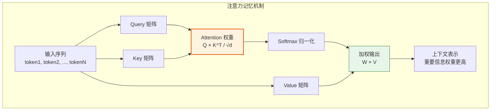

**局限性**：注意力机制受限于上下文窗口大小，无法处理超出窗口的长程依赖。

### 3.5 强化学习记忆回放

#### 原理
将 Agent 的交互经验（状态、动作、奖励、下一状态）存储在经验回放池中，通过随机采样批量训练，提高样本效率。

```java
// 经验回放记忆实现
public class ExperienceReplayMemory {

    private final Queue<Experience> replayBuffer = new LinkedList<>();
    private final int maxSize = 10000;

    /**
     * 存储一条经验
     */
    public void add(Experience experience) {
        if (replayBuffer.size() >= maxSize) {
            replayBuffer.poll();  // 移除最旧的
        }
        replayBuffer.offer(experience);
    }

    /**
     * 随机采样一批经验用于训练
     */
    public List<Experience> sample(int batchSize) {
        List<Experience> all = new ArrayList<>(replayBuffer);
        Collections.shuffle(all);
        return all.subList(0, Math.min(batchSize, all.size()));
    }

    /**
     * 优先经验回放（PER）：按TD误差优先采样
     */
    public List<Experience> prioritizedSample(int batchSize) {
        return replayBuffer.stream()
            .sorted(Comparator.comparingDouble(Experience::getTdError).reversed())
            .limit(batchSize)
            .toList();
    }
}

record Experience(
    String state,      // 当前状态
    String action,     // 执行的动作
    double reward,     // 获得的奖励
    String nextState,  // 转移到的状态
    double tdError     // TD误差（用于优先回放）
) {}
```

### 3.6 摘要压缩技术

#### 原理
当对话历史超过上下文窗口时，通过 LLM 对旧消息进行摘要压缩，保留关键信息，丢弃冗余细节。

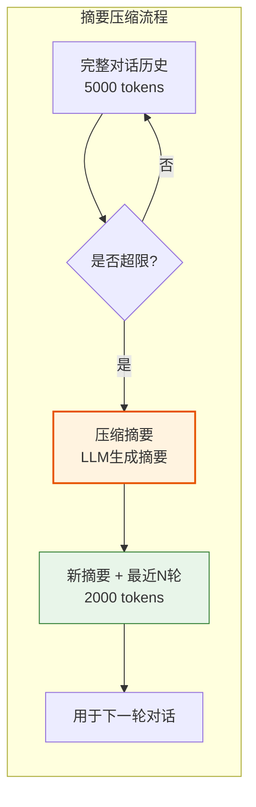

```java
// 摘要压缩实现
public class MemoryCompressor {

    private final ChatLanguageModel model;
    private final int maxContextTokens = 4096;
    private final int keepRecentMessages = 5;  // 保留最近5轮原文

    /**
     * 压缩对话历史
     */
    public String compressIfNeeded(List<ChatMessage> messages) {
        int totalTokens = estimateTokens(messages);
        if (totalTokens <= maxContextTokens) {
            return formatMessages(messages);
        }

        // 分离：旧消息（需压缩）+ 新消息（保留原文）
        int splitIdx = messages.size() - keepRecentMessages;
        List<ChatMessage> oldMessages = messages.subList(0, splitIdx);
        List<ChatMessage> recentMessages = messages.subList(splitIdx, messages.size());

        // 对旧消息生成摘要
        String summary = summarize(oldMessages);

        // 组合：摘要 + 最近消息
        return "## 对话摘要\n" + summary + "\n\n## 最近对话\n" + formatMessages(recentMessages);
    }

    private String summarize(List<ChatMessage> oldMessages) {
        String prompt = """
            请将以下对话历史压缩为简洁摘要，保留关键信息：
            1. 用户的核心需求和偏好
            2. 已讨论的重要内容
            3. 未解决的问题

            对话历史：
            %s
            """.formatted(formatMessages(oldMessages));

        return model.generate(prompt).content().text();
    }
}
```

---

## 4. 记忆系统三大优化策略

### 4.1 容量优化策略

#### 核心目标：在有限的存储和上下文窗口内，最大化有效信息密度

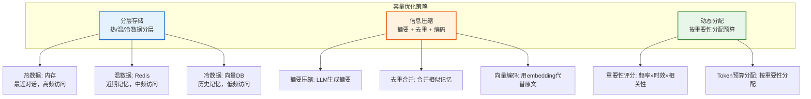

#### 代码示例

```java
// 容量优化：基于重要性的动态记忆管理
public class CapacityOptimizer {

    /**
     * 计算记忆条目的重要性评分
     */
    public double calculateImportance(MemoryEntry entry) {
        double frequencyScore = Math.log(1 + entry.getAccessCount());  // 访问频率
        double recencyScore = Math.exp(-daysSince(entry.getLastAccess()) / 7.0);  // 时间衰减
        double relevanceScore = entry.getRelevanceScore();  // 语义相关性
        double emotionalScore = entry.getEmotionalWeight();  // 情感权重

        // 加权综合评分
        return 0.3 * frequencyScore + 0.3 * recencyScore
             + 0.2 * relevanceScore + 0.2 * emotionalScore;
    }

    /**
     * 容量控制：保留最重要的记忆
     */
    public List<MemoryEntry> optimizeCapacity(List<MemoryEntry> memories, int budget) {
        return memories.stream()
            .sorted(Comparator.comparingDouble(this::calculateImportance).reversed())
            .limit(budget)
            .toList();
    }

    /**
     * 相似记忆合并
     */
    public List<MemoryEntry> mergeSimilar(List<MemoryEntry> memories, double threshold) {
        List<MemoryEntry> merged = new ArrayList<>();
        for (MemoryEntry m : memories) {
            boolean isDuplicate = merged.stream()
                .anyMatch(existing -> cosineSimilarity(m.getEmbedding(), existing.getEmbedding()) > threshold);
            if (!isDuplicate) {
                merged.add(m);
            } else {
                // 合并到已有记忆，更新访问计数和时间
                mergeInto(existing, m);
            }
        }
        return merged;
    }
}
```

### 4.2 检索效率优化策略

#### 核心目标：快速准确地从大规模记忆库中检索出最相关的信息

```mermaid
graph TB
    subgraph 检索效率优化
        B1[索引优化<br/>HNSW / IVF / PQ]
        B2[混合检索<br/>向量 + 关键词 + 元数据]
        B3[缓存策略<br/>热门查询缓存]
    end

    B1 --> B1a[HNSW: 图索引，O(logN)查询]
    B1 --> B1b[IVF: 聚类索引，减少搜索范围]
    B1 --> B1c[PQ: 乘积量化，压缩存储]

    B2 --> B2a[向量检索: 语义相似]
    B2 --> B2b[BM25: 关键词匹配]
    B2 --> B2c[元数据过滤: 精确条件]

    B3 --> B3a[查询结果缓存]
    B3 --> B3b[预计算热门查询]

    style B1 fill:#e3f2fd,stroke:#1565c0,stroke-width:2px
    style B2 fill:#fff3e0,stroke:#e65100,stroke-width:2px
    style B3 fill:#e8f5e9,stroke:#2e7d32,stroke-width:2px
```

#### 代码示例

```java
// 检索效率优化：混合检索实现
public class RetrievalOptimizer {

    private final VectorStore vectorStore;
    private final FullTextSearchEngine ftSearch;  // 全文检索引擎
    private final Cache<String, List<MemoryEntry>> queryCache;

    /**
     * 混合检索：向量 + 关键词 + 元数据
     */
    public List<MemoryEntry> hybridRetrieve(String query, RetrieveConfig config) {
        // 1. 检查缓存
        String cacheKey = buildCacheKey(query, config);
        List<MemoryEntry> cached = queryCache.getIfPresent(cacheKey);
        if (cached != null) return cached;

        // 2. 并行执行多种检索
        CompletableFuture<List<MemoryEntry>> vectorFuture = CompletableFuture.supplyAsync(() ->
            vectorStore.similaritySearch(embed(query), config.getTopK() * 2)
        );

        CompletableFuture<List<MemoryEntry>> keywordFuture = CompletableFuture.supplyAsync(() ->
            ftSearch.search(query, config.getTopK() * 2)
        );

        // 3. 合并结果，RRF（Reciprocal Rank Fusion）融合排序
        List<MemoryEntry> merged = rrfFusion(
            vectorFuture.join(),
            keywordFuture.join()
        );

        // 4. 元数据过滤
        List<MemoryEntry> filtered = merged.stream()
            .filter(m -> matchMetadata(m, config.getFilters()))
            .toList();

        // 5. 重排序（Cross-Encoder 精排）
        List<MemoryEntry> reranked = rerank(query, filtered, config.getTopK());

        // 6. 写入缓存
        queryCache.put(cacheKey, reranked);
        return reranked;
    }

    /**
     * RRF 融合排序
     */
    private List<MemoryEntry> rrfFusion(List<MemoryEntry>... lists) {
        Map<String, Double> scores = new HashMap<>();
        int k = 60;  // RRF 常数

        for (List<MemoryEntry> list : lists) {
            for (int i = 0; i < list.size(); i++) {
                String id = list.get(i).getId();
                scores.merge(id, 1.0 / (k + i + 1), Double::sum);
            }
        }

        return scores.entrySet().stream()
            .sorted(Map.Entry.<String, Double>comparingByValue().reversed())
            .map(e -> findById(e.getKey()))
            .toList();
    }
}
```

### 4.3 遗忘机制优化策略

#### 核心目标：主动遗忘无用或过时信息，保持记忆质量和系统效率

```mermaid
graph TB
    subgraph 遗忘机制
        C1[自然衰减<br/>时间驱动的记忆淡化]
        C2[干扰遗忘<br/>相似记忆覆盖]
        C3[主动遗忘<br/>基于策略的删除]
    end

    C1 --> C1a[指数衰减: importance *= e^(-λt)]
    C1 --> C1b[定期清理: 低于阈值则遗忘]

    C2 --> C2a[前向干扰: 旧记忆影响新学习]
    C2 --> C2b[后向干扰: 新信息覆盖旧记忆]

    C3 --> C3a[容量驱动: 超限时淘汰最不重要]
    C3 --> C3b[质量驱动: 删除低质量/错误记忆]
    C3 --> C3c[隐私驱动: 敏感信息定期删除]

    style C1 fill:#e3f2fd,stroke:#1565c0,stroke-width:2px
    style C2 fill:#fff3e0,stroke:#e65100,stroke-width:2px
    style C3 fill:#e8f5e9,stroke:#2e7d32,stroke-width:2px
```

#### 代码示例

```java
// 遗忘机制实现
public class ForgettingManager {

    private static final double DECAY_RATE = 0.01;   // 每天衰减1%
    private static final double FORGET_THRESHOLD = 0.1;  // 低于此值则遗忘

    /**
     * 自然衰减：每天更新记忆强度
     */
    @Scheduled(cron = "0 0 3 * * *")  // 每天凌晨3点执行
    public void naturalDecay() {
        List<MemoryEntry> allMemories = memoryStore.findAll();
        for (MemoryEntry m : allMemories) {
            // 艾宾浩斯遗忘曲线启发式衰减
            double daysSinceCreation = daysSince(m.getCreatedAt());
            double retention = Math.exp(-DECAY_RATE * daysSinceCreation);

            // 每次访问会增强记忆（间隔重复效应）
            double accessBoost = Math.log(1 + m.getAccessCount()) * 0.1;
            double strength = retention + accessBoost;

            m.setStrength(strength);

            if (strength < FORGET_THRESHOLD) {
                memoryStore.delete(m.getId());  // 主动遗忘
            } else {
                memoryStore.update(m);
            }
        }
    }

    /**
     * 干扰遗忘：合并高度相似的记忆
     */
    public void interferenceForgetting() {
        List<MemoryEntry> memories = memoryStore.findAll();
        for (int i = 0; i < memories.size(); i++) {
            for (int j = i + 1; j < memories.size(); j++) {
                double similarity = cosineSimilarity(
                    memories.get(i).getEmbedding(),
                    memories.get(j).getEmbedding()
                );
                if (similarity > 0.95) {
                    // 保留重要性更高的，遗忘另一个
                    MemoryEntry keep = memories.get(i).getImportance() > memories.get(j).getImportance()
                        ? memories.get(i) : memories.get(j);
                    MemoryEntry forget = keep == memories.get(i) ? memories.get(j) : memories.get(i);
                    memoryStore.delete(forget.getId());
                }
            }
        }
    }

    /**
     * 主动遗忘：基于策略的清理
     */
    public void activeForgetting(ForgettingPolicy policy) {
        switch (policy.getType()) {
            case CAPACITY_BASED -> forgetByCapacity(policy.getMaxCapacity());
            case QUALITY_BASED -> forgetByQuality(policy.getMinQuality());
            case PRIVACY_BASED -> forgetByPrivacy(policy.getRetentionDays());
            case EXPIRATION -> forgetByExpiration(policy.getTtlDays());
        }
    }
}
```

---

## 5. 典型应用场景分析

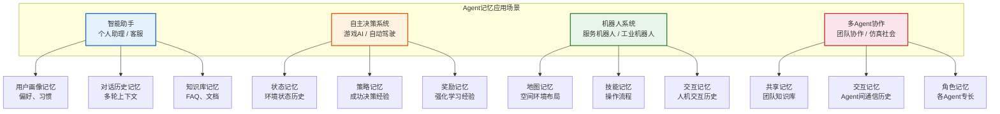

### 场景详解

| 场景 | 记忆类型 | 技术方案 | 关键挑战 |
|------|---------|---------|---------|
| **智能助手** | 短期+长期 | 向量DB存储用户偏好，摘要压缩对话历史 | 隐私保护、个性化精度 |
| **游戏AI** | 情景+程序 | 经验回放池，策略网络记忆 | 实时性、策略多样性 |
| **服务机器人** | 语义+程序 | SLAM地图记忆，操作模板库 | 空间精度、动态环境 |
| **多Agent协作** | 共享+交互 | 分布式记忆共享，消息队列 | 一致性、通信开销 |

---

## 6. 当前研究进展

### 6.1 重要研究成果

| 研究方向 | 代表工作 | 核心贡献 |
|---------|---------|---------|
| **Agent 记忆框架** | MemGPT (2023) | 操作系统式记忆管理，虚拟上下文管理 |
| **长期记忆** | Generative Agents (2023) | 斯坦福小镇，记忆流+反思+规划 |
| **记忆增强** | RETRO (DeepMind) | 检索增强的Transformer，外部记忆库 |
| **情景记忆** | Episodic Memory LLM | 事件序列存储和回放机制 |
| **多模态记忆** | Flamingo / GPT-4V | 跨模态信息存储和检索 |
| **遗忘机制** | Adaptive Forgetting | 基于效用的自适应遗忘策略 |

### 6.2 技术趋势

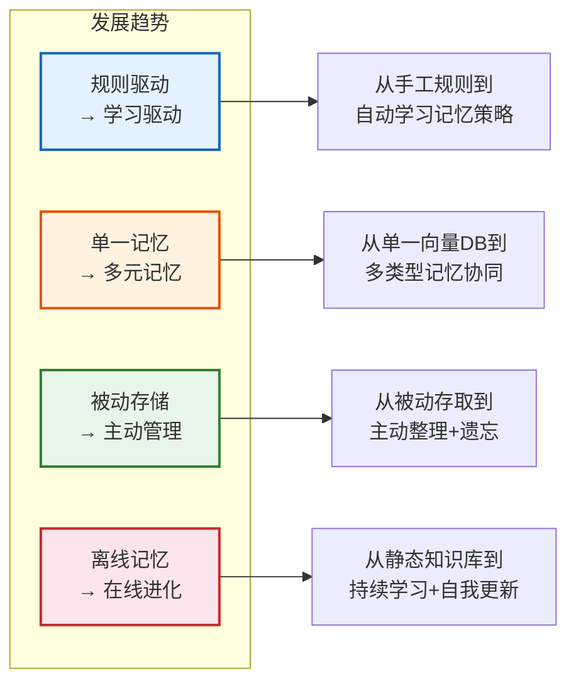

---

## 7. 面试高频提问及参考答案

### Q1：请详细解释 Agent 记忆机制的分类体系

**参考答案**：

Agent 记忆分为**短期记忆**和**长期记忆**两大类，长期记忆进一步分为三种子类型：

1. **短期记忆**：存储当前会话的上下文信息，受 LLM 上下文窗口限制（通常 4K-128K tokens），生命周期为单次会话。实现方式为内存对象或 Redis。

2. **长期记忆**（跨会话持久化）：
   - **情景记忆**：记录具体交互事件，包含时间、上下文、行为和结果。类似于人类的"回忆经历"。
   - **语义记忆**：存储去情境化的事实和通用知识，通常以知识图谱形式组织。类似于人类的"知道事实"。
   - **程序记忆**：存储操作技能和工具使用方法，可跨场景复用。类似于人类的"肌肉记忆"。

四者的核心区别在于**时间尺度**（短期秒级 vs 长期永久）、**内容类型**（上下文 vs 事件/事实/技能）和**检索方式**（直接引用 vs 向量检索/图谱查询/模式匹配）。

---

### Q2：Agent 短期记忆和长期记忆如何协同工作？

**参考答案**：

短期记忆和长期记忆通过**编码-存储-检索**三个环节协同：

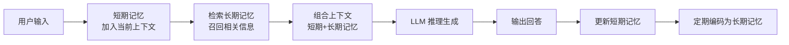

**协同机制**：
1. **检索增强**：每次推理时，从长期记忆中检索与当前查询相关的信息，注入短期记忆
2. **记忆巩固**：短期记忆中反复出现的重要信息，被编码为长期记忆（类似人类睡眠时的记忆巩固）
3. **上下文管理**：短期记忆超限时，旧消息被摘要压缩，关键信息转移至长期记忆

---

### Q3：向量数据库在 Agent 记忆中扮演什么角色？有哪些选型考量？

**参考答案**：

向量数据库是 Agent **长期记忆**的核心存储和检索基础设施，负责：
1. 将文本/多模态信息编码为高维向量并持久化存储
2. 通过近似最近邻（ANN）搜索实现语义相似检索

**选型考量**：

| 维度 | Milvus | Pinecone | Chroma | PGVector |
|------|--------|----------|--------|----------|
| **部署方式** | 自托管/云 | 纯云SaaS | 本地/嵌入 | PG扩展 |
| **性能** | 高（十亿级） | 高 | 中（小规模） | 中 |
| **生态** | 丰富 | 良好 | LangChain原生 | PG生态 |
| **成本** | 开源免费 | 按用量付费 | 免费 | 免费 |
| **适用场景** | 大规模生产 | 快速上线 | 原型开发 | 已有PG |

**选型建议**：原型阶段用 Chroma，生产环境用 Milvus 或 Pinecone，已有 PostgreSQL 的项目用 PGVector。

---

### Q4：如何解决 Agent 记忆的"容量爆炸"问题？

**参考答案**：

容量爆炸是指记忆库不断增长导致存储和检索性能下降。解决方案包括**三大优化策略**：

1. **容量优化**：
   - 分层存储：热数据→内存，温数据→Redis，冷数据→向量DB
   - 信息压缩：摘要压缩 + 去重合并 + 向量编码替代原文
   - 动态分配：基于重要性评分分配 Token 预算

2. **检索效率优化**：
   - 索引优化：使用 HNSW/IVF 等 ANN 索引，将检索复杂度降至 O(logN)
   - 混合检索：向量+关键词+元数据多路召回，RRF融合排序
   - 缓存策略：热门查询结果缓存

3. **遗忘机制**：
   - 自然衰减：基于艾宾浩斯遗忘曲线，记忆强度随时间指数衰减
   - 干扰遗忘：合并高度相似的记忆条目
   - 主动遗忘：容量超限时淘汰最低重要性记忆

---

### Q5：请解释 MemGPT 的记忆管理思想

**参考答案**：

MemGPT（2023）借鉴操作系统的**虚拟内存管理**思想，将 LLM 的上下文窗口视为"主存"，外部存储视为"磁盘"：

- **主存（上下文窗口）**：包含系统指令、近期对话、工作记忆
- **磁盘（外部存储）**：存储完整对话历史、长期知识
- **内存管理器**：LLM 自主决定何时将信息在主存和磁盘间移动

**核心机制**：
1. **分页（Paging）**：当上下文窗口满时，自动将旧消息"换出"到外部存储
2. **按需调入**：需要历史信息时，从外部存储"换入"相关记忆
3. **自管理**：LLM 通过函数调用主动管理记忆的存取，而非被动由系统控制

这种设计使 Agent 突破了上下文窗口限制，实现了"虚拟无限记忆"。

---

### Q6：Agent 的记忆检索和 RAG 有什么区别？

**参考答案**：

| 维度 | RAG | Agent 记忆检索 |
|------|-----|---------------|
| **数据来源** | 静态文档库 | 动态交互历史+知识库 |
| **更新方式** | 离线批量更新 | 在线实时更新 |
| **检索时机** | 单次查询时检索 | 每轮交互持续检索 |
| **个性化** | 通常无个性化 | 基于用户画像个性化 |
| **记忆类型** | 主要是语义记忆 | 短期+情景+语义+程序 |
| **写入流程** | 预处理写入 | 交互中自动写入 |

**核心区别**：RAG 是"静态知识检索"，Agent 记忆是"动态经验积累"。Agent 记忆包含 RAG 作为子能力，但还多了情景记忆（交互历史）、程序记忆（操作技能）等维度。

---

### Q7：如何设计一个 Agent 的记忆系统架构？

**参考答案**：

设计 Agent 记忆系统需要分层设计：

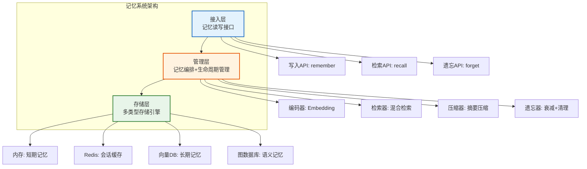

**设计要点**：
1. **多类型记忆**：支持短期、情景、语义、程序四种记忆
2. **统一接口**：提供 remember/recall/forget 统一 API
3. **混合检索**：向量+关键词+元数据多路召回
4. **自动管理**：编码、压缩、遗忘自动化
5. **可扩展**：支持动态添加新的存储引擎和检索策略

---

### Q8：情景记忆和语义记忆在实现上有什么关键区别？

**参考答案**：

| 维度 | 情景记忆 | 语义记忆 |
|------|---------|---------|
| **存储格式** | 事件序列（时间+上下文+行为+结果） | 事实三元组（主体+关系+客体） |
| **索引方式** | 时间索引 + 向量索引 | 图结构索引 |
| **检索方式** | "上次类似情况怎么处理的？" | "X是什么？" |
| **更新方式** | 追加新事件 | 更新/合并事实 |
| **遗忘方式** | 逐渐模糊（细节丢失，保留要点） | 整体保留或被新事实覆盖 |

**实现区别**：
- 情景记忆适合用**向量数据库**（按语义相似检索历史事件）
- 语义记忆适合用**知识图谱**（支持多跳推理和结构化查询）

---

### Q9：如何评估 Agent 记忆系统的质量？

**参考答案**：

| 评估维度 | 指标 | 说明 |
|---------|------|------|
| **检索准确率** | Recall@K / Precision@K | Top-K 结果中相关记忆的比例 |
| **检索延迟** | P50 / P99 Latency | 检索响应时间 |
| **记忆覆盖率** | Coverage Rate | 能回答的历史问题比例 |
| **记忆质量** | Freshness / Relevance | 记忆的时效性和相关性 |
| **存储效率** | Compression Ratio | 压缩后的信息保留率 |
| **遗忘合理性** | Forgetting Precision | 遗忘的记忆中确实无用的比例 |

**评估方法**：
1. **基准测试**：构建记忆测试集，自动化评估检索质量
2. **端到端评估**：测试 Agent 在多轮对话中的表现
3. **A/B 测试**：对比不同记忆策略的效果

---

### Q10：如何处理 Agent 记忆中的隐私和安全问题？

**参考答案**：

1. **数据最小化**：只存储必要的记忆，避免存储敏感信息（身份证、密码等）
2. **脱敏处理**：存储前对敏感字段进行加密或脱敏
3. **访问控制**：不同用户/Agent 只能访问自己的记忆
4. **定期清理**：设置 TTL，过期记忆自动删除
5. **差分隐私**：在记忆检索结果中添加噪声，防止推断攻击
6. **审计日志**：记录记忆的读写操作，便于追溯

```java
// 隐私保护的记忆存储
public class PrivacyAwareMemory {

    private final List<SensitivePattern> patterns;  // 敏感信息模式

    public void remember(String content, String userId) {
        // 1. 脱敏处理
        String sanitized = sanitize(content);

        // 2. 加密存储
        String encrypted = encrypt(sanitized, userId);

        // 3. 设置TTL
        memoryStore.save(encrypted, userId, ttlDays(30));
    }

    private String sanitize(String content) {
        for (SensitivePattern p : patterns) {
            content = content.replaceAll(p.getRegex(), p.getReplacement());
            // 如：身份证号 → ***，手机号 → 138****5678
        }
        return content;
    }
}
```

---

### Q11：多 Agent 系统中如何实现共享记忆？

**参考答案**：

多 Agent 共享记忆有三种模式：

```mermaid
graph TB
    subgraph 模式一：集中式共享
        A1[Agent A] --> DB[(共享记忆库)]
        A2[Agent B] --> DB
        A3[Agent C] --> DB
    end

    subgraph 模式二：分布式复制
        B1[Agent A<br/>本地记忆] <-.同步.-> B2[Agent B<br/>本地记忆]
        B2 <-.同步.-> B3[Agent C<br/>本地记忆]
    end

    subgraph 模式三：黑板模式
        C1[Agent A] --> BB[黑板<br/>共享状态]
        C2[Agent B] --> BB
        C3[Agent C] --> BB
    end

    style DB fill:#e3f2fd,stroke:#1565c0,stroke-width:2px
    style BB fill:#fff3e0,stroke:#e65100,stroke-width:2px
```

**选择建议**：
- **集中式**：Agent 数量少，一致性要求高
- **分布式**：Agent 地理分散，延迟敏感
- **黑板模式**：松耦合协作，实时性要求低

---

### Q12：记忆压缩会损失信息，如何平衡压缩率和信息保留？

**参考答案**：

平衡策略包括：

1. **分级压缩**：不同重要性的记忆使用不同压缩率
   - 高重要性：保留原文或轻微摘要
   - 中重要性：生成摘要
   - 低重要性：仅保留向量表示

2. **增量压缩**：分阶段逐步压缩，先压缩最旧的
   - 第1次：全文 → 详细摘要（保留80%信息）
   - 第2次：详细摘要 → 精简摘要（保留50%信息）
   - 第3次：精简摘要 → 关键词标签（保留20%信息）

3. **信息密度评估**：压缩后评估信息损失，若超过阈值则保留原文
   ```java
   double informationLoss = 1 - cosineSimilarity(embed(original), embed(summary));
   if (informationLoss > 0.3) {
       // 信息损失过大，保留原文或使用更低的压缩率
   }
   ```

4. **多版本保留**：同时保留原文和摘要，检索时先用摘要匹配，需要细节时再检索原文

---

### Q13：如何实现 Agent 的个性化记忆？

**参考答案**：

个性化记忆需要从**用户建模**和**记忆检索**两方面实现：

1. **用户画像构建**：
   - 显式偏好：直接询问用户（语言、风格、兴趣）
   - 隐式偏好：从交互行为中推断（点击、停留时间、追问模式）
   - 时序演化：偏好随时间变化，需动态更新

2. **个性化检索**：
   - 用户ID过滤：检索时优先返回当前用户的记忆
   - 偏好加权：根据用户画像对检索结果重排序
   - 冷启动处理：新用户使用群体偏好作为默认

```java
// 个性化记忆检索
public List<MemoryEntry> personalizedRecall(String query, String userId) {
    // 1. 基础检索
    List<MemoryEntry> candidates = vectorStore.search(embed(query), 50);

    // 2. 用户偏好加权
    UserProfile profile = userProfileStore.get(userId);
    return candidates.stream()
        .sorted(Comparator.comparingDouble(m -> 
            calculatePersonalizedScore(m, profile)
        ).reversed())
        .limit(10)
        .toList();
}
```

---

### Q14：Agent 记忆中的"反思"机制是什么？

**参考答案**：

反思（Reflection）是 Agent 从交互经验中提取高层洞察的过程，类似于人类的"总结经验教训"。

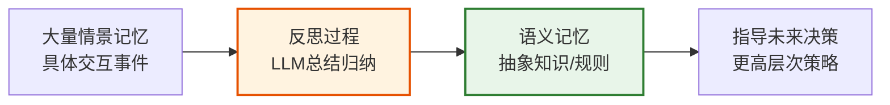

**实现方式**（参考斯坦福 Generative Agents）：
1. **触发条件**：当最近的事件重要性得分累计超过阈值时触发
2. **反思内容**：让 LLM 回顾最近的多个事件，提取规律和洞察
3. **存储方式**：反思结果作为高层次的语义记忆存储，可被后续检索

**价值**：反思将零散的情景记忆转化为结构化的语义知识，使 Agent 具备"举一反三"的能力。

---

### Q15：在 Agent 记忆系统中，如何处理记忆冲突？

**参考答案**：

记忆冲突是指不同时间存储的记忆信息矛盾，例如用户先说"喜欢甜食"后说"在减肥不吃甜的"。

**处理策略**：

1. **时间优先**：较新的记忆覆盖旧记忆（适合事实更新）
2. **置信度优先**：保留置信度更高的记忆（需记录来源可靠性）
3. **上下文区分**：两条记忆都保留，但标注适用场景（"平时喜欢甜食，减肥期间不吃"）
4. **冲突检测**：新记忆写入时，检测与已有记忆的矛盾，触发冲突解决流程

```java
// 冲突检测与解决
public void rememberWithConflictResolution(MemoryEntry newEntry) {
    // 检索与新记忆冲突的已有记忆
    List<MemoryEntry> conflicts = detectConflicts(newEntry);

    if (conflicts.isEmpty()) {
        memoryStore.add(newEntry);
    } else {
        // 让LLM判断如何解决冲突
        ConflictResolution resolution = llmResolve(newEntry, conflicts);

        switch (resolution.getAction()) {
            case REPLACE -> {  // 新记忆替代旧记忆
                conflicts.forEach(c -> memoryStore.delete(c.getId()));
                memoryStore.add(newEntry);
            }
            case MERGE -> {    // 合并为一条记忆
                MemoryEntry merged = mergeMemories(newEntry, conflicts);
                conflicts.forEach(c -> memoryStore.delete(c.getId()));
                memoryStore.add(merged);
            }
            case KEEP_BOTH -> { // 都保留，标注上下文
                newEntry.setContext(resolution.getContextNote());
                memoryStore.add(newEntry);
            }
        }
    }
}
```

---

## 8. 参考文献

| 编号 | 文献 | 说明 |
|------|------|------|
| [1] | Park, J.S., et al. "Generative Agents: Interactive Simulacra of Human Behavior." (2023) | 斯坦福小镇，记忆流+反思+规划 |
| [2] | Packer, C., et al. "MemGPT: Towards LLMs as Operating Systems." (2023) | 操作系统式记忆管理 |
| [3] | Borgeaud, S., et al. "Improving Language Models by Retrieving from Trillions of Tokens." (RETRO, DeepMind, 2022) | 检索增强Transformer |
| [4] | Atkinson, R.C. & Shiffrin, R.M. "Human Memory: A Proposed System and Its Control Processes." (1968) | 多重存储记忆模型 |
| [5] | Tulving, E. "Episodic and Semantic Memory." (1972) | 情景记忆与语义记忆分类 |
| [6] | Schick, T., et al. "Toolformer: Language Models Can Teach Themselves to Use Tools." (2023) | 工具使用与记忆 |
| [7] | Yao, S., et al. "ReAct: Synergizing Reasoning and Acting in Language Models." (2023) | ReAct 推理范式 |
| [8] | Shinn, N., et al. "Reflexion: Language Agents with Verbal Reinforcement Learning." (2023) | 反思机制 |

---

## 附：面试速记卡片

```
┌──────────────────────────────────────────────────┐
│           Agent 记忆机制面试速记                    │
├──────────────────────────────────────────────────┤
│ 记忆分类:                                          │
│   短期 → 上下文窗口，会话级，内存/Redis             │
│   情景 → 交互事件，向量DB，时序检索                 │
│   语义 → 事实知识，知识图谱，结构查询               │
│   程序 → 操作技能，模板库，模式匹配                 │
├──────────────────────────────────────────────────┤
│ 三大优化:                                          │
│   容量 → 分层存储 + 压缩 + 动态分配                │
│   检索 → ANN索引 + 混合检索 + 缓存                 │
│   遗忘 → 自然衰减 + 干扰合并 + 主动清理            │
├──────────────────────────────────────────────────┤
│ 关键技术:                                          │
│   向量DB → Milvus/Pinecone/Chroma                │
│   知识图谱 → Neo4j，多跳推理                       │
│   注意力 → 上下文窗口内软记忆                      │
│   经验回放 → 强化学习，(s,a,r,s')                 │
│   摘要压缩 → LLM生成摘要，控制token                │
├──────────────────────────────────────────────────┤
│ 经典论文:                                          │
│   MemGPT → OS式虚拟记忆管理                       │
│   Generative Agents → 记忆流+反思+规划             │
│   RETRO → 检索增强Transformer                     │
│   ReAct → 推理+行动交替                           │
└──────────────────────────────────────────────────┘
```

---

> **面试提醒**：回答记忆机制问题时，建议按"概念定义→分类体系→实现技术→优化策略→实践案例"的逻辑展开，展示系统性理解。重点掌握三大优化策略和记忆分类的区别，这是面试官最关注的深度点。
