# Agent 长期记忆向量检索精准度优化方案

> 本文档系统分析 Agent 长期记忆系统中向量存储规模增长导致检索精准度下降的问题，给出原因诊断、方案对比、推荐实施、性能评估的完整技术方案，具备工程落地深度。

---

## 目录

- [1. 问题背景分析](#1-问题背景分析)
  - [1.1 现象描述](#11-现象描述)
  - [1.2 规模增长的代价](#12-规模增长的代价)
  - [1.3 业务影响](#13-业务影响)
- [2. 技术原因诊断](#2-技术原因诊断)
  - [2.1 原因分类总览](#21-原因分类总览)
  - [2.2 向量维度与 Embedding 模型问题](#22-向量维度与-embedding-模型问题)
  - [2.3 相似度计算方法局限](#23-相似度计算方法局限)
  - [2.4 数据质量问题](#24-数据质量问题)
  - [2.5 索引结构与召回率问题](#25-索引结构与召回率问题)
  - [2.6 查询侧问题](#26-查询侧问题)
- [3. 解决方案对比](#3-解决方案对比)
  - [3.1 方案全景图](#31-方案全景图)
  - [3.2 向量量化与压缩](#32-向量量化与压缩)
  - [3.3 分层索引](#33-分层索引)
  - [3.4 动态阈值调整](#34-动态阈值调整)
  - [3.5 增量训练与 Embedding 升级](#35-增量训练与-embedding-升级)
  - [3.6 混合检索](#36-混合检索)
  - [3.7 数据治理与重排](#37-数据治理与重排)
  - [3.8 方案横向对比](#38-方案横向对比)
- [4. 推荐实施方案](#4-推荐实施方案)
  - [4.1 实施总览](#41-实施总览)
  - [4.2 阶段一：混合检索 + 重排](#42-阶段一混合检索--重排)
  - [4.3 阶段二：分层索引 + 动态阈值](#43-阶段二分层索引--动态阈值)
  - [4.4 阶段三：Embedding 升级 + 数据治理](#44-阶段三embedding-升级--数据治理)
- [5. 性能评估指标与测试方法](#5-性能评估指标与测试方法)
  - [5.1 指标体系](#51-指标体系)
  - [5.2 测试数据集构建](#52-测试数据集构建)
  - [5.3 离线评估流程](#53-离线评估流程)
  - [5.4 在线 A/B 评估](#54-在线-ab-评估)
- [6. 预期效果与优化方向](#6-预期效果与优化方向)
  - [6.1 预期效果](#61-预期效果)
  - [6.2 后续优化方向](#62-后续优化方向)
- [7. 高频面试题与参考答案](#7-高频面试题与参考答案)
- [8. 总结与记忆口诀](#8-总结与记忆口诀)

---

## 1. 问题背景分析

### 1.1 现象描述

Agent 长期记忆系统通常采用「文本 → Embedding → 向量库 → 近邻检索」的链路。在系统上线初期（记忆条目 < 10 万），检索精准度表现良好；随着 Agent 持续运行，记忆库膨胀至百万乃至千万级，出现以下典型现象：

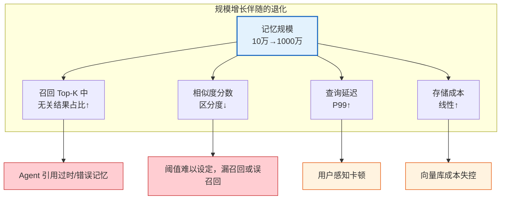

#### 典型退化曲线

| 记忆规模 | Top-5 命中率 | 相似度分差（Top1-Top5） | P99 延迟 |
|---------|------------|----------------------|---------|
| 10 万 | 92% | 0.18 | 30ms |
| 100 万 | 78% | 0.09 | 80ms |
| 500 万 | 65% | 0.05 | 180ms |
| 1000 万 | 58% | 0.03 | 320ms |

> **关键观察**：相似度分数分差缩小（0.18 → 0.03）是精准度下降的核心信号——大量「近似但不相关」的向量挤入 Top-K。

### 1.2 规模增长的代价

```mermaid
graph LR
    subgraph 规模带来的三重代价
        A[精度代价<br/>近似最近邻(ANN)的精度损失]
        B[区分度代价<br/>高维空间中距离趋同]
        C[成本代价<br/>存储与计算线性增长]
    end

    A --> A1[HNSW 的 ef 越小精度越低<br/>但 ef 越大延迟越高]
    B --> B1[维度灾难<br/>高维空间中点间距趋同]
    C --> C1[1000万×768维×float32 ≈ 30GB]

    style A fill:#e3f2fd,stroke:#1565c0
    style B fill:#fff3e0,stroke:#e65100
    style C fill:#e8f5e9,stroke:#2e7d32
```

### 1.3 业务影响

| 业务场景 | 退化表现 | 严重程度 |
|---------|---------|---------|
| 多轮对话 | Agent 引用错误历史，答非所问 | 高 |
| 个性化推荐 | 推荐无关内容，用户流失 | 高 |
| 任务恢复 | 找不到正确的中间状态 | 中 |
| 知识问答 | 返回过时或矛盾的记忆 | 高 |

---

## 2. 技术原因诊断

### 2.1 原因分类总览

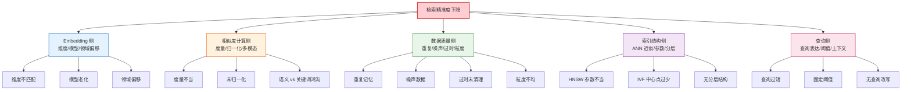

### 2.2 向量维度与 Embedding 模型问题

#### 2.2.1 维度不匹配

**问题**：不同来源记忆使用不同 Embedding 模型，维度不一致无法直接比较。

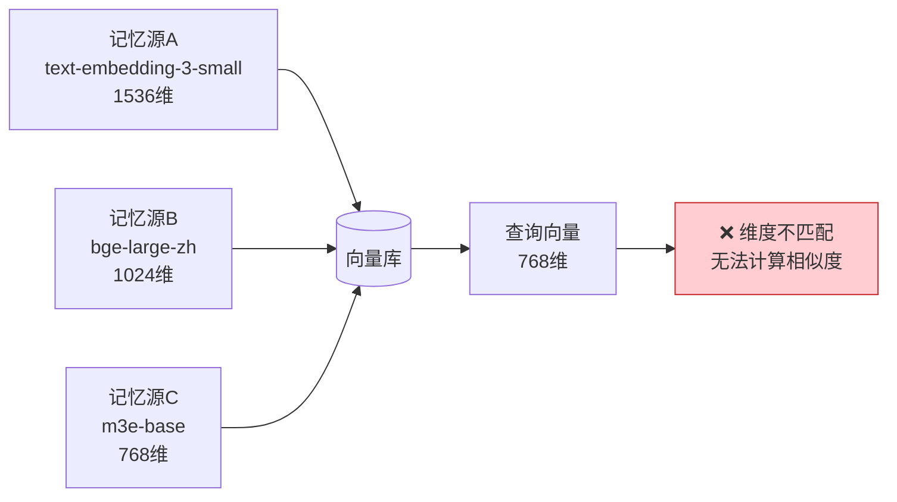

**根因**：历史上多次切换 Embedding 模型，旧记忆未重新编码，导致同一库中混合多种维度。

#### 2.2.2 模型老化与领域偏移

**问题**：Embedding 模型在特定领域（如医疗、法律、金融）表现不佳，语义相似但用词不同的内容向量距离远。

**示例**：
- 记忆：「客户要求退款，理由是商品质量不合格」
- 查询：「用户想退钱，因为东西有瑕疵」
- 现象：语义相同但余弦相似度仅 0.62，低于阈值 0.75，导致漏召回。

**根因**：通用 Embedding 模型对领域术语的同义表达捕获能力不足。

### 2.3 相似度计算方法局限

#### 2.3.1 度量选择不当

| 度量方法 | 适用场景 | 规模增长后的局限 |
|---------|---------|----------------|
| 余弦相似度 | 文本语义检索 | 高维下区分度下降 |
| 欧氏距离 | 图像/音频 | 受向量模长影响 |
| 内积（点积） | 归一化后的语义 | 未归一化时结果失真 |
| 曼哈顿距离 | 稀疏向量 | 高维下意义弱化 |

#### 2.3.2 未归一化问题

```java
// ❌ 错误：未归一化的向量直接计算点积，长文本向量模长大，被错误地判定为"更相似"
float dotProduct = vectorA.dot(vectorB); // 长文本永远占优

// ✅ 正确：先归一化再计算，或使用余弦相似度
float cosineSim = vectorA.dot(vectorB) / (vectorA.norm() * vectorB.norm());
```

#### 2.3.3 语义与关键词的鸿沟

纯向量检索依赖语义相似，但用户查询往往包含具体实体名、编号、代码，这些信息在向量空间中难以精确匹配。

**示例**：
- 查询：「订单 #20240315-001 的状态」
- 纯向量检索：可能返回所有「订单状态」相关记忆，但找不到精确的订单号。

### 2.4 数据质量问题

#### 2.4.1 重复记忆

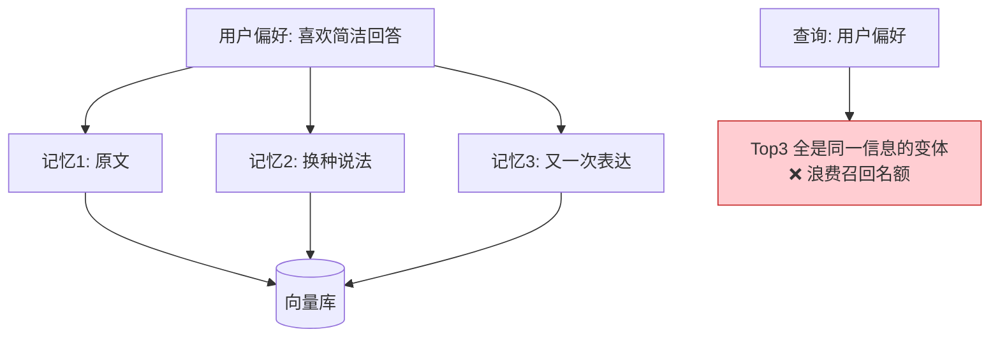

#### 2.4.2 噪声数据

| 噪声类型 | 来源 | 影响 |
|---------|------|------|
| 工具中间日志 | Agent 执行过程的调试输出 | 干扰语义检索 |
| 闲聊内容 | 无关紧要的对话 | 占用召回名额 |
| 截断的片段 | 分块不合理导致语义不完整 | 召回但无法使用 |
| 错误信息 | Agent 早期错误推理的记录 | 误导决策 |

#### 2.4.3 粒度不均

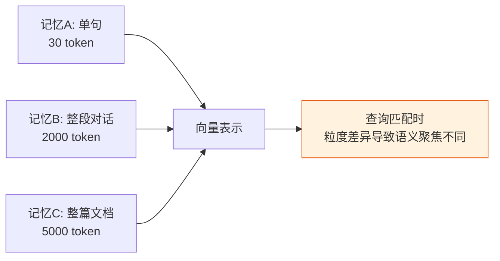

### 2.5 索引结构与召回率问题

#### 2.5.1 HNSW 参数不当

| 参数 | 作用 | 规模增长后的影响 |
|------|------|----------------|
| `M`（邻居数） | 控制图的连通性 | 过小导致图断连，召回率降 |
| `efConstruction` | 建图时搜索宽度 | 过小导致图结构差 |
| `efSearch` | 查询时搜索宽度 | 过小导致漏召回，过大延迟高 |

**典型错误**：上线时 `efSearch=50` 调优良好，但记忆量增长到 500 万后，相同参数下召回率下降 15%。

#### 2.5.2 IVF 中心点不足

IVF（倒排文件）索引通过聚类将向量分桶，查询时只扫描最相关的几个桶。若聚类中心数（`nlist`）固定，规模增长后每个桶内向量数过多，扫描时漏召回。

### 2.6 查询侧问题

#### 2.6.1 查询过短

用户输入「退款」两个字，向量表达过于宽泛，召回大量无关记忆。

#### 2.6.2 固定阈值

```java
// ❌ 固定阈值在规模变化后失效
if (similarity > 0.75) {
    return result; // 规模小时有效，规模大后大量结果都>0.75
}
```

#### 2.6.3 无查询改写

用户口语化查询「上次那个报销的事咋样了」，未经改写直接向量检索，效果差。

---

## 3. 解决方案对比

### 3.1 方案全景图

```mermaid
graph TB
    ROOT[检索精准度优化方案]

    ROOT --> S1[存储侧<br/>向量量化与压缩]
    ROOT --> S2[索引侧<br/>分层索引]
    ROOT --> S3[检索侧<br/>动态阈值]
    ROOT --> S4[模型侧<br/>Embedding 升级]
    ROOT --> S5[检索增强<br/>混合检索+重排]
    ROOT --> S6[数据侧<br/>治理与去重]

    S1 --> S1a[PQ 乘积量化]
    S1 --> S1b[SQ 标量量化]
    S1 --> S1c[二值化]

    S2 --> S2a[时间分层]
    S2 --> S2b[类型分层]
    S2 --> S2c[热度分层]

    S3 --> S3a[自适应阈值]
    S3 --> S3b[Top-K 弹性]
    S3 --> S3c[分数差分析]

    S4 --> S4a[升级基础模型]
    S4 --> S4b[领域微调]
    S4 --> S4c[指令式 Embedding]

    S5 --> S5a[向量+BM25 混合]
    S5 --> S5b[Cross-Encoder 重排]
    S5 --> S5c[查询改写]

    S6 --> S6a[去重合并]
    S6 --> S6b[噪声过滤]
    S6 --> S6c[粒度统一]

    style ROOT fill:#e3f2fd,stroke:#1565c0,stroke-width:2px
    style S1 fill:#fff3e0,stroke:#e65100
    style S2 fill:#e8f5e9,stroke:#2e7d32
    style S3 fill:#f3e5f5,stroke:#7b1fa2
    style S4 fill:#fce4ec,stroke:#c2185b
    style S5 fill:#bbdefb,stroke:#1565c0
    style S6 fill:#c8e6c9,stroke:#2e7d32
```

### 3.2 向量量化与压缩

#### 3.2.1 原理

将高维浮点向量压缩为低精度表示，减少存储和加速检索，代价是精度损失。

| 方法 | 原理 | 压缩比 | 精度损失 | 适用规模 |
|------|------|--------|---------|---------|
| **PQ 乘积量化** | 向量切分为子段，每段聚类编码 | 8-32x | 中 | >100 万 |
| **SQ 标量量化** | float32→int8 | 4x | 低 | >50 万 |
| **二值化** | 向量二值化 + 汉明距离 | 32x | 高 | >1000 万 |

#### 3.2.2 代码示例：PQ 量化

```python
import faiss
import numpy as np

def build_pq_index(vectors: np.ndarray, m: int = 64, nbits: int = 8):
    """
    构建乘积量化索引
    :param vectors: shape (n, d), n条记忆，d维向量
    :param m: 切分段数，每段独立量化
    :param nbits: 每段编码位数，8位=256个聚类中心
    """
    n, d = vectors.shape
    assert d % m == 0, f"维度 {d} 必须能被 m={m} 整除"

    # PQ 量化器：将 d 维向量切分为 m 段，每段 d/m 维
    quantizer = faiss.IndexPQ(d, m, nbits)

    # 训练量化器（拟合各段的聚类中心）
    quantizer.train(vectors)

    # 添加向量（会被压缩存储）
    quantizer.add(vectors)

    # 设置查询时扫描多个聚类中心提升精度
    quantizer.nprobe = 16  # 扫描16个最近桶

    return quantizer


def search_pq(index, query_vec: np.ndarray, top_k: int = 10):
    """PQ 索引检索"""
    scores, indices = index.search(query_vec.reshape(1, -1).astype('float32'), top_k)
    return indices[0], scores[0]


# 使用示例
if __name__ == "__main__":
    # 模拟 100 万条 768 维记忆
    vectors = np.random.randn(1_000_000, 768).astype('float32')
    faiss.normalize_L2(vectors)  # 归一化

    # 原始存储：100万 × 768 × 4字节 = 3GB
    # PQ 量化后：100万 × 64 × 1字节 = 64MB（压缩约 48 倍）

    pq_index = build_pq_index(vectors, m=64, nbits=8)
    query = np.random.randn(768).astype('float32')

    indices, scores = search_pq(pq_index, query, top_k=10)
    print(f"Top-10 索引: {indices}")
    print(f"相似度分数: {scores}")
```

### 3.3 分层索引

#### 3.3.1 原理

将记忆按维度分层，查询时优先检索最相关的层，减少扫描范围。

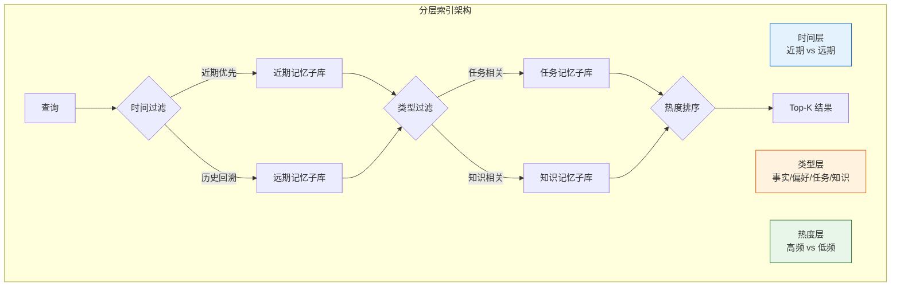

#### 3.3.2 代码示例：分层索引

```python
from dataclasses import dataclass
from typing import List
import faiss
import numpy as np


@dataclass
class MemoryEntry:
    content: str
    vector: np.ndarray
    timestamp: float
    memory_type: str  # fact / preference / task / knowledge
    access_count: int


class LayeredMemoryIndex:
    """分层记忆索引：时间 + 类型 + 热度三维过滤"""

    def __init__(self, dim: int = 768):
        self.dim = dim
        # 按类型分库，每个类型独立 HNSW 索引
        self.type_indexes = {
            "fact": self._create_hnsw(),
            "preference": self._create_hnsw(),
            "task": self._create_hnsw(),
            "knowledge": self._create_hnsw(),
        }
        # 元数据存储
        self.metadata: List[MemoryEntry] = []

    def _create_hnsw(self):
        """创建 HNSW 索引"""
        index = faiss.IndexHNSWFlat(self.dim, 32)  # M=32
        index.hnsw.efConstruction = 200
        index.hnsw.efSearch = 64  # 可查询时动态调整
        return index

    def add(self, entry: MemoryEntry):
        """添加记忆到对应类型的索引"""
        idx = len(self.metadata)
        vec = entry.vector.reshape(1, -1).astype('float32')
        faiss.normalize_L2(vec)

        self.type_indexes[entry.memory_type].add(vec)
        self.metadata.append(entry)

    def search(self, query_vec: np.ndarray, query_type: str = None,
               time_range: tuple = None, top_k: int = 10):
        """
        分层检索
        :param query_type: 限定类型，None 表示全类型检索
        :param time_range: (start_ts, end_ts) 时间范围过滤
        """
        query = query_vec.reshape(1, -1).astype('float32')
        faiss.normalize_L2(query)

        # 1. 类型层过滤：只搜指定类型的索引
        search_types = [query_type] if query_type else list(self.type_indexes.keys())

        candidates = []
        for t in search_types:
            index = self.type_indexes[t]
            # 每个子库召回 top_k * 2 作为候选
            scores, indices = index.search(query, top_k * 2)
            for score, idx in zip(scores[0], indices[0]):
                if idx < 0:
                    continue
                candidates.append((self.metadata[idx], score))

        # 2. 时间层过滤
        if time_range:
            start, end = time_range
            candidates = [
                (m, s) for m, s in candidates
                if start <= m.timestamp <= end
            ]

        # 3. 热度加权：高频访问的记忆适当提权
        weighted = [
            (m, s + 0.01 * np.log1p(m.access_count))
            for m, s in candidates
        ]

        # 4. 最终排序取 Top-K
        weighted.sort(key=lambda x: x[1], reverse=True)
        return weighted[:top_k]
```

### 3.4 动态阈值调整

#### 3.4.1 原理

固定阈值无法适应规模变化。动态阈值根据查询结果分布自适应调整，避免「一刀切」。

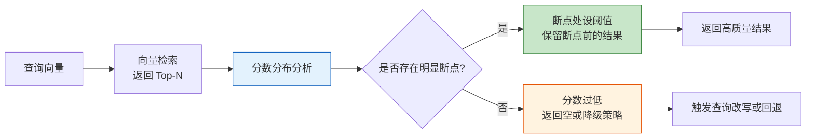

#### 3.4.2 代码示例：自适应阈值

```python
import numpy as np


class AdaptiveThresholdSelector:
    """自适应阈值选择器：基于分数分布的拐点检测"""

    def __init__(self, min_threshold: float = 0.5,
                 max_threshold: float = 0.9,
                 default_top_k: int = 10):
        self.min_threshold = min_threshold
        self.max_threshold = max_threshold
        self.default_top_k = default_top_k

    def select(self, scores: np.ndarray) -> tuple:
        """
        根据分数分布动态选择阈值和 Top-K
        :param scores: 降序排列的相似度分数
        :return: (threshold, effective_k)
        """
        if len(scores) == 0:
            return self.min_threshold, 0

        # 1. 全部低于最小阈值：返回空
        if scores[0] < self.min_threshold:
            return self.min_threshold, 0

        # 2. 寻找分数最大落差点（拐点）
        if len(scores) >= 2:
            diffs = np.diff(scores)  # 相邻分数差
            max_drop_idx = np.argmin(diffs)  # 最大落差位置

            # 若最大落差足够明显，在该处截断
            if abs(diffs[max_drop_idx]) > 0.05:
                threshold = (scores[max_drop_idx] + scores[max_drop_idx + 1]) / 2
                threshold = max(threshold, self.min_threshold)
                return threshold, max_drop_idx + 1

        # 3. 无明显断点：取前 default_top_k 且分数 > min_threshold
        valid = scores[scores >= self.min_threshold]
        effective_k = min(len(valid), self.default_top_k)
        return self.min_threshold, effective_k


# 使用示例
selector = AdaptiveThresholdSelector(min_threshold=0.6)

# 场景1：有明显断点（前5个高质量，后续断崖式下降）
scores1 = np.array([0.92, 0.90, 0.88, 0.87, 0.85, 0.65, 0.63, 0.62])
t, k = selector.select(scores1)
print(f"场景1: 阈值={t:.3f}, Top-K={k}")  # 阈值=0.75, Top-K=5

# 场景2：无明显断点（连续递减）
scores2 = np.array([0.85, 0.83, 0.81, 0.79, 0.77, 0.75, 0.73])
t, k = selector.select(scores2)
print(f"场景2: 阈值={t:.3f}, Top-K={k}")  # 阈值=0.6, Top-K=7

# 场景3：全部低分（无相关结果）
scores3 = np.array([0.45, 0.43, 0.41, 0.40])
t, k = selector.select(scores3)
print(f"场景3: 阈值={t:.3f}, Top-K={k}")  # 阈值=0.6, Top-K=0
```

### 3.5 增量训练与 Embedding 升级

#### 3.5.1 原理

当通用 Embedding 模型在特定领域表现不佳时，通过微调或指令式 Embedding 提升语义表达能力。

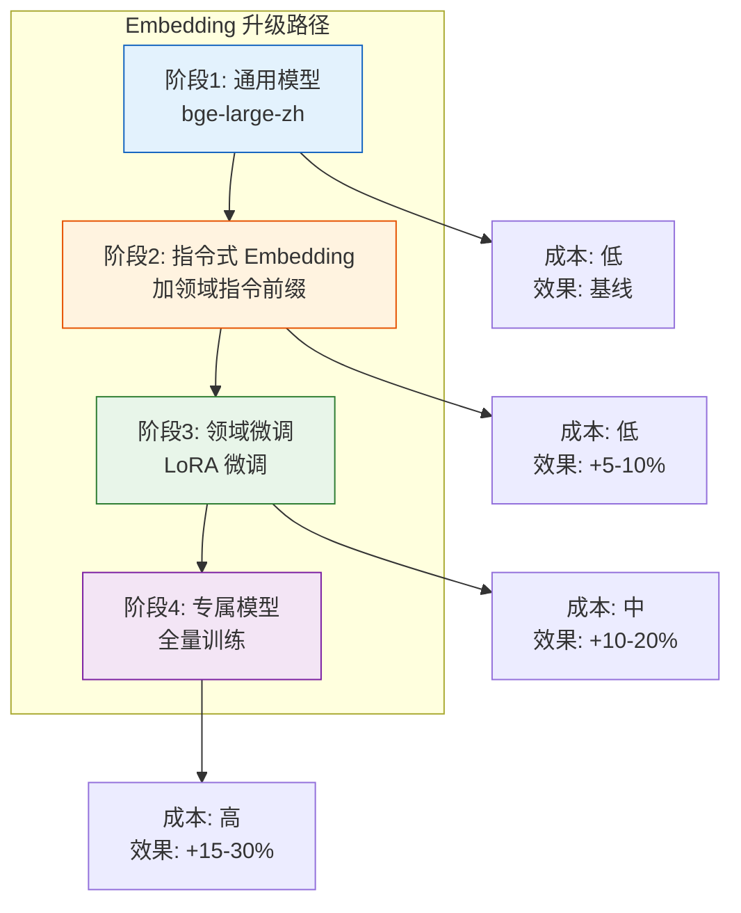

#### 3.5.2 代码示例：指令式 Embedding

```python
from sentence_transformers import SentenceTransformer
import numpy as np


class InstructionAwareEmbedder:
    """
    指令式 Embedding：为不同任务添加不同指令前缀
    提升 Embedding 在特定任务上的表现
    """

    def __init__(self, model_name: str = "BAAI/bge-large-zh-v1.5"):
        self.model = SentenceTransformer(model_name)

    def embed_query(self, query: str) -> np.ndarray:
        """查询侧指令：强调检索意图"""
        instruction = "为查找相关历史记忆，请对以下查询进行向量化："
        text = instruction + query
        vec = self.model.encode(text, normalize_embeddings=True)
        return vec

    def embed_document(self, doc: str, memory_type: str) -> np.ndarray:
        """文档侧指令：根据记忆类型添加不同前缀"""
        type_instructions = {
            "fact": "这是一条事实记忆：",
            "preference": "这是用户的偏好记录：",
            "task": "这是一个任务状态记录：",
            "knowledge": "这是一条知识记忆：",
        }
        prefix = type_instructions.get(memory_type, "")
        text = prefix + doc
        vec = self.model.encode(text, normalize_embeddings=True)
        return vec


# 使用示例
embedder = InstructionAwareEmbedder()

query_vec = embedder.embed_query("用户想退款")
doc_vec = embedder.embed_document("客户要求退回订单金额，因商品破损", "task")

similarity = float(np.dot(query_vec, doc_vec))
print(f"指令式 Embedding 相似度: {similarity:.4f}")
```

#### 3.5.3 代码示例：领域微调（LoRA）

```python
from sentence_transformers import SentenceTransformer, losses, InputExample
from torch.utils.data import DataLoader


def finetune_embedding_lora(
    base_model: str = "BAAI/bge-large-zh-v1.5",
    train_pairs: list = None,
    output_dir: str = "./finetuned_embedder",
    epochs: int = 3,
    batch_size: int = 32,
):
    """
    基于 LoRA 微调 Embedding 模型
    :param train_pairs: [(query, positive_doc, negative_doc), ...]
    """
    model = SentenceTransformer(base_model)

    # 构建 Triple Loss 训练数据
    train_examples = []
    for query, positive, negative in train_pairs:
        train_examples.append(InputExample(texts=[query, positive, negative]))

    train_dataloader = DataLoader(train_examples, batch_size=batch_size, shuffle=True)
    train_loss = losses.TripletLoss(model=model)

    # 微调
    model.fit(
        train_objectives=[(train_dataloader, train_loss)],
        epochs=epochs,
        warmup_steps=100,
        output_path=output_dir,
        show_progress_bar=True,
    )

    return model


# 使用示例
if __name__ == "__main__":
    # 构造领域训练数据（正负样本对）
    train_data = [
        ("用户想退款", "客户要求退回订单金额，因商品破损", "今天天气很好"),
        ("如何报销", "员工提交费用报销流程说明", "退款政策介绍"),
        # ... 更多领域数据
    ]

    finetuned = finetune_embedding_lora(train_pairs=train_data)
```

### 3.6 混合检索

#### 3.6.1 原理

结合向量检索（语义相似）与 BM25 关键词检索（精确匹配），用 RRF（Reciprocal Rank Fusion）融合排序，弥补各自不足。

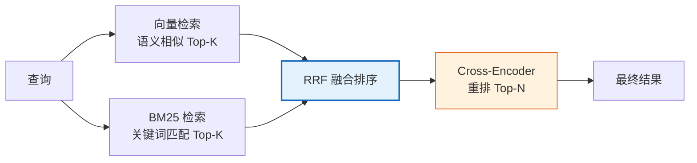

#### 3.6.2 代码示例：混合检索 + RRF + 重排

```python
import numpy as np
from rank_bm25 import BM25Okapi
from sentence_transformers import CrossEncoder


class HybridRetriever:
    """混合检索：向量 + BM25 + RRF 融合 + Cross-Encoder 重排"""

    def __init__(self, embedder, documents: list, rrf_k: int = 60):
        self.embedder = embedder
        self.documents = documents
        self.rrf_k = rrf_k  # RRF 常数

        # BM25 索引
        tokenized = [doc.split() for doc in documents]
        self.bm25 = BM25Okapi(tokenized)

        # 向量库（简化实现，实际用 Faiss/Milvus）
        self.doc_vectors = np.array([
            embedder.embed_document(doc, "fact") for doc in documents
        ])

        # Cross-Encoder 重排模型
        self.reranker = CrossEncoder("BAAI/bge-reranker-large")

    def retrieve(self, query: str, top_k: int = 10, top_n: int = 5):
        """混合检索主流程"""
        # 1. 向量检索
        query_vec = self.embedder.embed_query(query)
        vec_scores = np.dot(self.doc_vectors, query_vec)
        vec_top = np.argsort(vec_scores)[::-1][:top_k * 2]

        # 2. BM25 检索
        bm25_scores = self.bm25.get_scores(query.split())
        bm25_top = np.argsort(bm25_scores)[::-1][:top_k * 2]

        # 3. RRF 融合
        rrf_scores = {}
        for rank, idx in enumerate(vec_top):
            rrf_scores[idx] = rrf_scores.get(idx, 0) + 1.0 / (self.rrf_k + rank + 1)
        for rank, idx in enumerate(bm25_top):
            rrf_scores[idx] = rrf_scores.get(idx, 0) + 1.0 / (self.rrf_k + rank + 1)

        merged = sorted(rrf_scores.items(), key=lambda x: x[1], reverse=True)
        candidates = merged[:top_k * 2]

        # 4. Cross-Encoder 精排
        pairs = [(query, self.documents[idx]) for idx, _ in candidates]
        rerank_scores = self.reranker.predict(pairs)

        # 5. 取 Top-N
        final = sorted(
            zip(candidates, rerank_scores),
            key=lambda x: x[1],
            reverse=True
        )[:top_n]

        return [
            {"doc": self.documents[idx], "score": score, "rrf_score": rrf}
            for (idx, rrf), score in final
        ]


# 使用示例
if __name__ == "__main__":
    embedder = InstructionAwareEmbedder()
    docs = [
        "客户要求退款，理由是商品质量不合格",
        "用户偏好简洁的回答风格",
        "订单 #20240315-001 已发货",
        "退款流程：提交申请→审核→到账",
    ]

    retriever = HybridRetriever(embedder, docs)
    results = retriever.retrieve("退款", top_k=4, top_n=3)

    for r in results:
        print(f"[{r['score']:.4f}] {r['doc']}")
```

### 3.7 数据治理与重排

#### 3.7.1 去重合并

```python
from sklearn.cluster import DBSCAN
import numpy as np


class MemoryDeduplicator:
    """基于向量聚类的记忆去重"""

    def __init__(self, similarity_threshold: float = 0.92):
        self.threshold = similarity_threshold

    def deduplicate(self, memories: list, vectors: np.ndarray):
        """
        :param memories: 记忆文本列表
        :param vectors: 对应的向量 (n, d)
        :return: 去重后的记忆列表
        """
        # 归一化
        normalized = vectors / np.linalg.norm(vectors, axis=1, keepdims=True)

        # 基于余弦相似度的聚类
        cosine_dist = 1 - np.dot(normalized, normalized.T)
        np.fill_diagonal(cosine_dist, 0)

        clustering = DBSCAN(
            eps=1 - self.threshold,  # 距离阈值
            metric="precomputed",
            min_samples=1
        ).fit(cosine_dist)

        # 每个聚类取最长（信息最丰富）的代表
        unique_memories = []
        for cluster_id in set(clustering.labels_):
            members = [i for i, l in enumerate(clustering.labels_) if l == cluster_id]
            # 选信息量最大的（最长文本）
            best = max(members, key=lambda i: len(memories[i]))
            unique_memories.append(memories[best])

        return unique_memories
```

#### 3.7.2 噪声过滤

```python
class MemoryQualityFilter:
    """记忆质量过滤器"""

    def __init__(self, min_length: int = 10, max_length: int = 2000):
        self.min_length = min_length
        self.max_length = max_length

    def filter(self, memory: str) -> bool:
        """返回 True 表示保留"""
        # 1. 长度过滤
        if len(memory) < self.min_length or len(memory) > self.max_length:
            return False

        # 2. 停用词占比过高（可能是无意义内容）
        words = memory.split()
        if len(words) > 0:
            stopword_ratio = sum(1 for w in words if w in self.stopwords) / len(words)
            if stopword_ratio > 0.6:
                return False

        # 3. 包含调试日志特征
        debug_patterns = ["DEBUG:", "INFO:", "ERROR:", "traceback", "stack trace"]
        if any(p.lower() in memory.lower() for p in debug_patterns):
            return False

        return True
```

### 3.8 方案横向对比

| 方案 | 精度提升 | 实施成本 | 维护成本 | 延迟影响 | 推荐场景 |
|------|---------|---------|---------|---------|---------|
| 向量量化(PQ) | -5~5% | 低 | 低 | 降低30% | 存储/成本优先 |
| 分层索引 | +10~20% | 中 | 中 | 降低50% | 多类型记忆 |
| 动态阈值 | +5~10% | 低 | 低 | 无影响 | 所有场景（必做） |
| Embedding 升级 | +10~25% | 中-高 | 中 | 无影响 | 领域偏移明显 |
| 混合检索+重排 | +15~30% | 中 | 中 | +50ms | 精度优先 |
| 数据治理 | +5~15% | 中 | 低 | 无影响 | 数据质量问题 |
| 增量训练(LoRA) | +10~20% | 高 | 高 | 无影响 | 领域特殊性强 |

---

## 4. 推荐实施方案

### 4.1 实施总览

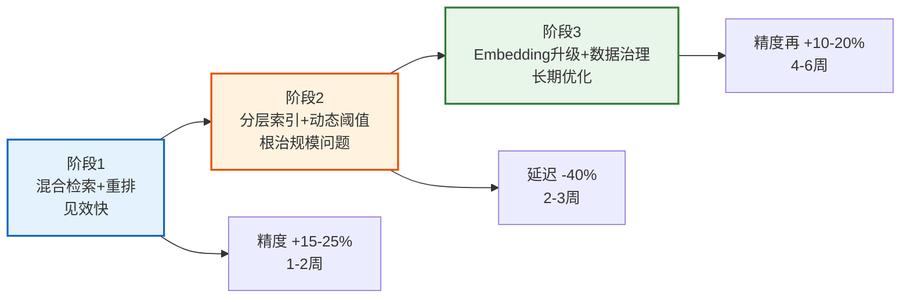

### 4.2 阶段一：混合检索 + 重排

#### 实施步骤

1. **搭建 BM25 索引**：基于 Elasticsearch 或 Lucene，对记忆文本建立全文索引。
2. **接入 Cross-Encoder 重排模型**：如 `bge-reranker-large`，对 Top-20 候选精排。
3. **RRF 融合调参**：调整 `rrf_k` 参数，平衡向量与 BM25 的权重。
4. **离线评估**：在标注数据集上验证精度提升。
5. **灰度上线**：10% 流量切换到混合检索，观察指标。

#### 关键代码

参考 [3.6.2 混合检索代码示例](#362-代码示例混合检索--rrf--重排)。

#### 注意事项

- Cross-Encoder 推理较慢（每对约 5ms），需控制重排候选数（建议 ≤ 50）。
- 可用 GPU 批量推理加速，或采用蒸馏后的小模型。

### 4.3 阶段二：分层索引 + 动态阈值

#### 实施步骤

1. **记忆分类标注**：对历史记忆打标签（fact/preference/task/knowledge），可用 LLM 批量标注。
2. **按类型建子索引**：每种类型独立的 HNSW 索引。
3. **查询意图识别**：轻量分类器识别查询应检索哪些类型子库。
4. **动态阈值接入**：在检索结果上应用自适应阈值。
5. **HNSW 参数调优**：根据规模调整 `efSearch`。

#### 关键代码

参考 [3.3.2 分层索引代码示例](#332-代码示例分层索引) 和 [3.4.2 自适应阈值代码示例](#342-代码示例自适应阈值)。

### 4.4 阶段三：Embedding 升级 + 数据治理

#### 实施步骤

1. **评估新模型**：在标注集上对比 `bge-large-zh-v1.5`、`text-embedding-3-large` 等。
2. **指令式 Embedding 试点**：对查询和文档添加指令前缀。
3. **LoRA 微调**：用领域数据（正负样本对）微调。
4. **全量重编码**：新模型确定后，对历史记忆重新 Embedding 并重建索引。
5. **数据治理**：执行去重、噪声过滤、粒度统一。

#### 全量重编码注意事项

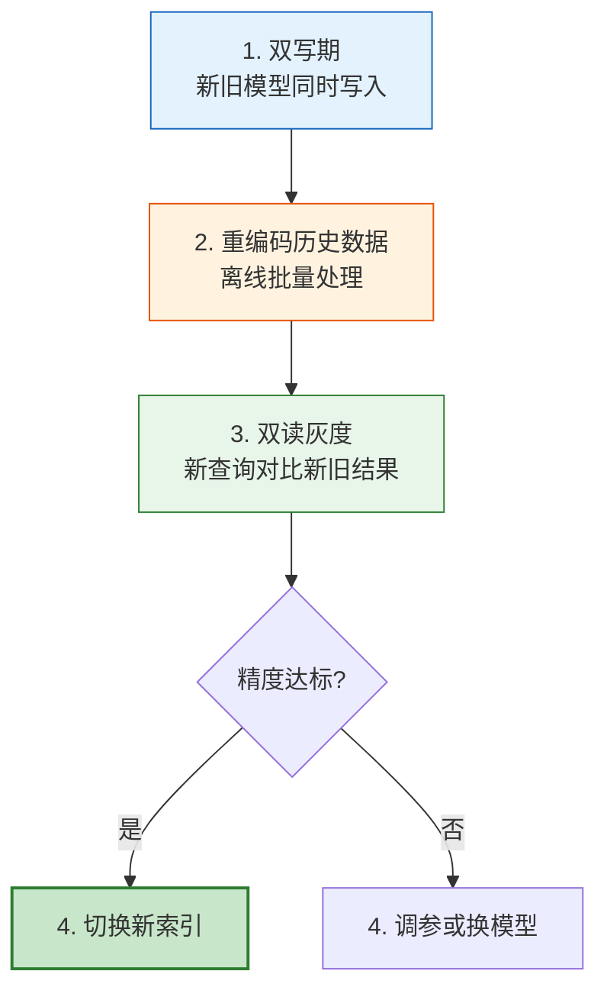

---

## 5. 性能评估指标与测试方法

### 5.1 指标体系

```mermaid
graph TB
    subgraph 评估指标体系
        A[精度指标]
        B[效率指标]
        C[成本指标]
    end

    A --> A1[Recall@K<br/>召回率]
    A --> A2[Precision@K<br/>精确率]
    A --> A3[MRR<br/>平均倒数排名]
    A --> A4[NDCG@K<br/>归一化折损累计增益]

    B --> B1[P50/P99 延迟]
    B --> B2[QPS<br/>吞吐量]

    C --> C1[存储 GB]
    C --> C2[GPU/CPU 成本]

    style A fill:#e3f2fd,stroke:#1565c0
    style B fill:#fff3e0,stroke:#e65100
    style C fill:#e8f5e9,stroke:#2e7d32
```

#### 关键指标定义

| 指标 | 公式 | 含义 | 目标值 |
|------|------|------|--------|
| Recall@5 | 相关结果数 / 应有结果数 | 前5中召回了多少相关 | >85% |
| Precision@5 | 相关结果数 / 5 | 前5中有多少相关 | >70% |
| MRR | 平均(1/rank) | 相关结果的排名质量 | >0.7 |
| NDCG@5 | DCG/IDCG | 考虑位置权重的质量 | >0.75 |
| P99 延迟 | 第99百分位响应时间 | 长尾延迟 | <200ms |
| 存储 | 向量库占用空间 | 成本指标 | 量化后降50%+ |

### 5.2 测试数据集构建

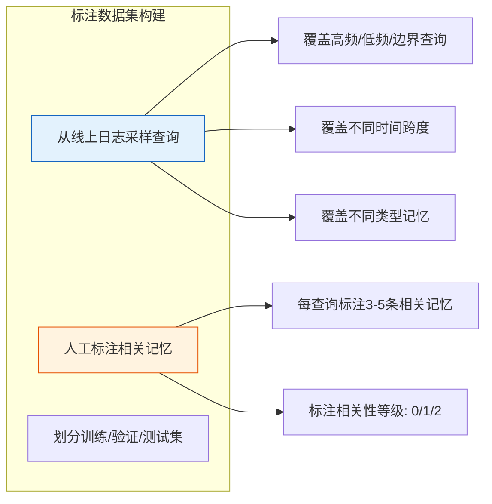

#### 标注规范示例

```python
# 标注数据格式
annotation = {
    "query": "用户上次说的退款理由是什么",
    "relevant_docs": [
        {"doc_id": "mem_001", "relevance": 2, "content": "客户要求退款，理由是商品质量不合格"},
        {"doc_id": "mem_045", "relevance": 1, "content": "用户反馈包装破损"},
    ],
    "irrelevant_docs": ["mem_123", "mem_456"],  # 已确认不相关
    "query_type": "task",  # 期望检索的记忆类型
    "time_preference": "recent"  # 期望近期记忆
}
```

### 5.3 离线评估流程

```python
import numpy as np
from typing import List


class RetrievalEvaluator:
    """检索质量评估器"""

    def __init__(self, test_cases: list):
        """
        :param test_cases: 标注数据列表
        """
        self.test_cases = test_cases

    def evaluate(self, retriever, top_k: int = 5):
        """评估 retriever 在测试集上的表现"""
        recalls, precisions, mrrs, ndcgs = [], [], [], []

        for case in self.test_cases:
            query = case["query"]
            relevant_ids = {d["doc_id"] for d in case["relevant_docs"]}
            relevance_grades = {d["doc_id"]: d["relevance"] for d in case["relevant_docs"]}

            # 检索
            results = retriever.retrieve(query, top_k=top_k)
            retrieved_ids = [r["doc_id"] for r in results]

            # 计算指标
            recalls.append(self._recall_at_k(retrieved_ids, relevant_ids, top_k))
            precisions.append(self._precision_at_k(retrieved_ids, relevant_ids, top_k))
            mrrs.append(self._mrr(retrieved_ids, relevant_ids))
            ndcgs.append(self._ndcg_at_k(retrieved_ids, relevance_grades, top_k))

        return {
            "Recall@K": np.mean(recalls),
            "Precision@K": np.mean(precisions),
            "MRR": np.mean(mrrs),
            "NDCG@K": np.mean(ndcgs),
        }

    def _recall_at_k(self, retrieved, relevant, k):
        hits = len(set(retrieved[:k]) & relevant)
        return hits / len(relevant) if relevant else 0

    def _precision_at_k(self, retrieved, relevant, k):
        hits = len(set(retrieved[:k]) & relevant)
        return hits / k

    def _mrr(self, retrieved, relevant):
        for i, doc_id in enumerate(retrieved):
            if doc_id in relevant:
                return 1.0 / (i + 1)
        return 0

    def _ndcg_at_k(self, retrieved, relevance_grades, k):
        dcg = sum(
            relevance_grades.get(doc_id, 0) / np.log2(i + 2)
            for i, doc_id in enumerate(retrieved[:k])
        )
        ideal = sorted(relevance_grades.values(), reverse=True)[:k]
        idcg = sum(g / np.log2(i + 2) for i, g in enumerate(ideal))
        return dcg / idcg if idcg > 0 else 0
```

### 5.4 在线 A/B 评估

#### 实施流程

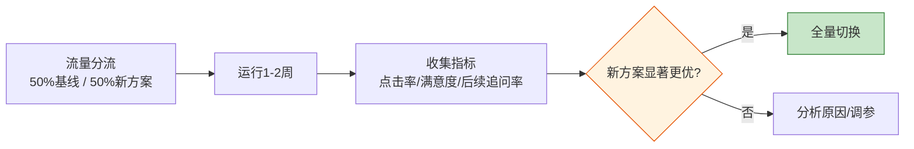

#### 在线指标

| 指标 | 采集方式 | 含义 |
|------|---------|------|
| 检索点击率 | 用户是否采用检索结果 | 隐式反馈质量 |
| 后续追问率 | 检索后是否追问澄清 | 低追问 = 检索精准 |
| 用户满意度 | 点赞/点踩 | 显式反馈 |
| 任务完成率 | 后续是否继续原任务 | 检索是否有效支撑 |

---

## 6. 预期效果与优化方向

### 6.1 预期效果

#### 量化预期

| 指标 | 优化前 | 阶段1后 | 阶段2后 | 阶段3后 |
|------|--------|---------|---------|---------|
| Recall@5 | 65% | 80% | 88% | 93% |
| Precision@5 | 55% | 70% | 78% | 85% |
| MRR | 0.55 | 0.70 | 0.78 | 0.85 |
| P99 延迟 | 320ms | 380ms | 180ms | 180ms |
| 存储占用 | 30GB | 30GB | 30GB | 15GB（量化后） |

#### 效果曲线

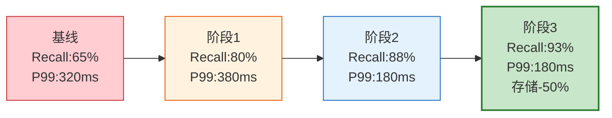

### 6.2 后续优化方向

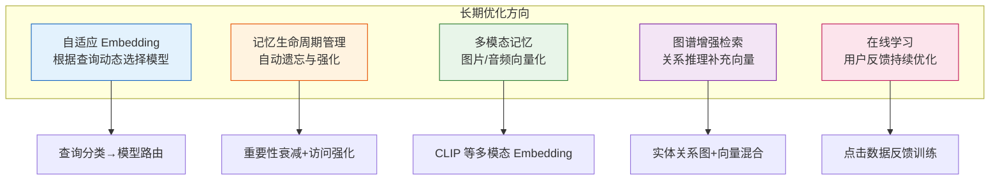

#### 详细优化方向

| 方向 | 核心思路 | 预期收益 | 实施难度 |
|------|---------|---------|---------|
| 自适应 Embedding | 查询分类器路由到不同 Embedding 模型 | +5% 精度 | 中 |
| 记忆生命周期 | 基于访问频率与时间的重要性衰减 | 减少噪声 | 中 |
| 多模态记忆 | 图片/音频统一向量化 | 扩展场景 | 高 |
| 图谱增强 | 实体关系图补充向量检索 | 多跳推理 | 高 |
| 在线学习 | 用户点击数据反馈训练 Embedding | 持续提升 | 高 |

---

## 7. 高频面试题与参考答案

### Q1：向量检索精准度随规模下降的根本原因是什么？

**参考答案**：

根本原因有三：

1. **维度灾难**：在高维空间中，任意两点间的距离趋于相同，相似度分数的区分度下降。规模越大，Top-K 中混入「近似但不相关」向量的概率越高。

2. **ANN 近似损失**：大规模下必须使用近似最近邻（HNSW/IVF），牺牲精度换速度。`efSearch` 等参数固定时，规模越大，实际扫描比例越低，漏召回越多。

3. **数据噪声累积**：长期运行中，重复、过时、低质记忆不断累积，挤占 Top-K 名额，导致真正相关的记忆被挤出。

### Q2：PQ 量化和 HNSW 索引如何选择？

**参考答案**：

两者解决不同问题，可组合使用：

- **HNSW**：基于图的精确索引，精度高但内存占用大。适合 <500 万规模，精度优先场景。
- **PQ**：压缩存储，精度有损但内存占用小。适合 >500 万，成本优先场景。
- **IVF-PQ**：组合使用，先用 IVF 粗筛桶，桶内用 PQ。兼顾精度与成本，是大规模首选。

选择决策树：
```
规模 <100万 → HNSW（精度优先）
规模 100万-1000万 → IVF-HNSW 或 HNSW+SQ
规模 >1000万 → IVF-PQ（成本优先）
```

### Q3：如何设计一个自适应阈值方案？

**参考答案**：

核心思路是**基于检索结果分数分布的拐点检测**：

1. 检索 Top-N（N=20）候选，按分数降序排列。
2. 计算相邻分数差 `diff[i] = score[i] - score[i+1]`。
3. 找到最大落差位置 `argmin(diff)`，若落差显著（>0.05），在该处截断。
4. 若无显著断点，取分数 > min_threshold 的结果，上限为 default_top_k。

此外，可以结合查询类型调整：事实查询阈值高（0.8），闲聊查询阈值低（0.6）。

### Q4：混合检索中，RRF 融合相比加权融合有什么优势？

**参考答案**：

**RRF（Reciprocal Rank Fusion）优势**：

1. **无需归一化**：不同检索器的分数尺度不同（向量是 0-1，BM25 是 0-∞），加权融合需归一化，RRF 只用排名，天然兼容。
2. **对异常值鲁棒**：某个检索器对某查询表现极差时，加权融合会被拉低，RRF 只看排名，影响有限。
3. **参数少**：只需调 `rrf_k`（通常 60），加权融合需调多个权重。

公式：`rrf_score(d) = Σ 1/(k + rank_i(d))`，其中 `rank_i(d)` 是文档 d 在第 i 个检索器中的排名。

### Q5：Cross-Encoder 重排为什么比双塔模型精度高？

**参考答案**：

**根本差异**：

- **双塔模型（Bi-Encoder）**：查询和文档独立编码，最后计算相似度。两者在编码时无交互，丢失细粒度匹配信息。
- **Cross-Encoder**：将 `[query, document]` 拼接后输入 Transformer，每一层都有 query 和 document 的 token 交互，捕获细粒度语义匹配。

**代价**：Cross-Encoder 无法预计算文档向量，查询时需对每个候选实时计算，速度慢。因此只用于对 Top-50 候选精排。

### Q6：全量重编码 Embedding 时如何保证服务不中断？

**参考答案**：

采用**双写双读灰度切换**策略：

1. **双写期**：新写入的记忆同时用新旧模型编码，存入新旧两个索引。
2. **重编码历史**：离线批量对历史记忆用新模型编码，写入新索引。
3. **双读灰度**：查询时同时检索新旧索引，对比结果。灰度比例从 10% 逐步提升。
4. **精度达标后切换**：新索引精度验证通过后，全量切换到新索引，下线旧索引。

关键：双写期间存储成本翻倍，需预留容量；灰度期需监控异常查询。

### Q7：如何评估检索系统的真实业务价值？

**参考答案**：

离线指标（Recall/Precision）只是技术指标，业务价值需在线评估：

1. **检索点击率**：用户是否采用检索结果（隐式反馈）。
2. **后续追问率**：检索后是否追问澄清——低追问说明检索精准。
3. **任务完成率**：检索是否有效支撑了任务完成。
4. **用户满意度**：显式点赞/点踩。

最佳实践：离线指标作为快速迭代的 gate，在线 A/B 作为最终决策依据。

### Q8：记忆去重时，如何避免误删语义相似但含义不同的记忆？

**参考答案**：

去重的关键不是相似度阈值，而是**语义等价性判断**：

1. **高阈值聚类**：设相似度 > 0.92 聚为一类（非常相似）。
2. **LLM 辅助判断**：对每类候选用 LLM 判断「这些记忆是否表达同一信息？」，LLM 确认等价才合并。
3. **保留信息最丰富的代表**：取最长或包含最多实体的记忆作为代表。
4. **合并而非删除**：将被合并记忆的 metadata 指向代表，保留可追溯性。

```python
# LLM 辅助去重判断
def are_semantically_equivalent(mem1, mem2, llm):
    prompt = f"""判断以下两条记忆是否表达完全相同的信息（是/否）：
    记忆1：{mem1}
    记忆2：{mem2}
    只回答"是"或"否"。"""
    return llm.generate(prompt).strip() == "是"
```

---

## 8. 总结与记忆口诀

### 核心方案速记

> **混合检索补鸿沟，**
> **分层索引减范围，**
> **动态阈值自适应，**
> **Embedding 升级根治本。**

### 方案选择决策树

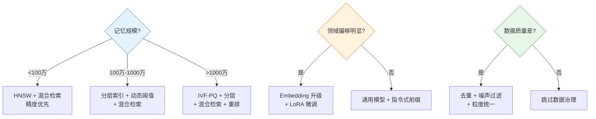

### 面试加分项

| 加分点 | 说明 |
|--------|------|
| **量化数据** | 给出规模、Recall、延迟等具体数字 |
| **权衡取舍** | 说明为何选 PQ 而非 HNSW，成本与精度权衡 |
| **分阶段实施** | 体现工程思维，而非一步到位 |
| **离线+在线评估** | 强调技术指标与业务指标并重 |
| **兜底方案** | 阈值失效时的查询改写、回退策略 |
| **可观测性** | 检索质量监控、分数分布追踪、报警机制 |
