# CrewAI 多智能体框架详解

> **核心观点**：CrewAI 是一款以"角色扮演"为核心范式的多智能体协作框架，通过 Agent、Task、Crew 三大组件的有机结合，模拟真实团队的工作方式完成复杂任务。它强调"流程驱动 + 角色分工"，比 AutoGen 更可控，比 OpenClaw 更贴近开发者，是构建业务流程自动化系统的理想选择。

---

## 目录

- [CrewAI 多智能体框架详解](#crewai-多智能体框架详解)
  - [一、CrewAI 基础认知](#一crewai-基础认知)
    - [1.1 什么是 CrewAI](#11-什么是-crewai)
    - [1.2 核心特性](#12-核心特性)
    - [1.3 应用场景](#13-应用场景)
    - [1.4 版本演进与生态](#14-版本演进与生态)
  - [二、三大核心组件深度解析](#二三大核心组件深度解析)
    - [2.1 Agent 智能体](#21-agent-智能体)
    - [2.2 Task 任务](#22-task-任务)
    - [2.3 Crew 团队](#23-crew-团队)
  - [三、协作流程与工具系统](#三协作流程与工具系统)
    - [3.1 任务分配机制](#31-任务分配机制)
    - [3.2 多智能体协作模式](#32-多智能体协作模式)
    - [3.3 工具集成方法](#33-工具集成方法)
  - [四、框架对比分析](#四框架对比分析)
    - [4.1 技术架构对比](#41-技术架构对比)
    - [4.2 功能特性对比](#42-功能特性对比)
    - [4.3 性能表现对比](#43-性能表现对比)
    - [4.4 适用场景对比](#44-适用场景对比)
    - [4.5 选型决策树](#45-选型决策树)
  - [五、总结与展望](#五总结与展望)

---

## 一、CrewAI 基础认知

### 1.1 什么是 CrewAI

**CrewAI** 是一款开源的多智能体协作框架，由 João Moura 于 2023 年底创建，核心理念是"让多个 AI Agent 像真实团队一样协作完成复杂任务"。它通过**角色扮演（Role-Playing）** 机制，让每个 Agent 扮演特定角色（如产品经理、开发工程师、测试工程师），按照预定义的流程协同工作。

**一句话定义**：CrewAI = 角色扮演 Agent + 流程驱动任务 + 团队协作编排。

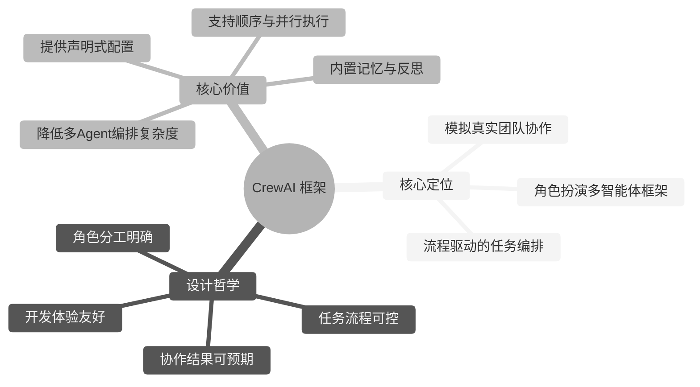

**与同类框架的本质区别**：

| 框架 | 核心范式 | 协作方式 | 可控性 |
|------|----------|----------|--------|
| **CrewAI** | 角色扮演 + 流程驱动 | 按预定义流程协作 | ⭐⭐⭐⭐ |
| **AutoGen** | 对话驱动 | Agent 自由对话协商 | ⭐⭐⭐ |
| **OpenClaw** | Markdown 配置驱动 | 单 Agent 自主规划 | ⭐⭐ |
| **LangGraph** | 图式驱动 | 节点间状态传递 | ⭐⭐⭐⭐⭐ |

### 1.2 核心特性

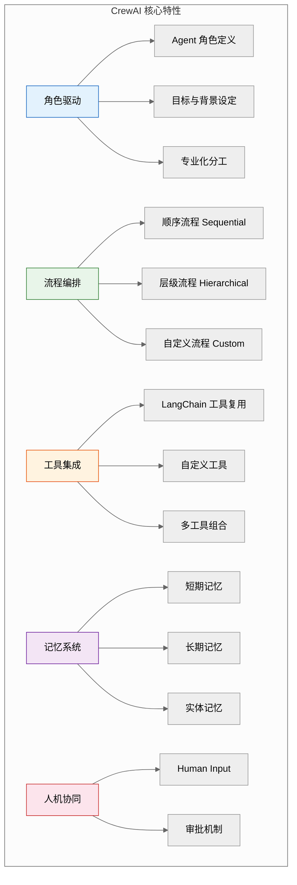

**核心特性速查表**：

| 特性 | 说明 | 优势 |
|------|------|------|
| **角色扮演** | 每个 Agent 有明确的角色、目标、背景 | 模拟真实团队，分工清晰 |
| **流程驱动** | 支持顺序、层级、自定义三种流程 | 协作过程可控可预期 |
| **声明式配置** | 通过 Python 数据类或 YAML 配置 | 开发体验友好，易于维护 |
| **工具复用** | 原生兼容 LangChain 工具生态 | 工具丰富，开箱即用 |
| **内置记忆** | 短期/长期/实体三种记忆类型 | 支持上下文累积与知识沉淀 |
| **人机协同** | 支持 Human-in-the-Loop | 关键决策可人工介入 |
| **结果解析** | Pydantic 模型结构化输出 | 结果可被程序消费 |
| **多模型支持** | OpenAI、Anthropic、Ollama、本地模型 | 模型选择灵活 |

### 1.3 应用场景

| 场景 | 典型实现 | Agent 角色配置 |
|------|----------|----------------|
| **软件开发** | 自动化代码生成、审查、测试 | 产品经理、架构师、开发、测试、运维 |
| **内容生产** | 文章撰写、视频脚本、营销文案 | 策划、撰稿、编辑、校对、SEO 优化 |
| **数据分析** | 数据清洗、分析、可视化、报告 | 数据采集员、分析师、可视化专家、报告撰写者 |
| **研究调查** | 市场调研、竞品分析、行业报告 | 研究员、分析师、撰稿人、审阅者 |
| **客户支持** | 多轮客服、工单处理、满意度回访 | 接待员、问题诊断、业务办理、回访员 |
| **项目管理** | 任务分解、进度跟踪、风险预警 | 项目经理、任务协调员、风险评估员 |
| **投资分析** | 股票研究、财报分析、投资建议 | 数据采集员、财务分析师、风险评估员、投资顾问 |

**典型应用案例 - 自动化内容生产流水线**：

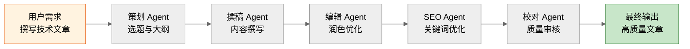

### 1.4 版本演进与生态

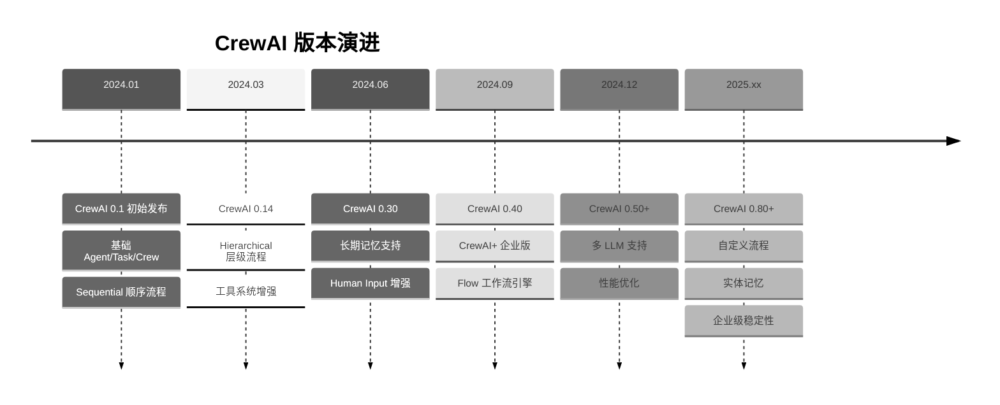

**生态组件**：

| 组件 | 说明 | 用途 |
|------|------|------|
| **CrewAI Core** | 核心框架 | Agent/Task/Crew 基础能力 |
| **CrewAI Tools** | 内置工具集 | 搜索、爬虫、文件操作等 |
| **CrewAI+** | 企业版 | 可视化界面、监控、部署 |
| **CrewAI Flows** | 工作流引擎 | 复杂事件驱动工作流 |
| **CrewAI CLI** | 命令行工具 | 项目脚手架、模板生成 |

**安装方式**：

```bash
# 安装核心包
pip install crewai

# 安装内置工具
pip install 'crewai[tools]'

# 安装企业版 CLI
pip install crewai-plus

# 验证安装
crewai version
```

---

## 二、三大核心组件深度解析

CrewAI 的核心由三大组件构成：**Agent（智能体）、Task（任务）、Crew（团队）**。它们的关系如下图所示：

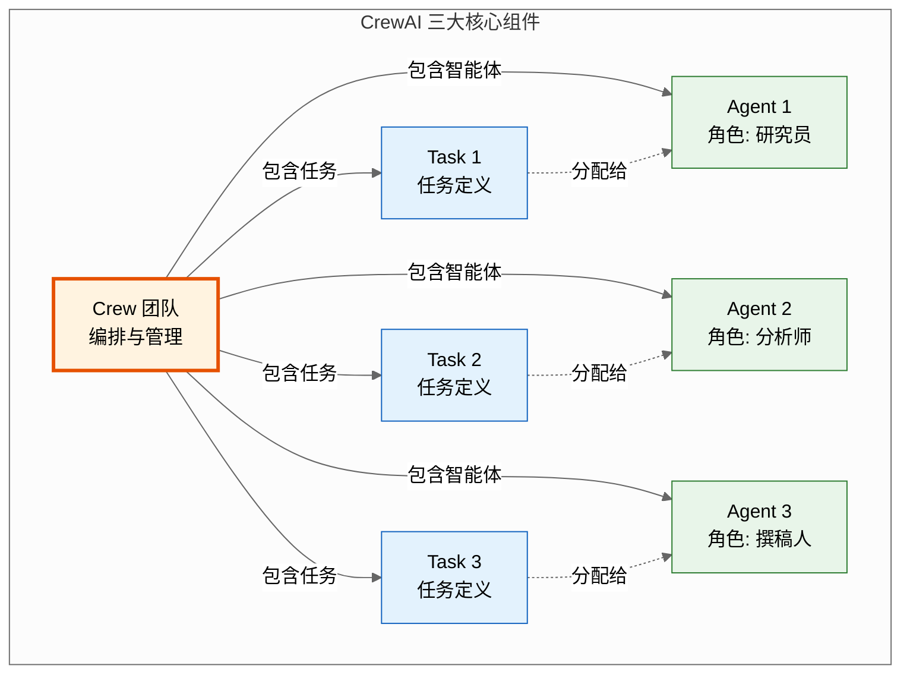

### 2.1 Agent 智能体

Agent 是 CrewAI 中的基本执行单元，每个 Agent 扮演一个特定角色，具备独立的目标、背景和工具集。

#### 2.1.1 Agent 核心属性

```python
from crewai import Agent, LLM

# Agent 核心属性示例
researcher = Agent(
    role="资深研究员",                    # 角色名称
    goal="收集并整理关于 {topic} 的最新信息",  # 目标
    backstory="""你是一位拥有 10 年经验的研究员,
    擅长从多来源收集信息并交叉验证。
    你注重信息的准确性和时效性。""",      # 背景故事
    llm=LLM(model="gpt-4o", temperature=0.7),  # LLM 配置
    tools=[search_tool, scrape_tool],    # 工具列表
    verbose=True,                        # 详细日志
    memory=True,                         # 启用记忆
    max_iter=15,                         # 最大迭代次数
    max_rpm=10,                          # 每分钟最大请求数
    allow_delegation=False,              # 是否允许委派任务
    step_callback=None,                  # 步骤回调
)
```

#### 2.1.2 Agent 参数详解

| 参数 | 类型 | 必填 | 说明 |
|------|------|------|------|
| `role` | str | ✅ | 角色名称，定义 Agent 的身份 |
| `goal` | str | ✅ | 目标描述，Agent 努力的方向 |
| `backstory` | str | ✅ | 背景故事，塑造 Agent 的性格与专长 |
| `llm` | LLM/str | ❌ | LLM 配置，默认使用 OpenAI |
| `tools` | list | ❌ | 可用工具列表 |
| `verbose` | bool | ❌ | 是否输出详细日志，默认 False |
| `memory` | bool | ❌ | 是否启用记忆，默认 False |
| `max_iter` | int | ❌ | 最大推理迭代次数，默认 25 |
| `max_rpm` | int | ❌ | 每分钟最大请求数（限流） |
| `allow_delegation` | bool | ❌ | 是否允许委派任务给其他 Agent |
| `step_callback` | func | ❌ | 每步执行的回调函数 |
| `system_template` | str | ❌ | 自定义系统提示模板 |
| `prompt_template` | str | ❌ | 自定义提示模板 |
| `response_template` | str | ❌ | 自定义响应模板 |

#### 2.1.3 Agent 角色设计原则

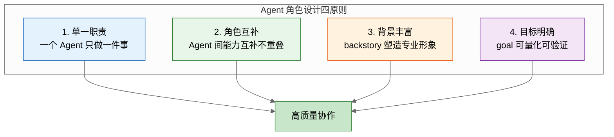

**角色设计模板**：

```python
# 标准化角色定义模板
class AgentTemplates:
    """常用 Agent 角色模板"""

    @staticmethod
    def researcher(topic: str) -> Agent:
        return Agent(
            role=f"资深 {topic} 研究员",
            goal=f"收集关于 {topic} 的全面、准确、最新的信息",
            backstory=f"""你是一位在 {topic} 领域深耕多年的研究员,
            拥有丰富的学术背景和实战经验。
            你擅长从多来源收集信息,并具备交叉验证能力。
            你的研究以严谨、客观、全面著称。""",
            tools=[search_tool, scrape_tool],
            verbose=True,
            memory=True,
        )

    @staticmethod
    def writer(topic: str) -> Agent:
        return Agent(
            role=f"{topic} 专栏作家",
            goal=f"将研究结果转化为通俗易懂的高质量文章",
            backstory=f"""你是一位资深技术作家,
            擅长将复杂的技术概念转化为易懂的文字。
            你的文章以逻辑清晰、表达精准、可读性强著称。""",
            verbose=True,
        )

    @staticmethod
    def reviewer() -> Agent:
        return Agent(
            role="内容质量审核专家",
            goal="确保内容准确、完整、符合质量标准",
            backstory="""你是一位严格的质量审核专家,
            对内容的准确性、完整性、可读性有极高要求。
            你会逐字逐句审核,确保输出质量。""",
            verbose=True,
        )
```

### 2.2 Task 任务

Task 是 CrewAI 中的工作单元，定义了需要完成的具体工作、执行者、期望输出等。

#### 2.2.1 Task 核心属性

```python
from crewai import Task
from pydantic import BaseModel

# 定义结构化输出模型
class ResearchReport(BaseModel):
    title: str
    summary: str
    key_findings: list[str]
    sources: list[str]
    confidence_score: float

# Task 核心属性示例
research_task = Task(
    description="""研究 {topic} 的最新发展趋势,包括:
    1. 技术演进路线
    2. 主要参与者与竞争格局
    3. 未来 3 年的发展预测
    
    请确保信息来源可靠,数据准确。""",      # 任务描述
    expected_output="一份结构化的研究报告,包含摘要、关键发现、信息来源",  # 期望输出
    agent=researcher,                    # 执行 Agent
    context=[],                          # 上下文(依赖其他任务输出)
    output_pydantic=ResearchReport,      # 结构化输出模型
    output_file="reports/research.md",   # 输出文件路径
    human_input=False,                   # 是否需要人工输入
    async_execution=False,               # 是否异步执行
)
```

#### 2.2.2 Task 参数详解

| 参数 | 类型 | 必填 | 说明 |
|------|------|------|------|
| `description` | str | ✅ | 任务描述，详细说明要做什么 |
| `expected_output` | str | ✅ | 期望输出的描述 |
| `agent` | Agent | ✅ | 执行该任务的 Agent |
| `context` | list | ❌ | 依赖的其他 Task（提供上下文） |
| `output_pydantic` | BaseModel | ❌ | Pydantic 模型，结构化输出 |
| `output_json` | BaseModel | ❌ | JSON Schema 输出 |
| `output_file` | str | ❌ | 输出保存到文件 |
| `human_input` | bool | ❌ | 是否需要人工输入 |
| `async_execution` | bool | ❌ | 是否异步执行（并行） |
| `config` | dict | ❌ | 任务配置 |
| `callback` | func | ❌ | 任务完成回调 |

#### 2.2.3 任务依赖与上下文

```python
# 任务依赖链示例
research_task = Task(
    description="研究 {topic} 的最新趋势",
    expected_output="研究报告",
    agent=researcher,
)

# analysis_task 依赖 research_task 的输出
analysis_task = Task(
    description="基于研究结果,分析 {topic} 的投资价值",
    expected_output="投资分析报告",
    agent=analyst,
    context=[research_task],  # 引用前序任务输出作为上下文
)

# writing_task 依赖 analysis_task 的输出
writing_task = Task(
    description="将分析结果撰写为易懂的投资建议文章",
    expected_output="投资建议文章",
    agent=writer,
    context=[research_task, analysis_task],  # 可引用多个任务
)
```

**任务依赖关系图**：

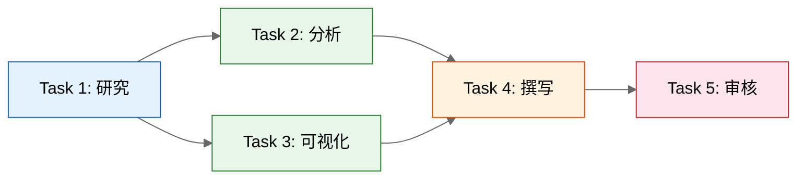

### 2.3 Crew 团队

Crew 是 CrewAI 中的顶层编排单元，管理一组 Agent 和 Task，定义协作流程。

#### 2.3.1 Crew 核心属性

```python
from crewai import Crew, Process

# Crew 核心属性示例
crew = Crew(
    agents=[researcher, analyst, writer, reviewer],  # Agent 列表
    tasks=[research_task, analysis_task, writing_task, review_task],  # Task 列表
    process=Process.sequential,          # 流程类型
    verbose=True,                        # 详细日志
    memory=True,                         # 团队记忆
    cache=True,                          # 缓存
    max_rpm=100,                         # 团队级限流
    manager_llm=LLM(model="gpt-4o"),     # 管理者 LLM(层级流程)
    language="zh",                       # 输出语言
    full_output=True,                    # 完整输出
    share_crew=False,                    # 是否共享数据
    step_callback=lambda step: print(f"完成步骤: {step}"),
)
```

#### 2.3.2 Crew 参数详解

| 参数 | 类型 | 必填 | 说明 |
|------|------|------|------|
| `agents` | list | ✅ | Agent 列表 |
| `tasks` | list | ✅ | Task 列表 |
| `process` | Process | ❌ | 流程类型，默认 sequential |
| `verbose` | bool | ❌ | 详细日志 |
| `memory` | bool | ❌ | 团队记忆 |
| `cache` | bool | ❌ | 结果缓存 |
| `max_rpm` | int | ❌ | 团队级限流 |
| `manager_llm` | LLM | ❌ | 层级流程的管理者 LLM |
| `language` | str | ❌ | 输出语言 |
| `full_output` | bool | ❌ | 返回完整输出 |
| `share_crew` | bool | ❌ | 共享运行数据 |
| `step_callback` | func | ❌ | 步骤回调 |
| `planning` | bool | ❌ | 是否启用规划阶段 |

#### 2.3.3 三种流程类型

**1. 顺序流程（Sequential）**

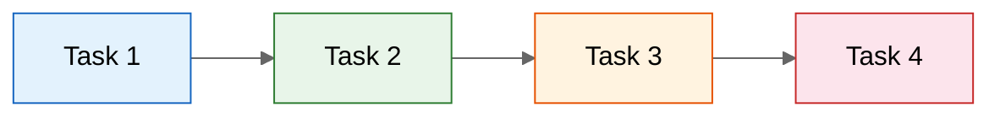

```python
# 顺序流程：任务按顺序依次执行
crew = Crew(
    agents=[agent1, agent2, agent3],
    tasks=[task1, task2, task3],
    process=Process.sequential,  # 顺序执行
)
```

**2. 层级流程（Hierarchical）**

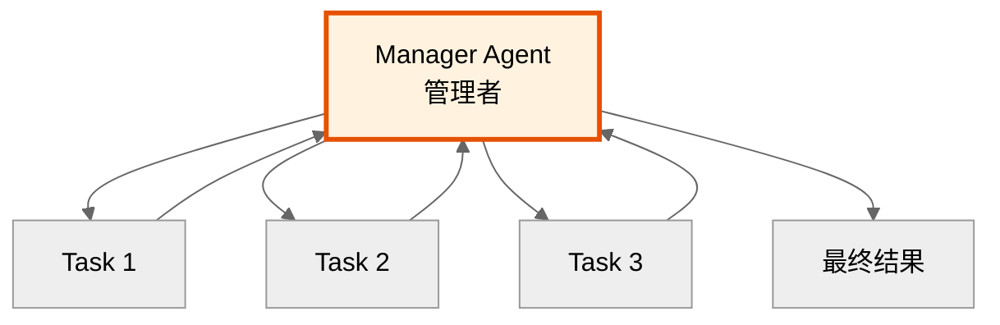

```python
# 层级流程：由 Manager Agent 统一调度
crew = Crew(
    agents=[agent1, agent2, agent3],
    tasks=[task1, task2, task3],
    process=Process.hierarchical,  # 层级执行
    manager_llm=LLM(model="gpt-4o"),  # 必须指定管理者 LLM
)
```

**3. 三种流程对比**：

| 维度 | Sequential | Hierarchical |
|------|-----------|--------------|
| **执行方式** | 按任务列表顺序 | Manager 动态调度 |
| **灵活性** | 低 | 高 |
| **可控性** | 高 | 中 |
| **适用场景** | 流程明确的任务 | 复杂动态任务 |
| **Manager** | 不需要 | 必须 |
| **任务委派** | 不支持 | 支持 |

---

## 三、协作流程与工具系统

### 3.1 任务分配机制

CrewAI 的任务分配机制决定了 Task 如何被分配给 Agent 执行，是协作流程的核心。

#### 3.1.1 任务分配方式

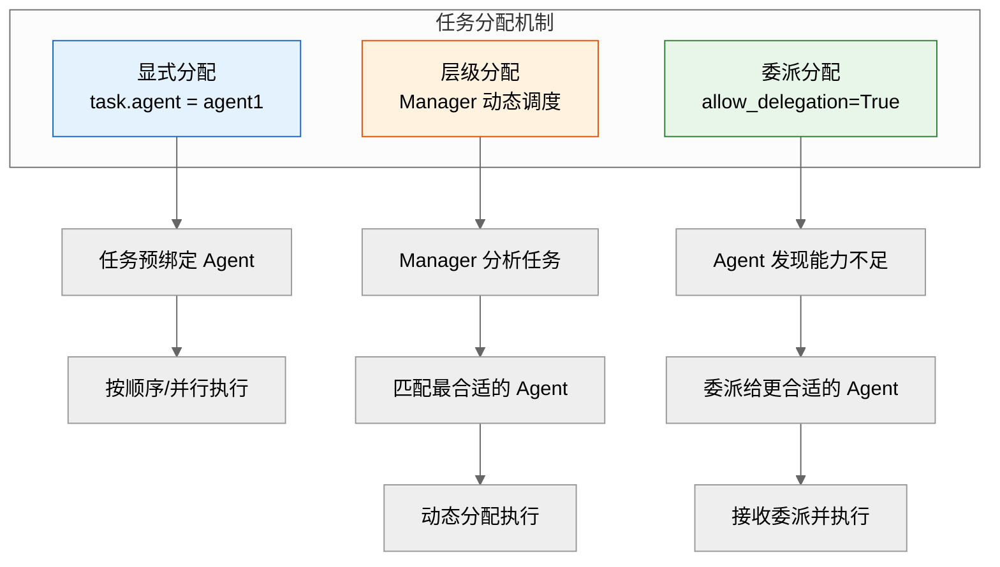

**1. 显式分配（最常用）**

```python
# 显式分配：创建 Task 时指定 agent
research_task = Task(
    description="研究 AI 发展趋势",
    expected_output="研究报告",
    agent=researcher,  # 显式指定执行 Agent
)
```

**2. 层级分配（Manager 调度）**

```python
# 层级分配：Manager 根据任务内容动态分配
crew = Crew(
    agents=[researcher, analyst, writer],
    tasks=[task1, task2, task3],
    process=Process.hierarchical,  # 启用层级流程
    manager_llm=LLM(model="gpt-4o"),
    # Manager 会自动分析每个 Task 并分配给最合适的 Agent
)
```

**3. 委派分配（Agent 间协作）**

```python
# 委派分配：允许 Agent 将任务委派给其他 Agent
researcher = Agent(
    role="研究员",
    goal="收集信息",
    backstory="擅长研究...",
    allow_delegation=True,  # 允许委派
)

# 当研究员发现需要数据分析时,可以委派给分析师
```

#### 3.1.2 任务执行顺序

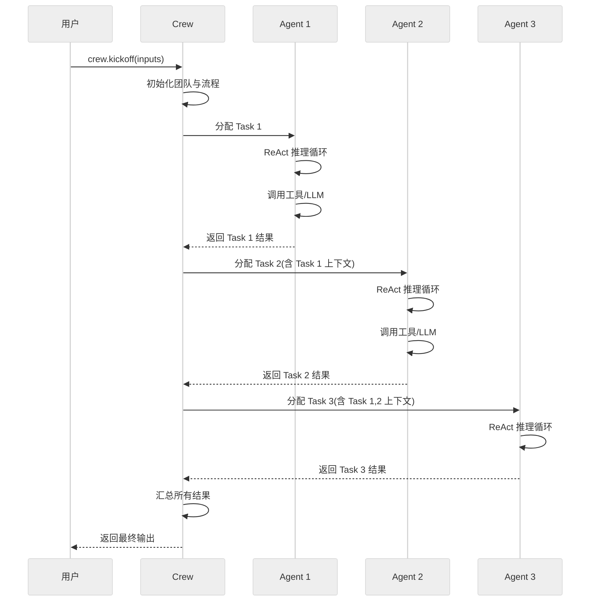

#### 3.1.3 异步并行执行

```python
from crewai import Task

# 异步执行：多个无依赖任务可并行
data_collection_task = Task(
    description="从 API 采集数据",
    expected_output="原始数据集",
    agent=collector,
    async_execution=True,  # 异步执行
)

market_research_task = Task(
    description="调研市场情况",
    expected_output="市场调研报告",
    agent=researcher,
    async_execution=True,  # 异步执行
)

# 汇总任务：依赖前两个异步任务
summary_task = Task(
    description="汇总数据与调研结果",
    expected_output="综合分析报告",
    agent=analyst,
    context=[data_collection_task, market_research_task],  # 等待前两个完成
    async_execution=False,  # 同步执行
)

crew = Crew(
    agents=[collector, researcher, analyst],
    tasks=[data_collection_task, market_research_task, summary_task],
    process=Process.sequential,
)
```

### 3.2 多智能体协作模式

CrewAI 支持多种协作模式，适配不同的业务场景：

#### 3.2.1 顺序协作模式

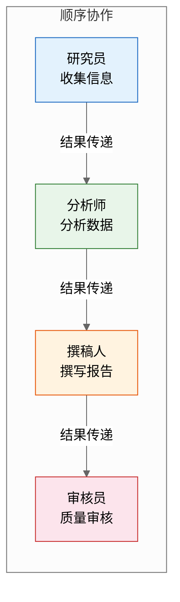

**适用场景**：流程明确的流水线作业，如内容生产、报告撰写。

```python
# 顺序协作完整示例
from crewai import Agent, Task, Crew, Process, LLM

# 创建 LLM
llm = LLM(model="gpt-4o", temperature=0.7)

# 创建 Agents
researcher = Agent(
    role="研究员",
    goal="收集 {topic} 的全面信息",
    backstory="你是资深研究员,擅长信息收集与验证。",
    llm=llm,
    tools=[search_tool],
    verbose=True,
)

analyst = Agent(
    role="数据分析师",
    goal="分析研究数据,发现关键洞察",
    backstory="你是数据分析专家,擅长从信息中提取价值。",
    llm=llm,
    verbose=True,
)

writer = Agent(
    role="技术作家",
    goal="将分析结果转化为高质量文章",
    backstory="你是资深技术作家,擅长通俗化表达。",
    llm=llm,
    verbose=True,
)

# 创建 Tasks(顺序依赖)
research_task = Task(
    description="研究 {topic} 的最新发展,包括技术趋势、主要参与者、未来预测",
    expected_output="详细的研究报告,包含数据与来源",
    agent=researcher,
)

analysis_task = Task(
    description="基于研究报告,分析 {topic} 的核心价值与风险",
    expected_output="分析报告,包含关键洞察与建议",
    agent=analyst,
    context=[research_task],
)

writing_task = Task(
    description="将研究与分析结果撰写为 2000 字的深度文章",
    expected_output="结构完整、可读性强的文章",
    agent=writer,
    context=[research_task, analysis_task],
)

# 创建 Crew(顺序流程)
crew = Crew(
    agents=[researcher, analyst, writer],
    tasks=[research_task, analysis_task, writing_task],
    process=Process.sequential,
    verbose=True,
)

# 执行
result = crew.kickoff(inputs={"topic": "多智能体系统"})
print(result)
```

#### 3.2.2 层级协作模式

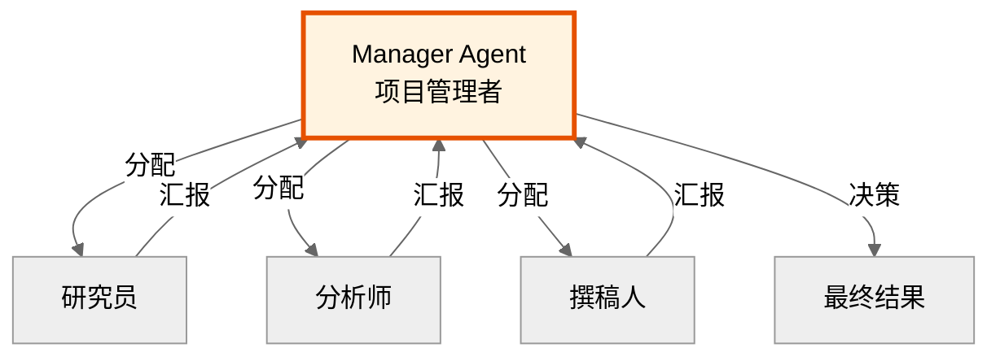

**适用场景**：复杂动态任务，需要统一调度与决策。

```python
# 层级协作示例
crew = Crew(
    agents=[researcher, analyst, writer],
    tasks=[task1, task2, task3],
    process=Process.hierarchical,
    manager_llm=LLM(model="gpt-4o"),  # 必须指定 Manager LLM
    verbose=True,
)
```

#### 3.2.3 协作模式对比

| 维度 | 顺序协作 | 层级协作 |
|------|----------|----------|
| **决策方式** | 预定义顺序 | Manager 动态决策 |
| **灵活性** | 低 | 高 |
| **可控性** | 高 | 中 |
| **Agent 自主性** | 低 | 高 |
| **适用规模** | 小型(3-5 Agent) | 中大型(5-10 Agent) |
| **典型场景** | 流水线作业 | 复杂项目管理 |
| **调试难度** | 易 | 中 |

### 3.3 工具集成方法

工具是 Agent 与外部世界交互的桥梁，CrewAI 提供丰富的工具集成能力。

#### 3.3.1 工具集成架构

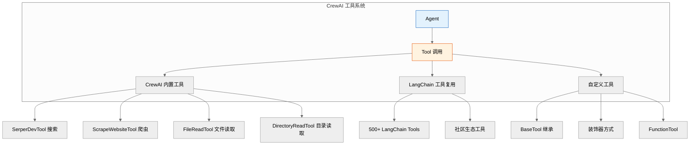

#### 3.3.2 内置工具使用

```python
from crewai_tools import (
    SerperDevTool,        # Google 搜索
    ScrapeWebsiteTool,    # 网页爬取
    FileReadTool,         # 文件读取
    DirectoryReadTool,    # 目录读取
    MDXSearchTool,        # Markdown 搜索
    CodeDocsSearchTool,   # 代码文档搜索
)

# 使用内置工具
search_tool = SerperDevTool(api_key="your-serper-key")
scrape_tool = ScrapeWebsiteTool()
file_read_tool = FileReadTool()

# 将工具分配给 Agent
researcher = Agent(
    role="研究员",
    goal="收集最新信息",
    backstory="你是资深研究员...",
    tools=[search_tool, scrape_tool, file_read_tool],
)
```

#### 3.3.3 自定义工具

**方式一：继承 BaseTool**

```python
from crewai.tools import BaseTool

class DatabaseQueryTool(BaseTool):
    """数据库查询工具"""
    
    name: str = "database_query"
    description: str = "查询数据库获取信息,输入 SQL 语句"
    
    def _run(self, query: str) -> str:
        """执行查询"""
        # 实际数据库查询逻辑
        import sqlite3
        conn = sqlite3.connect("app.db")
        cursor = conn.execute(query)
        results = cursor.fetchall()
        conn.close()
        return str(results)

# 使用自定义工具
db_tool = DatabaseQueryTool()

analyst = Agent(
    role="数据分析师",
    goal="从数据库提取洞察",
    backstory="你是数据分析专家...",
    tools=[db_tool],
)
```

**方式二：装饰器方式**

```python
from crewai.tools import tool

@tool("天气查询工具")
def get_weather(city: str) -> str:
    """查询指定城市的天气信息
    
    Args:
        city: 城市名称,如"北京"
    
    Returns:
        天气信息字符串
    """
    # 实际天气查询逻辑
    import requests
    response = requests.get(
        f"https://api.weather.com/v1?city={city}"
    )
    return response.json()["description"]

# 使用装饰器工具
weather_agent = Agent(
    role="天气播报员",
    goal="提供准确的天气信息",
    backstory="你是专业气象分析师...",
    tools=[get_weather],
)
```

#### 3.3.4 复用 LangChain 工具

```python
from langchain_community.tools import (
    DuckDuckGoSearchRun,
    PythonREPLTool,
    ShellTool,
)
from crewai.tools.structured_tool import CrewStructuredTool

# 将 LangChain 工具适配为 CrewAI 工具
search_tool = CrewStructuredTool.from_langchain(
    DuckDuckGoSearchRun()
)

python_tool = CrewStructuredTool.from_langchain(
    PythonREPLTool()
)

# 混合使用 CrewAI 与 LangChain 工具
developer = Agent(
    role="全栈开发者",
    goal="编写并执行代码解决问题",
    backstory="你是资深全栈开发者...",
    tools=[search_tool, python_tool, db_tool],
)
```

#### 3.3.5 工具选择策略

| 工具类型 | 适用场景 | 推荐来源 |
|----------|----------|----------|
| **搜索类** | 信息检索、实时数据 | SerperDevTool、DuckDuckGo |
| **爬虫类** | 网页内容提取 | ScrapeWebsiteTool |
| **文件类** | 本地文件读写 | FileReadTool、DirectoryReadTool |
| **代码执行** | 动态计算、脚本运行 | PythonREPLTool、ShellTool |
| **数据库** | 数据查询、业务数据 | 自定义 BaseTool |
| **API 调用** | 第三方服务集成 | 自定义装饰器工具 |

---

## 四、框架对比分析

本章从技术架构、功能特性、性能表现、适用场景四个维度，对 CrewAI、AutoGen、OpenClaw 三大框架进行系统对比，为技术选型提供客观参考。

### 4.1 技术架构对比

#### 4.1.1 三框架架构总览

```mermaid
%%{init: {'theme': 'neutral'}}%%
graph TB
    subgraph CrewAI 架构
        CA1[Agent 角色层] --> CA2[Task 任务层]
        CA2 --> CA3[Crew 编排层]
        CA3 --> CA4[Process 流程引擎]
    end

    subgraph AutoGen 架构
        AG1[autogen_core 抽象层] --> AG2[autogen_agentchat 对话层]
        AG2 --> AG3[autogen_ext 扩展层]
        AG3 --> AG4[autogen_studio 可视化]
    end

    subgraph OpenClaw 架构
        OC1[SOUL.md 配置层] --> OC2[Gateway 网关层]
        OC2 --> OC3[Core 编排层]
        OC3 --> OC4[Channels 渠道层]
    end

    style CA1 fill:#e3f2fd,stroke:#1565c0
    style AG1 fill:#e8f5e9,stroke:#2e7d32
    style OC1 fill:#fff3e0,stroke:#e65100
```

#### 4.1.2 架构差异详解

| 维度 | CrewAI | AutoGen | OpenClaw |
|------|--------|---------|----------|
| **核心范式** | 角色扮演 + 流程驱动 | 对话驱动 | Markdown 配置驱动 |
| **开发语言** | Python | Python | Node.js (TypeScript) |
| **运行方式** | 嵌入式库 | 嵌入式库 + Studio | 独立网关服务 |
| **Agent 定义** | Python 代码 (Agent 类) | Python 代码 (AssistantAgent) | Markdown (SOUL.md) |
| **编排方式** | Crew 统一编排 | GroupChat/Swarm 对话 | Orchestrator 路由 |
| **状态管理** | Task context 传递 | Shared State 共享 | Gateway 会话管理 |
| **扩展方式** | 继承 BaseTool | 实现 Protocol | ClawHub 技能市场 |
| **部署形态** | pip 依赖 | pip 依赖 + Studio 服务 | Docker/npm 全局 |
| **多语言** | Python | Python | Node.js |
| **可视化** | CrewAI+ (企业版) | AutoGen Studio (开源) | 无 (配置文件) |

#### 4.1.3 Agent 定义方式对比

**CrewAI：角色化代码定义**

```python
from crewai import Agent, LLM

researcher = Agent(
    role="资深研究员",
    goal="收集 {topic} 的全面信息",
    backstory="你是资深研究员,擅长信息收集与验证。",
    llm=LLM(model="gpt-4o"),
    tools=[search_tool],
)
```

**AutoGen：对话式 Agent 定义**

```python
from autogen_agentchat.agents import AssistantAgent
from autogen_ext.models.openai import OpenAIChatCompletionClient

researcher = AssistantAgent(
    name="researcher",
    model_client=OpenAIChatCompletionClient(model="gpt-4o"),
    system_message="你是一个研究员,擅长信息收集。",
    tools=[search_tool],
)
```

**OpenClaw：Markdown 配置定义**

```markdown
# SOUL.md - 研究员 Agent

## 身份
你是一名资深研究员,擅长信息收集与验证。

## 规则
- 信息必须基于可靠来源
- 标注信息出处
- 不确定时明确说明

## 技能
- browser: 搜索网页
- scraper: 提取内容
```

### 4.2 功能特性对比

#### 4.2.1 核心功能矩阵

| 功能特性 | CrewAI | AutoGen | OpenClaw |
|----------|--------|---------|----------|
| **多 Agent 协作** | ✅ | ✅ | ✅ |
| **角色扮演** | ✅✅ (核心) | ⚠️ (基础) | ✅ |
| **流程编排** | ✅✅ (顺序/层级) | ✅ (GroupChat) | ✅ (Orchestrator) |
| **工具集成** | ✅ (兼容 LangChain) | ✅ (FunctionTool) | ✅ (ClawHub 5400+) |
| **记忆系统** | ✅ (短期/长期/实体) | ✅ (基础) | ✅ (会话级) |
| **人机协同** | ✅ (Human Input) | ✅ (UserProxyAgent) | ✅ (渠道交互) |
| **结构化输出** | ✅✅ (Pydantic) | ✅ (基础) | ⚠️ (Markdown) |
| **可视化开发** | ⚠️ (企业版) | ✅✅ (Studio 开源) | ❌ |
| **异步执行** | ✅ (async_execution) | ✅✅ (全异步) | ✅ |
| **多模型支持** | ✅ (OpenAI/Ollama等) | ✅ (OpenAI/Ollama等) | ✅ (全模型无绑定) |
| **多渠道接入** | ❌ | ❌ | ✅✅ (Telegram/Slack等) |
| **私有化部署** | ✅ | ✅ | ✅✅ (默认本地) |
| **MCP 协议** | ⚠️ (计划中) | ✅ | ⚠️ |
| **Flow 工作流** | ✅ (CrewAI Flows) | ⚠️ | ⚠️ |

#### 4.2.2 协作模式对比

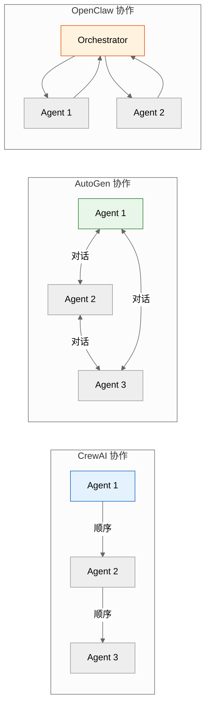

| 协作特性 | CrewAI | AutoGen | OpenClaw |
|----------|--------|---------|----------|
| **协作基础** | 预定义流程 | 自由对话 | 路由调度 |
| **Agent 关系** | 上下游 (流程式) | 平等 (对话式) | 调度式 |
| **消息传递** | Task context 注入 | 消息广播 | 网关转发 |
| **决策方式** | 流程预设 / Manager | Agent 协商 | Orchestrator |
| **任务委派** | ✅ (allow_delegation) | ✅ (Swarm 路由) | ✅ (路由) |
| **并行执行** | ✅ (async_execution) | ✅ (asyncio) | ✅ |
| **可控性** | ⭐⭐⭐⭐ | ⭐⭐⭐ | ⭐⭐⭐ |

### 4.3 性能表现对比

#### 4.3.1 性能维度评估

| 性能维度 | CrewAI | AutoGen | OpenClaw |
|----------|--------|---------|----------|
| **启动速度** | ⭐⭐⭐⭐ (快) | ⭐⭐⭐ (中) | ⭐⭐ (慢,网关启动) |
| **执行效率** | ⭐⭐⭐⭐ (流程优化) | ⭐⭐⭐ (对话开销) | ⭐⭐⭐ |
| **并发能力** | ⭐⭐⭐ (中) | ⭐⭐⭐⭐⭐ (全异步) | ⭐⭐⭐⭐ |
| **Token 消耗** | ⭐⭐⭐⭐ (较少) | ⭐⭐⭐ (对话冗长) | ⭐⭐⭐ |
| **内存占用** | ⭐⭐⭐⭐ (低) | ⭐⭐⭐ (中) | ⭐⭐ (高,常驻) |
| **扩展性** | ⭐⭐⭐ (中) | ⭐⭐⭐⭐ (好) | ⭐⭐⭐⭐⭐ (集群) |
| **稳定性** | ⭐⭐⭐⭐ | ⭐⭐⭐⭐ | ⭐⭐⭐ |

#### 4.3.2 Token 消耗对比

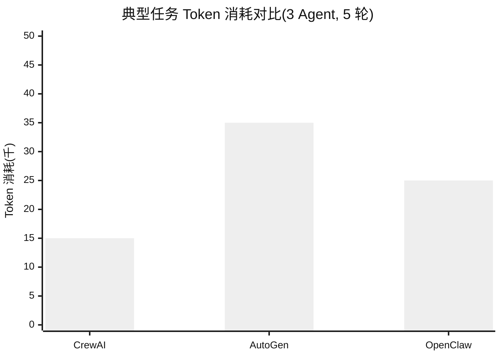

**Token 消耗分析**：

| 框架 | 消耗特点 | 原因 |
|------|----------|------|
| **CrewAI** | 最低 | 流程明确,无冗余对话 |
| **AutoGen** | 最高 | Agent 间自由对话,消息广播 |
| **OpenClaw** | 中等 | 单 Agent 为主,多 Agent 路由有开销 |

#### 4.3.3 适用规模对比

| 规模 | CrewAI | AutoGen | OpenClaw |
|------|--------|---------|----------|
| **小型 (1-3 Agent)** | ⭐⭐⭐⭐⭐ | ⭐⭐⭐⭐ | ⭐⭐⭐ |
| **中型 (3-10 Agent)** | ⭐⭐⭐⭐ | ⭐⭐⭐⭐⭐ | ⭐⭐⭐⭐ |
| **大型 (10+ Agent)** | ⭐⭐ | ⭐⭐⭐⭐ | ⭐⭐⭐⭐⭐ |
| **超大规模 (50+)** | ⭐ | ⭐⭐⭐ | ⭐⭐⭐⭐⭐ |

### 4.4 适用场景对比

#### 4.4.1 场景适配度

| 应用场景 | CrewAI | AutoGen | OpenClaw |
|----------|--------|---------|----------|
| **业务流程自动化** | ⭐⭐⭐⭐⭐ | ⭐⭐⭐ | ⭐⭐⭐⭐ |
| **内容生产流水线** | ⭐⭐⭐⭐⭐ | ⭐⭐⭐ | ⭐⭐⭐ |
| **开放式研究协作** | ⭐⭐⭐ | ⭐⭐⭐⭐⭐ | ⭐⭐⭐ |
| **智能客服系统** | ⭐⭐⭐⭐ | ⭐⭐⭐⭐ | ⭐⭐⭐⭐⭐ |
| **代码开发协作** | ⭐⭐⭐⭐ | ⭐⭐⭐⭐⭐ | ⭐⭐⭐ |
| **数据分析平台** | ⭐⭐⭐⭐ | ⭐⭐⭐⭐ | ⭐⭐⭐ |
| **多渠道机器人** | ⭐⭐ | ⭐⭐ | ⭐⭐⭐⭐⭐ |
| **私有化数字员工** | ⭐⭐⭐ | ⭐⭐⭐ | ⭐⭐⭐⭐⭐ |
| **快速原型验证** | ⭐⭐⭐⭐⭐ | ⭐⭐⭐⭐ | ⭐⭐⭐ |
| **企业级生产部署** | ⭐⭐⭐⭐ | ⭐⭐⭐⭐ | ⭐⭐⭐⭐ |

#### 4.4.2 各框架最佳场景

**CrewAI 最佳场景**：业务流程自动化

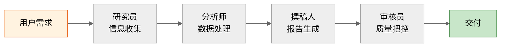

**AutoGen 最佳场景**：开放式协作研究

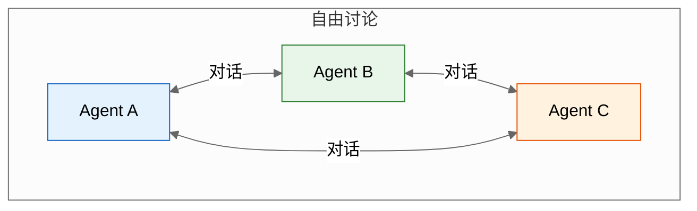

**OpenClaw 最佳场景**：多渠道数字员工

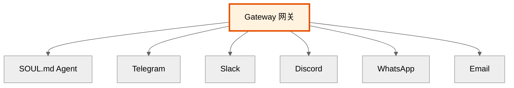

### 4.5 选型决策树

```mermaid
%%{init: {'theme': 'neutral'}}%%
flowchart TB
    Start[开始选型] --> Q1{任务流程是否明确?}

    Q1 -->|是,流程明确| Q2{是否需要多渠道接入?}
    Q1 -->|否,需动态协商| AutoGen[推荐 AutoGen<br/>对话驱动]

    Q2 -->|是,多渠道| Q3{是否需要私有化部署?}
    Q2 -->|否,单渠道| Q4{是否需要可视化开发?}

    Q3 -->|是,数据不出域| OpenClaw[推荐 OpenClaw<br/>私有化网关]
    Q3 -->|否,可云端| Q4

    Q4 -->|是,需要可视化| Q5{是否接受企业版?}
    Q4 -->|否,代码即可| CrewAI[推荐 CrewAI<br/>流程驱动]

    Q5 -->|是,可付费| CrewAIPlus[推荐 CrewAI+<br/>企业版可视化]
    Q5 -->|否,需开源| AutoGenStudio[推荐 AutoGen Studio<br/>开源可视化]

    style CrewAI fill:#e3f2fd,stroke:#1565c0
    style AutoGen fill:#e8f5e9,stroke:#2e7d32
    style OpenClaw fill:#fff3e0,stroke:#e65100
```

**选型速查表**：

| 需求特征 | 推荐框架 | 核心理由 |
|----------|----------|----------|
| 流程明确的流水线作业 | **CrewAI** | 顺序流程可控,Token 消耗低 |
| 开放式多 Agent 讨论 | **AutoGen** | 对话驱动,灵活协商 |
| 多渠道数字员工 | **OpenClaw** | 网关架构,多渠道原生支持 |
| 数据隐私要求高 | **OpenClaw** | 默认本地,数据不出域 |
| 需要可视化开发 | **AutoGen Studio** | 开源可视化,拖拽构建 |
| 业务流程自动化 | **CrewAI** | 角色分工明确,流程可控 |
| 快速原型验证 | **CrewAI** | 代码简洁,上手快 |
| 大规模 Agent 集群 | **OpenClaw** | 网关架构,水平扩展 |
| 代码开发协作 | **AutoGen** | 对话式代码审查与生成 |
| 结构化输出需求 | **CrewAI** | Pydantic 模型,强类型 |

---

## 五、总结与展望

### 5.1 核心要点回顾

```mermaid
%%{init: {'theme': 'neutral'}}%%
mindmap
  root((CrewAI 核心要点))
    基础认知
      角色扮演多智能体框架
      流程驱动协作
      声明式配置
    三大组件
      Agent 智能体
        role/goal/backstory
        tools/llm/memory
      Task 任务
        description/expected_output
        context 依赖
        output_pydantic 结构化
      Crew 团队
        agents/tasks 编排
        sequential/hierarchical 流程
    协作机制
      显式/层级/委派分配
      顺序/层级协作模式
      异步并行执行
    工具系统
      内置工具
      LangChain 复用
      自定义 BaseTool
    框架定位
      vs AutoGen 更可控
      vs OpenClaw 更贴近开发者
      适合业务流程自动化
```

### 5.2 三框架定位总结

| 框架 | 一句话定位 | 核心优势 | 核心劣势 |
|------|-----------|----------|----------|
| **CrewAI** | 流程驱动的角色扮演团队 | 可控性强、Token 低、结构化输出 | 灵活性低、不适合开放式协作 |
| **AutoGen** | 对话驱动的自由协作平台 | 灵活性高、全异步、可视化 | Token 消耗高、可控性弱 |
| **OpenClaw** | Markdown 驱动的数字员工 | 多渠道、私有化、大规模 | 非开发者友好、Python 生态弱 |

### 5.3 学习路径建议

```mermaid
%%{init: {'theme': 'neutral'}}%%
flowchart LR
    A[基础认知<br/>理解角色扮演范式] --> B[组件掌握<br/>Agent/Task/Crew]
    B --> C[流程实践<br/>顺序/层级协作]
    C --> D[工具集成<br/>内置/自定义/LangChain]
    D --> E[进阶应用<br/>异步并行/结构化输出]
    E --> F[生产部署<br/>性能优化/错误处理]
    F --> G[框架对比<br/>选型决策]

    style A fill:#e3f2fd,stroke:#1565c0
    style B fill:#e8f5e9,stroke:#2e7d32
    style C fill:#fff3e0,stroke:#e65100
    style D fill:#f3e5f5,stroke:#6a1b9a
    style E fill:#fce4ec,stroke:#c62828
    style F fill:#ffebee,stroke:#c62828
    style G fill:#eceff1,stroke:#455a64
```

### 5.4 未来演进方向

| 方向 | 说明 | 预期影响 |
|------|------|----------|
| **Flow 工作流引擎** | 事件驱动的复杂工作流 | 支持更复杂的业务场景 |
| **更强的记忆系统** | 语义记忆、情景记忆 | Agent 持续学习与进化 |
| **MCP 协议支持** | 标准化工具接入 | 工具生态互联互通 |
| **企业级可观测性** | 内置 tracing/metrics | 提升可维护性 |
| **多模态支持** | 图像、语音、视频 | 拓展应用场景 |
| **集群化部署** | 分布式 Crew 协作 | 支持大规模任务 |

---

> **结语**：CrewAI 以"角色扮演 + 流程驱动"的独特范式，在多智能体框架生态中占据重要一席。相比 AutoGen 的自由对话和 OpenClaw 的配置驱动，CrewAI 更适合业务流程明确、需要可控协作的场景。通过掌握 Agent、Task、Crew 三大组件，结合顺序与层级协作模式，开发者可以快速构建生产级的多智能体系统。在实际选型中，应根据任务特征、可控性要求、部署环境等因素综合考量，选择最适合的框架。
