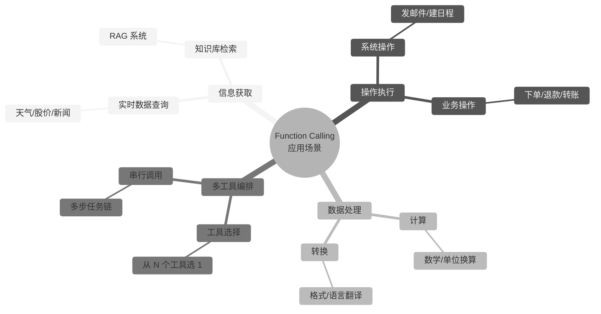
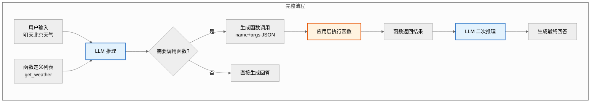
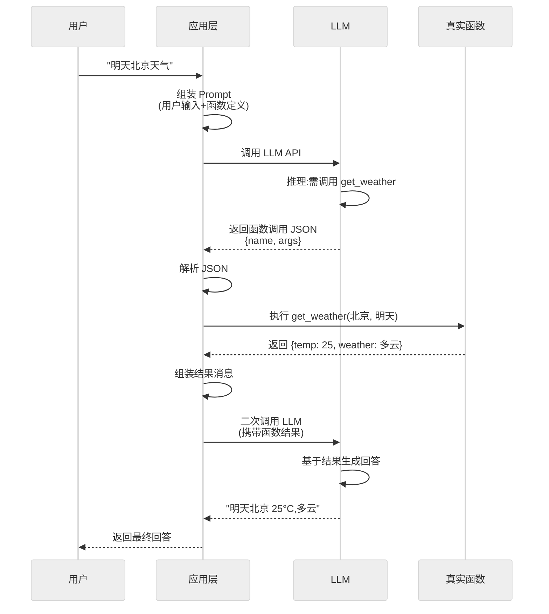
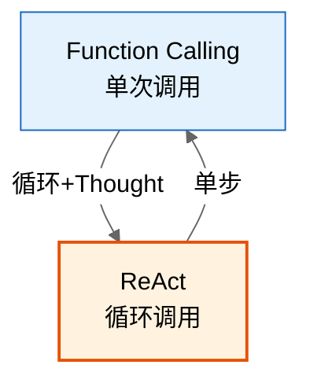

# Function Calling 面试题集详解

> 本文档系统涵盖 Function Calling 的定义、应用场景、工作原理、实践案例与进阶思考，题型含基础概念题、应用实践题、进阶思考题，难度从基础到进阶循序渐进。

---

## 目录

- [一、概述](#一概述)
  - [1.1 什么是 Function Calling](#11-什么是-function-calling)
  - [1.2 应用场景](#12-应用场景)
  - [1.3 重要性](#13-重要性)
- [二、原理深度解析](#二原理深度解析)
  - [2.1 工作机制](#21-工作机制)
  - [2.2 完整实现流程](#22-完整实现流程)
  - [2.3 核心技术要点](#23-核心技术要点)
- [三、基础概念题](#三基础概念题)
- [四、应用实践题](#四应用实践题)
- [五、进阶思考题](#五进阶思考题)
- [六、考点速查表](#六考点速查表)

---

## 一、概述

### 1.1 什么是 Function Calling

**Function Calling（函数调用）** 是 LLM 提供的一种结构化输出能力，允许模型根据用户意图**自动选择并调用预定义的函数**，并将函数返回结果整合到最终回答中。

**一句话定义**：Function Calling = LLM 充当"调度器"，根据用户意图选择合适的函数并生成结构化参数，由应用层执行函数后将结果反馈给 LLM 生成最终回答。

**核心特征**：

| 特征 | 说明 |
|------|------|
| **结构化输出** | 模型输出 JSON 格式的函数名+参数，而非自由文本 |
| **意图驱动** | 模型基于用户输入判断需要调用哪个函数 |
| **应用层执行** | 模型不直接执行函数，只生成调用指令，由应用层执行 |
| **结果整合** | 函数返回结果反馈给模型，模型据此生成最终回答 |

**与传统 API 调用的区别**：

| 维度 | 传统 API 调用 | Function Calling |
|------|--------------|------------------|
| **触发方式** | 开发者硬编码调用时机 | LLM 根据语义自主判断 |
| **参数生成** | 开发者拼接参数 | LLM 从自然语言抽取 |
| **灵活性** | 固定流程 | 动态决策 |
| **适用场景** | 流程明确 | 意图模糊、多工具选择 |

### 1.2 应用场景



**典型场景举例**：

| 场景 | 用户输入 | 调用函数 | 价值 |
|------|----------|----------|------|
| **实时查询** | "北京明天天气" | `get_weather(city, date)` | 获取模型不知道的实时数据 |
| **业务操作** | "帮我订明天北京到上海的高铁" | `book_ticket(from, to, date)` | 自然语言驱动业务系统 |
| **复杂计算** | "1234×5678 等于多少" | `calculate(expression)` | 避免模型计算错误 |
| **多工具选择** | "查一下我的订单状态" | `query_order(order_id)` | 模型自主选对工具 |
| **数据检索** | "LangGraph 怎么用持久化" | `search_docs(query)` | RAG 系统核心能力 |

### 1.3 重要性

| 重要性维度 | 说明 |
|-----------|------|
| **连接 LLM 与外部世界** | 让 LLM 从"闭盒聊天"变为"开盒操作"，可访问实时数据与业务系统 |
| **降低开发门槛** | 无需训练即可让模型调用任意 API，大幅降低集成成本 |
| **提升准确性** | 计算类、查询类任务交给确定性函数，避免模型幻觉 |
| **标准化生态** | OpenAI/Anthropic/Google 均支持，成为 LLM 工具调用的事实标准 |
| **Agent 基石** | 是 ReAct、Tool Use、MCP 等更高级范式的基础能力 |

---

## 二、原理深度解析

### 2.1 工作机制



**关键机制说明**：

1. **函数定义注入**：应用层将可用函数的 Schema（名称、描述、参数）注入 Prompt。
2. **模型决策**：LLM 基于用户输入 + 函数定义，判断是否调用函数及调用哪个。
3. **结构化输出**：模型输出 JSON 格式的函数名 + 参数，而非自由文本。
4. **应用层执行**：模型不执行函数，应用层解析 JSON 并调用真实函数。
5. **结果反馈**：函数返回结果作为新消息反馈给模型，模型生成最终回答。

### 2.2 完整实现流程



**完整代码示例（OpenAI 风格）**：

```python
import json
from openai import OpenAI

client = OpenAI()

# 1. 定义函数 Schema
tools = [
    {
        "type": "function",
        "function": {
            "name": "get_weather",
            "description": "查询指定城市指定日期的天气",
            "parameters": {
                "type": "object",
                "properties": {
                    "city": {"type": "string", "description": "城市名"},
                    "date": {"type": "string", "description": "日期,如 tomorrow"},
                },
                "required": ["city"],
            },
        },
    }
]

# 2. 真实函数实现
def get_weather(city: str, date: str = "today") -> dict:
    # 实际调用天气 API
    return {"city": city, "date": date, "temp": 25, "weather": "多云"}


# 3. 完整 Function Calling 流程
def chat_with_function(user_input: str) -> str:
    messages = [{"role": "user", "content": user_input}]

    # 第一次调用 LLM:判断是否需要调用函数
    response = client.chat.completions.create(
        model="gpt-4o",
        messages=messages,
        tools=tools,
        tool_choice="auto",  # auto/none/required/指定函数
    )
    msg = response.choices[0].message

    # 如果模型决定调用函数
    if msg.tool_calls:
        messages.append(msg)  # 追加助手消息
        for tool_call in msg.tool_calls:
            func_name = tool_call.function.name
            func_args = json.loads(tool_call.function.arguments)

            # 应用层执行真实函数
            if func_name == "get_weather":
                result = get_weather(**func_args)
            else:
                result = {"error": f"未知函数: {func_name}"}

            # 将函数结果反馈给 LLM
            messages.append({
                "role": "tool",
                "tool_call_id": tool_call.id,
                "content": json.dumps(result, ensure_ascii=False),
            })

        # 第二次调用 LLM:基于函数结果生成最终回答
        final_response = client.chat.completions.create(
            model="gpt-4o",
            messages=messages,
        )
        return final_response.choices[0].message.content

    # 无需调用函数,直接返回
    return msg.content


# 使用示例
print(chat_with_function("明天北京天气怎么样?"))
# 输出: 明天北京 25°C,多云
```

### 2.3 核心技术要点

#### 2.3.1 函数定义 Schema

```json
{
  "type": "function",
  "function": {
    "name": "search_orders",
    "description": "根据条件搜索用户订单,支持按状态/时间筛选",
    "parameters": {
      "type": "object",
      "properties": {
        "user_id": {"type": "string", "description": "用户ID"},
        "status": {
          "type": "string",
          "enum": ["pending", "paid", "shipped", "completed"],
          "description": "订单状态"
        },
        "start_date": {"type": "string", "format": "date", "description": "起始日期 YYYY-MM-DD"}
      },
      "required": ["user_id"]
    }
  }
}
```

**Schema 设计要点**：

| 要点 | 说明 | 示例 |
|------|------|------|
| **description 清晰** | 描述函数做什么、何时用 | "查询天气,当用户问天气时调用" |
| **参数有描述** | 每个参数说明含义、格式 | "city: 城市名,如北京/上海" |
| **required 明确** | 必填参数标注 | `required: ["user_id"]` |
| **enum 限定取值** | 枚举值约束 | `enum: ["pending", "paid"]` |
| **format 指定格式** | 日期/邮箱等格式 | `format: "date"` |

#### 2.3.2 tool_choice 参数

| 取值 | 含义 | 适用场景 |
|------|------|----------|
| `"auto"` | 模型自主判断是否调用 | 默认值，通用场景 |
| `"none"` | 禁止调用函数 | 纯聊天场景 |
| `"required"` | 必须调用至少一个函数 | 强制工具使用 |
| `{"type": "function", "function": {"name": "xxx"}}` | 指定调用特定函数 | 已知必调某函数 |

#### 2.3.3 多函数调用（Parallel Function Calling）

OpenAI GPT-4o 等模型支持**单轮并行调用多个函数**：

```python
# 用户: "查北京天气和上海天气"
# 模型一次返回两个 tool_call:
# tool_call_1: get_weather(北京)
# tool_call_2: get_weather(上海)

# 应用层并行执行两个函数,结果分别反馈
for tool_call in msg.tool_calls:  # 遍历多个调用
    result = execute_function(tool_call)
    messages.append({"role": "tool", "tool_call_id": tool_call.id, "content": result})
```

#### 2.3.4 与 ReAct 的关系



| 维度 | Function Calling | ReAct |
|------|------------------|-------|
| **调用次数** | 单次或并行一次 | 多轮循环 |
| **思考过程** | 无显式 Thought | 每轮有 Thought |
| **反馈调整** | 函数结果直接整合 | Observation 可调整下一轮 |
| **复杂度** | 低 | 高 |
| **适用场景** | 单步任务 | 多步探索任务 |

---

## 三、基础概念题

### 题目 1：Function Calling 的本质是什么？（基础）

**难度**：基础　**类型**：概念题

**问题描述**：
请说明 Function Calling 的本质，并解释为什么说"模型并不直接执行函数"。

**参考答案**：

**本质**：Function Calling 是 LLM 的**结构化输出能力**——模型根据用户意图和预定义函数列表，输出 JSON 格式的函数名+参数，由应用层负责实际执行。

**模型不直接执行函数的原因**：
1. **安全隔离**：模型运行在沙箱中，无法访问外部系统，防止模型执行危险操作。
2. **权限控制**：应用层可在执行前校验权限、参数合法性，决定是否真正执行。
3. **确定性执行**：模型输出可能出错，应用层可拦截、重试、降级。
4. **解耦设计**：模型只负责"决策"，执行由应用层控制，符合关注点分离原则。

**完整链路**：
```
用户输入 → LLM 决策 → 输出函数调用 JSON → 应用层执行 → 结果反馈 LLM → 最终回答
```

**评分标准**：本质说明 2 分；不直接执行的原因≥3 条 2 分；链路说明 1 分（满分 5）。

---

### 题目 2：函数定义 Schema 的关键要素有哪些？（基础）

**难度**：基础　**类型**：概念题

**问题描述**：
请列举 Function Calling 中函数定义 Schema 的关键要素，并说明 description 的重要性。

**参考答案**：

**关键要素**：

| 要素 | 作用 | 必填 |
|------|------|------|
| `name` | 函数名，模型据此选择 | 是 |
| `description` | 函数功能描述，模型据此判断何时调用 | 是 |
| `parameters` | 参数 Schema（JSON Schema 格式） | 是 |
| `parameters.properties` | 各参数的定义（类型、描述、枚举） | 是 |
| `parameters.required` | 必填参数列表 | 是 |
| `enum` | 限定参数取值范围 | 否 |
| `format` | 指定参数格式（date/email） | 否 |

**description 的重要性**：
1. **模型选择依据**：模型通过 description 判断"何时调用此函数"，描述不清会导致选错工具。
2. **参数抽取指导**：参数的 description 告诉模型如何从自然语言抽取参数值。
3. **多工具区分**：相似函数靠 description 区分（如 `search_orders` vs `search_products`）。

**好的 description 示例**：
```json
{
  "name": "get_weather",
  "description": "查询指定城市指定日期的天气信息,包括温度、天气状况、风力。当用户询问天气、气温、是否下雨等问题时调用此函数。",
  "parameters": {
    "properties": {
      "city": {"type": "string", "description": "城市中文名,如北京、上海"},
      "date": {"type": "string", "description": "日期,支持 today/tomorrow/YYYY-MM-DD"}
    }
  }
}
```

**评分标准**：要素≥5 个 2 分；description 重要性≥3 点 2 分；示例说明 1 分（满分 5）。

---

### 题目 3：tool_choice 参数的作用？（基础）

**难度**：基础　**类型**：概念题

**问题描述**：
请说明 `tool_choice` 参数的作用及各取值的含义，并举例何时用 `required`。

**参考答案**：

**作用**：`tool_choice` 控制模型是否调用函数以及调用哪个函数，是应用层对模型行为的强制约束。

| 取值 | 含义 | 适用场景 |
|------|------|----------|
| `"auto"` | 模型自主判断是否调用 | 默认值，通用场景 |
| `"none"` | 禁止调用任何函数 | 纯聊天，强制文本回答 |
| `"required"` | 必须调用至少一个函数 | 强制工具使用，如客服必须查订单 |
| `{"type": "function", "function": {"name": "xxx"}}` | 强制调用指定函数 | 已知必调某函数，跳过模型决策 |

**何时用 `required`**：
- **客服系统**：用户问"我的订单状态"，强制调用 `query_order`，避免模型瞎编。
- **数据分析**：用户问"上季度销量"，强制调用 `query_sales`，避免幻觉。
- **RAG 系统**：用户问文档相关问题，强制调用 `search_docs`，确保基于文档回答。

**示例**：
```python
response = client.chat.completions.create(
    model="gpt-4o",
    messages=messages,
    tools=tools,
    tool_choice="required",  # 强制必须调用函数
)
```

**评分标准**：作用说明 2 分；四种取值各 0.5 分 2 分；required 场景 1 分（满分 5）。

---

### 题目 4：Function Calling 与 ReAct 的区别？（基础）

**难度**：基础　**类型**：对比题

**问题描述**：
请对比 Function Calling 与 ReAct 两种范式，说明各自的优劣与适用场景。

**参考答案**：

| 维度 | Function Calling | ReAct |
|------|------------------|-------|
| **调用模式** | 单次或并行一次调用 | 多轮循环调用 |
| **思考过程** | 无显式 Thought | 每轮有 Thought 推理 |
| **反馈调整** | 函数结果直接整合 | Observation 可调整下一轮策略 |
| **可解释性** | 仅函数调用记录 | Thought+Action+Observation 全程可追溯 |
| **复杂度** | 低，单次 API 调用 | 高，多轮循环 |
| **延迟** | 低（1-2 次 LLM 调用） | 高（N 次 LLM 调用） |
| **成本** | 低 | 高（多轮 Token 累积） |
| **适用场景** | 单步任务、明确意图 | 多步探索、需动态调整 |

**选型建议**：
- **单步查询**（查天气、查订单）→ Function Calling
- **多步推理**（查数据→分析→生成报告）→ ReAct
- **简单 Agent** → Function Calling 起步，复杂场景再升级 ReAct

**评分标准**：对比维度≥6 项 3 分；选型建议 1.5 分；优劣分析 0.5 分（满分 5）。

---

## 四、应用实践题

### 题目 5：设计一个客服系统的 Function Calling 方案（中级）

**难度**：中级　**类型**：设计题

**问题描述**：
某电商客服系统需支持：查订单、查物流、申请退款、修改地址。请设计 Function Calling 方案，包括函数定义、调用流程、错误处理。

**参考答案**：

**函数定义**：

```python
tools = [
    {
        "type": "function",
        "function": {
            "name": "query_order",
            "description": "查询用户订单,支持按订单号或状态筛选。当用户问'我的订单''订单状态'时调用。",
            "parameters": {
                "type": "object",
                "properties": {
                    "user_id": {"type": "string", "description": "用户ID"},
                    "order_id": {"type": "string", "description": "订单号(可选)"},
                    "status": {
                        "type": "string",
                        "enum": ["pending", "paid", "shipped", "completed"],
                        "description": "订单状态筛选(可选)"
                    }
                },
                "required": ["user_id"]
            }
        }
    },
    {
        "type": "function",
        "function": {
            "name": "query_logistics",
            "description": "查询订单物流信息,包括快递公司、运单号、物流轨迹。当用户问'快递''物流''到哪了'时调用。",
            "parameters": {
                "type": "object",
                "properties": {
                    "order_id": {"type": "string", "description": "订单号"}
                },
                "required": ["order_id"]
            }
        }
    },
    {
        "type": "function",
        "function": {
            "name": "apply_refund",
            "description": "提交退款申请。当用户说'退款''退货''退钱'时调用。需用户确认金额后执行。",
            "parameters": {
                "type": "object",
                "properties": {
                    "order_id": {"type": "string", "description": "订单号"},
                    "reason": {"type": "string", "description": "退款原因"},
                    "amount": {"type": "number", "description": "退款金额"}
                },
                "required": ["order_id", "reason"]
            }
        }
    },
    {
        "type": "function",
        "function": {
            "name": "update_address",
            "description": "修改订单收货地址。当用户说'改地址''换地址'时调用。仅订单未发货时可改。",
            "parameters": {
                "type": "object",
                "properties": {
                    "order_id": {"type": "string", "description": "订单号"},
                    "new_address": {"type": "string", "description": "新地址"}
                },
                "required": ["order_id", "new_address"]
            }
        }
    }
]
```

**调用流程**：

```python
def customer_service(user_id: str, user_input: str) -> str:
    messages = [
        {"role": "system", "content": "你是电商客服助手,可查询订单、物流,处理退款、改地址。"},
        {"role": "user", "content": user_input},
    ]

    # 第一次调用:模型决策
    response = client.chat.completions.create(
        model="gpt-4o", messages=messages, tools=tools, tool_choice="auto"
    )
    msg = response.choices[0].message

    if not msg.tool_calls:
        return msg.content  # 无需调用函数,直接回答

    messages.append(msg)
    for tool_call in msg.tool_calls:
        func_name = tool_call.function.name
        args = json.loads(tool_call.function.arguments)

        # 权限校验:user_id 必须匹配
        if "user_id" in args and args["user_id"] != user_id:
            result = {"error": "无权查询其他用户订单"}
        else:
            try:
                result = execute_function(func_name, args)
            except Exception as e:
                result = {"error": f"执行失败: {str(e)}"}

        messages.append({
            "role": "tool",
            "tool_call_id": tool_call.id,
            "content": json.dumps(result, ensure_ascii=False),
        })

    # 第二次调用:基于结果生成回答
    final = client.chat.completions.create(model="gpt-4o", messages=messages)
    return final.choices[0].message.content
```

**错误处理策略**：

| 错误类型 | 处理方式 | 示例 |
|----------|----------|------|
| **参数缺失** | 模型自动追问用户 | 缺 order_id → "请提供订单号" |
| **权限不足** | 返回 error，模型转告用户 | "无权查询他人订单" |
| **函数执行失败** | 返回 error，模型道歉并建议 | 退款失败 → "系统繁忙，稍后重试" |
| **业务约束** | 函数内部校验返回提示 | 已发货无法改地址 → 返回提示 |
| **模型选错函数** | 应用层兜底校验 | 用户问退款但选了查询 → 结果为空，模型重新选择 |

**评分标准**：函数定义完整 2 分；调用流程正确 2 分；错误处理≥4 类 1.5 分；权限校验 0.5 分（满分 6）。

---

### 题目 6：实现一个多函数并行调用场景（中级）

**难度**：中级　**类型**：编程题

**问题描述**：
用户问"北京和上海明天的天气对比"，请用 Function Calling 实现并行调用两个天气查询，并对比两城市天气。

**参考答案**：

```python
import json
import asyncio
from openai import OpenAI

client = OpenAI()

tools = [{
    "type": "function",
    "function": {
        "name": "get_weather",
        "description": "查询指定城市天气",
        "parameters": {
            "type": "object",
            "properties": {
                "city": {"type": "string", "description": "城市名"},
                "date": {"type": "string", "description": "日期"}
            },
            "required": ["city"]
        }
    }
}]

async def get_weather(city: str, date: str = "tomorrow") -> dict:
    # 模拟异步天气 API
    await asyncio.sleep(0.5)
    data = {
        "北京": {"temp": 22, "weather": "晴", "wind": "北风3级"},
        "上海": {"temp": 26, "weather": "多云", "wind": "东南风2级"},
    }
    return {"city": city, "date": date, **data.get(city, {"temp": 25, "weather": "未知"})}


async def compare_weather(user_input: str) -> str:
    messages = [{"role": "user", "content": user_input}]

    # 第一次调用:模型可能返回多个 tool_call(并行)
    response = client.chat.completions.create(
        model="gpt-4o", messages=messages, tools=tools, tool_choice="auto"
    )
    msg = response.choices[0].message

    if msg.tool_calls:
        messages.append(msg)
        # 并行执行所有 tool_call
        tasks = []
        for tool_call in msg.tool_calls:
            args = json.loads(tool_call.function.arguments)
            tasks.append(get_weather(**args))

        results = await asyncio.gather(*tasks)  # 并行执行

        # 将每个结果反馈给模型
        for tool_call, result in zip(msg.tool_calls, results):
            messages.append({
                "role": "tool",
                "tool_call_id": tool_call.id,
                "content": json.dumps(result, ensure_ascii=False),
            })

        # 第二次调用:模型对比两城市天气
        final = client.chat.completions.create(model="gpt-4o", messages=messages)
        return final.choices[0].message.content

    return msg.content


# 测试
answer = asyncio.run(compare_weather("北京和上海明天的天气对比"))
print(answer)
# 输出示例: 明天北京 22°C 晴,上海 26°C 多云。上海比北京高 4°C,北京晴天更适宜出行。
```

**关键点**：
1. **并行调用**：GPT-4o 支持 `tool_calls` 数组返回多个调用，应用层用 `asyncio.gather` 并行执行。
2. **结果配对**：`zip(msg.tool_calls, results)` 确保 tool_call_id 与结果正确配对。
3. **二次推理**：模型基于两个城市天气结果生成对比分析。

**评分标准**：并行执行正确 3 分；结果配对 1.5 分；二次推理 1 分；代码完整 0.5 分（满分 6）。

---

### 题目 7：RAG 系统中如何用 Function Calling 选择检索工具？（中级）

**难度**：中级　**类型**：设计题

**问题描述**：
某企业 RAG 系统有 3 个知识库：产品文档、HR 制度、技术博客。请用 Function Calling 让模型根据用户问题自动选择检索哪个知识库。

**参考答案**：

**函数定义**：

```python
tools = [
    {
        "type": "function",
        "function": {
            "name": "search_product_docs",
            "description": "检索产品使用文档、功能说明、操作指南。当用户问产品功能、怎么用、操作步骤时调用。",
            "parameters": {
                "type": "object",
                "properties": {
                    "query": {"type": "string", "description": "检索关键词"}
                },
                "required": ["query"]
            }
        }
    },
    {
        "type": "function",
        "function": {
            "name": "search_hr_policy",
            "description": "检索 HR 制度、请假、报销、考勤规则。当用户问假期、报销、制度时调用。",
            "parameters": {
                "type": "object",
                "properties": {
                    "query": {"type": "string", "description": "检索关键词"}
                },
                "required": ["query"]
            }
        }
    },
    {
        "type": "function",
        "function": {
            "name": "search_tech_blog",
            "description": "检索技术博客、架构文章、技术分享。当用户问技术原理、架构设计、最佳实践时调用。",
            "parameters": {
                "type": "object",
                "properties": {
                    "query": {"type": "string", "description": "检索关键词"}
                },
                "required": ["query"]
            }
        }
    }
]
```

**完整流程**：

```python
def rag_with_function_calling(user_input: str) -> str:
    messages = [
        {"role": "system", "content": "你是企业知识助手,根据用户问题检索对应知识库并回答。"},
        {"role": "user", "content": user_input},
    ]

    response = client.chat.completions.create(
        model="gpt-4o", messages=messages, tools=tools, tool_choice="auto"
    )
    msg = response.choices[0].message

    if msg.tool_calls:
        messages.append(msg)
        for tool_call in msg.tool_calls:
            func_name = tool_call.function.name
            query = json.loads(tool_call.function.arguments)["query"]

            # 调用对应知识库的向量检索
            docs = vector_search(func_name, query)  # 返回 Top-K 文档

            messages.append({
                "role": "tool",
                "tool_call_id": tool_call.id,
                "content": json.dumps(docs, ensure_ascii=False),
            })

        final = client.chat.completions.create(
            model="gpt-4o", messages=messages,
            # 要求基于文档回答,标注来源
            response_format={"type": "text"},
        )
        return final.choices[0].message.content

    return msg.content
```

**设计要点**：
1. **description 区分清晰**：三个函数的 description 明确各自的领域与触发场景。
2. **单参数设计**：每个函数只需 query 参数，降低模型抽取难度。
3. **多库并行**：复杂问题（如"产品怎么用以及报销规则"）模型可并行调用多个函数。
4. **来源标注**：二次推理时要求模型标注答案来源（来自哪个知识库）。

**评分标准**：函数定义区分清晰 2 分；流程正确 2 分；多库并行 1 分；来源标注 1 分（满分 6）。

---

## 五、进阶思考题

### 题目 8：如何优化 Function Calling 的准确率？（高级）

**难度**：高级　**类型**：优化题

**问题描述**：
某系统配置了 20+ 函数，发现模型选错函数或参数错误的概率达 30%。请给出系统性的优化方案。

**参考答案**：

**根因分析**：

| 问题 | 原因 | 占比 |
|------|------|------|
| **选错函数** | description 模糊、函数过多 | 40% |
| **参数错误** | 参数描述不清、缺示例 | 35% |
| **幻觉调用** | 不该调用时调用 | 15% |
| **格式错误** | JSON 格式不规范 | 10% |

**分层优化方案**：

| 层次 | 优化措施 | 效果 |
|------|----------|------|
| **函数定义层** | ①description 增加"何时调用"+"何时不调用"<br>②添加 Few-shot 示例<br>③相似函数合并或分组 | 准确率+15% |
| **参数设计层** | ①参数 description 含格式示例<br>②用 enum 限定取值<br>③必填参数最小化 | 参数错误-50% |
| **模型选择层** | ①优先用支持 FC 的模型（GPT-4o/Claude3.5）<br>②工具数多时用检索式选择 | 准确率+10% |
| **Prompt 层** | ①System Prompt 明确调用规则<br>②增加"不确定时询问用户"指令 | 幻觉调用-60% |
| **应用层校验** | ①参数 Schema 校验<br>②权限校验<br>③失败重试+降级 | 错误兜底 |

**具体优化示例**：

```python
# 优化前:description 模糊
{
    "name": "search",
    "description": "搜索信息",
    "parameters": {"properties": {"q": {"type": "string"}}}
}

# 优化后:description 清晰 + 示例 + enum
{
    "name": "search_orders",
    "description": "搜索用户订单。当用户问'我的订单''订单状态''查订单'时调用。不用于搜索商品(用 search_products)。",
    "parameters": {
        "type": "object",
        "properties": {
            "user_id": {"type": "string", "description": "用户ID,如 'U12345'"},
            "status": {
                "type": "string",
                "enum": ["pending", "paid", "shipped", "completed"],
                "description": "订单状态筛选,可选"
            }
        },
        "required": ["user_id"]
    }
}
```

**检索式工具选择（工具数多时）**：

```python
def select_tools(query: str, all_tools: list, top_k: int = 5) -> list:
    """向量检索最相关的 top_k 个工具,仅注入这些工具"""
    query_vec = embed(query)
    scored = [(t, cosine_sim(query_vec, embed(t["function"]["description"]))) for t in all_tools]
    return [t for t, _ in sorted(scored, key=lambda x: -x[1])[:top_k]]
```

**预期效果**：准确率从 70% 提升至 92%+，参数错误降低 50%。

**评分标准**：根因分析 1.5 分；优化措施≥5 项 2.5 分；代码示例 1 分；量化预期 1 分（满分 6）。

---

### 题目 9：Function Calling 的安全性如何保障？（高级）

**难度**：高级　**类型**：安全题

**问题描述**：
某金融系统用 Function Calling 实现转账、查询等操作。请设计完整的安全保障方案，防止模型被诱导执行危险操作。

**参考答案**：

**安全威胁模型**：

| 威胁 | 描述 | 后果 |
|------|------|------|
| **Prompt 注入** | 用户输入恶意指令诱导模型调用危险函数 | 越权转账 |
| **参数篡改** | 模型生成恶意参数（如他人账户） | 转账到攻击者账户 |
| **幻觉调用** | 模型不该调用时调用 | 误操作 |
| **重放攻击** | 录制合法 tool_call 重放 | 重复转账 |
| **信息泄露** | 模型在回答中泄露函数返回的敏感信息 | 隐私泄露 |

**分层防护方案**：

| 层次 | 防护措施 | 应对威胁 |
|------|----------|----------|
| **Prompt 层** | ①System Prompt 强调"转账必须用户二次确认"<br>②输入过滤,检测注入模式 | Prompt 注入 |
| **权限层** | ①函数级权限控制(角色 RBAC)<br>②参数级校验(转账双方必须是本人) | 越权操作 |
| **参数层** | ①Schema 严格校验(金额上限、账户白名单)<br>②敏感参数二次确认 | 参数篡改 |
| **执行层** | ①高风险函数需 HITL 人工审批<br>②幂等设计防重放<br>③操作日志全量记录 | 重放、误操作 |
| **输出层** | ①脱敏处理(账户仅显示后4位)<br>②禁止泄露其他用户数据 | 信息泄露 |

**HITL 集成示例**：

```python
HIGH_RISK_FUNCTIONS = {"transfer_money", "delete_account", "modify_permission"}

def execute_with_safety(func_name: str, args: dict, user_id: str, config: dict):
    # 1. 权限校验
    if not check_permission(user_id, func_name):
        return {"error": "权限不足"}

    # 2. 参数校验
    if func_name == "transfer_money":
        # 转账双方必须为本人或白名单
        if args["to_account"] not in get_whitelist(user_id):
            return {"error": "目标账户不在白名单"}
        # 金额上限校验
        if args["amount"] > 10000:
            return {"error": "单笔超限,需人工审批"}

    # 3. 高风险函数触发人工审批
    if func_name in HIGH_RISK_FUNCTIONS:
        from langgraph.types import interrupt
        approval = interrupt({
            "function": func_name,
            "args": args,
            "user_id": user_id,
            "message": f"即将执行 {func_name},请审批"
        })
        if approval != "approve":
            return {"error": "用户拒绝"}

    # 4. 幂等执行
    request_id = generate_request_id(func_name, args)
    if is_duplicate_request(request_id):
        return {"error": "重复请求已拦截"}

    # 5. 执行并记录日志
    result = execute_function(func_name, args)
    audit_log(user_id, func_name, args, result)  # 审计日志
    return result
```

**评分标准**：威胁识别≥4 种 2 分；防护方案≥5 层 2.5 分；HITL 代码 1 分；幂等设计 0.5 分（满分 6）。

---

### 题目 10：Function Calling 的成本如何控制？（高级）

**难度**：高级　**类型**：优化题

**问题描述**：
某系统 Function Calling 调用量大，月成本 $5000+。请给出系统性的成本优化方案。

**参考答案**：

**成本构成**：

| 成本项 | 占比 | 说明 |
|--------|------|------|
| **LLM 调用** | 60% | 两次调用(决策+整合)各消耗 Token |
| **函数执行** | 20% | 真实 API/数据库调用 |
| **重试** | 15% | 参数错误导致重试 |
| **上下文累积** | 5% | 多轮对话上下文膨胀 |

**优化方案**：

| 方案 | 做法 | 节省比例 | 实施难度 |
|------|------|----------|----------|
| **模型分级** | 简单意图用 GPT-4o-mini,复杂用 GPT-4o | 40% | 低 |
| **缓存结果** | 相同函数+参数结果缓存(TTL) | 20% | 低 |
| **减少函数数** | 相似函数合并,工具检索式选择 | 10% | 中 |
| **单次调用优化** | tool_choice="required" 跳过决策调用 | 15% | 低 |
| **上下文压缩** | 函数结果摘要后再反馈 | 10% | 中 |
| **批处理** | 多用户请求合并 LLM 调用 | 5% | 高 |
| **降级处理** | 非关键场景降级到规则引擎 | 10% | 中 |

**模型分级示例**：

```python
def select_model(user_input: str, tools: list) -> str:
    """根据复杂度选择模型"""
    # 简单意图:函数少、问题短 → 用 mini
    if len(tools) <= 3 and len(user_input) < 50:
        return "gpt-4o-mini"
    # 复杂意图:函数多、问题长 → 用完整模型
    return "gpt-4o"


def chat_with_cache(user_input: str, tools: list):
    # 1. 结果缓存
    cache_key = hash(user_input + str(tools))
    if cached := cache.get(cache_key):
        return cached

    # 2. 模型分级
    model = select_model(user_input, tools)

    # 3. 调用
    response = client.chat.completions.create(
        model=model, messages=messages, tools=tools, tool_choice="auto"
    )

    # 4. 缓存结果
    cache.set(cache_key, response, ttl=3600)
    return response
```

**tool_choice 优化**：
```python
# 已知必调某函数时,跳过模型决策,直接指定
response = client.chat.completions.create(
    model="gpt-4o",
    messages=messages,
    tools=tools,
    tool_choice={"type": "function", "function": {"name": "query_order"}},
)
# 省去"判断是否调用"的决策环节,减少一次潜在重试
```

**预期效果**：月成本从 $5000 降至 $2000（-60%）。

**评分标准**：成本构成分析 1.5 分；优化方案≥5 项 2.5 分；代码示例 1 分；量化预期 1 分（满分 6）。

---

### 题目 11：Function Calling 跨模型兼容如何处理？（高级）

**难度**：高级　**类型**：工程题

**问题描述**：
某系统需同时支持 OpenAI GPT-4o、Anthropic Claude 3.5、Google Gemini，三家的 Function Calling API 格式不同。请设计兼容层。

**参考答案**：

**三家 API 差异**：

| 维度 | OpenAI | Anthropic | Google Gemini |
|------|--------|-----------|---------------|
| **函数定义字段** | `tools` | `tools` | `tools`（格式不同） |
| **函数定义格式** | `function.name/description/parameters` | `input_schema` | `function_declarations` |
| **调用返回字段** | `tool_calls` | `tool_use` blocks | `function_call` |
| **结果反馈字段** | `role: "tool"` | `tool_result` block | `function_response` |
| **多函数并行** | 支持 | 支持 | 支持 |

**兼容层设计**：

```python
from abc import ABC, abstractmethod
from typing import Any


class FunctionCallingProvider(ABC):
    """Function Calling 供应商抽象层"""

    @abstractmethod
    def format_tools(self, tools: list) -> list:
        """格式化函数定义"""
        pass

    @abstractmethod
    def parse_tool_calls(self, response: Any) -> list:
        """解析模型返回的函数调用"""
        pass

    @abstractmethod
    def format_tool_result(self, tool_call_id: str, result: dict) -> dict:
        """格式化函数结果反馈"""
        pass


class OpenAIProvider(FunctionCallingProvider):
    def format_tools(self, tools: list) -> list:
        return tools  # OpenAI 原生格式

    def parse_tool_calls(self, response: Any) -> list:
        msg = response.choices[0].message
        if not msg.tool_calls:
            return []
        return [
            {"id": tc.id, "name": tc.function.name,
             "args": json.loads(tc.function.arguments)}
            for tc in msg.tool_calls
        ]

    def format_tool_result(self, tool_call_id: str, result: dict) -> dict:
        return {
            "role": "tool",
            "tool_call_id": tool_call_id,
            "content": json.dumps(result, ensure_ascii=False),
        }


class AnthropicProvider(FunctionCallingProvider):
    def format_tools(self, tools: list) -> list:
        return [{
            "name": t["function"]["name"],
            "description": t["function"]["description"],
            "input_schema": t["function"]["parameters"],
        } for t in tools]

    def parse_tool_calls(self, response: Any) -> list:
        tool_uses = [b for b in response.content if b.type == "tool_use"]
        return [
            {"id": tu.id, "name": tu.name, "args": tu.input}
            for tu in tool_uses
        ]

    def format_tool_result(self, tool_call_id: str, result: dict) -> dict:
        return {
            "type": "tool_result",
            "tool_use_id": tool_call_id,
            "content": json.dumps(result, ensure_ascii=False),
        }


# 统一调用层
def unified_function_calling(
    provider: FunctionCallingProvider,
    model: str,
    messages: list,
    tools: list,
):
    formatted_tools = provider.format_tools(tools)
    response = call_llm(model, messages, formatted_tools)  # 供应商特定调用
    tool_calls = provider.parse_tool_calls(response)

    if not tool_calls:
        return response

    # 执行函数
    messages.append(response)
    for tc in tool_calls:
        result = execute_function(tc["name"], tc["args"])
        messages.append(provider.format_tool_result(tc["id"], result))

    # 二次调用
    return call_llm(model, messages, formatted_tools)
```

**设计要点**：
1. **抽象层**：`FunctionCallingProvider` 定义统一接口，各供应商实现差异化。
2. **格式转换**：`format_tools`/`parse_tool_calls`/`format_tool_result` 处理格式差异。
3. **统一流程**：上层调用 `unified_function_calling` 无需关心底层供应商。
4. **可扩展**：新增供应商只需实现 `FunctionCallingProvider` 接口。

**评分标准**：三家差异分析 1.5 分；抽象层设计 2 分；代码实现 1.5 分；可扩展性 1 分（满分 6）。

---

### 题目 12：Function Calling 失败兜底策略？（高级）

**难度**：高级　**类型**：工程题

**问题描述**：
某系统上线后发现：模型偶发不调用函数、参数 JSON 解析失败、函数执行超时等问题。请设计完整的兜底策略。

**参考答案**：

**失败场景与兜底**：

| 失败场景 | 原因 | 兜底策略 |
|----------|------|----------|
| **模型不调用函数** | tool_choice=auto 但模型判断不调 | ①重试时强制 tool_choice="required"<br>②降级为关键词匹配规则 |
| **JSON 解析失败** | 模型输出格式不规范 | ①json5 宽松解析<br>②正则提取 JSON<br>③重试 |
| **参数缺失** | 模型未抽取全必填参数 | ①模型自动追问用户<br>②应用层补全默认值 |
| **函数执行超时** | 外部 API 慢 | ①超时熔断<br>②返回"系统繁忙"<br>③异步重试 |
| **函数执行报错** | 业务异常 | ①返回 error 让模型道歉<br>②降级规则引擎 |
| **模型选错函数** | description 模糊 | ①应用层校验意图<br>②结果为空时重试 |

**完整兜底代码**：

```python
import json5
import re
from tenacity import retry, stop_after_attempt, wait_exponential


class RobustFunctionCaller:
    """健壮的 Function Calling 执行器"""

    def __init__(self, client, tools: list, max_retries: int = 3):
        self.client = client
        self.tools = tools
        self.max_retries = max_retries

    @retry(stop=stop_after_attempt(3), wait=wait_exponential(multiplier=1, min=1, max=10))
    def call_with_fallback(self, messages: list) -> str:
        """带兜底的完整调用"""
        try:
            # 第一次调用:尝试 auto 模式
            response = self.client.chat.completions.create(
                model="gpt-4o",
                messages=messages,
                tools=self.tools,
                tool_choice="auto",
            )
            msg = response.choices[0].message

            if not msg.tool_calls:
                # 兜底1:强制调用函数
                response = self.client.chat.completions.create(
                    model="gpt-4o",
                    messages=messages,
                    tools=self.tools,
                    tool_choice="required",
                )
                msg = response.choices[0].message

            if msg.tool_calls:
                messages.append(msg)
                for tool_call in msg.tool_calls:
                    try:
                        # 宽松 JSON 解析
                        args = self._parse_json_robust(tool_call.function.arguments)
                    except Exception:
                        args = {}

                    # 执行函数(带超时熔断)
                    try:
                        result = self._execute_with_timeout(tool_call.function.name, args)
                    except TimeoutError:
                        result = {"error": "函数执行超时,请稍后重试"}
                    except Exception as e:
                        result = {"error": f"执行失败: {str(e)}"}

                    messages.append({
                        "role": "tool",
                        "tool_call_id": tool_call.id,
                        "content": json.dumps(result, ensure_ascii=False),
                    })

                # 二次调用生成回答
                final = self.client.chat.completions.create(
                    model="gpt-4o", messages=messages
                )
                return final.choices[0].message.content

            return msg.content

        except Exception as e:
            # 终极兜底:降级到规则引擎
            return self._rule_based_fallback(messages, str(e))

    def _parse_json_robust(self, json_str: str) -> dict:
        """健壮的 JSON 解析"""
        try:
            return json.loads(json_str)
        except Exception:
            try:
                return json5.loads(json_str)  # 宽松解析
            except Exception:
                # 正则提取 JSON
                match = re.search(r"\{.*\}", json_str, re.DOTALL)
                if match:
                    return json.loads(match.group())
                return {}

    def _execute_with_timeout(self, func_name: str, args: dict, timeout: int = 10):
        """带超时的函数执行"""
        import signal

        def handler(signum, frame):
            raise TimeoutError("函数执行超时")

        signal.signal(signal.SIGALRM, handler)
        signal.alarm(timeout)
        try:
            return execute_function(func_name, args)
        finally:
            signal.alarm(0)

    def _rule_based_fallback(self, messages: list, error: str) -> str:
        """规则引擎兜底"""
        user_input = messages[-1]["content"]
        # 简单关键词匹配
        if "天气" in user_input:
            return "天气服务暂时不可用,请稍后再试"
        if "订单" in user_input:
            return "请提供您的订单号,我将为您查询"
        return f"抱歉,服务暂时异常({error}),请联系人工客服"
```

**设计要点**：
1. **多层兜底**：auto→required→规则引擎，逐层降级。
2. **JSON 宽松解析**：json5 + 正则提取，应对格式不规范。
3. **超时熔断**：函数执行超时保护，防止雪崩。
4. **自动重试**：tenacity 指数退避重试。
5. **规则兜底**：LLM 失败时降级到关键词规则。

**评分标准**：失败场景≥5 种 2 分；兜底策略完整 2 分；代码实现 1.5 分；降级设计 0.5 分（满分 6）。

---

## 六、考点速查表

| 题号 | 类型 | 难度 | 考点 | 满分 |
|------|------|------|------|------|
| 1 | 概念题 | 基础 | Function Calling 本质、模型不直接执行 | 5 |
| 2 | 概念题 | 基础 | Schema 关键要素、description 重要性 | 5 |
| 3 | 概念题 | 基础 | tool_choice 参数作用与取值 | 5 |
| 4 | 对比题 | 基础 | Function Calling vs ReAct | 5 |
| 5 | 设计题 | 中级 | 客服系统多函数设计 | 6 |
| 6 | 编程题 | 中级 | 多函数并行调用 | 6 |
| 7 | 设计题 | 中级 | RAG 多知识库工具选择 | 6 |
| 8 | 优化题 | 高级 | 准确率系统性优化 | 6 |
| 9 | 安全题 | 高级 | 金融场景安全保障 | 6 |
| 10 | 优化题 | 高级 | 成本控制方案 | 6 |
| 11 | 工程题 | 高级 | 跨模型兼容层设计 | 6 |
| 12 | 工程题 | 高级 | 失败兜底策略 | 6 |

**面试官建议**：
- **初级岗位**：重点考察题 1-4，要求理解 Function Calling 本质与基本使用。
- **中级岗位**：增加题 5-7，要求能设计完整方案、处理并行调用。
- **高级岗位**：重点考察题 8-12，要求能优化准确率、保障安全、控制成本、设计兜底。
