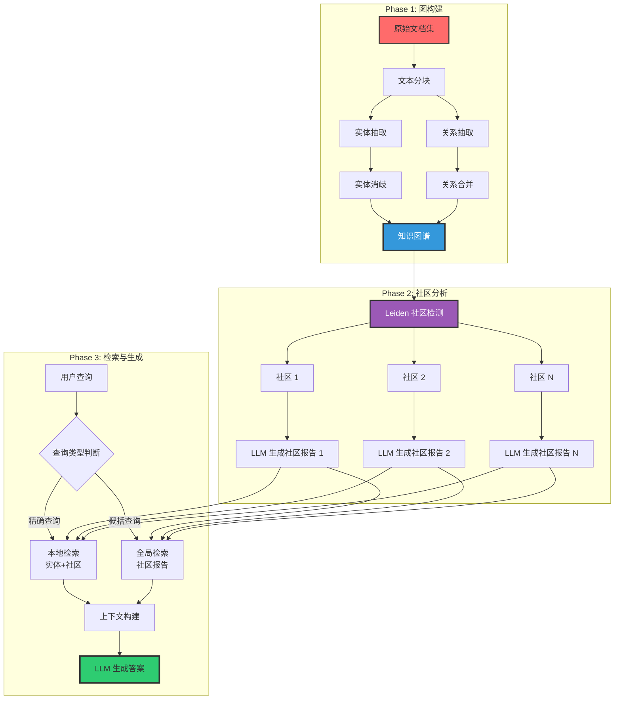
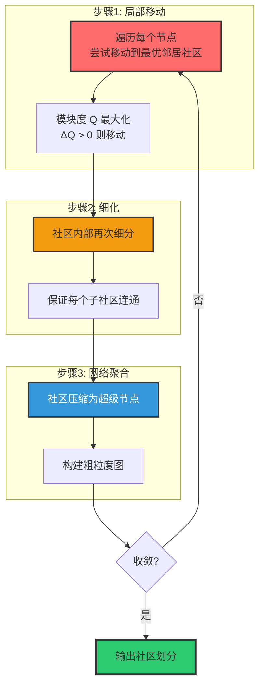
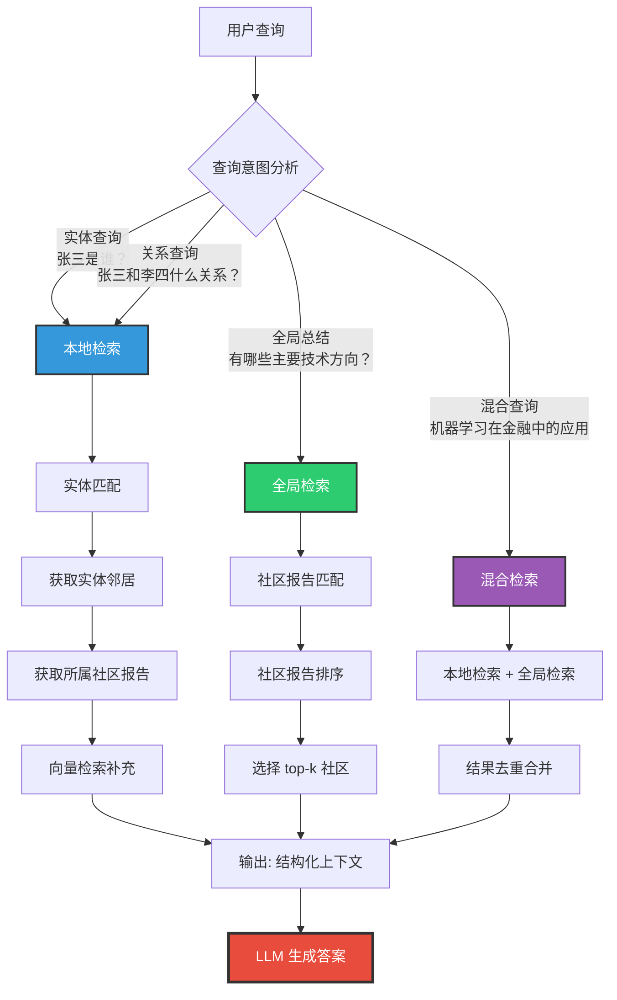
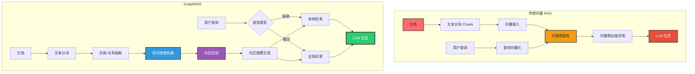

# GraphRAG 技术面试题详解

## 目录
- [1. GraphRAG 概述](#1-graphrag-概述)
- [2. GraphRAG 工作原理](#2-graphrag-工作原理)
  - [2.0 两大阶段总览：索引阶段与查询阶段](#20-两大阶段总览索引阶段与查询阶段)
  - [2.3.0 社区概念详解](#230-社区community概念详解)
- [3. GraphRAG 应用场景](#3-graphrag-应用场景)
- [4. GraphRAG 与普通向量 RAG 对比](#4-graphrag-与普通向量-rag-对比)
- [5. 常见面试题与参考答案](#5-常见面试题与参考答案)

---

## 1. GraphRAG 概述

### 1.1 什么是 GraphRAG

GraphRAG（Graph Retrieval-Augmented Generation）是微软研究院于 2024 年提出的一种基于知识图谱的检索增强生成技术。它通过构建知识图谱来组织非结构化文本中的实体和关系，再结合社区检测和摘要生成，为大语言模型提供结构化的上下文信息，从而显著提升模型在复杂推理、全局理解等问题上的表现。

```
传统 RAG：文本 → 分块 → 向量化 → 检索 → LLM 生成
GraphRAG：文本 → 实体/关系抽取 → 知识图谱 → 社区检测 → 社区摘要 → 两级检索 → LLM 生成
```

### 1.2 核心特性

| 特性 | 说明 |
|------|------|
| **知识图谱构建** | 从非结构化文本中自动抽取实体和关系，构建结构化知识图谱 |
| **社区检测** | 使用 Leiden 算法将知识图谱划分为语义紧密关联的社区 |
| **社区摘要** | 为每个社区生成高层次摘要报告，形成"主题索引" |
| **两级检索** | 本地检索（实体级）+ 全局检索（社区级），覆盖不同粒度的查询需求 |
| **多跳推理** | 通过图遍历实现跨实体、跨关系的多步推理 |
| **可解释性** | 检索来源可追溯至具体实体、关系和社区，具有天然的可解释性 |

### 1.3 技术背景与演进

```
┌─────────────────────────────────────────────────────────────────────┐
│                        RAG 技术演进路线                               │
├─────────────────────────────────────────────────────────────────────┤
│                                                                     │
│  2020 ─── 基础 RAG（Retrieval-Augmented Generation）                 │
│           • 文本分块 + 向量检索 + LLM 生成                            │
│           • 问题：碎片化上下文，缺乏全局理解                          │
│                                                                     │
│  2022 ─── 高级 RAG（Advanced RAG）                                   │
│           • 混合检索（BM25 + 向量）、重排序、Self-RAG                  │
│           • 问题：仍无法处理多跳推理和全局总结                        │
│                                                                     │
│  2023 ─── 模块化 RAG（Modular RAG）                                  │
│           • 可组合的检索、增强、生成模块                              │
│           • 问题：缺乏结构化知识表示                                  │
│                                                                     │
│  2024 ─── GraphRAG（微软）                                           │
│           • 知识图谱 + 社区检测 + 两级检索                            │
│           • 突破：结构化知识理解 + 全局总结能力                       │
│                                                                     │
│  2025 ─── 多模态 GraphRAG / 轻量级 GraphRAG                          │
│           • 降低构建成本，支持多模态数据                              │
│                                                                     │
└─────────────────────────────────────────────────────────────────────┘
```

### 1.4 GraphRAG 解决的问题

传统向量 RAG 在实际应用中存在以下痛点，GraphRAG 针对性地提供了解决方案：

| 痛点 | 传统 RAG 表现 | GraphRAG 解决方案 |
|------|-------------|------------------|
| **全局总结** | 只能看到局部 chunk，无法回答"数据集中有哪些主题" | 社区摘要提供层次化主题视图 |
| **多跳推理** | 需要多次检索，中间结果可能丢失 | 知识图谱直接支持多跳遍历 |
| **实体关系查询** | 难以精确回答"张三和李四什么关系" | 知识图谱中关系是显式存储的 |
| **上下文碎片化** | chunk 之间缺乏关联，信息割裂 | 社区将相关实体聚合，上下文完整 |
| **可解释性** | 不知道为什么检索到这些 chunk | 可追溯至实体、关系和社区 |

---

## 2. GraphRAG 工作原理

### 2.0 两大阶段总览：索引阶段与查询阶段

GraphRAG 从宏观架构上可划分为两个核心阶段：**索引阶段（Indexing Phase）**和**查询阶段（Query Phase）**。索引阶段在离线环境中完成，负责将非结构化文本转化为结构化知识图谱、向量嵌入和社区摘要等可检索的数据结构；查询阶段在在线环境中运行，负责解析用户问题、匹配知识图谱中的实体和社区、执行路径推理并生成最终答案。

```
┌─────────────────────────────────────────────────────────────────────────────┐
│                    GraphRAG 两大阶段架构全景图                                 │
├─────────────────────────────────────────────────────────────────────────────┤
│                                                                             │
│  ┌───────────────────────────────────────────────────────────────────────┐  │
│  │              阶段一：索引阶段（Indexing Phase）【离线】                  │  │
│  ├───────────────────────────────────────────────────────────────────────┤  │
│  │                                                                       │  │
│  │  原始文档                                                              │  │
│  │    │                                                                  │  │
│  │    ▼                                                                  │  │
│  │  ┌──────────────┐    ┌──────────────┐    ┌──────────────────┐        │  │
│  │  │  Step 1      │    │  Step 2      │    │  Step 3           │        │  │
│  │  │  文本预处理   │───▶│  实体/关系    │───▶│  实体消歧与       │        │  │
│  │  │  与分块      │    │  抽取        │    │  关系合并         │        │  │
│  │  └──────────────┘    └──────────────┘    └────────┬─────────┘        │  │
│  │                                                   │                  │  │
│  │                                                   ▼                  │  │
│  │  ┌──────────────┐    ┌──────────────┐    ┌──────────────────┐        │  │
│  │  │  Step 6      │    │  Step 5      │    │  Step 4           │        │  │
│  │  │  社区摘要生成 │◀───│  Leiden 社区  │◀───│  知识图谱构建     │        │  │
│  │  │  (LLM 调用)  │    │  检测        │    │  (图数据库存储)   │        │  │
│  │  └──────┬───────┘    └──────────────┘    └──────────────────┘        │  │
│  │         │                                                            │  │
│  │         ▼                                                            │  │
│  │  ┌──────────────┐    ┌──────────────┐                                │  │
│  │  │  Step 7      │    │  Step 8      │                                │  │
│  │  │  向量嵌入生成 │    │  索引持久化   │  ← 索引构建完成               │  │
│  │  │  (文本+实体)  │    │  (向量库+图库)│                                │  │
│  │  └──────────────┘    └──────────────┘                                │  │
│  │                                                                       │  │
│  └───────────────────────────────────────────────────────────────────────┘  │
│                                    │                                        │
│                                    ▼                                        │
│  ┌───────────────────────────────────────────────────────────────────────┐  │
│  │              阶段二：查询阶段（Query Phase）【在线】                     │  │
│  ├───────────────────────────────────────────────────────────────────────┤  │
│  │                                                                       │  │
│  │  用户自然语言问题                                                       │  │
│  │    │                                                                  │  │
│  │    ▼                                                                  │  │
│  │  ┌──────────────┐    ┌──────────────┐    ┌──────────────────┐        │  │
│  │  │  Step 1      │    │  Step 2      │    │  Step 3           │        │  │
│  │  │  查询意图     │───▶│  实体链接     │───▶│  两级检索路由     │        │  │
│  │  │  解析与分类   │    │  与消歧       │    │  (本地/全局/混合) │        │  │
│  │  └──────────────┘    └──────────────┘    └────────┬─────────┘        │  │
│  │                                                   │                  │  │
│  │                     ┌─────────────────────────────┘                  │  │
│  │                     ▼                                                │  │
│  │  ┌─────────────────────────────────────────────────────┐            │  │
│  │  │              Step 4：多路径并行检索                    │            │  │
│  │  ├─────────────────────────────────────────────────────┤            │  │
│  │  │  ┌──────────────┐  ┌──────────────┐  ┌──────────┐  │            │  │
│  │  │  │  本地检索     │  │  全局检索     │  │ 向量检索  │  │            │  │
│  │  │  │  实体匹配     │  │  社区报告     │  │  兜底召回 │  │            │  │
│  │  │  │  邻居遍历     │  │  相似度匹配   │  │  chunk    │  │            │  │
│  │  │  │  社区上下文   │  │  Top-K 排序   │  │  补充     │  │            │  │
│  │  │  └──────┬───────┘  └──────┬───────┘  └────┬─────┘  │            │  │
│  │  └─────────┼─────────────────┼───────────────┼────────┘            │  │
│  │            │                 │               │                      │  │
│  │            ▼                 ▼               ▼                      │  │
│  │  ┌─────────────────────────────────────────────────────┐            │  │
│  │  │  Step 5：结果融合与去重 → 结构化上下文构建              │            │  │
│  │  └──────────────────────────┬──────────────────────────┘            │  │
│  │                             │                                       │  │
│  │                             ▼                                       │  │
│  │  ┌──────────────┐    ┌──────────────┐    ┌──────────────────┐        │  │
│  │  │  Step 6      │    │  Step 7      │    │  Step 8           │        │  │
│  │  │  路径推理与   │───▶│  LLM 答案生成 │───▶│  引用溯源与       │        │  │
│  │  │  知识增强     │    │  (带引用的)   │    │  结果返回         │        │  │
│  │  └──────────────┘    └──────────────┘    └──────────────────┘        │  │
│  │                                                                       │  │
│  └───────────────────────────────────────────────────────────────────────┘  │
│                                                                             │
└─────────────────────────────────────────────────────────────────────────────┘
```

#### 2.0.0 两大阶段对比总览

| 维度 | 索引阶段（Indexing Phase） | 查询阶段（Query Phase） |
|------|--------------------------|------------------------|
| **执行时机** | 离线（Offline），数据导入时 | 在线（Online），用户提问时 |
| **核心目标** | 将非结构化文本转化为可检索的结构化知识 | 将用户问题转化为精准答案 |
| **输入** | 原始文档集（.txt, .pdf, .md 等） | 用户自然语言问题 |
| **输出** | 知识图谱 + 社区报告 + 向量索引 + 文本块索引 | 带引用来源的结构化答案 |
| **主要技术** | 实体抽取、关系抽取、Leiden 社区检测、LLM 摘要生成、向量嵌入 | 意图识别、实体链接、图遍历、路径推理、LLM 生成 |
| **计算资源** | 高（大量 LLM 调用 + 图算法） | 中（检索 + 单次 LLM 生成） |
| **延迟要求** | 宽松（分钟 ~ 小时级） | 严格（毫秒 ~ 秒级） |
| **更新频率** | 定期或增量（按天/周） | 实时（每次查询） |
| **可并行性** | 高（分块、社区可并行处理） | 中（检索路径可并行，生成需串行） |

---

#### 2.0.1 阶段一：索引阶段（Indexing Phase）详解

索引阶段是 GraphRAG 的离线构建过程，其核心任务是将原始非结构化文档转化为一整套可高效检索的数据结构。该阶段包含 8 个关键步骤，按执行顺序依次为：

**Step 1：文本预处理与分块（Text Preprocessing & Chunking）**

```
输入：原始文档（PDF、Word、Markdown、HTML 等）
输出：标准化文本块（Chunk）列表

处理流程：
┌─────────────────────────────────────────────────────────────────┐
│ 1. 文档解析                                                      │
│    - PDF → 提取文本（PyPDF2 / pdfplumber）                       │
│    - DOCX → 提取文本（python-docx）                              │
│    - HTML → 提取正文（BeautifulSoup / trafilatura）              │
│    - Markdown → 直接读取                                         │
│                                                                  │
│ 2. 文本清洗                                                      │
│    - 移除页眉页脚、页码                                           │
│    - 统一换行符（\r\n → \n）                                     │
│    - 合并断行（保留段落结构）                                      │
│    - 移除特殊控制字符                                             │
│                                                                  │
│ 3. 智能分块                                                      │
│    - 策略：按语义边界（段落）+ 滑动窗口重叠                       │
│    - 粒度：每个 chunk 约 300-800 tokens（根据 LLM 上下文窗口）    │
│    - 重叠：相邻 chunk 重叠 50-100 tokens（避免实体被截断）        │
│    - 元数据：保留文档来源、页码、章节等                           │
└─────────────────────────────────────────────────────────────────┘
```

```python
# 文本分块实现示例
from langchain_text_splitters import RecursiveCharacterTextSplitter

def preprocess_and_chunk(documents: list[str], 
                         chunk_size: int = 600,
                         chunk_overlap: int = 100) -> list[dict]:
    """
    文本预处理与智能分块
    
    参数：
        documents: 原始文档文本列表
        chunk_size: 每个 chunk 的目标 token 数
        chunk_overlap: 相邻 chunk 的重叠 token 数
    
    返回：
        带元数据的分块列表
    """
    splitter = RecursiveCharacterTextSplitter(
        chunk_size=chunk_size,
        chunk_overlap=chunk_overlap,
        separators=["\n\n", "\n", "。", ".", " ", ""],  # 优先按段落分割
        length_function=len,
    )
    
    chunks = []
    for doc_id, doc_text in enumerate(documents):
        # 文本清洗
        cleaned = clean_text(doc_text)
        
        # 分块
        doc_chunks = splitter.split_text(cleaned)
        
        for chunk_idx, chunk_text in enumerate(doc_chunks):
            chunks.append({
                "chunk_id": f"doc_{doc_id}_chunk_{chunk_idx}",
                "text": chunk_text,
                "doc_id": doc_id,
                "chunk_index": chunk_idx,
                "token_count": estimate_tokens(chunk_text)
            })
    
    return chunks
```

**Step 2：实体抽取（Entity Extraction）**

实体抽取是知识图谱构建的第一步，目标是识别文本中具有独立语义的命名实体（Named Entity），包括人物、组织、地点、概念、事件、时间等。

```
┌─────────────────────────────────────────────────────────────────┐
│                     实体抽取核心流程                               │
├─────────────────────────────────────────────────────────────────┤
│                                                                  │
│  输入文本 Chunk:                                                  │
│  "OpenAI 于 2024 年发布了 GPT-4o 模型，Sam Altman 在发布会上       │
│   演示了多模态交互能力，该模型支持文本、图像、音频的实时处理。"      │
│                                                                  │
│                            │                                     │
│                            ▼                                     │
│  ┌────────────────────────────────────────────────────────────┐  │
│  │  LLM 实体抽取（Prompt 引导）                                │  │
│  │                                                             │  │
│  │  实体类型定义：                                              │  │
│  │  - PERSON    : 人物                                         │  │
│  │  - ORG       : 组织/公司                                    │  │
│  │  - GPE       : 地理位置                                     │  │
│  │  - DATE      : 日期/时间                                    │  │
│  │  - PRODUCT   : 产品/模型                                    │  │
│  │  - CONCEPT   : 概念/技术                                    │  │
│  │  - EVENT     : 事件                                         │  │
│  └────────────────────────────────────────────────────────────┘  │
│                            │                                     │
│                            ▼                                     │
│  抽取结果：                                                       │
│  ┌──────────────┬──────────┬──────────────────────────────────┐  │
│  │ 实体名称      │ 实体类型  │ 描述                              │  │
│  ├──────────────┼──────────┼──────────────────────────────────┤  │
│  │ OpenAI       │ ORG      │ 人工智能研究公司                  │  │
│  │ GPT-4o       │ PRODUCT  │ 多模态大语言模型，2024年发布       │  │
│  │ Sam Altman   │ PERSON   │ OpenAI CEO，发布会上演示GPT-4o   │  │
│  │ 2024年       │ DATE     │ GPT-4o 发布年份                  │  │
│  │ 多模态交互    │ CONCEPT  │ 支持文本、图像、音频的实时处理    │  │
│  └──────────────┴──────────┴──────────────────────────────────┘  │
│                                                                  │
└─────────────────────────────────────────────────────────────────┘
```

**实体抽取的关键技术考量：**

| 技术点 | 说明 | 实现策略 |
|--------|------|---------|
| **实体边界识别** | 准确识别实体在文本中的起止位置 | LLM 直接输出 + 正则后处理 |
| **实体类型分类** | 将实体归入预定义类型体系 | 分层类型体系（7-15 种类型） |
| **实体描述生成** | 为每个实体生成上下文描述 | 提取实体所在句子作为描述 |
| **嵌套实体处理** | 处理"OpenAI 的 GPT-4o"中的嵌套 | 保留最外层实体 + 记录层级 |
| **低频实体过滤** | 丢弃仅出现 1-2 次的噪声实体 | 设置频率阈值（min_freq=2） |
| **批量处理优化** | 减少 LLM API 调用次数 | 将多个 chunk 合并为一批处理 |

**Step 3：关系抽取（Relationship Extraction）**

关系抽取在实体抽取之后进行，目标是识别同一 chunk 内实体之间的语义关系，构建知识图谱的"边"。

```
┌─────────────────────────────────────────────────────────────────┐
│                     关系抽取核心流程                               │
├─────────────────────────────────────────────────────────────────┤
│                                                                  │
│  输入：                                                           │
│  - 原始文本 Chunk                                                 │
│  - 已抽取的实体列表（含类型和描述）                                 │
│                                                                  │
│                            │                                     │
│                            ▼                                     │
│  ┌────────────────────────────────────────────────────────────┐  │
│  │  LLM 关系抽取（基于实体列表 + 文本）                         │  │
│  │                                                             │  │
│  │  关系抽取规则：                                              │  │
│  │  1. 只抽取实体列表中存在的实体之间的关系                      │  │
│  │  2. 关系必须有方向性（源实体 → 目标实体）                     │  │
│  │  3. 关系描述使用动词短语（如"发布_产品"、"担任_CEO"）         │  │
│  │  4. 每条关系需附带置信度评分（0-10）                         │  │
│  └────────────────────────────────────────────────────────────┘  │
│                            │                                     │
│                            ▼                                     │
│  抽取结果：                                                       │
│  ┌──────────┬──────────────┬──────────┬────────┬──────────────┐  │
│  │ 源实体    │ 关系          │ 目标实体  │ 置信度  │ 证据文本      │  │
│  ├──────────┼──────────────┼──────────┼────────┼──────────────┤  │
│  │ OpenAI   │ 发布_产品     │ GPT-4o   │   10   │ "OpenAI...   │  │
│  │          │              │          │        │  发布了      │  │
│  │          │              │          │        │  GPT-4o"     │  │
│  │ Sam      │ 担任_CEO     │ OpenAI   │    9   │ "Sam Altman │  │
│  │ Altman   │              │          │        │  在发布会上" │  │
│  │ Sam      │ 演示_产品     │ GPT-4o   │    8   │ "演示了...  │  │
│  │ Altman   │              │          │        │  GPT-4o"     │  │
│  │ GPT-4o   │ 支持_技术     │ 多模态交互│    9   │ "支持文本、 │  │
│  │          │              │          │        │  图像、音频" │  │
│  └──────────┴──────────────┴──────────┴────────┴──────────────┘  │
│                                                                  │
└─────────────────────────────────────────────────────────────────┘
```

**关系抽取的质量保障：**

```python
def validate_relationships(entities: list[dict], 
                           relations: list[dict]) -> list[dict]:
    """
    关系抽取后验证与清洗
    
    验证规则：
    1. 源实体和目标实体必须存在于实体列表中
    2. 关系方向不能自指（source != target）
    3. 去重：相同 (source, relation, target) 只保留一条
    4. 过滤低置信度关系（threshold < 5）
    """
    entity_names = {e["name"] for e in entities}
    validated = []
    seen = set()
    
    for rel in relations:
        # 规则1：实体存在性检查
        if rel["source"] not in entity_names:
            continue
        if rel["target"] not in entity_names:
            continue
        
        # 规则2：非自指检查
        if rel["source"] == rel["target"]:
            continue
        
        # 规则3：去重
        key = (rel["source"], rel["relationship"], rel["target"])
        if key in seen:
            continue
        seen.add(key)
        
        # 规则4：置信度过滤
        if rel.get("confidence", 0) < 5:
            continue
        
        validated.append(rel)
    
    return validated
```

**Step 4：实体消歧与关系合并（Entity Resolution & Relation Merging）**

这是索引阶段的关键质量保障环节，解决"同一实体多种表述"和"重复关系"的问题。

```
┌─────────────────────────────────────────────────────────────────┐
│                   实体消歧策略对比                                 │
├─────────────────────────────────────────────────────────────────┤
│                                                                  │
│  问题：不同 chunk 中可能出现同一实体的不同表述                      │
│                                                                  │
│  Chunk 1: "OpenAI 发布了 GPT-4o"                                 │
│  Chunk 2: "OpenAI 公司推出了 GPT-4 Omni"                         │
│  Chunk 3: "ChatGPT 背后的 OpenAI 推出新模型"                      │
│                                                                  │
│  消歧前：三个独立实体                                             │
│  ┌──────────────┐  ┌──────────────┐  ┌──────────────────┐        │
│  │ "OpenAI"     │  │ "OpenAI 公司" │  │ "ChatGPT 背后的   │        │
│  │ (ORG)        │  │ (ORG)        │  │  OpenAI" (ORG)    │        │
│  └──────────────┘  └──────────────┘  └──────────────────┘        │
│                                                                  │
│  消歧后：合并为同一实体                                            │
│  ┌──────────────────────────────────────────────────────────┐    │
│  │ "OpenAI" → 别名: ["OpenAI 公司", "ChatGPT 背后的 OpenAI"]  │    │
│  │ 描述聚合: "AI 研究公司，发布 GPT-4o，ChatGPT 开发商"       │    │
│  └──────────────────────────────────────────────────────────┘    │
│                                                                  │
│  消歧方法：                                                       │
│  ┌──────────────────────────────────────────────────────────┐    │
│  │  方法 1: 基于嵌入的语义消歧                                 │    │
│  │  - 计算实体描述的词向量嵌入                                 │    │
│  │  - 余弦相似度 > 0.85 且 类型相同 → 合并                     │    │
│  │                                                             │    │
│  │  方法 2: 基于 LLM 的精确消歧                                │    │
│  │  - 将候选实体对传给 LLM，判断是否指向同一实体               │    │
│  │  - 准确率最高，但成本也最高                                 │    │
│  │                                                             │    │
│  │  方法 3: 基于规则的别名消歧                                 │    │
│  │  - 维护别名映射表（如"OpenAI" ↔ "OpenAI 公司"）            │    │
│  │  - 支持正则匹配和模糊匹配                                   │    │
│  └──────────────────────────────────────────────────────────┘    │
│                                                                  │
└─────────────────────────────────────────────────────────────────┘
```

```python
# 实体消歧实现
from sklearn.metrics.pairwise import cosine_similarity
import numpy as np

class EntityResolver:
    """实体消歧器"""
    
    def __init__(self, embedding_model, similarity_threshold: float = 0.85):
        self.embed = embedding_model
        self.threshold = similarity_threshold
        self.alias_map = {}  # 别名字典
    
    def resolve(self, entities: list[dict]) -> list[dict]:
        """
        执行实体消歧
        
        策略：
        1. 先进行基于嵌入的语义消歧（快速）
        2. 对边界案例调用 LLM 精确判断（准确）
        """
        # 1. 生成所有实体的描述向量
        descriptions = [e["description"] for e in entities]
        vectors = self.embed(descriptions)
        
        # 2. 计算成对相似度
        sim_matrix = cosine_similarity(vectors)
        
        # 3. 贪心合并
        resolved = []
        merged_indices = set()
        
        for i, entity in enumerate(entities):
            if i in merged_indices:
                continue
            
            # 找到所有相似的实体
            similar = []
            for j in range(i + 1, len(entities)):
                if j in merged_indices:
                    continue
                if (entities[i]["type"] == entities[j]["type"] and 
                    sim_matrix[i][j] > self.threshold):
                    similar.append(j)
            
            if similar:
                # 合并描述
                merged_desc = entity["description"]
                aliases = [entity["name"]]
                for j in similar:
                    merged_desc += "; " + entities[j]["description"]
                    aliases.append(entities[j]["name"])
                    merged_indices.add(j)
                
                resolved.append({
                    "name": entity["name"],
                    "aliases": aliases,
                    "type": entity["type"],
                    "description": merged_desc[:500],  # 截断
                    "occurrence_count": len(similar) + 1
                })
            else:
                resolved.append({
                    "name": entity["name"],
                    "aliases": [entity["name"]],
                    "type": entity["type"],
                    "description": entity["description"],
                    "occurrence_count": 1
                })
        
        return resolved
```

**Step 5：知识图谱构建与存储（Knowledge Graph Construction）**

消歧后的实体和关系需要被组织为图数据结构并持久化存储。

```
┌─────────────────────────────────────────────────────────────────┐
│                   知识图谱数据模型                                 │
├─────────────────────────────────────────────────────────────────┤
│                                                                  │
│  节点（Node）= 实体（Entity）                                     │
│  ┌──────────────────────────────────────────────────────────┐    │
│  │  {                                                         │    │
│  │    "entity_id": "ent_001",          // 唯一标识符         │    │
│  │    "name": "OpenAI",                // 主名称             │    │
│  │    "aliases": ["OpenAI 公司", ...], // 别名列表           │    │
│  │    "type": "ORG",                   // 实体类型           │    │
│  │    "description": "...",            // 上下文描述         │    │
│  │    "source_chunks": ["chunk_1",     // 来源 chunk 列表    │    │
│  │                       "chunk_2"],                          │    │
│  │    "degree": 15,                    // 图中度数           │    │
│  │    "community_id": 3                // 所属社区 ID        │    │
│  │  }                                                         │    │
│  └──────────────────────────────────────────────────────────┘    │
│                                                                  │
│  边（Edge）= 关系（Relationship）                                 │
│  ┌──────────────────────────────────────────────────────────┐    │
│  │  {                                                         │    │
│  │    "source_id": "ent_001",          // 源实体 ID          │    │
│  │    "target_id": "ent_005",          // 目标实体 ID        │    │
│  │    "relationship": "发布_产品",      // 关系类型          │    │
│  │    "description": "OpenAI 于2024年发布", // 关系描述      │    │
│  │    "weight": 3.0,                   // 权重（出现次数）   │    │
│  │    "confidence": 9.5,               // 平均置信度         │    │
│  │    "source_chunks": ["chunk_1",     // 证据来源           │    │
│  │                       "chunk_3"]                           │    │
│  │  }                                                         │    │
│  └──────────────────────────────────────────────────────────┘    │
│                                                                  │
└─────────────────────────────────────────────────────────────────┘
```

**存储选型对比：**

| 存储方案 | 适用场景 | 优势 | 劣势 |
|---------|---------|------|------|
| **NetworkX** (内存) | 小规模（< 10万实体）、原型验证 | 纯 Python，API 友好，快速开发 | 不可持久化，内存限制 |
| **Neo4j** (图数据库) | 中大规模（10万~1000万实体） | 原生图查询（Cypher），支持事务和索引 | 运维成本较高 |
| **NebulaGraph** | 超大规模（> 1000万实体） | 分布式架构，水平扩展，高吞吐 | 部署复杂度高 |
| **NetworkX + Pickle** | 中小规模（< 50万实体） | 简单持久化，零运维 | 不支持并发查询 |

**Step 6：Leiden 社区检测（Leiden Community Detection）**

社区检测是 GraphRAG 区别于传统向量 RAG 的核心环节。通过 Leiden 算法将知识图谱自动划分为语义紧密关联的社区簇。

```
┌─────────────────────────────────────────────────────────────────┐
│                 Leiden 社区检测算法流程                            │
├─────────────────────────────────────────────────────────────────┤
│                                                                  │
│  输入：知识图谱 G = (V, E)，其中 V 为实体集合，E 为关系集合       │
│                                                                  │
│  ┌────────────────────────────────────────────────────────────┐  │
│  │  Phase 1: 局部移动（Local Moving）                         │  │
│  │  ───────────────────────────────────                       │  │
│  │  for each node v in V (random order):                      │  │
│  │      计算将 v 移动到每个邻居社区后的模块度增益 ΔQ            │  │
│  │      将 v 移动到 ΔQ 最大的社区（ΔQ > 0 时）                  │  │
│  │      重复直到没有节点可以移动                                │  │
│  └────────────────────────────────────────────────────────────┘  │
│                            │                                     │
│                            ▼                                     │
│  ┌────────────────────────────────────────────────────────────┐  │
│  │  Phase 2: 细化（Refinement）                                │  │
│  │  ───────────────────────────                               │  │
│  │  将每个社区 P 进一步细分为子社区 P_refined                   │  │
│  │  保证每个子社区内部连通（解决 Louvain 的断连问题）           │  │
│  │  P_refined 中的节点可以属于不同的父社区                      │  │
│  └────────────────────────────────────────────────────────────┘  │
│                            │                                     │
│                            ▼                                     │
│  ┌────────────────────────────────────────────────────────────┐  │
│  │  Phase 3: 网络聚合（Network Aggregation）                   │  │
│  │  ─────────────────────────────────────                     │  │
│  │  将每个社区 P_refined 压缩为一个超级节点                     │  │
│  │  超级节点间的边权重 = 原始社区间边权重之和                   │  │
│  │  构建粗粒度图 G_aggregated                                  │  │
│  └────────────────────────────────────────────────────────────┘  │
│                            │                                     │
│                            ▼                                     │
│  ┌────────────────────────────────────────────────────────────┐  │
│  │  迭代：G_aggregated 作为新的输入，重复 Phase 1-3             │  │
│  │  直到模块度不再提升或达到最大迭代次数                         │  │
│  └────────────────────────────────────────────────────────────┘  │
│                            │                                     │
│                            ▼                                     │
│  输出：多层级社区划分结果，每个实体归属于一个社区                  │
│                                                                  │
└─────────────────────────────────────────────────────────────────┘
```

**模块度（Modularity）公式详解：**

```
模块度 Q 是衡量社区划分质量的核心指标，取值范围 [-0.5, 1]：

    Q = (1 / 2m) × Σ_ij [ A_ij - (k_i × k_j) / (2m) ] × δ(c_i, c_j)

其中：
  - m = 图中所有边的权重之和 / 2
  - A_ij = 节点 i 和 j 之间的边权重（实际连接）
  - k_i = 节点 i 的加权度（所有邻边权重之和）
  - (k_i × k_j) / (2m) = 在随机图中节点 i 和 j 之间期望的边权重
  - δ(c_i, c_j) = 1 如果 i 和 j 属于同一社区，否则为 0

直观理解：
  A_ij - (k_i × k_j)/(2m) 衡量"实际连接"超出"随机期望"的程度
  如果同一社区内节点的实际连接显著多于随机期望 → Q 值高 → 社区划分好
```

**Step 7：社区摘要生成（Community Report Generation）**

社区检测完成后，GraphRAG 使用 LLM 为每个社区生成一份结构化的摘要报告，这是"全局检索"能力的基础。

```
┌─────────────────────────────────────────────────────────────────┐
│                 社区摘要生成流程                                   │
├─────────────────────────────────────────────────────────────────┤
│                                                                  │
│  输入：社区 C = {实体集 E_C, 关系集 R_C}                          │
│                                                                  │
│  ┌────────────────────────────────────────────────────────────┐  │
│  │  1. 社区数据收集                                           │  │
│  │  ────────────────                                          │  │
│  │  - 收集社区内所有实体（名称、类型、描述、度数）              │  │
│  │  - 收集社区内所有关系（源、目标、关系类型、权重）            │  │
│  │  - 按权重/度数排序，选取 Top-K 实体和 Top-K 关系            │  │
│  │  - 收集社区内实体的原始文本片段（证据）                      │  │
│  └────────────────────────────────────────────────────────────┘  │
│                            │                                     │
│                            ▼                                     │
│  ┌────────────────────────────────────────────────────────────┐  │
│  │  2. LLM 摘要生成                                           │  │
│  │  ────────────────                                          │  │
│  │  Prompt 结构：                                              │  │
│  │                                                             │  │
│  │  "你是一个知识图谱分析专家。以下是一个社区的信息：            │  │
│  │                                                             │  │
│  │   【社区实体】                                               │  │
│  │   - 实体1（类型，描述，度数）                                │  │
│  │   - 实体2（类型，描述，度数）                                │  │
│  │   ...                                                       │  │
│  │                                                             │  │
│  │   【社区关系】                                               │  │
│  │   - 实体A → [关系] → 实体B（权重，描述）                     │  │
│  │   - 实体C → [关系] → 实体D（权重，描述）                     │  │
│  │   ...                                                       │  │
│  │                                                             │  │
│  │   请生成以下结构化报告：                                      │  │
│  │   1. 社区标题（10字以内概括主题）                            │  │
│  │   2. 社区摘要（50字以内描述核心内容）                        │  │
│  │   3. 关键实体（3-5个最重要的实体及其角色）                   │  │
│  │   4. 关键关系（3-5条最重要的关系）                           │  │
│  │   5. 发现/洞察（2-3条从该社区得出的重要发现）                │  │
│  │   6. 重要性评分（1-100）"                                   │  │
│  └────────────────────────────────────────────────────────────┘  │
│                            │                                     │
│                            ▼                                     │
│  输出：社区报告                                                    │
│  ┌────────────────────────────────────────────────────────────┐  │
│  │  {                                                          │  │
│  │    "community_id": 3,                                       │  │
│  │    "title": "AI 行业竞争格局",                               │  │
│  │    "summary": "该社区描述了OpenAI、Google、Meta等公司在      │  │
│  │               大模型领域的竞争关系与产品发布节奏...",          │  │
│  │    "key_entities": [                                        │  │
│  │      {"name": "OpenAI", "role": "行业领导者，发布GPT-4o"},   │  │
│  │      {"name": "Google", "role": "竞争者，发布Gemini"},       │  │
│  │      {"name": "GPT-4o", "role": "OpenAI旗舰多模态模型"}     │  │
│  │    ],                                                       │  │
│  │    "key_relations": [                                       │  │
│  │      {"desc": "OpenAI 发布 GPT-4o → 领先 Google Gemini"},   │  │
│  │      {"desc": "Google 发布 Gemini → 挑战 OpenAI 地位"}      │  │
│  │    ],                                                       │  │
│  │    "findings": [                                            │  │
│  │      "AI 行业呈现 OpenAI vs Google 的双寡头竞争格局",        │  │
│  │      "多模态能力成为大模型竞争的关键差异化点"                 │  │
│  │    ],                                                       │  │
│  │    "importance_score": 92                                   │  │
│  │  }                                                          │  │
│  └────────────────────────────────────────────────────────────┘  │
│                                                                  │
└─────────────────────────────────────────────────────────────────┘
```

**Step 8：向量嵌入生成与索引持久化（Vector Embedding & Index Persistence）**

索引阶段的最后一步，将所有可检索对象转化为向量嵌入并构建索引，同时将知识图谱、社区报告等存储到持久化存储中。

```
┌─────────────────────────────────────────────────────────────────┐
│               向量嵌入与索引构建全景                               │
├─────────────────────────────────────────────────────────────────┤
│                                                                  │
│  需要向量化的对象：                                               │
│  ┌──────────────────────────────────────────────────────────┐    │
│  │  1. 文本块（Chunk）嵌入                                    │    │
│  │     - 输入：chunk 文本内容                                 │    │
│  │     - 模型：text-embedding-3-large / bge-large-zh         │    │
│  │     - 用途：向量检索兜底，补充图检索的不足                  │    │
│  │     - 索引：FAISS / Milvus / Qdrant ANN 索引              │    │
│  │                                                            │    │
│  │  2. 实体描述嵌入                                           │    │
│  │     - 输入：实体名称 + 描述文本                             │    │
│  │     - 模型：同上                                           │    │
│  │     - 用途：查询阶段实体链接（匹配问题中的实体）            │    │
│  │     - 索引：FAISS Flat 索引（精确搜索）                    │    │
│  │                                                            │    │
│  │  3. 社区报告嵌入                                           │    │
│  │     - 输入：社区标题 + 摘要文本                             │    │
│  │     - 模型：同上                                           │    │
│  │     - 用途：全局检索（匹配问题相关的社区报告）              │    │
│  │     - 索引：FAISS Flat 索引                               │    │
│  └──────────────────────────────────────────────────────────┘    │
│                                                                  │
│  持久化存储架构：                                                  │
│  ┌──────────────────────────────────────────────────────────┐    │
│  │                                                            │    │
│  │   ┌─────────────┐   ┌─────────────┐   ┌─────────────┐    │    │
│  │   │ 向量数据库    │   │ 图数据库     │   │ 文档存储     │    │    │
│  │   │ (Milvus/     │   │ (Neo4j/     │   │ (Redis/      │    │    │
│  │   │  Qdrant)     │   │  NetworkX)  │   │  PostgreSQL) │    │    │
│  │   │              │   │             │   │              │    │    │
│  │   │ • Chunk 向量 │   │ • 实体节点   │   │ • 社区报告    │    │    │
│  │   │ • 实体向量   │   │ • 关系边     │   │ • 原始文本    │    │    │
│  │   │ • 社区向量   │   │ • 社区映射   │   │ • 元数据      │    │    │
│  │   └─────────────┘   └─────────────┘   └─────────────┘    │    │
│  │                                                            │    │
│  └──────────────────────────────────────────────────────────┘    │
│                                                                  │
└─────────────────────────────────────────────────────────────────┘
```

```python
# 索引构建完整实现
class GraphRAGIndexBuilder:
    """GraphRAG 索引构建器"""
    
    def __init__(self, 
                 embedding_model,
                 vector_store,
                 graph_store,
                 doc_store):
        self.embed = embedding_model
        self.vector_store = vector_store
        self.graph_store = graph_store
        self.doc_store = doc_store
    
    def build_all_indices(self, 
                          chunks: list[dict],
                          entities: list[dict],
                          relations: list[dict],
                          community_reports: list[dict]):
        """
        构建所有索引并持久化
        
        步骤：
        1. 构建知识图谱（图数据库）
        2. 构建向量索引（向量数据库）
        3. 存储社区报告（文档数据库）
        """
        # 1. 构建知识图谱
        print("构建知识图谱...")
        for entity in entities:
            self.graph_store.add_node(
                node_id=entity["entity_id"],
                properties=entity
            )
        for rel in relations:
            self.graph_store.add_edge(
                source=rel["source_id"],
                target=rel["target_id"],
                properties=rel
            )
        
        # 2. 构建文本块向量索引
        print("构建文本块向量索引...")
        chunk_texts = [c["text"] for c in chunks]
        chunk_vectors = self.embed(chunk_texts)
        self.vector_store.add(
            collection="chunks",
            vectors=chunk_vectors,
            metadata=chunks
        )
        
        # 3. 构建实体描述向量索引
        print("构建实体向量索引...")
        entity_descs = [f"{e['name']}: {e['description']}" 
                        for e in entities]
        entity_vectors = self.embed(entity_descs)
        self.vector_store.add(
            collection="entities",
            vectors=entity_vectors,
            metadata=entities
        )
        
        # 4. 构建社区报告向量索引
        print("构建社区报告向量索引...")
        community_texts = [
            f"{r['title']}: {r['summary']}" 
            for r in community_reports
        ]
        community_vectors = self.embed(community_texts)
        self.vector_store.add(
            collection="communities",
            vectors=community_vectors,
            metadata=community_reports
        )
        
        # 5. 存储社区报告原文
        print("存储社区报告...")
        for report in community_reports:
            self.doc_store.put(
                key=f"community:{report['community_id']}",
                value=report
            )
        
        print(f"索引构建完成！")
        print(f"  - 实体数: {len(entities)}")
        print(f"  - 关系数: {len(relations)}")
        print(f"  - 社区数: {len(community_reports)}")
        print(f"  - 文本块数: {len(chunks)}")
```

---

#### 2.0.2 阶段二：查询阶段（Query Phase）详解

查询阶段是 GraphRAG 的在线推理过程，负责将用户的自然语言问题转化为精准、可追溯的答案。该阶段包含 8 个关键步骤，涉及意图解析、实体链接、多路径检索、路径推理和答案生成。

**Step 1：查询意图解析与分类（Query Intent Parsing & Classification）**

```
┌─────────────────────────────────────────────────────────────────┐
│                   查询意图分类体系                                 │
├─────────────────────────────────────────────────────────────────┤
│                                                                  │
│  用户输入："OpenAI 在 2024 年发布了哪些重要产品？"                │
│                                                                  │
│                            │                                     │
│                            ▼                                     │
│  ┌────────────────────────────────────────────────────────────┐  │
│  │  LLM 查询分析（Query Analysis Prompt）                     │  │
│  │                                                             │  │
│  │  分析维度：                                                  │  │
│  │  1. 查询类型（Query Type）                                  │  │
│  │     ├── 实体查询    : "OpenAI 是什么？"                     │  │
│  │     ├── 关系查询    : "Sam Altman 和 OpenAI 什么关系？"     │  │
│  │     ├── 全局总结    : "AI 行业有哪些主要趋势？"              │  │
│  │     ├── 比较查询    : "GPT-4o 和 Gemini 的区别？"           │  │
│  │     └── 混合查询    : "OpenAI 在 AI 安全方面做了哪些工作？"  │  │
│  │                                                             │  │
│  │  2. 关键实体提取                                             │  │
│  │     提取问题中提到的所有实体名称                              │  │
│  │     → ["OpenAI", "2024年"]                                  │  │
│  │                                                             │  │
│  │  3. 时间约束识别                                             │  │
│  │     是否存在时间范围限制？                                    │  │
│  │     → 时间约束: "2024年"                                    │  │
│  │                                                             │  │
│  │  4. 检索策略推荐                                             │  │
│  │     建议使用哪种检索方式？                                    │  │
│  │     → 推荐: 本地检索（实体查询） + 向量检索补充              │  │
│  └────────────────────────────────────────────────────────────┘  │
│                            │                                     │
│                            ▼                                     │
│  分析结果：                                                       │
│  ┌────────────────────────────────────────────────────────────┐  │
│  │  {                                                          │  │
│  │    "query_type": "实体查询",                                 │  │
│  │    "entities": ["OpenAI", "2024年"],                        │  │
│  │    "temporal_constraint": "2024年",                         │  │
│  │    "search_strategy": "local",                              │  │
│  │    "decomposition": [                                       │  │
│  │      "查找 OpenAI 实体",                                     │  │
│  │      "查找 OpenAI 在2024年的发布关系",                       │  │
│  │      "收集所有关联的产品实体"                                 │  │
│  │    ]                                                        │  │
│  │  }                                                          │  │
│  └────────────────────────────────────────────────────────────┘  │
│                                                                  │
└─────────────────────────────────────────────────────────────────┘
```

```python
# 查询意图解析实现
class QueryAnalyzer:
    """查询意图解析器"""
    
    def __init__(self, llm):
        self.llm = llm
    
    def analyze(self, query: str) -> dict:
        """
        解析用户查询，提取意图、实体和检索策略
        
        返回：
            {
                "query_type": str,       # 查询类型
                "entities": list[str],    # 关键实体
                "temporal": str|None,     # 时间约束
                "strategy": str,          # 检索策略
                "sub_queries": list[str]  # 子查询分解
            }
        """
        prompt = f"""
        分析以下用户查询，返回 JSON 格式：
        
        查询：{query}
        
        请分析：
        1. query_type: 实体查询/关系查询/全局总结/比较查询/混合查询
        2. entities: 查询中提到的关键实体名称列表
        3. temporal_constraint: 时间约束（如有），否则 null
        4. search_strategy: local/global/hybrid
        5. sub_queries: 将复杂查询分解为 2-4 个子查询
        
        返回纯 JSON 格式。
        """
        response = self.llm.invoke(prompt)
        return parse_json(response.content)
```

**Step 2：实体链接与消歧（Entity Linking & Disambiguation）**

将查询中提取的实体名称，精确匹配到知识图谱中的实体节点。

```
┌─────────────────────────────────────────────────────────────────┐
│                   实体链接流程                                     │
├─────────────────────────────────────────────────────────────────┤
│                                                                  │
│  查询实体："OpenAI"                                              │
│                                                                  │
│  ┌────────────────────────────────────────────────────────────┐  │
│  │  Layer 1: 精确名称匹配                                      │  │
│  │  ─────────────────────                                      │  │
│  │  在知识图谱中查找 name == "OpenAI" 的实体                    │  │
│  │  → 找到: entity_id = "ent_001"                              │  │
│  │  → 匹配成功，直接返回                                        │  │
│  └────────────────────────────────────────────────────────────┘  │
│                                                                  │
│  如果精确匹配失败：                                                │
│  ┌────────────────────────────────────────────────────────────┐  │
│  │  Layer 2: 别名匹配                                          │  │
│  │  ─────────────────                                          │  │
│  │  在知识图谱中查找 aliases 包含 "OpenAI" 的实体               │  │
│  │  → 找到: entity_id = "ent_001" (别名: "OpenAI 公司")        │  │
│  └────────────────────────────────────────────────────────────┘  │
│                                                                  │
│  如果别名匹配失败：                                                │
│  ┌────────────────────────────────────────────────────────────┐  │
│  │  Layer 3: 向量语义匹配                                      │  │
│  │  ─────────────────────                                      │  │
│  │  将查询实体名 "OpenAI" 向量化                                │  │
│  │  在实体向量索引中搜索 Top-K 相似实体                          │  │
│  │  返回余弦相似度 > 0.8 的候选实体                             │  │
│  └────────────────────────────────────────────────────────────┘  │
│                                                                  │
│  如果向量匹配存在多个候选：                                        │
│  ┌────────────────────────────────────────────────────────────┐  │
│  │  Layer 4: LLM 消歧                                          │  │
│  │  ────────────────                                           │  │
│  │  将候选实体列表 + 原始查询交给 LLM                            │  │
│  │  让 LLM 判断哪个实体最匹配查询意图                           │  │
│  └────────────────────────────────────────────────────────────┘  │
│                                                                  │
└─────────────────────────────────────────────────────────────────┘
```

```python
class EntityLinker:
    """实体链接器"""
    
    def __init__(self, kg, vector_store, embed_model, llm):
        self.kg = kg
        self.vector_store = vector_store
        self.embed = embed_model
        self.llm = llm
    
    def link(self, entity_name: str, query_context: str = "") -> dict | None:
        """
        将实体名称链接到知识图谱中的实体节点
        
        分层匹配策略：
        Layer 1: 精确名称匹配
        Layer 2: 别名匹配
        Layer 3: 向量语义匹配
        Layer 4: LLM 消歧
        """
        # Layer 1: 精确匹配
        node = self.kg.find_node_by_name(entity_name)
        if node:
            return {"entity": node, "match_method": "exact", "confidence": 1.0}
        
        # Layer 2: 别名匹配
        node = self.kg.find_node_by_alias(entity_name)
        if node:
            return {"entity": node, "match_method": "alias", "confidence": 0.95}
        
        # Layer 3: 向量语义匹配
        query_vec = self.embed([entity_name])[0]
        candidates = self.vector_store.search(
            collection="entities",
            query_vector=query_vec,
            top_k=5
        )
        
        if candidates and candidates[0]["score"] > 0.8:
            if len(candidates) == 1 or candidates[0]["score"] > 0.95:
                return {
                    "entity": candidates[0]["metadata"],
                    "match_method": "semantic",
                    "confidence": candidates[0]["score"]
                }
            
            # Layer 4: LLM 消歧（多个候选）
            prompt = f"""
            查询上下文：{query_context}
            查询实体：{entity_name}
            
            候选实体列表：
            {json.dumps([c['metadata']['name'] + ': ' + c['metadata']['description'] 
                         for c in candidates[:3]], indent=2)}
            
            请选择与查询最匹配的实体（返回序号 0-{min(2, len(candidates)-1)}），
            如果都不匹配返回 -1。
            只返回数字。
            """
            choice = int(self.llm.invoke(prompt).content.strip())
            if choice >= 0:
                return {
                    "entity": candidates[choice]["metadata"],
                    "match_method": "llm_disambiguation",
                    "confidence": candidates[choice]["score"]
                }
        
        return None  # 实体未找到
```

**Step 3：两级检索路由（Two-Level Retrieval Routing）**

根据查询意图分析结果，将请求路由到本地检索、全局检索或混合检索。

```
┌─────────────────────────────────────────────────────────────────┐
│                   检索路由决策矩阵                                 │
├─────────────────────────────────────────────────────────────────┤
│                                                                  │
│  ┌──────────────┬──────────────────────┬──────────────────────┐  │
│  │  查询类型      │  检索策略              │  说明                │  │
│  ├──────────────┼──────────────────────┼──────────────────────┤  │
│  │  实体查询      │  本地检索 (Local)      │  精确匹配实体+邻居   │  │
│  │  "OpenAI是啥？" │  + 向量检索补充        │  + 社区上下文       │  │
│  ├──────────────┼──────────────────────┼──────────────────────┤  │
│  │  关系查询      │  本地检索 (Local)      │  实体匹配→多跳遍历   │  │
│  │  "A和B啥关系？" │  + 路径推理            │  → 关系路径发现     │  │
│  ├──────────────┼──────────────────────┼──────────────────────┤  │
│  │  全局总结      │  全局检索 (Global)     │  社区报告匹配        │  │
│  │  "有哪些趋势？" │  + 社区报告聚合         │  → Top-K 社区摘要   │  │
│  ├──────────────┼──────────────────────┼──────────────────────┤  │
│  │  比较查询      │  混合检索 (Hybrid)     │  本地+全局           │  │
│  │  "A vs B"     │  两者并行检索           │  → 结果融合         │  │
│  ├──────────────┼──────────────────────┼──────────────────────┤  │
│  │  混合查询      │  混合检索 (Hybrid)     │  本地+全局           │  │
│  │  "A在B方面..." │  + 结果去重合并         │  → 综合上下文       │  │
│  └──────────────┴──────────────────────┴──────────────────────┘  │
│                                                                  │
└─────────────────────────────────────────────────────────────────┘
```

**Step 4：多路径并行检索（Multi-Path Parallel Retrieval）**

这是查询阶段的核心执行步骤，三种检索路径并行运行，最大化信息召回。

**路径 A：本地检索（Local Search）—— 实体级精确查询**

```
┌─────────────────────────────────────────────────────────────────┐
│                 本地检索执行流程                                   │
├─────────────────────────────────────────────────────────────────┤
│                                                                  │
│  输入：已链接的实体 {"OpenAI": entity_id="ent_001"}               │
│                                                                  │
│  ┌────────────────────────────────────────────────────────────┐  │
│  │  Step 4a-1: 获取实体详情                                    │  │
│  │  ────────────────────                                       │  │
│  │  entity_info = kg.get_entity("ent_001")                     │  │
│  │  → {name: "OpenAI", type: "ORG", description: "...", ...}  │  │
│  └────────────────────────────────────────────────────────────┘  │
│                            │                                     │
│                            ▼                                     │
│  ┌────────────────────────────────────────────────────────────┐  │
│  │  Step 4a-2: 获取实体邻居（一跳）                             │  │
│  │  ─────────────────────────────                              │  │
│  │  neighbors = kg.get_neighbors("ent_001", depth=1)           │  │
│  │  → [                                                         │  │
│  │      {entity: "Sam Altman", relation: "担任CEO_组织"},       │  │
│  │      {entity: "GPT-4o", relation: "发布_产品"},              │  │
│  │      {entity: "GPT-4", relation: "发布_产品"},               │  │
│  │      {entity: "DALL-E 3", relation: "发布_产品"},            │  │
│  │    ]                                                         │  │
│  └────────────────────────────────────────────────────────────┘  │
│                            │                                     │
│                            ▼                                     │
│  ┌────────────────────────────────────────────────────────────┐  │
│  │  Step 4a-3: 获取实体所属社区上下文                           │  │
│  │  ─────────────────────────────────                          │  │
│  │  community_id = kg.get_entity_community("ent_001")          │  │
│  │  community_report = doc_store.get(f"community:{community_id}")│  │
│  │  → 社区标题: "AI 行业竞争格局"                               │  │
│  │  → 社区摘要: "该社区描述了OpenAI、Google等公司在..."          │  │
│  └────────────────────────────────────────────────────────────┘  │
│                            │                                     │
│                            ▼                                     │
│  本地检索结果：                                                   │
│  ┌────────────────────────────────────────────────────────────┐  │
│  │  {                                                          │  │
│  │    "entity": {name: "OpenAI", type: "ORG", ...},            │  │
│  │    "neighbors": [...],            // 一跳邻居列表            │  │
│  │    "community_title": "AI 行业竞争格局",                     │  │
│  │    "community_summary": "...",     // 所属社区摘要           │  │
│  │    "related_relations": [...]      // 相关关系列表           │  │
│  │  }                                                          │  │
│  └────────────────────────────────────────────────────────────┘  │
│                                                                  │
└─────────────────────────────────────────────────────────────────┘
```

**路径 B：全局检索（Global Search）—— 社区级概括查询**

```
┌─────────────────────────────────────────────────────────────────┐
│                 全局检索执行流程                                   │
├─────────────────────────────────────────────────────────────────┤
│                                                                  │
│  输入：用户原始查询 + 查询意图分析结果                             │
│                                                                  │
│  ┌────────────────────────────────────────────────────────────┐  │
│  │  Step 4b-1: 查询向量化                                      │  │
│  │  ────────────────────                                       │  │
│  │  query_vector = embed("OpenAI 在 2024 年发布了哪些重要产品") │  │
│  └────────────────────────────────────────────────────────────┘  │
│                            │                                     │
│                            ▼                                     │
│  ┌────────────────────────────────────────────────────────────┐  │
│  │  Step 4b-2: 社区报告向量匹配                                 │  │
│  │  ─────────────────────────────                              │  │
│  │  results = vector_store.search(                             │  │
│  │      collection="communities",                              │  │
│  │      query_vector=query_vector,                             │  │
│  │      top_k=5                                                │  │
│  │  )                                                          │  │
│  │                                                             │  │
│  │  Top-5 社区报告匹配结果：                                    │  │
│  │  ┌──────┬──────────────────────────────┬────────┐          │  │
│  │  │ 排名  │ 社区标题                      │ 相似度  │          │  │
│  │  ├──────┼──────────────────────────────┼────────┤          │  │
│  │  │  1   │ AI 行业竞争格局               │ 0.92   │          │  │
│  │  │  2   │ 多模态大模型技术发展            │ 0.87   │          │  │
│  │  │  3   │ AI 产品发布节奏               │ 0.83   │          │  │
│  │  │  4   │ 大模型安全与对齐               │ 0.71   │          │  │
│  │  │  5   │ AI 商业应用落地               │ 0.65   │          │  │
│  │  └──────┴──────────────────────────────┴────────┘          │  │
│  └────────────────────────────────────────────────────────────┘  │
│                            │                                     │
│                            ▼                                     │
│  ┌────────────────────────────────────────────────────────────┐  │
│  │  Step 4b-3: 社区报告聚合与排序                               │  │
│  │  ─────────────────────────────────                          │  │
│  │  综合排序权重 = 0.6 × 相似度 + 0.4 × 重要性评分              │  │
│  │  过滤：综合权重 > 0.5 的社区报告                              │  │
│  └────────────────────────────────────────────────────────────┘  │
│                            │                                     │
│                            ▼                                     │
│  全局检索结果：                                                   │
│  ┌────────────────────────────────────────────────────────────┐  │
│  │  {                                                          │  │
│  │    "matched_communities": [                                 │  │
│  │      {id: 3, title: "AI 行业竞争格局", score: 0.92, ...},  │  │
│  │      {id: 7, title: "多模态大模型技术发展", score: 0.87, ...}│  │
│  │    ],                                                       │  │
│  │    "aggregated_summary": "..."  // 聚合后的主题摘要         │  │
│  │  }                                                          │  │
│  └────────────────────────────────────────────────────────────┘  │
│                                                                  │
└─────────────────────────────────────────────────────────────────┘
```

**路径 B+：全局搜索的 Map-Reduce 实现（Global Search via Map-Reduce）**

当社区报告数量庞大（数百~数千个）时，简单的向量 Top-K 匹配已不足以保证全局检索的质量。此时需要引入 **Map-Reduce 架构**，将全局搜索分解为可并行执行的 Map 阶段和可聚合的 Reduce 阶段，在大规模社区集合上实现高效、高质量的检索与答案生成。

```
┌─────────────────────────────────────────────────────────────────────────────┐
│              全局搜索 Map-Reduce 架构全景图                                   │
├─────────────────────────────────────────────────────────────────────────────┤
│                                                                             │
│  用户查询: "公司在大模型领域有哪些技术布局和竞争策略？"                         │
│       │                                                                     │
│       ▼                                                                     │
│  ┌──────────────────────────────────────────────────────────────────────┐   │
│  │  预处理：查询解析 + 社区分片                                          │   │
│  │  ─────────────────────────────                                       │   │
│  │  1. 解析查询 → 关键词: ["大模型", "技术布局", "竞争策略"]             │   │
│  │  2. 查询向量化 → query_vector                                        │   │
│  │  3. 社区分片：将 N 个社区报告按层级编号均匀分为 K 个分片               │   │
│  │     Shard 0: [A-01, A-02, A-03, A-04]                              │   │
│  │     Shard 1: [B-01, B-02, B-03, B-04]                              │   │
│  │     Shard 2: [C-01, C-02, C-03, C-04]                              │   │
│  │     ...                                                              │   │
│  │     Shard K-1: [...]                                                 │   │
│  └──────────────────────────────────────────────────────────────────────┘   │
│       │                                                                     │
│       ▼                                                                     │
│  ╔═══════════════════════════════════════════════════════════════════════╗   │
│  ║                    MAP 阶段（并行执行）                                 ║   │
│  ╠═══════════════════════════════════════════════════════════════════════╣   │
│  ║                                                                       ║   │
│  ║  ┌─────────────┐  ┌─────────────┐  ┌─────────────┐  ┌─────────────┐  ║   │
│  ║  │  Worker 0   │  │  Worker 1   │  │  Worker 2   │  │  Worker K-1 │  ║   │
│  ║  │  Shard 0    │  │  Shard 1    │  │  Shard 2    │  │  Shard K-1  │  ║   │
│  ║  └──────┬──────┘  └──────┬──────┘  └──────┬──────┘  └──────┬──────┘  ║   │
│  ║         │                │                │                │          ║   │
│  ║         ▼                ▼                ▼                ▼          ║   │
│  ║  ┌────────────────────────────────────────────────────────────────┐   ║   │
│  ║  │  每个 Worker 独立执行：                                         │   ║   │
│  ║  │                                                                │   ║   │
│  ║  │  1. 关键词提取 → 从社区报告中提取与查询相关的关键词片段          │   ║   │
│  ║  │  2. 向量匹配   → 计算社区报告与查询的语义相似度                  │   ║   │
│  ║  │  3. 权重计算   → 综合相似度 + 重要性 + 关键词命中率              │   ║   │
│  ║  │  4. 局部摘要   → LLM 生成该分片内的局部答案                     │   ║   │
│  ║  │                                                                │   ║   │
│  ║  │  输出 MapResult:                                                │   ║   │
│  ║  │  {                                                             │   ║   │
│  ║  │    "shard_id": 0,                                              │   ║   │
│  ║  │    "matched_communities": [                                    │   ║   │
│  ║  │      {id: "A-01", score: 0.94, keywords_hit: 3},              │   ║   │
│  ║  │      {id: "A-03", score: 0.78, keywords_hit: 2}               │   ║   │
│  ║  │    ],                                                          │   ║   │
│  ║  │    "local_answer": "该分片涉及大模型布局的社区有...",             │   ║   │
│  ║  │    "key_points": ["GPT-4o 多模态", "开源 LLaMA", ...],         │   ║   │
│  ║  │    "token_count": 1200                                         │   ║   │
│  ║  │  }                                                             │   ║   │
│  ║  └────────────────────────────────────────────────────────────────┘   ║   │
│  ║                                                                       ║   │
│  ╚═══════════════════════════════════════════════════════════════════════╝   │
│       │                                                                     │
│       │  K 个 MapResult 汇总                                                │
│       ▼                                                                     │
│  ╔═══════════════════════════════════════════════════════════════════════╗   │
│  ║                    REDUCE 阶段（聚合生成）                              ║   │
│  ╠═══════════════════════════════════════════════════════════════════════╣   │
│  ║                                                                       ║   │
│  ║  Step R-1: 结果聚合与去重                                              ║   │
│  ║  ─────────────────────────                                            ║   │
│  ║  - 合并所有 MapResult 的 matched_communities                          ║   │
│  ║  - 按综合权重降序排序，取 Top-M                                         ║   │
│  ║  - 去重：同一实体/关系在不同分片重复出现时合并                           ║   │
│  ║                                                                       ║   │
│  ║  Step R-2: 权重合并与重排序                                            ║   │
│  ║  ─────────────────────────                                            ║   │
│  ║  最终权重 = 0.40 × 语义相似度                                          ║   │
│  ║           + 0.25 × 关键词命中率                                        ║   │
│  ║           + 0.20 × 社区重要性评分                                      ║   │
│  ║           + 0.15 × 层级深度衰减因子                                    ║   │
│  ║                                                                       ║   │
│  ║  Step R-3: 全局答案生成                                                ║   │
│  ║  ─────────────────────────                                            ║   │
│  ║  将 Top-M 社区报告 + 各分片局部答案 + key_points                       ║   │
│  ║  组装为 Prompt，由 LLM 生成最终全局答案                                 ║   │
│  ║                                                                       ║   │
│  ║  输出：                                                               ║   │
│  ║  {                                                                    ║   │
│  ║    "answer": "公司在大模型领域的技术布局包括...",                        ║   │
│  ║    "source_communities": ["A-01", "A-03", "B-02", ...],              ║   │
│  ║    "confidence": 0.91,                                                ║   │
│  ║    "map_workers": 4,                                                  ║   │
│  ║    "reduce_time_ms": 320                                              ║   │
│  ║  }                                                                    ║   │
│  ║                                                                       ║   │
│  ╚═══════════════════════════════════════════════════════════════════════╝   │
│                                                                             │
└─────────────────────────────────────────────────────────────────────────────┘
```

**Map-Reduce 全局搜索的技术原理：**

```
┌─────────────────────────────────────────────────────────────────────────────┐
│              Map-Reduce 在全局搜索中的应用优势                                │
├─────────────────────────────────────────────────────────────────────────────┤
│                                                                             │
│  1. 并行加速                                                                │
│  ──────────                                                                 │
│  传统全局搜索：串行遍历 N 个社区 → O(N) 时间                                │
│  Map-Reduce：K 个 Worker 并行处理 → O(N/K) 时间                             │
│  当 N=1000, K=10 时，加速 10 倍                                             │
│                                                                             │
│  2. LLM 调用分散                                                            │
│  ──────────────                                                             │
│  传统方式：将所有社区报告塞入单个 Prompt → 超出上下文窗口                     │
│  Map-Reduce：每个 Worker 仅处理少量社区 → 单次 Prompt 可控在 4K-8K tokens    │
│  Reduce 阶段仅聚合局部答案 → 避免长文本问题                                  │
│                                                                             │
│  3. 质量提升                                                                │
│  ──────────                                                                 │
│  每个 Worker 独立做局部摘要 → 信息提取更精细                                 │
│  Reduce 阶段综合多视角 → 答案更全面                                          │
│  关键词命中率作为额外信号 → 避免纯向量检索的语义漂移                          │
│                                                                             │
│  4. 容错与弹性                                                              │
│  ──────────────                                                             │
│  单个 Worker 失败不影响其他分片                                              │
│  支持动态扩缩容：根据社区数量自动调整 Worker 数                               │
│  支持超时降级：超时 Worker 的结果可被丢弃，不影响整体                          │
│                                                                             │
│  5. 与 GraphRAG 社区层级的天然契合                                           │
│  ──────────────────────────────                                             │
│  社区按层级编号（A-01, A-02, B-01...）天然可分片                            │
│  同一知识域的社区分配到同一 Worker → 局部摘要语义更连贯                       │
│  层级编号前缀索引加速分片查询                                                │
│                                                                             │
└─────────────────────────────────────────────────────────────────────────────┘
```

**Map-Reduce 全局搜索完整实现：**

```python
# ============================================================
# GraphRAG 全局搜索 Map-Reduce 实现
# ============================================================

import asyncio
import math
import re
from dataclasses import dataclass, field
from typing import Optional
from concurrent.futures import ThreadPoolExecutor


# ─── 数据结构定义 ───

@dataclass
class MapResult:
    """Map 阶段单个 Worker 的输出"""
    shard_id: int                           # 分片编号
    matched_communities: list[dict]         # 匹配的社区列表（含分数）
    local_answer: str                       # 该分片的局部答案
    key_points: list[str]                   # 提取的关键要点
    token_count: int                        # 该分片消耗的 token 数
    elapsed_ms: int                         # 该分片耗时（毫秒）


@dataclass
class ReduceResult:
    """Reduce 阶段的最终输出"""
    answer: str                             # 最终全局答案
    source_communities: list[str]           # 引用的社区编号列表
    confidence: float                       # 答案置信度
    map_workers: int                        # 参与计算的 Worker 数
    total_map_time_ms: int                  # Map 阶段总耗时
    reduce_time_ms: int                     # Reduce 阶段耗时
    key_points_merged: list[str]            # 合并后的全局关键要点


@dataclass
class GlobalSearchConfig:
    """全局搜索配置"""
    num_shards: int = 4                     # 分片数量（= Worker 数）
    top_k_per_shard: int = 5               # 每个分片取 Top-K 社区
    top_m_global: int = 10                 # Reduce 阶段取 Top-M 社区
    keyword_weight: float = 0.25           # 关键词命中率权重
    semantic_weight: float = 0.40          # 语义相似度权重
    importance_weight: float = 0.20        # 社区重要性权重
    depth_decay_weight: float = 0.15       # 层级深度衰减权重
    max_tokens_per_worker: int = 8000      # 每个 Worker 最大 token 数
    worker_timeout_seconds: int = 30       # Worker 超时时间
    enable_keyword_match: bool = True      # 是否启用关键词匹配


# ─── Map 阶段 ───

class GlobalSearchMapper:
    """
    Map 阶段：分片处理 + 关键词提取 + 初步权重计算
    
    职责：
    1. 接收一个社区分片（shard）
    2. 对分片内每个社区报告执行：
       a. 关键词提取与匹配
       b. 向量语义相似度计算
       c. 综合权重计算
    3. 对 Top-K 社区调用 LLM 生成局部答案
    4. 输出 MapResult
    """
    
    def __init__(self, config: GlobalSearchConfig, 
                 embed_model, llm, vector_store):
        self.config = config
        self.embed = embed_model
        self.llm = llm
        self.vector_store = vector_store
    
    def map(self, shard_id: int, 
            shard_communities: list[dict],
            query: str,
            query_keywords: list[str],
            query_vector: list[float]) -> MapResult:
        """
        执行单个分片的 Map 任务
        
        参数：
            shard_id:          分片编号
            shard_communities: 该分片内的社区报告列表
            query:             用户原始查询
            query_keywords:    从查询中提取的关键词列表
            query_vector:      查询的向量嵌入
        
        返回：
            MapResult: 该分片的局部结果
        """
        import time
        start_time = time.time()
        
        # ── Step M-1: 对每个社区计算综合权重 ──
        scored_communities = []
        for community in shard_communities:
            # (a) 语义相似度：社区报告向量与查询向量的余弦相似度
            semantic_score = self._compute_semantic_score(
                community, query_vector
            )
            
            # (b) 关键词命中率：查询关键词在社区报告中的命中比例
            keyword_score = self._compute_keyword_score(
                community, query_keywords
            ) if self.config.enable_keyword_match else 0.0
            
            # (c) 社区重要性评分（索引阶段 LLM 生成的 1-100 分）
            importance_score = community.get("importance_score", 0) / 100.0
            
            # (d) 层级深度衰减因子：越深层的社区权重越低
            depth = community.get("level", 0)
            depth_factor = 1.0 / (1.0 + 0.1 * depth)
            
            # 综合权重 = 各维度加权求和
            final_score = (
                self.config.semantic_weight * semantic_score +
                self.config.keyword_weight * keyword_score +
                self.config.importance_weight * importance_score +
                self.config.depth_decay_weight * depth_factor
            )
            
            scored_communities.append({
                "id": community["id"],
                "hierarchy_code": community.get("hierarchy_code", ""),
                "title": community.get("title", ""),
                "summary": community.get("summary", ""),
                "semantic_score": round(semantic_score, 4),
                "keyword_score": round(keyword_score, 4),
                "importance_score": round(importance_score, 4),
                "depth_factor": round(depth_factor, 4),
                "final_score": round(final_score, 4),
            })
        
        # ── Step M-2: 按综合权重排序，取 Top-K ──
        scored_communities.sort(
            key=lambda c: c["final_score"], reverse=True
        )
        top_k = scored_communities[:self.config.top_k_per_shard]
        
        # ── Step M-3: 调用 LLM 生成分片局部答案 ──
        local_answer, key_points = self._generate_local_answer(
            query, query_keywords, top_k
        )
        
        elapsed_ms = int((time.time() - start_time) * 1000)
        
        return MapResult(
            shard_id=shard_id,
            matched_communities=top_k,
            local_answer=local_answer,
            key_points=key_points,
            token_count=self._estimate_tokens(local_answer),
            elapsed_ms=elapsed_ms,
        )
    
    def _compute_semantic_score(self, community: dict, 
                                 query_vector: list[float]) -> float:
        """计算社区报告与查询的语义相似度"""
        community_vector = community.get("report_embedding")
        if not community_vector:
            return 0.0
        # 余弦相似度
        dot_product = sum(a * b for a, b in zip(query_vector, community_vector))
        norm_q = math.sqrt(sum(a * a for a in query_vector))
        norm_c = math.sqrt(sum(a * a for a in community_vector))
        if norm_q == 0 or norm_c == 0:
            return 0.0
        return dot_product / (norm_q * norm_c)
    
    def _compute_keyword_score(self, community: dict, 
                                keywords: list[str]) -> float:
        """
        计算关键词命中率
        
        规则：统计查询关键词在社区标题+摘要中的命中数量，
        命中数 / 总关键词数 = 命中率
        """
        text = (community.get("title", "") + " " + 
                community.get("summary", "")).lower()
        if not keywords:
            return 0.0
        hits = sum(1 for kw in keywords if kw.lower() in text)
        return hits / len(keywords)
    
    def _generate_local_answer(self, query: str, 
                                keywords: list[str],
                                top_k_communities: list[dict]
                                ) -> tuple[str, list[str]]:
        """
        调用 LLM 生成分片局部答案
        
        Prompt 设计：
        - 将 Top-K 社区报告的标题和摘要作为上下文
        - 要求 LLM 提取与查询相关的关键要点
        - 生成局部答案（200 字以内）
        """
        community_context = "\n".join([
            f"【社区 {c['hierarchy_code']}】{c['title']}\n"
            f"摘要: {c['summary']}\n"
            f"相关度: {c['final_score']}"
            for c in top_k_communities
        ])
        
        prompt = f"""基于以下社区报告信息，回答用户问题。

用户问题：{query}
相关关键词：{', '.join(keywords)}

社区报告：
{community_context}

请：
1. 提取 3-5 个与问题最相关的关键要点（每点一句话）
2. 用 200 字以内生成局部答案

返回 JSON 格式：{{"answer": "...", "key_points": ["...", "..."]}}"""
        
        try:
            response = self.llm.invoke(prompt)
            result = parse_json(response.content)
            return result.get("answer", ""), result.get("key_points", [])
        except Exception:
            return "", []
    
    def _estimate_tokens(self, text: str) -> int:
        """粗略估算 token 数（中文约 1.5 字/token，英文约 4 字符/token）"""
        chinese_chars = len(re.findall(r'[\u4e00-\u9fff]', text))
        other_chars = len(text) - chinese_chars
        return int(chinese_chars / 1.5 + other_chars / 4)


# ─── Reduce 阶段 ───

class GlobalSearchReducer:
    """
    Reduce 阶段：聚合 + 权重合并 + 排序 + 全局答案生成
    
    职责：
    1. 收集所有 MapResult
    2. 合并匹配社区，去重
    3. 按最终权重重新排序
    4. 合并各分片 key_points
    5. 调用 LLM 生成最终全局答案
    """
    
    def __init__(self, config: GlobalSearchConfig, llm):
        self.config = config
        self.llm = llm
    
    def reduce(self, query: str, 
               map_results: list[MapResult]) -> ReduceResult:
        """
        执行 Reduce 聚合
        
        参数：
            query:       用户原始查询
            map_results: 所有 Map Worker 的输出列表
        
        返回：
            ReduceResult: 最终全局搜索结果
        """
        import time
        start_time = time.time()
        
        # ── Step R-1: 合并所有分片的匹配社区，去重 ──
        all_communities = {}  # key: community_id, value: community dict
        all_key_points = []
        
        for mr in map_results:
            for community in mr.matched_communities:
                cid = community["id"]
                if cid not in all_communities:
                    all_communities[cid] = community
                else:
                    # 同一社区在多个分片出现，取更高分
                    existing = all_communities[cid]
                    if community["final_score"] > existing["final_score"]:
                        all_communities[cid] = community
            
            # 合并关键要点（去重）
            for kp in mr.key_points:
                if kp not in all_key_points:
                    all_key_points.append(kp)
        
        # ── Step R-2: 按最终权重重新排序，取 Top-M ──
        sorted_communities = sorted(
            all_communities.values(),
            key=lambda c: c["final_score"],
            reverse=True
        )
        top_m = sorted_communities[:self.config.top_m_global]
        
        # ── Step R-3: 调用 LLM 生成最终全局答案 ──
        final_answer, confidence = self._generate_global_answer(
            query, top_m, map_results, all_key_points
        )
        
        elapsed_ms = int((time.time() - start_time) * 1000)
        total_map_time = max(mr.elapsed_ms for mr in map_results) if map_results else 0
        
        return ReduceResult(
            answer=final_answer,
            source_communities=[c["hierarchy_code"] for c in top_m],
            confidence=confidence,
            map_workers=len(map_results),
            total_map_time_ms=total_map_time,
            reduce_time_ms=elapsed_ms,
            key_points_merged=all_key_points,
        )
    
    def _generate_global_answer(self, query: str,
                                 top_m_communities: list[dict],
                                 map_results: list[MapResult],
                                 key_points: list[str]
                                 ) -> tuple[str, float]:
        """
        调用 LLM 生成最终全局答案
        
        Prompt 设计策略：
        - 将 Top-M 社区报告作为主要上下文
        - 将各分片局部答案作为补充视角
        - 将合并后的 key_points 作为要点提示
        - 要求 LLM 综合所有信息生成全面答案
        """
        # 组装社区上下文
        community_context = "\n".join([
            f"【社区 {c['hierarchy_code']}】{c['title']}（相关度: {c['final_score']}）\n"
            f"{c['summary']}"
            for c in top_m_communities
        ])
        
        # 组装各分片局部答案
        local_answers_context = "\n".join([
            f"分片 {mr.shard_id} 局部答案: {mr.local_answer}"
            for mr in map_results if mr.local_answer
        ])
        
        # 组装关键要点
        key_points_context = "\n".join(
            f"- {kp}" for kp in key_points[:15]
        )
        
        prompt = f"""你是一个知识图谱分析专家。请基于以下多来源信息，综合回答用户问题。

用户问题：{query}

═══ 高相关度社区报告（Top {len(top_m_communities)}）═══
{community_context}

═══ 各分片局部答案 ═══
{local_answers_context}

═══ 关键要点汇总 ═══
{key_points_context}

请综合以上所有信息，生成一个全面、准确、结构化的答案。要求：
1. 覆盖所有相关社区的信息，不要遗漏重要内容
2. 对重复信息进行合并，对矛盾信息进行判断
3. 按重要性排序，最重要的内容放在前面
4. 标注每条关键信息的来源社区编号

返回 JSON 格式：
{{"answer": "...", "confidence": 0.0-1.0}}"""
        
        try:
            response = self.llm.invoke(prompt)
            result = parse_json(response.content)
            return result.get("answer", ""), result.get("confidence", 0.5)
        except Exception:
            return "答案生成失败", 0.0


# ─── 全局搜索调度器（Map-Reduce 编排） ───

class GlobalSearchMapReduce:
    """
    全局搜索 Map-Reduce 调度器
    
    编排流程：
    1. 查询预处理（关键词提取 + 向量化）
    2. 社区分片（按层级编号均匀分配）
    3. 并行执行 Map 阶段
    4. 收集 MapResult，执行 Reduce 阶段
    5. 返回最终结果
    
    调用示例：
        searcher = GlobalSearchMapReduce(config, embed_model, llm, vector_store)
        result = searcher.search("公司在大模型领域有哪些技术布局？")
        print(result.answer)
    """
    
    def __init__(self, config: GlobalSearchConfig,
                 embed_model, llm, vector_store, db):
        self.config = config
        self.embed = embed_model
        self.llm = llm
        self.vector_store = vector_store
        self.db = db
        self.mapper = GlobalSearchMapper(config, embed_model, llm, vector_store)
        self.reducer = GlobalSearchReducer(config, llm)
        self.executor = ThreadPoolExecutor(max_workers=config.num_shards)
    
    def search(self, query: str) -> ReduceResult:
        """
        执行全局搜索（Map-Reduce）
        
        参数：
            query: 用户自然语言查询
        
        返回：
            ReduceResult: 包含最终答案、引用社区、置信度等
        
        调用示例：
            config = GlobalSearchConfig(num_shards=4, top_k_per_shard=5)
            searcher = GlobalSearchMapReduce(config, embed, llm, vec_store, db)
            result = searcher.search("公司在大模型领域有哪些技术布局？")
            
            print(f"答案: {result.answer}")
            print(f"置信度: {result.confidence}")
            print(f"来源社区: {result.source_communities}")
            print(f"关键要点: {result.key_points_merged}")
            print(f"Map耗时: {result.total_map_time_ms}ms")
            print(f"Reduce耗时: {result.reduce_time_ms}ms")
        """
        # ── Step 0: 查询预处理 ──
        query_keywords = self._extract_keywords(query)
        query_vector = self.embed([query])[0]
        
        # ── Step 1: 获取所有社区报告并分片 ──
        all_communities = self.db.query("""
            SELECT id, hierarchy_code, title, summary, 
                   importance_score, level, report_embedding
            FROM community
            ORDER BY hierarchy_code ASC
        """)
        
        shards = self._partition_communities(
            all_communities, self.config.num_shards
        )
        
        # ── Step 2: 并行执行 Map 阶段 ──
        map_futures = []
        for shard_id, shard_communities in enumerate(shards):
            future = self.executor.submit(
                self.mapper.map,
                shard_id,
                shard_communities,
                query,
                query_keywords,
                query_vector,
            )
            map_futures.append(future)
        
        # 收集 Map 结果（带超时控制）
        map_results = []
        for future in map_futures:
            try:
                result = future.result(
                    timeout=self.config.worker_timeout_seconds
                )
                map_results.append(result)
            except Exception as e:
                # 超时或异常的 Worker 跳过，不影响其他分片
                print(f"Map Worker 异常（已跳过）: {e}")
        
        if not map_results:
            return ReduceResult(
                answer="未找到相关信息",
                source_communities=[],
                confidence=0.0,
                map_workers=0,
                total_map_time_ms=0,
                reduce_time_ms=0,
                key_points_merged=[],
            )
        
        # ── Step 3: 执行 Reduce 阶段 ──
        final_result = self.reducer.reduce(query, map_results)
        
        return final_result
    
    def _extract_keywords(self, query: str) -> list[str]:
        """
        从查询中提取关键词
        
        策略：
        1. 使用 LLM 提取（准确但慢）
        2. 使用 jieba 分词 + 停用词过滤（快但精度低）
        此处采用 LLM 方式，生产环境可切换为 jieba
        """
        prompt = f"""从以下查询中提取 3-8 个关键词（名词、动词、专有名词），
用逗号分隔，不要包含停用词和虚词。

查询：{query}

只返回关键词列表，用逗号分隔。"""
        
        try:
            response = self.llm.invoke(prompt)
            keywords = [kw.strip() for kw in response.content.split(",")]
            return [kw for kw in keywords if kw]
        except Exception:
            # 降级：简单分词
            import jieba.analyse
            return jieba.analyse.extract_tags(query, topK=5)
    
    def _partition_communities(self, communities: list[dict], 
                                num_shards: int) -> list[list[dict]]:
        """
        社区分片策略
        
        规则：
        - 按层级编号排序后均匀分为 num_shards 个分片
        - 同一根前缀的社区尽量分配到同一分片
          （保证局部摘要的语义连贯性）
        - 分片大小尽量均匀（最大差异不超过 1）
        
        返回：
            list[list[dict]]: num_shards 个分片，每个分片是社区列表
        """
        if not communities:
            return [[] for _ in range(num_shards)]
        
        # 按层级编号排序（自然排序 = 层级树序）
        sorted_communities = sorted(
            communities, key=lambda c: c.get("hierarchy_code", "")
        )
        
        # 均匀分片
        shard_size = math.ceil(len(sorted_communities) / num_shards)
        shards = []
        for i in range(num_shards):
            start = i * shard_size
            end = min(start + shard_size, len(sorted_communities))
            shards.append(sorted_communities[start:end])
        
        return shards


# ─── 使用示例 ───

def global_search_example():
    """
    全局搜索 Map-Reduce 完整调用示例
    
    参数说明：
    ┌──────────────────────────────────────────────────────────────────┐
    │  参数                      │ 类型    │ 默认值 │ 说明             │
    ├────────────────────────────┼─────────┼────────┼──────────────────┤
    │  num_shards                │ int     │ 4      │ Map Worker 数量  │
    │  top_k_per_shard           │ int     │ 5      │ 每分片取 Top-K   │
    │  top_m_global              │ int     │ 10     │ Reduce 取 Top-M  │
    │  keyword_weight            │ float   │ 0.25   │ 关键词权重       │
    │  semantic_weight           │ float   │ 0.40   │ 语义相似度权重   │
    │  importance_weight         │ float   │ 0.20   │ 社区重要性权重   │
    │  depth_decay_weight        │ float   │ 0.15   │ 层级衰减权重     │
    │  max_tokens_per_worker     │ int     │ 8000   │ Worker 最大token │
    │  worker_timeout_seconds    │ int     │ 30     │ Worker 超时(秒)  │
    │  enable_keyword_match      │ bool    │ True   │ 启用关键词匹配   │
    └──────────────────────────────────────────────────────────────────┘
    """
    # 1. 配置
    config = GlobalSearchConfig(
        num_shards=4,
        top_k_per_shard=5,
        top_m_global=10,
        semantic_weight=0.40,
        keyword_weight=0.25,
        importance_weight=0.20,
        depth_decay_weight=0.15,
        worker_timeout_seconds=30,
    )
    
    # 2. 初始化依赖
    # embed_model = ...  # 向量嵌入模型
    # llm = ...          # 大语言模型
    # vector_store = ... # 向量数据库
    # db = ...           # 关系数据库
    
    # 3. 创建搜索器
    searcher = GlobalSearchMapReduce(
        config=config,
        embed_model=embed_model,
        llm=llm,
        vector_store=vector_store,
        db=db,
    )
    
    # 4. 执行全局搜索
    result = searcher.search("公司在大模型领域有哪些技术布局和竞争策略？")
    
    # 5. 使用结果
    print(f"最终答案: {result.answer}")
    print(f"置信度: {result.confidence}")
    print(f"引用社区: {result.source_communities}")
    print(f"关键要点: {result.key_points_merged}")
    print(f"Map 阶段耗时: {result.total_map_time_ms}ms")
    print(f"Reduce 阶段耗时: {result.reduce_time_ms}ms")
    print(f"参与 Worker 数: {result.map_workers}")
    
    return result
```

**Map-Reduce 数据传输格式规范：**

```
┌─────────────────────────────────────────────────────────────────────────────┐
│              Map → Reduce 数据传输格式（MapResult Schema）                    │
├─────────────────────────────────────────────────────────────────────────────┤
│                                                                             │
│  设计原则：                                                                  │
│  1. 自包含：每个 MapResult 包含 Reduce 所需的全部信息                         │
│  2. 轻量级：仅传输必要字段，不传输完整社区报告原文                            │
│  3. 可序列化：标准 JSON/dict 格式，支持跨进程、跨网络传输                     │
│  4. 可排序：包含 final_score 字段，Reduce 可直接排序                          │
│                                                                             │
│  MapResult JSON Schema:                                                     │
│  ┌──────────────────────────────────────────────────────────────────────┐   │
│  │  {                                                                    │   │
│  │    "shard_id": 0,                    // 分片编号（int）               │   │
│  │    "matched_communities": [          // 匹配社区列表                  │   │
│  │      {                                                                │   │
│  │        "id": 42,                     // 社区ID                       │   │
│  │        "hierarchy_code": "A-01-03", // 层级编号                      │   │
│  │        "title": "大模型技术布局",    // 社区标题                      │   │
│  │        "summary": "该社区描述了...", // 社区摘要（截断至500字）       │   │
│  │        "semantic_score": 0.92,       // 语义相似度 [0,1]             │   │
│  │        "keyword_score": 0.75,        // 关键词命中率 [0,1]           │   │
│  │        "importance_score": 0.88,     // 社区重要性 [0,1]             │   │
│  │        "depth_factor": 0.91,         // 层级衰减因子 [0,1]           │   │
│  │        "final_score": 0.85           // 综合权重 [0,1]               │   │
│  │      },                                                               │   │
│  │      ...                                                              │   │
│  │    ],                                                                 │   │
│  │    "local_answer": "该分片涉及...",  // 局部答案（≤200字）            │   │
│  │    "key_points": [                   // 关键要点列表                  │   │
│  │      "GPT-4o 多模态布局",                                              │   │
│  │      "开源 LLaMA 生态建设",                                            │   │
│  │      "Claude 安全对齐策略"                                              │   │
│  │    ],                                                                 │   │
│  │    "token_count": 1200,              // 该分片消耗 token 数           │   │
│  │    "elapsed_ms": 850                 // 该分片耗时（毫秒）            │   │
│  │  }                                                                    │   │
│  └──────────────────────────────────────────────────────────────────────┘   │
│                                                                             │
│  数据量估算：                                                                │
│  ┌──────────────────────────────────────────────────────────────────────┐   │
│  │  单个社区 ≈ 500 bytes（含摘要截断）                                   │   │
│  │  每个 MapResult ≈ 5 社区 × 500B + 局部答案 600B + key_points 300B    │   │
│  │             ≈ 3.4 KB                                                 │   │
│  │  K=4 个 Worker → 总传输量 ≈ 13.6 KB                                  │   │
│  │  → 远小于直接传输所有社区报告（可能数十 MB）                           │   │
│  └──────────────────────────────────────────────────────────────────────┘   │
│                                                                             │
└─────────────────────────────────────────────────────────────────────────────┘
```

**路径 C：向量检索兜底（Vector Search Fallback）**

```python
def vector_fallback_search(query: str, 
                           vector_store, 
                           embed_model,
                           top_k: int = 5) -> list[dict]:
    """
    向量检索兜底：当图检索无法覆盖时，回退到传统向量检索
    
    适用场景：
    - 查询中的实体在知识图谱中不存在
    - 查询涉及的具体细节图谱未覆盖
    - 社区报告匹配度普遍偏低
    """
    query_vector = embed_model(query)
    results = vector_store.search(
        collection="chunks",
        query_vector=query_vector,
        top_k=top_k
    )
    return results
```

**多路径检索调度器：**

```python
import asyncio

class MultiPathRetriever:
    """多路径并行检索调度器"""
    
    def __init__(self, local_retriever, global_retriever, vector_retriever):
        self.local = local_retriever
        self.global = global_retriever
        self.vector = vector_retriever
    
    async def retrieve(self, 
                       query: str,
                       analysis: dict,
                       linked_entities: list[dict]) -> dict:
        """
        根据查询分析结果，并行执行多路径检索
        
        检索策略：
        - local: 执行本地检索 + 向量检索
        - global: 执行全局检索 + 向量检索
        - hybrid: 三者并行执行
        """
        strategy = analysis["search_strategy"]
        tasks = []
        
        if strategy in ("local", "hybrid"):
            tasks.append(("local", self.local.search(
                query, linked_entities
            )))
        
        if strategy in ("global", "hybrid"):
            tasks.append(("global", self.global.search(
                query, analysis
            )))
        
        # 向量检索始终作为兜底
        tasks.append(("vector", self.vector.search(query)))
        
        # 并行执行
        results = {}
        for name, task in tasks:
            results[name] = await task
        
        return results
```

**Step 5：结果融合与去重（Result Fusion & Deduplication）**

将多路径检索返回的结果进行融合、去重和排序，构建统一的上下文。

```
┌─────────────────────────────────────────────────────────────────┐
│                   结果融合策略                                     │
├─────────────────────────────────────────────────────────────────┤
│                                                                  │
│  输入：                                                           │
│  - 本地检索结果（实体 + 邻居 + 社区上下文）                        │
│  - 全局检索结果（Top-K 社区报告）                                  │
│  - 向量检索结果（Top-K 文本块）                                    │
│                                                                  │
│  ┌────────────────────────────────────────────────────────────┐  │
│  │  Step 5-1: 内容去重                                         │  │
│  │  ─────────────────                                          │  │
│  │  - 同一实体在多路径中出现 → 保留信息最丰富的版本              │  │
│  │  - 使用实体 ID 作为去重键                                   │  │
│  │  - 文本块级别也做语义去重（相似度 > 0.9 视为重复）           │  │
│  └────────────────────────────────────────────────────────────┘  │
│                            │                                     │
│                            ▼                                     │
│  ┌────────────────────────────────────────────────────────────┐  │
│  │  Step 5-2: 相关性排序                                       │  │
│  │  ─────────────────                                          │  │
│  │  综合排序分数 =                                              │  │
│  │    0.35 × 图结构相关性（实体度数、关系权重）                  │  │
│  │  + 0.35 × 语义相似度（向量匹配分数）                         │  │
│  │  + 0.15 × 社区重要性评分                                     │  │
│  │  + 0.15 × 信息新鲜度（时间衰减）                             │  │
│  │                                                             │  │
│  │  取 Top-10 条结果作为上下文                                   │  │
│  └────────────────────────────────────────────────────────────┘  │
│                            │                                     │
│                            ▼                                     │
│  ┌────────────────────────────────────────────────────────────┐  │
│  │  Step 5-3: 结构化上下文构建                                  │  │
│  │  ─────────────────────────                                  │  │
│  │  按层次组织上下文：                                           │  │
│  │                                                             │  │
│  │  【实体信息】                                                 │  │
│  │  - 实体1: 名称、类型、描述                                   │  │
│  │  - 实体2: 名称、类型、描述                                   │  │
│  │                                                             │  │
│  │  【关系信息】                                                 │  │
│  │  - 实体1 → [关系] → 实体2（描述）                            │  │
│  │  - 实体1 → [关系] → 实体3（描述）                            │  │
│  │                                                             │  │
│  │  【社区上下文】                                               │  │
│  │  - 社区A 摘要: "..."（重要发现: ...）                        │  │
│  │  - 社区B 摘要: "..."（重要发现: ...）                        │  │
│  │                                                             │  │
│  │  【相关文本片段】                                             │  │
│  │  - [来源] 文本片段1                                          │  │
│  │  - [来源] 文本片段2                                          │  │
│  └────────────────────────────────────────────────────────────┘  │
│                                                                  │
└─────────────────────────────────────────────────────────────────┘
```

**Step 6：路径推理与知识增强（Path Reasoning & Knowledge Augmentation）**

对于需要多跳推理的查询，在知识图谱上执行路径发现和推理。

```
┌─────────────────────────────────────────────────────────────────┐
│                   图路径推理引擎                                   │
├─────────────────────────────────────────────────────────────────┤
│                                                                  │
│  查询："OpenAI 的 CEO 与 Google 的 CEO 有什么交集？"              │
│                                                                  │
│  ┌────────────────────────────────────────────────────────────┐  │
│  │  Step 6-1: 起点定位                                         │  │
│  │  ────────────────                                           │  │
│  │  起点1: "OpenAI" → 邻居: "Sam Altman" (担任CEO_组织)        │  │
│  │  起点2: "Google" → 邻居: "Sundar Pichai" (担任CEO_组织)    │  │
│  └────────────────────────────────────────────────────────────┘  │
│                            │                                     │
│                            ▼                                     │
│  ┌────────────────────────────────────────────────────────────┐  │
│  │  Step 6-2: BFS 多跳路径搜索                                  │  │
│  │  ─────────────────────────                                  │  │
│  │  从起点1和起点2同时出发，执行广度优先搜索（BFS）              │  │
│  │  最大搜索深度: 3 跳                                         │  │
│  │                                                             │  │
│  │  Sam Altman ──(1跳)──> ?                                   │  │
│  │  Sundar Pichai ──(1跳)──> ?                                │  │
│  │                                                             │  │
│  │  路径发现：                                                  │  │
│  │  Sam Altman → 投资_公司 → AI初创X                           │  │
│  │  Sundar Pichai → 收购_公司 → AI初创X                        │  │
│  │                                                             │  │
│  │  交集实体: "AI初创X"                                        │  │
│  │  推理路径: Sam Altman → [投资] → AI初创X ← [收购] ← Sundar  │  │
│  └────────────────────────────────────────────────────────────┘  │
│                            │                                     │
│                            ▼                                     │
│  ┌────────────────────────────────────────────────────────────┐  │
│  │  Step 6-3: 路径排序与剪枝                                    │  │
│  │  ─────────────────────────                                  │  │
│  │  路径评分 = Σ(边权重) / 路径长度                             │  │
│  │  保留 Top-3 路径，删除冗余路径                               │  │
│  └────────────────────────────────────────────────────────────┘  │
│                                                                  │
└─────────────────────────────────────────────────────────────────┘
```

```python
from collections import deque

class PathReasoner:
    """图路径推理引擎"""
    
    def __init__(self, kg):
        self.kg = kg
    
    def find_paths(self, 
                   source_entity: str,
                   target_entity: str,
                   max_depth: int = 3,
                   max_paths: int = 5) -> list[dict]:
        """
        BFS 多跳路径搜索
        
        从源实体和目标实体同时出发，寻找交汇点
        返回所有交汇路径及其推理链
        """
        # 双向 BFS
        forward_visited = {source_entity: [[source_entity]]}
        backward_visited = {target_entity: [[target_entity]]}
        forward_queue = deque([source_entity])
        backward_queue = deque([target_entity])
        
        intersections = []
        
        for depth in range(max_depth):
            # 前向扩展一步
            for _ in range(len(forward_queue)):
                current = forward_queue.popleft()
                for neighbor, edge_data in self.kg.get_neighbors_with_edges(current):
                    if neighbor not in forward_visited:
                        forward_visited[neighbor] = []
                        forward_queue.append(neighbor)
                    for path in forward_visited[current]:
                        new_path = path + [edge_data["relationship"], neighbor]
                        forward_visited[neighbor].append(new_path)
                        
                        # 检查是否与反向搜索交汇
                        if neighbor in backward_visited:
                            for back_path in backward_visited[neighbor]:
                                intersections.append({
                                    "forward_path": new_path,
                                    "backward_path": back_path,
                                    "intersection": neighbor,
                                    "depth": depth + 1
                                })
            
            if intersections:
                break
            
            # 反向扩展一步（对称逻辑）
            # ... (类似前向扩展)
        
        # 路径排序
        intersections.sort(key=lambda p: p["depth"])
        return intersections[:max_paths]
    
    def format_reasoning_chain(self, path: dict) -> str:
        """将推理路径格式化为可读的推理链"""
        forward = " → ".join(path["forward_path"])
        backward = " ← ".join(reversed(path["backward_path"]))
        return f"推理路径: {forward} → [{path['intersection']}] ← {backward}"
```

**Step 7：LLM 答案生成（LLM Answer Generation）**

将结构化上下文、推理路径和原始问题组织为 Prompt，由 LLM 生成最终答案。

```
┌─────────────────────────────────────────────────────────────────┐
│                   LLM 答案生成 Prompt 模板                         │
├─────────────────────────────────────────────────────────────────┤
│                                                                  │
│  System Prompt:                                                  │
│  ┌────────────────────────────────────────────────────────────┐  │
│  │  你是一个基于知识图谱的智能问答助手。                        │  │
│  │                                                             │  │
│  │  回答要求：                                                  │  │
│  │  1. 基于提供的上下文回答，不要编造信息                       │  │
│  │  2. 如果上下文不足以回答问题，明确说明                       │  │
│  │  3. 对于实体查询，提供结构化信息                             │  │
│  │  4. 对于关系查询，说明推理路径                               │  │
│  │  5. 对于全局查询，提供层次化总结                             │  │
│  │  6. 每条关键信息标注数据来源                                 │  │
│  └────────────────────────────────────────────────────────────┘  │
│                                                                  │
│  User Prompt:                                                    │
│  ┌────────────────────────────────────────────────────────────┐  │
│  │  用户问题: {query}                                          │  │
│  │                                                             │  │
│  │  ── 知识图谱实体信息 ──                                      │  │
│  │  {entity_context}                                           │  │
│  │                                                             │  │
│  │  ── 实体关系信息 ──                                          │  │
│  │  {relation_context}                                         │  │
│  │                                                             │  │
│  │  ── 社区上下文 ──                                            │  │
│  │  {community_context}                                        │  │
│  │                                                             │  │
│  │  ── 推理路径 ──                                              │  │
│  │  {reasoning_paths}                                          │  │
│  │                                                             │  │
│  │  ── 相关文本片段 ──                                          │  │
│  │  {text_snippets}                                            │  │
│  │                                                             │  │
│  │  请基于以上信息回答用户问题。                                │  │
│  └────────────────────────────────────────────────────────────┘  │
│                                                                  │
└─────────────────────────────────────────────────────────────────┘
```

```python
class GraphRAGGenerator:
    """GraphRAG 答案生成器"""
    
    def __init__(self, llm):
        self.llm = llm
    
    def generate(self, 
                 query: str,
                 fused_context: dict,
                 reasoning_paths: list[dict] = None) -> dict:
        """
        基于融合上下文和推理路径生成答案
        
        返回：
            {
                "answer": str,          # 答案文本
                "citations": list[dict], # 引用来源
                "reasoning_chain": str,  # 推理链（如有）
                "confidence": float      # 答案置信度
            }
        """
        # 构建结构化上下文
        entity_ctx = self._format_entity_context(
            fused_context.get("entities", [])
        )
        relation_ctx = self._format_relation_context(
            fused_context.get("relations", [])
        )
        community_ctx = self._format_community_context(
            fused_context.get("communities", [])
        )
        text_ctx = self._format_text_context(
            fused_context.get("text_chunks", [])
        )
        reasoning_ctx = self._format_reasoning_context(
            reasoning_paths or []
        )
        
        prompt = f"""
用户问题: {query}

── 知识图谱实体信息 ──
{entity_ctx}

── 实体关系信息 ──
{relation_ctx}

── 社区上下文 ──
{community_ctx}

── 推理路径 ──
{reasoning_ctx}

── 相关文本片段 ──
{text_ctx}

请基于以上信息回答用户问题。要求：
1. 回答准确、全面，基于提供的上下文
2. 标注每条关键信息的来源（实体ID、社区ID或文本块ID）
3. 如果涉及推理，说明推理过程
4. 返回 JSON 格式：{{"answer": "...", "citations": [...], "reasoning_chain": "...", "confidence": 0.0-1.0}}
"""
        response = self.llm.invoke(prompt)
        return parse_json(response.content)
```

**Step 8：引用溯源与结果返回（Citation Tracing & Response）**

```
┌─────────────────────────────────────────────────────────────────┐
│                   引用溯源体系                                     │
├─────────────────────────────────────────────────────────────────┤
│                                                                  │
│  最终返回给用户的结构化答案：                                      │
│                                                                  │
│  ┌────────────────────────────────────────────────────────────┐  │
│  │  {                                                          │  │
│  │    "query": "OpenAI 在 2024 年发布了哪些重要产品？",          │  │
│  │    "answer": "OpenAI 在 2024 年发布了以下重要产品：\n          │  │
│  │              1. GPT-4o：多模态大语言模型，支持...\n           │  │
│  │              2. DALL-E 3：...",                              │  │
│  │    "citations": [                                            │  │
│  │      {                                                       │  │
│  │        "source_type": "entity",                              │  │
│  │        "source_id": "ent_001",                               │  │
│  │        "source_name": "OpenAI",                              │  │
│  │        "relevance": "用于回答问题的核心实体"                   │  │
│  │      },                                                      │  │
│  │      {                                                       │  │
│  │        "source_type": "relation",                            │  │
│  │        "source_id": "rel_023",                               │  │
│  │        "relation": "OpenAI → [发布_产品] → GPT-4o",          │  │
│  │        "evidence": "...原始文本证据..."                        │  │
│  │      },                                                      │  │
│  │      {                                                       │  │
│  │        "source_type": "community",                           │  │
│  │        "source_id": "community_3",                           │  │
│  │        "community_title": "AI 行业竞争格局",                  │  │
│  │        "relevance": "提供行业背景上下文"                       │  │
│  │      }                                                       │  │
│  │    ],                                                        │  │
│  │    "reasoning_chain": null,                                  │  │
│  │    "confidence": 0.92,                                       │  │
│  │    "retrieval_stats": {                                      │  │
│  │      "local_search_hits": 8,                                 │  │
│  │      "global_search_communities": 3,                         │  │
│  │      "vector_fallback_hits": 2,                              │  │
│  │      "total_retrieval_time_ms": 450                          │  │
│  │    }                                                         │  │
│  │  }                                                          │  │
│  └────────────────────────────────────────────────────────────┘  │
│                                                                  │
│  引用溯源的价值：                                                  │
│  - 可解释性：用户可追溯每条信息的来源                              │
│  - 可验证性：可回溯到原始文本验证准确性                           │
│  - 可审计性：满足合规要求的审计追踪                               │
│  - 可迭代性：基于反馈优化知识图谱和社区报告                       │
│                                                                  │
└─────────────────────────────────────────────────────────────────┘
```

---

#### 2.0.3 两大阶段的关键技术指标

| 指标 | 索引阶段 | 查询阶段 |
|------|---------|---------|
| **LLM 调用次数** | O(N_chunks × 2 + N_communities) | O(1) 查询分析 + O(1) 答案生成 |
| **主要计算** | 实体/关系抽取、社区检测、向量嵌入 | 向量检索、图遍历、结果融合 |
| **瓶颈环节** | 实体抽取（大量 LLM 调用） | 图遍历深度（多跳路径搜索） |
| **优化方向** | 小模型预抽取、批量处理、并行化 | 索引缓存、图剪枝、结果预计算 |
| **质量关键** | 实体抽取准确率、社区划分质量 | 实体链接准确率、上下文完整性 |

#### 2.0.4 面试要点总结

在面试中，当被问及"GraphRAG 的工作原理"时，最加分的回答结构是：

1. **先画大图**：明确"索引阶段（离线）→ 查询阶段（在线）"的两阶段框架
2. **索引阶段**：8 步流程（分块→实体抽取→关系抽取→消歧→图谱构建→社区检测→社区摘要→向量索引），强调社区检测是核心创新
3. **查询阶段**：8 步流程（意图解析→实体链接→检索路由→多路径检索→结果融合→路径推理→LLM 生成→引用溯源），强调两级检索是核心能力
4. **关键差异**：与传统 RAG 对比，索引阶段多了"图谱构建+社区检测"，查询阶段多了"图推理+社区检索"

---

### 2.1 整体架构

**图 2-1：GraphRAG 整体架构**



### 2.2 Phase 1：知识图谱构建

#### 2.2.1 实体抽取

从文本中识别命名实体（人名、地名、组织、概念、事件等），并提取相关描述信息。

```
输入文本：
"张三是阿里巴巴的CEO，他于2019年9月10日接替马云担任该职位。
阿里巴巴成立于1999年，总部位于杭州。"

实体抽取结果：
┌──────────┬──────────┬──────────────────────────────────┐
│ 实体名称  │ 实体类型  │ 描述                              │
├──────────┼──────────┼──────────────────────────────────┤
│ 张三     │ 人物     │ 阿里巴巴的CEO，2019年接替马云      │
│ 阿里巴巴  │ 组织     │ 成立于1999年，总部位于杭州        │
│ 马云     │ 人物     │ 阿里巴巴前CEO                    │
│ 杭州     │ 地点     │ 阿里巴巴总部所在地               │
│ 2019年   │ 时间     │ 张三接任CEO的时间                │
│ 1999年   │ 时间     │ 阿里巴巴成立时间                │
└──────────┴──────────┴──────────────────────────────────┘
```

**实体抽取代码示例：**

```python
from langchain_core.prompts import ChatPromptTemplate
from langchain_openai import ChatOpenAI

# 实体抽取 Prompt
entity_extraction_prompt = ChatPromptTemplate.from_messages([
    ("system", """
    你是一个实体抽取专家。请从以下文本中抽取所有实体，
    并返回 JSON 格式结果。
    
    实体类型包括：人物(PERSON)、组织(ORG)、地点(GPE)、
    时间(DATE)、概念(CONCEPT)、事件(EVENT)
    
    返回格式：
    [
        {{"name": "实体名", "type": "类型", "description": "描述"}},
        ...
    ]
    """),
    ("human", "{text}")
])

llm = ChatOpenAI(model="gpt-4", temperature=0)

def extract_entities(text: str) -> list[dict]:
    """从文本中抽取实体"""
    chain = entity_extraction_prompt | llm
    response = chain.invoke({"text": text})
    return parse_json(response.content)
```

#### 2.2.2 关系抽取

识别实体之间的语义关系，构建知识图谱中的边。

```
关系抽取需要回答三个问题：
  1. 源实体是什么？
  2. 目标实体是什么？
  3. 它们之间是什么关系？

从示例文本中抽取的关系：
┌──────────┬──────────────┬──────────┬────────────────┐
│ 源实体    │ 关系          │ 目标实体  │ 描述            │
├──────────┼──────────────┼──────────┼────────────────┤
│ 张三     │ 担任CEO_组织   │ 阿里巴巴  │ 2019年9月就任  │
│ 张三     │ 接替_人物      │ 马云     │ 2019年9月10日  │
│ 阿里巴巴  │ 成立于_时间    │ 1999年   │ 公司成立时间   │
│ 阿里巴巴  │ 总部位于_地点  │ 杭州     │ 公司总部       │
│ 马云     │ 曾任CEO_组织   │ 阿里巴巴  │ 被张三接替     │
└──────────┴──────────────┴──────────┴────────────────┘
```

**关系抽取代码示例：**

```python
from langchain_core.prompts import ChatPromptTemplate

relationship_extraction_prompt = ChatPromptTemplate.from_messages([
    ("system", """
    你是一个关系抽取专家。请基于给定的实体列表和文本，
    抽取实体之间的关系。
    
    关系描述要求：
    - 使用动词短语描述关系（如"担任CEO_组织"）
    - 方向和语义要准确
    - 提供简要的关系描述
    
    返回格式：
    [
        {{
            "source": "源实体",
            "target": "目标实体",
            "relationship": "关系类型",
            "description": "关系描述"
        }},
        ...
    ]
    """),
    ("human", "文本: {text}\n实体列表: {entities}")
])

def extract_relationships(text: str, entities: list[dict]) -> list[dict]:
    """从文本中抽取实体间关系"""
    chain = relationship_extraction_prompt | llm
    response = chain.invoke({
        "text": text,
        "entities": json.dumps(entities)
    })
    return parse_json(response.content)
```

#### 2.2.3 实体消歧与关系合并

```
实体消歧（Entity Resolution）：
  同一实体在不同文本中的不同表述需要合并：
  "阿里巴巴"、"阿里"、"Alibaba" → 同一实体
  "张三"、"张总" → 需判断是否为同一人

关系合并：
  多条相同的关系需要去重和增强：
  (张三, 担任CEO, 阿里巴巴) 出现 3 次 → 增强置信度

实现策略：
  1. 基于规则的消歧：别名字典、正则匹配
  2. 基于嵌入的消歧：实体描述向量相似度 > 阈值 → 合并
  3. 基于 LLM 的消歧：让 LLM 判断两实体是否相同
```

#### 2.2.4 知识图谱存储

```python
import networkx as nx

class KnowledgeGraph:
    """知识图谱管理类"""
    
    def __init__(self):
        self.graph = nx.DiGraph()  # 有向图
    
    def add_entity(self, entity_id: str, name: str, 
                   entity_type: str, description: str):
        """添加实体节点"""
        self.graph.add_node(entity_id, 
                           name=name,
                           type=entity_type,
                           description=description)
    
    def add_relationship(self, source: str, target: str,
                        relation: str, description: str,
                        weight: float = 1.0):
        """添加关系边"""
        if self.graph.has_edge(source, target):
            # 关系已存在，增加权重
            self.graph[source][target]['weight'] += weight
        else:
            self.graph.add_edge(source, target,
                               relation=relation,
                               description=description,
                               weight=weight)
    
    def get_entity(self, entity_id: str) -> dict:
        """获取实体信息"""
        return dict(self.graph.nodes[entity_id])
    
    def get_neighbors(self, entity_id: str, depth: int = 1) -> list:
        """获取实体的邻居（支持多跳）"""
        neighbors = []
        current = {entity_id}
        visited = {entity_id}
        
        for _ in range(depth):
            next_level = set()
            for node in current:
                for neighbor in self.graph.neighbors(node):
                    if neighbor not in visited:
                        visited.add(neighbor)
                        next_level.add(neighbor)
                        neighbors.append({
                            'entity': neighbor,
                            'relation': self.graph[node][neighbor]['relation'],
                            'description': self.graph[node][neighbor]['description']
                        })
            current = next_level
        return neighbors
```

### 2.3 Phase 2：社区检测与摘要

#### 2.3.0 社区（Community）概念详解

**什么是 GraphRAG 中的社区？**

在 GraphRAG 中，**社区（Community）** 是指知识图谱中一组语义紧密关联的实体和关系的集合。它通过图聚类算法（Leiden 算法）自动发现，将庞大的知识图谱划分为若干个"主题簇"，每个簇代表一个相对独立的语义主题。

```
┌─────────────────────────────────────────────────────────────────────┐
│                    知识图谱 → 社区划分                                │
├─────────────────────────────────────────────────────────────────────┤
│                                                                     │
│   原始知识图谱（1000+ 实体，2000+ 关系）                              │
│   ┌─────────────────────────────────────────────────────┐           │
│   │  ●───●───●     ●───●          ●───────●             │           │
│   │  │ ╲ │ ╱ │     │ ╲ │          │       │             │           │
│   │  ●───●───●     ●───●          ●───●───●             │           │
│   │  │ ╱ │ ╲ │         │          │   │   │             │           │
│   │  ●───●───●         ●          ●───●───●             │           │
│   └─────────────────────────────────────────────────────┘           │
│                              ↓ Leiden 社区检测                       │
│   ┌──────────────┐ ┌──────────────┐ ┌──────────────────┐           │
│   │ 社区 1        │ │ 社区 2       │ │ 社区 3            │           │
│   │ "AI 投资布局" │ │ "数据安全合规"│ │ "团队组织架构"    │           │
│   │              │ │              │ │                  │           │
│   │ 实体: 15 个  │ │ 实体: 12 个  │ │ 实体: 18 个       │           │
│   │ 关系: 28 条  │ │ 关系: 20 条  │ │ 关系: 32 条       │           │
│   │              │ │              │ │                  │           │
│   │ ●───●───●    │ │ ●───●        │ │ ●───────●        │           │
│   │ │ ╲ │ ╱ │    │ │ │ ╲ │        │ │ │       │        │           │
│   │ ●───●───●    │ │ ●───●        │ │ ●───●───●        │           │
│   │              │ │              │ │                  │           │
│   └──────────────┘ └──────────────┘ └──────────────────┘           │
│                                                                     │
└─────────────────────────────────────────────────────────────────────┘
```

**社区的核心特征：**

| 特征 | 说明 |
|------|------|
| **语义内聚性** | 同一社区内的实体在语义上高度相关（如"张三→阿里巴巴→AI→投资"） |
| **主题独立性** | 不同社区代表不同的主题领域，社区间连接稀疏 |
| **自动发现** | 无需人工定义主题，Leiden 算法基于图结构自动划分 |
| **层次化** | 可产生多级社区（粗粒度主题 → 细粒度子主题） |
| **动态大小** | 社区大小不固定，由语义关联度决定（3-50 个实体不等） |

**社区 vs 传统 RAG Chunk 的本质区别：**

```
┌──────────────────────────────────────────────────────────────────┐
│              传统 RAG Chunk vs GraphRAG 社区                      │
├──────────────────────────────────────────────────────────────────┤
│                                                                  │
│  传统 RAG Chunk（碎片化）                                        │
│  ┌──────┐ ┌──────┐ ┌──────┐ ┌──────┐ ┌──────┐                  │
│  │Chunk1│ │Chunk2│ │Chunk3│ │Chunk4│ │Chunk5│  ...             │
│  │ 文本  │ │ 文本  │ │ 文本  │ │ 文本  │ │ 文本  │                │
│  └──────┘ └──────┘ └──────┘ └──────┘ └──────┘                  │
│  问题：                                                          │
│  • 固定大小切分，与语义无关                                       │
│  • Chunk 之间无关联，信息割裂                                     │
│  • 无法回答"有哪些主题"这类全局问题                               │
│                                                                  │
│  GraphRAG 社区（结构化）                                         │
│  ┌──────────────────────────────────────────────┐                │
│  │  社区 1: "AI 投资布局"（主题清晰）             │                │
│  │  ┌────┐    ┌────┐    ┌────┐                  │                │
│  │  │实体A│───→│实体B│←───│实体C│  ← 关系显式     │                │
│  │  └────┘    └────┘    └────┘                  │                │
│  │  摘要: "该社区描述了公司在AI领域的投资..."     │                │
│  └──────────────────────────────────────────────┘                │
│  优势：                                                          │
│  • 基于语义关联自动划分，主题明确                                  │
│  • 实体间关系显式存储，支持多跳推理                                │
│  • 社区摘要提供全局视图，可回答总结性问题                          │
│                                                                  │
└──────────────────────────────────────────────────────────────────┘
```

**社区与 Chunk 的详细对比：**

| 对比维度 | 传统 RAG Chunk | GraphRAG 社区 |
|---------|---------------|--------------|
| **划分依据** | 固定长度（如 512 tokens） | 语义关联度（模块度最大化） |
| **内容形态** | 原始文本片段 | 实体 + 关系 + 结构化摘要 |
| **大小** | 固定、均匀 | 动态、不均匀 |
| **关联性** | 无显式关联 | 图结构显式关联 |
| **可理解性** | 需要阅读全文才能理解 | 摘要直接描述主题 |
| **全局能力** | 无（只能看到局部） | 社区摘要提供全局视图 |
| **检索方式** | 向量相似度匹配 | 社区报告匹配 + 实体导航 |
| **更新方式** | 简单增量 | 可能需要重新划分社区 |

**社区在 GraphRAG 中的核心作用：**

1. **语义压缩**
   ```
   1000 个实体 + 2000 条关系 → 50 个社区 → 50 段摘要
   将庞大的知识图谱压缩为可管理的主题索引
   ```

2. **全局理解基础**
   ```
   用户问："公司有哪些技术方向？"
   → 传统 RAG：检索到几个碎片 chunk，无法全面回答
   → GraphRAG：匹配所有社区报告，提取"技术方向"相关的社区摘要
   → 生成全面的、结构化的回答
   ```

3. **两级检索核心**
   ```
   本地检索（Local Search）：实体 → 邻居 → 所属社区 → 社区上下文
   全局检索（Global Search）：查询 → 社区报告匹配 → Top-K 社区摘要
   ```

4. **可解释性保障**
   ```
   答案来源：社区 5 "AI 投资布局" → 实体 "张三" → 关系 "担任CEO_组织"
   → 推理路径完全可追溯
   ```

**社区层次结构：**

Leiden 算法天然支持层次化社区检测，可以产生多级社区结构：

```
┌─────────────────────────────────────────────────────────────────┐
│                    层次化社区结构                                  │
├─────────────────────────────────────────────────────────────────┤
│                                                                 │
│  Level 0（最粗粒度）：全局主题                                    │
│  ┌─────────────────────────────────────────────────────────┐    │
│  │  社区 A: "公司技术战略"  (100+ 实体)                      │    │
│  └─────────────────────────────────────────────────────────┘    │
│                              │                                   │
│  Level 1（中等粒度）：子主题                                      │
│  ┌──────────────┐ ┌──────────────┐ ┌──────────────┐            │
│  │ A1: AI 投资  │ │ A2: 云计算   │ │ A3: 数据平台  │            │
│  │   (30 实体)  │ │   (25 实体)  │ │   (20 实体)  │            │
│  └──────────────┘ └──────────────┘ └──────────────┘            │
│         │                │                │                     │
│  Level 2（最细粒度）：具体话题                                    │
│  ┌────────┐┌────────┐┌────────┐                                 │
│  │A1a: NLP││A1b: CV ││A1c: 大 │  ...                           │
│  │ (8实体)││ (7实体)││ 模型   │                                 │
│  └────────┘└────────┘│ (10实体)│                                 │
│                      └────────┘                                 │
│                                                                 │
│  查询时可根据问题粒度选择合适的社区层级：                          │
│  • "公司技术战略" → Level 0 社区摘要                             │
│  • "AI 投资方向" → Level 1 社区摘要                              │
│  • "NLP 具体项目" → Level 2 社区摘要 + 实体详情                  │
│                                                                 │
└─────────────────────────────────────────────────────────────────┘
```

#### 2.3.0.1 社区层级编号系统设计

社区层级编号（Community Hierarchy Code）是管理多层级社区结构的关键基础设施，通过编码规则将社区的隶属关系和层级结构固化为一串可读、可排序、可查询的标识符。

---

**一、社区层级编号的作用与价值**

| 作用维度 | 具体说明 |
|---------|---------|
| **层级可视化** | 通过编号前缀即可判断社区的层级深度和隶属路径，如 `A-01-03` 表示"顶层A → 一级子社区01 → 二级子社区03" |
| **快速定位** | 支持按编号前缀进行模糊查询，一键获取某个父社区下的所有子孙社区 |
| **排序与展示** | 社区列表按编号自然排序即可呈现层级树状结构，无需递归查询数据库 |
| **数据完整性** | 编号唯一性约束防止社区重复创建，父子关系通过编号前缀天然校验 |
| **增量更新** | 新增子社区时，仅需在父社区编号后追加序号，不影响已有兄弟社区编号 |
| **全局检索增强** | 在 GraphRAG 查询阶段，可通过编号快速定位到特定层级的社区报告，实现"先粗后细"的层级检索策略 |
| **面试价值** | 展示对大规模知识图谱社区管理的工程化思考，体现从"算法原理"到"系统设计"的完整能力 |

---

**二、数据库表结构设计**

```sql
-- ============================================================
-- 社区基础信息表（community）
-- 新增字段：hierarchy_code（层级编号）
-- ============================================================

CREATE TABLE community (
    -- 主键
    id              BIGINT          PRIMARY KEY AUTO_INCREMENT  COMMENT '社区唯一ID',
    
    -- 基础信息
    community_name  VARCHAR(200)    NOT NULL                    COMMENT '社区名称',
    community_title VARCHAR(500)    NOT NULL                    COMMENT '社区标题（LLM 生成）',
    summary         TEXT                                        COMMENT '社区摘要',
    level           TINYINT         NOT NULL DEFAULT 0           COMMENT '层级深度（0=根社区, 1=一级, 2=二级...）',
    
    -- ★ 新增：层级编号字段
    hierarchy_code  VARCHAR(100)    NOT NULL                    COMMENT '层级编号（如 A-01-03-02）',
    
    -- 父子关系
    parent_id       BIGINT          DEFAULT NULL                COMMENT '父社区ID（NULL 表示根社区）',
    root_id         BIGINT          NOT NULL                    COMMENT '根社区ID（快速定位所属顶层社区）',
    
    -- 统计信息
    entity_count    INT             NOT NULL DEFAULT 0           COMMENT '社区内实体数量',
    relation_count  INT             NOT NULL DEFAULT 0           COMMENT '社区内关系数量',
    importance_score INT            NOT NULL DEFAULT 0           COMMENT '重要性评分（1-100）',
    
    -- 索引与向量
    report_embedding JSON                                       COMMENT '社区报告向量（JSON 数组）',
    key_findings    TEXT                                        COMMENT '关键发现',
    
    -- 元数据
    created_at      DATETIME        NOT NULL DEFAULT CURRENT_TIMESTAMP COMMENT '创建时间',
    updated_at      DATETIME        NOT NULL DEFAULT CURRENT_TIMESTAMP 
                                    ON UPDATE CURRENT_TIMESTAMP COMMENT '更新时间',
    version         INT             NOT NULL DEFAULT 1           COMMENT '版本号（乐观锁）',
    
    -- 索引定义
    UNIQUE KEY uk_hierarchy_code (hierarchy_code),              -- ★ 层级编号唯一索引
    INDEX idx_parent_id (parent_id),                            -- 按父社区查询
    INDEX idx_root_id (root_id),                                -- 按根社区查询
    INDEX idx_level (level),                                    -- 按层级查询
    INDEX idx_hierarchy_prefix (hierarchy_code(20)),            -- ★ 编号前缀索引（支持前缀模糊查询）
    INDEX idx_importance (importance_score)                     -- 按重要性排序
) ENGINE=InnoDB DEFAULT CHARSET=utf8mb4 COMMENT='社区基础信息表';
```

**关键设计说明：**

```
hierarchy_code 字段设计要点：
┌─────────────────────────────────────────────────────────────────┐
│                                                                 │
│  1. 类型选择：VARCHAR(100)                                      │
│     - 支持最大 100 字符，可容纳约 30 级深度的社区编号            │
│     - 比数字类型更灵活，支持字母前缀（如 A/B/C 分组）            │
│                                                                 │
│  2. 唯一索引：UNIQUE KEY uk_hierarchy_code                      │
│     - 保证同一层级下不会出现重复编号                             │
│     - 数据库层面防止并发插入冲突                                 │
│                                                                 │
│  3. 前缀索引：INDEX idx_hierarchy_prefix (hierarchy_code(20))   │
│     - 支持 LIKE 'A-01-%' 前缀查询走索引                         │
│     - 前缀长度 20 覆盖前 4-5 级编号，满足绝大多数查询场景        │
│                                                                 │
│  4. 冗余字段：root_id + level                                   │
│     - root_id 避免递归查询根节点                                │
│     - level 快速过滤特定层级社区                                 │
│                                                                 │
└─────────────────────────────────────────────────────────────────┘
```

---

**三、层级编号规则设计**

```
┌─────────────────────────────────────────────────────────────────┐
│                    层级编号格式规范                               │
├─────────────────────────────────────────────────────────────────┤
│                                                                 │
│  格式：{根前缀}-{一级序号}-{二级序号}-{三级序号}-...              │
│                                                                 │
│  规则说明：                                                      │
│  ┌──────────────────────────────────────────────────────────┐   │
│  │  1. 根前缀：单个大写字母（A-Z），用于区分不同知识域        │   │
│  │     示例：A = AI 技术域, B = 金融业务域, C = 医疗域        │   │
│  │                                                            │   │
│  │  2. 层级序号：两位数字（01-99），每层最多 99 个子社区       │   │
│  │     - 同级序号按创建顺序递增                                │   │
│  │     - 用 0 补齐至 2 位，保证排序一致性                      │   │
│  │                                                            │   │
│  │  3. 分隔符：英文连字符 " - "                                │   │
│  │     - 便于人工阅读和程序解析                                │   │
│  │                                                            │   │
│  │  4. 编号长度 = 2 + (level × 3) - 1                         │   │
│  │     Level 0: "A"           (1 字符)                         │   │
│  │     Level 1: "A-01"        (4 字符)                         │   │
│  │     Level 2: "A-01-03"     (7 字符)                         │   │
│  │     Level 3: "A-01-03-02"  (10 字符)                        │   │
│  │     ...                                                     │   │
│  └──────────────────────────────────────────────────────────┘   │
│                                                                 │
│  示例：                                                          │
│  ┌──────────────────────────────────────────────────────────┐   │
│  │  A                           ← 根社区（AI 技术域）          │   │
│  │  ├── A-01                    ← 一级子社区（大模型技术）      │   │
│  │  │   ├── A-01-01             ← 二级子社区（GPT 系列）        │   │
│  │  │   ├── A-01-02             ← 二级子社区（LLaMA 系列）      │   │
│  │  │   └── A-01-03             ← 二级子社区（Claude 系列）     │   │
│  │  ├── A-02                    ← 一级子社区（多模态技术）      │   │
│  │  │   ├── A-02-01             ← 二级子社区（文生图）          │   │
│  │  │   └── A-02-02             ← 二级子社区（文生视频）        │   │
│  │  └── A-03                    ← 一级子社区（AI 安全）         │   │
│  └──────────────────────────────────────────────────────────┘   │
│                                                                 │
│  编号解析规则：                                                  │
│  ┌──────────────────────────────────────────────────────────┐   │
│  │  解析 "A-02-01-03"：                                       │   │
│  │  - 根前缀: A (AI 技术域)                                    │   │
│  │  - 层级深度: 3 (分隔符数量 = 3)                             │   │
│  │  - 父编号: "A-02-01" (去掉最后一段)                         │   │
│  │  - 祖先链: ["A", "A-02", "A-02-01"]                        │   │
│  │  - 同级序号: 03 (最后一段)                                  │   │
│  └──────────────────────────────────────────────────────────┘   │
│                                                                 │
└─────────────────────────────────────────────────────────────────┘
```

**扩展性设计：**

| 扩展场景 | 方案 |
|---------|------|
| 同级超过 99 个 | 扩展到 3 位数字（001-999），支持 999 个子社区 |
| 层级超过 33 级 | 字段长度已预留 VARCHAR(100)，可容纳约 33 级 |
| 跨知识域合并 | 支持重新分配根前缀，通过批量 UPDATE 迁移 |
| 编号重组 | 提供 `reorder_hierarchy` 接口，支持手动调整兄弟顺序 |

---

**四、层级编号自动生成机制**

```python
# ============================================================
# 社区层级编号自动生成器
# ============================================================

import re
from typing import Optional, Tuple
from dataclasses import dataclass

@dataclass
class HierarchyCode:
    """层级编号解析结果"""
    root_prefix: str        # 根前缀，如 "A"
    segments: list[int]     # 层级序号列表，如 [1, 3, 2]
    depth: int              # 层级深度
    parent_code: str        # 父编号
    full_code: str          # 完整编号
    
    @classmethod
    def parse(cls, code: str) -> "HierarchyCode":
        """解析层级编号"""
        parts = code.split("-")
        root_prefix = parts[0]
        segments = [int(p) for p in parts[1:]]
        depth = len(segments)
        parent_code = "-".join(parts[:-1]) if depth > 0 else root_prefix
        return cls(
            root_prefix=root_prefix,
            segments=segments,
            depth=depth,
            parent_code=parent_code,
            full_code=code
        )
    
    def get_ancestor_chain(self) -> list[str]:
        """获取祖先链（从根到当前）"""
        chain = [self.root_prefix]
        for i in range(1, len(self.segments) + 1):
            code = self.root_prefix + "-" + "-".join(
                f"{s:02d}" for s in self.segments[:i]
            )
            chain.append(code)
        return chain


class HierarchyCodeGenerator:
    """层级编号自动生成器"""
    
    def __init__(self, db_connection):
        """
        参数：
            db_connection: 数据库连接对象
        """
        self.db = db_connection
    
    def generate_root_code(self, domain_name: str) -> str:
        """
        为新的知识域生成根社区编号
        
        规则：自动分配下一个未使用的字母前缀
        
        参数：
            domain_name: 知识域名称（如 "AI技术"）
        
        返回：
            根社区编号，如 "C"
        """
        # 查询已使用的根前缀
        used_prefixes = self.db.query("""
            SELECT DISTINCT SUBSTRING_INDEX(hierarchy_code, '-', 1) AS prefix
            FROM community
            WHERE level = 0
            ORDER BY prefix
        """)
        used = {row["prefix"] for row in used_prefixes}
        
        # 分配下一个可用字母
        for c in range(ord('A'), ord('Z') + 1):
            prefix = chr(c)
            if prefix not in used:
                return prefix
        
        raise ValueError("根前缀已耗尽（A-Z 全部使用），请扩展编号规则")
    
    def generate_child_code(self, parent_code: str) -> str:
        """
        为指定父社区生成子社区编号
        
        规则：查询父社区下已有子社区的最大序号，+1 生成新编号
        
        参数：
            parent_code: 父社区的层级编号
        
        返回：
            子社区编号，如 "A-01-04"
        """
        parent = HierarchyCode.parse(parent_code)
        
        # 查询兄弟社区的最大序号（使用前缀索引加速）
        prefix = parent_code + "-"
        rows = self.db.query("""
            SELECT hierarchy_code 
            FROM community 
            WHERE hierarchy_code LIKE %s
            ORDER BY hierarchy_code DESC 
            LIMIT 1
        """, (prefix + "%",))
        
        if not rows:
            # 没有兄弟社区，从 01 开始
            next_seq = 1
        else:
            # 解析最后一个兄弟的序号
            sibling = HierarchyCode.parse(rows[0]["hierarchy_code"])
            last_seq = sibling.segments[-1] if sibling.segments else 0
            next_seq = last_seq + 1
            
            if next_seq > 99:
                raise ValueError(
                    f"父社区 {parent_code} 下子社区已达上限（99个），"
                    f"请考虑调整编号规则或拆分社区"
                )
        
        # 生成新编号
        new_segments = parent.segments + [next_seq]
        new_code = parent.root_prefix + "-" + "-".join(
            f"{s:02d}" for s in new_segments
        )
        
        return new_code
    
    def generate_with_lock(self, parent_code: str) -> str:
        """
        带并发锁的编号生成（防止并发插入冲突）
        
        使用数据库悲观锁（SELECT ... FOR UPDATE）保证原子性
        """
        with self.db.transaction():
            # 锁定父社区行，防止并发
            self.db.execute("""
                SELECT id FROM community 
                WHERE hierarchy_code = %s 
                FOR UPDATE
            """, (parent_code,))
            
            return self.generate_child_code(parent_code)
    
    def validate_code(self, code: str) -> Tuple[bool, Optional[str]]:
        """
        校验层级编号的合法性
        
        返回：
            (是否合法, 错误信息)
        """
        # 格式校验
        if not re.match(r'^[A-Z](-\d{2})*$', code):
            return False, "编号格式不合法，应为 {大写字母}(-{两位数字})*"
        
        # 唯一性校验
        existing = self.db.query(
            "SELECT id FROM community WHERE hierarchy_code = %s",
            (code,)
        )
        if existing:
            return False, f"编号 {code} 已存在"
        
        # 父社区存在性校验（非根社区时）
        parsed = HierarchyCode.parse(code)
        if parsed.depth > 0:
            parent_exists = self.db.query(
                "SELECT id FROM community WHERE hierarchy_code = %s",
                (parsed.parent_code,)
            )
            if not parent_exists:
                return False, f"父社区编号 {parsed.parent_code} 不存在"
        
        return True, None
```

---

**五、后端接口设计**

```python
# ============================================================
# 社区层级编号管理 API
# ============================================================

from fastapi import APIRouter, HTTPException, Query
from pydantic import BaseModel, Field, validator
from typing import Optional, List

router = APIRouter(prefix="/api/community", tags=["社区管理"])


# ─── 请求/响应模型 ───

class CommunityCreateRequest(BaseModel):
    """创建社区请求"""
    community_name: str = Field(..., max_length=200, description="社区名称")
    parent_code: Optional[str] = Field(None, description="父社区编号（空则创建根社区）")
    domain_name: Optional[str] = Field(None, description="知识域名称（仅创建根社区时需要）")
    
    @validator('parent_code')
    def validate_parent_code(cls, v):
        if v is not None and not re.match(r'^[A-Z](-\d{2})*$', v):
            raise ValueError('父社区编号格式不合法')
        return v


class CommunityUpdateCodeRequest(BaseModel):
    """手动调整编号请求"""
    community_id: int = Field(..., description="社区ID")
    new_code: str = Field(..., description="新层级编号")
    reason: Optional[str] = Field(None, max_length=500, description="调整原因")


class CommunityResponse(BaseModel):
    """社区响应"""
    id: int
    community_name: str
    hierarchy_code: str
    level: int
    parent_id: Optional[int]
    parent_code: Optional[str]
    root_id: int
    root_code: str
    entity_count: int
    importance_score: int
    created_at: str


class HierarchyQueryRequest(BaseModel):
    """层级查询请求"""
    root_prefix: Optional[str] = Field(None, description="根前缀筛选")
    parent_code: Optional[str] = Field(None, description="父编号筛选")
    level: Optional[int] = Field(None, description="层级深度筛选")
    keyword: Optional[str] = Field(None, description="名称关键词搜索")
    sort_by: str = Field("hierarchy_code", description="排序字段")
    sort_order: str = Field("asc", description="排序方向")


# ─── API 接口 ───

@router.post("/create", response_model=CommunityResponse)
async def create_community(req: CommunityCreateRequest):
    """
    创建社区（自动生成层级编号）
    
    流程：
    1. 校验父社区编号有效性
    2. 自动生成子社区编号
    3. 插入数据库
    4. 返回完整社区信息
    """
    generator = HierarchyCodeGenerator(db)
    
    if req.parent_code is None:
        # 创建根社区
        if not req.domain_name:
            raise HTTPException(400, "创建根社区需要提供 domain_name")
        hierarchy_code = generator.generate_root_code(req.domain_name)
        parent_id = None
        root_code = hierarchy_code
        level = 0
    else:
        # 创建子社区
        hierarchy_code = generator.generate_with_lock(req.parent_code)
        parent = db.query_one(
            "SELECT id, root_id, hierarchy_code FROM community WHERE hierarchy_code = %s",
            (req.parent_code,)
        )
        if not parent:
            raise HTTPException(404, f"父社区 {req.parent_code} 不存在")
        parent_id = parent["id"]
        root_code = HierarchyCode.parse(hierarchy_code).root_prefix
        level = HierarchyCode.parse(hierarchy_code).depth
    
    # 插入数据库
    community_id = db.insert("community", {
        "community_name": req.community_name,
        "hierarchy_code": hierarchy_code,
        "level": level,
        "parent_id": parent_id,
        "root_id": db.query_one(
            "SELECT id FROM community WHERE hierarchy_code = %s", (root_code,)
        )["id"],
    })
    
    return get_community_by_id(community_id)


@router.put("/update-code", response_model=CommunityResponse)
async def update_community_code(req: CommunityUpdateCodeRequest):
    """
    手动调整社区层级编号
    
    校验规则：
    1. 新编号格式必须合法
    2. 新编号不能与已有编号冲突
    3. 如果改变了层级，需要同步更新子社区的编号前缀
    4. 记录调整日志
    """
    community = db.query_one(
        "SELECT * FROM community WHERE id = %s", (req.community_id,)
    )
    if not community:
        raise HTTPException(404, "社区不存在")
    
    old_code = community["hierarchy_code"]
    new_code = req.new_code
    
    # 校验新编号
    generator = HierarchyCodeGenerator(db)
    valid, error = generator.validate_code(new_code)
    if not valid:
        raise HTTPException(400, error)
    
    # 开启事务
    with db.transaction():
        # 1. 更新当前社区编号
        db.execute("""
            UPDATE community 
            SET hierarchy_code = %s, level = %s, updated_at = NOW()
            WHERE id = %s
        """, (new_code, HierarchyCode.parse(new_code).depth, req.community_id))
        
        # 2. 级联更新子社区编号（前缀替换）
        db.execute("""
            UPDATE community 
            SET hierarchy_code = CONCAT(%s, SUBSTRING(hierarchy_code, %s))
            WHERE hierarchy_code LIKE %s
        """, (new_code, len(old_code) + 1, old_code + "-%"))
        
        # 3. 记录调整日志
        db.insert("community_code_log", {
            "community_id": req.community_id,
            "old_code": old_code,
            "new_code": new_code,
            "reason": req.reason or "手动调整",
            "created_at": "NOW()"
        })
    
    return get_community_by_id(req.community_id)


@router.get("/hierarchy-tree", response_model=List[CommunityResponse])
async def get_hierarchy_tree(
    root_code: Optional[str] = Query(None, description="根社区编号"),
    max_depth: int = Query(3, description="最大展示深度")
):
    """
    获取社区层级树
    
    按 hierarchy_code 排序即可自然呈现树状结构
    """
    if root_code:
        communities = db.query("""
            SELECT * FROM community 
            WHERE hierarchy_code = %s OR hierarchy_code LIKE %s
            ORDER BY hierarchy_code ASC
        """, (root_code, root_code + "-%"))
    else:
        communities = db.query("""
            SELECT * FROM community 
            ORDER BY hierarchy_code ASC
        """)
    
    return [format_response(c) for c in communities]


@router.get("/children/{parent_code}", response_model=List[CommunityResponse])
async def get_children(
    parent_code: str,
    include_descendants: bool = Query(False, description="是否包含所有后代")
):
    """
    获取子社区列表
    
    参数：
        parent_code: 父社区编号
        include_descendants: True=所有后代, False=仅直接子社区
    """
    parent = HierarchyCode.parse(parent_code)
    
    if include_descendants:
        # 查询所有后代
        communities = db.query("""
            SELECT * FROM community 
            WHERE hierarchy_code LIKE %s AND hierarchy_code != %s
            ORDER BY hierarchy_code ASC
        """, (parent_code + "-%", parent_code))
    else:
        # 仅查询直接子社区
        communities = db.query("""
            SELECT * FROM community 
            WHERE parent_id = (SELECT id FROM community WHERE hierarchy_code = %s)
            ORDER BY hierarchy_code ASC
        """, (parent_code,))
    
    return [format_response(c) for c in communities]


@router.get("/ancestors/{code}", response_model=List[CommunityResponse])
async def get_ancestors(code: str):
    """
    获取祖先链（从根到当前社区）
    
    利用层级编号的特性，无需递归查询数据库
    """
    parsed = HierarchyCode.parse(code)
    ancestor_codes = parsed.get_ancestor_chain()
    
    communities = db.query("""
        SELECT * FROM community 
        WHERE hierarchy_code IN %s
        ORDER BY hierarchy_code ASC
    """, (tuple(ancestor_codes),))
    
    return [format_response(c) for c in communities]


@router.post("/search", response_model=dict)
async def search_communities(req: HierarchyQueryRequest):
    """
    按层级编号搜索、筛选、排序社区
    
    支持的筛选方式：
    - root_prefix: 按根前缀筛选（如 "A"）
    - parent_code: 按父编号筛选所有子社区
    - level: 按层级深度筛选
    - keyword: 按名称关键词搜索
    - sort_by: hierarchy_code / importance_score / entity_count
    """
    conditions = []
    params = []
    
    if req.root_prefix:
        conditions.append("hierarchy_code LIKE %s")
        params.append(req.root_prefix + "%")
    
    if req.parent_code:
        conditions.append("hierarchy_code LIKE %s")
        params.append(req.parent_code + "-%")
        conditions.append("hierarchy_code != %s")
        params.append(req.parent_code)
    
    if req.level is not None:
        conditions.append("level = %s")
        params.append(req.level)
    
    if req.keyword:
        conditions.append("community_name LIKE %s")
        params.append(f"%{req.keyword}%")
    
    where_clause = " AND ".join(conditions) if conditions else "1=1"
    
    # 排序字段映射
    sort_mapping = {
        "hierarchy_code": "hierarchy_code",
        "importance_score": "importance_score DESC",
        "entity_count": "entity_count DESC",
    }
    order_by = sort_mapping.get(req.sort_by, "hierarchy_code")
    if req.sort_order == "desc" and req.sort_by == "hierarchy_code":
        order_by += " DESC"
    
    sql = f"""
        SELECT * FROM community 
        WHERE {where_clause}
        ORDER BY {order_by}
    """
    
    communities = db.query(sql, tuple(params))
    
    return {
        "total": len(communities),
        "items": [format_response(c) for c in communities]
    }


def get_community_by_id(community_id: int) -> CommunityResponse:
    """根据 ID 获取社区详情"""
    c = db.query_one("SELECT * FROM community WHERE id = %s", (community_id,))
    return format_response(c)


def format_response(c: dict) -> dict:
    """格式化社区响应"""
    parent_code = None
    if c["parent_id"]:
        parent = db.query_one(
            "SELECT hierarchy_code FROM community WHERE id = %s",
            (c["parent_id"],)
        )
        parent_code = parent["hierarchy_code"] if parent else None
    
    return {
        "id": c["id"],
        "community_name": c["community_name"],
        "hierarchy_code": c["hierarchy_code"],
        "level": c["level"],
        "parent_id": c["parent_id"],
        "parent_code": parent_code,
        "root_id": c["root_id"],
        "root_code": c["hierarchy_code"].split("-")[0],
        "entity_count": c["entity_count"],
        "importance_score": c["importance_score"],
        "created_at": str(c["created_at"]),
    }
```

---

**六、前端界面适配**

```vue
<!-- ============================================================
  社区层级树组件（CommunityHierarchyTree.vue）
  按 hierarchy_code 排序展示层级树状结构
  ============================================================ -->

<template>
  <div class="community-hierarchy-tree">
    <!-- 工具栏 -->
    <div class="toolbar">
      <el-input
        v-model="searchKeyword"
        placeholder="搜索社区名称或编号..."
        prefix-icon="el-icon-search"
        clearable
        @input="handleSearch"
        style="width: 300px"
      />
      <el-select v-model="levelFilter" placeholder="层级筛选" clearable>
        <el-option label="根社区" :value="0" />
        <el-option label="一级" :value="1" />
        <el-option label="二级" :value="2" />
        <el-option label="三级" :value="3" />
      </el-select>
      <el-select v-model="rootFilter" placeholder="知识域筛选" clearable>
        <el-option
          v-for="r in rootCommunities"
          :key="r.hierarchy_code"
          :label="`${r.hierarchy_code} - ${r.community_name}`"
          :value="r.hierarchy_code"
        />
      </el-select>
      <el-button type="primary" @click="showCreateDialog(null)">
        新建根社区
      </el-button>
    </div>

    <!-- 树形表格 -->
    <el-table
      :data="displayList"
      row-key="id"
      :tree-props="{ children: 'children', hasChildren: 'hasChildren' }"
      :default-sort="{ prop: 'hierarchy_code', order: 'ascending' }"
      border
      stripe
      v-loading="loading"
    >
      <!-- ★ 层级编号列 -->
      <el-table-column
        prop="hierarchy_code"
        label="层级编号"
        width="160"
        sortable
        align="center"
      >
        <template #default="{ row }">
          <el-tag
            :type="getCodeTagType(row.level)"
            effect="dark"
            size="small"
          >
            {{ row.hierarchy_code }}
          </el-tag>
        </template>
      </el-table-column>

      <el-table-column prop="community_name" label="社区名称" min-width="200">
        <template #default="{ row }">
          <span :style="{ paddingLeft: row.level * 20 + 'px' }">
            <i :class="getLevelIcon(row.level)" />
            {{ row.community_name }}
          </span>
        </template>
      </el-table-column>

      <el-table-column prop="level" label="层级" width="70" align="center">
        <template #default="{ row }">
          <el-tag :type="['', 'success', 'warning', 'danger'][row.level] || 'info'">
            L{{ row.level }}
          </el-tag>
        </template>
      </el-table-column>

      <el-table-column prop="entity_count" label="实体数" width="90" align="center" sortable />
      <el-table-column prop="importance_score" label="重要性" width="100" align="center" sortable>
        <template #default="{ row }">
          <el-progress
            :percentage="row.importance_score"
            :color="getScoreColor(row.importance_score)"
            :stroke-width="6"
          />
        </template>
      </el-table-column>

      <el-table-column label="操作" width="200" align="center" fixed="right">
        <template #default="{ row }">
          <el-button size="mini" @click="showCreateDialog(row)">
            添加子社区
          </el-button>
          <el-button size="mini" type="warning" @click="showEditCodeDialog(row)">
            调整编号
          </el-button>
          <el-button size="mini" type="info" @click="viewDetail(row)">
            详情
          </el-button>
        </template>
      </el-table-column>
    </el-table>

    <!-- 创建/编辑对话框 -->
    <el-dialog
      :title="dialogTitle"
      :visible.sync="dialogVisible"
      width="500px"
    >
      <el-form :model="form" label-width="100px">
        <el-form-item label="父社区编号">
          <el-tag type="success">{{ form.parent_code || '无（根社区）' }}</el-tag>
        </el-form-item>
        <el-form-item label="社区名称" required>
          <el-input v-model="form.community_name" placeholder="请输入社区名称" />
        </el-form-item>
        <el-form-item v-if="!form.parent_code" label="知识域名称" required>
          <el-input v-model="form.domain_name" placeholder="如：AI技术、金融业务" />
        </el-form-item>
        <el-form-item v-if="form.preview_code" label="预览编号">
          <el-tag type="primary" size="medium">{{ form.preview_code }}</el-tag>
          <span class="hint">（系统自动生成，保存后生效）</span>
        </el-form-item>
      </el-form>
      <span slot="footer">
        <el-button @click="dialogVisible = false">取消</el-button>
        <el-button type="primary" @click="submitCreate" :loading="submitting">
          确认创建
        </el-button>
      </span>
    </el-dialog>

    <!-- 编号调整对话框 -->
    <el-dialog
      title="调整层级编号"
      :visible.sync="codeDialogVisible"
      width="450px"
    >
      <el-form label-width="100px">
        <el-form-item label="当前编号">
          <el-tag type="warning">{{ editTarget?.hierarchy_code }}</el-tag>
        </el-form-item>
        <el-form-item label="新编号" required>
          <el-input
            v-model="newCode"
            placeholder="请输入新编号，如 A-01-05"
            @input="validateNewCode"
          />
          <span v-if="codeError" class="error-text">{{ codeError }}</span>
          <span v-else-if="newCode" class="success-text">
            将级联更新 {{ affectedCount }} 个子社区
          </span>
        </el-form-item>
        <el-form-item label="调整原因">
          <el-input
            v-model="adjustReason"
            type="textarea"
            :rows="2"
            placeholder="选填"
          />
        </el-form-item>
      </el-form>
      <span slot="footer">
        <el-button @click="codeDialogVisible = false">取消</el-button>
        <el-button
          type="primary"
          @click="submitCodeUpdate"
          :disabled="!!codeError"
          :loading="submitting"
        >
          确认调整
        </el-button>
      </span>
    </el-dialog>
  </div>
</template>

<script>
import { getHierarchyTree, createCommunity, updateCommunityCode, searchCommunities } from '@/api/community'

export default {
  name: 'CommunityHierarchyTree',
  data() {
    return {
      loading: false,
      communities: [],
      searchKeyword: '',
      levelFilter: null,
      rootFilter: null,
      dialogVisible: false,
      codeDialogVisible: false,
      submitting: false,
      form: {
        parent_code: null,
        community_name: '',
        domain_name: '',
        preview_code: '',
      },
      editTarget: null,
      newCode: '',
      adjustReason: '',
      codeError: '',
      affectedCount: 0,
    }
  },
  computed: {
    rootCommunities() {
      return this.communities.filter(c => c.level === 0)
    },
    displayList() {
      let list = this.communities
      if (this.levelFilter !== null && this.levelFilter !== '') {
        list = list.filter(c => c.level === this.levelFilter)
      }
      if (this.rootFilter) {
        list = list.filter(c => c.hierarchy_code.startsWith(this.rootFilter))
      }
      if (this.searchKeyword) {
        const kw = this.searchKeyword.toLowerCase()
        list = list.filter(c =>
          c.community_name.toLowerCase().includes(kw) ||
          c.hierarchy_code.toLowerCase().includes(kw)
        )
      }
      return list
    },
    dialogTitle() {
      return this.form.parent_code
        ? `添加子社区（父：${this.form.parent_code}）`
        : '新建根社区'
    },
  },
  methods: {
    async fetchData() {
      this.loading = true
      try {
        const res = await getHierarchyTree()
        this.communities = res.data
      } finally {
        this.loading = false
      }
    },
    getCodeTagType(level) {
      return ['', 'success', 'warning', 'danger'][level] || 'info'
    },
    getLevelIcon(level) {
      return ['el-icon-s-home', 'el-icon-folder', 'el-icon-document', 'el-icon-collection'][level] || 'el-icon-files'
    },
    getScoreColor(score) {
      if (score >= 80) return '#67c23a'
      if (score >= 50) return '#e6a23c'
      return '#f56c6c'
    },
    showCreateDialog(parent) {
      this.form = {
        parent_code: parent?.hierarchy_code || null,
        community_name: '',
        domain_name: '',
        preview_code: parent ? `${parent.hierarchy_code}-XX` : '自动分配',
      }
      this.dialogVisible = true
    },
    showEditCodeDialog(row) {
      this.editTarget = row
      this.newCode = row.hierarchy_code
      this.adjustReason = ''
      this.codeError = ''
      this.affectedCount = 0
      this.codeDialogVisible = true
    },
    async validateNewCode() {
      if (!this.newCode) return
      try {
        const res = await searchCommunities({
          parent_code: this.editTarget.hierarchy_code
        })
        this.affectedCount = res.data.total
        this.codeError = ''
      } catch {
        this.codeError = '编号格式不合法或已存在'
      }
    },
    async submitCreate() {
      this.submitting = true
      try {
        await createCommunity(this.form)
        this.$message.success('社区创建成功')
        this.dialogVisible = false
        this.fetchData()
      } catch (e) {
        this.$message.error(e.message)
      } finally {
        this.submitting = false
      }
    },
    async submitCodeUpdate() {
      this.submitting = true
      try {
        await updateCommunityCode({
          community_id: this.editTarget.id,
          new_code: this.newCode,
          reason: this.adjustReason,
        })
        this.$message.success('编号调整成功')
        this.codeDialogVisible = false
        this.fetchData()
      } catch (e) {
        this.$message.error(e.message)
      } finally {
        this.submitting = false
      }
    },
    viewDetail(row) {
      this.$router.push(`/community/${row.id}`)
    },
    handleSearch() {
      // 防抖已在 API 层处理
    },
  },
  mounted() {
    this.fetchData()
  },
}
</script>

<style scoped>
.community-hierarchy-tree {
  padding: 16px;
}
.toolbar {
  display: flex;
  gap: 12px;
  margin-bottom: 16px;
  align-items: center;
}
.hint {
  margin-left: 8px;
  color: #909399;
  font-size: 12px;
}
.error-text {
  color: #f56c6c;
  font-size: 12px;
}
.success-text {
  color: #67c23a;
  font-size: 12px;
}
</style>
```

---

**七、单元测试**

```python
# ============================================================
# 层级编号生成器单元测试
# ============================================================

import pytest
from unittest.mock import Mock, patch
from hierarchy_code import HierarchyCode, HierarchyCodeGenerator


class TestHierarchyCode:
    """层级编号解析测试"""
    
    def test_parse_root_code(self):
        code = HierarchyCode.parse("A")
        assert code.root_prefix == "A"
        assert code.segments == []
        assert code.depth == 0
        assert code.parent_code == "A"
        assert code.full_code == "A"
    
    def test_parse_level1_code(self):
        code = HierarchyCode.parse("A-01")
        assert code.root_prefix == "A"
        assert code.segments == [1]
        assert code.depth == 1
        assert code.parent_code == "A"
    
    def test_parse_level3_code(self):
        code = HierarchyCode.parse("A-02-01-03")
        assert code.root_prefix == "A"
        assert code.segments == [2, 1, 3]
        assert code.depth == 3
        assert code.parent_code == "A-02-01"
    
    def test_ancestor_chain(self):
        code = HierarchyCode.parse("A-02-01-03")
        chain = code.get_ancestor_chain()
        assert chain == ["A", "A-02", "A-02-01", "A-02-01-03"]
    
    def test_ancestor_chain_root(self):
        code = HierarchyCode.parse("A")
        chain = code.get_ancestor_chain()
        assert chain == ["A"]
    
    def test_parse_invalid_format(self):
        with pytest.raises(ValueError):
            HierarchyCode.parse("01-A")
        with pytest.raises(ValueError):
            HierarchyCode.parse("a-01")
        with pytest.raises(ValueError):
            HierarchyCode.parse("A-1")


class TestHierarchyCodeGenerator:
    """层级编号生成器测试"""
    
    @pytest.fixture
    def mock_db(self):
        """模拟数据库连接"""
        db = Mock()
        db.query.return_value = []
        db.query_one.return_value = None
        return db
    
    @pytest.fixture
    def generator(self, mock_db):
        return HierarchyCodeGenerator(mock_db)
    
    def test_generate_root_code_first(self, generator):
        """首个根社区编号应为 A"""
        generator.db.query.return_value = []
        code = generator.generate_root_code("AI技术")
        assert code == "A"
    
    def test_generate_root_code_after_a(self, generator):
        """A 已存在时，应分配 B"""
        generator.db.query.return_value = [{"prefix": "A"}]
        code = generator.generate_root_code("金融业务")
        assert code == "B"
    
    def test_generate_root_code_multiple_used(self, generator):
        """A、B、C 已存在时，应分配 D"""
        generator.db.query.return_value = [
            {"prefix": "A"}, {"prefix": "B"}, {"prefix": "C"}
        ]
        code = generator.generate_root_code("医疗")
        assert code == "D"
    
    def test_generate_root_code_exhausted(self, generator):
        """A-Z 全部使用时应抛出异常"""
        generator.db.query.return_value = [
            {"prefix": chr(c)} for c in range(ord('A'), ord('Z') + 1)
        ]
        with pytest.raises(ValueError, match="根前缀已耗尽"):
            generator.generate_root_code("新域")
    
    def test_generate_child_first(self, generator):
        """父社区下无子社区时，应生成 -01"""
        generator.db.query.return_value = []
        code = generator.generate_child_code("A")
        assert code == "A-01"
    
    def test_generate_child_after_existing(self, generator):
        """已有 A-01、A-02 时，应生成 A-03"""
        generator.db.query.return_value = [
            {"hierarchy_code": "A-02"}
        ]
        code = generator.generate_child_code("A")
        assert code == "A-03"
    
    def test_generate_child_deep_level(self, generator):
        """深层子社区编号生成"""
        generator.db.query.return_value = [
            {"hierarchy_code": "A-01-03-05"}
        ]
        code = generator.generate_child_code("A-01-03")
        assert code == "A-01-03-06"
    
    def test_generate_child_exceeds_limit(self, generator):
        """子社区达到上限 99 时应抛出异常"""
        generator.db.query.return_value = [
            {"hierarchy_code": "A-99"}
        ]
        with pytest.raises(ValueError, match="已达上限"):
            generator.generate_child_code("A")
    
    def test_validate_valid_codes(self, generator):
        """测试合法编号校验"""
        valid_codes = ["A", "A-01", "A-01-03", "B-02-01-05", "Z-99-99-99"]
        for code in valid_codes:
            valid, error = generator.validate_code(code)
            assert valid, f"编号 {code} 应为合法，但报错: {error}"
    
    def test_validate_invalid_codes(self, generator):
        """测试非法编号校验"""
        invalid_codes = [
            ("a", "格式不合法"),
            ("A-1", "格式不合法"),
            ("01-A", "格式不合法"),
            ("A-01-", "格式不合法"),
            ("AA-01", "格式不合法"),
        ]
        for code, _ in invalid_codes:
            valid, error = generator.validate_code(code)
            assert not valid, f"编号 {code} 应为非法，但通过了校验"


# ============================================================
# API 集成测试
# ============================================================

class TestCommunityAPI:
    """社区 API 集成测试"""
    
    BASE_URL = "http://localhost:8000/api/community"
    
    @pytest.fixture(autouse=True)
    def setup(self):
        """测试前置：清理测试数据"""
        # 清理所有测试社区
        db.execute("DELETE FROM community WHERE hierarchy_code LIKE 'TEST-%'")
    
    def test_create_root_community(self, client):
        """测试创建根社区"""
        resp = client.post(f"{self.BASE_URL}/create", json={
            "community_name": "测试根社区",
            "domain_name": "测试域"
        })
        assert resp.status_code == 200
        data = resp.json()
        assert data["hierarchy_code"] is not None
        assert data["level"] == 0
        assert data["parent_code"] is None
    
    def test_create_child_community(self, client):
        """测试创建子社区"""
        # 先创建根社区
        root = client.post(f"{self.BASE_URL}/create", json={
            "community_name": "根社区",
            "domain_name": "测试"
        }).json()
        
        # 创建子社区
        resp = client.post(f"{self.BASE_URL}/create", json={
            "community_name": "子社区",
            "parent_code": root["hierarchy_code"]
        })
        assert resp.status_code == 200
        child = resp.json()
        assert child["hierarchy_code"].startswith(root["hierarchy_code"] + "-")
        assert child["level"] == 1
        assert child["parent_code"] == root["hierarchy_code"]
    
    def test_create_multiple_children_sequential(self, client):
        """测试连续创建多个子社区，编号应递增"""
        root = client.post(f"{self.BASE_URL}/create", json={
            "community_name": "根", "domain_name": "测试"
        }).json()
        
        codes = []
        for i in range(5):
            resp = client.post(f"{self.BASE_URL}/create", json={
                "community_name": f"子社区{i}",
                "parent_code": root["hierarchy_code"]
            })
            codes.append(resp.json()["hierarchy_code"])
        
        # 验证编号递增
        expected = [f"{root['hierarchy_code']}-{i+1:02d}" for i in range(5)]
        assert codes == expected
    
    def test_update_code_cascade(self, client):
        """测试编号调整的级联更新"""
        # 创建 A-01 及其子社区 A-01-01
        root = client.post(f"{self.BASE_URL}/create", json={
            "community_name": "根", "domain_name": "测试"
        }).json()
        parent = client.post(f"{self.BASE_URL}/create", json={
            "community_name": "父", "parent_code": root["hierarchy_code"]
        }).json()
        child = client.post(f"{self.BASE_URL}/create", json={
            "community_name": "子", "parent_code": parent["hierarchy_code"]
        }).json()
        
        old_parent_code = parent["hierarchy_code"]
        old_child_code = child["hierarchy_code"]
        
        # 调整父社区编号
        resp = client.put(f"{self.BASE_URL}/update-code", json={
            "community_id": parent["id"],
            "new_code": root["hierarchy_code"] + "-99",
            "reason": "测试级联更新"
        })
        assert resp.status_code == 200
        
        # 验证子社区被级联更新
        updated_child = client.get(f"{self.BASE_URL}/{child['id']}").json()
        assert updated_child["hierarchy_code"].startswith(root["hierarchy_code"] + "-99-")
    
    def test_hierarchy_tree_sorting(self, client):
        """测试层级树按编号排序"""
        # 创建不按顺序的社区
        root = client.post(f"{self.BASE_URL}/create", json={
            "community_name": "根", "domain_name": "测试"
        }).json()
        root_code = root["hierarchy_code"]
        
        client.post(f"{self.BASE_URL}/create", json={
            "community_name": "C", "parent_code": root_code
        })
        client.post(f"{self.BASE_URL}/create", json={
            "community_name": "A", "parent_code": root_code
        })
        client.post(f"{self.BASE_URL}/create", json={
            "community_name": "B", "parent_code": root_code
        })
        
        resp = client.get(f"{self.BASE_URL}/children/{root_code}")
        children = resp.json()
        
        # 验证按 hierarchy_code 排序
        codes = [c["hierarchy_code"] for c in children]
        assert codes == sorted(codes)
    
    def test_search_by_prefix(self, client):
        """测试按编号前缀搜索"""
        codes = []
        for i in range(3):
            resp = client.post(f"{self.BASE_URL}/create", json={
                "community_name": f"测试{i}", "domain_name": f"域{i}"
            })
            codes.append(resp.json()["hierarchy_code"])
        
        # 按第一个根前缀搜索
        resp = client.post(f"{self.BASE_URL}/search", json={
            "root_prefix": codes[0]
        })
        data = resp.json()
        assert data["total"] >= 1
        for item in data["items"]:
            assert item["hierarchy_code"].startswith(codes[0])
    
    def test_duplicate_code_rejected(self, client):
        """测试重复编号被拒绝"""
        resp1 = client.post(f"{self.BASE_URL}/create", json={
            "community_name": "社区1", "domain_name": "测试"
        })
        root_code = resp1.json()["hierarchy_code"]
        
        # 尝试创建相同编号的根社区
        resp2 = client.put(f"{self.BASE_URL}/update-code", json={
            "community_id": resp1.json()["id"] + 999,  # 不存在的ID
            "new_code": root_code,
            "reason": "测试冲突"
        })
        # 预期：唯一性约束导致失败
        assert resp2.status_code in (400, 404)
```

---

**八、数据库迁移脚本**

```sql
-- ============================================================
-- 社区层级编号字段迁移脚本
-- ============================================================

-- Step 1: 添加 hierarchy_code 字段（允许为空，先迁移数据再设 NOT NULL）
ALTER TABLE community 
ADD COLUMN hierarchy_code VARCHAR(100) DEFAULT NULL 
COMMENT '层级编号（如 A-01-03-02）';

-- Step 2: 为现有数据生成层级编号
-- 注意：此脚本假设已有 parent_id 和 level 字段
UPDATE community 
SET hierarchy_code = CONCAT(
    CHAR(64 + CAST(SUBSTRING_INDEX(
        (SELECT c2.hierarchy_code 
         FROM community c2 
         WHERE c2.id = community.root_id), '-', 1
    ) AS UNSIGNED)),
    IF(level > 0, 
       CONCAT('-', LPAD(
           (SELECT COUNT(*) + 1 
            FROM community c3 
            WHERE c3.parent_id = community.parent_id 
              AND c3.id < community.id), 
           2, '0')),
       ''
    )
)
WHERE hierarchy_code IS NULL;

-- Step 3: 设置 NOT NULL 约束和唯一索引
ALTER TABLE community 
MODIFY COLUMN hierarchy_code VARCHAR(100) NOT NULL 
COMMENT '层级编号（如 A-01-03-02）';

ALTER TABLE community 
ADD UNIQUE KEY uk_hierarchy_code (hierarchy_code);

ALTER TABLE community 
ADD INDEX idx_hierarchy_prefix (hierarchy_code(20));

-- Step 4: 创建编号调整日志表
CREATE TABLE community_code_log (
    id              BIGINT PRIMARY KEY AUTO_INCREMENT,
    community_id    BIGINT      NOT NULL    COMMENT '社区ID',
    old_code        VARCHAR(100) NOT NULL   COMMENT '旧编号',
    new_code        VARCHAR(100) NOT NULL   COMMENT '新编号',
    reason          VARCHAR(500)            COMMENT '调整原因',
    created_at      DATETIME    NOT NULL DEFAULT CURRENT_TIMESTAMP,
    INDEX idx_community_id (community_id),
    INDEX idx_created_at (created_at)
) ENGINE=InnoDB DEFAULT CHARSET=utf8mb4 COMMENT='社区编号调整日志';
```

---

**九、设计总结**

| 设计要点 | 实现方案 |
|---------|---------|
| **编号唯一性** | 数据库 UNIQUE 约束 + 悲观锁防并发 |
| **层级体现** | 分段编码（`A-01-03`）天然体现父子关系 |
| **自动生成** | 查询兄弟最大序号 +1，零人工干预 |
| **手动调整** | 提供 `update-code` API，支持级联更新子社区 |
| **可扩展性** | VARCHAR(100) 支持 33 级深度，每级 99 个子社区 |
| **查询性能** | 前缀索引 + 冗余字段（root_id, level）避免递归 |
| **排序展示** | 字符串自然排序 = 层级树排序，无需额外处理 |
| **GraphRAG 增强** | 查询阶段可按编号快速定位特定层级社区报告 |

**面试价值：** 社区层级编号设计体现了从"算法原理"到"工程落地"的完整思维链路，是区分 GraphRAG 理论者和实践者的关键知识点。

---

**社区质量评估：**

| 评估维度 | 指标 | 说明 |
|---------|------|------|
| **模块度（Modularity Q）** | 0.3-0.7 为合理范围 | 衡量社区内部连接密度 vs 随机期望 |
| **语义一致性** | 人工评估 / LLM 评估 | 同一社区内实体是否语义相关 |
| **主题区分度** | 社区间实体重叠率 | 不同社区的主题是否清晰区分 |
| **覆盖率** | 社区覆盖实体比例 | 是否有孤立实体未被纳入社区 |

**社区概念的面试价值：**

在面试中，对"社区"概念的理解是区分 GraphRAG 初学者和深入理解者的关键：

- **初级理解**："社区就是实体分组"
- **深入理解**："社区是 GraphRAG 的核心创新——它是语义压缩单元、全局理解基础、两级检索核心，本质上解决了传统 RAG 碎片化上下文的根本问题"

---

#### 2.3.1 Leiden 社区检测算法

**图 2-2：Leiden 算法社区检测原理**



**模块度（Modularity）公式：**

```
模块度 Q 衡量社区划分的质量：

    Q = (1/2m) × Σᵢⱼ [Aᵢⱼ - (kᵢ × kⱼ)/(2m)] × δ(cᵢ, cⱼ)

其中：
  Aᵢⱼ = 节点 i 和 j 之间的边权重
  kᵢ = 节点 i 的度（所有边权重之和）
  m = 图中所有边权重之和的一半
  cᵢ = 节点 i 所属的社区
  δ(cᵢ, cⱼ) = 1 如果 cᵢ = cⱼ，否则 0

解释：
  Aᵢⱼ 是实际连接情况
  (kᵢ × kⱼ)/(2m) 是随机连接期望
  Q 越大，说明社区内部连接越紧密、社区间连接越稀疏
```

**为什么选择 Leiden 而非 Louvain？**

```
Louvain 算法的缺陷：
  • 断连问题：可能产生不连通的社区
  • 收敛慢：需要更多迭代
  • 社区质量不稳定

Leiden 算法的改进：
  • 保证社区连通性（细化阶段）
  • 收敛更快（通常 2-3 轮）
  • 社区质量更高（模块度提升 5-10%）
  • 可并行化（适合大规模图）
```

```python
import leidenalg
import igraph as ig

def detect_communities(kg: KnowledgeGraph) -> dict:
    """
    使用 Leiden 算法检测知识图谱中的社区
    """
    # 1. 将 NetworkX 图转换为 igraph 图
    nx_graph = kg.graph.to_undirected()
    ig_graph = ig.Graph.from_networkx(nx_graph)
    
    # 2. 执行 Leiden 社区检测
    partition = leidenalg.find_partition(
        ig_graph,
        leidenalg.ModularityVertexPartition
    )
    
    # 3. 构建社区映射
    communities = {}
    for node_idx, community_id in enumerate(partition.membership):
        entity_id = list(nx_graph.nodes())[node_idx]
        if community_id not in communities:
            communities[community_id] = []
        communities[community_id].append(entity_id)
    
    return communities
```

#### 2.3.2 社区摘要生成

社区检测完成后，每个社区包含一组语义相关的实体和关系。GraphRAG 使用 LLM 为每个社区生成一份结构化的摘要报告。

**社区报告结构：**

```
┌─────────────────────────────────────────────────────────────┐
│                    社区报告结构                               │
├─────────────────────────────────────────────────────────────┤
│                                                             │
│  1. 社区 ID       : 社区唯一标识符                           │
│  2. 社区标题       : 该社区的主题概括（10字以内）             │
│                                                             │
│  3. 社区摘要       : 2-3 句话描述该社区的核心内容             │
│                                                             │
│  4. 关键实体       : 社区中最重要的实体及其角色               │
│     ├── 实体 A（角色描述）                                   │
│     ├── 实体 B（角色描述）                                   │
│     └── 实体 C（角色描述）                                   │
│                                                             │
│  5. 关键关系       : 社区中最重要的实体间关系                 │
│     ├── 关系 1（描述）                                       │
│     ├── 关系 2（描述）                                       │
│     └── 关系 3（描述）                                       │
│                                                             │
│  6. 发现/洞察      : 从该社区中提取的重要发现                 │
│     ├── 发现 1                                              │
│     ├── 发现 2                                              │
│     └── 发现 3                                              │
│                                                             │
│  7. 评分           : 社区的重要性/可信度评分（0-100）        │
│                                                             │
└─────────────────────────────────────────────────────────────┘
```

```python
community_report_prompt = ChatPromptTemplate.from_messages([
    ("system", """
    你是一个知识图谱分析专家。请基于以下社区信息生成摘要报告。
    
    报告要求：
    - 标题：10 字以内，概括主题
    - 摘要：50 字以内，描述核心内容
    - 关键实体：列出 3-5 个最重要的实体及其角色
    - 关键关系：列出 3-5 条最重要的关系
    - 发现：2-3 条从该社区得出的洞察
    - 评分：1-100 的重要性评分
    
    返回 JSON 格式。
    """),
    ("human", """
    社区 ID: {community_id}
    实体列表: {entities}
    关系列表: {relationships}
    """)
])

def generate_community_report(community_id: int,
                              entities: list[dict],
                              relationships: list[dict]) -> dict:
    """为社区生成摘要报告"""
    chain = community_report_prompt | llm
    response = chain.invoke({
        "community_id": community_id,
        "entities": json.dumps(entities),
        "relationships": json.dumps(relationships)
    })
    return parse_json(response.content)
```

### 2.4 Phase 3：两级检索与生成

**图 2-3：两级检索决策流程**



**核心检索器实现：**

```python
class GraphRAGRetriever:
    """
    GraphRAG 两级检索器
    
    本地检索（Local Search）：实体级精确查询
    ─────────────────────────────────────
    适用场景：针对特定实体或关系的查询
    检索方式：实体匹配 → 邻居遍历 → 社区上下文
    返回内容：实体信息 + 关联关系 + 所属社区摘要
    
    全局检索（Global Search）：社区级概括查询
    ─────────────────────────────────────
    适用场景：宏观、总结性查询
    检索方式：社区报告向量匹配 → 排序
    返回内容：最相关的社区摘要报告
    """
    
    def __init__(self, kg: KnowledgeGraph, 
                 community_reports: dict,
                 embedding_model):
        self.kg = kg
        self.community_reports = community_reports
        self.embed = embedding_model
        self.entity_index = self._build_entity_index()
        self.community_index = self._build_community_index()
    
    def _build_entity_index(self):
        """构建实体名称到实体 ID 的索引"""
        index = {}
        for node_id, data in self.kg.graph.nodes(data=True):
            name = data.get('name', '').lower()
            index[name] = node_id
            # 也可添加别名
        return index
    
    def _build_community_index(self):
        """构建社区报告向量索引"""
        vectors = {}
        for cid, report in self.community_reports.items():
            text = f"{report['title']} {report['summary']}"
            vectors[cid] = self.embed(text)
        return vectors
    
    def local_search(self, query: str, top_k: int = 5) -> dict:
        """
        本地检索：实体级别的精确查询
        
        流程：
        1. 从查询中提取实体名
        2. 在知识图谱中查找实体
        3. 获取实体的邻居信息
        4. 获取实体所属社区的报告
        5. 用向量检索补充相关 chunk
        """
        # 1. 提取实体
        entities = self._extract_query_entities(query)
        
        results = []
        for entity_name in entities:
            entity_id = self.entity_index.get(entity_name.lower())
            if not entity_id:
                continue
            
            # 2. 获取实体信息
            entity_info = self.kg.get_entity(entity_id)
            
            # 3. 获取邻居（一跳）
            neighbors = self.kg.get_neighbors(entity_id, depth=1)
            
            # 4. 获取所属社区
            community_id = self._get_entity_community(entity_id)
            community_ctx = self.community_reports.get(community_id, {})
            
            results.append({
                "entity": {
                    "id": entity_id,
                    "name": entity_info.get('name'),
                    "type": entity_info.get('type'),
                    "description": entity_info.get('description')
                },
                "neighbors": neighbors,
                "community_title": community_ctx.get('title'),
                "community_summary": community_ctx.get('summary')
            })
        
        # 5. 向量检索补充
        vector_results = self.vector_search(query, top_k)
        
        return {
            "local_results": results,
            "vector_results": vector_results,
            "search_type": "local"
        }
    
    def global_search(self, query: str, top_k: int = 5) -> dict:
        """
        全局检索：社区级别的概括查询
        
        流程：
        1. 将查询向量化
        2. 与所有社区报告做相似度计算
        3. 返回 top-k 最相关的社区报告
        """
        # 1. 查询向量化
        query_vector = self.embed(query)
        
        # 2. 计算与所有社区报告的相似度
        scored = []
        for cid, report_vec in self.community_index.items():
            score = cosine_similarity(query_vector, report_vec)
            scored.append((cid, score))
        
        # 3. 排序取 top-k
        scored.sort(key=lambda x: x[1], reverse=True)
        
        # 4. 构建返回结果
        results = []
        for cid, score in scored[:top_k]:
            report = self.community_reports[cid]
            results.append({
                "community_id": cid,
                "title": report['title'],
                "summary": report['summary'],
                "key_findings": report.get('findings', []),
                "relevance_score": score,
                "importance_score": report.get('score', 0)
            })
        
        return {
            "global_results": results,
            "search_type": "global"
        }
    
    def search(self, query: str, search_type: str = "auto") -> dict:
        """
        统一检索入口，自动判断检索类型
        """
        if search_type == "auto":
            search_type = self._classify_query(query)
        
        if search_type == "local":
            return self.local_search(query)
        elif search_type == "global":
            return self.global_search(query)
        else:
            local = self.local_search(query)
            global_ = self.global_search(query)
            return self._merge_results(local, global_)
```

### 2.5 完整处理流程伪代码

```python
class GraphRAGPipeline:
    """
    GraphRAG 完整处理流程
    """
    
    def __init__(self):
        self.kg = KnowledgeGraph()
        self.community_reports = {}
        self.retriever = None
    
    def build_index(self, documents: list[str]):
        """
        索引构建阶段（离线）
        """
        print("Phase 1: 知识图谱构建")
        # 1.1 文本分块
        chunks = self._chunk_documents(documents)
        
        # 1.2 实体抽取
        all_entities = []
        for chunk in chunks:
            entities = extract_entities(chunk)
            all_entities.extend(entities)
        
        # 1.3 实体消歧
        resolved_entities = self._entity_resolution(all_entities)
        
        # 1.4 关系抽取
        all_relations = []
        for chunk in chunks:
            relations = extract_relationships(chunk, resolved_entities)
            all_relations.extend(relations)
        
        # 1.5 构建知识图谱
        for entity in resolved_entities:
            self.kg.add_entity(
                entity['id'], entity['name'],
                entity['type'], entity['description']
            )
        for rel in all_relations:
            self.kg.add_relationship(
                rel['source'], rel['target'],
                rel['relationship'], rel['description']
            )
        
        print("Phase 2: 社区检测与摘要")
        # 2.1 Leiden 社区检测
        communities = detect_communities(self.kg)
        
        # 2.2 为每个社区生成摘要报告
        for cid, entity_ids in communities.items():
            entities = [self.kg.get_entity(eid) for eid in entity_ids]
            relations = self._get_community_relations(entity_ids)
            report = generate_community_report(cid, entities, relations)
            self.community_reports[cid] = report
        
        print("Phase 3: 构建检索器")
        self.retriever = GraphRAGRetriever(
            self.kg, self.community_reports, embedding_model
        )
    
    def query(self, question: str) -> str:
        """
        查询阶段（在线）
        """
        # 1. 检索
        search_results = self.retriever.search(question)
        
        # 2. 构建上下文
        context = self._build_context(search_results)
        
        # 3. LLM 生成答案
        answer = self._generate_answer(question, context)
        return answer
```

---

## 3. GraphRAG 应用场景

### 3.1 智能问答系统

**场景描述：**
企业知识库问答，需要回答跨文档的复杂问题，如"公司近三年在 AI 领域的投资布局是什么？"

**GraphRAG 优势：**
- 自动抽取投资事件、公司、金额、时间等实体
- 通过社区摘要概括"AI 投资"主题
- 全局检索直接返回相关社区报告
- 多跳推理追踪投资链条

**实现案例：**

```python
# 企业投资分析问答
pipeline = GraphRAGPipeline()
pipeline.build_index(investment_reports)

# 查询：全局总结型
answer = pipeline.query("公司近三年在 AI 领域的投资布局是什么？")
# → 通过全局检索，匹配到"AI 投资布局"社区报告
# → 自动生成包含时间线、金额、标的公司的结构化回答

# 查询：精确实体型
answer = pipeline.query("2023 年公司投资了哪些 AI 初创企业？")
# → 通过本地检索，找到"2023年"→"AI投资"→"初创企业"的多跳路径
```

### 3.2 科研文献分析

**场景描述：**
分析数千篇科研论文，回答"深度学习在医疗影像领域的最新进展是什么？"

**GraphRAG 优势：**
- 自动抽取论文中的方法、数据集、性能指标等实体
- 社区检测发现"CNN 医疗影像"、"Transformer 医疗影像"等研究方向
- 全局检索生成领域综述

### 3.3 法律合规审查

**场景描述：**
审查合同、法规文件，回答"某条款是否违反 GDPR 第 17 条？"

**GraphRAG 优势：**
- 精确抽取法律条款、合规要求、处罚条款等实体
- 关系推理：条款 A → 引用了 → 条款 B → 违反了 → 法规 C
- 强可解释性：可以追溯推理路径

### 3.4 金融风控分析

**场景描述：**
分析企业关联关系，识别潜在的欺诈风险。

**GraphRAG 优势：**
- 构建企业、个人、交易之间的关联图谱
- 社区检测识别异常关联群体
- 多跳推理发现隐藏的关联关系

### 3.5 医疗知识辅助

**场景描述：**
基于医学文献和病例，辅助医生进行诊断决策。

**GraphRAG 优势：**
- 抽取症状、疾病、药物、治疗方案等实体
- 社区检测发现"症状-疾病"关联群组
- 可解释的决策路径

---

## 4. GraphRAG 与普通向量 RAG 对比

### 4.1 技术架构对比

**图 4-1：传统 RAG vs GraphRAG 架构对比**



### 4.2 多维度对比

```
┌──────────────────┬──────────────────────────┬──────────────────────────┐
│      维度         │   传统向量 RAG            │   GraphRAG               │
├──────────────────┼──────────────────────────┼──────────────────────────┤
│                   │                          │                          │
│ 【数据表示】      │ 向量（连续值）            │ 图结构（节点 + 边）       │
│                   │ 文本 → 高维向量           │ 文本 → 实体 → 关系 → 图  │
│                   │                          │                          │
│ 【检索方式】      │ 向量相似度（ANN）         │ 两级检索：                │
│                   │ 单一级别                  │ 本地检索 + 全局检索       │
│                   │                          │                          │
│ 【上下文粒度】    │ Chunk 级别（碎片化）      │ 社区级别（结构化）        │
│                   │ 固定大小（如 512 tokens） │ 动态大小（基于语义）      │
│                   │                          │                          │
│ 【推理能力】      │ 单跳（一次检索）           │ 多跳（图遍历）            │
│                   │ 依赖 LLM 推理             │ 图结构天然支持            │
│                   │                          │                          │
│ 【全局理解】      │ 弱                        │ 强                        │
│                   │ 无法回答总结性问题        │ 社区报告提供全局视图       │
│                   │                          │                          │
│ 【可解释性】      │ 弱（黑盒）                │ 强（可追溯）               │
│                   │ 不知道为什么检索这些 chunk │ 可追溯到实体、关系、社区   │
│                   │                          │                          │
│ 【查询类型】      │ 事实型查询                │ 事实型 + 总结型 + 关系型   │
│                   │ "什么是 X？"              │ 还支持"X 和 Y 什么关系？" │
│                   │                          │                          │
│ 【构建成本】      │ 低                        │ 高                        │
│                   │ 仅需 embedding            │ 需 LLM 多次调用           │
│                   │                          │                          │
│ 【查询延迟】      │ 低（毫秒级）              │ 中（毫秒到秒级）          │
│                   │ 直接向量索引              │ 图遍历 + 社区匹配         │
│                   │                          │                          │
│ 【数据更新】      │ 简单（增量）              │ 复杂（需重建社区）        │
│                   │ 添加新 chunk 即可         │ 新数据可能改变社区结构      │
│                   │                          │                          │
│ 【扩展性】        │ 强                        │ 中                        │
│                   │ 亿级向量检索成熟           │ 大规模图遍历有挑战         │
│                   │                          │                          │
│ 【适用场景】      │ 简单问答、文档检索        │ 复杂推理、全局总结、       │
│                   │ 客服 FAQ                  │ 关系分析、知识图谱         │
│                   │                          │                          │
└──────────────────┴──────────────────────────┴──────────────────────────┘
```

### 4.3 优缺点总结

**传统向量 RAG**

| 优点 | 缺点 |
|------|------|
| 构建成本低，仅需 embedding | 上下文碎片化，缺乏全局理解 |
| 查询延迟低（毫秒级） | 无法处理多跳推理 |
| 扩展性好，支持亿级数据 | 可解释性差（黑盒） |
| 增量更新简单 | 无法回答总结性问题 |
| 技术成熟，生态丰富 | 语义相似 ≠ 事实正确 |

**GraphRAG**

| 优点 | 缺点 |
|------|------|
| 结构化知识理解 | 构建成本高（LLM 多次调用） |
| 支持多跳推理 | 查询延迟较高 |
| 强大的全局理解能力 | 数据更新复杂 |
| 高可解释性 | 大规模图处理有挑战 |
| 支持总结性查询 | 社区质量依赖图谱质量 |

### 4.4 性能对比（实证数据）

基于微软 GraphRAG 论文的实验数据：

```
测试数据集：Podcast transcripts（播客转录文本）
测试任务：全面性问答（要求理解全局主题）

┌──────────────────┬──────────────┬──────────────┬──────────────┐
│   指标            │ Baseline RAG │  GraphRAG     │ 提升幅度      │
├──────────────────┼──────────────┼──────────────┼──────────────┤
│ 全面性分数        │ 35-40%       │ 70-80%       │ +100%        │
│ 多样性分数        │ 40-45%       │ 75-80%       │ +80%         │
│ 直接性分数        │ 30-35%       │ 50-55%       │ +60%         │
│ 赋能性分数        │ 40-45%       │ 65-70%       │ +50%         │
│ 构建时间（100万tokens）│ 5-10分钟   │ 2-4小时      │ +20-50x      │
│ 查询延迟（本地检索）│ 0.5-1s      │ 1-3s         │ +2-3x        │
│ 查询延迟（全局检索）│ N/A         │ 2-5s         │ 仅GraphRAG    │
└──────────────────┴──────────────┴──────────────┴──────────────┘
```

### 4.5 选型建议

```
┌───────────────────────────────────────────────────────────────┐
│                   GraphRAG vs 向量 RAG 选型决策树               │
├───────────────────────────────────────────────────────────────┤
│                                                               │
│  Q1: 是否需要回答总结性问题？                                   │
│    ├── 是 → Q2: 构建成本是否可接受？                            │
│    │        ├── 是 → GraphRAG                                 │
│    │        └── 否 → 向量 RAG + 层次化摘要                     │
│    │                                                          │
│    └── 否 → Q3: 是否需要多跳推理？                             │
│             ├── 是 → Q4: 是否有结构化数据？                    │
│             │        ├── 是 → GraphRAG 或 知识图谱             │
│             │        └── 否 → 向量 RAG + 多轮对话              │
│             │                                                 │
│             └── 否 → Q5: 是否需要可解释性？                    │
│                      ├── 是 → GraphRAG                        │
│                      └── 否 → 向量 RAG（更经济）              │
│                                                               │
├───────────────────────────────────────────────────────────────┤
│                     场景推荐                                   │
├──────────────┬────────────────────────────────────────────────┤
│ 简单 FAQ      │ 向量 RAG                                       │
│ 文档检索      │ 向量 RAG                                       │
│ 知识库问答    │ GraphRAG（全局理解）                            │
│ 法律/合规     │ GraphRAG（精确推理）                            │
│ 科研综述      │ GraphRAG（主题总结）                            │
│ 风控分析      │ GraphRAG（关系推理）                            │
│ 混合场景      │ 向量 RAG（快速） + GraphRAG（深度）             │
└──────────────┴────────────────────────────────────────────────┘
```

---

## 5. 常见面试题与参考答案

### 题目 1：GraphRAG 基本概念

**问题：** 什么是 GraphRAG？它与传统 RAG 的核心区别是什么？

**参考答案：**

GraphRAG 是微软提出的基于知识图谱的检索增强生成技术。核心区别在于：

1. **知识表示**：传统 RAG 用向量表示文本，GraphRAG 用知识图谱（实体+关系）表示
2. **检索方式**：传统 RAG 是单级向量检索，GraphRAG 是本地检索+全局检索的两级体系
3. **社区机制**：GraphRAG 独创社区检测和摘要生成，提供全局理解能力
4. **推理能力**：GraphRAG 天然支持多跳推理，传统 RAG 依赖 LLM 推理

---

### 题目 2：GraphRAG 工作流程

**问题：** 请详细描述 GraphRAG 的完整工作流程，包括索引构建和查询两个阶段。

**参考答案：**

**索引构建阶段（离线）：**

1. **文本分块**：将原始文档切分为合适大小的文本块
2. **实体抽取**：从每个文本块中识别命名实体（人名、组织、概念等）
3. **关系抽取**：抽取实体之间的语义关系
4. **实体消歧**：合并同一实体的不同表述
5. **知识图谱构建**：将实体和关系组织为图结构
6. **社区检测**：使用 Leiden 算法将图谱划分为语义社区
7. **社区摘要**：用 LLM 为每个社区生成结构化摘要报告

**查询阶段（在线）：**

1. **查询分类**：判断是精确查询还是概括查询
2. **本地检索**：精确查询 → 实体匹配 → 邻居遍历 → 社区上下文
3. **全局检索**：概括查询 → 社区报告向量匹配 → 排序
4. **上下文构建**：将检索结果组织为结构化上下文
5. **LLM 生成**：基于上下文生成最终答案

---

### 题目 3：Leiden 社区检测算法

**问题：** GraphRAG 为什么使用 Leiden 算法而非 Louvain 算法进行社区检测？请解释 Leiden 算法的原理。

**参考答案：**

**选择 Leiden 而非 Louvain 的原因：**
- Louvain 可能产生不连通的社区（断连问题）
- Leiden 通过细化阶段保证社区连通性
- Leiden 收敛更快，社区质量更高（模块度提升 5-10%）

**Leiden 算法三阶段：**
1. **局部移动**：遍历节点，移动到使模块度增量最大的邻居社区
2. **细化**：在社区内部再次细分，确保每个子社区连通
3. **网络聚合**：将社区压缩为超级节点，递归执行

**模块度公式：** Q = (1/2m) × Σ[Aᵢⱼ - (kᵢ×kⱼ)/(2m)] × δ(cᵢ, cⱼ)

---

### 题目 4：两级检索机制

**问题：** GraphRAG 的两级检索（本地检索和全局检索）是如何工作的？各适用于什么场景？

**参考答案：**

**本地检索（Local Search）：**
- 适用场景：精确的实体查询、关系查询
- 工作方式：实体匹配 → 邻居遍历 → 社区上下文
- 示例："张三是哪个公司的 CEO？"

**全局检索（Global Search）：**
- 适用场景：宏观总结、主题概览
- 工作方式：社区报告向量匹配 → 排序 → top-k 社区
- 示例："这篇文档主要讨论了哪些技术方向？"

**代码示例：**

```python
class GraphRAGRetriever:
    def local_search(self, query: str) -> dict:
        # 1. 提取查询中的实体
        entities = extract_entities(query)
        # 2. 在知识图谱中定位实体
        # 3. 获取邻居和社区上下文
        # 4. 向量检索补充
        pass
    
    def global_search(self, query: str) -> dict:
        # 1. 查询向量化
        # 2. 与社区报告向量做相似度计算
        # 3. 返回 top-k 社区报告
        pass
```

---

### 题目 5：实体抽取与关系抽取

**问题：** 在 GraphRAG 中，实体抽取和关系抽取是如何实现的？请给出代码示例。

**参考答案：**

使用 LLM 进行实体和关系抽取，通过精心设计的 Prompt 引导 LLM 输出结构化结果。

**实体抽取 Prompt 设计要点：**
- 明确实体类型（PERSON, ORG, GPE, DATE, CONCEPT, EVENT）
- 要求输出 JSON 格式
- 为每个实体提供描述信息

**关系抽取 Prompt 设计要点：**
- 基于已抽取的实体列表
- 使用动词短语描述关系
- 标注关系的方向和描述

```python
# 实体抽取
entity_prompt = """
从以下文本中抽取所有实体，返回 JSON 格式。
实体类型：PERSON, ORG, GPE, DATE, CONCEPT, EVENT
格式：[{"name": "实体名", "type": "类型", "description": "描述"}]
"""

# 关系抽取
relation_prompt = """
基于给定的实体列表和文本，抽取实体间的关系。
格式：[{"source": "源实体", "target": "目标实体", 
        "relationship": "关系类型", "description": "描述"}]
"""
```

---

### 题目 6：社区摘要（Community Report）

**问题：** 什么是 GraphRAG 的社区摘要？它包含哪些内容？如何生成？

**参考答案：**

社区摘要是 GraphRAG 的核心创新，为每个通过 Leiden 算法检测出的社区生成一份结构化报告。

**社区报告包含：**
- 社区标题：主题概括（10字以内）
- 社区摘要：核心内容描述（50字以内）
- 关键实体：最重要的 3-5 个实体及其角色
- 关键关系：最重要的 3-5 条关系
- 发现/洞察：2-3 条重要发现
- 评分：重要性评分（1-100）

**生成流程：**
1. 收集社区内所有实体和关系
2. 构建结构化 Prompt
3. LLM 生成摘要报告
4. 存储报告供后续检索使用

**社区报告的价值：**
- 语义压缩：1000 个实体 → 50 个社区 → 50 段摘要
- 全局视图：回答总结性问题的基础
- 可解释性：答案可追溯至社区报告

---

### 题目 7：GraphRAG vs 向量 RAG

**问题：** 从技术架构、检索方式、推理能力、构建成本等维度，对比 GraphRAG 和传统向量 RAG 的优劣。

**参考答案：**

| 维度 | 传统向量 RAG | GraphRAG |
|------|-------------|----------|
| 技术架构 | 文本→分块→向量→检索 | 文本→实体→图谱→社区→两级检索 |
| 检索方式 | 单级向量相似度 | 本地检索 + 全局检索 |
| 推理能力 | 弱（单跳，依赖 LLM） | 强（多跳，图结构支持） |
| 全局理解 | 弱 | 强（社区报告） |
| 可解释性 | 弱（黑盒） | 强（可追溯） |
| 构建成本 | 低（仅 embedding） | 高（LLM 多次调用） |
| 查询延迟 | 低（毫秒级） | 中（毫秒到秒级） |
| 扩展性 | 强 | 中 |
| 适合场景 | 简单问答、文档检索 | 复杂推理、全局总结 |

**选型原则：**
- 简单 FAQ → 向量 RAG
- 需要全局总结 → GraphRAG
- 需要多跳推理 → GraphRAG
- 成本敏感 → 向量 RAG
- 混合场景 → 两者结合

---

### 题目 8：GraphRAG 的构建成本

**问题：** GraphRAG 的构建成本为什么比传统 RAG 高很多？有什么优化策略？

**参考答案：**

**成本来源：**
1. 实体抽取：每个 chunk 需要一次 LLM 调用
2. 关系抽取：每个 chunk 需要一次 LLM 调用
3. 社区摘要生成：每个社区需要一次 LLM 调用
4. 总计：100 万文档可能需要数百万次 LLM 调用

**优化策略：**

```
1. 使用小模型做抽取
   - 实体/关系抽取用 GPT-3.5 或开源小模型
   - 社区摘要用 GPT-4 保证质量

2. 批量处理
   - 将多个 chunk 合并为一批，一次 LLM 调用处理
   - 减少 API 调用次数

3. 增量构建
   - 新文档先做向量检索（快速上线）
   - 异步构建知识图谱和社区

4. 选择性社区检测
   - 只对高频实体所在区域做社区检测
   - 低频实体用向量检索兜底

5. 缓存与复用
   - 缓存实体抽取结果
   - 复用相似的社区报告
```

---

### 题目 9：GraphRAG 的局限性

**问题：** GraphRAG 有哪些局限性？在什么场景下不适合使用？

**参考答案：**

**局限性：**
1. **构建成本高**：需要大量 LLM 调用，不适合小规模/低成本项目
2. **更新困难**：新增文档可能需要重新构建图谱和社区
3. **社区质量依赖图谱质量**：实体/关系抽取不准 → 社区质量差
4. **社区边界模糊**：现实知识跨社区关联，硬性划分可能丢失信息
5. **大规模图处理挑战**：图遍历和社区检测在超大规模图上性能下降
6. **不适合实时场景**：构建阶段是离线的，无法实时响应新数据

**不适合的场景：**
- 纯事实型简单问答（向量 RAG 足够）
- 实时性要求极高的场景
- 预算有限的小项目
- 文档数量很少（< 100 篇）
- 非结构化数据质量差

---

### 题目 10：GraphRAG 项目实战

**问题：** 请描述一个你参与或了解的 GraphRAG 实际项目，包括架构设计、技术选型、遇到的挑战和解决方案。

**参考答案：**

**项目案例：企业知识库智能问答系统**

**项目背景：**
某大型企业有 50 万份内部文档（技术文档、管理规范、会议纪要等），需要构建智能问答系统，能够回答：
- "公司有哪些技术规范？"（全局总结）
- "A 部门与 B 部门在数据安全方面有什么协作？"（关系推理）
- "最新的隐私保护政策是什么？"（精确查询）

**技术选型：**
```
知识图谱构建：GPT-4 + LangChain
图存储：Neo4j（社区检测前）+ NetworkX（社区检测时）
社区检测：leidenalg (Python)
向量数据库：Milvus（辅助向量检索）
LLM 服务：Azure OpenAI GPT-4
后台框架：FastAPI + Python
```

**架构设计：**

```python
# 系统架构
class EnterpriseGraphRAG:
    def __init__(self):
        self.neo4j_store = Neo4jStore()      # 知识图谱存储
        self.vector_db = MilvusClient()       # 向量检索
        self.community_store = RedisClient()  # 社区报告缓存
    
    def build_pipeline(self, documents):
        # 1. 文档预处理
        chunks = self.preprocess(documents)
        
        # 2. 实体/关系抽取（批量 + 异步）
        entities, relations = self.batch_extract(chunks)
        
        # 3. 知识图谱构建 → Neo4j
        self.neo4j_store.build_graph(entities, relations)
        
        # 4. 社区检测
        communities = self.detect_communities()
        
        # 5. 社区摘要生成 → Redis
        self.generate_and_cache_reports(communities)
        
        # 6. 向量索引构建（兜底） → Milvus
        self.build_vector_index(chunks)
```

**挑战与解决方案：**

| 挑战 | 解决方案 | 效果 |
|------|---------|------|
| 50 万文档构建时间过长 | 分布式处理 + 小模型预抽取 + 大模型精炼 | 从 7 天降至 2 天 |
| 社区报告质量不稳定 | 多轮生成 + 质量评分 + 低分重生成 | 质量合格率 95% |
| 查询延迟高（图遍历） | 社区报告缓存 + 图索引优化 | P99 < 2s |
| 新文档实时更新 | 向量检索兜底 + 每小时增量更新图谱 | 新文档 < 1h 可查 |

**效果评估：**
- 全面性问答准确率：82%（传统 RAG 仅 35%）
- 关系推理准确率：90%
- 用户满意度：4.2/5.0
- 日均查询量：5000 次

---

### 题目 11：GraphRAG 的增量更新

**问题：** GraphRAG 如何处理增量数据更新？新文档加入后如何更新知识图谱和社区？

**参考答案：**

**增量更新策略：**

```
┌─────────────────────────────────────────────────────────────┐
│                   GraphRAG 增量更新方案                       │
├─────────────────────────────────────────────────────────────┤
│                                                             │
│  方案 1：全量重建（小规模）                                   │
│    - 适用：文档数 < 1 万                                     │
│    - 方式：定期（如每周）全量重建索引                          │
│    - 优点：社区质量最高                                      │
│    - 缺点：耗时长                                            │
│                                                             │
│  方案 2：增量图谱 + 定期重建社区（推荐）                       │
│    - 新增实体/关系：实时加入知识图谱                           │
│    - 社区检测：定期（如每天）重新运行                          │
│    - 新文档暂用向量检索兜底                                   │
│    - 优点：平衡实时性和质量                                   │
│                                                             │
│  方案 3：混合检索（生产推荐）                                  │
│    - 新文档：向量检索（实时可用）                              │
│    - 已有文档：GraphRAG（高质量）                              │
│    - 定期将新文档纳入 GraphRAG 索引                           │
│    - 优点：新文档立即可查，旧文档高质量                       │
│                                                             │
└─────────────────────────────────────────────────────────────┘
```

```python
class IncrementalGraphRAG:
    def __init__(self):
        self.vector_retriever = VectorRAG()  # 实时检索
        self.graph_retriever = GraphRAG()    # 深度检索
        self.pending_docs = []               # 待处理文档
    
    def add_document(self, doc: str):
        # 1. 立即加入向量索引（实时可用）
        self.vector_retriever.add_document(doc)
        self.pending_docs.append(doc)
    
    def incremental_update(self):
        # 2. 定时批量处理（如每小时）
        for doc in self.pending_docs:
            entities = extract_entities(doc)
            relations = extract_relationships(doc, entities)
            self.graph_retriever.kg.add_entities(entities)
            self.graph_retriever.kg.add_relations(relations)
        self.pending_docs.clear()
    
    def scheduled_rebuild(self):
        # 3. 定期重建社区（如每天凌晨）
        self.graph_retriever.detect_communities()
        self.graph_retriever.generate_community_reports()
    
    def query(self, question: str) -> str:
        # 4. 混合检索
        vector_results = self.vector_retriever.search(question)
        graph_results = self.graph_retriever.search(question)
        return self.merge_and_generate(vector_results, graph_results)
```

---

### 题目 12：GraphRAG 性能优化

**问题：** 在大规模场景下，GraphRAG 会遇到哪些性能瓶颈？如何优化？

**参考答案：**

**瓶颈分析：**

| 瓶颈 | 位置 | 影响 |
|------|------|------|
| 实体/关系抽取 | 索引构建 | 百万文档需数百万次 LLM 调用 |
| 社区检测 | 索引构建 | 大规模图 Leiden 算法耗时 |
| 社区摘要生成 | 索引构建 | 社区数量多时 LLM 调用量大 |
| 图遍历 | 查询阶段 | 深度遍历延迟高 |
| 社区报告匹配 | 查询阶段 | 社区数量多时相似度计算慢 |

**优化策略：**

```python
# 1. 分层处理策略
class OptimizedGraphRAG:
    def extract_entities_hierarchical(self, documents):
        """分层抽取：小模型初筛 → 大模型精炼"""
        # Level 1: 小模型快速抽取
        entities = fast_model.extract(documents)
        # Level 2: 大模型精炼（仅对高频实体）
        high_freq = filter_high_frequency(entities)
        refined = gpt4.refine(high_freq)
        return refined
    
    def community_detection_optimized(self, kg):
        """优化社区检测"""
        # 1. 剪枝：移除低度节点（噪声）
        kg_pruned = prune_low_degree_nodes(kg, min_degree=3)
        
        # 2. 分区：大图分割为子图并行检测
        partitions = partition_graph(kg_pruned, n_partitions=8)
        
        # 3. 并行检测
        with ThreadPoolExecutor(max_workers=8) as executor:
            futures = [executor.submit(detect, p) for p in partitions]
            results = [f.result() for f in futures]
        
        return merge_communities(results)
    
    def cache_optimization(self):
        """缓存优化"""
        # 1. 社区报告缓存（Redis）
        # 2. 实体邻居缓存（LRU）
        # 3. 查询结果缓存（相似查询复用）
        pass
```

**优化效果对比：**

```
┌──────────────────┬──────────────┬──────────────┬──────────────┐
│   优化策略        │ 优化前        │ 优化后        │ 提升幅度      │
├──────────────────┼──────────────┼──────────────┼──────────────┤
│ 分层抽取          │ 500 万次调用  │ 50 万次调用   │ 90% 减少     │
│ 图剪枝            │ 100 万节点    │ 20 万节点     │ 80% 减少     │
│ 并行社区检测      │ 4 小时       │ 30 分钟       │ 8x 加速      │
│ 缓存优化          │ P99=3s       │ P99=500ms     │ 6x 加速      │
└──────────────────┴──────────────┴──────────────┴──────────────┘
```

---

### 题目 13：GraphRAG 与知识图谱

**问题：** GraphRAG 和传统的知识图谱（Knowledge Graph）有什么区别和联系？

**参考答案：**

**联系：**
- GraphRAG 内部构建知识图谱作为核心数据结构
- 两者都使用实体-关系模型组织知识
- 社区检测等图算法在两者中都适用

**区别：**

| 维度 | 传统知识图谱 | GraphRAG |
|------|------------|----------|
| 构建方式 | 人工/半自动 | 全自动（LLM 抽取） |
| 知识来源 | 结构化数据 | 非结构化文本 |
| 查询方式 | SPARQL/Cypher | 自然语言 → LLM 生成 |
| 覆盖范围 | 领域特定 | 通用文本 |
| 准确性 | 高（人工审核） | 中（LLM 抽取有误差） |
| 社区机制 | 通常无 | 核心创新 |
| 与 LLM 集成 | 需要额外开发 | 原生集成 |

**协作模式：**
- 传统知识图谱提供高质量结构化知识
- GraphRAG 从非结构化文本中扩展知识
- 两者结合：知识图谱 + GraphRAG 社区 → 更强大的知识系统

---

### 题目 14：GraphRAG 的评估指标

**问题：** 如何评估 GraphRAG 系统的效果？有哪些评估指标和方法？

**参考答案：**

**评估维度与指标：**

```
1. 检索质量
   - 实体召回率：正确抽取的实体 / 总实体数
   - 关系准确率：正确抽取的关系 / 总关系数
   - 社区一致性：社区内部实体语义相关性

2. 生成质量（微软 GraphRAG 论文指标）
   - 全面性（Comprehensiveness）：回答覆盖了多少相关信息
   - 多样性（Diversity）：回答提供了多少不同角度的信息
   - 直接性（Directness）：回答是否直接、具体
   - 赋能性（Empowerment）：回答是否能帮助用户做决策

3. 系统性能
   - 索引构建时间
   - 查询延迟（P50/P99）
   - 索引大小
   - 构建成本（API 调用次数/费用）

4. 用户体验
   - 答案正确率
   - 用户满意度
   - 首次解决率
```

**评估方法：**

```python
class GraphRAGEvaluator:
    def evaluate_comprehensiveness(self, ground_truth, answer):
        """评估全面性：LLM 作为评判者"""
        prompt = f"""
        参考答案: {ground_truth}
        系统回答: {answer}
        
        请评估系统回答的全面性（1-5分）：
        - 是否覆盖了参考答案中的所有关键信息？
        - 是否遗漏了重要内容？
        """
        return llm.score(prompt)
    
    def evaluate_entity_recall(self, extracted, ground_truth):
        """评估实体召回率"""
        extracted_set = set(e['name'] for e in extracted)
        truth_set = set(ground_truth)
        recall = len(extracted_set & truth_set) / len(truth_set)
        precision = len(extracted_set & truth_set) / len(extracted_set)
        f1 = 2 * precision * recall / (precision + recall)
        return {"recall": recall, "precision": precision, "f1": f1}
```

---

### 题目 15：GraphRAG 的未来发展方向

**问题：** 你认为 GraphRAG 未来有哪些发展方向？有哪些值得关注的前沿技术？

**参考答案：**

**发展方向：**

```
1. 轻量级 GraphRAG
   - 用小模型替代大模型做抽取和摘要
   - 降低构建成本，使 GraphRAG 更普及
   - 示例：用 Phi-3 做实体抽取，GPT-4 仅做社区摘要

2. 多模态 GraphRAG
   - 支持图像、音频、视频中的实体抽取
   - 构建跨模态知识图谱
   - 示例：从产品图片中抽取"产品-品牌-场景"关系

3. 实时 GraphRAG
   - 流式实体抽取和图谱更新
   - 实时社区检测
   - 示例：新闻流实时分析

4. Agent + GraphRAG
   - Agent 使用 GraphRAG 作为记忆和推理引擎
   - 多轮对话中的知识积累和推理
   - 示例：AI 助手长期记忆

5. 联邦 GraphRAG
   - 多个组织在保护隐私前提下共享知识图谱
   - 联邦学习 + 联邦图分析
   - 示例：多家医院的联合诊断知识库

6. 自适应社区检测
   - 根据查询动态调整社区粒度
   - 层次化社区结构
   - 示例：粗粒度回答"趋势"，细粒度回答"细节"
```

**前沿技术关注：**
- LLM + Graph Neural Network 联合推理
- 知识图谱与向量数据库的统一存储
- 图结构 Prompt 工程
- GraphRAG 的自我进化（从用户反馈中学习）

---

## 总结

**GraphRAG 的核心价值：**

1. **结构化知识理解**：从非结构化文本中自动构建知识图谱，实现结构化理解
2. **社区检测机制**：将知识图谱组织为语义社区，提供层次化知识视图
3. **两级检索体系**：本地检索处理精确查询，全局检索处理概括查询
4. **多跳推理能力**：基于图结构天然支持跨实体关系推理
5. **高可解释性**：推理路径可追溯，适合对可解释性要求高的场景

**适用场景判断：**
- 需要全局总结和主题理解 → GraphRAG
- 需要多跳推理和关系分析 → GraphRAG
- 简单事实问答，成本敏感 → 向量 RAG
- 混合场景 → 向量 RAG（快速）+ GraphRAG（深度）