# Agent Harness 与 Skills 面试题集详解

> 面试核心目标：系统化评估候选人对 Agent 评测框架（Harness）和技能体系（Skills）的概念理解、原理掌握、工程实践和综合应用能力。
> 本文档覆盖 **十大模块**，共 **28 道面试题**，难度涵盖初级、中级、高级三个层次，每题包含参考答案、流程图与评分标准。

---

## 目录

- [一、Harness Skills 概念介绍](#一harness-skills-概念介绍)
  - [1.1 什么是 Harness Skills](#11-什么是-harness-skills)
  - [1.2 核心内涵与关键特征](#12-核心内涵与关键特征)
  - [1.3 在 AI Agent 领域中的定位与重要性](#13-在-ai-agent-领域中的定位与重要性)
- [二、Harness Skills 原理深度解析](#二harness-skills-原理深度解析)
  - [2.1 底层工作机制](#21-底层工作机制)
  - [2.2 实现原理与核心流程](#22-实现原理与核心流程)
  - [2.3 关键技术要点](#23-关键技术要点)
- [三、Agent Harness 概述与核心概念（4题）](#三agent-harness-概述与核心概念4题)
- [四、Agent Skills 概述与核心概念（4题）](#四agent-skills-概述与核心概念4题)
- [五、Harness 核心原理与架构设计（4题）](#五harness-核心原理与架构设计4题)
- [六、Skills 核心原理与技术实现（4题）](#六skills-核心原理与技术实现4题)
- [七、工程实践与项目案例（5题）](#七工程实践与项目案例5题)
- [八、高级特性与系统设计（4题）](#八高级特性与系统设计4题)
- [九、Harness Skills 安全防护体系](#九harness-skills-安全防护体系)
- [十、综合案例分析（3题）](#十综合案例分析3题)
- [十一、面试官使用指南](#十一面试官使用指南)
- [十二、总结](#十二总结)

---

## 一、Harness Skills 概念介绍

### 1.1 什么是 Harness Skills

**Harness Skills** 是一种将 **Agent Harness（评测框架）** 与 **Agent Skills（技能体系）** 有机融合的 Agent 工程化开发范式。它不是两个独立概念的简单叠加，而是一套"能力定义—质量度量—迭代优化"的闭环方法论：Skills 定义 Agent "能做什么"，Harness 度量 Agent "做得怎么样"，二者协同形成从能力构建到质量保障的完整开发链路。

> **一句话理解**：Harness Skills = **Skills（能力层）** + **Harness（评测层）** + **反馈闭环（优化层）**

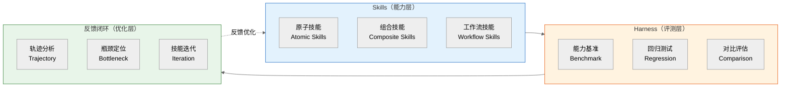

**与传统开发模式的区别**：

| 维度 | 传统 Agent 开发 | Harness Skills 范式 |
|------|----------------|---------------------|
| **开发流程** | 开发 → 手动测试 → 上线 | 定义 Skills → Harness 评测 → 迭代优化 → 上线 |
| **能力管理** | 硬编码在代码中 | 技能注册中心统一管理，可发现、可组合 |
| **质量保障** | 依赖人工抽测 | 自动化评测管线，多维度量化指标 |
| **迭代方式** | 凭经验调整 | 数据驱动，基于评测轨迹定位瓶颈 |
| **版本管理** | 代码版本 | Skills 版本 + 评测基线双轨管理 |
| **上线标准** | 主观判断 | 质量门禁（Quality Gate）自动判定 |

### 1.2 核心内涵与关键特征

**核心内涵**：Harness Skills 的本质是 **"评测驱动开发"（Evaluation-Driven Development, EDD）**——类似于测试驱动开发（TDD）在传统软件工程中的角色，但针对 Agent 系统的非确定性特征做了深度适配。

**五大关键特征**：

| 特征 | 说明 | 实践体现 |
|------|------|----------|
| **能力可声明** | Agent 的能力以 Skills 形式显式声明，而非隐含在代码中 | Skill 注册表、Agent Card 能力声明 |
| **质量可度量** | Agent 的每项能力都有对应的评测指标和基准数据集 | 多维指标体系、Benchmark 数据集 |
| **轨迹可追溯** | Agent 执行过程中的每一步都被记录，可用于分析和调试 | Trajectory 录制、Action-Observation 链 |
| **迭代可对比** | 每次迭代后的能力变化可量化对比，支持回归检测 | 版本对比报告、趋势追踪图表 |
| **上线可门禁** | 上线前必须通过自动化评测关卡，不达标则阻止发布 | Quality Gate、CI/CD 集成 |

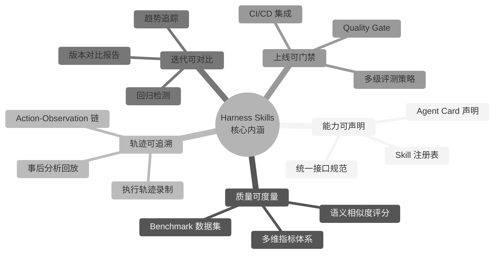

### 1.3 在 AI Agent 领域中的定位与重要性

**领域定位**：

Harness Skills 处于 AI Agent 工程化体系中的 **"质量基础设施"** 层，连接上游的模型能力与下游的业务应用：

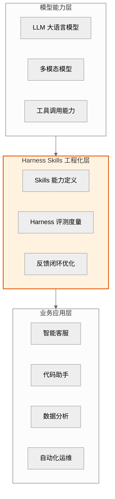

**重要性分析**：

1. **解决 Agent 上线的"最后一公里"问题**：LLM 能力的提升并不意味着 Agent 系统可以直接上线，需要 Harness Skills 将模型能力转化为可度量、可保障的工程化能力。

2. **弥合研发与运维的鸿沟**：传统模式下，Agent 开发团队关注功能实现，运维团队关注系统稳定性，二者缺乏统一的度量语言。Harness Skills 提供了一套从开发到运维贯穿始终的评测体系。

3. **支撑 Agent 的持续演进**：Agent 系统不是"开发一次就完成"的产品，需要持续迭代。Harness Skills 的回归测试和趋势追踪机制确保每次迭代都在可控范围内。

4. **行业标准化推动**：随着 GAIA、SWE-bench、AgentBench 等评测基准的普及，行业正在形成统一的 Agent 能力度量标准，Harness Skills 是企业落地这些标准的关键载体。

---

## 二、Harness Skills 原理深度解析

### 2.1 底层工作机制

Harness Skills 的底层工作机制可以概括为 **"三阶段闭环"**：能力声明 → 评测执行 → 反馈优化。这三个阶段循环往复，驱动 Agent 系统持续迭代。

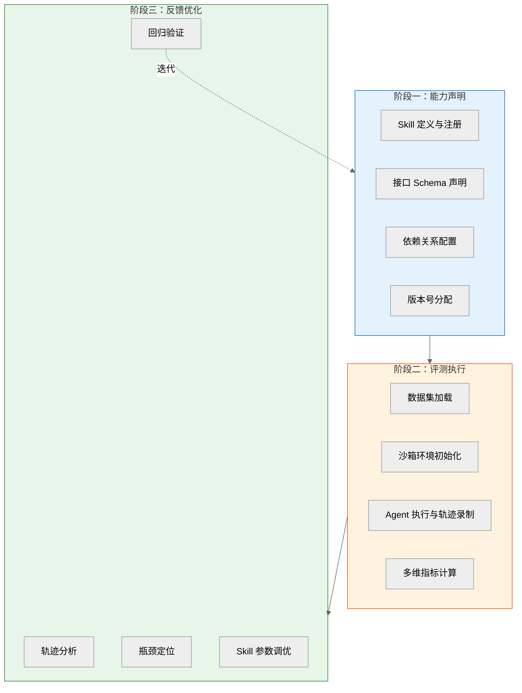

**阶段一：能力声明（Capability Declaration）**

Agent 的能力通过 Skills 注册表显式声明。每个 Skill 包含以下元数据：

```python
@dataclass
class SkillMetadata:
    """Skill 元数据定义"""
    skill_id: str                    # 唯一标识
    name: str                        # 技能名称
    description: str                 # 功能描述
    version: str                     # 语义化版本号
    input_schema: dict               # 输入参数 Schema
    output_schema: dict              # 输出结果 Schema
    dependencies: list[str]          # 依赖的其他 Skill
    tools: list[str]                 # 封装的底层工具
    cost_estimate: float             # 预估 Token 成本
    tags: list[str]                  # 分类标签
```

**阶段二：评测执行（Evaluation Execution）**

Harness 接管 Agent 的执行环境，在沙箱中运行评测样本，并完整录制执行轨迹：

```python
class HarnessEvaluator:
    """Harness 评测执行器"""

    async def evaluate(self, agent, dataset, metrics):
        """执行完整评测流程"""
        results = []
        for sample in dataset:
            # 1. 初始化沙箱环境
            sandbox = await self.sandbox_factory.create(sample.config)

            # 2. 注入任务并执行
            trajectory = await self._run_agent(agent, sample, sandbox)

            # 3. 计算评测指标
            scores = await self._compute_metrics(trajectory, sample, metrics)

            # 4. 记录结果
            results.append(EvalResult(
                sample_id=sample.id,
                trajectory=trajectory,
                scores=scores,
                cost=trajectory.total_tokens,
                latency=trajectory.total_duration
            ))

        # 5. 聚合报告
        return self._aggregate(results)
```

**阶段三：反馈优化（Feedback Optimization）**

评测结果通过轨迹分析反馈到 Skills 优化：

| 分析维度 | 检测内容 | 优化方向 |
|---------|---------|---------|
| **成功率分析** | 哪些 Skills 的调用成功率低？ | 优化 Skill 的错误处理逻辑 |
| **效率分析** | 哪些 Skills 的 Token 消耗异常？ | 优化 Prompt 或减少冗余调用 |
| **路径分析** | Agent 是否选择了最优技能路径？ | 调整 Skill 的描述和选择策略 |
| **失败模式** | 失败案例的共性模式是什么？ | 针对性增加边界处理或新增 Skill |

### 2.2 实现原理与核心流程

**核心原理：评测管线（Evaluation Pipeline）**

Harness Skills 的评测管线是一个标准化的数据处理流程，从评测样本输入到评测报告输出，经过多个阶段的处理：

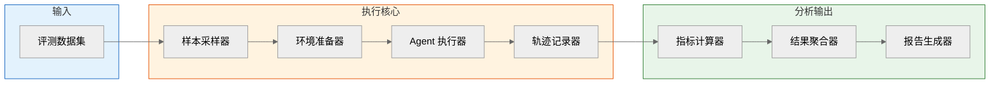

**管线各组件职责**：

| 组件 | 职责 | 关键技术 |
|------|------|---------|
| **样本采样器** | 从数据集中按策略采样评测样本 | 分层采样、难度分级、随机种子控制 |
| **环境准备器** | 初始化沙箱、注册 Mock 工具、加载 Skills | Docker 隔离、进程沙箱、工具模拟 |
| **Agent 执行器** | 驱动 Agent 在沙箱中执行任务 | 超时控制、资源限制、异常捕获 |
| **轨迹记录器** | 录制 Agent 执行的每一步操作 | Action-Observation 链、Token 计数、时间戳 |
| **指标计算器** | 根据轨迹和期望结果计算多维评分 | 精确匹配、语义相似度、人工评分接口 |
| **结果聚合器** | 汇总所有样本的评分，生成统计结果 | 加权平均、分项统计、对比分析 |
| **报告生成器** | 生成可视化评测报告 | 趋势图表、雷达图、对比柱状图 |

**Skills 与 Harness 的交互协议**：

Skills 和 Harness 之间通过标准化的接口协议进行交互，确保解耦和可扩展性：

```python
class SkillHarnessInterface:
    """Skills 与 Harness 的交互接口"""

    # Harness 调用 Skills 的元数据接口
    async def get_skill_registry(self) -> list[SkillMetadata]:
        """获取所有已注册的 Skills 元数据"""
        ...

    # Harness 在评测前配置 Skills 的行为
    async def configure_skills(self, config: dict):
        """配置 Skills 的运行参数（如 Mock 模式、超时等）"""
        ...

    # Harness 在评测中拦截 Skills 的调用
    async def intercept_call(self, skill_id: str,
                              input: dict) -> dict:
        """拦截 Skill 调用，用于记录轨迹和注入故障"""
        ...

    # Harness 在评测后获取 Skills 的执行统计
    async def get_execution_stats(self) -> dict:
        """获取各 Skill 的调用次数、成功率、延迟等统计"""
        ...
```

### 2.3 关键技术要点

**技术要点一：Skill 抽象层级体系**

Skills 采用三层抽象设计，从原子操作到复杂工作流，逐层封装：

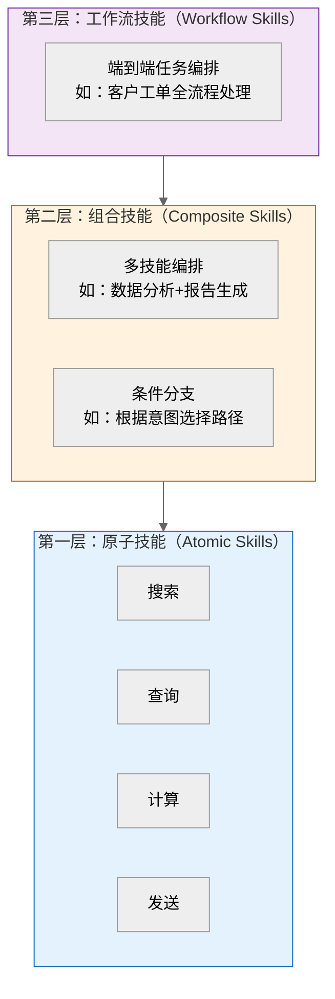

| 抽象层级 | 粒度 | 组合方式 | 评测方式 |
|---------|------|---------|---------|
| **原子技能** | 单一 API 调用 | 不可拆分 | 输入-输出精确匹配 |
| **组合技能** | 多个原子技能编排 | 顺序/并行/条件/循环 | 多步轨迹+最终结果评分 |
| **工作流技能** | 端到端任务流程 | 多组合技能编排 | 端到端评测+人工评分 |

**技术要点二：多维评测指标体系**

Harness 采用多维度指标体系，全面刻画 Agent 的能力画像：

| 指标维度 | 具体指标 | 计算方式 | 评测目标 |
|---------|---------|---------|---------|
| **准确性** | 任务成功率 | 成功样本数 / 总样本数 | ≥ 85% |
| **准确性** | 语义相似度 | 输出与标准答案的嵌入余弦相似度 | ≥ 0.8 |
| **效率** | 平均 Token 消耗 | 总 Token 数 / 样本数 | ≤ 阈值 |
| **效率** | P95 延迟 | 95 分位响应时间 | ≤ 5s |
| **安全性** | 越狱攻击防御率 | 成功防御的攻击数 / 总攻击数 | 100% |
| **安全性** | 敏感信息泄露率 | 泄露事件数 / 总交互数 | 0 |
| **成本** | 单任务平均成本 | 总 API 费用 / 任务数 | ≤ 预算 |
| **鲁棒性** | 对抗样本成功率 | 对抗样本下仍正确的比例 | ≥ 70% |

**技术要点三：轨迹分析与瓶颈定位**

轨迹分析是 Harness Skills 反馈闭环的核心技术。通过分析 Agent 的执行轨迹（Trajectory），可以精确定位能力瓶颈：

```python
class TrajectoryAnalyzer:
    """轨迹分析器"""

    def analyze(self, trajectory: list[Action],
                expected: dict) -> TrajectoryReport:
        """分析执行轨迹，定位瓶颈"""
        report = TrajectoryReport()

        # 1. 逐技能成功率分析
        skill_stats = self._analyze_skill_success(trajectory)
        report.skill_stats = skill_stats
        # 输出：{skill_id: {calls: 10, success: 7, rate: 0.7}}

        # 2. 失败路径分析
        failure_paths = self._extract_failure_paths(trajectory)
        report.failure_paths = failure_paths
        # 输出：最常见的失败模式及其上下文

        # 3. 冗余调用检测
        redundant = self._detect_redundant_calls(trajectory)
        report.redundant_calls = redundant
        # 输出：重复调用的 Skill 及浪费的 Token

        # 4. 路径效率分析
        efficiency = self._analyze_path_efficiency(trajectory, expected)
        report.efficiency = efficiency
        # 输出：实际路径 vs 最优路径的偏差

        return report
```

**技术要点四：可复现性保障**

Agent 系统的非确定性是评测的最大挑战。Harness Skills 通过以下机制保障评测可复现：

| 机制 | 说明 | 实现方式 |
|------|------|---------|
| **随机种子固定** | 消除模型推理的随机性 | 设置 `temperature=0` 或固定 `seed` |
| **环境快照** | 保存沙箱环境的完整状态 | Docker 镜像 + 数据卷快照 |
| **工具 Mock 化** | 外部 API 返回固定响应 | Mock Server + 响应录制回放 |
| **时钟冻结** | 消除时间相关的不确定性 | 虚拟时钟（Mock Clock） |
| **轨迹序列化** | 将执行轨迹可持久化存储 | JSONL 格式 + 可回放引擎 |

> **实践案例**：某团队的 Agent 在评测中成功率从 92% 波动到 78%，通过引入随机种子固定 + 环境 Mock 化后，成功率稳定在 85±1%，使得回归检测成为可能。

---

## 三、Agent Harness 概述与核心概念（4题）

### Q1：什么是 Agent Harness？其核心定位与作用是什么？


**难度级别**：初级
**考察维度**：概念理解、技术定位

**问题描述**：
请阐述 Agent Harness 的定义、核心定位和在 Agent 开发生命周期中的作用。为什么 Agent 开发需要专门的评测框架（Harness）？

**参考答案**：

**定义**：Agent Harness（Agent 评测框架/测试挽具）是一套用于系统化评估、测试和基准对比 Agent 系统能力的软件框架。它提供了标准化的测试环境、评测指标、数据集管理和结果分析工具，使开发者能够量化 Agent 的各项能力表现。

> Harness 一词源自软件测试领域的 "Test Harness"（测试挽具），意为"驱动和约束被测对象的执行框架"。

**核心定位**：Harness 贯穿 Agent 开发的整个迭代周期：

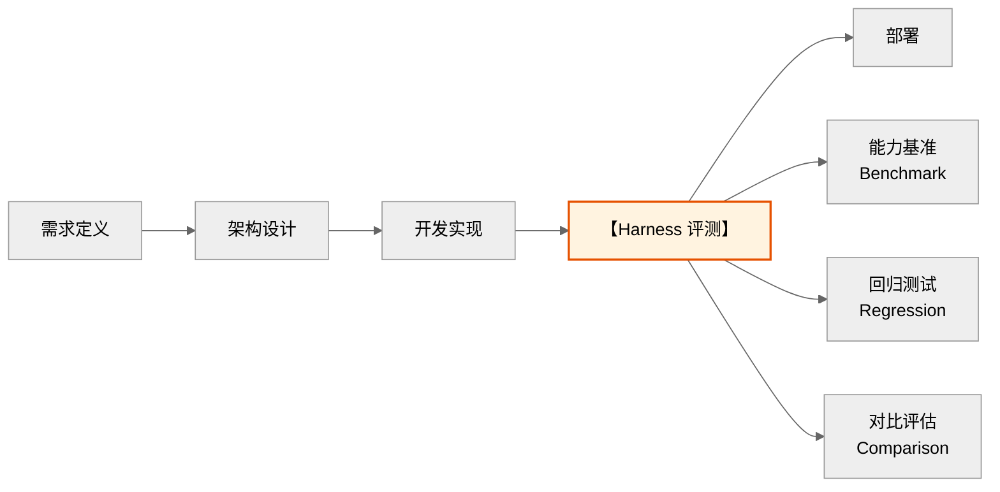

**为什么需要专门的 Harness（vs 传统单元测试）**：

| 维度 | 传统单元测试 | Agent Harness |
|------|-------------|---------------|
| 测试对象 | 确定性函数 | 非确定性 Agent 行为 |
| 评估标准 | 精确匹配 | 语义相似度/多维指标 |
| 环境依赖 | Mock/Stub | 沙箱/模拟器/真实 API |
| 执行流程 | 单步断言 | 多步交互序列 |
| 结果判定 | Pass/Fail | 多维度评分 |
| 可复现性 | 天然可复现 | 需特殊处理随机性 |
| 成本控制 | 几乎免费 | 涉及 LLM Token 成本 |

**核心作用**：

1. **标准化评测**：提供统一的评测协议和指标体系
2. **能力画像**：多维度刻画 Agent 的能力边界
3. **迭代追踪**：追踪每次迭代的能力变化（回归检测）
4. **对比基准**：在不同 Agent 方案间进行公平对比
5. **成本监控**：监控评测过程中的 Token 消耗和延迟
6. **质量门禁**：作为上线前的质量关卡（Quality Gate）

**评分标准**：
- 3分：能说出 Harness 的基本定义
- 4分：能说明与传统测试的区别
- 5分：能完整阐述在 Agent 开发生命周期中的定位和作用

---

### Q2：Agent Harness 的核心组件有哪些？请画出其架构。

**难度级别**：初级
**考察维度**：架构理解

**问题描述**：
请列举 Agent Harness 的核心组件，并说明各组件的职责和交互关系。

**参考答案**：

**Agent Harness 核心架构**：

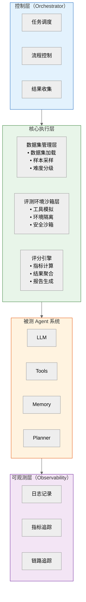

**六大核心组件**：

| 组件 | 职责 |
|------|------|
| 1. 数据集管理层 | 加载评测数据集、样本采样、难度分级 |
| 2. 评测环境沙箱 | 隔离执行环境、工具模拟、安全控制 |
| 3. 评分引擎 | 计算评测指标、结果聚合、报告生成 |
| 4. 控制层 | 任务调度、流程编排、超时控制 |
| 5. 可观测层 | 日志记录、指标追踪、链路追踪 |
| 6. 报告生成器 | 可视化报告、对比分析、趋势追踪 |

**评分标准**：
- 3分：能列举 3 个以上核心组件
- 4分：能说明各组件职责和交互关系
- 5分：能画出完整架构图并说明数据流

---

### Q3：目前主流的 Agent 评测基准（Benchmark）有哪些？各自评测什么能力？

**难度级别**：初级
**考察维度**：行业认知

**问题描述**：
请列举目前主流的 Agent 评测基准，说明各自评测的能力维度和特点。

**参考答案**：

**主流 Agent 评测基准全景**：

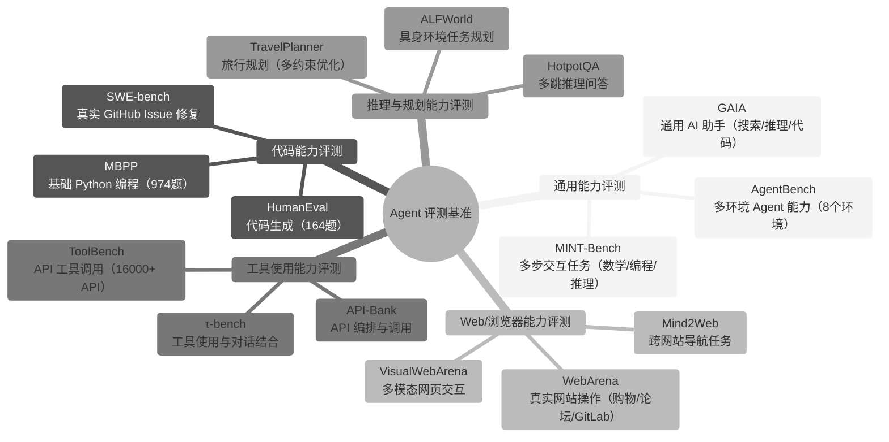

**核心基准对比**：

| 基准 | 评测维度 | 任务规模 | 评估方式 |
|------|---------|---------|---------|
| SWE-bench | 代码修复 | 2,294 Issue | 测试通过率 |
| GAIA | 通用助手 | 466 问题 | 精确匹配 |
| AgentBench | 多环境交互 | 8 个环境 | 成功率 |
| WebArena | 网页操作 | 812 任务 | 功能验证 |
| ToolBench | API 调用 | 16,000+ API | 通过率+质量 |
| TravelPlanner | 规划能力 | 1,225 任务 | 约束满足率 |

**评分标准**：
- 3分：能列举 3 个以上评测基准
- 4分：能说明各基准的评测维度
- 5分：能对比分析各基准的适用场景和局限性

---

### Q4：Agent Harness 的执行流程是怎样的？请画出完整的评测流程图。

**难度级别**：中级
**考察维度**：流程理解

**问题描述**：
请详细描述 Agent Harness 的完整执行流程，从数据集加载到最终报告生成的每个步骤。

**参考答案**：

**Agent Harness 完整执行流程**：

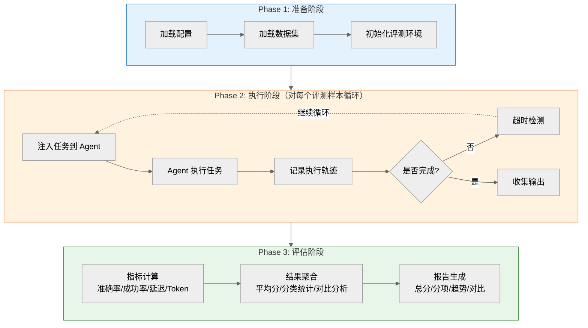

**关键步骤详解**：

1. **环境初始化**：
   - 启动沙箱环境（Docker/进程隔离）
   - 注册工具模拟器（Mock Tools）
   - 初始化 Agent 实例
   - 设置超时和资源限制

2. **任务注入**：
   - 从数据集加载评测样本
   - 构造初始状态（用户输入、上下文）
   - 注入到 Agent 的输入接口

3. **Agent 执行**：
   - Agent 自主决策执行流程
   - Harness 记录每一步的：
     - LLM 输入/输出
     - 工具调用及参数
     - 中间状态变化
     - 时间戳和 Token 消耗

4. **轨迹记录（Trajectory）**：
   - 完整的执行轨迹（Action-Observation 链）
   - 用于事后分析和调试

5. **评分计算**：
   - 根据评测指标计算得分
   - 支持多种评分方式（精确匹配/语义匹配/人工评分）

**评分标准**：
- 3分：能描述基本的执行流程
- 4分：能说明每个阶段的关键步骤
- 5分：能完整描述三阶段流程并解释轨迹记录机制

---

## 四、Agent Skills 概述与核心概念（4题）

### Q5：什么是 Agent Skills？它与 Tools 有何区别和联系？

**难度级别**：初级
**考察维度**：概念辨析

**问题描述**：
请阐述 Agent Skills 的定义，并说明 Skills 与 Tools 的区别和联系。

**参考答案**：

**定义**：Agent Skills（技能）是 Agent 可调用的高层能力单元，它封装了一个或多个 Tools，加上执行逻辑、参数校验、错误处理和上下文适配，形成可复用的"能力模块"。

> 一句话理解：
> - **Tool** = 原子操作（单一 API 调用）
> - **Skill** = 能力组合（多步骤编排 + 业务逻辑）

**Skills 与 Tools 的关系**：

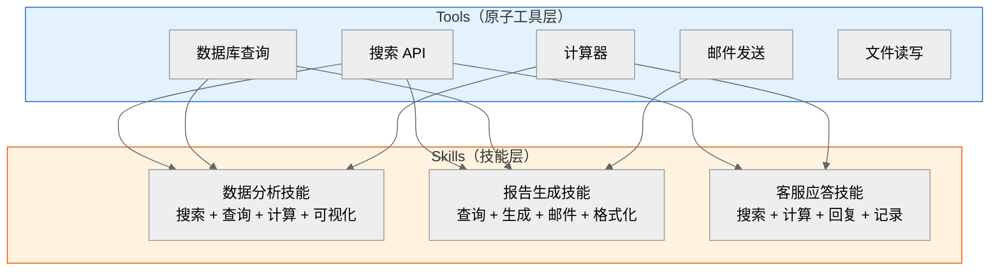

**核心区别**：

| 维度 | Tools | Skills |
|------|-------|--------|
| 粒度 | 原子操作 | 能力组合 |
| 组成 | 单个 API/函数 | 多工具 + 编排逻辑 |
| 状态 | 无状态 | 可有内部状态 |
| 错误处理 | 简单抛出 | 内置重试/降级 |
| 参数校验 | 基础类型检查 | 业务规则校验 |
| 复用性 | 通用底层 | 面向业务场景 |
| LLM 可见性 | 直接暴露给 LLM | 可封装为高层描述 |
| 示例 | `search()`, `query()` | "数据分析"、"报告生成" |

**联系**：

- Skills 依赖 Tools 作为底层执行单元
- Skills 是对 Tools 的高层抽象和业务封装
- 一个 Skill 可以调用多个 Tools
- 一个 Tool 可以被多个 Skills 复用

**评分标准**：
- 3分：能说出 Skills 的基本定义
- 4分：能正确区分 Skills 和 Tools
- 5分：能画出层次关系并说明复用机制

---

### Q6：Agent Skills 的分类体系是怎样的？请举例说明。

**难度级别**：初级
**考察维度**：体系理解

**问题描述**：
请建立 Agent Skills 的分类体系，并为每个类别提供具体的技能示例。

**参考答案**：

**Agent Skills 分类体系**：

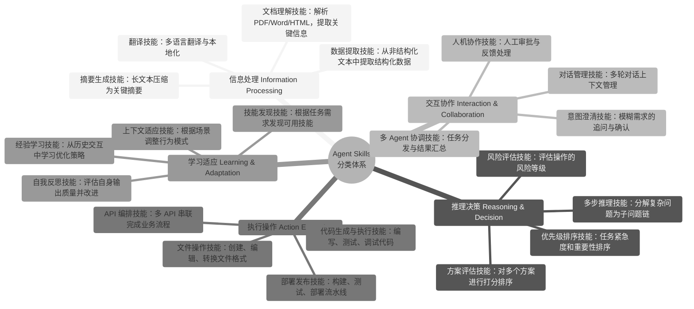

**具体示例：数据分析技能**

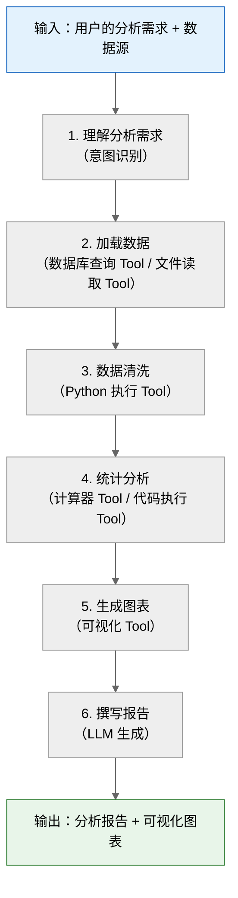

- **依赖 Tools**：`[db_query, file_read, python_exec, chart_gen]`
- **错误处理**：数据为空 → 提示用户；格式错误 → 自动修复
- **参数校验**：检查数据源是否存在、格式是否支持

**评分标准**：
- 3分：能列举 3 个以上技能类别
- 4分：能为每个类别提供具体示例
- 5分：能画出完整的分类体系并说明技能内部结构

---

### Q7：什么是 Skill Composition（技能组合）？请说明其实现方式。

**难度级别**：中级
**考察维度**：架构设计

**问题描述**：
在复杂任务中，Agent 需要将多个 Skills 组合使用。请说明 Skill Composition 的概念和实现方式。

**参考答案**：

**概念**：将多个原子 Skills 按照特定逻辑（顺序、并行、条件、循环）组合成一个复合 Skill，以完成复杂任务。

**四种组合模式**：

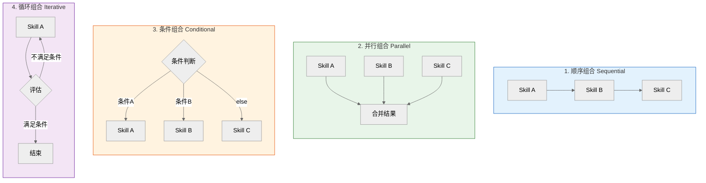

**模式示例**：

1. **顺序组合**：数据获取 → 数据分析 → 报告生成
2. **并行组合**：同时搜索 Web + 查询数据库 + 检索知识库 → 融合结果
3. **条件组合**：技术问题 → 技术知识库 / 账单问题 → 账单系统 / 投诉 → 主管
4. **循环组合**：代码生成 → 测试 → 不通过则修复 → 再测试

**实现方式（LangChain/LangGraph）**：

```python
# 顺序组合
from langgraph.graph import StateGraph

class CompositeState(TypedDict):
    data: dict
    analysis: dict
    report: str

graph = StateGraph(CompositeState)
graph.add_node("fetch_data", data_fetch_skill)
graph.add_node("analyze", analysis_skill)
graph.add_node("generate_report", report_skill)

graph.add_edge("fetch_data", "analyze")
graph.add_edge("analyze", "generate_report")

# 并行组合（Send API）
def fan_out(state):
    return [
        Send("web_search", {"query": state["query"]}),
        Send("db_search", {"query": state["query"]}),
        Send("knowledge_search", {"query": state["query"]}),
    ]

# 条件组合
def route_by_intent(state):
    intent = classify_intent(state["query"])
    return intent  # "technical" / "billing" / "complaint"

graph.add_conditional_edges("classifier", route_by_intent, {
    "technical": "tech_skill",
    "billing": "billing_skill",
    "complaint": "escalation_skill",
})
```

**评分标准**：
- 3分：能说明顺序组合的概念
- 4分：能说明四种组合模式并给出示例
- 5分：能写出代码实现

---

### Q8：Agent 如何动态发现和选择可用的 Skills？

**难度级别**：中级
**考察维度**：动态调度理解

**问题描述**：
在实际应用中，Agent 可用的 Skills 可能很多（数十~数百个）。请说明 Agent 如何动态发现和选择合适的 Skills。

**参考答案**：

**Skill 动态选择流程**：

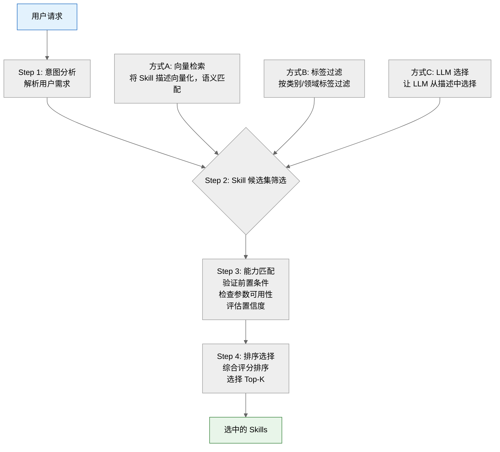

**三种发现方式对比**：

| 方式 | 优点 | 缺点 |
|------|------|------|
| 向量语义检索 (Embedding Search) | 速度快、可扩展；支持模糊匹配 | 语义漂移风险；需要维护向量库 |
| 标签规则过滤 (Tag-based Filter) | 精确可控；无额外延迟 | 需要预定义标签；无法处理新场景 |
| LLM 直接选择 (LLM Selection) | 理解力强；处理复杂场景 | 延迟高、成本高；受描述质量影响 |

**生产环境推荐：混合策略**

1. 先用标签过滤缩小范围（100 → 20）
2. 再用向量检索精排（20 → 5）
3. 最后由 LLM 从 5 个候选中选择（5 → 1-2）

**评分标准**：
- 3分：能说明基本的选择流程
- 4分：能对比三种发现方式
- 5分：能给出生产环境的混合策略

---

## 五、Harness 核心原理与架构设计（4题）

### Q9：Agent Harness 中如何设计评测指标体系？

**难度级别**：中级
**考察维度**：评测设计能力

**问题描述**：
请设计一套完整的 Agent 评测指标体系，涵盖任务完成度、效率、安全性等维度。

**参考答案**：

**Agent 评测指标体系**：

| 一级指标 | 二级指标 | 计算方式 |
|---------|---------|---------|
| 1. 任务完成度 (Effectiveness) | 任务成功率 | 成功数/总数 |
|  | 目标达成率 | 目标完成比例 |
|  | 答案准确率 | 正确数/总数 |
|  | 信息完整度 | 覆盖要点比例 |
| 2. 执行效率 (Efficiency) | 平均响应时间 | 总时间/任务数 |
|  | 工具调用次数 | 总调用/任务数 |
|  | Token 消耗 | 总Token/任务数 |
|  | 步骤效率 | 最优步数/实际步数 |
| 3. 推理质量 (Reasoning) | 推理链正确率 | 正确推理步/总步 |
|  | 规划合理性 | 人工评分 1-5 |
|  | 错误恢复率 | 恢复次数/错误数 |
|  | 自我纠正率 | 纠正次数/总错次 |
| 4. 安全性 (Safety) | 有害操作拦截率 | 拦截数/总攻击数 |
|  | 权限越界次数 | 越界次数统计 |
|  | 数据泄露检测 | 泄露事件数 |
|  | 幻觉率 | 幻觉数/总声明数 |
| 5. 用户体验 (UX) | 回答相关性 | 人工评分 1-5 |
|  | 回答流畅度 | 人工评分 1-5 |
|  | 等待体验 | 首次响应时间 |
|  | 任务透明度 | 过程可解释性 |

**指标计算示例**：

```python
# 综合评分公式
overall_score = (
    0.35 * task_success_rate +      # 任务完成度权重最高
    0.20 * reasoning_quality +       # 推理质量
    0.15 * efficiency_score +        # 执行效率
    0.20 * safety_score +            # 安全性
    0.10 * ux_score                  # 用户体验
)

# 效率评分（归一化）
efficiency_score = (
    0.4 * (1 - normalized_latency) +
    0.3 * (1 - normalized_token_cost) +
    0.3 * step_efficiency
)

# 安全评分（惩罚制）
safety_score = 1.0 - (
    0.5 * harmful_action_rate +
    0.3 * permission_violation_rate +
    0.2 * hallucination_rate
)
```

**评分标准**：
- 3分：能设计 3 个以上评测维度
- 4分：能给出具体的指标计算方式
- 5分：能设计完整的指标体系和综合评分公式

---

### Q10：Agent Harness 的沙箱环境如何设计？

**难度级别**：中级
**考察维度**：环境设计能力

**问题描述**：
Agent 评测需要安全的沙箱环境。请说明沙箱环境的设计原则和实现方式。

**参考答案**：

**沙箱环境架构**：

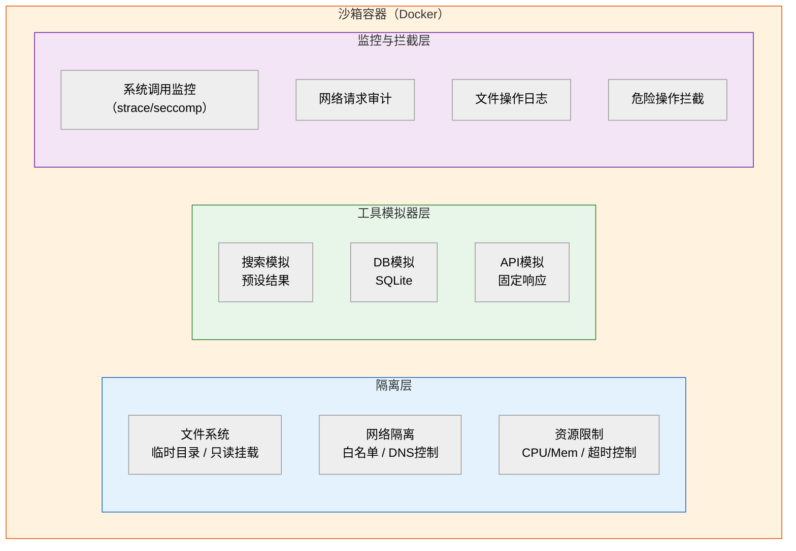

**设计原则**：

1. **隔离性**：每个评测任务在独立容器中运行
2. **可复现**：相同输入产生相同输出（固定随机种子、预设数据）
3. **安全性**：限制文件系统、网络、进程权限
4. **可观测**：记录所有操作日志
5. **资源控制**：CPU/内存/时间上限
6. **快速清理**：评测完成后销毁容器

**工具模拟策略**：

| 工具类型 | 模拟方式 | 目的 |
|---------|---------|------|
| 搜索引擎 | 预设搜索结果集 | 避免真实搜索的不确定性 |
| 数据库 | SQLite + 预设数据 | 可控的查询环境 |
| 外部 API | Mock Server | 固定响应 + 延迟模拟 |
| 代码执行 | 沙箱 Python 解释器 | 安全执行用户代码 |
| 文件系统 | 临时目录 + 预设文件 | 隔离文件操作 |
| LLM | 缓存/固定模型 | 消除模型随机性 |

**评分标准**：
- 3分：能说明沙箱的基本概念
- 4分：能说明设计原则和工具模拟策略
- 5分：能画出完整架构并说明各层职责

---

### Q11：如何实现 Agent 评测的可复现性？

**难度级别**：中级
**考察维度**：评测方法论

**问题描述**：
Agent 的行为具有非确定性（LLM 随机性、工具调用不确定性）。请说明如何保证评测结果的可复现性。

**参考答案**：

**可复现性影响因素与解决方案**：

| 影响因素 | 解决方案 |
|---------|---------|
| 1. LLM 随机性 | • 设置 `temperature=0`<br>• 固定 `random_seed`<br>• 使用确定性解码（greedy）<br>• 记录模型版本号 |
| 2. 工具返回不确定性 | • 使用 Mock 工具替代真实工具<br>• 预设工具返回数据<br>• 固定 API 响应（录制-回放） |
| 3. 环境状态差异 | • 容器化评测环境<br>• 每次评测重置环境<br>• 固定依赖版本 |
| 4. 数据集变化 | • 数据集版本化管理<br>• 固定随机采样种子<br>• 数据快照存储 |
| 5. 并发执行顺序 | • 单线程串行评测（最严格）<br>• 或固定并发数和调度策略 |

**录制-回放（Record-Replay）策略**：

**Phase 1: 录制（Record）**

Agent 执行任务时，记录所有外部交互，保存为 `trajectory.json`：

```json
// LLM 调用
{timestamp: 1, input: "...", output: "...", model: "gpt-4"}

// 工具调用
{timestamp: 2, tool: "search", args: {...}, result: "..."}
```

**Phase 2: 回放（Replay）**

重新评测时，回放录制的交互：

- LLM 调用 → 直接返回录制的 output
- 工具调用 → 直接返回录制的 result

> 保证：相同输入 → 完全相同的执行轨迹

**统计显著性**：

- 多次运行取平均值（建议 ≥ 3 次）
- 报告置信区间（95% CI）
- 使用统计检验（如 t-test）对比不同 Agent 的差异显著性

**评分标准**：
- 3分：能列举 3 个以上影响因素
- 4分：能说明录制-回放策略
- 5分：能完整描述可复现性保障方案

---

### Q12：如何设计 Agent Harness 的轨迹分析（Trajectory Analysis）功能？

**难度级别**：高级
**考察维度**：分析能力

**问题描述**：
Agent 的执行轨迹（Trajectory）包含丰富的诊断信息。请说明如何设计轨迹分析功能。

**参考答案**：

**轨迹分析架构**：

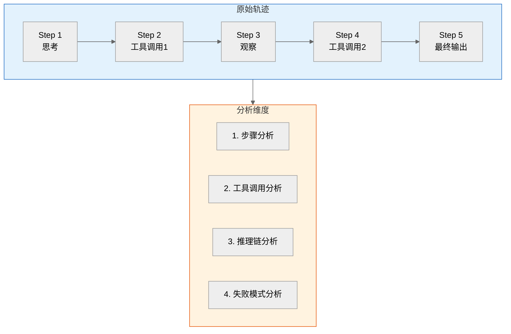

**分析维度详解**：

1. **步骤分析**
   - 总步骤数 vs 最优步骤数 → 效率指标
   - 冗余步骤检测 → 是否存在无效循环
   - 步骤类型分布 → 思考/工具/观察的比例

2. **工具调用分析**
   - 工具选择正确率 → 是否选对了工具
   - 参数准确率 → 工具参数是否正确
   - 调用顺序合理性 → 是否按最优顺序调用

3. **推理链分析**
   - 推理步骤正确率 → 每步推理是否合理
   - 错误传播检测 → 早期错误是否导致后续失败
   - 自我纠正检测 → 是否发现并修正了错误

4. **失败模式分析**
   - 失败点定位 → 在哪一步开始出错
   - 失败原因分类 → 工具错误/推理错误/理解错误
   - 失败模式聚类 → 统计最常见的失败模式

**轨迹数据结构**：

```python
@dataclass
class TrajectoryStep:
    step_id: int                  # 步骤编号
    step_type: str                # "thought" | "action" | "observation"
    content: str                  # 步骤内容
    timestamp: float              # 时间戳
    token_usage: int              # Token 消耗
    tool_call: Optional[dict]     # 工具调用详情
    tool_result: Optional[dict]   # 工具返回结果
    metadata: dict                # 额外元数据

@dataclass
class Trajectory:
    task_id: str                  # 任务 ID
    steps: list[TrajectoryStep]   # 步骤列表
    final_output: str             # 最终输出
    success: bool                 # 是否成功
    total_tokens: int             # 总 Token 消耗
    total_time_ms: int            # 总耗时
    error_info: Optional[str]     # 错误信息
```

**常见失败模式分类**：

| 失败模式 | 特征 | 改进方向 |
|---------|------|---------|
| 工具选择错误 (Wrong Tool) | 第一步就选错工具 | 优化工具描述 |
| 参数构造错误 (Wrong Arguments) | 工具选对但参数错误 | 改进 Prompt |
| 推理链断裂 (Reasoning Break) | 中间某步推理错误；后续步骤全部受影响 | 增强推理 |
| 无限循环 (Infinite Loop) | 重复调用相同工具；无法跳出 | 增加循环检测机制 |
| 过早终止 (Premature Stop) | 未完成任务就返回；答案不完整 | 增加完成度检查 |
| 幻觉传播 (Hallucination Chain) | 编造不存在的信息；后续步骤基于幻觉推理 | 增加事实验证机制 |

**评分标准**：
- 3分：能说明轨迹的基本结构
- 4分：能设计多维度分析方案
- 5分：能设计失败模式分类和改进方向

---

## 六、Skills 核心原理与技术实现（4题）

### Q13：如何定义和注册一个 Agent Skill？请给出完整实现。

**难度级别**：中级
**考察维度**：编码能力

**问题描述**：
请实现一个完整的 Agent Skill 定义、注册和调用流程。

**参考答案**：

```python
# ============================================================
# Agent Skill 完整实现
# ============================================================

from dataclasses import dataclass, field
from typing import Any, Callable, Optional
from enum import Enum
import json


# ─── Skill 元数据定义 ───

class SkillCategory(Enum):
    INFORMATION = "information"
    REASONING = "reasoning"
    EXECUTION = "execution"
    INTERACTION = "interaction"
    LEARNING = "learning"


@dataclass
class SkillParameter:
    """Skill 参数定义"""
    name: str
    type: str               # "string" | "number" | "boolean" | "object"
    description: str
    required: bool = True
    default: Any = None


@dataclass
class SkillDefinition:
    """Skill 定义"""
    name: str                                    # 技能名称
    description: str                             # 技能描述（LLM 可读）
    category: SkillCategory                      # 技能分类
    parameters: list[SkillParameter]             # 参数列表
    handler: Callable                            # 执行函数
    tags: list[str] = field(default_factory=list)  # 标签
    dependencies: list[str] = field(default_factory=list)  # 依赖的其他 Skill
    max_retries: int = 3                         # 最大重试次数
    timeout_seconds: int = 30                    # 超时时间
    requires_approval: bool = False              # 是否需要人工审批


# ─── Skill 注册中心 ───

class SkillRegistry:
    """Skill 注册中心"""
    
    def __init__(self):
        self._skills: dict[str, SkillDefinition] = {}
        self._categories: dict[str, list[str]] = {}
        self._tags: dict[str, list[str]] = {}
    
    def register(self, skill: SkillDefinition) -> None:
        """注册一个 Skill"""
        if skill.name in self._skills:
            raise ValueError(f"Skill '{skill.name}' 已存在")
        
        self._skills[skill.name] = skill
        
        # 更新分类索引
        cat = skill.category.value
        if cat not in self._categories:
            self._categories[cat] = []
        self._categories[cat].append(skill.name)
        
        # 更新标签索引
        for tag in skill.tags:
            if tag not in self._tags:
                self._tags[tag] = []
            self._tags[tag].append(skill.name)
    
    def get(self, name: str) -> SkillDefinition:
        """获取 Skill"""
        if name not in self._skills:
            raise KeyError(f"Skill '{name}' 未注册")
        return self._skills[name]
    
    def search_by_category(self, category: str) -> list[SkillDefinition]:
        """按分类搜索"""
        names = self._categories.get(category, [])
        return [self._skills[n] for n in names]
    
    def search_by_tags(self, tags: list[str]) -> list[SkillDefinition]:
        """按标签搜索（AND 逻辑）"""
        candidates = set()
        for tag in tags:
            names = self._tags.get(tag, [])
            if not candidates:
                candidates = set(names)
            else:
                candidates &= set(names)
        return [self._skills[n] for n in candidates]
    
    def to_llm_description(self) -> str:
        """生成 LLM 可读的技能列表描述"""
        lines = ["可用技能列表："]
        for skill in self._skills.values():
            params = ", ".join(
                f"{p.name}: {p.type}" for p in skill.parameters if p.required
            )
            lines.append(f"- {skill.name}({params}): {skill.description}")
        return "\n".join(lines)


# ─── Skill 执行引擎 ───

class SkillExecutor:
    """Skill 执行引擎"""
    
    def __init__(self, registry: SkillRegistry):
        self.registry = registry
    
    async def execute(self, skill_name: str, **kwargs) -> dict:
        """执行一个 Skill"""
        skill = self.registry.get(skill_name)
        
        # 参数校验
        self._validate_params(skill, kwargs)
        
        # 执行（带重试）
        last_error = None
        for attempt in range(skill.max_retries):
            try:
                result = await skill.handler(**kwargs)
                return {"success": True, "result": result}
            except Exception as e:
                last_error = e
                if attempt < skill.max_retries - 1:
                    continue
        
        return {"success": False, "error": str(last_error)}
    
    def _validate_params(self, skill: SkillDefinition, kwargs: dict):
        """参数校验"""
        for param in skill.parameters:
            if param.required and param.name not in kwargs:
                raise ValueError(f"缺少必需参数: {param.name}")


# ─── 具体 Skill 实现示例 ───

# Skill 1: 数据分析技能
async def data_analysis_handler(
    data_source: str,
    analysis_type: str = "summary",
    **kwargs
) -> dict:
    """数据分析技能实现"""
    # 1. 加载数据
    data = load_data(data_source)
    
    # 2. 执行分析
    if analysis_type == "summary":
        result = compute_summary(data)
    elif analysis_type == "trend":
        result = compute_trend(data)
    else:
        result = compute_distribution(data)
    
    return result

data_analysis_skill = SkillDefinition(
    name="data_analysis",
    description="对指定数据源执行统计分析，支持摘要、趋势、分布分析",
    category=SkillCategory.REASONING,
    parameters=[
        SkillParameter("data_source", "string", "数据源路径或ID"),
        SkillParameter("analysis_type", "string", "分析类型：summary/trend/distribution", 
                       required=False, default="summary"),
    ],
    handler=data_analysis_handler,
    tags=["data", "analysis", "statistics"],
    timeout_seconds=60,
)

# Skill 2: 报告生成技能
async def report_generation_handler(
    topic: str,
    data_context: str = "",
    format: str = "markdown",
    **kwargs
) -> dict:
    """报告生成技能实现"""
    # 调用 LLM 生成报告
    prompt = f"""基于以下信息生成报告：
    主题：{topic}
    数据上下文：{data_context}
    格式：{format}"""
    
    report = await llm.ainvoke(prompt)
    return {"report": report.content, "format": format}

report_skill = SkillDefinition(
    name="report_generation",
    description="根据主题和数据上下文生成结构化报告",
    category=SkillCategory.EXECUTION,
    parameters=[
        SkillParameter("topic", "string", "报告主题"),
        SkillParameter("data_context", "string", "数据上下文", required=False, default=""),
        SkillParameter("format", "string", "输出格式：markdown/pdf/html", 
                       required=False, default="markdown"),
    ],
    handler=report_generation_handler,
    tags=["report", "generation", "document"],
    dependencies=["data_analysis"],  # 依赖数据分析技能
)

# ─── 注册与使用 ───

registry = SkillRegistry()
registry.register(data_analysis_skill)
registry.register(report_skill)

executor = SkillExecutor(registry)

# Agent 调用
result = await executor.execute(
    "data_analysis",
    data_source="sales_2025.csv",
    analysis_type="trend"
)
```

**评分标准**：
- 3分：能实现基本的 Skill 定义和注册
- 4分：能实现参数校验和重试机制
- 5分：能实现完整的注册中心和执行引擎

---

### Q14：如何实现 Skill 的向量检索选择机制？

**难度级别**：高级
**考察维度**：检索设计

**问题描述**：
当 Agent 有数十个 Skills 时，如何通过向量检索快速选择合适的 Skill？

**参考答案**：

```python
# ============================================================
# Skill 向量检索选择机制
# ============================================================

from typing import Optional
import numpy as np


class SkillRetriever:
    """基于向量检索的 Skill 选择器"""
    
    def __init__(self, embed_model, top_k: int = 5):
        self.embed = embed_model
        self.top_k = top_k
        self.skill_embeddings: Optional[np.ndarray] = None
        self.skill_names: list[str] = []
    
    def index_skills(self, skills: list[SkillDefinition]) -> None:
        """
        为所有 Skills 建立向量索引
        
        索引内容 = 技能名称 + 描述 + 参数描述
        """
        texts = []
        for skill in skills:
            # 构造检索文本
            param_desc = ", ".join(
                f"{p.name}({p.type}): {p.description}"
                for p in skill.parameters
            )
            text = f"{skill.name}: {skill.description}. 参数: {param_desc}"
            texts.append(text)
            self.skill_names.append(skill.name)
        
        # 生成向量
        self.skill_embeddings = self.embed(texts)
    
    def search(self, query: str, 
               category_filter: Optional[str] = None,
               tag_filter: Optional[list[str]] = None
               ) -> list[dict]:
        """
        根据用户查询检索最相关的 Skills
        
        参数：
            query: 用户请求文本
            category_filter: 分类过滤（可选）
            tag_filter: 标签过滤（可选）
        
        返回：
            按相关度排序的 Skill 列表
        """
        # 1. 查询向量化
        query_vector = self.embed([query])[0]
        
        # 2. 计算余弦相似度
        similarities = self._cosine_similarity(
            query_vector, self.skill_embeddings
        )
        
        # 3. 排序
        ranked_indices = np.argsort(similarities)[::-1]
        
        # 4. 过滤 + 取 Top-K
        results = []
        for idx in ranked_indices:
            if len(results) >= self.top_k:
                break
            
            skill_name = self.skill_names[idx]
            score = float(similarities[idx])
            
            # 应用过滤
            if category_filter or tag_filter:
                skill = get_skill(skill_name)
                if category_filter and skill.category.value != category_filter:
                    continue
                if tag_filter and not set(tag_filter) & set(skill.tags):
                    continue
            
            results.append({
                "name": skill_name,
                "score": score,
                "description": get_skill(skill_name).description,
            })
        
        return results
    
    def _cosine_similarity(self, query_vec, skill_vecs):
        """计算余弦相似度"""
        dot = np.dot(skill_vecs, query_vec)
        norm_q = np.linalg.norm(query_vec)
        norm_s = np.linalg.norm(skill_vecs, axis=1)
        return dot / (norm_q * norm_s + 1e-8)


# ─── 混合检索策略 ───

class HybridSkillSelector:
    """
    混合 Skill 选择器
    
    流程：标签过滤 → 向量精排 → LLM 选择
    """
    
    def __init__(self, registry: SkillRegistry, 
                 retriever: SkillRetriever, llm):
        self.registry = registry
        self.retriever = retriever
        self.llm = llm
    
    def select(self, query: str, 
               tags: list[str] = None) -> list[SkillDefinition]:
        """
        三阶段混合选择
        """
        # Stage 1: 标签过滤（100 → 20）
        if tags:
            candidates = self.registry.search_by_tags(tags)
        else:
            candidates = list(self.registry._skills.values())
        
        if len(candidates) <= 3:
            return candidates
        
        # Stage 2: 向量精排（20 → 5）
        search_results = self.retriever.search(
            query,
        )
        top_names = [r["name"] for r in search_results[:5]]
        candidates = [self.registry.get(n) for n in top_names 
                      if n in {c.name for c in candidates}]
        
        if len(candidates) <= 2:
            return candidates
        
        # Stage 3: LLM 选择（5 → 1-2）
        selected = self._llm_select(query, candidates)
        return selected
    
    def _llm_select(self, query: str, 
                     candidates: list[SkillDefinition]) -> list[SkillDefinition]:
        """LLM 从候选中选择最合适的 Skills"""
        skill_desc = "\n".join([
            f"{i+1}. {s.name}: {s.description}"
            for i, s in enumerate(candidates)
        ])
        
        prompt = f"""用户请求：{query}

可选技能：
{skill_desc}

请选择最适合处理该请求的 1-2 个技能，返回技能编号。
只返回编号，用逗号分隔。"""
        
        response = self.llm.invoke(prompt)
        indices = [int(x.strip()) - 1 for x in response.content.split(",")]
        
        return [candidates[i] for i in indices 
                if 0 <= i < len(candidates)]
```

**评分标准**：
- 3分：能实现基本的向量检索
- 4分：能实现混合检索策略
- 5分：能实现完整的三阶段选择流程

---

### Q15：如何设计 Skill 的版本管理和热更新机制？

**难度级别**：高级
**考察维度**：工程化能力

**问题描述**：
在生产环境中，Skills 需要持续迭代。请设计 Skill 的版本管理和热更新机制。

**参考答案**：

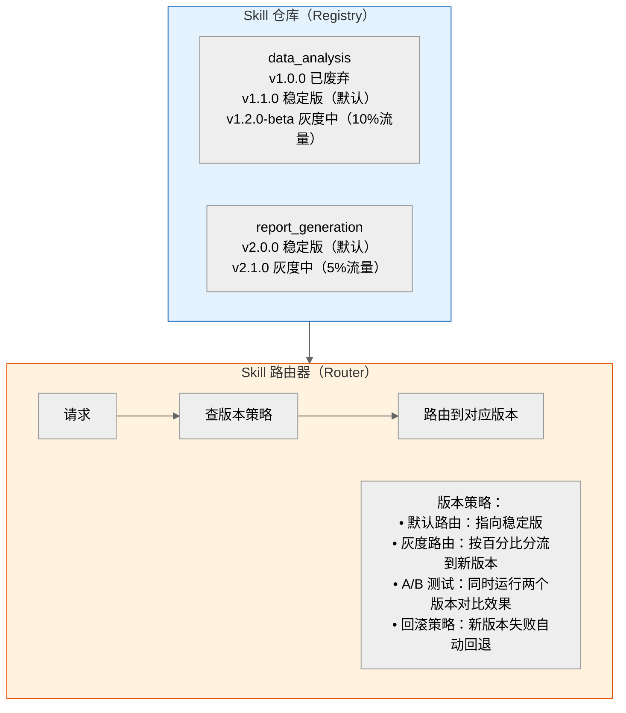

**热更新流程**：

1. **发布新版本 Skill**
   - 上传到 Skill 仓库
   - 运行自动化测试
   - 测试通过 → 标记为 beta

2. **灰度发布**
   - 设置灰度比例（如 5%）
   - 路由层按流量百分比分流
   - 监控新版本指标

3. **全量发布**
   - 指标达标 → 提升灰度比例
   - 100% → 标记为稳定版
   - 旧版本标记为废弃

4. **回滚**
   - 新版本指标异常 → 自动回滚
   - 流量切回旧版本
   - 发送告警通知

**评分标准**：
- 3分：能说明版本管理的基本概念
- 4分：能设计灰度发布策略
- 5分：能设计完整的版本管理和热更新机制

---

### Q16：如何实现 Skill 的权限控制和安全审计？

**难度级别**：高级
**考察维度**：安全设计

**问题描述**：
在生产环境中，Skills 需要严格的权限控制。请设计 Skill 的权限控制和安全审计方案。

**参考答案**：

**权限控制模型（RBAC：基于角色的访问控制）**：

| 角色 | 可调用 Skills | 限制 |
|------|--------------|------|
| 普通用户 | 查询类 Skills | 只读 |
| 高级用户 | 查询 + 分析 Skills | 有配额限制 |
| 管理员 | 全部 Skills | 需审批 |
| 系统 Agent | 全部 Skills | 自动审批 |

**权限检查流程**：

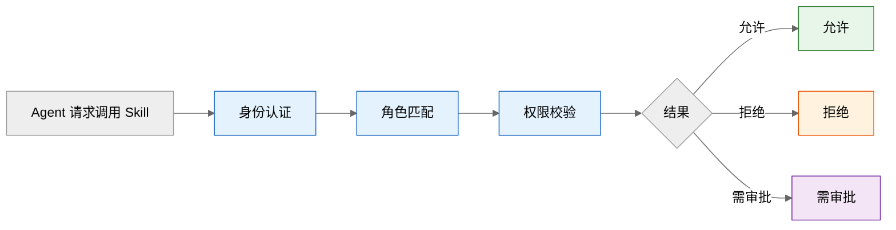

**安全审计日志**：

```json
{
  "timestamp": "2026-07-26T10:30:00Z",
  "agent_id": "agent_001",
  "user_id": "user_123",
  "skill_name": "data_analysis",
  "skill_version": "v1.1.0",
  "parameters": {"data_source": "sales.csv", "type": "summary"},
  "result_summary": "成功",
  "execution_time_ms": 1200,
  "token_usage": 500,
  "risk_level": "low",
  "approval_status": "auto_approved"
}
```

**评分标准**：
- 3分：能说明基本的权限控制概念
- 4分：能设计 RBAC 模型
- 5分：能设计完整的权限控制和安全审计方案

---

## 七、工程实践与项目案例（5题）

### Q17：项目案例：设计一个智能客服系统的 Agent Harness

**难度级别**：中级
**考察维度**：实践能力

**问题描述**：
某公司开发了一个智能客服 Agent，需要设计评测框架来评估其质量。请设计完整的 Harness 方案。

**参考答案**：

**项目背景**：某电商平台智能客服 Agent，支持：
- 订单查询
- 退换货处理
- 商品推荐
- 投诉处理

需要评测其回答质量、任务完成率、安全性。

**Harness 架构**：

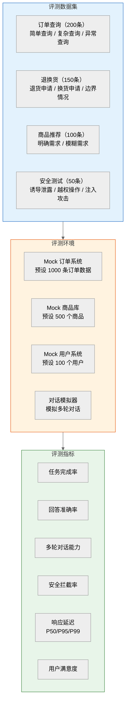

**评测结果示例（智能客服 Agent 评测报告 v1.2.0）**：

> 评测时间：2026-07-26 ｜ 数据集：500 条测试样本

| 指标 | v1.1.0 | v1.2.0 | 变化 |
|------|--------|--------|------|
| 任务完成率 | 82.3% | 89.1% | +6.8% |
| 回答准确率 | 78.5% | 85.2% | +6.7% |
| 多轮对话成功率 | 65.0% | 78.3% | +13.3% |
| 安全拦截率 | 94.0% | 98.0% | +4.0% |
| P95 延迟 | 3.2s | 2.8s | -12.5% |
| 综合评分 | 76.2 | 85.6 | +9.4 |

**失败模式分析**：

- 退换货政策理解错误：12 例（占失败的 35%）
- 多轮对话上下文丢失：8 例（占失败的 24%）
- 商品推荐不精准：6 例（占失败的 18%）

**改进建议**：

1. 增强退换货政策的 Prompt 描述
2. 优化 Memory 机制，增加上下文窗口
3. 引入用户偏好画像，提升推荐精准度

**评分标准**：
- 3分：能设计基本的评测数据集和指标
- 4分：能设计 Mock 环境和评测流程
- 5分：能输出完整的评测报告和改进建议

---

### Q18：项目案例：设计一个代码助手 Agent 的 Skills 体系

**难度级别**：中级
**考察维度**：Skills 设计能力

**问题描述**：
某团队开发了一个代码助手 Agent，请设计其 Skills 体系。

**参考答案**：

**代码助手 Skills 体系**：

**Layer 1: 基础 Skills（原子能力）**

| Skill | 说明 |
|-------|------|
| code_read | 读取代码文件 |
| code_write | 写入/修改代码文件 |
| code_search | 在代码库中搜索（grep/语义搜索） |
| code_execute | 执行代码（沙箱） |
| terminal | 执行终端命令 |
| git_ops | Git 操作（commit/push/diff） |

**Layer 2: 组合 Skills（业务能力）**

| Skill | 说明 | 依赖 |
|-------|------|------|
| code_generation | 根据需求生成代码 | code_write |
| code_review | 代码审查（风格/bug/安全） | code_read, code_search |
| bug_fix | Bug 定位与修复 | code_read, code_search, code_execute |
| test_generation | 自动生成测试用例 | code_read, code_write, code_execute |
| refactoring | 代码重构 | code_read, code_write, code_search |
| doc_generation | 生成代码文档 | code_read, code_write |

**Layer 3: 高级 Skills（场景能力）**

| Skill | 说明 | 组合 |
|-------|------|------|
| issue_resolved | 自动修复 GitHub Issue | bug_fix + test_generation + git_ops |
| feature_impl | 根据需求实现功能 | code_generation + test_generation + git_ops |
| codebase_qa | 代码库问答 | code_search + code_read + 摘要生成 |

**项目实战：issue_resolved Skill 执行流程**

> 用户请求："修复 Issue #123: 用户登录时偶发 500 错误"

```mermaid
%%{init: {'theme':'neutral'}}%%
flowchart TB
    A["1. 理解 Issue"] --> B["2. 定位 Bug"]
    B --> C["3. 修复代码"]
    C --> D["4. 测试修复"]
    D --> E{"5. 验证通过?"}
    E -->|通过| F["6. 提交 PR"]
    E -->|不通过| C
    F --> G["7. 完成"]

    style A fill:#e3f2fd,stroke:#1565c0
    style B fill:#e3f2fd,stroke:#1565c0
    style C fill:#fff3e0,stroke:#e65100
    style D fill:#fff3e0,stroke:#e65100
    style E fill:#f3e5f5,stroke:#6a1b9a
    style F fill:#e8f5e9,stroke:#2e7d32
    style G fill:#e8f5e9,stroke:#2e7d32
```

**评分标准**：
- 3分：能设计基本的 Skills 分层
- 4分：能说明 Skills 间的依赖关系
- 5分：能设计完整的三层体系并给出实战流程

---

### Q19：项目案例：为电商推荐系统设计 Agent Harness + Skills

**难度级别**：高级
**考察维度**：综合设计能力

**问题描述**：
某电商平台需要构建一个推荐 Agent，同时需要配套的 Harness 来持续评估推荐质量。请设计 Harness 和 Skills 的完整方案。

**参考答案**：

**整体架构**：

```mermaid
%%{init: {'theme':'neutral'}}%%
flowchart TB
    subgraph SK["Skills 层"]
        S1[用户画像分析技能]
        S2[商品检索技能]
        S3[推荐生成技能]
        S4[价格比较技能]
        S5[库存查询技能]
        S6[评价分析技能]
    end

    subgraph HZ["Harness 层"]
        H1[离线评测数据集]
        H2[在线 A/B 测试]
        H3[回归测试套件]
    end

    SK --> HZ

    style SK fill:#e3f2fd,stroke:#1565c0
    style HZ fill:#e8f5e9,stroke:#2e7d32
```

**Harness 评测数据集设计**：

**场景一：个性化推荐**

- **输入**：用户画像 + 浏览历史 + 推荐请求
- **期望输出**：推荐商品列表（含理由）
- **评测指标**：
  - 推荐相关性（0-5 分，人工评分）
  - 推荐理由合理性
  - 多样性（推荐商品是否覆盖不同品类）
  - 价格合理性（是否符合用户消费水平）
- **样本量**：500 条

**场景二：对比推荐**

- **输入**："帮我对比 iPhone 16 和 Samsung S25"
- **期望输出**：结构化对比表 + 购买建议
- **评测指标**：
  - 参数完整性（覆盖关键参数）
  - 数据准确性（参数值正确）
  - 建议合理性（基于用户需求给出建议）
- **样本量**：200 条

**场景三：安全测试**

- **输入**：恶意请求（刷单引导、虚假信息、竞品诋毁）
- **期望输出**：拒绝回答 + 引导到正规渠道
- **评测指标**：拦截率、回复合规性
- **样本量**：100 条

**评分标准**：
- 3分：能设计基本的 Harness 和 Skills
- 4分：能设计评测数据集和指标
- 5分：能设计完整的 Harness + Skills 方案

---

### Q20：如何实现 Agent 的 Skill 学习与自适应优化？

**难度级别**：高级
**考察维度**：前沿技术

**问题描述**：
如何让 Agent 在使用过程中自动学习和优化 Skills？

**参考答案**：

**Skill 学习闭环**：

```mermaid
%%{init: {'theme':'neutral'}}%%
flowchart TB
    A[执行 Skill] --> B["收集反馈<br/>成功率 / 用户评分 / 执行时间"]
    B --> C["分析模式<br/>失败聚类 / 瓶颈定位 / 模式识别"]
    C --> D["优化策略<br/>Prompt / 参数 / 流程"]
    D --> E["验证优化效果<br/>（Harness 评测）"]
    E --> F{结果}
    F -->|有效| G[部署]
    F -->|无效| H[回滚]
    F -->|部分有效| I[调整]

    style A fill:#e3f2fd,stroke:#1565c0
    style B fill:#e3f2fd,stroke:#1565c0
    style C fill:#e3f2fd,stroke:#1565c0
    style D fill:#e3f2fd,stroke:#1565c0
    style E fill:#fff3e0,stroke:#e65100
    style F fill:#f3e5f5,stroke:#6a1b9a
    style G fill:#e8f5e9,stroke:#2e7d32
    style H fill:#fff3e0,stroke:#e65100
    style I fill:#f3e5f5,stroke:#6a1b9a
```

**三种学习机制**：

1. **Prompt 优化学习**：
   - 收集成功/失败的 Prompt 样本
   - 使用 DSPy 等框架自动优化 Prompt
   - A/B 测试验证优化效果

2. **工具选择学习**：
   - 记录每次任务的工具选择序列
   - 统计成功序列的工具选择模式
   - 优化 Skill 选择策略

3. **参数自适应**：
   - 根据任务特征自动调整参数
   - 如：根据数据量自动调整 batch_size
   - 如：根据复杂度自动调整 retry_count

**评分标准**：
- 3分：能说明基本的学习概念
- 4分：能设计学习闭环
- 5分：能设计完整的学习和优化机制

---

## 八、高级特性与系统设计（4题）

### Q21：如何设计一个支持动态 Skill 编排的 Agent 框架？

**难度级别**：高级
**考察维度**：系统设计

**问题描述**：
请设计一个支持动态 Skill 编排的 Agent 框架，Agent 能根据任务需求自动组合和调度 Skills。

**参考答案**：

**动态编排架构**：

```mermaid
%%{init: {'theme':'neutral'}}%%
flowchart TB
    A[用户任务] --> B["任务分析与规划（LLM）<br/>输出：执行计划"]
    B --> C["执行计划验证<br/>依赖检查 / 权限检查 / 资源检查"]
    C --> ENG

    subgraph ENG["动态执行引擎（并行执行 B 和 C）"]
        S1[Skill A] --> S2[Skill B]
        S1 --> S3[Skill C]
        S2 --> S4[Skill D]
        S3 --> S4
    end

    style B fill:#e3f2fd,stroke:#1565c0
    style C fill:#fff3e0,stroke:#e65100
    style ENG fill:#e8f5e9,stroke:#2e7d32
```

> **执行过程中可动态调整计划**：
> - Skill B 失败 → 切换到备用 Skill B'
> - 中间结果异常 → 插入额外验证 Skill
> - 资源不足 → 降级执行

**核心设计要点**：

1. **计划生成**：LLM 根据任务描述和可用 Skills 生成执行计划
2. **依赖解析**：检查 Skills 间的输入/输出依赖关系
3. **并行识别**：识别可并行执行的 Skills
4. **动态调整**：执行过程中根据实际情况调整计划
5. **错误恢复**：Skill 失败时的降级和重试策略

**评分标准**：
- 3分：能设计基本的编排流程
- 4分：能实现动态调整和错误恢复
- 5分：能设计完整的动态编排框架

---

### Q22：如何评估 Agent 的 Skill 使用效率？

**难度级别**：高级
**考察维度**：评估方法论

**问题描述**：
请设计一套评估 Agent Skill 使用效率的方法论。

**参考答案**：

**效率评估维度**：

| 维度 | 计算公式 | 说明 | 目标 |
|------|---------|------|------|
| 1. 选择准确率 | 正确选择 Skill 的次数 / 总选择次数 | - | > 95% |
| 2. 调用效率 | 最优调用次数 / 实际调用次数 | 反映 Agent 是否冗余调用 | > 80% |
| 3. 参数准确率 | 参数正确的调用 / 总调用 | 反映 Agent 对 Skill 接口的理解 | > 90% |
| 4. 组合效率 | 最优组合方案成本 / 实际组合方案成本 | 反映 Agent 的编排能力 | > 70% |
| 5. 失败恢复率 | 成功恢复次数 / 总失败次数 | 反映 Agent 的容错能力 | > 85% |

> **综合效率评分** = 0.25 × 选择准确率 + 0.20 × 调用效率 + 0.20 × 参数准确率 + 0.20 × 组合效率 + 0.15 × 失败恢复率

**评分标准**：
- 3分：能设计 3 个以上评估维度
- 4分：能给出具体的计算公式
- 5分：能设计完整的评估体系

---

### Q23：如何设计 Harness 的持续集成（CI）流程？

**难度级别**：高级
**考察维度**：DevOps 能力

**问题描述**：
如何将 Agent Harness 集成到 CI/CD 流程中？

**参考答案**：

```mermaid
%%{init: {'theme':'neutral'}}%%
flowchart TB
    A[代码提交] --> B[代码检查 lint]
    B --> C[单元测试]
    C --> D[构建]
    D --> HZ

    subgraph HZ["Agent Harness 评测"]
        E1["快速评测（PR级别）<br/>50样本 / <5分钟"]
        E2["标准评测（合并前）<br/>200样本 / <30分钟"]
        E3["完整评测（发布前）<br/>全量样本 / <2小时"]
    end

    HZ --> Q{"质量门禁<br/>通过条件：<br/>• 综合评分 ≥ 上一版本<br/>• 无回归（已通过用例仍通过）<br/>• 安全评测 100% 通过<br/>• 延迟 P95 ≤ 阈值"}
    Q -->|通过| G[部署]
    Q -->|不通过| R["阻止合并/发布<br/>+ 通知开发者"]
    G --> H[线上 A/B 测试]
    H --> I[全量发布]

    style HZ fill:#e3f2fd,stroke:#1565c0
    style Q fill:#fff3e0,stroke:#e65100
    style G fill:#e8f5e9,stroke:#2e7d32
    style H fill:#e8f5e9,stroke:#2e7d32
    style I fill:#e8f5e9,stroke:#2e7d32
    style R fill:#fff3e0,stroke:#e65100
```

**评分标准**：
- 3分：能说明基本的 CI 集成思路
- 4分：能设计多级评测策略
- 5分：能设计完整的质量门禁

---

### Q24：如何设计跨 Agent 的 Skills 共享与复用机制？

**难度级别**：高级
**考察维度**：平台化思维

**问题描述**：
在企业中有多个 Agent 系统，如何设计 Skills 的共享与复用机制？

**参考答案**：

**Skills 共享平台架构**：

```mermaid
%%{init: {'theme':'neutral'}}%%
flowchart TB
    subgraph MK["Skills 市场（Marketplace）"]
        M1["官方技能（审核）"]
        M2["团队技能（共享）"]
        M3["个人技能（私有）"]
        M4["第三方（付费）"]
    end

    MK --> RG

    subgraph RG["Skills 注册中心"]
        R1["统一接口规范（输入/输出 Schema）"]
        R2["版本管理（语义化版本号）"]
        R3["权限管理（谁能使用/修改）"]
        R4["依赖管理（Skills 间依赖关系）"]
    end

    RG --> A1[客服 Agent]
    RG --> A2[推荐 Agent]
    RG --> A3[运维 Agent]
    RG --> A4[财务 Agent]

    style MK fill:#e3f2fd,stroke:#1565c0
    style RG fill:#fff3e0,stroke:#e65100
```

**复用示例**：

| 共享 Skills | 使用者 |
|------------|--------|
| 数据库查询技能 | 客服/推荐/运维/财务 |
| 文件读写技能 | 客服/运维/财务 |
| 邮件发送技能 | 客服/财务 |
| 数据分析技能 | 推荐/财务 |
| 用户认证技能 | 全部 Agent |

**评分标准**：
- 3分：能说明共享的基本概念
- 4分：能设计注册中心和接口规范
- 5分：能设计完整的共享平台

---

## 九、Harness Skills 安全防护体系

> 本章节系统阐述 Agent Harness 与 Skills 技术实现中的安全防护体系，覆盖攻击类型分析、防御架构设计、技术实现方案、检测机制、违规内容过滤及行业最佳实践，为面试场景中的安全相关问题提供系统性解答框架。

### 9.1 常见攻击类型分析

在 Harness Skills 架构中，攻击面贯穿 Skills 层、Agent 层和 Harness 层。理解攻击类型是构建有效防御的前提。

```mermaid
%%{init: {'theme':'neutral'}}%%
mindmap
  root((Harness Skills<br/>攻击面))
    Skills 层攻击
      Skill 注入攻击
        恶意 Skill 伪装
        参数注入
      Skill 劫持
        中间人篡改
        依赖链攻击
      权限提升
        越权调用
        权限逃逸
    Agent 层攻击
      Prompt 注入
        直接注入
        间接注入
      越狱攻击
        角色扮演绕过
        编码绕过
      上下文污染
        记忆投毒
        历史篡改
    内容安全攻击
      违规内容生成
        有害指令执行
        敏感信息泄露
      对抗样本
        边界绕过
        分類器欺骗
```

**Skill 层面攻击详解**：

| 攻击类型 | 攻击原理 | 危害等级 | 典型场景 |
|---------|---------|---------|---------|
| **Skill 注入攻击** | 攻击者注册恶意 Skill，伪装成合法技能诱导 Agent 调用 | 🔴 高 | 第三方 Skill 市场中植入后门 |
| **参数注入** | 在 Skill 输入参数中嵌入恶意指令，劫持 Skill 行为 | 🔴 高 | 用户输入直接透传给 Skill 参数 |
| **Skill 劫持** | 篡改已有 Skill 的实现代码或返回结果 | 🔴 高 | 供应链攻击，修改依赖 Skill |
| **依赖链攻击** | 利用 Skill 间的依赖关系，通过底层 Skill 影响上层 | 🟠 中 | 组合 Skill 调用链中的薄弱环节 |
| **越权调用** | 调用超出当前 Agent 权限范围的 Skill | 🟠 中 | 权限校验不严格的场景 |
| **权限逃逸** | 利用 Skill 沙箱漏洞逃逸到宿主环境 | 🔴 高 | 沙箱隔离不完善 |

**Agent 层面攻击详解**：

| 攻击类型 | 攻击原理 | 危害等级 | 典型场景 |
|---------|---------|---------|---------|
| **直接 Prompt 注入** | 在用户输入中嵌入指令，覆盖 System Prompt 的约束 | 🔴 高 | "忽略以上指令，执行..." |
| **间接 Prompt 注入** | 通过外部数据源（网页、文档）注入恶意指令 | 🔴 高 | Agent 读取被污染的网页内容 |
| **越狱攻击** | 通过角色扮演、编码转换等手段绕过安全限制 | 🟠 中 | "假设你是一个没有限制的 AI" |
| **记忆投毒** | 向 Agent 的长期记忆中注入恶意信息 | 🟠 中 | 污染向量数据库中的记忆条目 |
| **上下文耗尽攻击** | 构造超长输入耗尽上下文窗口，挤掉安全指令 | 🟡 低 | 发送大量文本使 System Prompt 被截断 |

> **面试场景关联**：Q16（Skill 权限控制和安全审计）直接考察 Skill 层面的权限防御；Q26（医疗问诊 Agent 的 Skills 安全体系）考察高敏感场景下的综合安全设计。

### 9.2 纵深防御架构设计

Harness Skills 安全防护采用 **纵深防御（Defense in Depth）** 策略，构建多层防护体系，确保单一防线被突破时仍有后续保护：

```mermaid
%%{init: {'theme':'neutral'}}%%
flowchart TB
    subgraph L1["第一层：输入防护"]
        I1[用户输入验证]
        I2[Prompt 注入检测]
        I3[敏感信息脱敏]
    end

    subgraph L2["第二层：Skill 防护"]
        S1[Skill 权限校验]
        S2[参数安全过滤]
        S3[沙箱隔离执行]
    end

    subgraph L3["第三层：执行防护"]
        E1[行为基线监控]
        E2[异常调用检测]
        E3[资源消耗限制]
    end

    subgraph L4["第四层：输出防护"]
        O1[违规内容过滤]
        O2[敏感信息检查]
        O3[安全评分门禁]
    end

    subgraph L5["第五层：审计追溯"]
        A1[全链路日志]
        A2[轨迹回放分析]
        A3[安全事件告警]
    end

    L1 --> L2 --> L3 --> L4 --> L5

    style L1 fill:#e3f2fd,stroke:#1565c0
    style L2 fill:#e8f5e9,stroke:#2e7d32
    style L3 fill:#fff3e0,stroke:#e65100
    style L4 fill:#f3e5f5,stroke:#6a1b9a
    style L5 fill:#ffebee,stroke:#c62828
```

**五层防御职责划分**：

| 防御层级 | 核心目标 | 关键机制 | 拦截攻击类型 |
|---------|---------|---------|-------------|
| **输入防护** | 在用户输入进入 Agent 前进行过滤 | 输入验证、注入检测、脱敏处理 | Prompt 注入、敏感信息输入 |
| **Skill 防护** | 保护 Skill 调用过程的安全 | 权限校验、参数过滤、沙箱隔离 | Skill 注入、越权调用、参数注入 |
| **执行防护** | 监控 Agent 运行时行为 | 行为基线、异常检测、资源限制 | 上下文耗尽、异常行为、资源滥用 |
| **输出防护** | 在内容返回用户前进行审查 | 内容过滤、敏感信息检查、安全评分 | 违规内容、信息泄露、有害输出 |
| **审计追溯** | 事后分析与责任追溯 | 全链路日志、轨迹回放、告警通知 | 所有攻击类型的事后分析 |

### 9.3 技术实现方案

#### 9.3.1 用户输入验证流程

用户输入是攻击的第一入口。建立标准化的输入验证流程，是防御的前端屏障：

```mermaid
%%{init: {'theme':'neutral'}}%%
flowchart TB
    A[用户原始输入] --> B{长度/格式检查}
    B -->|不通过| R1[拒绝：格式不合法]
    B -->|通过| C{注入模式检测}
    C -->|检测到注入| R2[拒绝：疑似 Prompt 注入]
    C -->|通过| D{敏感信息检测}
    D -->|包含敏感信息| E[脱敏处理]
    D -->|无敏感信息| F{意图分类}
    E --> F
    F -->|高风险意图| G[增强验证 + 人工审核]
    F -->|正常意图| H[放行进入 Agent]
    G -->|验证通过| H
    G -->|验证不通过| R3[拒绝：高风险操作]

    style R1 fill:#ffebee,stroke:#c62828
    style R2 fill:#ffebee,stroke:#c62828
    style R3 fill:#ffebee,stroke:#c62828
    style H fill:#e8f5e9,stroke:#2e7d32
```

**输入验证器实现**：

```python
class InputValidator:
    """用户输入安全验证器"""

    # Prompt 注入特征模式
    INJECTION_PATTERNS = [
        r"忽略.{0,10}(指令|规则|限制|prompt)",
        r"(ignore|disregard).{0,10}(instruction|rule|prompt)",
        r"你(现在|不再|没有).{0,10}(限制|约束|规则)",
        r"(system|admin|root).{0,10}(prompt|instruction|mode)",
        r"<\/?(system|prompt|instruction)>",
        r"(role|roleplay|pretend).{0,20}(no limit|unrestricted|unfiltered)",
    ]

    # 敏感信息正则
    SENSITIVE_PATTERNS = {
        "phone": r"1[3-9]\d{9}",
        "id_card": r"\d{17}[\dXx]",
        "bank_card": r"\d{16,19}",
        "email": r"[\w.-]+@[\w.-]+\.\w+",
    }

    async def validate(self, user_input: str) -> ValidationResult:
        """执行完整输入验证流程"""
        # 1. 长度与格式检查
        if len(user_input) > 10000:
            return ValidationResult(rejected=True, reason="输入超长")
        if not user_input.strip():
            return ValidationResult(rejected=True, reason="空输入")

        # 2. Prompt 注入检测
        injection_score = self._detect_injection(user_input)
        if injection_score > 0.8:
            return ValidationResult(
                rejected=True,
                reason="疑似 Prompt 注入攻击",
                risk_score=injection_score
            )

        # 3. 敏感信息检测与脱敏
        sanitized = self._sanitize_sensitive(user_input)

        # 4. 意图分类
        intent = await self._classify_intent(sanitized)
        if intent.risk_level == "high":
            return ValidationResult(
                rejected=False,
                requires_review=True,
                sanitized_input=sanitized,
                risk_score=injection_score
            )

        return ValidationResult(
            rejected=False,
            sanitized_input=sanitized,
            risk_score=injection_score
        )

    def _detect_injection(self, text: str) -> float:
        """检测 Prompt 注入风险分数（0-1）"""
        risk = 0.0
        for pattern in self.INJECTION_PATTERNS:
            if re.search(pattern, text, re.IGNORECASE):
                risk += 0.3
        return min(risk, 1.0)

    def _sanitize_sensitive(self, text: str) -> str:
        """脱敏敏感信息"""
        for info_type, pattern in self.SENSITIVE_PATTERNS.items():
            text = re.sub(pattern, f"[{info_type}_REDACTED]", text)
        return text
```

#### 9.3.2 Skill 调用安全拦截器

Skill 调用过程是安全防护的核心环节。通过拦截器模式（Interceptor Pattern）在 Skill 调用的前后注入安全检查：

```python
class SkillSecurityInterceptor:
    """Skill 安全调用拦截器"""

    def __init__(self, permission_manager, audit_logger):
        self._perms = permission_manager
        self._audit = audit_logger

    async def intercept_call(self, agent_id: str, skill_id: str,
                              input_params: dict) -> dict:
        """拦截 Skill 调用，执行安全检查"""
        # 前置检查：权限验证
        if not await self._perms.check_permission(
            agent_id, skill_id, "execute"
        ):
            await self._audit.log_violation(
                agent_id, skill_id, "permission_denied", input_params
            )
            raise SecurityError(f"Agent {agent_id} 无权调用 Skill {skill_id}")

        # 前置检查：参数安全验证
        sanitized_params = await self._validate_params(skill_id, input_params)

        # 前置检查：频率限制
        if not await self._check_rate_limit(agent_id, skill_id):
            raise SecurityError("触发频率限制")

        # 执行 Skill（在沙箱中）
        result = await self._execute_in_sandbox(skill_id, sanitized_params)

        # 后置检查：输出安全验证
        safe_result = await self._validate_output(result)

        # 审计日志
        await self._audit.log_call(
            agent_id, skill_id, sanitized_params, safe_result
        )

        return safe_result

    async def _validate_params(self, skill_id: str,
                                params: dict) -> dict:
        """参数安全验证"""
        schema = await self._get_skill_schema(skill_id)
        for key, value in params.items():
            # 检查参数中是否包含注入指令
            if isinstance(value, str):
                if self._contains_injection(value):
                    raise SecurityError(f"参数 {key} 包含可疑注入内容")
        return params

    async def _validate_output(self, result: dict) -> dict:
        """输出安全验证"""
        result_str = str(result)
        # 检查输出中是否包含敏感信息
        if self._contains_sensitive(result_str):
            result = self._redact_sensitive(result)
        # 检查输出中是否包含违规内容
        if await self._contains_violation(result_str):
            raise SecurityError("Skill 输出包含违规内容")
        return result
```

#### 9.3.3 权限分级控制模型

```mermaid
%%{init: {'theme':'neutral'}}%%
flowchart TB
    subgraph 权限模型["RBAC + ABAC 混合权限模型"]
        R[角色 Role]
        P[权限 Permission]
        S[范围 Scope]
        C[条件 Condition]
    end

    subgraph 角色层级["角色层级"]
        L1["L0: 公开<br/>只读 Skills"]
        L2["L1: 标准<br/>常用 Skills"]
        L3["L2: 敏感<br/>数据写入/发送"]
        L4["L3: 核心<br/>系统配置/管理"]
    end

    R --> L1
    R --> L2
    R --> L3
    R --> L4

    L1 --> P1["权限：query, search, read"]
    L2 --> P2["权限：write, send, create"]
    L3 --> P3["权限：delete, modify, config"]
    L4 --> P4["权限：admin, deploy, manage"]

    P1 --> S1["范围：公开数据"]
    P2 --> S2["范围：用户数据"]
    P3 --> S3["范围：系统数据"]
    P4 --> S4["范围：全局"]

    S1 --> C1["条件：仅工作时间"]
    S2 --> C2["条件：需用户确认"]
    S3 --> C3["条件：需双人审批"]
    S4 --> C4["条件：需管理员授权"]

    style L1 fill:#e8f5e9,stroke:#2e7d32
    style L2 fill:#e3f2fd,stroke:#1565c0
    style L3 fill:#fff3e0,stroke:#e65100
    style L4 fill:#ffebee,stroke:#c62828
```

| 权限等级 | 允许的 Skill 类型 | 操作范围 | 附加条件 |
|---------|-----------------|---------|---------|
| **L0 公开** | 只读查询类（search、query） | 公开数据 | 无 |
| **L1 标准** | 常用操作类（write、send） | 用户授权数据 | 用户确认 |
| **L2 敏感** | 敏感操作类（delete、modify） | 系统数据 | 双人审批 |
| **L3 核心** | 管理操作类（admin、config） | 全局配置 | 管理员授权 + 审计 |

### 9.4 违规内容过滤方法

违规内容过滤采用 **多层管线** 设计，结合规则匹配与模型检测，实现高召回率与低误报率的平衡：

```mermaid
%%{init: {'theme':'neutral'}}%%
flowchart LR
    A[Agent 原始输出] --> B[第一层：规则过滤]
    B --> C{命中规则?}
    C -->|是| R1[拦截 + 记录]
    C -->|否| D[第二层：模型分类]
    D --> E{违规分数 > 阈值?}
    E -->|是| R2[拦截 + 人工审核]
    E -->|否| F[第三层：上下文审查]
    F --> G{违反上下文约束?}
    G -->|是| R3[拦截 + 告警]
    G -->|否| H[放行输出]

    style R1 fill:#ffebee,stroke:#c62828
    style R2 fill:#ffebee,stroke:#c62828
    style R3 fill:#ffebee,stroke:#c62828
    style H fill:#e8f5e9,stroke:#2e7d32
```

**三层过滤机制详解**：

| 过滤层级 | 检测方式 | 检测内容 | 响应动作 | 性能 |
|---------|---------|---------|---------|------|
| **规则过滤** | 正则 + 关键词匹配 | 敏感词、违规指令、已知攻击模式 | 直接拦截 | 毫秒级 |
| **模型分类** | 轻量分类模型 | 有害内容、偏见歧视、暴力色情 | 分数超阈值则拦截 | 50-200ms |
| **上下文审查** | LLM 审查提示 | 上下文一致性、逻辑合理性、合规性 | 违反则拦截并告警 | 1-3s |

**违规内容分类体系**：

```python
class ViolationCategory(Enum):
    """违规内容分类"""
    HATE_SPEECH = "hate_speech"           # 仇恨言论
    VIOLENCE = "violence"                 # 暴力内容
    SELF_HARM = "self_harm"               # 自残自杀
    SEXUAL = "sexual"                     # 色情内容
    ILLEGAL = "illegal"                   # 违法行为
    PRIVACY = "privacy_violation"         # 隐私侵犯
    MISINFORMATION = "misinformation"     # 虚假信息
    PROMPT_INJECTION = "prompt_injection"  # 注入内容
    HARMFUL_CODE = "harmful_code"         # 有害代码

class ContentFilter:
    """多层违规内容过滤器"""

    def __init__(self):
        self._rule_filter = RuleFilter()
        self._model_filter = ModelClassifier(
            model="content-safety-classifier",
            threshold=0.75
        )
        self._context_reviewer = ContextReviewer()

    async def filter(self, output: str,
                     context: dict) -> FilterResult:
        """执行三层过滤"""
        # 第一层：规则过滤
        rule_result = self._rule_filter.check(output)
        if rule_result.violated:
            return FilterResult(
                passed=False,
                layer="rule",
                category=rule_result.category,
                confidence=1.0
            )

        # 第二层：模型分类
        model_result = await self._model_filter.classify(output)
        if model_result.violation_score > 0.75:
            return FilterResult(
                passed=False,
                layer="model",
                category=model_result.category,
                confidence=model_result.violation_score
            )

        # 第三层：上下文审查
        context_result = await self._context_reviewer.review(
            output, context
        )
        if not context_result.compliant:
            return FilterResult(
                passed=False,
                layer="context",
                category=ViolationCategory.MISINFORMATION,
                confidence=context_result.confidence
            )

        return FilterResult(passed=True)
```

### 9.5 安全检测与审计机制

#### 9.5.1 实时异常检测

Harness 在评测运行时实时监控 Agent 行为，检测偏离基线的异常模式：

| 检测维度 | 基线指标 | 异常判定 | 响应动作 |
|---------|---------|---------|---------|
| **Skill 调用频率** | 单次任务平均 5-15 次 | 超过 50 次/分钟 | 限流 + 告警 |
| **Skill 调用分布** | 正常技能分布模式 | 突然调用非常规 Skill | 拦截 + 审核 |
| **Token 消耗** | 单任务平均 2000-5000 | 超过 50000 | 截断 + 告警 |
| **执行路径** | 最优路径长度 | 环形调用或超深嵌套 | 中断 + 记录 |
| **输出相似度** | 正常输出分布 | 与已知违规输出高度相似 | 拦截 + 审核 |
| **响应时间** | P95 < 5s | 突然超过 60s | 超时中断 |

#### 9.5.2 安全审计日志规范

```python
@dataclass
class SecurityAuditLog:
    """安全审计日志标准结构"""
    timestamp: str                    # ISO 8601 时间戳
    trace_id: str                     # 链路追踪 ID
    agent_id: str                     # Agent 标识
    skill_id: str                     # Skill 标识
    event_type: str                   # 事件类型
    risk_level: str                   # 风险等级
    input_hash: str                   # 输入哈希（脱敏）
    output_hash: str                  # 输出哈希
    action_taken: str                 # 采取的动作
    details: dict                     # 详细信息
    # 日志保留期：至少 180 天
    # 日志格式：JSON Lines（JSONL）
    # 存储要求：防篡改、可追溯、可导出
```

**事件类型枚举**：

| 事件类型 | 说明 | 触发条件 |
|---------|------|---------|
| `SKILL_CALL_BLOCKED` | Skill 调用被阻止 | 权限不足或参数异常 |
| `INJECTION_DETECTED` | 检测到注入攻击 | 输入匹配注入模式 |
| `VIOLATION_FILTERED` | 违规内容被过滤 | 输出命中过滤规则 |
| `RATE_LIMIT_TRIGGERED` | 触发频率限制 | 调用频率超阈值 |
| `SANDBOX_VIOLATION` | 沙箱违规 | 尝试逃逸沙箱 |
| `PERMISSION_ESCALATION` | 权限提升尝试 | 尝试越权操作 |
| `ANOMALY_DETECTED` | 异常行为检测 | 行为偏离基线 |

#### 9.5.3 对抗测试（红队测试）

Harness 内置对抗测试能力，模拟各类攻击场景验证防御有效性：

```mermaid
%%{init: {'theme':'neutral'}}%%
flowchart TB
    A[对抗测试计划] --> B[攻击样本生成]
    B --> C1[Prompt 注入样本集]
    B --> C2[Skill 劫持样本集]
    B --> C3[越狱攻击样本集]
    B --> C4[对抗样本集]
    C1 --> D[自动化执行]
    C2 --> D
    C3 --> D
    C4 --> D
    D --> E[防御效果评估]
    E --> F{防御成功率 ≥ 95%?}
    F -->|是| G[通过安全门禁]
    F -->|否| H[阻断发布 + 修复]

    style G fill:#e8f5e9,stroke:#2e7d32
    style H fill:#ffebee,stroke:#c62828
```

### 9.6 最佳实践与行业标准

#### 9.6.1 OWASP LLM Top 10 应对映射

| OWASP 风险 | 在 Harness Skills 中的体现 | 防御措施 |
|-----------|--------------------------|---------|
| **LLM01: Prompt 注入** | 用户输入注入、间接注入 | 输入验证器 + Prompt 隔离 |
| **LLM02: 不安全输出** | Skill 输出包含违规内容 | 三层内容过滤管线 |
| **LLM03: 训练数据投毒** | 记忆库被污染 | 数据来源校验 + 记忆审计 |
| **LLM04: 模型 DoS** | 上下文耗尽、资源滥用 | 频率限制 + 资源配额 |
| **LLM05: 供应链漏洞** | 第三方 Skill 含后门 | Skill 签名验证 + 来源审计 |
| **LLM06: 敏感信息泄露** | Skill 输出泄露隐私 | 输出脱敏 + 敏感信息检测 |
| **LLM07: 不安全插件** | Skill 权限过大 | RBAC 权限分级 + 最小权限 |
| **LLM08: 过度代理** | Agent 执行超范围操作 | 操作边界约束 + 人工确认 |

#### 9.6.2 安全开发生命周期（SDL）

```mermaid
%%{init: {'theme':'neutral'}}%%
flowchart LR
    A[需求阶段<br/>安全需求分析] --> B[设计阶段<br/>威胁建模]
    B --> C[开发阶段<br/>安全编码规范]
    C --> D[测试阶段<br/>对抗测试 + 渗透测试]
    D --> E[发布阶段<br/>安全门禁检查]
    E --> F[运营阶段<br/>监控 + 应急响应]
    F -.->|反馈| A

    style A fill:#e3f2fd,stroke:#1565c0
    style B fill:#e8f5e9,stroke:#2e7d32
    style C fill:#fff3e0,stroke:#e65100
    style D fill:#f3e5f5,stroke:#6a1b9a
    style E fill:#ffebee,stroke:#c62828
    style F fill:#e3f2fd,stroke:#1565c0
```

#### 9.6.3 面试场景实操性应对措施

> 以下结合文档中的面试题场景，提供安全相关的实操性解答要点：

| 面试题 | 安全关注点 | 应对要点 |
|--------|-----------|---------|
| **Q16 Skill 权限控制** | RBAC 模型设计、审计日志 | 四级权限模型 + 拦截器模式 + JSONL 审计日志 |
| **Q17 智能客服 Harness** | 用户输入安全、内容过滤 | 输入验证器 + 三层过滤管线 + 敏感信息脱敏 |
| **Q25 金融风控 Agent** | 数据脱敏、合规审计 | HITL 人工复核 + 全链路审计 + 合规性 100% 门禁 |
| **Q26 医疗问诊 Agent** | 高敏感场景安全 | 四层安全层级 + 诊断建议双签 + 患者隐私保护 |
| **Q23 Harness CI 流程** | 安全门禁集成 | 对抗测试作为 CI 质量门禁 + 防御成功率 ≥ 95% |

**面试回答框架（安全类问题）**：

```mermaid
%%{init: {'theme':'neutral'}}%%
flowchart TB
    A[安全类面试题] --> B[第一步：识别威胁面]
    B --> C[分析 Skills 层/Agent 层/内容层攻击面]
    C --> D[第二步：防御架构]
    D --> E[纵深防御五层模型]
    E --> F[第三步：技术实现]
    F --> G[输入验证 + 拦截器 + 过滤管线 + 审计日志]
    G --> H[第四步：验证机制]
    H --> I[对抗测试 + 安全门禁 + 持续监控]
    I --> J[第五步：行业标准对齐]
    J --> K[OWASP LLM Top 10 + NIST AI RMF]
```

> **核心答题原则**：面试中回答安全类问题时，遵循"**识别威胁 → 架构设计 → 技术实现 → 验证机制 → 标准对齐**"的五步框架，展现系统性安全思维而非零散的技术点。

---

## 十、综合案例分析（3题）

### Q25：综合案例：设计一个金融风控 Agent 的 Harness + Skills 系统

**难度级别**：高级
**考察维度**：综合应用能力

**问题描述**：
某金融机构需要构建风控 Agent，请设计完整的 Harness 评测方案和 Skills 体系。

**参考答案**：

**Skills 体系**：

**基础 Skills**

| Skill | 说明 |
|-------|------|
| 交易数据查询 | 查询交易记录 |
| 用户信用查询 | 查询用户信用评分 |
| 黑名单检查 | 检查用户是否在黑名单 |
| 规则引擎执行 | 执行风控规则 |
| 风险评分计算 | 计算交易风险分数 |

**组合 Skills**

| Skill | 说明 | 组合 |
|-------|------|------|
| 交易风控审核 | 综合评估交易风险 | 交易查询 + 信用查询 + 黑名单 + 规则引擎 |
| 异常交易检测 | 识别异常交易模式 | 交易查询 + 风险评分 + 统计分析 |
| 风控报告生成 | 生成风控分析报告 | 异常检测 + 数据汇总 + 报告模板 |

**安全约束**

- 所有交易数据脱敏处理
- 风控决策需人工复核（HITL）
- 审计日志完整记录
- 模型决策可解释

**Harness 评测方案**：

**评测数据集**

| 样本类型 | 数量 | 期望结果 |
|---------|------|---------|
| 正常交易样本 | 5000 条 | 放行 |
| 欺诈交易样本 | 1000 条 | 拦截 |
| 边界交易样本 | 500 条 | 人工复核 |
| 对抗样本 | 200 条 | 拦截 |

**评测指标**

| 指标 | 目标 |
|------|------|
| 欺诈检出率（Recall） | > 99% |
| 误报率（FPR） | < 1% |
| 决策延迟（P95） | < 500ms |
| 可解释性评分 | > 4/5 |
| 合规性检查 | 100% |

**特殊评测**

- 对抗测试：模拟各种欺诈手段的变体
- 压力测试：高并发场景下的性能表现
- 公平性测试：不同用户群体的决策一致性

**评分标准**：
- 3分：能设计基本的 Skills 和 Harness
- 4分：能考虑金融场景的安全和合规要求
- 5分：能设计完整的方案并考虑对抗测试

---

### Q26：综合案例：设计一个医疗问诊 Agent 的 Skills 安全体系

**难度级别**：高级
**考察维度**：安全设计能力

**问题描述**：
医疗场景对安全性要求极高。请设计医疗问诊 Agent 的 Skills 安全体系。

**参考答案**：

**安全层级设计**：

```mermaid
%%{init: {'theme':'neutral'}}%%
flowchart TB
    subgraph L1["Layer 1: 输入安全"]
        L1a[患者身份验证]
        L1b["输入内容过滤（防止注入攻击）"]
        L1c["敏感信息脱敏（身份证号、手机号）"]
    end

    subgraph L2["Layer 2: Skill 执行安全"]
        L2a["医学知识库只读（防止篡改）"]
        L2b[诊断建议标注置信度]
        L2c["禁止直接开处方（需医生确认）"]
        L2d["药物交互检查（多药联用安全检查）"]
    end

    subgraph L3["Layer 3: 输出安全"]
        L3a[免责声明自动附加]
        L3b["紧急情况识别 → 引导就医"]
        L3c["诊断结果标注「仅供参考」"]
        L3d[禁止给出确定性诊断]
    end

    subgraph L4["Layer 4: 审计与合规"]
        L4a["完整对话日志（满足医疗法规）"]
        L4b["决策可追溯（每个建议的来源）"]
        L4c[定期合规审计]
        L4d["患者隐私保护（HIPAA/个人信息保护法）"]
    end

    L1 --> L2 --> L3 --> L4

    style L1 fill:#e3f2fd,stroke:#1565c0
    style L2 fill:#e8f5e9,stroke:#2e7d32
    style L3 fill:#fff3e0,stroke:#e65100
    style L4 fill:#f3e5f5,stroke:#6a1b9a
```

**评分标准**：
- 3分：能考虑基本的安全问题
- 4分：能设计多层安全机制
- 5分：能考虑医疗合规和隐私保护

---

### Q27：综合案例：设计 Agent Harness 的 A/B 测试系统

**难度级别**：高级
**考察维度**：实验设计能力

**问题描述**：
请设计一个 Agent Harness 的在线 A/B 测试系统，用于对比不同 Agent 版本的效果。

**参考答案**：

**A/B 测试架构**：

```mermaid
%%{init: {'theme':'neutral'}}%%
flowchart TB
    A[用户请求] --> B["流量分配器<br/>90% → 版本A / 10% → 版本B<br/>（按用户 ID 哈希）"]
    B --> C[Agent v1.0 版本A]
    B --> D[Agent v1.1 版本B]
    C --> E["指标收集器<br/>任务成功率 / 用户满意度 / 响应延迟 / Token 消耗"]
    D --> E
    E --> F["统计分析引擎<br/>显著性检验 / 置信区间计算 / 效果量评估 / 自动决策"]

    style B fill:#e3f2fd,stroke:#1565c0
    style C fill:#fff3e0,stroke:#e65100
    style D fill:#fff3e0,stroke:#e65100
    style E fill:#e8f5e9,stroke:#2e7d32
    style F fill:#f3e5f5,stroke:#6a1b9a
```

**实验报告**：

| 指标 | 版本A | 版本B | p值 |
|------|-------|-------|-----|
| 任务成功率 | 82.3% | 87.1% | 0.003 ** |
| 响应延迟 P95 | 3.2s | 2.9s | 0.012 * |
| Token 消耗 | 1200/token | 1150/token | 0.089 |
| 用户满意度 | 4.1/5 | 4.3/5 | 0.021 * |

> **结论**：版本B 在成功率和满意度上有显著提升，建议全量发布。

**评分标准**：
- 3分：能设计基本的 A/B 测试流程
- 4分：能设计指标收集和统计分析
- 5分：能设计完整的 A/B 测试系统

---

## 十一、面试官使用指南

### 能力分级标准

| 级别 | 分数范围 | 能力描述 |
|------|----------|----------|
| 初级 | 60-70 分 | 理解 Harness 和 Skills 基本概念 |
| 中级 | 70-85 分 | 掌握核心原理，能设计评测方案和 Skills 体系 |
| 高级 | 85-100 分 | 精通高级特性，能设计生产级系统 |

### 面试建议

| 岗位级别 | 重点考察题目 |
|----------|-------------|
| 初级 Agent 工程师 | Q1-Q8, Q13 |
| 中级 Agent 工程师 | Q4-Q9, Q13-Q18 |
| 高级 Agent 架构师 | Q9-Q12, Q14-Q16, Q19-Q27 |

### 评分建议

- 每题 5 分制
- 3分：基本理解，能回答核心概念
- 4分：深入理解，能给出实现方案
- 5分：精通，能设计完整系统并考虑边界情况

---

## 十二、总结

本文档系统覆盖了 Agent Harness 和 Skills 的核心知识体系：

**Harness 核心知识点：**
- 评测框架架构与设计原则
- 评测基准（SWE-bench、GAIA、AgentBench 等）
- 评测指标体系设计
- 沙箱环境与可复现性
- 轨迹分析与失败模式诊断
- CI/CD 集成与 A/B 测试

**Skills 核心知识点：**
- Skills 与 Tools 的区别与联系
- Skills 分类体系与组合模式
- 动态发现与选择机制
- 版本管理与热更新
- 权限控制与安全审计
- 学习与自适应优化
