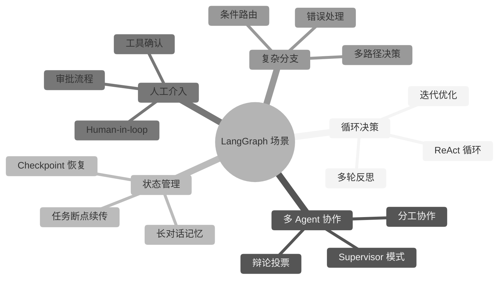
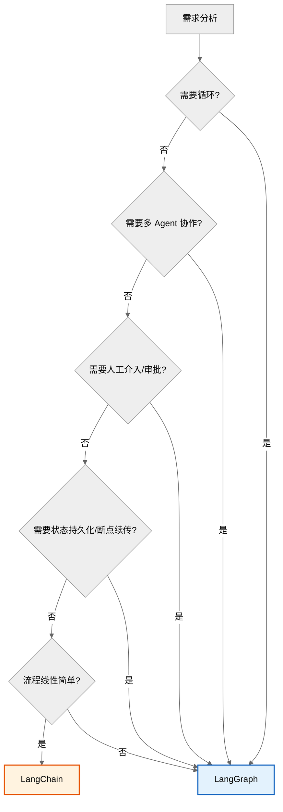

# LangChain 与 LangGraph 使用场景对比

> 本文档对比 LangChain 与 LangGraph 的使用场景，提供选型决策参考。两者同属 LangChain 生态，互补而非替代。

---

## 目录

- [LangChain 与 LangGraph 使用场景对比](#langchain-与-langgraph-使用场景对比)
  - [目录](#目录)
  - [一、一句话区分](#一一句话区分)
  - [二、核心对比](#二核心对比)
  - [三、LangChain 适用场景](#三langchain-适用场景)
  - [四、LangGraph 适用场景](#四langgraph-适用场景)
  - [五、选型决策树](#五选型决策树)
  - [六、选型口诀](#六选型口诀)
  - [七、两者关系](#七两者关系)

---

## 一、一句话区分

- **LangChain**：用**链（Chain）**串联组件，适合**线性、确定流程**的 LLM 应用
- **LangGraph**：用**图（Graph）**编排流程，适合**循环、分支、多 Agent、需状态管理**的复杂应用

---

## 二、核心对比

| 维度 | LangChain | LangGraph |
|------|-----------|-----------|
| **执行模型** | 链式（DAG） | 可编程图（含循环） |
| **流程控制** | 线性为主，固定 Agent 循环 | 任意拓扑，白盒可控 |
| **状态管理** | Memory（简单） | State（持久化、可恢复） |
| **循环支持** | ❌ 不支持（链是 DAG） | ✅ 原生支持 |
| **多 Agent** | ❌ 弱 | ✅ 原生支持 |
| **人工介入** | ❌ 困难 | ✅ interrupt 机制 |
| **容错恢复** | ❌ 不支持 | ✅ Checkpoint |
| **学习曲线** | 低 | 中高 |

---

## 三、LangChain 适用场景

| 场景 | 示例 |
|------|------|
| **简单 RAG 问答** | 检索→生成，线性流程 |
| **单步工具调用** | 查天气、查数据库 |
| **Prompt 链** | 翻译→摘要→格式化 |
| **快速原型** | PoC 验证 |
| **组件组合** | Model + Prompt + OutputParser |

```python
# LangChain: 线性 RAG
from langchain.chains import RetrievalQA
chain = RetrievalQA.from_chain_type(llm, retriever=retriever)
answer = chain.invoke({"query": "什么是 RAG?"})
```

---

## 四、LangGraph 适用场景



| 场景 | 为什么用 LangGraph |
|------|-------------------|
| **多轮反思 Self-Refine** | 需循环：生成→评估→改进→再生成 |
| **ReAct Agent** | 需循环：Thought→Action→Observation |
| **多 Agent 协作** | 需多节点 + 路由 + 状态共享 |
| **需人工审批** | interrupt 暂停等待用户确认 |
| **长任务断点续传** | Checkpoint 持久化状态 |
| **复杂分支决策** | 条件边 + 多路径 |
| **代码生成 + 测试循环** | 生成→测试→失败→修复（循环） |

```python
# LangGraph: 带循环的 ReAct Agent
from langgraph.graph import StateGraph, END

graph = StateGraph(AgentState)
graph.add_node("agent", call_model)      # LLM 决策
graph.add_node("tools", call_tools)      # 工具执行
graph.add_conditional_edges("agent", should_continue, {
    "continue": "tools",  # 需工具 → 执行工具
    "end": END,           # 完成 → 结束
})
graph.add_edge("tools", "agent")         # 工具结果 → 回到 LLM(循环!)
app = graph.compile()
```

---

## 五、选型决策树



---

## 六、选型口诀

> - **线性无循环 → LangChain**（简单高效）
> - **循环/多Agent/人工介入/状态持久 → LangGraph**（强大可控）
> - **不确定 → 先 LangChain 快速验证，复杂度上来再迁移 LangGraph**（两者同生态，迁移成本低）

---

## 七、两者关系

两者**不是替代关系**，而是**互补**：

- LangGraph 是 LangChain 生态的一部分（同团队出品）
- LangGraph 内部仍使用 LangChain 的 Model、Tool、Prompt 等组件
- 简单场景用 LangChain，复杂场景升级到 LangGraph

更多细节可参考现有文档 [LangGraph技术原理与应用.md](./langGraph/LangGraph技术原理与应用.md)。
