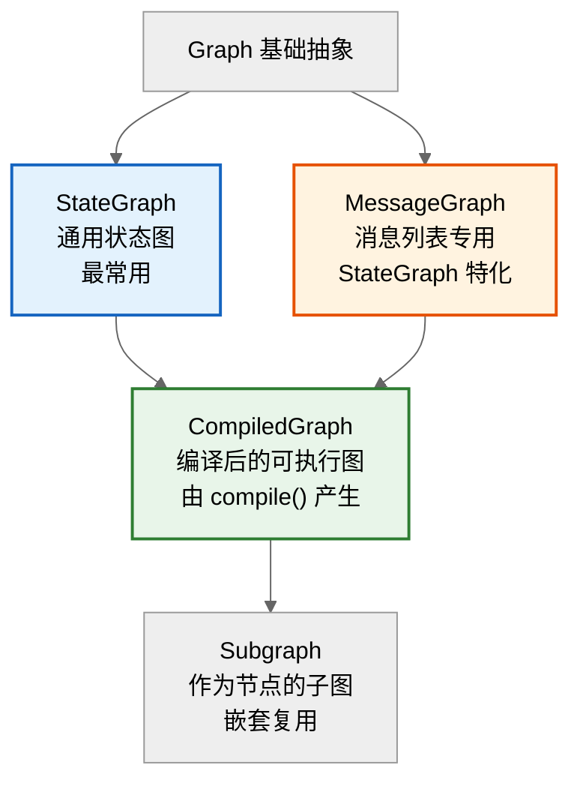
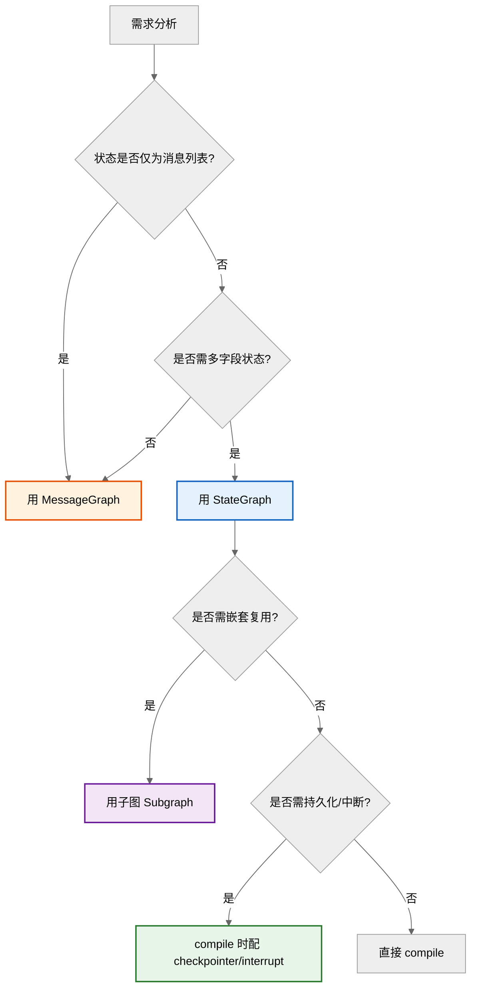

# LangGraph 图类（Graph Classes）详解

> 本文档系统介绍 LangGraph 框架提供的各类图（Graph Classes），涵盖基础图类、特殊用途图类、编译图的核心特性、适用场景与基本使用方法，帮助开发者根据需求选型。

---

## 目录

- [LangGraph 图类（Graph Classes）详解](#langgraph-图类graph-classes详解)
  - [目录](#目录)
  - [一、图类总览](#一图类总览)
  - [二、基础图类](#二基础图类)
    - [2.1 StateGraph（状态图）](#21-stategraph状态图)
    - [2.2 MessageGraph（消息图）](#22-messagegraph消息图)
  - [三、编译图类](#三编译图类)
    - [3.1 CompiledGraph（编译图）](#31-compiledgraph编译图)
  - [四、特殊用途图类](#四特殊用途图类)
    - [4.1 MessageGraph vs StateGraph](#41-messagegraph-vs-stategraph)
    - [4.2 子图（Subgraphs）](#42-子图subgraphs)
    - [4.3 StateReducer 与 AnnotatedReducer](#43-statereducer-与-annotatedreducer)
  - [五、图类对比与选型](#五图类对比与选型)
    - [5.1 选型决策树](#51-选型决策树)
    - [5.2 综合对比表](#52-综合对比表)
  - [六、实战示例](#六实战示例)
    - [6.1 完整 ReAct Agent（MessageGraph）](#61-完整-react-agentmessagegraph)
    - [6.2 带人工审批的 StateGraph](#62-带人工审批的-stategraph)
  - [七、常见问题](#七常见问题)
    - [Q1：StateGraph 和 MessageGraph 如何选？](#q1stategraph-和-messagegraph-如何选)
    - [Q2：为什么节点返回值只更新部分字段？](#q2为什么节点返回值只更新部分字段)
    - [Q3：compile() 后还能修改图结构吗？](#q3compile-后还能修改图结构吗)
    - [Q4：子图的状态会污染主图吗？](#q4子图的状态会污染主图吗)
    - [Q5：interrupt\_before 和 interrupt\_after 的区别？](#q5interrupt_before-和-interrupt_after-的区别)
    - [Q6：一个图必须有循环吗？](#q6一个图必须有循环吗)
    - [Q7：如何调试图？](#q7如何调试图)
  - [参考资料](#参考资料)

---

## 一、图类总览

LangGraph 的图类体系围绕"**状态驱动的有向图**"设计，核心类层次如下：



| 图类 | 类型 | 核心用途 | 是否可执行 |
|------|------|----------|-----------|
| **StateGraph** | 构建类 | 通用状态图，自定义 State Schema | ❌ 需编译 |
| **MessageGraph** | 构建类 | 消息列表场景（对话 Agent） | ❌ 需编译 |
| **CompiledGraph** | 编译类 | 编译后可执行，支持持久化/中断/流式 | ✅ 可执行 |
| **Subgraph** | 复用类 | 作为节点嵌套在其他图中 | ✅ 可作为节点 |

> **关键区别**：`StateGraph`/`MessageGraph` 是**构建期**类（用于定义图结构），`CompiledGraph` 是**运行期**类（由 `compile()` 产生，可执行）。

---

## 二、基础图类

### 2.1 StateGraph（状态图）

**核心特性**：LangGraph 最核心、最通用的图类，支持自定义 State Schema 与 Reducer。

**适用场景**：
- 需要自定义状态结构（非纯消息列表）
- 多字段状态管理（如 `messages` + `documents` + `step_count`）
- 多 Agent 协作（共享复杂状态）
- 需要状态聚合/分流（Reducer 自定义合并逻辑）

**基本使用**：

```python
from typing import Annotated, TypedDict
from langgraph.graph import StateGraph, END, START
from langgraph.graph.message import add_messages


# 1. 定义 State Schema（TypedDict + Annotated）
class AgentState(TypedDict):
    messages: Annotated[list, add_messages]  # 消息列表（追加合并）
    documents: list                           # 检索文档
    step_count: int                           # 步骤计数
    user_id: str                              # 用户ID


# 2. 定义节点函数（接收 state，返回 state 更新）
def retrieve_node(state: AgentState) -> dict:
    docs = retriever.invoke(state["messages"][-1].content)
    return {"documents": docs, "step_count": state["step_count"] + 1}


def generate_node(state: AgentState) -> dict:
    response = llm.invoke(state["messages"] + state["documents"])
    return {"messages": [response], "step_count": state["step_count"] + 1}


def should_continue(state: AgentState) -> str:
    """条件路由：判断是否需要继续检索"""
    if state["step_count"] >= 3:
        return "end"
    return "continue"


# 3. 构建图
graph = StateGraph(AgentState)

# 添加节点
graph.add_node("retrieve", retrieve_node)
graph.add_node("generate", generate_node)

# 添加边
graph.add_edge(START, "retrieve")
graph.add_conditional_edges(
    "generate",
    should_continue,
    {"continue": "retrieve", "end": END},
)
graph.add_edge("retrieve", "generate")

# 4. 编译
app = graph.compile()

# 5. 执行
result = app.invoke({
    "messages": [{"role": "user", "content": "什么是 RAG?"}],
    "documents": [],
    "step_count": 0,
    "user_id": "u123",
})
```

**关键点**：
- **State Schema**：用 `TypedDict` 定义，字段可用 `Annotated` 指定 Reducer。
- **Reducer**：默认覆盖，`add_messages` 表示追加合并（避免覆盖历史消息）。
- **节点返回值**：只需返回**更新的字段**，框架自动用 Reducer 合并。

---

### 2.2 MessageGraph（消息图）

**核心特性**：`StateGraph` 的特化版本，State 固定为**消息列表**，无需自定义 Schema。

**适用场景**：
- 纯对话型 Agent（只需管理消息）
- 快速原型（不想定义 State Schema）
- 简单 ReAct Agent

**基本使用**：

```python
from langgraph.graph import MessageGraph, END
from langchain_core.messages import HumanMessage, AIMessage


# 1. 定义节点（接收 messages 列表，返回新消息或更新）
def call_model(messages: list) -> dict:
    response = llm.invoke(messages)
    return {"messages": [response]}


def call_tools(messages: list) -> dict:
    last_msg = messages[-1]
    tool_results = execute_tools(last_msg.tool_calls)
    return {"messages": tool_results}


def should_continue(messages: list) -> str:
    last_msg = messages[-1]
    if last_msg.tool_calls:
        return "tools"
    return "end"


# 2. 构建 MessageGraph（无需传 Schema）
graph = MessageGraph()

graph.add_node("agent", call_model)
graph.add_node("tools", call_tools)

graph.add_edge("__start__", "agent")
graph.add_conditional_edges("agent", should_continue, {
    "tools": "tools",
    "end": END,
})
graph.add_edge("tools", "agent")  # 工具结果回到 agent（循环）

app = graph.compile()

# 3. 执行
result = app.invoke([HumanMessage("查一下北京天气")])
```

**与 StateGraph 的等价关系**：

```python
# MessageGraph 等价于：
graph = StateGraph(list)  # State 为消息列表
# 且自动使用 add_messages 作为 Reducer
```

**何时用 MessageGraph**：
- ✅ 只需管理消息，无其他状态字段 → 用 MessageGraph（更简洁）
- ❌ 需要额外状态（文档/计数/用户信息）→ 用 StateGraph

---

## 三、编译图类

### 3.1 CompiledGraph（编译图）

**核心特性**：由 `StateGraph`/`MessageGraph` 调用 `compile()` 产生，是**可执行**的图实例，支持持久化、中断、流式等高级能力。

**compile() 的参数**：

```python
app = graph.compile(
    checkpointer=MemorySaver(),       # 状态持久化（断点续传）
    interrupt_before=["human_node"],  # 节点前中断（人工审批）
    interrupt_after=["tool_node"],    # 节点后中断
)
```

| 参数 | 作用 | 典型场景 |
|------|------|----------|
| `checkpointer` | 状态持久化 | 长对话/断点续传/故障恢复 |
| `interrupt_before` | 节点执行前暂停 | 人工审批/危险操作确认 |
| `interrupt_after` | 节点执行后暂停 | 审查中间结果 |
| `name` | 图命名 | 多图管理 |

**CompiledGraph 核心方法**：

```python
# 同步执行
result = app.invoke(initial_state)

# 流式执行（逐节点返回）
for chunk in app.stream(initial_state):
    print(chunk)

# 异步执行
result = await app.ainvoke(initial_state)

# 异步流式
async for chunk in app.astream(initial_state):
    print(chunk)

# 带 thread_id 执行（启用持久化后，支持断点续传）
config = {"configurable": {"thread_id": "thread-1"}}
result = app.invoke(initial_state, config=config)

# 恢复中断的执行（人工审批后继续）
app.invoke(None, config=config)

# 获取当前状态
state = app.get_state(config)

# 更新状态（人工干预）
app.update_state(config, {"messages": [HumanMessage("改主意了")]})
```

**编译图的能力矩阵**：

| 能力 | 未编译 StateGraph | CompiledGraph |
|------|-------------------|---------------|
| 执行 | ❌ | ✅ |
| 持久化 | ❌ | ✅（需 checkpointer） |
| 中断恢复 | ❌ | ✅（需 interrupt + checkpointer） |
| 流式输出 | ❌ | ✅ |
| 状态查询/更新 | ❌ | ✅ |
| 可视化 | ❌ | ✅（`app.get_graph().draw_*`） |

---

## 四、特殊用途图类

### 4.1 MessageGraph vs StateGraph

| 维度 | MessageGraph | StateGraph |
|------|--------------|------------|
| **State 类型** | 固定为 `list[BaseMessage]` | 任意 `TypedDict` |
| **Schema 定义** | 无需 | 需定义 TypedDict |
| **Reducer** | 默认 `add_messages` | 自定义（默认覆盖） |
| **灵活性** | 低（仅消息） | 高（多字段） |
| **代码简洁度** | 高 | 中 |
| **适用** | 纯对话 Agent | 复杂状态 Agent |

**选择建议**：
- 起步用 MessageGraph 快速验证
- 状态变复杂后迁移到 StateGraph

---

### 4.2 子图（Subgraphs）

**核心特性**：一个编译后的图可作为另一个图的**节点**，实现嵌套复用。

**适用场景**：
- 多 Agent 系统（每个 Agent 是独立子图）
- 复杂流程模块化（拆分为子图组合）
- 团队协作（不同团队维护不同子图）

**基本使用**：

```python
from langgraph.graph import StateGraph, END, START


# 1. 定义子图：研究 Agent
class ResearchState(TypedDict):
    query: str
    research_result: str


def search_node(state: ResearchState) -> dict:
    result = search_tool(state["query"])
    return {"research_result": result}


research_graph = StateGraph(ResearchState)
research_graph.add_node("search", search_node)
research_graph.add_edge(START, "search")
research_graph.add_edge("search", END)
research_app = research_graph.compile()


# 2. 定义子图：写作 Agent
class WriterState(TypedDict):
    research_result: str
    article: str


def write_node(state: WriterState) -> dict:
    article = writer_llm.invoke(state["research_result"])
    return {"article": article}


writer_graph = StateGraph(WriterState)
writer_graph.add_node("write", write_node)
writer_graph.add_edge(START, "write")
writer_graph.add_edge("write", END)
writer_app = writer_graph.compile()


# 3. 主图：编排两个子图
class MainState(TypedDict):
    query: str
    research_result: str
    article: str


def research_step(state: MainState) -> dict:
    # 子图作为节点执行
    result = research_app.invoke({"query": state["query"]})
    return {"research_result": result["research_result"]}


def write_step(state: MainState) -> dict:
    result = writer_app.invoke({"research_result": state["research_result"]})
    return {"article": result["article"]}


main_graph = StateGraph(MainState)
main_graph.add_node("research", research_step)  # 嵌入子图
main_graph.add_node("write", write_step)        # 嵌入子图
main_graph.add_edge(START, "research")
main_graph.add_edge("research", "write")
main_graph.add_edge("write", END)

main_app = main_graph.compile()
result = main_app.invoke({"query": "AI Agent 趋势"})
```

**子图优势**：
- **封装**：子图内部状态独立，不影响主图
- **复用**：同一子图可在多个主图中使用
- **测试**：子图可独立测试

---

### 4.3 StateReducer 与 AnnotatedReducer

**核心特性**：Reducer 决定节点返回值如何与现有 State 合并，是 StateGraph 的关键机制。

**默认行为（覆盖）**：

```python
class State(TypedDict):
    count: int   # 默认覆盖

def node(state):
    return {"count": 10}  # 直接覆盖原值
```

**追加合并（add_messages）**：

```python
from langgraph.graph.message import add_messages
from typing import Annotated

class State(TypedDict):
    messages: Annotated[list, add_messages]  # 追加而非覆盖

def node(state):
    return {"messages": [new_msg]}  # 追加到列表末尾
```

**自定义 Reducer**：

```python
from typing import Annotated
from operator import add


class State(TypedDict):
    # 列表累加（用 operator.add）
    documents: Annotated[list, add]
    # 计数器累加（自定义函数）
    steps: Annotated[int, lambda old, new: old + new]


# 自定义 Reducer 函数
def merge_dicts(old: dict, new: dict) -> dict:
    """字典深度合并"""
    return {**old, **new}


class State(TypedDict):
    metadata: Annotated[dict, merge_dicts]  # 深度合并而非覆盖
```

**常见 Reducer 模式**：

| 场景 | Reducer | 说明 |
|------|---------|------|
| 消息列表 | `add_messages` | 追加消息 |
| 文档列表 | `operator.add` | 列表拼接 |
| 计数器 | `lambda o,n: o+n` | 累加 |
| 字典合并 | 自定义 merge | 深度合并 |
| 覆盖更新 | 默认（不指定） | 直接覆盖 |
| 取最大值 | `max` | 竞争场景 |

---

## 五、图类对比与选型

### 5.1 选型决策树



### 5.2 综合对比表

| 图类 | 灵活性 | 学习成本 | 适用复杂度 | 典型场景 |
|------|--------|----------|-----------|----------|
| **MessageGraph** | 低 | 低 | 简单 | 纯对话 Agent |
| **StateGraph** | 高 | 中 | 中等 | RAG/多步 Agent |
| **StateGraph + Reducer** | 极高 | 高 | 复杂 | 多 Agent 协作 |
| **Subgraph 嵌套** | 极高 | 高 | 极复杂 | 大型系统模块化 |
| **CompiledGraph + Checkpointer** | 高 | 中 | 生产级 | 需持久化/恢复 |

---

## 六、实战示例

### 6.1 完整 ReAct Agent（MessageGraph）

```python
from langgraph.graph import MessageGraph, END
from langchain_openai import ChatOpenAI
from langchain_core.messages import HumanMessage
from langchain_core.tools import tool


@tool
def search(query: str) -> str:
    """搜索工具"""
    return f"搜索结果: {query}"


@tool
def calculator(expression: str) -> str:
    """计算器"""
    return str(eval(expression))


tools = [search, calculator]
llm = ChatOpenAI(model="gpt-4o-mini").bind_tools(tools)


def call_model(messages):
    response = llm.invoke(messages)
    return {"messages": [response]}


def call_tools(messages):
    last_msg = messages[-1]
    results = []
    for tc in last_msg.tool_calls:
        tool_fn = {t.name: t for t in tools}[tc["name"]]
        result = tool_fn.invoke(tc["args"])
        results.append(result)
    return {"messages": results}


def should_continue(messages):
    if messages[-1].tool_calls:
        return "tools"
    return "end"


# 构建 ReAct 循环
graph = MessageGraph()
graph.add_node("agent", call_model)
graph.add_node("tools", call_tools)
graph.add_edge("__start__", "agent")
graph.add_conditional_edges("agent", should_continue, {
    "tools": "tools", "end": END,
})
graph.add_edge("tools", "agent")  # 循环！

app = graph.compile()

result = app.invoke([HumanMessage("3加5等于多少?然后搜索'AI趋势'")])
```

### 6.2 带人工审批的 StateGraph

```python
from langgraph.graph import StateGraph, END, START
from langgraph.checkpoint.memory import MemorySaver
from typing import TypedDict, Annotated
from langgraph.graph.message import add_messages


class State(TypedDict):
    messages: Annotated[list, add_messages]
    approved: bool


def agent_node(state):
    response = llm.invoke(state["messages"])
    return {"messages": [response]}


def execute_node(state):
    # 执行危险操作
    return {"approved": True}


def should_approve(state):
    last_msg = state["messages"][-1]
    if "删除" in last_msg.content:
        return "wait_approval"
    return "execute"


graph = StateGraph(State)
graph.add_node("agent", agent_node)
graph.add_node("execute", execute_node)
graph.add_node("human_approval", lambda s: s)  # 占位节点

graph.add_edge(START, "agent")
graph.add_conditional_edges("agent", should_approve, {
    "wait_approval": "human_approval",
    "execute": "execute",
})
graph.add_edge("human_approval", "execute")
graph.add_edge("execute", END)

# 编译时配置：在 human_approval 前中断
app = graph.compile(
    checkpointer=MemorySaver(),
    interrupt_before=["human_approval"],
)

config = {"configurable": {"thread_id": "1"}}

# 第一次执行：会在 human_approval 前暂停
app.invoke({"messages": [HumanMessage("删除文件 a.txt")]}, config=config)

# 人工确认后继续
app.invoke(None, config=config)
```

---

## 七、常见问题

### Q1：StateGraph 和 MessageGraph 如何选？

- 只需管理消息 → MessageGraph
- 需要其他状态字段（文档/计数/标记）→ StateGraph

### Q2：为什么节点返回值只更新部分字段？

LangGraph 用 Reducer 合并：节点返回 `{"messages": [new]}` 后，`messages` 字段用 `add_messages` 追加，其他字段保持不变。这样节点只需关注自己修改的字段。

### Q3：compile() 后还能修改图结构吗？

不能。`compile()` 产生不可变的 `CompiledGraph`，修改结构需重新 `compile()`。

### Q4：子图的状态会污染主图吗？

不会。子图有独立 State Schema，主图调用子图时做状态映射，互不影响。

### Q5：interrupt_before 和 interrupt_after 的区别？

- `interrupt_before=["node_x"]`：在 node_x 执行**前**暂停
- `interrupt_after=["node_x"]`：在 node_x 执行**后**暂停

### Q6：一个图必须有循环吗？

不需要。LangGraph 支持线性流程（无循环），也支持复杂循环。循环是可选的，按需使用。

### Q7：如何调试图？

```python
# 可视化图结构
app.get_graph().draw_mermaid_png(output_file_path="graph.png")

# 流式查看每步状态
for chunk in app.stream(initial_state):
    print(chunk)

# 查看当前状态（需 checkpointer）
print(app.get_state(config))
```

---

## 参考资料

- [LangGraph 官方文档 - Graph Classes](https://langchain-ai.github.io/langgraph/concepts/low_level/)
- [LangGraph 官方文档 - StateGraph](https://langchain-ai.github.io/langgraph/concepts/low_level/#stategraph)
- [LangGraph 官方文档 - Persistence](https://langchain-ai.github.io/langgraph/concepts/persistence/)
- 现有文档：[LangGraph技术原理与应用.md](./langGraph/LangGraph技术原理与应用.md)
- 现有文档：[LangGraph State技术详解.md](./langGraph/LangGraph%20State技术详解.md)
