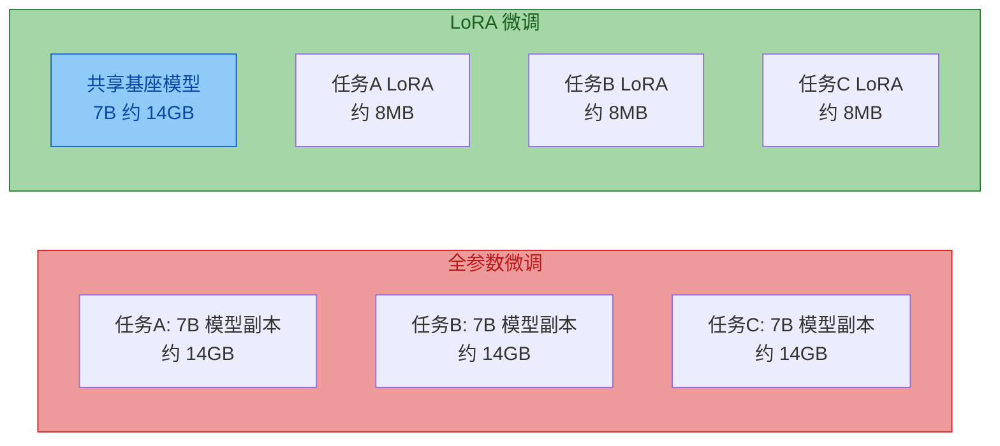
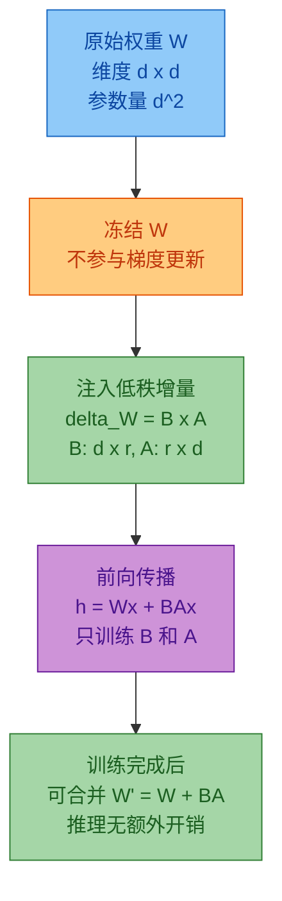
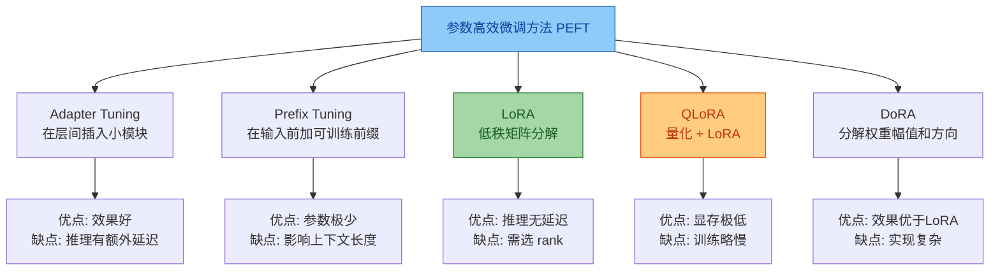
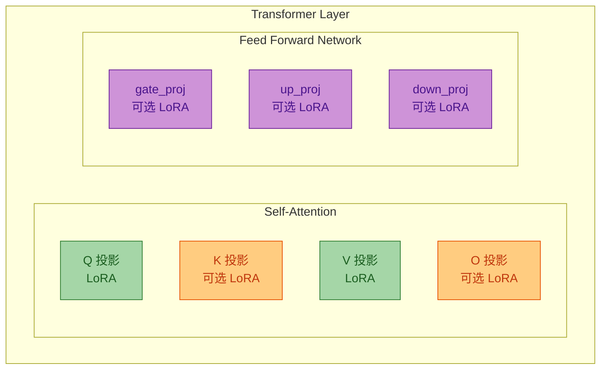
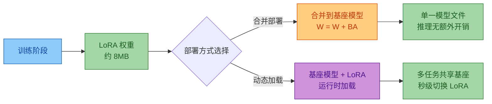
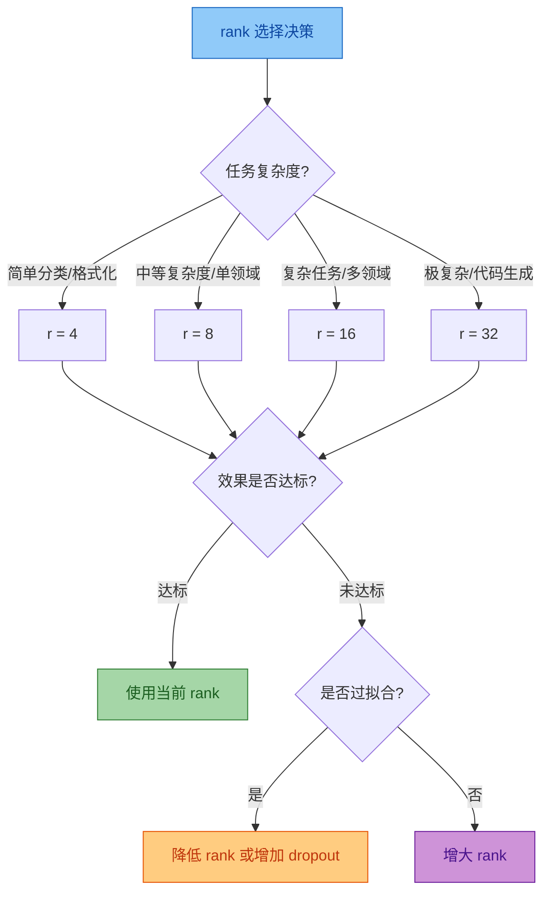

# LoRA 微调原理与实例详解

> 本文档系统阐述 LoRA (Low-Rank Adaptation) 微调技术的核心原理、数学模型、工程实现与性能优化，并提供完整的可复现实例。
> 适用对象：AI 算法工程师、模型训练工程师及大模型应用开发者。

---


## 目录

- [LoRA 微调原理与实例详解](#lora-微调原理与实例详解)
  - [目录](#目录)
  - [一、LoRA 技术概述](#一lora-技术概述)
    - [1.1 什么是 LoRA](#11-什么是-lora)
    - [1.2 提出背景](#12-提出背景)
    - [1.3 核心思想](#13-核心思想)
  - [二、数学模型与理论推导](#二数学模型与理论推导)
    - [2.1 低秩分解原理](#21-低秩分解原理)
    - [2.2 LoRA 的数学表示](#22-lora-的数学表示)
    - [2.3 初始化策略](#23-初始化策略)
    - [2.4 缩放因子 alpha 的作用](#24-缩放因子-alpha-的作用)
    - [2.5 参数量分析](#25-参数量分析)
  - [三、与传统微调方法对比](#三与传统微调方法对比)
    - [3.1 全参数微调 vs LoRA](#31-全参数微调-vs-lora)
    - [3.2 LoRA vs 其他参数高效微调方法](#32-lora-vs-其他参数高效微调方法)
    - [3.3 综合对比表](#33-综合对比表)
  - [四、实现步骤](#四实现步骤)
    - [4.1 环境配置](#41-环境配置)
    - [4.2 数据预处理](#42-数据预处理)
    - [4.3 模型选择](#43-模型选择)
    - [4.4 LoRA 参数设置](#44-lora-参数设置)
    - [4.5 训练配置](#45-训练配置)
  - [五、完整实例演示](#五完整实例演示)
    - [5.1 项目背景](#51-项目背景)
    - [5.2 数据准备](#52-数据准备)
    - [5.3 完整训练代码](#53-完整训练代码)
    - [5.4 训练过程分析](#54-训练过程分析)
    - [5.5 结果评估](#55-结果评估)
    - [5.6 权重合并与部署](#56-权重合并与部署)
  - [六、常见问题解决方案](#六常见问题解决方案)
  - [七、性能优化建议](#七性能优化建议)
    - [7.1 显存优化](#71-显存优化)
    - [7.2 训练加速](#72-训练加速)
    - [7.3 多 LoRA 管理](#73-多-lora-管理)
  - [八、总结](#八总结)

---

## 一、LoRA 技术概述

### 1.1 什么是 LoRA

LoRA (Low-Rank Adaptation) 是微软研究院于 2021 年提出的一种**参数高效微调** (Parameter-Efficient Fine-Tuning, PEFT) 方法。其核心思路是：冻结预训练模型的原始权重，在 Transformer 的特定层（通常是注意力层）旁路注入可训练的低秩分解矩阵，通过训练这些少量参数来实现模型适配。

> **一句话理解**：LoRA 不修改原始模型权重，而是学习一个"增量权重" ΔW，并将其分解为两个低秩矩阵 B 和 A 的乘积，从而大幅减少可训练参数量。

### 1.2 提出背景

全参数微调在大模型时代面临三大瓶颈：

| 瓶颈 | 全参数微调的问题 | LoRA 的解决方案 |
|------|----------------|----------------|
| **显存爆炸** | 7B 模型全参数微调需 4 倍模型大小的显存 (约 112GB) | 仅需存储低秩矩阵梯度 (约 2-8GB) |
| **存储浪费** | 每个下游任务需保存一份完整模型副本 | 每个任务仅需保存几 MB 的 LoRA 权重 |
| **切换成本高** | 不同任务间切换需重新加载完整模型 | 只需热切换 LoRA 权重 (秒级) |



### 1.3 核心思想

LoRA 的理论依据来自一个关键假设：**预训练大模型在下游任务上的适配存在"内在低秩"** (intrinsic low rank)。即模型在微调时权重的变化量 ΔW 是低秩的，可以用远小于原始维度的矩阵来近似。



---

## 二、数学模型与理论推导

### 2.1 低秩分解原理

对于一个 $d \times d$ 的权重矩阵 $W$，全参数微调需要更新所有 $d^2$ 个参数。LoRA 假设微调时的权重变化 $\Delta W$ 具有低秩结构，即：

$$\Delta W = B \cdot A$$

其中：
- $B \in \mathbb{R}^{d \times r}$，$A \in \mathbb{R}^{r \times d}$
- $r$ 为秩 (rank)，通常 $r \ll d$（如 $d = 4096$，$r = 8$ 或 $16$）

这意味着 $\Delta W$ 被分解为两个"瘦长"矩阵的乘积，参数量从 $d^2$ 降为 $2dr$。

### 2.2 LoRA 的数学表示

**全参数微调**的前向传播：

$$h = W_0 x$$

其中 $W_0 \in \mathbb{R}^{d \times k}$ 是预训练权重，$x \in \mathbb{R}^{k}$ 是输入。

**LoRA 微调**的前向传播：

$$h = W_0 x + \Delta W \cdot x = W_0 x + B A x$$

其中：
- $W_0 \in \mathbb{R}^{d \times k}$：预训练权重，**冻结不更新**
- $B \in \mathbb{R}^{d \times r}$：可训练矩阵
- $A \in \mathbb{R}^{r \times k}$：可训练矩阵
- $r$：低秩维度，$r \ll \min(d, k)$

训练时只对 $B$ 和 $A$ 计算梯度：

$$\frac{\partial \mathcal{L}}{\partial B} = \frac{\partial \mathcal{L}}{\partial h} \cdot (Ax)^T$$

$$\frac{\partial \mathcal{L}}{\partial A} = B^T \cdot \frac{\partial \mathcal{L}}{\partial h} \cdot x^T$$

### 2.3 初始化策略

LoRA 的初始化策略保证了训练开始时模型行为与原始模型完全一致：

| 矩阵 | 初始化方式 | 目的 |
|------|-----------|------|
| $A$ | 高斯随机 $\mathcal{N}(0, \sigma^2)$ | 保证 $A$ 有梯度信号 |
| $B$ | 零矩阵 $\mathbf{0}$ | 保证 $\Delta W = BA = 0$，训练初始时不改变模型行为 |

> **关键点**：由于 $B = 0$，训练开始时 $BA = 0$，即 $\Delta W = 0$，模型输出与原始预训练模型完全相同。随着训练进行，$B$ 逐渐学习到非零值，模型开始适配下游任务。

### 2.4 缩放因子 alpha 的作用

完整的 LoRA 前向传播包含一个缩放因子 $\alpha$：

$$h = W_0 x + \frac{\alpha}{r} B A x$$

**$\alpha$ 的作用**：

- $\alpha$ 是一个超参数，用于**缩放低秩更新的幅度**
- $\frac{\alpha}{r}$ 这个比率使得在改变 $r$ 时无需重新调学习率
- 经验法则：$\alpha = 2r$ 或 $\alpha = r$（常用 $\alpha = 16, r = 8$ 或 $\alpha = 32, r = 16$）

**为什么需要 $\alpha$**：当增大 $r$ 时，$BA$ 的值会变大（更多参数参与计算），通过 $\frac{\alpha}{r}$ 归一化后，可以保持更新的幅度稳定，避免频繁调参。

### 2.5 参数量分析

以 7B 模型（如 LLaMA-7B）为例，计算 LoRA 的参数量：

| 模块 | 原始参数量 | LoRA 参数量 (r=8) | 降幅 |
|------|-----------|------------------|------|
| Q 投影 (4096 x 4096) | 16.8M | 2 x 4096 x 8 = 65K | 99.6% |
| K 投影 (4096 x 4096) | 16.8M | 65K | 99.6% |
| V 投影 (4096 x 4096) | 16.8M | 65K | 99.6% |
| O 投影 (4096 x 4096) | 16.8M | 65K | 99.6% |
| 每层小计 | 67.1M | 262K | - |
| 32 层总计 | 2.15B | 8.39M | 99.6% |

> **结论**：对于 7B 模型，LoRA (r=8) 仅训练约 **8.4M 参数**，占模型总参数量的 **0.12%**，但通常能达到全参数微调 95%+ 的效果。

---

## 三、与传统微调方法对比

### 3.1 全参数微调 vs LoRA

| 维度 | 全参数微调 (Full FT) | LoRA 微调 |
|------|---------------------|-----------|
| **可训练参数** | 100% (7B) | 0.1-1% (7-70M) |
| **显存需求** | 4 倍模型大小 (约 112GB) | 1 倍模型大小 + 少量 (约 18GB) |
| **训练速度** | 基准 | 快 20-40% (梯度计算量少) |
| **存储成本** | 每任务 14GB | 每任务 8-50MB |
| **任务切换** | 重新加载模型 (分钟级) | 热切换 LoRA (秒级) |
| **效果** | 100% (基准) | 95-99% |
| **推理开销** | 无额外开销 | 训练后可合并，无额外开销 |
| **灾难性遗忘** | 较严重 | 较轻 (原始权重不变) |

### 3.2 LoRA vs 其他参数高效微调方法



### 3.3 综合对比表

| 方法 | 可训练参数 | 显存 (7B) | 推理延迟 | 效果 | 适用场景 |
|------|-----------|----------|---------|------|---------|
| Full FT | 7B | ~112GB | 无 | 100% | 算力充足，追求最优效果 |
| Adapter | 20-50M | ~24GB | 有 (额外层) | 97-99% | 多任务场景 |
| Prefix Tuning | 0.5-2M | ~16GB | 有 (前缀占上下文) | 92-96% | 极低资源场景 |
| **LoRA** | **8-20M** | **~18GB** | **无 (可合并)** | **95-99%** | **通用首选** |
| QLoRA | 8-20M | ~8GB | 无 (合并后) | 93-97% | 显存极度受限 |
| DoRA | 8-20M | ~18GB | 无 | 97-100% | 追求极致效果 |

---

## 四、实现步骤

### 4.1 环境配置

```bash
# 基础环境
python>=3.9
torch>=2.0.0

# 安装核心依赖
pip install torch torchvision torchaudio
pip install transformers>=4.36.0
pip install peft>=0.7.0          # LoRA 核心库
pip install datasets>=2.14.0
pip install accelerate>=0.24.0
pip install bitsandbytes>=0.41.0 # 量化支持 (可选, 用于 QLoRA)
pip install wandb                 # 训练监控 (可选)

# 验证安装
python -c "import peft; print(f'PEFT version: {peft.__version__}')"
python -c "import transformers; print(f'Transformers version: {transformers.__version__}')"
```

**硬件要求**：

| 模型规模 | 全参数微调 | LoRA 微调 | QLoRA 微调 |
|---------|-----------|----------|-----------|
| 1.5B | 24GB | 8GB | 4GB |
| 7B | 112GB | 18GB | 8GB |
| 13B | 208GB | 32GB | 12GB |
| 70B | 1120GB | 160GB | 48GB |

### 4.2 数据预处理

```python
import json
from datasets import Dataset
from transformers import AutoTokenizer

def prepare_dataset(data_path: str, tokenizer_name: str,
                    max_length: int = 512) -> Dataset:
    """
    加载并预处理微调数据
    支持 Alpaca 格式: {"instruction": "...", "input": "...", "output": "..."}
    """
    # 1. 加载数据
    with open(data_path, "r", encoding="utf-8") as f:
        raw_data = [json.loads(line) for line in f if line.strip()]

    # 2. 格式化为指令模板
    formatted_data = []
    for item in raw_data:
        instruction = item.get("instruction", "")
        input_text = item.get("input", "")
        output = item.get("output", "")

        # 构建提示词模板
        if input_text:
            prompt = (
                f"Below is an instruction that describes a task, "
                f"paired with an input that provides further context. "
                f"Write a response that appropriately completes the request.\n\n"
                f"### Instruction:\n{instruction}\n\n"
                f"### Input:\n{input_text}\n\n"
                f"### Response:\n"
            )
        else:
            prompt = (
                f"Below is an instruction that describes a task. "
                f"Write a response that appropriately completes the request.\n\n"
                f"### Instruction:\n{instruction}\n\n"
                f"### Response:\n"
            )

        full_text = prompt + output

        formatted_data.append({
            "prompt": prompt,
            "completion": output,
            "full_text": full_text,
        })

    dataset = Dataset.from_list(formatted_data)

    # 3. Tokenize
    tokenizer = AutoTokenizer.from_pretrained(tokenizer_name)
    if tokenizer.pad_token is None:
        tokenizer.pad_token = tokenizer.eos_token

    def tokenize_fn(examples):
        # 对完整文本进行编码
        model_inputs = tokenizer(
            examples["full_text"],
            max_length=max_length,
            padding="max_length",
            truncation=True,
            return_tensors="pt",
        )

        # 构建标签: 只对 response 部分计算 loss
        labels = model_inputs["input_ids"].clone()

        # 将 prompt 部分的标签设为 -100 (不计算 loss)
        for i, prompt in enumerate(examples["prompt"]):
            prompt_ids = tokenizer(
                prompt, max_length=max_length,
                truncation=True, add_special_tokens=False
            )["input_ids"]
            prompt_len = len(prompt_ids)
            labels[i][:prompt_len] = -100

        model_inputs["labels"] = labels
        return model_inputs

    tokenized_dataset = dataset.map(
        tokenize_fn,
        batched=True,
        remove_columns=dataset.column_names,
    )

    return tokenized_dataset


# 使用示例
dataset = prepare_dataset(
    data_path="alpaca_data.jsonl",
    tokenizer_name="Qwen/Qwen2-7B",
    max_length=512
)
print(f"数据集大小: {len(dataset)}")
print(f"样本示例: {dataset[0]}")
```

### 4.3 模型选择

```python
from transformers import AutoModelForCausalLM, BitsAndBytesConfig
import torch

def load_model(model_name: str, use_4bit: bool = False):
    """
    加载基座模型
    Args:
        model_name: HuggingFace 模型名称
        use_4bit: 是否使用 4bit 量化 (QLoRA)
    """
    # 量化配置 (可选)
    bnb_config = None
    if use_4bit:
        bnb_config = BitsAndBytesConfig(
            load_in_4bit=True,
            bnb_4bit_quant_type="nf4",        # NormalFloat4 量化
            bnb_4bit_compute_dtype=torch.bfloat16,
            bnb_4bit_use_double_quant=True,    # 双重量化
        )

    model = AutoModelForCausalLM.from_pretrained(
        model_name,
        quantization_config=bnb_config,
        device_map="auto",
        torch_dtype=torch.bfloat16,
        trust_remote_code=True,
    )

    # 启用梯度检查点 (节省显存)
    model.config.use_cache = False
    if hasattr(model, "gradient_checkpointing_enable"):
        model.gradient_checkpointing_enable()

    # 准备模型用于 LoRA 训练
    if use_4bit:
        from peft import prepare_model_for_kbit_training
        model = prepare_model_for_kbit_training(model)

    return model


# 模型选择建议
MODEL_RECOMMENDATIONS = {
    "入门": {"model": "Qwen/Qwen2-1.5B", "gpu": "8GB+", "use_4bit": False},
    "通用": {"model": "Qwen/Qwen2-7B", "gpu": "16GB+", "use_4bit": False},
    "低显存": {"model": "Qwen/Qwen2-7B", "gpu": "8GB+", "use_4bit": True},
    "高性能": {"model": "Qwen/Qwen2-13B", "gpu": "32GB+", "use_4bit": False},
    "极致": {"model": "meta-llama/Llama-3-70B", "gpu": "48GB+", "use_4bit": True},
}
```

### 4.4 LoRA 参数设置

```python
from peft import LoraConfig, get_peft_model, TaskType

def create_lora_config(
    r: int = 8,
    lora_alpha: int = 16,
    lora_dropout: float = 0.05,
    target_modules: list = None,
    bias: str = "none",
):
    """
    创建 LoRA 配置

    Args:
        r: LoRA 秩, 控制表达能力. 常用 4/8/16/32/64
        lora_alpha: 缩放因子, 通常设为 r 的 1-2 倍
        lora_dropout: dropout 比率, 防止过拟合
        target_modules: 应用 LoRA 的模块列表
        bias: 是否训练 bias, 通常为 "none"
    """
    if target_modules is None:
        # 默认应用于注意力层的 Q 和 V 投影
        target_modules = ["q_proj", "v_proj"]

    config = LoraConfig(
        task_type=TaskType.CAUSAL_LM,
        r=r,
        lora_alpha=lora_alpha,
        lora_dropout=lora_dropout,
        target_modules=target_modules,
        bias=bias,
    )
    return config


# LoRA 参数选择指南
LORA_PARAM_GUIDE = {
    # rank 选择
    "rank_4":  "极快训练, 参数最少, 适合简单任务/分类",
    "rank_8":  "推荐起点, 效果与效率平衡, 适合大多数任务",
    "rank_16": "较强表达力, 适合中等复杂度任务",
    "rank_32": "高表达力, 适合复杂任务/代码生成",
    "rank_64": "最高表达力, 接近全参数微调效果",

    # target_modules 选择
    "modules_minimal":  ["q_proj", "v_proj"],           # 最小配置
    "modules_standard": ["q_proj", "k_proj", "v_proj", "o_proj"],  # 标准
    "modules_full":     ["q_proj", "k_proj", "v_proj", "o_proj",
                         "gate_proj", "up_proj", "down_proj"],      # 全量
}
```

**LoRA 应用位置示意图**：



### 4.5 训练配置

```python
from transformers import TrainingArguments

def create_training_args(
    output_dir: str = "./lora_output",
    num_epochs: int = 3,
    batch_size: int = 4,
    gradient_accumulation: int = 8,
    learning_rate: float = 2e-4,
    warmup_ratio: float = 0.03,
):
    """
    创建训练参数配置
    注意: LoRA 的学习率通常比全参数微调大 10 倍 (2e-4 vs 2e-5)
    """
    return TrainingArguments(
        output_dir=output_dir,
        num_train_epochs=num_epochs,
        per_device_train_batch_size=batch_size,
        gradient_accumulation_steps=gradient_accumulation,
        # 有效 batch = batch_size * gradient_accumulation * num_gpus
        learning_rate=learning_rate,
        lr_scheduler_type="cosine",
        warmup_ratio=warmup_ratio,
        weight_decay=0.0,
        max_grad_norm=1.0,
        # 精度
        bf16=True,                        # 使用 bfloat16 混合精度
        # 日志
        logging_steps=10,
        save_strategy="steps",
        save_steps=200,
        save_total_limit=3,
        # 评估
        evaluation_strategy="steps",
        eval_steps=200,
        # 优化
        dataloader_num_workers=4,
        gradient_checkpointing=True,       # 梯度检查点 (省显存)
        optim="adamw_torch",
        report_to="wandb",                 # 可选: tensorboard / none
    )
```

---

## 五、完整实例演示

### 5.1 项目背景

> **场景**：在 Qwen2-7B 基座模型上，使用 LoRA 微调一个中文客服问答助手。
>
> **数据**：5 万条中文客服问答数据 (Alpaca 格式)
>
> **硬件**：单卡 RTX 4090 (24GB)
>
> **目标**：模型学会以客服身份回答用户问题，同时保持通用对话能力

### 5.2 数据准备

```python
"""prepare_data.py - 数据准备脚本"""

import json
import random

# 模拟生成客服问答数据 (实际使用时替换为真实数据)
def generate_customer_service_data(num_samples: int = 50000):
    """生成客服问答样本"""
    templates = [
        {
            "instruction": "用户询问退货政策",
            "input": "我昨天买的手机想退货，请问怎么操作？",
            "output": "您好！我们的退货政策是购买后7天内可以无理由退货。"
                      "请您在订单页面点击'申请退货'，选择退货原因并提交。"
                      "审核通过后，快递员会在1-2个工作日上门取件。"
                      "退款将在收到退货商品后3-5个工作日原路退回。"
        },
        {
            "instruction": "用户询问物流状态",
            "input": "我的订单什么时候能到？订单号：DD20240101",
            "output": "您好！我帮您查询了订单 DD20240101 的物流状态。"
                      "您的包裹目前已在运输途中，预计明天下午送达。"
                      "您可以随时在订单详情页查看实时物流信息。"
                      "如有其他问题，欢迎随时咨询。"
        },
        # ... 更多模板
    ]

    data = []
    for i in range(num_samples):
        template = random.choice(templates)
        data.append(template.copy())

    return data

# 生成并保存数据
data = generate_customer_service_data(50000)

with open("customer_service_data.jsonl", "w", encoding="utf-8") as f:
    for item in data:
        f.write(json.dumps(item, ensure_ascii=False) + "\n")

print(f"数据准备完成: {len(data)} 条")
```

### 5.3 完整训练代码

```python
"""
train_lora.py - LoRA 微调完整训练脚本
模型: Qwen2-7B
数据: 中文客服问答数据
硬件: 单卡 RTX 4090 (24GB)
"""

import torch
from transformers import (
    AutoModelForCausalLM,
    AutoTokenizer,
    TrainingArguments,
    Trainer,
)
from peft import (
    LoraConfig,
    get_peft_model,
    TaskType,
    prepare_model_for_kbit_training,
)
from datasets import Dataset
import json

# ==================== 配置区 ====================
CONFIG = {
    # 模型配置
    "model_name": "Qwen/Qwen2-7B",
    "tokenizer_name": "Qwen/Qwen2-7B",

    # 数据配置
    "data_path": "customer_service_data.jsonl",
    "max_length": 512,
    "val_size": 0.05,  # 5% 验证集

    # LoRA 配置
    "lora_r": 8,
    "lora_alpha": 16,
    "lora_dropout": 0.05,
    "target_modules": ["q_proj", "k_proj", "v_proj", "o_proj"],

    # 训练配置
    "output_dir": "./lora_output",
    "num_epochs": 3,
    "batch_size": 4,
    "gradient_accumulation": 8,  # 有效 batch = 4*8 = 32
    "learning_rate": 2e-4,
    "warmup_ratio": 0.03,
    "logging_steps": 10,
    "save_steps": 200,
    "eval_steps": 200,
}


def load_and_preprocess(config):
    """加载和预处理数据"""
    print("=" * 60)
    print("Step 1: 数据加载与预处理")
    print("=" * 60)

    # 加载原始数据
    with open(config["data_path"], "r", encoding="utf-8") as f:
        raw_data = [json.loads(line) for line in f if line.strip()]
    print(f"原始数据量: {len(raw_data)}")

    # 格式化
    formatted = []
    for item in raw_data:
        prompt = (
            f"你是一个专业的客服助手。请根据用户的问题给出专业、友善的回答。\n\n"
            f"用户问题：{item.get('input', item.get('instruction', ''))}\n\n"
            f"客服回答："
        )
        completion = item.get("output", "")
        formatted.append({
            "prompt": prompt,
            "completion": completion,
            "full_text": prompt + completion,
        })

    dataset = Dataset.from_list(formatted)

    # Tokenize
    tokenizer = AutoTokenizer.from_pretrained(
        config["tokenizer_name"], trust_remote_code=True
    )
    if tokenizer.pad_token is None:
        tokenizer.pad_token = tokenizer.eos_token

    def tokenize_fn(examples):
        model_inputs = tokenizer(
            examples["full_text"],
            max_length=config["max_length"],
            padding="max_length",
            truncation=True,
        )
        labels = []
        for i in range(len(examples["full_text"])):
            prompt_ids = tokenizer(
                examples["prompt"][i],
                max_length=config["max_length"],
                truncation=True,
                add_special_tokens=False,
            )["input_ids"]
            prompt_len = len(prompt_ids)
            label = model_inputs["input_ids"][i].copy()
            # prompt 部分不计算 loss
            for j in range(min(prompt_len, len(label))):
                label[j] = -100
            labels.append(label)
        model_inputs["labels"] = labels
        return model_inputs

    tokenized = dataset.map(tokenize_fn, batched=True,
                            remove_columns=dataset.column_names)

    # 划分训练集和验证集
    split = tokenized.train_test_split(test_size=config["val_size"])
    print(f"训练集: {len(split['train'])} 条")
    print(f"验证集: {len(split['test'])} 条")

    return split["train"], split["test"], tokenizer


def setup_model_and_lora(config, tokenizer):
    """加载模型并配置 LoRA"""
    print("\n" + "=" * 60)
    print("Step 2: 模型加载与 LoRA 配置")
    print("=" * 60)

    # 加载基座模型
    model = AutoModelForCausalLM.from_pretrained(
        config["model_name"],
        device_map="auto",
        torch_dtype=torch.bfloat16,
        trust_remote_code=True,
    )

    # 启用梯度检查点
    model.config.use_cache = False
    model.gradient_checkpointing_enable()

    # 配置 LoRA
    lora_config = LoraConfig(
        task_type=TaskType.CAUSAL_LM,
        r=config["lora_r"],
        lora_alpha=config["lora_alpha"],
        lora_dropout=config["lora_dropout"],
        target_modules=config["target_modules"],
        bias="none",
    )

    # 应用 LoRA
    model = get_peft_model(model, lora_config)

    # 打印可训练参数
    model.print_trainable_parameters()

    return model


def train(config, model, train_dataset, eval_dataset, tokenizer):
    """执行训练"""
    print("\n" + "=" * 60)
    print("Step 3: 开始训练")
    print("=" * 60)

    training_args = TrainingArguments(
        output_dir=config["output_dir"],
        num_train_epochs=config["num_epochs"],
        per_device_train_batch_size=config["batch_size"],
        gradient_accumulation_steps=config["gradient_accumulation"],
        learning_rate=config["learning_rate"],
        lr_scheduler_type="cosine",
        warmup_ratio=config["warmup_ratio"],
        max_grad_norm=1.0,
        bf16=True,
        logging_steps=config["logging_steps"],
        save_strategy="steps",
        save_steps=config["save_steps"],
        save_total_limit=3,
        evaluation_strategy="steps",
        eval_steps=config["eval_steps"],
        gradient_checkpointing=True,
        optim="adamw_torch",
        report_to="none",
    )

    trainer = Trainer(
        model=model,
        args=training_args,
        train_dataset=train_dataset,
        eval_dataset=eval_dataset,
        tokenizer=tokenizer,
    )

    # 开始训练
    train_result = trainer.train()

    # 保存模型
    trainer.save_model(config["output_dir"])
    tokenizer.save_pretrained(config["output_dir"])

    # 打印训练指标
    metrics = train_result.metrics
    print(f"\n训练完成!")
    print(f"  总步数: {metrics.get('train_steps', 'N/A')}")
    print(f"  训练损失: {metrics.get('train_loss', 'N/A'):.4f}")
    print(f"  训练时长: {metrics.get('train_runtime', 0):.1f}s")

    return trainer


# ==================== 主流程 ====================
if __name__ == "__main__":
    # 1. 数据准备
    train_ds, eval_ds, tokenizer = load_and_preprocess(CONFIG)

    # 2. 模型 + LoRA 配置
    model = setup_model_and_lora(CONFIG, tokenizer)

    # 3. 训练
    trainer = train(CONFIG, model, train_ds, eval_ds, tokenizer)

    print("\nLoRA 微调训练全部完成!")
    print(f"模型保存位置: {CONFIG['output_dir']}")
```

### 5.4 训练过程分析

训练过程中的典型输出：

```
============================================================
Step 2: 模型加载与 LoRA 配置
============================================================
trainable params: 13,631,488 || all params: 7,621,847,040 || trainable%: 0.1788%

============================================================
Step 3: 开始训练
============================================================
{'loss': 2.8431, 'learning_rate': 0.000197, 'epoch': 0.02}
{'loss': 2.5612, 'learning_rate': 0.000194, 'epoch': 0.04}
{'loss': 2.2345, 'learning_rate': 0.000189, 'epoch': 0.06}
{'loss': 1.8767, 'learning_rate': 0.000183, 'epoch': 0.08}
{'loss': 1.5432, 'learning_rate': 0.000176, 'epoch': 0.10}
...
{'loss': 0.4521, 'learning_rate': 0.000012, 'epoch': 2.95}
{'loss': 0.4387, 'learning_rate': 0.000003, 'epoch': 2.98}
{'eval_loss': 0.5123, 'eval_runtime': 45.2, 'epoch': 3.0}

训练完成!
  训练损失: 1.1234
  训练时长: 7200.5s
```

**Loss 曲线解读**：

| 阶段 | Loss 范围 | 说明 |
|------|-----------|------|
| 初始 (epoch 0-0.1) | 2.5-3.0 | 模型刚开始学习，loss 较高 |
| 快速下降 (epoch 0.1-1.0) | 1.0-2.5 | 模型快速学习客服问答模式 |
| 缓慢收敛 (epoch 1.0-3.0) | 0.4-1.0 | 接近收敛，学习率余弦衰减 |
| 最终 | 0.4-0.5 | 训练完成 |

> **注意**：如果验证集 loss 在 epoch 2 后开始上升，说明过拟合，应减少 epoch 数或增加 dropout。

### 5.5 结果评估

```python
"""
evaluate.py - LoRA 微调模型评估脚本
"""

import torch
from transformers import AutoModelForCausalLM, AutoTokenizer
from peft import PeftModel
import time

def load_lora_model(base_model_name: str, lora_path: str):
    """加载基座模型 + LoRA 权重"""
    # 加载基座模型
    base_model = AutoModelForCausalLM.from_pretrained(
        base_model_name,
        device_map="auto",
        torch_dtype=torch.bfloat16,
        trust_remote_code=True,
    )
    tokenizer = AutoTokenizer.from_pretrained(
        base_model_name, trust_remote_code=True
    )

    # 加载 LoRA 权重
    model = PeftModel.from_pretrained(base_model, lora_path)
    model.eval()

    return model, tokenizer


def inference(model, tokenizer, prompt: str,
              max_new_tokens: int = 256) -> str:
    """推理生成"""
    inputs = tokenizer(prompt, return_tensors="pt").to(model.device)

    with torch.no_grad():
        outputs = model.generate(
            **inputs,
            max_new_tokens=max_new_tokens,
            temperature=0.7,
            top_p=0.9,
            do_sample=True,
            pad_token_id=tokenizer.pad_token_id,
        )

    response = tokenizer.decode(
        outputs[0][inputs["input_ids"].shape[1]:],
        skip_special_tokens=True,
    )
    return response


def evaluate(model, tokenizer, test_cases: list):
    """评估模型在测试用例上的表现"""
    results = []

    for case in test_cases:
        prompt = case["prompt"]
        expected = case.get("expected", "")
        start_time = time.time()
        response = inference(model, tokenizer, prompt)
        latency = time.time() - start_time

        results.append({
            "prompt": prompt[:80] + "...",
            "response": response[:200] + "..." if len(response) > 200 else response,
            "expected": expected[:200] + "..." if len(expected) > 200 else expected,
            "latency_ms": f"{latency * 1000:.0f}ms",
        })

    return results


# ==================== 评估执行 ====================
if __name__ == "__main__":
    model, tokenizer = load_lora_model(
        base_model_name="Qwen/Qwen2-7B",
        lora_path="./lora_output",
    )

    # 测试用例
    test_cases = [
        {
            "prompt": "你是一个专业的客服助手。请根据用户的问题给出专业、友善的回答。\n\n"
                      "用户问题：我买的商品有质量问题，怎么投诉？\n\n客服回答：",
            "expected": "应该引导用户通过官方渠道投诉，并承诺跟进处理",
        },
        {
            "prompt": "你是一个专业的客服助手。请根据用户的问题给出专业、友善的回答。\n\n"
                      "用户问题：你们的营业时间是什么时候？\n\n客服回答：",
            "expected": "应该告知营业时间，并礼貌地提供额外帮助",
        },
        {
            "prompt": "请用Python实现快速排序算法",  # 测试通用能力是否保留
            "expected": "应该正确实现快速排序，验证通用能力未丧失",
        },
    ]

    results = evaluate(model, tokenizer, test_cases)

    print("\n" + "=" * 60)
    print("评估结果")
    print("=" * 60)
    for i, r in enumerate(results, 1):
        print(f"\n--- 测试 {i} ---")
        print(f"输入: {r['prompt']}")
        print(f"输出: {r['response']}")
        print(f"延迟: {r['latency_ms']}")
```

**评估指标体系**：

| 指标 | 评估方法 | 目标值 |
|------|---------|-------|
| 客服任务准确率 | 人工评估 (100条抽样) | >= 85% |
| 通用能力保持率 | MMLU/C-Eval 基准测试 | >= 基座模型 90% |
| 回复流畅度 | 人工 1-5 分评分 | >= 4.0 |
| 安全合规率 | 安全分类器检测 | 100% |
| 推理延迟 | 单条平均生成时间 | <= 基座模型 +5% |

### 5.6 权重合并与部署

```python
"""
merge_weights.py - 将 LoRA 权重合并到基座模型
合并后推理时无需加载 LoRA，无额外开销
"""

import torch
from transformers import AutoModelForCausalLM, AutoTokenizer
from peft import PeftModel

def merge_and_save(base_model_name: str, lora_path: str,
                   output_path: str):
    """
    合并 LoRA 权重到基座模型并保存

    Args:
        base_model_name: 基座模型名称/路径
        lora_path: LoRA 权重路径
        output_path: 合并后模型保存路径
    """
    print("Step 1: 加载基座模型...")
    base_model = AutoModelForCausalLM.from_pretrained(
        base_model_name,
        torch_dtype=torch.bfloat16,
        device_map="cpu",  # 在 CPU 上合并，避免显存不足
        trust_remote_code=True,
    )

    print("Step 2: 加载 LoRA 权重...")
    model = PeftModel.from_pretrained(base_model, lora_path)

    print("Step 3: 合并权重...")
    model = model.merge_and_unload()

    print(f"Step 4: 保存合并后模型到 {output_path}...")
    model.save_pretrained(output_path, safe_serialization=True)

    tokenizer = AutoTokenizer.from_pretrained(
        base_model_name, trust_remote_code=True
    )
    tokenizer.save_pretrained(output_path)

    print("合并完成!")
    print(f"  原始 LoRA 大小: ~8MB")
    print(f"  合并后模型大小: ~14GB (与基座模型相同)")
    print(f"  推理时无需额外加载 LoRA，无延迟开销")


if __name__ == "__main__":
    merge_and_save(
        base_model_name="Qwen/Qwen2-7B",
        lora_path="./lora_output",
        output_path="./merged_model",
    )
```

**部署流程**：



---

## 六、常见问题解决方案

| 问题 | 现象 | 原因 | 解决方案 |
|------|------|------|---------|
| **训练不收敛** | Loss 不下降或震荡 | 学习率过大/过小 | LoRA 推荐 lr=1e-4 ~ 5e-4，配合 cosine 衰减 |
| **过拟合** | 验证集 loss 上升 | epoch 过多/rank 过大 | 减少 epoch (2-3)，降低 rank，增加 dropout (0.1) |
| **欠拟合** | 训练 loss 不降 | rank 过小/学习率过小 | 增大 rank (16/32)，增大学习率 |
| **显存不足 (OOM)** | CUDA out of memory | batch 过大/序列过长 | 减小 batch_size，启用梯度检查点，使用 QLoRA |
| **灾难性遗忘** | 通用能力下降 | 领域数据过窄 | 混合 10-20% 通用数据，降低 epoch |
| **生成重复** | 模型重复输出 | 数据中有重复模式 | 加强数据去重，增大 temperature |
| **中英文混淆** | 回答中混入错误语言 | 多语言数据配比不当 | 单语言微调时确保数据语言一致 |
| **LoRA 加载失败** | shape mismatch | 基座模型不匹配 | 确保加载 LoRA 时使用正确的基座模型 |
| **合并后效果下降** | 合并后性能不如 LoRA | 合并精度问题 | 使用 float32 合并，或保持 bf16 合并 |

**rank 选择决策树**：



---

## 七、性能优化建议

### 7.1 显存优化

| 优化策略 | 显存节省 | 训练速度影响 | 适用场景 |
|---------|---------|-------------|---------|
| 梯度检查点 | 约 40% | 慢 20-30% | 显存不足时 |
| 4bit 量化 (QLoRA) | 约 60% | 慢 10-15% | 显存极度受限 |
| 8bit 量化 | 约 40% | 慢 5-10% | 中等显存限制 |
| 梯度累积 | 无直接节省 | 不影响 | 模拟大 batch |
| Flash Attention 2 | 约 20% | 快 20-30% | 支持的模型 |

```python
# 显存优化配置示例
def get_optimized_config(available_gpu_memory_gb: float):
    """根据可用显存自动推荐配置"""
    if available_gpu_memory_gb >= 24:
        return {
            "method": "LoRA (bf16)",
            "batch_size": 4,
            "gradient_accumulation": 8,
            "use_4bit": False,
            "gradient_checkpointing": True,
            "max_length": 512,
        }
    elif available_gpu_memory_gb >= 16:
        return {
            "method": "LoRA (bf16 + 梯度检查点)",
            "batch_size": 2,
            "gradient_accumulation": 16,
            "use_4bit": False,
            "gradient_checkpointing": True,
            "max_length": 512,
        }
    elif available_gpu_memory_gb >= 8:
        return {
            "method": "QLoRA (4bit)",
            "batch_size": 1,
            "gradient_accumulation": 32,
            "use_4bit": True,
            "gradient_checkpointing": True,
            "max_length": 256,
        }
    else:
        raise RuntimeError(
            f"显存 {available_gpu_memory_gb}GB 不足以训练 7B 模型, "
            "建议使用更小的模型 (如 1.5B)"
        )
```

### 7.2 训练加速

```python
# Flash Attention 2 加速
model = AutoModelForCausalLM.from_pretrained(
    model_name,
    torch_dtype=torch.bfloat16,
    attn_implementation="flash_attention_2",  # 启用 Flash Attention 2
    device_map="auto",
)

# 多卡并行训练 (DDP)
# 启动命令: torchrun --nproc_per_node=4 train_lora.py
training_args = TrainingArguments(
    # ... 其他参数
    per_device_train_batch_size=4,
    # DDP 会自动生效 (每张卡 batch=4, 4卡总 batch=16)
)
```

### 7.3 多 LoRA 管理

```python
"""
multi_lora.py - 多 LoRA 权重管理与动态切换
适用于: 一个基座模型服务多个任务的场景
"""

from peft import PeftModel
from transformers import AutoModelForCausalLM, AutoTokenizer
import os

class MultiLoRAManager:
    """多 LoRA 权重管理器"""

    def __init__(self, base_model_name: str):
        self.base_model = AutoModelForCausalLM.from_pretrained(
            base_model_name,
            device_map="auto",
            torch_dtype=torch.bfloat16,
        )
        self.tokenizer = AutoTokenizer.from_pretrained(base_model_name)
        self.lora_cache = {}  # lora_name -> adapter_path
        self.current_lora = None

    def register_lora(self, name: str, lora_path: str):
        """注册一个 LoRA 权重"""
        self.lora_cache[name] = lora_path
        print(f"已注册 LoRA: {name} -> {lora_path}")

    def switch_lora(self, name: str):
        """切换到指定的 LoRA"""
        if name not in self.lora_cache:
            raise ValueError(f"未注册的 LoRA: {name}")

        if self.current_lora == name:
            print(f"已经是 {name}, 无需切换")
            return

        # 卸载当前 LoRA
        if hasattr(self.base_model, "peft_config"):
            self.base_model = self.base_model.unload()

        # 加载新的 LoRA
        lora_path = self.lora_cache[name]
        self.base_model = PeftModel.from_pretrained(
            self.base_model, lora_path
        )
        self.current_lora = name
        print(f"已切换到 LoRA: {name}")

    def generate(self, prompt: str, **kwargs) -> str:
        """使用当前 LoRA 生成回复"""
        inputs = self.tokenizer(prompt, return_tensors="pt").to(
            self.base_model.device
        )
        with torch.no_grad():
            outputs = self.base_model.generate(**inputs, **kwargs)
        return self.tokenizer.decode(
            outputs[0][inputs["input_ids"].shape[1]:],
            skip_special_tokens=True,
        )


# 使用示例
manager = MultiLoRAManager("Qwen/Qwen2-7B")
manager.register_lora("customer_service", "./lora_customer_service")
manager.register_lora("code_assistant", "./lora_code_assistant")
manager.register_lora("medical_qa", "./lora_medical_qa")

# 动态切换
manager.switch_lora("customer_service")
print(manager.generate("你好，请问退货政策是什么？"))

manager.switch_lora("code_assistant")
print(manager.generate("用Python实现快速排序"))
```

---

## 八、总结

LoRA 微调技术是大模型时代最实用的参数高效微调方法，其核心优势在于：**参数效率高、训练成本低、部署灵活、效果接近全参数微调**。

**核心要点回顾**：

1. **原理本质**：LoRA 利用"权重更新的内在低秩性"，将 ΔW 分解为 B x A 两个低秩矩阵，只训练 0.1% 的参数即可实现 95%+ 的微调效果。

2. **关键超参数**：
   - rank (r)：推荐 8-16 作为起点，复杂任务可增至 32-64
   - alpha (α)：推荐设为 r 的 1-2 倍，常用 α=16, r=8
   - target_modules：推荐至少包含 q_proj 和 v_proj，全量效果更好
   - learning_rate：推荐 1e-4 ~ 5e-4（比全参数微调大 10 倍）

3. **工程实践**：
   - 显存不足时优先使用 QLoRA (4bit 量化 + LoRA)
   - 启用梯度检查点和梯度累积
   - 训练完成后可合并权重，推理无额外开销
   - 多任务场景可共享基座模型 + 动态切换 LoRA

4. **效果保障**：
   - 监控验证集 loss，防止过拟合
   - 混合 10-20% 通用数据，防止灾难性遗忘
   - 评估不仅看任务指标，还要测通用能力保持率

**方法选择决策**：

| 场景 | 推荐方法 | 理由 |
|------|---------|------|
| 算力充足，追求最优效果 | 全参数微调 | 效果上限最高 |
| **通用场景 (推荐首选)** | **LoRA (r=8)** | **效果/效率最佳平衡** |
| 显存极度受限 | QLoRA (4bit) | 显存需求最低 |
| 多任务共享基座 | LoRA + 动态切换 | 存储最省，切换最快 |
| 追求极致效果 | DoRA | 比 LoRA 效果更好 |
