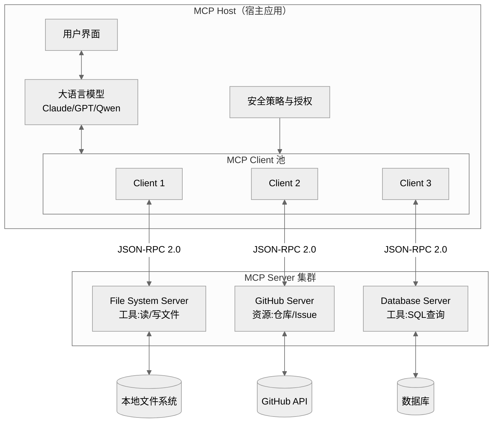
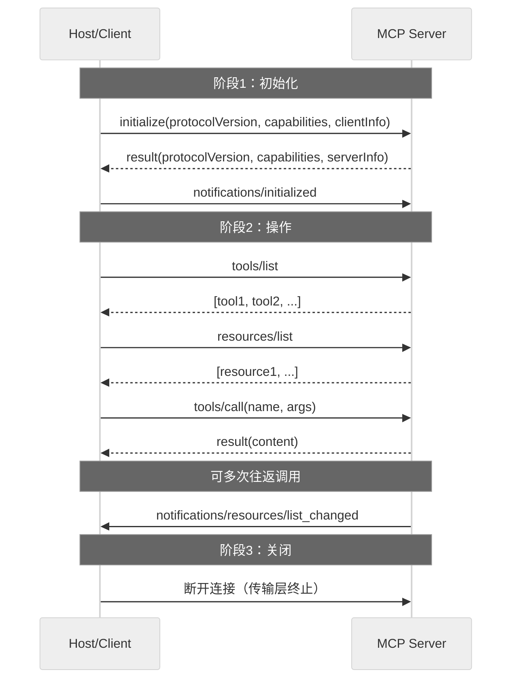
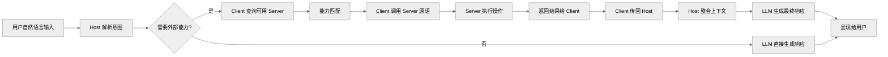
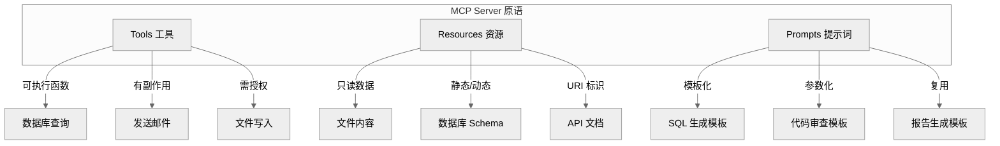
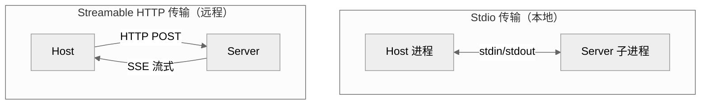
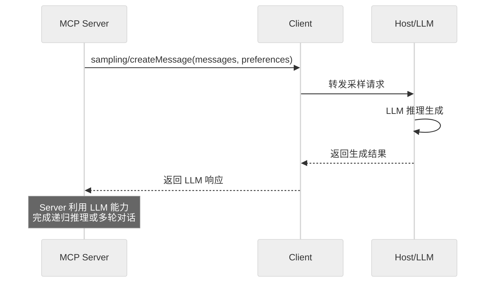
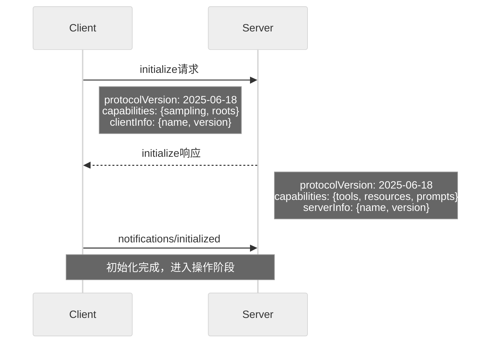
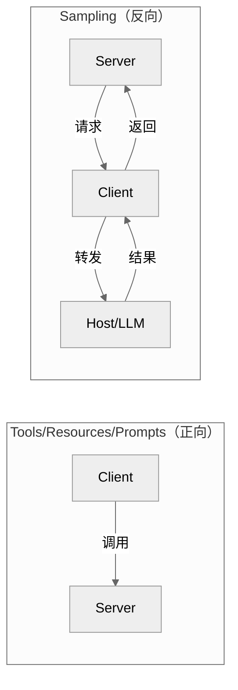
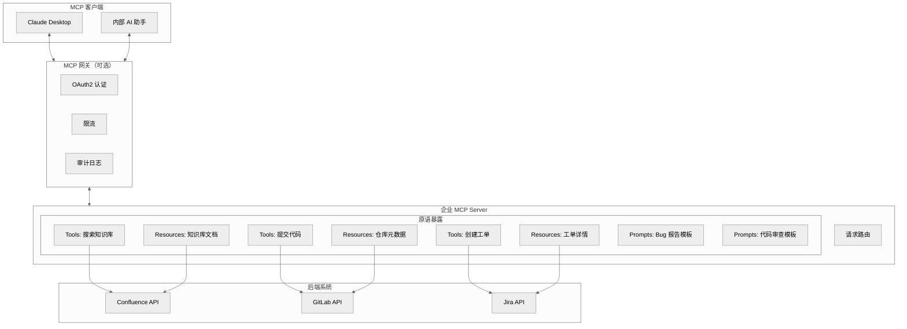

# Model Context Protocol (MCP) 面试题集

> 本文档系统梳理 Model Context Protocol（MCP，模型上下文协议）的核心概念、工作原理、关键技术点、应用场景与常见问题，难度覆盖基础、中级、高级三个层次，题型含选择题、简答题、分析题、设计题，配以架构图、流程图、时序图辅助理解。

---

## 目录

- [Model Context Protocol (MCP) 面试题集](#model-context-protocol-mcp-面试题集)
  - [目录](#目录)
  - [一、MCP 核心概念介绍](#一mcp-核心概念介绍)
    - [1.1 什么是 MCP](#11-什么是-mcp)
    - [1.2 解决的核心问题](#12-解决的核心问题)
    - [1.3 核心设计目标](#13-核心设计目标)
    - [1.4 适用人群](#14-适用人群)
  - [二、MCP 工作原理深度解析](#二mcp-工作原理深度解析)
    - [2.1 三层架构](#21-三层架构)
    - [2.2 协议生命周期](#22-协议生命周期)
    - [2.3 请求处理流程](#23-请求处理流程)
  - [三、关键技术点分析](#三关键技术点分析)
    - [3.1 三大原语（Primitives）](#31-三大原语primitives)
    - [3.2 传输层机制](#32-传输层机制)
    - [3.3 动态发现机制](#33-动态发现机制)
    - [3.4 Sampling 机制](#34-sampling-机制)
    - [3.5 Root 机制](#35-root-机制)
  - [四、面试题及详解](#四面试题及详解)
    - [题目 1：MCP 定义与核心价值（选择题·基础）](#题目-1mcp-定义与核心价值选择题基础)
    - [题目 2：MCP 三大角色架构（简答题·基础）](#题目-2mcp-三大角色架构简答题基础)
    - [题目 3：三大原语识别（选择题·基础）](#题目-3三大原语识别选择题基础)
    - [题目 4：传输方式对比（简答题·中级）](#题目-4传输方式对比简答题中级)
    - [题目 5：初始化与能力协商流程（分析题·中级）](#题目-5初始化与能力协商流程分析题中级)
    - [题目 6：动态发现机制（简答题·中级）](#题目-6动态发现机制简答题中级)
    - [题目 7：Sampling 机制分析（分析题·高级）](#题目-7sampling-机制分析分析题高级)
    - [题目 8：企业级 MCP Server 设计（设计题·高级）](#题目-8企业级-mcp-server-设计设计题高级)
    - [题目 9：安全与权限控制（简答题·高级）](#题目-9安全与权限控制简答题高级)
    - [题目 10：MCP 与 Function Calling 对比（分析题·高级）](#题目-10mcp-与-function-calling-对比分析题高级)
  - [五、考点速查表](#五考点速查表)

---

## 一、MCP 核心概念介绍

### 1.1 什么是 MCP

**Model Context Protocol（MCP，模型上下文协议）** 是由 Anthropic 于 2024 年 11 月发布并开源的标准化协议，基于 JSON-RPC 2.0 构建，用于实现 AI 应用程序与外部数据源、工具之间的**标准化连接**。

MCP 被誉为 **"AI 应用的 USB-C 接口"**：正如 USB-C 为设备连接外设提供了标准化方式，MCP 为 AI 模型连接不同的数据源和工具提供了标准化接口，解决了"每接入一个数据源就要开发一套适配代码"的碎片化问题。

### 1.2 解决的核心问题

| 痛点 | 传统方式 | MCP 方案 |
|------|----------|----------|
| **集成成本高** | 每个数据源单独开发适配代码 | 统一协议，一次开发处处可用 |
| **工具碎片化** | 不同 LLM 框架工具接口不一 | 跨模型、跨平台通用 |
| **上下文割裂** | LLM 难以访问本地/私有数据 | 标准化资源访问 |
| **供应商锁定** | 绑定特定厂商 SDK | 开放标准，厂商中立 |
| **扩展困难** | 新增工具需重新部署 | 动态发现，热插拔 |

### 1.3 核心设计目标

1. **标准化连接**：任何兼容 MCP 的 AI 应用都能以相同方式连接任意 MCP 服务端。
2. **职责分离**：服务端极易构建，复杂编排（安全、授权、上下文聚合）交给宿主。
3. **有状态会话**：支持连接初始化、能力协商、会话生命周期管理。
4. **模型无关**：不绑定特定厂商或模型，支持互操作。

### 1.4 适用人群

- **AI 应用开发者**：构建 LLM 驱动的 Agent、Copilot 应用
- **工具/数据源提供方**：将自有服务暴露给 AI 应用调用
- **企业 IT 架构师**：规划企业级 AI 集成方案
- **大模型平台工程师**：构建支持多工具编排的 AI 平台

---

## 二、MCP 工作原理深度解析

### 2.1 三层架构

MCP 采用 **Host-Client-Server** 三层架构，解耦 AI 应用与后端服务：



**三大角色职责**：

| 角色 | 定位 | 核心职责 | 典型实现 |
|------|------|----------|----------|
| **Host（宿主）** | AI 应用本体 | 管理 Client 实例、执行安全策略、协调 LLM 集成与采样 | Claude Desktop、Cursor、VS Code |
| **Client（客户端）** | 中间件 | 协议协商、消息路由、能力交换、维护安全边界 | 内嵌于 Host，每 Server 对应一个 Client |
| **Server（服务端）** | 能力提供方 | 暴露 Tools/Resources/Prompts 三类原语，执行具体逻辑 | 文件系统 Server、GitHub Server 等 |

### 2.2 协议生命周期

MCP 是**有状态协议**，会话分为三个阶段：



### 2.3 请求处理流程

当用户以自然语言提出请求时，MCP 的完整处理流程：



---

## 三、关键技术点分析

### 3.1 三大原语（Primitives）

MCP Server 通过三类原语向 Client 暴露能力：



| 原语 | 定位 | 特性 | 访问方法 | 典型场景 |
|------|------|------|----------|----------|
| **Tools（工具）** | 可执行函数 | 有副作用、需授权 | `tools/list`、`tools/call` | 数据库写入、发邮件、API 调用 |
| **Resources（资源）** | 只读数据源 | 无副作用、URI 标识 | `resources/list`、`resources/read` | 文件读取、数据库 Schema、日志 |
| **Prompts（提示词）** | 对话模板 | 参数化、可复用 | `prompts/list`、`prompts/get` | SQL 生成、代码审查、报告模板 |

### 3.2 传输层机制

MCP 支持两种官方传输方式：



| 维度 | Stdio | Streamable HTTP |
|------|-------|-----------------|
| **通信方式** | 标准输入/输出流 | HTTP POST + SSE |
| **部署位置** | 本地同机 | 远程跨网络 |
| **性能** | 极低延迟（内核缓冲区） | 有网络开销 |
| **客户端数** | 1 对 1 | 多客户端 |
| **认证** | 无需（进程隔离） | OAuth/Bearer Token |
| **适用场景** | 本地文件、IDE 插件、CLI | 云端服务、多租户 |
| **消息分帧** | `\n` 分隔 JSON 文本帧 | HTTP 响应体 |

> **注意**：早期规范中的 HTTP+SSE 传输已于 2025 年 3 月标记为弃用，新项目应使用 Streamable HTTP。

### 3.3 动态发现机制

MCP 的核心创新之一是**动态发现**，允许 AI 模型实时发现并集成新工具，无需预定义代码：

1. **工具级发现**：Client 调用 `tools/list` 获取工具元数据（名称、参数、描述）。
2. **服务级发现**：通过 URI 解析远程服务元数据，自动配置调用权限。
3. **变更通知**：Server 新增工具时通过 `notifications/tools/list_changed` 通知 Client 刷新。

### 3.4 Sampling 机制

Client 向 Server 提供的**反向能力**——Server 可主动请求 Host 调用大模型：



**应用场景**：
- Server 需要LLM 对查询结果做摘要后再返回
- 多 Agent 协作中，Server 侧需触发推理
- 工具执行结果需要 LLM 二次加工

### 3.5 Root 机制

Client 可向 Server 暴露**受限的文件系统视图**，便于 Server 识别可操作的目录与文件：

```json
{
  "roots": [
    { "uri": "file:///projects/myapp", "name": "My App" },
    { "uri": "file:///docs/specs", "name": "Specs" }
  ]
}
```

Server 仅能访问 Root 声明的目录，形成安全沙箱。

---

## 四、面试题及详解

### 题目 1：MCP 定义与核心价值（选择题·基础）

**难度**：基础　**类型**：选择题

**问题描述**：
关于 Model Context Protocol（MCP），以下说法**错误**的是（　　）

A. MCP 是由 Anthropic 于 2024 年 11 月发布的开源协议
B. MCP 基于 JSON-RPC 2.0 构建，用于标准化 LLM 与外部数据源的连接
C. MCP 绑定 Claude 模型，不兼容其他大模型
D. MCP 被誉为"AI 应用的 USB-C 接口"

**参考答案**：**C**

**解析**：
- A 正确：MCP 由 Anthropic 于 2024 年 11 月底发布并开源。
- B 正确：MCP 基于 JSON-RPC 2.0 规范。
- C **错误**：MCP 是**模型无关**的开放标准，不绑定特定厂商或模型。Claude、GPT、Qwen 等均可通过实现 MCP 协议实现互操作。
- D 正确：官方用"USB-C 接口"类比 MCP 的标准化价值。

**评分标准**：选对得 2 分；能说明 C 错误原因加 1 分（满分 3）。

**项目实例**：
- **项目背景**：某金融科技公司构建智能投顾助手，需对接行情数据、研报库、交易系统三类数据源。
- **技术选型理由**：原方案为每个数据源写独立适配代码，新增数据源需 2 周开发；选 MCP 因其标准化协议一次开发处处可用，将接入成本从 2 周降至 2 天。
- **实现步骤**：①行情 Server 用 Python FastMCP 暴露 `get_quote` 工具；②研报 Server 暴露 `search_report` 资源；③交易 Server 暴露 `place_order` 工具（需授权）；④Claude Desktop 作为 Host 同时连接三个 Server。
- **遇到的挑战**：早期团队误以为 MCP 仅支持 Claude，导致迟迟未推进。
- **解决方案**：调研发现 MCP 是模型无关开放标准，内部 AI 助手（基于 Qwen）也可接入，最终统一采用 MCP。

---

### 题目 2：MCP 三大角色架构（简答题·基础）

**难度**：基础　**类型**：简答题

**问题描述**：
请描述 MCP 的 Host-Client-Server 三层架构，说明各角色的职责与典型实现。

**参考答案**：

| 角色 | 职责 | 典型实现 |
|------|------|----------|
| **Host（宿主）** | 运行 LLM 的 AI 应用，管理 Client 实例、执行安全策略、协调 LLM 集成与采样 | Claude Desktop、Cursor、VS Code |
| **Client（客户端）** | 由 Host 创建，与特定 Server 维持隔离连接，处理协议协商、消息路由、能力交换 | 内嵌于 Host，每 Server 对应一个 Client |
| **Server（服务端）** | 暴露 Tools/Resources/Prompts 三类原语，执行具体逻辑，遵守安全限制 | 文件系统 Server、GitHub Server、数据库 Server |

**关键设计原则**：
1. **一对一隔离**：每个 Client 与一个 Server 维持独立连接，避免跨 Server 状态污染。
2. **职责分离**：Server 极易构建（只需暴露原语），复杂编排交给 Host。
3. **安全边界**：Client 在 Server 间维持安全边界，防止越权访问。

**评分标准**：三角色职责各 1 分；设计原则 1 分；典型实现 1 分（满分 5）。

**项目实例**：
- **项目背景**：某 DevOps 团队构建 AI 运维助手，需对接 GitLab、Jenkins、K8s 三类系统，供开发同学在 Cursor IDE 内自然语言操作。
- **技术选型理由**：采用 Host-Client-Server 架构可将运维系统能力与 IDE 解耦，未来更换 IDE 不影响 Server 复用。
- **实现步骤**：①Cursor 作为 Host，内置 MCP Client；②为 GitLab、Jenkins、K8s 各写一个 Server，分别暴露 `create_mr`、`trigger_build`、`scale_deploy` 工具；③每个 Server 作为独立子进程通过 Stdio 连接 Cursor 的 Client。
- **遇到的挑战**：初期把所有工具堆在一个 Server 中，导致单 Server 重启影响全部能力。
- **解决方案**：按系统拆分为 3 个独立 Server，每个 Client 对应一个 Server，实现故障隔离，GitLab Server 重启不影响 Jenkins 工具可用。

---

### 题目 3：三大原语识别（选择题·基础）

**难度**：基础　**类型**：选择题

**问题描述**：
以下 MCP 原语中，**有副作用且需要用户授权**的是（　　）

A. Resources　　B. Tools　　C. Prompts　　D. Roots

**参考答案**：**B**

**解析**：
- A Resources：**只读**数据源，无副作用。
- B Tools：**可执行函数**，有副作用（如写数据库、发邮件），**必须用户授权**。
- C Prompts：对话模板，无副作用。
- D Roots：Client 向 Server 暴露的文件系统视图，非 Server 原语。

| 原语 | 副作用 | 授权要求 | 访问方法 |
|------|--------|----------|----------|
| Resources | ❌ 只读 | 通常无需 | `resources/list`、`resources/read` |
| Tools | ✅ 有 | ✅ 必须 | `tools/list`、`tools/call` |
| Prompts | ❌ 无 | 通常无需 | `prompts/list`、`prompts/get` |

**评分标准**：选对得 2 分；能列出三大原语特性对比加 2 分（满分 4）。

**项目实例**：
- **项目背景**：某企业知识库助手需让 LLM 既能查询文档又能编辑文档还能按模板生成报告。
- **技术选型理由**：正确区分三大原语特性是设计安全 Server 的前提——只读操作用 Resources 无需授权，写操作用 Tools 必须授权，模板化生成用 Prompts 提升复用。
- **实现步骤**：①`resources/read` 暴露 `wiki://docs/{id}` 只读资源，LLM 可直接读无需授权；②`tools/call` 暴露 `edit_doc` 写工具，调用时 Host 弹窗确认；③`prompts/get` 暴露 `weekly_report` 模板，LLM 按模板生成周报。
- **遇到的挑战**：初期误把"查询文档"也做成 Tool，导致每次查询都弹确认框，用户体验差。
- **解决方案**：将只读查询改为 Resources 原语，无副作用免授权，查询流畅度提升 80%；仅 `edit_doc` 保留为 Tool 触发确认。

---

### 题目 4：传输方式对比（简答题·中级）

**难度**：中级　**类型**：简答题

**问题描述**：
请对比 MCP 的两种官方传输方式 Stdio 与 Streamable HTTP，说明各自的工作原理、优缺点与适用场景。

**参考答案**：

| 维度 | Stdio | Streamable HTTP |
|------|-------|-----------------|
| **工作原理** | Host 启动 Server 为子进程，通过 stdin 发送请求、stdout 接收响应 | Host 通过 HTTP POST 发送请求，Server 通过 SSE 流式返回 |
| **消息分帧** | `\n` 分隔 JSON 文本帧，`Content-Length` 头防粘包 | HTTP 响应体承载 JSON-RPC |
| **部署位置** | 本地同机 | 远程跨网络 |
| **性能** | 极低延迟（仅跨内核缓冲区） | 有网络开销 |
| **客户端数** | 1 对 1（单 Server 服务单 Client） | 多客户端共享 |
| **认证** | 无需（进程隔离天然安全） | OAuth / Bearer Token / API Key |
| **优点** | 零网络开销、部署简单、不暴露端口 | 支持远程访问、多租户、标准 HTTP 基础设施 |
| **缺点** | 仅限本地、难扩展 | 网络延迟、需认证安全 |
| **适用场景** | IDE 插件、CLI 工具、桌面 Agent | 云端服务、企业级部署、SaaS 集成 |

**选型建议**：
- 本地开发/桌面应用 → **Stdio**（零配置、高性能）
- 云端服务/多租户 → **Streamable HTTP**（可远程访问、可扩展）

> **注意**：早期 HTTP+SSE 传输已于 2025 年 3 月弃用，新项目应使用 Streamable HTTP。

**评分标准**：对比维度≥6 项得 3 分；选型建议 1 分；弃用说明 1 分（满分 5）。

**项目实例**：
- **项目背景**：某 SaaS 公司构建代码审查助手，需同时服务本地开发者（Cursor IDE）和远程 Web 端用户。
- **技术选型理由**：本地场景追求零配置高性能选 Stdio，远程场景需多租户共享选 Streamable HTTP。
- **实现步骤**：①本地场景：Server 打包为 `npx @company/code-review-mcp`，Cursor 通过 Stdio 启动子进程，零网络开销；②远程场景：Server 部署在 K8s，通过 `https://mcp.company.com` 暴露，Web 端用 OAuth2 Bearer Token 认证；③同一份 Server 代码通过 FastMCP 同时支持两种传输。
- **遇到的挑战**：早期远程场景用了已弃用的 HTTP+SSE 传输，部分客户端兼容性差。
- **解决方案**：迁移到 Streamable HTTP，利用标准 HTTP 基础设施（CDN、负载均衡），兼容性提升至 100%，同时弃用旧端点。

---

### 题目 5：初始化与能力协商流程（分析题·中级）

**难度**：中级　**类型**：分析题

**问题描述**：
请结合时序图，分析 MCP 协议的初始化阶段流程，说明能力协商的作用与版本兼容性处理机制。

**参考答案**：



**流程分析**：

1. **Client 发送 initialize 请求**：
   - `protocolVersion`：声明 Client 支持的协议版本（如 `2025-06-18`）。
   - `capabilities`：声明 Client 能提供的能力（如 `sampling`、`roots`）。
   - `clientInfo`：Client 名称与版本。

2. **Server 响应**：
   - 返回 Server 支持的协议版本与能力声明。
   - 若版本不兼容，应返回错误并终止连接。

3. **Client 发送 initialized 通知**：
   - 确认能力协商完成，进入操作阶段。
   - 此后双方可在协商能力范围内通信。

**能力协商的作用**：
- **版本兼容**：双方协商出共同支持的协议版本，避免不兼容。
- **能力发现**：Client 知道 Server 能提供哪些原语，Server 知道 Client 能提供 Sampling/Roots。
- **按需启用**：未声明的能力不会被调用，降低误用风险。

**版本不兼容处理**：
- 若 Client 与 Server 无法协商出共同版本，Client 应**终止连接**。
- 建议采用"向后兼容"策略：新版本 Server 兼容旧版本 Client 的请求。

**评分标准**：时序图正确 2 分；流程三步骤 1.5 分；能力协商作用 1 分；版本兼容处理 1 分（满分 5.5）。

**项目实例**：
- **项目背景**：某企业自研 AI 平台需同时对接 Claude Desktop（协议版本 2025-06-18）和旧版内部助手（协议版本 2024-11-05）。
- **技术选型理由**：能力协商机制让 Server 能同时服务新老客户端，无需为每个版本单独部署。
- **实现步骤**：①Server 在 `initialize` 响应中声明支持多版本；②Client A（新版）协商得到 `sampling` 能力，可触发 LLM 推理；③Client B（旧版）协商仅获得 `tools` 能力，不支持 Sampling；④Server 根据协商结果决定是否暴露高级能力。
- **遇到的挑战**：旧版客户端发送 `roots` 能力声明但 Server 未实现，导致协议错误。
- **解决方案**：Server 端做能力降级处理——未声明的能力不调用，收到不认识的能力声明时忽略而非报错，实现向后兼容。

---

### 题目 6：动态发现机制（简答题·中级）

**难度**：中级　**类型**：简答题

**问题描述**：
MCP 的动态发现机制是什么？它解决了什么问题？请说明工具级发现与服务级发现的区别，并给出代码示例。

**参考答案**：

**动态发现**是 MCP 的核心创新，允许 AI 模型**实时发现并集成新工具**，无需预定义代码或重新部署。

**解决的问题**：
- 传统 API 集成需为每个工具预先编码适配，扩展困难。
- MCP 通过运行时查询 Server 能力，实现工具"热插拔"。

**两层发现机制**：

| 层级 | 机制 | 触发方式 |
|------|------|----------|
| **工具级发现** | Client 调用 `tools/list` 获取工具元数据 | 主动查询 |
| **服务级发现** | 通过 URI 解析远程服务元数据端点 | URI 驱动 |
| **变更通知** | Server 通过 `notifications/tools/list_changed` 通知 Client | 事件驱动 |

**代码示例**：

```python
# 工具级发现：Client 主动查询
tools = await session.list_tools()
# 返回: [{"name": "sql_query", "description": "...", "inputSchema": {...}}]

# 调用发现的工具
result = await session.call_tool("sql_query", {"query": "SELECT * FROM users"})

# Server 端声明工具（Python FastMCP）
from fastmcp import FastMCP

mcp = FastMCP("my-server")

@mcp.tool()
def sql_query(query: str) -> str:
    """执行 SQL 查询并返回结果"""
    return execute_sql(query)

# 变更通知：Server 新增工具后
await session.send_notification("notifications/tools/list_changed")
# Client 收到后重新调用 tools/list 刷新
```

**评分标准**：动态发现定义 1 分；解决的问题 1 分；两层机制对比 2 分；代码示例 1 分（满分 5）。

**项目实例**：
- **项目背景**：某科技公司插件化 AI 平台，第三方开发者可上传 MCP Server 扩展能力，需支持工具热插拔不停机。
- **技术选型理由**：传统 Function Calling 需重新部署才能新增工具，动态发现机制让 Server 更新后 Client 自动感知，实现热插拔。
- **实现步骤**：①平台启动时 Client 调用 `tools/list` 发现初始工具集；②第三方上传新 Server 后，平台注册新 Client 连接；③新 Server 通过 `notifications/tools/list_changed` 通知 Client 刷新工具列表；④LLM 下次调用即可发现新工具，无需重启 Host。
- **遇到的挑战**：工具列表频繁变更导致 LLM 上下文膨胀，Token 消耗激增。
- **解决方案**：①Client 侧做工具列表缓存，仅在收到 `list_changed` 通知时刷新；②按用户意图过滤相关工具（如仅暴露"代码"类工具给代码场景），将 Token 消耗降低 60%。

---

### 题目 7：Sampling 机制分析（分析题·高级）

**难度**：高级　**类型**：分析题

**问题描述**：
MCP 的 Sampling 机制是什么？它与 Tools 的调用方向有何不同？请分析其工作流程并说明典型应用场景。为什么说 Sampling 体现了 MCP 的"双向能力交换"设计？

**参考答案**：

**Sampling 定义**：Sampling 是 Client 向 Server 提供的**反向能力**——Server 可主动请求 Host 调用大模型生成文本，支持多轮对话、递归推理等复杂处理。

**调用方向对比**：



| 维度 | Tools/Resources/Prompts | Sampling |
|------|-------------------------|----------|
| **调用方向** | Client → Server | Server → Client |
| **发起方** | Client（代表用户意图） | Server（需 LLM 能力） |
| **能力提供方** | Server | Client（转发给 Host LLM） |
| **典型用途** | 执行工具、读数据 | Server 侧需 LLM 推理 |

**工作流程**：
1. Server 在执行过程中需要 LLM 能力，调用 `sampling/createMessage`。
2. Client 接收请求，转发给 Host。
3. Host 调用 LLM 生成响应。
4. Client 将 LLM 结果返回给 Server。
5. Server 利用该结果继续后续逻辑。

**典型应用场景**：
- **结果摘要**：Server 查询数据库后，需 LLM 对结果做自然语言摘要再返回。
- **递归推理**：Server 根据初步结果决定下一步操作，需 LLM 判断。
- **多 Agent 协作**：Server 侧 Agent 需触发另一轮 LLM 推理。
- **工具结果加工**：原始工具输出需 LLM 二次加工（如翻译、格式化）。

**双向能力交换设计**：
- 正向：Server 向 Client 暴露工具/资源能力。
- 反向：Client 向 Server 提供 LLM 推理能力（Sampling）。
- 这种双向交换使 Server 能构建**自包含的智能工作流**，无需依赖外部 LLM 调用。

**安全考量**：
- Sampling 请求必须经 Host 确认，避免 Server 滥用 LLM。
- Host 可限制 Sampling 调用频率、Token 消耗。

**评分标准**：Sampling 定义 1 分；调用方向对比 2 分；工作流程 1.5 分；应用场景 1.5 分；双向设计分析 1 分（满分 7）。

**项目实例**：
- **项目背景**：某法律科技公司构建合同审查 MCP Server，需对检索到的法条做 LLM 摘要后再返回给用户，但 Server 本身无 LLM 能力。
- **技术选型理由**：Sampling 机制让 Server 反向调用 Host 的 LLM，避免 Server 自建模型推理服务，降低成本与复杂度。
- **实现步骤**：①Server 调用 `search_law` 工具检索相关法条；②Server 调用 `sampling/createMessage` 请求 Host LLM 对法条做摘要；③Host 转发给 LLM 生成"本案适用条款摘要"；④Server 将摘要附加到工具结果返回给 Client。
- **遇到的挑战**：Server 滥用 Sampling 导致 LLM 调用费用激增（单次审查触发 10+ 次采样）。
- **解决方案**：①Host 侧设置 Sampling 频率上限（每次会话≤3 次）；②Server 侧改为批量摘要（一次 Sampling 处理多条法条）；③引入缓存，相同法条的摘要不重复采样，费用降低 70%。

---

### 题目 8：企业级 MCP Server 设计（设计题·高级）

**难度**：高级　**类型**：设计题

**问题描述**：
某企业需构建一个企业级 MCP Server，对接内部知识库（Confluence）、代码仓库（GitLab）和工单系统（Jira），供 Claude Desktop 和内部 AI 助手调用。请设计完整方案，包括：
1. 架构设计与原语规划；
2. 传输方式选型与认证方案；
3. 安全与权限控制；
4. 性能优化策略。

**参考答案**：

**1. 架构设计**



**2. 传输方式选型与认证**

| 场景 | 传输方式 | 认证方案 | 理由 |
|------|----------|----------|------|
| Claude Desktop（本地） | Stdio | 进程隔离 + 本地 Token | 零配置、高性能 |
| 内部 AI 助手（远程） | Streamable HTTP | OAuth2 + Bearer Token | 支持多租户、可审计 |

**3. 安全与权限控制**

| 层级 | 措施 | 实现 |
|------|------|------|
| **传输层** | TLS 加密 | HTTPS/WSS |
| **认证层** | OAuth2 授权码模式 | 短期 Token + 刷新机制 |
| **授权层** | RBAC 角色权限 | 按用户角色限制可调用原语 |
| **操作层** | 高风险操作确认 | 写操作需 Host 弹窗用户确认 |
| **审计层** | 全量操作日志 | 记录调用者、时间、参数、结果 |
| **数据层** | 敏感数据脱敏 | 返回前过滤密钥、凭证字段 |

**4. 性能优化策略**

| 策略 | 实现 | 收益 |
|------|------|------|
| **连接池** | 复用与后端 API 的 HTTP 连接 | 减少握手开销 |
| **缓存** | 对只读 Resources 做 TTL 缓存 | 降低后端压力 |
| **分页** | 大结果集分页返回 | 避免单次传输过大 |
| **异步流式** | 长任务用 SSE 流式返回进度 | 提升用户体验 |
| **索引预热** | 启动时预加载常用知识库索引 | 降低首次查询延迟 |
| **限流** | 按 Client 限流调用频率 | 防止滥用 |

**评分标准**：架构图与原语规划 2.5 分；传输与认证 1.5 分；安全措施≥4 项 2 分；性能优化≥3 项 1 分（满分 7）。

**项目实例**：
- **项目背景**：某大型企业落地内部 AI 助手"小智"，需对接 Confluence（5 万篇文档）、GitLab（200+ 仓库）、Jira（日均 300 工单），服务 8000 员工。
- **技术选型理由**：企业级场景需多系统统一接入、细粒度权限、可审计，MCP 标准化协议 + 网关架构是最优解。
- **实现步骤**：
  1. **架构分层**：前端 Claude Desktop / 内部 Web 助手 → MCP 网关（OAuth2 + 限流 + 审计）→ 三个独立 MCP Server → 后端系统。
  2. **原语规划**：
     - Confluence Server：`search_docs` 工具 + `wiki://doc/{id}` 资源 + `meeting_minutes` 提示词模板。
     - GitLab Server：`create_mr` 工具 + `repo://metadata` 资源 + `code_review` 模板。
     - Jira Server：`create_ticket` 工具 + `jira://ticket/{id}` 资源 + `bug_report` 模板。
  3. **认证方案**：远程访问走 OAuth2 授权码模式，Token 有效期 1 小时；本地 Claude Desktop 走 Stdio + 进程隔离。
  4. **权限控制**：按角色 RBAC 限制——普通员工只能查询，TL 可创建工单，管理员可提交 MR。
- **遇到的挑战**：
  1. Confluence 文档量大，首次 `search_docs` 延迟超 8 秒。
  2. 跨部门调用 Jira 创建工单出现越权操作。
  3. 高峰期 Server 并发压力大，单个 Server 阻塞影响全局。
- **解决方案**：
  1. **性能优化**：对 Confluence 建立向量索引预热，常用文档缓存 TTL=10 分钟，查询延迟降至 1.2 秒；长结果分页返回。
  2. **权限加固**：在网关层增加 RBAC 校验，Jira `create_ticket` 工具调用前校验用户角色，越权请求直接拒绝并记录审计日志。
  3. **高可用**：每个 Server 部署 3 副本 + K8s HPA 自动扩缩容，单个 Server 故障不影响其他；网关侧做健康检查与故障转移。
- **最终效果**：上线后员工平均工单创建时间从 5 分钟降至 30 秒，文档检索效率提升 4 倍，月活用户 6000+，零安全事故。

---

### 题目 9：安全与权限控制（简答题·高级）

**难度**：高级　**类型**：简答题

**问题描述**：
MCP 在安全与权限控制方面有哪些核心机制？请列举至少 5 项，并说明企业在落地 MCP 时应额外补充哪些安全措施。

**参考答案**：

**MCP 内置安全机制**：

| 机制 | 说明 |
|------|------|
| **本地化执行** | Stdio 传输下 Server 运行在本地，避免敏感数据外泄网络 |
| **操作确认** | 高风险操作（如删除文件、写数据库）需用户手动授权 |
| **Root 沙箱** | Client 仅向 Server 暴露受限文件系统视图，防止越权访问 |
| **能力协商** | 初始化阶段声明能力边界，未声明能力不可调用 |
| **Sampling 确认** | Server 请求 LLM 推理须经 Host 确认，防止滥用 |
| **传输加密** | Streamable HTTP 支持 TLS，OAuth2 认证 |
| **协议无状态资源** | Resources 只读无副作用，降低误操作风险 |

**企业额外补充措施**：

1. **RBAC 角色权限模型**：按用户角色（管理员/开发者/访客）限制可调用原语。
2. **全量审计日志**：记录调用者、时间、参数、结果，满足合规要求。
3. **敏感数据脱敏**：返回前过滤密钥、凭证、PII 字段。
4. **调用频率限流**：按 Client/User 维度限流，防止滥用与 DDoS。
5. **代码审查 Server**：企业自建 Server 需安全扫描，防止恶意代码注入。
6. **网络隔离**：MCP Server 部署在内网，通过 API Gateway 暴露给外部。
7. **Token 短期有效**：OAuth2 Token 有效期≤1 小时，支持刷新。
8. **工具白名单**：仅允许预审核的工具上线，禁止动态加载未审查 Server。

**评分标准**：内置机制≥5 项 2.5 分；企业补充措施≥4 项 2.5 分（满分 5）。

**项目实例**：
- **项目背景**：某医疗科技公司构建病历分析 MCP Server，对接电子病历系统，需严格遵守 HIPAA 合规要求，防止患者隐私泄露。
- **技术选型理由**：医疗场景对数据安全要求极高，MCP 内置的 Root 沙箱 + 操作确认机制 + 企业级 RBAC 是满足合规的基础。
- **实现步骤**：
  1. **Root 沙箱**：Client 仅向 Server 暴露 `/data/patients/authorized` 目录，Server 无法访问其他目录。
  2. **操作确认**：`query_record` 工具调用时 Host 弹窗"确认查询患者 ID P123 的病历？"，医生手动确认后才执行。
  3. **RBAC 权限**：实习医生只能查询，主治医生可创建处方，管理员可导出报表。
  4. **数据脱敏**：返回病历前自动过滤 SSN、身份证号等 PII 字段，替换为 `***`。
  5. **全量审计**：每次工具调用记录医生 ID、患者 ID、时间、操作类型，留存 6 年。
- **遇到的挑战**：
  1. 实习医生误调 `export_report` 工具试图导出全院病历。
  2. Server 返回的病历原文包含患者手机号，差点泄露。
  3. 第三方 MCP Server 被发现偷偷上传数据到外部服务器。
- **解决方案**：
  1. **工具白名单**：在网关层限制实习医生角色仅能调用 `query_record`，`export_report` 调用被 RBAC 拦截并告警。
  2. **脱敏增强**：在 Server 返回层增加正则脱敏过滤器，自动识别并掩码手机号、邮箱、身份证号，通过合规审计。
  3. **Server 审查**：建立第三方 Server 安全扫描流程，上线前做代码审查 + 沙箱运行监控网络请求，恶意 Server 被拦截禁止接入。
- **最终效果**：系统通过 HIPAA 合规审计，零数据泄露事件，医生效率提升 3 倍。

---

### 题目 10：MCP 与 Function Calling 对比（分析题·高级）

**难度**：高级　**类型**：分析题

**问题描述**：
请从架构、协议、动态性、安全、适用场景等维度，对比 MCP 与传统 LLM Function Calling 的区别，并分析 MCP 的优势与局限。

**参考答案**：

| 维度 | Function Calling | MCP |
|------|------------------|-----|
| **架构** | LLM 直接调用预定义函数 | Host-Client-Server 三层解耦 |
| **协议** | 各厂商私有（OpenAI/Anthropic 格式不同） | 基于 JSON-RPC 2.0 的开放标准 |
| **工具定义** | 代码中硬编码，静态 | 运行时动态发现，支持热插拔 |
| **模型兼容** | 绑定特定 LLM 厂商 | 模型无关，跨厂商通用 |
| **状态管理** | 无状态，每次调用独立 | 有状态会话，支持上下文 |
| **安全控制** | 依赖应用层自行实现 | 协议内置确认、Root 沙箱、能力协商 |
| **扩展方式** | 新增工具需改代码重新部署 | Server 独立部署，Client 动态发现 |
| **通信方向** | 单向（LLM → 工具） | 双向（Tools 正向 + Sampling 反向） |
| **传输方式** | 进程内函数调用 | Stdio / Streamable HTTP |
| **生态** | 厂商各自生态 | 开放标准，跨生态互操作 |

**MCP 的优势**：
1. **标准化**：一次开发，处处可用，降低集成成本。
2. **动态性**：运行时发现工具，无需重新部署。
3. **模型无关**：不绑定厂商，避免锁定。
4. **双向能力交换**：Server 可反向请求 LLM 推理。
5. **安全内置**：协议层支持确认、沙箱、能力协商。

**MCP 的局限**：
1. **协议开销**：相比进程内函数调用，JSON-RPC 序列化有性能损耗。
2. **生态成熟度**：相比 Function Calling 已广泛落地，MCP 生态仍在发展中。
3. **调试复杂度**：三层架构增加排查链路。
4. **学习曲线**：开发者需理解协议、原语、传输等概念。

**选型建议**：
- **单模型、单应用、简单工具** → Function Calling（简单直接）
- **多模型、多工具、企业级、需跨生态** → MCP（标准化、可扩展）

**评分标准**：对比维度≥8 项 3 分；MCP 优势 2 分；局限 1 分；选型建议 1 分（满分 7）。

**项目实例**：
- **项目背景**：某 AI 创业公司初期用 OpenAI Function Calling 构建客服助手，后因业务扩展需同时支持 GPT、Claude、Qwen 三家模型，且工具数量从 5 个增长到 30 个。
- **技术选型理由**：Function Calling 各厂商格式不兼容（OpenAI 与 Anthropic 的 tools schema 不同），每新增模型需重写工具适配；MCP 模型无关 + 动态发现，一次开发处处可用。
- **实现步骤**：
  1. **迁移前（Function Calling）**：5 个工具 × 3 家模型 = 15 套适配代码，新增工具需改 3 处代码并重新部署。
  2. **迁移后（MCP）**：30 个工具统一封装为 6 个 MCP Server，3 家模型通过各自 Host 接入同一套 Server，新增工具只需在 Server 侧注册。
  3. **关键对比**：
     - 开发成本：Function Calling 新增工具需 3 人天 × 3 模型 = 9 人天；MCP 仅需 1 人天。
     - 部署效率：Function Calling 需重新部署 3 个应用；MCP Server 独立部署，Client 动态发现无需重启。
     - 状态管理：Function Calling 无状态；MCP 支持有状态会话，客服上下文连续。
- **遇到的挑战**：
  1. 迁移初期团队不熟悉 MCP 协议，开发速度慢。
  2. MCP 相比进程内函数调用有 JSON-RPC 序列化开销，单次调用延迟增加 5-10ms。
  3. 三层架构增加调试链路，问题定位变难。
- **解决方案**：
  1. **培训与模板**：用 FastMCP 框架降低开发门槛，提供内部 Server 模板，新工具开发提速 3 倍。
  2. **性能优化**：对高频工具（如 `query_order`）在 Client 侧做本地缓存，减少 RPC 调用；Stdio 传输下延迟可接受。
  3. **可观测性**：在 MCP 网关层增加全链路追踪（trace_id 透传），结合日志聚合，问题定位时间从 30 分钟降至 5 分钟。
- **最终效果**：迁移后工具接入成本降低 80%，支持模型数从 1 扩展到 3，新工具上线周期从 2 周缩短至 2 天，月节省开发成本约 15 万元。

---

## 五、考点速查表

| 题号 | 类型 | 难度 | 考点 | 满分 |
|------|------|------|------|------|
| 1 | 选择题 | 基础 | MCP 定义、模型无关性 | 3 |
| 2 | 简答题 | 基础 | Host-Client-Server 三层架构 | 5 |
| 3 | 选择题 | 基础 | 三大原语特性（Tools 有副作用） | 4 |
| 4 | 简答题 | 中级 | Stdio vs Streamable HTTP 传输 | 5 |
| 5 | 分析题 | 中级 | 初始化与能力协商流程 | 5.5 |
| 6 | 简答题 | 中级 | 动态发现机制（工具级/服务级） | 5 |
| 7 | 分析题 | 高级 | Sampling 反向能力与双向设计 | 7 |
| 8 | 设计题 | 高级 | 企业级 MCP Server 设计 | 7 |
| 9 | 简答题 | 高级 | 安全与权限控制 | 5 |
| 10 | 分析题 | 高级 | MCP vs Function Calling 对比 | 7 |

**面试官建议**：
- **初级岗位**：重点考察题 1、2、3，要求概念清晰、能识别三大原语。
- **中级岗位**：增加题 4、5、6，要求理解传输机制与动态发现。
- **高级岗位**：重点考察题 7、8、9、10，要求能设计企业级方案、理解双向能力与安全。
