# Model Context Protocol (MCP) 面试题集

> 本文档系统梳理 Model Context Protocol（MCP，模型上下文协议）的核心概念、工作原理、关键技术点、应用场景与常见问题，难度覆盖基础、中级、高级三个层次，题型含选择题、简答题、分析题、设计题，配以架构图、流程图、时序图辅助理解。

---

## 目录

- [Model Context Protocol (MCP) 面试题集](#model-context-protocol-mcp-面试题集)
  - [目录](#目录)
  - [一、MCP 核心概念介绍](#一mcp-核心概念介绍)
    - [1.1 什么是 MCP](#11-什么是-mcp)
    - [1.2 解决的核心问题](#12-解决的核心问题)
    - [1.3 核心设计目标](#13-核心设计目标)
    - [1.4 适用人群](#14-适用人群)
  - [二、MCP 工作原理深度解析](#二mcp-工作原理深度解析)
    - [2.1 三层架构](#21-三层架构)
    - [2.2 协议生命周期](#22-协议生命周期)
    - [2.3 请求处理流程](#23-请求处理流程)
  - [三、关键技术点分析](#三关键技术点分析)
    - [3.1 三大原语（Primitives）](#31-三大原语primitives)
    - [3.2 传输层机制](#32-传输层机制)
    - [3.3 动态发现机制](#33-动态发现机制)
    - [3.4 Sampling 机制](#34-sampling-机制)
    - [3.5 Root 机制](#35-root-机制)
  - [四、MCP Server 详解](#四mcp-server-详解)
    - [4.1 MCP Server 设计原则](#41-mcp-server-设计原则)
    - [4.2 MCP Server 工作原理](#42-mcp-server-工作原理)
      - [4.2.1 主要功能实现机制](#421-主要功能实现机制)
      - [4.2.2 Server 运行流程](#422-server-运行流程)
      - [4.2.3 原语注册与执行机制](#423-原语注册与执行机制)
    - [4.3 MCP Server 三层架构](#43-mcp-server-三层架构)
      - [4.3.1 表示层（Presentation Layer）](#431-表示层presentation-layer)
      - [4.3.2 业务逻辑层（Business Logic Layer）](#432-业务逻辑层business-logic-layer)
      - [4.3.3 数据访问层（Data Access Layer）](#433-数据访问层data-access-layer)
      - [4.3.4 三层交互方式](#434-三层交互方式)
  - [五、MCP 核心基础能力实现：工具管理与资源管理](#五mcp-核心基础能力实现工具管理与资源管理)
    - [5.1 工具管理（Tool Management）](#51-工具管理tool-management)
      - [5.1.1 工具能力类型划分](#511-工具能力类型划分)
      - [5.1.2 工具注册与元数据管理](#512-工具注册与元数据管理)
      - [5.1.3 工具调用执行机制](#513-工具调用执行机制)
      - [5.1.4 工具版本管理与兼容性](#514-工具版本管理与兼容性)
    - [5.2 资源管理（Resource Management）](#52-资源管理resource-management)
      - [5.2.1 资源管理范围与分类](#521-资源管理范围与分类)
      - [5.2.2 资源 URI 寻址机制](#522-资源-uri-寻址机制)
      - [5.2.3 资源缓存与调度策略](#523-资源缓存与调度策略)
      - [5.2.4 资源订阅与变更通知](#524-资源订阅与变更通知)
      - [5.2.5 资源访问控制](#525-资源访问控制)
  - [六、MCP Server 完整生命周期管理](#六mcp-server-完整生命周期管理)
    - [6.1 生命周期总览](#61-生命周期总览)
    - [6.2 初始化阶段](#62-初始化阶段)
    - [6.3 注册阶段](#63-注册阶段)
    - [6.4 运行阶段](#64-运行阶段)
    - [6.5 监控阶段](#65-监控阶段)
    - [6.6 终止阶段](#66-终止阶段)
  - [七、面试题及详解](#七面试题及详解)
    - [题目 1：MCP 定义与核心价值（选择题·基础）](#题目-1mcp-定义与核心价值选择题基础)
    - [题目 2：MCP 三大角色架构（简答题·基础）](#题目-2mcp-三大角色架构简答题基础)
    - [题目 3：三大原语识别（选择题·基础）](#题目-3三大原语识别选择题基础)
    - [题目 4：传输方式对比（简答题·中级）](#题目-4传输方式对比简答题中级)
    - [题目 5：初始化与能力协商流程（分析题·中级）](#题目-5初始化与能力协商流程分析题中级)
    - [题目 6：动态发现机制（简答题·中级）](#题目-6动态发现机制简答题中级)
    - [题目 7：Sampling 机制分析（分析题·高级）](#题目-7sampling-机制分析分析题高级)
    - [题目 8：企业级 MCP Server 设计（设计题·高级）](#题目-8企业级-mcp-server-设计设计题高级)
    - [题目 9：安全与权限控制（简答题·高级）](#题目-9安全与权限控制简答题高级)
    - [题目 10：MCP 与 Function Calling 对比（分析题·高级）](#题目-10mcp-与-function-calling-对比分析题高级)
  - [八、考点速查表](#八考点速查表)

---

## 一、MCP 核心概念介绍

### 1.1 什么是 MCP

**Model Context Protocol（MCP，模型上下文协议）** 是由 Anthropic 于 2024 年 11 月发布并开源的标准化协议，基于 JSON-RPC 2.0 构建，用于实现 AI 应用程序与外部数据源、工具之间的**标准化连接**。

MCP 被誉为 **"AI 应用的 USB-C 接口"**：正如 USB-C 为设备连接外设提供了标准化方式，MCP 为 AI 模型连接不同的数据源和工具提供了标准化接口，解决了"每接入一个数据源就要开发一套适配代码"的碎片化问题。

### 1.2 解决的核心问题

| 痛点 | 传统方式 | MCP 方案 |
|------|----------|----------|
| **集成成本高** | 每个数据源单独开发适配代码 | 统一协议，一次开发处处可用 |
| **工具碎片化** | 不同 LLM 框架工具接口不一 | 跨模型、跨平台通用 |
| **上下文割裂** | LLM 难以访问本地/私有数据 | 标准化资源访问 |
| **供应商锁定** | 绑定特定厂商 SDK | 开放标准，厂商中立 |
| **扩展困难** | 新增工具需重新部署 | 动态发现，热插拔 |

### 1.3 核心设计目标

1. **标准化连接**：任何兼容 MCP 的 AI 应用都能以相同方式连接任意 MCP 服务端。
2. **职责分离**：服务端极易构建，复杂编排（安全、授权、上下文聚合）交给宿主。
3. **有状态会话**：支持连接初始化、能力协商、会话生命周期管理。
4. **模型无关**：不绑定特定厂商或模型，支持互操作。

### 1.4 适用人群

- **AI 应用开发者**：构建 LLM 驱动的 Agent、Copilot 应用
- **工具/数据源提供方**：将自有服务暴露给 AI 应用调用
- **企业 IT 架构师**：规划企业级 AI 集成方案
- **大模型平台工程师**：构建支持多工具编排的 AI 平台

---

## 二、MCP 工作原理深度解析

### 2.1 三层架构

MCP 采用 **Host-Client-Server** 三层架构，解耦 AI 应用与后端服务：

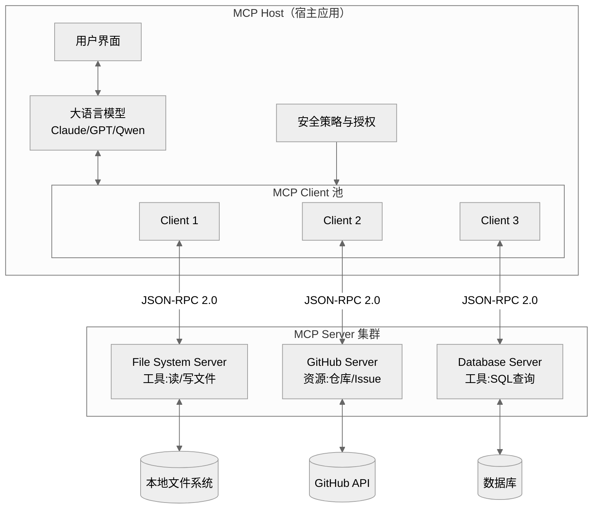

**三大角色职责**：

| 角色 | 定位 | 核心职责 | 典型实现 |
|------|------|----------|----------|
| **Host（宿主）** | AI 应用本体 | 管理 Client 实例、执行安全策略、协调 LLM 集成与采样 | Claude Desktop、Cursor、VS Code |
| **Client（客户端）** | 中间件 | 协议协商、消息路由、能力交换、维护安全边界 | 内嵌于 Host，每 Server 对应一个 Client |
| **Server（服务端）** | 能力提供方 | 暴露 Tools/Resources/Prompts 三类原语，执行具体逻辑 | 文件系统 Server、GitHub Server 等 |

### 2.2 协议生命周期

MCP 是**有状态协议**，会话分为三个阶段：

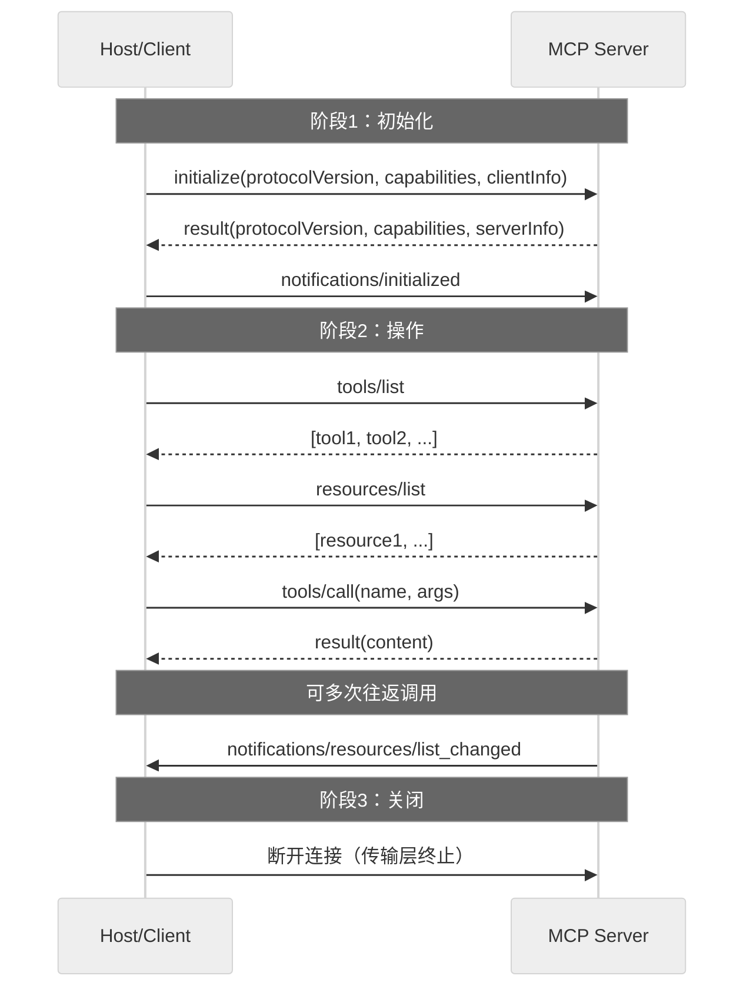

### 2.3 请求处理流程

当用户以自然语言提出请求时，MCP 的完整处理流程：

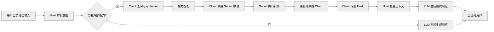

---

## 三、关键技术点分析

### 3.1 三大原语（Primitives）

MCP Server 通过三类原语向 Client 暴露能力：

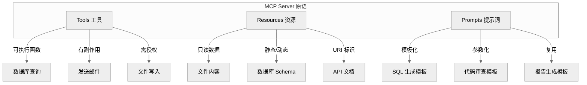

| 原语 | 定位 | 特性 | 访问方法 | 典型场景 |
|------|------|------|----------|----------|
| **Tools（工具）** | 可执行函数 | 有副作用、需授权 | `tools/list`、`tools/call` | 数据库写入、发邮件、API 调用 |
| **Resources（资源）** | 只读数据源 | 无副作用、URI 标识 | `resources/list`、`resources/read` | 文件读取、数据库 Schema、日志 |
| **Prompts（提示词）** | 对话模板 | 参数化、可复用 | `prompts/list`、`prompts/get` | SQL 生成、代码审查、报告模板 |

### 3.2 传输层机制

MCP 支持两种官方传输方式：

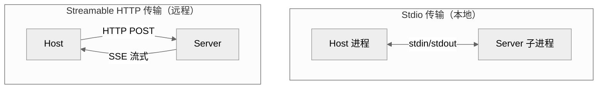

| 维度 | Stdio | Streamable HTTP |
|------|-------|-----------------|
| **通信方式** | 标准输入/输出流 | HTTP POST + SSE |
| **部署位置** | 本地同机 | 远程跨网络 |
| **性能** | 极低延迟（内核缓冲区） | 有网络开销 |
| **客户端数** | 1 对 1 | 多客户端 |
| **认证** | 无需（进程隔离） | OAuth/Bearer Token |
| **适用场景** | 本地文件、IDE 插件、CLI | 云端服务、多租户 |
| **消息分帧** | `\n` 分隔 JSON 文本帧 | HTTP 响应体 |

> **注意**：早期规范中的 HTTP+SSE 传输已于 2025 年 3 月标记为弃用，新项目应使用 Streamable HTTP。

### 3.3 动态发现机制

MCP 的核心创新之一是**动态发现**，允许 AI 模型实时发现并集成新工具，无需预定义代码：

1. **工具级发现**：Client 调用 `tools/list` 获取工具元数据（名称、参数、描述）。
2. **服务级发现**：通过 URI 解析远程服务元数据，自动配置调用权限。
3. **变更通知**：Server 新增工具时通过 `notifications/tools/list_changed` 通知 Client 刷新。

### 3.4 Sampling 机制

Client 向 Server 提供的**反向能力**——Server 可主动请求 Host 调用大模型：

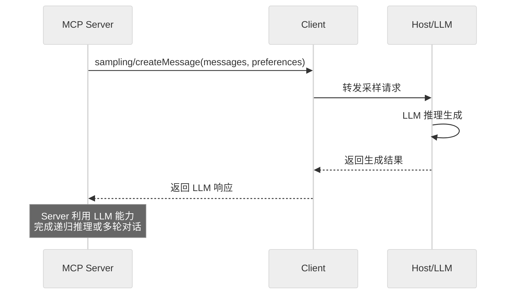

**应用场景**：
- Server 需要LLM 对查询结果做摘要后再返回
- 多 Agent 协作中，Server 侧需触发推理
- 工具执行结果需要 LLM 二次加工

### 3.5 Root 机制

Client 可向 Server 暴露**受限的文件系统视图**，便于 Server 识别可操作的目录与文件：

```json
{
  "roots": [
    { "uri": "file:///projects/myapp", "name": "My App" },
    { "uri": "file:///docs/specs", "name": "Specs" }
  ]
}
```

Server 仅能访问 Root 声明的目录，形成安全沙箱。

---

## 四、MCP Server 详解

> 本章节聚焦 MCP 协议中的 **Server 角色**，系统阐述其设计原则、工作原理与内部三层架构。
> 注意：第二章的"三层架构"描述的是 **Host-Client-Server 协议角色架构**（协议层解耦），本节描述的是 **MCP Server 内部的分层架构**（实现层解耦），二者处于不同抽象层次，不可混淆。

### 4.1 MCP Server 设计原则

MCP Server 作为能力的提供方，其设计遵循一组明确的核心原则，这些原则源于 MCP 协议"职责分离、简单可用、安全可控"的整体哲学。

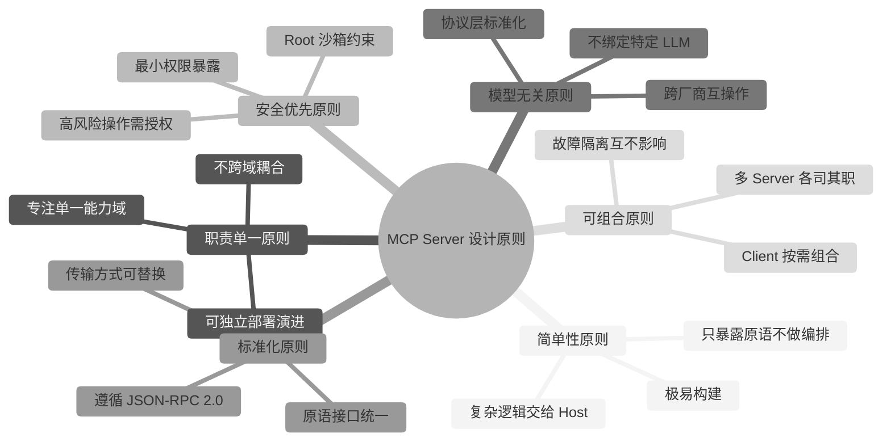

**六大设计原则详解**：

| 设计原则 | 核心理念 | 指导思想 | 实践体现 |
|----------|----------|----------|----------|
| **简单性原则** | Server 应极易构建 | 把复杂性留给 Host，让 Server 专注能力暴露 | Server 只需声明原语，无需实现安全编排、上下文聚合 |
| **职责单一原则** | 一个 Server 聚焦一个能力域 | 高内聚低耦合，避免"上帝服务" | 文件系统 Server 只管文件，数据库 Server 只管查询 |
| **安全优先原则** | 默认安全，最小权限 | 宁可牺牲便利性也不放宽权限 | 写操作需授权、Root 沙箱限定目录、能力协商限定边界 |
| **模型无关原则** | 不绑定任何 LLM 厂商 | 协议中立，避免厂商锁定 | Server 通过标准原语暴露能力，任何 Host 均可接入 |
| **标准化原则** | 遵循开放协议规范 | 一次实现，处处可用 | 基于 JSON-RPC 2.0，原语接口统一，传输可替换 |
| **可组合原则** | 多 Server 协同工作 | 通过 Client 组合多个 Server 能力 | 每个 Server 独立部署，故障隔离，按需组合 |

**设计原则的权衡**：

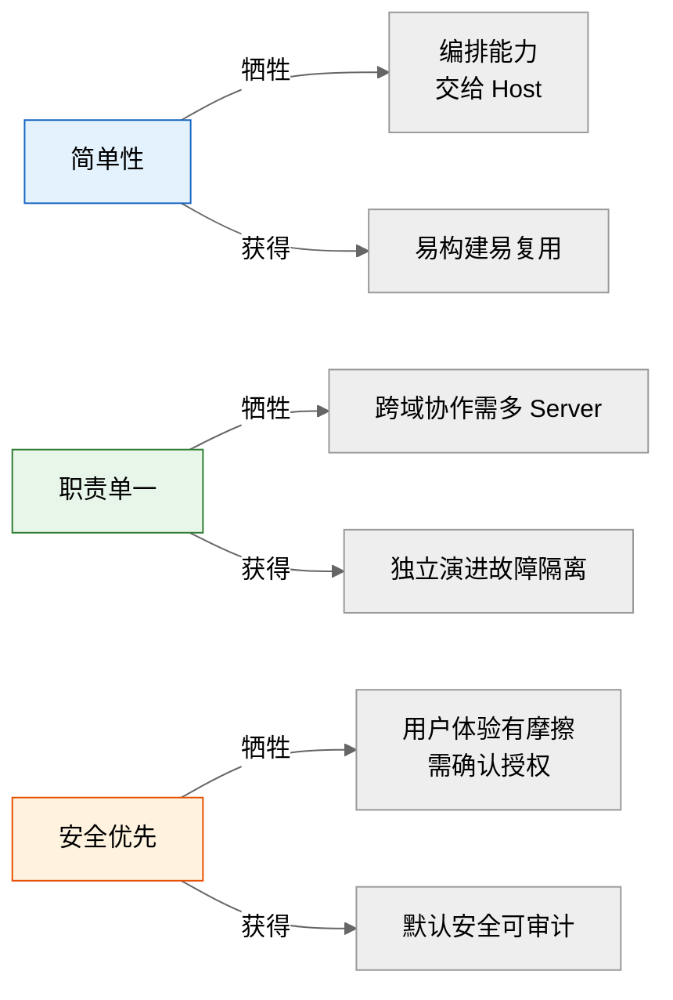

> **核心指导思想总结**：MCP Server 的设计哲学是"**做减法**"——把编排、安全、上下文管理的复杂性上移给 Host，让 Server 回归"能力暴露"的本职，从而实现极低构建成本与高度可复用性。

### 4.2 MCP Server 工作原理

MCP Server 的核心职责是**接收 Client 的 JSON-RPC 请求、执行原语逻辑、返回结果**。其工作原理涵盖启动注册、会话协商、请求处理、原语执行、结果返回等完整机制。

#### 4.2.1 主要功能实现机制

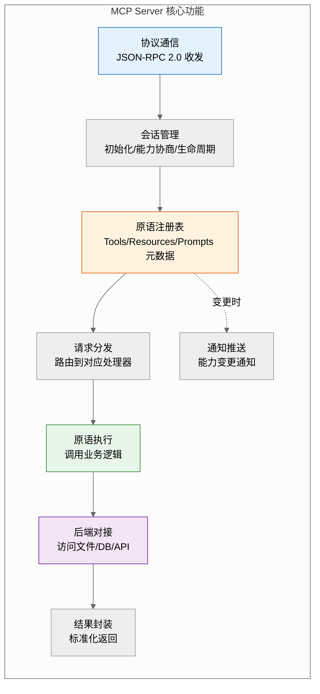

**核心功能模块说明**：

| 功能模块 | 职责 | 关键机制 |
|----------|------|----------|
| **协议通信** | 收发 JSON-RPC 2.0 消息 | Stdio 流式或 Streamable HTTP，消息分帧与解析 |
| **会话管理** | 维护与 Client 的有状态会话 | initialize 协商 → initialized 确认 → 操作 → 关闭 |
| **原语注册表** | 维护 Tools/Resources/Prompts 的元数据 | 启动时注册，运行时支持动态增删与变更通知 |
| **请求分发** | 根据 method 路由到对应处理器 | 方法名映射到 handler 函数 |
| **原语执行** | 执行具体业务逻辑 | 工具调用、资源读取、模板渲染 |
| **后端对接** | 访问文件系统/数据库/外部 API | 数据访问层封装，隔离后端差异 |
| **结果封装** | 将执行结果标准化为 JSON-RPC response | content 数组封装，支持多类型内容 |
| **通知推送** | 主动通知 Client 能力变更 | `notifications/tools/list_changed` 等 |

#### 4.2.2 Server 运行流程

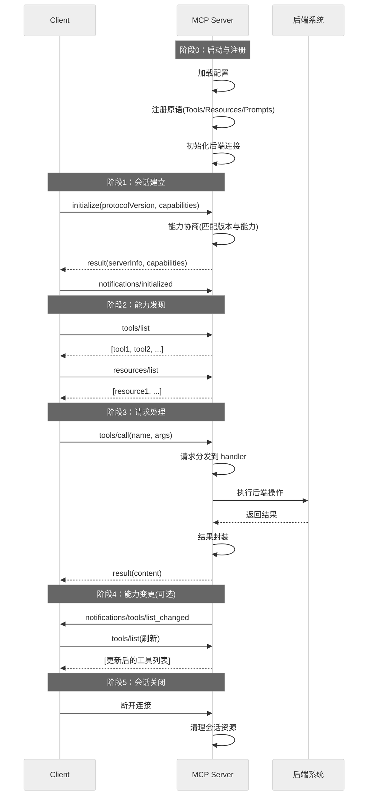

**运行流程关键节点**：

| 阶段 | 触发方 | 核心动作 | Server 职责 |
|------|--------|----------|-------------|
| **启动注册** | Server 自身 | 加载配置、注册原语、初始化后端 | 构建原语注册表，建立后端连接池 |
| **会话建立** | Client 发起 | initialize 握手 + 能力协商 | 返回 serverInfo 与支持的 capabilities |
| **能力发现** | Client 主动 | tools/list、resources/list、prompts/list | 从注册表返回元数据（名称、参数 schema、描述） |
| **请求处理** | Client 调用 | tools/call、resources/read、prompts/get | 分发到 handler，执行业务逻辑，封装结果 |
| **能力变更** | Server 主动 | notifications/xxx/list_changed | 通知 Client 刷新，支持热更新 |
| **会话关闭** | Client 或超时 | 断开传输连接 | 清理会话状态与资源 |

#### 4.2.3 原语注册与执行机制

MCP Server 通过**注册表模式**管理三类原语，运行时根据 Client 请求动态分发：

```python
from fastmcp import FastMCP

mcp = FastMCP("example-server")

# 1. 注册 Tool：可执行函数
@mcp.tool()
def search_docs(query: str, limit: int = 10) -> str:
    """搜索知识库文档"""
    results = doc_store.search(query, limit)  # 调用后端
    return format_results(results)

# 2. 注册 Resource：只读数据源
@mcp.resource("docs://{doc_id}")
def read_doc(doc_id: str) -> str:
    """读取指定文档内容"""
    return doc_store.get(doc_id)

# 3. 注册 Prompt：对话模板
@mcp.prompt()
def code_review(code: str, language: str) -> str:
    """生成代码审查提示"""
    return f"请审查以下 {language} 代码:\n{code}"

# 启动 Server，自动处理协议通信与请求分发
if __name__ == "__main__":
    mcp.run(transport="stdio")  # 或 transport="http"
```

**原语执行流水线**：

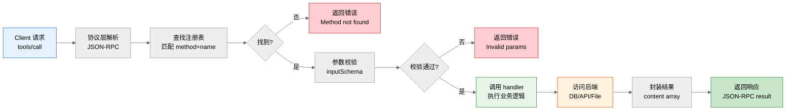

### 4.3 MCP Server 三层架构

MCP Server 内部采用经典的**三层架构**（表示层、业务逻辑层、数据访问层），实现协议处理、业务执行与后端访问的职责分离。该架构是 Server 实现层的内部分层，与协议层的 Host-Client-Server 架构处于不同抽象层次。

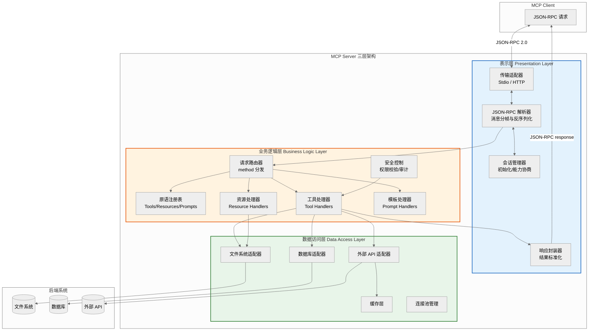

#### 4.3.1 表示层（Presentation Layer）

**职责定位**：负责协议通信与会话管理，是 Server 与 Client 交互的"门面"。

| 组件 | 职责 | 关键实现 |
|------|------|----------|
| **传输适配器** | 适配 Stdio/HTTP 两种传输方式 | Stdio 读取 stdin 写 stdout；HTTP 监听端口处理 POST |
| **JSON-RPC 解析器** | 消息分帧、反序列化、序列化 | `\n` 分隔帧解析（Stdio）；HTTP body 解析；JSON 编解码 |
| **会话管理器** | 维护会话状态与生命周期 | initialize 握手、能力协商、initialized 确认、超时清理 |
| **响应封装器** | 将业务结果标准化为 JSON-RPC response | content 数组封装、错误码映射、isError 标志 |

**表示层核心代码示例**：

```python
import json
from typing import AsyncIterator

class PresentationLayer:
    """表示层：协议通信与会话管理"""

    def __init__(self, transport: str = "stdio"):
        self.transport = transport
        self.session_manager = SessionManager()
        self.rpc_parser = JSONRPCParser()

    async def handle_request(self, raw_message: bytes) -> bytes:
        """处理原始请求消息"""
        # 1. 消息分帧与解析
        try:
            request = self.rpc_parser.parse(raw_message)
        except ParseError as e:
            return self._error_response(None, -32700, str(e))

        # 2. 会话状态校验
        if not self.session_manager.is_valid(request):
            return self._error_response(
                request.get("id"), -32000, "Invalid session"
            )

        # 3. 分发给业务逻辑层
        result = await self._dispatch_to_business(request)

        # 4. 封装响应
        return self._encode_response(request, result)

    def _encode_response(self, request: dict, result) -> bytes:
        """封装 JSON-RPC 响应"""
        response = {
            "jsonrpc": "2.0",
            "id": request.get("id"),
            "result": result
        }
        return json.dumps(response).encode() + b"\n"
```

#### 4.3.2 业务逻辑层（Business Logic Layer）

**职责定位**：负责请求路由、原语执行与安全控制，是 Server 的"大脑"。

| 组件 | 职责 | 关键实现 |
|------|------|----------|
| **请求路由器** | 根据 method 字段分发到对应处理器 | `tools/call` → ToolHandler，`resources/read` → ResourceHandler |
| **原语注册表** | 维护三类原语的元数据与 handler 映射 | 启动时注册，支持运行时增删，触发变更通知 |
| **工具处理器** | 执行 Tool 原语逻辑 | 参数校验、调用业务函数、异常捕获 |
| **资源处理器** | 读取 Resource 原语数据 | URI 解析、数据读取、格式化 |
| **模板处理器** | 渲染 Prompt 原语模板 | 参数注入、模板渲染 |
| **安全控制** | 权限校验、操作审计、限流 | RBAC 校验、操作日志、频率限制 |

**业务逻辑层核心代码示例**：

```python
from dataclasses import dataclass
from typing import Callable, Any

@dataclass
class PrimitiveEntry:
    """原语注册表条目"""
    name: str
    description: str
    input_schema: dict
    handler: Callable
    primitive_type: str  # tool / resource / prompt

class BusinessLogicLayer:
    """业务逻辑层：请求路由与原语执行"""

    def __init__(self):
        self._registry: dict[str, PrimitiveEntry] = {}
        self._security = SecurityController()

    def register_tool(self, name: str, handler: Callable,
                      description: str, input_schema: dict):
        """注册工具原语"""
        self._registry[f"tool:{name}"] = PrimitiveEntry(
            name=name, description=description,
            input_schema=input_schema, handler=handler,
            primitive_type="tool"
        )

    async def route_and_execute(self, method: str, params: dict) -> Any:
        """请求路由与执行"""
        # 1. 路由到对应处理器
        if method == "tools/list":
            return self._list_primitives("tool")
        elif method == "tools/call":
            return await self._call_tool(params)
        elif method == "resources/read":
            return await self._read_resource(params)
        else:
            raise MethodNotFoundError(f"Unknown method: {method}")

    async def _call_tool(self, params: dict) -> dict:
        """执行工具调用"""
        name = params["name"]
        args = params.get("arguments", {})

        # 1. 查找注册表
        entry = self._registry.get(f"tool:{name}")
        if not entry:
            raise NotFoundError(f"Tool not found: {name}")

        # 2. 安全校验
        await self._security.check_permission(name, args)

        # 3. 参数校验
        self._validate_args(args, entry.input_schema)

        # 4. 执行 handler（调用数据访问层）
        result = await entry.handler(args)

        # 5. 审计日志
        self._security.audit_log(name, args, result)

        # 6. 封装结果
        return {"content": [{"type": "text", "text": str(result)}]}
```

#### 4.3.3 数据访问层（Data Access Layer）

**职责定位**：封装后端系统访问细节，为业务逻辑层提供统一的数据接口。

| 组件 | 职责 | 关键实现 |
|------|------|----------|
| **文件系统适配器** | 读写本地文件 | pathlib 封装，遵循 Root 沙箱约束 |
| **数据库适配器** | 执行 SQL/NoSQL 查询 | 连接池、参数化查询、结果序列化 |
| **外部 API 适配器** | 调用第三方 REST/gRPC API | HTTP 客户端、认证、重试、超时 |
| **缓存层** | 缓存只读资源降低后端压力 | TTL 策略、LRU 淘汰、缓存失效 |
| **连接池管理** | 复用后端连接 | 池化技术、健康检查、自动重连 |

**数据访问层核心代码示例**：

```python
import aiohttp
import aiosqlite
from pathlib import Path

class DataAccessLayer:
    """数据访问层：后端系统访问封装"""

    def __init__(self, roots: list[str]):
        self._roots = [Path(r) for r in roots]  # Root 沙箱目录
        self._db_pool = None
        self._http_session = None
        self._cache = {}  # 简单缓存

    async def init(self):
        """初始化连接池"""
        self._db_pool = await aiosqlite.connect("app.db")
        self._http_session = aiohttp.ClientSession()

    async def read_file(self, uri: str) -> str:
        """读取文件（遵循 Root 沙箱）"""
        file_path = Path(uri.replace("file://", ""))
        # 安全校验：必须在 Root 沙箱内
        if not self._is_within_roots(file_path):
            raise PermissionError(f"路径超出 Root 沙箱: {file_path}")
        return file_path.read_text(encoding="utf-8")

    async def query_db(self, sql: str, params: tuple = ()) -> list:
        """执行数据库查询（参数化防注入）"""
        async with self._db_pool.execute(sql, params) as cursor:
            rows = await cursor.fetchall()
            return [dict(row) for row in rows]

    async def call_api(self, url: str, method: str = "GET",
                       headers: dict = None) -> dict:
        """调用外部 API（带重试与超时）"""
        # 缓存检查
        cache_key = f"{method}:{url}"
        if cache_key in self._cache:
            return self._cache[cache_key]

        async with self._http_session.request(
            method, url, headers=headers, timeout=aiohttp.ClientTimeout(total=30)
        ) as resp:
            result = await resp.json()

        # 写入缓存（TTL=300s）
        self._cache[cache_key] = result
        return result

    def _is_within_roots(self, path: Path) -> bool:
        """校验路径是否在 Root 沙箱内"""
        try:
            path.resolve().relative_to(self._roots[0].resolve())
            return True
        except ValueError:
            return False

    async def close(self):
        """关闭连接"""
        await self._db_pool.close()
        await self._http_session.close()
```

#### 4.3.4 三层交互方式

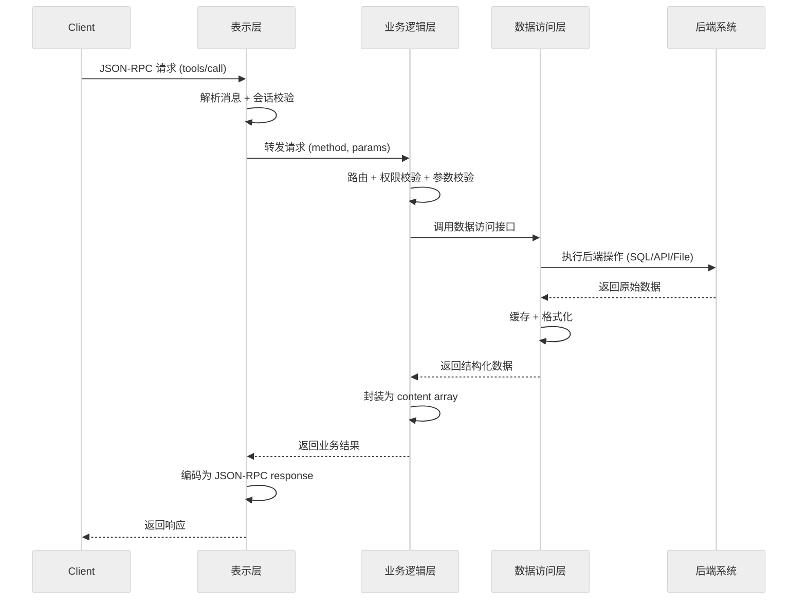

**三层交互规则**：

| 规则 | 说明 | 目的 |
|------|------|------|
| **单向依赖** | 上层依赖下层，下层不感知上层 | 避免循环依赖，便于独立测试 |
| **接口隔离** | 层间通过明确接口通信，不泄漏内部实现 | 支持各层独立替换（如换传输方式不影响业务） |
| **表示层不碰后端** | 表示层只管协议，不直接访问数据 | 职责单一，避免业务逻辑散落 |
| **业务层不碰传输** | 业务层不关心 Stdio 还是 HTTP | 传输方式可替换，业务逻辑复用 |
| **数据层不碰协议** | 数据访问层不返回 JSON-RPC 格式 | 数据层可被非 MCP 场景复用 |

**三层架构价值总结**：

| 价值维度 | 体现 | 收益 |
|----------|------|------|
| **可维护性** | 修改传输方式只动表示层 | 变更影响面小 |
| **可测试性** | 各层可独立 Mock 测试 | 测试效率高 |
| **可复用性** | 数据访问层可被非 MCP 服务复用 | 代码复用率高 |
| **可扩展性** | 新增原语只动业务层注册表 | 扩展成本低 |
| **安全性** | 安全控制集中在业务层 | 审计点统一 |

---

## 五、MCP 核心基础能力实现：工具管理与资源管理

> MCP（Model Context Protocol）的两大核心基础能力是**工具管理（Tool Management）**与**资源管理（Resource Management）**，分别对应协议中的 Tools 与 Resources 两大原语。工具管理赋予 Server"执行操作"的能力，资源管理赋予 Server"提供数据"的能力，二者共同构成 MCP Server 的能力基石。本章节深入阐述二者的具体实现方案。

### 5.1 工具管理（Tool Management）

工具管理负责工具的注册、发现、调用、版本控制与权限审计全流程，是 MCP Server 对外暴露"可执行能力"的核心机制。

#### 5.1.1 工具能力类型划分

MCP 工具按不同维度可进行多维分类，以便精细化管理：

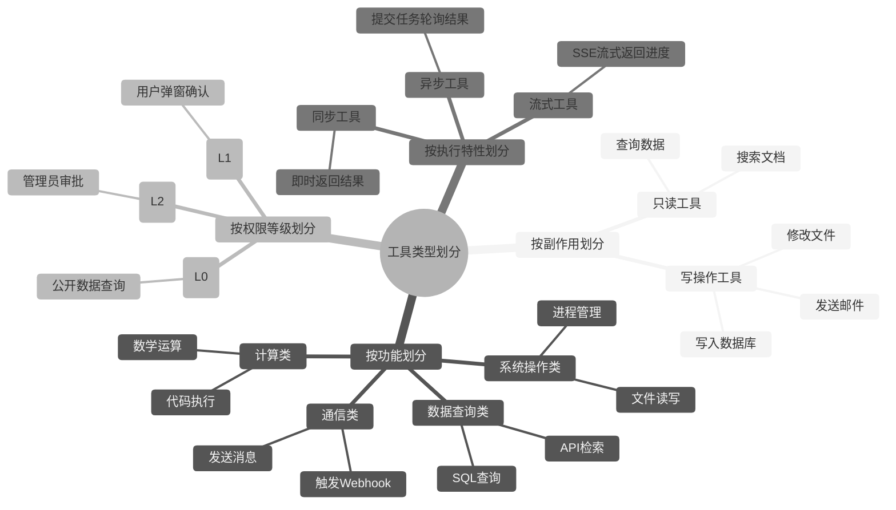

**四维分类详解**：

| 分类维度 | 类型 | 特征 | 典型示例 | 授权要求 |
|----------|------|------|----------|----------|
| **副作用** | 只读工具 | 无状态变更，可重复执行 | `query_order`、`search_docs` | 免授权 |
| **副作用** | 写操作工具 | 有状态变更，需幂等保护 | `create_order`、`send_email` | 需确认/审批 |
| **功能** | 数据查询类 | 从数据源检索信息 | `sql_query`、`api_search` | 免授权 |
| **功能** | 系统操作类 | 操作文件/进程/配置 | `write_file`、`restart_service` | 需确认 |
| **功能** | 通信类 | 对外发送消息或通知 | `send_email`、`trigger_webhook` | 需确认 |
| **功能** | 计算类 | 执行运算或代码 | `calculate`、`run_code` | 需确认 |
| **权限** | L0 免授权 | 低风险，公开数据 | `get_time`、`search_public` | 无 |
| **权限** | L1 需确认 | 中风险，需用户知晓 | `update_profile`、`create_ticket` | 用户弹窗 |
| **权限** | L2 需审批 | 高风险，需管理员批准 | `delete_record`、`transfer_funds` | 管理员审批 |
| **执行** | 同步工具 | 阻塞等待结果 | `query_db`、`read_file` | — |
| **执行** | 异步工具 | 提交后轮询 | `train_model`、`batch_process` | — |
| **执行** | 流式工具 | SSE 实时推送进度 | `generate_report`、`crawl_site` | — |

#### 5.1.2 工具注册与元数据管理

工具注册是工具管理的起点，Server 通过注册表维护所有工具的元数据与处理函数映射。

**工具元数据结构**：

```python
from dataclasses import dataclass, field
from typing import Callable, Any

@dataclass
class ToolMetadata:
    """工具元数据：完整描述一个工具的所有信息"""
    # 基础信息
    name: str                          # 工具名称（唯一标识）
    description: str                   # 工具描述（供 LLM 理解用途）
    version: str = "1.0.0"            # 工具版本号

    # 参数定义
    input_schema: dict = field(default_factory=dict)   # JSON Schema 参数定义
    output_schema: dict = field(default_factory=dict)  # 输出格式定义

    # 分类与权限
    side_effect: bool = False          # 是否有副作用
    permission_level: int = 0          # 权限等级 L0/L1/L2
    execution_mode: str = "sync"       # sync/async/stream

    # 生命周期
    deprecated: bool = False           # 是否已废弃
    successor: str = ""                # 废弃后的替代工具名

    # 运行时
    handler: Callable = None           # 处理函数
    rate_limit: int = 0               # 调用频率限制（次/分钟）
    timeout: int = 30                 # 超时时间（秒）
```

**工具注册表实现**：

```python
class ToolRegistry:
    """工具注册表：管理工具的全生命周期"""

    def __init__(self):
        self._tools: dict[str, ToolMetadata] = {}
        self._version_history: dict[str, list] = {}  # 版本历史

    def register(self, metadata: ToolMetadata) -> None:
        """注册新工具"""
        if metadata.name in self._tools:
            raise ValueError(f"工具已存在: {metadata.name}")
        self._tools[metadata.name] = metadata
        self._version_history[metadata.name] = [metadata.version]

    def unregister(self, name: str) -> None:
        """注销工具"""
        if name in self._tools:
            del self._tools[name]

    def list_tools(self) -> list[dict]:
        """列出所有工具元数据（供 tools/list 调用）"""
        return [
            {
                "name": t.name,
                "description": t.description,
                "inputSchema": t.input_schema,
            }
            for t in self._tools.values()
            if not t.deprecated  # 不返回已废弃工具
        ]

    def get_tool(self, name: str) -> ToolMetadata:
        """获取工具元数据"""
        return self._tools.get(name)

    def update_tool(self, name: str, metadata: ToolMetadata) -> None:
        """更新工具（触发变更通知）"""
        old_version = self._tools[name].version
        self._tools[name] = metadata
        self._version_history[name].append(metadata.version)
        # 触发变更通知
        self._notify_change(name, old_version, metadata.version)
```

#### 5.1.3 工具调用执行机制

工具调用是工具管理的核心环节，涉及参数校验、权限检查、执行、结果封装全流程。

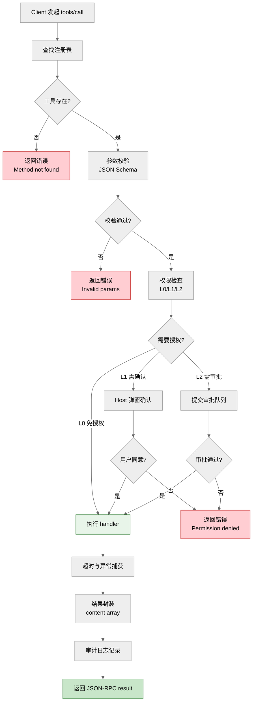

**工具调用核心实现**：

```python
import asyncio
import jsonschema
from datetime import datetime

class ToolExecutor:
    """工具执行器：封装工具调用的完整流程"""

    def __init__(self, registry: ToolRegistry):
        self._registry = registry
        self._audit_log = []  # 审计日志

    async def execute(self, tool_name: str, arguments: dict,
                      caller_id: str = "") -> dict:
        """执行工具调用"""
        # 1. 查找工具
        tool = self._registry.get_tool(tool_name)
        if not tool:
            return self._error(f"Tool not found: {tool_name}")

        # 2. 参数校验（JSON Schema）
        try:
            jsonschema.validate(arguments, tool.input_schema)
        except jsonschema.ValidationError as e:
            return self._error(f"Invalid params: {e.message}")

        # 3. 权限检查
        if not await self._check_permission(tool, caller_id):
            return self._error("Permission denied")

        # 4. 频率限制检查
        if not self._check_rate_limit(tool_name, caller_id):
            return self._error("Rate limit exceeded")

        # 5. 执行 handler（带超时）
        start_time = datetime.now()
        try:
            result = await asyncio.wait_for(
                tool.handler(**arguments),
                timeout=tool.timeout
            )
        except asyncio.TimeoutError:
            return self._error(f"Tool execution timeout ({tool.timeout}s)")
        except Exception as e:
            return self._error(f"Tool execution failed: {str(e)}")

        # 6. 审计日志
        self._audit_log.append({
            "tool": tool_name,
            "caller": caller_id,
            "arguments": arguments,
            "result": str(result)[:500],
            "duration_ms": (datetime.now() - start_time).total_seconds() * 1000,
            "timestamp": datetime.now().isoformat(),
            "status": "success"
        })

        # 7. 结果封装
        return {
            "content": [{"type": "text", "text": str(result)}],
            "isError": False
        }

    async def _check_permission(self, tool: ToolMetadata,
                                caller_id: str) -> bool:
        """权限检查"""
        if tool.permission_level == 0:    # L0 免授权
            return True
        elif tool.permission_level == 1:  # L1 需确认（由 Host 处理）
            return await self._request_user_confirmation(tool.name)
        elif tool.permission_level == 2:  # L2 需审批
            return await self._request_admin_approval(tool.name, caller_id)
        return False
```

#### 5.1.4 工具版本管理与兼容性

```python
class ToolVersionManager:
    """工具版本管理器"""

    def __init__(self):
        self._versions: dict[str, list[str]] = {}  # name -> [v1, v2, ...]

    def register_version(self, name: str, version: str) -> None:
        """注册新版本"""
        if name not in self._versions:
            self._versions[name] = []
        self._versions[name].append(version)

    def is_backward_compatible(self, name: str,
                                old_version: str, new_version: str) -> bool:
        """检查向后兼容性（语义化版本）"""
        old_parts = [int(x) for x in old_version.split(".")]
        new_parts = [int(x) for x in new_version.split(".")]
        # 主版本号不变即向后兼容
        return old_parts[0] == new_parts[0]

    def deprecate_tool(self, name: str, successor: str) -> None:
        """废弃工具，指定替代者"""
        # 标记为 deprecated，tools/list 不再返回
        # 但 tools/call 仍可调用，返回废弃警告
        pass
```

**版本兼容策略**：

| 变更类型 | 版本号变化 | 兼容性 | 处理策略 |
|----------|-----------|--------|----------|
| 参数新增（可选） | 补丁号 +1 | 完全兼容 | 旧 Client 正常调用 |
| 参数修改 | 次版本号 +1 | 向后兼容 | 旧 Client 收到兼容警告 |
| 参数删除/语义变更 | 主版本号 +1 | 不兼容 | 旧 Client 报错，需升级 |
| 工具废弃 | 标记 deprecated | 过渡期 | 返回废弃提示 + 替代工具 |

---

### 5.2 资源管理（Resource Management）

资源管理负责资源的寻址、读取、缓存、订阅与访问控制，是 MCP Server 对外暴露"只读数据"的核心机制。

#### 5.2.1 资源管理范围与分类

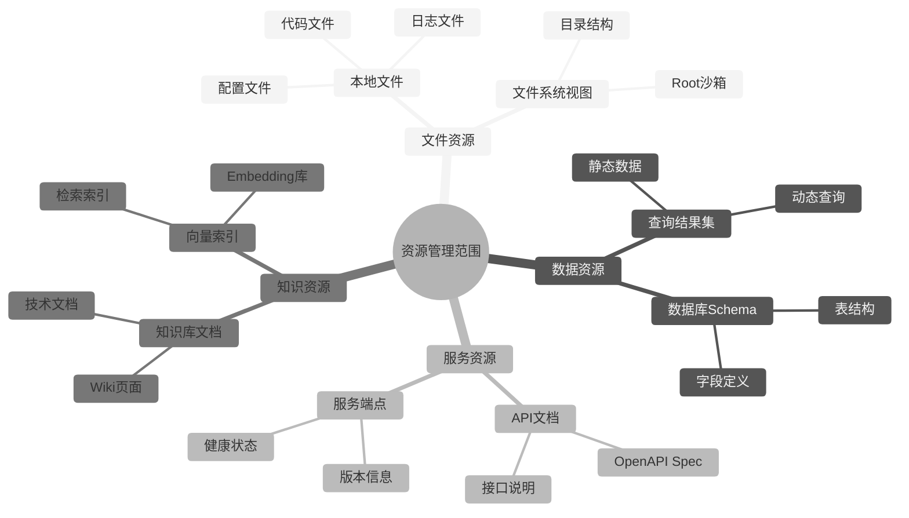

**资源分类与特性**：

| 资源类型 | URI 示例 | 变更频率 | 缓存策略 | 典型场景 |
|----------|----------|----------|----------|----------|
| **静态文件** | `file:///config/app.yaml` | 低 | 长期缓存 | 配置文件读取 |
| **动态文件** | `file:///logs/app.log` | 高 | 不缓存/短TTL | 日志实时查看 |
| **数据库 Schema** | `db://schema/users` | 极低 | 长期缓存 | 表结构查询 |
| **查询结果** | `db://query/results` | 高 | 不缓存 | 实时数据查询 |
| **API 文档** | `api://docs/openapi.json` | 低 | 中期缓存 | 接口文档查阅 |
| **服务状态** | `svc://health/check` | 高 | 不缓存 | 健康检查 |
| **知识库** | `wiki://docs/architecture` | 中 | 中期缓存 | 架构文档查阅 |
| **向量索引** | `vector://index/kb` | 中 | 不缓存 | 语义检索 |

#### 5.2.2 资源 URI 寻址机制

MCP 资源通过 URI（统一资源标识符）进行寻址，支持多种协议前缀：

```python
from urllib.parse import urlparse, parse_qs
from dataclasses import dataclass

@dataclass
class ResourceURI:
    """资源 URI 解析结果"""
    scheme: str       # 协议：file/db/api/svc/wiki/vector
    path: str         # 资源路径
    params: dict      # 查询参数
    raw: str          # 原始 URI

    @classmethod
    def parse(cls, uri: str) -> 'ResourceURI':
        """解析资源 URI"""
        parsed = urlparse(uri)
        return cls(
            scheme=parsed.scheme,
            path=parsed.path,
            params=parse_qs(parsed.query),
            raw=uri
        )


class ResourceResolver:
    """资源解析器：根据 URI scheme 路由到对应适配器"""

    def __init__(self):
        self._adapters: dict[str, 'ResourceAdapter'] = {}

    def register_adapter(self, scheme: str, adapter: 'ResourceAdapter'):
        """注册资源适配器"""
        self._adapters[scheme] = adapter

    async def read(self, uri: str) -> str:
        """读取资源"""
        parsed = ResourceURI.parse(uri)
        adapter = self._adapters.get(parsed.scheme)
        if not adapter:
            raise ValueError(f"Unsupported scheme: {parsed.scheme}")
        return await adapter.read(parsed)
```

#### 5.2.3 资源缓存与调度策略

资源缓存是提升性能的关键，需根据资源特性选择合适的缓存策略：

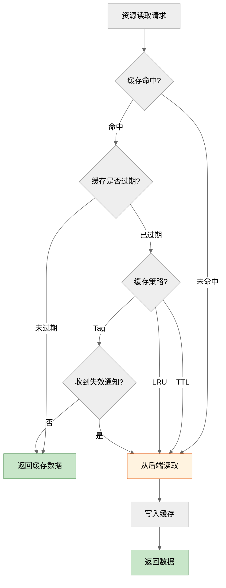

**缓存策略对比**：

| 策略 | 机制 | 适用资源 | 优点 | 缺点 |
|------|------|----------|------|------|
| **TTL 缓存** | 固定过期时间 | 配置、Schema、文档 | 实现简单，自动失效 | 过期前数据可能已变更 |
| **LRU 缓存** | 按访问频率淘汰 | 查询结果、文档 | 内存可控 | 冷数据被淘汰 |
| **Tag 失效** | 变更时主动失效 | 实时性要求高 | 数据一致性好 | 需要变更通知机制 |
| **不缓存** | 每次直接读取 | 日志、状态、实时数据 | 数据最新 | 性能差 |

**缓存层实现**：

```python
import time
from collections import OrderedDict

class ResourceCache:
    """资源缓存：支持 TTL + LRU 双策略"""

    def __init__(self, max_size: int = 1000, default_ttl: int = 300):
        self._cache: OrderedDict[str, dict] = OrderedDict()
        self._max_size = max_size
        self._default_ttl = default_ttl

    def get(self, uri: str) -> str | None:
        """获取缓存"""
        if uri not in self._cache:
            return None

        entry = self._cache[uri]
        # TTL 检查
        if time.time() > entry["expires_at"]:
            del self._cache[uri]
            return None

        # LRU 更新（移到末尾表示最近访问）
        self._cache.move_to_end(uri)
        return entry["data"]

    def set(self, uri: str, data: str, ttl: int = None) -> None:
        """写入缓存"""
        if ttl is None:
            ttl = self._default_ttl

        self._cache[uri] = {
            "data": data,
            "expires_at": time.time() + ttl,
            "created_at": time.time()
        }

        # LRU 淘汰：超过容量时删除最久未访问
        while len(self._cache) > self._max_size:
            self._cache.popitem(last=False)

    def invalidate(self, uri: str) -> None:
        """主动失效（收到变更通知时调用）"""
        if uri in self._cache:
            del self._cache[uri]

    def invalidate_pattern(self, pattern: str) -> int:
        """批量失效（按 URI 前缀模式）"""
        count = 0
        keys_to_delete = [k for k in self._cache if k.startswith(pattern)]
        for k in keys_to_delete:
            del self._cache[k]
            count += 1
        return count
```

#### 5.2.4 资源订阅与变更通知

MCP 支持资源变更通知，当资源内容变化时 Server 主动通知 Client 刷新：

```python
class ResourceManager:
    """资源管理器：整合解析、缓存、订阅"""

    def __init__(self):
        self._resolver = ResourceResolver()
        self._cache = ResourceCache()
        self._subscribers: dict[str, list] = {}  # uri -> [client_ids]
        self._watchers: dict[str, asyncio.Task] = {}  # uri -> 监听任务

    async def read(self, uri: str, use_cache: bool = True) -> str:
        """读取资源"""
        # 1. 尝试缓存
        if use_cache:
            cached = self._cache.get(uri)
            if cached is not None:
                return cached

        # 2. 从后端读取
        data = await self._resolver.read(uri)

        # 3. 写入缓存
        self._cache.set(uri, data)
        return data

    async def subscribe(self, uri: str, client_id: str) -> None:
        """订阅资源变更"""
        if uri not in self._subscribers:
            self._subscribers[uri] = []
            # 启动资源监听
            self._watchers[uri] = asyncio.create_task(
                self._watch_resource(uri)
            )
        self._subscribers[uri].append(client_id)

    async def _watch_resource(self, uri: str) -> None:
        """监听资源变更（轮询或文件系统 Watch）"""
        last_content = await self.read(uri, use_cache=False)
        while True:
            await asyncio.sleep(10)  # 轮询间隔
            current = await self.read(uri, use_cache=False)
            if current != last_content:
                # 资源已变更，通知所有订阅者
                self._cache.invalidate(uri)
                await self._notify_subscribers(uri)
                last_content = current

    async def _notify_subscribers(self, uri: str) -> None:
        """通知订阅者资源已变更"""
        # 发送 notifications/resources/updated
        for client_id in self._subscribers.get(uri, []):
            await self._send_notification(
                client_id,
                "notifications/resources/updated",
                {"uri": uri}
            )
```

**订阅机制流程**：

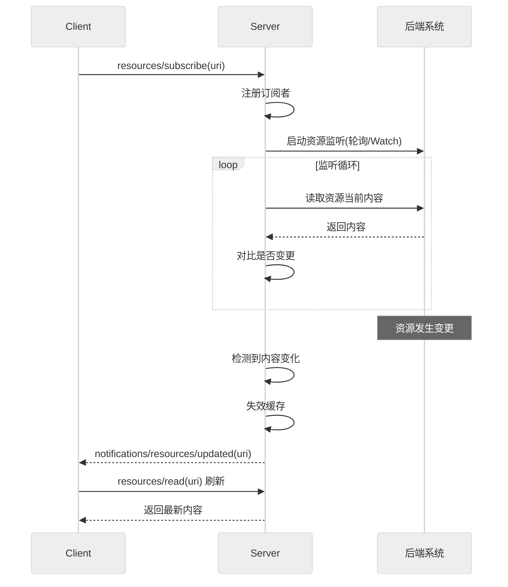

#### 5.2.5 资源访问控制

资源虽为只读，但仍需访问控制，防止敏感数据泄露：

```python
class ResourceAccessControl:
    """资源访问控制"""

    def __init__(self):
        # 资源权限矩阵：{uri_pattern: {role: allowed}}
        self._permissions = {
            "file:///public/*": {"*": True},              # 公开资源
            "file:///internal/*": {"employee": True},      # 内部资源
            "file:///confidential/*": {"manager": True},   # 机密资源
            "db://schema/*": {"developer": True},          # 数据库 Schema
            "db://query/*": {"analyst": True},             # 查询结果
        }
        # 敏感字段脱敏规则
        self._masking_rules = {
            r"\d{18}": "******************",  # 身份证号
            r"\d{16,19}": "****",              # 银行卡号
            r"[\w.]+@[\w.]+": "***@***.***",   # 邮箱
        }

    def check_access(self, uri: str, role: str) -> bool:
        """检查访问权限"""
        for pattern, roles in self._permissions.items():
            if self._match_pattern(uri, pattern):
                if "*" in roles or role in roles:
                    return True
        return False

    def mask_sensitive(self, content: str) -> str:
        """脱敏处理"""
        import re
        for pattern, replacement in self._masking_rules.items():
            content = re.sub(pattern, replacement, content)
        return content
```

**工具管理与资源管理对比总结**：

| 维度 | 工具管理 | 资源管理 |
|------|----------|----------|
| **核心能力** | 执行操作（有副作用） | 提供数据（只读） |
| **访问方法** | `tools/list`、`tools/call` | `resources/list`、`resources/read` |
| **授权要求** | 必须授权（L0/L1/L2） | 通常免授权 |
| **缓存策略** | 不缓存（每次执行） | TTL/LRU/Tag 失效 |
| **变更通知** | `tools/list_changed` | `resources/updated` |
| **幂等性** | 需保证幂等 | 天然幂等（只读） |
| **寻址方式** | 工具名 + 参数 | URI |
| **审计需求** | 高（需记录每次调用） | 低（只读无风险） |

---

## 六、MCP Server 完整生命周期管理

> MCP Server 的生命周期管理涵盖从初始化到终止的完整过程，是保障 Server 稳定运行、可观测、可维护的关键。本章将生命周期划分为**初始化、注册、运行、监控、终止**五个阶段，详细说明各阶段的关键节点、技术实现与管理策略。

### 6.1 生命周期总览

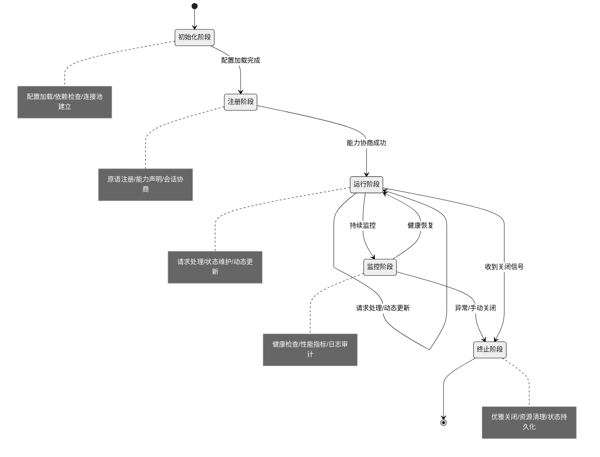

### 6.2 初始化阶段

初始化阶段是 Server 启动的第一步，负责加载配置、检查依赖、建立资源连接。

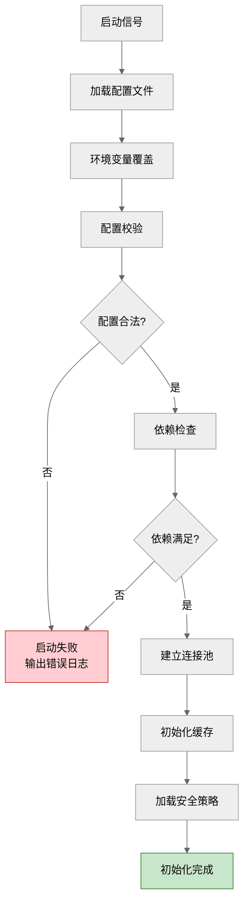

**初始化关键节点与实现**：

```python
import os
import yaml
import logging

class ServerInitializer:
    """Server 初始化器"""

    def __init__(self):
        self.config = {}
        self.logger = logging.getLogger("mcp.server.init")

    async def initialize(self, config_path: str) -> dict:
        """完整初始化流程"""
        # 1. 加载配置文件
        self.config = self._load_config(config_path)
        self.logger.info("配置加载完成")

        # 2. 环境变量覆盖（优先级：环境变量 > 配置文件）
        self._apply_env_overrides()
        self.logger.info("环境变量覆盖完成")

        # 3. 配置校验
        if not self._validate_config():
            raise RuntimeError("配置校验失败")
        self.logger.info("配置校验通过")

        # 4. 依赖检查
        await self._check_dependencies()
        self.logger.info("依赖检查通过")

        # 5. 建立连接池
        connections = await self._init_connections()
        self.logger.info("连接池建立完成")

        # 6. 初始化缓存
        cache = self._init_cache()
        self.logger.info("缓存初始化完成")

        # 7. 加载安全策略
        security = self._load_security_policy()
        self.logger.info("安全策略加载完成")

        return {
            "config": self.config,
            "connections": connections,
            "cache": cache,
            "security": security
        }

    def _load_config(self, path: str) -> dict:
        """加载 YAML 配置文件"""
        with open(path, 'r', encoding='utf-8') as f:
            return yaml.safe_load(f)

    def _apply_env_overrides(self):
        """环境变量覆盖配置"""
        env_mapping = {
            "MCP_SERVER_NAME": "server.name",
            "MCP_SERVER_PORT": "server.port",
            "MCP_DB_URL": "database.url",
            "MCP_LOG_LEVEL": "logging.level",
        }
        for env_key, config_key in env_mapping.items():
            if env_val := os.environ.get(env_key):
                self._set_nested(config_key, env_val)

    async def _check_dependencies(self):
        """依赖检查"""
        deps = self.config.get("dependencies", {})
        # 检查数据库连通性
        if "database" in deps:
            await self._check_db_connection(deps["database"])
        # 检查外部 API 可达性
        if "api_endpoints" in deps:
            for endpoint in deps["api_endpoints"]:
                await self._check_api_reachable(endpoint)
```

**初始化阶段管理策略**：

| 节点 | 策略 | 失败处理 |
|------|------|----------|
| 配置加载 | 支持多源（文件+环境变量） | 启动失败，输出明确错误 |
| 依赖检查 | 超时 5s 快速失败 | 标记不可用依赖，降级启动 |
| 连接池建立 | 预热最小连接数 | 重试 3 次，失败则终止 |
| 缓存初始化 | 按资源类型设置 TTL | 失败降级为不缓存 |
| 安全策略 | 强制加载，不可跳过 | 失败则拒绝启动 |

### 6.3 注册阶段

注册阶段完成原语注册、能力声明与会话协商，是 Server 与 Client 建立通信的基础。

```python
class ServerRegistrar:
    """Server 注册器"""

    def __init__(self, tool_registry, resource_manager):
        self._tool_registry = tool_registry
        self._resource_manager = resource_manager
        self._capabilities = {}
        self._protocol_version = "2025-06-18"

    def register_all_primitives(self, config: dict):
        """批量注册所有原语"""
        # 1. 注册工具
        for tool_config in config.get("tools", []):
            self._register_tool(tool_config)

        # 2. 注册资源
        for resource_config in config.get("resources", []):
            self._register_resource(resource_config)

        # 3. 注册提示词模板
        for prompt_config in config.get("prompts", []):
            self._register_prompt(prompt_config)

        # 4. 声明能力
        self._declare_capabilities()

    def _declare_capabilities(self):
        """声明 Server 能力"""
        self._capabilities = {
            "tools": len(self._tool_registry.list_tools()) > 0,
            "resources": True,  # 根据实际资源数判断
            "prompts": True,
            "logging": True,
        }

    def get_server_info(self) -> dict:
        """返回 serverInfo（供 initialize 响应）"""
        return {
            "name": "my-mcp-server",
            "version": "1.0.0",
        }

    def get_capabilities(self) -> dict:
        """返回 capabilities（供 initialize 响应）"""
        return self._capabilities
```

**会话协商流程**：

| 步骤 | Client 动作 | Server 动作 | 结果 |
|------|------------|------------|------|
| 1 | 发送 `initialize`（版本+能力） | 接收并匹配版本 | — |
| 2 | — | 返回 `serverInfo` + `capabilities` | 协商结果 |
| 3 | 校验 Server 能力是否满足需求 | — | — |
| 4 | 发送 `notifications/initialized` | 进入运行阶段 | 会话建立 |

### 6.4 运行阶段

运行阶段是 Server 生命周期中持续时间最长的阶段，负责请求处理、状态维护与动态更新。

```mermaid
%%{init: {'theme':'neutral'}}%%
flowchart LR
    subgraph 运行阶段核心循环
        A[监听请求] --> B{请求类型?}
        B -->|tools/call| C[工具执行]
        B -->|resources/read| D[资源读取]
        B -->|prompts/get| E[模板渲染]
        B -->|notification| F[变更通知处理]
        C --> G[结果返回]
        D --> G
        E --> G
        F --> A
        G --> A
    end

    subgraph 并发管理
        H[连接池]
        I[任务队列]
        J[工作协程池]
    end

    subgraph 动态更新
        K[热加载工具]
        L[缓存刷新]
        M[能力变更通知]
    end

    style A fill:#e3f2fd,stroke:#1565c0
    style G fill:#c8e6c9,stroke:#2e7d32
```

**运行阶段核心实现**：

```python
import asyncio
import signal

class ServerRunner:
    """Server 运行器"""

    def __init__(self, initializer, registrar):
        self._initializer = initializer
        self._registrar = registrar
        self._running = False
        self._shutdown_event = asyncio.Event()
        self._active_tasks: set[asyncio.Task] = set()

    async def run(self, config_path: str):
        """启动 Server 运行循环"""
        # 1. 初始化
        init_result = await self._initializer.initialize(config_path)

        # 2. 注册原语
        self._registrar.register_all_primitives(init_result["config"])

        # 3. 注册信号处理（优雅关闭）
        self._register_signal_handlers()

        # 4. 进入运行循环
        self._running = True
        self._logger.info("Server 进入运行阶段")

        # 5. 启动并发服务
        await asyncio.gather(
            self._serve_requests(),     # 请求处理循环
            self._health_check_loop(),  # 健康检查循环
            self._cleanup_loop(),       # 定期清理循环
        )

    async def _serve_requests(self):
        """请求处理循环"""
        while self._running:
            try:
                request = await self._receive_request()
                # 为每个请求创建独立任务（并发处理）
                task = asyncio.create_task(self._handle_request(request))
                self._active_tasks.add(task)
                task.add_done_callback(self._active_tasks.discard)
            except asyncio.CancelledError:
                break

    async def _handle_request(self, request: dict):
        """处理单个请求"""
        method = request.get("method")
        params = request.get("params", {})

        if method == "tools/call":
            result = await self._tool_executor.execute(
                params["name"], params.get("arguments", {})
            )
        elif method == "resources/read":
            result = await self._resource_manager.read(params["uri"])
        elif method == "prompts/get":
            result = await self._prompt_renderer.render(
                params["name"], params.get("arguments", {})
            )
        else:
            result = {"error": f"Unknown method: {method}"}

        await self._send_response(request["id"], result)

    async def dynamic_update_tools(self, updates: dict):
        """动态更新工具（热加载）"""
        for tool_name, tool_config in updates.items():
            self._tool_registry.update_tool(tool_name, tool_config)
        # 通知 Client 工具列表已变更
        await self._broadcast_notification(
            "notifications/tools/list_changed"
        )
```

**运行阶段管理策略**：

| 管理维度 | 策略 | 实现 |
|----------|------|------|
| **并发控制** | 协程池 + 任务队列 | 每请求独立协程，活跃任务集合管理 |
| **背压控制** | 请求队列上限 | 超过阈值拒绝新请求，返回 503 |
| **状态维护** | 会话级状态隔离 | 每个 Client 连接独立会话上下文 |
| **动态更新** | 热加载 + 变更通知 | 运行时增删工具/资源，广播通知 |
| **错误隔离** | 单请求异常不影响全局 | try-catch 包裹，异常记日志 |
| **优雅降级** | 非核心功能可关闭 | 配置开关控制功能启停 |

### 6.5 监控阶段

监控阶段与运行阶段并行，持续收集健康状态、性能指标与审计日志。

```python
import time
from collections import deque

class ServerMonitor:
    """Server 监控器"""

    def __init__(self):
        self._metrics = {
            "requests_total": 0,
            "requests_success": 0,
            "requests_failed": 0,
            "avg_response_ms": 0,
            "active_connections": 0,
        }
        self._response_times = deque(maxlen=1000)  # 滑动窗口
        self._health_status = "healthy"
        self._alerts = []

    async def health_check_loop(self):
        """健康检查循环（每 30s）"""
        while True:
            await asyncio.sleep(30)
            checks = await asyncio.gather(
                self._check_db_health(),
                self._check_memory_usage(),
                self._check_connection_pool(),
                self._check_response_latency(),
            )
            # 综合判定健康状态
            if all(checks):
                self._health_status = "healthy"
            elif checks.count(True) >= 3:
                self._health_status = "degraded"
            else:
                self._health_status = "unhealthy"
                self._send_alert("Server 状态异常")

    async def record_request(self, method: str, duration_ms: float,
                             success: bool):
        """记录请求指标"""
        self._metrics["requests_total"] += 1
        if success:
            self._metrics["requests_success"] += 1
        else:
            self._metrics["requests_failed"] += 1
        self._response_times.append(duration_ms)
        # 计算平均响应时间（滑动窗口）
        self._metrics["avg_response_ms"] = (
            sum(self._response_times) / len(self._response_times)
        )

    def get_metrics(self) -> dict:
        """获取监控指标"""
        return {
            **self._metrics,
            "health": self._health_status,
            "error_rate": (
                self._metrics["requests_failed"] /
                max(self._metrics["requests_total"], 1)
            ),
        }
```

**监控指标体系**：

| 指标类别 | 指标名称 | 告警阈值 | 说明 |
|----------|----------|----------|------|
| **可用性** | health_status | unhealthy | 健康状态 |
| **可用性** | uptime_seconds | — | 运行时长 |
| **吞吐量** | requests_total | — | 总请求数 |
| **吞吐量** | requests_per_second | >1000 | 每秒请求数 |
| **延迟** | avg_response_ms | >500ms | 平均响应时间 |
| **延迟** | p99_response_ms | >2000ms | 99 分位延迟 |
| **错误** | error_rate | >5% | 错误率 |
| **资源** | memory_usage_mb | >80% | 内存占用 |
| **资源** | active_connections | >100 | 活跃连接数 |
| **业务** | tool_call_top5 | — | 调用最多的工具 |

### 6.6 终止阶段

终止阶段负责优雅关闭 Server，确保在途请求完成、资源正确释放、状态持久化。

```mermaid
%%{init: {'theme':'neutral'}}%%
flowchart TB
    A[收到关闭信号<br/>SIGTERM/SIGINT] --> B[停止接受新请求]
    B --> C[等待在途请求完成<br/>超时30s]
    C --> D{所有请求完成?}
    D -->|是| E[保存状态快照]
    D -->|否| F{超时?}
    F -->|否| C
    F -->|是| G[强制终止在途请求<br/>记录警告日志]
    G --> E
    E --> H[关闭连接池]
    H --> I[刷新缓存到磁盘]
    I --> J[输出关闭报告]
    J --> K[通知 Client 连接断开]
    K --> L[Server 关闭完成]

    style L fill:#c8e6c9,stroke:#2e7d32
    style G fill:#ffcdd2,stroke:#c62828
```

**优雅关闭实现**：

```python
class ServerShutdown:
    """Server 优雅关闭器"""

    def __init__(self, runner, monitor):
        self._runner = runner
        self._monitor = monitor
        self._shutdown_timeout = 30  # 秒

    async def graceful_shutdown(self):
        """优雅关闭流程"""
        self._runner._logger.info("开始优雅关闭...")

        # 1. 标记为停止接受新请求
        self._runner._running = False
        self._runner._logger.info("已停止接受新请求")

        # 2. 等待在途请求完成（带超时）
        try:
            await asyncio.wait_for(
                self._wait_active_tasks(),
                timeout=self._shutdown_timeout
            )
            self._runner._logger.info("所有在途请求已完成")
        except asyncio.TimeoutError:
            self._runner._logger.warning(
                f"超时 {self._shutdown_timeout}s，强制终止在途请求"
            )
            for task in self._runner._active_tasks:
                task.cancel()

        # 3. 保存状态快照
        await self._save_state_snapshot()

        # 4. 关闭连接池
        await self._close_connections()

        # 5. 刷新缓存
        await self._flush_cache()

        # 6. 输出关闭报告
        self._output_shutdown_report()

        # 7. 通知 Client
        await self._notify_clients_disconnect()

        self._runner._logger.info("Server 关闭完成")

    async def _wait_active_tasks(self):
        """等待所有活跃任务完成"""
        if self._runner._active_tasks:
            await asyncio.gather(
                *self._runner._active_tasks,
                return_exceptions=True
            )

    async def _save_state_snapshot(self):
        """保存状态快照（便于重启恢复）"""
        snapshot = {
            "timestamp": time.time(),
            "metrics": self._monitor.get_metrics(),
            "active_sessions": self._get_active_sessions(),
        }
        # 持久化到文件
        with open("server_snapshot.json", "w") as f:
            json.dump(snapshot, f, indent=2)

    def _output_shutdown_report(self):
        """输出关闭报告"""
        metrics = self._monitor.get_metrics()
        report = f"""
        ========== Server 关闭报告 ==========
        运行时长: {metrics.get('uptime', 'N/A')}
        总请求数: {metrics['requests_total']}
        成功请求: {metrics['requests_success']}
        失败请求: {metrics['requests_failed']}
        错误率: {metrics.get('error_rate', 0):.2%}
        最终状态: {metrics['health']}
        ====================================
        """
        self._runner._logger.info(report)
```

**生命周期管理策略总结**：

| 阶段 | 核心目标 | 关键策略 | 失败处理 |
|------|----------|----------|----------|
| **初始化** | 准备运行环境 | 多源配置 + 依赖检查 + 连接预热 | 快速失败，明确报错 |
| **注册** | 建立通信基础 | 批量注册 + 能力声明 + 版本协商 | 协商失败终止连接 |
| **运行** | 稳定服务请求 | 并发控制 + 动态更新 + 错误隔离 | 单请求失败不影响全局 |
| **监控** | 保障可观测性 | 健康检查 + 指标采集 + 告警 | 降级运行 + 自动告警 |
| **终止** | 优雅退出 | 等待在途 + 状态持久化 + 资源清理 | 超时强制终止 + 记录日志 |

---

## 七、面试题及详解

### 题目 1：MCP 定义与核心价值（选择题·基础）

**难度**：基础　**类型**：选择题

**问题描述**：
关于 Model Context Protocol（MCP），以下说法**错误**的是（　　）

A. MCP 是由 Anthropic 于 2024 年 11 月发布的开源协议
B. MCP 基于 JSON-RPC 2.0 构建，用于标准化 LLM 与外部数据源的连接
C. MCP 绑定 Claude 模型，不兼容其他大模型
D. MCP 被誉为"AI 应用的 USB-C 接口"

**参考答案**：**C**

**解析**：
- A 正确：MCP 由 Anthropic 于 2024 年 11 月底发布并开源。
- B 正确：MCP 基于 JSON-RPC 2.0 规范。
- C **错误**：MCP 是**模型无关**的开放标准，不绑定特定厂商或模型。Claude、GPT、Qwen 等均可通过实现 MCP 协议实现互操作。
- D 正确：官方用"USB-C 接口"类比 MCP 的标准化价值。

**评分标准**：选对得 2 分；能说明 C 错误原因加 1 分（满分 3）。

**项目实例**：
- **项目背景**：某金融科技公司构建智能投顾助手，需对接行情数据、研报库、交易系统三类数据源。
- **技术选型理由**：原方案为每个数据源写独立适配代码，新增数据源需 2 周开发；选 MCP 因其标准化协议一次开发处处可用，将接入成本从 2 周降至 2 天。
- **实现步骤**：①行情 Server 用 Python FastMCP 暴露 `get_quote` 工具；②研报 Server 暴露 `search_report` 资源；③交易 Server 暴露 `place_order` 工具（需授权）；④Claude Desktop 作为 Host 同时连接三个 Server。
- **遇到的挑战**：早期团队误以为 MCP 仅支持 Claude，导致迟迟未推进。
- **解决方案**：调研发现 MCP 是模型无关开放标准，内部 AI 助手（基于 Qwen）也可接入，最终统一采用 MCP。

---

### 题目 2：MCP 三大角色架构（简答题·基础）

**难度**：基础　**类型**：简答题

**问题描述**：
请描述 MCP 的 Host-Client-Server 三层架构，说明各角色的职责与典型实现。

**参考答案**：

| 角色 | 职责 | 典型实现 |
|------|------|----------|
| **Host（宿主）** | 运行 LLM 的 AI 应用，管理 Client 实例、执行安全策略、协调 LLM 集成与采样 | Claude Desktop、Cursor、VS Code |
| **Client（客户端）** | 由 Host 创建，与特定 Server 维持隔离连接，处理协议协商、消息路由、能力交换 | 内嵌于 Host，每 Server 对应一个 Client |
| **Server（服务端）** | 暴露 Tools/Resources/Prompts 三类原语，执行具体逻辑，遵守安全限制 | 文件系统 Server、GitHub Server、数据库 Server |

**关键设计原则**：
1. **一对一隔离**：每个 Client 与一个 Server 维持独立连接，避免跨 Server 状态污染。
2. **职责分离**：Server 极易构建（只需暴露原语），复杂编排交给 Host。
3. **安全边界**：Client 在 Server 间维持安全边界，防止越权访问。

**评分标准**：三角色职责各 1 分；设计原则 1 分；典型实现 1 分（满分 5）。

**项目实例**：
- **项目背景**：某 DevOps 团队构建 AI 运维助手，需对接 GitLab、Jenkins、K8s 三类系统，供开发同学在 Cursor IDE 内自然语言操作。
- **技术选型理由**：采用 Host-Client-Server 架构可将运维系统能力与 IDE 解耦，未来更换 IDE 不影响 Server 复用。
- **实现步骤**：①Cursor 作为 Host，内置 MCP Client；②为 GitLab、Jenkins、K8s 各写一个 Server，分别暴露 `create_mr`、`trigger_build`、`scale_deploy` 工具；③每个 Server 作为独立子进程通过 Stdio 连接 Cursor 的 Client。
- **遇到的挑战**：初期把所有工具堆在一个 Server 中，导致单 Server 重启影响全部能力。
- **解决方案**：按系统拆分为 3 个独立 Server，每个 Client 对应一个 Server，实现故障隔离，GitLab Server 重启不影响 Jenkins 工具可用。

---

### 题目 3：三大原语识别（选择题·基础）

**难度**：基础　**类型**：选择题

**问题描述**：
以下 MCP 原语中，**有副作用且需要用户授权**的是（　　）

A. Resources　　B. Tools　　C. Prompts　　D. Roots

**参考答案**：**B**

**解析**：
- A Resources：**只读**数据源，无副作用。
- B Tools：**可执行函数**，有副作用（如写数据库、发邮件），**必须用户授权**。
- C Prompts：对话模板，无副作用。
- D Roots：Client 向 Server 暴露的文件系统视图，非 Server 原语。

| 原语 | 副作用 | 授权要求 | 访问方法 |
|------|--------|----------|----------|
| Resources | ❌ 只读 | 通常无需 | `resources/list`、`resources/read` |
| Tools | ✅ 有 | ✅ 必须 | `tools/list`、`tools/call` |
| Prompts | ❌ 无 | 通常无需 | `prompts/list`、`prompts/get` |

**评分标准**：选对得 2 分；能列出三大原语特性对比加 2 分（满分 4）。

**项目实例**：
- **项目背景**：某企业知识库助手需让 LLM 既能查询文档又能编辑文档还能按模板生成报告。
- **技术选型理由**：正确区分三大原语特性是设计安全 Server 的前提——只读操作用 Resources 无需授权，写操作用 Tools 必须授权，模板化生成用 Prompts 提升复用。
- **实现步骤**：①`resources/read` 暴露 `wiki://docs/{id}` 只读资源，LLM 可直接读无需授权；②`tools/call` 暴露 `edit_doc` 写工具，调用时 Host 弹窗确认；③`prompts/get` 暴露 `weekly_report` 模板，LLM 按模板生成周报。
- **遇到的挑战**：初期误把"查询文档"也做成 Tool，导致每次查询都弹确认框，用户体验差。
- **解决方案**：将只读查询改为 Resources 原语，无副作用免授权，查询流畅度提升 80%；仅 `edit_doc` 保留为 Tool 触发确认。

---

### 题目 4：传输方式对比（简答题·中级）

**难度**：中级　**类型**：简答题

**问题描述**：
请对比 MCP 的两种官方传输方式 Stdio 与 Streamable HTTP，说明各自的工作原理、优缺点与适用场景。

**参考答案**：

| 维度 | Stdio | Streamable HTTP |
|------|-------|-----------------|
| **工作原理** | Host 启动 Server 为子进程，通过 stdin 发送请求、stdout 接收响应 | Host 通过 HTTP POST 发送请求，Server 通过 SSE 流式返回 |
| **消息分帧** | `\n` 分隔 JSON 文本帧，`Content-Length` 头防粘包 | HTTP 响应体承载 JSON-RPC |
| **部署位置** | 本地同机 | 远程跨网络 |
| **性能** | 极低延迟（仅跨内核缓冲区） | 有网络开销 |
| **客户端数** | 1 对 1（单 Server 服务单 Client） | 多客户端共享 |
| **认证** | 无需（进程隔离天然安全） | OAuth / Bearer Token / API Key |
| **优点** | 零网络开销、部署简单、不暴露端口 | 支持远程访问、多租户、标准 HTTP 基础设施 |
| **缺点** | 仅限本地、难扩展 | 网络延迟、需认证安全 |
| **适用场景** | IDE 插件、CLI 工具、桌面 Agent | 云端服务、企业级部署、SaaS 集成 |

**选型建议**：
- 本地开发/桌面应用 → **Stdio**（零配置、高性能）
- 云端服务/多租户 → **Streamable HTTP**（可远程访问、可扩展）

> **注意**：早期 HTTP+SSE 传输已于 2025 年 3 月弃用，新项目应使用 Streamable HTTP。

**评分标准**：对比维度≥6 项得 3 分；选型建议 1 分；弃用说明 1 分（满分 5）。

**项目实例**：
- **项目背景**：某 SaaS 公司构建代码审查助手，需同时服务本地开发者（Cursor IDE）和远程 Web 端用户。
- **技术选型理由**：本地场景追求零配置高性能选 Stdio，远程场景需多租户共享选 Streamable HTTP。
- **实现步骤**：①本地场景：Server 打包为 `npx @company/code-review-mcp`，Cursor 通过 Stdio 启动子进程，零网络开销；②远程场景：Server 部署在 K8s，通过 `https://mcp.company.com` 暴露，Web 端用 OAuth2 Bearer Token 认证；③同一份 Server 代码通过 FastMCP 同时支持两种传输。
- **遇到的挑战**：早期远程场景用了已弃用的 HTTP+SSE 传输，部分客户端兼容性差。
- **解决方案**：迁移到 Streamable HTTP，利用标准 HTTP 基础设施（CDN、负载均衡），兼容性提升至 100%，同时弃用旧端点。

---

### 题目 5：初始化与能力协商流程（分析题·中级）

**难度**：中级　**类型**：分析题

**问题描述**：
请结合时序图，分析 MCP 协议的初始化阶段流程，说明能力协商的作用与版本兼容性处理机制。

**参考答案**：

```mermaid
%%{init: {'theme':'neutral'}}%%
sequenceDiagram
    participant C as Client
    participant S as Server

    C->>S: initialize请求
    Note right of C: protocolVersion: 2025-06-18<br/>capabilities: {sampling, roots}<br/>clientInfo: {name, version}
    S-->>C: initialize响应
    Note right of S: protocolVersion: 2025-06-18<br/>capabilities: {tools, resources, prompts}<br/>serverInfo: {name, version}
    C->>S: notifications/initialized
    Note over C,S: 初始化完成，进入操作阶段
```

**流程分析**：

1. **Client 发送 initialize 请求**：
   - `protocolVersion`：声明 Client 支持的协议版本（如 `2025-06-18`）。
   - `capabilities`：声明 Client 能提供的能力（如 `sampling`、`roots`）。
   - `clientInfo`：Client 名称与版本。

2. **Server 响应**：
   - 返回 Server 支持的协议版本与能力声明。
   - 若版本不兼容，应返回错误并终止连接。

3. **Client 发送 initialized 通知**：
   - 确认能力协商完成，进入操作阶段。
   - 此后双方可在协商能力范围内通信。

**能力协商的作用**：
- **版本兼容**：双方协商出共同支持的协议版本，避免不兼容。
- **能力发现**：Client 知道 Server 能提供哪些原语，Server 知道 Client 能提供 Sampling/Roots。
- **按需启用**：未声明的能力不会被调用，降低误用风险。

**版本不兼容处理**：
- 若 Client 与 Server 无法协商出共同版本，Client 应**终止连接**。
- 建议采用"向后兼容"策略：新版本 Server 兼容旧版本 Client 的请求。

**评分标准**：时序图正确 2 分；流程三步骤 1.5 分；能力协商作用 1 分；版本兼容处理 1 分（满分 5.5）。

**项目实例**：
- **项目背景**：某企业自研 AI 平台需同时对接 Claude Desktop（协议版本 2025-06-18）和旧版内部助手（协议版本 2024-11-05）。
- **技术选型理由**：能力协商机制让 Server 能同时服务新老客户端，无需为每个版本单独部署。
- **实现步骤**：①Server 在 `initialize` 响应中声明支持多版本；②Client A（新版）协商得到 `sampling` 能力，可触发 LLM 推理；③Client B（旧版）协商仅获得 `tools` 能力，不支持 Sampling；④Server 根据协商结果决定是否暴露高级能力。
- **遇到的挑战**：旧版客户端发送 `roots` 能力声明但 Server 未实现，导致协议错误。
- **解决方案**：Server 端做能力降级处理——未声明的能力不调用，收到不认识的能力声明时忽略而非报错，实现向后兼容。

---

### 题目 6：动态发现机制（简答题·中级）

**难度**：中级　**类型**：简答题

**问题描述**：
MCP 的动态发现机制是什么？它解决了什么问题？请说明工具级发现与服务级发现的区别，并给出代码示例。

**参考答案**：

**动态发现**是 MCP 的核心创新，允许 AI 模型**实时发现并集成新工具**，无需预定义代码或重新部署。

**解决的问题**：
- 传统 API 集成需为每个工具预先编码适配，扩展困难。
- MCP 通过运行时查询 Server 能力，实现工具"热插拔"。

**两层发现机制**：

| 层级 | 机制 | 触发方式 |
|------|------|----------|
| **工具级发现** | Client 调用 `tools/list` 获取工具元数据 | 主动查询 |
| **服务级发现** | 通过 URI 解析远程服务元数据端点 | URI 驱动 |
| **变更通知** | Server 通过 `notifications/tools/list_changed` 通知 Client | 事件驱动 |

**代码示例**：

```python
# 工具级发现：Client 主动查询
tools = await session.list_tools()
# 返回: [{"name": "sql_query", "description": "...", "inputSchema": {...}}]

# 调用发现的工具
result = await session.call_tool("sql_query", {"query": "SELECT * FROM users"})

# Server 端声明工具（Python FastMCP）
from fastmcp import FastMCP

mcp = FastMCP("my-server")

@mcp.tool()
def sql_query(query: str) -> str:
    """执行 SQL 查询并返回结果"""
    return execute_sql(query)

# 变更通知：Server 新增工具后
await session.send_notification("notifications/tools/list_changed")
# Client 收到后重新调用 tools/list 刷新
```

**评分标准**：动态发现定义 1 分；解决的问题 1 分；两层机制对比 2 分；代码示例 1 分（满分 5）。

**项目实例**：
- **项目背景**：某科技公司插件化 AI 平台，第三方开发者可上传 MCP Server 扩展能力，需支持工具热插拔不停机。
- **技术选型理由**：传统 Function Calling 需重新部署才能新增工具，动态发现机制让 Server 更新后 Client 自动感知，实现热插拔。
- **实现步骤**：①平台启动时 Client 调用 `tools/list` 发现初始工具集；②第三方上传新 Server 后，平台注册新 Client 连接；③新 Server 通过 `notifications/tools/list_changed` 通知 Client 刷新工具列表；④LLM 下次调用即可发现新工具，无需重启 Host。
- **遇到的挑战**：工具列表频繁变更导致 LLM 上下文膨胀，Token 消耗激增。
- **解决方案**：①Client 侧做工具列表缓存，仅在收到 `list_changed` 通知时刷新；②按用户意图过滤相关工具（如仅暴露"代码"类工具给代码场景），将 Token 消耗降低 60%。

---

### 题目 7：Sampling 机制分析（分析题·高级）

**难度**：高级　**类型**：分析题

**问题描述**：
MCP 的 Sampling 机制是什么？它与 Tools 的调用方向有何不同？请分析其工作流程并说明典型应用场景。为什么说 Sampling 体现了 MCP 的"双向能力交换"设计？

**参考答案**：

**Sampling 定义**：Sampling 是 Client 向 Server 提供的**反向能力**——Server 可主动请求 Host 调用大模型生成文本，支持多轮对话、递归推理等复杂处理。

**调用方向对比**：

```mermaid
%%{init: {'theme':'neutral'}}%%
flowchart LR
    subgraph 正向["Tools/Resources/Prompts（正向）"]
        C1[Client] -->|调用| S1[Server]
    end
    subgraph 反向["Sampling（反向）"]
        S2[Server] -->|请求| C2[Client]
        C2 -->|转发| LLM[Host/LLM]
        LLM -->|结果| C2
        C2 -->|返回| S2
    end
```

| 维度 | Tools/Resources/Prompts | Sampling |
|------|-------------------------|----------|
| **调用方向** | Client → Server | Server → Client |
| **发起方** | Client（代表用户意图） | Server（需 LLM 能力） |
| **能力提供方** | Server | Client（转发给 Host LLM） |
| **典型用途** | 执行工具、读数据 | Server 侧需 LLM 推理 |

**工作流程**：
1. Server 在执行过程中需要 LLM 能力，调用 `sampling/createMessage`。
2. Client 接收请求，转发给 Host。
3. Host 调用 LLM 生成响应。
4. Client 将 LLM 结果返回给 Server。
5. Server 利用该结果继续后续逻辑。

**典型应用场景**：
- **结果摘要**：Server 查询数据库后，需 LLM 对结果做自然语言摘要再返回。
- **递归推理**：Server 根据初步结果决定下一步操作，需 LLM 判断。
- **多 Agent 协作**：Server 侧 Agent 需触发另一轮 LLM 推理。
- **工具结果加工**：原始工具输出需 LLM 二次加工（如翻译、格式化）。

**双向能力交换设计**：
- 正向：Server 向 Client 暴露工具/资源能力。
- 反向：Client 向 Server 提供 LLM 推理能力（Sampling）。
- 这种双向交换使 Server 能构建**自包含的智能工作流**，无需依赖外部 LLM 调用。

**安全考量**：
- Sampling 请求必须经 Host 确认，避免 Server 滥用 LLM。
- Host 可限制 Sampling 调用频率、Token 消耗。

**评分标准**：Sampling 定义 1 分；调用方向对比 2 分；工作流程 1.5 分；应用场景 1.5 分；双向设计分析 1 分（满分 7）。

**项目实例**：
- **项目背景**：某法律科技公司构建合同审查 MCP Server，需对检索到的法条做 LLM 摘要后再返回给用户，但 Server 本身无 LLM 能力。
- **技术选型理由**：Sampling 机制让 Server 反向调用 Host 的 LLM，避免 Server 自建模型推理服务，降低成本与复杂度。
- **实现步骤**：①Server 调用 `search_law` 工具检索相关法条；②Server 调用 `sampling/createMessage` 请求 Host LLM 对法条做摘要；③Host 转发给 LLM 生成"本案适用条款摘要"；④Server 将摘要附加到工具结果返回给 Client。
- **遇到的挑战**：Server 滥用 Sampling 导致 LLM 调用费用激增（单次审查触发 10+ 次采样）。
- **解决方案**：①Host 侧设置 Sampling 频率上限（每次会话≤3 次）；②Server 侧改为批量摘要（一次 Sampling 处理多条法条）；③引入缓存，相同法条的摘要不重复采样，费用降低 70%。

---

### 题目 8：企业级 MCP Server 设计（设计题·高级）

**难度**：高级　**类型**：设计题

**问题描述**：
某企业需构建一个企业级 MCP Server，对接内部知识库（Confluence）、代码仓库（GitLab）和工单系统（Jira），供 Claude Desktop 和内部 AI 助手调用。请设计完整方案，包括：
1. 架构设计与原语规划；
2. 传输方式选型与认证方案；
3. 安全与权限控制；
4. 性能优化策略。

**参考答案**：

**1. 架构设计**

```mermaid
%%{init: {'theme':'neutral'}}%%
flowchart TB
    subgraph Clients["MCP 客户端"]
        CD[Claude Desktop]
        IA[内部 AI 助手]
    end

    subgraph Gateway["MCP 网关（可选）"]
        Auth[OAuth2 认证]
        Rate[限流]
        Audit[审计日志]
    end

    subgraph Server["企业 MCP Server"]
        Router[请求路由]
        subgraph Primitives["原语暴露"]
            T1[Tools: 搜索知识库]
            T2[Tools: 创建工单]
            T3[Tools: 提交代码]
            R1[Resources: 知识库文档]
            R2[Resources: 仓库元数据]
            R3[Resources: 工单详情]
            P1[Prompts: Bug 报告模板]
            P2[Prompts: 代码审查模板]
        end
    end

    subgraph Backends["后端系统"]
        CF[Confluence API]
        GL[GitLab API]
        JR[Jira API]
    end

    CD <--> Gateway
    IA <--> Gateway
    Gateway <--> Server
    T1 --> CF
    T2 --> JR
    T3 --> GL
    R1 --> CF
    R2 --> GL
    R3 --> JR
```

**2. 传输方式选型与认证**

| 场景 | 传输方式 | 认证方案 | 理由 |
|------|----------|----------|------|
| Claude Desktop（本地） | Stdio | 进程隔离 + 本地 Token | 零配置、高性能 |
| 内部 AI 助手（远程） | Streamable HTTP | OAuth2 + Bearer Token | 支持多租户、可审计 |

**3. 安全与权限控制**

| 层级 | 措施 | 实现 |
|------|------|------|
| **传输层** | TLS 加密 | HTTPS/WSS |
| **认证层** | OAuth2 授权码模式 | 短期 Token + 刷新机制 |
| **授权层** | RBAC 角色权限 | 按用户角色限制可调用原语 |
| **操作层** | 高风险操作确认 | 写操作需 Host 弹窗用户确认 |
| **审计层** | 全量操作日志 | 记录调用者、时间、参数、结果 |
| **数据层** | 敏感数据脱敏 | 返回前过滤密钥、凭证字段 |

**4. 性能优化策略**

| 策略 | 实现 | 收益 |
|------|------|------|
| **连接池** | 复用与后端 API 的 HTTP 连接 | 减少握手开销 |
| **缓存** | 对只读 Resources 做 TTL 缓存 | 降低后端压力 |
| **分页** | 大结果集分页返回 | 避免单次传输过大 |
| **异步流式** | 长任务用 SSE 流式返回进度 | 提升用户体验 |
| **索引预热** | 启动时预加载常用知识库索引 | 降低首次查询延迟 |
| **限流** | 按 Client 限流调用频率 | 防止滥用 |

**评分标准**：架构图与原语规划 2.5 分；传输与认证 1.5 分；安全措施≥4 项 2 分；性能优化≥3 项 1 分（满分 7）。

**项目实例**：
- **项目背景**：某大型企业落地内部 AI 助手"小智"，需对接 Confluence（5 万篇文档）、GitLab（200+ 仓库）、Jira（日均 300 工单），服务 8000 员工。
- **技术选型理由**：企业级场景需多系统统一接入、细粒度权限、可审计，MCP 标准化协议 + 网关架构是最优解。
- **实现步骤**：
  1. **架构分层**：前端 Claude Desktop / 内部 Web 助手 → MCP 网关（OAuth2 + 限流 + 审计）→ 三个独立 MCP Server → 后端系统。
  2. **原语规划**：
     - Confluence Server：`search_docs` 工具 + `wiki://doc/{id}` 资源 + `meeting_minutes` 提示词模板。
     - GitLab Server：`create_mr` 工具 + `repo://metadata` 资源 + `code_review` 模板。
     - Jira Server：`create_ticket` 工具 + `jira://ticket/{id}` 资源 + `bug_report` 模板。
  3. **认证方案**：远程访问走 OAuth2 授权码模式，Token 有效期 1 小时；本地 Claude Desktop 走 Stdio + 进程隔离。
  4. **权限控制**：按角色 RBAC 限制——普通员工只能查询，TL 可创建工单，管理员可提交 MR。
- **遇到的挑战**：
  1. Confluence 文档量大，首次 `search_docs` 延迟超 8 秒。
  2. 跨部门调用 Jira 创建工单出现越权操作。
  3. 高峰期 Server 并发压力大，单个 Server 阻塞影响全局。
- **解决方案**：
  1. **性能优化**：对 Confluence 建立向量索引预热，常用文档缓存 TTL=10 分钟，查询延迟降至 1.2 秒；长结果分页返回。
  2. **权限加固**：在网关层增加 RBAC 校验，Jira `create_ticket` 工具调用前校验用户角色，越权请求直接拒绝并记录审计日志。
  3. **高可用**：每个 Server 部署 3 副本 + K8s HPA 自动扩缩容，单个 Server 故障不影响其他；网关侧做健康检查与故障转移。
- **最终效果**：上线后员工平均工单创建时间从 5 分钟降至 30 秒，文档检索效率提升 4 倍，月活用户 6000+，零安全事故。

---

### 题目 9：安全与权限控制（简答题·高级）

**难度**：高级　**类型**：简答题

**问题描述**：
MCP 在安全与权限控制方面有哪些核心机制？请列举至少 5 项，并说明企业在落地 MCP 时应额外补充哪些安全措施。

**参考答案**：

**MCP 内置安全机制**：

| 机制 | 说明 |
|------|------|
| **本地化执行** | Stdio 传输下 Server 运行在本地，避免敏感数据外泄网络 |
| **操作确认** | 高风险操作（如删除文件、写数据库）需用户手动授权 |
| **Root 沙箱** | Client 仅向 Server 暴露受限文件系统视图，防止越权访问 |
| **能力协商** | 初始化阶段声明能力边界，未声明能力不可调用 |
| **Sampling 确认** | Server 请求 LLM 推理须经 Host 确认，防止滥用 |
| **传输加密** | Streamable HTTP 支持 TLS，OAuth2 认证 |
| **协议无状态资源** | Resources 只读无副作用，降低误操作风险 |

**企业额外补充措施**：

1. **RBAC 角色权限模型**：按用户角色（管理员/开发者/访客）限制可调用原语。
2. **全量审计日志**：记录调用者、时间、参数、结果，满足合规要求。
3. **敏感数据脱敏**：返回前过滤密钥、凭证、PII 字段。
4. **调用频率限流**：按 Client/User 维度限流，防止滥用与 DDoS。
5. **代码审查 Server**：企业自建 Server 需安全扫描，防止恶意代码注入。
6. **网络隔离**：MCP Server 部署在内网，通过 API Gateway 暴露给外部。
7. **Token 短期有效**：OAuth2 Token 有效期≤1 小时，支持刷新。
8. **工具白名单**：仅允许预审核的工具上线，禁止动态加载未审查 Server。

**评分标准**：内置机制≥5 项 2.5 分；企业补充措施≥4 项 2.5 分（满分 5）。

**项目实例**：
- **项目背景**：某医疗科技公司构建病历分析 MCP Server，对接电子病历系统，需严格遵守 HIPAA 合规要求，防止患者隐私泄露。
- **技术选型理由**：医疗场景对数据安全要求极高，MCP 内置的 Root 沙箱 + 操作确认机制 + 企业级 RBAC 是满足合规的基础。
- **实现步骤**：
  1. **Root 沙箱**：Client 仅向 Server 暴露 `/data/patients/authorized` 目录，Server 无法访问其他目录。
  2. **操作确认**：`query_record` 工具调用时 Host 弹窗"确认查询患者 ID P123 的病历？"，医生手动确认后才执行。
  3. **RBAC 权限**：实习医生只能查询，主治医生可创建处方，管理员可导出报表。
  4. **数据脱敏**：返回病历前自动过滤 SSN、身份证号等 PII 字段，替换为 `***`。
  5. **全量审计**：每次工具调用记录医生 ID、患者 ID、时间、操作类型，留存 6 年。
- **遇到的挑战**：
  1. 实习医生误调 `export_report` 工具试图导出全院病历。
  2. Server 返回的病历原文包含患者手机号，差点泄露。
  3. 第三方 MCP Server 被发现偷偷上传数据到外部服务器。
- **解决方案**：
  1. **工具白名单**：在网关层限制实习医生角色仅能调用 `query_record`，`export_report` 调用被 RBAC 拦截并告警。
  2. **脱敏增强**：在 Server 返回层增加正则脱敏过滤器，自动识别并掩码手机号、邮箱、身份证号，通过合规审计。
  3. **Server 审查**：建立第三方 Server 安全扫描流程，上线前做代码审查 + 沙箱运行监控网络请求，恶意 Server 被拦截禁止接入。
- **最终效果**：系统通过 HIPAA 合规审计，零数据泄露事件，医生效率提升 3 倍。

---

### 题目 10：MCP 与 Function Calling 对比（分析题·高级）

**难度**：高级　**类型**：分析题

**问题描述**：
请从架构、协议、动态性、安全、适用场景等维度，对比 MCP 与传统 LLM Function Calling 的区别，并分析 MCP 的优势与局限。

**参考答案**：

| 维度 | Function Calling | MCP |
|------|------------------|-----|
| **架构** | LLM 直接调用预定义函数 | Host-Client-Server 三层解耦 |
| **协议** | 各厂商私有（OpenAI/Anthropic 格式不同） | 基于 JSON-RPC 2.0 的开放标准 |
| **工具定义** | 代码中硬编码，静态 | 运行时动态发现，支持热插拔 |
| **模型兼容** | 绑定特定 LLM 厂商 | 模型无关，跨厂商通用 |
| **状态管理** | 无状态，每次调用独立 | 有状态会话，支持上下文 |
| **安全控制** | 依赖应用层自行实现 | 协议内置确认、Root 沙箱、能力协商 |
| **扩展方式** | 新增工具需改代码重新部署 | Server 独立部署，Client 动态发现 |
| **通信方向** | 单向（LLM → 工具） | 双向（Tools 正向 + Sampling 反向） |
| **传输方式** | 进程内函数调用 | Stdio / Streamable HTTP |
| **生态** | 厂商各自生态 | 开放标准，跨生态互操作 |

**MCP 的优势**：
1. **标准化**：一次开发，处处可用，降低集成成本。
2. **动态性**：运行时发现工具，无需重新部署。
3. **模型无关**：不绑定厂商，避免锁定。
4. **双向能力交换**：Server 可反向请求 LLM 推理。
5. **安全内置**：协议层支持确认、沙箱、能力协商。

**MCP 的局限**：
1. **协议开销**：相比进程内函数调用，JSON-RPC 序列化有性能损耗。
2. **生态成熟度**：相比 Function Calling 已广泛落地，MCP 生态仍在发展中。
3. **调试复杂度**：三层架构增加排查链路。
4. **学习曲线**：开发者需理解协议、原语、传输等概念。

**选型建议**：
- **单模型、单应用、简单工具** → Function Calling（简单直接）
- **多模型、多工具、企业级、需跨生态** → MCP（标准化、可扩展）

**评分标准**：对比维度≥8 项 3 分；MCP 优势 2 分；局限 1 分；选型建议 1 分（满分 7）。

**项目实例**：
- **项目背景**：某 AI 创业公司初期用 OpenAI Function Calling 构建客服助手，后因业务扩展需同时支持 GPT、Claude、Qwen 三家模型，且工具数量从 5 个增长到 30 个。
- **技术选型理由**：Function Calling 各厂商格式不兼容（OpenAI 与 Anthropic 的 tools schema 不同），每新增模型需重写工具适配；MCP 模型无关 + 动态发现，一次开发处处可用。
- **实现步骤**：
  1. **迁移前（Function Calling）**：5 个工具 × 3 家模型 = 15 套适配代码，新增工具需改 3 处代码并重新部署。
  2. **迁移后（MCP）**：30 个工具统一封装为 6 个 MCP Server，3 家模型通过各自 Host 接入同一套 Server，新增工具只需在 Server 侧注册。
  3. **关键对比**：
     - 开发成本：Function Calling 新增工具需 3 人天 × 3 模型 = 9 人天；MCP 仅需 1 人天。
     - 部署效率：Function Calling 需重新部署 3 个应用；MCP Server 独立部署，Client 动态发现无需重启。
     - 状态管理：Function Calling 无状态；MCP 支持有状态会话，客服上下文连续。
- **遇到的挑战**：
  1. 迁移初期团队不熟悉 MCP 协议，开发速度慢。
  2. MCP 相比进程内函数调用有 JSON-RPC 序列化开销，单次调用延迟增加 5-10ms。
  3. 三层架构增加调试链路，问题定位变难。
- **解决方案**：
  1. **培训与模板**：用 FastMCP 框架降低开发门槛，提供内部 Server 模板，新工具开发提速 3 倍。
  2. **性能优化**：对高频工具（如 `query_order`）在 Client 侧做本地缓存，减少 RPC 调用；Stdio 传输下延迟可接受。
  3. **可观测性**：在 MCP 网关层增加全链路追踪（trace_id 透传），结合日志聚合，问题定位时间从 30 分钟降至 5 分钟。
- **最终效果**：迁移后工具接入成本降低 80%，支持模型数从 1 扩展到 3，新工具上线周期从 2 周缩短至 2 天，月节省开发成本约 15 万元。

---

## 八、考点速查表

| 题号 | 类型 | 难度 | 考点 | 满分 |
|------|------|------|------|------|
| 1 | 选择题 | 基础 | MCP 定义、模型无关性 | 3 |
| 2 | 简答题 | 基础 | Host-Client-Server 三层架构 | 5 |
| 3 | 选择题 | 基础 | 三大原语特性（Tools 有副作用） | 4 |
| 4 | 简答题 | 中级 | Stdio vs Streamable HTTP 传输 | 5 |
| 5 | 分析题 | 中级 | 初始化与能力协商流程 | 5.5 |
| 6 | 简答题 | 中级 | 动态发现机制（工具级/服务级） | 5 |
| 7 | 分析题 | 高级 | Sampling 反向能力与双向设计 | 7 |
| 8 | 设计题 | 高级 | 企业级 MCP Server 设计 | 7 |
| 9 | 简答题 | 高级 | 安全与权限控制 | 5 |
| 10 | 分析题 | 高级 | MCP vs Function Calling 对比 | 7 |

**面试官建议**：
- **初级岗位**：重点考察题 1、2、3，要求概念清晰、能识别三大原语。
- **中级岗位**：增加题 4、5、6，要求理解传输机制与动态发现。
- **高级岗位**：重点考察题 7、8、9、10，要求能设计企业级方案、理解双向能力与安全。
