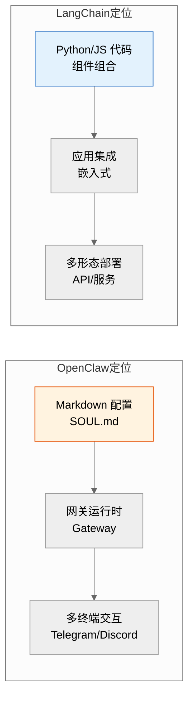
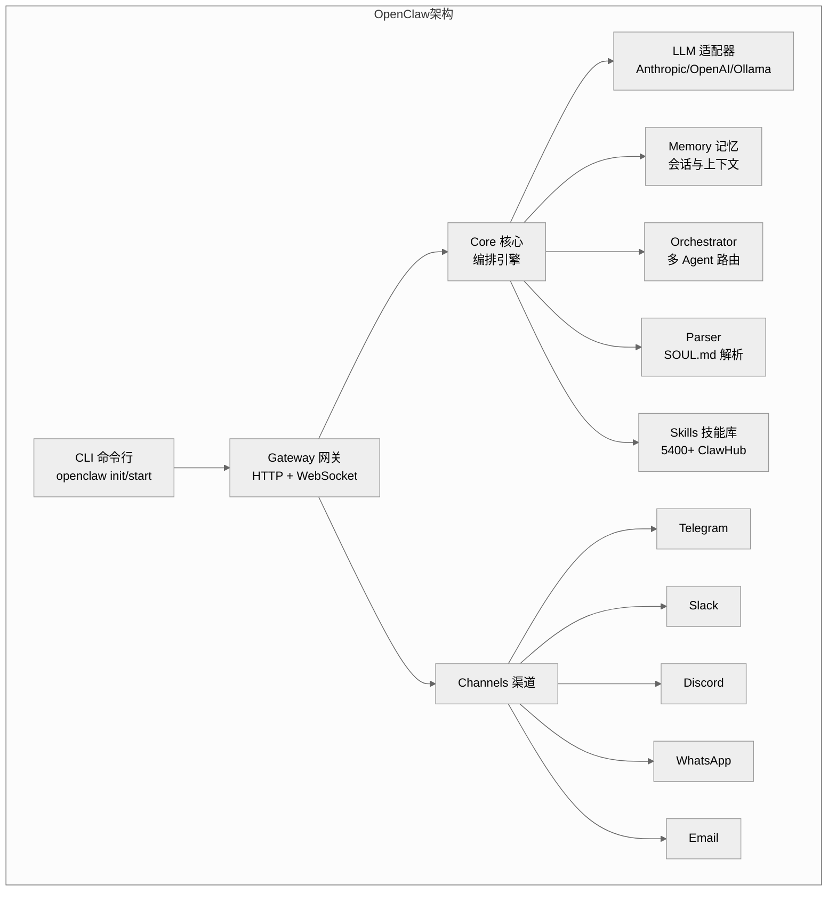
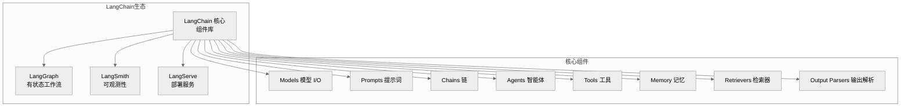
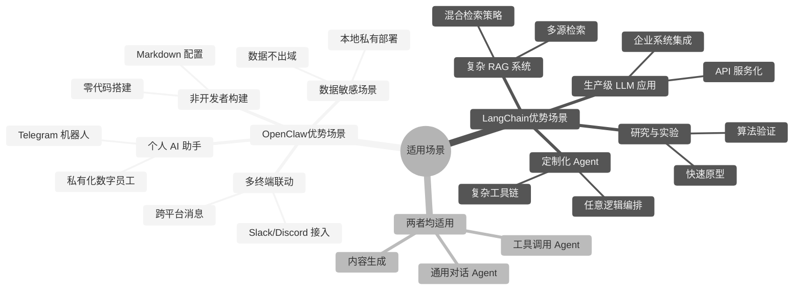
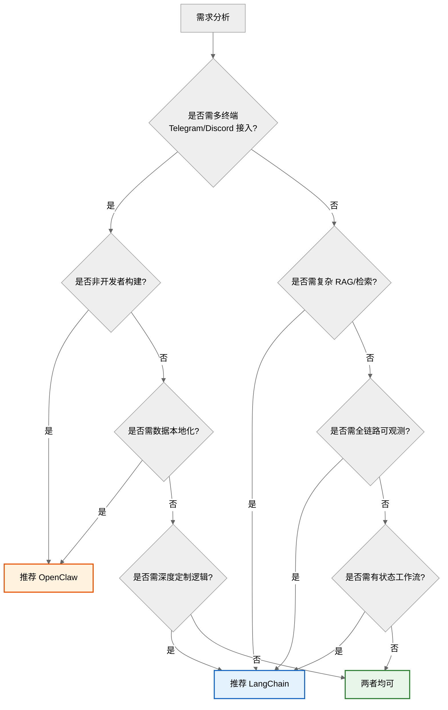

# OpenClaw 与 LangChain 对比分析详解

> 本文档系统对比开源 AI Agent 框架 OpenClaw 与 LangChain 的技术架构、核心功能、性能指标、适用场景与选型建议，为 Agent 工程化选型提供客观参考。

---

## 目录

- [一、框架概览](#一框架概览)
- [二、技术架构对比](#二技术架构对比)
- [三、核心功能模块分析](#三核心功能模块分析)
- [四、性能指标评估](#四性能指标评估)
- [五、适用场景差异](#五适用场景差异)
- [六、优缺点总结](#六优缺点总结)
- [七、选型建议](#七选型建议)
- [八、结语](#八结语)

---

## 一、框架概览

### 1.1 OpenClaw

OpenClaw 是一款**开源、可私有化部署的通用 AI 智能体框架**，基于 Node.js 构建，核心理念是"用 Markdown 定义 Agent，零代码搭建数字员工"。项目自 2025 年 12 月以 "WhatsApp Relay" 起步，2026 年 2 月正式定名 OpenClaw，迅速成为 GitHub 上星标最多的 AI Agent 项目之一（截至 2026 年 7 月已超 38 万星）。

**核心定位**：可自主规划、自主执行、自主纠错的自动化数字员工，强调本地私有化运行、数据不出域、全模型无绑定。

### 1.2 LangChain

LangChain 是一款**面向开发者的 LLM 应用开发框架**，由 Harrison Chase 于 2022 年 10 月创建，支持 Python 与 JavaScript/TypeScript 双语言生态。核心理念是"用代码组合 LLM 能力"，提供 Chains、Agents、Tools、Memory、Retrievers 等模块化组件，是当前生态最庞大的 LLM 开发框架。

**核心定位**：LLM 应用开发的"乐高积木"，通过代码组合 LLM、工具、记忆、检索等组件，构建复杂应用。

### 1.3 核心定位对比



| 维度 | OpenClaw | LangChain |
|------|----------|-----------|
| **发布时间** | 2025.12（2026.2 定名） | 2022.10 |
| **开发语言** | Node.js（TypeScript） | Python / JavaScript |
| **核心理念** | Markdown 配置驱动 | 代码组合驱动 |
| **目标用户** | 非开发者 + 开发者 | 开发者 |
| **GitHub 星标** | 38 万+（2026.7） | 约 10 万+ |
| **许可证** | MIT | MIT |
| **部署形态** | 独立网关服务 | 嵌入式库 |
| **数据隐私** | 默认本地，数据不出域 | 取决于部署方式 |

---

## 二、技术架构对比

### 2.1 OpenClaw 架构



**架构特点**：
- **网关式架构**：独立运行的 Gateway 服务，而非嵌入式库。
- **Markdown 驱动**：Agent 通过 `SOUL.md` 文件定义身份、规则、技能，无需写代码。
- **多渠道接入**：内置 Telegram/Slack/Discord/WhatsApp/Email 等渠道适配。
- **技能市场**：ClawHub 提供 5400+ 官方技能，支持自定义扩展。

**OpenClaw 目录结构**：

```
openclaw/
├── agents/              # 162 个 Agent 模板
├── gateway/             # 运行时引擎(HTTP + WebSocket)
│   ├── server.js
│   ├── routes/
│   ├── channels/        # 渠道集成
│   ├── sessions/        # 会话管理
│   └── middleware/      # 认证、限流、日志
├── skills/              # 内置技能(40+)
├── cli/                 # 命令行工具
├── core/                # 核心框架
│   ├── llm/             # LLM 适配器
│   ├── memory/          # 记忆管理
│   ├── orchestrator/    # 多 Agent 编排
│   └── parser/          # SOUL.md 解析器
├── docs/
└── package.json
```

### 2.2 LangChain 架构



**架构特点**：
- **嵌入式库**：作为依赖引入应用，与应用代码同进程。
- **代码组合**：通过 Python/JS 代码组合各组件，灵活度高。
- **LCEL 表达式**：LangChain Expression Language 用管道符组合组件。
- **生态分层**：LangChain（核心）+ LangGraph（工作流）+ LangSmith（观测）+ LangServe（部署）。

**LangChain 模块结构**：

```
langchain/
├── langchain-core/        # 核心抽象(Runnable 接口)
├── langchain/             # 链、Agent、记忆等
├── langchain-community/   # 第三方集成
├── langchain-openai/      # OpenAI 集成
├── langchain-anthropic/   # Anthropic 集成
├── langgraph/             # 有状态多步工作流
├── langsmith/             # 可观测性 SDK
└── langserve/             # API 部署
```

### 2.3 架构差异对比

| 维度 | OpenClaw | LangChain |
|------|----------|-----------|
| **运行方式** | 独立网关服务（常驻进程） | 嵌入式库（与应用同进程） |
| **Agent 定义** | Markdown 文件（SOUL.md） | Python/JS 代码 |
| **集成方式** | 通过渠道/HTTP 接入 | 代码级 import |
| **状态管理** | Gateway 内置会话管理 | Memory 模块 / LangGraph State |
| **扩展方式** | ClawHub 技能市场 | 自定义 Tool/Component |
| **部署形态** | Docker / npm 全局安装 | pip / npm 依赖 |
| **多语言** | Node.js（单语言） | Python + JS 双语言 |
| **可观测性** | 内置日志 | LangSmith 专业观测平台 |

---

## 三、核心功能模块分析

### 3.1 Agent 定义方式对比

**OpenClaw：SOUL.md 配置式**

```markdown
# SOUL.md - 研究员 Agent

## 身份
你是一名专业研究员，擅长信息检索与分析。

## 规则
- 回答必须基于可靠来源
- 标注信息出处
- 不确定时明确说明

## 技能
- browser: 搜索网页获取信息
- scraper: 提取网页内容
- file: 保存研究报告

## 行为
1. 理解研究需求
2. 搜索多来源
3. 交叉验证
4. 撰写报告
```

**LangChain：代码组合式**

```python
from langchain_core.prompts import ChatPromptTemplate
from langchain_openai import ChatOpenAI
from langchain.agents import create_tool_calling_agent, AgentExecutor
from langchain.tools import Tool

# 定义工具
tools = [
    Tool(name="search", func=search_web, description="搜索网页"),
    Tool(name="scrape", func=scrape_page, description="提取网页内容"),
    Tool(name="save", func=save_report, description="保存报告"),
]

# 定义提示词
prompt = ChatPromptTemplate.from_messages([
    ("system", "你是一名专业研究员，擅长信息检索与分析。"),
    ("human", "{input}"),
    ("placeholder", "{agent_scratchpad}"),
])

# 创建 Agent
llm = ChatOpenAI(model="gpt-4o", temperature=0)
agent = create_tool_calling_agent(llm, tools, prompt)
executor = AgentExecutor(agent=agent, tools=tools, verbose=True)

# 执行
result = executor.invoke({"input": "研究 2026 年 AI Agent 趋势"})
```

**对比要点**：

| 维度 | OpenClaw (SOUL.md) | LangChain (代码) |
|------|--------------------|------------------| 
| **学习门槛** | 低（写 Markdown） | 中高（需懂 Python/JS） |
| **灵活性** | 中（受框架约束） | 高（任意代码逻辑） |
| **版本管理** | Git 管理 Markdown | Git 管理代码 |
| **调试** | 查看日志 | 断点调试 + LangSmith |
| **复用性** | 模板复制即用 | 抽象为函数/类 |

### 3.2 工具/技能体系对比

| 维度 | OpenClaw Skills | LangChain Tools |
|------|-----------------|-----------------|
| **获取方式** | ClawHub 市场（5400+） | 自定义 + 社区集成 |
| **安装** | SOUL.md 中声明 | 代码中注册 |
| **开发** | Node.js 模块 | 任意语言函数 |
| **发现** | 市场浏览搜索 | 文档查阅 |
| **质量保障** | 官方审核 | 无统一审核 |

### 3.3 记忆机制对比

| 维度 | OpenClaw | LangChain |
|------|----------|-----------|
| **短期记忆** | Gateway 会话管理 | ConversationBufferMemory |
| **长期记忆** | 内置持久化 | 需对接向量库 |
| **上下文窗口** | 自动管理 | 需配置 Memory 类型 |
| **跨会话** | 支持 | 需自定义 |

### 3.4 多 Agent 协作对比

| 维度 | OpenClaw | LangChain |
|------|----------|-----------|
| **协作模式** | Orchestrator 路由 | LangGraph 图编排 |
| **配置方式** | AGENTS.md 团队配置 | 代码定义图节点边 |
| **通信机制** | Gateway 内部消息 | 共享 State / 消息传递 |
| **复杂度** | 低（Markdown 配置） | 高（代码定义 DAG） |

### 3.5 部署与集成对比

| 维度 | OpenClaw | LangChain |
|------|----------|-----------|
| **部署方式** | Docker / npm 全局 | 应用内依赖 |
| **服务化** | 内置 Gateway HTTP/WS | 需 LangServe 或自建 |
| **多渠道** | 内置 Telegram/Slack 等 | 需自行集成 |
| **私有化** | 默认本地，数据不出域 | 取决于部署 |
| **扩展性** | 网关水平扩展 | 应用自行扩展 |

---

## 四、性能指标评估

> 注：以下数据基于公开资料与社区反馈，实际性能因场景、模型、硬件而异。

### 4.1 启动与运行开销

| 指标 | OpenClaw | LangChain |
|------|----------|-----------|
| **冷启动** | 中（Gateway 进程启动） | 低（库加载） |
| **内存占用** | 较高（常驻网关进程） | 低（按需加载） |
| **依赖体积** | 中（Node.js + 依赖） | 大（Python + 多集成） |
| **首条消息延迟** | 中（需建立会话） | 低（直接调用） |

### 4.2 开发效率

| 指标 | OpenClaw | LangChain |
|------|----------|-----------|
| **搭建首个 Agent** | 分钟级（init + SOUL.md） | 小时级（编码 + 调试） |
| **添加新技能** | 分钟级（市场安装） | 小时级（编码实现） |
| **接入新渠道** | 分钟级（配置启用） | 天级（自行集成） |
| **定制复杂逻辑** | 受限（框架约束） | 灵活（任意代码） |

### 4.3 生态成熟度

| 指标 | OpenClaw | LangChain |
|------|----------|-----------|
| **GitHub 星标** | 38 万+（2026.7） | 10 万+ |
| **发布频率** | 极高（日均 1-2 次） | 高（周级） |
| **社区规模** | 快速增长中 | 庞大且成熟 |
| **文档完备度** | 完善 | 非常完善 |
| **企业采用** | 起步阶段 | 广泛 |
| **教程资源** | 增长中 | 极丰富 |

### 4.4 可观测性

| 维度 | OpenClaw | LangChain |
|------|----------|-----------|
| **日志** | 内置结构化日志 | 需自行配置 |
| **追踪** | 基础会话追踪 | LangSmith 全链路追踪 |
| **监控** | Gateway 监控 | LangSmith Dashboard |
| **调试** | 日志查看 | 断点 + LangSmith 回放 |
| **评估** | 基础 | LangSmith 评估集 |

---

## 五、适用场景差异



### 5.1 OpenClaw 优势场景

| 场景 | 说明 | 优势 |
|------|------|------|
| **个人 AI 助手** | Telegram/Slack 上的私人助理 | 多渠道内置，零代码 |
| **私有化数字员工** | 企业内部自动化员工 | 数据本地，安全合规 |
| **非开发者构建** | 产品/运营人员搭建 Agent | Markdown 配置，无需编码 |
| **多终端联动** | 一个 Agent 多平台接入 | 内置渠道适配 |
| **快速验证想法** | 分钟级搭建可用 Agent | 模板丰富，开箱即用 |

### 5.2 LangChain 优势场景

| 场景 | 说明 | 优势 |
|------|------|------|
| **复杂 RAG 系统** | 多源检索 + 混合策略 | Retrievers 生态丰富 |
| **定制化 Agent** | 任意逻辑编排 | 代码级灵活 |
| **生产级 LLM 应用** | API 服务化、企业集成 | LangServe + 生态 |
| **工作流编排** | 多步有状态流程 | LangGraph 强大 |
| **研究与实验** | 算法验证、原型 | 组件可任意组合 |
| **可观测性需求** | 需全链路追踪评估 | LangSmith 专业 |

### 5.3 场景选型决策树



---

## 六、优缺点总结

### 6.1 OpenClaw

**优点**：

| 优点 | 说明 |
|------|------|
| ✅ 零代码门槛 | Markdown 定义 Agent，非开发者可用 |
| ✅ 多渠道内置 | Telegram/Slack/Discord 开箱即用 |
| ✅ 私有化优先 | 默认本地运行，数据不出域 |
| ✅ 技能市场丰富 | ClawHub 5400+ 技能 |
| ✅ 模板生态 | 162 个 Agent 模板覆盖 24 类场景 |
| ✅ 模型无关 | 支持 Anthropic/OpenAI/Ollama 等 |
| ✅ 部署简单 | npm 一键安装或 Docker |
| ✅ 社区活跃 | 38 万星，迭代极快 |

**缺点**：

| 缺点 | 说明 |
|------|------|
| ❌ 灵活度受限 | 框架约束，复杂逻辑难实现 |
| ❌ 单语言 | 仅 Node.js，无 Python 生态 |
| ❌ 可观测性弱 | 缺乏专业追踪评估平台 |
| ❌ RAG 能力弱 | 检索能力不如 LangChain 丰富 |
| ❌ 企业成熟度 | 项目较新，生产案例较少 |
| ❌ 定制化成本 | 深度定制需改源码 |

### 6.2 LangChain

**优点**：

| 优点 | 说明 |
|------|------|
| ✅ 极致灵活 | 代码组合，任意逻辑可实现 |
| ✅ 生态最庞大 | 集成最多模型/工具/向量库 |
| ✅ RAG 能力强 | Retrievers 体系完善 |
| ✅ LangGraph 工作流 | 有状态多步流程编排 |
| ✅ LangSmith 观测 | 全链路追踪与评估 |
| ✅ 双语言 | Python + JS/TS |
| ✅ 企业成熟 | 大量生产案例 |
| ✅ 文档丰富 | 教程与示例极多 |

**缺点**：

| 缺点 | 说明 |
|------|------|
| ❌ 学习曲线陡 | 需懂代码 + 理解抽象 |
| ❌ 开发成本高 | 编码 + 调试 + 测试 |
| ❌ 多渠道需自建 | 无内置 Telegram 等 |
| ❌ 抽象泄漏 | 版本迭代快，API 易变 |
| ❌ 依赖庞大 | 完整安装体积大 |
| ❌ 私有化需配置 | 非默认本地，需自行部署 |

---

## 七、选型建议

### 7.1 选型矩阵

| 需求特征 | 推荐框架 | 理由 |
|----------|----------|------|
| **非开发者搭建 Agent** | OpenClaw | Markdown 配置，零代码 |
| **需 Telegram/Discord 接入** | OpenClaw | 内置多渠道 |
| **数据必须本地化** | OpenClaw | 默认私有部署 |
| **快速搭建个人助手** | OpenClaw | 模板丰富，分钟级 |
| **复杂 RAG 系统** | LangChain | Retrievers 生态强 |
| **需深度定制逻辑** | LangChain | 代码级灵活 |
| **生产级 LLM 服务** | LangChain | LangServe + 成熟生态 |
| **需全链路可观测** | LangChain | LangSmith 专业 |
| **有状态多步工作流** | LangChain | LangGraph 强大 |
| **团队全用 Python** | LangChain | 原生 Python 生态 |
| **既要多渠道又要定制** | 两者结合 | OpenClaw 做接入 + LangChain 做核心 |

### 7.2 综合评分

| 维度 | OpenClaw | LangChain | 说明 |
|------|----------|-----------|------|
| **易用性** | ★★★★★ | ★★★☆☆ | OpenClaw 零代码优势明显 |
| **灵活性** | ★★★☆☆ | ★★★★★ | LangChain 代码级灵活 |
| **生态丰富度** | ★★★★☆ | ★★★★★ | LangChain 集成更多 |
| **RAG 能力** | ★★☆☆☆ | ★★★★★ | LangChain 检索体系完善 |
| **多渠道** | ★★★★★ | ★★☆☆☆ | OpenClaw 内置渠道 |
| **可观测性** | ★★☆☆☆ | ★★★★★ | LangSmith 优势大 |
| **私有化** | ★★★★★ | ★★★☆☆ | OpenClaw 默认本地 |
| **企业成熟度** | ★★★☆☆ | ★★★★★ | LangChain 案例多 |
| **社区活跃度** | ★★★★★ | ★★★★★ | 两者均活跃 |
| **文档质量** | ★★★★☆ | ★★★★★ | LangChain 更完善 |

### 7.3 决策建议

**选择 OpenClaw 如果你**：
- 是非开发者或希望零代码搭建 Agent
- 需要快速接入 Telegram/Slack/Discord 等渠道
- 对数据隐私有强要求，需本地私有化
- 想要开箱即用的数字员工，而非深度定制
- 偏好配置优于代码的工作方式

**选择 LangChain 如果你**：
- 是开发者，需要代码级控制
- 要构建复杂 RAG 检索系统
- 需要深度定制的 Agent 逻辑
- 需要全链路可观测性与评估
- 要构建生产级 LLM API 服务
- 团队以 Python 为主

**两者结合**：
- 用 OpenClaw 做多渠道接入与消息路由
- 用 LangChain 做核心 Agent 逻辑与 RAG
- 通过 HTTP API 互通，各取所长

---

## 八、结语

OpenClaw 与 LangChain 代表了 AI Agent 框架的两种范式：

- **OpenClaw**：配置驱动、产品化导向，降低 Agent 搭建门槛，适合快速落地与多渠道场景。
- **LangChain**：代码驱动、工程化导向，提供极致灵活性与生态，适合复杂应用与生产系统。

两者并非互斥，而是互补。选型的核心在于明确需求：**追求快速接入与低门槛选 OpenClaw，追求灵活定制与生态深度选 LangChain**。

随着 AI Agent 技术演进，框架边界逐渐模糊——OpenClaw 在增强可定制性，LangChain 在降低使用门槛。未来趋势是两者优势融合：既保持低门槛配置，又提供深度定制能力。

---

## 参考资料

- [OpenClaw GitHub 仓库](https://github.com/openclaw/openclaw)
- [OpenClaw 官方文档](https://openclaw.ai)
- [OpenClaw GitHub 指南 - CrewClaw](https://www.crewclaw.com/blog/openclaw-github-repository-guide)
- [OpenClaw AI Agent GitHub 完整指南](https://www.crewclaw.com/blog/openclaw-ai-agent-github-guide)
- [最新版 OpenClaw 功能介绍及部署 - 阿里云](https://developer.aliyun.com/article/1749940)
- [LangChain 官方文档](https://python.langchain.com)
- [LangGraph 文档](https://langchain-ai.github.io/langgraph)
- [LangSmith 文档](https://docs.smith.langchain.com)
