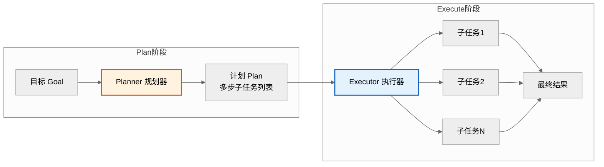
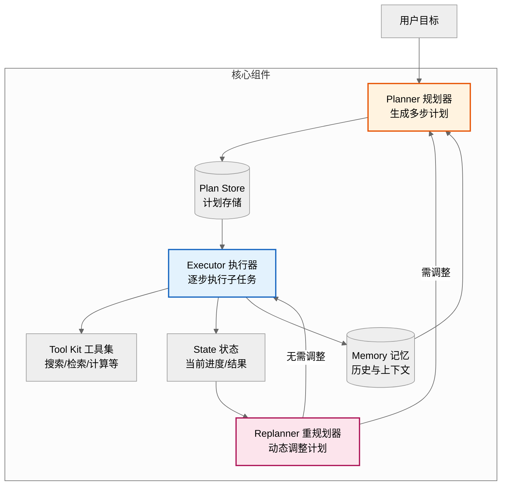
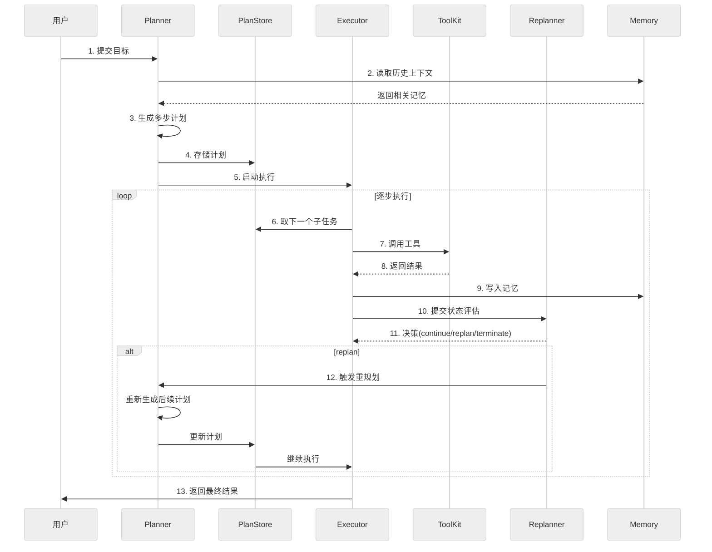
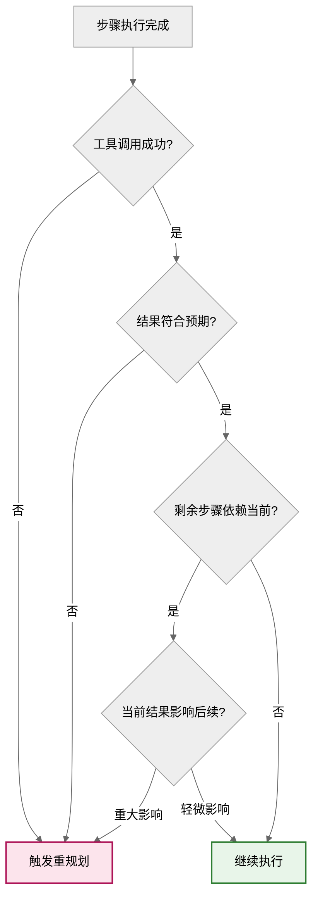
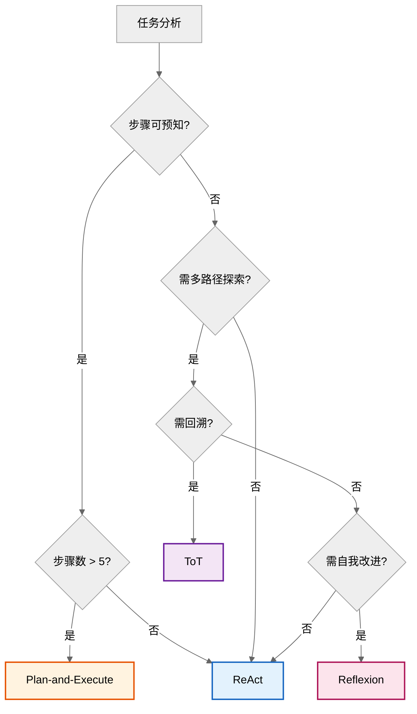
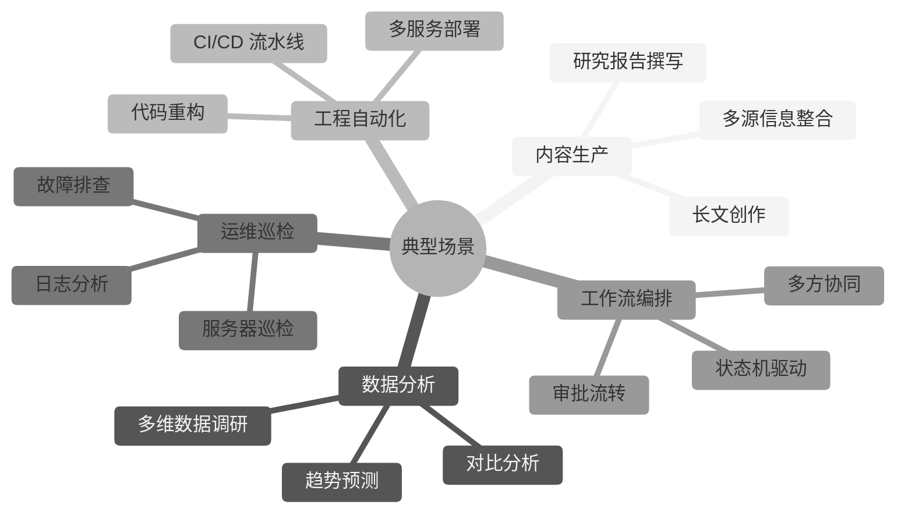

# Plan-and-Execute 模式面试题集详解

> 本文档系统梳理 Agent 规划范式中 Plan-and-Execute（计划-执行）模式的面试题，涵盖原理、架构、组件、流程、对比、场景、优劣及工程实践，难度覆盖基础到架构级，每题配考察点、参考答案与评分标准。

---

## 目录

- [Plan-and-Execute 模式面试题集详解](#plan-and-execute-模式面试题集详解)
  - [目录](#目录)
  - [一、概念与原理](#一概念与原理)
    - [1.1 Plan-and-Execute 模式定义](#11-plan-and-execute-模式定义)
    - [1.2 与 ReAct 模式的本质区别](#12-与-react-模式的本质区别)
    - [1.3 计划生成策略](#13-计划生成策略)
  - [二、架构与组件](#二架构与组件)
    - [2.1 核心架构概述](#21-核心架构概述)
    - [2.2 Planner 规划器设计](#22-planner-规划器设计)
    - [2.3 Executor 执行器设计](#23-executor-执行器设计)
    - [2.4 Replanner 重规划器](#24-replanner-重规划器)
  - [三、工作流程](#三工作流程)
    - [3.1 完整执行流程](#31-完整执行流程)
    - [3.2 重规划触发条件](#32-重规划触发条件)
  - [四、模式对比](#四模式对比)
    - [4.1 与 ReAct / ToT / Reflexion 对比](#41-与-react--tot--reflexion-对比)
    - [4.2 与 Plan-and-Solve 对比](#42-与-plan-and-solve-对比)
  - [五、应用场景](#五应用场景)
    - [5.1 典型场景分析](#51-典型场景分析)
    - [5.2 场景选型决策](#52-场景选型决策)
  - [六、优势与局限](#六优势与局限)
    - [6.1 优势与局限评估](#61-优势与局限评估)
    - [6.2 局限性缓解方案](#62-局限性缓解方案)
  - [七、工程实践](#七工程实践)
    - [7.1 LangChain 实现](#71-langchain-实现)
    - [7.2 错误处理与恢复](#72-错误处理与恢复)
    - [7.3 性能优化](#73-性能优化)
  - [八、考点速查表](#八考点速查表)

---

## 一、概念与原理

### 1.1 Plan-and-Execute 模式定义

**难度**：基础　**类型**：概念题　**分值**：5

**考察点**：模式定义、核心思想、两阶段划分

**问题描述**：
请简述 Plan-and-Execute 模式的定义，说明其核心思想与两阶段划分。

**参考答案要点**：

**定义**：Plan-and-Execute 是一种 Agent 规划范式，将任务求解显式划分为**计划（Plan）**与**执行（Execute）**两个阶段：先由 Planner 一次性生成完整的多步计划，再由 Executor 逐步执行，必要时由 Replanner 动态调整。

**核心思想**：
- **先想后做**：先全局规划，再逐步执行，避免"走一步看一步"的短视。
- **关注点分离**：规划（高层策略）与执行（底层操作）解耦，各自专注。
- **动态修正**：执行中发现偏差可触发重规划，兼顾稳定性与灵活性。

**两阶段划分**：



**评分标准**：定义准确 2 分；核心思想 2 分；两阶段图示 1 分。

---

### 1.2 与 ReAct 模式的本质区别

**难度**：中级　**类型**：原理题　**分值**：8

**考察点**：规划粒度、思考时机、token 消耗、适用场景

**问题描述**：
请从规划粒度、思考时机、token 消耗、适用场景四个维度，对比 Plan-and-Execute 与 ReAct 模式的本质区别。

**参考答案要点**：

| 维度 | Plan-and-Execute | ReAct |
|------|------------------|-------|
| **规划粒度** | 全局多步计划，一次生成 | 单步滚动，每步即时决策 |
| **思考时机** | 起点一次性规划 + 偏差时重规划 | 每一步都 Thought→Action→Observation |
| **Token 消耗** | 规划阶段集中消耗，执行阶段较少 | 每步重复携带历史，长任务消耗大 |
| **长任务稳定性** | 计划清晰，不易跑偏 | 长链路易累积误差、陷入循环 |
| **动态环境适应** | 需重规划才能调整，较慢 | 即时响应变化，灵活 |
| **典型适用** | 结构稳定、步骤可预知 | 动态、探索性、步骤不可预知 |

**本质区别一句话**：
> Plan-and-Execute 是"先规划全局再执行"，ReAct 是"边走边想"。前者重稳定，后者重灵活。

**Token 消耗示例**（10 步任务）：

```
Plan-and-Execute:
  规划: 1 次大 prompt(含目标) → 生成 10 步计划
  执行: 10 次小 prompt(仅当前子任务) → 逐步执行
  总计: 1 次大 + 10 次小

ReAct:
  每步: 携带完整历史(逐步增长) → Thought+Action+Observation
  总计: 10 次逐步增长的 prompt(step5 时已含前4步全部历史)
```

**评分标准**：四维度对比各 1.5 分；本质区别 1 分；token 示例 1 分。

---

### 1.3 计划生成策略

**难度**：中级　**类型**：原理题　**分值**：8

**考察点**：一次性规划 vs 渐进规划、计划表示形式、深度控制

**问题描述**：
Plan-and-Execute 中 Planner 生成计划有哪些策略？各自的优缺点与适用场景是什么？

**参考答案要点**：

**策略一：一次性全局规划（One-shot Planning）**

Planner 在起点一次性生成全部子任务：

```
目标: "调研并对比 3 款向量数据库,输出选型报告"

计划:
  1. 搜索主流向量数据库列表
  2. 筛选 3 款代表性产品(Milvus/Qdrant/Weaviate)
  3. 检索 Milvus 特性与性能数据
  4. 检索 Qdrant 特性与性能数据
  5. 检索 Weaviate 特性与性能数据
  6. 对比维度(性能/易用/生态/成本)
  7. 撰写选型报告
```

- ✅ 优点：全局视角，步骤连贯
- ❌ 缺点：信息不足时计划可能不准
- 适用：步骤可预知的结构化任务

**策略二：分层规划（Hierarchical Planning）**

先生成粗粒度大纲，执行时再细化：

```
大纲(粗):
  1. 调研准备
  2. 数据收集
  3. 对比分析
  4. 报告撰写

执行到"数据收集"时细化为:
  2.1 确定 3 款产品
  2.2 检索产品A
  2.3 检索产品B
  2.4 检索产品C
```

- ✅ 优点：兼顾全局与细节，降低起点规划难度
- ❌ 缺点：实现复杂
- 适用：深度大、细节难预知的任务

**策略三：渐进规划（Progressive Planning）**

只规划前 N 步，执行后再规划后续：

- ✅ 优点：基于真实信息规划，更准确
- ❌ 缺点：全局视角弱，可能局部最优
- 适用：信息逐步揭示的探索性任务

**计划表示形式**：

| 形式 | 示例 | 适用 |
|------|------|------|
| **有序列表** | `[step1, step2, ...]` | 线性任务 |
| **DAG** | 有向无环图，支持并行 | 含并行子任务 |
| **树结构** | 树形，支持条件分支 | 含分支决策 |
| **自然语言** | 文字描述步骤 | 灵活但难执行 |

**评分标准**：三种策略各 2 分；表示形式 2 分。

---

## 二、架构与组件

### 2.1 核心架构概述

**难度**：中级　**类型**：架构题　**分值**：8

**考察点**：组件划分、组件协作、状态流转

**问题描述**：
请画出 Plan-and-Execute 的核心架构图，说明各组件职责与协作关系。

**参考答案要点**：



**六大核心组件**：

| 组件 | 职责 | 输入 → 输出 |
|------|------|------------|
| **Planner** | 生成完整计划 | 目标 → 子任务列表 |
| **Plan Store** | 存储与索引计划 | 计划 → 持久化 |
| **Executor** | 执行单个子任务 | 子任务 → 结果 |
| **Tool Kit** | 提供底层工具 | 工具调用 → 工具结果 |
| **Replanner** | 评估与重规划 | 状态+计划 → 新计划 |
| **Memory** | 存储历史上下文 | 执行结果 → 记忆 |

**协作关系**：
1. Planner 读 Memory，生成计划写入 Plan Store。
2. Executor 从 Plan Store 取子任务，调用 Tool Kit 执行。
3. 执行结果写入 State 与 Memory。
4. Replanner 评估 State，决定继续/重规划/终止。
5. 重规划时 Planner 读最新 Memory 重新生成。

**评分标准**：架构图 3 分；组件职责 3 分；协作关系 2 分。

---

### 2.2 Planner 规划器设计

**难度**：高级　**类型**：设计题　**分值**：10

**考察点**：Prompt 设计、计划结构、规划模型选择、规划质量评估

**问题描述**：
请设计一个 Planner 规划器，要求：①支持一次性规划；②计划结构可执行；③支持规划质量自检。

**参考答案要点**：

**Planner Prompt 设计**：

```python
PLANNER_PROMPT = """你是一个任务规划专家。给定用户目标,生成一个清晰、可执行的多步计划。

# 规划原则
1. 每步子任务必须是原子操作(可被单一工具执行)
2. 步骤之间有明确依赖顺序
3. 步骤数量 3-12 步,过少说明拆分不足,过多说明粒度过细
4. 每步需明确:要做什么 + 用什么工具 + 预期输出
5. 考虑失败兜底(如搜索无结果时的替代方案)

# 输出格式(严格 JSON)
{{
  "goal": "用户目标",
  "steps": [
    {{
      "id": 1,
      "task": "子任务描述",
      "tool": "search|retriever|calculator|writer|...",
      "depends_on": [],
      "expected_output": "预期输出描述"
    }}
  ],
  "self_check": {{
    "completeness": "计划是否覆盖目标所有方面",
    "feasibility": "每步是否可执行",
    "order": "步骤顺序是否合理"
  }}
}}

# 用户目标
{goal}

# 历史上下文(可选)
{context}
"""
```

**Planner 实现**：

```python
from pydantic import BaseModel, Field
from typing import Optional
from langchain_openai import ChatOpenAI
from langchain_core.messages import SystemMessage, HumanMessage


class PlanStep(BaseModel):
    """单个计划步骤"""
    id: int
    task: str = Field(description="子任务描述")
    tool: str = Field(description="使用的工具")
    depends_on: list[int] = Field(default_factory=list, description="依赖步骤ID")
    expected_output: str = Field(description="预期输出")


class Plan(BaseModel):
    """完整计划"""
    goal: str
    steps: list[PlanStep]
    self_check: dict = Field(description="自检结果")


class Planner:
    """规划器:生成多步计划"""

    def __init__(self, llm: ChatOpenAI):
        self.llm = llm

    async def create_plan(self, goal: str, context: str = "") -> Plan:
        """生成完整计划"""
        messages = [
            SystemMessage(content=PLANNER_PROMPT),
            HumanMessage(content=f"目标: {goal}\n\n上下文: {context}"),
        ]

        # 结构化输出
        structured_llm = self.llm.with_structured_output(Plan)
        plan = await structured_llm.ainvoke(messages)

        # 规划质量自检
        self._validate_plan(plan)

        return plan

    def _validate_plan(self, plan: Plan):
        """计划质量校验"""
        # 1. 步骤数检查
        if not (3 <= len(plan.steps) <= 12):
            raise ValueError(f"步骤数 {len(plan.steps)} 不在 3-12 范围")

        # 2. ID 连续性
        ids = [s.id for s in plan.steps]
        if ids != list(range(1, len(ids) + 1)):
            raise ValueError(f"步骤ID不连续: {ids}")

        # 3. 依赖合法性
        for step in plan.steps:
            for dep in step.depends_on:
                if dep not in ids or dep >= step.id:
                    raise ValueError(f"步骤 {step.id} 依赖非法: {dep}")

        # 4. 自检结果
        check = plan.self_check
        if "completeness" not in check or "feasibility" not in check:
            raise ValueError("自检字段缺失")
```

**规划模型选择**：

| 模型 | 规划能力 | 成本 | 适用 |
|------|----------|------|------|
| GPT-4o / Claude 3.5 Sonnet | 强 | 高 | 复杂任务规划 |
| GPT-4o-mini / Claude Haiku | 中 | 低 | 简单任务规划 |
| o1 / DeepSeek-R1 | 极强（推理） | 极高 | 极复杂推理任务 |

> **经验**：Planner 用强模型（规划是高价值环节），Executor 可用轻量模型（执行是高频环节），兼顾质量与成本。

**评分标准**：Prompt 设计 3 分；结构化实现 3 分；质量校验 2 分；模型选型 2 分。

---

### 2.3 Executor 执行器设计

**难度**：高级　**类型**：实现题　**分值**：10

**考察点**：工具调用、结果聚合、上下文管理、并行执行

**问题描述**：
请实现 Executor 执行器，要求：①支持工具调用；②支持依赖关系；③支持并行执行无依赖步骤。

**参考答案要点**：

```python
import asyncio
from typing import Any
from collections import defaultdict


class Executor:
    """执行器:逐步执行计划,支持依赖与并行"""

    def __init__(self, tools: dict[str, Any]):
        """
        tools: {tool_name: callable}
        """
        self.tools = tools
        self.results: dict[int, Any] = {}  # step_id -> result

    async def execute_plan(self, plan: Plan) -> dict[int, Any]:
        """执行整个计划"""
        # 构建依赖图
        dependency_graph = self._build_dependency_graph(plan)
        completed: set[int] = set()

        while len(completed) < len(plan.steps):
            # 找出当前可执行的步骤(依赖已完成)
            ready = [
                step for step in plan.steps
                if step.id not in completed
                and all(dep in completed for dep in step.depends_on)
            ]

            if not ready:
                # 死锁检测
                raise RuntimeError("检测到依赖死锁,无法继续执行")

            # 并行执行可执行步骤
            tasks = [self._execute_step(step) for step in ready]
            step_results = await asyncio.gather(*tasks, return_exceptions=True)

            # 记录结果
            for step, result in zip(ready, step_results):
                if isinstance(result, Exception):
                    # 异常处理:记录失败,交由 Replanner 决策
                    self.results[step.id] = {"status": "failed", "error": str(result)}
                else:
                    self.results[step.id] = {"status": "success", "data": result}
                    completed.add(step.id)

            # 注:失败步骤不加入 completed,会阻塞后续依赖它的步骤
            # 由 Replanner 检测并重规划

        return self.results

    async def _execute_step(self, step: PlanStep) -> Any:
        """执行单个步骤"""
        tool = self.tools.get(step.tool)
        if tool is None:
            raise ValueError(f"工具不存在: {step.tool}")

        # 构建步骤上下文(含依赖步骤结果)
        context = {
            "task": step.task,
            "expected_output": step.expected_output,
            "dependency_results": {
                dep_id: self.results[dep_id]
                for dep_id in step.depends_on
                if dep_id in self.results
            },
        }

        # 调用工具
        if asyncio.iscoroutinefunction(tool):
            result = await tool(context)
        else:
            result = await asyncio.to_thread(tool, context)

        return result

    def _build_dependency_graph(self, plan: Plan) -> dict[int, list[int]]:
        """构建依赖图:step_id -> [依赖的step_id]"""
        graph = {step.id: step.depends_on for step in plan.steps}
        return graph
```

**关键设计点**：

| 设计点 | 说明 |
|--------|------|
| **依赖图** | 根据 `depends_on` 构建有向图，拓扑排序决定执行顺序 |
| **并行执行** | 无依赖的步骤用 `asyncio.gather` 并行，提升效率 |
| **死锁检测** | 若无步骤可执行且未完成，说明依赖环，报错 |
| **失败隔离** | 失败步骤不加入 completed，后续依赖步骤被阻塞 |
| **上下文注入** | 执行时注入依赖步骤结果，避免重复计算 |

**评分标准**：工具调用 2 分；依赖管理 3 分；并行执行 3 分；异常处理 2 分。

---

### 2.4 Replanner 重规划器

**难度**：高级　**类型**：设计题　**分值**：10

**考察点**：重规划触发、增量调整、状态评估

**问题描述**：
请设计 Replanner 重规划器，说明其触发条件、决策逻辑与重规划策略。

**参考答案要点**：

**触发条件**：

| 触发条件 | 说明 | 示例 |
|----------|------|------|
| **步骤失败** | 工具调用异常或返回错误 | 搜索 API 超时 |
| **结果不符预期** | 输出与 expected_output 差异大 | 检索为空 |
| **新信息揭示** | 执行中发现目标需调整 | 发现需对比 4 款而非 3 款 |
| **环境变化** | 外部状态改变 | 数据库 schema 变更 |
| **死锁** | 依赖无法满足 | 依赖步骤永久失败 |

**Replanner 决策逻辑**：

```python
REPLANNER_PROMPT = """你是计划调整专家。根据当前执行状态,决定后续动作。

# 当前计划
{plan}

# 已执行步骤及结果
{executed_results}

# 当前状态
- 已完成: {completed_steps}
- 失败步骤: {failed_steps}
- 剩余步骤: {remaining_steps}

# 决策选项(选一个)
1. continue: 继续执行剩余计划(无需调整)
2. replan: 重新生成后续计划(基于已得信息)
3. terminate: 终止任务(无法完成或已完成)

# 输出格式
{{
  "decision": "continue|replan|terminate",
  "reason": "决策原因",
  "new_steps": [  // 仅 replan 时填写
    {{"task": "...", "tool": "...", "depends_on": [...], "expected_output": "..."}}
  ]
}}
"""
```

**Replanner 实现**：

```python
class Replanner:
    """重规划器:评估状态,决定继续/重规划/终止"""

    def __init__(self, llm: ChatOpenAI):
        self.llm = llm

    async def evaluate(
        self,
        plan: Plan,
        executed_results: dict[int, Any],
    ) -> dict:
        """评估当前状态,返回决策"""
        completed = {
            sid: r for sid, r in executed_results.items()
            if r.get("status") == "success"
        }
        failed = {
            sid: r for sid, r in executed_results.items()
            if r.get("status") == "failed"
        }
        remaining = [s for s in plan.steps if s.id not in executed_results]

        # 简单规则前置判断(减少 LLM 调用)
        # 1. 无失败且剩余步骤存在 → 继续
        if not failed and remaining:
            return {"decision": "continue", "reason": "无失败,继续执行"}

        # 2. 失败且无剩余 → 终止或重规划
        if failed and not remaining:
            # 检查失败是否可恢复
            if self._is_recoverable(failed):
                return await self._llm_evaluate(plan, executed_results)
            return {"decision": "terminate", "reason": "失败不可恢复"}

        # 3. 其他情况交由 LLM 决策
        return await self._llm_evaluate(plan, executed_results)

    async def _llm_evaluate(self, plan: Plan, executed_results: dict) -> dict:
        """调用 LLM 进行复杂决策"""
        prompt = REPLANNER_PROMPT.format(
            plan=plan.model_dump_json(),
            executed_results=str(executed_results),
            completed_steps=list(executed_results.keys()),
            failed_steps=[
                sid for sid, r in executed_results.items()
                if r.get("status") == "failed"
            ],
            remaining_steps=[s.id for s in plan.steps if s.id not in executed_results],
        )
        # 调用 LLM 返回决策
        response = await self.llm.ainvoke(prompt)
        return parse_decision(response)

    def _is_recoverable(self, failed: dict) -> bool:
        """判断失败是否可恢复"""
        # 简化判断:超时类失败可重试,逻辑错误不可恢复
        for r in failed.values():
            if "timeout" in r.get("error", "").lower():
                return True
        return False
```

**重规划策略**：

| 策略 | 说明 | 适用 |
|------|------|------|
| **增量调整** | 仅修改失败步骤及后续 | 小幅偏差 |
| **部分重规划** | 从失败点重新生成后续 | 中等偏差 |
| **全量重规划** | 基于已得信息重新规划 | 重大偏差 |
| **降级执行** | 用简化替代方案 | 资源受限 |

**评分标准**：触发条件 2 分；决策逻辑 3 分；实现 3 分；策略 2 分。

---

## 三、工作流程

### 3.1 完整执行流程

**难度**：中级　**类型**：流程题　**分值**：8

**考察点**：端到端流程、组件协作、状态流转

**问题描述**：
请详细描述 Plan-and-Execute 的一次完整执行流程，包括各组件交互时序。

**参考答案要点**：



**流程要点**：

| 阶段 | 关键动作 | 关注点 |
|------|----------|--------|
| **规划** | 读记忆→生成计划→存储 | 计划质量与完整性 |
| **执行** | 取任务→调工具→写记忆 | 工具调用正确性 |
| **评估** | 比对状态→决策 | 重规划时机 |
| **重规划** | 读最新记忆→生成新计划 | 增量 vs 全量 |
| **终止** | 返回结果 | 结果完整性 |

**评分标准**：时序图 3 分；流程要点 3 分；组件交互 2 分。

---

### 3.2 重规划触发条件

**难度**：中级　**类型**：分析题　**分值**：6

**考察点**：触发条件识别、误触发避免、触发阈值

**问题描述**：
在执行过程中，如何判断是否需要触发重规划？如何避免过度触发导致的"规划震荡"？

**参考答案要点**：

**触发判断框架**：



**避免规划震荡的策略**：

| 策略 | 说明 |
|------|------|
| **重规划冷却期** | 两次重规划间至少执行 1 步，避免连续重规划 |
| **重规划次数上限** | 单任务最多重规划 N 次（如 3 次），超出则终止 |
| **相似度判断** | 新计划与旧计划相似度 > 阈值时不重规划 |
| **影响度评估** | 仅当偏差对后续影响重大时才重规划 |
| **人工介入** | 多次重规划失败后请求人工决策 |

**评分标准**：触发框架 3 分；震荡避免 3 分。

---

## 四、模式对比

### 4.1 与 ReAct / ToT / Reflexion 对比

**难度**：高级　**类型**：分析题　**分值**：10

**考察点**：四种范式原理、优缺点、适用场景

**问题描述**：
请对比 Plan-and-Execute、ReAct、Tree-of-Thought (ToT)、Reflexion 四种 Agent 范式的原理、优缺点与适用场景。

**参考答案要点**：

| 维度 | Plan-and-Execute | ReAct | ToT | Reflexion |
|------|------------------|-------|-----|-----------|
| **核心思想** | 先全局规划再执行 | 边想边做 | 树搜索多思路 | 自我反思改进 |
| **规划粒度** | 全局多步 | 单步滚动 | 多分支探索 | 基于反馈修正 |
| **思考结构** | 线性计划 | Thought-Action-Observation 循环 | 树形多路径 | Action-Critic-Reflect 循环 |
| **回溯能力** | 重规划 | 无（只能继续） | 支持回溯 | 通过反思改进下次 |
| **Token 消耗** | 中（规划集中） | 高（历史累积） | 极高（多路径） | 高（含反思） |
| **长任务稳定性** | 强 | 弱（易跑偏） | 中 | 中 |
| **动态适应** | 中（需重规划） | 强 | 中 | 强 |
| **实现复杂度** | 中 | 低 | 高 | 中 |
| **典型适用** | 结构稳定多步任务 | 动态探索 | 复杂推理（数学/谜题） | 需自我改进的任务 |

**选择决策树**：



**评分标准**：四范式对比各 2 分；决策树 2 分。

---

### 4.2 与 Plan-and-Solve 对比

**难度**：高级　**类型**：分析题　**分值**：8

**考察点**：两者渊源、差异、适用

**问题描述**：
Plan-and-Execute 与 Plan-and-Solve 都是"先规划后执行"，两者有何区别？

**参考答案要点**：

| 维度 | Plan-and-Execute | Plan-and-Solve |
|------|------------------|----------------|
| **起源** | Agent 工程范式 | CoT 提示工程（2023 论文） |
| **层级** | 系统架构级 | Prompt 级 |
| **计划形式** | 显式结构化（JSON/列表） | 隐式（融入 Prompt） |
| **执行者** | 独立 Executor 组件 | 同一 LLM 调用 |
| **重规划** | 显式 Replanner | 无（一次生成） |
| **工具调用** | 显式工具集 | 无（纯推理） |
| **典型用途** | Agent 工程实现 | 提升推理任务准确率 |

**一句话区别**：
> Plan-and-Solve 是 Prompt 技巧（让 LLM "先列计划再解答"），Plan-and-Execute 是系统架构（Planner 与 Executor 分离的工程范式）。

**评分标准**：区别 4 分；一句话总结 2 分；适用 2 分。

---

## 五、应用场景

### 5.1 典型场景分析

**难度**：中级　**类型**：应用题　**分值**：8

**考察点**：场景识别、模式适配、案例拆解

**问题描述**：
请列举 Plan-and-Execute 模式的典型应用场景，并说明为何适合该模式。

**参考答案要点**：



**场景一：研究报告撰写**

```
目标: 撰写《2026 AI Agent 框架选型报告》

计划:
  1. 搜索主流 Agent 框架列表(工具: search)
  2. 筛选 5 款代表性框架(工具: filter)
  3. 检索框架A特性(工具: search+scrape)
  4. 检索框架B特性(工具: search+scrape)
  5. 检索框架C特性(工具: search+scrape)
  6. 对比维度评分(工具: analyzer)
  7. 撰写报告(工具: writer)

适合原因: 步骤清晰可预知,检索可并行,长链路需稳定
```

**场景二：代码重构**

```
目标: 将单体服务拆分为微服务

计划:
  1. 分析现有模块依赖(工具: code_analyzer)
  2. 识别可拆分边界(工具: dependency_graph)
  3. 设计微服务划分方案(工具: planner)
  4. 创建新服务骨架(工具: code_generator)
  5. 迁移业务代码(工具: code_mover)
  6. 配置服务间通信(工具: config_writer)
  7. 编写测试(工具: test_generator)
  8. 执行测试验证(工具: test_runner)

适合原因: 步骤有明确依赖,需全局视角,长流程需稳定
```

**场景三：服务器巡检**

```
目标: 巡检 10 台生产服务器健康度

计划:
  1. 获取服务器列表(工具: inventory)
  2-11. 逐台巡检(并行): CPU/内存/磁盘/日志(工具: ssh+check)
  12. 汇总异常(工具: aggregator)
  13. 生成巡检报告(工具: reporter)

适合原因: 任务结构固定,步骤可并行,需稳定完成
```

**评分标准**：场景列举 3 分；适合原因 3 分；案例拆解 2 分。

---

### 5.2 场景选型决策

**难度**：中级　**类型**：分析题　**分值**：6

**考察点**：场景判断、模式适配

**问题描述**：
给定以下三个任务，判断哪些适合 Plan-and-Execute，哪些不适合，并说明理由。

1. 帮我订一张明天北京到上海的最便宜机票
2. 调研 5 家云厂商的对象存储服务，输出对比报告
3. 在这个代码仓库里找到一个导致内存泄漏的 Bug

**参考答案要点**：

| 任务 | 是否适合 | 理由 |
|------|----------|------|
| **1. 订机票** | ❌ 不适合 | 步骤少（搜索→下单），动态性强（价格实时变），ReAct 更合适 |
| **2. 云存储对比** | ✅ 适合 | 步骤多且可预知（检索→对比→撰写），长链路需稳定，检索可并行 |
| **3. 找内存泄漏 Bug** | ❌ 不适合 | 步骤不可预知（需动态探索代码、假设验证），ReAct 或 ToT 更合适 |

**选型口诀**：
> 步骤可预知 + 长链路 → Plan-and-Execute
> 步骤不可预知 + 探索性 → ReAct
> 多路径推理 + 需回溯 → ToT

**评分标准**：判断 3 分；理由 3 分。

---

## 六、优势与局限

### 6.1 优势与局限评估

**难度**：中级　**类型**：分析题　**分值**：8

**考察点**：优势、局限、权衡

**问题描述**：
请评估 Plan-and-Execute 模式的优势与局限性。

**参考答案要点**：

**优势**：

| 优势 | 说明 |
|------|------|
| ✅ 长任务稳定性强 | 全局计划清晰，不易跑偏或陷入循环 |
| ✅ Token 效率高 | 执行阶段不重复携带完整历史 |
| ✅ 可并行优化 | 无依赖步骤可并行执行 |
| ✅ 可解释性好 | 计划显式可见，便于人工审查 |
| ✅ 关注点分离 | 规划与执行解耦，各自优化 |
| ✅ 易于监控 | 进度可量化（已完成/总步骤） |

**局限性**：

| 局限 | 说明 | 缓解 |
|------|------|------|
| ❌ 规划可能不准 | 起点信息不足时计划偏离 | 分层规划/渐进规划 |
| ❌ 动态适应慢 | 需触发重规划才能调整 | 敏感触发条件 |
| ❌ 规划震荡风险 | 频繁重规划导致不稳定 | 冷却期+次数上限 |
| ❌ 起点延迟 | 必须等规划完成才能执行 | 流式规划（边规划边执行前几步） |
| ❌ 对 Planner 依赖强 | Planner 质量决定整体质量 | 强模型+自检+示例引导 |
| ❌ 简单任务过度设计 | 1-2 步任务用此模式冗余 | 按任务复杂度选模式 |

**评分标准**：优势 4 分；局限 4 分。

---

### 6.2 局限性缓解方案

**难度**：高级　**类型**：设计题　**分值**：8

**考察点**：工程化解决方案、权衡设计

**问题描述**：
针对 Plan-and-Execute 的主要局限性，请给出工程化的缓解方案。

**参考答案要点**：

| 局限 | 缓解方案 | 实现 |
|------|----------|------|
| **规划不准** | 分层规划 + 渐进规划 | 粗规划→执行时细化 |
| **动态适应慢** | 敏感触发 + 轻量重规划 | 增量调整而非全量重规划 |
| **规划震荡** | 冷却期 + 次数上限 + 相似度判断 | 限制重规划频率 |
| **起点延迟** | 流式规划 | 边规划边执行前几步 |
| **Planner 依赖** | 强模型 + 自检 + 示例库 | Few-shot 引导 |
| **过度设计** | 复杂度门控 | 简单任务降级为 ReAct |

**流式规划示例**：

```python
class StreamingPlanner:
    """流式规划器:边规划边执行"""

    async def plan_and_execute(self, goal: str):
        # 1. 先生成前 3 步
        initial_steps = await self.generate_initial_steps(goal, n=3)

        # 2. 立即开始执行前 3 步
        execute_task = asyncio.create_task(self.execute(initial_steps))

        # 3. 后台继续生成后续步骤
        remaining_steps = await self.generate_remaining(goal, initial_steps)

        # 4. 合并执行
        await execute_task
        await self.execute(remaining_steps)
```

**复杂度门控**：

```python
def select_mode(goal: str) -> str:
    """根据任务复杂度选择模式"""
    # 简单启发式:目标长度/关键词判断
    if is_simple_task(goal):
        return "react"  # 简单任务用 ReAct
    return "plan_and_execute"  # 复杂任务用 Plan-and-Execute
```

**评分标准**：缓解方案 4 分；代码实现 4 分。

---

## 七、工程实践

### 7.1 LangChain 实现

**难度**：高级　**类型**：实现题　**分值**：10

**考察点**：LangChain Plan-and-Execute 实现、组件集成

**问题描述**：
请用 LangChain 实现一个完整的 Plan-and-Execute Agent。

**参考答案要点**：

```python
from langchain_openai import ChatOpenAI
from langchain_core.prompts import ChatPromptTemplate
from langchain_core.messages import HumanMessage, SystemMessage
from pydantic import BaseModel, Field
from typing import Optional
import asyncio


# ===== 数据模型 =====
class Step(BaseModel):
    task: str = Field(description="子任务")


class Plan(BaseModel):
    steps: list[Step] = Field(description="有序步骤列表")


class Response(BaseModel):
    response: str


class Act(BaseModel):
    action: Response | Plan = Field(
        description="返回 Response(直接回答) 或 Plan(重新规划)"
    )


# ===== Planner =====
planner_prompt = ChatPromptTemplate.from_messages([
    ("system", """你是任务规划专家。给定目标,生成 3-12 步的清晰计划。
    每步应是原子操作,可被单一工具执行。"""),
    ("placeholder", "{messages}"),
])

planner = planner_prompt | ChatOpenAI(
    model="gpt-4o", temperature=0
).with_structured_output(Plan)


# ===== Executor(基于 ReAct Agent) =====
from langchain.agents import create_tool_calling_agent, AgentExecutor

tools = [search_tool, retriever_tool, calculator_tool]
executor_prompt = ChatPromptTemplate.from_messages([
    ("system", "你是执行器。执行给定子任务,返回结果。"),
    ("human", "{input}"),
    ("placeholder", "{agent_scratchpad}"),
])
executor_agent = create_tool_calling_agent(
    ChatOpenAI(model="gpt-4o-mini"),  # 执行用轻量模型
    tools,
    executor_prompt,
)
executor = AgentExecutor(agent=executor_agent, tools=tools, verbose=True)


# ===== Replanner =====
replanner_prompt = ChatPromptTemplate.from_template(
    """目标是: {input}

    原计划: {plan}

    已执行步骤与结果: {past_steps}

    请决定后续动作:
    - 若需继续执行剩余步骤,返回原剩余计划
    - 若需调整,返回新计划
    - 若已完成,返回 Response
    """
)
replanner = replanner_prompt | ChatOpenAI(
    model="gpt-4o", temperature=0
).with_structured_output(Act)


# ===== 主流程 =====
async def plan_and_execute(query: str):
    # 1. 规划
    plan = await planner.ainvoke({"messages": [HumanMessage(content=query)]})

    past_steps = []
    while True:
        if not plan.steps:
            break

        # 2. 执行下一步
        current_step = plan.steps[0].task
        result = await executor.ainvoke({"input": current_step})
        past_steps.append((current_step, result["output"]))

        # 3. 重规划
        remaining = plan.steps[1:]
        act = await replanner.ainvoke({
            "input": query,
            "plan": "\n".join(s.task for s in remaining),
            "past_steps": past_steps,
        })

        if isinstance(act.action, Response):
            # 完成,返回最终响应
            return act.action.response
        elif isinstance(act.action, Plan):
            # 更新计划
            plan = act.action
        # 若 act.action 仍是原 Plan,继续执行剩余

    return "任务完成"
```

**LangChain 实现要点**：

| 要点 | 说明 |
|------|------|
| **Planner 用强模型** | gpt-4o，规划是高价值环节 |
| **Executor 用轻量模型** | gpt-4o-mini，执行是高频环节 |
| **Executor 用 ReAct** | 单步执行内部用 ReAct，兼顾灵活 |
| **Replanner 用 Act 联合类型** | 支持 Response/Plan 二选一 |
| **循环执行** | while 循环执行+重规划，直到 Response |

**评分标准**：数据模型 2 分；三大组件 4 分；主流程 2 分；要点 2 分。

---

### 7.2 错误处理与恢复

**难度**：高级　**类型**：实现题　**分值**：8

**考察点**：异常分类、重试策略、降级方案

**问题描述**：
请设计 Plan-and-Execute 的错误处理与恢复机制。

**参考答案要点**：

```python
from enum import Enum


class ErrorType(str, Enum):
    TRANSIENT = "transient"      # 瞬时(超时/限流)
    LOGICAL = "logical"          # 逻辑(参数错误)
    ENVIRONMENT = "environment"  # 环境(服务不可用)
    PLANNING = "planning"        # 规划(计划不合理)


class ErrorHandler:
    """错误处理器"""

    async def handle(self, error: Exception, step: PlanStep) -> dict:
        error_type = self._classify(error)

        if error_type == ErrorType.TRANSIENT:
            # 瞬时错误:重试(指数退避)
            return {"action": "retry", "max_retries": 3, "backoff": "exponential"}

        elif error_type == ErrorType.LOGICAL:
            # 逻辑错误:修正参数后重试
            return {"action": "fix_and_retry", "fixer": "llm"}

        elif error_type == ErrorType.ENVIRONMENT:
            # 环境错误:降级或终止
            return {"action": "degrade", "fallback": "alternative_tool"}

        else:  # PLANNING
            # 规划错误:触发重规划
            return {"action": "replan"}

    def _classify(self, error: Exception) -> ErrorType:
        if isinstance(error, (TimeoutError,)):
            return ErrorType.TRANSIENT
        if "rate limit" in str(error).lower():
            return ErrorType.TRANSIENT
        if "invalid parameter" in str(error).lower():
            return ErrorType.LOGICAL
        if "service unavailable" in str(error).lower():
            return ErrorType.ENVIRONMENT
        return ErrorType.PLANNING
```

**恢复策略矩阵**：

| 错误类型 | 策略 | 实现 |
|----------|------|------|
| 瞬时 | 重试（指数退避） | 最多 3 次，间隔 1s/2s/4s |
| 逻辑 | LLM 修正参数 | 用 LLM 分析错误并修正 |
| 环境 | 降级到替代工具 | 用备用工具或简化方案 |
| 规划 | 重规划 | 交由 Replanner |

**评分标准**：分类 2 分；实现 3 分；策略矩阵 3 分。

---

### 7.3 性能优化

**难度**：高级　**类型**：优化题　**分值**：8

**考察点**：并行化、缓存、模型分级、流式

**问题描述**：
请给出 Plan-and-Execute 的性能优化方案。

**参考答案要点**：

| 优化手段 | 说明 | 预期收益 |
|----------|------|----------|
| **步骤并行** | 无依赖步骤并行执行 | 耗时降为最长路径 |
| **结果缓存** | 相同子任务结果缓存 | 避免重复调用 |
| **模型分级** | Planner 强模型/Executor 轻量模型 | 成本降 50%+ |
| **流式规划** | 边规划边执行前几步 | 减少起点延迟 |
| **计划复用** | 相似任务复用历史计划 | 减少规划开销 |
| **批量工具调用** | 同类工具合并调用 | 减少 API 往返 |
| **上下文裁剪** | 仅传必要历史给 Executor | 降低 token 消耗 |

**并行化收益示例**：

```
原计划(串行):
  1.搜索框架A(2s) → 2.搜索框架B(2s) → 3.搜索框架C(2s) → 4.对比(1s)
  总耗时: 7s

并行优化(1/2/3 无依赖):
  1.搜索框架A(2s) ┐
  2.搜索框架B(2s) ├ 并行 → 4.对比(1s)
  3.搜索框架C(2s) ┘
  总耗时: 3s (降 57%)
```

**模型分级成本对比**：

```
全用 gpt-4o(10 步):
  规划: 1 次 × $0.03 = $0.03
  执行: 10 次 × $0.03 = $0.30
  总计: $0.33

分级(Planner=gpt-4o, Executor=gpt-4o-mini):
  规划: 1 次 × $0.03 = $0.03
  执行: 10 次 × $0.003 = $0.03
  总计: $0.06 (降 82%)
```

**评分标准**：优化手段 4 分；收益分析 4 分。

---

## 八、考点速查表

| 题号 | 模块 | 类型 | 难度 | 核心考点 | 分值 |
|------|------|------|------|----------|------|
| 1.1 | 概念原理 | 概念题 | 基础 | 模式定义、两阶段划分 | 5 |
| 1.2 | 概念原理 | 原理题 | 中级 | 与 ReAct 区别 | 8 |
| 1.3 | 概念原理 | 原理题 | 中级 | 计划生成策略 | 8 |
| 2.1 | 架构组件 | 架构题 | 中级 | 核心架构与六大组件 | 8 |
| 2.2 | 架构组件 | 设计题 | 高级 | Planner 设计与自检 | 10 |
| 2.3 | 架构组件 | 实现题 | 高级 | Executor 并行与依赖 | 10 |
| 2.4 | 架构组件 | 设计题 | 高级 | Replanner 触发与策略 | 10 |
| 3.1 | 工作流程 | 流程题 | 中级 | 端到端时序 | 8 |
| 3.2 | 工作流程 | 分析题 | 中级 | 重规划触发与震荡避免 | 6 |
| 4.1 | 模式对比 | 分析题 | 高级 | 四范式对比 | 10 |
| 4.2 | 模式对比 | 分析题 | 高级 | 与 Plan-and-Solve 区别 | 8 |
| 5.1 | 应用场景 | 应用题 | 中级 | 典型场景分析 | 8 |
| 5.2 | 应用场景 | 分析题 | 中级 | 场景选型决策 | 6 |
| 6.1 | 优势局限 | 分析题 | 中级 | 优势与局限评估 | 8 |
| 6.2 | 优势局限 | 设计题 | 高级 | 局限性缓解方案 | 8 |
| 7.1 | 工程实践 | 实现题 | 高级 | LangChain 实现 | 10 |
| 7.2 | 工程实践 | 实现题 | 高级 | 错误处理与恢复 | 8 |
| 7.3 | 工程实践 | 优化题 | 高级 | 性能优化 | 8 |

**面试官建议**：
- **中级工程师**：重点考察 1.1、1.2、2.1、3.1、5.1、6.1
- **高级工程师**：重点考察 2.2、2.3、2.4、7.1、7.2、7.3
- **架构师**：重点考察 2.4、4.1、6.2、7.3
- **核心区分题**：1.2（与 ReAct 区别）、2.3（并行依赖）、4.1（四范式对比）
