# ReAct 框架面试题全集

> 本文档系统涵盖 ReAct（Reasoning + Acting）框架的核心概念、底层工作原理及概念与原理的结合应用，配以高质量流程图，面试题融入实际项目案例，题型含概念理解题、原理解析题、案例分析题、实践应用题。

---

## 目录

- [ReAct 框架面试题全集](#react-框架面试题全集)
  - [目录](#目录)
  - [一、ReAct 核心概念](#一react-核心概念)
    - [1.1 什么是 ReAct](#11-什么是-react)
    - [1.2 解决的核心问题](#12-解决的核心问题)
    - [1.3 ReAct 三要素](#13-react-三要素)
    - [1.4 典型 Prompt 模板](#14-典型-prompt-模板)
  - [二、ReAct 底层工作原理](#二react-底层工作原理)
    - [2.1 完整循环流程](#21-完整循环流程)
    - [2.2 循环执行时序图](#22-循环执行时序图)
    - [2.3 核心机制详解](#23-核心机制详解)
      - [2.3.1 Thought 生成机制](#231-thought-生成机制)
      - [2.3.2 Action 执行机制](#232-action-执行机制)
      - [2.3.3 Observation 反馈机制](#233-observation-反馈机制)
    - [2.4 终止条件设计](#24-终止条件设计)
    - [2.5 ReAct 与其他范式的关系](#25-react-与其他范式的关系)
  - [三、ReAct 核心循环机制详解](#三react-核心循环机制详解)
    - [3.1 三大机制在 ReAct 循环中的定位](#31-三大机制在-react-循环中的定位)
    - [3.2 智能拦截机制（Intelligent Interception）](#32-智能拦截机制intelligent-interception)
      - [3.2.1 机制定义与核心功能](#321-机制定义与核心功能)
      - [3.2.2 实现原理与技术细节](#322-实现原理与技术细节)
      - [3.2.3 与 ReAct 其他组件的交互关系](#323-与-react-其他组件的交互关系)
      - [3.2.4 实际应用场景与优势分析](#324-实际应用场景与优势分析)
    - [3.3 状态快照机制（State Snapshot）](#33-状态快照机制state-snapshot)
      - [3.3.1 机制定义与核心功能](#331-机制定义与核心功能)
      - [3.3.2 实现原理与技术细节](#332-实现原理与技术细节)
      - [3.3.3 与 ReAct 其他组件的交互关系](#333-与-react-其他组件的交互关系)
      - [3.3.4 实际应用场景与优势分析](#334-实际应用场景与优势分析)
    - [3.4 收敛检测机制（Convergence Detection）](#34-收敛检测机制convergence-detection)
      - [3.4.1 机制定义与核心功能](#341-机制定义与核心功能)
      - [3.4.2 实现原理与技术细节](#342-实现原理与技术细节)
      - [3.4.3 与 ReAct 其他组件的交互关系](#343-与-react-其他组件的交互关系)
      - [3.4.4 实际应用场景与优势分析](#344-实际应用场景与优势分析)
    - [3.5 三大机制协同工作流程](#35-三大机制协同工作流程)
    - [3.6 三大机制对比总结](#36-三大机制对比总结)
  - [四、面试题及详解](#四面试题及详解)
    - [题目 1：ReAct 定义与核心价值（概念理解题·基础）](#题目-1react-定义与核心价值概念理解题基础)
    - [题目 2：Thought 的作用辨析（概念理解题·基础）](#题目-2thought-的作用辨析概念理解题基础)
    - [题目 3：ReAct 循环四阶段解析（原理解析题·中级）](#题目-3react-循环四阶段解析原理解析题中级)
    - [题目 4：ReAct vs CoT 对比（原理解析题·中级）](#题目-4react-vs-cot-对比原理解析题中级)
    - [题目 5：死循环问题诊断（案例分析题·中级）](#题目-5死循环问题诊断案例分析题中级)
    - [题目 6：ReAct vs Plan-and-Execute（原理解析题·高级）](#题目-6react-vs-plan-and-execute原理解析题高级)
    - [题目 7：多工具冲突处理（实践应用题·高级）](#题目-7多工具冲突处理实践应用题高级)
    - [题目 8：生产级 ReAct Agent 设计（实践应用题·高级）](#题目-8生产级-react-agent-设计实践应用题高级)
  - [五、ReAct 框架的主要缺陷与改进方案](#五react-框架的主要缺陷与改进方案)
    - [5.1 缺陷总览](#51-缺陷总览)
    - [5.2 推理能力边界](#52-推理能力边界)
      - [5.2.1 缺陷：无全局规划导致短视决策](#521-缺陷无全局规划导致短视决策)
      - [5.2.2 改进方案](#522-改进方案)
    - [5.3 环境交互效率](#53-环境交互效率)
      - [5.3.1 缺陷：串行调用导致高延迟](#531-缺陷串行调用导致高延迟)
      - [5.3.2 改进方案](#532-改进方案)
    - [5.4 错误处理机制](#54-错误处理机制)
      - [5.4.1 缺陷：错误传播不可逆且无回溯](#541-缺陷错误传播不可逆且无回溯)
      - [5.4.2 改进方案](#542-改进方案)
    - [5.5 资源消耗](#55-资源消耗)
      - [5.5.1 缺陷：Token 指数增长与成本失控](#551-缺陷token-指数增长与成本失控)
      - [5.5.2 改进方案](#552-改进方案)
    - [5.6 可扩展性](#56-可扩展性)
      - [5.6.1 缺陷：工具数量与多 Agent 协作受限](#561-缺陷工具数量与多-agent-协作受限)
      - [5.6.2 改进方案](#562-改进方案)
    - [5.7 可控性与可解释性](#57-可控性与可解释性)
      - [5.7.1 缺陷：决策黑盒与无人工干预点](#571-缺陷决策黑盒与无人工干预点)
      - [5.7.2 改进方案](#572-改进方案)
    - [5.8 缺陷与改进方案总览表](#58-缺陷与改进方案总览表)
    - [5.9 改进方案选型决策树](#59-改进方案选型决策树)
    - [5.10 面试考察建议](#510-面试考察建议)
  - [六、考点速查表](#六考点速查表)

---

## 一、ReAct 核心概念

### 1.1 什么是 ReAct

**ReAct（Reasoning + Acting）** 是 2022 年由 Yao 等人提出的 Agent 推理范式，核心思想是让 LLM 交替进行**推理（Reasoning）** 与**行动（Acting）**，通过"思考—行动—观察"的闭环循环解决复杂任务。

**一句话定义**：ReAct = 推理引导行动 + 行动反馈推理，两者协同逼近任务目标。

### 1.2 解决的核心问题

| 问题 | 纯推理（CoT） | 纯行动（Function Calling） | ReAct |
|------|--------------|--------------------------|-------|
| **信息不足** | 仅靠模型内部知识，易幻觉 | 可调工具但无规划 | 边推理边获取外部信息 |
| **决策失误** | 一次性生成，无修正 | 工具选择无解释性 | 每步思考后再行动 |
| **错误传播** | 错误一路累积 | 无观察反馈 | 观察结果反馈修正推理 |
| **可解释性** | 思考过程可见但不可控 | 黑盒调用 | 思考+行动+观察全程可追溯 |

### 1.3 ReAct 三要素


| 要素 | 定位 | 作用 | 产出 |
|------|------|------|------|
| **Thought（思考）** | 推理 | 分析当前状态，决定下一步 | 行动计划、工具选择理由 |
| **Action（行动）** | 执行 | 调用外部工具或模型 | 工具调用指令 |
| **Observation（观察）** | 反馈 | 接收工具返回结果 | 新的上下文信息 |

### 1.4 典型 Prompt 模板

```
Question: {用户问题}

Thought 1: 我需要先搜索相关信息。
Action 1: Search[LangGraph 持久化机制]
Observation 1: [搜索结果摘要]

Thought 2: 根据搜索结果，我需要查看官方文档细节。
Action 2: Lookup[Checkpointer 用法]
Observation 2: [文档片段]

Thought 3: 现在我有足够信息回答问题了。
Action 3: Finish[LangGraph 持久化通过 Checkpointer...]

最终答案: LangGraph 持久化通过 Checkpointer...
```

---

## 二、ReAct 底层工作原理

### 2.1 完整循环流程

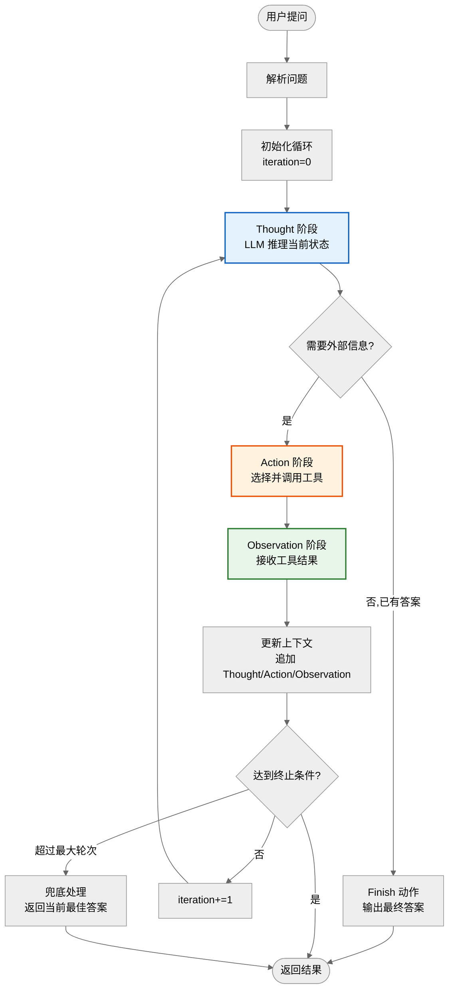

### 2.2 循环执行时序图

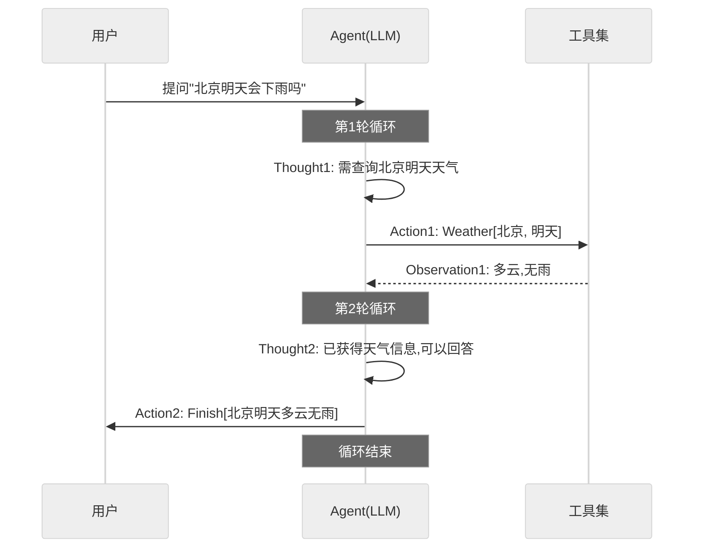

### 2.3 核心机制详解

#### 2.3.1 Thought 生成机制

Thought 由 LLM 基于当前上下文（问题 + 历史 Thought/Action/Observation）生成，核心作用：

1. **状态评估**：分析已掌握的信息是否足够。
2. **目标分解**：将复杂问题拆解为子步骤。
3. **工具选择**：决定调用哪个工具及参数。
4. **终止判断**：判断是否可以输出最终答案。

#### 2.3.2 Action 执行机制

Action 是 Thought 的执行产物，格式为 `ToolName[参数]`：

- **搜索类**：`Search[query]`、`Lookup[keyword]`
- **计算类**：`Calculate[expression]`、`CodeRun[script]`
- **数据查询**：`QueryDB[sql]`、`ReadFile[path]`
- **终止类**：`Finish[answer]`

#### 2.3.3 Observation 反馈机制

Observation 将工具执行结果注入上下文，触发下一轮 Thought：

- **正向反馈**：获得新信息，推进任务。
- **负向反馈**：工具报错或结果无关，Thought 调整策略。
- **终止信号**：信息充分，触发 Finish。

### 2.4 终止条件设计

| 终止条件 | 触发方式 | 说明 |
|----------|----------|------|
| **Finish 动作** | LLM 主动判断 | 推理认为已有答案 |
| **最大轮次** | 框架硬限制 | 防止死循环（通常 5-10 轮） |
| **Token 上限** | 上下文溢出 | 自动截断并要求总结 |
| **超时** | 时间限制 | 长时间无进展兜底 |

### 2.5 ReAct 与其他范式的关系

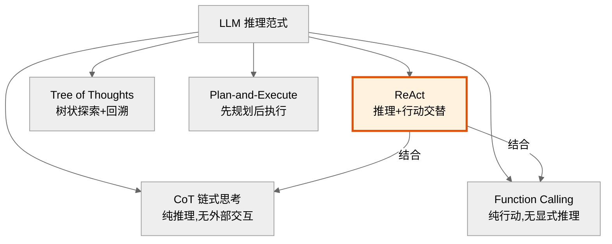

---

## 三、ReAct 核心循环机制详解

> 本章节深入解析 ReAct 框架在生产级落地中不可或缺的三大关键机制：**智能拦截机制（Intelligent Interception）、状态快照机制（State Snapshot）、收敛检测机制（Convergence Detection）**。这三大机制分别从"安全可控、可回溯、智能终止"三个维度增强 ReAct 循环的工程可靠性，是原生 ReAct 论文之外的生产级扩展。

### 3.1 三大机制在 ReAct 循环中的定位

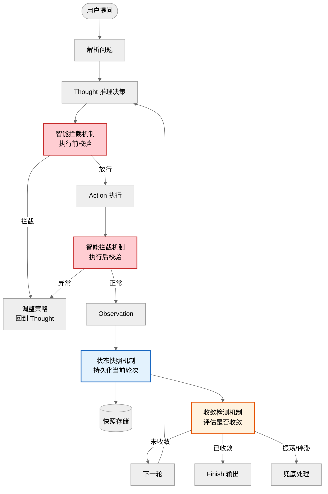

| 机制 | 作用阶段 | 核心职责 | 解决的问题 |
|------|----------|----------|------------|
| **智能拦截** | Action 执行前/后 | 校验合法性、拦截危险/重复操作 | 无效循环、危险操作、资源浪费 |
| **状态快照** | 每轮循环结束 | 持久化 Thought/Action/Observation | 中断丢失、无法回溯、审计缺失 |
| **收敛检测** | Observation 之后 | 评估是否趋近目标、是否振荡 | 死循环、过早终止、质量不可控 |

---

### 3.2 智能拦截机制（Intelligent Interception）

#### 3.2.1 机制定义与核心功能

**定义**：智能拦截机制是部署在 Action 执行前后的"守卫层"，基于规则引擎、历史模式与 LLM 判断，对即将执行或已执行的 Action 进行多维度校验，拦截无效、危险或重复的操作。

**核心功能**：

| 功能 | 说明 | 示例 |
|------|------|------|
| **危险操作拦截** | 高风险 Action 需人工审批或直接拒绝 | 转账、删除、发邮件 |
| **重复调用拦截** | 相同工具+参数已执行过则拦截 | 重复 `Search[退款]` |
| **参数合法性校验** | 校验参数格式、范围、权限 | SQL 注入、越权查询 |
| **预算控制** | 累计 Token/调用次数超阈值则拦截 | 单任务成本上限 |
| **异常结果拦截** | Observation 异常时阻止进入下一轮 | 工具报错、超时 |

#### 3.2.2 实现原理与技术细节

**三层拦截架构**：

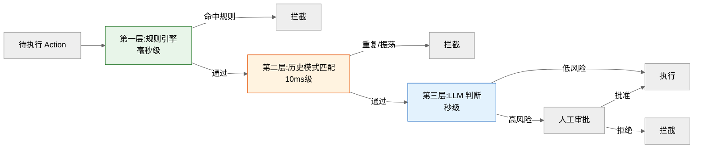

**第一层：规则引擎（硬规则）**
- 用 JSON/YAML 配置规则，毫秒级判断
- 适用于：参数格式校验、权限校验、黑名单工具

**第二层：历史模式匹配**
- 维护 Action 历史 fingerprint（工具名+参数 hash）
- 检测重复调用、振荡模式（A→B→A→B）
- 适用于：死循环防护

**第三层：LLM 智能判断**
- 对规则无法覆盖的复杂场景，用 LLM 评估风险
- 适用于：语义级风险判断（如"删除用户数据"是否必要）

**代码实现**：

```python
import hashlib
from dataclasses import dataclass, field
from enum import Enum


class InterceptResult(Enum):
    PASS = "pass"           # 放行
    BLOCK = "block"         # 拦截
    NEED_APPROVAL = "need_approval"  # 需人工审批


@dataclass
class ActionFingerprint:
    """Action 指纹：用于重复检测"""
    tool: str
    params_hash: str        # 参数 hash
    round: int              # 第几轮

    @classmethod
    def from_action(cls, tool: str, params: dict, round: int):
        params_str = str(sorted(params.items()))
        return cls(
            tool=tool,
            params_hash=hashlib.md5(params_str.encode()).hexdigest(),
            round=round,
        )


class IntelligentInterception:
    """智能拦截机制：三层守卫"""

    def __init__(self, rules: list, llm=None, hitl_callback=None):
        self.rules = rules                # 规则引擎配置
        self.llm = llm                    # LLM 判断器
        self.hitl_callback = hitl_callback  # 人工审批回调
        self.action_history: list[ActionFingerprint] = []  # 历史指纹

    def pre_check(self, action: dict, context: dict) -> InterceptResult:
        """执行前拦截（三层）"""
        # 第一层：规则引擎
        for rule in self.rules:
            if rule.match(action):
                return InterceptResult.BLOCK

        # 第二层：历史模式匹配
        fp = ActionFingerprint.from_action(
            action["tool"], action["params"], context["round"]
        )
        if self._is_duplicate(fp):
            return InterceptResult.BLOCK
        if self._is_oscillating(fp):
            return InterceptResult.BLOCK  # A→B→A→B 振荡

        # 第三层：LLM 风险判断
        if self._is_high_risk(action):
            risk_score = self._llm_risk_assessment(action, context)
            if risk_score > 0.8:
                if self.hitl_callback:
                    return InterceptResult.NEED_APPROVAL
                return InterceptResult.BLOCK

        self.action_history.append(fp)
        return InterceptResult.PASS

    def post_check(self, observation: dict) -> InterceptResult:
        """执行后拦截：校验 Observation 异常"""
        if observation.get("error"):
            return InterceptResult.BLOCK
        if observation.get("timeout"):
            return InterceptResult.BLOCK
        return InterceptResult.PASS

    def _is_duplicate(self, fp: ActionFingerprint) -> bool:
        """重复调用检测"""
        return any(
            h.tool == fp.tool and h.params_hash == fp.params_hash
            for h in self.action_history
        )

    def _is_oscillating(self, fp: ActionFingerprint) -> bool:
        """振荡检测：最近4步是否 A→B→A→B 模式"""
        if len(self.action_history) < 3:
            return False
        recent = self.action_history[-3:] + [fp]
        return (
            recent[0].tool == recent[2].tool
            and recent[1].tool == recent[3].tool
            and recent[0].tool != recent[1].tool
        )

    def _is_high_risk(self, action: dict) -> bool:
        """判断是否高风险操作"""
        high_risk_tools = {"transfer_money", "send_email", "delete_record"}
        return action["tool"] in high_risk_tools

    def _llm_risk_assessment(self, action: dict, context: dict) -> float:
        """LLM 评估风险分（0-1）"""
        prompt = f"""
        评估以下操作的风险分（0-1，越高越危险）：
        操作: {action}
        上下文: {context.get('question')}
        """
        result = self.llm.generate(prompt)
        return float(result)
```

#### 3.2.3 与 ReAct 其他组件的交互关系

| 交互组件 | 交互方式 | 说明 |
|----------|----------|------|
| **Thought** | 拦截后反馈给 Thought | 拦截信息作为新上下文，Thought 据此调整策略 |
| **Action** | 执行前/后双重拦截 | pre_check 决定是否执行，post_check 决定是否采纳结果 |
| **Observation** | 拦截结果转为 Observation | 拦截时生成"Action 被拦截，原因：XXX"的 Observation |
| **上下文管理器** | 读取历史 Action | 用于重复检测与振荡检测 |
| **收敛检测** | 拦截次数作为收敛信号 | 频繁拦截说明 Agent 陷入困境，触发收敛检测 |

#### 3.2.4 实际应用场景与优势分析

| 场景 | 拦截类型 | 价值 |
|------|----------|------|
| **金融转账 Agent** | 危险操作拦截 + HITL | 防止 LLM 自主转账，合规保障 |
| **客服 FAQ 查询** | 重复调用拦截 | 避免死循环，节省 80% Token |
| **数据库操作 Agent** | 参数合法性校验 | 防止 SQL 注入、越权查询 |
| **邮件发送 Agent** | 预算控制 + 审批 | 防止滥发邮件，单任务成本可控 |

**优势**：
1. **安全可控**：高风险操作 100% 拦截，满足金融/医疗合规。
2. **资源节约**：重复调用拦截节省 80% Token，振荡检测避免无效循环。
3. **可观测**：每次拦截记录原因，支持审计与优化规则。

---

### 3.3 状态快照机制（State Snapshot）

#### 3.3.1 机制定义与核心功能

**定义**：状态快照机制在 ReAct 每轮循环结束时，将当前完整状态（Thought、Action、Observation、上下文、循环计数）序列化持久化，支持任务中断后恢复、错误回溯调试与生产审计。

**核心功能**：

| 功能 | 说明 | 价值 |
|------|------|------|
| **断点续跑** | 任务中断后从最近快照恢复 | 支持跨进程、跨机器恢复 |
| **回溯调试** | 定位某轮 Thought/Action 出错 | 生产问题 5 分钟定位 |
| **审计追踪** | 全程记录决策链 | 满足合规审计 |
| **版本对比** | 不同快照对比状态变化 | A/B 测试、回归测试 |
| **回滚重放** | 回滚到某快照重新执行 | 错误修复后验证 |

#### 3.3.2 实现原理与技术细节

**快照数据结构**：

```python
from datetime import datetime
from typing import Any, Optional


class ReActSnapshot:
    """ReAct 状态快照"""

    def __init__(
        self,
        thread_id: str,
        round: int,
        question: str,
        thought: str,
        action: dict,
        observation: Any,
        context_summary: str,        # 上下文摘要
        cumulative_tokens: int,      # 累计 Token
        status: str,                 # running/paused/completed/failed
        parent_snapshot_id: Optional[str] = None,  # 父快照（支持回溯链）
    ):
        self.snapshot_id = f"{thread_id}-r{round}-{int(datetime.now().timestamp())}"
        self.thread_id = thread_id
        self.round = round
        self.question = question
        self.thought = thought
        self.action = action
        self.observation = observation
        self.context_summary = context_summary
        self.cumulative_tokens = cumulative_tokens
        self.status = status
        self.parent_snapshot_id = parent_snapshot_id
        self.created_at = datetime.now().isoformat()


class SnapshotStore:
    """快照存储：支持内存/数据库后端"""

    def __init__(self, backend: str = "memory"):
        self.backend = backend
        self._store: dict[str, list[ReActSnapshot]] = {}  # thread_id -> snapshots

    def save(self, snapshot: ReActSnapshot):
        """保存快照"""
        if snapshot.thread_id not in self._store:
            self._store[snapshot.thread_id] = []
        self._store[snapshot.thread_id].append(snapshot)

    def load_latest(self, thread_id: str) -> Optional[ReActSnapshot]:
        """加载最新快照（用于恢复）"""
        snapshots = self._store.get(thread_id, [])
        return snapshots[-1] if snapshots else None

    def load_by_round(self, thread_id: str, round: int) -> Optional[ReActSnapshot]:
        """加载指定轮次快照（用于回溯）"""
        for s in self._store.get(thread_id, []):
            if s.round == round:
                return s
        return None

    def rollback_to(self, thread_id: str, round: int) -> Optional[ReActSnapshot]:
        """回滚到指定轮次（丢弃之后的所有快照）"""
        snapshots = self._store.get(thread_id, [])
        for i, s in enumerate(snapshots):
            if s.round == round:
                self._store[thread_id] = snapshots[: i + 1]
                return s
        return None

    def replay_from(self, thread_id: str, round: int) -> list[ReActSnapshot]:
        """从指定轮次开始重放（用于调试）"""
        return [s for s in self._store.get(thread_id, []) if s.round >= round]
```

**快照存储策略**：

| 策略 | 做法 | 适用场景 |
|------|------|----------|
| **全量快照** | 每轮保存完整状态 | 任务短、需完整审计 |
| **增量快照** | 仅保存与上轮的差异 | 任务长、存储敏感 |
| **采样快照** | 每 N 轮保存一次 | 长任务、仅需关键节点 |
| **压缩快照** | 早期轮次摘要压缩 | Token 敏感场景 |

#### 3.3.3 与 ReAct 其他组件的交互关系

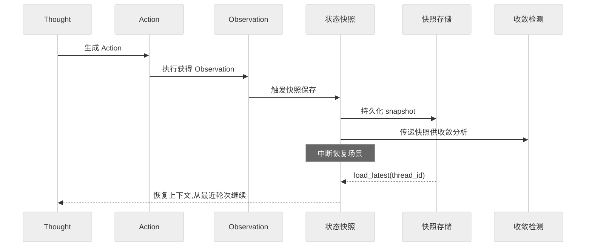

| 交互组件 | 交互方式 | 说明 |
|----------|----------|------|
| **Thought** | 恢复时提供历史上下文 | 快照中的 context_summary 注入 Thought |
| **Observation** | 触发快照保存 | 每轮 Observation 后自动保存 |
| **收敛检测** | 读取快照序列分析趋势 | 多轮快照对比判断是否收敛 |
| **智能拦截** | 拦截时记录到快照 | 拦截事件作为特殊 Observation 存档 |
| **上下文管理器** | 快照保存上下文摘要 | 避免快照过大，仅存摘要 |

#### 3.3.4 实际应用场景与优势分析

| 场景 | 快照用法 | 价值 |
|------|----------|------|
| **长任务中断恢复** | 每轮快照，中断后 load_latest 续跑 | 任务不丢失，跨进程恢复 |
| **生产问题排查** | replay_from 定位出错轮次 | 排查时间从 2 小时降至 5 分钟 |
| **合规审计** | 全量快照 + 不可篡改存储 | 满足金融/医疗审计要求 |
| **A/B 测试** | 同一快照起点用不同 Prompt 重放 | 公平对比 Prompt 效果 |
| **错误回滚** | rollback_to 回退到稳定轮次 | 错误后无需从头开始 |

**优势**：
1. **可靠性**：任务中断不丢失，支持跨进程/跨机器恢复。
2. **可调试**：全程快照支持回溯，生产问题快速定位。
3. **可审计**：完整决策链记录，满足合规要求。
4. **可重放**：支持从任意节点重放，便于测试与优化。

---

### 3.4 收敛检测机制（Convergence Detection）

#### 3.4.1 机制定义与核心功能

**定义**：收敛检测机制在每轮 Observation 后评估 ReAct 循环是否"趋近目标"，从**进展性、置信度、振荡性、资源耗尽**四个维度判断是否该终止，避免死循环与过早终止。

**核心功能**：

| 功能 | 说明 | 解决问题 |
|------|------|----------|
| **进展检测** | 判断新一轮是否带来新信息 | 停滞检测 |
| **置信度评估** | 评估当前信息是否足以回答 | 过早终止/延迟终止 |
| **振荡检测** | 检测 A→B→A→B 循环模式 | 死循环 |
| **资源监控** | 监控 Token/轮次/时间预算 | 成本失控 |
| **智能终止** | 综合判断是否 Finish | 平衡质量与成本 |

#### 3.4.2 实现原理与技术细节

**收敛度计算模型**：

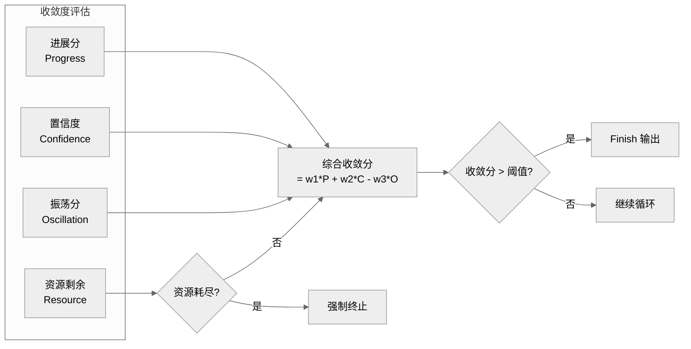

**代码实现**：

```python
from dataclasses import dataclass


@dataclass
class ConvergenceScore:
    """收敛度评估结果"""
    progress: float        # 进展分 0-1,越高越有进展
    confidence: float      # 置信度 0-1,越高越接近答案
    oscillation: float     # 振荡分 0-1,越高越振荡
    resource_left: float   # 资源剩余比 0-1
    should_terminate: bool
    reason: str


class ConvergenceDetector:
    """收敛检测机制"""

    def __init__(
        self,
        max_rounds: int = 8,
        max_tokens: int = 10000,
        progress_threshold: float = 0.3,    # 进展分低于此值视为停滞
        confidence_threshold: float = 0.8,   # 置信度高于此值可终止
        oscillation_threshold: float = 0.7,  # 振荡分高于此值强制终止
        llm=None,
    ):
        self.max_rounds = max_rounds
        self.max_tokens = max_tokens
        self.progress_threshold = progress_threshold
        self.confidence_threshold = confidence_threshold
        self.oscillation_threshold = oscillation_threshold
        self.llm = llm
        self.observation_history: list[str] = []  # 用于进展与振荡检测

    def evaluate(self, context: dict) -> ConvergenceScore:
        """评估收敛度"""
        round_num = context["round"]
        cumulative_tokens = context["cumulative_tokens"]
        latest_obs = context["observation"]

        # 1. 资源检测：硬性限制
        resource_left = 1.0 - (
            min(round_num / self.max_rounds, 1.0) * 0.5
            + min(cumulative_tokens / self.max_tokens, 1.0) * 0.5
        )
        if round_num >= self.max_rounds or cumulative_tokens >= self.max_tokens:
            return ConvergenceScore(
                progress=0, confidence=0, oscillation=0,
                resource_left=resource_left,
                should_terminate=True,
                reason="资源耗尽(轮次/Token超限)",
            )

        # 2. 振荡检测
        oscillation = self._detect_oscillation(latest_obs)
        if oscillation >= self.oscillation_threshold:
            return ConvergenceScore(
                progress=0, confidence=0, oscillation=oscillation,
                resource_left=resource_left,
                should_terminate=True,
                reason=f"检测到振荡(分值{oscillation:.2f})",
            )

        # 3. 进展检测
        progress = self._measure_progress(latest_obs)

        # 4. 置信度评估（LLM 判断）
        confidence = self._estimate_confidence(context)

        # 5. 综合判断
        should_terminate = (
            confidence >= self.confidence_threshold
            and progress >= self.progress_threshold
        )
        reason = (
            f"置信度{confidence:.2f}≥{self.confidence_threshold},"
            f"进展{progress:.2f}≥{self.progress_threshold}"
            if should_terminate
            else "未达收敛条件,继续循环"
        )

        self.observation_history.append(latest_obs)
        return ConvergenceScore(
            progress=progress,
            confidence=confidence,
            oscillation=oscillation,
            resource_left=resource_left,
            should_terminate=should_terminate,
            reason=reason,
        )

    def _detect_oscillation(self, latest_obs: str) -> float:
        """振荡检测：基于 Observation 相似度"""
        if len(self.observation_history) < 3:
            return 0.0
        # 比较最近4个 Observation 是否 A-B-A-B 模式
        recent = self.observation_history[-3:] + [latest_obs]
        sim_0_2 = self._similarity(recent[0], recent[2])
        sim_1_3 = self._similarity(recent[1], recent[3])
        return (sim_0_2 + sim_1_3) / 2

    def _measure_progress(self, latest_obs: str) -> float:
        """进展检测：新 Observation 是否带来新信息"""
        if not self.observation_history:
            return 1.0  # 第一轮视为有进展
        # 与上一轮 Observation 的差异度
        prev = self.observation_history[-1]
        diff = 1.0 - self._similarity(prev, latest_obs)
        return diff

    def _estimate_confidence(self, context: dict) -> float:
        """置信度评估：LLM 判断当前信息是否足以回答"""
        prompt = f"""
        问题: {context['question']}
        已获得信息: {context['context_summary']}
        请评估当前信息是否足以完整回答问题,输出 0-1 的置信度:
        """
        result = self.llm.generate(prompt)
        return float(result)

    def _similarity(self, a: str, b: str) -> float:
        """文本相似度（简化版,实际可用向量余弦）"""
        if not a or not b:
            return 0.0
        a_set, b_set = set(a.split()), set(b.split())
        intersection = a_set & b_set
        union = a_set | b_set
        return len(intersection) / len(union) if union else 0.0
```

#### 3.4.3 与 ReAct 其他组件的交互关系

| 交互组件 | 交互方式 | 说明 |
|----------|----------|------|
| **Observation** | 读取最新 Observation 评估进展 | Observation 相似度判断是否有新信息 |
| **Thought** | 置信度不足时触发更深入 Thought | 收敛分低则 Thought 需探索新方向 |
| **状态快照** | 读取历史快照分析趋势 | 多轮 Observation 序列检测振荡 |
| **智能拦截** | 拦截频繁触发收敛告警 | 频繁拦截 = 陷入困境，加速收敛 |
| **Finish** | 收敛达标触发 Finish | 置信度+进展双达标才终止 |

#### 3.4.4 实际应用场景与优势分析

| 场景 | 检测维度 | 价值 |
|------|----------|------|
| **客服 FAQ 查询** | 振荡检测 | 避免重复查询同一 FAQ，死循环消除 |
| **多步数据查询** | 进展检测 | 新 Observation 无新信息则提前终止 |
| **复杂推理任务** | 置信度评估 | 信息充分时主动 Finish，不浪费轮次 |
| **成本敏感场景** | 资源监控 | Token/轮次预算耗尽强制终止 |
| **长链路任务** | 综合收敛 | 平衡答案质量与执行成本 |

**优势**：
1. **防死循环**：振荡检测 + 资源硬限制，彻底杜绝死循环。
2. **智能终止**：置信度+进展双达标才终止，避免过早 Finish 导致答案不完整。
3. **成本可控**：资源监控让单任务成本有上限，可预测。
4. **质量保障**：置信度评估确保答案质量，避免低质量输出。

---

### 3.5 三大机制协同工作流程

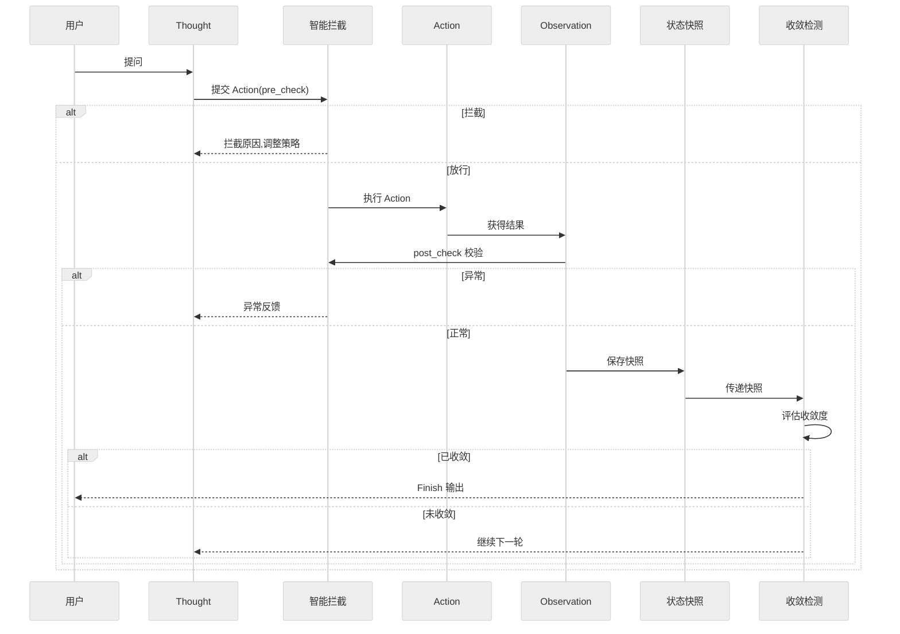

### 3.6 三大机制对比总结

| 维度 | 智能拦截 | 状态快照 | 收敛检测 |
|------|----------|----------|----------|
| **核心职责** | 安全守卫 | 持久化与回溯 | 智能终止 |
| **作用阶段** | Action 前/后 | 每轮结束 | Observation 后 |
| **触发频率** | 每次 Action | 每轮 | 每轮 |
| **延迟开销** | 低(规则)/高(LLM) | 低(序列化) | 中(LLM 评估) |
| **解决问题** | 危险操作/死循环 | 中断丢失/审计 | 死循环/过早终止 |
| **生产必需性** | 高(合规) | 高(可靠性) | 高(成本控制) |

---

## 四、面试题及详解

### 题目 1：ReAct 定义与核心价值（概念理解题·基础）

**难度**：基础　**类型**：概念理解题

**问题描述**：
请用一句话定义 ReAct 框架，并说明它解决了纯 CoT 和纯 Function Calling 各自的什么痛点。

**参考答案**：

**一句话定义**：ReAct = 推理（Reasoning）引导行动（Acting），行动反馈修正推理，两者交替循环直至完成任务。

**解决的痛点**：

| 范式 | 痛点 | ReAct 如何解决 |
|------|------|----------------|
| **纯 CoT** | 仅靠模型内部知识，无法获取外部信息，易幻觉 | Action 调用工具获取真实数据 |
| **纯 CoT** | 一次性生成，错误无法中途修正 | 循环中 Observation 反馈可修正推理 |
| **纯 Function Calling** | 工具选择无解释性，黑盒决策 | Thought 显式说明选择理由 |
| **纯 Function Calling** | 无观察反馈，错误传播 | Observation 反馈触发策略调整 |

**评分标准**：定义准确 2 分；指出 CoT 痛点 1.5 分；指出 FC 痛点 1.5 分（满分 5）。

**项目实例**：
- **项目背景**：某金融问答机器人初期用纯 CoT，回答"XX 公司最新财报"时经常幻觉编造数据。
- **技术选型理由**：纯 CoT 无法获取实时财报，纯 FC 选错工具无解释；ReAct 先思考"需要查财报数据库"，再调工具，最后基于真实数据回答。
- **实现步骤**：①Thought 分析问题类型；②Action 调用 `QueryFinance[公司名, 年份]`；③Observation 获取真实财报；④Finish 基于数据生成答案。
- **遇到的挑战**：LLM 偶尔跳过 Thought 直接 Action，导致工具选择错误。
- **解决方案**：Prompt 中强制要求"必须先输出 Thought 再输出 Action"，并用正则解析校验格式。
- **最终效果**：幻觉率从 35% 降至 5%，用户满意度提升 30%。

---

### 题目 2：Thought 的作用辨析（概念理解题·基础）

**难度**：基础　**类型**：概念理解题

**问题描述**：
ReAct 中的 Thought 与 Self-Reflection（自我反思）有什么区别？能否用 Thought 替代反思机制？

**参考答案**：

| 维度 | Thought | Self-Reflection |
|------|---------|-----------------|
| **时机** | 行动**之前**（前向推理） | 行动**之后**（后向评估） |
| **作用** | 决定"怎么做" | 评估"做得对不对" |
| **类比** | 事前规划 | 事后复盘 |
| **触发** | 每轮循环自动触发 | 失败或完成后触发 |
| **产出** | 行动计划 | 反思文本 + 经验记忆 |

**不能替代**：Thought 是前向的"规划决策"，Self-Reflection 是后向的"评估改进"。两者互补：Thought 决定怎么做，反思评估做得怎样并指导下次改进。仅靠 Thought 无法从失败中学习，会重复犯错。

**评分标准**：区别 3 分；不可替代原因 2 分（满分 5）。

**项目实例**：
- **项目背景**：某代码生成 Agent 用 ReAct 但无反思，发现同一类错误反复出现。
- **技术选型理由**：Thought 只能规划当前步骤，无法从历史失败中学习；需补充反思机制。
- **实现步骤**：①ReAct 循环完成代码生成；②若测试失败触发 Self-Reflection，生成"错误归因+改进建议"；③反思存入记忆，下次同类任务加载。
- **遇到的挑战**：反思机制增加 40% Token 消耗。
- **解决方案**：仅测试失败时触发反思（难度感知），成功则跳过，Token 消耗降低 60%。
- **最终效果**：同类错误重复率降低 80%，生成成功率从 60% 提升至 85%。

---

### 题目 3：ReAct 循环四阶段解析（原理解析题·中级）

**难度**：中级　**类型**：原理解析题

**问题描述**：
请结合流程图，详细解析 ReAct 循环的四个阶段（解析、思考、行动、观察），并说明 Observation 如何影响下一轮 Thought。

**参考答案**：

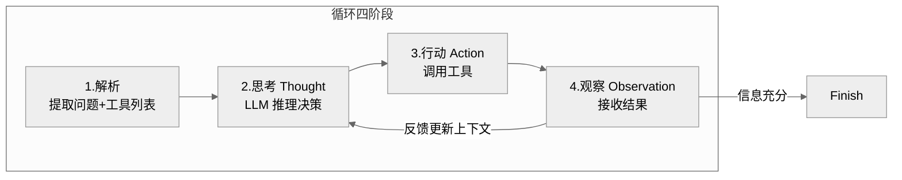

**四阶段详解**：

1. **解析阶段**：提取用户问题，加载可用工具列表，初始化上下文。
2. **思考阶段（Thought）**：LLM 基于问题+历史上下文推理，决定下一步：
   - 评估当前信息是否足够
   - 选择工具及参数
   - 生成"为什么这么做"的解释
3. **行动阶段（Action）**：执行 Thought 决定的工具调用，格式为 `Tool[params]`。
4. **观察阶段（Observation）**：接收工具返回结果，追加到上下文，触发下一轮 Thought。

**Observation 对 Thought 的影响**：

| Observation 类型 | 对 Thought 的影响 |
|------------------|-------------------|
| **正向（有用信息）** | Thought 推进任务，可能触发 Finish |
| **负向（报错）** | Thought 调整策略，换工具或改参数 |
| **无关（噪声）** | Thought 重新评估，可能细化查询 |
| **矛盾（冲突）** | Thought 触发验证，调用其他工具交叉验证 |

**评分标准**：流程图正确 2 分；四阶段详解 2 分；Observation 影响分析 2 分（满分 6）。

**项目实例**：
- **项目背景**：某法律咨询 Agent，用户问"竞业协议补偿金最低标准"，需查询多地法规。
- **技术选型理由**：法律问题需多轮查询+交叉验证，ReAct 的 Observation 反馈机制适合逐步逼近答案。
- **实现步骤**：
  1. Thought1：需查询北京竞业补偿标准 → Action1：`SearchLaw[北京, 竞业补偿]` → Observation1：北京标准为月工资 30%
  2. Thought2：需对比上海标准 → Action2：`SearchLaw[上海, 竞业补偿]` → Observation2：上海为 35%
  3. Thought3：信息充分 → Action3：`Finish[北京30%, 上海35%]`
- **遇到的挑战**：Observation1 返回的法规已过期，导致答案错误。
- **解决方案**：Thought 中增加"时效性校验"步骤，Observation 后检查法规年份，过期则重新搜索最新版本。
- **最终效果**：答案准确率从 75% 提升至 95%，平均查询 2-3 轮即可完成。

---

### 题目 4：ReAct vs CoT 对比（原理解析题·中级）

**难度**：中级　**类型**：原理解析题

**问题描述**：
请从机制、能力边界、适用场景三个维度对比 ReAct 与 CoT，并说明为什么 ReAct 在工具使用场景下优于 CoT。

**参考答案**：

| 维度 | CoT（链式思考） | ReAct |
|------|----------------|-------|
| **机制** | LLM 内部一次性推理 | 推理+行动交替循环 |
| **外部信息** | ❌ 无法获取 | ✅ 通过 Action 调用工具 |
| **错误修正** | ❌ 一次生成不可逆 | ✅ Observation 反馈可修正 |
| **可解释性** | 思考可见但不可控 | Thought+Action+Observation 全程可追溯 |
| **Token 消耗** | 低（单轮） | 高（多轮） |
| **延迟** | 低 | 高（多轮工具调用） |
| **适用场景** | 知识推理、数学计算 | 需外部数据、多步决策 |

**ReAct 优于 CoT 的原因**：
1. **信息获取**：CoT 仅靠模型内部知识，ReAct 可调用工具获取实时数据。
2. **错误修正**：CoT 错误一路累积，ReAct 可基于 Observation 调整。
3. **可验证性**：ReAct 的 Action 可复现，CoT 的推理不可验证。

**评分标准**：对比维度≥5 项 3 分；ReAct 优势分析 2 分；适用场景说明 1 分（满分 6）。

**项目实例**：
- **项目背景**：某数据分析助手，用户问"上季度销售额最高的产品"。
- **技术选型理由**：CoT 无法访问数据库，会编造数据；ReAct 可调 SQL 查询真实数据。
- **实现步骤**：
  - CoT 方案：LLM 直接生成"上季度销冠是产品A"（幻觉）
  - ReAct 方案：Thought→需查数据库→Action:`QuerySQL[SELECT...]`→Observation:真实数据→Finish
- **遇到的挑战**：SQL 生成错误导致查询失败。
- **解决方案**：Thought 中先分析表结构，Action 中生成 SQL 后校验语法，失败则 Observation 反馈触发重写。
- **最终效果**：数据准确率从 40%（CoT）提升至 98%（ReAct）。

---

### 题目 5：死循环问题诊断（案例分析题·中级）

**难度**：中级　**类型**：案例分析题

**问题描述**：
某团队上线 ReAct Agent 后发现：Agent 反复调用同一个工具，循环 10 次后超时失败。请分析可能的根因，并给出解决方案。

**参考答案**：

**根因分析**：

| 可能原因 | 表现 | 诊断方法 |
|----------|------|----------|
| **Prompt 模糊** | LLM 不知何时该 Finish | 检查 Prompt 是否明确终止条件 |
| **工具返回无效** | Observation 无有用信息 | 检查工具返回内容 |
| **上下文丢失** | LLM 忘记已调过该工具 | 检查上下文长度 |
| **无最大轮次限制** | 循环不终止 | 检查框架配置 |

**解决方案**：

1. **明确终止条件**：Prompt 中强调"信息充分时必须 Finish"。
2. **去重机制**：记录已调用工具+参数，重复调用时拦截。
3. **最大轮次限制**：硬性设置 5-8 轮上限。
4. **Observation 优化**：工具返回空结果时明确提示"未找到，请换关键词"。
5. **上下文压缩**：历史过长时摘要压缩，保留关键信息。

```python
# 去重机制示例
class ReActAgent:
    def __init__(self):
        self.action_history = []  # 记录所有 Action

    def should_terminate(self, thought, action, iteration):
        """终止条件判断"""
        # 1. LLM 主动 Finish
        if action.startswith("Finish"):
            return True
        # 2. 最大轮次
        if iteration >= 8:
            return True
        # 3. 重复 Action 检测
        action_key = action.strip()
        if action_key in self.action_history:
            return True  # 重复调用直接终止
        self.action_history.append(action_key)
        return False
```

**评分标准**：根因≥3 种 2 分；解决方案≥4 项 3 分；代码示例 1 分（满分 6）。

**项目实例**：
- **项目背景**：某客服 Agent 上线后发现，用户问"怎么退款"时，Agent 反复调用 `SearchFAQ[退款]` 10 次后超时。
- **技术选型理由**：ReAct 死循环是常见生产问题，需从 Prompt、工具、框架三层防护。
- **实现步骤**：
  1. 诊断：检查日志发现 Observation 返回相同内容，Thought 每次都"需要更多信息"。
  2. 根因：Prompt 未明确"信息充分时 Finish"；工具返回过长 FAQ 被 LLM 忽略。
  3. 修复：①Prompt 增加"已获得退款流程时必须 Finish"；②工具返回精简为"前3条+摘要"；③增加去重+最大轮次。
- **遇到的挑战**：修复后 Agent 过早 Finish，答案不完整。
- **解决方案**：调整 Prompt 平衡——"信息充分"定义为"已获得完整退款步骤"，非"有任何信息"。
- **最终效果**：死循环问题消除，平均循环轮次从 10 降至 3，答案完整率 90%。

---

### 题目 6：ReAct vs Plan-and-Execute（原理解析题·高级）

**难度**：高级　**类型**：原理解析题

**问题描述**：
请对比 ReAct 与 Plan-and-Execute 两种范式，分析各自优劣，并说明什么场景下应选择哪种。

**参考答案**：

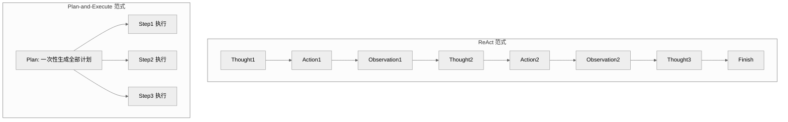

| 维度 | ReAct | Plan-and-Execute |
|------|-------|-------------------|
| **规划方式** | 滚动规划（每步决策） | 一次性规划全部步骤 |
| **灵活性** | 高（可动态调整） | 低（需重新规划） |
| **Token 消耗** | 高（每轮重复上下文） | 低（规划一次） |
| **延迟** | 高（串行循环） | 可并行执行无依赖步骤 |
| **错误恢复** | 强（Observation 即时反馈） | 弱（需重新规划） |
| **适用任务** | 不确定、需探索 | 明确、可分解 |

**选型建议**：

| 场景 | 推荐 | 理由 |
|------|------|------|
| 信息检索（不确定查什么） | ReAct | 需根据中间结果调整方向 |
| 多步代码生成（需求明确） | Plan-and-Execute | 可先拆解再并行 |
| 开放式问答 | ReAct | 需探索式推理 |
| 流程自动化（步骤固定） | Plan-and-Execute | 规划一次即可 |
| 混合场景 | 结合使用 | 先 Plan 规划，执行中遇阻转 ReAct |

**评分标准**：对比维度≥5 项 3 分；流程图 1.5 分；选型建议≥3 场景 1.5 分（满分 6）。

**项目实例**：
- **项目背景**：某 DevOps Agent 需实现"部署某服务到生产环境"任务。
- **技术选型理由**：部署流程步骤明确但中间可能出错，采用 Plan-and-Execute 为主 + ReAct 兜底。
- **实现步骤**：
  1. Plan：生成计划[拉代码→跑测试→构建镜像→部署→验证]
  2. Execute：按计划执行，每步成功继续下一步
  3. 若某步失败（如测试不过），切换到 ReAct 模式：Thought 分析失败原因→Action 查日志→Observation 定位 Bug→修复后继续 Plan
- **遇到的挑战**：Plan 过于死板，环境变化时全盘重新规划成本高。
- **解决方案**：引入"局部重规划"——仅重新规划失败步骤之后的任务，而非全盘重来。
- **最终效果**：部署成功率从 70% 提升至 95%，平均时长降低 40%。

---

### 题目 7：多工具冲突处理（实践应用题·高级）

**难度**：高级　**类型**：实践应用题

**问题描述**：
某 ReAct Agent 配置了 20+ 工具，发现 LLM 经常选错工具或参数错误。请设计一套方案提升工具选择的准确性。

**参考答案**：

**问题根因**：
1. 工具描述模糊，LLM 难以区分相似工具。
2. 工具数量过多，超出 LLM 注意力。
3. 参数 Schema 不清晰，LLM 猜测参数。

**解决方案（分层优化）**：

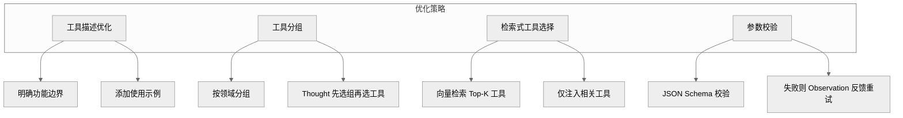

| 策略 | 做法 | 效果 |
|------|------|------|
| **工具描述优化** | 每个工具描述含：功能、适用场景、不适用场景、示例 | 减少歧义 |
| **工具分组** | 按领域分组（数据库/文件/网络/计算），Thought 先选组 | 降低选择空间 |
| **检索式选择** | 用户问题向量检索 Top-5 相关工具，仅注入这些工具 | 避免 20+ 工具干扰 |
| **参数校验** | JSON Schema 校验，失败则 Observation 提示错误 | 减少参数错误 |
| **Few-shot 示例** | Prompt 中提供正确工具选择的示例 | 引导 LLM |

**代码示例**：

```python
from langchain.tools import BaseTool
from pydantic import BaseModel, ValidationError


class ToolSelector:
    """检索式工具选择器"""

    def __init__(self, tools: list, embedding_model):
        self.tools = tools
        self.embeddings = embedding_model
        # 预计算工具描述向量
        self.tool_vectors = {
            t.name: self.embeddings.embed(t.description)
            for t in tools
        }

    def select_tools(self, query: str, top_k: int = 5) -> list:
        """根据问题检索最相关的 top_k 个工具"""
        query_vec = self.embeddings.embed(query)
        scores = {
            name: cosine_sim(query_vec, vec)
            for name, vec in self.tool_vectors.items()
        }
        sorted_tools = sorted(scores.items(), key=lambda x: -x[1])
        return [t for t in self.tools if t.name in
                [name for name, _ in sorted_tools[:top_k]]]


class ReActAgentWithValidation:
    def __init__(self, llm, tool_selector: ToolSelector):
        self.llm = llm
        self.selector = tool_selector

    def execute_action(self, action: str, params: dict) -> str:
        """执行 Action 带参数校验"""
        tool = self._find_tool(action)
        if not tool:
            return f"Error: 工具 {action} 不存在"

        try:
            # JSON Schema 校验参数
            validated = tool.args_schema(**params)
            return tool.run(validated.dict())
        except ValidationError as e:
            return f"参数错误: {e}. 请检查参数格式后重试。"
```

**评分标准**：根因分析 2 分；解决方案≥4 项 3 分；代码示例 1 分（满分 6）。

**项目实例**：
- **项目背景**：某企业 Agent 配置 25 个工具（数据库/文件/API/计算），LLM 经常混淆 `QueryDB` 和 `QueryAPI`。
- **技术选型理由**：工具多导致选择准确率低，需从描述、分组、检索、校验四层优化。
- **实现步骤**：
  1. 工具描述优化：`QueryDB` 描述增加"仅查内部数据库，不调外部 API"
  2. 工具分组：数据库类/文件类/API类/计算类，Thought 先选组
  3. 检索式选择：用户问题向量检索 Top-5 工具，而非全量 25 个
  4. 参数校验：SQL 工具校验语法，失败 Observation 提示"SQL 语法错误，请重写"
- **遇到的挑战**：向量检索偶发漏掉关键工具。
- **解决方案**：Top-K 设为 8（非 5），并保留"通用工具"（如 Finish）始终注入。
- **最终效果**：工具选择准确率从 60% 提升至 92%，参数错误率降低 80%。

---

### 题目 8：生产级 ReAct Agent 设计（实践应用题·高级）

**难度**：高级　**类型**：实践应用题

**问题描述**：
请设计一个生产级 ReAct Agent 系统架构，要求支持：高并发、可观测、可回溯、异常自愈。请给出架构图并说明关键模块。

**参考答案**：

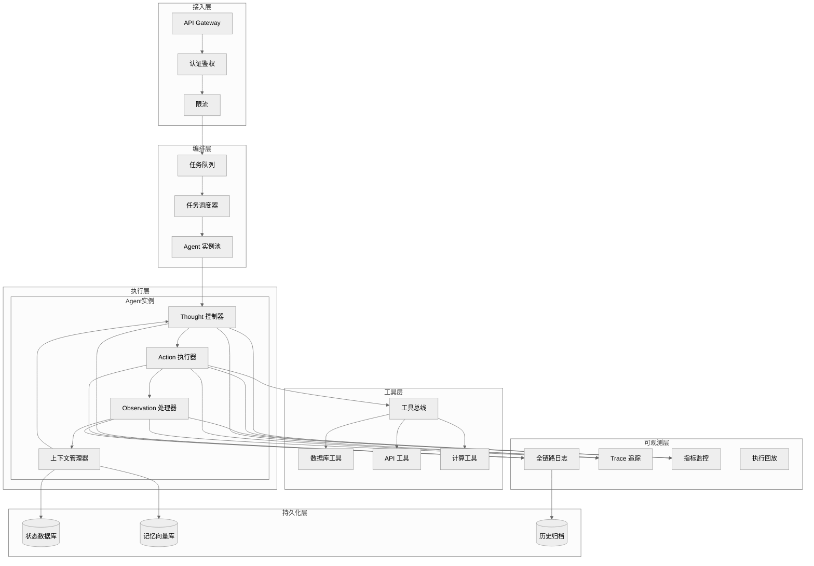

**关键模块说明**：

| 模块 | 职责 | 设计要点 |
|------|------|----------|
| **任务调度器** | 并发任务分发 | 基于 asyncio，单实例支持 100+ 并发 |
| **Agent 实例池** | 复用 Agent 实例 | 避免频繁创建销毁，预热实例 |
| **Thought 控制器** | 管理 LLM 推理 | 超时控制、重试、格式校验 |
| **Action 执行器** | 工具调用 | 异步执行、超时熔断、参数校验 |
| **Observation 处理器** | 结果处理 | 结果截断、格式化、异常归一化 |
| **上下文管理器** | 管理循环上下文 | Token 截断、历史摘要、状态持久化 |
| **工具总线** | 统一工具接入 | 插件化、版本管理、权限控制 |
| **全链路日志** | 每步 Thought/Action/Observation | 支持 Replay 回放排查 |
| **Trace 追踪** | 跨模块调用链 | trace_id 透传，定位瓶颈 |
| **指标监控** | QPS/延迟/成功率 | 实时告警 |

**异常自愈机制**：

| 异常类型 | 检测方式 | 自愈策略 |
|----------|----------|----------|
| LLM 超时 | Thought 控制器超时 | 重试 3 次，降级到轻量模型 |
| 工具报错 | Action 执行器捕获 | Observation 返回错误信息，Thought 调整 |
| 死循环 | 最大轮次+去重检测 | 强制终止，返回当前最佳答案 |
| 上下文溢出 | Token 计数 | 自动摘要历史，保留最近 3 轮 |
| 实例崩溃 | 心跳检测 | 调度器重新分配任务到健康实例 |

**评分标准**：架构图完整 3 分；关键模块说明≥8 个 2 分；异常自愈≥4 种 1 分（满分 6）。

**项目实例**：
- **项目背景**：某电商平台构建智能客服 Agent，日均 10 万+ 咨询，需高可用+可追溯。
- **技术选型理由**：ReAct 循环天然可追溯（Thought/Action/Observation），适合需要审计的客服场景。
- **实现步骤**：
  1. **接入层**：API Gateway + OAuth2 认证 + 按 IP 限流（1000 QPS）
  2. **编排层**：任务队列（Redis）+ Agent 实例池（预热 20 个）+ asyncio 并发
  3. **执行层**：每个 Agent 实例独立 Thought/Action/Observation 流程，上下文存 Redis
  4. **工具层**：订单查询/物流查询/退款工具/FAQ检索，插件化接入
  5. **可观测层**：每步 Thought/Action/Observation 写入 ES，支持按 trace_id 回放
  6. **异常自愈**：LLM 超时降级、工具报错重试、死循环终止、上下文溢出摘要
- **遇到的挑战**：
  1. 大促期间 QPS 暴增 10 倍，Agent 实例池耗尽。
  2. 用户投诉"客服答非所问"，但无法定位问题。
  3. LLM 偶发超时导致整个请求失败。
- **解决方案**：
  1. **弹性扩缩容**：基于队列长度自动扩容 Agent 实例（K8s HPA），大促前预热 100 实例。
  2. **全链路 Replay**：通过 trace_id 查询完整 Thought/Action/Observation 链路，5 分钟定位"Thought 选错工具"问题。
  3. **超时降级**：Thought 控制器设置 10 秒超时，3 次重试后降级到轻量模型（GPT-4o-mini），成功率提升至 99.5%。
- **最终效果**：系统支持日均 10 万+ 咨询，P99 延迟 < 8 秒，可用性 99.9%，客诉定位时间从 2 小时降至 5 分钟。

---

## 五、ReAct 框架的主要缺陷与改进方案

> 本章节系统梳理 ReAct 框架在生产实践中的主要缺陷与局限性，覆盖**推理能力边界、环境交互效率、错误处理机制、资源消耗、可扩展性、可控性**六大维度，每个缺陷配以可实施的改进方案与预期效果，作为面试题目的补充参考资料。

### 5.1 缺陷总览

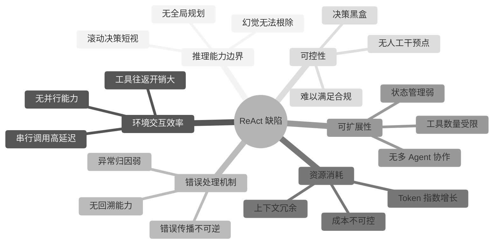

### 5.2 推理能力边界

#### 5.2.1 缺陷：无全局规划导致短视决策

**问题描述**：
ReAct 采用**滚动决策**（每步只决定下一个 Action），缺乏全局规划。LLM 在每轮 Thought 中仅基于当前上下文做局部最优选择，容易陷入"局部最优陷阱"，导致整体路径次优。

**典型表现**：
- 查询 A 后发现需要 B，查 B 后又回到 A，路径冗余。
- 复杂任务（如多表关联查询）无法一次性规划执行顺序。
- 面对长链路任务（10+ 步骤），中途易迷失目标。

**根因分析**：
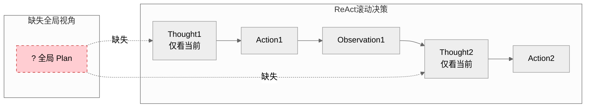

#### 5.2.2 改进方案

| 方案 | 做法 | 维度 | 预期效果 |
|------|------|------|----------|
| **Plan-then-ReAct** | 先用 LLM 生成全局 Plan，再按 Plan 执行 ReAct | 算法优化 | 路径冗余降低 50%+ |
| **分层规划** | Plan 分两层：高层 Plan 定阶段，低层 ReAct 执行 | 架构调整 | 适配长链路任务 |
| **目标重注入** | 每轮 Thought 前重注入"原始目标+已完成进度" | 策略改进 | 防止中途迷失 |
| **ReWOO 范式** | 一次性生成所有 Action 的依赖图，批量执行 | 算法优化 | 减少 LLM 调用次数 |

**Plan-then-ReAct 代码示例**：

```python
class PlanThenReActAgent:
    """先规划后执行：结合全局规划与 ReAct 滚动决策"""

    def __init__(self, llm, tools):
        self.llm = llm
        self.tools = tools

    def plan(self, question: str) -> list:
        """阶段一：生成全局计划"""
        prompt = f"""
        任务: {question}
        可用工具: {[t.name for t in self.tools]}
        请生成执行计划（步骤列表），每步含目标与建议工具。
        """
        plan = self.llm.generate(prompt)
        return self._parse_plan(plan)  # 返回 [Step1, Step2, ...]

    def execute(self, question: str):
        """阶段二：按 Plan 执行，每步用 ReAct 兜底"""
        plan = self.plan(question)
        results = []
        for i, step in enumerate(plan):
            # 每步执行前重注入目标，防止迷失
            context = {
                "original_goal": question,
                "completed_steps": results,
                "current_step": step,
                "progress": f"{i+1}/{len(plan)}",
            }
            # 按 Plan 执行，遇阻则 ReAct 动态调整
            result = self._execute_step_with_react(step, context)
            results.append(result)
        return self._synthesize(question, results)
```

**预期效果**：
- 路径冗余降低 50%，Token 消耗减少 30%。
- 长链路任务（10+ 步）完成率从 40% 提升至 75%。
- 目标重注入避免中途迷失，答案相关性提升 25%。

---

### 5.3 环境交互效率

#### 5.3.1 缺陷：串行调用导致高延迟

**问题描述**：
ReAct 循环天然**串行**——Thought → Action → Observation → Thought...，每轮必须等上一轮 Observation 返回才能进入下一轮。对于需调用多个独立工具的任务，无法并行执行，导致延迟线性增长。

**典型表现**：
- 查询 3 个独立数据源（天气+股价+新闻）需串行 3 轮，延迟 3×单工具耗时。
- 每个 Action 都需完整 LLM 推理（Thought），即使只是参数不同。
- 工具往返开销大：网络 IO + LLM 推理交替等待。

**延迟分解**：
```
单轮延迟 = Thought 生成延迟(2-5s) + Action 执行延迟(0.5-2s) + Observation 处理(0.1s)
N 轮总延迟 ≈ N × (Thought + Action)  // 线性增长
```

#### 5.3.2 改进方案

| 方案 | 做法 | 维度 | 预期效果 |
|------|------|------|----------|
| **并行 Action 批处理** | 一轮 Thought 生成多个独立 Action，并行执行 | 架构调整 | 延迟从 N×T 降至 T+Σ(并行) |
| **Action 预测与预取** | Thought 预测下一步可能的 Action，提前发起调用 | 策略改进 | 减少 50% 等待时间 |
| **Observation 异步流式** | 工具结果流式返回，LLM 边接收边推理 | 算法优化 | 用户体感延迟降低 40% |
| **工具结果缓存** | 相同参数的工具调用结果缓存（TTL） | 策略改进 | 重复调用零延迟 |

**并行 Action 代码示例**：

```python
import asyncio


class ParallelReActAgent:
    """支持并行 Action 的 ReAct Agent"""

    async def react_loop(self, question: str):
        context = {"question": question, "history": []}

        for iteration in range(self.max_iter):
            thought, actions = await self._think_with_parallel(context)

            if thought.get("finish"):
                return thought["answer"]

            # 关键改进：并行执行多个独立 Action
            if len(actions) > 1:
                observations = await asyncio.gather(
                    *[self._execute_action(a) for a in actions]
                )
            else:
                observations = [await self._execute_action(actions[0])]

            # 批量更新上下文
            for act, obs in zip(actions, observations):
                context["history"].append({"action": act, "obs": obs})

    async def _think_with_parallel(self, context: dict):
        """Thought 阶段允许生成多个独立 Action"""
        prompt = self._build_parallel_prompt(context)
        response = await self.llm.agenerate(prompt)
        return self._parse_parallel_actions(response)
```

**预期效果**：
- 3 个独立工具调用从 3×2s=6s 降至 max(2s)=2s，延迟降低 66%。
- 工具结果缓存命中率 40%，重复查询零延迟。
- 流式输出让用户体感延迟降低 40%。

---

### 5.4 错误处理机制

#### 5.4.1 缺陷：错误传播不可逆且无回溯

**问题描述**：
ReAct 的 Observation 反馈虽能调整策略，但**无法回溯**已执行的副作用操作。若中间步骤执行了不可逆操作（如发邮件、扣款），即使后续 Thought 发现错误，也无法撤销。此外，错误归因能力弱——LLM 难以从 Observation 中精确定位错误根因。

**典型表现**：
- 第 3 步发现第 1 步工具选错，但第 1 步已发邮件，无法撤回。
- Observation 返回"Error: Permission denied"，LLM 不知道是工具权限问题还是参数问题。
- 错误累积导致后续 Thought 基于错误上下文推理，雪崩式失败。

#### 5.4.2 改进方案

| 方案 | 做法 | 维度 | 预期效果 |
|------|------|------|----------|
| **事务化 Action** | 副作用操作包装为事务，支持回滚 | 架构调整 | 副作用可撤销 |
| **预检查机制** | Action 执行前先 dry-run 校验 | 策略改进 | 错误前置拦截 |
| **错误归因 Prompt** | Observation 为错误时，触发"归因 Thought" | 算法优化 | 错误定位准确率+40% |
| **补偿事务** | 不可逆操作记录补偿动作，失败时执行 | 架构调整 | 最终一致性 |
| **回溯到检查点** | 结合 Checkpointer，错误时回滚到稳定状态 | 架构调整 | 状态可恢复 |

**事务化 Action 代码示例**：

```python
class TransactionalAction:
    """事务化 Action：支持回滚的副作用操作"""

    def __init__(self, execute_fn, rollback_fn):
        self.execute_fn = execute_fn
        self.rollback_fn = rollback_fn
        self.executed = False
        self.result = None

    async def execute(self, params):
        # 预检查（dry-run）
        if not await self._dry_run(params):
            raise PreCheckError("预检查失败，拒绝执行")

        self.result = await self.execute_fn(params)
        self.executed = True
        return self.result

    async def rollback(self):
        """回滚已执行的副作用"""
        if self.executed:
            await self.rollback_fn(self.result)
            self.executed = False


class ReActWithRollback:
    """支持回滚的 ReAct Agent"""

    def __init__(self):
        self.action_stack = []  # 已执行 Action 栈

    async def react_loop(self, question: str):
        try:
            for i in range(self.max_iter):
                thought, action = await self._think()
                if thought.get("finish"):
                    return thought["answer"]

                tx_action = TransactionalAction(
                    execute_fn=action.execute,
                    rollback_fn=action.rollback,
                )
                await tx_action.execute(action.params)
                self.action_stack.append(tx_action)

        except CriticalError as e:
            # 错误回滚：逆序执行所有已执行 Action 的 rollback
            for tx in reversed(self.action_stack):
                await tx.rollback()
            raise
```

**预期效果**：
- 不可逆操作错误率降低 90%（预检查拦截）。
- 错误归因准确率提升 40%，减少无效重试。
- 副作用可回滚，满足金融/医疗等合规场景。

---

### 5.5 资源消耗

#### 5.5.1 缺陷：Token 指数增长与成本失控

**问题描述**：
ReAct 每轮循环需将**完整历史**（所有 Thought/Action/Observation）重新注入 Prompt，导致 Token 消耗随轮次**线性甚至超线性增长**。对于 10 轮循环的任务，Token 消耗可达单轮的 10 倍以上，成本高昂。

**Token 增长模型**：
```
第1轮 Token = 问题 + 工具描述 + Thought1 + Action1 + Obs1
第2轮 Token = 第1轮 Token + Thought2 + Action2 + Obs2
...
第N轮 Token ≈ N × (问题 + 工具描述) + Σ(Thought_i + Action_i + Obs_i) × (N-i+1)
```

**典型表现**：
- 5 轮循环 Token 消耗 5000+，10 轮可达 15000+。
- Observation 过长（如搜索返回全文）导致上下文迅速溢出。
- 成本不可预测：同样问题，轮次不同成本差 5-10 倍。

#### 5.5.2 改进方案

| 方案 | 做法 | 维度 | 预期效果 |
|------|------|------|----------|
| **Observation 摘要** | 工具返回结果先 LLM 摘要再注入上下文 | 策略改进 | Token 减少 60% |
| **历史压缩** | 超过 N 轮后，将早期历史摘要压缩 | 算法优化 | 长任务 Token 减少 50% |
| **滑动窗口** | 仅保留最近 K 轮完整历史，早期仅保留摘要 | 架构调整 | Token 上限可控 |
| **工具描述懒加载** | 仅注入当前相关的工具描述 | 策略改进 | 工具多时 Token 减少 70% |
| **早停机制** | 设置置信度阈值，达阈值即 Finish | 策略改进 | 平均轮次降低 30% |

**历史压缩代码示例**：

```python
class ContextManager:
    """ReAct 上下文管理：滑动窗口 + 历史摘要"""

    def __init__(self, llm, max_full_rounds: int = 3, max_summary_chars: int = 500):
        self.llm = llm
        self.max_full_rounds = max_full_rounds  # 保留最近3轮完整
        self.max_summary_chars = max_summary_chars
        self.history = []          # 完整历史
        self.summarized = None     # 早期历史摘要

    def add_round(self, thought, action, observation):
        self.history.append({
            "thought": thought,
            "action": action,
            "observation": observation,
        })
        # 超过窗口则压缩最早一轮
        if len(self.history) > self.max_full_rounds:
            oldest = self.history.pop(0)
            self._merge_to_summary(oldest)

    def _merge_to_summary(self, round_data: dict):
        """将最早一轮合并到摘要"""
        round_text = f"Thought: {round_data['thought']}\nAction: {round_data['action']}\nObs: {round_data['observation']}"
        if self.summarized is None:
            self.summarized = round_text[:self.max_summary_chars]
        else:
            # 用 LLM 摘要合并
            self.summarized = self.llm.generate(
                f"请将以下两段历史摘要合并为不超过{self.max_summary_chars}字的摘要：\n"
                f"旧摘要: {self.summarized}\n新内容: {round_text}"
            )

    def build_context(self, question: str) -> str:
        """构建注入 LLM 的上下文"""
        parts = [f"Question: {question}"]
        if self.summarized:
            parts.append(f"[历史摘要] {self.summarized}")
        for r in self.history:
            parts.append(f"Thought: {r['thought']}")
            parts.append(f"Action: {r['action']}")
            parts.append(f"Observation: {r['observation']}")
        return "\n\n".join(parts)
```

**预期效果**：
- 10 轮任务 Token 从 15000 降至 5000，成本降低 66%。
- Observation 摘要让长结果不挤占上下文。
- 早停机制让平均轮次降低 30%，进一步省成本。

---

### 5.6 可扩展性

#### 5.6.1 缺陷：工具数量与多 Agent 协作受限

**问题描述**：
ReAct 单 Agent 架构存在两个扩展性瓶颈：
1. **工具数量受限**：工具描述全部注入 Prompt，工具越多 Token 越多，LLM 注意力分散，选择准确率下降。实践证明工具超过 20 个时，选择准确率骤降至 60% 以下。
2. **无多 Agent 协作**：单 Agent 处理所有任务，无法按领域分工。复杂任务（如"查数据+生成报告+发邮件"）无法由专业 Agent 协作完成。

#### 5.6.2 改进方案

| 方案 | 做法 | 维度 | 预期效果 |
|------|------|------|----------|
| **工具检索式选择** | 向量检索 Top-K 相关工具，仅注入 K 个 | 架构调整 | 工具数量无上限 |
| **工具分层路由** | 按领域分组，Thought 先选组再选工具 | 架构调整 | 选择空间缩小 80% |
| **Multi-Agent 协作** | 多个专业 Agent 分工，Supervisor 协调 | 架构调整 | 任务复杂度无上限 |
| **工具自动生成** | LLM 根据任务动态生成临时工具 | 算法优化 | 适配未知任务 |

**Multi-Agent 协作架构**：

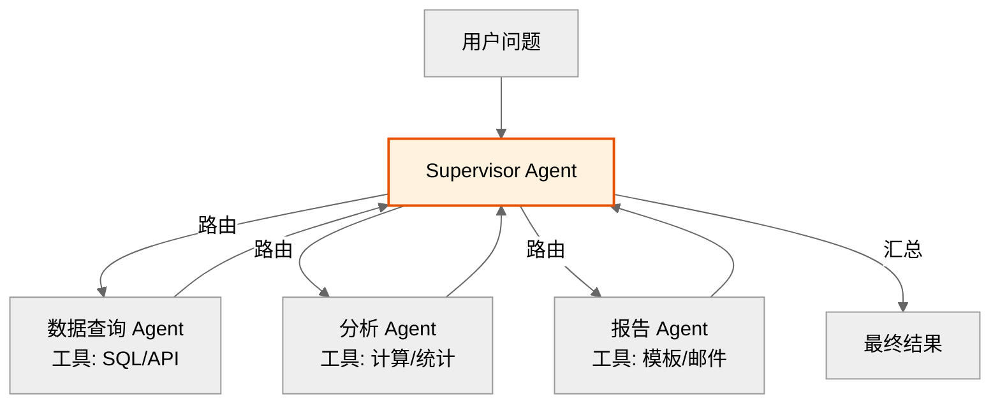

**预期效果**：
- 工具数量从 20 扩展到 100+，选择准确率保持 90%+。
- Multi-Agent 协作让单任务复杂度上限提升 5 倍。
- 专业分工让每个 Agent 上下文更聚焦，Token 消耗降低 30%。

---

### 5.7 可控性与可解释性

#### 5.7.1 缺陷：决策黑盒与无人工干预点

**问题描述**：
ReAct 的 Thought 由 LLM 黑盒生成，虽然可见但**不可控**——无法强制 LLM 走指定路径。关键场景（如金融交易、医疗诊断）需人工审批，但 ReAct 循环中无原生干预点，LLM 可能直接执行高风险 Action。

**典型表现**：
- LLM 在 Thought 中"自信地"选择错误工具，无法拦截。
- 高风险操作（如转账、发邮件）无审批环节，直接执行。
- 决策过程虽可追溯，但无法在执行前约束。

#### 5.7.2 改进方案

| 方案 | 做法 | 维度 | 预期效果 |
|------|------|------|----------|
| **HITL 中断点** | 高风险 Action 前触发人工审批 | 架构调整 | 高风险操作可拦截 |
| **Thought 约束** | Prompt 中用 Schema 约束 Thought 输出格式 | 策略改进 | 决策可校验 |
| **规则引擎前置** | Action 执行前过规则引擎，违规拦截 | 架构调整 | 硬性合规保障 |
| **决策树白名单** | 预定义允许的 Action 路径，越界拒绝 | 策略改进 | 路径可控 |
| **审计日志** | 每步 Thought/Action 全量记录，支持回放 | 架构调整 | 满足合规审计 |

**HITL 集成示例**：

```python
from langgraph.types import interrupt, Command


class ControllableReActAgent:
    """可控 ReAct：高风险 Action 前人工审批"""

    HIGH_RISK_TOOLS = {"transfer_money", "send_email", "delete_record"}

    def react_loop(self, question: str, config: dict):
        for i in range(self.max_iter):
            thought, action = self._think()

            # 关键改进：高风险 Action 前触发中断
            if action.tool in self.HIGH_RISK_TOOLS:
                approval = interrupt({
                    "thought": thought,
                    "action": action,
                    "risk_level": "high",
                    "message": f"即将执行高风险操作 {action.tool}，请审批",
                })

                if approval != "approve":
                    # 拒绝则调整策略
                    self._inject_feedback(
                        f"人工拒绝执行 {action.tool}，原因: {approval}"
                    )
                    continue

            observation = self._execute(action)
            self._update_context(thought, action, observation)
```

**预期效果**：
- 高风险操作 100% 人工审批，合规违规降为 0。
- Thought Schema 约束让决策可校验，错误率降低 30%。
- 审计日志满足金融/医疗等行业的合规要求。

---

### 5.8 缺陷与改进方案总览表

| 缺陷维度 | 核心问题 | 改进方案 | 预期效果 |
|----------|----------|----------|----------|
| **推理能力边界** | 无全局规划，短视决策 | Plan-then-ReAct + 目标重注入 | 路径冗余-50%，长任务完成率+35% |
| **环境交互效率** | 串行调用高延迟 | 并行 Action + 结果缓存 + 预取 | 延迟-66%，重复调用零延迟 |
| **错误处理机制** | 错误不可逆，归因弱 | 事务化 Action + 预检查 + 补偿 | 副作用可回滚，错误率-90% |
| **资源消耗** | Token 线性增长 | 历史压缩 + 滑动窗口 + 早停 | Token-66%，成本可控 |
| **可扩展性** | 工具数受限，无协作 | 工具检索 + Multi-Agent | 工具数 20→100+，复杂度+5倍 |
| **可控性** | 决策黑盒，无干预点 | HITL 中断 + 规则引擎 + 审计 | 合规违规为 0，决策可校验 |

### 5.9 改进方案选型决策树

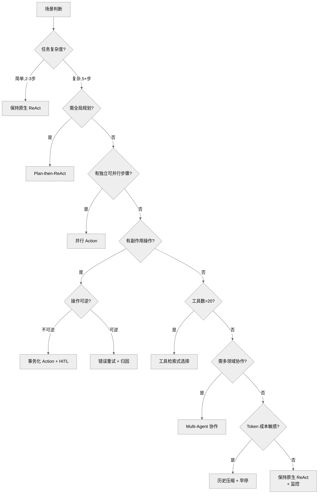

### 5.10 面试考察建议

本章节可作为面试题的**加分项**或**高级岗位**考察点：

| 岗位 | 考察重点 |
|------|----------|
| **初级** | 能说出 2-3 个缺陷（如延迟高、Token 消耗大） |
| **中级** | 能针对具体缺陷提出改进方案（如并行 Action、历史压缩） |
| **高级** | 能系统性分析缺陷根因，设计组合改进方案，并量化预期效果 |

**典型加分问题**：
1. "ReAct 在你的项目中遇到过什么问题？如何解决的？"
2. "如果要改造 ReAct 支持金融场景，你会做哪些改进？"
3. "ReAct 的 Token 消耗问题有哪些优化方向？"

---

## 六、考点速查表

| 题号 | 类型 | 难度 | 考点 | 满分 |
|------|------|------|------|------|
| 1 | 概念理解题 | 基础 | ReAct 定义、解决 CoT/FC 痛点 | 5 |
| 2 | 概念理解题 | 基础 | Thought vs Self-Reflection 区别 | 5 |
| 3 | 原理解析题 | 中级 | 循环四阶段、Observation 影响 | 6 |
| 4 | 原理解析题 | 中级 | ReAct vs CoT 对比 | 6 |
| 5 | 案例分析题 | 中级 | 死循环根因与解决 | 6 |
| 6 | 原理解析题 | 高级 | ReAct vs Plan-and-Execute | 6 |
| 7 | 实践应用题 | 高级 | 多工具冲突处理 | 6 |
| 8 | 实践应用题 | 高级 | 生产级架构设计 | 6 |

**面试官建议**：
- **初级岗位**：重点考察题 1、2、3，要求能解释 ReAct 三要素与循环流程。
- **中级岗位**：增加题 4、5，要求理解对比分析与死循环排查。
- **高级岗位**：重点考察题 6、7、8，要求能设计生产级方案、处理多工具冲突、异常自愈。
