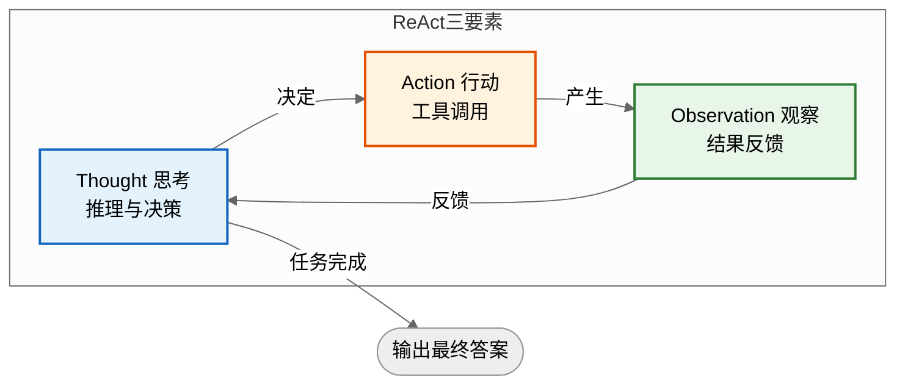
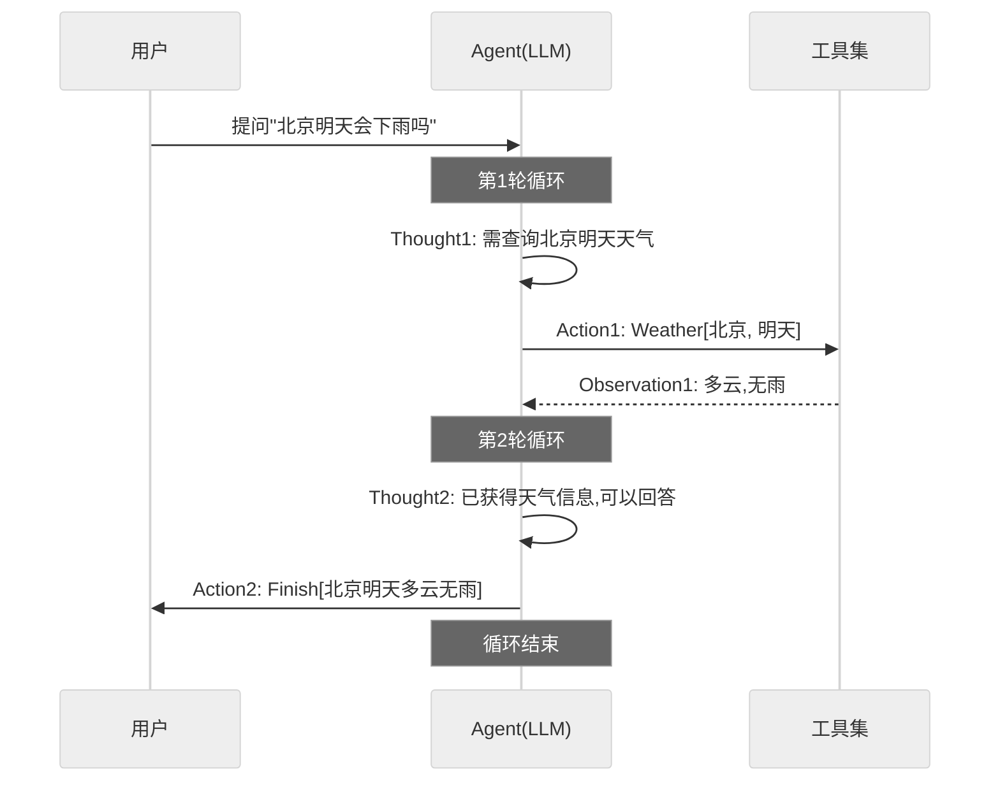
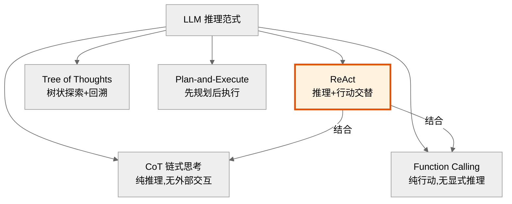
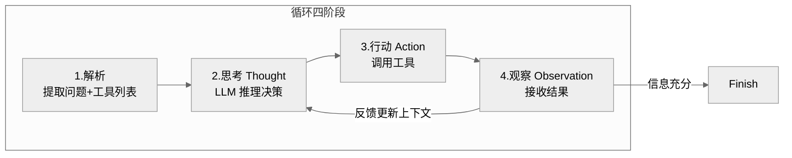
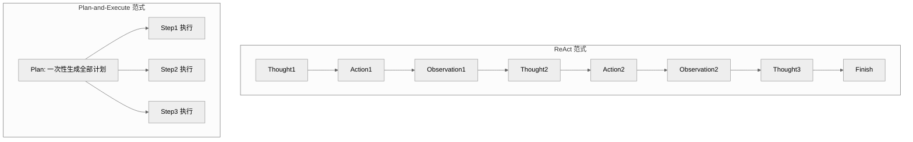
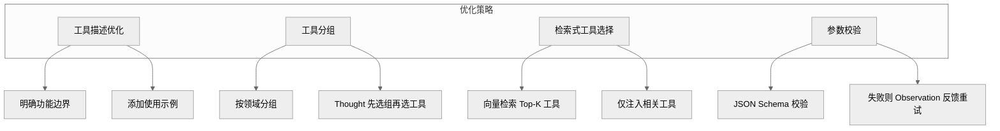
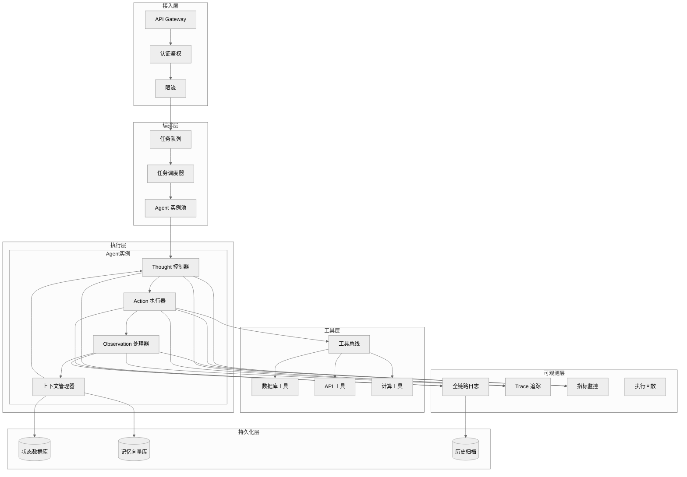

# ReAct 框架面试题全集

> 本文档系统涵盖 ReAct（Reasoning + Acting）框架的核心概念、底层工作原理及概念与原理的结合应用，配以高质量流程图，面试题融入实际项目案例，题型含概念理解题、原理解析题、案例分析题、实践应用题。

---

## 目录

- [ReAct 框架面试题全集](#react-框架面试题全集)
  - [目录](#目录)
  - [一、ReAct 核心概念](#一react-核心概念)
    - [1.1 什么是 ReAct](#11-什么是-react)
    - [1.2 解决的核心问题](#12-解决的核心问题)
    - [1.3 ReAct 三要素](#13-react-三要素)
    - [1.4 典型 Prompt 模板](#14-典型-prompt-模板)
  - [二、ReAct 底层工作原理](#二react-底层工作原理)
    - [2.1 完整循环流程](#21-完整循环流程)
    - [2.2 循环执行时序图](#22-循环执行时序图)
    - [2.3 核心机制详解](#23-核心机制详解)
      - [2.3.1 Thought 生成机制](#231-thought-生成机制)
      - [2.3.2 Action 执行机制](#232-action-执行机制)
      - [2.3.3 Observation 反馈机制](#233-observation-反馈机制)
    - [2.4 终止条件设计](#24-终止条件设计)
    - [2.5 ReAct 与其他范式的关系](#25-react-与其他范式的关系)
  - [三、面试题及详解](#三面试题及详解)
    - [题目 1：ReAct 定义与核心价值（概念理解题·基础）](#题目-1react-定义与核心价值概念理解题基础)
    - [题目 2：Thought 的作用辨析（概念理解题·基础）](#题目-2thought-的作用辨析概念理解题基础)
    - [题目 3：ReAct 循环四阶段解析（原理解析题·中级）](#题目-3react-循环四阶段解析原理解析题中级)
    - [题目 4：ReAct vs CoT 对比（原理解析题·中级）](#题目-4react-vs-cot-对比原理解析题中级)
    - [题目 5：死循环问题诊断（案例分析题·中级）](#题目-5死循环问题诊断案例分析题中级)
    - [题目 6：ReAct vs Plan-and-Execute（原理解析题·高级）](#题目-6react-vs-plan-and-execute原理解析题高级)
    - [题目 7：多工具冲突处理（实践应用题·高级）](#题目-7多工具冲突处理实践应用题高级)
    - [题目 8：生产级 ReAct Agent 设计（实践应用题·高级）](#题目-8生产级-react-agent-设计实践应用题高级)
  - [四、考点速查表](#四考点速查表)

---

## 一、ReAct 核心概念

### 1.1 什么是 ReAct

**ReAct（Reasoning + Acting）** 是 2022 年由 Yao 等人提出的 Agent 推理范式，核心思想是让 LLM 交替进行**推理（Reasoning）** 与**行动（Acting）**，通过"思考—行动—观察"的闭环循环解决复杂任务。

**一句话定义**：ReAct = 推理引导行动 + 行动反馈推理，两者协同逼近任务目标。

### 1.2 解决的核心问题

| 问题 | 纯推理（CoT） | 纯行动（Function Calling） | ReAct |
|------|--------------|--------------------------|-------|
| **信息不足** | 仅靠模型内部知识，易幻觉 | 可调工具但无规划 | 边推理边获取外部信息 |
| **决策失误** | 一次性生成，无修正 | 工具选择无解释性 | 每步思考后再行动 |
| **错误传播** | 错误一路累积 | 无观察反馈 | 观察结果反馈修正推理 |
| **可解释性** | 思考过程可见但不可控 | 黑盒调用 | 思考+行动+观察全程可追溯 |

### 1.3 ReAct 三要素



| 要素 | 定位 | 作用 | 产出 |
|------|------|------|------|
| **Thought（思考）** | 推理 | 分析当前状态，决定下一步 | 行动计划、工具选择理由 |
| **Action（行动）** | 执行 | 调用外部工具或模型 | 工具调用指令 |
| **Observation（观察）** | 反馈 | 接收工具返回结果 | 新的上下文信息 |

### 1.4 典型 Prompt 模板

```
Question: {用户问题}

Thought 1: 我需要先搜索相关信息。
Action 1: Search[LangGraph 持久化机制]
Observation 1: [搜索结果摘要]

Thought 2: 根据搜索结果，我需要查看官方文档细节。
Action 2: Lookup[Checkpointer 用法]
Observation 2: [文档片段]

Thought 3: 现在我有足够信息回答问题了。
Action 3: Finish[LangGraph 持久化通过 Checkpointer...]

最终答案: LangGraph 持久化通过 Checkpointer...
```

---

## 二、ReAct 底层工作原理

### 2.1 完整循环流程


### 2.2 循环执行时序图



### 2.3 核心机制详解

#### 2.3.1 Thought 生成机制

Thought 由 LLM 基于当前上下文（问题 + 历史 Thought/Action/Observation）生成，核心作用：

1. **状态评估**：分析已掌握的信息是否足够。
2. **目标分解**：将复杂问题拆解为子步骤。
3. **工具选择**：决定调用哪个工具及参数。
4. **终止判断**：判断是否可以输出最终答案。

#### 2.3.2 Action 执行机制

Action 是 Thought 的执行产物，格式为 `ToolName[参数]`：

- **搜索类**：`Search[query]`、`Lookup[keyword]`
- **计算类**：`Calculate[expression]`、`CodeRun[script]`
- **数据查询**：`QueryDB[sql]`、`ReadFile[path]`
- **终止类**：`Finish[answer]`

#### 2.3.3 Observation 反馈机制

Observation 将工具执行结果注入上下文，触发下一轮 Thought：

- **正向反馈**：获得新信息，推进任务。
- **负向反馈**：工具报错或结果无关，Thought 调整策略。
- **终止信号**：信息充分，触发 Finish。

### 2.4 终止条件设计

| 终止条件 | 触发方式 | 说明 |
|----------|----------|------|
| **Finish 动作** | LLM 主动判断 | 推理认为已有答案 |
| **最大轮次** | 框架硬限制 | 防止死循环（通常 5-10 轮） |
| **Token 上限** | 上下文溢出 | 自动截断并要求总结 |
| **超时** | 时间限制 | 长时间无进展兜底 |

### 2.5 ReAct 与其他范式的关系



---

## 三、面试题及详解

### 题目 1：ReAct 定义与核心价值（概念理解题·基础）

**难度**：基础　**类型**：概念理解题

**问题描述**：
请用一句话定义 ReAct 框架，并说明它解决了纯 CoT 和纯 Function Calling 各自的什么痛点。

**参考答案**：

**一句话定义**：ReAct = 推理（Reasoning）引导行动（Acting），行动反馈修正推理，两者交替循环直至完成任务。

**解决的痛点**：

| 范式 | 痛点 | ReAct 如何解决 |
|------|------|----------------|
| **纯 CoT** | 仅靠模型内部知识，无法获取外部信息，易幻觉 | Action 调用工具获取真实数据 |
| **纯 CoT** | 一次性生成，错误无法中途修正 | 循环中 Observation 反馈可修正推理 |
| **纯 Function Calling** | 工具选择无解释性，黑盒决策 | Thought 显式说明选择理由 |
| **纯 Function Calling** | 无观察反馈，错误传播 | Observation 反馈触发策略调整 |

**评分标准**：定义准确 2 分；指出 CoT 痛点 1.5 分；指出 FC 痛点 1.5 分（满分 5）。

**项目实例**：
- **项目背景**：某金融问答机器人初期用纯 CoT，回答"XX 公司最新财报"时经常幻觉编造数据。
- **技术选型理由**：纯 CoT 无法获取实时财报，纯 FC 选错工具无解释；ReAct 先思考"需要查财报数据库"，再调工具，最后基于真实数据回答。
- **实现步骤**：①Thought 分析问题类型；②Action 调用 `QueryFinance[公司名, 年份]`；③Observation 获取真实财报；④Finish 基于数据生成答案。
- **遇到的挑战**：LLM 偶尔跳过 Thought 直接 Action，导致工具选择错误。
- **解决方案**：Prompt 中强制要求"必须先输出 Thought 再输出 Action"，并用正则解析校验格式。
- **最终效果**：幻觉率从 35% 降至 5%，用户满意度提升 30%。

---

### 题目 2：Thought 的作用辨析（概念理解题·基础）

**难度**：基础　**类型**：概念理解题

**问题描述**：
ReAct 中的 Thought 与 Self-Reflection（自我反思）有什么区别？能否用 Thought 替代反思机制？

**参考答案**：

| 维度 | Thought | Self-Reflection |
|------|---------|-----------------|
| **时机** | 行动**之前**（前向推理） | 行动**之后**（后向评估） |
| **作用** | 决定"怎么做" | 评估"做得对不对" |
| **类比** | 事前规划 | 事后复盘 |
| **触发** | 每轮循环自动触发 | 失败或完成后触发 |
| **产出** | 行动计划 | 反思文本 + 经验记忆 |

**不能替代**：Thought 是前向的"规划决策"，Self-Reflection 是后向的"评估改进"。两者互补：Thought 决定怎么做，反思评估做得怎样并指导下次改进。仅靠 Thought 无法从失败中学习，会重复犯错。

**评分标准**：区别 3 分；不可替代原因 2 分（满分 5）。

**项目实例**：
- **项目背景**：某代码生成 Agent 用 ReAct 但无反思，发现同一类错误反复出现。
- **技术选型理由**：Thought 只能规划当前步骤，无法从历史失败中学习；需补充反思机制。
- **实现步骤**：①ReAct 循环完成代码生成；②若测试失败触发 Self-Reflection，生成"错误归因+改进建议"；③反思存入记忆，下次同类任务加载。
- **遇到的挑战**：反思机制增加 40% Token 消耗。
- **解决方案**：仅测试失败时触发反思（难度感知），成功则跳过，Token 消耗降低 60%。
- **最终效果**：同类错误重复率降低 80%，生成成功率从 60% 提升至 85%。

---

### 题目 3：ReAct 循环四阶段解析（原理解析题·中级）

**难度**：中级　**类型**：原理解析题

**问题描述**：
请结合流程图，详细解析 ReAct 循环的四个阶段（解析、思考、行动、观察），并说明 Observation 如何影响下一轮 Thought。

**参考答案**：



**四阶段详解**：

1. **解析阶段**：提取用户问题，加载可用工具列表，初始化上下文。
2. **思考阶段（Thought）**：LLM 基于问题+历史上下文推理，决定下一步：
   - 评估当前信息是否足够
   - 选择工具及参数
   - 生成"为什么这么做"的解释
3. **行动阶段（Action）**：执行 Thought 决定的工具调用，格式为 `Tool[params]`。
4. **观察阶段（Observation）**：接收工具返回结果，追加到上下文，触发下一轮 Thought。

**Observation 对 Thought 的影响**：

| Observation 类型 | 对 Thought 的影响 |
|------------------|-------------------|
| **正向（有用信息）** | Thought 推进任务，可能触发 Finish |
| **负向（报错）** | Thought 调整策略，换工具或改参数 |
| **无关（噪声）** | Thought 重新评估，可能细化查询 |
| **矛盾（冲突）** | Thought 触发验证，调用其他工具交叉验证 |

**评分标准**：流程图正确 2 分；四阶段详解 2 分；Observation 影响分析 2 分（满分 6）。

**项目实例**：
- **项目背景**：某法律咨询 Agent，用户问"竞业协议补偿金最低标准"，需查询多地法规。
- **技术选型理由**：法律问题需多轮查询+交叉验证，ReAct 的 Observation 反馈机制适合逐步逼近答案。
- **实现步骤**：
  1. Thought1：需查询北京竞业补偿标准 → Action1：`SearchLaw[北京, 竞业补偿]` → Observation1：北京标准为月工资 30%
  2. Thought2：需对比上海标准 → Action2：`SearchLaw[上海, 竞业补偿]` → Observation2：上海为 35%
  3. Thought3：信息充分 → Action3：`Finish[北京30%, 上海35%]`
- **遇到的挑战**：Observation1 返回的法规已过期，导致答案错误。
- **解决方案**：Thought 中增加"时效性校验"步骤，Observation 后检查法规年份，过期则重新搜索最新版本。
- **最终效果**：答案准确率从 75% 提升至 95%，平均查询 2-3 轮即可完成。

---

### 题目 4：ReAct vs CoT 对比（原理解析题·中级）

**难度**：中级　**类型**：原理解析题

**问题描述**：
请从机制、能力边界、适用场景三个维度对比 ReAct 与 CoT，并说明为什么 ReAct 在工具使用场景下优于 CoT。

**参考答案**：

| 维度 | CoT（链式思考） | ReAct |
|------|----------------|-------|
| **机制** | LLM 内部一次性推理 | 推理+行动交替循环 |
| **外部信息** | ❌ 无法获取 | ✅ 通过 Action 调用工具 |
| **错误修正** | ❌ 一次生成不可逆 | ✅ Observation 反馈可修正 |
| **可解释性** | 思考可见但不可控 | Thought+Action+Observation 全程可追溯 |
| **Token 消耗** | 低（单轮） | 高（多轮） |
| **延迟** | 低 | 高（多轮工具调用） |
| **适用场景** | 知识推理、数学计算 | 需外部数据、多步决策 |

**ReAct 优于 CoT 的原因**：
1. **信息获取**：CoT 仅靠模型内部知识，ReAct 可调用工具获取实时数据。
2. **错误修正**：CoT 错误一路累积，ReAct 可基于 Observation 调整。
3. **可验证性**：ReAct 的 Action 可复现，CoT 的推理不可验证。

**评分标准**：对比维度≥5 项 3 分；ReAct 优势分析 2 分；适用场景说明 1 分（满分 6）。

**项目实例**：
- **项目背景**：某数据分析助手，用户问"上季度销售额最高的产品"。
- **技术选型理由**：CoT 无法访问数据库，会编造数据；ReAct 可调 SQL 查询真实数据。
- **实现步骤**：
  - CoT 方案：LLM 直接生成"上季度销冠是产品A"（幻觉）
  - ReAct 方案：Thought→需查数据库→Action:`QuerySQL[SELECT...]`→Observation:真实数据→Finish
- **遇到的挑战**：SQL 生成错误导致查询失败。
- **解决方案**：Thought 中先分析表结构，Action 中生成 SQL 后校验语法，失败则 Observation 反馈触发重写。
- **最终效果**：数据准确率从 40%（CoT）提升至 98%（ReAct）。

---

### 题目 5：死循环问题诊断（案例分析题·中级）

**难度**：中级　**类型**：案例分析题

**问题描述**：
某团队上线 ReAct Agent 后发现：Agent 反复调用同一个工具，循环 10 次后超时失败。请分析可能的根因，并给出解决方案。

**参考答案**：

**根因分析**：

| 可能原因 | 表现 | 诊断方法 |
|----------|------|----------|
| **Prompt 模糊** | LLM 不知何时该 Finish | 检查 Prompt 是否明确终止条件 |
| **工具返回无效** | Observation 无有用信息 | 检查工具返回内容 |
| **上下文丢失** | LLM 忘记已调过该工具 | 检查上下文长度 |
| **无最大轮次限制** | 循环不终止 | 检查框架配置 |

**解决方案**：

1. **明确终止条件**：Prompt 中强调"信息充分时必须 Finish"。
2. **去重机制**：记录已调用工具+参数，重复调用时拦截。
3. **最大轮次限制**：硬性设置 5-8 轮上限。
4. **Observation 优化**：工具返回空结果时明确提示"未找到，请换关键词"。
5. **上下文压缩**：历史过长时摘要压缩，保留关键信息。

```python
# 去重机制示例
class ReActAgent:
    def __init__(self):
        self.action_history = []  # 记录所有 Action

    def should_terminate(self, thought, action, iteration):
        """终止条件判断"""
        # 1. LLM 主动 Finish
        if action.startswith("Finish"):
            return True
        # 2. 最大轮次
        if iteration >= 8:
            return True
        # 3. 重复 Action 检测
        action_key = action.strip()
        if action_key in self.action_history:
            return True  # 重复调用直接终止
        self.action_history.append(action_key)
        return False
```

**评分标准**：根因≥3 种 2 分；解决方案≥4 项 3 分；代码示例 1 分（满分 6）。

**项目实例**：
- **项目背景**：某客服 Agent 上线后发现，用户问"怎么退款"时，Agent 反复调用 `SearchFAQ[退款]` 10 次后超时。
- **技术选型理由**：ReAct 死循环是常见生产问题，需从 Prompt、工具、框架三层防护。
- **实现步骤**：
  1. 诊断：检查日志发现 Observation 返回相同内容，Thought 每次都"需要更多信息"。
  2. 根因：Prompt 未明确"信息充分时 Finish"；工具返回过长 FAQ 被 LLM 忽略。
  3. 修复：①Prompt 增加"已获得退款流程时必须 Finish"；②工具返回精简为"前3条+摘要"；③增加去重+最大轮次。
- **遇到的挑战**：修复后 Agent 过早 Finish，答案不完整。
- **解决方案**：调整 Prompt 平衡——"信息充分"定义为"已获得完整退款步骤"，非"有任何信息"。
- **最终效果**：死循环问题消除，平均循环轮次从 10 降至 3，答案完整率 90%。

---

### 题目 6：ReAct vs Plan-and-Execute（原理解析题·高级）

**难度**：高级　**类型**：原理解析题

**问题描述**：
请对比 ReAct 与 Plan-and-Execute 两种范式，分析各自优劣，并说明什么场景下应选择哪种。

**参考答案**：



| 维度 | ReAct | Plan-and-Execute |
|------|-------|-------------------|
| **规划方式** | 滚动规划（每步决策） | 一次性规划全部步骤 |
| **灵活性** | 高（可动态调整） | 低（需重新规划） |
| **Token 消耗** | 高（每轮重复上下文） | 低（规划一次） |
| **延迟** | 高（串行循环） | 可并行执行无依赖步骤 |
| **错误恢复** | 强（Observation 即时反馈） | 弱（需重新规划） |
| **适用任务** | 不确定、需探索 | 明确、可分解 |

**选型建议**：

| 场景 | 推荐 | 理由 |
|------|------|------|
| 信息检索（不确定查什么） | ReAct | 需根据中间结果调整方向 |
| 多步代码生成（需求明确） | Plan-and-Execute | 可先拆解再并行 |
| 开放式问答 | ReAct | 需探索式推理 |
| 流程自动化（步骤固定） | Plan-and-Execute | 规划一次即可 |
| 混合场景 | 结合使用 | 先 Plan 规划，执行中遇阻转 ReAct |

**评分标准**：对比维度≥5 项 3 分；流程图 1.5 分；选型建议≥3 场景 1.5 分（满分 6）。

**项目实例**：
- **项目背景**：某 DevOps Agent 需实现"部署某服务到生产环境"任务。
- **技术选型理由**：部署流程步骤明确但中间可能出错，采用 Plan-and-Execute 为主 + ReAct 兜底。
- **实现步骤**：
  1. Plan：生成计划[拉代码→跑测试→构建镜像→部署→验证]
  2. Execute：按计划执行，每步成功继续下一步
  3. 若某步失败（如测试不过），切换到 ReAct 模式：Thought 分析失败原因→Action 查日志→Observation 定位 Bug→修复后继续 Plan
- **遇到的挑战**：Plan 过于死板，环境变化时全盘重新规划成本高。
- **解决方案**：引入"局部重规划"——仅重新规划失败步骤之后的任务，而非全盘重来。
- **最终效果**：部署成功率从 70% 提升至 95%，平均时长降低 40%。

---

### 题目 7：多工具冲突处理（实践应用题·高级）

**难度**：高级　**类型**：实践应用题

**问题描述**：
某 ReAct Agent 配置了 20+ 工具，发现 LLM 经常选错工具或参数错误。请设计一套方案提升工具选择的准确性。

**参考答案**：

**问题根因**：
1. 工具描述模糊，LLM 难以区分相似工具。
2. 工具数量过多，超出 LLM 注意力。
3. 参数 Schema 不清晰，LLM 猜测参数。

**解决方案（分层优化）**：



| 策略 | 做法 | 效果 |
|------|------|------|
| **工具描述优化** | 每个工具描述含：功能、适用场景、不适用场景、示例 | 减少歧义 |
| **工具分组** | 按领域分组（数据库/文件/网络/计算），Thought 先选组 | 降低选择空间 |
| **检索式选择** | 用户问题向量检索 Top-5 相关工具，仅注入这些工具 | 避免 20+ 工具干扰 |
| **参数校验** | JSON Schema 校验，失败则 Observation 提示错误 | 减少参数错误 |
| **Few-shot 示例** | Prompt 中提供正确工具选择的示例 | 引导 LLM |

**代码示例**：

```python
from langchain.tools import BaseTool
from pydantic import BaseModel, ValidationError


class ToolSelector:
    """检索式工具选择器"""

    def __init__(self, tools: list, embedding_model):
        self.tools = tools
        self.embeddings = embedding_model
        # 预计算工具描述向量
        self.tool_vectors = {
            t.name: self.embeddings.embed(t.description)
            for t in tools
        }

    def select_tools(self, query: str, top_k: int = 5) -> list:
        """根据问题检索最相关的 top_k 个工具"""
        query_vec = self.embeddings.embed(query)
        scores = {
            name: cosine_sim(query_vec, vec)
            for name, vec in self.tool_vectors.items()
        }
        sorted_tools = sorted(scores.items(), key=lambda x: -x[1])
        return [t for t in self.tools if t.name in
                [name for name, _ in sorted_tools[:top_k]]]


class ReActAgentWithValidation:
    def __init__(self, llm, tool_selector: ToolSelector):
        self.llm = llm
        self.selector = tool_selector

    def execute_action(self, action: str, params: dict) -> str:
        """执行 Action 带参数校验"""
        tool = self._find_tool(action)
        if not tool:
            return f"Error: 工具 {action} 不存在"

        try:
            # JSON Schema 校验参数
            validated = tool.args_schema(**params)
            return tool.run(validated.dict())
        except ValidationError as e:
            return f"参数错误: {e}. 请检查参数格式后重试。"
```

**评分标准**：根因分析 2 分；解决方案≥4 项 3 分；代码示例 1 分（满分 6）。

**项目实例**：
- **项目背景**：某企业 Agent 配置 25 个工具（数据库/文件/API/计算），LLM 经常混淆 `QueryDB` 和 `QueryAPI`。
- **技术选型理由**：工具多导致选择准确率低，需从描述、分组、检索、校验四层优化。
- **实现步骤**：
  1. 工具描述优化：`QueryDB` 描述增加"仅查内部数据库，不调外部 API"
  2. 工具分组：数据库类/文件类/API类/计算类，Thought 先选组
  3. 检索式选择：用户问题向量检索 Top-5 工具，而非全量 25 个
  4. 参数校验：SQL 工具校验语法，失败 Observation 提示"SQL 语法错误，请重写"
- **遇到的挑战**：向量检索偶发漏掉关键工具。
- **解决方案**：Top-K 设为 8（非 5），并保留"通用工具"（如 Finish）始终注入。
- **最终效果**：工具选择准确率从 60% 提升至 92%，参数错误率降低 80%。

---

### 题目 8：生产级 ReAct Agent 设计（实践应用题·高级）

**难度**：高级　**类型**：实践应用题

**问题描述**：
请设计一个生产级 ReAct Agent 系统架构，要求支持：高并发、可观测、可回溯、异常自愈。请给出架构图并说明关键模块。

**参考答案**：



**关键模块说明**：

| 模块 | 职责 | 设计要点 |
|------|------|----------|
| **任务调度器** | 并发任务分发 | 基于 asyncio，单实例支持 100+ 并发 |
| **Agent 实例池** | 复用 Agent 实例 | 避免频繁创建销毁，预热实例 |
| **Thought 控制器** | 管理 LLM 推理 | 超时控制、重试、格式校验 |
| **Action 执行器** | 工具调用 | 异步执行、超时熔断、参数校验 |
| **Observation 处理器** | 结果处理 | 结果截断、格式化、异常归一化 |
| **上下文管理器** | 管理循环上下文 | Token 截断、历史摘要、状态持久化 |
| **工具总线** | 统一工具接入 | 插件化、版本管理、权限控制 |
| **全链路日志** | 每步 Thought/Action/Observation | 支持 Replay 回放排查 |
| **Trace 追踪** | 跨模块调用链 | trace_id 透传，定位瓶颈 |
| **指标监控** | QPS/延迟/成功率 | 实时告警 |

**异常自愈机制**：

| 异常类型 | 检测方式 | 自愈策略 |
|----------|----------|----------|
| LLM 超时 | Thought 控制器超时 | 重试 3 次，降级到轻量模型 |
| 工具报错 | Action 执行器捕获 | Observation 返回错误信息，Thought 调整 |
| 死循环 | 最大轮次+去重检测 | 强制终止，返回当前最佳答案 |
| 上下文溢出 | Token 计数 | 自动摘要历史，保留最近 3 轮 |
| 实例崩溃 | 心跳检测 | 调度器重新分配任务到健康实例 |

**评分标准**：架构图完整 3 分；关键模块说明≥8 个 2 分；异常自愈≥4 种 1 分（满分 6）。

**项目实例**：
- **项目背景**：某电商平台构建智能客服 Agent，日均 10 万+ 咨询，需高可用+可追溯。
- **技术选型理由**：ReAct 循环天然可追溯（Thought/Action/Observation），适合需要审计的客服场景。
- **实现步骤**：
  1. **接入层**：API Gateway + OAuth2 认证 + 按 IP 限流（1000 QPS）
  2. **编排层**：任务队列（Redis）+ Agent 实例池（预热 20 个）+ asyncio 并发
  3. **执行层**：每个 Agent 实例独立 Thought/Action/Observation 流程，上下文存 Redis
  4. **工具层**：订单查询/物流查询/退款工具/FAQ检索，插件化接入
  5. **可观测层**：每步 Thought/Action/Observation 写入 ES，支持按 trace_id 回放
  6. **异常自愈**：LLM 超时降级、工具报错重试、死循环终止、上下文溢出摘要
- **遇到的挑战**：
  1. 大促期间 QPS 暴增 10 倍，Agent 实例池耗尽。
  2. 用户投诉"客服答非所问"，但无法定位问题。
  3. LLM 偶发超时导致整个请求失败。
- **解决方案**：
  1. **弹性扩缩容**：基于队列长度自动扩容 Agent 实例（K8s HPA），大促前预热 100 实例。
  2. **全链路 Replay**：通过 trace_id 查询完整 Thought/Action/Observation 链路，5 分钟定位"Thought 选错工具"问题。
  3. **超时降级**：Thought 控制器设置 10 秒超时，3 次重试后降级到轻量模型（GPT-4o-mini），成功率提升至 99.5%。
- **最终效果**：系统支持日均 10 万+ 咨询，P99 延迟 < 8 秒，可用性 99.9%，客诉定位时间从 2 小时降至 5 分钟。

---

## 四、考点速查表

| 题号 | 类型 | 难度 | 考点 | 满分 |
|------|------|------|------|------|
| 1 | 概念理解题 | 基础 | ReAct 定义、解决 CoT/FC 痛点 | 5 |
| 2 | 概念理解题 | 基础 | Thought vs Self-Reflection 区别 | 5 |
| 3 | 原理解析题 | 中级 | 循环四阶段、Observation 影响 | 6 |
| 4 | 原理解析题 | 中级 | ReAct vs CoT 对比 | 6 |
| 5 | 案例分析题 | 中级 | 死循环根因与解决 | 6 |
| 6 | 原理解析题 | 高级 | ReAct vs Plan-and-Execute | 6 |
| 7 | 实践应用题 | 高级 | 多工具冲突处理 | 6 |
| 8 | 实践应用题 | 高级 | 生产级架构设计 | 6 |

**面试官建议**：
- **初级岗位**：重点考察题 1、2、3，要求能解释 ReAct 三要素与循环流程。
- **中级岗位**：增加题 4、5，要求理解对比分析与死循环排查。
- **高级岗位**：重点考察题 6、7、8，要求能设计生产级方案、处理多工具冲突、异常自愈。
