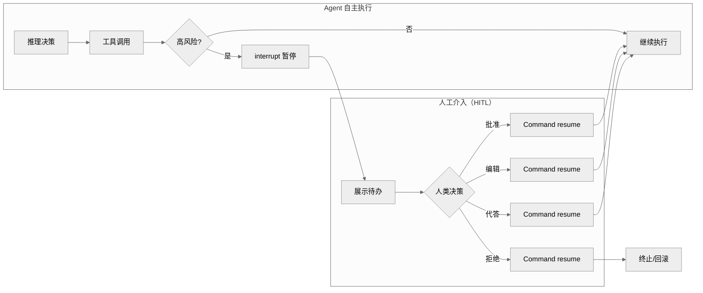
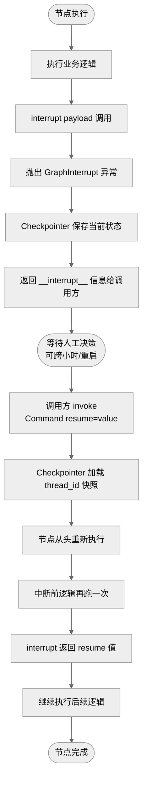
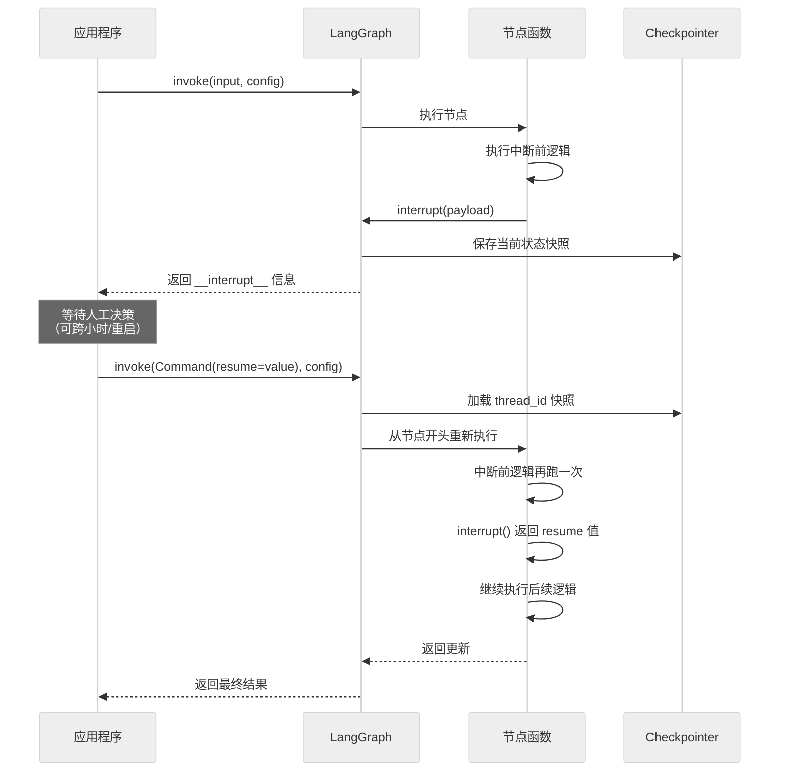

# LangGraph Interrupt 机制面试题集

> 考察 LangGraph `interrupt` 中断机制的核心原理、使用场景、实现方式与最佳实践。
> 本文档共 **8 道题**，覆盖基础、中级、高级三个层次，题型含选择题、简答题、编程实践题。

---

## 目录

- [一、使用背景](#一使用背景)
- [二、概念介绍](#二概念介绍)
- [三、基础题（2题）](#三基础题2题)
- [四、中级题（3题）](#四中级题3题)
- [五、高级题（3题）](#五高级题3题)
- [六、评分总览](#六评分总览)

---

## 一、使用背景

### 1.1 技术背景：Agent 自主运行的"失控风险"

随着大模型驱动 Agent 应用走向生产，**完全无人值守的自主执行**暴露出严重风险。Agent 在推理、工具调用、决策链路中可能出现幻觉、误判或被 Prompt 注入攻击，一旦执行不可逆操作（删库、转账、发邮件、对外发布），后果难以挽回。

**典型风险场景**：

| 场景 | 风险等级 | 自主执行后果 |
|------|----------|--------------|
| 金融转账 | 极高 | 资金损失、合规违规 |
| 数据库删除 | 极高 | 数据永久丢失 |
| 邮件群发 | 高 | 品牌声誉受损 |
| 代码部署 | 高 | 线上事故 |
| 敏感信息查询 | 中 | 隐私泄露 |

### 1.2 解决的核心问题

LangGraph `interrupt` 机制正是为解决上述问题而设计，其核心价值体现在四个方面：

1. **风险拦截**：在关键操作前主动暂停，给人类"最后一道审核"的机会。
2. **信息补充**：Agent 上下文不足时，暂停向人类征集必要信息后继续。
3. **纠错介入**：Agent 推理偏差时，人类可修改状态、编辑工具参数后放行。
4. **多轮协作**：复杂任务中支持多轮人机对话，逐步收敛到正确结果。

### 1.3 在 LangGraph 框架中的应用场景

LangGraph 作为有状态图编排框架，将持久化（Checkpoint）作为一等公民，为 interrupt 提供了天然底座：



**官方推荐的四大 HITL 模式**：

| 模式 | 说明 | 典型用法 |
|------|------|----------|
| **审批（Approve）** | 高风险操作前暂停，人类确认后执行 | 转账、删除、发布 |
| **编辑（Edit）** | 人类修改 Agent 输出或工具参数后放行 | 修订邮件正文、调整参数 |
| **反馈（Reject）** | 人类拒绝并给出原因，Agent 据此重试 | 内容不合规、方向偏差 |
| **对话（Respond）** | 人类直接代答，工具不执行 | "询问用户"类工具 |

### 1.4 为什么不能用 input() 阻塞

传统 Python 用 `input()` 实现人机交互，但在生产环境不可行：

| 问题 | input() | interrupt() |
|------|---------|-------------|
| 进程阻塞 | ✅ 卡死进程 | ❌ 立即释放线程 |
| 服务可用性 | API 服务不可用 | 服务可继续处理其他请求 |
| 状态持久化 | 无 | Checkpoint 自动保存 |
| 跨进程恢复 | 不支持 | 支持跨机器、跨时间恢复 |
| 生产可用 | ❌ 仅限 CLI/Notebook | ✅ 生产级 |

`interrupt()` 通过"保存状态 → 释放线程 → 等待恢复 → 重放节点"的模式，让人机交互可跨越小时甚至天级时间窗口。

---

## 二、概念介绍

### 2.1 interrupt 的定义

`interrupt` 是 LangGraph 提供的**动态中断原语**，允许节点在执行过程中任意位置暂停图执行，将控制权交还给调用方，等待外部输入后从断点继续。

**API 签名**：

```python
from langgraph.types import interrupt

# 在节点内部调用
response = interrupt(payload: Any) -> Any
```

- **入参 `payload`**：任意 JSON 可序列化值，作为中断信息返回给调用方（如待审批内容、询问问题）。
- **返回值**：恢复时通过 `Command(resume=value)` 传入的值，成为 `interrupt()` 调用的返回值。

### 2.2 核心特性

| 特性 | 说明 |
|------|------|
| **动态性** | 运行时在节点内调用，可根据业务逻辑条件触发 |
| **任意位置** | 可放在节点函数的任意代码行，不限于节点边界 |
| **状态持久化** | 触发时自动通过 Checkpointer 保存图状态 |
| **跨时空恢复** | 支持跨进程、跨机器、跨小时/天恢复 |
| **零资源占用** | 中断期间不占用线程/内存，仅占用存储 |
| **resume 注入** | 恢复值作为函数返回值注入节点逻辑 |

### 2.3 工作原理

`interrupt()` 的底层机制可拆解为"暂停 → 保存 → 等待 → 恢复 → 重放"五步：



**关键原理说明**：

1. **异常驱动暂停**：`interrupt()` 本质是抛出 `GraphInterrupt` 异常，框架捕获后保存状态。
2. **快照保存**：Checkpointer 将当前图的完整 State 写入持久化存储，关联 `thread_id`。
3. **零资源等待**：异常抛出后线程立即释放，不阻塞服务，不占内存。
4. **节点重放**：恢复时节点**从头重新执行**，但 `interrupt()` 此次直接返回 resume 值，不再中断。这是为了支持跨进程恢复（无挂起线程可唤醒）。
5. **resume 注入**：`Command(resume=value)` 的 `value` 成为 `interrupt()` 的返回值，节点据此继续后续逻辑。

### 2.4 与相关机制的区别

#### 2.4.1 interrupt() vs interrupt_before / interrupt_after

LangGraph 提供三种中断机制，定位不同：

| 维度 | `interrupt()` | `interrupt_before` | `interrupt_after` |
|------|---------------|---------------------|---------------------|
| **设置时机** | 运行时（节点内） | 编译时（compile 参数） | 编译时（compile 参数） |
| **粒度** | 节点内任意代码行 | 整个节点前 | 整个节点后 |
| **动态性** | ✅ 可条件触发 | ❌ 固定暂停点 | ❌ 固定暂停点 |
| **携带信息** | ✅ 自定义 payload | ❌ 无 | ❌ 无 |
| **resume 注入** | ✅ 值返回节点内 | ❌ 仅继续执行 | ❌ 仅继续执行 |
| **典型场景** | 复杂审批、信息征集 | 固定审批点 | 输出审核 |

**选型建议**：
- 简单固定审批点 → `interrupt_before/after`（声明式、直观）
- 动态条件中断、需传递信息 → `interrupt()`（灵活、功能强）

#### 2.4.2 interrupt() vs Command(goto=)

| 维度 | `interrupt()` | `Command(goto=)` |
|------|---------------|-------------------|
| **目的** | 暂停等待外部输入 | 节点内动态路由跳转 |
| **控制权** | 交还给调用方 | 框架内部流转 |
| **是否暂停** | ✅ 暂停图执行 | ❌ 不暂停，直接跳转 |
| **外部介入** | ✅ 需要 | ❌ 不需要 |

#### 2.4.3 interrupt() vs 异常处理

| 维度 | `interrupt()` | 普通 try/except |
|------|---------------|------------------|
| **性质** | 控制流原语，非错误 | 错误处理机制 |
| **状态保存** | ✅ 自动持久化 | ❌ 需手动处理 |
| **可恢复性** | ✅ 支持恢复 | ❌ 一次性处理 |
| **捕获方式** | 框架统一处理，**不应被 try/except 捕获** | 开发者显式捕获 |

> **重要**：不要用 `try/except` 包裹 `interrupt()`，否则会吞掉 `GraphInterrupt` 异常导致流程异常继续。

### 2.5 最小示例

```python
from langgraph.types import interrupt, Command
from langgraph.checkpoint.memory import MemorySaver

def approval_node(state):
    # 暂停并询问人类
    decision = interrupt({"question": "是否执行此操作？", "amount": state["amount"]})
    # decision 的值来自 Command(resume=...)
    if decision == "yes":
        return {"status": "approved"}
    return {"status": "rejected"}

graph = builder.compile(checkpointer=MemorySaver())
config = {"configurable": {"thread_id": "session-001"}}

# 第1步：触发中断
result = graph.invoke({"amount": 1000}, config)
# result["__interrupt__"] = [{"value": {"question": "...", "amount": 1000}}]

# 第2步：人类批准，恢复执行
result = graph.invoke(Command(resume="yes"), config)
# result = {"amount": 1000, "status": "approved"}
```

---

## 三、基础题（2题）

### Q1：interrupt() 与 interrupt_before/interrupt_after 的区别？（选择题）

**难度**：基础　**类型**：选择题

**题干**：
关于 LangGraph 的三种中断机制，以下说法**错误**的是（　　）

A. `interrupt()` 是运行时在节点内部调用的动态中断
B. `interrupt_before` 在指定节点**执行前**暂停
C. `interrupt_after` 在指定节点**执行后**暂停
D. 三者恢复方式不同，`interrupt()` 用 `Command(resume=)`，`interrupt_before/after` 只能重新 `invoke(input)`

**参考答案**：**D**

**解析**：

| 机制 | 设置时机 | 粒度 | 恢复方式 |
|------|----------|------|----------|
| `interrupt()` | 运行时（节点内） | 节点内特定位置 | `Command(resume=...)` |
| `interrupt_before` | 编译时（compile 参数） | 整个节点前 | `invoke(None, config)` 或 `invoke(Command(resume=), config)` |
| `interrupt_after` | 编译时（compile 参数） | 整个节点后 | 同上 |

- A/B/C 均正确。
- D **错误**：三者恢复方式本质相同，都是基于同一 `thread_id` 重新调用 `invoke`。`interrupt_before/after` 也可用 `Command(resume=)` 恢复（resume 值注入到下一个 `interrupt()` 调用），或直接 `invoke(None, config)` 继续。区别在于 `interrupt()` 能把 resume 值作为函数返回值注入节点内部逻辑。

**评分标准**：选对得 2 分；能说明 D 错误原因加 1 分（满分 3）。

---

### Q2：使用 interrupt 机制必须满足哪两个前提条件？（简答题）

**难度**：基础　**类型**：简答题

**题干**：
请说明使用 LangGraph `interrupt()` 函数必须满足的两个前提条件，并解释为什么。

**参考答案**：

1. **必须配置 Checkpointer**：`interrupt()` 触发时，LangGraph 需将当前图状态持久化保存，以便后续恢复。若无 Checkpointer，中断后状态丢失，无法续跑。
2. **必须在 config 中传入 `thread_id`**：`thread_id` 是 Checkpointer 定位恢复点的唯一标识。恢复时必须使用与中断时相同的 `thread_id`，否则会创建新线程而非续跑。

```python
from langgraph.checkpoint.memory import MemorySaver
from langgraph.types import interrupt

graph = builder.compile(checkpointer=MemorySaver())  # 前提1
config = {"configurable": {"thread_id": "thread-001"}}  # 前提2
graph.invoke(input, config)
```

**评分标准**：两个前提各 1.5 分；解释原因 1 分（满分 4）。

---

## 四、中级题（3题）

### Q3：interrupt() 触发后的完整执行流程是什么？（简答题）

**难度**：中级　**类型**：简答题

**题干**：
请结合流程图，描述从 `interrupt()` 被调用到恢复执行的完整流程，重点说明节点重执行特性。

**参考答案**：



**关键点**：
1. **保存快照**：`interrupt()` 抛出 `GraphInterrupt` 异常前，Checkpointer 自动保存当前状态。
2. **`__interrupt__` 字段**：`interrupt()` 的参数会通过结果的 `__interrupt__` 字段返回给调用方，告知等待内容。
3. **节点重执行**：恢复时节点**从头重新执行**，中断前的代码会再跑一次。这是为了确保无状态资源占用（线程不挂起），支持跨进程、跨机器恢复。
4. **resume 注入**：`Command(resume=...)` 的值成为 `interrupt()` 调用的返回值，节点据此继续执行。

**评分标准**：流程图正确 2 分；节点重执行特性 1 分；resume 注入机制 1 分（满分 4）。

---

### Q4：四种 HITL 决策类型及适用场景？（简答题）

**难度**：中级　**类型**：简答题

**题干**：
LangGraph 官方推荐的人类决策类型有哪四种？请分别说明含义与典型场景，并给出 `Command(resume=)` 的传值示例。

**参考答案**：

| 决策类型 | 含义 | 典型场景 | resume 传值 |
|----------|------|----------|-------------|
| **Approve** | 批准操作原样执行 | 命令无误，放行 | `{"decision": "approve"}` |
| **Reject** | 拒绝并附带理由 | 命令有误，要求重试 | `{"decision": "reject", "reason": "语气过重"}` |
| **Edit** | 修改参数后放行 | 调整邮件主题/正文再发送 | `{"decision": "edit", "args": {...}}` |
| **Respond** | 人工直接代答，不执行工具 | "询问用户"类工具 | `{"decision": "respond", "message": "蓝色"}` |

```python
# 审批通过
graph.invoke(Command(resume={"decision": "approve"}), config)

# 拒绝并说明原因
graph.invoke(Command(resume={"decision": "reject", "reason": "金额超限"}), config)

# 编辑后放行
graph.invoke(Command(resume={
    "decision": "edit",
    "args": {"to": "user@x.com", "subject": "修订后的主题"}
}), config)

# 人工代答
graph.invoke(Command(resume={"decision": "respond", "message": "蓝色"}), config)
```

**评分标准**：四种类型各 0.5 分；场景说明 1 分；代码示例 1 分（满分 5）。

---

### Q5：实现一个退款审批流程（编程题）

**难度**：中级　**类型**：编程实践题

**题干**：
请用 LangGraph 实现一个退款审批流程：用户发起退款 → 暂停等待人工审批 → 批准则执行退款，拒绝则通知用户。要求：
1. 使用 `interrupt()` 展示退款金额与订单号；
2. 使用 `MemorySaver` 持久化；
3. 模拟"批准"和"拒绝"两种恢复路径。

**参考答案**：

```python
from typing import TypedDict
from langgraph.graph import StateGraph, START, END
from langgraph.checkpoint.memory import MemorySaver
from langgraph.types import interrupt, Command


class State(TypedDict):
    order_id: str
    amount: float
    approved: bool


def refund_node(state: State) -> dict:
    # 中断并等待人工审批
    decision = interrupt({
        "question": f"确认退款 ¥{state['amount']} 订单 {state['order_id']}？",
        "options": ["approve", "reject"],
    })

    if decision == "approve":
        print(f"[退款节点] 执行退款 ¥{state['amount']}")
        return {"approved": True}
    else:
        print(f"[退款节点] 退款被拒绝")
        return {"approved": False}


# 构建图
builder = StateGraph(State)
builder.add_node("refund", refund_node)
builder.add_edge(START, "refund")
builder.add_edge("refund", END)
graph = builder.compile(checkpointer=MemorySaver())

config = {"configurable": {"thread_id": "refund-001"}}

# 第1步：发起退款，触发中断
result = graph.invoke({"order_id": "ORD-12345", "amount": 999.0}, config)
print("中断信息:", result.get("__interrupt__"))

# 第2步：人工批准
result = graph.invoke(Command(resume="approve"), config)
print("最终结果:", result)  # {"order_id": "...", "amount": 999.0, "approved": True}

# 若拒绝：
# result = graph.invoke(Command(resume="reject"), config)
```

**关键点**：
1. `interrupt()` 的参数会出现在 `result["__interrupt__"]` 中供前端展示。
2. 恢复时传 `Command(resume="approve")`，该值成为 `interrupt()` 的返回值。
3. `thread_id` 必须一致，否则无法定位中断点。

**评分标准**：图构建正确 1 分；interrupt 使用正确 1.5 分；恢复调用正确 1 分；两种路径完整 1 分（满分 4.5）。

---

## 五、高级题（3题）

### Q6：节点重执行带来的副作用问题如何解决？（简答题）

**难度**：高级　**类型**：简答题

**题干**：
LangGraph 恢复中断时会**重新执行整个节点**，这意味着 `interrupt()` 之前的代码会再次运行。若节点中包含非幂等操作（如扣减库存、发送短信），会导致重复执行。请给出至少 3 种解决方案。

**参考答案**：

**问题本质**：恢复时节点从头跑，`interrupt()` 前的副作用代码会重复执行，可能造成业务损失。

**解决方案**：

| 方案 | 做法 | 适用场景 |
|------|------|----------|
| **幂等设计** | 为每个操作生成唯一 `request_id`，服务端去重 | API 调用、支付、发消息 |
| **前置状态标记** | `interrupt()` 前先写入"已执行"标记到 State，恢复时检查跳过 | 库存扣减、资源创建 |
| **分离副作用节点** | 将副作用放到独立节点，`interrupt()` 放在纯逻辑节点中 | 复杂流程 |
| **Command(update=) 预存结果** | 副作用执行后用 `Command(update={"done": True})` 持久化，恢复时判断 | 需跨节点共享 |

**代码示例（前置状态标记）**：

```python
def refund_node(state: State) -> dict:
    # 恢复时检查是否已扣减
    if not state.get("deducted"):
        deduct_inventory(state["order_id"])  # 幂等保护
        # 用 Command 同时更新状态并继续
        return Command(update={"deducted": True}, goto="refund")

    # 此时 inventory 已扣减，安全中断
    decision = interrupt({"amount": state["amount"]})

    if decision == "approve":
        return {"approved": True}
    else:
        restore_inventory(state["order_id"])  # 拒绝则回滚
        return {"approved": False}
```

**最佳实践**：
1. **`interrupt()` 尽量放在节点开头**，前面不做副作用操作。
2. **副作用操作务必幂等**，即使重跑也不出问题。
3. **关键操作放在 `interrupt()` 之后**，确保只执行一次。

**评分标准**：问题本质 1 分；至少 3 种方案 2 分；代码示例 1 分；最佳实践 1 分（满分 5）。

---

### Q7：多中断场景如何处理？（编程题）

**难度**：高级　**类型**：编程实践题

**题干**：
某 Agent 执行流程中需要**两次人工审批**：先审批"是否发送邮件"，再审批"是否记录日志"。请实现这个多中断流程，并说明恢复时如何分别响应两次中断。

**参考答案**：

```python
from typing import TypedDict
from langgraph.graph import StateGraph, START, END
from langgraph.checkpoint.memory import MemorySaver
from langgraph.types import interrupt, Command


class State(TypedDict):
    email_body: str
    email_sent: bool
    logged: bool


def send_email_node(state: State) -> dict:
    # 第1次中断：审批邮件内容
    decision1 = interrupt({"step": "email", "body": state["email_body"]})
    if decision1 == "approve":
        print(f"[邮件] 已发送: {state['email_body']}")
        return {"email_sent": True}
    else:
        return {"email_sent": False}


def log_node(state: State) -> dict:
    # 第2次中断：审批日志记录
    decision2 = interrupt({"step": "log", "email_sent": state["email_sent"]})
    if decision2 == "approve":
        print("[日志] 已记录")
        return {"logged": True}
    else:
        return {"logged": False}


builder = StateGraph(State)
builder.add_node("send_email", send_email_node)
builder.add_node("log", log_node)
builder.add_edge(START, "send_email")
builder.add_edge("send_email", "log")
builder.add_edge("log", END)
graph = builder.compile(checkpointer=MemorySaver())

config = {"configurable": {"thread_id": "multi-interrupt-001"}}

# 第1次调用：触发第1个中断（邮件审批）
result = graph.invoke({"email_body": "Hello", "email_sent": False, "logged": False}, config)
print("中断1:", result["__interrupt__"])  # [{"value": {"step": "email", ...}}]

# 恢复第1个中断：批准发邮件
result = graph.invoke(Command(resume="approve"), config)
print("中断2:", result["__interrupt__"])  # [{"value": {"step": "log", ...}}]

# 恢复第2个中断：批准记录日志
result = graph.invoke(Command(resume="approve"), config)
print("最终结果:", result)  # {"email_body": "...", "email_sent": True, "logged": True}
```

**关键点**：
1. **顺序恢复**：多中断按图执行顺序依次触发，每次 `invoke(Command(resume=))` 恢复一个。
2. **同一 thread_id**：所有恢复调用必须用相同 `thread_id`。
3. **`__interrupt__` 数组**：结果中的 `__interrupt__` 是数组，每个元素对应一个待处理中断。多中断并行场景可用 ID 匹配 resume 值。
4. **节点重执行影响**：恢复第2个中断时，第1个节点会从头重跑，但其 `interrupt()` 会直接返回之前的 resume 值（LangGraph 内部缓存），不会再次中断。

**评分标准**：双中断图构建 1.5 分；顺序恢复正确 1.5 分；重执行不重复中断说明 1 分（满分 4）。

---

### Q8：生产环境 interrupt 常见坑与最佳实践？（简答题）

**难度**：高级　**类型**：简答题

**题干**：
某团队将 LangGraph 应用上线后发现：中断恢复失败、中断后内存暴涨、节点重试导致重复发邮件。请分析常见坑并给出最佳实践。

**参考答案**：

| 坑 | 现象 | 原因 | 解决方案 |
|----|------|------|----------|
| **忘记配 Checkpointer** | `interrupt()` 报错或不暂停 | 无持久化层无法保存中断点 | 编译时必传 `checkpointer=`，生产用 `PostgresSaver` |
| **thread_id 不一致** | 恢复时创建新线程而非续跑 | `thread_id` 是定位快照的唯一指针 | 恢复调用复用中断时的 `thread_id` |
| **用 try/except 包裹 interrupt** | 中断被吞掉，流程继续执行 | `GraphInterrupt` 被误捕 | 不要在 `interrupt()` 外包 `try/except` |
| **副作用不幂等** | 恢复后重复发邮件/扣款 | 节点重执行导致副作用代码再跑 | 幂等设计 + `interrupt()` 前置 |
| **interrupt 返回复杂对象** | 序列化失败或恢复异常 | 参数必须 JSON 可序列化 | 只传基本类型/字典/列表 |
| **生产用 MemorySaver** | 服务重启后中断状态全丢 | 内存存储不持久 | 改用 `PostgresSaver` / `SqliteSaver` |
| **中断后不释放资源** | 内存持续增长 | 线程长期挂起占用内存 | 中断后不占线程资源（仅占存储），但需定期清理旧 thread |

**最佳实践清单**：

1. **Checkpointer 必配且持久化**：生产环境强制使用 `PostgresSaver`，禁用 `MemorySaver`。
2. **`thread_id` 绑定业务标识**：如 `f"refund-{order_id}"`，便于审计与精确恢复。
3. **`interrupt()` 放节点开头**：前面不做副作用操作，避免重执行问题。
4. **副作用幂等**：所有外部调用（发邮件、扣款）务必带 `request_id` 去重。
5. **参数 JSON 可序列化**：`interrupt(payload)` 的 payload 只用基本类型。
6. **不要捕获 GraphInterrupt**：让框架统一处理中断异常。
7. **定期清理过期 thread**：长期累积的 Checkpoint 占存储，需定时 `delete_thread`。
8. **监控中断时长**：中断超时未恢复需告警，可能是业务流程卡死。

**评分标准**：至少列出 5 个坑 2.5 分；最佳实践至少 5 条 2.5 分（满分 5）。

---

## 六、评分总览

| 题号 | 类型 | 难度 | 考点 | 满分 |
|------|------|------|------|------|
| Q1 | 选择题 | 基础 | 三种中断机制区别 | 3 |
| Q2 | 简答题 | 基础 | interrupt 前提条件 | 4 |
| Q3 | 简答题 | 中级 | interrupt 完整执行流程 | 4 |
| Q4 | 简答题 | 中级 | 四种 HITL 决策类型 | 5 |
| Q5 | 编程题 | 中级 | 退款审批流程实现 | 4.5 |
| Q6 | 简答题 | 高级 | 节点重执行副作用解决 | 5 |
| Q7 | 编程题 | 高级 | 多中断场景处理 | 4 |
| Q8 | 简答题 | 高级 | 生产环境坑与最佳实践 | 5 |

**面试官建议**：
- **初级岗位**：重点考察 Q1、Q2、Q5，要求能使用 interrupt 实现基础审批。
- **中级岗位**：增加 Q3、Q4，要求理解执行流程与决策类型。
- **高级岗位**：重点考察 Q6、Q7、Q8，要求能处理多中断、副作用、生产问题。
